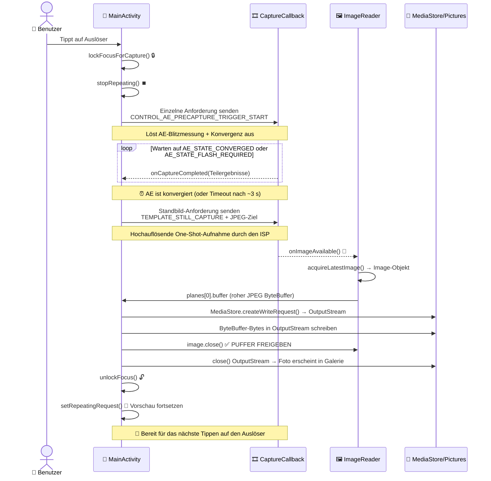

Herzlichen Glückwunsch zum Erreichen des letzten Kapitels von Teil II! Wenn Sie seit Kapitel 5 mitgemacht haben, verfügt Ihre App nun über: Berechtigungsverarbeitung, einen dedizierten Hintergrund-Thread, Kameraaufzählung mit `CameraCharacteristics`, robustes Lebenszyklus-Management zum Öffnen/Schließen über eine `Semaphore` und eine flüssige, korrekt ausgerichtete Live-Vorschau, die über `TextureView` gerendert wird. Was fehlt noch? **Die Möglichkeit, auf eine Schaltfläche zu tippen und ein Foto zu behalten**. Das ist es, was dieses Kapitel liefert.

Am Ende dieses Kapitels wird Ihr Tutorial-Projekt eine wirklich nutzbare Kameraanwendung sein: Tippen Sie auf den Auslöser, die App friert die Vorschau kurz ein (wie es sein sollte, um die Pipeline zu leeren), ein Standbild wird mit ordnungsgemäßer Konvergenz der Belichtungsautomatik aufgenommen, es wird im freigegebenen Pictures-Verzeichnis des Geräts mit korrekten EXIF-Ausrichtungsmetadaten gespeichert und die Vorschau wird automatisch fortgesetzt. Sie können das Foto dann in Google Fotos oder in der App Android Camera Parameters ([GitHub](https://github.com/zoozooll/AndroidCameraParameters), [Google Play](https://play.google.com/store/apps/details?id=com.minininja.cameraparams)) öffnen, um EXIF-Daten, Auflösung und Qualität zu überprüfen.

Der manuelle Aufnahmemodus der App Android Camera Parameters verwendet eine fortgeschrittenere Version der Pipeline, die wir in diesem Kapitel aufbauen: Er führt Multi-Frame-Serienaufnahmen mit benutzerdefinierten ISO-Werten, Belichtungszeiten und Objektivpositionen pro Frame durch – aber alles baut auf denselben Grundlagen von `ImageReader` + `CaptureCallback` auf, die Sie hier lernen werden.

## Warum das Aufnehmen eines Fotos komplexer ist als die Vorschau

Auf den ersten Blick klingt "einfach einen Frame erfassen" einfach – wir haben bereits 60 Vorschau-Frames pro Sekunde, die durch die Sitzung fließen, warum können wir uns nicht einfach einen schnappen? Die Antwort ist, dass Vorschau-Frames und Standbilder grundlegend unterschiedliche Ausgaben sind:

1. **Unterschied in der Auflösung**: Die Vorschau hat ca. 1–2 MP (1080p). Ein Standbild sollte die **maximale** Auflösung des Sensors verwenden (bei modernen Flaggschiffen oft 50+ MP). Sie möchten kein 2-MP-Foto, wenn Ihr Telefon 50 MP liefern kann.
2. **Unterschied in der Belichtung**: `TEMPLATE_PREVIEW` optimiert für eine niedrige Latenz der Bildrate. `TEMPLATE_STILL_CAPTURE` optimiert für Dynamikumfang, Rauschunterdrückung und Farbtreue – das Standbild benötigt die hochwertigste ISP-Verarbeitung, die die Pipeline liefern kann.
3. **3A-Konvergenz**: Bevor ein Foto aufgenommen wird, muss dem Belichtungsautomatik-Algorithmus (AE) der Kamera mitgeteilt werden: "Wir sind im Begriff, ein Standbild aufzunehmen – richte dich auf die aktuelle Szene aus, bringe Belichtung, Weißabgleich und Fokus zur Konvergenz und zünde den Blitz, falls erforderlich." Dies ist die **Precapture-Trigger-Sequenz**. Das Überspringen führt zu Fotos, die im Vergleich zur Vorschau über- oder unterbelichtet sind.
4. **Speicherung und Scoped Storage**: Der Vorschau-Frame wird niemals dauerhaft gespeichert. Das Standbild muss als gültige JPEG-Datei auf die Festplatte geschrieben werden, vom MediaStore indiziert werden, damit Galerie-Apps es sehen können, und ab Android 10 muss dies über die Scoped-Storage-APIs erfolgen (keine willkürlichen `File`-Schreibvorgänge nach `/sdcard/DCIM/`).

Die Standbildaufnahme ist eine **mehrstufige asynchrone Zustandsmaschine**, kein einzelner Aufruf. Das folgende Sequenzdiagramm zeigt die genaue Reihenfolge und das Timing, das Sie implementieren müssen. Überspringen Sie keinen Schritt.



Das Timing des Precapture-Triggers ist entscheidend: Er muss VOR der Standbildaufnahme gesendet werden, und Sie müssen warten, bis die AE konvergiert (oder ein Timeout erreicht), bevor Sie das Standbild auslösen. Wenn Sie das Warten überspringen, verwendet das Foto die Belichtungseinstellungen der Vorschau, die möglicherweise eher auf eine hohe Bildrate als auf Fotoqualität optimiert sind.

## Einführung in ImageReader: Die CPU-zugängliche Datensenke für Frames

In Kapitel 8 haben wir Vorschau-Frames in eine `SurfaceTexture` (GPU-Senke) eingespeist. Für die Standbildaufnahme benötigen wir eine CPU-zugängliche Senke, damit wir die JPEG-Bytes auf die Festplatte schreiben können. Diese Senke ist der `ImageReader`.

Ein `ImageReader` wird wie folgt konstruiert:
```kotlin
val imageReader = ImageReader.newInstance(
    width,           // Pixelbreite der Standbilder (max. Größe aus den Characteristics)
    height,          // Pixelhöhe der Standbilder
    ImageFormat.JPEG,// Format — JPEG für Fotos, RAW_SENSOR für DNG-RAW, YUV_420_888 zur Verarbeitung
    maxImages        // Wie viele Puffer in der Warteschlange reserviert werden sollen (typischerweise 2–5)
)
```

Die vier Parameter erklärt:

1. **width/height**: Verwenden Sie die maximale JPEG-Größe der Kamera aus `SCALER_STREAM_CONFIGURATION_MAP.getOutputSizes(ImageFormat.JPEG)`. Wählen Sie immer die größte Größe für das qualitativ hochwertigste Foto.
2. **ImageFormat.JPEG**: Der Bildsignalprozessor (ISP) durchläuft die vollständige JPEG-Kodierungspipeline (Huffman-Kodierung, Quantisierung, EXIF-Einbettung, JFIF-Header), bevor er den Frame ausliefert. Der `Image.planes[0].buffer` ist eine **vollständige, gültige JPEG-Datei** – keine erneute Kodierung erforderlich; Sie können diese Bytes direkt auf die Festplatte schreiben.
3. **maxImages**: Die Tiefe der internen `BufferQueue`. JPEG-Puffer sind groß (jeweils 5–20 MB). Setzen Sie dies für eine typische Fotoaufnahme auf **2** (einer in Bearbeitung + einer als Reserve). Ein höherer Wert verschwendet RAM; wenn Sie es auf **1** setzen und vergessen, das `Image` zu schließen (`close()`), führt dies zu einem dauerhaften Deadlock der Aufnahme (die Warteschlange kann nie wieder einen leeren Puffer entnehmen).

Der `ImageReader` stellt zwei wichtige API-Bereiche bereit:
- **`imageReader.surface`**: Gibt eine `Surface` zurück, die als Ziel zu CaptureRequests hinzugefügt und in die Liste der Ausgabe-Surfaces der `CameraCaptureSession` aufgenommen werden kann.
- **`imageReader.setOnImageAvailableListener(listener, handler)`**: Registriert einen Callback, der bei **jedem neuen Frame** ausgelöst wird, der an diesen Reader geliefert wird. Innerhalb dieses Callbacks rufen Sie `acquireLatestImage()` (oder `acquireNextImage()`) auf, um das `Image`-Objekt zu erhalten.

### ⚠️ WICHTIGE REGEL: Schließen Sie das Image immer

Wenn Sie `acquireLatestImage()` aufrufen und `image.close()` **nicht** aufrufen, wird dieser Puffer **dauerhaft aus dem Pool entfernt**. Sobald `maxImages` Puffer "geleakt" sind, wird der `OnImageAvailableListener` FÜR IMMER nicht mehr ausgelöst (die Warteschlange hat keine leeren Puffer mehr, in die sie entnehmen kann, sodass keine neuen Frames ankommen können). Verwenden Sie immer einen try/finally-Block:

```kotlin
val image = imageReader.acquireLatestImage()
try {
    // Image-Bytes hier verwenden
} finally {
    image.close() // IMMER. Keine Ausnahmen.
}
```

Dies ist der häufigste Fehler in Kapitel 9: Die Aufnahme funktioniert einmal und danach nie wieder, bis die App neu gestartet wird.

## Die Precapture-AE-Zustandsmaschine

Das 3A-System (Auto-Exposure / Auto-Focus / Auto-White-Balance) von Camera2 ist eine Zustandsmaschine pro Frame, die über den Anforderungsschlüssel `CONTROL_AE_PRECAPTURE_TRIGGER` gesteuert wird. Der Ablauf:

1. **Wiederholte Vorschau stoppen**: `captureSession.stopRepeating()`. Wir möchten nicht, dass sich Vorschau-Frames mit der Standbild-Pipeline überschneiden.
2. **Precapture-Trigger auslösen**: Erstellen Sie einen einzelnen `CaptureRequest`, der `CONTROL_AE_PRECAPTURE_TRIGGER` auf `START` setzt. Übermitteln Sie ihn mit `captureSession.capture()` (NICHT `setRepeatingRequest` – es ist ein One-Shot-Befehl, kein kontinuierlicher).
3. **Auf Konvergenz warten**: Überprüfen Sie im `CaptureCallback.onCaptureCompleted()` für den Precapture-Trigger (und nachfolgende Frames) den `CaptureResult.CONTROL_AE_STATE`. Wir warten auf einen der folgenden Zustände:
   - `CONTROL_AE_STATE_CONVERGED` ✓ (AE ist zufrieden, Szene ist korrekt eingemessen)
   - `CONTROL_AE_STATE_FLASH_REQUIRED` ✓ (AE hat festgestellt, dass ein Blitz erforderlich ist, der Blitz ist nun geladen)
   - `CONTROL_AE_STATE_LOCKED` ✓ (falls der Benutzer die AE zuvor manuell gesperrt hat)
   - Ein 3000-ms-Timeout tritt ein ✗ (Sicherheitsventil – einige fehlerhafte Geräte signalisieren niemals Konvergenz).
4. **Standbildaufnahme auslösen**: Erstellen Sie eine `TEMPLATE_STILL_CAPTURE`-Anforderung, die auf die Surface des `ImageReader` abzielt. Übermitteln Sie sie mit `captureSession.capture()`.
5. **Bild trifft ein**: `OnImageAvailableListener.onImageAvailable()` wird ausgelöst → JPEG-Bytes abrufen → auf Festplatte speichern.
6. **Entsperren und fortsetzen**: Erstellen Sie eine Anforderung, die den AE-Trigger abbricht (`CONTROL_AE_PRECAPTURE_TRIGGER_CANCEL`), rufen Sie `unlockFocus()` für AF/AWB auf und rufen Sie dann `setRepeatingRequest(previewRequest, ...)` auf, um die Vorschau neu zu starten.

Jeder der 6 Schritte entspricht einem Zustand in unserem Enum `CaptureStateMachine`, das wir im Code definieren werden.

## Scoped Storage und MediaStore (Android 10+)

Ab Android 10 (API 29) können Apps nicht mehr beliebig Dateien in das freigegebene Verzeichnis `/sdcard/Pictures` unter Verwendung der `java.io.File`-API schreiben – dies wirft eine `FileNotFoundException` mit "Permission denied", selbst wenn Sie die Berechtigung `WRITE_EXTERNAL_STORAGE` besitzen. Der korrekte, zukunftssichere Ansatz verwendet den Content-Provider `MediaStore`:

1. **Bereiten Sie ein `ContentValues`-Bundle vor**: MIME-Typ (`image/jpeg`), relativer Pfad (`Pictures/Camera2Tutorial/` – das System erstellt das Verzeichnis bei Bedarf), Anzeigename (mit Zeitstempel).
2. **Fügen Sie eine ausstehende Zeile ein**: `contentResolver.insert(MediaStore.Images.Media.EXTERNAL_CONTENT_URI, values)` gibt eine `Uri` zurück.
3. **Öffnen Sie einen OutputStream für die Uri**: `contentResolver.openOutputStream(uri)` liefert Ihnen einen Stream, der durch einen `ParcelFileDescriptor` unterstützt wird.
4. **Schreiben Sie die Bytes und schließen Sie den Stream**: Der JPEG-ByteBuffer aus dem `ImageReader` wird direkt in den OutputStream kopiert.
5. **Machen Sie die Datei für Galerie-Apps sichtbar**: Optional – fügen Sie `IS_PENDING=0` in den Werten hinzu, wenn Sie ein Muster für ausstehende Schreibvorgänge verwendet haben (wir verwenden den einfacheren Ansatz `IS_PENDING=1` und dann ein Update für maximale Kompatibilität).

Bei API 28 und niedriger greifen wir auf den traditionellen Pfad `File(Environment.getExternalStoragePublicDirectory(Environment.DIRECTORY_PICTURES), ...)` mit direktem `FileOutputStream` zurück, was immer noch funktioniert, da dort Legacy-Speichermodelle gelten.

## Vollständiger Code für Kapitel 9 — Fotoaufnahme

Hier ist die vollständige `MainActivity.kt`, die alles oben Genannte integriert: den `ImageReader`, die 6-stufige Precapture-AE-Zustandsmaschine, den Auslöser, `MediaStore`/Legacy-Speicherung und den Abbau beider Sitzungs-Surfaces (Vorschau + JPEG). Wir aktualisieren auch die Layout-XML für den Auslöser.

### Aktualisiertes Layout (activity_main.xml)

```xml
<?xml version="1.0" encoding="utf-8"?>
<FrameLayout xmlns:android="http://schemas.android.com/apk/res/android"
    xmlns:tools="http://schemas.android.com/tools"
    xmlns:app="http://schemas.android.com/apk/res-auto"
    android:layout_width="match_parent"
    android:layout_height="match_parent">

    <TextureView
        android:id="@+id/textureView"
        android:layout_width="match_parent"
        android:layout_height="match_parent"
        android:layout_gravity="center" />

    <TextView
        android:id="@+id/statusTextView"
        android:layout_width="wrap_content"
        android:layout_height="wrap_content"
        android:layout_gravity="top|center_horizontal"
        android:layout_marginTop="16dp"
        android:background="#80000000"
        android:padding="8dp"
        android:textColor="#FFFFFFFF"
        android:textSize="12sp"
        tools:text="Initialisiere..." />

    <com.google.android.material.floatingactionbutton.FloatingActionButton
        android:id="@+id/shutterButton"
        android:layout_width="wrap_content"
        android:layout_height="wrap_content"
        android:layout_gravity="bottom|center_horizontal"
        android:layout_marginBottom="48dp"
        android:contentDescription="Foto aufnehmen"
        android:src="@android:drawable/ic_menu_camera"
        app:fabSize="normal" />

</FrameLayout>
```

Falls Sie keine Material Components haben, ersetzen Sie den FAB durch einen `Button` mit `layout_gravity="bottom|center_horizontal"`.

### Vollständige Kotlin Activity

```kotlin
package com.example.camera2tutorial

import android.Manifest
import android.content.ContentValues
import android.content.Context
import android.content.pm.PackageManager
import android.graphics.ImageFormat
import android.graphics.Matrix
import android.graphics.RectF
import android.graphics.SurfaceTexture
import android.hardware.camera2.CameraAccessException
import android.hardware.camera2.CameraCharacteristics
import android.hardware.camera2.CameraCaptureSession
import android.hardware.camera2.CameraDevice
import android.hardware.camera2.CameraManager
import android.hardware.camera2.CaptureRequest
import android.hardware.camera2.CaptureResult
import android.hardware.camera2.TotalCaptureResult
import android.hardware.camera2.params.StreamConfigurationMap
import android.media.Image
import android.media.ImageReader
import android.os.Build
import android.os.Bundle
import android.os.Environment
import android.os.Handler
import android.os.HandlerThread
import android.provider.MediaStore
import android.util.Log
import android.util.Size
import android.view.Surface
import android.view.TextureView
import android.view.View
import android.view.WindowManager
import android.widget.TextView
import android.widget.Toast
import androidx.appcompat.app.AppCompatActivity
import androidx.core.app.ActivityCompat
import androidx.core.content.ContextCompat
import com.google.android.material.floatingactionbutton.FloatingActionButton
import java.io.File
import java.io.FileOutputStream
import java.io.OutputStream
import java.text.SimpleDateFormat
import java.util.Collections
import java.util.Date
import java.util.Locale
import java.util.concurrent.Semaphore
import java.util.concurrent.TimeUnit
import kotlin.math.max
import kotlin.math.min

class MainActivity : AppCompatActivity() {

    // UI
    private lateinit var textureView: TextureView
    private lateinit var statusTextView: TextView
    private lateinit var shutterButton: FloatingActionButton

    // Threading
    private lateinit var backgroundThread: HandlerThread
    private lateinit var backgroundHandler: Handler

    // Kamera-Pipeline-Zustand
    private lateinit var cameraManager: CameraManager
    private var cameraDevice: CameraDevice? = null
    private var captureSession: CameraCaptureSession? = null
    private var previewRequestBuilder: CaptureRequest.Builder? = null
    private var previewRequest: CaptureRequest? = null
    private var selectedCameraId: String? = null
    private var sensorOrientation = 0
    private var jpegOrientation = 0
    private lateinit var previewSize: Size
    private lateinit var jpegSize: Size

    // 🆕 Senke für Standbildaufnahmen
    private lateinit var imageReader: ImageReader

    // Nebenläufigkeit
    private val cameraOpenCloseLock = Semaphore(1)

    // 🆕 Zustandsmaschine für Aufnahmen
    private enum class CaptureState {
        IDLE,                 // Vorschau läuft normal
        WAITING_AE_PRECAPTURE, // AE-Precapture-Trigger abgefeuert, warte auf Konvergenz
        WAITING_AF_LOCK,      // (optional) wird verwendet, wenn wir auch einen AF-Trigger hinzufügen
        WAITING_STILL_CAPTURE,// Standbildaufnahme übermittelt, warte auf ImageReader
        PICTURE_SAVED         // Foto gespeichert, kurz vor der Rückkehr zu IDLE
    }
    private var captureState: CaptureState = CaptureState.IDLE
    private val precaptureTimeoutHandler: Handler by lazy { Handler(mainLooper) }
    private val precaptureTimeoutRunnable = Runnable {
        if (captureState == CaptureState.WAITING_AE_PRECAPTURE) {
            Log.w(TAG, "⏰ Precapture-AE-Timeout — fahre trotzdem mit Aufnahme fort")
            captureStillPicture()
        }
    }

    // -------------------------------------------------------------------------
    // Lebenszyklus + UI-Verknüpfung
    // -------------------------------------------------------------------------
    override fun onCreate(savedInstanceState: Bundle?) {
        super.onCreate(savedInstanceState)
        setContentView(R.layout.activity_main)

        textureView = findViewById(R.id.textureView)
        statusTextView = findViewById(R.id.statusTextView)
        shutterButton = findViewById(R.id.shutterButton)
        statusTextView.text = "Initialisiere..."

        shutterButton.setOnClickListener { takePicture() }

        if (allPermissionsGranted()) {
            initializeCameraManager()
        } else {
            val allPerms = REQUIRED_PERMISSIONS + WRITE_EXTERNAL_IF_NEEDED
            ActivityCompat.requestPermissions(this, allPerms, REQUEST_CODE_PERMISSIONS)
        }
    }

    override fun onResume() {
        super.onResume()
        startBackgroundThread()
        if (allPermissionsGranted()) {
            if (!this::cameraManager.isInitialized) initializeCameraManager()
            if (textureView.isAvailable) openCameraAndStartSession(textureView.width, textureView.height)
        }
    }

    override fun onPause() {
        closeEverything()
        stopBackgroundThread()
        super.onPause()
    }

    private fun startBackgroundThread() {
        backgroundThread = HandlerThread("Camera2Background").apply { start() }
        backgroundHandler = Handler(backgroundThread.looper)
    }

    private fun stopBackgroundThread() {
        backgroundThread.quitSafely()
        try { backgroundThread.join(1000) } catch (_: InterruptedException) {}
    }

    // -------------------------------------------------------------------------
    // Kapitel 6 gekürzt: Kameraentdeckung
    // -------------------------------------------------------------------------
    data class CamInfo(val id: String, val facing: Int?, val hw: Int?, val chars: CameraCharacteristics)

    private fun initializeCameraManager() {
        cameraManager = getSystemService(Context.CAMERA_SERVICE) as CameraManager
        val cams = mutableListOf<CamInfo>()
        for (id in cameraManager.cameraIdList) {
            val chars = try { cameraManager.getCameraCharacteristics(id) } catch (_: Exception) { continue }
            cams += CamInfo(
                id,
                chars[CameraCharacteristics.LENS_FACING],
                chars[CameraCharacteristics.INFO_SUPPORTED_HARDWARE_LEVEL],
                chars
            )
        }
        val best = cams.sortedWith(
            compareByDescending<CamInfo> { it.facing == CameraCharacteristics.LENS_FACING_BACK }
                .thenByDescending { it.hw ?: -1 }).first()
        selectedCameraId = best.id
        sensorOrientation = best.chars[CameraCharacteristics.SENSOR_ORIENTATION] ?: 90

        textureView.surfaceTextureListener = object : TextureView.SurfaceTextureListener {
            override fun onSurfaceTextureAvailable(s: SurfaceTexture, w: Int, h: Int) {
                openCameraAndStartSession(w, h)
            }
            override fun onSurfaceTextureSizeChanged(s: SurfaceTexture, w: Int, h: Int) {
                if (this@MainActivity::previewSize.isInitialized) configureTransform(w, h)
            }
            override fun onSurfaceTextureDestroyed(s: SurfaceTexture): Boolean = true
            override fun onSurfaceTextureUpdated(s: SurfaceTexture) {}
        }
    }

    // -------------------------------------------------------------------------
    // Kapitel 7 gekürzt: openCamera
    // -------------------------------------------------------------------------
    private val deviceCallback = object : CameraDevice.StateCallback() {
        override fun onOpened(cam: CameraDevice) {
            cameraOpenCloseLock.release()
            cameraDevice = cam
            createCaptureSession()
        }
        override fun onDisconnected(cam: CameraDevice) {
            cameraOpenCloseLock.release()
            cameraDevice?.close(); cameraDevice = null
        }
        override fun onError(cam: CameraDevice, err: Int) {
            cameraOpenCloseLock.release()
            cameraDevice?.close(); cameraDevice = null
            Toast.makeText(this@MainActivity, "Kamerafehler $err", Toast.LENGTH_LONG).show()
        }
    }

    // -------------------------------------------------------------------------
    // Sitzungserstellung (jetzt mit 2 Surfaces: Vorschau + JPEG)
    // -------------------------------------------------------------------------
    private fun openCameraAndStartSession(vw: Int, vh: Int) {
        val camId = selectedCameraId ?: return
        if (checkSelfPermission(Manifest.permission.CAMERA) != PackageManager.PERMISSION_GRANTED) return
        if (!cameraOpenCloseLock.tryAcquire(2500, TimeUnit.MILLISECONDS)) {
            Toast.makeText(this, "Zeitüberschreitung bei Kamerasperre", Toast.LENGTH_SHORT).show(); return
        }
        val chars = cameraManager.getCameraCharacteristics(camId)

        // Vorschaugröße
        previewSize = choosePreviewSize(chars, vw, vh)
        // 🆕 Größe für Standbild-JPEG (MAXIMAL verfügbar für beste Qualität)
        jpegSize = chooseMaxJpegSize(chars)

        // JPEG-Ausrichtungs-Tag = Sensorausrichtung gedreht um die Geräterotation
        jpegOrientation = computeJpegOrientation()

        // 🆕 ImageReader erstellen: width=jpegW, height=jpegH, format=JPEG, 2 Puffer
        imageReader = ImageReader.newInstance(
            jpegSize.width,
            jpegSize.height,
            ImageFormat.JPEG,
            2
        )
        // 🆕 Listener für verfügbare JPEG-Frames einhängen
        imageReader.setOnImageAvailableListener(onJpegAvailableListener, backgroundHandler)

        configureTransform(vw, vh)
        textureView.surfaceTexture!!.setDefaultBufferSize(previewSize.width, previewSize.height)
        statusTextView.text = "Sitzung: Vorschau ${previewSize} • JPEG ${jpegSize}"

        try { cameraManager.openCamera(camId, deviceCallback, backgroundHandler) }
        catch (e: CameraAccessException) { cameraOpenCloseLock.release() }
    }

    private fun createCaptureSession() {
        val cam = cameraDevice ?: return
        val st = textureView.surfaceTexture ?: return
        val previewSurface = Surface(st)
        val jpegSurface = imageReader.surface
        val outputs = listOf(previewSurface, jpegSurface)

        previewRequestBuilder =
            cam.createCaptureRequest(CameraDevice.TEMPLATE_PREVIEW).apply { addTarget(previewSurface) }

        cam.createCaptureSession(outputs, object : CameraCaptureSession.StateCallback() {
            override fun onConfigured(session: CameraCaptureSession) {
                captureSession = session
                previewRequest = previewRequestBuilder!!.build()
                captureState = CaptureState.IDLE
                shutterButton.isEnabled = true
                statusTextView.text = "🎥 Vorschau — Tippen zum Aufnehmen"
                session.setRepeatingRequest(previewRequest!!, captureCallback, backgroundHandler)
            }
            override fun onConfigureFailed(session: CameraCaptureSession) {
                Toast.makeText(this@MainActivity, "Sitzung fehlgeschlagen", Toast.LENGTH_LONG).show()
            }
        }, backgroundHandler)
    }

    // -------------------------------------------------------------------------
    // 🆕 CaptureCallback + takePicture-Zustandsmaschine
    // -------------------------------------------------------------------------
    private val captureCallback = object : CameraCaptureSession.CaptureCallback() {
        override fun onCaptureStarted(
            session: CameraCaptureSession,
            request: CaptureRequest,
            timestamp: Long,
            frameNumber: Long
        ) {}

        override fun onCaptureProgressed(
            session: CameraCaptureSession,
            request: CaptureRequest,
            partialResult: CaptureResult
        ) {
            process(partialResult)
        }

        override fun onCaptureCompleted(
            session: CameraCaptureSession,
            request: CaptureRequest,
            result: TotalCaptureResult
        ) {
            process(result)
        }

        /**
         * Wird für jeden Teil- und fertigen Frame aufgerufen.
         * Wenn wir darauf warten, dass die AE-Precapture-Konvergenz erreicht wird, prüfen wir hier AE_STATE.
         */
        private fun process(result: CaptureResult) {
            when (captureState) {
                CaptureState.WAITING_AE_PRECAPTURE -> {
                    val aeState = result[CaptureResult.CONTROL_AE_STATE]
                    Log.d(TAG, "AE_STATE = $aeState")
                    if (aeState == null) return
                    when (aeState) {
                        CaptureResult.CONTROL_AE_STATE_CONVERGED,
                        CaptureResult.CONTROL_AE_STATE_FLASH_REQUIRED,
                        CaptureResult.CONTROL_AE_STATE_LOCKED -> {
                            // ✅ AE ist bereit — Timeout abbrechen und Standbildaufnahme auslösen
                            precaptureTimeoutHandler.removeCallbacks(precaptureTimeoutRunnable)
                            captureStillPicture()
                        }
                        // sonst → CONTROL_AE_STATE_PRECAPTURE / SEARCHING / INACTIVE → weiter warten
                    }
                }
                else -> { /* In IDLE oder anderen Zuständen ist keine Verfolgung nötig */ }
            }
        }
    }

    /** Öffentlicher Einstiegspunkt für den Klick auf den Auslöser. */
    fun takePicture() {
        if (cameraDevice == null || captureSession == null) return
        if (captureState != CaptureState.IDLE) {
            Log.d(TAG, "⚠️ Aufnahme läuft — ignoriere doppeltes Tippen")
            return
        }
        shutterButton.isEnabled = false
        statusTextView.text = "📸 Belichtung wird fixiert..."
        lockFocusAndFirePrecaptureTrigger()
    }

    /**
     * Schritt 1–3: Wiederholte Vorschau stoppen, AE-Precapture-Trigger senden, 3-s-Timeout starten.
     * Die Methode captureCallback.process() überwacht AE_STATE und ruft captureStillPicture()
     * auf, wenn die Konvergenz erreicht ist.
     */
    private fun lockFocusAndFirePrecaptureTrigger() {
        val session = captureSession ?: return
        try {
            captureState = CaptureState.WAITING_AE_PRECAPTURE

            // Eine Anforderung erstellen, die identisch mit der Vorschau ist, aber mit AE-Precapture-Trigger = START
            previewRequestBuilder?.apply {
                set(
                    CaptureRequest.CONTROL_AE_PRECAPTURE_TRIGGER,
                    CaptureRequest.CONTROL_AE_PRECAPTURE_TRIGGER_START
                )
            }

            // Kontinuierliche Vorschau-Frames pausieren — capture() verwenden, um EINEN Trigger-Frame zu senden
            session.stopRepeating()
            session.capture(previewRequestBuilder!!.build(), captureCallback, backgroundHandler)

            // Sicherheits-Timeout (3 Sekunden): Einige Geräte signalisieren niemals AE-Konvergenz
            precaptureTimeoutHandler.postDelayed(precaptureTimeoutRunnable, 3000)

        } catch (e: CameraAccessException) {
            Log.e(TAG, "Precapture-Trigger fehlgeschlagen", e)
            unlockFocusAndResumePreview()
        }
    }

    /**
     * Schritt 4: AE konvergiert (oder Timeout). Die einzelne TEMPLATE_STILL_CAPTURE-Anforderung
     * senden, die auf die ImageReader-Surface abzielt → JPEG-Bytes treffen über onJpegAvailableListener ein.
     */
    private fun captureStillPicture() {
        val cam = cameraDevice ?: return
        val session = captureSession ?: return
        captureState = CaptureState.WAITING_STILL_CAPTURE
        statusTextView.text = "📷 Foto wird aufgenommen..."

        try {
            // 🆕 TEMPLATE_STILL_CAPTURE verwenden — hochwertigste ISP-Pipeline
            val stillBuilder = cam.createCaptureRequest(CameraDevice.TEMPLATE_STILL_CAPTURE)
            stillBuilder.addTarget(imageReader.surface)
            stillBuilder.set(CaptureRequest.JPEG_ORIENTATION, jpegOrientation)
            stillBuilder.set(CaptureRequest.JPEG_QUALITY, 95.toByte()) // 1–100 Qualität

            val stillCallback = object : CameraCaptureSession.CaptureCallback() {
                override fun onCaptureCompleted(
                    s: CameraCaptureSession,
                    req: CaptureRequest,
                    res: TotalCaptureResult
                ) {
                    Log.d(TAG, "📨 Metadaten der Standbildaufnahme geliefert")
                    // Hinweis: Die eigentlichen JPEG-Bytes treffen über den onJpegAvailableListener ein, nicht hier.
                }
            }

            session.stopRepeating()
            session.capture(stillBuilder.build(), stillCallback, backgroundHandler)

        } catch (e: CameraAccessException) {
            Log.e(TAG, "Standbildaufnahme fehlgeschlagen", e)
            unlockFocusAndResumePreview()
        }
    }

    /**
     * Schritt 5: JPEG-Bytes im ImageReader verfügbar. Aktuelles Image abrufen, seine Bytes
     * in den MediaStore (oder Legacy-Datei) schreiben, DAS IMAGE SCHLIESSEN, dann Vorschau fortsetzen.
     */
    private val onJpegAvailableListener = ImageReader.OnImageAvailableListener { reader ->
        var image: Image? = null
        try {
            image = reader.acquireLatestImage()
            if (image == null) {
                Log.w(TAG, "acquireLatestImage gab null zurück — Puffer verworfen")
                return@OnImageAvailableListener
            }
            val buffer = image.planes[0].buffer
            val bytes = ByteArray(buffer.remaining())
            buffer.get(bytes)

            val savedUri = savePhotoToStorage(bytes)
            captureState = CaptureState.PICTURE_SAVED

            // Auf den Haupt-Thread wechseln für UI-Updates / Toasts
            runOnUiThread {
                shutterButton.isEnabled = true
                if (savedUri != null) {
                    statusTextView.text = "✅ Gespeichert! Uri=$savedUri"
                    Toast.makeText(
                        this@MainActivity,
                        "Foto gespeichert: $savedUri",
                        Toast.LENGTH_LONG
                    ).show()
                } else {
                    statusTextView.text = "❌ Speichern fehlgeschlagen"
                    Toast.makeText(
                        this@MainActivity,
                        "Foto konnte nicht gespeichert werden — Logcat prüfen",
                        Toast.LENGTH_LONG
                    ).show()
                }
            }
        } catch (e: Exception) {
            Log.e(TAG, "onJpegAvailable-Fehler", e)
        } finally {
            image?.close() // ✅ IMAGE IMMER SCHLIESSEN — keine Ausnahmen!
        }

        // Schritt 6: Vorschau unabhängig vom Erfolg/Fehler des Speicherns fortsetzen
        runOnUiThread { unlockFocusAndResumePreview() }
    }

    /**
     * Schritt 6: AE-Precapture-Trigger abbrechen, Fokus-Sperren aufheben, wiederholte Vorschau neu starten.
     */
    private fun unlockFocusAndResumePreview() {
        val session = captureSession ?: return
        try {
            previewRequestBuilder?.apply {
                set(
                    CaptureRequest.CONTROL_AF_TRIGGER,
                    CaptureRequest.CONTROL_AF_TRIGGER_CANCEL
                )
                set(
                    CaptureRequest.CONTROL_AE_PRECAPTURE_TRIGGER,
                    CaptureRequest.CONTROL_AE_PRECAPTURE_TRIGGER_CANCEL
                )
            }
            session.capture(previewRequestBuilder!!.build(), captureCallback, backgroundHandler)

            captureState = CaptureState.IDLE
            precaptureTimeoutHandler.removeCallbacks(precaptureTimeoutRunnable)
            session.setRepeatingRequest(previewRequest!!, captureCallback, backgroundHandler)

            if (statusTextView.text.startsWith("📸") ||
                statusTextView.text.startsWith("📷")) {
                statusTextView.text = "🎥 Vorschau — Tippen zum Aufnehmen"
            }
        } catch (e: CameraAccessException) {
            Log.e(TAG, "Vorschau konnte nach Standbildaufnahme nicht fortgesetzt werden", e)
        }
    }

    // -------------------------------------------------------------------------
    // 🆕 savePhotoToStorage: MediaStore (API 29+) + Legacy-Datei (API 28-)
    // -------------------------------------------------------------------------
    private fun savePhotoToStorage(jpegBytes: ByteArray): android.net.Uri? {
        val timestamp = SimpleDateFormat("yyyyMMdd_HHmmss", Locale.US).format(Date())
        val displayName = "IMG_Camera2Tutorial_$timestamp"
        val relativeDir = "${Environment.DIRECTORY_PICTURES}/Camera2Tutorial"

        return if (Build.VERSION.SDK_INT >= Build.VERSION_CODES.Q) {
            // ✅ Scoped Storage über MediaStore (keine Berechtigung WRITE_EXTERNAL_STORAGE nötig!)
            val values = ContentValues().apply {
                put(MediaStore.Images.Media.DISPLAY_NAME, "$displayName.jpg")
                put(MediaStore.Images.Media.MIME_TYPE, "image/jpeg")
                put(MediaStore.Images.Media.RELATIVE_PATH, relativeDir)
                put(MediaStore.Images.Media.IS_PENDING, 1) // Während des Schreibens als ausstehend markieren
            }
            val resolver = contentResolver
            val uri = resolver.insert(MediaStore.Images.Media.EXTERNAL_CONTENT_URI, values)
                ?: return null
            try {
                resolver.openOutputStream(uri)?.use { os -> os.write(jpegBytes) }
                // PENDING-Flag löschen, damit Galerie-Apps es jetzt sehen können
                values.clear()
                values.put(MediaStore.Images.Media.IS_PENDING, 0)
                resolver.update(uri, values, null, null)
                Log.d(TAG, "✅ MediaStore gespeichert: $uri")
                uri
            } catch (e: Exception) {
                Log.e(TAG, "Schreiben in MediaStore fehlgeschlagen", e)
                resolver.delete(uri, null, null) // Halb geschriebene Datei bereinigen
                null
            }
        } else {
            // 🕰️ Legacy-Pfad: Direktes Schreiben in den öffentlichen Pictures-Ordner
            val dir = File(Environment.getExternalStoragePublicDirectory(Environment.DIRECTORY_PICTURES), "Camera2Tutorial")
            if (!dir.exists()) dir.mkdirs()
            val file = File(dir, "$displayName.jpg")
            try {
                FileOutputStream(file).use { os -> os.write(jpegBytes) }
                // Datei indizieren, damit Galerie-Apps sie sofort entdecken
                val values = ContentValues().apply {
                    put(MediaStore.Images.Media.DATA, file.absolutePath)
                    put(MediaStore.Images.Media.MIME_TYPE, "image/jpeg")
                    put(MediaStore.Images.Media.DISPLAY_NAME, displayName)
                }
                contentResolver.insert(MediaStore.Images.Media.EXTERNAL_CONTENT_URI, values)
                android.net.Uri.fromFile(file)
            } catch (e: Exception) {
                Log.e(TAG, "Legacy-Dateizugriff fehlgeschlagen", e)
                null
            }
        }
    }

    // -------------------------------------------------------------------------
    // Helfer für Größen und Ausrichtung
    // -------------------------------------------------------------------------
    private fun choosePreviewSize(chars: CameraCharacteristics, vw: Int, vh: Int): Size {
        val map = chars[CameraCharacteristics.SCALER_STREAM_CONFIGURATION_MAP]!!
        val viewAspect = max(vw, vh).toDouble() / min(vw, vh)
        val choices = map.getOutputSizes(SurfaceTexture::class.java).toList()
        val matches = choices.filter {
            val a = max(it.width, it.height).toDouble() / min(it.width, it.height)
            kotlin.math.abs(a - viewAspect) < 0.02 && (it.width * it.height) <= 1920 * 1080 * 2
        }
        return (matches.ifEmpty { choices }).maxByOrNull { it.width * it.height }!!
    }

    private fun chooseMaxJpegSize(chars: CameraCharacteristics): Size {
        val map = chars[CameraCharacteristics.SCALER_STREAM_CONFIGURATION_MAP]!!
        val choices = map.getOutputSizes(ImageFormat.JPEG).toList()
        val max = choices.maxByOrNull { it.width * it.height }!!
        Log.d(TAG, "Max. JPEG-Größe gewählt: ${max.width}×${max.height} " +
            "(aus ${choices.size} Größen)")
        return max
    }

    private fun computeJpegOrientation(): Int {
        val deviceRotation = (getSystemService(Context.WINDOW_SERVICE) as WindowManager)
            .defaultDisplay.rotation
        val facing = try {
            selectedCameraId?.let {
                cameraManager.getCameraCharacteristics(it)[CameraCharacteristics.LENS_FACING]
            }
        } catch (_: Exception) { CameraCharacteristics.LENS_FACING_BACK }
        val frontFacing = facing == CameraCharacteristics.LENS_FACING_FRONT

        return when (deviceRotation) {
            Surface.ROTATION_0 -> if (frontFacing) (360 - sensorOrientation) % 360 else sensorOrientation
            Surface.ROTATION_90 -> if (frontFacing) (360 - (sensorOrientation + 270) % 360) % 360 else (sensorOrientation + 270) % 360
            Surface.ROTATION_180 -> if (frontFacing) (360 - (sensorOrientation + 180) % 360) % 360 else (sensorOrientation + 180) % 360
            Surface.ROTATION_270 -> if (frontFacing) (360 - (sensorOrientation + 90) % 360) % 360 else (sensorOrientation + 90) % 360
            else -> 0
        }
    }

    private fun configureTransform(vw: Int, vh: Int) {
        val rotation = (getSystemService(Context.WINDOW_SERVICE) as WindowManager).defaultDisplay.rotation
        val matrix = Matrix()
        val vr = RectF(0f, 0f, vw.toFloat(), vh.toFloat())
        val br = RectF(0f, 0f, previewSize.height.toFloat(), previewSize.width.toFloat())
        val cx = vr.centerX(); val cy = vr.centerY()
        br.offset(cx - br.centerX(), cy - br.centerY())
        matrix.setRectToRect(vr, br, Matrix.ScaleToFit.FILL)
        val scale = max(vh.toFloat() / previewSize.height, vw.toFloat() / previewSize.width)
        matrix.postScale(scale, scale, cx, cy)
        val rot = when (rotation) {
            Surface.ROTATION_0 -> sensorOrientation
            Surface.ROTATION_90 -> 0
            Surface.ROTATION_180 -> 360 - sensorOrientation
            Surface.ROTATION_270 -> 180
            else -> 0
        }
        matrix.postRotate(rot.toFloat(), cx, cy)
        textureView.setTransform(matrix)
    }

    // -------------------------------------------------------------------------
    // Abbau
    // -------------------------------------------------------------------------
    private fun closeEverything() {
        try {
            cameraOpenCloseLock.acquire()
            precaptureTimeoutHandler.removeCallbacks(precaptureTimeoutRunnable)
            captureSession?.apply {
                try { stopRepeating(); abortCaptures() } catch (_: CameraAccessException) {}
                close()
            }
            captureSession = null
            cameraDevice?.close(); cameraDevice = null
            if (this::imageReader.isInitialized) {
                imageReader.close() // Wichtig — gibt den BufferQueue-Speicher frei
            }
        } catch (_: InterruptedException) {
        } finally {
            cameraOpenCloseLock.release()
        }
    }

    // -------------------------------------------------------------------------
    // Berechtigungen Boilerplate
    // -------------------------------------------------------------------------
    companion object {
        private const val TAG = "Camera2Tutorial"
        private const val REQUEST_CODE_PERMISSIONS = 10
        private val REQUIRED_PERMISSIONS = arrayOf(Manifest.permission.CAMERA)
        // WRITE_EXTERNAL_STORAGE wird nur vor Android 10 für den Legacy-Speicherpfad benötigt
        private val WRITE_EXTERNAL_IF_NEEDED =
            if (Build.VERSION.SDK_INT < Build.VERSION_CODES.Q)
                arrayOf(Manifest.permission.WRITE_EXTERNAL_STORAGE)
            else
                emptyArray()
    }

    private fun allPermissionsGranted(): Boolean {
        val need = REQUIRED_PERMISSIONS + WRITE_EXTERNAL_IF_NEEDED
        return need.all { ContextCompat.checkSelfPermission(baseContext, it) == PackageManager.PERMISSION_GRANTED }
    }

    override fun onRequestPermissionsResult(
        requestCode: Int, permissions: Array<out String>, grantResults: IntArray
    ) {
        super.onRequestPermissionsResult(requestCode, permissions, grantResults)
        if (requestCode == REQUEST_CODE_PERMISSIONS) {
            if (allPermissionsGranted()) {
                initializeCameraManager()
            } else {
                Toast.makeText(this, "Berechtigungen erforderlich", Toast.LENGTH_LONG).show()
                finish()
            }
        }
    }
}
```

### Die Aufnahmezustandsmaschine verstehen

Folgen Sie der Kette `takePicture()` → `lockFocusAndFirePrecaptureTrigger()` → (AE konvergiert oder Timeout) → `captureStillPicture()` → `onJpegAvailableListener` → `unlockFocusAndResumePreview()`. Der Übergang jedes Schritts wird durch `captureState` gesteuert. Doppeltes Tippen wird ignoriert (Prüfung `if (captureState != IDLE) return` oben in `takePicture()`).

Wichtige Details:
- **`JPEG_ORIENTATION`**: Wird in der Standbild-Anforderung gesetzt. Galerie-Apps lesen das EXIF-Ausrichtungs-Tag aus dem JPEG-Header, um das Foto gedreht anzuzeigen. Ohne dies würden Fotos im Querformat auf der Seite liegen, obwohl die Pixeldaten korrekt sind.
- **`JPEG_QUALITY = 95`**: Ein guter Kompromiss zwischen Qualität und Dateigröße. 100 ist theoretisch verlustfrei, erzeugt aber 2–3-mal größere Dateien bei minimalem visuellem Gewinn; 80 erzeugt sichtbare Kompressionsartefakte in detaillierten Texturen.
- **`IS_PENDING=1 → 0` Muster (API 29+)**: Sagt dem MediaStore: "Lass Fotoeditoren, Galerie-Apps oder MTP-Hosts diese Datei erst sehen, wenn ich fertig mit dem Schreiben bin." Verhindert, dass halb geschriebene, beschädigte Dateien in Google Fotos erscheinen, während der `OutputStream`-Schreibvorgang läuft. Denken Sie immer daran, das Flag zu löschen.

## Verifizierung: Ausführen des Aufnahmeflusses

Installieren und starten Sie die App aus Kapitel 9 auf einem physischen Android-Gerät (Kameras in Emulatoren haben seltsame AE-Zustandsmaschinen und sind nicht repräsentativ). Überprüfen Sie jedes der folgenden Verhaltensweisen:

1. **Die Vorschau läuft wie zuvor**. Der Status zeigt *🎥 Vorschau — Tippen zum Aufnehmen*. Der Auslöser-FAB ist sichtbar und anklickbar.
2. **Tippen Sie auf den Auslöser**. Der Status ändert sich zu *📸 Belichtung wird fixiert...* → *📷 Foto wird aufgenommen...* → *✅ Gespeichert! Uri=content://media/external/images/media/12345*.
3. **Die Vorschau friert kurz ein** (~0,3–1,0 Sekunden), während die AE konvergiert und das Standbild verarbeitet wird. Danach startet die Vorschau erneut. Dieses kurze Einfrieren ist korrektes und erwartetes Verhalten.
4. **Öffnen Sie die Galerie- / Fotos-App des Geräts**. Navigieren Sie zum Album **Pictures → Camera2Tutorial**. Sie sollten eine Miniaturansicht des Fotos sehen, das Sie aufgenommen haben. Öffnen Sie es – es sollte die volle Auflösung haben (z. B. 8160×6120 bei einem 50-MP-Sensor), korrekt ausgerichtet und ordnungsgemäß belichtet sein.
5. **Öffnen Sie das Foto im EXIF-Viewer der App Android Camera Parameters** ([Google Play](https://play.google.com/store/apps/details?id=com.minininja.cameraparams)). Überprüfen Sie, ob das EXIF-Ausrichtungs-Tag mit der Rotation des Geräts zum Zeitpunkt der Aufnahme übereinstimmt, die JPEG-Qualität = 95 beträgt und die Auflösung mit der beim Sitzungsstart protokollierten `jpegSize` übereinstimmt.
6. **Tippen Sie den Auslöser 10+ Mal schnell hintereinander an**. Die Sicherung `captureState != IDLE` sollte doppelte Fingertipps während des Aufnahmezyklus abfangen; am Ende sollten Sie genau so viele gespeicherte Fotos wie abgeschlossene Aufnahmezyklen haben.

### Logcat-Referenzausgabe

Eine erfolgreiche Aufnahme erzeugt Logcat-Einträge in etwa dieser Reihenfolge:
```
D/Camera2Tutorial: Max. JPEG-Größe gewählt: 8160×6120 (aus 9 Größen)
D/Camera2Tutorial: 📸 Belichtung wird fixiert...
D/Camera2Tutorial: AE_STATE = CONTROL_AE_STATE_SEARCHING
D/Camera2Tutorial: AE_STATE = CONTROL_AE_STATE_SEARCHING
D/Camera2Tutorial: AE_STATE = CONTROL_AE_STATE_CONVERGED
D/Camera2Tutorial: 📷 Foto wird aufgenommen...
D/Camera2Tutorial: 📨 Metadaten der Standbildaufnahme geliefert
D/Camera2Tutorial: ✅ MediaStore gespeichert: content://media/external/images/media/9876
D/Camera2Tutorial: 🎥 Vorschau — Tippen zum Aufnehmen
```

## Fehlerbehebung bei Aufnahmefehlern

### captureStillPicture() wird nie ausgelöst (bleibt hängen bei Belichtung wird fixiert...)

Das 3-Sekunden-Timeout sollte schließlich ausgelöst werden und fortfahren – wenn selbst das Timeout nicht ausgelöst wird, wurde das `precaptureTimeoutRunnable` nie gesendet. Überprüfen Sie, ob `lockFocusAndFirePrecaptureTrigger()` die Methode `precaptureTimeoutHandler.postDelayed(precaptureTimeoutRunnable, 3000)` aufruft. Wenn das Timeout jedes Mal ausgelöst wird, aber `AE_STATE` niemals als konvergiert erscheint, verwenden Sie möglicherweise eine Kamera auf LEGACY-Level mit fehlerhafter AE-Status-Meldung. Fügen Sie in diesem Fall eine Prüfung hinzu: Wenn das Hardware-Level LEGACY ist, überspringen Sie den Precapture-Trigger komplett und springen Sie direkt von `takePicture()` zu `captureStillPicture()`.

### Die Aufnahme funktioniert einmal, alle nachfolgenden Aufnahmen erzeugen kein onImageAvailable mehr

Sie haben das `Image` geleakt, indem Sie vergessen haben, `image.close()` aufzurufen. Der Pool von `maxImages = 2` ist erschöpft, sodass keine neuen Frames geliefert werden können, bis der App-Prozess beendet wird. Überprüfen Sie den Block `finally { image?.close() }` im `onJpegAvailableListener`. Als Debugging-Hilfe können Sie loggen, wenn `imageReader.acquireLatestImage()` null zurückgibt – das ist das untrügliche Zeichen für ein Puffer-Leck.

### Das Foto wird in der Galerie seitlich liegend angezeigt

Der Rückgabewert Ihrer Funktion `computeJpegOrientation()` ist falsch. Testen Sie sie in allen 4 Ausrichtungen des Geräts (Hochformat, Querformat links, umgekehrtes Querformat, umgedrehtes Hochformat) sowohl mit der Rück- als auch mit der Frontkamera. Bei der Frontkamera muss die Ausrichtung gespiegelt werden, da `LENS_FACING_FRONT`-Sensoren konventionsgemäß gespiegelt sind.

### MediaStore wirft SecurityException auf API 29+

Sie haben vergessen, `WRITE_EXTERNAL_STORAGE` aus der Liste der Berechtigungen für API 29+ zu entfernen UND Sie befinden sich auf einem Gerät mit `requestLegacyExternalStorage=false`. Ab API 29 gewährt `WRITE_EXTERNAL_STORAGE` **nichts** – nur MediaStore-Uris funktionieren. Der Helfer `WRITE_EXTERNAL_IF_NEEDED` lässt die Berechtigung ab Android 10 (Q+) korrekt weg.

## Zusammenfassung

Teil II endet mit einem Erfolgserlebnis: Ihre Tutorial-App ist nun eine **voll funktionsfähige Kameraanwendung**. Sie haben Folgendes implementiert:

1. **ImageReader** als CPU-zugängliche JPEG-Senke: Korrekte Breite/Höhe (max. JPEG-Größe), `ImageFormat.JPEG`, Pufferanzahl `maxImages = 2`, Registrierung des `OnImageAvailableListener` und die unumstößliche Regel, **das Image immer in einem finally-Block zu schließen**, um einen dauerhaften Puffermangel zu verhindern.
2. **Die 6-stufige Aufnahmezustandsmaschine**: `IDLE → WAITING_AE_PRECAPTURE → (konvergiert/Timeout) → WAITING_STILL_CAPTURE → PICTURE_SAVED → zurück zu IDLE`, gesichert durch die Unterdrückung von doppelten Fingertipps und ein 3-Sekunden-Sicherheits-Timeout für Geräte mit fehlerhafter AE-Status-Meldung.
3. **Ablauf des Precapture-AE-Triggers**: `stopRepeating → session.capture(CONTROL_AE_PRECAPTURE_TRIGGER_START) → AE_STATE im CaptureCallback verarbeiten, bis CONVERGED/FLASH_REQUIRED/LOCKED erreicht ist → Standbildaufnahme auslösen`.
4. **TEMPLATE_STILL_CAPTURE + Qualitätseinstellungen**: EXIF-Tag `JPEG_ORIENTATION` basierend auf Sensorausrichtung + Geräterotation gesetzt (Frontkamera korrekt gespiegelt), `JPEG_QUALITY = 95`.
5. **Zukunftssichere Fotospeicherung**: Muster `MediaStore.Images.Media.EXTERNAL_CONTENT_URI` + `RELATIVE_PATH` + `IS_PENDING=1→0` für Scoped Storage ab Android 10, mit einem Fallback-Legacy-Pfad über `FileOutputStream` nach `Environment.DIRECTORY_PICTURES` für Android 9 und niedriger, plus sofortige MediaStore-Indizierung, damit Galerie-Apps die neue Datei sofort sehen.
6. **Symmetrischer Abbau**: `closeEverything()` stoppt die wiederholte Anforderung, bricht laufende Aufnahmen ab, schließt die Sitzung, schließt das Gerät und schließt den `ImageReader` (entscheidend, um die 2 × 20 MB JPEG-Puffer freizugeben), alles innerhalb des kritischen Abschnitts der `Semaphore(1)`.

Der Code in diesem Kapitel bildet die Grundlage für jede ernsthafte Camera2-App zur Standbildfotografie. Die App Android Camera Parameters ([GitHub](https://github.com/zoozooll/AndroidCameraParameters), [Google Play](https://play.google.com/store/apps/details?id=com.minininja.cameraparams)) erweitert diese Zustandsmaschine um mehr als 10 zusätzliche Zustände für AF-Trigger, AWB-Sperre, Multi-Frame-Serienaufnahmen, RAW-Ausgabe (DNG) neben JPEG und manuelle Überschreibung von ISO/Belichtungszeit pro Frame – aber jede dieser Funktionen ist eine schrittweise Ergänzung zum gleichen Muster aus `ImageReader` + `CaptureCallback` + Zustandsmaschine, das Sie nun vollständig verstehen.

## Wie geht es weiter (Ausblick auf Teil III)

Damit ist **Teil II: Ihre erste Camera2-App** abgeschlossen. In fünf Kapiteln haben Sie ein produktionsreifes App-Gerüst mit Berechtigungsverarbeitung, Threading, Kameraaufzählung, Lebenszyklus zum Öffnen/Schließen, Vorschau-Rendering und JPEG-Standbildaufnahme erstellt. Wenn Sie hier aufhören und diesen Code ausliefern würden, hätten Sie bereits eine bessere Kamera-App als viele andere im Play Store.

Aber die wahre Stärke der Camera2-API liegt in dem, was als Nächstes kommt. **Teil III (Kapitel 10–12)** taucht tief in die Interna ein, die Sie für eine professionelle Kameraanwendung benötigen:
- **Kapitel 10: Die Enzyklopädie der CameraCharacteristics** — jede Schlüsselfamilie (SENSOR, LENS, SCALER, STATISTICS, CONTROL, INFO, REQUEST, SYNC), was sie bedeuten und wie man Feature-Flags darum herum entwirft.
- **Kapitel 11: Die Camera2-Pipeline & HAL3-Architektur** — P1- vs. P2- vs. P3-Knoten, Reprocessing, die Key-Dualität von `CaptureRequest`/`CaptureResult`, das Synchronisations-Framework und was `TEMPLATE_*` eigentlich unter der Haube konfiguriert.
- **Kapitel 12: Aufnahmetypen, Bursts und 3A im Detail** — Wiederholte vs. einmalige Aufnahmen vs. Serien (Burst), Warteschlangen für ZSL-Reprocessing, Übergänge der AF/AE/AWB-Zustandsmaschine, manuelle Steuerungen (`LENS_FOCUS_DISTANCE`, `SENSOR_SENSITIVITY`/`SENSOR_EXPOSURE_TIME`) und die `CONTROL_CAPTURE_INTENT`-Taxonomie.

Bis dahin machen Sie einige Fotos mit Ihrer App aus Kapitel 9. Erkunden Sie eine Szene mit gemischtem Licht (helles Fenster + dunkler Innenraum) und sehen Sie, wie der Precapture-AE-Trigger die Belichtung im Vergleich zur Vorschau anpasst. Vergleichen Sie die Dateigröße bei `JPEG_QUALITY = 50` vs. `95` vs. `100`. Tauschen Sie `chooseMaxJpegSize` gegen eine 4K-Größe aus und bemerken Sie den Geschwindigkeitsunterschied. Der beste Weg, dieses Material zu verinnerlichen, besteht darin, die realen Auswirkungen jedes Parameters zu sehen. Herzlichen Glückwunsch zum Bau Ihrer ersten Camera2-Kamera – Sie haben es sich verdient.
