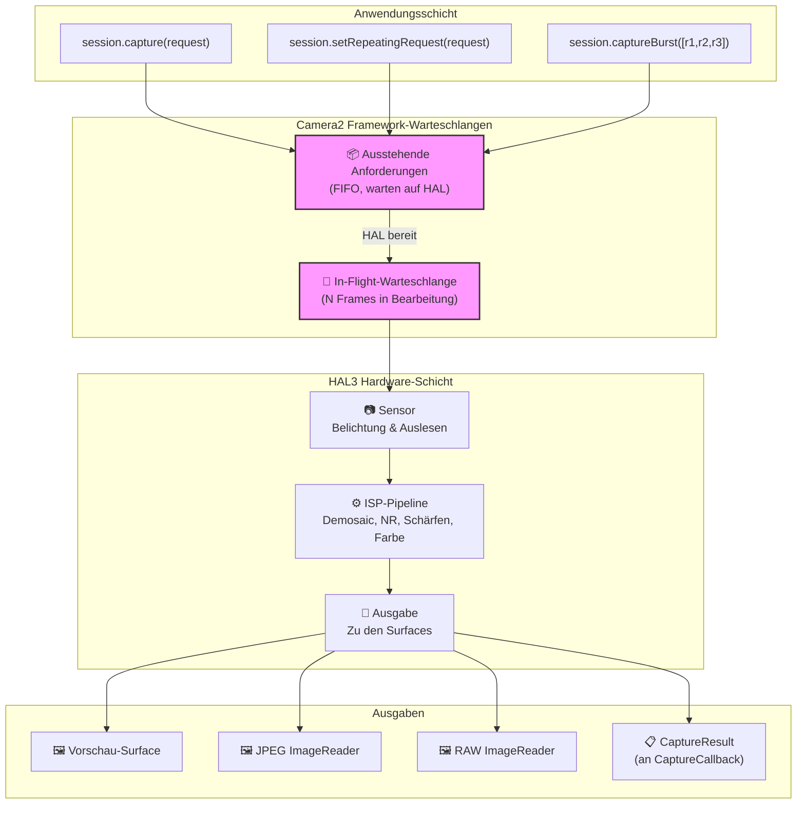
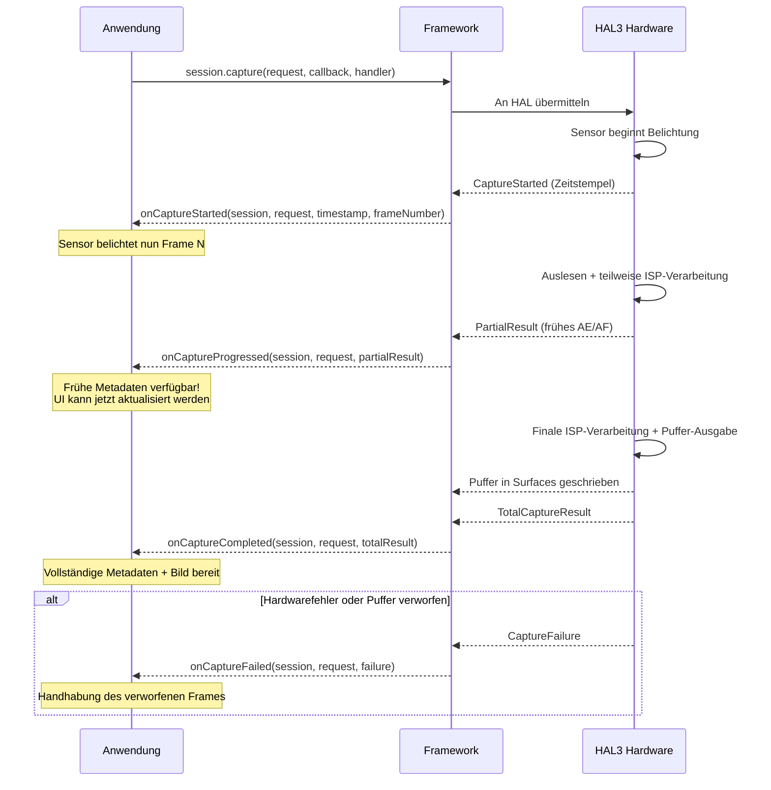
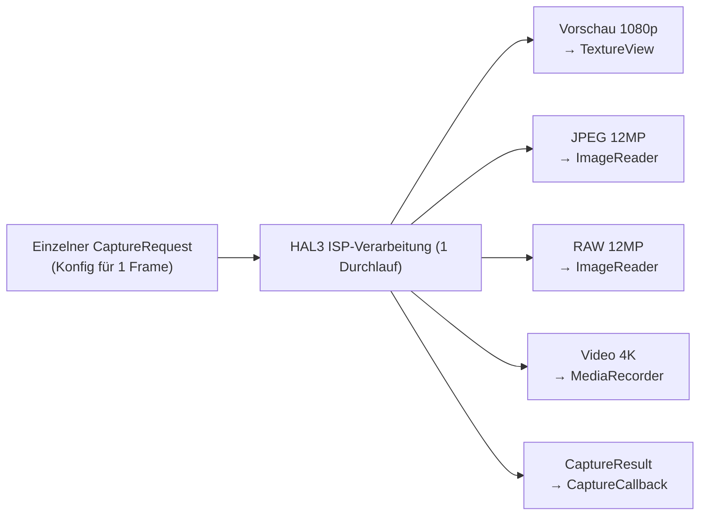
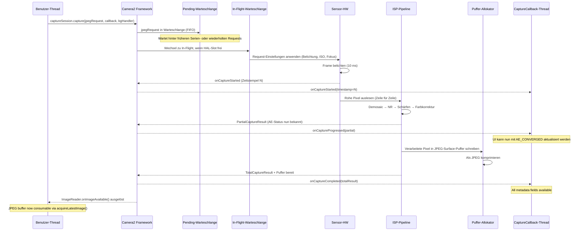

## 10.1 Von der Nutzung zum Verständnis

In den vorangegangenen Kapiteln dieser Serie haben Sie Camera2 *verwendet*: Sie haben Vorschauen angezeigt, Fotos aufgenommen und mit RAW-Dateien gearbeitet. Jetzt ist es an der Zeit, das Objektiv umzudrehen und nach innen zu schauen – **wie liefert Camera2 diese Bilder eigentlich aus?**

Das Verständnis der Pipeline ist nicht nur akademisch. Wenn Sie wissen, wie Anforderungen durch das System fließen, können Sie:
- Frame-Verluste bei Hochgeschwindigkeitsaufnahmen diagnostizieren
- Erklären, warum das Ändern von Einstellungen 1-2 Frames dauert, bis es sichtbar wird
- Serienbildaufnahmen für einen unterbrechungsfreien Ablauf optimieren
- Korrekte mentale Modelle für das Callback-Timing erstellen

Die App Android Camera Parameters ([GitHub](https://github.com/zoozooll/AndroidCameraParameters), [Play Store](https://play.google.com/store/apps/details?id=com.minininja.cameraparams)) visualisiert das Pipeline-Verhalten in Echtzeit – schauen Sie in die Registerkarten **Frame-Timing** und **Roh-JSON**, um die Konzepte aus diesem Kapitel live auf Ihrem Gerät zu sehen.

## 10.2 Die Kern-Datenstrukturen

Bevor wir uns die Pipeline selbst ansehen, lassen Sie uns die beiden Objekte, die sie durchlaufen, genau untersuchen: `CaptureRequest` (was hineingeht) und `CaptureResult` (was herauskommt).

### CaptureRequest: Der unveränderliche Bauplan für einen Frame

Ein `CaptureRequest` ist eine **vollständige, unveränderliche Konfiguration für einen einzelnen Frame**. Er beschreibt *alles*, was der Sensor, das Objektiv und der ISP für eine Belichtung tun sollen: Belichtungszeit des Sensors, ISO, Fokusdistanz des Objektivs, 3A-Modi, Ausgabeziele, JPEG-Qualität, Crop-Bereich und mehr.

Die wichtigsten Eigenschaften eines `CaptureRequest`:

- **Unveränderlich nach build()** – Sobald Sie `.build()` aufrufen, ist der Request eingefroren. Um Einstellungen zu ändern, müssen Sie einen neuen Builder erstellen.
- **Builder-Muster** – Konstruiert über `CaptureRequest.Builder`, erhalten von `CameraDevice.createCaptureRequest(template)`.
- **Pro Frame** – Jeder einzelne Frame erhält sein eigenes Request-Objekt. Sogar wiederholte Aufnahmen erstellen (implizit) einen neuen Request pro Frame.
- **Auf Surfaces ausgerichtet** – Jeder Request listet explizit auf, welche Ausgabe-Surfaces die verarbeiteten Bildpuffer erhalten sollen.

```kotlin
// Erstellen eines CaptureRequest mit dem Builder-Muster
val builder = cameraDevice.createCaptureRequest(CameraDevice.TEMPLATE_STILL_CAPTURE)

// Parameter auf Sensorebene
builder.set(CaptureRequest.SENSOR_EXPOSURE_TIME, 10_000_000L)   // 10 ms
builder.set(CaptureRequest.SENSOR_SENSITIVITY, 400)             // ISO 400
builder.set(CaptureRequest.SENSOR_FRAME_DURATION, 33_333_333L)  // ~30 fps max

// Objektivparameter
builder.set(CaptureRequest.LENS_FOCUS_DISTANCE, 0.1f)           // 10 cm Fokus
builder.set(CaptureRequest.LENS_APERTURE, 1.8f)                 // f/1.8

// 3A-Steuerungsmodi
builder.set(CaptureRequest.CONTROL_AF_MODE, CaptureRequest.CONTROL_AF_MODE_OFF)
builder.set(CaptureRequest.CONTROL_AE_MODE, CaptureRequest.CONTROL_AE_MODE_OFF)
builder.set(CaptureRequest.CONTROL_AWB_MODE, CaptureRequest.CONTROL_AWB_MODE_OFF)

// Ausgabeziele
builder.addTarget(previewSurface)
builder.addTarget(jpegReader.surface)

// Build — jetzt unveränderlich!
val request: CaptureRequest = builder.build()

// request.set(...) würde fehlschlagen — kein set() auf dem fertigen Objekt!
```

:::note
Die Unveränderlichkeit ist entscheidend für die Korrektheit der Pipeline. Da der HAL den Request asynchron liest, würden Sie Race Conditions zwischen dem App-Thread und dem Hardware-Verarbeitungs-Thread erzeugen, wenn Sie ihn nach der Übermittlung ändern könnten.
:::

### CaptureResult: Der Metadaten-Bericht (Nicht das Bild!)

Ein `CaptureResult` ist die **Metadaten-Ausgabe** für einen verarbeiteten Frame. Ganz wichtig: **CaptureResult enthält KEINE Bildpixeldaten**. Die Pixel gehen an die `Surface`-Ziele, die Sie dem Request hinzugefügt haben; das `CaptureResult` geht an Ihren `CaptureCallback` und enthält die *geschichte* dessen, was während der Aufnahme passiert ist.

Hier sind die wichtigsten Felder in einem `CaptureResult`:

| Ergebnisschlüssel | Typ | Beschreibung |
|-----------|------|-------------|
| `SENSOR_EXPOSURE_TIME` | `Long` | Tatsächlich verwendete Belichtungszeit in Nanosekunden (kann vom Request abweichen) |
| `SENSOR_SENSITIVITY` | `Int` | Tatsächlich angewendeter ISO-Gain |
| `SENSOR_TIMESTAMP` | `Long` | Zeitstempel in Nanosekunden zu Beginn der Belichtung (von `SystemClock.elapsedRealtimeNanos()`) |
| `CONTROL_AE_STATE` | `Int` | Status der Belichtungsautomatik: INACTIVE, SEARCHING, CONVERGED, LOCKED, FLASH_REQUIRED |
| `CONTROL_AF_STATE` | `Int` | Status des Autofokus: INACTIVE, PASSIVE_SCAN, ACTIVE_SCAN, FOCUSED_LOCKED, NOT_FOCUSED_LOCKED |
| `CONTROL_AWB_STATE` | `Int` | Status des automatischen Weißabgleichs |
| `LENS_FOCUS_DISTANCE` | `Float` | Tatsächlich vom Objektiv eingestellte Fokusdistanz |
| `SCALER_CROP_REGION` | `Rect` | Tatsächlich verwendeter Crop-Bereich für den digitalen Zoom |
| `JPEG_GPS_LOCATION` | `Location` | In das JPEG geschriebener GPS-Tag (falls angefordert) |
| `STATISTICS_FACE_DETECT_MODE` | `Int` | Tatsächlich verwendeter Gesichtserkennungsmodus |

Die Ergebnisfelder sind Ihre **Ground Truth**. Der `CaptureRequest` ist das, was Sie *angefordert* haben; das `CaptureResult` ist das, was die Hardware *tatsächlich getan* hat. Auf LEGACY- oder LIMITED-Geräten kann der HAL Ihre angeforderten Werte stillschweigend begrenzen, runden oder überschreiben – das Ergebnis ermöglicht es Ihnen, dies zu erkennen.

```kotlin
val captureCallback = object : CameraCaptureSession.CaptureCallback() {
    override fun onCaptureCompleted(
        session: CameraCaptureSession,
        request: CaptureRequest,
        result: TotalCaptureResult
    ) {
        val timestampNs = result.get(CaptureResult.SENSOR_TIMESTAMP)
        val exposureNs = result.get(CaptureResult.SENSOR_EXPOSURE_TIME)
        val iso = result.get(CaptureResult.SENSOR_SENSITIVITY)
        val aeState = result.get(CaptureResult.CONTROL_AE_STATE)
        val afState = result.get(CaptureResult.CONTROL_AF_STATE)
        val focusDistance = result.get(CaptureResult.LENS_FOCUS_DISTANCE)
        val cropRegion = result.get(CaptureResult.SCALER_CROP_REGION)

        val aeStateStr = when (aeState) {
            CaptureResult.CONTROL_AE_STATE_INACTIVE -> "INACTIVE"
            CaptureResult.CONTROL_AE_STATE_SEARCHING -> "SEARCHING"
            CaptureResult.CONTROL_AE_STATE_CONVERGED -> "CONVERGED"
            CaptureResult.CONTROL_AE_STATE_LOCKED -> "LOCKED"
            CaptureResult.CONTROL_AE_STATE_FLASH_REQUIRED -> "FLASH_REQUIRED"
            else -> "UNBEKANNT($aeState)"
        }

        val afStateStr = when (afState) {
            CaptureResult.CONTROL_AF_STATE_INACTIVE -> "INACTIVE"
            CaptureResult.CONTROL_AF_STATE_PASSIVE_SCAN -> "PASSIVE_SCAN"
            CaptureResult.CONTROL_AF_STATE_ACTIVE_SCAN -> "ACTIVE_SCAN"
            CaptureResult.CONTROL_AF_STATE_FOCUSED_LOCKED -> "FOCUSED_LOCKED"
            CaptureResult.CONTROL_AF_STATE_NOT_FOCUSED_LOCKED -> "NOT_FOCUSED_LOCKED"
            else -> "UNBEKANNT($afState)"
        }

        Log.d("Pipeline", buildString {
            append("Frame @${timestampNs?.let { it / 1_000_000 } ?: "?"}ms | ")
            append("Belichtung: ${exposureNs?.let { "%.2fms".format(it / 1_000_000.0) } ?: "?"} | ")
            append("ISO: $iso | ")
            append("Fokus: ${focusDistance?.let { "%.3f".format(it) } ?: "?"} Dioptrien | ")
            append("AE: $aeStateStr | ")
            append("AF: $afStateStr | ")
            append("Crop: ${cropRegion?.width()}x${cropRegion?.height()}")
        })
    }
}
```

:::tip
Aktivieren Sie in der App Android Camera Parameters das **Live Result Logging** in den Einstellungen und beobachten Sie, wie genau dieser Strom von Metadaten in Echtzeit fließt. Sie werden sehen, wie AE_SEARCHING zu AE_CONVERGED wechselt, wenn sich die Belichtung einpendelt, und AF_SCAN zu FOCUSED_LOCKED, wenn Sie zum Fokussieren tippen.
:::

## 10.3 Die Request-Warteschlangen

Camera2 verwendet auf Framework-Ebene ein **Modell mit zwei Warteschlangen in der Pipeline**. Das Verständnis dieser Warteschlangen erklärt fast jedes Zeitverhalten, das Sie beobachten können.

### Warteschlange für ausstehende Anforderungen (FIFO)

Wenn Sie `session.capture()`, `session.captureBurst()` oder `session.setRepeatingRequest()` aufrufen, geht der Request nicht sofort an den HAL. Stattdessen landet er in der **Warteschlange für ausstehende Anforderungen (Pending Request Queue)** – einer FIFO-Warteschlange (First-In, First-Out), die vom Camera2-Framework verwaltet wird.

Stellen Sie sich dies als den "Warteraum" vor. Die Anforderungen warten hier, bis der HAL Kapazitäten frei hat, um eine neue Anforderung zur Verarbeitung anzunehmen.

Wichtige Eigenschaften:
- **FIFO-Reihenfolge** – Anforderungen werden in der exakten Reihenfolge ihrer Übermittlung verarbeitet.
- **Atomarität von Bursts** – Alle Frames in einem `captureBurst()` werden zusammenhängend in die Warteschlange gestellt und ohne Unterbrechung durch wiederholte Anforderungen verarbeitet.
- **Prioritäts-Override** – One-Shot- oder Burst-Anforderungen rücken in der Warteschlange vor die wiederholte Anforderung (die wiederholte Anforderung wird nach Abschluss des One-Shots automatisch wieder in die Warteschlange gestellt).
- **Begrenzt** – Die Warteschlange hat eine endliche Tiefe (typischerweise 4-8 Anforderungen); ein Überlauf löst Fehler aus.

### In-Flight-Warteschlange

Wenn der HAL eine Anforderung aus der Pending-Warteschlange nimmt und mit dem Auslesen des Sensors / der ISP-Verarbeitung beginnt, wandert die Anforderung in die **In-Flight-Warteschlange**. Diese Warteschlange enthält alle Anforderungen, die gerade von der Hardware verarbeitet werden.

Die Tiefe der In-Flight-Warteschlange (`CameraCharacteristics.REQUEST_PIPELINE_MAX_DEPTH`) gibt an, an wie vielen Frames die Hardware gleichzeitig arbeitet. Auf typischen FULL-Geräten ist diese 3–4 Frames tief, was bedeutet: Während Frame N belichtet wird, wird Frame N-1 vom ISP verarbeitet, Frame N-2 wird in den Speicher geschrieben und Frame N-3 wird an die App zurückgegeben. So erreicht Camera2 30+ fps, obwohl jeder Frame von Anfang bis Ende ca. 100 ms benötigt.



## 10.4 Ergebnis-Callbacks: Der Lebenszyklus des CaptureCallback

Ergebnisse kommen über den `CameraCaptureSession.CaptureCallback` zurück. Der HAL kann Ergebnisse in mehreren Stufen zurückgeben, was Ihnen einen frühen Zugriff auf Metadaten ermöglicht, bevor der vollständige Frame fertig ist.

### Die vier Callback-Methoden

| Methode | Wann aufgerufen | Enthält | Anwendungsfall |
|--------|------------|----------|----------|
| `onCaptureStarted` | Der Sensor *beginnt* die Belichtung für diesen Frame | Minimale Info: Frame-Nummer, Zeitstempel | Exakte zeitliche Synchronisation |
| `onCaptureProgressed` | Der ISP hat den Frame teilweise verarbeitet | PartialCaptureResult – einige Metadatenfelder sind bereit | Frühe Status-Updates für AE/AF |
| `onCaptureCompleted` | Vollständiger Frame fertig, alle Puffer geliefert | TotalCaptureResult – alle Felder | Abschließendes Metadaten-Logging |
| `onCaptureFailed` | Frame wurde verworfen / Fehler aufgetreten | CaptureFailure – Fehlercode, Grund | Fehlerbehebung |

### Teilweise vs. Vollständige Ergebnisse

Ein `PartialCaptureResult` wird zurückgegeben, wenn der ISP *einige* Metadatenfelder berechnet hat, aber die vollständige Pipeline noch nicht durchlaufen ist. Ein `TotalCaptureResult` wird zurückgegeben, wenn alles abgeschlossen ist.



```kotlin
val fullPipelineCallback = object : CameraCaptureSession.CaptureCallback() {
    override fun onCaptureStarted(
        session: CameraCaptureSession,
        request: CaptureRequest,
        timestamp: Long,
        frameNumber: Long
    ) {
        super.onCaptureStarted(session, request, timestamp, frameNumber)
        Log.d("Pipeline", "Frame #$frameNumber Belichtung gestartet bei ${timestamp / 1_000_000}ms")
    }

    override fun onCaptureProgressed(
        session: CameraCaptureSession,
        request: CaptureRequest,
        partialResult: CaptureResult
    ) {
        super.onCaptureProgressed(session, request, partialResult)
        val aeState = partialResult.get(CaptureResult.CONTROL_AE_STATE)
        val afState = partialResult.get(CaptureResult.CONTROL_AF_STATE)
        Log.v("Pipeline", "Partial: AE=$aeState AF=$afState")
    }

    override fun onCaptureCompleted(
        session: CameraCaptureSession,
        request: CaptureRequest,
        result: TotalCaptureResult
    ) {
        super.onCaptureCompleted(session, request, result)
        val totalFrames = result.frameNumber
        Log.d("Pipeline", "Frame #$totalFrames vollständig abgeschlossen")
    }

    override fun onCaptureFailed(
        session: CameraCaptureSession,
        request: CaptureRequest,
        failure: CaptureFailure
    ) {
        super.onCaptureFailed(session, request, failure)
        val reason = when (failure.reason) {
            CaptureFailure.REASON_ERROR -> "Interner Fehler"
            CaptureFailure.REASON_FLUSHED -> "Durch abortCaptures() geleert"
            else -> "Unbekannt (${failure.reason})"
        }
        Log.e("Pipeline", "Frame #${failure.frameNumber} FEHLGESCHLAGEN: $reason. Verworfen: ${failure.wasImageCaptured()}")
    }
}
```

## 10.5 Pipeline-Interna: Zustandslos, Sequentiell, Asynchron, Multi-Output

Das HAL3-Pipeline-Modell, das Camera2 offenlegt, hat vier definierende Eigenschaften. Wenn Sie diese verinnerlichen, wird das meiste "komische" Verhalten von Camera2 plötzlich Sinn ergeben.

### 1. Zustandslosigkeit

Die Hardware hat **kein Gedächtnis zwischen den Anforderungen**. Jeder `CaptureRequest` muss in sich abgeschlossen sein – er enthält *jede Einstellung*, nicht nur die, die Sie gegenüber dem vorherigen Frame geändert haben.

Dies bedeutet:
- Wenn Sie `SENSOR_EXPOSURE_TIME` für Frame N einstellen, sie aber für Frame N+1 *weglassen*, kehrt sie zum Standardwert der Vorlage zurück.
- Die wiederholte Anforderung ist kein "Satz von Overrides" – sie wird vom Framework in jedem Frame vollständig neu generiert und eingereicht.
- Es gibt kein "Set and Forget" auf HAL-Ebene.

```kotlin
// 🔴 FALSCH: Erwartung, dass Einstellungen erhalten bleiben
session.setRepeatingRequest(requestWithExposure10ms, callback, handler)
// Später: Nur den AF-Trigger ändern, vergessen, die Belichtung erneut zu setzen
val triggerBuilder = cameraDevice.createCaptureRequest(CameraDevice.TEMPLATE_PREVIEW)
triggerBuilder.set(CaptureRequest.CONTROL_AF_TRIGGER, CaptureRequest.CONTROL_AF_TRIGGER_START)
triggerBuilder.addTarget(previewSurface)
session.capture(triggerBuilder.build(), callback, handler)
// 🐛 Die Belichtung kehrt für diesen One-Shot-Frame zum Standard von TEMPLATE_PREVIEW zurück!

// ✅ RICHTIG: Jeder Request ist in sich abgeschlossen
val triggerBuilder = cameraDevice.createCaptureRequest(CameraDevice.TEMPLATE_PREVIEW)
triggerBuilder.set(CaptureRequest.SENSOR_EXPOSURE_TIME, 10_000_000L)
triggerBuilder.set(CaptureRequest.CONTROL_AF_TRIGGER, CaptureRequest.CONTROL_AF_TRIGGER_START)
triggerBuilder.addTarget(previewSurface)
session.capture(triggerBuilder.build(), callback, handler)
```

### 2. Sequentielle Verarbeitung

Innerhalb eines einzelnen logischen Kamerastreams werden Anforderungen **nacheinander in FIFO-Reihenfolge** verarbeitet. Es gibt keine Umordnung, keine parallele Request-Auswertung. Wenn Frame 50 in der Warteschlange hinter Frame 49 steht, wartet Frame 50, bis Frame 49 die Belichtung beendet hat, selbst wenn Frame 50 "schneller" zu verarbeiten wäre.

Deshalb erzeugen Serienbildaufnahmen zusammenhängende, lückenlose Frames: Die N Anforderungen der Serie werden garantiert nacheinander ausgeführt.

### 3. Asynchrone Ergebnisse

Der Thread, der eine Anforderung übermittelt, ist **niemals** der Thread, der das Ergebnis erhält. Ergebnisse werden auf dem `Handler`-Thread geliefert, den Sie bereitgestellt haben (oder auf einem Binder-Thread, wenn Sie `null` übergeben haben).

Praktische Konsequenz: **Greifen Sie niemals ohne Synchronisierung vom Callback aus auf gemeinsam genutzten veränderlichen Zustand zu**. Ein häufiger Fehler ist das Lesen/Schreiben von `latestExposure` sowohl beim Klick auf den Auslöser als auch im Callback.

### 4. Mehrere Ausgaben pro Request

Ein Request → viele Ausgaben. Ein einzelner `CaptureRequest` kann gleichzeitig 2, 3 oder sogar 4+ `Surface`-Ziele ansprechen:

- **Preview SurfaceTexture** (für die Anzeige)
- **JPEG ImageReader** (für Standbilder)
- **RAW ImageReader** (für DNG)
- **MediaRecorder Surface** (für die Video-Kodierung)
- **Allocation Surface** (für RenderScript/ML-Verarbeitung)

Der HAL ist dafür verantwortlich, das einzelne Sensorauslesen durch mehrere ISP-Zweige zu leiten, um jedes Ausgabeformat zu erzeugen. Sie duplizieren nicht die Aufnahme; Sie deklarieren Ziele, und die Hardware verteilt die Daten.



## 10.6 End-to-End: Verfolgung eines Frames

Lassen Sie uns eine einzelne JPEG-Aufnahmeanforderung durch die gesamte Pipeline verfolgen, um alles miteinander zu verknüpfen:



## 10.7 Die Pipeline in Aktion sehen

Die App Android Camera Parameters ([GitHub](https://github.com/zoozooll/AndroidCameraParameters), [Play Store](https://play.google.com/store/apps/details?id=com.minininja.cameraparams)) enthält eine **Pipeline-Visualisierung** als Debug-Ansicht, die die aktuelle Tiefe der Pending-Warteschlange, der In-Flight-Warteschlange und die Zeitstempel pro Frame einblendet. Öffnen Sie die App, aktivieren Sie den **Entwicklermodus** in den Einstellungen, wählen Sie eine Kamera aus und wechseln Sie zur Registerkarte **Pipeline**, um folgendes zu sehen:

- Wie viele Anforderungen in der Warteschlange vs. in Bearbeitung sind
- Latenz pro Frame vom Start bis zum Abschluss
- Anzahl der Teilergebnisse pro Frame (wie viele `onCaptureProgressed`-Aufrufe ausgelöst werden)
- Alle verworfenen Frames mit Angabe der Gründe

Diese Registerkarte ist der beste Weg, um eine Intuition für die Konzepte in diesem Kapitel zu entwickeln.

## 10.8 Zusammenfassung

| Konzept | Kernaussage |
|---------|-------------|
| **CaptureRequest** | Unveränderlicher Bauplan pro Frame. Erstellung über Builder. Enthält ALLE Einstellungen (kein Gedächtnis). |
| **CaptureResult** | Nur Metadaten (keine Pixel). Ground Truth für das, was die Hardware *tatsächlich getan* hat. AE/AF-Status, Belichtung, Crop prüfen. |
| **Pending-Warteschlange** | FIFO-Warteraum. Bursts bleiben zusammenhängend. One-Shot rückt vor wiederholte Anforderung. |
| **In-Flight-Warteschlange** | Anforderungen, die gerade verarbeitet werden. Tiefe = Maximale Pipeline-Tiefe. 3-4 Frames sind typisch auf FULL-Geräten. |
| **CaptureCallback** | Vier Phasen: started → progressed → completed (oder failed). Teilweise vs. vollständige Ergebnisse. |
| **Zustandslosigkeit** | Die Hardware hat kein Gedächtnis. Jeder Request muss jede Einstellung enthalten, die Ihnen wichtig ist. |
| **Sequentiell + Asynchron** | FIFO-Reihenfolge garantiert. Callback auf einem anderen Thread als die Übermittlung. |
| **Multi-Output** | Ein Request → viele Surfaces (Vorschau + JPEG + RAW + Video, alles gleichzeitig). |

## Wie geht es weiter?

In [Kapitel 11: Aufnahme-Typen](capture-types.md) werden wir uns die drei Möglichkeiten ansehen, Anforderungen an diese Pipeline zu übermitteln – One-Shot, Burst und Repeating – und wann man welche verwendet. Außerdem werden wir die integrierten Vorlagen (`TEMPLATE_PREVIEW`, `TEMPLATE_STILL_CAPTURE` usw.) erkunden, die vernünftige Standardwerte für gängige Anwendungsfälle vorkonfigurieren.
