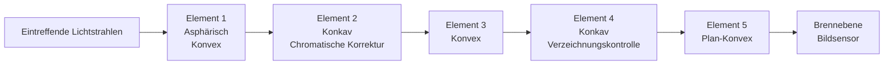
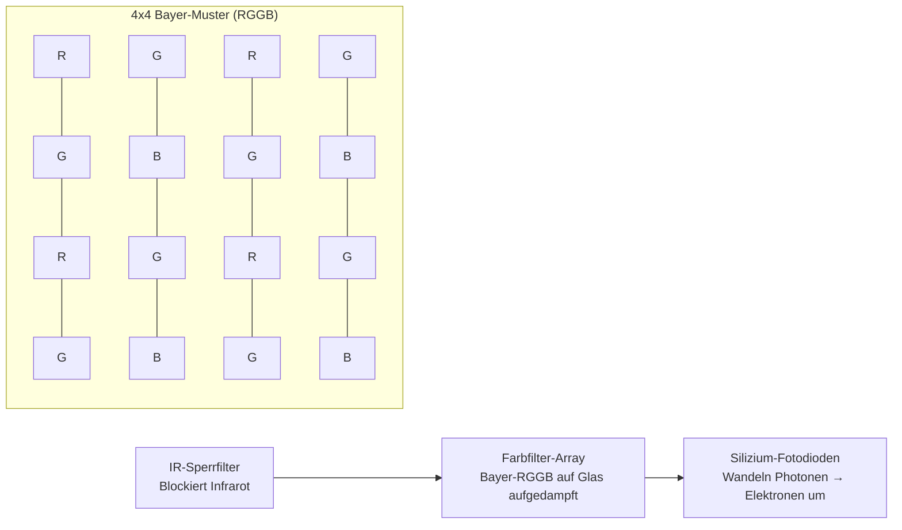
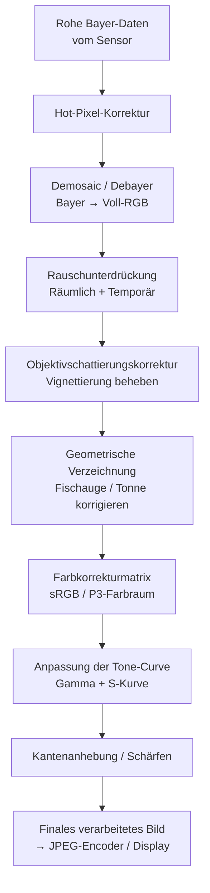
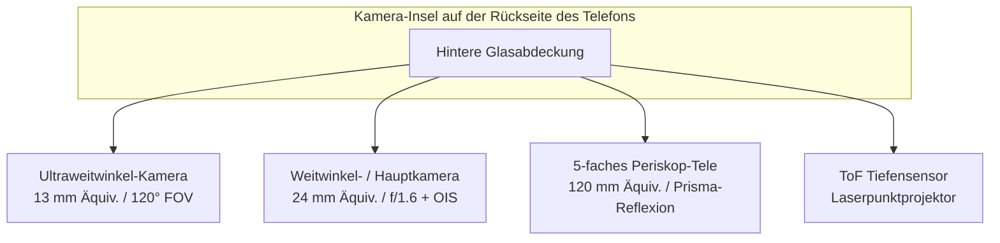
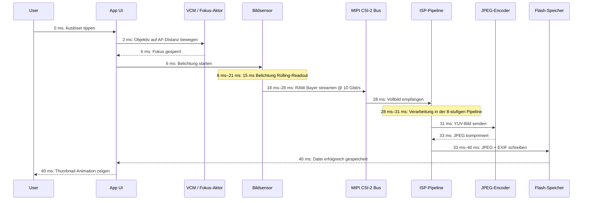

# Kapitel 2: Smartphone-Kameras verstehen

Bevor Sie eine einzige Zeile Camera2-API-Code schreiben, müssen Sie die physische Hardware verstehen, die Ihr Code befehligen wird. Eine Smartphone-Kamera ist nicht nur "ein Objektiv, das auf einen Sensor gerichtet ist". Es handelt sich um eine eng integrierte, versiegelte und präzisionsgefertigte Baugruppe, die Optik, Aktoren, Filter, Halbleiter und Hochgeschwindigkeits-Datenbusse enthält. Dieses Kapitel erklärt jede Komponente, vom Glas, das das Licht zuerst einfängt, bis hin zum Flash-Speicher-Chip, auf dem Ihr fertiges Foto gespeichert wird.

Das Ziel dieses Kapitels ist es, ein mentales Modell der Kamera-Pipeline als physisches System aufzubauen. Wenn Sie in späteren Kapiteln eine Aufnahmeanforderung mit `CONTROL_AE_TARGET_FPS_RANGE` oder `SENSOR_SENSITIVITY` konfigurieren, werden Sie genau verstehen, welches Hardwareteil diese Parameter beeinflussen und warum die Werte wichtig sind.

## Das Kameramodul: Eine versiegelte optische Baugruppe

Wenn Sie auf die Rückseite eines modernen Flaggschiff-Telefons schauen — stellen Sie sich ein Pixel 10 oder Galaxy S26 Ultra vor —, sehen Sie eine hervorstehende rechteckige Insel, die 2 bis 4 Millimeter aus dem Rückglas herausragt. Diese Insel ist nicht eine einzelne Kamera. Eine rechteckige Insel beherbergt drei separate kreisförmige Module: Das größte ganz unten ist das primäre Weitwinkelobjektiv, ein kleineres darüber das 3-fache Periskop-Teleobjektiv und das mittelgroße links davon das 0,5-fache Ultraweitwinkelobjektiv. Jede kreisförmige "Wölbung" innerhalb dieser Insel ist ein eigenständiges, unabhängiges Kameramodul.

Ein Kameramodul ist eine hermetisch versiegelte Einheit, die in einem staubfreien Reinraum gefertigt wird. Es enthält, in der Reihenfolge von der Außenwelt nach innen gestapelt:

1. **Schutzglas**: Ein kratzfestes Fenster aus Saphirglas oder Gorilla Glass, das das Modul versiegelt und Staub fernhält.
2. **Objektivtubus**: Ein zylindrischer Stapel aus 4 bis 6 einzelnen Glas- (oder manchmal Kunststoff-Asphären-) Linsenelementen, die durch dünne Kunststoff-Abstandshalter präzise ausgerichtet werden.
3. **Voice Coil Motor (VCM)**: Ein elektromagnetischer Aktor, der den gesamten Objektivtubus entlang der optischen Achse um Bruchteile eines Millimeters vor- oder zurückbewegt, um den Autofokus zu realisieren. Einige hochwertige VCMs können das Objektiv auch senkrecht zur Achse verschieben, um eine optische Bildstabilisierung (OIS) zu erreichen.
4. **Infrarot-(IR-)Sperrfilter**: Ein dünnes, beschichtetes Glasplättchen, das direkt vor dem Sensor platziert ist. Es blockiert Infrarotlicht (für das der Siliziumsensor empfindlich ist, das menschliche Auge jedoch nicht), damit die aufgezeichneten Farben dem entsprechen, was Menschen wahrnehmen.
5. **Sensor-Die**: Der Silizium-CMOS-Bildsensorchip selbst, der auf ein Substrat gebondet ist. Das aktive Pixel-Array zeigt nach oben zum Objektiv.
6. **Flexible Leiterplatte (FPC)**: Ein dünnes, biegsames Flachbandkabel, das Strom, Masse, Steuersignale (I2C) und Hochgeschwindigkeits-Bilddaten (MIPI CSI-2) vom Modul zur Hauptplatine des Telefons überträgt.
7. **Board-to-Board-Steckverbinder**: Ein winziger, hochdichter Stecker am Ende der FPC, der in eine passende Buchse auf der Hauptplatine des Telefons einrastet.

Die gesamte Baugruppe — vom Schutzglas bis zum Stecker — ist bei einer herkömmlichen Rückkamera typischerweise 5 bis 8 Millimeter dick und bei einem Periskop-Teleobjektiv (im Inneren des Telefons, horizontal ausgerichtet) 10 bis 14 Millimeter lang. Die Module werden im Werk einzeln kalibriert: Linsenausrichtung, Sensorkippung, Farbschattierung und die Autofokus-Unendlichkeitsposition werden gemessen und in einem einmalig programmierbaren Speicher (OTP) auf dem Modul selbst gespeichert. Die Camera2-API liest diese Kalibrierungsdaten beim Systemstart aus, sodass Ihre App Fertigungstoleranzen zwischen den Geräten nicht berücksichtigen muss.

## Das Objektiv: Brennweite, Blende und Stabilisierung

Das Objektiv ist die erste Komponente, auf die das Licht trifft. Seine Aufgabe ist es, eintreffende Lichtstrahlen so zu brechen, dass sie genau auf der Ebene des Bildsensors zu einem scharfen Bild zusammenlaufen.

### Brennweite und Kleinbildäquivalent

Die Brennweite bestimmt den Bildwinkel (wie viel von der Szene ins Bild passt) und die Vergrößerung (wie groß entfernte Motive erscheinen). Smartphone-Kameraspezifikationen werben immer mit **kleinbildäquivalenten Brennweiten**. Dies ist eine Konvention, die verschiedene Sensorgrößen normiert, damit Verbraucher Vergleiche anstellen können. Ein Vollformatsensor (Kleinbild) hat die Größe 36 mm × 24 mm, wie er historisch in 35-mm-Film-SLR-Kameras verwendet wurde.

Gängige kleinbildäquivalente Brennweiten bei Smartphones:

- **10–18 mm (Ultraweitwinkel)**: 100° bis 130° diagonaler Bildwinkel. Wird für Landschaften, Architektur, Gruppen-Selfies und Makro-Nahaufnahmen verwendet.
- **22–28 mm (Weitwinkel / Primär)**: Die Standard-Kamera an jedem Telefon. ~75° Bildwinkel, ähnlich dem peripheren Sehen des Menschen, aber flacher.
- **45–80 mm (Tele, 2- bis 3-fach)**: Schmaler Bildwinkel von 30° bis 50°. Wird für Porträts (natürlich wirkende Gesichtsproportionen, weniger perspektivische Verzerrung) und allgemeinen Zoom verwendet.
- **100–240 mm (Periskop-Tele, 5- bis 10-fach)**: Enger Bildwinkel von 10° bis 25°. Das prismengefaltete Periskop-Design ermöglicht lange Brennweiten, ohne das Telefon 2 Zentimeter dick zu machen.

Hier sehen Sie, wie das Licht durch eine typische 5-Element-Weitwinkel-Objektivbaugruppe wandert:

### Blende

Die Blende ist die Größe der Öffnung, durch die das Licht im Inneren des Objektivs tritt. Sie wird als **Blenden-Zahl** (oder f-Zahl) angegeben: die Brennweite geteilt durch den Durchmesser der Blende. Eine **kleinere Blenden-Zahl bedeutet eine größere Öffnung, was wiederum bedeutet, dass mehr Licht** den Sensor erreicht.

- f/1.4 bis f/1.8: Sehr große Blende. Typische Hauptkameras bei Flaggschiffen. Exzellent bei wenig Licht.
- f/2.0 bis f/2.4: Moderate Blende. Typische Ultraweitwinkel- und Telekameras an den meisten Telefonen.
- f/2.8 bis f/4.0: Kleine Blende. Zu finden bei kostengünstigeren Frontkameras und einigen Periskop-Modulen.

Die Blende ist bei Smartphone-Kameras in der Regel fest eingestellt. Einige Flaggschiffe von Samsung aus dem Jahr 2020 verfügten über einen **variablen Blendenmechanismus** mit einer Doppelmembran, die mechanisch zwischen f/1.5 und f/2.4 umschalten konnte. Dies ist heute extrem selten, da VCM-basierter Fokus und Multi-Frame-Computational-HDR eine variable Blende für die meisten Anwendungsfälle überflüssig gemacht haben.

### Optische Bildstabilisierung (OIS)

Wenn Sie ein Telefon halten, zittern Ihre Hände natürlicherweise um winzige Winkelbeträge — in der Größenordnung von 0,1° bis 0,5° bei einer 1/30 Sekunde. Bei einer ausreichend langen Belichtungszeit führt dieses Zittern dazu, dass das gesamte Bild unscharf wird. Die **optische Bildstabilisierung (OIS)** löst dieses Problem, indem sie entweder den Objektivtubus (Lens-Shift OIS) oder den Sensor-Die selbst (Sensor-Shift OIS) physisch bewegt, um der erkannten Bewegung entgegenzuwirken. Ein winziges Gyroskop im Kameramodul (oder gemeinsam mit der Haupt-IMU des Telefons genutzt) misst die Winkelgeschwindigkeit 1.000 bis 8.000 Mal pro Sekunde, und der OIS-Aktor bewegt die Optik entsprechend. OIS kann typischerweise 3 bis 5 Blendenstufen Handzittern kompensieren, was bedeutet, dass eine Aufnahme, die 1/60 s erfordert hätte, um scharf zu bleiben, nun bei 1/8 s oder 1/4 s mit gleicher Schärfe aufgenommen werden kann.

## Der Bildsensor: Wo Licht zu Elektrizität wird

Der Bildsensor ist ein Siliziumchip mit Millionen von einzelnen Lichtdetektoren, den sogenannten **Fotodioden**, die in einem präzisen rechteckigen Raster angeordnet sind. Jeder Smartphone-Sensor ist heute ein **CMOS-Typ (Complementary Metal-Oxide-Semiconductor)**.

### Pixelgröße und Megapixel

Jede einzelne Fotodiode mit Ausleseschaltkreis wird als **Pixel** bezeichnet. Die physische Größe jedes Pixels (gemessen in Mikrometern, μm) ist wohl wichtiger als die Gesamtzahl der Megapixel. Ein größeres Pixel fängt mehr Photonen pro Zeiteinheit ein, was weniger Schrotrauschen und eine bessere Leistung bei wenig Licht bedeutet.

Gängige Pixelgrößen in Smartphones des Jahres 2026:

- **0,6 μm bis 0,8 μm**: Sehr kleine Pixel. Werden in hochauflösenden Sensoren mit 108 MP bis 200 MP verwendet. Diese verlassen sich für ein akzeptables Rauschverhalten vollständig auf Pixel Binning.
- **1,0 μm bis 1,2 μm**: Mittlere Größe. Werden in Sensoren mit 48 MP bis 64 MP verwendet, mit standardmäßigem 4:1-Binning auf 12 MP–16 MP Ausgabe.
- **2,0 μm bis 2,4 μm**: Große "Flaggschiff"-Pixel. Werden in dedizierten 12-MP–16-MP-Sensoren (Google Pixel, iPhone Pro) oder als gebinnte Ausgabe von 48-MP-Sensoren im Modus "hohe Qualität" verwendet.

Pixel Binning ist die Technik, bei der die Ladung benachbarter 2×2 (oder 3×3 oder 4×4) Pixel während des Auslesens zu einem einzigen "Super-Pixel" kombiniert wird. Ein 48-MP-Sensor mit 0,8 μm Einzelpixeln verhält sich bei einem 4-zu-1-Binning wie ein 12-MP-Sensor mit 1,6 μm effektiven Pixeln — was das Signal-Rausch-Verhältnis drastisch verbessert. Die Camera2-API legt sowohl den Modus mit voller Auflösung (Raw) als auch den Standard-Binning-Modus als separate Stream-Konfigurationen offen.

Die Rechnung für die Megapixelzahl ist einfach: Ein 48-MP-Sensor hat ein aktives Array von etwa 8.000 × 6.000 Fotodioden = 48.000.000 einzelne Lichtsensoren.

### Klassifizierungen der Sensorgröße

Die Sensorgröße folgt einer alten, auf Zoll basierenden Notation, die auf Vidicon-Fernsehröhren der 1950er Jahre zurückgeht. Das Format ist "1/X Zoll", wobei X der Divisor ist; ein kleineres X bedeutet einen größeren Sensor:

- 1/3,06" bis 1/2,55": Kleine Sensoren, typisch für Frontkameras und günstige Ultraweitwinkel-Objektive (~5 MP bis 13 MP).
- 1/1,7" bis 1/1,3": Große mobile Sensoren, Hauptkameras bei Flaggschiffen (48 MP, 50 MP, 108 MP).
- 1-Zoll (Typ 1): Sehr groß für ein Telefon. Zu finden im Xiaomi 13 Ultra, in der Sharp Aquos R-Serie und im Sony Xperia Pro-I. Etwa 13,2 mm × 8,8 mm aktive Fläche — das nähert sich der Größe einiger Micro-Four-Thirds-Kameras an.

Ein größerer Sensor hat bei gleicher Megapixelzahl immer größere Einzelpixel. Deshalb machen Telefone mit "Ein-Zoll-Sensoren" spürbar bessere Fotos bei wenig Licht.

### Das Bayer-Farbfilter-Array (CFA)

Eine reine Silizium-Fotodiode ist farbenblind — sie misst nur die gesamte Photonenintensität, nicht die Wellenlänge. Um Farben aufzuzeichnen, bringen die Hersteller einen winzigen **Farbfilter** über jedem einzelnen Pixel an. Das fast universelle Muster ist das **Bayer-RGGB-Filterarray**: 50 % grüne Pixel, 25 % rote und 25 % blaue, angeordnet in einer sich wiederholenden 2×2-Kachel. Das menschliche Auge ist empfindlicher für grünes Licht, daher verbessert die Verdoppelung der Grünabtastung die wahrgenommene Luminanzauflösung und das Rauschverhalten.

Nach dem Auslesen sind die Sensordaten ein Mosaik aus einzelnen Rot-, Grün- und Blauwerten — noch kein vollfarbiges Bild. Der Schritt, der die fehlenden Farbinformationen für jedes Pixel ergänzt, wird **Demosaicing** (oder Debayering) genannt und ist der erste große computergestützte Schritt, der im ISP durchgeführt wird.

### Rolling Shutter vs. Global Shutter

Fast jeder Smartphone-Bildsensor verwendet einen **Rolling Shutter**. Der Sensor belichtet oder liest nicht alle Pixel gleichzeitig aus. Stattdessen belichtet und liest er das Pixel-Array Zeile für Zeile, von oben nach unten, eine horizontale Linie nach der anderen aus. Ein typisches Auslesen eines 48-MP-Sensors per Rolling Shutter dauert etwa 15 bis 25 Millisekunden für ein Vollbild.

Der Rolling Shutter erzeugt charakteristische Verzerrungen bei sich sehr schnell bewegenden Objekten: Ein rotierender Flugzeugpropeller oder ein Deckenventilator erscheint gebogen oder wellenförmig; der obere und der untere Teil eines vertikal geschwenkten Gebäudes lehnen sich in entgegengesetzte Richtungen (der "Wackelpudding-Effekt" bei Videos). Global-Shutter-Sensoren hingegen belichten jedes Pixel gleichzeitig und lesen sie alle auf einmal aus, nachdem die Belichtung beendet ist. Global Shutter wird in der maschinellen Bildverarbeitung, bei Action-Kameras und einigen speziellen IR-Sensoren für den Face-Unlock an der Vorderseite verwendet, aber das Global-Shutter-Pixeldesign hat eine geringere Lichtempfindlichkeit und höhere Kosten, weshalb es in Smartphone-Hauptkameras nicht verwendet wird.

## Der ISP: Image Signal Processor

Der **ISP (Image Signal Processor)** ist ein dedizierter Hardwareblock (entweder ein separater Chip oder heute meist ein integrierter Teil des Haupt-SoC neben CPU und GPU), dessen einzige Aufgabe darin besteht, die rohen, mosaikartigen, verrauschten und verzerrten Daten, die vom Sensor kommen, in ein visuell ansprechendes Farbbild zu verwandeln.

Der ISP durchläuft eine feste, fest verdrahtete Pipeline von Bildverarbeitungsstufen mit extrem hohem Durchsatz. Ein moderner 48-MP-Sensor, der mit 30 Bildern pro Sekunde läuft, sendet 1,44 Milliarden Pixel pro Sekunde an den ISP. Der ISP muss jedes einzelne Pixel in weniger als 33 Millisekunden pro Frame durch alle Stufen verarbeiten, um Schritt zu halten.

Die kanonischen ISP-Pipeline-Stufen sind in dieser Reihenfolge:

1. **Hot-Pixel-Korrektur**: Werkskalibrierte "hängende" Pixel (immer hell oder immer dunkel) werden durch interpolierte Werte der Nachbarn ersetzt.
2. **Demosaic / Debayer**: Das Bayer-RGGB-Mosaik wird in ein vollständiges RGB-Bild umgewandelt, indem die fehlenden zwei Farbkanäle an jeder Pixelposition aus den umgebenden Pixeln mittels kantenbewusster Interpolationsalgorithmen geschätzt werden.
3. **Rauschunterdrückung (Temporär + Räumlich)**: Zufälliges Schrotrauschen und Sensorausleserauschen werden unterdrückt. Die räumliche Rauschunterdrückung (Spatial NR) zeichnet flache Regionen weich, während Kanten erhalten bleiben. Die temporäre Rauschunterdrückung (Temporal NR) führt Informationen aus vorherigen Videoframes zusammen (falls verfügbar), um noch sauberere Ergebnisse zu erzielen.
4. **Korrektur der Objektivschattierung (Vignettierungskorrektur)**: Die Ecken des Bildes sind von Natur aus dunkler, da das Licht in einem steileren Winkel durch das Objektiv treten muss. Der ISP wendet eine digitale Gain-Rampe pro Pixel an, die an den Ecken heller ist, um die Ausleuchtung zu ebnen. Die Kalibrierungsdaten für diese Rampe sind im OTP des Moduls gespeichert.
5. **Korrektur geometrischer Verzeichnungen**: Ultraweitwinkel- und Fischaugenobjektive erzeugen eine Tonnenverzeichnung (gerade Linien wölben sich nach außen). Der ISP ordnet die Pixelkoordinaten anhand eines gespeicherten polynomialen Linsenmodells neu zu, um ein rektilineares Bild zu erzeugen, auf dem gerade Linien auch wirklich gerade erscheinen. Dieser Schritt beschneidet zwangsläufig 5–10 % des äußeren Pixelrings.
6. **Farbkorrekturmatrix (CCM)**: Das RGB-Spektrum des rohen Sensors entspricht nicht der trichromatischen Antwort des menschlichen Auges. Eine 3×3-Matrixmultiplikation wandelt sensor-natives RGB in den Standard-sRGB- oder DCI-P3-Farbraum um. Die CCM-Koeffizienten werden pro Modul und pro Lichtquelle (Tageslicht, Kunstlicht, Leuchtstofflampe) abgestimmt.
7. **Anpassung der Tone-Curve**: Eine nichtlineare S-förmige Tone-Mapping-Kurve wird auf die linearen RGB-Daten angewendet, um das Sensorsignal mit hohem Dynamikumfang in den Ausgang mit niedrigem Dynamikumfang zu komprimieren (typischerweise 8-Bit sRGB Gamma-kodiert). Dieser Schritt verleiht dem Bild seine "Brillanz" — der Kontrast in den Mitteltönen steigt, Lichter werden abgemildert, Schatten werden angehoben.
8. **Kantenanhebung / Schärfen**: Ein subtiler Unscharf-Maskierungs-Filter wird angewendet, um hochfrequente Details wiederherzustellen, die durch die Rauschunterdrückung und den optischen Tiefpassfilter weichgezeichnet wurden. Die Stärke der Schärfung wird sorgfältig kontrolliert, um Halos zu vermeiden.

Die Verarbeitungsqualität des ISP ist ein wichtiges Unterscheidungsmerkmal zwischen den Telefonherstellern. Google, Samsung, Apple und Xiaomi stimmen ihre ISP-Pipelines mit unterschiedlichen künstlerischen Prioritäten ab: Einige bevorzugen natürliche Farben, andere übersättigte, kontrastreiche Ausgaben, einige eine aggressive Rauschunterdrückung gegenüber erhaltenen Details. Die Camera2-API gibt Ihnen eine gewisse Kontrolle über die Stärke einzelner ISP-Stufen (über die Android-Steuerungen für Tonemap und Farbkorrektur), aber die meisten detaillierten Stufenparameter sind hinter herstellerspezifischen proprietären APIs gesperrt.

## RAW vs. JPEG: Zwei Wege vom Sensor zum Speicher

Die oben beschriebene ISP-Pipeline erzeugt ein verarbeitetes Bild. Die Camera2-API ermöglicht es Ihnen jedoch auch, den ISP vollständig zu umgehen und die rohen Sensordaten direkt auszulesen. Dies ist die entscheidende Unterscheidung zwischen RAW- und JPEG-Ausgabe.

### RAW-Format

Eine **RAW-Datei** (unter Android bedeutet dies eine DNG-Datei, Digital Negative) enthält genau das, was der Sensor gemessen hat, bevor eine ISP-Verarbeitung erfolgt ist. Es handelt sich um ein 10-Bit-, 12-Bit- oder 14-Bit-Bayer-Mosaik pro Pixel — immer noch im ursprünglichen RGGB-Muster, immer noch mit Vignettierung, immer noch mit Rauschen, immer noch linear. Die RAW-Datei enthält außerdem Metadaten-Tags, die das genaue Farbfilter-Array-Muster, das Farbprofil des Sensors, den Schwarzpunkt, den Weißpunkt und das Objektivmodell angeben.

- **Bittiefe**: RAW10 = 10 Bit pro Kanal = 1.024 Stufen. RAW12 = 4.096 Stufen. RAW14 = 16.384 Stufen. Vergleichen Sie dies mit den 8 Bit von JPEG = 256 Stufen.
- **Dateigröße**: 20–40 MB pro 48-MP-Foto. Unkomprimiert oder nahezu verlustfrei komprimiert.
- **Anwendungsfall**: Professionelle Nachbearbeitung. Die zusätzlichen Blendenstufen Spielraum ermöglichen es einem Bildbearbeiter, überbelichtete Lichter (um 2 bis 3 EV-Stufen) zu "retten" oder unterbelichtete Schatten ohne Streifenbildung (Banding) anzuheben.

### JPEG-Format

Eine **JPEG-Datei** ist die vollständig "fertige" Ausgabe des ISP. Jede einzelne der 8 oben genannten ISP-Stufen wurde bereits auf die Pixeldaten angewendet. Dann wird das Bild von RGB in den YCbCr 4:2:0 Farbraum mit Chroma-Subsampling umgewandelt und mit einem verlustbehafteten Diskrete-Kosinustransformations-Algorithmus bei einem Kompressionsverhältnis von etwa 10:1 bis 20:1 komprimiert.

- **Bittiefe**: Immer 8 Bit pro Kanal = 256 Stufen pro Farbe.
- **Dateigröße**: 2–5 MB für ein 12-MP- bis 48-MP-Foto, abhängig von der JPEG-Qualitätsstufe.
- **Anwendungsfall**: Sofortiges Teilen, soziale Medien, jeder Workflow, bei dem das Foto direkt "fertig" sein soll. Anpassungen in einem mobilen Editor verschlechtern das Bild schnell, da nur noch 256 Stufen übrig sind.

### Vergleichstabelle: RAW vs. JPEG

| Merkmal | RAW (DNG) | JPEG |
|---------|-----------|------|
| Angewandte ISP-Verarbeitung | Keine — alle Stufen übersprungen | Alle 8 Stufen angewendet und irreversibel |
| Farbtiefe | 10–14 Bit (1.024–16.384 Stufen) | 8 Bit (256 Stufen) |
| Weißabgleich | In Metadaten markiert, nachträglich voll änderbar | In Pixel eingebrannt — nur geringe Korrekturen |
| Belichtungsspielraum | ±2 bis 3 Blendenstufen rettbar | Max. ±1/2 Blendenstufe vor Banding |
| Dateigröße (48 MP) | 25–40 MB | 3–6 MB |
| Farbraum | Sensor-natives lineares RGB | sRGB oder Display P3 Gamma-kodiert |
| Schärfung / Rauschunterdrückung | Keine — Entscheidung des Bearbeiters | Angewendet; kann nicht rückgängig gemacht werden |
| Typischer Workflow | Adobe Lightroom / Capture One | Direktes Teilen auf Instagram / Messenger |

## Multi-Kamera-Handys: Warum nicht ein riesiges Zoomobjektiv?

Eine herkömmliche Point-and-Shoot-Kamera verwendet ein einzelnes Zoomobjektiv mit beweglichen internen Gruppen, die die Brennweite kontinuierlich von Weitwinkel bis Tele verändern. Warum kann ein Smartphone das nicht? Die Physik sagt Nein. Ein 10-fach-Zoomobjektiv, das 24 mm–240 mm kleinbildäquivalent mit einer konstanten Blende von f/2.8 abdeckt, erfordert einen optischen Pfad von etwa 5 Zentimetern Länge. Ein Smartphone ist höchstens 0,9 Zentimeter dick. Die Mathematik geht einfach nicht auf.

Die Smartphone-Industrie löste dies nicht mit einem Zoomobjektiv, sondern mit **mehreren Kameras mit fester Brennweite**, die jeweils für einen anderen Zweck optimiert sind, und einem computergestützten System für "sanftes Zoomen", das bei bestimmten Zoomverhältnissen von einer Kamera zur nächsten überblendet.

Eine typische Rückkamera-Insel eines Flaggschiffs aus dem Jahr 2026 enthält:

1. **Ultraweitwinkel (0,5-facher Zoom, ~13 mm Äquiv., ~120° FOV)**: Kurze Brennweite, große Schärfentiefen. Ideal für Landschaften, Architektur, Gruppenaufnahmen und Makro-Nahaufnahmen bei softwaregestützter Neupositionierung.
2. **Weitwinkel / Primär (1-facher Zoom, ~24 mm Äquiv., ~75° FOV)**: Der Standard. Der größte Sensor, die größte Blende, das beste OIS. Wird für 80 % der alltäglichen Fotos verwendet.
3. **Tele / Periskop (3- bis 10-facher optischer Zoom, ~72 mm bis ~240 mm Äquiv.)**: Ein herkömmliches Telemodul (3-fach) sitzt direkt über seinem Sensor. Ein Periskop-Tele (5-fach, 10-fach) nutzt ein 45°-Prisma am Rand des Telefons, um das Licht um 90° umzulenken, sodass der Objektivtubus horizontal im Gehäuse des Telefons verläuft und nicht vertikal durch dessen Dicke.
4. **ToF / Tiefensensor**: Ein Nahinfrarot-Laserpunktprojektor (oder bei iPhones ein LiDAR-Scanner), der über 30.000 IR-Punkte auf die Szene pulst und deren Laufzeit misst, um eine Tiefenkarte pro Pixel zu erstellen. Wird für präzises Porträt-Bokeh, Augmented-Reality-Verdeckung und schnellen Autofokus bei wenig Licht verwendet.

Wenn Sie in der Kamera-App eine Pinch-to-Zoom-Geste ausführen, schaltet der HAL (Hardware Abstraction Layer) an fest vorgegebenen Schwellenwerten die aktive physische Kamera nahtlos um. Zum Beispiel wird beim Zoomen von 0,5x auf 1,0x vom Ultraweitwinkel auf das Weitwinkel übergeblendet. Bei 2,9x wird die Weitwinkelkamera immer noch digital beschnitten. Bei 3,0x schaltet der HAL die aktive Quelle auf das Periskop-Telemodul um. Zwischen diesen Zoomstufen nutzt ein ausgeklügelter Image-Fusing-Algorithmus beide Kameras gleichzeitig, um einen nahtlosen Übergang zu gewährleisten.

## Die volle Reise: Vom Photon zum gespeicherten Foto, Millisekunde für Millisekunde

Hier ist der vollständige, nummerierte Zeitablauf dessen, was physisch in einem Smartphone während einer einzelnen Standbildaufnahme passiert, beginnend mit dem Moment, in dem der Finger des Benutzers den virtuellen Auslöser loslässt. Die Zahlen sind repräsentativ für ein Flaggschiff von 2026, das ein 12-MP-JPEG im Standardmodus bei Tageslicht aufnimmt:

- **0 ms**: Benutzer tippt auf den Auslöser. Das Camera2-API-Framework empfängt den `CaptureRequest` mit `TEMPLATE_STILL_CAPTURE`.
- **0–2 ms**: Der 3A-Algorithmus (Auto-Focus, Auto-Exposure, Auto-White-Balance) konvergiert auf seine endgültigen Werte.
- **2–6 ms**: Der Voice Coil Motor (VCM) setzt seine Spule unter Strom und bewegt den Objektivtubus physisch um 0,2 mm auf die exakte Fokusdistanz, die der AF-Algorithmus berechnet hat.
- **6–21 ms (15 ms Belichtung)**: Der Global Reset gibt die Ladung der Sensorpixel frei. 15 Millisekunden lang sammeln die Fotodioden durch Photonen erzeugte Elektronen. Der Rolling Shutter liest während und nach diesem Fenster Zeile für Zeile aus.
- **18–28 ms**: Der Sensor gibt die rohen Bayer-Daten über den seriellen Hochgeschwindigkeitsbus MIPI CSI-2 aus. Eine typische Konfiguration sind 4 Datenleitungen mit je 2,5 Gbit/s = 10 Gbit/s Gesamtbandbreite, was die rohe Bittiefe eines 12-MP-Frames plus Austastlücken bequem bewältigt.
- **28–31 ms**: Die 8-stufige Pipeline des ISP verarbeitet das Bild durch Hotpixel-Korrektur, Demosaic, Rauschunterdrückung, Objektivschattierung, geometrische Korrektur, Farbmatrix, Tonwertkurve und Schärfung. Dies geschieht vollständig in Hardware — ohne CPU-Beteiligung auf Pixelebene.
- **31–33 ms**: Das verarbeitete YUV-Bild wird an den Hardware-JPEG-Encoder gesendet, der die verlustbehaftete DCT-Kompression bei Qualitätsstufe 90–95 anwendet und die JFIF-Datei-Header schreibt (EXIF, Thumbnail, GPS-Koordinaten, falls markiert).
- **33–40 ms**: Der fertige JPEG-Blob wird über den MediaStore-Content-Provider in das Dateiverzeichnis der App geschrieben, zum Beispiel `/data/data/com.ihrpaketname/files/DCIM/Camera/IMG_20260806_151042.jpg`. Der MediaScanner wird benachrichtigt, und das Foto erscheint in der Galerie des Systems.

Der gesamte Prozess dauert bei einem Standbild am Tag etwa 40 Millisekunden von Ende zu Ende. Bei wenig Licht verlängert sich die Belichtungszeit selbst (potenziell auf mehrere Sekunden bei einer Multi-Frame-Aufnahme im Nachtmodus), und der Zeitablauf skaliert entsprechend.

## Zusammenfassung

Sie haben nun ein vollständiges physisches Bild des Smartphone-Kamerasystems. Sie wissen, dass jede Wölbung der Rückkamera ein versiegeltes Modul ist, das einen Objektivtubus mit mehreren Elementen, einen VCM-Autofokus-Aktor, einen IR-Sperrfilter, einen CMOS-Sensor mit einem Bayer-RGGB-Farbfilter-Array und ein Flachbandkabel für MIPI-CSI-2-Daten enthält. Sie verstehen das Brennweiten-Äquivalent, die Blende und OIS. Sie wissen, wie die 8-stufige Pipeline des ISP ein rohes Bayer-Mosaik in ein fertiges JPEG verwandelt, und Sie können RAW (sensor-nativ, 10–14 Bit, Spielraum für Nachbearbeitung) von JPEG (ISP-verarbeitet, 8 Bit, bereit zum Teilen) unterscheiden. Sie verstehen, warum moderne Telefone 3+ fest installierte Kameras anstelle eines Zoomobjektivs verwenden, und Sie haben den exakten Millisekunden-Zeitablauf einer einzelnen Fotoaufnahme durchlaufen.

## Wie geht es weiter?

In Kapitel 3 gehen wir von der physischen Hardware dazu über, wozu diese Hardware in der Lage ist. Wir werden die realen Funktionen der modernen Smartphone-Fotografie erkunden: HDR-Belichtungsreihen, Porträt-Bokeh über Stereo / ToF / ML, Multi-Frame-Langzeitbelichtungen bei Night Sight, Zeitlupen-Hochgeschwindigkeitsaufnahmen, Ultraweitwinkel-Verzeichnungskorrektur und Periskop-Teleobjektive. Sie werden lernen, wie die computergestützte Fotografie — die Verschmelzung von Optik, Sensoren, Multi-Frame-Signalverarbeitung und maschinellem Lernen auf dem Gerät — Bilder erzeugt, die keine einzelne Kombination aus Objektiv und Sensor jemals von sich aus produzieren könnte.
