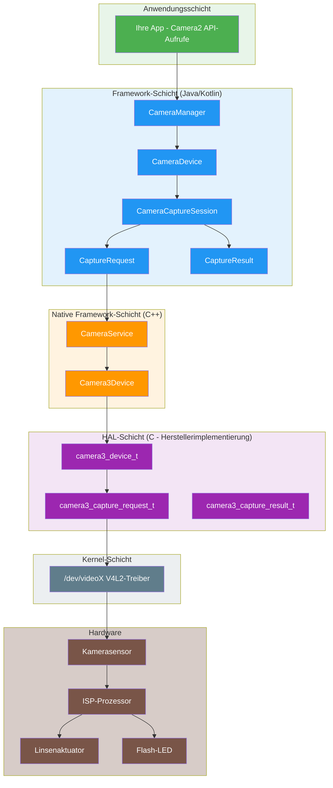
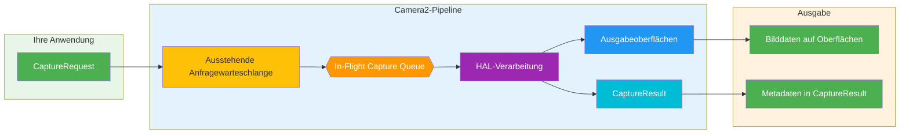
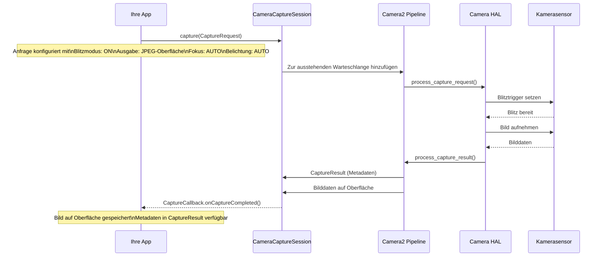
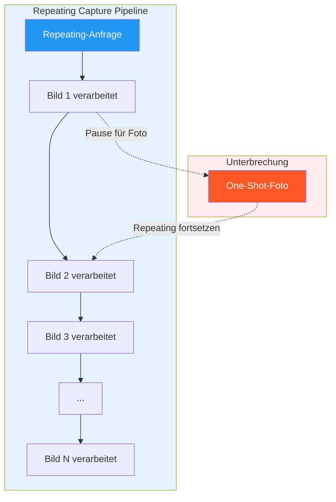
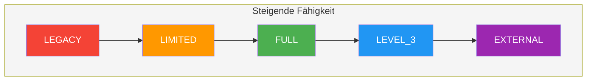
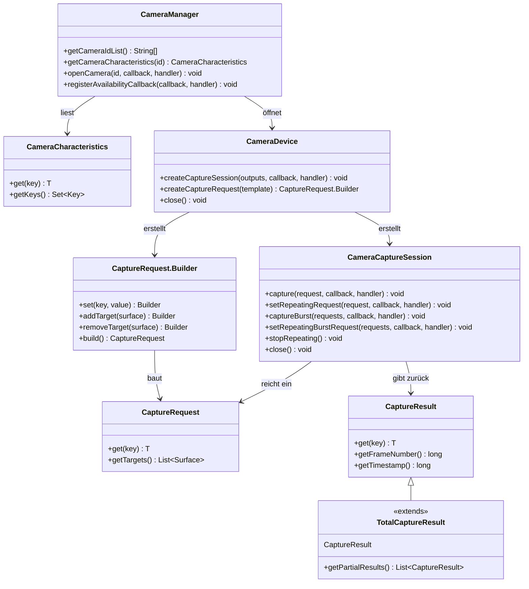
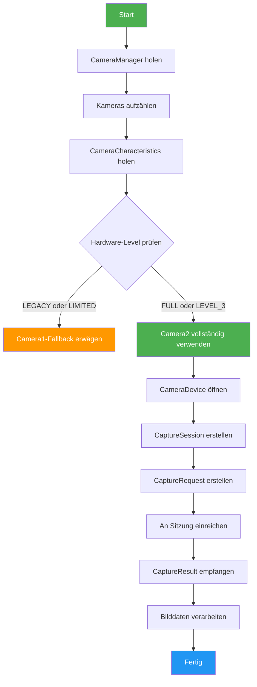
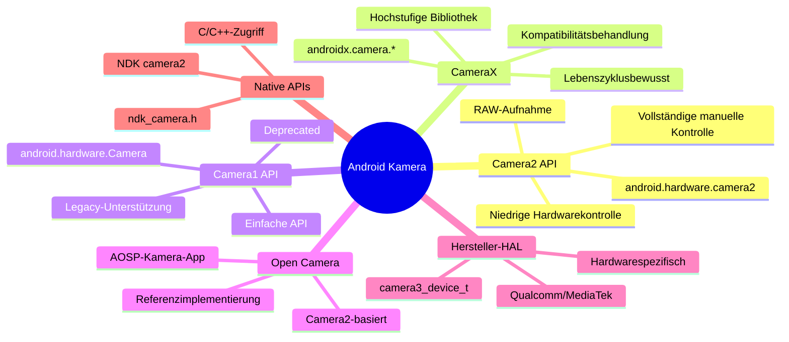

# Kapitel 1: Willkommen bei Android Camera2

> **Kapitelübersicht:** In diesem Kapitel werden wir die Welt von Android Camera2 von Grund auf erkunden. Sie werden nicht nur verstehen, *was* Camera2 ist, sondern auch *warum* es entwickelt wurde, *wie* es funktioniert und *wo* es im Android-Kamera-Ökosystem angesiedelt ist. Wir werden das Pipeline-Modell, die Capture-Typen, die Hardware-Level-Klassifizierung und die vollständige Architektur von der App bis zum HAL behandeln.

---

## 1.1 Warum Camera2 lernen?

Fast jedes Smartphone verfügt heute über ein leistungsstarkes Kamerasystem. Ein modernes Telefon kann:

- Professionell aussehende Fotos mit Computergrafik erfassen
- 4K- und 8K-Videos mit hohen Bildraten aufnehmen
- Porträtteffekte mit Tiefensensorik erzeugen
- Bei extremem Schwachlicht mit Nachtruhe-Modus aufnehmen
- Zeitlupenvideos mit 960 fps aufnehmen
- 3D-Tiefeninformationen für AR-Anwendungen generieren
- Mehrere Kameras nahtlos zusammenführen

Aber wenn Sie die Standard-Kamera-App öffnen, sehen Sie nur eine einfache Oberfläche: einen Auslöser, eine Zoom-Steuerung und einige Aufnahmemodi.

Hinter dieser einfachen Oberfläche verbirgt sich ein überraschend komplexes System. Die Kamera-App kommuniziert mit Hardwarekomponenten, Bildprozessoren und Android-Frameworks, um jedes einzelne Bild zu erzeugen.

### Für wen ist Camera2 interessant?

Als Android-Entwickler möchten wir möglicherweise Anwendungen entwickeln, die über die Standard-Kamera-App hinausgehen:

- Eine **manuelle Fotografieanwendung** mit vollständiger Kontrolle über Belichtung, ISO und Fokus
- Ein **Kamera-Testwerkzeug** für Techniker zur Überprüfung der Gerätefunktionen
- Eine **Computer-Vision-Anwendung**, die Zugriff auf Rohbilder benötigt
- Eine **3D-Scan-Anwendung** unter Verwendung von Tiefensensoren
- Ein **professioneller Videorecorder** mit Codec-Auswahl und Bitratenkontrolle
- Ein **Kamera-Fähigkeitsanalysator** wie unser eigenes [Android Camera Parameters](https://github.com/zoozooll/AndroidCameraParameters)

Wenn eines dieser Szenarien vertraut klingt, ist Camera2 die API, die Sie beherrschen müssen.

---

## 1.2 Was ist Android Camera2?

**Android Camera2** ist das moderne Kamera-Framework, das von Google in **Android 5.0 (API-Level 21)** eingeführt wurde. Es ersetzte die ursprüngliche `android.hardware.Camera`-API (heute retrospektiv als **Camera1** bezeichnet).

### Das Problem, das Camera2 löst

Die alte Kamera-API (Camera1) war für eine einfachere Welt konzipiert: eine Kamera, einfache Fotoaufnahmen und einfache Videoaufzeichnung. Aber die Smartphone-Kameras entwickelten sich dramatisch weiter:

| Ära | Typisches Gerät | Kamera-API |
|-----|----------------|------------|
| 2010-2014 | Einzelkamera, einfacher Sensor | Camera1 |
| 2015-2018 | Dualkameras, OIS, HDR | Camera2 (eingeschränkte Nutzung) |
| 2019-2022 | Dreifachkameras, Tiefe, Telefoto | Camera2 (Standard) |
| 2023+ | Vierfachkameras, Periskop, LiDAR, UWB | Camera2 (essentiell) |

Moderne Geräte können mehrere Rückkameras (Weitwinkel, Ultraweitwinkel, Telefoto, Periskop), Tiefensensoren und sogar externe USB-Kameras enthalten. Sie unterstützen erweiterte Funktionen wie:

- Manuelle Belichtung und Fokus
- RAW-Bildaufnahme
- Hochgeschwindigkeitsvideoaufnahme
- HDR-Verarbeitung
- Optische Stabilisierung (OIS)
- Mehrkamerafusion

Camera2 wurde entwickelt, um Entwicklern **tiefe, präzise und granulare Kontrolle** über die Kamera-Hardware zu geben.

---

## 1.3 Camera2 vs Camera1 vs CameraX

Bevor wir tief in Camera2 eintauchen, klären wir die Beziehung zwischen den drei wichtigsten Kamera-APIs.

### Camera1 (`android.hardware.Camera`)

- **Eingeführt:** Android 1.0 (in Android 5.0 deprecated)
- **Modell:** Verfahrensorientiert, zustandsbehaftet, einzelkameraorientiert
- **Stärken:** Einfach, gut verstanden, weitgehend kompatibel
- **Schwächen:** Begrenzte Kontrolle, keine RAW-Unterstützung, keine Mehrkamera, keine Burst-Modus

### Camera2 (`android.hardware.camera2`)

- **Eingeführt:** Android 5.0 (API 21)
- **Modell:** Objektorientiert, zustandslos, Anfrage/Antwort-Pipeline
- **Stärken:** Tiefe Hardwarekontrolle, RAW-Unterstützung, Mehrkamera, Hochgeschwindigkeitsvideo
- **Schwächen:** Komplex, ausführlich, erfordert Verständnis der Kamerainterna

### CameraX (`androidx.camera.*`)

- **Eingeführt:** Android 10 (Vorabversion), stabil in Android 11+
- **Modell:** Deklarativ, lebenszyklusbewusst, anwendungsfallorientiert
- **Stärken:** Einfach zu verwenden, automatische Kompatibilität, Lebenszyklusverwaltung
- **Schwächen:** Begrenzte erweiterte Kontrolle, möglicherweise nicht alle Hardwarefunktionen verfügbar

### Vergleichstabelle

| Dimension | Camera1 | Camera2 | CameraX |
|-----------|---------|---------|---------|
| **Level** | Niedrig (deprecated) | Niedrig (aktuell) | Hoch (Jetpack) |
| **Schwierigkeit** | Einfach | Schwer | Einfach |
| **Kontrolle** | Minimal | Maximum | Moderat |
| **RAW-Unterstützung** | Nein | Ja | Begrenzt |
| **Mehrkamera** | Nein | Ja | Begrenzt |
| **Burst-Modus** | Nein | Ja | Nein |
| **Manuelle Steuerung** | Begrenzt | Voll | Begrenzt |
| **Geeignet für** | Legacy-Apps | Erweiterte Kamera-Apps | Die meisten Kamera-Apps |
| **Status** | Deprecated | Aktiv | Empfohlen |

### Warum sich diese Reihe auf Camera2 konzentriert

Während CameraX für die meisten Anwendungen empfohlen wird, ist das Verständnis von Camera2 unerlässlich, weil:

1. **CameraX basiert auf Camera2** — CameraX verwendet Camera2 im Hintergrund. Das Verständnis von Camera2 hilft Ihnen zu verstehen, was CameraX tut.
2. **Einige Funktionen sind nur in Camera2 verfügbar** — RAW-Aufnahme, manuelle Sensorsteuerung und erweiterte Mehrkamera-Szenarien erfordern Camera2.
3. **Debugging erfordert Camera2-Kenntnisse** — Wenn eine CameraX-App nicht wie erwartet funktioniert, müssen Sie oft das zugrunde liegende Camera2-Verhalten verstehen, um Probleme zu diagnostizieren.
4. **Camera2-Verständnis ist grundlegend** — Selbst wenn Sie CameraX für Ihre App verwenden, macht das Verständnis von Camera2 Sie zu einem besseren Android-Kamera-Entwickler.

---

## 1.4 Camera2 Architektur: Das Gesamtbild

Camera2 sitzt in der Mitte des Android-Kamera-Stacks und verbindet Anwendungscode mit Hardware-Treibern. Das Verständnis dieser Architektur ist entscheidend für Debugging und Optimierung.

### Schichtarchitektur



### Erklärung der Architekturschichten

| Schicht | Ort | Sprache | Verantwortung |
|---------|-----|---------|---------------|
| **Anwendung** | Ihr App-Code | Kotlin/Java | CaptureRequests erstellen, CaptureResults handhaben |
| **Framework (Java)** | `android.hardware.camera2.*` | Java | Öffentliche API, verwaltet Sitzungen, konvertiert Daten |
| **Native Framework** | `frameworks/av/` | C++ | Binder-IPC, CameraService, Camera3Device |
| **HAL** | `hardware/libhardware/` + Hersteller | C | Hardware-Abstraktion, herstellerspezifische Implementierung |
| **Kernel** | `/dev/videoX` | C | V4L2-Treiber, Hardware-Kommunikation |
| **Hardware** | Physisches Kameramodul | — | Sensor, ISP, Linse, Blitz |

### Schlüsselprinzip des Designs: Camera2 ist eine Pipeline

Das wichtigste Konzept, das man über Camera2 verstehen muss, ist, dass es Kameraoperationen als **Pipeline** modelliert. Jede Aktion — Vorschau, Fotoaufnahme, Videoaufzeichnung — wird als **Capture Request** ausgedrückt, der durch die Pipeline fließt und ein **Capture Result** erzeugt.

---

## 1.5 Das Camera2-Pipeline-Modell

Die Pipeline ist das Herzstück von Camera2s Design. Sie ersetzt das zustandsbehaftete Modell von Camera1 durch ein zustandsloses Anfrage/Antwort-Modell.

### Wie die Pipeline funktioniert



### Pipeline-Komponenten erklärt

| Komponente | Beschreibung |
|-----------|-------------|
| **CaptureRequest** | Ein Konfigurationsobjekt, das *ein Bild* der Aufnahme beschreibt. Enthält alle Parameter: Belichtungszeit, Fokusmodus, Blitz, Ausgabeoberflächen usw. |
| **Ausstehende Anfragewarteschlange** | Eine FIFO-Warteschlange, in der neue CaptureRequests auf die Verarbeitung warten |
| **In-Flight Capture Queue** | Anfragen, die derzeit vom HAL verarbeitet werden. Normalerweise auf 1-4 Anfragen begrenzt, je nach Gerät |
| **HAL-Verarbeitung** | Die Hardware-Abstraktionsschicht verarbeitet die Anfrage: steuert Sensor, ISP, Linse usw. |
| **Ausgabeoberflächen** | Bilder werden auf konfigurierten Oberflächen geschrieben (Vorschau-Oberfläche, ImageReader-Oberfläche usw.) |
| **CaptureResult** | Metadaten über die Aufnahme: tatsächliche Belichtungszeit, AF-Zustand, Zeitstempel usw. Enthält KEINE Bilddaten |

### Schlüsseleigenschaften der Pipeline

1. **Anfragen sind zustandslos** — Jede CaptureRequest enthält alle notwendigen Informationen. Die Pipeline hat kein Gedächtnis an vorherige Anfragen.
2. **Verarbeitung ist sequentiell** — Anfragen werden in FIFO-Reihenfolge vom HAL verarbeitet.
3. **Ergebnisse sind asynchron** — CaptureResults treffen über Rückrufe ein, nicht synchron zurückgegeben.
4. **Mehrere Ausgaben pro Anfrage** — Eine CaptureRequest kann auf mehrere Oberflächen schreiben (z. B. Vorschau + Foto gleichzeitig).
5. **Pipeline kann konfiguriert werden** — Sie können Vorlagen (Vorschau, Stillaufnahme, Aufzeichnung) oder vollständig manuellen Modus wählen.

### Konkretes Beispiel: Ein Foto mit Blitz aufnehmen

Um die Pipeline zu verstehen, verfolgen wir, was passiert, wenn Sie ein Foto mit Blitz aufnehmen:



---

## 1.6 Capture-Typen: One-Shot, Burst und Repeating

Camera2 definiert drei grundlegende Capture-Typen, die jeweils unterschiedlichen Anwendungsfällen dienen. Das Verständnis dieser ist entscheidend für das korrekte Design von Kameraanwendungen.

### Typ 1: One-Shot-Capture

**One-Shot**-Aufnahmen werden genau einmal ausgeführt. Sie sind ideal für einzelne Aktionen wie das Aufnehmen eines Fotos oder das Anwenden einer einmaligen Einstellungsänderung.


**Anwendungsfälle:**
- Aufnahme eines einzelnen Fotos
- Anwenden eines temporären Blitzes
- Aufnahme eines Bildes zur Analyse
- Einmaliges Auslösen des Autofokus

**API-Aufruf:**
```kotlin
cameraCaptureSession.capture(captureRequest, callback, handler)
```

### Typ 2: Burst-Capture

**Burst**-Aufnahmen werden mehrere Mal nacheinander ohne Unterbrechung ausgeführt. Sobald gestartet, können keine anderen Anfragen eingefügt werden, bis der Burst abgeschlossen ist.


### Schlüsseleigenschaften:
- Alle Bilder in einem Burst haben identische oder schrittweise unterschiedliche Einstellungen
- Keine anderen Anfragen können während eines Burst verarbeitet werden
- Die Burst-Warteschlange ist von der ausstehenden Anfragewarteschlange getrennt
- Höhere Priorität als Repeating-Anfragen

**Anwendungsfälle:**
- Kontinuierliche Fotoaufnahme (Burst-Modus)
- Bracketing (Aufnahme derselben Szene mit unterschiedlichen Belichtungen)
- Bewegungsanalyse (Aufnahme schnell bewegter Motive)
- Sequentielle Mehrbildaufnahme für Compositing

**API-Aufruf:**
```kotlin
cameraCaptureSession.captureBurst(burstRequests, callback, handler)
```

### Typ 3: Repeating-Capture

**Repeating**-Aufnahmen werden kontinuierlich ausgeführt und bilden die Grundlage für Live-Vorschau und Videoaufzeichnung. Wenn eine Repeating-Anfrage aktiv ist, belegt sie die Pipeline zwischen anderen Aufnahmen.



### Schlüsseleigenschaften:
- Es kann nur eine Repeating-Anfrage gleichzeitig aktiv sein (ersetzt die vorherige)
- Wird von One-Shot- und Burst-Anfragen unterbrochen, anschließend automatisch fortgesetzt
- Bildet die Grundlage für Vorschau und Videoaufzeichnung
- Erzeugt keine einzelnen CaptureResults für jedes Bild (verwendet teilweise Ergebnisse aus Effizienzgründen)

**Anwendungsfälle:**
- Live-Kameravorschau
- Videoaufzeichnung
- Kontinuierliche Fokusüberwachung
- Echtzeit-Bildanalyse

**API-Aufruf:**
```kotlin
cameraCaptureSession.setRepeatingRequest(captureRequest, callback, handler)
// oder für Video:
cameraCaptureSession.setRepeatingBurstRequest(burstRequests, callback, handler)
```

### Vergleich der Capture-Typen

| Funktion | One-Shot | Burst | Repeating |
|---------|----------|-------|-----------|
| **Ausführung** | Einmal | Mehrfach (zusammenhängend) | Kontinuierlich |
| **Priorität** | Hoch | Am höchsten | Am niedrigsten |
| **Unterbrechung** | Nicht unterbrechbar | Nicht unterbrechbar | Kann unterbrochen werden |
| **Warteschlange** | Ausstehende Warteschlange | Separate Burst-Warteschlange | Pipeline-Belegung |
| **Typischer Anwendungsfall** | Foto, einzelnes Bild | Burst-Modus, Bracketing | Vorschau, Video |
| **Ergebnisrückruf** | Ein Ergebnis pro Aufruf | Ein Ergebnis pro Bild | Ergebnisse periodisch |

### Das Capture-Template-System

Camera2 stellt vordefinierte Vorlagen für gängige Aufnahmeszenarien bereit:

| Vorlage | Beschreibung | Anwendungsfall |
|---------|-------------|---------------|
| `TEMPLATE_PREVIEW` | Für Live-Vorschau optimiert | Kamera-Vorschau |
| `TEMPLATE_STILL_CAPTURE` | Für Fotoaufnahme optimiert | Fotos aufnehmen |
| `TEMPLATE_RECORD` | Für Videoaufzeichnung optimiert | Videoaufnahme |
| `TEMPLATE_VIDEO_SNAPSHOT` | Foto während Videoaufzeichnung | Schnappschuss während der Aufnahme |
| `TEMPLATE_ZERO_SHUTTER_LAG` | Hohe Qualität, minimaler Verzug | Burst-Fotografie |
| `TEMPLATE_MANUAL` | Alle Automatiksteuerungen deaktiviert | Vollständige manuelle Kontrolle |

Vorlagen sind Abkürzungen, die gängige Parameter vorkonfigurieren. Sie können dann einzelne Einstellungen aus der Vorlage modifizieren.

---

## 1.7 Unterstützte Hardware-Level

Nicht alle Android-Geräte unterstützen den vollständigen Camera2-Funktionsumfang. Um dies zu adressieren, definierte Google **Unterstützte Hardware-Level** — ein Klassifizierungssystem, das Entwicklern sagt, was sie von der Kameraimplementierung eines Geräts erwarten können.

### Hardware-Level-Klassifizierung



### Level-Beschreibungen

| Level | Beschreibung | Camera2-Unterstützung |
|-------|-------------|----------------------|
| **LEGACY** | Rückwärtskompatibel mit Camera1. Camera2-Aufrufe werden im Hintergrund in Camera1 konvertiert. | Nur grundlegende Camera1-Funktionen |
| **LIMITED** | Einige Camera2-Funktionen unterstützt. Vollständige Camera2-Pipeline nicht garantiert. | Teilweise Camera2-Funktionen |
| **FULL** | Vollständiger Camera2-Funktionsumfang. Vollständige Pipeline, manuelle Steuerung, Mehrkamera. | Alle Camera2-Funktionen |
| **LEVEL_3** | Alles in FULL, plus YUV-Reprocessing und zusätzliche Ausgabestreams. | FULL + erweiterte Funktionen |
| **EXTERNAL** | Ähnlich wie LIMITED, aber für externe Kameras (USB usw.). | Externe Kamera-Unterstützung |

### So prüfen Sie den Hardware-Level

Sie können den Hardware-Level mit `CameraCharacteristics` abfragen:

```kotlin
val cameraManager = getSystemService(Context.CAMERA_SERVICE) as CameraManager
val cameraId = cameraManager.cameraIdList[0]
val characteristics = cameraManager.getCameraCharacteristics(cameraId)

val hardwareLevel = characteristics.get(CameraCharacteristics.INFO_SUPPORTED_HARDWARE_LEVEL)
val levelName = when (hardwareLevel) {
    CameraCharacteristics.INFO_SUPPORTED_HARDWARE_LEVEL_LEGACY -> "LEGACY"
    CameraCharacteristics.INFO_SUPPORTED_HARDWARE_LEVEL_LIMITED -> "LIMITED"
    CameraCharacteristics.INFO_SUPPORTED_HARDWARE_LEVEL_FULL -> "FULL"
    CameraCharacteristics.INFO_SUPPORTED_HARDWARE_LEVEL_3 -> "LEVEL_3"
    CameraCharacteristics.INFO_SUPPORTED_HARDWARE_LEVEL_EXTERNAL -> "EXTERNAL"
    else -> "UNKNOWN"
}
Log.d("Camera", "Hardware Level: $levelName")
```

### Praktische Implikationen

| Level | Was es für Ihre App bedeutet |
|-------|------------------------------|
| **LEGACY** | Camera2 funktioniert möglicherweise mit Einschränkungen. Erwägen Sie Camera1 als Fallback. |
| **LIMITED** | Grundlegende Camera2-Funktionen funktionieren. Einige erweiterte Funktionen fehlen möglicherweise. |
| **FULL** | Vollständige Camera2-Unterstützung. Alle Camera2-Funktionen können sicher verwendet werden. |
| **LEVEL_3** | Kann YUV-Reprocessing und erweiterte Mehrstream-Funktionen verwenden. |
| **EXTERNAL** | Kann USB-Kameras und andere externe Eingänge unterstützen. |

### Laufzeitfähigkeitsabfrage

Neben dem Hardware-Level sollten Sie immer spezifische Fähigkeiten zur Laufzeit prüfen:

```kotlin
val capabilities = characteristics.get(CameraCharacteristics.REQUEST_AVAILABLE_CAPABILITIES)
capabilities?.forEach { capability ->
    when (capability) {
        CameraMetadata.REQUEST_AVAILABLE_CAPABILITIES_BACKWARD_COMPATIBLE ->
            Log.d("Camera", "Supports backward compatible mode")
        CameraMetadata.REQUEST_AVAILABLE_CAPABILITIES_MANUAL_SENSOR ->
            Log.d("Camera", "Supports manual sensor control")
        CameraMetadata.REQUEST_AVAILABLE_CAPABILITIES_MANUAL_POST_PROCESSING ->
            Log.d("Camera", "Supports manual post-processing")
        CameraMetadata.REQUEST_AVAILABLE_CAPABILITIES_RAW ->
            Log.d("Camera", "Supports RAW capture")
        CameraMetadata.REQUEST_AVAILABLE_CAPABILITIES_PRIVATE_REPROCESSING ->
            Log.d("Camera", "Supports private reprocessing")
        CameraMetadata.REQUEST_AVAILABLE_CAPABILITIES_DEEP_OUTPUT ->
            Log.d("Camera", "Supports deep output")
    }
}
```

---

## 1.8 Übersicht der Camera2-Kernklassen

Die API von Camera2 basiert auf einer kleinen Gruppe von Kernklassen. Lernen wir sie kennen, bevor wir tief in jede einzelne eintauchen.

### Beziehungsdiagramm der Kernklassen



### Klassenverantwortlichkeiten

| Klasse | Paket | Verantwortung |
|--------|-------|---------------|
| `CameraManager` | `android.hardware.camera2` | Top-Level-Systemdienst. Zählt Kameras auf, bietet Zugriff auf CameraDevice. |
| `CameraCharacteristics` | `android.hardware.camera2` | Schreibgeschützte Metadaten der Kamerafunktionen. |
| `CameraDevice` | `android.hardware.camera2` | Stellt eine verbundene Kamera dar. Erstellt Sitzungen und Capture-Request-Builder. |
| `CameraCaptureSession` | `android.hardware.camera2` | Die Pipeline-Instanz. Reicht CaptureRequests ein, verwaltet Repeating-Aufnahmen. |
| `CaptureRequest` | `android.hardware.camera2` | Unveränderliche Aufnahmekonfiguration. Alle Parameter für ein Bild. |
| `CaptureRequest.Builder` | `android.hardware.camera2` | Builder zum Erstellen von CaptureRequest-Objekten. |
| `CaptureResult` | `android.hardware.camera2` | Metadatenausgabe einer abgeschlossenen Aufnahme. |
| `TotalCaptureResult` | `android.hardware.camera2` | Vollständiges Aufnahmeergebnis einschließlich aller teilweisen Ergebnisse. |

### Der Camera2-Workflow



---

## 1.9 Camera2 vs Camera1: Detaillierter Vergleich

Wenn Sie bereits mit Camera1 gearbeitet haben, werden Sie die Unterschiede zu schätzen wissen. Wenn nicht, hilft Ihnen dieser Abschnitt zu verstehen, warum Camera2 eine grundlegende Neukonzeption ist.

### Architekturvergleich

| Aspekt | Camera1 | Camera2 |
|--------|---------|---------|
| **Programmiermodell** | Verfahrensorientiert (imperativ) | Objektorientiert (deklarativ) |
| **Zustandsverwaltung** | Zustandsbehaftet (Kamera verwaltet Zustand) | Zustandslos (jede Anfrage ist in sich geschlossen) |
| **Aufnahmemodell** | Befehle (takePicture(), startPreview()) | Pipeline (CaptureRequest → CaptureResult) |
| **Threading** | Meist single-threaded | Für Multi-Threading-Einsatz konzipiert |
| **Fehlerbehandlung** | Ausnahmen, schwer zu recoveren | Fehlercodes + Ausnahmen, granularer |
| **Metadaten** | Schreibgeschützt nach der Aufnahme | Verfügbar in Echtzeit während der Aufnahme |
| **Mehrere Ausgaben** | Nicht unterstützt | Eine Anfrage → mehrere Oberflächen |
| **Zero-Copy** | Nicht unterstützt | Unterstützt über ImageReader |

### API-Vergleich nebeneinander

#### Eine Kamera öffnen

```kotlin
// Camera1 (alte API)
val camera = Camera.open()
camera.setPreviewDisplay(surfaceHolder)
camera.startPreview()

// Camera2 (neue API)
val cameraManager = getSystemService(Context.CAMERA_SERVICE) as CameraManager
cameraManager.openCamera(cameraId, object : CameraDevice.StateCallback() {
    override fun onOpened(camera: CameraDevice) {
        mCameraDevice = camera
        // Sitzung und Anfragen erstellen...
    }
    override fun onDisconnected(camera: CameraDevice) { camera.close() }
    override fun onError(camera: CameraDevice, error: Int) { camera.close() }
}, handler)
```

#### Ein Foto aufnehmen

```kotlin
// Camera1 (alte API)
camera.takePicture(null, null, object : Camera.PictureCallback() {
    override fun onPictureTaken(data: ByteArray, camera: Camera) {
        // Bilddaten verarbeiten
    }
})

// Camera2 (neue API)
val requestBuilder = mCameraDevice.createCaptureRequest(CameraDevice.TEMPLATE_STILL_CAPTURE)
requestBuilder.addTarget(imageReader.surface)
val captureRequest = requestBuilder.build()
mCameraCaptureSession.capture(captureRequest, object : CameraCaptureSession.CaptureCallback() {
    override fun onCaptureCompleted(session: CameraCaptureSession, 
                                    request: CaptureRequest, 
                                    result: TotalCaptureResult) {
        // Metadaten in result
        val exposureTime = result.get(CaptureResult.SENSOR_EXPOSURE_TIME)
    }
}, handler)
// Bilddaten treffen über ImageReader.OnImageAvailableListener ein
```

#### Hauptunterschiede in der Praxis

| Vorgang | Camera1 | Camera2 |
|---------|---------|---------|
| **Vorschau + Foto** | Vorschau muss gestoppt werden, um Foto aufzunehmen, dann neu gestartet | Foto kann ohne Stoppen der Vorschau aufgenommen werden |
| **Mehrere Fotos** | Nur ein Foto gleichzeitig | Burst-Modus mit beliebiger Anzahl |
| **Manuelle Belichtung** | Nicht verfügbar | Vollständige Kontrolle über Belichtungszeit und Gain |
| **Manueller Fokus** | Nur vordefinierte Modi | Vollständige Kontrolle über Linsenposition |
| **RAW-Aufnahme** | Nicht verfügbar | Unterstützt auf FULL+-Geräten |
| **Echtzeit-Metadaten** | Nicht verfügbar | Verfügbar über teilweise CaptureResults |

### Migrations-Tipps von Camera1

Wenn Sie von Camera1 zu Camera2 migrieren, beachten Sie diese Tipps:

1. **Denken Sie in CaptureRequests**, nicht in Befehlen. Jede Aktion — Fokus, Blitz, Foto — ist eine CaptureRequest.
2. **Trennen Sie Vorschau und Aufnahme**. Bei Camera1 mussten Sie die Vorschau stoppen, um aufzunehmen. Bei Camera2 reichen Sie eine separate Anfrage ein, während die Repeating-Anfrage fortläuft.
3. **Verwenden Sie Handler für Rückrufe**. Camera2-Rückrufe laufen auf dem Thread eines Handlers. Geben Sie immer einen an, um ANRs zu vermeiden.
4. **Prüfen Sie zuerst den Hardware-Level**. Wenn ein Gerät LEGACY ist, erwägen Sie die Verwendung von Camera1 stattdessen.
5. **Verwenden Sie CaptureRequest-Vorlagen** für gängige Vorgänge. Modifizieren Sie aus Vorlagen statt von Grund auf neu zu bauen.
6. **Blockieren Sie nicht den Haupt-Thread**. Alle Camera2-Vorgänge sollten auf einem Hintergrund-Thread ausgeführt werden.

---

## 1.10 Camera2 im Android-Ökosystem

Camera2 existiert nicht isoliert. Es ist Teil eines größeren Ökosystems kamerabezogener APIs und Bibliotheken.

### Kamera-API-Ökosystem



### Welche API wann verwenden

| Anforderung | Empfohlene API | Grund |
|-------------|---------------|-------|
| Einfache Foto-App | CameraX | Am einfachsten, am kompatibelsten |
| Videoaufzeichnung | CameraX | Eingebaute Video-Unterstützung |
| Manuelle Fotografie | Camera2 | Vollständige Kontrolle über alle Parameter |
| Computer Vision | Camera2 | Direkter Bildzugriff, minimaler Verzug |
| Mehrkamerafusion | Camera2 | Nur API mit vollständiger Mehrkamera-Unterstützung |
| RAW-Aufnahme | Camera2 | Nur API mit RAW-Unterstützung |
| Externe Kamera | Camera2 | Externe Kamera-Unterstützung (EXTERNAL-Level) |
| Legacy-Geräte-Unterstützung | Camera1 | Kompatibilität mit älteren Geräten |

---

## 1.11 Lernen mit Android Camera Parameters

Das Lesen von Dokumentation ist nützlich, aber Kamerafunktionen sind leichter zu verstehen, wenn Sie echte Daten von einem echten Telefon sehen können. Während dieser Reihe werden wir [Android Camera Parameters](https://github.com/zoozooll/AndroidCameraParameters) verwenden, um tatsächliche Kamerainformationen von Ihrem eigenen Gerät zu erkunden.

Sie können die App verwenden, um Folgendes zu entdecken:

- Verfügbare Kameras (ID, Ausrichtung, Hardware-Level)
- Unterstützte Auflösungen und Bildraten
- Sensorinformationen (aktive Array-Größe, Brennweite)
- Unterstützung manueller Steuerung (ISO-Bereich, Belichtungszeitbereich)
- RAW-Fähigkeit und Formate
- Hardware-Level und unterstützte Fähigkeiten
- Kompletter CameraCharacteristics-Dump

Statt von abstrakten Beispielen zu lernen, können Sie direkt Ihr eigenes Gerät untersuchen und sehen, wie die Konzepte in diesem Kapitel auf echte Hardware zutreffen.

---

## 1.12 Kernaussagen

Herzlichen Glückwunsch zum Abschluss von Kapitel 1! Hier ist, was Sie sich merken sollten:

### Kernkonzepte

1. **Camera2 ist eine Pipeline** — Jede Kameraoperation ist eine CaptureRequest, die durch die Pipeline fließt und ein CaptureResult erzeugt.
2. **Capture-Typen** — One-Shot (einzeln), Burst (mehrere zusammenhängend), Repeating (kontinuierlich)
3. **Hardware-Level** — LEGACY → LIMITED → FULL → LEVEL_3 → EXTERNAL
4. **Architekturschichten** — App → Framework → Native Framework → HAL → Kernel → Hardware

### Praktische Grundsätze

1. **Hardware-Level immer prüfen** — Nicht alle Geräte unterstützen vollständige Camera2-Funktionen
2. **Fähigkeiten zur Laufzeit prüfen** — Nicht davon ausgehen, dass Funktionen verfügbar sind
3. **Vorlagen für gängige Vorgänge verwenden** — `TEMPLATE_PREVIEW`, `TEMPLATE_STILL_CAPTURE` usw.
4. **Auf Hintergrund-Threads ausführen** — Camera2-Vorgänge dürfen den Haupt-Thread nicht blockieren
5. **Vorschau und Aufnahme trennen** — Repeating-Anfrage für Vorschau, One-Shot für Fotos

### Was als Nächstes kommt

Im nächsten Kapitel, **Smartphone-Kameras verstehen**, werden wir Android kurz verlassen und die Kamera-Hardware selbst erkunden. Sie werden lernen über:

- Kamerasensortechnologie (CMOS vs CCD)
- Linsendesign und Brennweite
- ISP (Image Signal Processor) Verarbeitungspipeline
- Warum zwei Telefone mit ähnlicher Megapixelanzahl völlig unterschiedliche Fotos erzeugen können
- Die komplette Bildpipeline vom Licht bis zum fertigen Foto

Sobald Sie die Hardware verstehen, werden die Camera2-Konzepte viel intuitiver.

---

## 1.13 Zusammenfassung

Android Camera2 ist ein leistungsstarkes, niedrigstufiges Kamera-Framework, das Entwicklern eine beispiellose Kontrolle über die Kamera-Hardware gibt. Seine Pipeline-basierte Architektur, drei Capture-Typen und die Hardware-Level-Klassifizierung bilden eine robuste Grundlage für den Aufbau erweiterter Kameraanwendungen.

In diesem Kapitel haben wir behandelt:
- ✅ Camera2-Architektur und Ökosystemposition
- ✅ Pipeline-Modell mit Anfrage/Ergebnis-Fluss
- ✅ Capture-Typen: One-Shot, Burst, Repeating
- ✅ Hardware-Level-Klassifizierung und Laufzeitprüfung
- ✅ Übersicht und Beziehungen der Kernklassen
- ✅ Detaillierter Vergleich von Camera1 vs Camera2

Tauchen wir nun in Kapitel 2 in die Kamera-Hardware selbst ein! 🚀