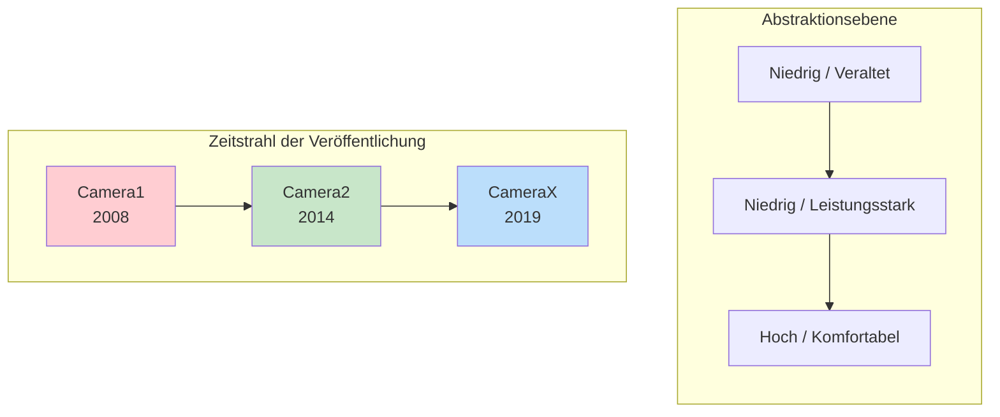
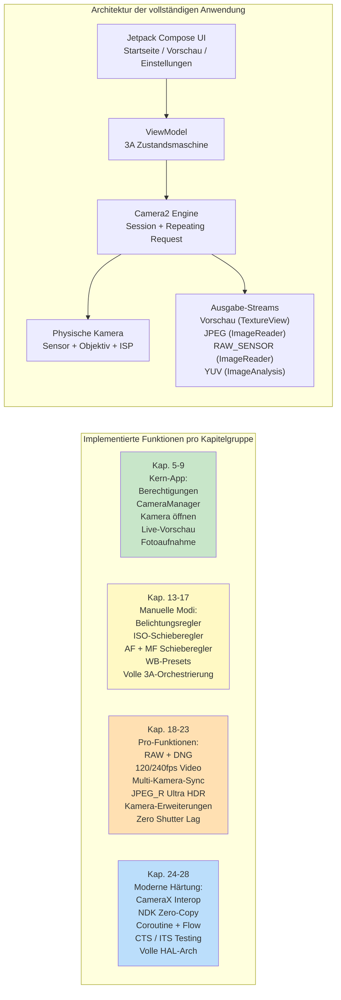

# Kapitel 1: Willkommen bei Android Camera2

> **Kapitelübersicht:** In diesem ersten Kapitel treten wir einen Schritt zurück und betrachten das große Ganze. Warum existiert Camera2? Welche Probleme löst es im Vergleich zur älteren Camera-API und der neueren CameraX-Bibliothek? Wer sollte Zeit in das Erlernen von Camera2 investieren? Und vor allem, was werden Sie am Ende dieser Serie tatsächlich gebaut haben? Noch keine tiefe Architektur, keine HAL-Schichten und keine Pipeline-Diagramme – nur klare Antworten auf die Fragen, die sich jeder Entwickler stellt, bevor er eintaucht.

***

## 1.1 Warum Camera2?

Nehmen Sie Ihr Smartphone zur Hand.

Schauen Sie auf die Rückseite. Sie sehen wahrscheinlich zwei, drei oder sogar noch mehr Kameraobjektive. Dieser kleine rechteckige Buckel beherbergt mehr optische und Silizium-Power als eine professionelle Spiegelreflexkamera aus den mittleren 2000er Jahren.

Öffnen Sie nun die Standard-Kamera-App.

Tippen Sie auf den Auslöser. Sofort wird ein hochauflösendes Foto in Ihrer Galerie gespeichert. Das Bild sieht wahrscheinlich großartig aus – lebendige Farben, scharfe Motive, sanfte Hintergrundunschärfe und helle Schatten selbst bei Innenlicht.

Aber die Kamera-App, die Sie verwenden, kratzt nur an der Oberfläche dessen, was die Hardware leisten kann. Unter diesem freundlichen Auslöser verbirgt sich eine unglaublich ausgeklügelte Imaging-Pipeline: eine, die RAW-Fotos aufnehmen, Zeitlupenvideos mit 240 fps aufzeichnen, 10 Bilder für eine einzige Nachtaufnahme verschmelzen oder jeden Mikrometer der Objektivbewegung unabhängig steuern kann.

Die meisten Android-Apps von Drittanbietern greifen nie auf diese Leistung zu. Warum? Weil **die alte Android Kamera-API (rückwirkend Camera1 genannt) extrem eingeschränkt war**. Camera1 wurde für eine Welt von Einzelkamera-Handys mit grundlegender Foto- und Videoaufnahme entwickelt. Sie konnte folgendes nicht:

- Belichtungszeit oder ISO manuell steuern
- RAW-Sensordaten erfassen
- Zeitlupenaufnahmen mit hohen Bildraten aufzeichnen
- Mehrere Kameras gleichzeitig verwenden
- Zugriff auf Metadaten pro Frame während der Aufnahme
- Zuverlässige Serienbildaufnahmen machen

Beginnend mit **Android 5.0 (API-Level 21)** führte Google **Camera2 (android.hardware.camera2)** ein, um diese Mauern einzureißen. Camera2 ist kein inkrementelles Update – es ist ein **vollständiges Redesign**, das von Grund auf neu entwickelt wurde, um die rohen Fähigkeiten moderner Kamera-Chips für jeden Android-Entwickler zugänglich zu machen.

Kurz gesagt: **Camera2 existiert, weil Smartphone-Kameras professionelles Niveau erreicht haben und die alte API nicht mehr mithalten konnte.**

***

## 1.2 Camera1 vs. Camera2 vs. CameraX

Über ein Jahrzehnt Android-Kameraentwicklung hat **drei Generationen** von Kamera-APIs hervorgebracht. Bevor Sie eine einzige Zeile Code schreiben, ist es wichtig zu verstehen, welche API welches Problem löst.

### Drei Generationen, drei Philosophien

### Camera1 — `android.hardware.Camera`

Die ursprüngliche Kamera-API, eingeführt mit Android 1.0 und **veraltet seit Android 5.0**.

- **Modell:** Prozedurale Befehle. Sie rufen Methoden wie `startPreview()`, `takePicture()`, `setFlashMode()` auf.
- **Designphilosophie:** "Die Kamera ist eine Zustandsmaschine, der Sie Befehle erteilen."
- **Am besten geeignet für:** Legacy-Apps, die auf sehr alte Geräte (vor Lollipop) abzielen. Das war's.
- **Warum man sie vermeiden sollte:** Google aktualisiert sie nicht mehr. Neue Hardwarefunktionen (Multi-Kamera, RAW, HDR) werden nie auf Camera1 zurückportiert. Die API-Oberfläche ist winzig. Auf modernen Geräten wird Camera1 intern tatsächlich **durch einen Camera2-Wrapper emuliert**, sodass Sie die Komplexität von Camera2 bezahlen, ohne die Vorteile von Camera2 zu nutzen.

### Camera2 — `android.hardware.camera2.*`

Das moderne Low-Level-Framework, eingeführt in Android 5.0 und seitdem mit jeder Android-Version kontinuierlich erweitert.

- **Modell:** Eine Request/Response-Pipeline. Sie erstellen unveränderliche `CaptureRequest`-Objekte, senden diese an eine `CameraCaptureSession` und erhalten asynchron `CaptureResult`-Metadaten + Bildpuffer.
- **Designphilosophie:** "Die Kamera ist eine programmierbare Pipeline. Sie steuern jeden Parameter jedes Frames."
- **Am besten geeignet für:** Fortgeschrittene Kamera-Apps, manuelle Fotowerkzeuge, Computer-Vision-Pipelines, RAW-Erfassung, Multi-Kamera-Forschung, Hochgeschwindigkeitsvideo und alle Anwendungsfälle, in denen Sie hardwarenahe Kontrolle benötigen.
- **Warum man sie verwenden sollte:** Voller Zugriff auf jede Funktion, die der OEM-HAL bereitstellt. Direkte Frame-Steuerung. Der einzige API-Pfad für professionelle Funktionen. Camera2 ist das, was CameraX intern aufruft.

### CameraX — `androidx.camera.*`

Eine **Jetpack-Bibliothek** (keine Plattform-API), die 2019 in der Beta-Phase eingeführt und um Android 11 herum stabilisiert wurde.

- **Modell:** Deklarative Anwendungsfälle. Sie binden eine Reihe von `Preview`-, `ImageCapture`-, `ImageAnalysis`- oder `VideoCapture`-Anwendungsfällen an den Lebenszyklus (`bindToLifecycle()`), und die Bibliothek erledigt den Rest.
- **Designphilosophie:** "Wir haben die 10.000 Sonderfälle für Sie gelöst. Sagen Sie uns einfach, welche Ausgabe Sie benötigen."
- **Am besten geeignet für:** Die meisten Anwendungen, die eine Kamera benötigen. QR-/Barcode-Scanner, Foto-Uploads, Dokumentenscanning, einfache Videoaufzeichnung – jedes Szenario, in dem Komfort und Zuverlässigkeit wichtiger sind als rohe Kontrolle.
- **Warum man sie verwenden sollte:** Lebenszyklus-bewusst (keine Ressourcenlecks), die Auswahl der Auflösung erfolgt automatisch, OEM-Eigenheiten haben integrierte Workarounds, genau derselbe Code läuft auf Tausenden von Gerätemodellen ohne jegliche `if`-Anweisungen.

### Vergleich nebeneinander

| Dimension | Camera1 | Camera2 | CameraX |
|:---|:---|:---|:---|
| **Eingeführt** | Android 1.0 (2008) | Android 5.0 (2014) | Android 10 (Jetpack) |
| **Status** | Veraltet | Aktiv, gepflegt | Empfohlen (Jetpack) |
| **Abstraktion** | Niedrig (Legacy) | Niedrig | Hoch |
| **Lernkurve** | Einfach | Sehr steil | Sehr sanft |
| **Manuelle Belichtung / ISO / Fokus** | Eingeschränkt | Volle Kontrolle | Eingeschränkt über Interop |
| **RAW-Erfassung** | Nein | Ja | Mit Interop-Workarounds |
| **Multi-Kamera (physikalische Streams)** | Nein | Ja | Nein |
| **Hochgeschwindigkeitsvideo (120+ fps)** | Nein | Ja | Eingeschränkt |
| **Serienbilder / Bracketing** | Nein | Volle Kontrolle | Nein |
| **Metadaten pro Frame** | Nein | Ja, vollständige + Teilergebnisse | Über Interop-Callbacks verfügbar |
| **Lebenszyklus-Sicherheit** | Manuell, fehleranfällig | Manuell, fehleranfällig | Automatisch, an Lebenszyklus gebunden |
| **Handhabung von OEM-Eigenheiten** | Keine | Keine | Integriert (über 1000 Geräte getestet) |
| **Codevolumen für eine funktionierende App** | Mittel | Sehr hoch (ausführlich) | Sehr gering |
| **Leistung** | OK (indirekter Wrapper) | Maximal möglich | Nahezu maximal (geringer Overhead) |

***

## 1.3 Was kann Camera2 leisten?

Um die Leistung von Camera2 konkret zu verstehen, stellen Sie sich Funktionen vor, die Sie auf Flaggschiff-Telefonen gesehen haben. Camera2 macht **all diese programmatisch zugänglich**:

### Erfassung auf professionellem Niveau

- **Vollständige manuelle Belichtung:** Stellen Sie die Verschlusszeit von 1/8000 s bis 30 s und den ISO-Wert von 50 bis 102.400 ein. Erstellen Sie eine echte Pro-Modus-Benutzeroberfläche.
- **RAW-Fotografie:** Extrahieren Sie 10-Bit, 12-Bit, 14-Bit oder 16-Bit **unverarbeitete Bayer-Daten** direkt vom Sensor (kein Demosaicing, keine Rauschunterdrückung, keine Farbkorrektur). Schreiben Sie Adobe DNG-Dateien mit dem mitgelieferten `DngCreator` für die Bearbeitung in Lightroom.
- **Belichtungsreihen (Bracketing):** Nehmen Sie 3, 5, 7 oder 9 Bilder mit präzise abgestuften EV-Werten auf. Speisen Sie diese in einen HDR-Fusionsalgorithmus ein.
- **Zeitraffer-Locking:** Frieren Sie Belichtung, Fokus und Weißabgleich über **Tausende von Bildern** hinweg ein – kein Flackern, wenn sich die Sonne bewegt oder Wolken vorbeiziehen.

### Zugriff auf Hardware für computergestützte Fotografie

- **Hochgeschwindigkeitsvideo:** Konfigurieren Sie `CameraConstrainedHighSpeedCaptureSession` für Aufnahmen mit 120 fps, 240 fps oder sogar 960 fps. Erstellen Sie Zeitlupen-Editoren.
- **Logische Multi-Kamera:** Greifen Sie **gleichzeitig** auf **beide** physischen Kameras unter einer logischen Multi-Kamera-ID zu. Erfassen Sie synchronisierte YUV-Frames von einem Weitwinkel- und einem Teleobjektiv, um Tiefenkarten direkt auf dem Gerät zu berechnen.
- **YUV / PRIVATE Reprocessing (LEVEL_3-Geräte):** Halten Sie einen **Ringpuffer mit voller Auflösung im ISP** bereit und greifen Sie beim Tippen auf den Auslöser auf ein Bild aus der Vergangenheit zu, um die starke Rauschunterdrückung und Schärfung erneut auszuführen. So implementieren OEMs **Zero Shutter Lag (ZSL)**.
- **Ultra HDR / JPEG_R (Android 14+):** Fordern Sie `ImageFormat.JPEG_R`-Dateien an und schreiben Sie diese, die ein 8-Bit-SDR-JPEG **plus** eine sekundäre HDR-Gain-Map speichern. Legacy-Viewer sehen ein normales Foto; HDR-Panels rendern Highlights mit über 1.000 Nits.
- **Kamera-Erweiterungen (Android 12+):** Delegieren Sie Nacht-, Bokeh- (Porträt), HDR- und Gesichtsbearbeitungsmodi **an den OEM-HAL** – unter Verwendung genau derselben Multi-Frame-KI-Pipeline, die die Standardkamera verwendet.

### Fortgeschrittene Video- und Vision-Pipelines

- **Gleichzeitige Ausgabe mehrerer Streams:** Steuern Sie eine **Vorschau**-Surface, eine **YUV-Analyse**-Surface (für ML-Objekterkennung mit 30 fps) und eine **JPEG-Still**-Surface über eine einzige Capture-Anfrage – und das ohne Kopieren des Arbeitsspeichers.
- **Präzision des Blitz-Timings:** Koordinieren Sie explizit die Vorblitzmessung, das Auslösen des Hauptblitzes und das Auslesen des Rolling Shutters auf Frame-Basis.
- **Teilweise Erfassungsergebnisse:** Erhalten Sie AE-Status- und Fokusdistanz-Metadaten **Millisekunden bevor** der endgültige Bildpuffer bereit ist – dies ermöglicht eine Reaktionsschnelligkeit nach dem Motto "überall tippen und die UI aktualisiert sich sofort".
- **Offline-Sitzungen (API 30+):** Wenn der Benutzer Ihre App mitten im Nachtmodus in den Hintergrund schickt, übergeben Sie die laufende Multi-Frame-Zusammenführung an eine isolierte `CameraOfflineSession`, und der HAL beendet die Verarbeitung asynchron; Ihre App wacht für das fertige Bild wieder auf.

### Und das ist erst der Anfang

Jede neue Android-Version erweitert Camera2. Android 15 (API 35) fügte `CameraDeviceSetup` hinzu, sodass Sie Sitzungskonfigurationen abfragen können, **ohne den Sensor überhaupt einschalten zu müssen**, wodurch die Latenz bei der Funktionsprüfung um das Zehnfache reduziert wird. Die API ist lebendig, entwickelt sich weiter und ist der neuesten Kamerahardware immer einen Schritt voraus.

***

## 1.4 Wer sollte Camera2 lernen?

Das richtige Erlernen von Camera2 braucht Zeit. Die API-Oberfläche ist riesig – über 300 Metadaten-Schlüssel, Dutzende von Callbacks, mehrere Sitzungstypen und Hunderte von OEM-Sonderfällen. Sie sollten diese Zeit investieren, wenn eine der folgenden Beschreibungen auf Sie oder Ihr Projekt zutrifft:

### Sie entwickeln eine fortgeschrittene Kameraanwendung

Ihre App bietet einen **Pro-Modus** mit manuellen Reglern für ISO, Verschlusszeit, Fokus und Weißabgleich. Oder sie nimmt **RAW-Fotos** auf und lässt Benutzer diese für die Bearbeitung am Desktop exportieren. Oder sie nimmt **Zeitlupenvideos** auf. Nichts davon ist mit CameraX möglich (oder nur stark eingeschränkt).

### Sie entwickeln eine Computer-Vision- oder Forschungsanwendung

Sie benötigen **Zero-Copy-YUV-Frames mit niedrigster Latenz**, um eine On-Device-ML-Pipeline zu füttern. Oder Sie benötigen **frame-synchronisierte Sensordaten** (der Gyro-Zeitstempel in `SENSOR_TIMESTAMP` muss innerhalb von ±1 ms mit dem Bild übereinstimmen, um eine genaue SLAM / visuell-inertiale Odometrie zu ermöglichen). Oder Sie müssen die **exakte Verschlussdauer pro Frame** für strukturiertes Licht / Tiefenmessung steuern.

### Sie entwickeln ein Diagnosetool für Kamerafunktionen

Wie die Begleit-App zu dieser Serie – **Android Camera Parameters** ([GitHub](https://github.com/zoozooll/AndroidCameraParameters), [Google Play](https://play.google.com/store/apps/details?id=com.minininja.cameraparams)) – müssen Sie jeden `CameraCharacteristics`-Schlüssel erschöpfend ausgeben, um zu visualisieren, was jedes Gerät unterstützt. CameraX verbirgt absichtlich die meisten dieser Details.

### Sie debuggen ein Problem mit CameraX oder einer OEM-Kamera

CameraX versagt manchmal auf exotischen Geräten. Wenn Ihre CameraX-Vorschau verzerrt ist oder ein bestimmtes Galaxy-Modell im Nachtmodus grüne Bilder liefert oder das Pixel 9 bei `VideoCapture` abstürzt, **müssen** Sie auf Camera2 zurückgreifen, um den Fehler zu reproduzieren und zu isolieren.

### Sie arbeiten in den Bereichen Mobile Imaging, OEM-Kamera-Stacks oder Automotive-Kamera-Pipelines

Wenn Sie mit Vendor-HAL-Code, `frameworks/av/camera`, dem Camera NDK oder der Migration von Automotive EVS→Camera2 zu tun haben, ist Camera2-Kompetenz die Grundvoraussetzung.

### Wer muss Camera2 **nicht** lernen?

Wenn Ihre Anforderungen lauten: *"Ich muss Benutzern ermöglichen, ein Profilfoto aufzunehmen oder einen QR-Code zu scannen"* – **verwenden Sie CameraX**. Im Ernst. CameraX ist ein Meisterwerk der Ingenieurskunst. Es wird Ihnen Monate an Arbeit bei der Gerätekompatibilität ersparen. Camera2 ist ein Elektrowerkzeug; greifen Sie dazu, wenn Sie diese Leistung speziell benötigen.

***

## 1.5 Was Sie in diesem Buch bauen werden

Theorie ohne Code ist abstrakt. Code ohne Fortschritt ist verwirrend.

In diesem Buch werden Sie **schrittweise eine echte, voll funktionsfähige Camera2-Anwendung aufbauen**. Jedes Kapitel fügt eine Funktion hinzu, und jede Funktion lässt sich kompilieren und auf einem echten Telefon ausführen. Bis zum letzten Kapitel werden Sie diese komplette App zusammengebaut haben:

### Die Meilensteine

| Kapitelbereich | Was Sie danach tun können |
|:---|:---|
| **Kap. 1–4** | Sie verstehen die Hardware. Sie wissen, wie ein Objektiv, ein Sensor und ein ISP interagieren. Sie können das Datenblatt jedes Telefons lesen und sagen, welche Camera2-Funktionen es unterstützt. Sie haben die Begleit-App Android Camera Parameters installiert und Ihr eigenes Gerät erkundet. |
| **Kap. 5–9** | Sie haben eine **funktionierende Kamera-App**. Sie öffnet die Rückkamera, zeigt eine Live-Vorschau auf dem Bildschirm an und speichert ein JPEG-Foto, wenn Sie auf den Auslöser tippen. Vollständige Korrektur des Seitenverhältnisses, korrekte Porträt-Rotation und ordnungsgemäße Bereinigung des Lebenszyklus funktionieren alle. |
| **Kap. 10–12** | Sie verstehen, **warum** der Code so funktioniert, wie er es tut. Sie können einen CaptureRequest durch die Warteschlange für ausstehende Anforderungen, die In-Flight-Warteschlange, den HAL und zurück als CaptureResult verfolgen. Sie wissen, wie man Funktionen basierend auf dem tatsächlichen Hardware-Level und den gemeldeten Fähigkeiten steuert. |
| **Kap. 13–17** | Ihre App verfügt über einen **vollständigen Pro-Modus**. Manuelle Regler für ISO, Verschlusszeit, Fokusdistanz und Weißabgleich-Farbtemperatur. Live-Histogramm / EV-Rücklesung. Vollständige Sequenz von One-Shot-AF → Precapture-AE → Aufnahme, die genau nachahmt, wie OEM-Standardkameras perfekte Ergebnisse erzielen. |
| **Kap. 18–23** | Ihre App ist jetzt auf **Flaggschiff-Niveau**: speichert gleichzeitig RAW+JPEG, zeichnet 120-fps-Zeitlupenvideos auf, kann zwei physische YUV-Streams für Porträt-Tiefe erfassen, schreibt Ultra HDR JPEG_R-Dateien, delegiert Bokeh- und Nachtmodus an Kamera-Erweiterungen und implementiert Zero-Shutter-Lag-Reprocessing auf LEVEL_3-Geräten. |
| **Kap. 24–28** | Sie sind ein **Senior Android Camera Engineer**. Sie können CameraX über Interop für 90 % der Apps einsetzen und Camera2 für die 10 % nutzen, die es benötigen. Sie können native NDK-Kamera-Pipelines mit Zero-Copy erstellen. Sie verpacken alle Callbacks in Kotlin Coroutines und Flow für sauberen, testbaren Code. Sie verstehen, wie man Kameratests schreibt, die CTS ITS bestehen. Und Sie können den gesamten Stack von App→Framework→Binder→Native→HAL→Kernel→Hardware an einem Whiteboard skizzieren. |
| **Kap. 29 (Enzyklopädie)** | Sie haben ein **Nachschlagewerk** der 29 wichtigsten `CameraCharacteristics`-Schlüssel, jeder erklärt mit Begründung, einer Kotlin-Abfrage, einem Hinweis auf Android Camera Parameters und den OEM-Fallstricken. Dieses Kapitel bleibt offen, während Sie Produktionscode ausliefern. |

Das ist ein wirklich seltener Skill-Satz. Beginnen wir die Reise.

***

## 1.6 Zusammenfassung

- **Camera2** ist das moderne Low-Level-Android-Kamera-Framework, das in Android 5.0 eingeführt wurde, um die volle Leistungsfähigkeit der heutigen Smartphones mit mehreren Kameras und leistungsstarken ISPs freizulegen.
- **Camera1** ist veraltet; **CameraX** ist komfortabel für die meisten Anwendungsfälle, verbirgt aber Leistung, die nur Camera2 offenlegt. Sie wählen basierend auf den Anforderungen.
- Camera2 ermöglicht **manuelle Steuerung, RAW-Fotografie, Hochgeschwindigkeitsvideo, logische Multi-Kamera, YUV-Reprocessing/ZSL, Ultra HDR, OEM-Erweiterungen** und **Offline-Sitzungen**.
- Investieren Sie in Camera2, wenn Sie Pro-Foto-Tools, Vision-/Forschungspipelines, Diagnose-Apps entwickeln oder tiefere Schichten debuggen.
- In diesem Buch werden Sie **schrittweise eine voll funktionsfähige Camera2-Anwendung aufbauen** – von einer Ein-Button-Kamera in Kapitel 9 bis hin zu einem Imaging-Tool auf Flaggschiff-Niveau in Kapitel 23, gehärtet durch moderne Android-Muster in Kapitel 28.

## 1.7 Wie geht es weiter?

Bevor wir eine einzige Zeile Camera2-Code schreiben, müssen wir die Hardware verstehen, die wir steuern. In **Kapitel 2: Smartphone-Kameras verstehen** lernen Sie, was jeder Teil eines Kamera-Moduls in einem Telefon tatsächlich tut: das Objektiv, der Bildsensor, der ISP und wie aus rohem Licht ein komprimiertes JPEG wird. Am Ende werden Sie sehen, warum ein "48 MP"-Label auf der Verpackung fast nichts über die tatsächliche Bildqualität aussagt.
