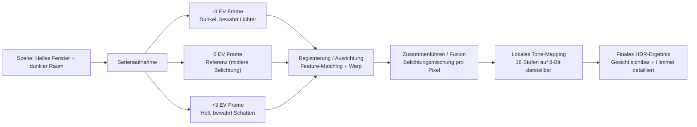
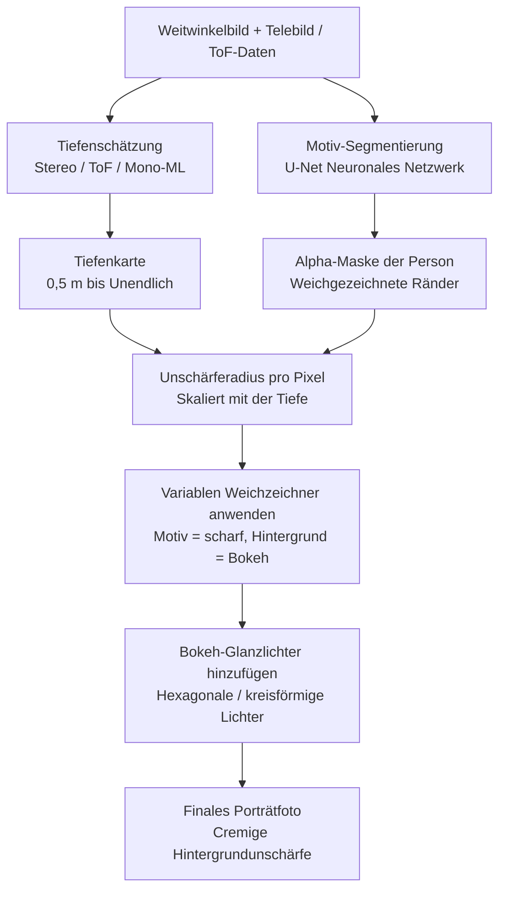
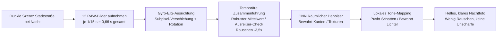
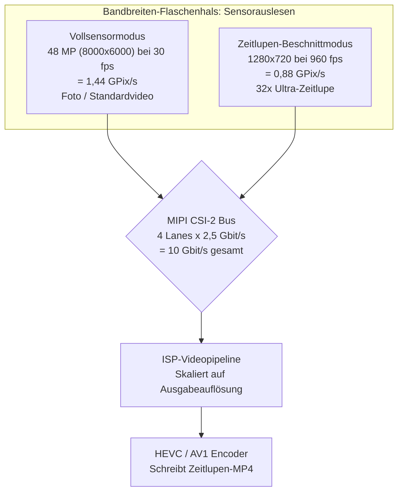
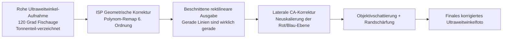
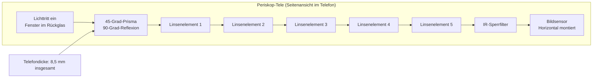
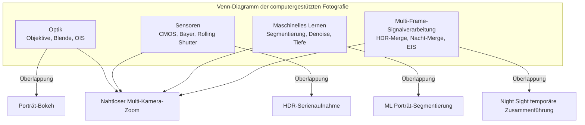

# Kapitel 3: Was moderne Smartphone-Kameras können

Kapitel 2 hat Ihnen die Hardware-Grundlagen vermittelt: Objektive, Sensoren, ISP-Pipelines und Multi-Kamera-Module. Dieses Kapitel beantwortet die natürliche Folgefrage: **Wie nutzen moderne Kamera-Apps diese Hardware eigentlich, um die Fotos zu produzieren, die ich auf Instagram sehe?**

Ein Smartphone aus dem Jahr 2010 nahm eine einzige Belichtung auf, schickte sie durch einen einfachen ISP und schrieb ein JPEG. Ein Smartphone aus dem Jahr 2026 nimmt routinemäßig 5 bis 15 separate Bilder für ein einziges Standbild auf, richtet sie mithilfe von Gyroskopdaten subpixelgenau aus, verschmilzt sie mittels Multi-Frame-Signalverarbeitung, jagt das Ergebnis durch ein neuronales Netzwerk zur semantischen Segmentierung oder Tiefenschätzung und führt schließlich ein Tone-Mapping zu einem einzigen, teilbaren Bild durch – und das alles innerhalb eines einzigen Tastendrucks auf den Auslöser.

Dieses Kapitel ist ein Rundgang durch die Funktionen der modernen Smartphone-Fotografie. Wir erklären, wie jede Funktion auf Hardware- und Softwareebene funktioniert, ohne Camera2-API-Code. Ziel ist es, ein Vokabular dessen aufzubauen, was moderne Kamerasysteme leisten können, damit Sie später, wenn Sie Code zur Steuerung dieser Funktionen schreiben, wissen, was unter der Haube passiert.

## HDR: High Dynamic Range Multi-Frame Fusion

Der **Dynamikumfang** ist das Verhältnis zwischen den hellsten und dunkelsten Teilen einer Szene, das ein Bildsystem gleichzeitig aufzeichnen kann, ohne dass Details verloren gehen (Clipping). Das menschliche Auge kann dank sakkadischer Anpassung etwa 20 Blendenstufen Dynamikumfang (ein Kontrastverhältnis von 1.000.000:1) auf einen Blick wahrnehmen. Eine einzelne Belichtung eines Smartphone-Sensors kann bei Basis-ISO etwa 10 bis 12 Blendenstufen erfassen. Die Lücke zwischen diesen beiden Zahlen ist der Grund für die Existenz von HDR.

Stellen Sie sich vor, Sie machen ein Foto in einem Innenraum, wobei sich hinter Ihrem Motiv ein helles Fenster befindet. Wenn Sie auf das Gesicht der Person belichten (sagen wir 1/30 s, ISO 400), brennt das Fenster zu reinem, abgeschnittenem Weiß aus – kein Himmel, keine Wolken, keine Details. Wenn Sie auf das Fenster belichten (1/2000 s, ISO 50), wird das Gesicht der Person zu einem silhouettierten schwarzen Klecks. Keine der beiden Einzelbelichtungen funktioniert.

### Wie Smartphone-HDR funktioniert

Jedes HDR-System auf modernen Telefonen verwendet **Multi-Frame-Bracketing** (Belichtungsreihen), gefolgt von einer computergestützten Zusammenführung (Fusion). Der Algorithmus funktioniert wie folgt:

1. **Aufnahme der Belichtungsreihe**: Die Kamera nimmt eine schnelle Folge von 3 bis 10 aufeinanderfolgenden Bildern mit unterschiedlichen Belichtungswerten (EV) auf. Ein typischer Satz könnte Bilder bei -3 EV (sehr kurz, bewahrt Lichter), -1 EV, +1 EV und +3 EV (sehr lang, erfasst Schatten) sein. Der Sensor und der VCM werden während der Serie vollkommen stillgehalten; nur das Timing des elektronischen Verschlusses ändert sich.
2. **Auswahl des Referenzbildes**: Der Algorithmus wählt das schärfste Bild mit mittlerer Belichtung als geometrische Referenz aus.
3. **Bildregistrierung / Ausrichtung**: Jedes Nicht-Referenzbild wird computergestützt auf die Referenz ausgerichtet. Der Algorithmus findet markante Merkmale (Ecken, Kanten) mithilfe von Algorithmen wie FAST oder SIFT, berechnet eine affine oder Homographie-Transformation, die die Merkmale jedes Bildes auf das Referenzbild abbildet, und verzerrt (warpt) die Pixel entsprechend. Bilder, die zu unscharf sind (durch Mikrowackler während der Serie), werden komplett verworfen.
4. **Zusammenführung (Fusion)**: Für jede Pixelposition im endgültigen Bild kombiniert der Algorithmus Informationen aus den ausgerichteten Bildern. Unterbelichtete Pixel liefern ihre sauberen, nicht abgeschnittenen Lichterdaten. Überbelichtete Pixel liefern ihre rauscharmen Schattendaten. Mitteltöne werden über alle Bilder gemittelt, um das Schrotrauschen zu reduzieren.
5. **Tone-Mapping**: Das zusammengeführte lineare Bild – das nun 14 bis 18 Stufen nutzbaren Dynamikumfang enthalten kann – wird durch einen ausgefeilten lokalen Tone-Mapping-Operator in ein 8-Bit- oder 10-Bit-Ausgabebild komprimiert, das auf einem Standard-sRGB-Display gut aussieht.

Beispiel aus der Praxis: Ein Galaxy S26 Ultra im Standardmodus "Szenenoptimierung HDR" nimmt intern 7 Belichtungsreihen-Bilder mit einer Gesamtaufnahmezeit von etwa 0,2 Sekunden auf. Die integrierte Erkennung von Handbewegungen verwirft 2 unscharfe Bilder. Die verbleibenden 5 Bilder werden ausgerichtet, zusammengeführt und einem Tone-Mapping unterzogen. Die Ausgabe erfolgt auf Android 14+-Geräten als **JPEG_R Ultra HDR-Datei**: ein Standard-JPEG-Primärbild (8-Bit-SDR) mit einer eingebetteten Gain-Map, die HDR-fähige Viewer (Android 14 Galerie, Chrome 120+, Adobe Lightroom) verwenden können, um den vollen 10-Bit-HDR-Luminanzbereich auf einem HDR10- oder Dolby-Vision-Display zu rekonstruieren.

### Wann HDR funktioniert und wann nicht

HDR glänzt bei statischen Szenen mit sowohl hellen Lichtern als auch tiefen Schatten: Landschaften, Porträts mit Gegenlicht, Räume mit Fenstern, Sonnenuntergänge über dem Wasser. Es scheitert aktiv – und erzeugt Ghosting-Artefakte –, wenn sich Objekte in der Szene während der Belichtungsreihe bewegen: ein fliegender Vogel, eine wehende Flagge, eine blinzelnde Person, ein rennendes Kind. Moderne KI-gestützte HDR-Algorithmen erkennen und segmentieren bewegte Objekte und blenden für diese Pixel nur das Referenzbild ein, um den klassischen HDR-"Geist" zu vermeiden.

## Porträtmodus: Bokeh durch Tiefenschätzung

Der Porträtmodus erzeugt jene Ästhetik, bei der das Gesicht des Motivs perfekt scharf ist und der Hintergrund in einer cremigen, unscharfen Unschärfe namens **Bokeh** verschwimmt. Traditionelle Kameras erreichen dies optisch mit großen Sensoren, weiten Blenden und langen Brennweiten. Smartphones erreichen dies computergestützt, da ein 1/1,3-Zoll-Sensor bei f/1,6 von Natur aus nicht genügend geringe Schärfentiefe für diesen Effekt bietet.

### Drei Methoden der Smartphone-Tiefenschätzung

Es gibt drei unabhängige Techniken, die von modernen Porträtsystemen verwendet werden; viele Telefone nutzen eine Kombination aus allen dreien.

**Methode 1: Stereo-Disparität von zwei Kameras.** Dies ist die älteste und geometrisch fundierteste Methode. Das Telefon löst sowohl die Weitwinkelkamera als auch die Telekamera gleichzeitig auf dasselbe Motiv aus. Da die beiden Kameras physikalisch um 10 bis 15 Millimeter voneinander getrennt sind (die "Basislinie"), sehen sie das Motiv aus leicht unterschiedlichen horizontalen Positionen. Die Position eines Objekts im Vordergrund verschiebt sich zwischen den beiden Blickpunkten stärker als die Position eines fernen Hintergrundobjekts. Diese Verschiebung wird **Disparität** genannt. Der Algorithmus lässt einen Block-Matching- oder Semi-Global-Matching-Algorithmus (SGM) über die beiden entzerrten Bilder laufen, um für jedes Pixel einen Disparitätswert zu berechnen. Die Disparität ist umgekehrt proportional zur Tiefe, sodass die Disparitätskarte direkt in eine Tiefenkarte pro Pixel umgewandelt wird.

**Methode 2: Aktive Tiefenmessung über ToF / LiDAR.** Ein ToF- (Time-of-Flight) oder LiDAR-Tiefensensor projiziert ein strukturiertes Muster aus über 30.000 Nahinfrarot-Laserpunkten auf die Szene und misst dann die Laufzeit (bei direktem ToF) oder die Phasenverschiebung (bei indirektem ToF) des reflektierten Lichts, um für jedes Pixel eine echte metrische Tiefe in Metern zu berechnen. ToF liefert genaue, dichte Tiefenkarten auch bei völliger Dunkelheit und auf texturlosen Oberflächen (glatte Wände, Himmel), bei denen das Stereo-Matching versagt. Moderne Porträtsysteme verwenden ToF typischerweise als Ground-Truth-Tiefensignal und die Stereo-Disparität als Verfeinerungssignal.

**Methode 3: Monokulare ML-Tiefenschätzung.** Bei Telefonen mit nur einer Kamera (oder für die nach vorne gerichtete Selfie-Kamera, die keinen Stereo-Partner hat) schätzt ein neuronales Netzwerk die Tiefe aus einem einzelnen RGB-Bild. Das Modell, das an Millionen von Bildern mit Ground-Truth-Tiefen-Labels trainiert wurde, lernt die statistischen Hinweise, die Menschen zur Beurteilung der Tiefe verwenden: relative Größe, Verdeckung, lineare Perspektive, Texturgradient, Defokussierungsunschärfe und atmosphärische Perspektive. Googles PortraitNet und Metas DeepLabV3+ sind repräsentative Architekturen. Die monokulare Tiefe ist metrisch weniger genau als Stereo oder ToF, reicht aber für ein plausibel aussehendes Porträt-Bokeh aus.

### Die Pipeline für das Porträt-Rendering

Sobald eine Tiefenkarte vorliegt, sind die verbleibenden Schritte dieselben, unabhängig davon, welche Methode zur Tiefenschätzung verwendet wurde:

1. **Motiv-Segmentierung**: Ein separates neuronales Netzwerk für die semantische Segmentierung (normalerweise eine U-Net-Variante) läuft auf dem RGB-Bild der Hauptkamera und erzeugt eine weiche Alpha-Maske, die identifiziert, welche Pixel zur "Person" und welche zum "Hintergrund" gehören. Die Maske ist an den Rändern weichgezeichnet – insbesondere um Haare, Brillen und feine Details im Vordergrund –, um den ausgeschnittenen Look früherer Porträtmodi zu vermeiden.
2. **Tiefenverfeinerung**: Die rohe Tiefenkarte aus Methode 1/2/3 wird mit der Segmentierungsmaske multipliziert. Hintergrundpixel behalten ihren Tiefenwert; Motivpixel werden auf eine einzige Schärfeebenentiefe festgelegt.
3. **Variable Unschärfe pro Pixel**: Jedes Hintergrundpixel wird durch einen Gaußschen Weichzeichner (oder bei Premium-Modi zur "optischen Simulation" durch eine physikalisch gerenderte Linsenkern-Faltung) weichgezeichnet, dessen Radius linear mit dem Abstand des Pixels von der Schärfeebene skaliert. Ein Hintergrundobjekt in 5 Metern Entfernung erhält eine starke Unschärfe; ein Hintergrundobjekt in 1,5 Metern Entfernung erhält eine leichte Unschärfe. Die Pixel des Motivs werden unverändert übernommen.
4. **Künstlicher optischer Glanz (Glare)**: Ein Premium-Touch: Helle Glanzlichter im unscharfen Hintergrund (Straßenlaternen, Reflexionen, die Sonne) werden als charakteristische linsenförmige Bokeh-Hexagone oder -Kreise anstelle von einfachen Gaußschen Flecken gerendert. Dies verstärkt die Illusion, dass die Unschärfe von einer echten Objektivblende stammt.

## Nachtmodus: Temporäres Zusammenführen mehrerer Bilder

Vor 2018 war die Smartphone-Fotografie bei wenig Licht ohne Blitz praktisch unbrauchbar. Eine schwach beleuchtete Bar oder eine Stadtstraße bei Nacht ergaben ein verrauschtes, körniges und unscharfes Desaster. Dann veröffentlichte Google **Night Sight** auf dem Pixel 3 und alles änderte sich. Die Kernidee war kontraintuitiv: Anstatt eine einzige lange Belichtung von 1 Sekunde zu machen (die durch das Wackeln der Hand hoffnungslos unscharf wäre), mache man 15 sehr kurze Belichtungen von 1/15 Sekunde (die einzeln scharf sind, da OIS aktiv ist) und richte sie algorithmisch aus und mittle sie. Die gesamte integrierte Belichtungszeit beträgt immer noch 1 Sekunde, aber die Belichtung pro Bild ist so kurz, dass sich die Unschärfe durch das Wackeln der Hand nie summiert.

### Der Nachtmodus-Algorithmus Schritt für Schritt

1. **Serienaufnahme**: Die Kamera nimmt 8 bis 15 Raw-Bilder auf. Jedes Bild verwendet eine moderate Belichtungszeit (1/15 s bis 1/8 s ist typisch) und einen moderaten ISO-Wert (800 bis 3200). Die einzelnen Bilder sind verrauscht, aber nicht unscharf. Die Serie dauert insgesamt 0,5 bis 2 Sekunden Echtzeit.
2. **Gyro-gestützte EIS-Ausrichtung**: Das Gyroskop des Telefons zeichnet während der Serie die Winkelgeschwindigkeit mit 8.000 Hz auf. Für jedes Bild wird die kumulative Rotation und Translation gegenüber dem Referenzbild berechnet. Jedes Raw-Bild wird dann auf der NPU digital verschoben, gedreht und leicht skaliert (elektronische Bildstabilisierung, EIS), und zwar subpixelgenau, sodass es perfekt auf das Referenzbild registriert ist, selbst wenn sich die Hände des Benutzers während der Serie um mehrere volle Pixel bewegt haben.
3. **Temporäres Zusammenführen der Pixel**: Für jede Pixelposition in den 12 ausgerichteten Bildern sammelt der Algorithmus 12 Kandidatenwerte für die Pixel. Er führt dann eine robuste statistische Zusammenführung anstelle eines einfachen Durchschnitts durch: Ausreißerwerte (verursacht durch Hotpixel, Treffer durch kosmische Strahlung oder die Scheinwerfer eines vorbeifahrenden Autos) werden identifiziert und verworfen. Die verbleibenden konsistenten Werte werden gemittelt, wodurch das Gaußsche Schrotrauschen um einen Faktor reduziert wird, der der Quadratwurzel aus der Anzahl der beibehaltenen Bilder entspricht. Eine Zusammenführung von 12 Bildern reduziert das Rauschen um das 3,5-fache.
4. **Räumliche Rauschunterdrückung**: Ein CNN-basierter Denoiser (der speziell auf Raw-Nachtbildern trainiert wurde) entfernt verbleibendes hochfrequentes Rauschen, während echte Kanten und Texturen erhalten bleiben.
5. **Lokales Tone-Mapping**: Das zusammengeführte Raw-Bild hat einen sehr hohen Dynamikumfang. Ein räumlich variierender Tone-Mapping-Operator (basierend auf bilateraler Filterung oder einem gelernten CNN-Tone-Map) hellt Schatten auf, ohne Stadtlichter auszufressen, verstärkt die Farbsättigung in dunklen Bereichen (die sonst entsättigt aussehen würden) und erzeugt ein finales 8-Bit-Bild, das hell und sauber wirkt, anstatt trüb und düster.

Samsungs "Nightography", Apples "Nachtmodus", Xiaomis "Nachtmodus 2.0" und OPPOs "Ultra-Dunkel-Modus" verwenden im Wesentlichen dieselbe Algorithmus-Architektur. Es gibt Variationen in der genauen Anzahl der Bilder, der Wahl der robusten Statistik für die Zusammenführung, der Architektur des Denoisers und dem Look des Tone-Mappings, aber die kern-gyro-ausgerichtete, temporäre Multi-Frame-Mittelung ist branchenweit universell.

## Zeitlupe: Beschnittene Aufnahme mit hoher Bildrate

Zeitlupenvideos dehnen die Zeit, indem sie Videobilder schneller als mit der Standard-Wiedergaberate von 30 fps aufnehmen und sie dann mit der normalen Geschwindigkeit von 30 fps wiedergeben. Die gängigen Multiplikatoren:

- **120 fps Aufnahme → 30 fps Wiedergabe = 4-fache Zeitlupe.** Ein 1-sekündiges Ereignis in der realen Welt wird zu 4 Sekunden Video.
- **240 fps → 30 fps = 8-fache Zeitlupe.**
- **960 fps → 30 fps = 32-fache Super-Zeitlupe.** Ein aufprallender Wassertropfen, ein platzender Ballon oder der Flügelschlag eines Kolibris werden sichtbar.

### Warum 960 fps einen Sensorbeschnitt erfordern

Der Flaschenhals bei Aufnahmen mit hohen Bildraten ist die **Bandbreite beim Auslesen des Sensors**. Der Bildsensor verfügt über eine begrenzte Anzahl von MIPI-CSI-2-Lanes, die mit einer festen maximalen Datenrate laufen (typischerweise 2,5 Gbit/s pro Lane, 4 Lanes = 10 Gbit/s insgesamt). Der Sensor kann nur eine bestimmte Anzahl von Pixeln pro Sekunde ausgeben.

- Das Auslesen eines vollen 48-MP-Bildes (8000×6000) bei 960 fps würde 48.000.000 × 960 = 46,08 Milliarden Pixel pro Sekunde erfordern. Das ist das 30-fache der tatsächlichen Auslesebandbreite eines beliebigen Smartphone-Sensors aus dem Jahr 2026.
- Um 960 fps zu erreichen, muss der Sensor daher nur einen kleinen zentralen Ausschnitt (Crop) seines Pixel-Arrays auslesen. Ein 960-fps-Modus ist typischerweise ein Ausschnitt von 1280×720 (720p HD) oder manchmal 1920×1080 (1080p FHD). Damit wird die gesamte Pixelbandbreite handhabbar: 1280×720 × 960 fps = 884 Megapixel pro Sekunde, was selbst bei einer 10-Bit-Kodierung pro Pixel bequem in 10 Gbit/s passt.

Die Zahlen in der Praxis: 960 fps Aufnahme × 0,3 Sekunden Echtzeit = 288 einzelne Bilder. Wiedergegeben mit 30 fps = 9,6 Sekunden butterweiches Zeitlupenvideo. Einige Flaggschiff-Telefone von Sony Xperia und Samsung Galaxy unterstützen einen kurzen Burst von 960 fps bei 1080p-Auflösung, indem sie den Sensor nur im zentralen Ausschnittsbereich über eine begrenzte Bank von Analog-Digital-Wandlern (ADC) auslesen.

Zeitlupenmodi verwenden oft auch eine gestaffelte HDR-Technik (Staggered HDR), bei der abwechselnde Zeilen des Sensors unterschiedlich lange belichtet werden, um auch bei 240 fps oder 960 fps einen hohen Dynamikumfang beizubehalten.

## Ultraweitwinkel: Verzeichnungskorrektur und Randqualität

Die Ultraweitwinkelkamera eines modernen Flaggschiffs bietet eine kleinbildäquivalente Brennweite von 10–18 mm und ein diagonales Sichtfeld von 100° bis 130°. Sie eröffnet kompositorische Möglichkeiten, die die Standard-Weitwinkelkamera nicht bietet: weite Landschaften, Aufnahmen von hoch aufragender Architektur, bei denen das gesamte Gebäude ins Bild passt, ohne auf die Straße treten zu müssen, Gruppen-Selfies, auf denen tatsächlich jeder zu sehen ist, und ein spielerischer Effekt der "Nahbereichs-Verzeichnung", bei dem Objekte, die nah an die Linse gehalten werden, im Verhältnis zum Hintergrund massiv vergrößert erscheinen.

Die Ultraweitwinkel-Brennweite bringt jedoch drei charakteristische optische Mängel mit sich, die der ISP korrigieren muss, bevor das Foto brauchbar ist:

1. **Geometrische Verzeichnung (Tonnenverzeichnung)**: Gerade Linien biegen sich nach außen wie bei den Rändern eines Fischaugenobjektivs. Das Foto eines rechteckigen Türrahmens wird kissen- oder tonnenförmig aussehen. Die Stufe der geometrischen Verzeichnungskorrektur des ISP (siehe Kapitel 2) wendet eine Koordinaten-Neuzuordnung pro Pixel an, wobei ein für dieses spezifische Modul kalibriertes Polynom-Linsenmodell 4. oder 6. Ordnung verwendet wird. Die Korrektur schneidet zwangsläufig die äußeren 5–10 % des Sensor-Arrays ab, da die Neuzuordnung diese äußeren Pixel über den Rand hinaus schiebt.
2. **Laterale chromatische Aberration (LCA)**: Das Objektiv bricht Licht unterschiedlicher Wellenlängen unterschiedlich stark, sodass rote, grüne und blaue Bilder desselben Punktes außerhalb der Achse an leicht unterschiedlichen Pixelkoordinaten landen. Das Ergebnis sind sichtbare Farbsäume (lila/grüne Ränder) an kontrastreichen Objekten in der Nähe der Ecken. Der ISP korrigiert die LCA, indem er auf die rote und blaue Farbebene einen leicht anderen Vergrößerungsfaktor als auf die grüne Ebene anwendet.
3. **Vignettierung / Randunschärfe**: Eckpixel erhalten deutlich weniger Licht als Pixel im Zentrum (aufgrund des natürlichen cos⁴θ-Abfalls des Objektivs sowie mechanischer Vignettierung durch den Objektivtubus), und die optische MTF (Modulationsübertragungsfunktion) des Objektivs ist bei extremen Winkeln geringer, sodass die Ecken unscharf wirken. Die Stufe der Objektivschattierungskorrektur wendet eine radialsymmetrische Gain-Verstärkung an, um die Ausleuchtung zu ebnen, und ein kantenbewusster Schärfefilter wird an den Ecken aggressiver angewendet als in der Mitte.

## Tele: Standard vs. Periskop

Die Telekamera fängt weit entfernte Motive ein, die die Weitwinkelkamera nicht auflösen kann. Moderne Telefone werden mit zwei verschiedenen Tele-Designs ausgeliefert.

**Standard-Tele (2- bis 3-facher optischer Zoom):** Dies ist ein herkömmliches Kameramodul: Der Objektivtubus steht senkrecht zur Rückseite des Telefons, direkt über dem Bildsensor, genau wie bei der Weitwinkelkamera, aber mit einem Objektiv mit längerer Brennweite. Ein 3-fach-Tele hat eine kleinbildäquivalente Brennweite von ca. 72 mm. Der physikalische Aufbau ist durch die Dicke des Telefons (7–9 mm) begrenzt, sodass das Objektiv nicht länger sein kann. Daher liegt die praktische Obergrenze für herkömmliche Telemodule beim 3-fachen Zoom.

**Periskop-Tele (5- bis 10-facher optischer Zoom):** Um längere Brennweiten zu erreichen, ohne das Telefon dicker zu machen, haben Ingenieure den optischen Pfad mithilfe eines Prismas um 90° gefaltet. Das Licht tritt durch ein Fenster am Rand des Telefons oder im Rückglas ein, trifft auf ein 45°-Rechtwinkelprisma, wird um 90° zur Seite gelenkt und wandert dann horizontal durch einen 10–14 mm langen Objektivtubus mit mehreren Elementen, der parallel zur Hauptplatine des Telefons verläuft, um schließlich auf einem seitlich auf der Platine montierten Bildsensor zu landen. Das Prisma selbst ist auf einem 2-Achsen-OIS-Gimbal montiert, und der Sensor ist manchmal auf einem separaten Sensor-Shift-OIS montiert, was eine 4- oder 5-Achsen-Gesamtstabilisierung ergibt – genug, um scharfe 10-fach-Fotos von Text auf einem entfernten Gebäudeschild aus der Hand zu machen.

An den Zoomgrenzen zwischen physischen Kameras (zum Beispiel 2,9-facher Zoom, der noch digital von der Weitwinkelkamera beschnitten wird, gegenüber 3,1-fachem Zoom mit dem optischen 3-fach-Tele) führt der HAL einen Multi-Kamera-Fusions-Trick aus: Für etwa ±0,2x um den Umschaltpunkt herum nimmt er beide Kameras gleichzeitig auf und führt eine nach Zoomverhältnis gewichtete Überblendung durch, sodass der Benutzer nie einen sichtbaren "Sprung" sieht, wenn die aktive physische Kamera wechselt.

## Makro: Extreme Nahaufnahme-Fotografie

Die Makrofotografie hält extreme Nahaufnahmen kleiner Motive fest: die Textur von Blütenblättern, die Facettenaugen von Insekten, die Fasern eines Stoffstücks, die einzelnen Zuckerkristalle auf einem Keks.

In modernen Telefonen gibt es zwei Makro-Strategien:

**Dedizierte Makrokamera:** Budget- und Mittelklasse-Telefone verfügen oft über ein kleines, niedrig auflösendes (2 MP bis 5 MP) dediziertes Makromodul mit einem Fixfokus-Objektiv mit kurzer Brennweite. Das Modul ist auf einen bestimmten Mindestfokusabstand (typischerweise 2–4 cm) abgestimmt und liefert trotz seiner geringen Auflösung überraschend scharfe Makrobilder. Der Hauptnachteil ist, dass der Sensor winzig ist, sodass die Bildqualität bei allem, was weniger als helles Tageslicht ist, stark abnimmt.

**Ultraweitwinkel als Makro zweckentfremdet:** Flaggschiff-Telefone (Google Pixel, Samsung S-Serie Ultra, iPhone Pro) verfügen nicht über eine dedizierte Makrokamera. Stattdessen nutzen sie die Ultraweitwinkelkamera für diese Aufgabe um. Die kurze Brennweite des Ultraweitwinkels (13 mm äquiv.) ermöglicht einen sehr kurzen Mindestfokusabstand – oft nur 1 bis 2 Zentimeter vom Motiv entfernt. Wenn der Benutzer den "Makro"-Modus antippt oder die Kamera-App ein nahes Motiv über den ToF-Sensor oder den Phasendetektions-AF-Entfernungsmesser erkennt, schaltet die App auf das Ultraweitwinkel um, fährt dessen VCM in die Position für den Mindestfokus, wendet eine zusätzliche geometrische Verzeichnungskorrektur an (da sich das Motiv nun an einem Extrempunkt der Bildfeldwölbung befindet, an dem der Polynom-Remap erheblich von der Unendlich-Kalibrierung abweicht) und beschneidet das Zentrum des Ultraweitwinkelsensors, um das finale Makrobild zu erzeugen. Der große 12-MP- bis 50-MP-Ultraweitwinkelsensor liefert eine drastisch bessere Makrobildqualität als ein dediziertes 5-MP-Modul.

## Computergestützte Fotografie: Die einigende Philosophie

Die oben genannten Funktionen – HDR, Porträt, Nachtmodus, Zeitlupe, Ultraweitwinkel-Korrektur, Periskop-Zoom-Fusion, Makro – teilen eine einzige verbindende Idee. Die **computergestützte Fotografie** (Computational Photography) ist die Philosophie, dass der Kamerasensor, der ISP, das Gyroskop/IMU, die NPU (Neural Processing Unit) und Multi-Frame-Signalverarbeitungsalgorithmen zusammenarbeiten können, um Bilder zu erzeugen, die keine einzelne Kombination aus Objektiv und Sensor, egal wie teuer das Glas ist, jemals allein hervorbringen könnte.

Das klassische DSLR-Modell ist: Licht → Objektiv → Sensor → Speicher. Das Smartphone-Modell ist: Licht → mehrere Objektive → mehrere Sensoren → Gyro/IMU → Multi-Frame-Serienaufnahme → neuronale Inferenz auf der NPU → Entscheidungsschmelze pro Pixel → ausgeklügeltes Tone-Mapping → Speicher. Beide beginnen und enden am selben Ort, aber das Smartphone fügt in der Mitte Dutzende zusätzlicher computergestützter Schritte ein, von denen jeder das Endergebnis auf eine Weise verbessert, die die Optik allein nicht leisten kann.

Nahtloses Zoomen von 0,5-fach bis 10-fach auf einem Galaxy S26 Ultra ist computergestützt: Der HAL blendet drei verschiedene Kameras mit drei verschiedenen Brennweiten über fünf Zoom-Umschaltpunkte hinweg. Die Rettung eines Porträts im Gegenlicht, bei dem das Fenster hinter dem Motiv nicht mehr ausbrennt, ist computergestützt: HDR-Zusammenführung von 7 Bildern. Ein Nachtfoto der Milchstraße aus der Hand, das bei einer DSLR ein Stativ und eine 30-sekündige Belichtung erfordern würde, ist computergestützt: Gyro-ausgerichtete temporäre Zusammenführung von 12 Bildern. Jede in diesem Kapitel beschriebene Funktion ist computergestützte Fotografie.

Dies ist die wichtigste Idee, die Sie in die folgenden Kapitel zur Camera2-API mitnehmen sollten. Die Camera2-API ist nicht nur ein Wortzeug, um "ein Foto zu machen". Sie ist eine Steuerschnittstelle auf niedriger Ebene, die es Ihrer App ermöglicht, präzise Multi-Frame-Serien auszulösen, Gyro-Metadaten pro Frame zu lesen, auszuwählen, welche physische Kamera bei welchem Zoomverhältnis auslöst, und Frames durch neuronale Netzwerke auf dem Gerät zu streamen – die Bausteine für die Implementierung Ihrer eigenen Funktionen für die computergestützte Fotografie.

## Zusammenfassung

In diesem Kapitel haben Sie die realen Algorithmen hinter modernen Funktionen der Smartphone-Fotografie kennengelernt. HDR verwendet Belichtungsreihen mit 3–10 Bildern, eine bildbasierte Merkmalsausrichtung und Tone-Mapping, um einen Dynamikumfang zu erfassen, den der Sensor in einer einzigen Belichtung nicht sehen kann. Der Porträtmodus berechnet eine Tiefenkarte pro Pixel über Stereo-Kamera-Disparität, ToF-Lasermessung oder monokulare ML-Tiefenschätzung, führt dann eine U-Net-Motivsegmentierung durch und wendet eine variable Gaußsche Unschärfe pro Pixel an, die mit der Tiefe skaliert wird. Der Nachtmodus nimmt 8–15 Kurzzeitbelichtungen auf, richtet sie mittels gyrogestütztem EIS aus, wendet eine robuste temporäre Pixelzusammenführung an, um das Rauschen um das 3,5-fache zu reduzieren, und führt ein lokales Tone-Mapping des Ergebnisses durch. Zeitlupenvideos mit 960 fps müssen den Sensor beschneiden, da die MIPI-Auslesebandbreite der harte Flaschenhals ist. Ultraweitwinkelfotos werden im ISP einer geometrischen Verzeichnungskorrektur, einer chromatischen Aberrationskorrektur und einer Ecken-Abschattungskorrektur unterzogen, bevor sie anzeigbar werden. Periskop-Telekameras verwenden ein 45°-Prisma, um den Lichtweg um 90° zu falten und ein optisches 10-fach-Objektiv in ein 8,5 mm dickes Telefon zu packen. Sie haben die Definition der computergestützten Fotografie gelernt: die Verschmelzung von Optik, Sensoren, maschinellem Lernen und Multi-Frame-Signalverarbeitung, um Bilder jenseits der Möglichkeiten jedes einzelnen Objektiv-Sensor-Systems zu erzeugen.

## Wie geht es weiter?

Kapitel 4 ist das praktische Kapitel zum Mitmachen. Sie werden die Begleit-App **Android Camera Parameters** aus dem Quellcode oder aus Google Play installieren, sie auf Ihrem eigenen Telefon starten und genau untersuchen, was Ihre eigene Hardware kann. Sie lernen, Kamera-IDs und Ausrichtungen zu lesen, das Hardware-Level jeder Kamera zu prüfen (LEGACY / LIMITED / FULL / LEVEL_3), unterstützte Ausgabeformate aufzuzählen (JPEG, YUV_420_888, PRIVATE, RAW_SENSOR, JPEG_R Ultra HDR), maximale Zeitlupen-FPS-Bereiche zu finden, Zoomverhältnisse und Umschaltpunkte zwischen den physischen Kameras Ihres Telefons zu erkunden und zu prüfen, ob Ihr Hauptsensor die RAW-Aufnahme unterstützt – und Sie werden die Antworten für Ihr spezielles Gerät notieren, denn diese Antworten bestimmen, was für Ihre eigene Camera2-API-App auf diesem Telefon möglich ist und was nicht.
