# Kapitel 16: Weißabgleich & Farbe

Sie haben die Helligkeit (Belichtung) und die Schärfe (Fokus) gemeistert. Jetzt ist es an der Zeit, den **Look** zu steuern – den *Farbton* des Bildes.

Wenn Sie ein weißes Blatt Papier unter einer warmen Glühlampe fotografieren, trifft das gelb-orangefarbene Licht der Lampe auf das Papier und der Sensor nimmt es als Orange wahr. *Ihr Gehirn* korrigiert dies augenblicklich und sieht immer noch "weißes Papier" – aber die rohen Sensordaten zeichnen die Wahrheit auf: Es ist orange.

Der **Weißabgleich (WB)** ist der Prozess der Kamera, die Farbe der Lichtquelle zu kompensieren, sodass neutrale Weißtöne neutral aussehen. Wenn Sie dies falsch machen, weist Ihr gesamtes Foto einen unerwünschten Farbstich auf (zu orange, zu blau, zu grün).

Die [App Android Camera Parameters](https://github.com/zoozooll/AndroidCameraParameters) präsentiert jede AWB-Voreinstellung in einer Live-Gitteransicht und bietet einen manuellen Gain-Schieberegler – öffnen Sie die App, wechseln Sie zum Weißabgleich-Panel, und Sie können genau das beobachten, was wir in diesem Kapitel implementieren werden.

---

## Farbtemperatur: Das Spektrum von warm bis kühl

Lichtquellen werden durch ihre **Farbtemperatur** in Kelvin (K) beschrieben. Die Skala beschreibt die Temperatur eines theoretischen "Schwarzkörpers", der in derselben Farbe glüht.

```mermaid
graph LR
    A["1800 K<br/>Kerzenlicht"] --> B["2800 K<br/>Glühlampe"]
    B --> C[3500 K<br/>Warmweiß-Leuchtstoff]
    C --> D[4500 K<br/>Kaltweiß-Leuchtstoff]
    D --> E[5500 K<br/>Tageslicht / Blitz]
    E --> F[6500 K<br/>Bedeckter Himmel]
    F --> G[8000 K<br/>Offener Schatten]
    G --> H[10000 K+<br/>Blauer Himmel / tiefer Schatten]
    style A fill:#e67e22,color:#fff
    style B fill:#f39c12,color:#fff
    style C fill:#f1c40f,color:#333
    style D fill:#f9e79f,color:#333
    style E fill:#ffffff,color:#333,stroke:#333
    style F fill:#d4e6f1,color:#333
    style G fill:#85c1e9,color:#333
    style H fill:#3498db,color:#fff
```



**Kontraintuitive Regel:** Warmes Licht = *niedrige* Kelvin-Zahl (1800 K Kerze = sehr orange). Kühles Licht = *hohe* Kelvin-Zahl (10000 K Himmel = sehr blau). Ihre Augen lernen dies in der Kindheit; Ihr Code muss sich explizit daran erinnern.

| Szene | Typische Farbtemperatur | Farbstich bei WB "Tageslicht" |
|-------|-------------------|----------------------------|
| Abendessen bei Kerzenschein | 1800–2200 K | Sehr orange / bernsteinfarben |
| Glühbirne zu Hause | 2700–3000 K | Orange / gelb |
| Sonnenaufgang / Sonnenuntergang | 3000–4000 K | Warmer Goldton (oft erwünscht!) |
| "Kaltweiße" Leuchtstofflampe | 4000–5000 K | Grünstich |
| Mittags-Sonnenlicht | 5200–5800 K | Korrekt neutral |
| Elektronenblitz | 5500–6000 K | Neutral (entspricht Tageslicht) |
| Bewölkt / starke Bewölkung | 6000–7500 K | Leicht bläulich |
| Offener Schatten (keine direkte Sonne) | 7000–9000 K | Blaustich |
| Dunstiger blauer Himmel | 9000–12000 K | Sehr blau |

Die Aufgabe des automatischen Weißabgleichs: Erkennen der wahrscheinlichen Lichtquelle aus Szenenstatistiken und anschließendes *Subtrahieren* des Farbstichs, damit neutrale Objekte neutral erscheinen.

---

## Modi des automatischen Weißabgleichs (AWB) in Camera2

Einstellung über `CaptureRequest.CONTROL_AWB_MODE`:

| Modus (CONTROL_AWB_MODE_*) | Effekt | Anwendungsfall |
|---------------------------|--------|----------|
| `OFF` | Nur manueller Weißabgleich. Verwenden Sie explizit `COLOR_CORRECTION_GAINS` oder `_TRANSFORM`. | Pro-Modus, benutzerdefiniertes Color Grading, RAW + Nachbearbeitung |
| `AUTO` | Standard. Der ISP führt kontinuierlich eine Erkennung der Lichtquelle durch. | Allgemeine Fotografie |
| `INCANDESCENT` (TUNGSTEN) | ~2800 K. Starke Blauverstärkung, um warmes Glühlampenlicht auszugleichen. | Lampen im Innenbereich, Bühnenbeleuchtung |
| `FLUORESCENT` | ~4500 K. Verstärkungswerte für typisches Büro-Leuchtstofflicht (neigt zum Grünstich). | Büro / Klassenzimmer |
| `WARM_FLUORESCENT` | ~3200 K. Kompensiert warmweiße Leuchtstoffröhren. | Warmweiße Energiesparlampen zu Hause |
| `DAYLIGHT` | ~5500 K. Standardprofil für Mittagssonne. | Sonniger Tag im Freien, entspricht dem Blitz |
| `CLOUDY_DAYLIGHT` | ~6500 K. Leichte Erwärmung, um kühles, bedecktes Licht auszugleichen. | Bewölkter / dunstiger Tag |
| `TWILIGHT` | Warmes Profil für die goldene Stunde in der Dämmerung (~4500 K). | Sonnenuntergang, Abenddämmerung, warme Landschaften |
| `SHADE` | ~7500 K. Starke Rotverstärkung gegen tiefblaues Schattenlicht. | Porträt im Schatten, Schatten in der Stadt |

**Unterstützte Modi zuerst abfragen:** Nicht jedes Gerät liefert alle 9 Voreinstellungen mit. Flaggschiff-Telefone tun dies in der Regel; Budget-Geräte bieten möglicherweise nur `AUTO` + `OFF`.

```kotlin
val availableAwbModes = characteristics.get(
    CameraCharacteristics.CONTROL_AWB_AVAILABLE_MODES
) ?: intArrayOf()
Log.d("AWB", "Verfügbare Modi: ${availableAwbModes.toList()}")
```

### AWB-Zustände (wie AF, aber weniger gesprächig)

Die AWB-Zustandsmaschine ist konzeptionell ähnlich wie die des AF, aber einfacher – sie hat weniger Zustände:

| AWB-Zustand | Bedeutung |
|-----------|---------|
| `CONTROL_AWB_STATE_INACTIVE` | AWB deaktiviert (`AWB_MODE = OFF`) |
| `CONTROL_AWB_STATE_SEARCHING` | Suche nach der korrekten Lichtquelle (Farbstich kann driften) |
| `CONTROL_AWB_STATE_CONVERGED` | Stabile Lichtquelle gefunden — Farbe ist stabil |
| `CONTROL_AWB_STATE_LOCKED` | Explizit über `CONTROL_AWB_LOCK = true` gesperrt |

Verwenden Sie bei farbkritischer Fotografie (Produktaufnahmen, Katalogarbeiten) dasselbe Muster "Warten auf converged / locked vor der Aufnahme", das Sie auch beim AF angewendet haben.

---

## Wie die Weißabgleich-Korrektur funktioniert: Hinter den Kulissen

Der AWB wendet zwei Farbtransformationen an, um von Sensor-RGB zu anzeigbarem sRGB zu gelangen. Wenn Sie diese verstehen, können Sie den AWB mit manuellen Werten komplett umgehen.

### Schritt 1: Kanalverstärkung (Korrektur des Weißpunkts)

Multiplizieren Sie zunächst jeden Farbkanal mit einer Verstärkung (Gain), sodass eine neutrale Oberfläche in R, G und B gleich herauskommt:

> Wenn eine Szene mit einer 3200-K-Glühlampe vom Sensor `[R=200, G=150, B=100]` für ein graues Ziel liefert, wendet der AWB Kanalverstärkungen von etwa `R: 1,0, G: 1,33, B: 2,0` an, um auf `[200, 200, 200]` zu normalisieren.

In Camera2 wird dies als **`CaptureRequest.COLOR_CORRECTION_GAINS`** offengelegt: ein 4-elementiges Float-Array in der Reihenfolge **[R, Geven, B, Godd]**.

Die beiden Grünkanäle (`Geven`, `Godd`) existieren, weil viele Smartphone-Sensoren ein 2×2-Bayer-Gitter verwenden: abwechselnd Zeilen mit **GR / BG**. Zeilen, die mit Grün-Rot bzw. Grün-Blau beginnen, haben eine leicht unterschiedliche spektrale Empfindlichkeit und benötigen unabhängige digitale Verstärkungswerte. Für die tägliche Arbeit ist es völlig ausreichend, beide Grünwerte auf denselben Wert zu setzen.

```kotlin
// COLOR_CORRECTION_GAINS = [ R-Gain, G-even-Gain, B-Gain, G-odd-Gain ]
val warmGains = floatArrayOf(1.0f, 1.2f, 0.8f, 1.2f)  // Warmtönung: R anheben, B senken
val coolGains = floatArrayOf(0.85f, 1.0f, 1.25f, 1.0f) // Kühler Farbton: B anheben, R senken
val neutralGains = floatArrayOf(1.0f, 1.0f, 1.0f, 1.0f) // Einheitsverstärkung (rohe Sensorfarbe)
```

**Gültiger Bereich:** Verstärkungswerte werden vom HAL typischerweise auf [0,0, 4,0] begrenzt. Verwenden Sie multiplikative Faktoren zwischen 0,5× und 3× für plausible Ergebnisse.

### Schritt 2: 3×3 Farbtransformationsmatrix (Gamut Mapping)

Kanalverstärkungen korrigieren nur den *Weißpunkt*. Verschiedene Sensoren haben jedoch unterschiedliche native spektrale Empfindlichkeiten ihrer Farbfilter, und verschiedene Ausgabegeräte haben unterschiedliche Farbräume (sRGB/Rec.709 vs. DCI-P3 vs. Display P3). Eine **3×3-Farbkorrekturmatrix (CCM)** bildet den nativen RGB-Farbraum des Sensors auf den Standard-Ausgabefarbraum ab.

Mathematisch ausgedrückt:

```
[ R' ]   [ m11  m12  m13 ] [ R ]
[ G' ] = [ m21  m22  m23 ] [ G ]
[ B' ]   [ m31  m32  m33 ] [ B ]
```

Oder im Code: `output = M × input`, wobei M eine 3×3-Matrix ist.

Camera2 legt dies über **`COLOR_CORRECTION_TRANSFORM`** offen, das mit einem `Rational[9]` Array (Row-Major: `m11, m12, m13, m21, m22, m23, m31, m32, m33`) gesetzt wird. Eine Einheitsmatrix bedeutet, dass der Input direkt kopiert wird:

```kotlin
// Einheitsmatrix 3x3 in Rational-Werten: 1/1 für die Diagonale, 0/1 für die Werte daneben
val identityMatrix = arrayOf(
    Rational(1,1), Rational(0,1), Rational(0,1),
    Rational(0,1), Rational(1,1), Rational(0,1),
    Rational(0,1), Rational(0,1), Rational(1,1)
)
```

**Die Farbräume Rec.709 vs. DCI-P3:**

| Farbraum | Abdeckung | Anwendungsfall |
|-------------|----------|----------|
| **Rec.709 (sRGB)** | ~35 % des sichtbaren Lichts | HDTV, Web, JPEG-Standard, ~100 % der Handy-Displays bis ca. 2020 |
| **DCI-P3** | ~45 % des sichtbaren Lichts | Digitales Kino, 4K UHD, moderne iPhone/Android-Displays mit großem Farbumfang |

Ein P3-Display kann sattere Rot- und Grüntöne anzeigen als Rec.709. Ihre Ausgabe-CCM muss einen Zielfarbraum wählen, der dem entspricht, was der Bildschirm des Betrachters erwartet. Prüfen Sie unter Android `Display.isWideColorGamut()` und verwenden Sie eine entsprechende Matrix.

**Praktischer Rat:** Sofern Sie keinen professionellen RAW-Entwickler oder eine farbmanagementfähige Kino-App schreiben, stellen Sie `COLOR_CORRECTION_MODE = TRANSFORM_MATRIX` ein und lassen Sie die Standardmatrix des Herstellers das Gamut Mapping übernehmen. Die meisten Pro-Apps optimieren nur `COLOR_CORRECTION_GAINS` (die 4 Verstärkungswerte) und lassen die Matrix unberührt.

---

## Vollständiges Beispiel 1: AWB auf Voreinstellung "Tageslicht" fixieren (Warmtönungs-Lock)

Fangen wir einfach an. Manchmal möchten Sie keine vollständige manuelle Steuerung – Sie möchten lediglich **verhindern, dass der AWB zwischen Frames driftet** (z. B. bei Zeitrafferaufnahmen oder Videos mit Szenenwechseln). Das Einstellen einer festen Voreinstellung wie `DAYLIGHT` garantiert eine konsistente Farbe über alle Aufnahmen hinweg.

Dies ist die einfachste manuelle Farbkonsistenzsteuerung.

```kotlin
class AwbPresetController(
    private val characteristics: CameraCharacteristics,
    private val captureSession: CameraCaptureSession,
    private val previewSurface: Surface
) {
    // Gibt true zurück, wenn der HAL diesen Modus tatsächlich unterstützt
    fun isModeSupported(mode: Int): Boolean {
        val available = characteristics.get(
            CameraCharacteristics.CONTROL_AWB_AVAILABLE_MODES
        ) ?: intArrayOf()
        return mode in available
    }

    fun setPresetDaylightForWarmTintLock(): Boolean {
        if (!isModeSupported(CameraMetadata.CONTROL_AWB_MODE_DAYLIGHT)) {
            Log.w("AWB", "Voreinstellung DAYLIGHT wird auf diesem Gerät nicht unterstützt")
            return false
        }

        val request = captureSession.device.createCaptureRequest(
            CameraDevice.TEMPLATE_PREVIEW
        ).apply {
            addTarget(previewSurface)

            // Weißabgleich auf Modus DAYLIGHT (~5500 K) fixieren.
            // Dies wird Glühlampenszenen in Innenräumen absichtlich warm/orange rendern,
            // was der in der Kinematografie bevorzugte "filmische" Look ist.
            set(CaptureRequest.CONTROL_AWB_MODE,
                CameraMetadata.CONTROL_AWB_MODE_DAYLIGHT)

            // Belichtungsautomatik (AE) und Autofokus (AF) für dieses Beispiel in ihren Standards (Auto) belassen
            set(CaptureRequest.CONTROL_MODE,
                CameraMetadata.CONTROL_MODE_AUTO)
        }

        captureSession.setRepeatingRequest(request.build(),
            object : CameraCaptureSession.CaptureCallback() {
                override fun onCaptureCompleted(
                    session: CameraCaptureSession,
                    request: CaptureRequest,
                    result: TotalCaptureResult
                ) {
                    val awbState = result.get(CaptureResult.CONTROL_AWB_STATE)
                    Log.d("AWB", "Voreinstellung DAYLIGHT angewendet, AWB-Status=$awbState")
                }
            }, null
        )
        return true
    }
}
```

**Künstlerische Anwendung:** Wenn Sie einen Sonnenuntergang mit `AWB_MODE = DAYLIGHT` aufnehmen, wird das 3000-K-Licht des Sonnenuntergangs im Vergleich zum festen 5500-K-Abgleich als *warm* wahrgenommen – was satte, gesättigte gold-orange Töne erzeugt. Die Verwendung von `AWB_MODE = AUTO` würde hier den Sonnenuntergang *neutralisieren* (womit der Clou verloren geht!), indem mehr Blau hinzugefügt wird, um das goldene Licht auszugleichen. Voreinstellungen bewahren die Stimmung.

---

## Vollständiges Beispiel 2: Voller manueller AWB — Benutzerdefinierte Verstärkung für warmen Sonnenuntergang

Deaktivieren Sie für die ultimative kreative Kontrolle den AWB vollständig und schreiben Sie Ihre eigenen Verstärkungswerte. Bauen wir einen "warmen Sonnenuntergangs-Look" – wobei Rot leicht angehoben, Blau unterdrückt und mit einer subtilen Grünerhöhung eine Lila-Verschiebung vermieden wird.

```kotlin
class ManualColorGradingController(
    private val characteristics: CameraCharacteristics,
    private val captureSession: CameraCaptureSession,
    private val previewSurface: Surface,
    private val jpegReaderSurface: Surface
) {
    // Kanonische Voreinstellungen für Color Grading (R, Geven, B, Godd)
    object Presets {
        val NEUTRAL = floatArrayOf(1.00f, 1.00f, 1.00f, 1.00f)
        val WARM_SUNSET = floatArrayOf(1.00f, 1.20f, 0.80f, 1.20f)  // Warmer Bernstein
        val COOL_MORNING = floatArrayOf(0.85f, 1.00f, 1.25f, 1.00f)  // Kühles Blau
        val VINTAGE_KODAK = floatArrayOf(1.15f, 1.00f, 0.85f, 1.00f) // Klassisch filmähnlich
        val GREEN_SHIFT_FLUO = floatArrayOf(1.00f, 1.25f, 1.00f, 1.25f) // Fix für Leuchtstofflampen
    }

    fun applyManualGains(gains: FloatArray, includeMatrix: Boolean = true) {
        // Validierung: AWB_MODE = OFF muss unterstützt werden (ist es bei MANUAL-Fähigkeit immer)
        val hwLevel = characteristics.get(CameraCharacteristics.INFO_SUPPORTED_HARDWARE_LEVEL)
        val supportsManualColor = (hwLevel == CameraMetadata.INFO_SUPPORTED_HARDWARE_LEVEL_3 ||
                                   hwLevel == CameraMetadata.INFO_SUPPORTED_HARDWARE_LEVEL_FULL ||
                                   isModeSupported(CameraMetadata.CONTROL_AWB_MODE_OFF))
        if (!supportsManualColor) {
            Log.e("AWB", "Dieses Gerät auf LEGACY-Stufe kann keine manuellen AWB-Gains")
            return
        }

        val request = captureSession.device.createCaptureRequest(
            CameraDevice.TEMPLATE_PREVIEW
        ).apply {
            addTarget(previewSurface)

            // 1) AWB komplett DEAKTIVIEREN
            set(CaptureRequest.CONTROL_AWB_MODE, CameraMetadata.CONTROL_AWB_MODE_OFF)

            // 2) Die 4 Kanalverstärkungen anwenden (R, Geven, B, Godd)
            set(CaptureRequest.COLOR_CORRECTION_GAINS, gains)

            // 3) Eine Strategie für die Farbkorrektur wählen
            if (includeMatrix) {
                // FAST: Den HAL eine gute Matrix für diese Lichtquelle berechnen lassen
                // (Die Matrix wird automatisch abgeleitet; nur die Gains sind benutzergesteuert)
                set(CaptureRequest.COLOR_CORRECTION_MODE,
                    CameraMetadata.COLOR_CORRECTION_MODE_FAST)
            } else {
                // EXPERT: Unsere eigene 3x3 Transformationsmatrix + Gains zusammen setzen
                set(CaptureRequest.COLOR_CORRECTION_MODE,
                    CameraMetadata.COLOR_CORRECTION_MODE_TRANSFORM_MATRIX)
                set(CaptureRequest.COLOR_CORRECTION_TRANSFORM, identityMatrix())
            }
        }

        captureSession.setRepeatingRequest(request.build(), null, null)
        Log.d("AWB", "Manuelle Gains angewendet: [${gains.joinToString()}]")
    }

    // ------- Standbildaufnahme mit fixierter manueller Farbe -------
    fun captureStillWithColorGrading(gains: FloatArray) {
        applyManualGains(gains)

        val stillRequest = captureSession.device.createCaptureRequest(
            CameraDevice.TEMPLATE_STILL_CAPTURE
        ).apply {
            addTarget(previewSurface)
            addTarget(jpegReaderSurface)

            set(CaptureRequest.CONTROL_AWB_MODE, CameraMetadata.CONTROL_AWB_MODE_OFF)
            set(CaptureRequest.COLOR_CORRECTION_GAINS, gains)
            set(CaptureRequest.COLOR_CORRECTION_MODE,
                CameraMetadata.COLOR_CORRECTION_MODE_FAST)

            set(CaptureRequest.JPEG_QUALITY, 95)
        }

        captureSession.capture(stillRequest.build(), null, null)
    }

    // ------- Helfer -------
    private fun identityMatrix(): Array<Rational> = arrayOf(
        Rational(1,1), Rational(0,1), Rational(0,1),
        Rational(0,1), Rational(1,1), Rational(0,1),
        Rational(0,1), Rational(0,1), Rational(1,1)
    )

    private fun isModeSupported(mode: Int): Boolean {
        val available = characteristics.get(
            CameraCharacteristics.CONTROL_AWB_AVAILABLE_MODES
        ) ?: intArrayOf()
        return mode in available
    }
}
```

### Verwendung der Voreinstellungen

```kotlin
// Benutzer tippt auf Schaltfläche "Sonnenuntergang warm"
controller.applyManualGains(ManualColorGradingController.Presets.WARM_SUNSET)

// Benutzer tippt auf "Aufnahme" — dieselben Verstärkungswerte fließen in das JPEG
controller.captureStillWithColorGrading(ManualColorGradingController.Presets.WARM_SUNSET)
```

### COLOR_CORRECTION_MODE: FAST vs. TRANSFORM_MATRIX

Verwenden Sie diese Entscheidungstabelle:

| Szenario | Wählen Sie `COLOR_CORRECTION_MODE =` |
|----------|----------------------------------|
| Ich möchte nur manuelle Gains; der OEM soll die Matrix wählen (meiste Apps) | `FAST` |
| Ich wende extern eine vollständige Color-Grading-LUT / Matrix an, benötige unberührten Sensor-Farbraum | `TRANSFORM_MATRIX` + Einheitsmatrix |
| Ich habe ein benutzerdefiniertes Farbprofil (ICC / DCP), das für diesen Sensor abgeleitet wurde | `TRANSFORM_MATRIX` + benutzerdefinierte 3×3-Matrix |

**Warnung:** `TRANSFORM_MATRIX` mit der Einheitsmatrix liefert Ihnen die **rohe Sensorfarbe** ohne Gamut Mapping des Herstellers. Bei vielen Sensoren sieht dies ohne zusätzliche Verarbeitung merklich entsättigt und leicht grünstichig aus. Dies ist das korrekte Verhalten – es ist die rohe Sensorausgabe, bereit für Ihre benutzerdefinierte Verarbeitungspipeline.

---

## Manueller Kelvin-zu-Gains-Konverter (Farbtemperatur-Schieberegler)

Pro-Kamera-Apps (einschließlich [Android Camera Parameters](https://play.google.com/store/apps/details?id=com.minininja.cameraparams)) bieten einen **Kelvin-Temperatur-Schieberegler**. Da Camera2 Kelvin-Werte nicht direkt akzeptiert, nähern wir die Kurve der R/B-Verstärkung an.

Eine einfache Annäherung, die für die meisten Smartphone-Sensoren funktioniert (kalibrieren Sie Ihre Gain-Kurve empirisch auf Ihrer Zielhardware):

```kotlin
class KelvinGainsConverter {
    // Umrechnung Kelvin [2000..10000] → angenäherte Verstärkungen [R, Geven, B, Godd]
    // Einfache Näherung über den Planckschen Ort (gut genug für UI-Regler)
    fun kelvinToRgbGains(kelvin: Int): FloatArray {
        val k = kelvin.coerceIn(2000, 10000)
        val temp = k / 100.0

        // Rot (warm bei niedrigem K)
        val r = when {
            temp <= 66 -> 255.0
            else -> {
                var x = temp - 60.0
                x = 329.698727446 * Math.pow(x, -0.1332047592)
                x.coerceIn(0.0, 255.0)
            }
        }

        // Grün
        val g = when {
            temp <= 66 -> {
                var x = temp
                x = 99.4708025861 * Math.log(x) - 161.1195681661
                x.coerceIn(0.0, 255.0)
            }
            else -> {
                var x = temp - 60.0
                x = 288.1221695283 * Math.pow(x, -0.0755148492)
                x.coerceIn(0.0, 255.0)
            }
        }

        // Blau (kalt bei hohem K)
        val b = when {
            temp >= 66 -> 255.0
            temp <= 19 -> 0.0
            else -> {
                var x = temp - 10.0
                x = 138.5177312231 * Math.log(x) - 305.0447927307
                x.coerceIn(0.0, 255.0)
            }
        }

        // Normalisieren, sodass GRÜN = 1,0, dann invertieren: Wir wollen VERSTÄRKUNGEN, um die Temperatur auszugleichen.
        // Wenn der Benutzer 2800 K (warm) wählt, benötigen wir MEHR Blauverstärkung, um den warmen Farbstich auszugleichen.
        // Diese Funktion gibt das *Quell*-RGB zurück; Gains sind 1/R : 1/G : 1/B, normalisiert auf G=1.
        val rGain = (g / r).toFloat().coerceIn(0.3f, 3.0f)
        val bGain = (g / b).toFloat().coerceIn(0.3f, 3.0f)
        return floatArrayOf(rGain, 1.0f, bGain, 1.0f)  // [R, Geven, B, Godd]
    }
}
```

Verwenden Sie dies mit einer SeekBar (Bereich 2000–10000 K):

```kotlin
val converter = KelvinGainsConverter()
seekKelvin.setOnSeekBarChangeListener(object : SeekBar.OnSeekBarChangeListener {
    override fun onProgressChanged(sb: SeekBar, progress: Int, fromUser: Boolean) {
        val kelvin = 2000 + progress * 8   // 0→2000 K, 1000→10000 K
        val gains = converter.kelvinToRgbGains(kelvin)
        textKelvinLabel.text = "$kelvin K"
        controller.applyManualGains(gains)
    }
    override fun onStartTrackingTouch(sb: SeekBar) = Unit
    override fun onStopTrackingTouch(sb: SeekBar) = Unit
})
```

**Hinweis zur Kalibrierung:** Dies ist eine allgemeine Plancksche Näherung. Für perfekte Ergebnisse führen Sie eine Macbeth-ColorChecker- oder Weißpunkt-Kalibrierung auf Ihrem Zielgerät durch und passen Sie eine Kurve an die gemessenen R/B-Verstärkungsverhältnisse gegenüber echtem Kelvin an. Die [App Android Camera Parameters](https://github.com/zoozooll/AndroidCameraParameters) verwendet herstellerspezifische Kalibrierungsdaten, die, sofern verfügbar, über `SENSOR_CALIBRATION_TRANSFORM1` aus dem HAL geladen werden.

---

## Fehlerbehebung bei Farbproblemen

| Symptom | Ursache | Lösung |
|---------|-------|-----|
| Manuelle Gains gesetzt, aber Farbe unverändert | Vergessen, `CONTROL_AWB_MODE = OFF` zu setzen → AWB überschreibt Gains weiterhin | AWB_MODE = OFF setzen, *bevor* GAINS/TRANSFORM gesetzt werden |
| COLOR_CORRECTION_TRANSFORM wird ignoriert | Modus steht noch auf `FAST`; wird nur im Modus `TRANSFORM_MATRIX` berücksichtigt | Zuerst `COLOR_CORRECTION_MODE = TRANSFORM_MATRIX` setzen |
| AWB driftet zwischen Zeitraffer-Frames (Grün-/Lila-Farbblitz) | AWB steht noch auf AUTO und bewertet jeden Frame neu | Festen AWB_MODE oder voll manuelle Gains für Zeitraffer einstellen |
| JPEG hat andere Farbe als Vorschau | JPEG wendete einen anderen Modus/andere Gains an als die letzte wiederholte Anforderung | Dieselben Gains auf die Builder von TEMPLATE_PREVIEW und TEMPLATE_STILL_CAPTURE anwenden |
| Gerät auf LEGACY-Stufe: Absturz bei manuellen Gains | INFO_SUPPORTED_HARDWARE_LEVEL = LEGACY (keine manuelle Farbe) | Graceful Fallback; nur UI für AUTO + Voreinstellungen anbieten |

---

## Zusammenfassung

Der Weißabgleich und die Farbkorrektur in Camera2 liefern Ihnen das letzte Stück der Trilogie der manuellen Steuerungen:

- **Farbtemperatur (K):** Niedriges K (1800 K Kerze) = warm/orange; hohes K (10000 K Schatten) = kühl/blau. Der AWB kompensiert, um die Lichtquelle zu neutralisieren.
- **AWB-Modi:** 9 Voreinstellungen (`INCANDESCENT` → `SHADE`) + `AUTO` + `OFF`. Vor der Verwendung `CONTROL_AWB_AVAILABLE_MODES` abfragen.
- **AWB-Zustände:** `SEARCHING → CONVERGED → LOCKED`. Warten Sie in farbkritischen Sequenzen auf CONVERGED/LOCKED.
- **Die manuelle Steuerung hat zwei Schichten:**
  1. `COLOR_CORRECTION_GAINS` = 4-elementiges Float-Array `[R, Geven, B, Godd]` — Weißpunkt-Korrektur. Verwenden Sie `COLOR_CORRECTION_MODE = FAST` (Matrix des Herstellers, eigene Gains).
  2. `COLOR_CORRECTION_TRANSFORM` = 3×3 `Rational[9]` Matrix — vollständiges Gamut Mapping. Verwenden Sie den Modus `TRANSFORM_MATRIX` für die Einheitsmatrix oder eine eigene CCM.
- **Rec.709 vs. DCI-P3:** Die 3×3-Matrix bildet den Farbraum des Sensors auf den Zielfarbraum des Displays ab.
- **Kelvin-Regler:** Kelvin-Werte über die Mathematik des Planckschen Orts in Gains annähern, bei AWB OFF anwenden.

## Wie geht es weiter?

Sie verstehen nun **Belichtung, Fokus und Weißabgleich einzeln**. In **Kapitel 17: Die 3A-Pipeline** orchestrieren wir schließlich alle drei zusammen als eine einzige zusammenhängende Sequenz zur Aufnahme von Standbildern:

- Der vollständige Ablauf `AF-Trigger → AF gesperrt → AE-Precapture → AE konvergiert mit Blitz → Foto aufnehmen`.
- AE-Blitzmodi (`ON_AUTO_FLASH`, `ON_ALWAYS_FLASH`, `ON_AUTO_FLASH_REDEYE`).
- AE-Zustände und die Precapture-Trigger-Sequenz.
- AWB-Zustände, koordiniert mit AE+AF.
- Eine vollständige produktionsreife Kotlin-Klasse, die die gesamte 3A-Orchestrierung mit einem Mermaid-Sequenzdiagramm implementiert.
- Verweis auf die Forschung zur 3A-Control-Pipeline.

Dies ist das Kapitel, das alles zu einer funktionierenden Pro-Kamera-App zusammenfügt. Verpassen Sie es nicht.
