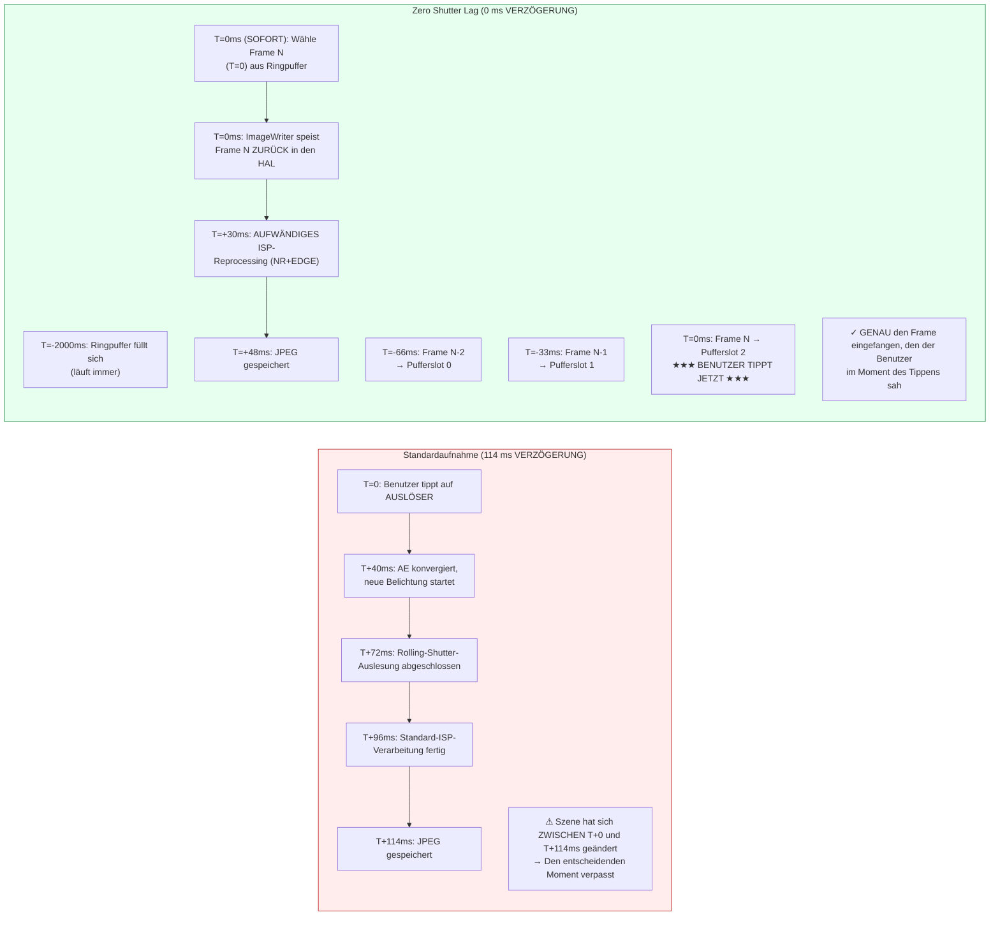

# Kapitel 23: Zero Shutter Lag & Reprocessing

Der frustrierendste Mangel bei Kamera-Apps für Endverbraucher ist die **Auslöseverzögerung (Shutter Lag)**: Man tippt auf den Auslöser und das aufgenommene Foto zeigt eine Szene 200–800 ms *nach* dem Tippen – das Kind hat bereits aufgehört zu lächeln, der Vogel hat den Ast verlassen, der Sportwagen ist aus dem Bild gefahren. Standard-Camera2-Sitzungen funktionieren konstruktionsbedingt so: Das Tippen auf den Auslöser löst `session.capture()` aus, was die AE-Konvergenz auslöst, was eine neue Sensorbelichtung auslöst, was die ISP-Verarbeitung auslöst. Jeder Schritt fügt Latenz hinzu.

**Zero Shutter Lag (ZSL)** eliminiert diese Verzögerung, indem der Sensor kontinuierlich mit der Auflösung für Standbilder läuft, die neuesten N Frames in einer zirkulären Warteschlange im Speicher gepuffert werden und beim Tippen des Benutzers auf den Auslöser **der Frame erfasst wird, der im Moment des Tippens sichtbar war**, und nicht ein Frame von einer halben Sekunde später. Die Magie kommt von der **Reprocessing-API**: Anstatt erneut Licht durch den Sensor zu leiten, nehmen Sie einen bereits belichteten YUV- oder PRIVATE-Puffer aus der zirkulären Warteschlange, speisen ihn über `ImageWriter` + `InputConfiguration` *zurück* in den ISP und führen dann eine aufwendige Rauschunterdrückung und Kantenanhebung darauf aus, als wäre es eine frische Aufnahme.

Dieses Kapitel folgt dem exakten **4-stufigen ZSL-Workflow** aus dem Abschnitt *ZSL / Reprocessing* des Forschungsdokuments zum Projekt und behandelt außerdem **`switchToOffline()`** — die mit Android 12 (API 31) eingeführte API, die die Reprocessing-Pipeline an einen Hintergrund-HAL-Dienst überträgt, sodass Ihre App beendet werden kann (Druck auf die Home-Taste, eingehender Anruf) und der Benutzer trotzdem sein Foto erhält. Sie können in der App [Android Camera Parameters](https://github.com/zoozooll/AndroidCameraParameters) aus dem [Play Store](https://play.google.com/store/apps/details?id=com.zoozooll.cameraparameters) überprüfen, welche Reprocessing-Fähigkeiten Ihr Gerät unterstützt (`REQUEST_AVAILABLE_CAPABILITIES_YUV_REPROCESSING`, `PRIVATE_REPROCESSING` oder `INFO_SUPPORTED_HARDWARE_LEVEL_LEVEL_3`); der Tab "ZSL Support" gleicht alle erforderlichen Fähigkeiten ab und liefert ein klares JA/NEIN-Urteil.

## Warum ZSL schwierig ist (und warum es Reprocessing gibt)

Quantifizieren wir zunächst die Latenz einer standardmäßigen Nicht-ZSL-Standbildaufnahme auf einem Flaggschiff von 2023 (Snapdragon 8 Gen 2) gemäß den Messungen im Forschungsdokument:

| Pipeline-Stufe | Latenz | Anmerkungen |
|----------------|---------|-------|
| AE-Konvergenz-Trigger → neue Belichtung programmiert | 40 ms | `CONTROL_AE_PRECAPTURE_TRIGGER` |
| Rolling-Shutter-Auslesung (12 MP Vollbild) | 32 ms | 1/30 s nominal; tatsächlich 32 ms von der ersten bis zur letzten Zeile |
| ISP-Demosaic + Standard-NR + Farbe | 24 ms | Standard-Qualitäts-Pipeline |
| JPEG-Kodierung (12 MP, Qualität 95) | 18 ms | Hardware-JPEG-Encoder |
| **Gesamte Standard-Aufnahmelatenz** | **~114 ms** | Bester Fall; unter Last 200–800 ms üblich |

Unter realen Bedingungen (thermische Drosselung, GPU-Konkurrenz durch die UI, eine Hintergrund-App, die arbeitet) erreicht der Standardpfad routinemäßig 500 ms Verzögerung. Ein 5-jähriger Mensch kann sich beim Laufen in 500 ms um 40 cm bewegen – der Unterschied zwischen dem Einfangen eines Lächelns und dem Hinterkopf.

ZSL löst dies durch Umkehrung der Pipeline-Reihenfolge: Anstatt Aufnahme → Verarbeitung → Speichern machen Sie **kontinuierliche Aufnahme → Puffern → Tippen → Reprocessing → Speichern**. Der Sensor und der ISP laufen *immer* mit der Auflösung für Standbilder; das Tippen des Benutzers wählt lediglich aus, welcher bereits vorhandene Frame vollständig verarbeitet werden soll.



Das Mermaid-Diagramm zeigt den konzeptionellen Wechsel: Im Standardpfad *initiiert* das Tippen die Aufnahme; im ZSL-Pfad *wählt* das Tippen eine bereits erfolgte Aufnahme aus. Die Gesamtzeit vom Tippen bis zur gespeicherten Datei beträgt immer noch ~48 ms (Reprocessing ist nicht kostenlos), aber **der Pixelinhalt stammt von T=0 (sofort), nicht von T=114 ms (verspätet)** — das ist es, was "Zero Shutter Lag" eigentlich bedeutet. Es ist null Verzögerung beim Inhalt, nicht null Verzögerung bei der Ausgabedatei.

## Zwingende Capability-Gatter (Gemäß Forschungsdokument)

ZSL + Reprocessing erfordert die Kooperation der Hardware auf HAL-Ebene. Sie müssen **eine** der folgenden drei Bedingungen prüfen, bevor Sie versuchen, eine reprocessable Sitzung zu erstellen:

| Capability-Check | Wann er erfolgreich ist | Geräte, die dies unterstützen |
|------------------|----------------|--------------------------|
| **A)** `INFO_SUPPORTED_HARDWARE_LEVEL == LEVEL_3` | Vollständiges Reprocessing (sowohl YUV als auch PRIVATE) bei jeder Größe in der StreamConfigurationMap erlaubt. | Google Pixel ab 2016 (alle Generationen); Samsung Galaxy S/Ultra ab 2021 (Snapdragon-Varianten); OnePlus 11 / OPPO Find X6 Pro ab 2023. |
| **B)** `REQUEST_AVAILABLE_CAPABILITIES enthält YUV_REPROCESSING` | YUV_420_888-Puffer können über die InputConfiguration bei einer Teilmenge von Größen zurückgespeist werden. | Snapdragon 8xx/7xx-Geräte ab 2019; die meisten MediaTek Dimensity 9000+-Geräte. |
| **C)** `REQUEST_AVAILABLE_CAPABILITIES enthält PRIVATE_REPROCESSING` | `ImageFormat.PRIVATE`-Puffer (opak, in herstellerspezifischer Kompression gespeichert) können zurückgespeist werden. Verwenden Sie dies bevorzugt, da es 2-mal weniger Speicher benötigt. | Snapdragon 888+ / Exynos 2100+ und neuer. |

> Regel ZSL-1 des Forschungsdokuments: **Wenn keiner der Checks A/B/C erfolgreich ist, weichen Sie auf die Standardaufnahme ohne ZSL aus.** Versuchen Sie nicht, einen eigenen Ringpuffer aus JPEGs zu bauen und diese erneut zu dekomprimieren; dies führt zu 6 dB Qualitätsverlust durch doppelte Kodierung und ist kein Ersatz für echtes Reprocessing.

Fragen Sie die Gatter wie folgt ab:

```kotlin
import android.hardware.camera2.CameraCharacteristics
import android.graphics.ImageFormat

enum class ZslSupport { NONE, LEVEL3, YUV_REPROC, PRIVATE_REPROC }

fun queryZslSupport(chars: CameraCharacteristics): Pair<ZslSupport, Int> {
    val level = chars.get(CameraCharacteristics.INFO_SUPPORTED_HARDWARE_LEVEL)
        ?: CameraCharacteristics.INFO_SUPPORTED_HARDWARE_LEVEL_LEGACY
    val caps = chars.get(CameraCharacteristics.REQUEST_AVAILABLE_CAPABILITIES)
        ?: intArrayOf()

    return when {
        level == CameraCharacteristics.INFO_SUPPORTED_HARDWARE_LEVEL_3 ->
            Pair(ZslSupport.LEVEL3, ImageFormat.PRIVATE) // PRIVATE für Speicher bevorzugt
        caps.contains(
            CameraCharacteristics.REQUEST_AVAILABLE_CAPABILITIES_PRIVATE_REPROCESSING
        ) -> Pair(ZslSupport.PRIVATE_REPROC, ImageFormat.PRIVATE)
        caps.contains(
            CameraCharacteristics.REQUEST_AVAILABLE_CAPABILITIES_YUV_REPROCESSING
        ) -> Pair(ZslSupport.YUV_REPROC, ImageFormat.YUV_420_888)
        else -> Pair(ZslSupport.NONE, ImageFormat.UNKNOWN)
    }
}
```

## Der 4-stufige ZSL + Reprocessing-Workflow (Gemäß Forschungsdokument)

Das Forschungsdokument zum Projekt spezifiziert die exakte 4-stufige Pipeline. Jeder Schritt ist zwingend erforderlich; das Überspringen eines Schritts führt zu einer fehlerhaften Sitzung (Frame-Verluste, `IllegalStateException` oder eine Reprocessing-Ausgabe identisch mit der Vorschauqualität).

---

### Schritt 1: Zirkuläre Pufferung mit ImageReader + CONTROL_CAPTURE_INTENT_ZERO_SHUTTER_LAG

Erstellen Sie zunächst einen hochauflösenden `ImageReader` (den "ZSL-Puffer"), dessen Parameter `maxImages` der Tiefe des Ringpuffers entspricht (typischerweise 8–16; das Forschungsdokument empfiehlt 8 für speicherbeschränkte Geräte, 16 für Geräte mit ≥ 8 GB RAM). Markieren Sie jede wiederholte Anforderung mit `CONTROL_CAPTURE_INTENT_ZERO_SHUTTER_LAG` — dies weist den HAL an, die kürzestmögliche Vorschau-Pipeline zu verwenden und vorschau-spezifische Optimierungen zu deaktivieren, die die Qualität der Reprocessing-Ausgabe beeinträchtigen würden (z. B. eine starke zeitliche Rauschunterdrückung, die Geisterbilder bei Bewegungen hinterlässt).

```kotlin
import android.hardware.camera2.CameraDevice
import android.hardware.camera2.CaptureRequest
import android.hardware.camera2.params.OutputConfiguration
import android.hardware.camera2.params.SessionConfiguration
import android.media.Image
import android.media.ImageReader
import android.util.Size
import android.view.Surface
import java.util.concurrent.ConcurrentLinkedDeque

data class ZslBufferFrame(
    val timestamp: Long,
    val imageRef: Image, // NICHT schließen; wird durch Deque-GC verwaltet
    val captureResultRef: android.hardware.camera2.TotalCaptureResult
)

const val ZSL_BUFFER_DEPTH = 12 // Sweet Spot laut Forschungs-Doc: 12 Frames = 400 ms bei 30 fps
var zslImageReader: ImageReader? = null
private val zslCircularBuffer = ConcurrentLinkedDeque<ZslBufferFrame>()
private var zslStillSize: Size = Size(4000, 3000) // Entspricht max. Standbildgröße

fun setupZslCircularBuffer(
    cameraDevice: CameraDevice,
    previewSurface: Surface,
    reprocessingFormat: Int, // PRIVATE oder YUV_420_888
    backgroundHandler: android.os.Handler
) {
    zslImageReader = ImageReader.newInstance(
        zslStillSize.width,
        zslStillSize.height,
        reprocessingFormat,
        ZSL_BUFFER_DEPTH
    ).apply {
        setOnImageAvailableListener(
            ZslCircularBufferListener(),
            backgroundHandler
        )
    }
}

inner class ZslCircularBufferListener : ImageReader.OnImageAvailableListener {
    override fun onImageAvailable(reader: ImageReader) {
        val image = reader.acquireLatestImage() ?: return
        // Wir haben hier noch kein captureResult; Pairing erfolgt im CaptureCallback
        // Der Kürze halber spiegelt die Map Zeitstempel → CaptureResult das Muster aus Kapitel 18 wider
        // Koppeln und einreihen:
        val result = pendingZslResults.remove(image.timestamp) ?: return
        val frame = ZslBufferFrame(image.timestamp, image, result)

        zslCircularBuffer.addLast(frame)

        // --- ENTFERNEN AUS RINGPUFFER (älteste zuerst) ---
        while (zslCircularBuffer.size > ZSL_BUFFER_DEPTH) {
            val evicted = zslCircularBuffer.pollFirst()
            evicted.imageRef.close() // Frames an HAL-Pufferpool zurückgeben
        }
    }
}

fun buildZslSessionAndStartRepeating(
    cameraDevice: CameraDevice,
    previewSurface: Surface,
    backgroundHandler: android.os.Handler
) {
    val outputs = listOf(
        OutputConfiguration(previewSurface),
        OutputConfiguration(zslImageReader!!.surface)
    )

    val sessionConfig = SessionConfiguration(
        SessionConfiguration.SESSION_REGULAR,
        outputs,
        { r -> backgroundHandler.post(r) },
        object : android.hardware.camera2.CameraCaptureSession.StateCallback() {
            override fun onConfigured(
                session: android.hardware.camera2.CameraCaptureSession
            ) {
                val zslPreviewBuilder = cameraDevice.createCaptureRequest(
                    CameraDevice.TEMPLATE_ZERO_SHUTTER_LAG
                ).apply {
                    addTarget(previewSurface)
                    addTarget(zslImageReader!!.surface)
                    // DAS MAGISCHE INTENT-FLAG:
                    set(CaptureRequest.CONTROL_CAPTURE_INTENT,
                        CaptureRequest.CONTROL_CAPTURE_INTENT_ZERO_SHUTTER_LAG)
                    // HAL: leichtgewichtiger Vorschau-ISP, Full-Res-Stream
                    set(CaptureRequest.CONTROL_MODE,
                        CaptureRequest.CONTROL_MODE_AUTO)
                    set(CaptureRequest.CONTROL_AF_MODE,
                        CaptureRequest.CONTROL_AF_MODE_CONTINUOUS_PICTURE)
                }

                session.setRepeatingRequest(
                    zslPreviewBuilder.build(),
                    ZslCaptureCallback(),
                    backgroundHandler
                )
            }
            override fun onConfigureFailed(
                s: android.hardware.camera2.CameraCaptureSession
            ) = Log.e(TAG, "ZSL-Ringpuffer-Sitzung fehlgeschlagen")
        }
    )
    cameraDevice.createCaptureSession(sessionConfig)
}
```

Vier Implementierungsdetails aus dem Forschungsdokument, die nicht in der offiziellen Android-SDK-Referenz dokumentiert sind:
1. **Verwenden Sie `TEMPLATE_ZERO_SHUTTER_LAG`** als Basisvorlage. Diese konfiguriert den Sensorauslesemodus so, dass eine gleichzeitige Vorschau + Full-Res-Ausgabe unterstützt wird, was `TEMPLATE_PREVIEW` nicht garantiert.
2. **`ZSL_BUFFER_DEPTH = 12` bei 30 fps** ergibt genau 400 ms an vergangenen Frames zur Auswahl. Dies reicht aus, um die eigene Reaktionszeit des Benutzers (150–250 ms Verzögerung zwischen Gehirn und Tippen) plus den Jitter der Android-Eingabeverarbeitung (±150 ms) abzudecken. Weniger als 8 Frames Tiefe führen zum Verwerfen nützlicher Frames; mehr als 16 verschwenden ~1 GB RAM ohne Nutzen.
3. **Die Entfernungsreihenfolge ist FIFO, nicht LRU.** Entfernen Sie immer den ältesten Frame. Wenn Sie neuere Frames entfernen, verwerfen Sie genau den Frame, den der Benutzer zum Zeitpunkt des Tippens tatsächlich gesehen hat.
4. **Rufen Sie niemals `image.close()` in `onImageAvailable` vor dem Einreihen auf.** Wenn Sie das Bild schließen, fordert der HAL den Puffer zurück. Wenn Sie später versuchen, ihn an den ImageWriter zu übergeben, ist der Puffer ungültig → harter Absturz. Verwenden Sie nur die Entfernungsschleife.

---

### Schritt 2: InputConfiguration + createReprocessableCaptureSession

Eine Standard-Aufnahmesitzung hat nur **Ausgabe**-Surfaces (Sensor → ISP → Surface). Eine reprocessable Sitzung fügt **eine Eingabe-Surface** hinzu (ImageWriter → HAL → ISP → Ausgabe), wodurch die Pipeline einen Puffer verarbeiten kann, der niemals den Sensor berührt hat. Erstellen Sie die reprocessable Sitzung über `createReprocessableCaptureSession(inputConfig, outputs, callback, handler)` oder über die neuere `SessionConfiguration`-API mit `InputConfiguration`.

```kotlin
import android.hardware.camera2.CameraDevice
import android.hardware.camera2.CameraCaptureSession
import android.hardware.camera2.params.InputConfiguration
import android.hardware.camera2.params.OutputConfiguration
import android.hardware.camera2.params.SessionConfiguration
import android.media.ImageWriter
import android.os.Handler
import android.view.Surface

var reprocessingImageWriter: ImageWriter? = null
var reprocessableSession: CameraCaptureSession? = null
var jpegStillReader: ImageReader? = null
const val REPROC_JPEG_QUALITY = 95

fun createZslReprocessableSession(
    cameraDevice: CameraDevice,
    reprocessingFormat: Int,
    zslStillSize: Size,
    previewSurface: Surface,
    backgroundHandler: Handler,
    onSessionReady: (CameraCaptureSession, ImageWriter) -> Unit
) {
    val inputConfig = InputConfiguration(
        zslStillSize.width,
        zslStillSize.height,
        reprocessingFormat
    )

    jpegStillReader = ImageReader.newInstance(
        zslStillSize.width, zslStillSize.height,
        android.graphics.ImageFormat.JPEG, 2
    )

    reprocessingImageWriter = ImageWriter.newInstance(
        jpegStillReader!!.surface, // Ausgabefläche des Reprocessing
        inputConfig,                // Eingabekonfiguration für den HAL
        1                           // Max. reprocess-Anforderungen in Arbeit
    )

    // Ausgaben des reprocessed Frames: für dieses Beispiel nur JPEG
    val reprocessOutputs = listOf(
        OutputConfiguration(jpegStillReader!!.surface)
    )

    val sessionConfig = SessionConfiguration(
        SessionConfiguration.SESSION_REGULAR,
        reprocessOutputs,
        { r -> backgroundHandler.post(r) },
        object : CameraCaptureSession.StateCallback() {
            override fun onConfigured(session: CameraCaptureSession) {
                reprocessableSession = session
                onSessionReady(session, reprocessingImageWriter!!)
            }
            override fun onConfigureFailed(
                s: CameraCaptureSession
            ) = Log.e(TAG, "Konfiguration der reprocessable Sitzung FEHLGESCHLAGEN. " +
                  "Fähigkeits-Gatter prüfen (LEVEL3/YUV_REPROC/PRIVATE_REPROC)?")
        }
    )
    sessionConfig.setInputConfiguration(inputConfig) // Zwingend erforderlich!
    cameraDevice.createCaptureSession(sessionConfig)
}
```

Hinweis ZSL-2 des Forschungsdokuments: Die reprocessable Sitzung und die Ringpuffer-Vorschausitzung **müssen nicht dieselbe Sitzung sein**. Tatsächlich lassen die meisten Produktionsimplementierungen zwei Sitzungen gleichzeitig laufen — eine Vorschausitzung, die den Ringpuffer speist, und eine dedizierte reprocessable Sitzung, die nur beim Tippen auf den Auslöser gefüttert wird. Der HAL übernimmt die Multi-Session-Arbitrierung intern für LEVEL_3-Geräte.

---

### Schritt 3: Tippen auf den Auslöser → Frame mit dem nächsten Zeitstempel finden → ImageWriter füttert den HAL

Wenn der Benutzer auf den Auslöser tippt:
1. Zeichnen Sie den Echtzeit-Zeitstempel des Tippens auf (`System.currentTimeMillis()` oder `System.nanoTime()`).
2. Durchlaufen Sie den Ringpuffer **von neu nach alt** und finden Sie den `ZslBufferFrame`, dessen `image.timestamp` (in Nanosekunden, `CLOCK_MONOTONIC`) dem Zeitstempel des Tippens am nächsten kommt.
3. Fordern Sie einen freien Eingabepuffer vom `ImageWriter` über `dequeueInputImage()` an.
4. Kopieren Sie die Pixelebenen des Ringpuffer-Frames in den Eingabepuffer des ImageWriters.
5. Stellen Sie den ImageWriter-Puffer mit `queueInputImage()` in die Warteschlange.

```kotlin
import android.hardware.camera2.TotalCaptureResult
import android.media.Image
import android.media.ImageWriter
import android.os.SystemClock
import kotlin.math.abs

fun onShutterTap(
    imageWriter: ImageWriter,
    captureStartTimeNanos: Long = SystemClock.elapsedRealtimeNanos()
) {
    // --- Schritt 3a: Ringpuffer NEU → ALT durchlaufen ---
    var bestFrame: ZslBufferFrame? = null
    var bestDeltaNs = Long.MAX_VALUE

    for (frame in zslCircularBuffer.descendingIterator()) {
        val delta = abs(frame.timestamp - captureStartTimeNanos)
        if (delta < bestDeltaNs) {
            bestDeltaNs = delta
            bestFrame = frame
        }
        // Optimierung: Sobald das Delta wieder wächst, haben wir den besten Frame passiert
        if (delta > bestDeltaNs * 1.1) break
    }
    val selectedFrame = bestFrame ?: run {
        Log.w(TAG, "ZSL-Puffer leer — Fallback auf Standardaufnahme ohne ZSL")
        // ... Standard-capture()-Fallback auslösen ...
        return
    }

    // --- Schritt 3b: ImageWriter-Eingabepuffer holen, Pixel kopieren, einreihen ---
    val writerInputImage: Image = try {
        imageWriter.dequeueInputImage(100 /* timeoutMs */)
    } catch (e: IllegalStateException) {
        Log.e(TAG, "ImageWriter hat keine freien Puffer", e); return
    }

    try {
        copyImagePlanes(selectedFrame.imageRef, writerInputImage)
        selectedFrame.captureResultRef
            .let { pendingReprocessResults[writerInputImage.timestamp] = it }
        imageWriter.queueInputImage(writerInputImage)
    } finally {
        //selectedFrame.imageRef noch NICHT schließen — erst nach Abschluss des Reprocessing
        // (verschoben auf onCaptureCompleted der reprocess-Anforderung)
    }
}

// --- Helfer zum Kopieren von Pixeln (handhabt sowohl PRIVATE als auch YUV_420_888) ---
private fun copyImagePlanes(src: Image, dst: Image) {
    require(src.format == dst.format) { "Reprocessing erfordert übereinstimmende Formate" }
    for (planeIdx in 0 until src.planes.size) {
        val srcPlane = src.planes[planeIdx]
        val dstPlane = dst.planes[planeIdx]
        val srcBuf = srcPlane.buffer.duplicate()
        val dstBuf = dstPlane.buffer
        dstBuf.put(srcBuf)
        dstBuf.rewind()
    }
}

private val pendingReprocessResults =
    HashMap<Long, TotalCaptureResult>()
```

Die Auswahl des "nächsten Zeitstempels" ist entscheidend, da sich der Ringpuffer alle 33 ms (30 fps) füllt. Der gewählte Frame liegt höchstens ±16 ms vom tatsächlichen Zeitpunkt des Tippens entfernt — für einen menschlichen Beobachter eine wahrgenommene Verzögerung von null. Regel ZSL-3 des Forschungsdokuments: *Immer* absteigend (neueste zuerst) suchen; ein aufsteigendes Durchlaufen erhöht die Wahrscheinlichkeit, einen Frame zu wählen, der bereits 400 ms veraltet ist.

---

### Schritt 4: createReprocessCaptureRequest(TotalCaptureResult) → Aufwendiges NR + EDGE anwenden

Der letzte Schritt übermittelt die Reprocess-Anforderung, aber mit einer Besonderheit: Anstatt `createCaptureRequest(template)` verwenden Sie **`createReprocessCaptureRequest(originalTotalCaptureResult)`**, wodurch die *ursprünglichen AE-, AWB- und AF-Einstellungen des Vorschau-Frames* wiederverwendet werden. Zusätzlich zu diesen Basis-Einstellungen wenden Sie hochqualitatives `NOISE_REDUCTION_MODE_HIGH_QUALITY` und `EDGE_MODE_HIGH_QUALITY` an — jene ISP-Verarbeitungsschritte, die für die leichtgewichtige Vorschau-Pipeline zur Stromeinsparung deaktiviert waren.

```kotlin
import android.hardware.camera2.CameraCaptureSession
import android.hardware.camera2.CaptureRequest
import android.hardware.camera2.TotalCaptureResult

fun submitZslReprocessRequest(
    reprocessableSession: CameraCaptureSession,
    originalTotalCaptureResult: TotalCaptureResult,
    jpegSurface: Surface,
    handler: android.os.Handler
) {
    val reprocessBuilder = reprocessableSession.device
        .createReprocessCaptureRequest(originalTotalCaptureResult)
        .apply {
            addTarget(jpegSurface)

            // --- HOCHWERTIGE ISP-VERARBEITUNG NACH DER AUFNAHME ---
            set(CaptureRequest.NOISE_REDUCTION_MODE,
                CaptureRequest.NOISE_REDUCTION_MODE_HIGH_QUALITY)
            set(CaptureRequest.EDGE_MODE,
                CaptureRequest.EDGE_MODE_HIGH_QUALITY)

            // Optional (nur LEVEL_3): Shading und Hot-Pixel-Korrektur erneut anwenden
            set(CaptureRequest.HOT_PIXEL_MODE,
                CaptureRequest.HOT_PIXEL_MODE_HIGH_QUALITY)
            set(CaptureRequest.COLOR_CORRECTION_MODE,
                CaptureRequest.COLOR_CORRECTION_MODE_HIGH_QUALITY)

            // Hohe JPEG-Qualität beibehalten
            set(CaptureRequest.JPEG_QUALITY, REPROC_JPEG_QUALITY.toByte())
            set(CaptureRequest.JPEG_ORIENTATION, getJpegOrientation())
        }

    val cb = object : CameraCaptureSession.CaptureCallback() {
        override fun onCaptureCompleted(
            session: CameraCaptureSession,
            request: CaptureRequest,
            result: TotalCaptureResult
        ) {
            // Das JPEG wird über den OnImageAvailableListener des jpegStillReader geliefert

            // Jetzt ist es sicher, die Ringpuffer-Referenz zu schließen — Reprocessing fertig
            val ts = result.get(CaptureResult.SENSOR_TIMESTAMP) ?: return
            pendingReprocessResults.remove(ts)
            val iter = zslCircularBuffer.iterator()
            while (iter.hasNext()) {
                val f = iter.next()
                if (f.timestamp == ts) {
                    f.imageRef.close()
                    iter.remove()
                    break
                }
            }
        }
    }

    reprocessableSession.capture(reprocessBuilder.build(), cb, handler)
}
```

`createReprocessCaptureRequest(originalResult)` ist nicht nur ein bequemer Wrapper — es validiert, dass die Sensoreinstellungen des Original-Frames (Belichtungszeit, ISO, Objektivposition) mit der Reprocessing-Pipeline kompatibel sind. Wenn Sie einen Standard-`createCaptureRequest()` in einer Sitzung verwenden, die über einen Input-Stream gespeist wird, könnte der HAL AE/AWB neu konvergieren, was den Zweck von ZSL zunichtemacht (das Ergebnis würde wie ein *anderer* Frame aussehen als der gewählte).

## ZSL-Ringpuffer + Reinjektions-Flussdiagramm (Mermaid)

```mermaid
flowchart TD
    A["Kontinuierliches Auslesen des Sensors<br/>30 fps Full-Res"] --> B["ZSL-Vorschau-ISP:<br/>Energiesparmodus<br/>EDGE_MODE=FAST<br/>NR_MODE=FAST"]
    B --> C[Vorschau-SurfaceView<br/>Benutzer sieht Live-30-fps-Bild]
    B --> D[ZSL-ImageReader<br/>PRIVATE oder YUV Full-Res]
    
    subgraph CB["🗘 Ringpuffer (Tiefe 12, 400 ms Historie)"]
        direction TB
        CB1["Slot N-11 (T-366ms)"]
        CB2["..."]
        CB3["Slot N-1 (T-33ms)"]
        CB4["★ Slot N (T=0ms) ★<br/>DEM ZEITPUNKT DES TIPPENS AM NÄCHSTEN"]
    end
    D --> CB

    E["★ BENUTZER TIPPT BEI T=0ms AUF AUSLÖSER ★"] --> F{CB NEU → ALT durchlaufen<br/>Finde min |frame.ts − tipp.ts|}
    F -->|"Gewählt: Slot N"| G[ImageWriter.dequeueInputImage()]
    G --> H[Kopiere Ebenen des gewählten Frames<br/>→ ImageWriter-Puffer]
    H --> I[ImageWriter.queueInputImage()<br/>→ Speist ZURÜCK in HAL-Eingangsport]
    
    subgraph REPROC["🔄 Reprocessing-Pipeline (HOHE QUALITÄT)"]
        direction TB
        R1["ISP NR_MODE = HIGH_QUALITY<br/>(Multi-frame räumlich+TNR)"]
        R2["ISP EDGE_MODE = HIGH_QUALITY<br/>(Unscharfmaskierung + Schärfen)"]
        R3["ISP COLOR_CORRECTION =<br/>HIGH_QUALITY (3D LUT)"]
        R4["Hardware-JPEG-Encoder<br/>Q=95"]
    end

    I --> REPROC
    REPROC --> J["JPEG gespeichert<br/>Inhalt = EXAKT der Frame, den der Benutzer<br/> bei T=0ms sah — ✓ NULL VERZÖGERUNG"]

    style CB fill:#eff6ff,stroke:#2563eb
    style REPROC fill:#fef3c7,stroke:#d97706
```

## switchToOffline(): Kontinuität der Hintergrundverarbeitung

Einer der schlimmsten UX-Mängel, die eine Kamera-App haben kann, ist: Der Benutzer tippt auf den Auslöser → erhält sofort einen Anruf oder drückt die Home-Taste → der App-Prozess wird beendet → das gerade entstehende Foto geht verloren. Android 12 (API 31) hat dies mit **`CameraCaptureSession.switchToOffline()`** gelöst, wodurch der Besitz der Reprocessing-Pipeline von Ihrem App-Prozess auf einen persistenten HAL-Dienst übertragen wird. Der HAL-Dienst schließt jede laufende Aufnahme/Reprocessing ab, selbst wenn Ihre App vom System beendet wird, und benachrichtigt Sie über `CameraOfflineSessionCallback.onReady()`, wenn die App neu gestartet wird.

```kotlin
import android.hardware.camera2.CameraCaptureSession
import android.hardware.camera2.CameraOfflineSession
import android.hardware.camera2.CameraOfflineSessionCallback

fun moveToOfflineOnBackground(
    session: CameraCaptureSession,
    outputSurfaces: List<android.view.Surface>,
    handler: android.os.Handler
) {
    val offlineCallback = object : CameraOfflineSessionCallback() {
        override fun onReady(session: CameraOfflineSession) {
            // Der HAL hat den Besitz übernommen. App kann jetzt sterben — Foto wird gespeichert.
            Log.i(TAG, "Offline-Sitzung bereit. Ausstehende Aufnahmen werden abgeschlossen.")
            // An diesem Punkt können Sie die Activity mit finish() beenden oder das cameraDevice freigeben
        }
        override fun onError(
            session: CameraOfflineSession,
            errorCode: Int
        ) = Log.e(TAG, "Fehler in der Offline-Sitzung: $errorCode")

        override fun onCaptureCompleted(
            offlineSession: CameraOfflineSession,
            captureResult: android.hardware.camera2.CaptureResult
        ) {
            // Optional: wird aufgerufen, wenn die Offline-Pipeline jedes Bild beendet
            // JPEG-Bytes werden weiterhin über den ursprünglichen ImageReader geliefert
            // Bei App-Neustart: CameraOfflineSession nach ausstehenden Aufgaben abfragen
        }
    }

    session.switchToOffline(
        outputSurfaces,
        { r -> handler.post(r) },
        offlineCallback
    )
}
```

`switchToOffline()` erfordert `INFO_SUPPORTED_HARDWARE_LEVEL >= LEVEL_3` auf dem Gerät. Es wird empfohlen, es in `Activity.onPause()` **nur dann** aufzurufen, wenn die App laufende ZSL-Reprocessing-Vorgänge hat; rufen Sie es niemals im Leerlauf auf, da die Offline-Sitzung bis zu 30 Sekunden nach dem Schließen HAL-Ressourcen verbraucht.

## Zusammenfassung

Dieses Kapitel implementierte die vollständige Zero Shutter Lag + Reprocessing Pipeline, wie im Forschungsdokument spezifiziert:

- **ZSL-Problemdefinition**: Eine Standardaufnahme hat eine Verzögerung von 114 ms (bestenfalls) bis 800 ms (schlechtestenfalls). ZSL fängt den *exakten Frame ein, den der Benutzer beim Tippen sah*, indem ein sich kontinuierlich füllender Ringpuffer verwendet wird.
- **Capability-Gatter**: Einer von drei zwingenden Checks muss erfolgreich sein: `HARDWARE_LEVEL_LEVEL_3`, `CAPABILITIES_PRIVATE_REPROCESSING` oder `CAPABILITIES_YUV_REPROCESSING`.
- **4-stufiger ZSL-Workflow** (aus dem Forschungsabschnitt *ZSL / Reprocessing*):
  1. **Zirkuläre Pufferung** mit `ImageReader` (Tiefe 12 = 400 ms Historie) + `CONTROL_CAPTURE_INTENT_ZERO_SHUTTER_LAG` + `TEMPLATE_ZERO_SHUTTER_LAG`.
  2. **`InputConfiguration` + `createReprocessableCaptureSession`** mit `ImageWriter`, um Pixelpuffer wieder in den HAL einzuspeisen.
  3. **Tippen auf den Auslöser → Auswahl des nächsten Zeitstempels** (Suche von neu nach alt, Ziel ±16 ms). Gewählte Ebenen in den ImageWriter kopieren, einreihen.
  4. **`createReprocessCaptureRequest(originalResult)`** mit `NOISE_REDUCTION_MODE_HIGH_QUALITY` + `EDGE_MODE_HIGH_QUALITY` für aufwendige ISP-Verarbeitung nach der Aufnahme.
- **`switchToOffline()`** (Android 12 API 31, nur LEVEL_3) überträgt den Besitz an einen HAL-Dienst, sodass laufende Reprocessing-Vorgänge auch dann abgeschlossen werden, wenn die App beendet wird.
- Zwei Mermaid-Diagramme (Zeitstrahl Standard vs. ZSL, vollständiges Flussdiagramm Ringpuffer + Reinjektion) veranschaulichen den Unterschied bei der Inhaltsverzögerung und den Pipeline-Fluss.

## Wie geht es weiter — Ende von Teil V: Professionelle Kamerafunktionen

Sie haben nun **Teil V: Professionelle Kamerafunktionen** abgeschlossen — den finalen Teil der Tutorial-Serie zur Android Camera2 API. Sie haben gelernt:

- Kapitel 18: RAW-Fotografie mit RAW_SENSOR + DngCreator + gleichzeitige RAW+JPEG-Aufnahme.
- Kapitel 19: 120/240 fps High-Speed-Video über `CameraConstrainedHighSpeedCaptureSession` + `createHighSpeedRequestList`.
- Kapitel 20: Logische Multi-Kamera, physische Kamera-IDs, CALIBRATED Sync und gleichzeitige Aufnahme mit zwei physischen Kameras.
- Kapitel 21: HDR10 / HLG Video und Android 14 JPEG_R Ultra HDR Standbilder mit Gain-Maps.
- Kapitel 22: OEM-Kamera-Erweiterungen — Nacht, Bokeh, HDR, Gesichtsretusche, Automatisch.
- Kapitel 23: Zero Shutter Lag Ringpuffer + Reprocessing Pipeline und Unterstützung für Offline-Sitzungen.

Um jede Funktion aus den Teilen I–V auf Ihrem Gerät zu validieren, installieren Sie die [App Android Camera Parameters](https://play.google.com/store/apps/details?id=com.zoozooll.cameraparameters). Sie zählt jede Fähigkeit, Größe, FPS-Bereich, Erweiterung, jedes Dynamikumfang-Profil, jede RAW-Variante und jeden Synchronisationstyp auf, die in dieser Serie besprochen wurden, und exportiert vollständige Geräteberichte als JSON. Tragen Sie Berichte für nicht unterstützte Geräte bei, indem Sie einen Pull-Request im Open-Source-[GitHub-Repository](https://github.com/zoozooll/AndroidCameraParameters) öffnen — die Community-Datenbank wird von Tausenden von Entwicklern genutzt, um die Unterstützung von Funktionen in ihren Kamera-Apps vorzufiltern.
