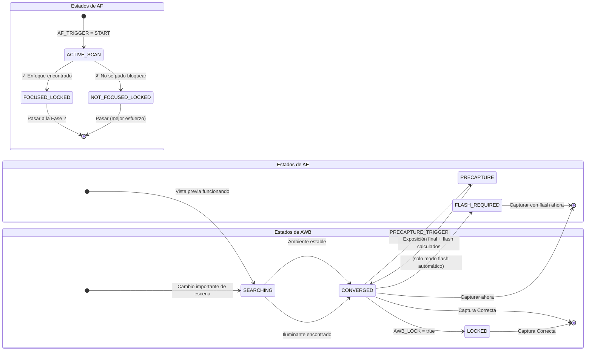

# Capítulo 17: La tubería 3A

Hemos estudiado **AE** (Exposición Automática, Capítulos 13–14), **AF** (Enfoque Automático, Capítulo 15) y **AWB** (Balance de Blancos Automático, Capítulo 16) como sistemas independientes. Las aplicaciones de fotografía reales deben coordinar los tres antes de cada pulsación del obturador, y el *orden y la temporización* importan profundamente.

Una implementación ingenua que dispara `capture()` inmediatamente cuando el usuario toca el botón del obturador produce resultados inconsistentes: a veces enfoca, otras no; a veces el flash se dispara, otras no; a veces un AWB a medio barrido produce una foto con tinte verde. Una tubería 3A fiable elimina todo eso.

La implementación de la tubería 3A en este capítulo es idéntica al flujo utilizado internamente en la [aplicación Android Camera Parameters](https://github.com/zoozooll/AndroidCameraParameters) y a la secuencia descrita en los documentos de investigación de la arquitectura de la cámara de Android y los artículos de CSDN sobre el desarrollo profesional con Camera2.

---

## La secuencia completa de orquestación 3A (Resumen)

Antes de profundizar en cada subsistema, visualicemos el flujo de estados completo. Esta es una secuencia de producción real, no una simplificación.

```mermaid
sequenceDiagram
    actor User
    participant App as CaptureController
    participant HAL as Camera2 HAL
    participant AE as Motor AE
    participant AF as Motor AF
    participant AWB as Motor AWB

    User->>App: Toca el botón "Capturar"
    App->>HAL: Establecer AF_MODE = AUTO (o MACRO)
    App->>HAL: CONTROL_AF_TRIGGER = START
    Note over HAL,AF: Se inicia el escaneo de enfoque

    loop Cada fotograma de vista previa
        HAL-->>App: CaptureResult
        App->>App: Comprobar AF_STATE
    end

    AF-->>HAL: Bloqueo de AF conseguido
    HAL-->>App: AF_STATE = FOCUSED_LOCKED ✓
    Note over App,AE: Enfoque estable → proceder a precaptura AE

    App->>HAL: CONTROL_AE_PRECAPTURE_TRIGGER = START
    Note over HAL,AE: Barrido de medición de precaptura<br/>(si el modo de flash lo requiere, dispara<br/>un preflash para la medición)

    loop Cada fotograma de vista previa
        HAL-->>App: CaptureResult
        App->>App: Comprobar AE_STATE y FLASH_STATE
    end

    AE-->>HAL: AE convergido; exposición final decidida
    HAL-->>App: AE_STATE = CONVERGED (+ FLASH_STATE = READY si es necesario) ✓
    AWB-->>HAL: AWB_STATE = CONVERGED (normalmente ya hecho)
    Note over App: ¡Todas las 3A han convergido! CAPTURA SEGURA

    App->>HAL: Solicitud de captura fija (TEMPLATE_STILL_CAPTURE)
    HAL->>HAL: Disparar flash principal si es necesario
    HAL->>HAL: Exponer el sensor, leer el fotograma
    HAL-->>App: Fotograma JPEG / RAW entregado vía ImageReader

    App->>HAL: CONTROL_AF_TRIGGER = CANCEL
    App->>HAL: CONTROL_AE_PRECAPTURE_TRIGGER = IDLE
    App->>HAL: Restaurar AF_MODE = CONTINUOUS_PICTURE
    Note over App,HAL: Limpieza: la vista previa reanuda el auto normal
```

**Cada paso es bloqueante.** No se pasa al paso N+1 hasta que la HAL confirma el estado requerido en el paso N. Nunca se salte pasos; así es como lanzará una aplicación con enfoques suaves intermitentes, malas exposiciones con flash o fotos con tinte azul.

---

## Inmersión profunda en la AE (Exposición Automática)

La AE es la más compleja de las tres A porque abarca no solo el obturador y el ISO, sino también la **medición del flash** y el **disparador de precaptura**.

### Modos de AE: CONTROL_AE_MODE

| Modo | Comportamiento | Soporte de flash |
|------|----------|--------------|
| `OFF` | Totalmente manual (cubierto en el Cap. 14) | Ninguno |
| `ON` | Exposición automática, **flash desactivado** (apagado permanente) | No |
| `ON_AUTO_FLASH` | Exposición automática, **decisión de flash automático**: la HAL dispara el flash solo con poca luz | Auto (el valor predeterminado más común) |
| `ON_ALWAYS_FLASH` | Exposición automática, **el flash siempre se dispara** (flash de relleno para retratos a contraluz) | Siempre |
| `ON_AUTO_FLASH_REDEYE` | Exposición automática + flash + reducción de ojos rojos (dispara una secuencia de preflash para cerrar las pupilas) | Auto + ojos rojos |
| `ON_EXTERNAL_FLASH` | Flash de accesorio de cámara externa | Solo externo (raro) |

**El valor predeterminado para una aplicación de cámara normal** es `ON_AUTO_FLASH`. Los usuarios esperan que el teléfono "sepa" cuándo disparar el flash.

### Estados de AE y disparador de precaptura

Al igual que el AF, la AE informa de su estado a través de `CaptureResult.CONTROL_AE_STATE`:

| Estado | Significado |
|-------|---------|
| `INACTIVE` (0) | AE desactivada o no iniciada |
| `SEARCHING` (1) | Buscando activamente la exposición correcta |
| `CONVERGED` (2) | La exposición es estable. En los modos de flash, esto significa que la exposición *ambiental* ha convergido, pero aún no se ha realizado un barrido de preflash. |
| `LOCKED` (3) | Exposición bloqueada explícitamente a través de `CONTROL_AE_LOCK = true` |
| `FLASH_REQUIRED` (4) | Convergencia en el ambiente, y la HAL ha decidido que **se necesita flash** para una toma correcta |
| `PRECAPTURE` (5) | **Estado clave.** El barrido de precaptura se está ejecutando: la HAL está midiendo (disparando pulsos de preflash, si se necesita flash) para calcular la exposición de captura final + la potencia del flash. |

### Por qué es importante el disparador de precaptura

El motor AE que se ejecuta en los fotogramas de vista previa es *aproximado*. La tubería de vista previa utiliza búferes más pequeños, un procesamiento con menor profundidad de bits y no tiene en cuenta la enorme contribución de luz de un flash principal que se dispara en el momento de la captura.

`CONTROL_AE_PRECAPTURE_TRIGGER = START` le dice a la HAL:

> "Estoy a punto de tomar una foto fija real. Deja de aproximar. Ejecuta la tubería de medición de precisión completa. Si estoy en un modo de flash automático, dispara uno o más preflashes de baja potencia, mide el reflejo y calcula la velocidad de obturación/ISO/potencia de flash exactos para la captura".

**Saltarse la precaptura = las fotos con flash se sobreexponen o subexponen aleatoriamente.** La HAL simplemente no tuvo oportunidad de medir el flash en tiempo real.

### Regiones de AE (medición puntual)

Al igual que `CONTROL_AF_REGIONS` para el enfoque, `CONTROL_AE_REGIONS` especifica *en qué parte de la escena* se debe medir. Un toque para enfocar en un retrato debería aplicar simultáneamente la misma región a la AE: la cara obtiene prioridad de enfoque Y prioridad de exposición, en lugar de medirse en función del fondo de cielo brillante.

```kotlin
// Usar el MISMO array de MeteringRectangle para las regiones de AF y AE
val focusWeightedRegions = arrayOf(userTapRegion)
builder.set(CaptureRequest.CONTROL_AF_REGIONS, focusWeightedRegions)
builder.set(CaptureRequest.CONTROL_AE_REGIONS, focusWeightedRegions)
```

**Ponderación:** cada `MeteringRectangle` tiene un `weight` (0–1000). Las regiones con mayor peso influyen más en la medición. Un modo de "medición puntual" utiliza un rectángulo de peso alto (1000). La medición "Matricial / Evaluativa" utiliza muchos rectángulos de peso bajo repartidos por el fotograma.

---

## AWB: El socio silencioso del trío

El AWB suele converger pronto y permanecer convergido en la mayoría de las escenas, razón por la cual a menudo se trata como algo secundario. Pero su contribución a la precisión del color es fundamental, y *puede* seguir buscando cuando usted esté listo para capturar.

### Resumen de estados de AWB

| Estado de AWB | Decisión de captura |
|-----------|------------------|
| `INACTIVE` (AWB_MODE = OFF) | Correcto para proceder (ganancias manuales) |
| `SEARCHING` | **Esperar.** Los colores aún pueden cambiar. Normalmente < 500 ms tras un cambio importante de escena. |
| `CONVERGED` | ✅ Perfecto: proceder |
| `LOCKED` | ✅ También perfecto: bloqueado explícitamente vía `CONTROL_AWB_LOCK = true` |

### Vinculación del bloqueo de AWB con los bloqueos de AE/AF

Para fotografía crítica de estudio/producto, bloquee los tres *antes* de la captura:

```kotlin
// En la solicitud de captura fija (no antes: queremos que se bloqueen los valores convergidos finales)
builder.set(CaptureRequest.CONTROL_AWB_LOCK, true)
builder.set(CaptureRequest.CONTROL_AE_LOCK, true)
// El AF permanece bloqueado porque lo disparamos antes y no lo hemos cancelado
```

Esto garantiza que la captura principal reutilice *exactamente* el mismo perfil de color/wb que utilizó el último fotograma de medición de precaptura.

---

## Controlador de captura 3A de producción completo (Kotlin)

Ahora vamos a ensamblarlo todo en una clase reutilizable. Esta implementación coincide con el flujo de orquestación en la sección de tubería de control 3A de los documentos de investigación de arquitectura de cámara de Android y con los patrones recomendados por la serie CSDN de cámaras Android.

```kotlin
class ThreeACaptureController(
    private val characteristics: CameraCharacteristics,
    private val captureSession: CameraCaptureSession,
    private val previewSurface: Surface,
    private val jpegReaderSurface: Surface,
    private val mainHandler: Handler
) {
    // ----------- API Pública -----------
    interface CaptureListener {
        fun onCaptureStarted() {}
        fun onCaptureSuccess(jpegBytes: ByteArray)
        fun onCaptureError(reason: String)
    }

    /**
     * Orquestar la secuencia completa de captura 3A:
     *   Disparador AF → AF bloqueado → Precaptura AE → AE convergida → Captura fija → Limpieza
     */
    fun captureStillPhoto(
        aeMode: Int = CameraMetadata.CONTROL_AE_MODE_ON_AUTO_FLASH,
        listener: CaptureListener
    ) {
        this.listener = listener
        listener.onCaptureStarted()
        beginPhase1_AfTrigger(aeMode)
    }

    // ----------- Estado interno -----------
    private var listener: CaptureListener? = null
    private var timeoutRunnable: Runnable? = null
    private var phase: Int = 0
    private lateinit var currentAeMode: Int

    private val SESSION_TIMEOUT_MS = 3500L  // Los teléfonos baratos necesitan hasta ~3 s

    // ---- FASE 1: Disparar AF, esperar a FOCUSED_LOCKED ----
    private fun beginPhase1_AfTrigger(aeMode: Int) {
        currentAeMode = aeMode
        phase = 1

        val request = captureSession.device.createCaptureRequest(
            CameraDevice.TEMPLATE_PREVIEW
        ).apply {
            addTarget(previewSurface)

            set(CaptureRequest.CONTROL_AF_MODE,
                CameraMetadata.CONTROL_AF_MODE_AUTO)
            set(CaptureRequest.CONTROL_AE_MODE, aeMode)
            set(CaptureRequest.CONTROL_AWB_MODE,
                CameraMetadata.CONTROL_AWB_MODE_AUTO)

            // Iniciar escaneo de AF de un solo disparo
            set(CaptureRequest.CONTROL_AF_TRIGGER,
                CameraMetadata.CONTROL_AF_TRIGGER_START)
        }

        startTimeout("escaneo de AF")
        captureSession.setRepeatingRequest(request.build(), captureCallback, mainHandler)
    }

    // ---- FASE 2: AF bloqueado. Iniciar disparador de precaptura AE ----
    private fun beginPhase2_AePrecapture() {
        phase = 2
        val request = captureSession.device.createCaptureRequest(
            CameraDevice.TEMPLATE_PREVIEW
        ).apply {
            addTarget(previewSurface)

            // Mantener AF bloqueado: ¡no cancelar todavía el disparador de AF!
            set(CaptureRequest.CONTROL_AF_MODE,
                CameraMetadata.CONTROL_AF_MODE_AUTO)
            // AF_TRIGGER permanece en estado START desde la Fase 1

            set(CaptureRequest.CONTROL_AE_MODE, currentAeMode)

            // ---- LA LÍNEA CRÍTICA: Ejecutar precaptura ----
            set(CaptureRequest.CONTROL_AE_PRECAPTURE_TRIGGER,
                CameraMetadata.CONTROL_AE_PRECAPTURE_TRIGGER_START)

            set(CaptureRequest.CONTROL_AWB_MODE,
                CameraMetadata.CONTROL_AWB_MODE_AUTO)
        }

        restartTimeout("precaptura AE")
        captureSession.setRepeatingRequest(request.build(), captureCallback, mainHandler)
    }

    // ---- FASE 3: AE convergida + AWB convergida. Disparar captura fija real. ----
    private fun beginPhase3_StillCapture() {
        phase = 3
        cancelTimeout()

        val request = captureSession.device.createCaptureRequest(
            CameraDevice.TEMPLATE_STILL_CAPTURE
        ).apply {
            addTarget(previewSurface)
            addTarget(jpegReaderSurface)

            // Mantener AF bloqueado hasta DESPUÉS de que se complete la captura
            set(CaptureRequest.CONTROL_AF_MODE,
                CameraMetadata.CONTROL_AF_MODE_AUTO)

            set(CaptureRequest.CONTROL_AE_MODE, currentAeMode)

            // Bloquear tanto AE como AWB para la captura fija para evitar desviaciones del último fotograma
            set(CaptureRequest.CONTROL_AE_LOCK, true)
            set(CaptureRequest.CONTROL_AWB_LOCK, true)

            set(CaptureRequest.CONTROL_AWB_MODE,
                CameraMetadata.CONTROL_AWB_MODE_AUTO)

            set(CaptureRequest.JPEG_QUALITY, 95)
            // Orientación JPEG: usar la rotación de la pantalla para la orientación final correcta
            val jpegOrient = computeJpegOrientation()
            set(CaptureRequest.JPEG_ORIENTATION, jpegOrient)
        }

        captureSession.capture(request.build(), object : CameraCaptureSession.CaptureCallback() {
            override fun onCaptureCompleted(
                session: CameraCaptureSession,
                request: CaptureRequest,
                result: TotalCaptureResult
            ) {
                super.onCaptureCompleted(session, request, result)
                // El OnImageAvailableListener de ImageReader se encargará de guardar los bytes en el listener
                // Ahora limpiar: resetear al modo de vista previa normal
                resetToContinuousPreview()
            }
        }, mainHandler)
    }

    // ---- Limpieza: Reanudar vista previa continua normal ----
    private fun resetToContinuousPreview() {
        phase = 0
        val request = captureSession.device.createCaptureRequest(
            CameraDevice.TEMPLATE_PREVIEW
        ).apply {
            addTarget(previewSurface)
            set(CaptureRequest.CONTROL_AF_MODE,
                CameraMetadata.CONTROL_AF_MODE_CONTINUOUS_PICTURE)
            set(CaptureRequest.CONTROL_AE_MODE, currentAeMode)
            set(CaptureRequest.CONTROL_AWB_MODE,
                CameraMetadata.CONTROL_AWB_MODE_AUTO)

            // Liberar todos los bloqueos y cancelar todos los disparadores
            set(CaptureRequest.CONTROL_AF_TRIGGER,
                CameraMetadata.CONTROL_AF_TRIGGER_CANCEL)
            set(CaptureRequest.CONTROL_AE_PRECAPTURE_TRIGGER,
                CameraMetadata.CONTROL_AE_PRECAPTURE_TRIGGER_IDLE)
            set(CaptureRequest.CONTROL_AE_LOCK, false)
            set(CaptureRequest.CONTROL_AWB_LOCK, false)
        }
        captureSession.setRepeatingRequest(request.build(), null, mainHandler)
    }

    // ----------- Retrollamada maestra: Dirige las 3 fases mediante inspección de estados -----------
    private val captureCallback = object : CameraCaptureSession.CaptureCallback() {
        override fun onCaptureCompleted(
            session: CameraCaptureSession,
            request: CaptureRequest,
            result: TotalCaptureResult
        ) {
            val afState = result.get(CaptureResult.CONTROL_AF_STATE)
            val aeState = result.get(CaptureResult.CONTROL_AE_STATE)
            val awbState = result.get(CaptureResult.CONTROL_AWB_STATE)

            when (phase) {
                1 -> {
                    // ---- FASE 1: Esperar al bloqueo de AF ----
                    when (afState) {
                        CaptureResult.CONTROL_AF_STATE_FOCUSED_LOCKED -> {
                            Log.d("3A", "✓ AF FOCUSED_LOCKED: pasando a precaptura AE")
                            beginPhase2_AePrecapture()
                        }
                        CaptureResult.CONTROL_AF_STATE_NOT_FOCUSED_LOCKED -> {
                            Log.w("3A", "⚠ AF NOT_FOCUSED_LOCKED: procediendo de todos modos (puede salir desenfocada)")
                            beginPhase2_AePrecapture()
                        }
                        // ACTIVE_SCAN / PASSIVE_SCAN → seguir esperando
                    }
                }
                2 -> {
                    // ---- FASE 2: Esperar a que la AE converja tras la precaptura ----
                    // Aceptar estados que significan "la AE ha terminado la precaptura y está lista para capturar"
                    val aeReady = (aeState == CaptureResult.CONTROL_AE_STATE_CONVERGED
                                || aeState == CaptureResult.CONTROL_AE_STATE_LOCKED
                                || aeState == CaptureResult.CONTROL_AE_STATE_FLASH_REQUIRED)
                    val awbReady = (awbState == CaptureResult.CONTROL_AWB_STATE_CONVERGED
                                 || awbState == CaptureResult.CONTROL_AWB_STATE_LOCKED
                                 || awbState == CaptureResult.CONTROL_AWB_STATE_INACTIVE)

                    if (aeReady && awbReady) {
                        Log.d("3A", "✓ AE=$aeState, AWB=$awbState: disparando captura")
                        beginPhase3_StillCapture()
                    }
                }
            }
        }
    }

    // ----------- Protección de tiempo de espera: Nunca colgarse si la HAL nunca converge -----------
    private fun startTimeout(phaseName: String) {
        cancelTimeout()
        timeoutRunnable = Runnable {
            Log.w("3A", "⏱ Tiempo agotado esperando a $phaseName: procediendo con el mejor esfuerzo")
            when (phase) {
                1 -> beginPhase2_AePrecapture()  // Proceder con el mejor enfoque posible
                2 -> beginPhase3_StillCapture()  // Proceder con la mejor exposición posible
            }
        }
        mainHandler.postDelayed(timeoutRunnable!!, SESSION_TIMEOUT_MS)
    }
    private fun restartTimeout(phaseName: String) = startTimeout(phaseName)
    private fun cancelTimeout() {
        timeoutRunnable?.let { mainHandler.removeCallbacks(it) }
        timeoutRunnable = null
    }

    // ----------- Utilidad: Orientación JPEG correcta basada en la rotación de la pantalla -----------
    private fun computeJpegOrientation(): Int {
        val sensorOrient = characteristics.get(
            CameraCharacteristics.SENSOR_ORIENTATION
        ) ?: 0
        // Combinar con Display.rotation (0, 90, 180, 270) de su Actividad
        // Implementación típica: return (sensorOrient + displayRotationDegrees) % 360
        return sensorOrient  // Simplificado; conéctelo con la rotación de su pantalla
    }
}
```

### Cómo usar el controlador

```kotlin
// Dentro del escuchador de clic del botón de captura de su CameraFragment
val controller = ThreeACaptureController(
    characteristics = susCameraCharacteristics,
    captureSession = suSesionActiva,
    previewSurface = previewView.surface,
    jpegReaderSurface = jpegImageReader.surface,
    mainHandler = suCameraHandler
)

controller.captureStillPhoto(
    aeMode = CameraMetadata.CONTROL_AE_MODE_ON_AUTO_FLASH
) {
    override fun onCaptureSuccess(jpegBytes: ByteArray) {
        lifecycleScope.launch(Dispatchers.IO) {
            val file = File(requireContext().filesDir, "foto_${System.currentTimeMillis()}.jpg")
            file.writeBytes(jpegBytes)
            withContext(Dispatchers.Main) {
                Toast.makeText(requireContext(), "Guardado: ${file.name}", Toast.LENGTH_SHORT).show()
            }
        }
    }
    override fun onCaptureError(reason: String) {
        Toast.makeText(requireContext(), "Fallo en la captura: $reason", Toast.LENGTH_LONG).show()
    }
}
```

### Emparejamiento con ImageReader

No olvide el `OnImageAvailableListener` en su `ImageReader` JPEG para entregar realmente los `jpegBytes` al listener. El controlador anterior asume que ya ha conectado esto:

```kotlin
// Configure esto al crear el ImageReader (consulte el capítulo de captura)
jpegImageReader.setOnImageAvailableListener({ reader ->
    val image = reader.acquireLatestImage() ?: return@setOnImageAvailableListener
    image.use {
        val buffer = it.planes[0].buffer
        val bytes = ByteArray(buffer.remaining())
        buffer.get(bytes)
        // Entregar los bytes a su UI / guardador de archivos
        lastCaptureListener?.onCaptureSuccess(bytes)
    }
}, mainHandler)
```

---

## Matices en el manejo específico del flash

Para los modos `ON_AUTO_FLASH` / `ON_ALWAYS_FLASH` / `ON_AUTO_FLASH_REDEYE`, el disparador de precaptura ejecuta pulsos de preflash. Dos consideraciones importantes:

1. **Visibilidad del pulso de preflash**: Los preflashes son *flashes reales*; el usuario los ve como un pulso de flash de bajo brillo antes del flash principal. La mayoría de las interfaces de cámara modernas ocultan esto con una "animación del botón del obturador" o oscureciendo la vista previa.

2. **`FLASH_STATE` debe ser READY**: Además de `AE_STATE = CONVERGED`, verifique `CaptureResult.FLASH_STATE = FLASH_STATE_READY` (o `FIRED`) para los modos de flash antes de la captura. Es posible que la AE converja pero que el condensador de carga del flash todavía esté subiendo.

```kotlin
// Comprobación aeReady mejorada dentro de la retrollamada de la Fase 2 para modos de flash:
val aeState = result.get(CaptureResult.CONTROL_AE_STATE)
val flashState = result.get(CaptureResult.FLASH_STATE)

val flashModeWantsFlash = (currentAeMode == CameraMetadata.CONTROL_AE_MODE_ON_ALWAYS_FLASH ||
                          (currentAeMode == CameraMetadata.CONTROL_AE_MODE_ON_AUTO_FLASH &&
                           aeState == CaptureResult.CONTROL_AE_STATE_FLASH_REQUIRED))

val aeReady = when {
    flashModeWantsFlash -> {
        // La HAL debe tener tanto AE convergida COMO flash listo para dispararse
        (aeState == CaptureResult.CONTROL_AE_STATE_CONVERGED
         || aeState == CaptureResult.CONTROL_AE_STATE_FLASH_REQUIRED) &&
        (flashState == CaptureResult.FLASH_STATE_READY
         || flashState == CaptureResult.FLASH_STATE_FIRED)
    }
    else -> {
        // Modo sin flash: con la convergencia simple de la AE basta
        (aeState == CaptureResult.CONTROL_AE_STATE_CONVERGED
         || aeState == CaptureResult.CONTROL_AE_STATE_LOCKED)
    }
}
```

---

## La máquina de transición de estados 3A (Diagrama resumen)

Para una referencia rápida al depurar, aquí está el gráfico de estados combinado de AE, AF y AWB que muestra las transiciones esperadas durante una captura exitosa.



El controlador global solo procede a la captura fija cuando se alcanza simultáneamente el estado final de "captura Correcta" en los tres subestados.

---

## Solución de problemas de la tubería 3A

| Síntoma | Causa raíz | Solución |
|---------|-----------|-----|
| Fotos con flash subexpuestas o sobreexpuestas aleatoriamente | Se saltó `AE_PRECAPTURE_TRIGGER = START` | Ejecute siempre la precaptura antes de la captura fija en cualquier modo de flash |
| Una de cada 5 o 10 fotos sale ligeramente desenfocada | Se procedió a la captura antes de `FOCUSED_LOCKED` | Bloquear según el estado de AF (nuestro controlador lo hace) |
| La cámara se cuelga durante segundos y luego falla | Sin tiempo de espera; la HAL se queda en SEARCHING para siempre | Añada el tiempo de espera de 3500 ms + la reserva de mejor esfuerzo como se muestra |
| El flash se dispara pero la foto sigue siendo oscura | Se procedió antes de `FLASH_STATE = READY` | El condensador se está cargando; añada la comprobación de FLASH_STATE en la condición de AE lista |
| Un retrato de una persona a contraluz sale subexpuesto | La AE midió el cielo, no la cara | Vincule `CONTROL_AE_REGIONS` al mismo rectángulo de toque que `CONTROL_AF_REGIONS` |
| Cambio de tinte de color de 2° entre fotogramas en una ráfaga | Se olvidó `AWB_LOCK = true` antes de la ráfaga de captura | Bloquee el AWB en el primer fotograma convergido; manténgalo bloqueado durante la ráfaga |
| La secuencia de captura es notablemente lenta en un teléfono barato | `TEMPLATE_STILL_CAPTURE` inicia la tubería en frío | Caliente primero con un `TEMPLATE_PREVIEW` ficticio con ajustes de AE/AF idénticos |

---

## Resumen

Este capítulo ha unido la exposición, el enfoque y el balance de blancos en una única y fiable **tubería de captura 3A**: la secuencia exacta que utiliza una aplicación de cámara profesional para cada pulsación del obturador:

1. **Fase 1 (AF)**: Establecer `AF_MODE = AUTO` + `AF_TRIGGER = START`. Esperar hasta que `AF_STATE = FOCUSED_LOCKED` (o `NOT_FOCUSED_LOCKED` como reserva).
2. **Fase 2 (Precaptura AE)**: Establecer `AE_PRECAPTURE_TRIGGER = START`. Esperar a `AE_STATE = CONVERGED` / `FLASH_REQUIRED` Y `FLASH_STATE = READY` (si hay modos de flash). También requerir `AWB_STATE = CONVERGED`.
3. **Fase 3 (Captura fija)**: Enviar `TEMPLATE_STILL_CAPTURE` con `AE_LOCK = true`, `AWB_LOCK = true`.
4. **Fase 4 (Limpieza)**: Cancelar todos los disparadores, liberar todos los bloqueos, restaurar `AF_MODE = CONTINUOUS_PICTURE`.

Conceptos de apoyo críticos:
- **Modos de AE**: `ON_AUTO_FLASH` es el valor predeterminado sensato para las aplicaciones de consumo.
- **Regiones de AE** = medición puntual; emparéjelas siempre con las regiones de AF al tocar para enfocar.
- **AWB converge rápido**, pero bloquee siempre en `CONVERGED` o `LOCKED` para trabajos donde el color sea crítico.
- **Los tiempos de espera son innegociables.** Los teléfonos económicos y la poca luz pueden hacer que el escaneo de AF/AE dure para siempre; proceda siempre con una reserva de mejor esfuerzo tras ~3,5 s.

## ¿Qué sigue?

Felicidades por completar el módulo de Fotografía Manual 3A. Ahora comprende, a nivel profesional, cómo controlar:

- **Exposición (Caps. 13–14)**: El triángulo de exposición, ISO + obturador, conversiones de nanosegundos, anulación manual, exposición larga, bloqueo de timelapse, bracketing.
- **Enfoque (Cap. 15)**: Modos de AF, máquina de estados de AF, disparo y captura de un solo toque, dioptrías de enfoque manual, preajustes de hiperfocal, regiones de tocar para enfocar.
- **Color (Cap. 16)**: Temperatura de color, preajustes de AWB, ganancias manuales de COLOR_CORRECTION_GAINS, transformaciones CCM 3×3, implementación de control deslizante Kelvin.
- **Orquestación (Cap. 17)**: La tubería 3A completa con precaptura, convergencia de AE segura para el flash, tiempos de espera por fase, limpieza de bloqueo/liberación.

¡Ahora puede construir una aplicación de cámara con modo pro completa que rivalice con las capacidades de la propia [aplicación Android Camera Parameters](https://github.com/zoozooll/AndroidCameraParameters)!

En los próximos capítulos, cambiaremos de marcha del **control** de captura a la **calidad** de captura, cubriendo la captura RAW, el guardado en DNG, el procesamiento de múltiples fotogramas, el HDR y las técnicas de fotografía computacional que se basan en la tubería 3A que ahora domina.
