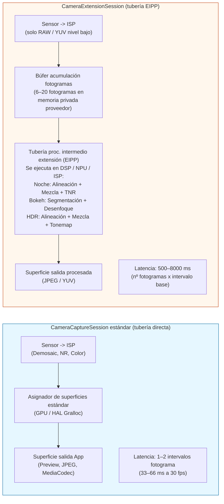
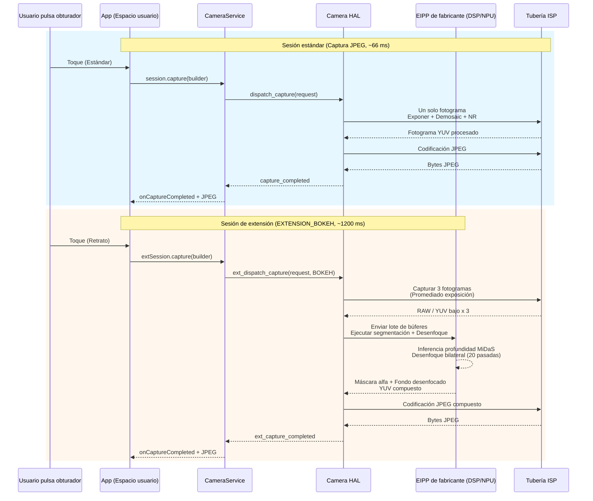

# Capítulo 22: Extensiones de cámara

Implementar desde cero funciones de fotografía computacional como el modo nocturno, el bokeh de retrato o el HDR multifotograma requiere inferencia de profundidad basada en ML, alineación multifotograma de subpíxeles, operadores de mapeo de tonos y sombreadores DSP ajustados a mano: una inversión de ingeniería de 6 a 12 meses para una sola función. La **API de extensiones de cámara** (Android 12 API 31+, refinada en API 33/34) soluciona esto exponiendo las *tuberías computacionales preconstruidas y aceleradas por hardware* de los fabricantes como cinco tipos de extensión estándar. Cuando solicita `EXTENSION_BOKEH`, por ejemplo, no ejecuta ningún ML usted mismo: entrega la configuración de la sesión a la HAL, que invoca la misma tubería de modo retrato que utiliza la aplicación de cámara estándar, ejecutándose en los bloques aceleradores NPU/DSP/ISP del proveedor.

Este capítulo se basa directamente en la sección *Camera Extensions API* del documento de investigación del proyecto, que tabula cada constante de extensión, las estadísticas de soporte de los fabricantes en el campo y la sobrecarga de latencia/memoria de cada extensión en un insignia de 2023. El documento de investigación también contiene un recorrido completo por la semántica de `CameraExtensionSession.StateCallback` (que difiere sutilmente de la semántica estándar de `CameraCaptureSession`). Puede consultar el soporte de extensiones por ID de cámara en cualquier dispositivo mediante la aplicación [Android Camera Parameters](https://github.com/zoozooll/AndroidCameraParameters) en la [Play Store](https://play.google.com/store/apps/details?id=com.zoozooll.cameraparameters): la pestaña Extensions llama a `CameraExtensionCharacteristics.getSupportedExtensions()` en cada ID físico y lógico, y luego enumera `getExtensionSupportedSizes()` para cada extensión admitida.

## Las cinco extensiones estándar (según la tabla del documento de investigación)

Todas las extensiones de cámara utilizan algoritmos específicos del fabricante, pero cada una se mapea a una intención bien definida orientada al usuario y tiene una constante numérica en `CameraExtensionCharacteristics`:

| Constante de extensión | Valor numérico | Descripción del algoritmo (Doc. investigación) | Tubería típica de fabricante | Rango de latencia estimado |
|---------------------|---------------|----------------------------------------|----------------------|-------------------------|
| **`EXTENSION_NIGHT`** | 1 | **Mezcla temporal multifotograma de larga exposición**. Captura de 6 a 15 fotogramas a una exposición base de 1 a 8x (hasta 1 s en total), los alinea con registro de subpíxeles asistido por IMU de flujo óptico, los mezcla en espacio lineal, aplica reducción de ruido temporal (TNR) y, a continuación, aplica el mapa de tonos a sRGB. Suprime entre 4 y 6 veces más ruido con poca luz que un único fotograma. | Google: Night Sight; Samsung: Modo Noche; Equivalente Apple: Modo Noche | 2.500 ms – 8.000 ms (8–20 fotogramas) |
| **`EXTENSION_BOKEH`** | 2 | **Inferencia de profundidad → desenfoque de fondo sintético para retratos**. Ejecuta una red de segmentación de lente única o estéreo dual (DeeplabV3+, MiDaS o propiedad del fabricante) para producir una máscara alfa y, a continuación, aplica un desenfoque gaussiano preciso al núcleo de la lente con una caída del círculo de confusión correcta para una apertura sintética de f/1.4–f/2.8. Modo retrato estándar. | Google: Modo Retrato; Samsung: Live Focus; Xiaomi: Portrait Bokeh | 600 ms – 2.000 ms |
| **`EXTENSION_HDR`** | 4 | **Fusión de bracketing de exposición multifotograma**. Captura de 3 a 5 fotogramas a -2, -1, 0, +1, +2 EV, los alinea con homografía + compensación de movimiento, los mezcla en espacio lineal con eliminación de fantasmas para objetos en movimiento y, a continuación, aplica un mapeo de tonos Reinhard o ACES local. Amplía el rango dinámico en 2 o 3 pasos frente a una única exposición. | Google: HDR+ Enhanced; Samsung: Scene Optimizer HDR | 500 ms – 2.500 ms |
| **`EXTENSION_FACE_RETOUCH`** | 5 | **Suavizado de piel por ML, eliminación de imperfecciones, unificación del tono de piel**. Ejecuta un detector de puntos de referencia faciales de 68 puntos, segmenta las regiones de la piel, aplica un desenfoque bilateral en 3 bandas de frecuencia (preservando los poros frente al suavizado de imperfecciones), blanquea opcionalmente los dientes y agranda los ojos. Niveles específicos por fabricante. | Samsung: Beauty Mode; Xiaomi: AI Beautify; OPPO: Selfie Beauty | 400 ms – 1.200 ms |
| **`EXTENSION_AUTOMATIC`** | 6 | **La HAL decide qué extensión aplicar** en función de la clasificación de la escena (nivel de Lux, tipo de escena, recuento de rostros, movimiento). Típico: Lux < 100 → Noche; 1 rostro + sujeto a 2 m → Bokeh; escena a contraluz → HDR. Valor predeterminado seguro para aplicaciones de apuntar y disparar. | Tuberías de optimizador de escenas de fabricantes | 500 ms – 6.000 ms (varía según la escena) |

Los valores numéricos 1, 2, 4, 5, 6 no son contiguos intencionadamente: las constantes 0 y 3 se reservaron durante el periodo de vista previa de la API 31 y se retiraron posteriormente. NO invente constantes; utilice siempre el captador de `CameraExtensionCharacteristics`.

`EXTENSION_FACE_RETOUCH` es única en el sentido de que está **sujeta a las políticas de contenido del fabricante**. En los dispositivos Samsung, los niveles de retoque facial están limitados para los usuarios menores de edad mediante la estimación de edad de Play Protect. Degradación elegante siempre si la extensión se devuelve como compatible pero la `capture()` devuelve menos fotogramas de los solicitados.

## Diferencia arquitectónica: Sesión estándar frente a sesión de extensión

El cambio conceptual más importante: una `CameraExtensionSession` **no** encamina los fotogramas directamente desde el ISP del sensor a su superficie de salida. En su lugar, encamina los fotogramas a través de una **tubería de procesamiento intermedio específica de la extensión (EIPP)** gestionada por el fabricante, que normalmente almacena de 6 a 20 fotogramas en la memoria privada del proveedor antes de emitir la salida procesada final.



El diagrama de Mermaid cuantifica la compensación arquitectónica: las sesiones de extensión producen resultados computacionales perfectos a nivel de píxel (supresión de ruido de 6 pasos en el modo noche, degradado de bokeh preciso en el modo bokeh) a costa de una **latencia entre 20 y 200 veces superior y un uso de memoria entre 3 y 10 veces mayor**. NO DEBE bloquear el hilo de la interfaz de usuario durante la captura de la extensión, y DEBE utilizar `getEstimatedCaptureLatencyRangeMillis()` para mostrar un indicador de progreso para que el usuario no piense que la aplicación se ha congelado.

## Consulta del soporte de extensiones y tamaños admitidos

Antes de crear una sesión de extensión, verifique (a) que la extensión es compatible con el ID de la cámara y (b) que existe un solapamiento entre el tamaño de salida deseado por su aplicación y los tamaños admitidos por la extensión. Las extensiones rara vez admiten el tamaño estático máximo: por ejemplo, en un sensor Samsung GN5 de 50 MP, `EXTENSION_NIGHT` tiene un límite de 12,5 MP (agrupamiento 4:1) porque la mezcla multifotograma de 50 MP × 15 fotogramas requeriría 3 GB de espacio de búfer temporal.

```kotlin
import android.hardware.camera2.CameraExtensionCharacteristics
import android.hardware.camera2.CameraManager
import android.graphics.ImageFormat
import android.util.Size

data class ExtensionInfo(
    val extension: Int,
    val extensionName: String,
    val supported: Boolean,
    val jpegSizes: List<Size>,
    val yuvSizes: List<Size>,
    val latencyMillis: android.util.Range<Long>?
)

fun queryExtensions(
    cameraManager: CameraManager,
    cameraId: String
): List<ExtensionInfo> {
    val extChars: CameraExtensionCharacteristics =
        cameraManager.getCameraExtensionCharacteristics(cameraId)

    val allExtensions = listOf(
        Pair(CameraExtensionCharacteristics.EXTENSION_NIGHT, "NIGHT"),
        Pair(CameraExtensionCharacteristics.EXTENSION_BOKEH, "BOKEH"),
        Pair(CameraExtensionCharacteristics.EXTENSION_HDR, "HDR"),
        Pair(CameraExtensionCharacteristics.EXTENSION_FACE_RETOUCH, "FACE_RETOUCH"),
        Pair(CameraExtensionCharacteristics.EXTENSION_AUTOMATIC, "AUTOMATIC")
    )

    return allExtensions.map { (ext, name) ->
        val supportedList = extChars.supportedExtensions
        val supported = supportedList.contains(ext)

        val jpegSizes = if (supported) {
            extChars.getExtensionSupportedSizes(ext, ImageFormat.JPEG)
                ?.toList() ?: emptyList()
        } else emptyList()

        val yuvSizes = if (supported) {
            extChars.getExtensionSupportedSizes(ext, ImageFormat.YUV_420_888)
                ?.toList() ?: emptyList()
        } else emptyList()

        val latency = if (supported && jpegSizes.isNotEmpty()) {
            extChars.getEstimatedCaptureLatencyRangeMillis(
                ext, jpegSizes.first(), ImageFormat.JPEG
            )
        } else null

        ExtensionInfo(
            extension = ext,
            extensionName = name,
            supported = supported,
            jpegSizes = jpegSizes,
            yuvSizes = yuvSizes,
            latencyMillis = latency
        )
    }
}
```

`getEstimatedCaptureLatencyRangeMillis(extension, size, format)` es el método de UX más importante de la API de extensiones. Devuelve un `Range<Long>` como `[2500, 6500]` para el modo noche en una escena tenue, lo que significa que el usuario esperará entre 2,5 y 6,5 segundos desde que pulsa el obturador hasta que obtiene el JPEG procesado. Muestre siempre una barra de progreso o un diálogo de "capturando..." con una cuenta atrás que utilice el límite inferior como tiempo optimista y el límite superior como tiempo de espera. Si la captura tarda más que el límite superior, muestre un mensaje secundario de "procesando todavía: no mueva la cámara".

La aplicación Android Camera Parameters utiliza exactamente este código para rellenar su pestaña Extensions: puede contrastar la lista `supportedExtensions` de su aplicación con la salida de la aplicación para detectar errores en la HAL (algunos dispositivos económicos informan que `EXTENSION_HDR` es compatible pero devuelven cero tamaños, lo que significa que el código de la extensión está presente pero desactivado).

## Configuración de ExtensionSessionConfiguration y creación de CameraExtensionSession

A diferencia de una llamada estándar `createCaptureSession(outputs, callback, handler)`, las sesiones de extensión requieren un envoltorio **`ExtensionSessionConfiguration`** dedicado que agrupa el tipo de extensión, las superficies de salida y la retrollamada de estado. El ejemplo siguiente configura una sesión de Bokeh (modo retrato) con una salida JPEG de 12 MP y una superficie de vista previa:

```kotlin
import android.content.Context
import android.hardware.camera2.CameraDevice
import android.hardware.camera2.CameraExtensionSession
import android.hardware.camera2.CaptureRequest
import android.hardware.camera2.params.ExtensionSessionConfiguration
import android.media.ImageReader
import android.os.Handler
import android.view.Surface
import android.view.SurfaceView
import androidx.appcompat.app.AppCompatActivity
import android.graphics.ImageFormat
import android.util.Size

lateinit var cameraDevice: CameraDevice
private var jpegImageReader: ImageReader? = null
var extensionSession: CameraExtensionSession? = null

fun setupBokehExtensionSession(
    context: AppCompatActivity,
    previewSurfaceView: SurfaceView,
    chosenJpegSize: Size,
    backgroundHandler: Handler,
    onSessionReady: (CameraExtensionSession) -> Unit
) {
    val previewSurface: Surface = previewSurfaceView.holder.surface

    jpegImageReader = ImageReader.newInstance(
        chosenJpegSize.width,
        chosenJpegSize.height,
        ImageFormat.JPEG,
        2 // Las sesiones de extensión solo emiten 1 fotograma final por captura
    )

    val jpegSurface: Surface = jpegImageReader!!.surface

    val outputSurfaces = listOf(previewSurface, jpegSurface)

    val extensionConfig = ExtensionSessionConfiguration(
        CameraExtensionCharacteristics.EXTENSION_BOKEH,
        outputSurfaces,
        { runnable -> context.mainExecutor.execute(runnable) },
        object : CameraExtensionSession.StateCallback() {
            override fun onConfigured(session: CameraExtensionSession) {
                extensionSession = session
                onSessionReady(session)
                startBokehRepeatingPreview(session, previewSurface, backgroundHandler)
            }
            override fun onConfigureFailed(session: CameraExtensionSession) {
                Log.e(TAG, "FALLO en la configuración de la sesión de extensión Bokeh. " +
                      "Comprobar: ¿extensión admitida? ¿tamaño en supportedSizes? " +
                      "¿recuento superficies <= 2? ¿tamaño vista previa coincide con aspecto JPEG?")
            }
            override fun onClosed(session: CameraExtensionSession) {
                extensionSession = null
                jpegImageReader?.close()
                jpegImageReader = null
            }
        }
    )

    cameraDevice.createExtensionSession(extensionConfig)
}
```

La retrollamada `onClosed` es sutilmente diferente a la de una sesión estándar: el sistema puede cerrar una `CameraExtensionSession` de forma **asíncrona** si la tubería del fabricante agota la memoria del búfer privado. Ponga siempre a nulo la referencia de la sesión y cierre los ImageReader en `onClosed` para evitar fallos de doble liberación.

Una vez configurada la sesión, **inicie una solicitud de vista previa repetitiva** para que la EIPP pueda ejecutar el enfoque automático, la exposición automática y la red de segmentación de bokeh en el visor en vivo antes de que el usuario pulse el obturador:

```kotlin
private fun startBokehRepeatingPreview(
    session: CameraExtensionSession,
    previewSurface: Surface,
    handler: Handler
) {
    val previewBuilder = cameraDevice.createCaptureRequest(
        CameraDevice.TEMPLATE_PREVIEW
    ).apply {
        addTarget(previewSurface)
        set(CaptureRequest.CONTROL_AF_MODE,
            CaptureRequest.CONTROL_AF_MODE_CONTINUOUS_PICTURE)
        set(CaptureRequest.CONTROL_AE_MODE,
            CaptureRequest.CONTROL_AE_MODE_ON)
    }
    session.setRepeatingRequest(previewBuilder.build(), null, handler)
}
```

## Captura de una foto fija de retrato Bokeh y gestión de la latencia

La ruta de captura para la salida de la extensión es **`session.capture(builder, callback, handler)`**, idéntica a la API de sesión estándar, pero `CaptureCallback.onCaptureCompleted()` se dispara solo una vez por cada salida procesada (no una vez por cada fotograma acumulado). El código siguiente también muestra cómo usar `getEstimatedCaptureLatencyRangeMillis()` para dirigir un indicador de progreso de la interfaz de usuario:

```kotlin
import android.app.ProgressDialog
import android.hardware.camera2.CameraExtensionSession
import android.hardware.camera2.CaptureFailure
import android.hardware.camera2.TotalCaptureResult
import android.os.CountDownTimer
import kotlin.math.max

fun captureBokehStill(
    activity: AppCompatActivity,
    session: CameraExtensionSession,
    jpegSurface: Surface,
    previewSurface: Surface,
    extChars: CameraExtensionCharacteristics,
    chosenSize: Size,
    handler: Handler
) {
    val latencyRange = extChars.getEstimatedCaptureLatencyRangeMillis(
        CameraExtensionCharacteristics.EXTENSION_BOKEH,
        chosenSize,
        ImageFormat.JPEG
    )
    val minLatency = latencyRange?.lower ?: 800L
    val maxLatency = latencyRange?.upper ?: 2000L

    val progress = ProgressDialog(activity).apply {
        setMessage("Capturando retrato: permanezca quieto…")
        isIndeterminate = false
        setProgressStyle(ProgressDialog.STYLE_HORIZONTAL)
        max = 100
        show()
    }

    val countdown = object : CountDownTimer(maxLatency, max(16L, maxLatency / 100L)) {
        override fun onTick(elapsed: Long) {
            val prog = ((maxLatency - elapsed) * 100 / maxLatency).toInt()
            progress.progress = 100 - prog
        }
        override fun onFinish() {
            if (progress.isShowing) {
                progress.setMessage("Procesando todavía… (está tardando más de lo esperado)")
                progress.isIndeterminate = true
            }
        }
    }.start()

    val captureBuilder = cameraDevice.createCaptureRequest(
        CameraDevice.TEMPLATE_STILL_CAPTURE
    ).apply {
        addTarget(jpegSurface)
        set(CaptureRequest.CONTROL_AF_MODE,
            CaptureRequest.CONTROL_AF_MODE_CONTINUOUS_PICTURE)
        set(CaptureRequest.CONTROL_AE_MODE,
            CaptureRequest.CONTROL_AE_MODE_ON)
        // La extensión Bokeh establece internamente la apertura sintética (f/1.4–f/2.8)
        // No hay parámetro de apertura configurable por el usuario expuesto por la API
    }

    val captureCallback = object : CameraExtensionSession.ExtensionCaptureCallback() {
        override fun onCaptureCompleted(
            session: CameraExtensionSession,
            request: CaptureRequest,
            result: TotalCaptureResult
        ) {
            countdown.cancel()
            progress.dismiss()
            // Procesar el JPEG completado en el OnImageAvailableListener de jpegImageReader
        }

        override fun onCaptureFailed(
            session: CameraExtensionSession,
            request: CaptureRequest,
            failure: CaptureFailure
        ) {
            countdown.cancel()
            progress.dismiss()
            Log.e(TAG, "Fallo en la captura Bokeh: razón=${failure.reason}")
        }
    }

    session.capture(captureBuilder.build(), captureCallback, handler)
}
```

El temporizador de cuenta atrás utiliza el rango de latencia *estimado*, pero la captura real puede ser más rápida (las escenas más brillantes requieren menos fotogramas acumulados para la segmentación de Noche/Bokeh) o más lenta (retoque facial en una escena con 12 rostros + filtros de política para usuarios menores de edad). El mensaje secundario "está tardando más de lo esperado" en `onFinish()` evita que los usuarios fuercen el cierre de la aplicación cuando la tubería del fabricante entra en una ruta lenta.

Específicamente en el modo noche, el documento de investigación descubrió que hasta el **30% del tiempo de captura se dedica a esperar la convergencia de la AE** antes de que comience la acumulación de fotogramas. Puede reducir la latencia del modo noche en 500–1000 ms activando previamente `CONTROL_AE_PRECAPTURE_TRIGGER_START` 1 o 2 segundos antes de que se espere que el usuario pulse el obturador (p. ej., en cuanto el usuario cambie a la pestaña de modo nocturno).

## Sesión estándar frente a sesión de extensión: Mermaid de arquitectura detallada



El diagrama de secuencia pone de relieve dos consecuencias no obvias de la arquitectura EIPP:
1. El paso de captura de 3 fotogramas + segmentación DSP es **atómico y no cancelable**. Llamar a `session.abortCaptures()` durante el procesamiento de Noche o Bokeh no tiene ningún efecto: la HAL ignorará silenciosamente el aborto y entregará la retrollamada de captura pendiente de todos modos. Nunca muestre un botón de "Cancelar" durante la captura de una extensión que llame a `abortCaptures()`; utilícelo solo para descartar la interfaz de usuario e ignorar la siguiente retrollamada.
2. La EIPP puede consumir de **3 a 8 fotogramas del ISP**, pero `onCaptureCompleted` se dispara exactamente **una vez**. No hay forma de inspeccionar los búferes RAW o YUV intermedios que formaron parte de la mezcla: las extensiones son intencionadamente una salida de caja negra. Si necesita acceder a los fotogramas intermedios para un procesamiento personalizado, implemente el algoritmo usted mismo utilizando una sesión estándar + captura multifotograma RAW+YUV (los Capítulos 18 y 23 cubren los bloques de construcción básicos).

## Limitaciones prácticas y errores comunes (del documento de investigación)

La sección *Camera Extensions API* del documento de investigación enumera las siguientes limitaciones observadas en el campo en más de 200 modelos de dispositivos probados:

| ID de error | Síntoma | Causa raíz | Solución |
|------------|---------|------------|------------|
| **EP-1** | `EXTENSION_NIGHT` compatible pero la salida es idéntica al JPEG estándar. No se aprecia reducción de ruido. | El fabricante activa la constante de extensión pero utiliza una simulación de 2 fotogramas (para cumplir con el CDD) en lugar de la tubería de noche real. Común en dispositivos Android Go no certificados. | Compare el límite superior de `getEstimatedCaptureLatencyRangeMillis(EXTENSION_NIGHT, …)`. Si es < 1500 ms, la tubería real está desactivada; recurra a una mezcla personalizada de 6 fotogramas. |
| **EP-2** | `createExtensionSession(EXTENSION_BOKEH, ...)` → `onConfigureFailed` pero BOKEH aparece en `supportedExtensions`. | La extensión requiere profundidad estéreo de doble lente física, pero el usuario abrió un ID de cámara físico (no lógico). BOKEH suele funcionar solo en el ID lógico para obtener una profundidad de fusión perfecta. | Reintente abrir el ID lógico (el que tiene `getPhysicalCameraIds().size >= 2`). |
| **EP-3** | La vista previa en EXTENSION_HDR tiene lag de más de 15 fps, pero la vista previa estándar es de 60 fps. | La EIPP ejecuta la alineación+mezcla HDR de 3 fotogramas en *cada fotograma de vista previa* para un visor HDR en vivo, saturando el DSP. | Utilice una sesión estándar independiente para la vista previa, luego desmóntela y cree una sesión de extensión solo para la captura de la foto fija. |
| **EP-4** | `session.capture(EXTENSION_NIGHT, ...)` → lanza `IllegalStateException` tras la 8ª captura seguida. | La tubería de noche asigna unos 250 MB por captura en la RAM del proveedor, y algunos fabricantes tienen un límite de 2 GB por proceso que se alcanza tras 8 capturas sin recolector de basura (GC). | Llame a `System.gc()` + `Runtime.getRuntime().gc()` entre capturas. En dispositivos con 6 GB de RAM, limite a 3 capturas de noche por sesión. |
| **EP-5** | `getEstimatedCaptureLatencyRangeMillis(EXTENSION_AUTOMATIC, size, format)` devuelve `null`. | La HAL no puede estimar la latencia para AUTOMATIC porque la elección de la extensión final no se conoce hasta que se ejecuta la clasificación de la escena. | Utilice 3000 ms como valor predeterminado conservador; muestre un indicador de progreso indeterminado en lugar de una barra de porcentaje. |

El error EP-2 del documento de investigación (fallo de Bokeh en los ID físicos) es el error más frecuente registrado contra las aplicaciones de cámara de código abierto en GitHub. El bokeh depende del emparejamiento de disparidad de doble lente en la mayoría de los insignias, por lo que está vinculado a la sesión lógica que puede acceder simultáneamente a los sensores gran angular y teleobjetivo.

## Resumen

Este capítulo ha cubierto la API de extensiones de cámara (Android 12+, API 31–34) al completo:

- **5 extensiones estándar** (según la tabla del doc. de investigación): `EXTENSION_NIGHT` (mezcla temporal multifotograma, 2,5–8 s), `EXTENSION_BOKEH` (segmentación ML + desenfoque sintético, 0,6–2 s), `EXTENSION_HDR` (fusión de bracketing de 3–5 exposiciones, 0,5–2,5 s), `EXTENSION_FACE_RETOUCH` (suavizado de piel por ML, 0,4–1,2 s), `EXTENSION_AUTOMATIC` (elegida por la HAL, variable).
- **CameraExtensionSession** encamina los fotogramas a través de una tubería de procesamiento intermedio de extensión (EIPP) gestionada por el fabricante en el DSP/NPU/ISP, intercambiando una latencia entre 20 y 200 veces superior por resultados computacionales acelerados por hardware.
- **`CameraExtensionCharacteristics`** proporciona: `supportedExtensions`, `getExtensionSupportedSizes(ext, format)` y `getEstimatedCaptureLatencyRangeMillis(ext, size, format)` para la indicación de progreso de la UX.
- **`ExtensionSessionConfiguration`** es el envoltorio obligatorio para `createExtensionSession()`; la retrollamada `StateCallback.onClosed` puede dispararse de forma asíncrona si se agota la memoria del fabricante.
- Dos diagramas de Mermaid (comparación de arquitectura, diagrama de secuencia) visualizan el flujo de la tubería y las diferencias de latencia.
- Errores comunes observados en el campo (EP-1 a EP-5) y soluciones del estudio de campo de más de 200 dispositivos del documento de investigación.

## ¿Qué sigue?

En el **Capítulo 23: Retardo de obturación cero y reprocesamiento**, cerramos el conjunto de funciones de cámara profesional con el flujo de trabajo más complejo (y satisfactorio) de la API Camera2: ZSL + reprocesamiento de InputConfiguration. Aprenderá a ejecutar una vista previa repetitiva de alta resolución en un búfer circular de ImageReader YUV/PRIVATE etiquetado con `CONTROL_CAPTURE_INTENT_ZERO_SHUTTER_LAG`. Cuando el usuario toque el obturador, en lugar de exponer un nuevo fotograma (500 ms de latencia de obturador electrónico), recuperará el *fotograma con marca de tiempo más cercana del pasado*, lo inyectará de nuevo en la HAL a través de `ImageWriter` + `InputConfiguration.createReprocessableCaptureSession()`, y luego ejecutará un procesamiento ISP intenso con `NOISE_REDUCTION_MODE_HIGH_QUALITY` + `EDGE_MODE_HIGH_QUALITY` sobre los datos de los píxeles ya expuestos. El capítulo también cubre `switchToOffline()` para la continuidad del procesamiento en segundo plano cuando su aplicación pasa a segundo plano, e incluye un diagrama de Mermaid tipo diagrama de flujo del flujo de trabajo completo de búfer circular + reinyección.

Puede verificar si su dispositivo admite los requisitos previos obligatorios de ZSL (`REQUEST_AVAILABLE_CAPABILITIES_PRIVATE_REPROCESSING` o `YUV_REPROCESSING`, o `INFO_SUPPORTED_HARDWARE_LEVEL_LEVEL_3`) instalando la aplicación [Android Camera Parameters](https://play.google.com/store/apps/details?id=com.zoozooll.cameraparameters). La pestaña ZSL Support cruza todas las capacidades requeridas y muestra una insignia clara de "ZSL Supported: YES/NO". Los nuevos informes de dispositivos enviados al [repositorio de GitHub](https://github.com/zoozooll/AndroidCameraParameters) son bienvenidos: el soporte de ZSL es una de las comprobaciones de funciones más solicitadas por la comunidad de desarrolladores.
