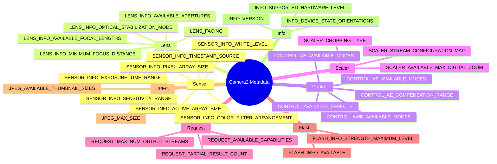

import Tabs from '@theme/Tabs';
import TabItem from '@theme/TabItem';

# Enciclopedia de metadatos de cámara

## Aplicación complementaria

Inspecciona cada clave de esta enciclopedia en vivo en tu propio dispositivo: instala la aplicación Android Camera Parameters:

- **GitHub (código abierto):** [github.com/zoozooll/AndroidCameraParameters](https://github.com/zoozooll/AndroidCameraParameters)
- **Google Play:** [play.google.com/store/apps/details?id=com.minininja.cameraparams](https://play.google.com/store/apps/details?id=com.minininja.cameraparams)

La aplicación es una implementación viva de cada concepto de esta página. Cada entrada de metadatos a continuación te dice exactamente qué pestaña y pantalla muestra ese valor, para que puedas contrastar con un dispositivo real en tu mano.

---

## Taxonomía de metadatos



---

## Introducción

Bienvenido a la Enciclopedia de metadatos de cámara, la referencia definitiva para comprender las más de 300 claves de metadatos que describen cada capacidad de un dispositivo de cámara Android. Si los capítulos anteriores de esta serie te enseñaron *cómo* operar Camera2 —abrir sesiones, construir solicitudes, transmitir surfaces—, esta enciclopedia te enseña *de qué es capaz* realmente tu cámara. Cada función que habilitas en un `CaptureRequest.Builder` debe validarse primero contra `CameraCharacteristics`. Omite esta validación y tu aplicación fallará en un cierto porcentaje de dispositivos, o peor, producirá silenciosamente salida corrupta.

Esta enciclopedia existe porque los metadatos de Camera2 son notoriamente pobres en la documentación oficial del SDK de Android. La documentación te indica el tipo de cada clave (un `Range&lt;Int&gt;`, un `FloatArray`, etc.) pero rara vez te indica la *semántica*: qué significa un "diopter" en la práctica, por qué un tamaño de array activo difiere del tamaño de array de píxeles, o qué secuencia de claves debes comprobar juntas antes de exponer un botón de ISO manual. Las entradas aquí cubren esa brecha con código de grado de producción, trampas comunes de OEM y comportamiento real de dispositivos extraído de miles de perfiles de dispositivo en la base de datos de Android Camera Parameters.

Considera esta página como una tabla de consulta para la arquitectura de tu aplicación de cámara. Cuando diseñes una pantalla de ajustes, ve a la sección Control. Cuando construyas una UI de zoom, ve a Scaler. Cuando escribas un pipeline de procesamiento RAW, ve a Sensor. Cada entrada sigue la misma estructura de seis puntos para que puedas saltar directamente al código que necesitas sin reaprender la disposición. La aplicación complementaria en tu teléfono valida entonces que las mismas consultas funcionan contra silicio real de Samsung, Sony, HiSilicon, MediaTek y Google Tensor.

Ningún dispositivo soporta todas las claves de esta enciclopedia. Ese es precisamente el punto. El patrón correcto para el desarrollo en Camera2 es: consultar la clave → comprobar nulo → condicionar la UI a la función → documentar la ruta de respaldo. Esta página te da la consulta, la comprobación y la trampa que encontrarás si la omites.

---

## Cómo están organizados los metadatos de Camera2

Los metadatos de Camera2 viven en tres jerarquías de clases paralelas, todas con raíz en `android.hardware.camera2.CameraMetadata`. La descripción estática de lo que una cámara *puede* hacer vive en `CameraCharacteristics` —consultas esto exactamente una vez por ID de cámara después de descubrirlo vía `CameraManager.getCameraIdList()`. La descripción por solicitud de lo que *quieres* que haga la cámara vive en `CaptureRequest` —pueblas las claves vía `CaptureRequest.Builder.set()`. La descripción por fotograma de lo que la cámara *realmente hizo* vive en `CaptureResult` (o su variante total `TotalCaptureResult`) —lees las claves desde el callback en `CameraCaptureSession.CaptureCallback.onCaptureCompleted()`.

Cada clave en las tres jerarquías extiende `CaptureResult.Key<T>` (o sus hermanas `CameraCharacteristics.Key<T>` y `CaptureRequest.Key<T>`) y es un descriptor de campo fuertemente tipado. Hay más de 300 claves públicas entre las tres clases, además de claves OEM privadas adicionales accesibles vía `CameraCharacteristics.get(CameraCharacteristics.REQUEST_AVAILABLE_SESSION_KEYS)` en ciertas extensiones de proveedor. Las categorías de esta enciclopedia siguen los agrupamientos conceptuales usados por la especificación de la interfaz HAL3: Sensor describe el sensor de imagen, Lens describe la óptica, Control describe los algoritmos 3A (auto-exposición, auto-enfoque, auto-balance de blancos), Scaler describe el pipeline de recorte y redimensionamiento, Request describe indicadores de capacidad transversales, Flash describe el LED de torch/flash, JPEG describe el codificador de imágenes fijas e Info describe el paquete de cámara y la versión del HAL.

---

## Convenciones usadas en esta enciclopedia

Cada entrada de metadatos a continuación sigue exactamente seis secciones:

1. **¿Qué es?** Una definición de 1–2 párrafos de la clave, su tipo y su semántica.
2. **¿Por qué existe?** La justificación de diseño que llevó a los ingenieros de Android a exponer esta clave en lugar de derivar el valor implícitamente.
3. **¿Qué dispositivos la soportan?** El nivel mínimo de hardware, los indicadores de capacidad y la versión de Android donde esta clave cobra sentido.
4. **¿Cómo la consulto?** Un fragmento de código Kotlin completo con seguridad nula, mostrando la llamada exacta a `characteristics.get()` más el manejo de errores.
5. **¿Cómo puedo inspeccionarla con Android Camera Parameters?** La jerarquía exacta de pestañas en la aplicación complementaria donde puedes ver este valor renderizado en un dispositivo.
6. **Trampas comunes.** Uno o más problemas del mundo real que encuentran los desarrolladores, normalmente involucrando fragmentación de OEM, acoplamiento de estado oculto entre claves o malentendidos de unidades.

Los fragmentos de código usan Kotlin idiomático con operadores de seguridad nula (`?.`) y el operador Elvis (`?:`) más bloques `run` para respaldo. Todos los fragmentos asumen que ya tienes una instancia de `CameraCharacteristics` llamada `characteristics` obtenida vía `cameraManager.getCameraCharacteristics(cameraId)`. Los fragmentos que producen salida visible para el usuario usan formato de cadena con unidades (diopters, nanosegundos, pasos EV) para que puedas colocarlos directamente en una `PreferenceScreen` o en una superposición de depuración `TextView`.

Las referencias a la aplicación complementaria siempre usan el mismo patrón: *Nombre de pestaña / Nombre de subpestaña*. Por ejemplo, "Overview / Hardware Level" significa: abre la aplicación, toca la pestaña Overview en la navegación inferior, luego busca la tarjeta Hardware Level. Si una clave aparece en múltiples pantallas listamos primero la ubicación primaria canónica.

---

## Categoría Sensor

### SENSOR_INFO_ACTIVE_ARRAY_SIZE

**1. ¿Qué es?**

`SENSOR_INFO_ACTIVE_ARRAY_SIZE` es un `android.graphics.Rect` que describe las coordenadas de píxeles del área de imagen activa dentro del dado completo del sensor. En la práctica este es el rectángulo más grande de píxeles que puede realmente leerse y entregarse a un flujo de salida. El rectángulo está siempre alineado con los ejes y se expresa en el espacio de coordenadas de píxeles donde `(0,0)` es la esquina superior izquierda del array de píxeles completo. Valores típicos se ven como `Rect(0, 0, 8000, 6000)` para un sensor 8K×6K, o `Rect(120, 160, 3880, 2880)` cuando el fabricante del sensor deja un pequeño borde inactivo (píxeles ópticamente negros) alrededor del borde.

Cada flujo de salida que configures —ya sea JPEG, YUV_420_888, RAW o un SurfaceTexture de vista previa— se recorta finalmente de esta área activa. Cuando solicitas un JPEG 4:3 a 12MP, el ISP de la cámara recorta el array activo a relación de aspecto 4:3 y lo redimensiona. Cuando aplicas zoom digital vía `SCALER_CROP_REGION`, esa región de recorte se recorta a su vez relativa al array activo, no al array de píxeles.

**2. ¿Por qué existe?**

Los dados de sensor siempre contienen más fotodiodos físicos de los que se entregan al pipeline del ISP. Las filas y columnas más externas son píxeles "dummy" u "ópticamente negros" usados para calibración de corriente oscura y corrección de sombreado de lente —no datos reales de imagen. Sin `SENSOR_INFO_ACTIVE_ARRAY_SIZE` los desarrolladores no tendrían forma de saber qué sistema de coordenadas usar para `SCALER_CROP_REGION` o para el seguimiento de recorte basado en caras. Camera1 solía ocultar esta distinción por completo, lo que hacía que las matemáticas de zoom digital fueran inconsistentes entre OEM. Camera2 lo expone explícitamente para que las regiones de recorte puedan calcularse con precisión a nivel de píxel.

**3. ¿Qué dispositivos la soportan?**

Todos los dispositivos Camera2 soportan esta clave en todos los niveles de hardware: LEGACY, LIMITED, FULL y LEVEL_3. Está listada en `CameraCharacteristics.getAvailableCaptureResultKeys()` para cada ID de cámara, incluyendo cámaras USB externas. El rectángulo siempre es no vacío y su ancho/alto nunca excede `SENSOR_INFO_PIXEL_ARRAY_SIZE`.

**4. ¿Cómo la consulto?**

```kotlin
val activeArray: Rect? = characteristics.get(
    CameraCharacteristics.SENSOR_INFO_ACTIVE_ARRAY_SIZE
)

activeArray?.let { rect ->
    val widthPx = rect.width()
    val heightPx = rect.height()
    val megapixels = (widthPx * heightPx) / 1_000_000.0
    Log.d(TAG, "Active array: ${widthPx}×${heightPx}px (%.1f MP)".format(megapixels))
    Log.d(TAG, "  Left=${rect.left}, Top=${rect.top}, Right=${rect.right}, Bottom=${rect.bottom}")
} ?: run {
    Log.w(TAG, "Active array size not available on this device")
}
```

**5. ¿Cómo puedo inspeccionarla con Android Camera Parameters?**

Navega a **Sensor / Sensor Info**. El array activo se renderiza como la segunda línea de la tarjeta "Sensor Geometry", debajo del tamaño del array de píxeles. La aplicación complementaria también dibuja el rectángulo del array activo visualmente superpuesto sobre una representación a escala del array de píxeles, para que puedas ver de un vistazo cuánto del dado físico es realmente utilizable.

**6. Trampas comunes**

El mayor error es consultar `SENSOR_INFO_PIXEL_ARRAY_SIZE` y luego esperar salida JPEG a esa resolución. Las imágenes fijas a tamaño completo siempre usan las dimensiones del array activo, nunca el array de píxeles. En un sensor Samsung ISOCELL típico de 50MP el array de píxeles podría ser 8192×6144 pero el array activo es 8000×6000. Si asignas un buffer de 50.3MP (del array de píxeles) obtienes una imagen de 48MP y los píxeles restantes se descartan silenciosamente, o peor, obtienes un buffer corrupto en dispositivos HAL antiguos. Usa siempre `activeArray.width() * activeArray.height()` para el dimensionamiento del buffer, nunca el producto del array de píxeles. La segunda trampa común es usar coordenadas del array activo sin incluir el desplazamiento: cuando el top/left del rectángulo son no cero, tus cálculos de región de recorte deben añadir ese origen o el zoom deriva hacia la esquina superior izquierda.

---

### SENSOR_INFO_PIXEL_ARRAY_SIZE

**1. ¿Qué es?**

`SENSOR_INFO_PIXEL_ARRAY_SIZE` es un `android.util.Size` que representa el número total de fotodiodos físicos en el dado del sensor, incluyendo cualquier píxel ópticamente negro o borde dummy. Este es el número de "megapíxeles de marketing": un sensor de 108MP anuncia dimensiones de array de píxeles de 12000×9000 independientemente de cuántos se entregan realmente al pipeline del ISP. A nivel de tipo es un simple `Size` con campos `.width` y `.height`.

La relación con el array activo es siempre:
- `pixelArray.width >= activeArray.width`
- `pixelArray.height >= activeArray.height`

La diferencia es típicamente de 100–400 píxeles en cada eje, usada para líneas de negro óptico (OB) y calibración de fábrica de sombreado de lente.

**2. ¿Por qué existe?**

Los pipelines de captura RAW necesitan las dimensiones completas de píxeles para analizar correctamente los buffers RAW10/RAW12/RAW16, porque el formato RAW (cuando `SENSOR_INFO_PRE_CORRECTION_ACTIVE_ARRAY_SIZE` no está disponible) a veces incluye las líneas OB. Los desarrolladores que escriben código personalizado de demosaic o sustracción de dark frame también necesitan saber cuántos píxeles hay que eliminar en cada borde antes del procesamiento. En el lado del consumidor, los equipos de marketing y las aplicaciones de benchmark usan el tamaño del array de píxeles para informar la resolución "verdadera" del sensor sin el recorte del ISP del OEM.

**3. ¿Qué dispositivos la soportan?**

Todos los niveles de hardware exponen esta clave. No hay prerrequisito de indicador de capacidad. Los dispositivos con capacidad RAW (los que anuncian `REQUEST_AVAILABLE_CAPABILITIES_RAW`) están requeridos por el CDD de Camera2 para informar el tamaño del array de píxeles con precisión dentro de una fila/columna de la especificación física del sensor.

**4. ¿Cómo la consulto?**

```kotlin
val pixelArray: Size? = characteristics.get(
    CameraCharacteristics.SENSOR_INFO_PIXEL_ARRAY_SIZE
)

pixelArray?.let { size ->
    val mp = (size.width * size.height) / 1_000_000.0
    Log.d(TAG, "Pixel array: ${size.width}×${size.height}px (%.1f MP marketing)".format(mp))
    
    characteristics.get(CameraCharacteristics.SENSOR_INFO_ACTIVE_ARRAY_SIZE)?.let { active ->
        val usablePct = (active.width() * active.height()).toDouble() /
                        (size.width * size.height).toDouble() * 100.0
        Log.d(TAG, "  %.1f%% of pixels are deliverable via active array".format(usablePct))
    }
} ?: run {
    Log.w(TAG, "Pixel array size not available")
}
```

**5. ¿Cómo puedo inspeccionarla con Android Camera Parameters?**

Abre **Sensor / Sensor Info** y mira la primera entrada en la tarjeta "Sensor Geometry", etiquetada "Pixel Array". La aplicación la renderiza como ancho×alto con el conteo de megapíxeles de marketing entre paréntesis (p. ej. "8192 × 6144 (50.3 MP)"). Si tocas la fila se abre un diálogo con una tabla comparativa del array de píxeles vs. array activo vs. array activo de pre-corrección.

**6. Trampas comunes**

Confundir el array de píxeles con el tamaño JPEG entregable es universal entre desarrolladores primerizos de Camera2. La secuencia es siempre: (1) consulta `SCALER_STREAM_CONFIGURATION_MAP.getOutputSizes(ImageFormat.JPEG)` para obtener las resoluciones *reales* que el codificador puede producir, (2) el tamaño JPEG más grande será igual (o un recorte redimensionado de) `SENSOR_INFO_ACTIVE_ARRAY_SIZE`, nunca el array de píxeles. Si escribes código que calcula un recorte 4:3 a partir de las dimensiones del array de píxeles, el resultado será ligeramente más ancho de lo que el ISP puede entregar realmente, y el dispositivo de cámara lo limitará silenciosamente —introduciendo una deriva sutil de píxeles en el zoom con seguimiento facial. Segundo, en dispositivos con capacidad de reprocesamiento que anuncian `REQUEST_AVAILABLE_CAPABILITIES_PRIVATE_REPROCESSING`, el tamaño de entrada de reprocesamiento usa semánticas de array de píxeles; usar el array activo para reprocesamiento causa errores de alineación de fotogramas.

---

### SENSOR_INFO_SENSITIVITY_RANGE

**1. ¿Qué es?**

`SENSOR_INFO_SENSITIVITY_RANGE` es un `android.util.Range&lt;Int&gt;` que especifica los valores mínimo y máximo de ISO (ganancia analógica) que el sensor puede aplicar *durante la lectura raw*. Las unidades son ISO aritmético: 100 es ISO base (imagen más limpia, menor ruido), 6400 o superior es modo de alta sensibilidad (imagen más ruidosa, menor tiempo de obturación para el mismo EV). Rangos típicos en dispositivos modernos son `[100, 6400]` para teléfonos de gama media y `[50, 12800]` o `[32, 25600]` para sensores de gama alta con pozos de píxeles grandes.

La sensibilidad se aplica *antes* de cualquier ganancia digital en el pipeline del ISP. Los valores devueltos aquí corresponden a lo que estableces en `CaptureRequest.SENSOR_SENSITIVITY` cuando el control manual está habilitado.

**2. ¿Por qué existe?**

Cada sensor CMOS tiene un nivel mínimo físico de ganancia (determinado por el amplificador de lectura) y un nivel máximo (determinado por cuánto se puede amplificar la señal analógica antes del recorte o ruido inaceptable). Sin un rango explícito, cada OEM usaría diferentes defaults implícitos. Camera2 expone el rango para que los sliders de UI de exposición manual tengan correctos los endpoints mín/máx, y para que los desarrolladores puedan validar una solicitud de ISO manual *antes* de enviarla a la sesión de captura —evitando el vago `IllegalArgumentException` que la sesión lanza si solicitas valores fuera de rango.

**3. ¿Qué dispositivos la soportan?**

Todos los dispositivos exponen esta clave como un `Range&lt;Int&gt;`. Sin embargo, los valores solo son *controlables* si el dispositivo anuncia `REQUEST_AVAILABLE_CAPABILITIES_MANUAL_SENSOR` en su lista de capacidades. En dispositivos de nivel LIMITED sin ese indicador, el rango seguirá devolviendo valores (típicamente `[100, 800]`) pero establecer `SENSOR_SENSITIVITY` en un CaptureRequest se ignora —el algoritmo AE permanece a cargo. Condiciona siempre la UI de ISO manual al indicador MANUAL_SENSOR, no a que el rango sea no nulo.

**4. ¿Cómo la consulto?**

```kotlin
val sensitivityRange: Range<Int>? = characteristics.get(
    CameraCharacteristics.SENSOR_INFO_SENSITIVITY_RANGE
)

val capabilities: IntArray? = characteristics.get(
    CameraCharacteristics.REQUEST_AVAILABLE_CAPABILITIES
)
val hasManualSensor = capabilities?.contains(
    CameraCharacteristics.REQUEST_AVAILABLE_CAPABILITIES_MANUAL_SENSOR
) ?: false

sensitivityRange?.let { range ->
    Log.d(TAG, "Sensitivity range: ISO ${range.lower} to ISO ${range.upper}")
    Log.d(TAG, "  Manual ISO control available: $hasManualSensor")
    
    if (hasManualSensor) {
        val stopCount = log2(range.upper.toDouble() / range.lower.toDouble())
        Log.d(TAG, "  Dynamic range: %.1f stops".format(stopCount))
    } else {
        Log.w(TAG, "  WARNING: Range reported but MANUAL_SENSOR flag is ABSENT.")
        Log.w(TAG, "  Setting SENSOR_SENSITIVITY will be IGNORED by AE algorithm!")
    }
} ?: run {
    Log.w(TAG, "Sensitivity range not available")
}
```

**5. ¿Cómo puedo inspeccionarla con Android Camera Parameters?**

Navega a **Sensor / Manual Sensor** donde el rango de sensibilidad aparece como "ISO Range" en la primera tarjeta. En dispositivos con capacidad MANUAL_SENSOR el rango se muestra con una vista previa de slider que indica lo que la UI manual expone. En dispositivos no manuales la aplicación marca explícitamente el rango como "Read Only" y muestra un banner de advertencia explicando que los valores son solo informativos.

**6. Trampas comunes**

La primera trampa: ver un rango de sensibilidad válido y habilitar controles de ISO manual sin comprobar `MANUAL_SENSOR`. Esto funciona en el dispositivo de prueba del desarrollador (un Pixel 8, digamos, que tiene nivel de hardware FULL) pero el slider silenciosamente no hace nada en el 60% de los teléfonos de gama media en el campo. El usuario ve la UI, arrastra el slider, no ve diferencia de ruido y deja una reseña de una estrella. Comprueba siempre ambas claves juntas.

La segunda trampa: confusión de unidades. `SENSOR_SENSITIVITY` usa ISO *aritmético*, no logarítmico. Un slider que va de 100 a 6400 *linealmente* hace que el 75% superior de la pista se sienta idéntico (6400 a 3200 es un paso, 3200 a 1600 es otro paso, ..., 200 a 100 es el último paso) mientras que el 25% inferior cubre 6 pasos. Los sliders correctos interpolan valores usando una escala logarítmica para que cada 10% de la pista equivalga aproximadamente a un paso.

---

### SENSOR_INFO_EXPOSURE_TIME_RANGE

**1. ¿Qué es?**

`SENSOR_INFO_EXPOSURE_TIME_RANGE` es un `android.util.Range&lt;Long&gt;` que especifica la duración mínima y máxima de obturación que el sensor puede exponer para un único fotograma, medida en **nanosegundos**. Cada valor en este rango corresponde a un argumento válido para `CaptureRequest.SENSOR_EXPOSURE_TIME` cuando el control manual del sensor está habilitado. Rangos típicos abarcan desde aproximadamente `Range(1_000_000L, 1_000_000_000L)` (1 milisegundo mínimo hasta 1 segundo máximo) en dispositivos de gama media, hasta `Range(100_000L, 10_000_000_000L)` (0.1 ms a 10 segundos) en dispositivos de gama alta FULL-level con soporte dedicado de modo nocturno. Algunas cámaras externas de cine LEVEL_3 llegan a 30 segundos o más.

La conversión entre nanosegundos y unidades de tiempo comunes es:
- 1 microsegundo = 1,000 ns
- 1 milisegundo = 1,000,000 ns
- 1 segundo = 1,000,000,000 ns

**2. ¿Por qué existe?**

El HAL de cámara necesita un contrato explícito de tiempo de obturación con la capa de aplicación por dos razones. Primero, las exposiciones largas interactúan con `SENSOR_FRAME_DURATION` de formas no obvias: si solicitas una exposición de 5 segundos, la duración mínima de fotograma salta a 5 segundos más el blanking del sensor, lo que significa que los callbacks de vista previa dejan de llegar durante 5 segundos y la UI parece congelada. Segundo, las exposiciones más cortas (microsegundos) interactúan con el skew de rolling-shutter del sensor; por debajo del tiempo mínimo de exposición, el timing de lectura del sensor no puede mantenerse y los fotogramas de salida contienen scan lines corruptos.

**3. ¿Qué dispositivos la soportan?**

Al igual que el rango de sensibilidad, esta clave está presente en todos los dispositivos pero solo es *controlable* cuando `MANUAL_SENSOR` está en la lista de capacidades. Los dispositivos LIMITED que carecen de soporte manual de sensor seguirán informando un rango de exposición plausible (normalmente 1 ms a 1/30 s) para que las herramientas de análisis de timing AE puedan razonar sobre el comportamiento del algoritmo AE, pero los ajustes manuales se ignoran. El control manual completo requiere tanto el rango *como* el indicador de capacidad.

**4. ¿Cómo la consulto?**

```kotlin
fun Long.nanosToSeconds(): Double = this / 1_000_000_000.0
fun Long.nanosToMillis(): Double = this / 1_000_000.0
fun Double.secondsToNanos(): Long = (this * 1_000_000_000.0).toLong()

val exposureRange: Range<Long>? = characteristics.get(
    CameraCharacteristics.SENSOR_INFO_EXPOSURE_TIME_RANGE
)

val hasManualSensor = characteristics.get(
    CameraCharacteristics.REQUEST_AVAILABLE_CAPABILITIES
)?.contains(CameraCharacteristics.REQUEST_AVAILABLE_CAPABILITIES_MANUAL_SENSOR) ?: false

exposureRange?.let { range ->
    Log.d(TAG, "Exposure time range:")
    Log.d(TAG, "  Min: ${range.lower} ns = %.4f ms = %.7f s"
        .format(range.lower.nanosToMillis(), range.lower.nanosToSeconds()))
    Log.d(TAG, "  Max: ${range.upper} ns = %.2f ms = %.4f s"
        .format(range.upper.nanosToMillis(), range.upper.nanosToSeconds()))
    Log.d(TAG, "  Manual shutter control available: $hasManualSensor")
    
    val shutterSpeeds = listOf(
        0.001, 0.002, 0.004, 0.008, 0.016, 0.033,
        0.066, 0.125, 0.25, 0.5, 1.0, 2.0, 4.0, 8.0
    )
    val supportedSpeeds = shutterSpeeds.filter { s ->
        val ns = s.secondsToNanos()
        ns >= range.lower && ns <= range.upper
    }
    Log.d(TAG, "  Supported common stops: $supportedSpeeds seconds")
} ?: run {
    Log.w(TAG, "Exposure time range not available")
}
```

**5. ¿Cómo puedo inspeccionarla con Android Camera Parameters?**

Ve a la tarjeta **Sensor / Manual Sensor**, titulada "Exposure Range". La aplicación muestra el valor de tres formas: nanosegundos crudos, milisegundos y segundos para ambos endpoints. Una línea de tiempo horizontal debajo visualiza el rango con pasos comunes de velocidad de obturación (1/1000 s hasta 8 s) marcados como marcas, para que puedas ver de un vistazo si la fotografía nocturna de larga exposición es posible. La capacidad de control manual se indica con una marca de verificación verde (controlable) o una etiqueta roja "read-only".

**6. Trampas comunes**

La trampa de congelación de vista previa: los desarrolladores establecen una exposición de 4 segundos para una captura fija con poca luz pero olvidan que el mismo `CaptureRequest` se aplica a TODAS las surfaces en la sesión, incluyendo el `SurfaceTexture` de vista previa. Resultado: durante 4 segundos, no llegan fotogramas de vista previa, la pantalla se congela y el usuario piensa que la aplicación se colgó. La solución es una solicitud repetitiva de un solo fotograma para la surface de vista previa a 30 fps normales, luego una llamada `setRepeatingBurst` o `capture` separada con la exposición larga aplicada solo a las surfaces JPEG/RAW vía `CaptureRequest.Builder.addTarget()`.

La segunda trampa es el desbordamiento de enteros en las conversiones. La multiplicación y división con `1_000_000_000` empuja contra el límite de enteros de 32 bits. Usa siempre `Long` (64 bits) para cualquier variable que contenga nanosegundos, y escribe funciones de extensión helper explícitas (como `nanosToSeconds()` arriba) para que nunca dividas en el orden equivocado. Una exposición de 1 segundo almacenada como Int se desborda a aproximadamente 2.1 segundos, causando que el HAL reciba un tiempo de exposición negativo, lo que o bien crashea la sesión o se limita silenciosamente al mínimo en ciertos HAL de MediaTek.

---

### SENSOR_INFO_WHITE_LEVEL

**1. ¿Qué es?**

`SENSOR_INFO_WHITE_LEVEL` es un único `Int` que representa el valor máximo de código del conversor analógico-digital (ADC) que un píxel de sensor RAW puede alcanzar antes del recorte. Para un sensor RAW10 (10 bits por píxel por canal) el white level es típicamente 1023 (2¹⁰−1). Para RAW12 es típicamente 4095. Para RAW14 es típicamente 16383. Algunos sensores redondean hacia abajo ligeramente (p. ej. 16300 en lugar de 16383 para RAW14) para dejar margen para highlights HDR o corrección de defectos de píxel; el valor exacto está calibrado por sensor en fábrica.

Este es el valor de saturación por canal. En cualquier fotograma RAW de este sensor, cualquier canal de píxel en (o por encima de) el white level representa highlights quemados sin detalle recuperable.

**2. ¿Por qué existe?**

El formato de píxel RAW usa siempre la misma profundidad de bits por canal. Un buffer RAW10 almacena cada píxel en enteros alineados a 16 bits, y los desarrolladores no familiarizados con el procesamiento RAW dividen naturalmente por 65535 (el valor máximo de 16 bits) al normalizar a coma flotante. Esto produce imágenes tenues, deslavadas y con sustracción de punto negro incorrecta. `SENSOR_INFO_WHITE_LEVEL` te da el divisor correcto: divide los píxeles RAW por `WHITE_LEVEL - BLACK_LEVEL_PATTERN` (no 65535) para obtener el rango de luz lineal 0.0–1.0. Cada sensor RAW tiene también una clave `SENSOR_BLACK_LEVEL_PATTERN` que da el offset de cero-exposición por canal; combinar ambos te da la curva completa de normalización RAW a float.

**3. ¿Qué dispositivos la soportan?**

Esta clave es requerida en cualquier dispositivo que informe `REQUEST_AVAILABLE_CAPABILITIES_RAW` en su lista de capacidades —es decir, cualquier cámara que pueda producir buffers RAW10/RAW12/RAW16 vía `ImageReader`. En dispositivos sin RAW la clave puede seguir presente (devolviendo un valor nominal que coincide con la profundidad de bits nativa del sensor) pero no hay forma de leer píxeles RAW, así que la clave es puramente informativa.

**4. ¿Cómo la consulto?**

```kotlin
val whiteLevel: Int? = characteristics.get(
    CameraCharacteristics.SENSOR_INFO_WHITE_LEVEL
)

val blackLevelPattern: IntArray? = characteristics.get(
    CameraCharacteristics.SENSOR_BLACK_LEVEL_PATTERN
)

whiteLevel?.let { wl ->
    Log.d(TAG, "SENSOR_INFO_WHITE_LEVEL = $wl")
    
    val bits = ceil(log2(wl.toDouble() + 1.0)).toInt()
    Log.d(TAG, "  Effective RAW bit depth: $bits bits per channel")
    Log.d(TAG, "  Largest RAW pixel value (saturation): $wl")
    
    blackLevelPattern?.let { bl ->
        if (bl.size == 4) {
            Log.d(TAG, "  Black level pattern (R, Gr, Gb, B) = [${bl[0]}, ${bl[1]}, ${bl[2]}, ${bl[3]}]")
            val avgBlack = (bl[0] + bl[1] + bl[2] + bl[3]) / 4.0
            val usableDnRange = wl - avgBlack
            val stops = log2(usableDnRange / avgBlack)
            Log.d(TAG, "  Normalization divisor: ${wl - avgBlack.toInt()}")
            Log.d(TAG, "  Estimated RAW dynamic range: %.1f stops".format(stops))
        }
    } ?: run {
        Log.d(TAG, "  No black-level pattern. Assume 0. Normalize by $wl directly.")
    }
} ?: run {
    Log.w(TAG, "White level not available — RAW output may not be supported")
}
```

**5. ¿Cómo puedo inspeccionarla con Android Camera Parameters?**

El white level está en **Sensor / Sensor Info** bajo la tarjeta "RAW Sensor Parameters", junto al black level pattern y al color filter arrangement. Si la capacidad RAW está presente la aplicación complementaria muestra una vista previa en vivo de una barra de gradiente horizontal normalizada correctamente con el white level del propio dispositivo, para que puedas comparar visualmente la normalización correcta (usando la clave) contra el error común de dividir por 65535 —la versión equivocada aparece visiblemente más oscura.

**6. Trampas comunes**

Normalizar por 65535 en lugar de por white level es el primer error universal en el procesamiento RAW. Una foto RAW10 normalizada por 65535 sale a aproximadamente 1/64 de brillo —casi negro puro. Los desarrolladores notan esto y aplican un multiplicador de ganancia 64× para compensar, lo que introduce banding porque están estirando 10 bits de información en 16 bits de precisión, comprimiendo el rango tonal. El código correcto resta primero el black level, luego divide por (white level menos black level). Esto da una imagen de luz lineal correctamente expuesta lista para gamma y tone-mapping.

Una segunda trampa: el white level puede variar *por fotograma* en ciertos sensores HDR, donde la ganancia del ADC cambia entre exposiciones largas y cortas para la lectura staggered-HDR. Comprueba `CaptureResult.SENSOR_DYNAMIC_WHITE_LEVEL` en cada callback `onCaptureCompleted` en dispositivos Android 13+; usa el valor por fotograma cuando esté disponible en lugar de la constante estática de `CameraCharacteristics`. El cacheo pegajoso del white level estático en sensores HDR produce highlights recortados en el fotograma de exposición corta.

---

### SENSOR_INFO_COLOR_FILTER_ARRANGEMENT

**1. ¿Qué es?**

`SENSOR_INFO_COLOR_FILTER_ARRANGEMENT` es un enum `Int` que describe la disposición del array de filtros de color Bayer (CFA) sobre los fotodiodos del sensor. El CFA es el mosaico de color microscópico que da a cada píxel una sensibilidad al color rojo, verde o azul (dos píxeles verdes por bloque 2×2). Los valores posibles son:
- `SENSOR_INFO_COLOR_FILTER_ARRANGEMENT_RGGB` — el más común (fila superior rojo-verde, segunda fila verde-azul)
- `SENSOR_INFO_COLOR_FILTER_ARRANGEMENT_GRBG` — variante verde-rojo / azul-verde
- `SENSOR_INFO_COLOR_FILTER_ARRANGEMENT_BGGR` — variante azul-verde / verde-rojo (común en sensores Sony)
- `SENSOR_INFO_COLOR_FILTER_ARRANGEMENT_GBRG` — variante verde-azul / rojo-verde
- `SENSOR_INFO_COLOR_FILTER_ARRANGEMENT_MONOCHROME` — sin filtro de color, sensor de luminancia pura (cámaras infrarrojas o de visión nocturna dedicadas)

La disposición describe el píxel superior izquierdo (x=0, y=0) del array activo. Cada bloque 2×2 repite este patrón en toda la superficie del sensor.

**2. ¿Por qué existe?**

Los datos del sensor RAW son monocromáticos por naturaleza. Se debe aplicar un algoritmo demosaic para reconstruir una imagen RGB completa interpolando los dos canales de color faltantes para cada píxel. El algoritmo demosaic *debe* saber qué color está en cada posición física. Si ejecutas un demosaic RGGB en un sensor BGGR obtienes una imagen con colores invertidos: los píxeles rojos se vuelven azules, los azules se vuelven rojos, y el ojo humano nota inmediatamente los tonos de piel equivocados. La calidad del demosaic también depende del CFA —algoritmos adaptativos como AMaZE o LMMSE necesitan la disposición exacta para elegir la dirección de interpolación correcta.

**3. ¿Qué dispositivos la soportan?**

Requerido en todos los dispositivos con capacidad RAW. En dispositivos sin salida RAW la clave puede seguir presente (permitiendo a herramientas analíticas describir la construcción del sensor) pero no hay ruta de código que *necesite* el valor. Las cámaras USB externas vía el nivel de hardware EXTERNAL a veces omiten esta clave; debes caer a un default `SENSOR_INFO_COLOR_FILTER_ARRANGEMENT_RGGB`, porque las cámaras UVC USB usan casi universalmente RGGB.

**4. ¿Cómo la consulto?**

```kotlin
val cfa: Int? = characteristics.get(
    CameraCharacteristics.SENSOR_INFO_COLOR_FILTER_ARRANGEMENT
)

cfa?.let { arrangement ->
    val arrangementName = when (arrangement) {
        CameraCharacteristics.SENSOR_INFO_COLOR_FILTER_ARRANGEMENT_RGGB -> "RGGB"
        CameraCharacteristics.SENSOR_INFO_COLOR_FILTER_ARRANGEMENT_GRBG -> "GRBG"
        CameraCharacteristics.SENSOR_INFO_COLOR_FILTER_ARRANGEMENT_BGGR -> "BGGR"
        CameraCharacteristics.SENSOR_INFO_COLOR_FILTER_ARRANGEMENT_GBRG -> "GBRG"
        CameraCharacteristics.SENSOR_INFO_COLOR_FILTER_ARRANGEMENT_MONOCHROME -> "MONOCHROME"
        else -> "UNKNOWN (value=$arrangement)"
    }
    Log.d(TAG, "Color Filter Arrangement = $arrangementName")
    
    val isMono = arrangement == CameraCharacteristics
        .SENSOR_INFO_COLOR_FILTER_ARRANGEMENT_MONOCHROME
    
    Log.d(TAG, "  Is monochrome sensor: $isMono")
    if (isMono) {
        Log.d(TAG, "  Demosaic: NOT REQUIRED. Pixels are already luminance-only.")
        Log.d(TAG, "  Tip: Skip de-Bayer step. Directly treat RAW as grayscale.")
    } else {
        Log.d(TAG, "  Demosaic: REQUIRED. Use CFA '$arrangementName' in RAW decoder.")
        Log.d(TAG, "  Pixel (0,0) channel: " + when (arrangement) {
            CameraCharacteristics.SENSOR_INFO_COLOR_FILTER_ARRANGEMENT_RGGB -> "Red"
            CameraCharacteristics.SENSOR_INFO_COLOR_FILTER_ARRANGEMENT_GRBG -> "Green (Red row)"
            CameraCharacteristics.SENSOR_INFO_COLOR_FILTER_ARRANGEMENT_BGGR -> "Blue"
            CameraCharacteristics.SENSOR_INFO_COLOR_FILTER_ARRANGEMENT_GBRG -> "Green (Blue row)"
            else -> "?"
        })
    }
} ?: run {
    Log.w(TAG, "No CFA info. Defaulting to RGGB for external USB / legacy devices.")
}
```

**5. ¿Cómo puedo inspeccionarla con Android Camera Parameters?**

Abre **Sensor / Sensor Info** y mira la fila "Color Filter Array" en la tarjeta RAW Sensor Parameters. La aplicación renderiza una representación visual de 4×4 píxeles del mosaico usando la disposición real informada por el sensor —cuadrados rojos, verdes y azules dispuestos como el silicio los ve. Los sensores monocromáticos se renderizan como una cuadrícula gris plana con la etiqueta "NO CFA".

**6. Trampas comunes**

El modo de fallo duro es hardcodear demosaic RGGB. Cada sensor Sony Exmor-RS del mercado viene con BGGR, así que si hardcodeas RGGB tu código funciona en el teléfono Samsung ISOCELL con el que probaste y produce una imagen con colores invertidos en cada Xperia, la mayoría de Pixels y todos los iPhones con Android (si tal cosa existiera). La solución es directa: lee la clave y ramifica tu demosaic. Muchas librerías RAW de código abierto (libraw, OpenImageIO) aceptan un enum CFA directamente, así que mapea el valor CFA de Android a la constante de la librería y pásalo.

La segunda trampa: `SENSOR_INFO_COLOR_FILTER_ARRANGEMENT` describe el píxel superior izquierdo del array activo. Si recortas el buffer RAW (digamos, para extraer una región 1000×1000 para procesamiento facial), el patrón CFA *se desplaza* por (crop.left mod 2, crop.top mod 2). Recortar un píxel a la derecha convierte un patrón RGGB a GRBG en la subimagen recortada. Recortar tanto uno a la derecha como uno hacia abajo convierte RGGB a BGGR. La mayoría de desarrolladores olvidan esto y hacen demosaic del recorte con el patrón original, produciendo un moiré de color de alta frecuencia que parece un bug de demosaic pero es en realidad un bug de coordenadas. Solucionalo ajustando el CFA para la paridad del recorte o recortando siempre en límites pares.

---

## Categoría Lens

### LENS_FACING

**1. ¿Qué es?**

`LENS_FACING` es un enum `Int` que describe la dirección física de montaje del módulo de cámara relativa a la pantalla del dispositivo. Los tres valores posibles son:
- `LENS_FACING_BACK` — la cámara apunta alejándose del usuario (la cámara "principal", usada para fotografía en paisaje)
- `LENS_FACING_FRONT` — la cámara apunta hacia el usuario (cámara selfie, siempre montada en el bisel o notch de la pantalla)
- `LENS_FACING_EXTERNAL` — webcam USB, tarjeta de captura HDMI u otra cámara hot-pluggable con orientación desconocida

Esta clave es estática por ID de cámara; nunca cambia durante la vida útil de un dispositivo (excepto plegables —ver `INFO_DEVICE_STATE_ORIENTATIONS` para estado dinámico).

**2. ¿Por qué existe?**

El impacto más visible del facing está en la transformación de vista previa. Android requiere que la vista previa de la cámara trasera rote con la orientación del dispositivo usando la orientación natural landscape del sensor más `SENSOR_ORIENTATION`; para la cámara frontal la vista previa debe además **espejarse horizontalmente** para que el usuario se vea a sí mismo como mirándose en un espejo. Sin una clave de facing cada aplicación tendría que adivinar qué cámara es cuál usando heurísticas (primer ID = trasera, segundo = frontal) que se rompen en dispositivos multi-cámara donde los IDs 0, 1, 2, 3 son todos traseros.

**3. ¿Qué dispositivos la soportan?**

Cada ID de cámara en cada dispositivo informa esta clave. Es imposible enumerar un ID de cámara válido vía `CameraManager.getCameraIdList()` que no tenga `LENS_FACING` poblado. Incluso los dispositivos LEGACY-level envueltos con Camera1 lo exponen. Las cámaras USB externas obtienen `LENS_FACING_EXTERNAL` por defecto.

**4. ¿Cómo la consulto?**

```kotlin
val facing: Int? = characteristics.get(
    CameraCharacteristics.LENS_FACING
)

facing?.let { f ->
    val (name, emoji) = when (f) {
        CameraCharacteristics.LENS_FACING_BACK -> "Back" to "📷"
        CameraCharacteristics.LENS_FACING_FRONT -> "Front" to "🤳"
        CameraCharacteristics.LENS_FACING_EXTERNAL -> "External" to "🔌"
        else -> "Unknown ($f)" to "❓"
    }
    Log.d(TAG, "LENS_FACING = $name $emoji")
    
    val sensorOrientation = characteristics.get(
        CameraCharacteristics.SENSOR_ORIENTATION
    ) ?: 0
    
    Log.d(TAG, "  Sensor orientation (natural rotation): $sensorOrientation°")
    
    val totalDisplayRotation = when (f) {
        CameraCharacteristics.LENS_FACING_FRONT -> {
            (sensorOrientation + displayRotation) % 360
            (360 - ((sensorOrientation + displayRotation) % 360)) % 360
        }
        CameraCharacteristics.LENS_FACING_BACK,
        CameraCharacteristics.LENS_FACING_EXTERNAL -> {
            (sensorOrientation + displayRotation) % 360
        }
        else -> displayRotation
    }
    Log.d(TAG, "  Calculated display rotation: $totalDisplayRotation°")
    Log.d(TAG, "  Front camera: MUST horizontally mirror preview TextureView/SurfaceView")
} ?: run {
    Log.e(TAG, "LENS_FACING is null — this should never happen on a valid camera ID")
}
```

**5. ¿Cómo puedo inspeccionarla con Android Camera Parameters?**

Navega a **Overview / Cameras**. La primera tarjeta lista cada ID de cámara como una fila, mostrando facing, orientación del sensor, conteo de megapíxeles y nivel de hardware en forma compacta. Las cámaras frontales tienen una insignia "🤳", las traseras "📷", y las cámaras USB externas muestran "🔌". Tocar cualquier fila de cámara abre la vista de detalle donde el facing se muestra como el primer campo de metadatos.

**6. Trampas comunes**

La trampa del espejado selfie es universal: los desarrolladores espejan correctamente el `TextureView` de vista previa para una experiencia natural de "mirarse en un espejo", pero luego capturan el JPEG vía `ImageReader` y se preguntan por qué la foto *no* está espejada. El espejado es una transformación **solo de display** aplicada a la surface de vista previa. Los píxeles reales del sensor (y por tanto los bytes JPEG) nunca están espejados. Los usuarios odian esto: "¡Mis selfies se ven invertidas!" La solución es escribir el flip horizontal en la etiqueta de orientación EXIF del JPEG usando `ExifInterface`. Establece `TAG_ORIENTATION` a `ORIENTATION_FLIP_HORIZONTAL` para cámaras frontales. La mayoría de apps de galería respetan este indicador y muestran la foto espejada; los editores de foto hacen lo mismo. Si verdaderamente necesitas salida con píxeles volteados (para subir a un servidor que ignora EXIF), entonces post-procesa el `Bitmap` con `Canvas` y un `Matrix.preScale(-1f, 1f)` horizontal antes de guardar.

Una segunda trampa: dispositivos plegables con cámaras bajo pantalla. El mismo ID de cámara lógica puede informar `LENS_FACING_FRONT` cuando está desplegado pero la transformación de vista previa cambia porque la orientación del sensor cambia. Ver `INFO_DEVICE_STATE_ORIENTATIONS` en la sección Info. Nunca cachees `LENS_FACING` + `SENSOR_ORIENTATION` como un par estático —vuelve a consultar ambos cuando el dispositivo informa un cambio de configuración.

---

### LENS_INFO_AVAILABLE_FOCAL_LENGTHS

**1. ¿Qué es?**

`LENS_INFO_AVAILABLE_FOCAL_LENGTHS` es un `FloatArray` que lista las distancias focales ópticas discretas (en milímetros) que esta cámara puede producir mediante movimiento físico del lente o conmutación multi-cámara. Los dispositivos de una sola cámara informan un array de un elemento como `[4.2]` significando un lente prime de 4.2 mm. Los dispositivos lógicos multi-cámara (que respaldan el mismo ID de cámara con múltiples sensores físicos) informan un array como `[1.7, 5.0, 12.0]` significando que están disponibles opciones de ultra gran angular (1.7 mm), gran angular (5.0 mm) y teleobjetivo periscopio (12.0 mm). Nota que esta es la distancia focal **óptica**, no el número de marketing equivalente a 35mm. Para obtener el equivalente a 35mm multiplica por `LENS_INFO_AVAILABLE_FOCAL_LENGTHS[i] / SENSOR_INFO_PHYSICAL_SIZE.width`.

**2. ¿Por qué existe?**

La distancia focal es la propiedad fundamental que determina el ángulo de visión de una fotografía. El subsistema de zoom de Camera2 fue rediseñado para dispositivos multi-cámara para permitir al framework *conmutar sin interrupción* entre cámaras físicas mientras el usuario pellizca para hacer zoom. Sin saber qué distancias focales ópticas están disponibles, los desarrolladores no pueden diseñar una UI de zoom que destaque los "sweet spots" del zoom óptico (1×, 3×, 5×) donde el framework está usando un lente real sin recorte digital. Esta clave te permite renderizar una barra de zoom con muescas visuales en cada distancia focal.

**3. ¿Qué dispositivos la soportan?**

Todos los niveles de hardware. Los dispositivos de una sola cámara siempre tienen un array de un solo elemento. La capacidad multi-cámara (`REQUEST_AVAILABLE_CAPABILITIES_LOGICAL_MULTI_CAMERA`) se correlaciona con arrays más largos, pero no es estrictamente requerida —algunos OEM exponen un array multi-focal vía envoltorio de cámara LEGACY-level. Se garantiza que el array está ordenado en orden creciente en dispositivos compatibles.

**4. ¿Cómo la consulto?**

```kotlin
val focalLengths: FloatArray? = characteristics.get(
    CameraCharacteristics.LENS_INFO_AVAILABLE_FOCAL_LENGTHS
)

val sensorSize: SizeF? = characteristics.get(
    CameraCharacteristics.SENSOR_INFO_PHYSICAL_SIZE
)

focalLengths?.let { fLengths ->
    Log.d(TAG, "Optical focal lengths (${fLengths.size} discrete values):")
    
    fLengths.sort()
    fLengths.forEachIndexed { index, mm ->
        Log.d(TAG, "  [$index] ${"%.2f".format(mm)}mm (optical)")
        
        sensorSize?.let { size ->
            val fullFrameDiagonalMm = 43.27
            val cropFactor = fullFrameDiagonalMm / hypot(size.width.toDouble(), size.height.toDouble())
            val equivalent35mm = mm * cropFactor
            val angleOfViewDeg = 2.0 * atan(size.width.toDouble() / (2.0 * mm.toDouble())) * 180.0 / Math.PI
            Log.d(TAG, "       35mm-equiv: ${"%.1f".format(equivalent35mm)}mm | " +
                       "AoV: ${"%.0f".format(angleOfViewDeg)}° | " +
                       "Crop: ${"%.2f".format(cropFactor)}×")
        }
    }
    
    if (fLengths.size > 1) {
        val zoomRatios = fLengths.map { it / fLengths[0] }
        Log.d(TAG, "  Optical zoom steps (relative to widest): " +
                   zoomRatios.joinToString("×, ") { "%.1f".format(it) } + "×")
    }
} ?: run {
    Log.w(TAG, "Available focal lengths array unavailable")
}
```

**5. ¿Cómo puedo inspeccionarla con Android Camera Parameters?**

Abre **Lens / Lens Info**. Las distancias focales aparecen como la tarjeta "Focal Lengths" mostrando cada distancia focal óptica con su equivalente a 35mm, ángulo de visión y factor de recorte. En dispositivos lógicos multi-cámara cada distancia focal tiene una insignia que indica qué ID de cámara física la respalda, y al tocar se renderiza una representación visual del cono de ángulo de visión (cuanto mayor el ángulo, más ancho el diagrama triangular).

**6. Trampas comunes**

Distancia focal vs. distancia de enfoque: el par más comúnmente confundido en todo Camera2. `LENS_INFO_AVAILABLE_FOCAL_LENGTHS` (en mm) es la **propiedad óptica del lente** —qué tan ancha o estrecha es la escena. `LENS_FOCUS_DISTANCE` (en diopters, 1/m) es la **posición AF actual** —a qué distancia está enfocada la cámara. Establecer `LENS_FOCAL_LENGTH` conmuta entre cámaras físicas; establecer `LENS_FOCUS_DISTANCE` mueve el motor de autofocus dentro de un lente. Los dos son ortogonales e independientes. Los desarrolladores a menudo construyen un slider que intenta controlar ambos, con resultados bizarros.

Segunda trampa: asumir que el array está ordenado. En la mayoría de dispositivos FULL-level lo está, pero en ciertos wrappers LEGACY de Xiaomi y Oppo el lente más amplio es el último elemento, no el primero. Llama siempre a `fLengths.sort()` antes de calcular ratios de pasos de zoom. Calcular el ratio contra el elemento equivocado produce un "zoom" 0.25× que tu UI no puede mostrar correctamente.

---

### LENS_INFO_MINIMUM_FOCUS_DISTANCE

**1. ¿Qué es?**

`LENS_INFO_MINIMUM_FOCUS_DISTANCE` es un único `Float` medido en **diopters (D)**, definido como el inverso de la distancia enfocable más cercana en metros. Un valor de `10.0` significa que el lente puede enfocar objetos tan cercanos como 0.1 metros (10 cm). Un valor de `0.0` significa que el lente es de enfoque fijo ("focus free") —no puede cambiar su distancia de enfoque en absoluto, porque está optimizado para infinito. La mayoría de cámaras selfie, cámaras de teléfonos económicos y cámaras frontales de gran angular son de enfoque fijo. Valores de 20D o superiores indican un módulo capaz de macro que puede enfocar objetos tocando el lente.

Los diopters son matemáticamente convenientes porque son lineales en la ecuación del lente: `1 / distance = 1 / focal_length + 1 / sensor_distance`. Cuando estableces `CaptureRequest.LENS_FOCUS_DISTANCE` a un valor, el HAL lo interpreta como un diopter.

**2. ¿Por qué existe?**

Sin una distancia mínima de enfoque, no hay forma programática de saber si una cámara es siquiera capaz de enfoque manual. Si muestras un slider de enfoque manual en una cámara de enfoque fijo (0.0 diopters) el movimiento del slider produce cero cambio en la imagen —confundiendo a los usuarios. La clave también define el rango válido del parámetro de solicitud `LENS_FOCUS_DISTANCE`: los valores válidos siempre abarcan `[0.0, minimum_focus_distance]` (infinito a enfoque más cercano). Para fotografía macro sabes exactamente qué tan cerca puedes acercarte antes de que la imagen se vuelva borrosa.

**3. ¿Qué dispositivos la soportan?**

Expuesta en todos los dispositivos, pero significativa solo cuando se combina con control manual. El indicador de capacidad `MANUAL_SENSOR` (de nuevo) determina si establecer `LENS_FOCUS_DISTANCE` realmente cambia el lente. Los dispositivos LIMITED-level pueden informar `LENS_INFO_MINIMUM_FOCUS_DISTANCE = 10.0` pero si `MANUAL_SENSOR` está ausente, escribir `LENS_FOCUS_DISTANCE` en una solicitud de captura es silenciosamente ignorado por el sistema AF. Los dispositivos envueltos en LEGACY a veces informan `0.0` aunque el módulo físico *puede* enfocar —esta es una limitación conocida del wrapper LEGACY.

**4. ¿Cómo la consulto?**

```kotlin
val minFocusDiopters: Float? = characteristics.get(
    CameraCharacteristics.LENS_INFO_MINIMUM_FOCUS_DISTANCE
)

val hasManualSensor = characteristics.get(
    CameraCharacteristics.REQUEST_AVAILABLE_CAPABILITIES
)?.contains(CameraCharacteristics.REQUEST_AVAILABLE_CAPABILITIES_MANUAL_SENSOR) ?: false

minFocusDiopters?.let { d ->
    Log.d(TAG, "LENS_INFO_MINIMUM_FOCUS_DISTANCE = %.2f D (diopters)".format(d))
    
    val closestFocusMeters = if (d > 0.0f) (1.0 / d.toDouble()) else Double.POSITIVE_INFINITY
    val closestFocusCm = if (d > 0.0f) (100.0 / d.toDouble()) else Double.POSITIVE_INFINITY
    
    when {
        d == 0.0f -> {
            Log.d(TAG, "  Lens type: FIXED-FOCUS (cannot change focus at all)")
            Log.d(TAG, "  Closest focus: effectively infinity (landscape only)")
            Log.d(TAG, "  UI action: HIDE manual focus slider entirely.")
        }
        d < 2.0f -> {
            Log.d(TAG, "  Lens type: Soft-focusable (close focus is ~${"%.0f".format(closestFocusCm)} cm)")
            Log.d(TAG, "  UI: Show slider but user won't see much change.")
        }
        d >= 2.0f && d < 10.0f -> {
            Log.d(TAG, "  Lens type: Standard focus (closest ~${"%.0f".format(closestFocusCm)} cm)")
        }
        d >= 10.0f && d < 20.0f -> {
            Log.d(TAG, "  Lens type: Close-focus capable (closest ~${"%.0f".format(closestFocusCm)} cm)")
        }
        else -> {
            Log.d(TAG, "  Lens type: MACRO capable (closest ${"%.1f".format(closestFocusCm)} cm!)")
        }
    }
    
    if (hasManualSensor) {
        Log.d(TAG, "  Manual focus: CONTROLLABLE via CaptureRequest.LENS_FOCUS_DISTANCE")
        Log.d(TAG, "  Valid range: [0.0 (∞) → %.2f D (${"%.0f".format(closestFocusCm)} cm)]".format(d))
    } else {
        Log.w(TAG, "  WARNING: Lens reports focus range but MANUAL_SENSOR absent.")
        Log.w(TAG, "  Manual focus slider would do nothing. Hide it.")
    }
} ?: run {
    Log.w(TAG, "Minimum focus distance not available")
}
```

**5. ¿Cómo puedo inspeccionarla con Android Camera Parameters?**

Busca en **Lens / Lens Info** bajo "Minimum Focus Distance". La aplicación renderiza el valor de tres formas: diopters crudos, distancia más cercana en centímetros y distancia más cercana en pulgadas, para que puedas saber inmediatamente si una cámara es capaz de macro. Si el valor es 0.0 un banner rojo advierte "FIXED FOCUS — manual focus slider not available". La pantalla de enfoque manual en la aplicación lee primero esta clave y se niega a mostrar su slider cuando el enfoque mínimo es 0.0 o cuando MANUAL_SENSOR falta.

**6. Trampas comunes**

Número uno: mostrar un slider de enfoque manual cuando `minFocusDistance == 0.0f`. El slider va de 0.0 a 0.0 —un único punto. A nivel UI esto es una pista no operativa que no hace nada, y QA lo reportará como bug. El comportamiento correcto es comprobar tanto `minFocusDistance > 0.0` como la capacidad `MANUAL_SENSOR`. Si cualquiera de las comprobaciones falla, elimina o deshabilita el slider de enfoque del panel de ajustes. En Compose: `if (minFocus > 0f && hasManualSensor) { ManualFocusSlider(...) }`.

Segunda trampa: escala de diopters invertida en el slider. Los diopters crecen *hacia* la cámara (10 D = 10 cm, 1 D = 1 m, 0 D = ∞). Si ingenuamente mapeas slider-left = 0.0 y slider-right = minFocusDistance, "arrastrar el slider a la derecha" enfoca *más cerca* en lugar de más lejos, lo cual es opuesto a la expectativa del usuario para un slider de "enfoque cercano → lejano". Invierte el mapeo: la posición del slider `p ∈ [0,1]` debería mapear a `focus = (1.0 - p) * minFocusDistance` para que slider-left = infinito y slider-right = enfoque más cercano.

---

### LENS_INFO_AVAILABLE_APERTURES

**1. ¿Qué es?**

`LENS_INFO_AVAILABLE_APERTURES` es un `FloatArray` de números f-stop que representan los tamaños de apertura discretos que el lente puede lograr. Un f-stop es el ratio `focal_length / iris_diameter` —números más bajos significan una apertura más amplia (más luz, menor profundidad de campo), números más altos significan una apertura más estrecha (menos luz, mayor profundidad de enfoque). La mayoría de smartphones modernos tienen una apertura fija: `[1.8]` o `[1.7]` o `[2.2]` dependiendo del lente. Un pequeño número de dispositivos premium (Samsung Galaxy S9–S23 Ultra, algunos flagship de Xiaomi) cuentan con un iris *mecánico de doble apertura* que conmuta físicamente entre dos stops como `[1.5, 2.4]`.

El array está ordenado en orden creciente en dispositivos compatibles con el CDD.

**2. ¿Por qué existe?**

El "triángulo de exposición" de la fotografía es ISO, velocidad de obturación y apertura. En smartphones con aperturas fijas el triángulo colapsa a dos variables porque la apertura está bloqueada. El array de aperturas disponibles le dice al desarrollador exactamente si la "A" en ISO+SS+A es realmente una tercera variable o una constante. Las UIs de exposición manual que muestran un slider de apertura para cámaras de apertura fija son defectuosas.

**3. ¿Qué dispositivos la soportan?**

Todos los dispositivos informan este array. Los arrays de un solo elemento (apertura fija) dominan el mercado. Los arrays multi-elemento existen solo en dispositivos flagship con mecanismos físicos de doble apertura, aproximadamente &lt;1% de la población activa de dispositivos a 2024. Sin prerrequisitos de indicador de capacidad: si el array tiene más de una entrada, puedes establecer `CaptureRequest.LENS_APERTURE` a cualquiera de esas entradas y funcionará —sin necesidad de comprobación MANUAL_SENSOR, porque la conmutación mecánica del iris es independiente de los controles de ganancia/timing del sensor.

**4. ¿Cómo la consulto?**

```kotlin
val apertures: FloatArray? = characteristics.get(
    CameraCharacteristics.LENS_INFO_AVAILABLE_APERTURES
)

apertures?.let { stops ->
    stops.sort()
    Log.d(TAG, "Available apertures: f/${stops.joinToString(", f/") { "%.1f".format(it) }}")
    
    when (stops.size) {
        0 -> {
            Log.e(TAG, "  ERROR: Empty aperture array (HAL violation)")
        }
        1 -> {
            val f = stops[0]
            Log.d(TAG, "  FIXED aperture f/${"%.1f".format(f)}.")
            Log.d(TAG, "  Exposure triangle: 2 variables (ISO + Shutter Speed only).")
            Log.d(TAG, "  UI: HIDE aperture selector / disable button.")
        }
        else -> {
            Log.d(TAG, "  VARIABLE aperture (${stops.size} stops — mechanical iris!)")
            stops.forEachIndexed { i, f ->
                val lightGainedVersusSmallest = (stops.last() / f) * (stops.last() / f)
                Log.d(TAG, "    [$i] f/${"%.1f".format(f)} — ${"%.1f".format(lightGainedVersusSmallest)}× light vs f/${"%.1f".format(stops.last())}")
            }
            Log.d(TAG, "  UI: SHOW aperture selector. Set via CaptureRequest.LENS_APERTURE.")
        }
    }
} ?: run {
    Log.w(TAG, "Available apertures array unavailable")
}
```

**5. ¿Cómo puedo inspeccionarla con Android Camera Parameters?**

Ve a **Lens / Lens Info** —las aperturas aparecen como "Aperture" con uno o más botones en forma de píldora para cada stop disponible. En dispositivos de apertura variable tocar cada botón conmuta la apertura en vivo y oscurece/brilla la vista previa en consecuencia para que puedas ver el cambio real de profundidad de campo. En dispositivos de apertura fija la píldora está atenuada y el tooltip explica "Fixed aperture — not controllable".

**6. Trampas comunes**

Tratar la apertura como un parámetro controlable en cada dispositivo. Muchos desarrolladores aprenden el triángulo de exposición de una DSLR y asumen que los tres controles existen en un teléfono. Cuando escriben `captureRequest.set(CaptureRequest.LENS_APERTURE, 2.8f)` en una cámara fija f/1.8, el HAL ignora silenciosamente la solicitud (en HALs buenos) o crashea la sesión (en wrappers LEGACY malos). Comprueba siempre `apertures.size > 1` antes de exponer la UI de apertura. Cuenta con dos dedos: menos de 2 entradas = sin selector.

La segunda trampa: confundir unidades f-stop con brillo lineal. Los f/stops son cuadráticos. f/1.4 deja entrar 2× más luz que f/2.0 y 4× más luz que f/2.8. Al mostrar un slider de apertura, etiquétalo con los f-stops reales del array, no con porcentajes lineales, porque cada paso de stop completo reduce a la mitad o duplica visualmente el brillo de la imagen.

---

### LENS_INFO_OPTICAL_STABILIZATION_MODE

**1. ¿Qué es?**

`LENS_INFO_OPTICAL_STABILIZATION_MODE` (nota: emparejado con `LENS_INFO_AVAILABLE_OPTICAL_STABILIZATION` para el array de modos) es un `IntArray` que lista si la estabilización óptica de imagen por hardware (OIS) está disponible y qué modos soporta el HAL. Los valores estándar son:
- `LENS_OPTICAL_STABILIZATION_MODE_OFF` — sin OIS, toda estabilización debe hacerse en software (EIS)
- `LENS_OPTICAL_STABILIZATION_MODE_ON` — OIS estándar para imagen fija, el giroscopio mueve el grupo de lentes arriba/abajo/izquierda/derecha por fracciones de milímetro para cancelar el temblor de mano
- `LENS_OPTICAL_STABILIZATION_MODE_VIDEO_STABILIZATION` — perfil OIS optimizado para captura de video, con filtrado afinado para coincidir con el timing de fotogramas

La clave compañera en CaptureRequests es `LENS_OPTICAL_STABILIZATION_MODE` que selecciona el modo activo de la lista disponible.

**2. ¿Por qué existe?**

OIS y EIS por software (estabilización electrónica de imagen) son dos tecnologías de estabilización separadas que interactúan entre sí de formas importantes. OIS mueve físicamente el lente, requiriendo que el margen de recorte reservado para el warping de EIS se ajuste. En la mayoría de dispositivos Android 2019–2024 el HAL no permite que OIS y `CONTROL_VIDEO_STABILIZATION_MODE_ON` estén habilitados simultáneamente —habilitar ambos causa un conflicto HAL porque la calculadora warp EIS del ISP espera una ruta óptica estática y el motor OIS la mueve de todos modos.

**3. ¿Qué dispositivos la soportan?**

Todos los dispositivos exponen el array de modos disponibles. La presencia de `ON` en el array indica hardware OIS real. Los teléfonos flagship, la mayoría de teléfonos de gama media y los lentes teleobjetivo/periscopio modernos incluyen OIS. Los teléfonos económicos (menos de $300 USD) y las cámaras selfie típicamente tienen solo `[OFF]`. OIS es independiente del nivel de hardware: existen dispositivos LIMITED-level con OIS y dispositivos FULL-level sin OIS.

**4. ¿Cómo la consulto?**

```kotlin
val availableOisModes: IntArray? = characteristics.get(
    CameraCharacteristics.LENS_INFO_AVAILABLE_OPTICAL_STABILIZATION
)

availableOisModes?.let { modes ->
    val modeNames = modes.map { m ->
        when (m) {
            CameraCharacteristics.LENS_OPTICAL_STABILIZATION_MODE_OFF -> "OFF"
            CameraCharacteristics.LENS_OPTICAL_STABILIZATION_MODE_ON -> "ON"
            CameraCharacteristics.LENS_OPTICAL_STABILIZATION_MODE_VIDEO_STABILIZATION -> "VIDEO"
            else -> "UNKNOWN($m)"
        }
    }
    Log.d(TAG, "Available OIS modes: [${modeNames.joinToString(", ")}]")
    
    val hasOisHardware = modes.contains(
        CameraCharacteristics.LENS_OPTICAL_STABILIZATION_MODE_ON
    ) || modes.contains(
        CameraCharacteristics.LENS_OPTICAL_STABILIZATION_MODE_VIDEO_STABILIZATION
    )
    
    Log.d(TAG, "  Hardware OIS present: $hasOisHardware")
    
    characteristics.get(
        CameraCharacteristics.CONTROL_AVAILABLE_VIDEO_STABILIZATION_MODES
    )?.let { eisModes ->
        val hasEis = eisModes.contains(
            CameraCharacteristics.CONTROL_VIDEO_STABILIZATION_MODE_ON
        )
        Log.d(TAG, "  Software EIS available: $hasEis")
        
        if (hasOisHardware && hasEis) {
            Log.w(TAG, "  CAUTION: Device claims both OIS + EIS.")
            Log.w(TAG, "  Many HALs allow ONLY ONE AT A TIME — test simultaneously.")
            Log.w(TAG, "  If session creation fails with both enabled, pick ONE.")
        }
    }
    
    val recommendedMode = when {
        modes.contains(CameraCharacteristics
            .LENS_OPTICAL_STABILIZATION_MODE_VIDEO_STABILIZATION) -> "VIDEO profile"
        modes.contains(CameraCharacteristics
            .LENS_OPTICAL_STABILIZATION_MODE_ON) -> "ON"
        else -> "OFF (no OIS hardware)"
    }
    Log.d(TAG, "  Recommended OIS for video recording: $recommendedMode")
} ?: run {
    Log.w(TAG, "OIS info unavailable")
}
```

**5. ¿Cómo puedo inspeccionarla con Android Camera Parameters?**

Navega a **Lens / Stabilization**. La tarjeta muestra "Available OIS Modes" como una lista con indicadores de estado ON/OFF. Debajo la aplicación complementaria muestra también los modos EIS y un banner de advertencia si ambos están disponibles, explicando el riesgo de exclusión mutua. La actividad de vista previa en la aplicación permite alternar OIS y EIS independientemente para que puedas ver inmediatamente si habilitar ambos causa un fallo de sesión en tu dispositivo.

**6. Trampas comunes**

Exclusión mutua: el problema número uno es habilitar `LENS_OPTICAL_STABILIZATION_MODE = ON` y `CONTROL_VIDEO_STABILIZATION_MODE = ON` simultáneamente. En dispositivos Samsung Exynos esto descarta silenciosamente OIS (la estabilización es menos efectiva que OIS puro). En dispositivos MediaTek la creación de CaptureSession lanza una `CameraAccessException` sin mensaje diagnóstico. En dispositivos Snapdragon 8 Gen 1+ funciona pero introduce un retraso fluctuante de 1–2 fotogramas en la vista previa porque el warp EIS espera al retraso del giroscopio OIS. La regla segura: elige OIS O EIS, nunca ambos. Prefiere OIS cuando esté disponible (corrige antes de la captura, preserva más luz), cae a EIS cuando el lente carece del hardware.

Segunda trampa: OIS optimizado para video vs. OIS para imagen fija. Muchos flagship vienen con `LENS_OPTICAL_STABILIZATION_MODE_VIDEO_STABILIZATION` en el array como un modo separado. Si estableces `ON` para grabación de video el OIS usa el filtro de giroscopio de imagen fija, que sobrecorrige paneos rápidos y hace que el material se vea "fluctuante atascado en su lugar". Usa el modo VIDEO específico para sesiones de captura de video y `ON` solo para imágenes fijas.

---

## Categoría Control

### CONTROL_AE_AVAILABLE_MODES

**1. ¿Qué es?**

`CONTROL_AE_AVAILABLE_MODES` es un `IntArray` de constantes `CONTROL_AE_MODE_*` que describe qué modos de operación de auto-exposición soporta el algoritmo AE 3A. Los valores estándar son:
- `CONTROL_AE_MODE_OFF` — AE bloqueado; el tiempo de exposición y el ISO se toman solo de las claves manuales `SENSOR_EXPOSURE_TIME` y `SENSOR_SENSITIVITY`.
- `CONTROL_AE_MODE_ON` — exposición automática estándar; la cámara ajusta tanto el obturador como la ganancia automáticamente.
- `CONTROL_AE_MODE_ON_AUTO_FLASH` — AE + disparo automático del flash con poca luz.
- `CONTROL_AE_MODE_ON_ALWAYS_FLASH` — AE + disparo forzado del flash.
- `CONTROL_AE_MODE_ON_AUTO_FLASH_REDEYE` — AE + pulso pre-flash para reducción de ojos rojos.
- `CONTROL_AE_MODE_ON_EXTERNAL_FLASH` — AE configurado para un strobe fuera de cámara.

El equivalente en CaptureRequest `CONTROL_AE_MODE` selecciona uno de estos valores por solicitud.

**2. ¿Por qué existe?**

Cada modo AE requiere diferente estado interno del HAL. Por ejemplo, el modo de reducción de ojos rojos necesita configurar una secuencia de pre-flash (típicamente tres pulsos cortos a ~1/16 de potencia) cronometrados 20–50 ms antes del flash principal. El modo de flash externo deshabilita la medición de flash incorporada completamente y espera una señal de cable de sincronización. Si el HAL no soporta ojos rojos (p. ej. teléfono económico con solo un controlador de flash único), el modo debe estar ausente de la lista disponible. Pedir al HAL usar un modo que no soporta resulta en una caída a `ON` (HALs buenos) o un crash de sesión (wrappers LEGACY malos).

**3. ¿Qué dispositivos la soportan?**

Todos los niveles de hardware. El conjunto mínimo absoluto, garantizado en cualquier ID de cámara válido, es `[OFF, ON]`. Los modos relacionados con flash están presentes solo cuando `FLASH_INFO_AVAILABLE = true`. Los ojos rojos son opcionales incluso en dispositivos con flash; muchos HALs económicos omiten el circuito de pulso pre-flash por razones de coste.

**4. ¿Cómo la consulto?**

```kotlin
val aeModes: IntArray? = characteristics.get(
    CameraCharacteristics.CONTROL_AE_AVAILABLE_MODES
)

aeModes?.let { modes ->
    val map = modes.map { m ->
        m to when (m) {
            CameraCharacteristics.CONTROL_AE_MODE_OFF -> "OFF (manual only)"
            CameraCharacteristics.CONTROL_AE_MODE_ON -> "ON"
            CameraCharacteristics.CONTROL_AE_MODE_ON_AUTO_FLASH -> "ON_AUTO_FLASH"
            CameraCharacteristics.CONTROL_AE_MODE_ON_ALWAYS_FLASH -> "ON_ALWAYS_FLASH"
            CameraCharacteristics.CONTROL_AE_MODE_ON_AUTO_FLASH_REDEYE -> "ON_AUTO_FLASH_REDEYE"
            CameraCharacteristics.CONTROL_AE_MODE_ON_EXTERNAL_FLASH -> "ON_EXTERNAL_FLASH"
            else -> "UNKNOWN($m)"
        }
    }
    Log.d(TAG, "Available AE modes:")
    map.forEach { (v, s) -> Log.d(TAG, "  $v — $s") }
    
    val hasFlash = characteristics.get(CameraCharacteristics.FLASH_INFO_AVAILABLE)
        ?: false
    val hasAutoFlash = modes.contains(
        CameraCharacteristics.CONTROL_AE_MODE_ON_AUTO_FLASH
    )
    val hasRedeye = modes.contains(
        CameraCharacteristics.CONTROL_AE_MODE_ON_AUTO_FLASH_REDEYE
    )
    
    if (!hasAutoFlash && hasFlash) {
        Log.w(TAG, "  Flash exists but AUTO_FLASH mode is missing? " +
                   "Fallback: ALWAYS_FLASH or manual torch.")
    }
    if (hasRedeye) {
        Log.d(TAG, "  Red-eye reduction: SUPPORTED via pre-flash pulses.")
    }
} ?: run {
    Log.w(TAG, "AE modes list unavailable")
}
```

**5. ¿Cómo puedo inspeccionarla con Android Camera Parameters?**

Busca en **Control / 3A Modes**, la primera tarjeta titulada "AE Modes". Cada modo disponible se renderiza como un botón conmutable. Tocar el botón aplica en vivo ese modo a la sesión de captura de vista previa para que puedas observar el cambio de comportamiento —por ejemplo tocar RED_EYE mientras apuntas a la cara de una persona dispara la secuencia de pre-flash visible en el fotograma de vista previa.

**6. Trampas comunes**

La trampa del doble-OFF: `CONTROL_AE_MODE_OFF` por sí solo **NO** habilita la exposición manual. Cada desarrollador encuentra esto en la primera semana de Camera2. Hay una clave global "master override" llamada `CONTROL_MODE`. Si `CONTROL_MODE` sigue establecida al default `CONTROL_MODE_AUTO`, el HAL interpreta los valores OFF individuales de los modos 3A como "no cambiar el comportamiento automático" —exactamente lo opuesto a lo que esperas. La secuencia correcta de exposición manual es:

```kotlin
builder.set(CaptureRequest.CONTROL_MODE, CaptureRequest.CONTROL_MODE_OFF)
builder.set(CaptureRequest.CONTROL_AE_MODE, CaptureRequest.CONTROL_AE_MODE_OFF)
builder.set(CaptureRequest.CONTROL_AF_MODE, CaptureRequest.CONTROL_AF_MODE_OFF)
builder.set(CaptureRequest.CONTROL_AWB_MODE, CaptureRequest.CONTROL_AWB_MODE_OFF)
builder.set(CaptureRequest.SENSOR_SENSITIVITY, iso)
builder.set(CaptureRequest.SENSOR_EXPOSURE_TIME, exposureNs)
```

Tanto `CONTROL_MODE` como `CONTROL_AE_MODE` deben estar en `OFF`. Establecer solo el segundo produce una solicitud que parece válida (sin excepción lanzada) pero AE sigue ejecutándose —los desarrolladores miran su logging y no pueden entender por qué ISO sigue cambiando a pesar de establecerlo explícitamente.

---

### CONTROL_AF_AVAILABLE_MODES

**1. ¿Qué es?**

`CONTROL_AF_AVAILABLE_MODES` es un `IntArray` que lista todos los modos de operación de autofocus soportados. Valores estándar:
- `CONTROL_AF_MODE_OFF` — AF deshabilitado; la posición de enfoque del lente se toma de `LENS_FOCUS_DISTANCE` (requiere MANUAL_SENSOR).
- `CONTROL_AF_MODE_AUTO` — AF de disparo único: dispara el enfoque con `CONTROL_AF_TRIGGER = START`, se bloquea al converger.
- `CONTROL_AF_MODE_MACRO` — AF de disparo único con algoritmo de búsqueda optimizado para distancias cercanas (&lt;30 cm).
- `CONTROL_AF_MODE_CONTINUOUS_PICTURE` — reenfoque continuo, agresivo, afinado para captura fija: busca rápidamente, reenfoca cuando cambia la escena.
- `CONTROL_AF_MODE_CONTINUOUS_VIDEO` — reenfoque continuo, lento y suave: evita artefactos de "respiración de enfoque" durante grabación de video conduciendo el lente gradualmente.
- `CONTROL_AF_MODE_EDOF` — profundidad de campo extendida: el post-procesamiento de software simula enfoque nítido de ~30 cm a infinito, sin movimiento físico del motor del lente.

**2. ¿Por qué existe?**

Diferentes casos de uso requieren estrategias AF fundamentalmente diferentes. El video no puede tolerar la búsqueda agresiva del AF continuo de imagen fija porque cada cambio de enfoque deforma visiblemente la imagen (respiración de enfoque) y produce ruido audible del motor en la pista del micrófono. Las escenas macro necesitan un rango de búsqueda limitado a distancias cercanas porque buscar el rango completo ∞→0.1m toma 800 ms o más. EDOF no requiere motor de lente en absoluto. La clave comunica qué algoritmos HAL están realmente compilados.

**3. ¿Qué dispositivos la soportan?**

Todos los niveles de hardware. Conjunto mínimo: casi todo dispositivo incluye `[AUTO, CONTINUOUS_PICTURE]`. `MACRO` es opcional en dispositivos de enfoque fijo (cuando `LENS_INFO_MINIMUM_FOCUS_DISTANCE = 0.0` entonces MACRO se omite típicamente porque AF no puede enfocar de cerca de todos modos). `EDOF` aparece solo en dispositivos económicos con sensores pequeños y enfoque por post-procesamiento. `CONTINUOUS_VIDEO` está presente en cualquier dispositivo que pueda grabar video vía `MediaRecorder` —es decir, casi todos.

**4. ¿Cómo la consulto?**

```kotlin
val afModes: IntArray? = characteristics.get(
    CameraCharacteristics.CONTROL_AF_AVAILABLE_MODES
)

afModes?.let { modes ->
    Log.d(TAG, "Available AF modes:")
    modes.forEach { m ->
        val s = when (m) {
            CameraCharacteristics.CONTROL_AF_MODE_OFF -> "OFF (manual focus position)"
            CameraCharacteristics.CONTROL_AF_MODE_AUTO -> "AUTO (single-shot, trigger once)"
            CameraCharacteristics.CONTROL_AF_MODE_MACRO -> "MACRO (single-shot, near-optimized)"
            CameraCharacteristics.CONTROL_AF_MODE_CONTINUOUS_PICTURE -> "CONTINUOUS_PICTURE (fast hunt, stills)"
            CameraCharacteristics.CONTROL_AF_MODE_CONTINUOUS_VIDEO -> "CONTINUOUS_VIDEO (smooth, no breathing)"
            CameraCharacteristics.CONTROL_AF_MODE_EDOF -> "EDOF (software-extended DoF, no motor)"
            else -> "UNKNOWN($m)"
        }
        Log.d(TAG, "  $m — $s")
    }
    
    val hasContinuousVideo = modes.contains(
        CameraCharacteristics.CONTROL_AF_MODE_CONTINUOUS_VIDEO
    )
    val hasContinuousPicture = modes.contains(
        CameraCharacteristics.CONTROL_AF_MODE_CONTINUOUS_PICTURE
    )
    val hasEdof = modes.contains(CameraCharacteristics.CONTROL_AF_MODE_EDOF)
    
    if (hasEdof) {
        Log.w(TAG, "  EDOF present: AF state machine will always report INACTIVE.")
        Log.w(TAG, "  Do not wait for AF_STATE_FOCUSED_LOCKED on EDOF lenses.")
    }
    
    Log.d(TAG, "  Mode selector for video recording: " +
               if (hasContinuousVideo) "CONTINUOUS_VIDEO" else
               if (hasContinuousPicture) "CONTINUOUS_PICTURE (FALLBACK)" else
               "AUTO (FALLBACK)")
} ?: run {
    Log.w(TAG, "AF modes list unavailable")
}
```

**5. ¿Cómo puedo inspeccionarla con Android Camera Parameters?**

Abre **Control / 3A Modes** y mira la tarjeta "AF Modes". Cada modo disponible es un botón. La aplicación complementaria muestra un indicador de estado AF en vivo junto a cada modo: cuando tocas CONTINUOUS_PICTURE mientras agitas tu mano frente al lente, la máquina de estados cicla PASSIVE_SCAN → PASSIVE_FOCUSED; cuando tocas CONTINUOUS_VIDEO la máquina de estados transiciona solo cada ~2 segundos incluso con movimiento de escena —prueba visible de la afinación más lenta. El modo EDOF muestra un tooltip explicando que no ocurre ningún movimiento del motor.

**6. Trampas comunes**

Usar CONTINUOUS_PICTURE para video: esto produce material que "respira" con cada reenfoque porque la afinación de modo fijo conduce el motor AF a su nueva posición en ~80 ms. Cuando el lente es de gran apertura (f/1.8) el plano de enfoque se desplaza visiblemente, lo que los usuarios perciben como "video fluctuante". Peor, en teléfonos con micrófonos cerca del motor del lente, la grabación capta un débil pero audible "tick tick tick" mientras el motor se mueve cada fotograma. Usa CONTINUOUS_VIDEO (o cae a AUTO con disparo periódico) para cualquier surface de salida MediaRecorder/MediaCodec.

EDOF es la segunda trampa: en dispositivos EDOF la máquina de estados AF *nunca transiciona a FOCUSED_LOCKED*. Los desarrolladores que bloquean la captura en `CaptureResult.CONTROL_AF_STATE == CONTROL_AF_STATE_FOCUSED_LOCKED` se cuelgan para siempre esperando un estado que nunca llegará. EDOF usa `CONTROL_AF_STATE_INACTIVE` para el estado estable porque no hay motor físico que bloquear. El patrón correcto al iniciar una captura fija es: si `AF_MODE == EDOF` → salta el disparo AF, dispara inmediatamente. De lo contrario: dispara AF, espera FOCUSED_LOCKED o NOT_FOCUSED_LOCKED, luego dispara.

---

### CONTROL_AWB_AVAILABLE_MODES

**1. ¿Qué es?**

`CONTROL_AWB_AVAILABLE_MODES` es un `IntArray` que enumera los modos de auto-balance de blancos y de temperatura de color fija que soporta el algoritmo AWB. Valores estándar:
- `CONTROL_AWB_MODE_OFF` — AWB deshabilitado; la corrección de color se toma de `COLOR_CORRECTION_TRANSFORM` y `COLOR_CORRECTION_GAINS` (requiere capacidad MANUAL_POST_PROCESSING para control manual, de lo contrario se ignora).
- `CONTROL_AWB_MODE_AUTO` — convergencia AWB continua; estima la temperatura de color de la escena a partir de estadísticas de imagen.
- `CONTROL_AWB_MODE_INCANDESCENT` — balance de blancos cálido fijo ~2700K (tungsteno / bombillas de interior).
- `CONTROL_AWB_MODE_FLUORESCENT` — fluorescente blanco frío fijo ~4500K.
- `CONTROL_AWB_MODE_WARM_FLUORESCENT` — fluorescente cálido fijo ~3000K.
- `CONTROL_AWB_MODE_DAYLIGHT` — luz de día fija ~5500K.
- `CONTROL_AWB_MODE_CLOUDY_DAYLIGHT` — luz de día nublada fija ~6500K.
- `CONTROL_AWB_MODE_TWILIGHT` — anochecer/amanecer fijo ~4000K.
- `CONTROL_AWB_MODE_SHADE` — sombra profunda fija ~7500K.

Cada preset corresponde a un conjunto fijo de ganancias RGB aplicadas en el pipeline de corrección de color del ISP.

**2. ¿Por qué existe?**

Los presets AWB resuelven el problema de "cómo hago que la foto se vea como lo que vio mi ojo" bajo iluminación predecible. El modo `AUTO` genérico a veces toma decisiones incorrectas: una pared pintada de rojo puro hace que el algoritmo AWB piense que la escena está iluminada por luz cian, así que aplica un tinte verde general. Si el usuario está explícitamente tomando una foto bajo una bombilla de tungsteno, seleccionar `INCANDESCENT` le dice al HAL: "Conozco la temperatura de luz —usa las ganancias calibradas para este iluminante, no el estimador automático."

**3. ¿Qué dispositivos la soportan?**

Todos los dispositivos. El conjunto mínimo es `[OFF, AUTO]`. Los ocho modos preset aparecen en ~70% de los dispositivos; el 30% restante (dispositivos antiguos, ciertas cámaras USB) omiten los más raros como `WARM_FLUORESCENT` o `SHADE`. No hay dependencia de flash: estos son valores fijos de calibración de color independientes de la fuente de iluminación.

**4. ¿Cómo la consulto?**

```kotlin
val awbModes: IntArray? = characteristics.get(
    CameraCharacteristics.CONTROL_AWB_AVAILABLE_MODES
)

awbModes?.let { modes ->
    val labelFor: (Int) -> Pair<String, Int> = { m ->
        when (m) {
            CameraCharacteristics.CONTROL_AWB_MODE_OFF -> "OFF (manual CC gains)" to 0
            CameraCharacteristics.CONTROL_AWB_MODE_AUTO -> "AUTO (continuous estimate)" to -1
            CameraCharacteristics.CONTROL_AWB_MODE_INCANDESCENT -> "INCANDESCENT (Tungsten)" to 2700
            CameraCharacteristics.CONTROL_AWB_MODE_FLUORESCENT -> "FLUORESCENT (Cool White)" to 4500
            CameraCharacteristics.CONTROL_AWB_MODE_WARM_FLUORESCENT -> "WARM_FLUORESCENT" to 3000
            CameraCharacteristics.CONTROL_AWB_MODE_DAYLIGHT -> "DAYLIGHT" to 5500
            CameraCharacteristics.CONTROL_AWB_MODE_CLOUDY_DAYLIGHT -> "CLOUDY_DAYLIGHT" to 6500
            CameraCharacteristics.CONTROL_AWB_MODE_TWILIGHT -> "TWILIGHT" to 4000
            CameraCharacteristics.CONTROL_AWB_MODE_SHADE -> "SHADE" to 7500
            else -> "UNKNOWN($m)" to -1
        }
    }
    
    Log.d(TAG, "Available AWB modes:")
    modes.forEach { m ->
        val (s, k) = labelFor(m)
        val kelvinStr = if (k > 0) " ~${k}K" else if (k == 0) " (manual CTCC via MANUAL_POST_PROCESSING)" else ""
        Log.d(TAG, "  $m — $s$kelvinStr")
    }
    
    val presetCount = modes.count { it != CameraCharacteristics.CONTROL_AWB_MODE_OFF &&
                                     it != CameraCharacteristics.CONTROL_AWB_MODE_AUTO }
    Log.d(TAG, "  Fixed presets available: $presetCount / 7 standard")
    
    val missing = listOf(
        CameraCharacteristics.CONTROL_AWB_MODE_INCANDESCENT,
        CameraCharacteristics.CONTROL_AWB_MODE_FLUORESCENT,
        CameraCharacteristics.CONTROL_AWB_MODE_WARM_FLUORESCENT,
        CameraCharacteristics.CONTROL_AWB_MODE_DAYLIGHT,
        CameraCharacteristics.CONTROL_AWB_MODE_CLOUDY_DAYLIGHT,
        CameraCharacteristics.CONTROL_AWB_MODE_TWILIGHT,
        CameraCharacteristics.CONTROL_AWB_MODE_SHADE
    ).filter { !modes.contains(it) }
    
    if (missing.isNotEmpty()) {
        Log.w(TAG, "  Missing standard AWB presets: $missing")
        Log.w(TAG, "  UI: Show only presets that exist. Don't hardcode all 8.")
    }
} ?: run {
    Log.w(TAG, "AWB modes list unavailable")
}
```

**5. ¿Cómo puedo inspeccionarla con Android Camera Parameters?**

Busca en **Control / 3A Modes** bajo la tarjeta "AWB Modes". Cada preset es un botón con una pequeña muestra de color que muestra el tinte aproximado de ese preset. Si empiezas con AUTO bajo iluminación de interior y luego tocas INCANDESCENT, la vista previa se enfría inmediatamente (menos naranja) porque el preset elimina el tinte naranja de tungsteno. Tocar SHADE bajo luz de día calienta ligeramente la vista previa porque el preset compensa el desplazamiento azul de la luz de sombra.

**6. Trampas comunes**

Asumir que los valores de temperatura del preset coinciden entre OEM. El CDD de Android no requiere que `DAYLIGHT` sea exactamente 5500K; solo requiere que el preset sea "aproximadamente luz de día." En la práctica: el `DAYLIGHT` de Samsung es ~5200K (ligeramente cálido), el `DAYLIGHT` de Google Pixel es ~5700K (ligeramente frío), y el `DAYLIGHT` de OnePlus es ~5400K. Si construyes un pipeline de color personalizado y dependes de que DAYLIGHT produzca ganancias exactas de 5500K, los colores de salida se desplazarán 200–500K dependiendo del dispositivo. Para color preciso entre dispositivos, usa la capacidad `MANUAL_POST_PROCESSING` y establece `COLOR_CORRECTION_GAINS` + `COLOR_CORRECTION_TRANSFORM` manualmente usando una escena calibrada (carta de color X-Rite).

AWB_MODE_OFF sin MANUAL_POST_PROCESSING es la segunda trampa. Al igual que AE, el master override global importa. Establecer AWB en OFF mientras `CONTROL_MODE != OFF` produce una solicitud donde el HAL ignora el ajuste OFF. El AWB manual (temperatura de color personalizada) requiere tanto `CONTROL_MODE = OFF` COMO capacidad `MANUAL_POST_PROCESSING`, no solo `MANUAL_SENSOR`. MANUAL_SENSOR da ISO/obturador; MANUAL_POST_PROCESSING da ganancias de color y tonemap.

---

### CONTROL_AVAILABLE_EFFECTS

**1. ¿Qué es?**

`CONTROL_AVAILABLE_EFFECTS` es un `IntArray` de filtros de color OEM incorporados que se aplican dentro del pipeline del ISP. Valores de efecto estándar:
- `CONTROL_EFFECT_MODE_OFF` — sin efecto de color (default).
- `CONTROL_EFFECT_MODE_MONO` — escala de grises / blanco y negro.
- `CONTROL_EFFECT_MODE_NEGATIVE` — colores invertidos (aspecto de negativo de película).
- `CONTROL_EFFECT_MODE_SOLARIZE` — inversión parcial estilo Sabattier.
- `CONTROL_EFFECT_MODE_SEPIA` — aspecto vintage de tonos marrones.
- `CONTROL_EFFECT_MODE_POSTERIZE` — paleta de colores reducida / en bandas.
- `CONTROL_EFFECT_MODE_WHITEBOARD` — mejorado para captura de pizarra (aumenta contraste, elimina sombras).
- `CONTROL_EFFECT_MODE_BLACKBOARD` — mejorado para captura de pizarra oscura (aumenta trazos tenues, recorta a los bordes de la pizarra en algunos HALs).
- `CONTROL_EFFECT_MODE_AQUA` — canal azul potenciado / aspecto subacuático.

Más valores OEM-específicos (100+, 101+, etc.) que son completamente definidos por el proveedor.

**2. ¿Por qué existe?**

Los efectos ISP incorporados se ejecutan a resolución completa de vista previa y a coste cero de CPU porque están implementados en tablas de búsqueda de hardware dentro del ISP de la cámara. Ejecutar el efecto equivalente en CPU/GPU vía RenderScript o Vulkan cuesta 5–15 ms por fotograma a resolución 4K, comiendo el presupuesto de fotogramas. La clave anuncia qué LUTs están incorporados en el HAL.

**3. ¿Qué dispositivos la soportan?**

Todos los dispositivos listan como mínimo `[OFF]`. Los teléfonos de gama media y económica típicamente incluyen 3–6 efectos (MONO, SEPIA, NEGATIVE, más quizá POSTERIZE). Los dispositivos flagship Samsung y Xiaomi ofrecen 12+ efectos incluyendo extensiones OEM como "Vintage," "Blue Ice," y "Provia" vía valores privados de proveedor no en el enum estándar. Los dispositivos Pixel tienen los menos efectos, ofreciendo solo OFF y MONO en la mayoría de generaciones.

**4. ¿Cómo la consulto?**

```kotlin
val effects: IntArray? = characteristics.get(
    CameraCharacteristics.CONTROL_AVAILABLE_EFFECTS
)

effects?.let { effs ->
    val standardName = mapOf(
        CameraCharacteristics.CONTROL_EFFECT_MODE_OFF to "OFF (no effect)",
        CameraCharacteristics.CONTROL_EFFECT_MODE_MONO to "MONO (B&W)",
        CameraCharacteristics.CONTROL_EFFECT_MODE_NEGATIVE to "NEGATIVE (invert)",
        CameraCharacteristics.CONTROL_EFFECT_MODE_SOLARIZE to "SOLARIZE",
        CameraCharacteristics.CONTROL_EFFECT_MODE_SEPIA to "SEPIA",
        CameraCharacteristics.CONTROL_EFFECT_MODE_POSTERIZE to "POSTERIZE",
        CameraCharacteristics.CONTROL_EFFECT_MODE_WHITEBOARD to "WHITEBOARD",
        CameraCharacteristics.CONTROL_EFFECT_MODE_BLACKBOARD to "BLACKBOARD",
        CameraCharacteristics.CONTROL_EFFECT_MODE_AQUA to "AQUA"
    )
    
    Log.d(TAG, "Available ISP effects (${effs.size} modes):")
    effs.forEach { e ->
        val standard = standardName[e]
        if (standard != null) {
            Log.d(TAG, "  $e — $standard")
        } else {
            Log.d(TAG, "  $e — OEM_PRIVATE_EFFECT (vendor-defined)")
        }
    }
    
    val oemCount = effs.count { it > CameraCharacteristics.CONTROL_EFFECT_MODE_AQUA }
    if (oemCount > 0) {
        Log.w(TAG, "  OEM-private effects: $oemCount. Behavior NOT portable across devices.")
        Log.w(TAG, "  Same numeric effect on Samsung ≠ same visual result on Xiaomi.")
    }
} ?: run {
    Log.w(TAG, "Effects list unavailable")
}
```

**5. ¿Cómo puedo inspeccionarla con Android Camera Parameters?**

Navega a **Control / Effects**. Cada efecto es una pequeña miniatura que muestra una muestra de vista previa con el nombre del efecto. Tocar la miniatura aplica el efecto a la vista previa en vivo instantáneamente —puedes comparar MONO vs. SEPIA vs. AQUA lado a lado conmutando rápidamente. Los efectos OEM-privados están etiquetados "OEM [número]" con un tooltip de advertencia explicando que pueden no ser portables. Debajo de la galería de efectos hay una tarjeta de benchmark que muestra la tasa de fotogramas con efectos ON vs. OFF, demostrando la naturaleza de coste cero de los efectos ISP vs. el procesamiento GPU.

**6. Trampas comunes**

Portabilidad: los efectos incorporados son la característica más variable entre OEM de todo Camera2. Incluso el modo MONO *estándar* no es visualmente consistente: el MONO de Samsung aplica una luminancia ponderada al canal rojo (`0.30R + 0.50G + 0.20B`) con una ligera curva S; el MONO de Pixel usa ponderación BT.709 (`0.2126R + 0.7152G + 0.0722B`) sin curva S. Los tonos SEPIA van del marrón rojizo (LG) al sepia amarillo puro (Sony) hasta casi marrón frío (OnePlus). Si la identidad visual central de tu aplicación depende de un aspecto de filtro específico, impleméntalo en shaders GPU con coeficientes fijos. Reserva los efectos ISP para: (1) conveniencia de vista previa a coste cero, o (2) características específicas de plataforma en dispositivos que hayas probado con QA. Nunca anuncies un efecto como "Sepia" en tu marketing si la salida visual varía en 100ΔE entre dispositivos.

Segunda trampa: efectos + detección facial + pipeline HDR interactúan. En ciertos HALs Sony y MediaTek, habilitar el efecto SEPIA o NEGATIVE deshabilita el procesamiento HDR (porque el tonemap HDR del ISP y la LUT SEPIA comparten la misma etapa del pipeline de hardware). Los desarrolladores habilitan HDR y SEPIA, capturan una imagen y no ven recuperación de highlights HDR. La única solución es aplicar efectos post-captura cuando HDR está activo.

---

### CONTROL_AE_COMPENSATION_RANGE

**1. ¿Qué es?**

`CONTROL_AE_COMPENSATION_RANGE` es un `android.util.Range&lt;Int&gt;` que especifica los offsets mínimos y máximos de ajuste EV que puedes pasar a `CaptureRequest.CONTROL_AE_EXPOSURE_COMPENSATION`. Críticamente, los valores están **en pasos enteros**, no en stops. Cada paso corresponde a `CONTROL_AE_COMPENSATION_STEP`, que es un `Rational` (fracción) como `Rational(1, 3)` (0.333 EV por paso). Combinados:
- `range = [-12, +12]`, `step = 1/3 EV` → rango EV efectivo = -4 EV a +4 EV (en incrementos de 1/3 stop)
- `range = [-24, +24]`, `step = 1/2 EV` → rango EV efectivo = -12 EV a +12 EV (en incrementos de 1/2 stop)

El valor de compensación se añade a cualquier exposición que el algoritmo AE habría elegido, sesgando la imagen más brillante (+) o más oscura (−).

**2. ¿Por qué existe?**

El algoritmo AE toma decisiones globales basadas en la escena. Cuando una luz brillante ocupa el 10% del fotograma (ventana en una escena de interior), AE subexpone el área interior. El usuario quiere "añadir +1 EV" y tener el área interior más brillante, incluso si la ventana se recorta. La compensación EV es el control estándar del fotógrafo para esto —cada DSLR tiene un dial ±.

**3. ¿Qué dispositivos la soportan?**

Todos los niveles de hardware, con un requisito mínimo del CDD de al menos ±3 EV de rango en algún tamaño de paso. Los dispositivos LIMITED típicamente ofrecen `[-12, +12]` con paso 1/3 o 1/2 (±4 EV o ±6 EV totales). Los dispositivos FULL ofrecen `[-24, +24]` o más. Sin indicadores de capacidad requeridos —si el rango existe (y siempre existe), establecer `CONTROL_AE_EXPOSURE_COMPENSATION` funciona independientemente de MANUAL_SENSOR.

**4. ¿Cómo la consulto?**

```kotlin
val compensationRange: Range<Int>? = characteristics.get(
    CameraCharacteristics.CONTROL_AE_COMPENSATION_RANGE
)

val compensationStep: Rational? = characteristics.get(
    CameraCharacteristics.CONTROL_AE_COMPENSATION_STEP
)

compensationRange?.let { rng ->
    val step = compensationStep ?: Rational(1, 3)
    
    val stepValue = step.numerator.toDouble() / step.denominator.toDouble()
    val evMin = rng.lower * stepValue
    val evMax = rng.upper * stepValue
    
    Log.d(TAG, "CONTROL_AE_COMPENSATION_RANGE = [${rng.lower}, ${rng.upper}] (steps)")
    Log.d(TAG, "CONTROL_AE_COMPENSATION_STEP = ${step.numerator}/${step.denominator} = ${"%.4f".format(stepValue)} EV/step")
    Log.d(TAG, "  EFFECTIVE EV range: ${"%.1f".format(evMin)} EV — ${"%.1f".format(evMax)} EV")
    Log.d(TAG, "  Total latitude: ${"%.1f".format(evMax - evMin)} EV")
    
    val discreteSteps = (rng.upper - rng.lower) + 1
    Log.d(TAG, "  Discrete positions: $discreteSteps (including 0)")
    
    val sliderPositions: List<Pair<Int, Double>> = (rng.lower..rng.upper step max(1, discreteSteps / 10))
        .map { stepIdx -> stepIdx to stepIdx * stepValue }
    
    Log.d(TAG, "  Sample slider positions (step → EV):")
    sliderPositions.take(11).forEach { (idx, ev) ->
        val marker = when {
            idx == rng.lower -> " (MIN)"
            idx == 0 -> " (ZERO/METERED)"
            idx == rng.upper -> " (MAX)"
            else -> ""
        }
        Log.d(TAG, "    step=$idx → EV=${"%+.2f".format(ev)}$marker")
    }
} ?: run {
    Log.w(TAG, "AE compensation info unavailable")
}
```

**5. ¿Cómo puedo inspeccionarla con Android Camera Parameters?**

Navega a **Control / 3A Modes** y mira la tarjeta "Exposure Compensation". La tarjeta muestra el rango EV efectivo como una etiqueta de doble extremo (p. ej. "−4 EV a +4 EV"), el tamaño de paso (p. ej. "pasos de 1/3 EV") y un slider arrastrable en vivo con 21 muescas discretas para el ejemplo anterior. Arrastrar el slider aplica la compensación en tiempo real y la vista previa se ilumina u oscurece inmediatamente. Debajo del slider el valor entero crudo del paso y el valor EV efectivo se muestran lado a lado, para que puedas ver la multiplicación paso-a-EV en acción.

**6. Trampas comunes**

Unidades, unidades, unidades. El error número uno: tratar los valores `Range&lt;Int&gt;` como *stops* directamente. Un desarrollador ve `[-12, +12]`, muestra un slider con etiquetas "−12 EV" hasta "+12 EV", y el efecto máximo del slider es solo +4 EV (porque el paso es 1/3). El usuario se queja: "¿Por qué el ajuste +12 EV es solo +4 stops?" La solución es simple: multiplica `sliderInt × step.numerator / step.denominator` antes de formatear la etiqueta EV, y establece el máximo interno del slider a `range.upper`, no al conteo de stops legible por humanos. Los sliders de UI deberían almacenar el paso entero internamente y mostrar el valor EV convertido al usuario.

Segunda trampa: la compensación persiste entre solicitudes. A diferencia del ISO o tiempo de obturación, la compensación AE es un estado pegajoso dentro del algoritmo 3A en la mayoría de HALs. Si estableces compensación = +6 para una captura fija y luego olvidas resetearla a 0 para la siguiente captura, la siguiente vista previa y captura serán todas 2 stops más brillantes. Devuelve siempre la compensación a 0 después de una toma única, o establécela explícitamente en cada solicitud repetitiva en lugar de confiar en el estado default del HAL.

---

## Categoría Scaler

### SCALER_STREAM_CONFIGURATION_MAP

**1. ¿Qué es?**

`SCALER_STREAM_CONFIGURATION_MAP` es un objeto `android.hardware.camera2.params.StreamConfigurationMap` —la estructura de datos más importante de todo Camera2 para descubrir la salida soportada. Contiene:
- `getOutputSizes(int format)` — resoluciones soportadas para `ImageFormat.JPEG`, `ImageFormat.YUV_420_888`, `ImageFormat.RAW_SENSOR`, etc.
- `getOutputSizes(Class&lt;T&gt; klass)` — resoluciones soportadas para `SurfaceTexture` (vista previa), `MediaRecorder`, `MediaCodec`, `RenderScript.Allocation`.
- `getHighSpeedVideoSizes()` / `getHighSpeedVideoFpsRanges()` — resoluciones y tasas de fotogramas para video de alta velocidad restringido (120 fps, 240 fps, etc.).
- `getValidOutputFormatsForInput()` — formatos de entrada soportados para reprocesamiento en dispositivos `PRIVATE_REPROCESSING` o `YUV_REPROCESSING`.
- `getOutputMinFrameDuration(int format, Size size)` — intervalo de fotograma más rápido posible (nanosegundos) para este par formato/tamaño, es decir, max fps = 1e9 / minFrameDuration.

Este mapa es la fuente autoritativa para "qué resoluciones puedo configurar"; nunca uses valores hardcoded 1920×1080 o 3840×2160 sin comprobar primero el mapa.

**2. ¿Por qué existe?**

Camera2 soporta 8+ formatos de salida × 30+ clases de surface posibles × resoluciones específicas de proveedor. Antes de que existiera `StreamConfigurationMap` (era Camera1), los desarrolladores tenían que iterar a través de las listas `getSupportedPictureSizes()` / `getSupportedPreviewSizes()` separadamente para cada clase de surface y cruzar manualmente las relaciones de aspecto. El mapa unificado resuelve esto devolviendo, para cada par formato-surface, la lista exacta de resoluciones que el HAL puede manejar. Los datos de min-frame-duration te permiten determinar si 4K60 es posible o si 4K30 es el techo en un dispositivo dado.

**3. ¿Qué dispositivos la soportan?**

Todos los dispositivos Camera2 válidos. Los dispositivos LEGACY-level generan el mapa internamente envolviendo los métodos `Parameters.getSupported*Sizes()` de Camera1, lo que ocasionalmente puede causar peculiaridades LEGACY (resoluciones reportadas pero no manejables, o viceversa). Los dispositivos FULL-level garantizan que cada tamaño en el mapa es realmente manejable a su min-frame-duration listado. Los tamaños de alta velocidad solo se pueblan para dispositivos con capacidad `CONSTRAINED_HIGH_SPEED_VIDEO`.

**4. ¿Cómo la consulto?**

```kotlin
val configMap: StreamConfigurationMap? = characteristics.get(
    CameraCharacteristics.SCALER_STREAM_CONFIGURATION_MAP
)

configMap?.let { map ->
    Log.d(TAG, "Stream Configuration Map summary:")
    
    // JPEG (still photos)
    val jpegSizes = map.getOutputSizes(ImageFormat.JPEG)?.sortedByDescending { it.width * it.height }
        ?: emptyArray()
    Log.d(TAG, "  JPEG still sizes (${jpegSizes.size}): " +
               if (jpegSizes.isNotEmpty())
                   "${jpegSizes.first().width}×${jpegSizes.first().height} (max) " +
                   "down to ${jpegSizes.last().width}×${jpegSizes.last().height}"
               else "none")
    
    // YUV_420_888 (image analysis)
    val yuvSizes = map.getOutputSizes(ImageFormat.YUV_420_888)?.sortedByDescending { it.width * it.height }
        ?: emptyArray()
    Log.d(TAG, "  YUV_420_888 sizes (${yuvSizes.size}): " +
               if (yuvSizes.isNotEmpty()) "${yuvSizes.first()} (max)" else "none")
    
    // SurfaceTexture (preview)
    val previewSizes = map.getOutputSizes(SurfaceTexture::class.java)
        ?.sortedByDescending { it.width * it.height } ?: emptyArray()
    Log.d(TAG, "  Preview (SurfaceTexture) sizes (${previewSizes.size}): " +
               if (previewSizes.isNotEmpty()) "${previewSizes.first()} (max)" else "none")
    
    // RAW10/RAW12 (if supported)
    if (characteristics.get(CameraCharacteristics.REQUEST_AVAILABLE_CAPABILITIES)
            ?.contains(CameraCharacteristics.REQUEST_AVAILABLE_CAPABILITIES_RAW) == true) {
        val rawSizes = map.getOutputSizes(ImageFormat.RAW_SENSOR)
        Log.d(TAG, "  RAW_SENSOR sizes (${rawSizes?.size ?: 0}): ${rawSizes?.joinToString() ?: "none"}")
    }
    
    // Max frame rates
    jpegSizes.firstOrNull()?.let { maxJpeg ->
        val ns = map.getOutputMinFrameDuration(ImageFormat.JPEG, maxJpeg)
        val fps = 1_000_000_000.0 / ns.toDouble()
        Log.d(TAG, "  Max JPEG (${maxJpeg}): ${ns}ns/frame = ${"%.1f".format(fps)} fps ceiling")
    }
    
    previewSizes.firstOrNull { it.width <= 1920 && it.height <= 1080 }?.let { fhd ->
        val ns = map.getOutputMinFrameDuration(SurfaceTexture::class.java, fhd)
        Log.d(TAG, "  1080p preview min frame: ${ns}ns (${"%.0f".format(1e9 / ns)} fps max)")
    }
    
    // High-speed video
    val hsCaps = characteristics.get(
        CameraCharacteristics.REQUEST_AVAILABLE_CAPABILITIES
    )?.contains(
        CameraCharacteristics.REQUEST_AVAILABLE_CAPABILITIES_CONSTRAINED_HIGH_SPEED_VIDEO
    ) ?: false
    if (hsCaps) {
        val hsSizes = map.highSpeedVideoSizes
        val hsRanges = map.highSpeedVideoFpsRanges
        Log.d(TAG, "  High-speed video sizes: ${hsSizes?.joinToString() ?: "none"}")
        Log.d(TAG, "  High-speed FPS ranges: ${hsRanges?.joinToString() ?: "none"}")
    }
    
    // Aspect ratio matching helper demonstration
    val sensor = characteristics.get(CameraCharacteristics.SENSOR_INFO_ACTIVE_ARRAY_SIZE)!!
    val sensorAr = sensor.width().toDouble() / sensor.height().toDouble()
    val ratios = setOf(4.0/3.0, 16.0/9.0, 18.0/9.0, 1.0, 20.0/9.0, sensorAr)
    Log.d(TAG, "  Sensor aspect ratio: ${"%.3f".format(sensorAr)} (w:h)")
    Log.d(TAG, "  Common target ratios: 4:3=${"%.3f".format(4.0/3.0)}, " +
               "16:9=${"%.3f".format(16.0/9.0)}, 1:1=1.000")
} ?: run {
    Log.w(TAG, "Stream configuration map unavailable — this is a FATAL error")
}
```

**5. ¿Cómo puedo inspeccionarla con Android Camera Parameters?**

Ve a **Streams / Formats**. La pestaña se abre con una barra de chips selectora de formato (JPEG, YUV, RAW, Preview SurfaceTexture, MediaRecorder, ...). Seleccionar un formato renderiza las resoluciones soportadas ordenadas por conteo de píxeles descendente. Cada fila de resolución muestra: dimensiones de píxeles, megapíxeles, insignia de relación de aspecto y el max FPS derivado de min-frame-duration. Tocar cualquier resolución abre una hoja de detalle con `getOutputMinFrameDuration()` para ese par formato-tamaño específico, más un botón "Try this size in preview" que conmuta en vivo la vista previa de la aplicación complementaria a la resolución seleccionada para que puedas confirmar que realmente funciona. La pestaña Streams tiene también una subpestaña "High Speed" dedicada para `getHighSpeedVideoSizes()` cuando la capacidad está presente.

**6. Trampas comunes**

Rotación / orientación en cálculos de relación de aspecto. La orientación natural de la cámara es landscape: `SENSOR_ORIENTATION = 90` significa que las filas de píxeles del sensor corren en portrait relativas a la pantalla portrait del dispositivo. Una llamada `getOutputSizes()` para JPEG devuelve `3840×2160` (landscape) pero en una cámara trasera orientada a portrait esto aparece al usuario como 2160×3840 (portrait). Si tu UI calcula relaciones de aspecto usando los valores crudos `Size.width / Size.height` sin tener en cuenta la rotación de 90°/270°, intercambiarás 16:9 y 9:16 y etiquetarás 3840×2160 como "widescreen" cuando debería coincidir con la relación de aspecto 9:19.5 de la pantalla. Código correcto:

```kotlin
fun Size.aspectRatioForDisplay(sensorOrientationDeg: Int): Double {
    val swapped = sensorOrientationDeg == 90 || sensorOrientationDeg == 270
    return if (swapped) height.toDouble() / width.toDouble()
           else width.toDouble() / height.toDouble()
}
```

Segunda trampa: los HALs envueltos en LEGACY reportan tamaños en el StreamConfigurationMap que Camera1 no puede realmente manejar. Un patrón común es el mapa `LEGACY` listando JPEG 4K cuando el máximo que Camera1 puede producir es 1080p. Si `INFO_SUPPORTED_HARDWARE_LEVEL == LEGACY`, trata el tamaño máximo JPEG con sospecha; prefiere `Parameters.getSupportedPictureSizes()` o verifica creando realmente un `ImageReader` y realizando una captura de prueba antes de exponerlo en la UI.

---

### SCALER_AVAILABLE_MAX_DIGITAL_ZOOM

**1. ¿Qué es?**

`SCALER_AVAILABLE_MAX_DIGITAL_ZOOM` es un único `Float` que representa el ratio máximo de recorte permitido para zoom digital. Un valor de `10.0f` significa que puedes recortar a 1/10 del array activo en cada dimensión (el ancho y alto de la región de recorte no son menores a 1/10 del ancho y alto del array activo). Este es *puramente zoom digital* —es una operación de recorte + upscale del ISP con pérdida de calidad inherente. Por ejemplo, zoom = 2.0× significa: recorta el array activo a 50% ancho × 50% alto, luego redimensiona de vuelta al tamaño del flujo de salida usando el bloque scaler del ISP.

Esta clave define el rango válido del inverso del tamaño del rectángulo `CaptureRequest.SCALER_CROP_REGION`.

**2. ¿Por qué existe?**

Sin un ratio máximo de zoom explícito, los desarrolladores recortarían el array activo a tamaños arbitrarios. Recortar a 1 píxel × 1 píxel y pedir al HAL que redimensione a salida 4K es matemáticamente legal pero produce una imagen de 0.0-MP. El HAL usa límites de dimensión mínima (cada surface de salida tiene un tamaño mínimo de salida, típicamente ≥64 px en cada eje) y la clave max-zoom comunica las restricciones combinadas como un único ratio amigable para el desarrollador.

**3. ¿Qué dispositivos la soportan?**

Todos los niveles de hardware. El valor es siempre ≥ 1.0. Los dispositivos LIMITED típicamente vienen con zoom máximo entre 4× y 8×. Los dispositivos FULL y los dispositivos con capacidad `LOGICAL_MULTI_CAMERA` a menudo vienen con 10×, 20× o incluso 100× de zoom digital máximo para coincidir con las especificaciones de zoom de marketing. Sin prerrequisitos de indicador de capacidad.

**4. ¿Cómo la consulto?**

```kotlin
val maxDigitalZoom: Float? = characteristics.get(
    CameraCharacteristics.SCALER_AVAILABLE_MAX_DIGITAL_ZOOM
)

maxDigitalZoom?.let { maxZoom ->
    Log.d(TAG, "SCALER_AVAILABLE_MAX_DIGITAL_ZOOM = ${"%.1f".format(maxZoom)}×")
    
    val active = characteristics.get(CameraCharacteristics.SENSOR_INFO_ACTIVE_ARRAY_SIZE)!!
    val activeW = active.width()
    val activeH = active.height()
    
    Log.d(TAG, "  Active array: ${activeW}×${activeH}")
    val minCropW = ceil(activeW / maxZoom).toInt()
    val minCropH = ceil(activeH / maxZoom).toInt()
    Log.d(TAG, "  Minimum crop region size at max zoom: ${minCropW}×${minCropH}px")
    
    val optical = characteristics.get(CameraCharacteristics.LENS_INFO_AVAILABLE_FOCAL_LENGTHS)
    if (optical != null && optical.size > 1) {
        val opticalMax = optical.last() / optical[0]
        Log.d(TAG, "  Optical zoom from multi-camera: ${"%.1f".format(opticalMax)}×")
        Log.d(TAG, "  'Marketing' zoom (optical × digital): " +
                   "${"%.1f".format(opticalMax)} × ${"%.1f".format(maxZoom)} = " +
                   "${"%.0f".format(opticalMax * maxZoom)}×")
    }
    
    val stepCount = 100
    Log.d(TAG, "  Slider zoom values (0 → $stepCount):")
    for (i in 0..stepCount step 25) {
        val zoom = 1.0 + (maxZoom - 1.0) * (i.toDouble() / stepCount.toDouble())
        Log.d(TAG, "    pos $i → zoom=${"%.2f".format(zoom)}×")
    }
} ?: run {
    Log.w(TAG, "Max digital zoom not available")
}
```

**5. ¿Cómo puedo inspeccionarla con Android Camera Parameters?**

Navega a **Zoom / Crop Region**. La tarjeta titulada "Maximum Digital Zoom" muestra el ratio (p. ej. "10.0×") y una vista previa visual de rectángulo de recorte que es arrastrable y pellizable hasta exactamente este máximo. La aplicación complementaria dibuja un "gradiente de calidad" en el slider de zoom: el ratio de zoom en el que las cámaras físicas conmutan (basado en distancias focales) se marca como la línea de transición de calidad; por debajo de esa línea el zoom es óptico (verde) y por encima de esa línea el slider se vuelve ámbar (digital, degradación de calidad). Puedes comparar visualmente 1×, 3× óptico y 10× zoom digital lado a lado en la vista previa.

**6. Trampas comunes**

Tratar el zoom digital máximo como "zoom de calidad". Los materiales de marketing anuncian "100× Space Zoom" pero esta clave te indica el techo de zoom *digital*. 100× zoom en un array activo de 48MP recorta a aproximadamente 480×360 píxeles y redimensiona 100× —el resultado tiene menos de 0.17 megapíxeles de información real, borroso más allá del reconocimiento excepto para fuentes de luz puntual brillante contra fondos oscuros (la luna, estrellas). UI correcta: marca los valores de zoom en el slider con codificación de color. Región verde = posiciones de zoom óptico puro (conmutación entre cámaras físicas en los sweet spots de distancia focal). Amarillo = pequeño recorte digital (base de cámara óptica 1×–3×, todavía razonable). Rojo = zoom digital pesado (5×+) que es efectivamente solo de marketing y produce detalle inutilizable en cualquier cosa que no sea la luna.

Segunda trampa: error de signo en matemáticas de zoom. El rectángulo de recorte para ratio de zoom z se calcula como:
```
cropWidth  = activeWidth  / z
cropHeight = activeHeight / z
```
Un error común es `crop = size * z` que produce un rectángulo de recorte MÁS GRANDE que el array activo. El HAL entonces limita el recorte al array activo, así que el zoom parece atascado en 1× para valores de z > 1. **Divide** siempre el tamaño del array activo por el ratio de zoom.

---

### SCALER_CROPPING_TYPE

**1. ¿Qué es?**

`SCALER_CROPPING_TYPE` es un enum `Int` que describe cómo el HAL valida el rectángulo `SCALER_CROP_REGION` que envías en cada CaptureRequest. Dos valores:
- `SCALER_CROPPING_TYPE_CENTER_ONLY` — la región de recorte está *siempre centrada* dentro del array activo, independientemente del (left, top) que envíes. El HAL ignora el desplazamiento y centra el recorte automáticamente.
- `SCALER_CROPPING_TYPE_FREEFORM` — la región de recorte puede colocarse en cualquier lugar dentro del array activo con (left, top) arbitrario siempre que las dimensiones coincidan con la escala de zoom.

La distinción es crítica para zoom con seguimiento facial, encuadre de deportes de acción y cualquier aplicación donde quieras que el recorte se mueva fuera del centro para seguir un sujeto en movimiento.

**2. ¿Por qué existe?**

El recorte CENTER_ONLY existe porque es barato en hardware. El scaler del ISP necesita solo una única operación de división por fotograma para calcular el recorte. El recorte freeform añade un registro de desplazamiento programable al pipeline del scaler, lo que añade conteo de puertas al silicio del ISP. Los SoCs económicos (MediaTek Helio G-series, Snapdragon 4-series) vienen con CENTER_ONLY para ahorrar coste. La clave permite al framework anunciar qué tipo de scaler está en el silicio para que la aplicación pueda degradar elegantemente.

**3. ¿Qué dispositivos la soportan?**

Todos los niveles de hardware. Los dispositivos FULL-level casi siempre tienen FREEFORM porque el CDD lo recomienda fuertemente para conformidad FULL. Los dispositivos LIMITED se dividen aproximadamente 50/50 FREEFORM vs. CENTER_ONLY dependiendo del vintage del SoC y coste. Los dispositivos LEGACY siempre informan CENTER_ONLY (la API Camera1 nunca tuvo una API "mover offset de recorte"). Aproximadamente el 60% de los dispositivos Android de gama media activos 2020–2024 vienen con CENTER_ONLY.

**4. ¿Cómo la consulto?**

```kotlin
val croppingType: Int? = characteristics.get(
    CameraCharacteristics.SCALER_CROPPING_TYPE
)

croppingType?.let { type ->
    val (name, free) = when (type) {
        CameraCharacteristics.SCALER_CROPPING_TYPE_CENTER_ONLY ->
            "CENTER_ONLY" to false
        CameraCharacteristics.SCALER_CROPPING_TYPE_FREEFORM ->
            "FREEFORM" to true
        else -> "UNKNOWN($type)" to false
    }
    Log.d(TAG, "SCALER_CROPPING_TYPE = $name")
    Log.d(TAG, "  SCALER_CROP_REGION offset honored? $free")
    
    if (free) {
        Log.d(TAG, "  Supported use cases:")
        Log.d(TAG, "    ✓ Face-tracking crop (move zoom region to face)")
        Log.d(TAG, "    ✓ Action framing (follow subject moving horizontally)")
        Log.d(TAG, "    ✓ Rule-of-thirds offset crop")
    } else {
        Log.w(TAG, "  CENTER_ONLY crop limitations:")
        Log.w(TAG, "    ✗ Face-tracking crop: HAL ignores offset, stays centered")
        Log.w(TAG, "    ✗ Subject-tracking zoom: will NOT follow movement")
        Log.w(TAG, "    ✗ Any non-centered crop rectangle")
        Log.w(TAG, "  UI: Disable 'track face' and 'follow subject' controls.")
    }
    
    characteristics.get(CameraCharacteristics.STATISTICS_INFO_AVAILABLE_FACE_DETECT_MODES)
        ?.let { faceModes ->
            val hasFace = faceModes.any { it > 0 }
            if (hasFace && !free) {
                Log.w(TAG, "  Face detection present but CENTER_ONLY crop: " +
                           "cannot move crop rectangle to detected face.")
                Log.w(TAG, "  Implement face track via UI post-crop + re-scale, not via CROP_REGION.")
            }
        }
} ?: run {
    Log.w(TAG, "Cropping type unavailable — assume CENTER_ONLY for safety")
}
```

**5. ¿Cómo puedo inspeccionarla con Android Camera Parameters?**

Abre **Zoom / Crop Region**. La parte superior derecha de la pantalla muestra una insignia: o "FREEFORM CROP" (insignia verde con "Arbitrary position OK") o "CENTER ONLY" (insignia ámbar con "Fixed center position"). La superposición de rectángulo de recorte arrastrable impone el comportamiento real del HAL: si el tipo es CENTER_ONLY, arrastrar el rectángulo rebota al centro con una animación de rebote, y un toast explica "CENTER_ONLY: offset is ignored by the HAL." Si FREEFORM, puedes arrastrar el rectángulo de recorte a cualquier lugar dentro de los límites del array activo y la vista previa en vivo se recorta en consecuencia.

**6. Trampas comunes**

Implementar zoom con seguimiento facial en dispositivos CENTER_ONLY. El enfoque ingenuo: detectar cara en (x=60% del fotograma, y=30%), luego construir un `SCALER_CROP_REGION` centrado en esas coordenadas con zoom 2.0×. Resultado: en HALs CENTER_ONLY, el HAL descarta el desplazamiento y centra el recorte —la cara aparece en la misma posición (60%, 30%) de la imagen recortada en lugar de estar encuadrada al centro. Los usuarios reportan: "Face tracking does nothing." El respaldo correcto en dispositivos CENTER_ONLY es (a) zoom centrado como siempre vía `CROP_REGION`, y (b) implementar el seguimiento facial lateral **después** del flujo como una transformación GPU (recortar + trasladar la textura de vista previa, y recortar + trasladar los bytes JPEG post-captura con Bitmap region decode). Esto requiere mantener el flujo completo en un buffer para el post-recorte, lo que tiene coste de memoria. Alternativamente, deshabilita la UI de seguimiento facial por completo en dispositivos CENTER_ONLY.

---

## Categoría Request

### REQUEST_AVAILABLE_CAPABILITIES

**1. ¿Qué es?**

`REQUEST_AVAILABLE_CAPABILITIES` es la clave de metadatos más importante. Es un `IntArray` que contiene indicadores de capacidad que describen qué funciones avanzadas soporta el HAL. Cada función avanzada en Camera2 tiene un indicador correspondiente. Los indicadores más importantes:

| Indicador | Significado |
|---|---|
| `BACKWARD_COMPATIBLE` | Línea base default; siempre presente. |
| `MANUAL_SENSOR` | ISO manual, tiempo de exposición, duración de fotograma, distancia de enfoque del lente. |
| `MANUAL_POST_PROCESSING` | Ganancias/transformación de corrección de color manual, curva tonemap, sombreado de lente, edge mode, noise reduction mode. |
| `RAW` | `ImageReader` con salida `ImageFormat.RAW_SENSOR` (RAW10/12/16). |
| `PRIVATE_REPROCESSING` | Alimentar una Image de formato `PRIVATE` de vuelta a la sesión como entrada para reprocesamiento zero-shutter-lag. |
| `YUV_REPROCESSING` | Alimentar una Image `YUV_420_888` de vuelta a la sesión como entrada. |
| `DEPTH_OUTPUT` | Salida de buffers `DEPTH16` o `DEPTH_POINT_CLOUD` vía flujo de profundidad dedicado. |
| `LOGICAL_MULTI_CAMERA` | Este ID de cámara está respaldado por múltiples sensores físicos; el HAL puede conmutar entre ellos transparentemente durante el zoom. |
| `BURST_CAPTURE` | El HAL puede procesar una ráfaga a resolución completa de ≥20 fotogramas a resolución completa por segundo sin caídas. |
| `CONSTRAINED_HIGH_SPEED_VIDEO` | Grabación de alta velocidad ≥120 fps vía sesión de alta velocidad restringida. |
| `MOTION_TRACKING` | La cámara puede producir fotogramas de seguimiento de movimiento para salida estabilizada estilo AR. |

Cada condicionamiento de función en tu aplicación debería comprobar este array. La combinación `MANUAL_SENSOR + MANUAL_POST_PROCESSING` es lo que define un dispositivo capaz de "modo pro".

**2. ¿Por qué existe?**

`INFO_SUPPORTED_HARDWARE_LEVEL` agrupa dispositivos en tiers generales (LEGACY / LIMITED / FULL / LEVEL_3 / EXTERNAL). Pero el nivel de hardware es *acumulativo* y no granular: FULL implica MANUAL_SENSOR, RAW y BURST_CAPTURE —pero los dispositivos LIMITED pueden tener MANUAL_SENSOR *sin* RAW, o RAW sin BURST_CAPTURE. Los dispositivos Samsung A-series 2023 de gama media son LIMITED + MANUAL_SENSOR + RAW (conjunto de funciones FULL parcial sin BURST_CAPTURE o control tonemap completo). Sin indicadores por capacidad, los desarrolladores tendrían que comprobar el nivel de hardware y perder acceso a estas funciones LIMITadas parciales. El array de capacidades es el interruptor de grano fino.

**3. ¿Qué dispositivos la soportan?**

Cada ID de cámara en cada nivel de hardware. `BACKWARD_COMPATIBLE` siempre está incluido; es imposible que el array esté vacío. La lista completa de indicadores crece con cada release de Android: Android 11 añadió la capacidad ULTRA_HIGH_RESOLUTION_SENSOR, Android 12 añadió DYNAMIC_RANGE_TEN_BIT, etc. Los nuevos indicadores en dispositivos antiguos no están presentes —así que comprueba siempre `.contains()` con seguridad nula.

**4. ¿Cómo la consulto?**

```kotlin
val capabilities: IntArray? = characteristics.get(
    CameraCharacteristics.REQUEST_AVAILABLE_CAPABILITIES
)

capabilities?.let { caps ->
    fun has(c: Int) = caps.contains(c)
    
    val flagMap = mapOf(
        "BACKWARD_COMPATIBLE" to CameraCharacteristics
            .REQUEST_AVAILABLE_CAPABILITIES_BACKWARD_COMPATIBLE,
        "MANUAL_SENSOR" to CameraCharacteristics
            .REQUEST_AVAILABLE_CAPABILITIES_MANUAL_SENSOR,
        "MANUAL_POST_PROCESSING" to CameraCharacteristics
            .REQUEST_AVAILABLE_CAPABILITIES_MANUAL_POST_PROCESSING,
        "RAW" to CameraCharacteristics
            .REQUEST_AVAILABLE_CAPABILITIES_RAW,
        "PRIVATE_REPROCESSING" to CameraCharacteristics
            .REQUEST_AVAILABLE_CAPABILITIES_PRIVATE_REPROCESSING,
        "YUV_REPROCESSING" to CameraCharacteristics
            .REQUEST_AVAILABLE_CAPABILITIES_YUV_REPROCESSING,
        "DEPTH_OUTPUT" to CameraCharacteristics
            .REQUEST_AVAILABLE_CAPABILITIES_DEPTH_OUTPUT,
        "LOGICAL_MULTI_CAMERA" to CameraCharacteristics
            .REQUEST_AVAILABLE_CAPABILITIES_LOGICAL_MULTI_CAMERA,
        "BURST_CAPTURE" to CameraCharacteristics
            .REQUEST_AVAILABLE_CAPABILITIES_BURST_CAPTURE,
        "CONSTRAINED_HIGH_SPEED_VIDEO" to CameraCharacteristics
            .REQUEST_AVAILABLE_CAPABILITIES_CONSTRAINED_HIGH_SPEED_VIDEO,
        "MOTION_TRACKING" to CameraCharacteristics
            .REQUEST_AVAILABLE_CAPABILITIES_MOTION_TRACKING
    )
    
    Log.d(TAG, "REQUEST_AVAILABLE_CAPABILITIES (${caps.size} flags):")
    flagMap.entries.forEach { (name, id) ->
        val present = has(id)
        Log.d(TAG, "  ${if (present) "✓" else "✗"} $name")
    }
    
    val hwLevel = characteristics.get(
        CameraCharacteristics.INFO_SUPPORTED_HARDWARE_LEVEL
    )
    Log.d(TAG, "  Hardware level relationship:")
    Log.d(TAG, "    Hardware level reported: ${hwLevelToString(hwLevel)}")
    
    val impliedFull = has(CameraCharacteristics.REQUEST_AVAILABLE_CAPABILITIES_MANUAL_SENSOR)
            && has(CameraCharacteristics.REQUEST_AVAILABLE_CAPABILITIES_MANUAL_POST_PROCESSING)
            && has(CameraCharacteristics.REQUEST_AVAILABLE_CAPABILITIES_RAW)
            && has(CameraCharacteristics.REQUEST_AVAILABLE_CAPABILITIES_BURST_CAPTURE)
    Log.d(TAG, "    Implied FULL-level from caps: $impliedFull")
    
    // UI gating: show/hide entire screens based on caps
    Log.d(TAG, "  UI feature gating recommendations:")
    Log.d(TAG, "    Manual ISO/SS button: ${has(CameraCharacteristics.REQUEST_AVAILABLE_CAPABILITIES_MANUAL_SENSOR)}")
    Log.d(TAG, "    Manual WB/tonemap:   ${has(CameraCharacteristics.REQUEST_AVAILABLE_CAPABILITIES_MANUAL_POST_PROCESSING)}")
    Log.d(TAG, "    RAW photo format:    ${has(CameraCharacteristics.REQUEST_AVAILABLE_CAPABILITIES_RAW)}")
    Log.d(TAG, "    Portrait (depth):    ${has(CameraCharacteristics.REQUEST_AVAILABLE_CAPABILITIES_DEPTH_OUTPUT)}")
    Log.d(TAG, "    Burst mode:          ${has(CameraCharacteristics.REQUEST_AVAILABLE_CAPABILITIES_BURST_CAPTURE)}")
    Log.d(TAG, "    Slow-mo 120+ fps:    ${has(CameraCharacteristics.REQUEST_AVAILABLE_CAPABILITIES_CONSTRAINED_HIGH_SPEED_VIDEO)}")
    Log.d(TAG, "    Multi-camera zoom:   ${has(CameraCharacteristics.REQUEST_AVAILABLE_CAPABILITIES_LOGICAL_MULTI_CAMERA)}")
} ?: run {
    Log.e(TAG, "Capability list missing — FATAL. Cannot gate features.")
}

private fun hwLevelToString(level: Int?): String = when (level) {
    CameraCharacteristics.INFO_SUPPORTED_HARDWARE_LEVEL_LEGACY -> "LEGACY"
    CameraCharacteristics.INFO_SUPPORTED_HARDWARE_LEVEL_LIMITED -> "LIMITED"
    CameraCharacteristics.INFO_SUPPORTED_HARDWARE_LEVEL_FULL -> "FULL"
    CameraCharacteristics.INFO_SUPPORTED_HARDWARE_LEVEL_3 -> "LEVEL_3"
    CameraCharacteristics.INFO_SUPPORTED_HARDWARE_LEVEL_EXTERNAL -> "EXTERNAL"
    else -> "UNKNOWN($level)"
}
```

**5. ¿Cómo puedo inspeccionarla con Android Camera Parameters?**

Navega a **Overview / Hardware Level**. La lista de capacidades es la segunda tarjeta en esta pantalla, renderizada como una cuadrícula de interruptores on/off (verde = soportado, gris = no soportado) con un nombre corto y el valor entero del indicador entre paréntesis. Tocar cualquier capacidad abre un diálogo de información explicando exactamente qué pantallas UI en la aplicación están condicionadas a ese indicador, con capturas de pantalla de esas pantallas apareciendo/desapareciendo. Esta es la pantalla canónica en la aplicación complementaria porque la visibilidad de cualquier otra pantalla fluye desde esta tarjeta. La tarjeta de nivel de hardware se encuentra directamente encima, mostrando la relación: la lista de comprobación "Full implies" muestra qué indicadores se esperan para cada bucket de hardware, destacando cualquier discrepancia (p. ej., un dispositivo LIMITED que resulta tener capacidades de nivel FULL marcadas).

**6. Trampas comunes**

Comprobar el nivel de hardware en lugar de las capacidades. El antipatrón: `if (hwLevel == FULL) { showManualControls() }`. Problema: aproximadamente el 25% de los dispositivos LIMITED 2021–2024 (p. ej. Samsung A53, A54, Xiaomi Redmi Note 12 Pro, Motorola Edge 30 Neo) vienen con MANUAL_SENSOR aunque su nivel de hardware es LIMITED. El antipatrón oculta el ISO manual en esos dispositivos sin razón —los usuarios con teléfonos de gama media capaces obtienen funciones recortadas. El condicionamiento correcto es *siempre* basado en capacidades: `if (caps.contains(MANUAL_SENSOR)) { showManualControls() }`. El nivel de hardware es útil solo para logging, no para condicionamiento de funciones.

Una segunda trampa: el array de capacidades crece con la versión de Android. En Android 13 se añadió un nuevo indicador `ULTRA_HIGH_RESOLUTION_SENSOR`. Si tu aplicación está compilada con targetSdk=33 y compruebas `caps.contains(ULTRA_HIGH_RESOLUTION_SENSOR)` en un dispositivo con Android 11, el indicador simplemente no está en el array (no estaba definido todavía). La llamada `.contains()` devuelve correctamente false —sin crash. Pero si usas una declaración `when` con una enumeración completa sin una rama `else`, el compilador no te advierte. Incluye siempre una rama else para indicadores de capacidad futuros desconocidos.

---

### REQUEST_PARTIAL_RESULT_COUNT

**1. ¿Qué es?**

`REQUEST_PARTIAL_RESULT_COUNT` es un único `Int` que describe cuántos callbacks *parciales* de `CaptureResult` dispara el HAL por fotograma, además del `TotalCaptureResult` final al final del fotograma. Un valor de `1` significa sin parciales —solo se entrega el resultado total final. Un valor mayor que 1 (valores típicos: 4, 5, 6 u 8 en dispositivos FULL) significa que `onCaptureProgressed()` se dispara N-1 veces con progresivamente más campos poblados a medida que el hardware del ISP completa cada etapa del pipeline. Los campos llegan en un orden fijo que coincide con el pipeline HAL3: el estado AE + la sensibilidad llegan en el parcial 1 (leídos de los registros de timing del sensor temprano), el estado AF + las distancias de enfoque llegan en el parcial 3–4 (después de que el lente converge), el estado AWB + las ganancias de corrección de color llegan al final en el parcial 5, y todo lo demás llega junto en el TotalCaptureResult.

**2. ¿Por qué existe?**

Responsividad de baja latencia. Un fotograma de captura fija a resolución completa en un sensor de 50MP toma 40–80 ms end-to-end. Si el algoritmo AE decide que necesita aumentar ISO en +2 stops para mantener el objetivo de exposición, esa decisión se conoce después de 10 ms (parcial 1) pero las aplicaciones sin parciales solo la aprenden 30–70 ms después cuando llega el resultado completo. Ese retraso de 60 ms hace que los sliders manuales de UI se sientan "pegajosos". Los parciales permiten que las aplicaciones con mucha UI (cámara manual, monitor de cinematografía, visor) actualicen indicadores de estado AE, superposiciones de focus peaking y lecturas de temperatura AWB mucho antes que el callback de fotograma final.

**3. ¿Qué dispositivos la soportan?**

La clave existe en todos los dispositivos. Los valores de 1 (sin parciales) son típicos en LEGACY y ~50% de los dispositivos LIMITED. El nivel de hardware FULL requiere al menos N ≥ 4 por CDD. Los dispositivos LEVEL_3 típicamente ofrecen N = 8 o más con reporte de etapa más granular. El CDD garantiza que el número de resultados parciales devueltos por fotograma es *exactamente* N-1, seguido de un TotalCaptureResult —nunca un conteo diferente.

**4. ¿Cómo la consulto?**

```kotlin
val partialCount: Int? = characteristics.get(
    CameraCharacteristics.REQUEST_PARTIAL_RESULT_COUNT
)

partialCount?.let { count ->
    Log.d(TAG, "REQUEST_PARTIAL_RESULT_COUNT = $