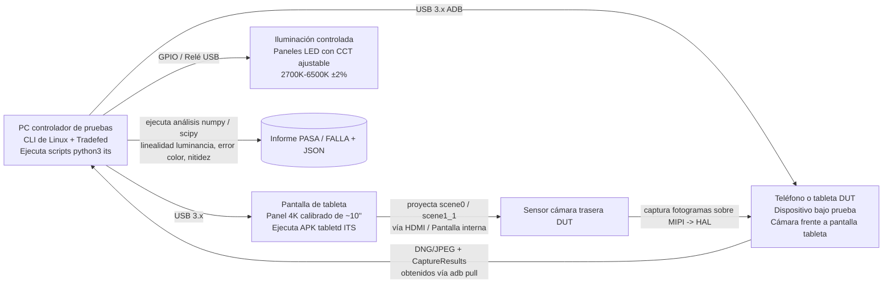

# Capítulo 27: Pruebas de cámara

## Resumen

Ha construido una aplicación de cámara. Funciona en su Pixel. Funciona en su Galaxy. ¿Funciona en el dispositivo Android Go de 99 $ con una HAL `LEGACY` cuyo fabricante implementó mal el `CONTROL_AF_TRIGGER_START` y devuelve cada `SENSOR_EXPOSURE_TIME` en *microsegundos* en lugar de nanosegundos?

Probar el software de la cámara es un problema de dos partes: la **validación del fabricante a nivel de HAL** (las pruebas que Google *obliga* a pasar a cada fabricante antes de que un dispositivo pueda distribuirse con Google Play) y las **pruebas a nivel de aplicación en CI** (las pruebas que usted ejecuta contra su propio código sin necesidad de hardware de cámara físico). Este capítulo cubre ambas. Primero aprenderá qué valida realmente Camera ITS (Image Test Suite, parte de CTS) en los bancos de pruebas físicos: enumeración de combinaciones de flujos, linealidad de luminancia de escenas físicas y fusión de marcas de tiempo de sensor/giroscopio. Luego aprenderá a escribir sus propias pruebas de instrumentación utilizando simulacros (mocks) de Mockito para `CameraManager`/`CameraDevice`/`CaptureSession` de modo que toda su tubería de cámara se ejecute en servidores de CI sin cabeza (headless), además de un patrón de prueba parametrizado que afirma que su código se degrada con elegancia en el hardware `LEGACY` en lugar de fallar.

Use **Android Camera Parameters** ([Google Play](https://play.google.com/store/apps/details?id=com.minininja.cameraparams), [GitHub](https://github.com/zoozooll/AndroidCameraParameters)) como herramienta de referencia para inspeccionar las capacidades exactas contra las que deben validarse sus pruebas: muestra cada clave de `CameraCharacteristics` que ITS también valida en bancos de pruebas reales.

---

## Primera parte: Cómo validan los fabricantes las cámaras: Camera ITS y CTS

Antes de que un dispositivo pueda distribuirse con los Servicios de Google Mobile (GMS), debe superar la Suite de Pruebas de Compatibilidad (CTS) de Android. El CTS de cámara tiene dos mitades: pruebas de CTS programáticas que se ejecutan a través de `Tradefed`, y el Camera ITS (Image Test Suite) que requiere un laboratorio de pruebas físico con bancos de pruebas automatizados.

### Categorías de pruebas

```mermaid
graph TB
    subgraph CTS[CTS de Android: sección de cámara]
        direction TB
        CTS_API[Pruebas de API<br/>— Claves de CameraCharacteristics<br/>— isSessionConfigurationSupported<br/>— Enumeración correcta de casos de uso]
        CTS_FLOW[Pruebas de flujo<br/>— abrir → cerrar<br/>— abrir → sesión → capturar → cerrar<br/>— Estrés de apertura/cierre rápido]
        CTS_V[CTS Verifier<br/>Pruebas manuales en el dispositivo<br/>— Fluidez de la vista previa<br/>— Calidad de la captura<br/>— Cambio entre cámaras múltiples]
    end
    subgraph ITS[Camera ITS: Image Test Suite]
        direction TB
        ITS_COMBI[test_feature_combination<br/>Permutaciones de flujos x FPS x HDR<br/>Miles de llamadas a<br/>isSessionConfigurationSupported]
        ITS_SCENE[Pruebas de escena física<br/>scene0 (gris uniforme)<br/>scene1_1 (tablero de color)<br/>Pantalla de tableta automatizada -> DUT]
        ITS_FUSION[Prueba sensor_fusion<br/>Marcas de tiempo del giro alineadas con<br/>SENSOR_TIMESTAMP en CaptureResult<br/>Tolerancia de ±1 ms]
        ITS_3A[Pruebas de convergencia 3A<br/>AE/AF/AWB deben converger en<br/>N fotogramas bajo iluminación estándar]
        ITS_HDR[Pruebas de HDR / Ultra HDR<br/>Validez del mapa de ganancia JPEG_R<br/>Medición del rango dinámico]
    end
    CTS --> SHIP[(Se distribuye si TODO pasa)]
    ITS --> SHIP

    style ITS_COMBI fill:#d9e6f2
    style ITS_SCENE fill:#d9f2e6
    style ITS_FUSION fill:#f2d9e6
    style CTS_API fill:#fff3cd
    style CTS_V fill:#fff3cd
```

Todo lo que aparece en el diagrama es obligatorio. Si falla aunque sea *una* de estas pruebas en un único ID de cámara, el dispositivo no se distribuye. Por eso entender el ITS ayuda a su aplicación: garantiza un nivel base por debajo del cual ninguna HAL puede caer, y documenta exactamente en qué comportamientos puede confiar.

### Arquitectura del banco de pruebas Camera ITS

Un laboratorio real de Camera ITS tiene este aspecto:



El detalle clave es el *bucle cerrado*. El controlador de pruebas sabe *exactamente* qué valores de píxel ordenó mostrar a la pantalla de la tableta (por ejemplo, un gris uniforme al 50% de intensidad con una temperatura de color de 6500 K conocida con precisión) y luego verifica numéricamente que la salida de la cámara del DUT —tanto la luminancia de los píxeles en el JPEG/DNG *como* el `SENSOR_EXPOSURE_TIME` × `SENSOR_SENSITIVITY` informado en el `CaptureResult`— coincida con la entrada física dentro de las tolerancias permitidas.

#### `test_feature_combination`: El calvario de la enumeración

La prueba individual más larga del ITS por tiempo de ejecución es `test_feature_combination`. Enumera cada tamaño de flujo legal de `SCALER_STREAM_CONFIGURATION_MAP`, cada formato (`PRIV`, `YUV`, `JPEG`, `RAW_SENSOR`, `JPEG_R`, `DEPTH`), cada rango de FPS de `CONTROL_AE_AVAILABLE_TARGET_FPS_RANGES`, cada combinación de *recuento* de superficies de salida (configuraciones de sesión de 1, 2 y 3 salidas) y cada bandera de modo HDR; a continuación, llama a `isSessionConfigurationSupported` sobre la SessionConfiguration resultante, captura un fotograma por cada configuración admitida y afirma que el fotograma no está dañado. El número total de combinaciones suele ser de 30.000 a 100.000 por ID de cámara.

Para usted como desarrollador de aplicaciones, la conclusión es sencilla: **si `isSessionConfigurationSupported` devuelve `true` en un dispositivo que ha superado el CTS, esa combinación de flujos funciona realmente, en ambas direcciones.** Si devuelve `false`, no lo intente. Confíe en esta llamada antes de recurrir a tamaños más pequeños. Esta es la misma consulta que CameraX utiliza internamente en su selector de resolución.

#### Pruebas de escena física: Linealidad de la exposición

Las pruebas scene0 y scene1_1 validan que las matemáticas de exposición *informadas* de la cámara coincidan con su salida de píxeles *medida*. El banco de pruebas proyecta un campo gris uniforme (scene0) de luminancia `L` conocida sobre el DUT. A continuación, ordena un barrido de N pares `(SENSOR_EXPOSURE_TIME, SENSOR_SENSITIVITY)` diferentes de todo el rango disponible, captura un fotograma DNG por par y calcula el valor de píxel medio aritmético `Y` en toda la matriz activa del sensor.

La afirmación es estrictamente lineal:

```
Y_i / (EXPOSURE_TIME_i × SENSITIVITY_i) = constante ± tolerancia
```

en *todos* los pares capturados. Si el producto se duplica, la luminancia del píxel debe duplicarse. Si se reduce a la mitad, la luminancia debe reducirse a la mitad. Cualquier desviación superior a ~1% en los medios tonos hace fallar la prueba.

Por qué esto es importante para usted: es la garantía de que su control deslizante de exposición manual (Capítulo 14) produzca resultados matemáticamente predecibles en un dispositivo compatible con CTS. Si su aplicación calcula el "siguiente par de ISO/exposición" para un paso de +1 EV, la imagen de salida realmente será un paso más brillante. En los dispositivos que no cumplen con el CTS (teléfonos importados del mercado gris, ROM personalizadas sin CTS), esta garantía no se mantiene y su interfaz de usuario de exposición manual parecerá rota.

#### `sensor_fusion`: La prueba de fusión de marcas de tiempo

La EIS (estabilización electrónica de imagen) y el seguimiento de AR viven o mueren por esta prueba. Mientras el DUT está grabando un video, el controlador de pruebas rota físicamente el teléfono en un cardán (gimbal) motorizado a una velocidad angular conocida. Simultáneamente, sondea el sensor giroscópico del DUT a través del `SensorManager` a más de 400 Hz y el `CaptureResult.SENSOR_TIMESTAMP` de la cámara a 30/60 fps.

La condición de paso: cada marca de tiempo del giro y cada `SENSOR_TIMESTAMP` de fotograma deben estar en la misma base de tiempo `CLOCK_MONOTONIC`, con las muestras del giro interpoladas en el momento de la muestra de la cámara coincidiendo con la velocidad angular ordenada del cardán dentro de ±0,1 rad/s y ±1 ms.

Si esta prueba falla, la fuente de la marca de tiempo de la HAL es incorrecta; normalmente mezcló `CLOCK_REALTIME` (tiempo de muro, que salta durante la sincronización NTP) con `CLOCK_MONOTONIC` (constante, monótona). Google rechaza el dispositivo. Para usted, esto significa que puede alimentar con seguridad el `CaptureResult.SENSOR_TIMESTAMP` directamente en la llamada de actualización de la imagen de la cámara de ARCore sin aplicar ningún desplazamiento de marca de tiempo personalizado, en cualquier dispositivo certificado por GMS.

### CTS Verifier: Pruebas manuales de usuario

No todo puede automatizarse. CTS Verifier es un APK en el dispositivo que un probador humano de control de calidad utiliza para pruebas subjetivas:

- **Fluidez de la vista previa**: 30 segundos de barrido con el dispositivo; el probador puntúa la fluidez percibida de 1 a 5. (También se captura telemetría objetiva mediante volcados de Choreographer).
- **Calidad de la captura**: 5 fotos de escenas estándar bajo iluminación estándar; el probador las compara con un dispositivo de referencia de oro.
- **Transición de zoom multicámara**: al hacer zoom continuamente de 0,5x a 10x, no debe haber saltos, fallos ni fotogramas negros visibles entre los cambios de cámara física.
- **Calidad de HDR/JPEG_R**: las capturas SDR y HDR en paralelo se comparan con imágenes de referencia de buen funcionamiento conocido.

Son subjetivas, pero el listón es público. Si su aplicación apunta a objetivos de UX similares (transiciones de zoom fluidas, capturas HDR), puede replicar los mismos procedimientos de prueba en su laboratorio interno de control de calidad con el mismo banco de pruebas de tableta para scene0/scene1_1.

---

## Segunda parte: Probar su propia aplicación: instrumentación y simulacros

Las pruebas de los fabricantes validan la HAL. Usted necesita validar *su* código. El error canónico que cometen los equipos es requerir un teléfono real con una cámara que funcione en su servidor de CI. No lo haga. Con `mock()` + `ArgumentCaptor` de Mockito, cada clase de Camera2 —`CameraManager`, `CameraDevice`, `CameraCaptureSession`, `CaptureResult`— es una interfaz o una clase no final que se simula limpiamente. Puede ejecutar toda su tubería de cámara en CI en un emulador Linux x86 sin cabeza (headless) sin ningún hardware de cámara.

### Ejemplo 1: Capturar un "fotograma" y verificar que el CaptureResult contiene el EXPOSURE_TIME esperado (AndroidTest con Mockito)

```kotlin
// app/src/androidTest/java/com/example/camera/CameraCaptureTest.kt
@RunWith(AndroidJUnit4::class)
@SmallTest
class CameraCaptureTest {

    @Test
    fun captureRequest_containsManualExposureTime_andResultEchoesIt() = runTest {
        // ---- Preparar ----
        val mockCameraManager = mock<CameraManager>()
        val mockCameraDevice = mock<CameraDevice>()
        val mockSession = mock<CameraCaptureSession>()
        val mockSurface = mock<Surface>()
        val testHandler = Handler(Looper.getMainLooper())

        val expectedExposureNs = 16_666_666L // 1/60 s
        val expectedIso = 400

        // Capturar la StateCallback pasada a openCamera
        val deviceCallbackCaptor =
            argumentCaptor<CameraDevice.StateCallback>()
        whenever(mockCameraManager.openCamera(
            anyString(), deviceCallbackCaptor.capture(), any()
        )).thenAnswer { /* nada: lanzamos la retrollamada manualmente */ }

        // Capturar la retrollamada de estado de la sesión
        val sessionCallbackCaptor =
            argumentCaptor<CameraCaptureSession.StateCallback>()
        whenever(mockCameraDevice.createCaptureSession(
            anyList<Surface>(),
            sessionCallbackCaptor.capture(),
            any()
        )).thenAnswer { /* nada */ }

        // Capturar la CaptureCallback pasada a capture()
        val captureCallbackCaptor =
            argumentCaptor<CameraCaptureSession.CaptureCallback>()
        whenever(mockSession.capture(
            any(), captureCallbackCaptor.capture(), any()
        )).thenReturn(1)

        // Construir la cámara bajo prueba usando su envoltorio
        val cameraWrapper = YourCameraWrapper(mockCameraManager, testHandler)

        // ---- Actuar: lanzar la cadena abrir → configurar → capturar ----
        cameraWrapper.open("0")
        // (Dentro de YourCameraWrapper.open() se llamó a
        //  mockCameraManager.openCamera, que capturó la retrollamada).
        // Simular que la HAL devuelve éxito:
        deviceCallbackCaptor.lastValue.onOpened(mockCameraDevice)

        cameraWrapper.createSession(listOf(mockSurface))
        sessionCallbackCaptor.lastValue.onConfigured(mockSession)

        val requestBuilder: CaptureRequest.Builder =
            mockCameraDevice.createCaptureRequest(CameraDevice.TEMPLATE_STILL_CAPTURE)
        // (Su envoltorio aplica los ajustes manuales aquí)
        requestBuilder.set(CaptureRequest.CONTROL_MODE,
                           CaptureRequest.CONTROL_MODE_OFF)
        requestBuilder.set(CaptureRequest.SENSOR_EXPOSURE_TIME,
                           expectedExposureNs)
        requestBuilder.set(CaptureRequest.SENSOR_SENSITIVITY,
                           expectedIso)

        val resultDeferred = async { cameraWrapper.capture(requestBuilder.build()) }

        // ---- Afirmar 1: la CaptureRequest enviada a la HAL tenía las claves correctas ----
        val sentRequest: CaptureRequest = captureArg(mockSession, 0) {
            capture(any(), any(), any())
        }
        assertThat(sentRequest[CaptureRequest.SENSOR_EXPOSURE_TIME])
            .isEqualTo(expectedExposureNs)
        assertThat(sentRequest[CaptureRequest.SENSOR_SENSITIVITY])
            .isEqualTo(expectedIso)

        // ---- Actuar 2: Simular que la HAL devuelve un CaptureResult ----
        val mockResult = mock<TotalCaptureResult>().apply {
            whenever(get(CaptureResult.SENSOR_EXPOSURE_TIME))
                .thenReturn(expectedExposureNs)
            whenever(get(CaptureResult.SENSOR_SENSITIVITY))
                .thenReturn(expectedIso)
            whenever(frameNumber).thenReturn(1L)
        }
        captureCallbackCaptor.lastValue
            .onCaptureCompleted(mockSession, sentRequest, mockResult)

        // ---- Afirmar 2: el resultado de captura devuelto por el envoltorio refleja la exposición ----
        val actual = resultDeferred.await()
        assertThat(actual.exposureTimeNanos).isEqualTo(expectedExposureNs)
        assertThat(actual.iso).isEqualTo(expectedIso)
    }
}
```

El patrón es siempre el mismo:
1. `argumentCaptor` para la retrollamada que iría a la HAL.
2. Llamar a su envoltorio.
3. Disparar el método de éxito de la retrollamada *como si la HAL hubiera respondido*.
4. Afirmar tanto sobre las entradas (lo que su envoltorio envió a la HAL) como sobre las salidas (lo que su envoltorio entregó al llamante).

Esto se ejecuta en un emulador sin cámara. Sin hardware. Sin inestabilidad por la iluminación. 10.000 ejecuciones producen los mismos 10.000 éxitos.

### Ejemplo 2: Prueba parametrizada: los dispositivos LEGACY deben degradarse con elegancia, nunca fallar

Toda aplicación de cámara de producción debe funcionar en las HAL `LEGACY`. El error individual más común es llamar a `CaptureRequest.CONTROL_MODE_OFF` en un dispositivo `LEGACY`: la HAL lo ignora, pero su envoltorio interpreta el `CaptureResult.CONTROL_AE_STATE == SEARCHING` resultante como un fallo transitorio e intenta reiniciar la AE en un bucle infinito, provocando finalmente un ANR.

Parametrice sus pruebas por `INFO_SUPPORTED_HARDWARE_LEVEL`:

```kotlin
@RunWith(Parameterized::class)
class HardwareLevelGracefulDegradationTest(
    private val hardwareLevel: Int,
    private val hardwareLevelName: String
) {
    companion object {
        @JvmStatic
        @Parameterized.Parameters(name = "{1}")
        fun data() = listOf(
            arrayOf(CameraCharacteristics.INFO_SUPPORTED_HARDWARE_LEVEL_LEGACY,
                    "LEGACY"),
            arrayOf(CameraCharacteristics.INFO_SUPPORTED_HARDWARE_LEVEL_LIMITED,
                    "LIMITED"),
            arrayOf(CameraCharacteristics.INFO_SUPPORTED_HARDWARE_LEVEL_FULL,
                    "FULL"),
            arrayOf(CameraCharacteristics.INFO_SUPPORTED_HARDWARE_LEVEL_3,
                    "LEVEL_3"),
        )
    }

    @Test
    fun requestManualExposure_onAnyHardwareLevel_doesNotCrash_orHang() = runTest {
        val mockCameraManager = mock<CameraManager>()
        val mockChars = mock<CameraCharacteristics>()
        whenever(mockChars.get<Int>(
            CameraCharacteristics.INFO_SUPPORTED_HARDWARE_LEVEL
        )).thenReturn(hardwareLevel)
        whenever(mockCameraManager.getCameraCharacteristics("0"))
            .thenReturn(mockChars)

        val wrapper = YourCameraWrapper(mockCameraManager, testHandler)
        wrapper.open("0")
        // ... (configuración de sesión repetitiva como antes, omitida)

        val job = launch {
            wrapper.setManualExposure(iso = 400, exposureNs = 8_000_000L)
        }

        // Sin bloqueo: debe completarse dentro del tiempo de espera incluso en LEGACY
        withTimeoutOrNull(2_000) { job.join() }
            ?: fail("setManualExposure se bloqueó en hardware $hardwareLevelName")

        // No se ha filtrado ninguna excepción a lo no capturado
        assertThat(job.isCancelled).isFalse()
    }
}
```

Ejecute esto contra cada nueva compilación. Tarda 400 ms. Atrapa exactamente la clase de bloqueos de la HAL `LEGACY` que, de otro modo, solo aparecerían en los informes de fallos de la Play Console meses después.

### AndroidTest en hardware real: captura de cordura de que EXPOSURE_TIME es correcto

Para las ejecuciones nocturnas contra una pequeña granja de teléfonos reales, escriba una pequeña AndroidTest que abra la cámara *real*, capture un fotograma RAW y afirme que el `CaptureResult.SENSOR_EXPOSURE_TIME` estaba dentro de un margen del 5% del valor solicitado. Esto protege contra las regresiones de la HAL en compilaciones específicas del sistema operativo:

```kotlin
@RunWith(AndroidJUnit4::class)
@RequiresDevice
@LargeTest
class RealHardwareCaptureSanityTest {

    @Test
    fun realCapture_exposureTimeIsWithin5PercentOfRequested() = runTest {
        val context = InstrumentationRegistry.getInstrumentation().context
        val camManager = context.getSystemService(Context.CAMERA_SERVICE)
            as CameraManager
        val chars = camManager.getCameraCharacteristics("0")
        assumeTrue(
            "Requiere FULL o LEVEL_3 para exposición manual",
            chars[CameraCharacteristics.INFO_SUPPORTED_HARDWARE_LEVEL] in
            setOf(
                CameraCharacteristics.INFO_SUPPORTED_HARDWARE_LEVEL_FULL,
                CameraCharacteristics.INFO_SUPPORTED_HARDWARE_LEVEL_3,
            )
        )

        // ... abrir cámara, crear sesión de ImageReader (PRIVATE o YUV), capturar
        // un único fotograma manual con una exposición conocida usando los envoltorios
        // de las corrutinas del Capítulo 26 ...

        val requestedNs = 10_000_000L // 1/100 s
        val result: TotalCaptureResult =
            cameraWrapper.captureManualExposure(requestedNs, iso = 200)

        val actualNs = result[CaptureResult.SENSOR_EXPOSURE_TIME]!!
        val tolerancePct = abs(actualNs - requestedNs) * 100.0 / requestedNs
        assertThat(tolerancePct)
            .withFailMessage(
                "Solicitado %d ns, obtenido %d ns (%$.1f%% diferencia > 5%%)",
                requestedNs, actualNs, tolerancePct
            )
            .isLessThan(5.0)
    }
}
```

Esta prueba es inestable por naturaleza: depende del hardware real. Pero atrapa exactamente el tipo de actualizaciones OTA de los fabricantes que rompen silenciosamente la exposición manual en los dispositivos insignia. Ejecútela cada noche en su granja de 5 a 10 dispositivos; la señal merece el ruido.

---

## Resumen

Las pruebas de cámara se dividen en validación de OEM y validación de aplicación. Los OEM deben superar el CTS y el Camera ITS, un conjunto de pruebas con bancos de pruebas físicos que impone el soporte de combinaciones de flujos (mediante miles de llamadas a `isSessionConfigurationSupported`), la linealidad de luminancia en el plano exposición × sensibilidad y la alineación de marcas de tiempo de sensor/giroscopio para EIS y AR. Las aplicaciones prueban mediante instrumentación: Mockito simula cada clase de Camera2, `ArgumentCaptor` captura las retrollamadas de la HAL, usted las dispara manualmente y afirma tanto sobre la solicitud como sobre el resultado sin tocar el hardware real, lo que permite ejecuciones de CI en emuladores sin cabeza. Parametrice sus pruebas de envoltorios contra cada `INFO_SUPPORTED_HARDWARE_LEVEL` (especialmente `LEGACY`) para garantizar una degradación elegante, y ejecute un pequeño conjunto de capturas de cordura `@RequiresDevice @LargeTest` contra una granja de dispositivos reales para atrapar regresiones de las OTA.

## ¿Qué sigue?

Ya domina la API pública de Camera2 desde Kotlin hasta el NDK nativo, la ha envuelto en corrutinas y la ha verificado contra pruebas. Pero, ¿qué sucede realmente *bajo el capó* cuando llama a `CameraManager.openCamera`? ¿Qué es HAL3? ¿Dónde vive realmente el límite de Binder IPC? ¿Y cómo cambia la arquitectura el `CameraDeviceSetup` (Android 15, API 35) al desacoplar las consultas de capacidad de la energía del sensor? El Capítulo 28 es el gran final de la arquitectura: toda la pila desde el código de la aplicación hasta el motor de bobina de voz VCM en el barril de la lente.
