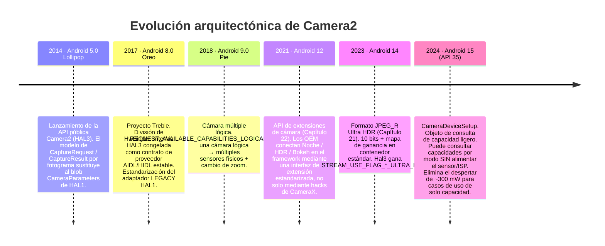

# Capítulo 28: Arquitectura de Camera2

## Resumen

Este es el capítulo que se ha ganado. En los capítulos 1 a 27 ha utilizado `CameraManager`, `CameraCharacteristics`, `CaptureRequest`, `CaptureResult`, `CameraCaptureSession`, `ImageReader`, CameraX, la pila nativa NDK, envoltorios de corrutinas y simulacros (mocks) de prueba. Conoce cada superficie de la API pública. Ahora retiramos cada abstracción en secuencia, desde la línea de código Kotlin que escribe hasta los electrones individuales que cruzan el bus MIPI CSI-2 entre el sensor y el SoC, el motor de bobina de voz (VCM) que desplaza el grupo de lentes 10 micrómetros y el controlador del LED del flash que pulsa un estroboscopio de xenón o LED en sincronía de microsegundos con el obturador electrónico del sensor.

Al final de este capítulo podrá observar cualquier `CaptureRequest` y mapear, capa por capa, a dónde va cada parte, quién la traduce, quién la valida y quién la ejecuta finalmente en el silicio. También entenderá la abstracción `CameraDeviceSetup` de Android 15 (API 35) como un ejemplo de una tendencia arquitectónica de una década: el desacoplamiento progresivo de las *consultas de capacidad* de los *estados de energía del hardware*, de modo que las aplicaciones puedan sondear una cámara sin quemar los ~300 mW necesarios para encender el sensor y el ISP.

Para inspeccionar las capacidades exactas de cualquier dispositivo real y contrastarlas con las capas de arquitectura descritas aquí, instale **Android Camera Parameters** ([Google Play](https://play.google.com/store/apps/details?id=com.minininja.cameraparams), [GitHub](https://github.com/zoozooll/AndroidCameraParameters)). Lee cada clave de `CameraCharacteristics` que las capas siguientes exponen a la API pública.

---

## Diagrama de capas de la pila completa

Este es el diagrama más importante de todo el libro. Cada capa desde aquí hacia abajo es código real con una ruta real en el Proyecto de Código Abierto de Android (AOSP), un propietario real y un límite real de Binder o de llamada a función. Recorreremos cada capa de arriba abajo, luego mostraremos la evolución de la pila durante la última década y, finalmente, mapearemos su viaje de aprendizaje a través de las capas.

```mermaid
graph TB
    subgraph APP["Capa de App (su código)"]
        direction TB
        A1["Kotlin / Java / C++ NDK<br/>cameraManager.openCamera(id, cb, handler)<br/>session.capture(request, cb, handler)<br/>captureResult.get(SENSOR_EXPOSURE_TIME)"]
    end
    subgraph FRAME["Capa del Framework Java/Kotlin — android.hardware.camera2.*"]
        direction TB
        F1["CameraManager · CameraCharacteristics<br/>CaptureRequest.Builder · CaptureResult<br/>CameraDevice · CameraCaptureSession"]
        F2["CameraBinderWrapper (AOSP frameworks/base)<br/>Traduce objetos Java → paquete AIDL Binder"]
    end
    subgraph BIND["Capa IPC — Binder / HwBinder"]
        direction TB
        B1["AIDL ICameraService (AOSP)<br/>Framework ↔ CameraService"]
        B2["HIDL / AIDL HAL Binder (Treble)<br/>CameraService ↔ Vendor HAL"]
    end
    subgraph NS["Capa Nativa Mediaserver (system/bin/cameraserver)"]
        direction TB
        N1["CameraService (frameworks/av/services/camera/)"]
        N2["Camera3Device<br/>frameworks/av/services/camera/libcameraservice/device3/<br/>— Valida solicitud frente a salidas de sesión<br/>— Construye camera3_capture_request_t<br/>— Analiza camera3_capture_result_t"]
        N3["CameraProviderManager (frameworks/av)<br/>Enumera las implementaciones HAL del proveedor"]
    end
    subgraph HAL["Capa Vendor HAL (código OEM / SoC)"]
        direction TB
        H1["Interfaz HAL3: camera3_device_t<br/>— process_capture_request()<br/>— process_capture_result()<br/>— flush()"]
        H2["Adaptador HAL1 (Heredado)<br/>camera2compat::Camera2Compat<br/>Traduce solicitud HAL3 → CameraParameters HAL1<br/>para < INFO_SUPPORTED_HARDWARE_LEVEL_LIMITED"]
        H3["Implementación del proveedor<br/>Qualcomm QCamera2 · MediaTek CamHAL · Samsung Exynos Camera HAL"]
    end
    subgraph K["Capa del Kernel (Linux)"]
        direction TB
        K1["/dev/videoX — Controlador de captura de video V4L2<br/>VIDIOC_S_FMT · VIDIOC_REQBUFS · VIDIOC_QBUF / DQBUF"]
        K2["Controlador ISP (Qualcomm CAMSS / Controlador ISP de MediaTek)<br/>Nodo V4L2 m2m de procesamiento memoria a memoria"]
        K3["Controlador de subdispositivo de sensor<br/>Escrituras I2C para modo / exposición / ganancia / VCM"]
        K4["Controlador receptor MIPI CSI-2 (SoC)<br/>Configuración de carriles, transiciones LP/HS, comprobación ECC/CRC"]
    end
    subgraph HW["Capa de hardware físico"]
        direction TB
        HW1["Conjunto de lentes<br/>VCM Motor de bobina de voz (I2C)<br/>Mueve el grupo de lentes para el enfoque / OIS"]
        HW2["Matriz de píxeles del sensor de cámara<br/>Sensor CMOS (Sony IMX / Samsung ISOCELL / OmniVision)<br/>Exponer → Lectura → A/D"]
        HW3["Bus físico MIPI CSI-2<br/>2/4/8 pares diferenciales a 1,5 – 2,5 Gbps/carril"]
        HW4["Procesador de señal de imagen ISP (en SoC)<br/>Interpolación cromática · Reducción de ruido · Nitidez · Fusión HDR · Detección de rostros por hardware"]
        HW5["Controlador LED de flash (I2C)<br/>Estroboscopio de xenón o sumidero de corriente LED<br/>Sincronizado con el pin EXRST del sensor"]
    end

    APP -->|llamada a función| FRAME
    FRAME -->|paquete AIDL| BIND
    BIND -->|HwBinder| NS
    NS -->|HAL3 AIDL/HIDL| HAL
    HAL -->|llamadas al sistema ioctl()| K
    K -->|escrituras I2C + señales de carril MIPI + colas de comandos ISP| HW

    style APP fill:#e6d9f2
    style FRAME fill:#d9e6f2
    style BIND fill:#fff3cd,stroke:#ffc107,stroke-width:2px
    style NS fill:#d9f2e6
    style HAL fill:#f2d9e6
    style K fill:#e6d9e6
    style HW fill:#f2e6d9,stroke:#d4a373,stroke-width:2px
```

Ahora recorra de arriba abajo.

---

## Capa 1: Capa de App (su código)

Este es el código que usted escribió. `cameraManager.openCamera(id, stateCallback, cameraHandler)`. Conoce esta capa de memoria. Dos hechos que quizás no haya interiorizado:
- Cada llamada a `CaptureRequest.Builder.set(clave, valor)` que realiza añade una *entrada de metadatos etiquetada* a una estructura empaquetable que refleja exactamente la estructura C `camera_metadata_t` en `system/media/camera/include/system/camera_metadata.h`. No hay una traducción mágica entre su `CaptureRequest` de Kotlin y la solicitud de la HAL: son el mismo formato de metadatos binario, solo que envueltos con diferentes vinculaciones de lenguaje.
- Cada llamada a `CaptureResult.get(clave)` que realiza lee los bytes exactos que la HAL escribió en el búfer de respuesta. Si una HAL informa mal del tiempo de exposición en una compilación OTA específica, su aplicación lee exactamente ese valor incorrecto. No hay una capa de validación a nivel de framework por encima de la HAL que corrija los errores del proveedor. Por eso existe la prueba de cordura de hardware real del Capítulo 27.

---

## Capa 2: Capa del Framework Java/Kotlin (`android.hardware.camera2.*`)

La capa del Framework (AOSP `frameworks/base/core/java/android/hardware/camera2/`) solo hace dos cosas:
1. Expone la superficie de la API pública (`CameraManager`, `CameraDevice`, etc.) a la que usted llama.
2. Traduce entre los objetos Java `CaptureRequest` / `CaptureResult` y sus representaciones en el cable empaquetables por Binder.

No aplica ninguna política por encima de la HAL. No reescribe metadatos. No "corrige" solicitudes. Es una fina capa de traducción más una caché para el blob inmutable `CameraCharacteristics` recuperado una vez por ID de cámara al arrancar el dispositivo.

El límite de Binder se encuentra en `CameraManager` → `ICameraService` AIDL, que es la siguiente capa.

---

## Capa 3: Capa IPC: Binder / HwBinder (Treble)

Este es el contrato arquitectónico crítico que el Proyecto Treble (Android 8.0, 2017) fijó. Intervienen dos dominios de Binder:

| Dominio Binder | Conecta | Protocolo | Quién impone la estabilidad de la ABI |
|-------------------|-------------------------------------------------------|-----------------|---------------------------------|
| `/dev/binder` | Framework ↔ cameraserver (lado system_server) | AIDL | Plataforma (compilación de la misma partición) |
| `/dev/hwbinder` | cameraserver ↔ vendor camera HAL | HIDL / AIDL HAL | Treble (interfaz de proveedor estable) |

Antes de Treble, la HAL era un `.so` cargado mediante `dlopen` directamente en el proceso del `cameraserver`. Cada OTA del OEM tenía que reconstruir la cámara *y* el framework juntos. La división HwBinder de Treble significa que la HAL del proveedor es su propio proceso, su propia partición, su propia línea de tiempo de actualización de seguridad de 3 años, y el contrato entre ella y el `cameraserver` está versionado y congelado para toda la vida del dispositivo. Para usted, como desarrollador de aplicaciones, esta es la razón principal por la que el comportamiento de la API Camera2 es predecible a través de las OTA: la interfaz de la HAL literalmente no puede cambiar sin romper la prueba de cumplimiento de Treble.

El adaptador LEGACY HAL1 vive por debajo de este límite, dentro del proceso de la HAL del proveedor, por lo que es invisible para usted en la capa de aplicación, excepto a través de `INFO_SUPPORTED_HARDWARE_LEVEL_LEGACY`.

---

## Capa 4: Capa Nativa Mediaserver: `CameraService` / `Camera3Device`

`/system/bin/cameraserver` es un demonio nativo iniciado al arrancar por `init.rc`. Se ejecuta siempre, es el propietario de cada cámara abierta en el dispositivo y es el único árbitro de qué aplicación obtiene acceso a la cámara (la aplicación en primer plano gana; todo lo demás se desconecta).

Sus dos clases más importantes:

1. **`CameraService`** (`frameworks/av/services/camera/libcameraservice/CameraService.cpp`):
   - Expone el AIDL de `ICameraService` al framework.
   - Aplica las comprobaciones del permiso `android.permission.CAMERA` para cada llamada al binder (la llamada de una aplicación sin permiso CAMERA es rechazada *en el cameraserver* incluso antes de llegar a la HAL).
   - Maneja la arbitraje de aperturas concurrentes (dos aplicaciones solicitan la misma cámara → la actividad superior la obtiene; la aplicación en segundo plano recibe `onDisconnected`).
   - Gestiona el `CameraProviderManager` para enumerar los módulos HAL del proveedor.

2. **`Camera3Device`** (`frameworks/av/services/camera/libcameraservice/device3/Camera3Device.cpp`):
   - El corazón de la tubería.
   - Valida que cada superficie de salida en una solicitud de captura forme realmente parte del conjunto de salidas configurado de la sesión. (Aquí es donde el framework lanza `IllegalArgumentException: Surface not in configured outputs`).
   - Empaqueta su `CaptureRequest` empaquetada en una estructura `camera3_capture_request_t` de la HAL3.
   - Transmite las solicitudes una por una a la HAL mediante `process_capture_request(request)`.
   - Recibe de vuelta la `camera3_capture_result_t` de la HAL, empaqueta los metadatos + las vallas (fences) y los reenvía *hacia arriba* por la cadena Binder hasta su `CaptureCallback.onCaptureCompleted`.
   - Maneja por usted el `flush()`, las rutas de error, las retrollamadas `notify()` de obturador y error, y las vallas de liberación del búfer de salida para la interoperabilidad con EGL/Vulkan.

`Camera3Device` tiene unas 15.000 líneas de C++ y es la pieza más intensamente probada de toda la pila (las pruebas CTS del Capítulo 27 apuntan directamente al comportamiento de `Camera3Device` desde el lado del framework). Si alguna vez lee un informe de error que diga "esta clave de solicitud funciona en Camera2 NDK pero no en Java Camera2", la discrepancia suele ser una ruta de validación o conversión que falta dentro de `Camera3Device`.

---

## Capa 5: Capa Vendor HAL: HAL3 (`camera3_device_t`)

Aquí es donde vive realmente la diferenciación de los OEM. Cada proveedor de SoC distribuye su propia implementación de HAL3:

| Fabricante | Nombre en clave de la HAL | Interfaz AOSP |
|--------------|-------------------------------------------|----------------------------------------------|
| Qualcomm | QCamera2 / QCamera3 (base de código mm-camera) | `camera3_device_t` + extensiones `vendor.qti.hardware.camera*` |
| MediaTek | CamHAL (mtkcam) | Misma `camera3_device_t` + extensiones de MediaTek |
| Samsung | Exynos Camera HAL | Misma `camera3_device_t` + extensiones de Samsung |
| Google Tensor| Google Camera HAL (Pixels) | Misma `camera3_device_t` + lógica personalizada de Google para Night Sight / Computational Raw |

El contrato HAL3 (definido en `hardware/libhardware/include/hardware/camera3.h`) consiste exactamente en cuatro operaciones principales en un dispositivo abierto:

```cpp
// Contrato simplificado de HAL3: esta es toda la interfaz
typedef struct camera3_device {
    hw_device_t common;

    int (*configure_streams)(
        const struct camera3_device *,
        camera3_stream_configuration_t *stream_list
    );

    int (*process_capture_request)(
        const struct camera3_device *,
        camera3_capture_request_t *request
    );

    void (*get_metadata_vendor_tag_ops)(...);

    int (*flush)(const struct camera3_device *);

    void (*dump)(...);
} camera3_device_t;
```

La HAL recibe solicitudes, produce resultados y búferes de salida. Eso es todo. El modelo de solicitud/respuesta es la firma de la HAL3: la HAL1 era un único blob de cadena `CameraParameters` (`"preview-size=1920x1080;picture-size=..."`) que toda la industria odiaba por su falta de control fotograma a fotograma. El modelo de solicitud/respuesta de la HAL3 es lo que *permite* cada función avanzada que ha utilizado en este libro: exposición manual por fotograma, captura RAW, flujos físicos multicámara, reprocesamiento, superficies de entrada ZSL. Todo imposible bajo la HAL1.

### El adaptador LEGACY HAL1

`INFO_SUPPORTED_HARDWARE_LEVEL_LEGACY` significa que el proveedor *todavía* solo distribuyó un `.so` de HAL1 y el dispositivo utiliza el adaptador `camera2compat::Camera2Compat` de AOSP para traducir las llamadas de solicitud/respuesta de la HAL3 a los antiguos puntos de entrada de HAL1: el blob `CameraParameters` + `startPreview()`/`takePicture()`. Esta capa de traducción es la razón por la que el Capítulo 24 le advirtió de que `CONTROL_MODE_OFF` no hace nada silenciosamente en los dispositivos `LEGACY`: la HAL1 no tiene un concepto de `CONTROL_MODE` por fotograma al que traducir. El adaptador descarta esa entrada de metadatos.

---

## Capa 6: Capa del Kernel: V4L2 + MIPI CSI-2 + Controladores de sensores

El proceso de la HAL3 realiza llamadas al kernel de Linux exclusivamente mediante llamadas al sistema `ioctl()` en los nodos del dispositivo. Cuatro categorías de controlador del kernel interactúan para procesar un único fotograma:

1. **Controlador del receptor MIPI CSI-2** (`/dev/v4l-subdevX`): Configura el recuento de carriles PHY y la velocidad de datos, gestiona las transiciones de baja potencia a alta velocidad en los pares diferenciales, valida el ECC/CRC de los paquetes y realiza el DMA de las líneas de píxeles recibidas en el búfer circular de entrada del ISP. Nunca toca este controlador desde el espacio de usuario. Un CRC de CSI-2 incorrecto se manifiesta ante usted como un búfer de salida corrupto con el correspondiente `camera3_stream_buffer_t.status == BUFFER_ERROR`.

2. **Controlador de subdispositivo de sensor** (`/dev/v4l-subdevY`, controlado por I2C):
   - Escribe los registros del sensor a través de I2C (un bus de banda lateral lento, de ~100 KHz, por lo que los cambios de exposición y los cambios de modo tienen una latencia de ~2-3 fotogramas incluso para los dispositivos `HARDWARE_LEVEL_3`).
   - Establece el tiempo de exposición (inicio/parada del obturador electrónico por fotograma), la ganancia analógica, la ganancia digital, la resolución y el modo de agrupamiento (binning).
   - Controla el enfoque del VCM mediante un DAC I2C que suministra corriente a la bobina de voz (consulte la capa HW).
   - Controla la sincronización del estroboscopio del flash mediante un pin de salida EXRST en el lado del sensor que el controlador del flash escucha.

3. **Nodo de captura de video V4L2** (`/dev/video0` etc.): La HAL llama a `VIDIOC_REQBUFS` para asignar búferes respaldados por gralloc (exactamente los mismos manejadores `AHardwareBuffer` que importó a Vulkan en el Capítulo 25) y luego a `VIDIOC_QBUF` (encolar un búfer) en un bucle. A medida que llegan los fotogramas del receptor CSI-2 + ISP, la HAL llama a `VIDIOC_DQBUF` (retirar un búfer de la cola) y lo envía a `Camera3Device` como una `camera3_stream_buffer_t`.

4. **Controlador de memoria a memoria del ISP** (nodo `/dev/videoN m2m`): Independientemente de la ruta de captura, la HAL pone en cola los búferes de entrada de reprocesamiento (para ZSL, Capítulo 23) en la cola m2m del ISP para ejecutar la interpolación cromática, la reducción de ruido, la fusión HDR o la detección de rostros en fotogramas RAW capturados previamente. El resultado emerge como un búfer de salida JPEG/YUV/PRIVATE procesado.

---

## Capa 7: Capa de hardware físico

Finalmente, los electrones. Todas las capas anteriores son código que se ejecuta en el SoC. La capa de hardware es donde los fotones se convierten en electrones y se procesan:

```mermaid
graph LR
    LENS["Grupo de lentes<br/>Elementos de cristal<br/>distancia focal ~10–20 mm"] --> VCM["Motor VCM<br/>DAC I2C → corriente bobina →<br/>desplazamiento lente ±50 µm<br/>Enfoque + estabilización OIS"]
    VCM --> SENSOR[Matriz de píxeles del sensor CMOS<br/>Sony IMX / Samsung ISOCELL<br/>~12 MP – 200 MP<br/>obturador electrónico: lectura línea a línea<br/>Obturador global (raro) en sensores industriales]
    SENSOR -->|Bayer de 10/12/14 bits convertido por A/D| CSI[MIPI CSI-2 PHY<br/>2/4/8 pares<br/>hasta 20 Gbps en total]
    CSI -->|Interconexión interna del SoC| ISP[ISP — en el chip del SoC<br/>Interpolación cromática · CCM · NR · Estadísticas 3A · Fusión HDR<br/>a menudo más de 1 TOPS de DNN para rostros/segmentación]
    ISP -->|Búferes gralloc → DRAM| CPU[CPU / GPU<br/>El proceso de su aplicación los lee]
    FLASH["Flash LED / Xenón<br/>Controlador de flash I2C<br/>Estroboscopio sincronizado con pin EXRST del sensor"] --> SENSOR
```

Cada subsistema físico:
- **Lente y VCM**: un movimiento de 10 µm de la lente es un paso de AF. El OIS (Estabilización Óptica de la Imagen) añade retroalimentación de giroscopio de bucle cerrado al VCM, desplazando la lente de 500 a 5.000 veces por segundo para cancelar el temblor de la mano. El controlador del kernel escribe valores DAC I²C; su aplicación lo controla mediante las claves de metadatos `LENS_FOCUS_DISTANCE` y `LENS_OPTICAL_STABILIZATION_MODE`.
- **Matriz de píxeles del sensor**: los fotodiodos acumulan carga proporcional al recuento de fotones incidentes. La lectura es mediante obturador electrónico (línea por línea de arriba abajo), por lo que su control deslizante de AE en el Capítulo 14 tenía una latencia de 2 a 3 fotogramas: la exposición para el fotograma N se programa durante la lectura del fotograma N-1.
- **Bus MIPI CSI-2**: pares diferenciales de hasta 2,5 Gbps/carril × 8 carriles = 20 Gbps en bruto. Más que suficiente para Bayer de 12 bits en 4K a 60 fps. Los errores de los paquetes disparan la retransmisión CRC en el hardware, pero un fotograma corrupto le llega como `BUFFER_ERROR`.
- **ISP**: el héroe olvidado. Su hardware de interpolación cromática + reducción de ruido + nitidez funciona a más de 1 Gigapíxel/seg y le ahorra a su CPU tener que hacerlo. En los SoC Tensor / Snapdragon modernos también ejecuta aceleradores DNN para la segmentación de escenas, la detección de rostros y la fusión HDR en el sensor antes incluso de que la CPU vea el fotograma.
- **Controlador del flash**: el pulso del flash debe dispararse *exactamente durante* la ventana de exposición del obturador electrónico del fotograma que se supone que debe iluminar. El bit `FLASH_STATE_FIRED` en el `CaptureResult` confirma la alineación; la falta de alineación produce fotogramas parcialmente expuestos.

---

## Evolución arquitectónica: Camera2 a través de las versiones de Android

Camera2 no se construyó en un día. Cada 2 o 3 versiones de Android se añadía una nueva primitiva arquitectónica que desbloqueaba funciones reales para los desarrolladores:



La tendencia en cada lanzamiento es clara: **desacoplamiento**.
- Android 8 desacopló la HAL del framework (Treble).
- Android 9 desacopló el ID de cámara lógica de los sensores físicos.
- Android 12 desacopló las extensiones de los fabricantes del código de la aplicación.
- Android 14 desacopló la codificación HDR de la tubería RAW.
- **El `CameraDeviceSetup` de Android 15 desacopla las consultas de capacidad de la energía del hardware.**

### El foco en: `CameraDeviceSetup` de Android 15: el desacoplamiento arquitectónico en acción

`CameraDeviceSetup` (Android 15, API 35) es el ejemplo más puro de esta tendencia. Antes de la API 35, si una aplicación quería saber "¿funciona este combo de flujo 4K@60 con análisis YUV_420_888 al mismo tiempo?", la única forma de llamar a `isSessionConfigurationSupported` era a través de una instancia de `CameraCharacteristics` obtenida mediante `CameraManager.getCameraCharacteristics(id)`. Internally, esto obligaba a la HAL a alimentar el sensor (≈250–350 mW) e ISP durante varios milisegundos solo para leer una tabla de capacidades que es efectivamente estática para toda la vida del dispositivo. En una aplicación con restricciones de batería, esto era inviable para cualquier UX de "comprobación previa de funciones".

`CameraDeviceSetup` soluciona esto proporcionando una representación ligera y sin toma de energía:

```kotlin
// Requiere API 35+
val setup: CameraDeviceSetup = cameraManager.getCameraDeviceSetup(cameraId)
val supported: Boolean = setup.isSessionConfigurationSupported(sessionConfig)
// getCameraDeviceSetup() NO alimenta el sensor ni el ISP
// El resultado puede guardarse en caché para todo el tiempo de actividad del dispositivo
```

Arquitectónicamente, la tabla de capacidades vive ahora en un blob precargado, firmado e independiente de la partición en la partición de proveedor, y `CameraDeviceSetup` la lee a través de una llamada HwBinder separada que omite por completo la secuencia de encendido de `Camera3Device`. Esta es la dirección de la próxima década: *cada* API que pueda responderse estáticamente acabará teniendo una contraparte ligera sin consumo de energía. Se espera que `CameraDeviceSetup` gane más y más consultas de capacidad en Android 16+.

---

## El viaje del lector mapeado a las capas de arquitectura

Finalmente, mapee su propio viaje a través de este libro en las capas de arquitectura. Cada capítulo corresponde a una capa o límite de interfaz específico:

```mermaid
flowchart TB
    subgraph Journey["Su viaje a través de este libro (Capítulos → Capas)"]
        direction LR
        C1["Caps. 1–4<br/>Fundamentos<br/>Conceptos de la capa de hardware"] ~~~ H_L1["↔ Capa HW"]
        C2["Caps. 5–9<br/>Primera app Camera2<br/>CameraManager · Sesión · ImageReader"] ~~~ H_L2["↔ App + Framework"]
        C3["Caps. 10–12<br/>Tubería · Tipos de captura<br/>Inmersión profunda en Characteristics"] ~~~ H_L3["↔ Metadatos parcelados + contrato HAL3"]
        C4["Caps. 13–17<br/>3A manual · Exposición · Enfoque · WB"] ~~~ H_L4["↔ Claves de metadatos → HAL3 → Controlador sensor I²C"]
        C5["Caps. 18–23<br/>RAW · HDR · Multi-Cam · ZSL · Extensiones"] ~~~ H_L5["↔ Modelo solicitud HAL3 · Reprocesamiento ISP m2m"]
        C6["Cap. 24 CameraX<br/>Fachada UseCase + Interop"] ~~~ H_L6["↔ Abstracción del lado de la App sobre el Framework"]
        C7["Cap. 25 Nativo NDK<br/>ACamera + AHB → Vulkan"] ~~~ H_L7["↔ Adaptador NDK directamente sobre Camera3Device"]
        C8["Cap. 26 Corrutinas/Flow<br/>Envoltorio asíncrono de retrollamadas"] ~~~ H_L8["↔ Asíncrono en capa de app sobre límites de Binder"]
        C9["Cap. 27 Pruebas ITS/CTS<br/>Hardware simulado frente a real"] ~~~ H_L9["↔ Valida cada capa mediante el arnés de pruebas"]
        C10["Cap. 28 ESTE CAPÍTULO<br/>Arquitectura de la pila completa"] ~~~ H_L10["↔ TODAS las capas, de extremo a extremo"]
    end
    H_L1 --> HW
    H_L2 --> FRAME
    H_L3 --> HAL
    H_L4 --> K
    H_L5 --> HAL
    H_L6 --> APP
    H_L7 --> NS
    H_L8 --> APP
    H_L9 --> BIND
    H_L10 --> HW
```



Al leer este capítulo al final, ha hecho coincidir la arquitectura con la práctica. No aprendió HAL3 de forma abstracta el primer día y luchó por mapearlo a código real. Aprendió *haciendo*: abrir → configurar → capturar → resultado, durante 27 capítulos, y luego descorrió el telón para ver quién respondía realmente a cada una de esas llamadas.

---

## Resumen

Camera2 es una pila de siete capas: App → Framework (Java/Kotlin `android.hardware.camera2.*`) → Binder/HwBinder IPC → `CameraService` Nativo + `Camera3Device` → HAL3 del proveedor (`camera3_device_t`, con un adaptador LEGACY HAL1) → Controladores del kernel V4L2 (MIPI CSI-2, sensor, captura, ISP m2m) → Hardware físico (lente/VCM, sensor, bus MIPI, ISP, controlador de flash). El Proyecto Treble fijó el contrato de la HAL a través de HwBinder, garantizando la estabilidad a largo plazo. La tendencia arquitectónica de la década es el desacoplamiento progresivo, culminando en `CameraDeviceSetup` de Android 15, que puede consultar capacidades sin alimentar el sensor. Ahora ha mapeado cada función —desde el ISO manual en el Capítulo 14 hasta el ZSL en el Capítulo 23, pasando por la copia cero nativa de Vulkan en el Capítulo 25— a la capa exacta que la ejecuta.

## ¿Qué sigue?: Parte VII — Enciclopedia de metadatos de cámara

Esto cierra la Parte VI: Desarrollo moderno de cámaras en Android. La frontera restante es una referencia detallada y enciclopédica para cada clave de metadatos de `CameraCharacteristics`, `CaptureRequest` y `CaptureResult` que ha estado utilizando a lo largo de los 28 capítulos. La Parte VII es la Enciclopedia de Metadatos: SENSOR, LENS, CONTROL, SCALER, REQUEST; cada etiqueta definida, explicada, consultada, contrastada con dispositivos reales y validada a través de la aplicación Android Camera Parameters. Ábrala cuando necesite saber exactamente qué significa `SCALER_CROPPING_TYPE`, qué dispositivos admiten `REQUEST_AVAILABLE_CAPABILITIES_OFFLINE_PROCESSING` o cómo se comporta realmente una clave específica en una HAL `LEGACY` real.
