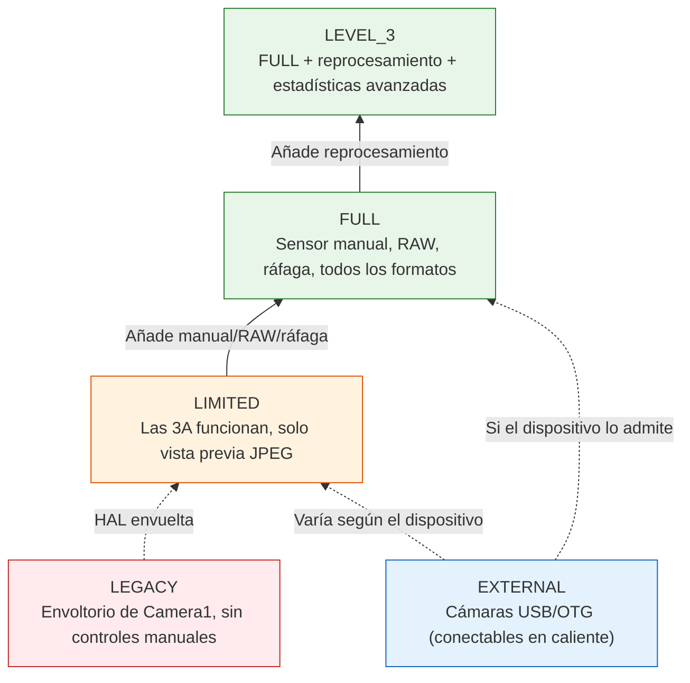
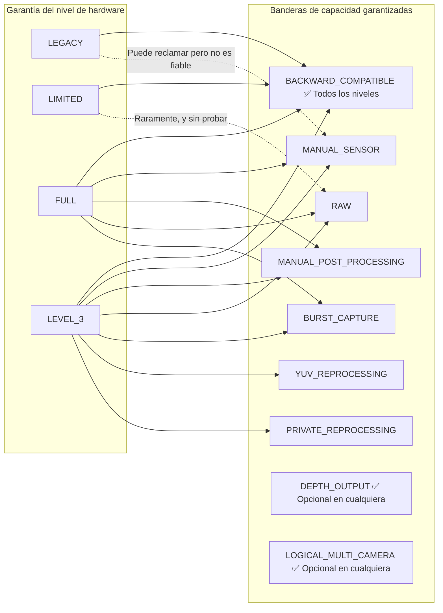
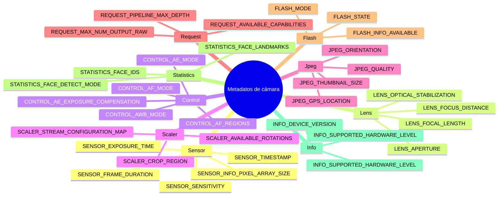

## 12.1 La hoja de especificaciones en su bolsillo

Antes de poder llamar a `openCamera()`, antes de poder construir una `CaptureRequest`, antes de poder configurar una sesión... existe `CameraCharacteristics`. Es la ventana inmutable y que no consume energía a *todo* lo que una cámara puede hacer. Piense en ella como la hoja de especificaciones de la cámara, expuesta como un objeto estructurado que se puede consultar.

`CameraCharacteristics` es su herramienta más importante para escribir aplicaciones que funcionen en los más de 10.000 modelos de dispositivos Android. No puede dar por sentado que el ISO manual funciona. No puede dar por sentado que el RAW está disponible. Ni siquiera puede dar por sentado que la cámara admita la vista previa a 1080p... a menos que se lo pregunte a `CameraCharacteristics`.

En el [Capítulo 6](discovering-cameras.md) tratamos lo básico: orientación de la lente, tamaño del sensor, distancia focal. En esta inmersión profunda iremos mucho más allá:
- Los cinco **niveles de hardware** (LEGACY → LIMITED → FULL → LEVEL_3 → EXTERNAL) y lo que garantiza cada uno.
- Las más de diez **banderas de capacidad** (`MANUAL_SENSOR`, `RAW`, `DEPTH_OUTPUT`, etc.) y qué niveles de hardware las proporcionan.
- Cómo se organizan las claves de metadatos **jerárquicamente** por subsistema (`android.sensor.*`, `android.lens.*`, `android.control.*`, ...).
- Cómo escribir una **consulta de capacidad completa en tiempo de ejecución** con alternativas elegantes.

La aplicación Android Camera Parameters ([GitHub](https://github.com/zoozooll/AndroidCameraParameters), [Play Store](https://play.google.com/store/apps/details?id=com.minininja.cameraparams)) es básicamente un navegador de `CameraCharacteristics` potenciado. Ábrala en cualquier cámara y verá exactamente las claves que discutimos en este capítulo, organizadas por categorías, con etiquetas legibles por humanos y representación de valores en tiempo real.

## 12.2 Qué es realmente CameraCharacteristics

Formalmente, `CameraCharacteristics` es:

- **Inmutable**: una vez obtenido de `CameraManager.getCameraCharacteristics(id)`, el objeto nunca cambia (con una excepción documentada: el `SENSOR_ORIENTATION` de los plegables en la API 32+).
- **Sin consumo**: consultarlo **no** enciende el sensor ni el ISP. Puede llamarlo en el `onCreate()` de su primera Actividad sin impacto en la batería.
- **Por cámara**: cada ID de cámara lógica tiene su propio objeto `CameraCharacteristics`.
- **Tipado y con claves**: el acceso a los datos se realiza mediante `<Key<T>> get(Key<T> key)`, donde cada clave tiene un tipo documentado (Int, Long, Float, Rect, Array, etc.).

Se obtiene uno con una sola llamada:

```kotlin
val cameraManager = getSystemService(CAMERA_SERVICE) as CameraManager
val cameraIdList = cameraManager.cameraIdList  // p. ej. ["0", "1", "2", "3"]

for (id in cameraIdList) {
    val characteristics: CameraCharacteristics = cameraManager.getCameraCharacteristics(id)
    // Consultar todo lo que quiera: ¡sin consumo de energía del sensor!
}
```

En Android 15 (API 35) puede usar `CameraManager.getCameraDeviceSetup(id)` para realizar consultas de configuración de sesión ligeras sin abrir la cámara (consulte el [Capítulo 28](camera2-architecture.md) para obtener detalles sobre `CameraDeviceSetup`).

## 12.3 Nivel de hardware: INFO_SUPPORTED_HARDWARE_LEVEL

La clave de `CameraCharacteristics` más importante es **`INFO_SUPPORTED_HARDWARE_LEVEL`**. Define todo el nivel de la HAL de la cámara y le indica (a grandes rasgos) qué funciones garantizan que funcionen. Hay cinco niveles de hardware:

### Los cinco niveles de hardware

| Nivel | Constante | Dispositivos típicos | Qué significa en la práctica |
|-------|----------|----------------|---------------------------|
| **LEGACY** | `INFO_SUPPORTED_HARDWARE_LEVEL_LEGACY` | Dispositivos económicos anteriores a 2015, chipsets muy antiguos | La API Camera2 es un envoltorio alrededor de la antigua API `android.hardware.Camera`. No hay controles por fotograma, ni ajustes manuales, el RAW es imposible y la ráfaga no es fiable. Trate estos dispositivos como de la "era Camera1 con sintaxis Camera2". |
| **LIMITED** | `INFO_SUPPORTED_HARDWARE_LEVEL_LIMITED` | Teléfonos económicos (Android Go, SoCs de nivel básico como MediaTek Helio, Snapdragon 4xx) | HAL nativa de Camera2 pero solo un subconjunto de funciones. Las 3A (AF/AE/AWB) funcionan. La vista previa + JPEG funcionan. Pero **no** hay control manual del sensor, **ni** RAW, **ni** ráfaga garantizada, **ni** reprocesamiento YUV. Este es el nivel de cámara "funcional básico" de Android. |
| **FULL** | `INFO_SUPPORTED_HARDWARE_LEVEL_FULL` | Teléfonos de gama media y gama alta (Snapdragon 6xx/7xx/8xx, Exynos gama media+, Dimensity 7xxx+) | El nivel de "cámara pro". Garantiza MANUAL_SENSOR, MANUAL_POST_PROCESSING, BURST_CAPTURE, ajustes por fotograma, 30 fps a resolución completa, RAW, todos los formatos de salida y profundidad de tubería predecible. Lo que desea para cualquier aplicación de cámara seria. |
| **LEVEL_3** | `INFO_SUPPORTED_HARDWARE_LEVEL_3` | Insignias de gama alta con ISP avanzado (Snapdragon 8 Gen 1+, Pixel 6+, Exynos 2xxx+) | FULL + extra: reprocesamiento YUV (soporte de flujo de entrada, reprocesamiento sin conexión), reprocesamiento privado, estadísticas avanzadas, JPEG por hardware + RAW a resolución máxima simultáneamente. Requerido para ZSL con salida RAW. |
| **EXTERNAL** | `INFO_SUPPORTED_HARDWARE_LEVEL_EXTERNAL` | Cámaras USB, cámaras web conectadas vía OTG | HAL de cámara externa. Se comporta como LIMITED o FULL dependiendo del dispositivo USB. Advertencia clave: la cámara puede conectarse/desconectarse en cualquier momento, así que escuche `ACTION_CAMERA_DEVICE_STATE_CHANGED`. |



:::important
El nivel de hardware es una **garantía**, no una bandera de "mejor esfuerzo". Si un dispositivo informa FULL, la CTS (Suite de Pruebas de Compatibilidad) de Google ha verificado que todas las funciones de nivel FULL funcionan. Si un dispositivo informa LIMITED, no puede confiar en ninguna función de nivel FULL: aunque funcione en un dispositivo LIMITED específico, fallará en otro.
:::

### Comprobación del nivel de hardware en tiempo de ejecución

```kotlin
val hardwareLevel = characteristics.get(CameraCharacteristics.INFO_SUPPORTED_HARDWARE_LEVEL)

when (hardwareLevel) {
    CameraCharacteristics.INFO_SUPPORTED_HARDWARE_LEVEL_LEGACY -> {
        Log.w("CamCaps", "Hardware LEGACY: manual/RAW desactivado. Recurriendo a JPEG básico.")
        disableManualControls()
        disableRawCapture()
    }
    CameraCharacteristics.INFO_SUPPORTED_HARDWARE_LEVEL_LIMITED -> {
        Log.i("CamCaps", "Hardware LIMITED: solo foto básica + vista previa.")
        disableManualControls()
        disableRawCapture()
        disableBurstCapture()
    }
    CameraCharacteristics.INFO_SUPPORTED_HARDWARE_LEVEL_FULL -> {
        Log.i("CamCaps", "Hardware FULL: habilitando controles manuales, RAW y ráfaga.")
        enableManualControls()
        enableRawCapture()
        enableBurstCapture()
    }
    CameraCharacteristics.INFO_SUPPORTED_HARDWARE_LEVEL_3 -> {
        Log.i("CamCaps", "Hardware LEVEL_3: FULL + reprocesamiento + ZSL + estadísticas avanzadas.")
        enableManualControls()
        enableRawCapture()
        enableBurstCapture()
        enableReprocessing()
        enableZeroShutterLag()
    }
    CameraCharacteristics.INFO_SUPPORTED_HARDWARE_LEVEL_EXTERNAL -> {
        Log.i("CamCaps", "Cámara EXTERNAL: puede ser LIMITED o FULL; registrando escuchador de desconexión.")
        registerHotplugListener()
        // Probar dinámicamente las capacidades en lugar de suponerlas
    }
    else -> {
        Log.w("CamCaps", "Nivel de hardware desconocido $hardwareLevel: suponiendo LIMITED por seguridad.")
        safeDefaultFeatures()
    }
}
```

## 12.4 Capacidades: REQUEST_AVAILABLE_CAPABILITIES

El nivel de hardware es un nivel *general*. Para la detección de funciones detallada, Camera2 expone `REQUEST_AVAILABLE_CAPABILITIES`: un `IntArray` de banderas de capacidad. Cada bandera describe una cosa específica que la cámara puede hacer.

La relación formal entre el nivel de hardware y las capacidades:



### Explicación de las banderas de capacidad

| Constante de bandera | Significado | Garantía del nivel de hardware | Implicación práctica |
|--------------|---------|--------------------------|----------------------|
| `BACKWARD_COMPATIBLE` | La cámara implementa la API básica de Camera2 | **Los 5 niveles** (LEGACY–EXTERNAL) | Si falta, el dispositivo de la cámara es efectivamente no funcional para su aplicación. |
| `MANUAL_SENSOR` | La aplicación puede controlar manualmente `SENSOR_EXPOSURE_TIME`, `SENSOR_SENSITIVITY`, `SENSOR_FRAME_DURATION`, `LENS_FOCUS_DISTANCE`, `LENS_APERTURE` | Garantizado en **FULL** y **LEVEL_3** | Las interfaces de usuario de cámaras manuales y modo pro requieren esto. Sin ello, deben ocultarse todos los controles deslizantes manuales de ISO/exposición. |
| `MANUAL_POST_PROCESSING` | La aplicación puede controlar manualmente las etapas del ISP: reducción de ruido, realce de bordes, curva de tonos, ganancias de corrección de color, transformación de corrección de color | Garantizado en **FULL** y **LEVEL_3** | Necesario para LUT de "estilo película" personalizados, balance de blancos manual mediante ganancias, control de nitidez/desenfoque. |
| `RAW` | El sensor emite datos Bayer RAW a través de `ImageFormat.RAW_SENSOR`, `RAW10` o `RAW12` | Garantizado en **FULL** y **LEVEL_3** | La captura DNG, la tubería de edición de RAW a JPEG y la fotografía computacional comienzan aquí. |
| `PRIVATE_REPROCESSING` | La cámara admite `InputSurface` + reprocesamiento sin conexión de imágenes en formato privado de la HAL en JPEG/YUV | Garantizado en **LEVEL_3**. Raro en FULL. | Permite el Retardo de Obturación Cero (ZSL): fotogramas pasados en búfer circular, reprocesamiento de uno reciente en una foto fija de alta calidad. |
| `YUV_REPROCESSING` | La cámara admite `InputSurface` + reprocesamiento de imágenes YUV_420_888 proporcionadas por la aplicación de vuelta a través del ISP | Garantizado en **LEVEL_3** | Permite tuberías como "aplicar LUT cinematográfico a video grabado" o "reenfocar profundidad de retrato en postproducción". |
| `DEPTH_OUTPUT` | La cámara puede emitir mapas de profundidad (formatos `DEPTH16` / `DEPTH_POINT_CLOUD`) | **Opcional en CUALQUIER** nivel. Compruebe el array explícitamente. | Bokeh en modo retrato, medición de AR, escaneo 3D. A menudo se empareja con `LOGICAL_MULTI_CAMERA` (cámaras físicas duales para profundidad estéreo). |
| `LOGICAL_MULTI_CAMERA` | Esta cámara lógica está respaldada por más de 2 sensores físicos (p. ej. ultra gran angular + gran angular + teleobjetivo) | **Opcional en CUALQUIER** nivel. Normalmente solo insignias. | Permite un zoom óptico perfecto (véase el [Capítulo 20](multi-camera.md)). Puede consultar `LOGICAL_MULTI_CAMERA_PHYSICAL_IDS` para obtener los ID de las cámaras físicas. |
| `BURST_CAPTURE` | `captureBurst()` con más de 1 fotograma funciona a resolución completa sin caídas de fotogramas | Garantizado en **FULL** y **LEVEL_3** | Sin esto, la captura en ráfaga puede dar tirones, perder fotogramas o fallar silenciosamente. El bracketing de exposición / enfoque requieren esto. |
| `CONSTRAINED_HIGH_SPEED_VIDEO` | Admite `createHighSpeedRequestList()` + video de alta velocidad (120 fps, 240 fps) | **Opcional en FULL/LEVEL_3**. Raro en LIMITED. | Grabación en cámara lenta (véase el [Capítulo 19](high-speed-video.md)). |
| `MOTION_TRACKING` | La cámara puede rastrear objetos / caras a una alta velocidad de fotogramas con baja latencia | Opcional (raro). Se encuentra en Pixel y algunos insignias. | Seguimiento de movimiento AR, enfoque automático deportivo. |
| `LOGICAL_MULTI_CAMERA_SYNC` | Varias cámaras físicas en un dispositivo lógico pueden capturar fotogramas sincronizados | Opcional. Requerido para una verdadera captura simultánea de múltiples sensores. | Fotografía computacional que utiliza múltiples lentes a la vez (p. ej. zoom de fusión). |

### Consulta de todas las capacidades en tiempo de ejecución

```kotlin
val capabilities = characteristics.get(
    CameraCharacteristics.REQUEST_AVAILABLE_CAPABILITIES
) ?: intArrayOf()

fun hasCapability(cap: Int): Boolean = capabilities.contains(cap)

val supportsManualSensor = hasCapability(
    CameraCharacteristics.REQUEST_AVAILABLE_CAPABILITIES_MANUAL_SENSOR
)
val supportsRaw = hasCapability(
    CameraCharacteristics.REQUEST_AVAILABLE_CAPABILITIES_RAW
)
val supportsBurst = hasCapability(
    CameraCharacteristics.REQUEST_AVAILABLE_CAPABILITIES_BURST_CAPTURE
)
val supportsDepth = hasCapability(
    CameraCharacteristics.REQUEST_AVAILABLE_CAPABILITIES_DEPTH_OUTPUT
)
val supportsLogicalMultiCam = hasCapability(
    CameraCharacteristics.REQUEST_AVAILABLE_CAPABILITIES_LOGICAL_MULTI_CAMERA
)
val supportsHighSpeed = hasCapability(
    CameraCharacteristics.REQUEST_AVAILABLE_CAPABILITIES_CONSTRAINED_HIGH_SPEED_VIDEO
)
val supportsYuvReprocessing = hasCapability(
    CameraCharacteristics.REQUEST_AVAILABLE_CAPABILITIES_YUV_REPROCESSING
)
val supportsPrivateReprocessing = hasCapability(
    CameraCharacteristics.REQUEST_AVAILABLE_CAPABILITIES_PRIVATE_REPROCESSING
)

// Construir informe legible por humanos
val capabilityReport = buildString {
    appendLine("=== Informe de capacidades de la cámara ===")
    appendLine("BACKWARD_COMPATIBLE:     ${hasCapability(
        CameraCharacteristics.REQUEST_AVAILABLE_CAPABILITIES_BACKWARD_COMPATIBLE
    )}")
    appendLine("MANUAL_SENSOR:           $supportsManualSensor")
    appendLine("MANUAL_POST_PROCESSING:  ${hasCapability(
        CameraCharacteristics.REQUEST_AVAILABLE_CAPABILITIES_MANUAL_POST_PROCESSING
    )}")
    appendLine("RAW:                     $supportsRaw")
    appendLine("BURST_CAPTURE:           $supportsBurst")
    appendLine("YUV_REPROCESSING:        $supportsYuvReprocessing")
    appendLine("PRIVATE_REPROCESSING:    $supportsPrivateReprocessing")
    appendLine("DEPTH_OUTPUT:            $supportsDepth")
    appendLine("LOGICAL_MULTI_CAMERA:    $supportsLogicalMultiCam")
    appendLine("CONSTRAINED_HIGH_SPEED:  $supportsHighSpeed")
}

Log.i("CamCaps", capabilityReport)

// Ahora restrinja las funciones de su interfaz de usuario
manualIsoSlider.isEnabled = supportsManualSensor
manualExposureSlider.isEnabled = supportsManualSensor
rawCaptureToggle.isEnabled = supportsRaw
burstCaptureButton.isEnabled = supportsBurst
depthPortraitMode.isEnabled = supportsDepth
zoomSwitcher.isEnabled = supportsLogicalMultiCam
slowMoButton.isEnabled = supportsHighSpeed
zslMode.isEnabled = supportsPrivateReprocessing  // LEVEL_3
```

:::tip
La aplicación Android Camera Parameters muestra esta misma consulta como casillas de verificación codificadas por colores en la tarjeta **Capabilities** de la vista de resumen de la cámara. Verde = compatible, gris = no compatible. Puede comparar varias cámaras lado a lado para ver cómo difieren las capacidades del ultra gran angular con respecto a la cámara principal.
:::

## 12.5 Organización de los metadatos: el espacio de nombres android.*

Cada clave en `CameraCharacteristics`, `CaptureRequest` y `CaptureResult` sigue una convención de nomenclatura jerárquica: `android.<subsistema>.<parámetro>`. Los componentes separados por puntos agrupan ajustes relacionados por el subsistema de hardware/software que controlan.

### Las clases de los subsistemas

| Prefijo de subsistema | Clase de metadatos Kotlin | Qué cubre |
|-----------------|----------------------|---------------|
| `android.sensor.*` | `CameraCharacteristics.SensorInfo*`, `CaptureRequest.SENSOR_*`, `CaptureResult.SENSOR_*` | Lectura del sensor: tiempo de exposición, sensibilidad ISO, duración del fotograma, marca de tiempo, matriz de píxeles, matriz activa, dirección del obturador electrónico, modos de patrón de prueba. |
| `android.lens.*` | `LensInfo*`, `Lens.*` | Óptica: distancia de enfoque, apertura, distancia focal, estabilización óptica (OIS), densidad del filtro (ND), rango de enfoque, aperturas disponibles. |
| `android.control.*` | `Control*` | Algoritmos 3A: modos / estado / objetivo / regiones de exposición automática (AE), modos / estado / disparador / regiones de enfoque automático (AF), modos / estado / regiones de balance de blancos automático (AWB), antibandas, modos de escena, modos de efecto, estabilización de video (EIS). |
| `android.scaler.*` | `Scaler.*` | Configuración de la tubería de salida: región de recorte (zoom digital), rotación, mapa de configuración de flujo (formatos de salida, tamaños, duraciones), duraciones mínimas de fotograma disponibles. |
| `android.jpeg.*` | `Jpeg*` | Codificación JPEG: calidad, orientación, coordenadas GPS, tamaño de miniatura, calidad de miniatura. |
| `android.request.*` | `Request*` | Capacidades de toda la tubería: array de capacidades disponibles, profundidad máxima de la tubería, número máximo de salidas raw/proc, claves de objetos de metadatos, lista de plantillas disponibles. |
| `android.flash.*` | `FlashInfo*`, `Flash*` | Unidad de flash: disponibilidad, estado de carga, temperatura de color, brillo máximo, modo (apagado / un solo disparo / linterna). |
| `android.statistics.*` | `Statistics*` | Salida de estadísticas del ISP: detección de rostros, ID de rostros, puntos de referencia de rostros, puntuaciones de rostros, histograma, mapa de nitidez, mapa de sombreado de lente, mapa de píxeles calientes. |
| `android.info.*` | `Info*` | Información estática de la cámara: nivel de hardware admitido, versión del dispositivo, nivel de hardware admitido, modos de detección de rostros disponibles, modos de reducción de ruido disponibles. |
| `android.black.*` | `BlackLevel*` | Bloqueo del nivel de negro, patrón del nivel de negro (corrección del ruido de patrón fijo). |
| `android.colorCorrection.*` | `ColorCorrection*` | Tubería de color: matriz de transformación, ganancias de corrección de color (canales R, G, B), modo de corrección de aberraciones. |
| `android.tonemap.*` | `Tonemap*` | Mapeo de tonos: curva tonemap (gamma personalizada), modo tonemap, contraste, saturación. |
| `android.edge.*` | `Edge*` | Realce de bordes / nitidez: modo, fuerza. |
| `android.noiseReduction.*` | `NoiseReduction*` | Reducción de ruido: modo, fuerza, fuerza de NR temporal. |
| `android.shading.*` | `Shading*` | Corrección de sombreado de lente / viñeteado: modo, fuerza. |
| `android.hotPixel.*` | `HotPixel*` | Corrección de píxeles calientes: modo, mapa de píxeles calientes. |
| `android.distortionCorrection.*` | `DistortionCorrection*` | Corrección de la distorsión geométrica de la lente: modo. |
| `android.depth.*` | `Depth*` | Salida de profundidad: la profundidad es exclusiva, máximo de muestras de profundidad, formato de profundidad. |
| `android.logicalMultiCamera.*` | `LogicalMultiCamera*` | Cámara múltiple lógica: ID de cámaras físicas, sincronización de sensores físicos. |



### Una nota sobre la disponibilidad de las claves

No todas las claves existen en todos los dispositivos. Si llama a `get(CLAVE)` para una clave que el dispositivo no admite, obtendrá `null`; de ahí los patrones `?: 0` o `?.let` que verá a lo largo de este libro.

El patrón seguro es: **comprobar si la clave existe antes de leerla**, o usar la seguridad contra nulos de Kotlin para proporcionar un valor predeterminado.

```kotlin
// Acceso seguro con valores predeterminados de reserva
val exposureTimeNs: Long = characteristics.get(
    CameraCharacteristics.SENSOR_INFO_EXPOSURE_TIME_RANGE
)?.upper ?: 1_000_000L  // máximo de 1 ms por defecto si falta la clave

// Procesamiento opcional si la clave existe
characteristics.get(CameraCharacteristics.LENS_INFO_AVAILABLE_APERTURES)?.let { apertures ->
    Log.d("CamCaps", "El dispositivo admite ${apertures.size} aperturas: ${apertures.contentToString()}")
    buildApertureSelector(apertures)
} ?: run {
    Log.d("CamCaps", "No hay apertura variable en este dispositivo")
    hideApertureControl()
}
```

## 12.6 Una consulta de capacidad completa en tiempo de ejecución (grado de producción)

Poniéndolo todo junto, aquí tiene una consulta de capacidad lista para producción que puede soltar en cualquier aplicación de Camera2. Combina el nivel de hardware, las banderas de capacidad y las comprobaciones de claves individuales:

```kotlin
data class CameraCapabilityProfile(
    val cameraId: String,
    val lensFacing: Int,
    val hardwareLevel: Int,
    val hardwareLevelName: String,
    val supportsManualSensor: Boolean,
    val supportsManualPostProcessing: Boolean,
    val supportsRaw: Boolean,
    val supportsBurst: Boolean,
    val supportsDepth: Boolean,
    val supportsLogicalMultiCam: Boolean,
    val supportsHighSpeedVideo: Boolean,
    val supportsYuvReprocessing: Boolean,
    val supportsPrivateReprocessing: Boolean,
    val maxBurstRaw: Int,
    val maxBurstProcessed: Int,
    val pipelineMaxDepth: Int,
    val availableFocalLengths: FloatArray?,
    val availableApertures: FloatArray?,
    val minFocusDistanceDiopters: Float?,
    val maxDigitalZoom: Float?
)

fun buildCapabilityProfile(
    cameraManager: CameraManager,
    cameraId: String
): CameraCapabilityProfile {
    val c = cameraManager.getCameraCharacteristics(cameraId)

    val hwLevel = c.get(CameraCharacteristics.INFO_SUPPORTED_HARDWARE_LEVEL)
        ?: CameraCharacteristics.INFO_SUPPORTED_HARDWARE_LEVEL_LEGACY

    val hwLevelName = when (hwLevel) {
        CameraCharacteristics.INFO_SUPPORTED_HARDWARE_LEVEL_LEGACY -> "LEGACY"
        CameraCharacteristics.INFO_SUPPORTED_HARDWARE_LEVEL_LIMITED -> "LIMITED"
        CameraCharacteristics.INFO_SUPPORTED_HARDWARE_LEVEL_FULL -> "FULL"
        CameraCharacteristics.INFO_SUPPORTED_HARDWARE_LEVEL_3 -> "LEVEL_3"
        CameraCharacteristics.INFO_SUPPORTED_HARDWARE_LEVEL_EXTERNAL -> "EXTERNAL"
        else -> "UNKNOWN($hwLevel)"
    }

    val caps = c.get(CameraCharacteristics.REQUEST_AVAILABLE_CAPABILITIES) ?: intArrayOf()
    fun has(cap: Int) = caps.contains(cap)

    // El nivel de hardware ofrece garantías de capacidad, pero compruebe las banderas por seguridad
    val atLeastFull = hwLevel == CameraCharacteristics.INFO_SUPPORTED_HARDWARE_LEVEL_FULL ||
                      hwLevel == CameraCharacteristics.INFO_SUPPORTED_HARDWARE_LEVEL_3

    return CameraCapabilityProfile(
        cameraId = cameraId,
        lensFacing = c.get(CameraCharacteristics.LENS_FACING)
            ?: CameraCharacteristics.LENS_FACING_BACK,
        hardwareLevel = hwLevel,
        hardwareLevelName = hwLevelName,

        // Usar comprobación de bandera + reserva de garantía del nivel de hardware por seguridad
        supportsManualSensor = has(
            CameraCharacteristics.REQUEST_AVAILABLE_CAPABILITIES_MANUAL_SENSOR
        ) || atLeastFull,
        supportsManualPostProcessing = has(
            CameraCharacteristics.REQUEST_AVAILABLE_CAPABILITIES_MANUAL_POST_PROCESSING
        ) || atLeastFull,
        supportsRaw = has(
            CameraCharacteristics.REQUEST_AVAILABLE_CAPABILITIES_RAW
        ) || atLeastFull,
        supportsBurst = has(
            CameraCharacteristics.REQUEST_AVAILABLE_CAPABILITIES_BURST_CAPTURE
        ) || atLeastFull,
        supportsDepth = has(
            CameraCharacteristics.REQUEST_AVAILABLE_CAPABILITIES_DEPTH_OUTPUT
        ),
        supportsLogicalMultiCam = has(
            CameraCharacteristics.REQUEST_AVAILABLE_CAPABILITIES_LOGICAL_MULTI_CAMERA
        ),
        supportsHighSpeedVideo = has(
            CameraCharacteristics.REQUEST_AVAILABLE_CAPABILITIES_CONSTRAINED_HIGH_SPEED_VIDEO
        ),
        supportsYuvReprocessing = has(
            CameraCharacteristics.REQUEST_AVAILABLE_CAPABILITIES_YUV_REPROCESSING
        ),
        supportsPrivateReprocessing = has(
            CameraCharacteristics.REQUEST_AVAILABLE_CAPABILITIES_PRIVATE_REPROCESSING
        ),

        maxBurstRaw = c.get(CameraCharacteristics.REQUEST_MAX_NUM_OUTPUT_RAW) ?: 1,
        maxBurstProcessed = c.get(CameraCharacteristics.REQUEST_MAX_NUM_OUTPUT_PROC) ?: 1,
        pipelineMaxDepth = c.get(CameraCharacteristics.REQUEST_PIPELINE_MAX_DEPTH) ?: 1,

        availableFocalLengths = c.get(CameraCharacteristics.LENS_INFO_AVAILABLE_FOCAL_LENGTHS),
        availableApertures = c.get(CameraCharacteristics.LENS_INFO_AVAILABLE_APERTURES),
        minFocusDistanceDiopters = c.get(CameraCharacteristics.LENS_INFO_MINIMUM_FOCUS_DISTANCE),
        maxDigitalZoom = c.get(CameraCharacteristics.SCALER_AVAILABLE_MAX_DIGITAL_ZOOM)
    )
}

// Uso:
val profile = buildCapabilityProfile(cameraManager, "0")
Log.d("CamCaps", "Perfil de la cámara 0: ${profile.hardwareLevelName}, " +
    "Manual=${profile.supportsManualSensor}, RAW=${profile.supportsRaw}, " +
    "Burst=${profile.supportsBurst}, Depth=${profile.supportsDepth}, " +
    "Zoom=${profile.maxDigitalZoom}x")
```

## 12.7 Visualización en la aplicación Android Camera Parameters

La aplicación Android Camera Parameters ([GitHub](https://github.com/zoozooll/AndroidCameraParameters), [Play Store](https://play.google.com/store/apps/details?id=com.minininja.cameraparams)) es el complemento ideal para este capítulo. Convierte los pares clave/valor de `CameraCharacteristics` brutos en una interfaz de usuario navegable:

- **Tarjeta de resumen**: nivel de hardware (con insignia codificada por colores: rojo=LEGACY, naranja=LIMITED, verde=FULL, verde azulado=LEVEL_3, azul=EXTERNAL), orientación de la lente, resolución del sensor, distancias focales.
- **Tarjeta de capacidades**: lista de verificación de cada bandera `REQUEST_AVAILABLE_CAPABILITIES`, en verde si está presente.
- **Pestañas de categorías**: organizadas exactamente por los subsistemas `android.*`: Sensor, Lente, Control, Escaler, Jpeg, Flash, Estadísticas, Info, Solicitud.
- **Pestaña de JSON bruto**: el objeto `CameraCharacteristics` serializado completo para copiar/pegar en informes de errores.
- **Modo de comparación**: deslice entre las cámaras (0, 1, 2, 3) para ver cómo difieren los niveles de hardware y las capacidades entre las lentes.

## 12.8 Resumen

| Concepto | Conclusión clave |
|---------|-------------|
| **Nivel de hardware** | 5 niveles: LEGACY (envoltorio) → LIMITED (base) → FULL (pro + manual/RAW) → LEVEL_3 (FULL + reprocesamiento) → EXTERNAL (USB). FULL es el mínimo para cualquier trabajo serio con la cámara. Garantías verificadas por la CTS. |
| **Banderas de capacidad** | Detección de funciones detallada a través de `REQUEST_AVAILABLE_CAPABILITIES`. Banderas clave: `MANUAL_SENSOR`, `MANUAL_POST_PROCESSING`, `RAW`, `BURST_CAPTURE`, `DEPTH_OUTPUT`, `LOGICAL_MULTI_CAMERA`, `PRIVATE_REPROCESSING`, `YUV_REPROCESSING`, `CONSTRAINED_HIGH_SPEED_VIDEO`. |
| **Mapeo Nivel → Capacidad** | FULL garantiza MANUAL_SENSOR, MANUAL_POST_PROCESSING, RAW, BURST. LEVEL_3 añade YUV/PRIVATE_REPROCESSING. DEPTH y LOGICAL_MULTI_CAMERA son opcionales en todos los niveles. |
| **Espacio de nombres de metadatos** | Claves organizadas como `android.<subsistema>.<param>`. Subsistemas principales: sensor, lens, control, scaler, jpeg, request, flash, statistics, info. Cada subsistema tiene info estática (CameraCharacteristics), entradas de solicitud (CaptureRequest) y salidas de resultados (CaptureResult). |
| **Consultas seguras** | Proporcione siempre valores predeterminados de seguridad contra nulos para `get()`: muchas claves son opcionales. Use el nivel de hardware como filtro general, las banderas de capacidad como filtro específico y la presencia de claves individuales para el ajuste por dispositivo. |

## ¿Qué sigue?

Ahora que entiende qué puede hacer una cámara (características) y cómo controlarla (la tubería + tipos de captura), tiene la base completa para la Parte IV.

En el **Capítulo 13: ISO y exposición de la cámara manual**, aprenderá a usar la capacidad `MANUAL_SENSOR` para controlar manualmente `SENSOR_EXPOSURE_TIME` y `SENSOR_SENSITIVITY`, implementando un control deslizante de exposición en modo pro con vista previa en vivo, compensación de exposición y las compensaciones del triángulo de exposición.
