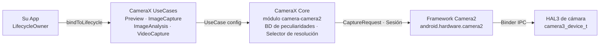
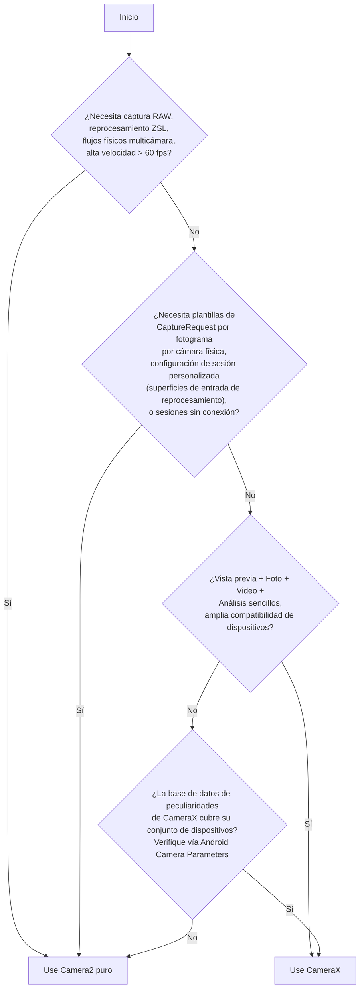

# Capítulo 24: CameraX

## Resumen

Para cuando llegue a este capítulo, ya dominará la API Camera2 pura: abrir instancias de `CameraDevice` a mano, construir objetos `CaptureRequest.Builder`, gestionar los ciclos de vida de `CameraCaptureSession`, hacer malabarismos con tres tipos de retrollamadas diferentes y liberar cuidadosamente cada recurso en cada caso extremo. Se ha ganado sus cicatrices. Ahora damos un paso atrás y nos preguntamos: ¿qué pasaría si el 80% de ese código repetitivo pudiera desaparecer?

CameraX es la biblioteca de Jetpack de Google que envuelve a Camera2 en una API declarativa, impulsada por casos de uso y con detección del ciclo de vida. No reemplaza a Camera2: es Camera2 bajo el capó. Lo que reemplaza son cientos de líneas de código de configuración de sesiones, el manejo de las peculiaridades específicas de cada dispositivo y la contabilidad manual del ciclo de vida. En este capítulo aprenderá la arquitectura de CameraX, entenderá el modelo `UseCase`, verá cómo inyectar parámetros de Camera2 puros *en* CameraX a través de `Camera2Interop` y se marchará con una tabla de decisión para saber exactamente cuándo recurrir a CameraX y cuándo debe bajar a Camera2 puro.

Para seguir el proceso e inspeccionar cada capacidad de cámara en su propio dispositivo antes de decidir a qué capa dirigirse, instale **Android Camera Parameters** desde [Google Play](https://play.google.com/store/apps/details?id=com.minininja.cameraparams) o explore el código fuente en [github.com/zoozooll/AndroidCameraParameters](https://github.com/zoozooll/AndroidCameraParameters).

---

## Arquitectura de CameraX

CameraX se distribuye en cinco artefactos de Jetpack: `camera-core`, `camera-camera2`, `camera-lifecycle`, `camera-view` y `camera-extensions`. La columna vertebral arquitectónica es el modelo `UseCase`: en lugar de pensar en superficies y sesiones, piensa en *qué quiere que haga la cámara*.

### El modelo UseCase

Existen cuatro casos de uso canónicos, y usted vincula cualquier subconjunto de ellos simultáneamente a un ciclo de vida:

| UseCase          | Propósito                                                        |
|------------------|----------------------------------------------------------------|
| `Preview`        | Transmite fotogramas a una `PreviewView` o `Surface`. Análogo a configurar una solicitud repetitiva dirigida a una `SurfaceTexture`. |
| `ImageAnalysis`  | Transmite fotogramas `ImageProxy` a su analizador en un hilo en segundo plano. Reemplaza la creación manual de un `ImageReader` con `YUV_420_888` y la conexión de su escuchador en una solicitud repetitiva. |
| `ImageCapture`   | Captura de fotos de disparo único o ráfaga. Se encarga de la solicitud de captura, la conexión del `ImageReader`, la rotación y el EXIF por usted. |
| `VideoCapture`   | Integrado en CameraX a partir de la versión 1.1; envuelve una tubería de `MediaRecorder` o `ParcelFileDescriptor` con la semántica correcta de pausa/reanudación y enrutamiento de audio. |

Vincular los cuatro es perfectamente legal: CameraX resuelve internamente la combinación de flujos frente a `SCALER_STREAM_CONFIGURATION_MAP` y llama a `isSessionConfigurationSupported` en su nombre, recurriendo a resoluciones más bajas si su combinación exacta no es compatible. Esta es una de las mayores victorias: nunca más pasará tres horas descubriendo que el Samsung de gama media de 2019 de su matriz de pruebas no admite `4:3 PRIV + 16:9 JPEG_MAX` simultáneamente. CameraX simplemente funciona.

### ProcessCameraProvider y detección del ciclo de vida

El punto de vinculación es `ProcessCameraProvider`, un singleton propiedad del proceso de su aplicación. La línea clave es:

```kotlin
val cameraProviderFuture = ProcessCameraProvider.getInstance(context)
cameraProviderFuture.addListener({
    val cameraProvider = cameraProviderFuture.get()
    val camera: Camera = cameraProvider.bindToLifecycle(
        lifecycleOwner,
        cameraSelector,
        preview,
        imageCapture,
        imageAnalysis
    )
}, ContextCompat.getMainExecutor(context))
```

Eso es todo. Sin el infierno de las retrollamadas de `openCamera`, sin `StateCallback`, sin retrollamadas de configuración de sesión, sin desmontaje. Cuando el `lifecycleOwner` (su `Fragment` o `Activity`) llega a `ON_STOP`, CameraX cierra el `CameraDevice`. En `ON_DESTROY`, desmonta la sesión y libera cada superficie. Las fugas de recursos del tipo que cazó en el Capítulo 7 simplemente no pueden ocurrir: el contrato del ciclo de vida las impide.

### CameraX envuelve internamente a Camera2

Internamente, CameraX es Camera2. El artefacto `camera-camera2` contiene `Camera2Camera`, `Camera2CameraCaptureResult` y `Camera2RequestProcessor`, que traducen sus declaraciones de UseCase de alto nivel en las llamadas exactas a `CameraManager.openCamera`, `createCaptureSession` y `setRepeatingRequest` que usted escribió a mano en los 23 capítulos anteriores. Las soluciones para problemas específicos de cada fabricante están codificadas en archivos XML por dispositivo dentro de la biblioteca: la famosa "base de datos de peculiaridades de CameraX" (CameraX quirk database).

La arquitectura completa tiene este aspecto:



Siga las flechas de izquierda a derecha: su aplicación declara *qué* quiere (casos de uso), CameraX resuelve *cómo* obtenerlo (tamaños de superficie, configuración de sesión, peculiaridades) y luego emite las mismas llamadas a Camera2 que usted habría escrito. El valor añadido son los dos cuadros centrales: cientos de miles de líneas de código de compatibilidad de dispositivos escritas por Google que usted no tiene que escribir.

---

## Camera2Interop: Inyectar parámetros de Camera2 en CameraX

CameraX es brillante para el 80% de los casos. Pero usted, querido lector, es un maestro de Camera2. Sabe qué significa `CONTROL_AE_MODE_OFF`. Conoce la diferencia entre `SENSOR_SENSITIVITY` y `CONTROL_AE_EXPOSURE_COMPENSATION`. Cuando la especificación del producto diga "permita al usuario bloquear el ISO en 400 y la exposición en 1/60s incluso cuando use CameraX", no reescribirá toda la función en Camera2 puro. Recurrirá a `Camera2Interop`.

### El patrón Extender

Cada `UseCase.Builder` tiene un `Camera2Interop.Extender` correspondiente. Llámelo *antes* de `build()` para inyectar claves de Camera2 puras, ya sea a nivel de sesión o a nivel de solicitud individual:

| Método                                         | Equivalente en Camera2                           |
|------------------------------------------------|----------------------------------------------|
| `extender.setCaptureRequestOption(clave, valor)` | `CaptureRequest.Builder.set(clave, valor)`     |
| `extender.setSessionOption(clave, valor)`        | Parámetros de inicio de sesión (menos usado) |

El extensor es aditivo: CameraX sigue estableciendo sus propios valores predeterminados para cada clave que usted no anule. Si solo establece `SENSOR_SENSITIVITY`, CameraX seguirá gestionando el AF, el AWB, la rotación y los metadatos.

### Ejemplo del mundo real: ISO y exposición manual en CameraX

Aquí tiene un constructor de `ImageCapture` completo que bloquea la cámara en AE manual con un ISO fijo de 400 y un tiempo de exposición de 1/60 de segundo, y luego toma una foto:

```kotlin
val iso = 400
val exposureTimeNanos = 1_000_000_000L / 60 // 1/60 s

val imageCapture = ImageCapture.Builder()
    .setTargetResolution(Size(4032, 3024))
    .setCaptureMode(ImageCapture.CAPTURE_MODE_MAXIMIZE_QUALITY)
    .apply {
        val interop = Camera2Interop.Extender(this)
        interop.setCaptureRequestOption(
            CaptureRequest.CONTROL_AE_MODE,
            CaptureRequest.CONTROL_AE_MODE_OFF
        )
        interop.setCaptureRequestOption(
            CaptureRequest.CONTROL_AE_LOCK,
            false
        )
        interop.setCaptureRequestOption(
            CaptureRequest.SENSOR_SENSITIVITY,
            iso
        )
        interop.setCaptureRequestOption(
            CaptureRequest.SENSOR_EXPOSURE_TIME,
            exposureTimeNanos
        )
        interop.setCaptureRequestOption(
            CaptureRequest.CONTROL_MODE,
            CaptureRequest.CONTROL_MODE_OFF
        )
    }
    .build()

cameraProvider.bindToLifecycle(
    viewLifecycleOwner,
    CameraSelector.DEFAULT_BACK_CAMERA,
    preview,
    imageCapture
)

// Más tarde, disparar la toma:
imageCapture.takePicture(
    ContextCompat.getMainExecutor(context),
    object : ImageCapture.OnImageCapturedCallback() {
        override fun onCaptureSuccess(imageProxy: ImageProxy) {
            // imageProxy contiene el fotograma expuesto manualmente
            imageProxy.close()
        }

        override fun onError(exception: ImageCaptureException) {
            Log.e(TAG, "Fallo en la captura: ${exception.imageCaptureError}", exception)
        }
    }
)
```

**Advertencia crítica:** establecer `CONTROL_MODE_OFF` desactiva *todo* el 3A. Si solo desea bloquear la exposición pero seguir ejecutando el AF y el AWB, establezca solo `CONTROL_AE_MODE_OFF` (o `CONTROL_AE_LOCK = true`) y deje `CONTROL_MODE` en su valor predeterminado (`CONTROL_MODE_AUTO`). CameraX establece por defecto cada clave que usted no toque.

Y sí, puede hacer lo mismo con `Preview.Builder` e `ImageAnalysis.Builder` para flujos manuales repetitivos. El extensor se aplica a cada solicitud única o repetitiva emitida durante la vida de ese UseCase.

### Lectura de los resultados de Camera2 hacia afuera

Ir en la otra dirección —extraer un `TotalCaptureResult` de una retrollamada de CameraX— es igual de sencillo a través de `Camera2CameraCaptureResult`:

```kotlin
imageCapture.takePicture(
    executor,
    object : ImageCapture.OnImageCapturedCallback() {
        override fun onCaptureSuccess(imageProxy: ImageProxy) {
            val camera2Result = imageProxy.imageInfo
                .cameraCaptureResult as? Camera2CameraCaptureResult
            val totalResult: TotalCaptureResult? = camera2Result?.captureResult
            val actualIso = totalResult?.get(CaptureResult.SENSOR_SENSITIVITY)
            Log.d(TAG, "ISO real en el sensor: $actualIso")
            imageProxy.close()
        }
    }
)
```

Esto le permite verificar que sus parámetros inyectados llegaron realmente al sensor. Use **Android Camera Parameters** para contrastar qué `SENSOR_INFO_SENSITIVITY_RANGE` reclama su dispositivo: si su ISO inyectado cae fuera de ese rango, CameraX lo recorta silenciosamente (o la HAL lo hace), y leer el resultado de vuelta es la única forma de saberlo.

---

## Elegir entre CameraX y Camera2

La pregunta arquitectónica más difícil no es "¿cómo uso CameraX?", sino "¿debería usar CameraX?". Aquí tiene el marco de decisión destilado del trabajo de producción real.

### Diagrama de flujo de decisión



### Tabla de decisión

| Escenario | CameraX | Camera2 puro |
|-----------------------------------------------------------------------|:-------:|:-----------:|
| Vista previa estilo Instagram + foto con un toque + video | ✅ | ⛔ |
| Código QR / código de barras / detección de rostros de ML Kit sin personalización de fotogramas | ✅ | ⛔ |
| Exposición manual con ISO + obturador fijos (Camera2Interop lo cubre) | ✅ | ⚠️ |
| Máquina de estados 3A personalizada que anula los algoritmos del fabricante | ⛔ | ✅ |
| Fotografía profesional `RAW_SENSOR` / `RAW_PRIVATE` / DNG | ⛔ | ✅ |
| Retardo de Obturación Cero (Capítulo 23) con superficies de entrada de reprocesamiento | ⛔ | ✅ |
| Acceso a flujos físicos de cámara múltiple lógica (Capítulo 20) | ⛔ | ✅ |
| Alta velocidad 120/240 fps con sesiones de alta velocidad restringidas | ⛔ | ✅ |
| Extensiones de cámara (Noche / Bokeh / HDR) a través de las extensiones del fabricante | ✅ | ✅ |
| Cámara de visión trasera de automóvil con migración EVS al inicio rápido | ⛔ | ✅ (NDK) |
| La compatibilidad entre dispositivos es el requisito no funcional n.º 1 | ✅ | ⚠️ |

El término medio (⚠️) es donde el juicio importa. El control manual de la exposición a través de `Camera2Interop` funciona de forma fiable en los dispositivos `HARDWARE_LEVEL_FULL` pero falla silenciosamente en los dispositivos `LEGACY` porque las HAL `LEGACY` ignoran por completo `CONTROL_MODE_OFF`. Ejecute **Android Camera Parameters** en su flota de pruebas, compruebe el `INFO_SUPPORTED_HARDWARE_LEVEL` para cada dispositivo y, si el 20% de su flota es `LEGACY`, baje a Camera2 puro con una ruta de reserva o acepte que los controles manuales no harán nada en esos dispositivos.

### Configuración básica de vista previa + ImageCapture con CameraX (Completa)

Como referencia, aquí tiene la configuración completa y mínima que sustituye a unas 300 líneas del código Camera2 puro que escribió en los Capítulos 6–9.

```kotlin
class CameraXFragment : Fragment() {

    private lateinit var viewBinding: FragmentCameraXBinding
    private lateinit var imageCapture: ImageCapture

    override fun onViewCreated(view: View, savedInstanceState: Bundle?) {
        super.onViewCreated(view, savedInstanceState)
        viewBinding = FragmentCameraXBinding.bind(view)

        val cameraProviderFuture = ProcessCameraProvider.getInstance(requireContext())
        cameraProviderFuture.addListener({
            val cameraProvider = cameraProviderFuture.get()
            bindCameraUseCases(cameraProvider)
        }, ContextCompat.getMainExecutor(requireContext()))
    }

    private fun bindCameraUseCases(cameraProvider: ProcessCameraProvider) {
        val preview = Preview.Builder().build().also {
            it.setSurfaceProvider(viewBinding.previewView.surfaceProvider)
        }

        imageCapture = ImageCapture.Builder()
            .setCaptureMode(ImageCapture.CAPTURE_MODE_MINIMIZE_LATENCY)
            .setTargetRotation(viewBinding.previewView.display.rotation)
            .build()

        val cameraSelector = CameraSelector.Builder()
            .requireLensFacing(CameraSelector.LENS_FACING_BACK)
            .build()

        cameraProvider.unbindAll()
        try {
            cameraProvider.bindToLifecycle(
                viewLifecycleOwner,
                cameraSelector,
                preview,
                imageCapture
            )
        } catch (exc: Exception) {
            Log.e(TAG, "Fallo en la vinculación de UseCase", exc)
        }
    }

    private fun takePhoto() {
        val photoFile = File(
            outputDirectory,
            "FOTO_${System.currentTimeMillis()}.jpg"
        )
        val outputOptions = ImageCapture.OutputFileOptions
            .Builder(photoFile)
            .build()

        imageCapture.takePicture(
            outputOptions,
            ContextCompat.getMainExecutor(requireContext()),
            object : ImageCapture.OnImageSavedCallback {
                override fun onImageSaved(output: ImageCapture.OutputFileResults) {
                    val savedUri = Uri.fromFile(photoFile)
                    Toast.makeText(requireContext(),
                        "Guardado: $savedUri", Toast.LENGTH_SHORT).show()
                }
                override fun onError(exc: ImageCaptureException) {
                    Log.e(TAG, "Error en la captura de la foto: ${exc.message}", exc)
                }
            }
        )
    }

    companion object {
        private const val TAG = "CameraXFragment"
    }
}
```

Esa es toda la tubería de vista previa + foto. Tenga en cuenta la ausencia total de `HandlerThread`, `CameraDevice.StateCallback`, `CameraCaptureSession.StateCallback`, `ImageReader.OnImageAvailableListener` o llamadas manuales a `close()`. CameraX se encarga de todo.

---

## Resumen

CameraX es Camera2 con una fachada declarativa, impulsada por casos de uso y con detección del ciclo de vida, respaldada por la base de datos de peculiaridades de Google para múltiples dispositivos. La arquitectura apila su app → UseCases → CameraX Core → Camera2 → HAL, y la llamada a `ProcessCameraProvider.bindToLifecycle()` sustituye a cientos de líneas de configuración manual. Para el 20% de los parámetros que CameraX no expone a nivel de UseCase, `Camera2Interop.Extender` inyecta claves `CaptureRequest` puras y lee valores `TotalCaptureResult` puros de vuelta. La decisión de cuándo usarlo es sencilla: CameraX es la opción por defecto a menos que su función requiera explícitamente RAW, ZSL, flujos físicos de cámara múltiple, video de alta velocidad o una topología de sesión personalizada que el resolutor de CameraX no pueda expresar.

## ¿Qué sigue?

CameraX sigue siendo código Dalvik/ART de Java/Kotlin que se sitúa por encima del límite de Binder. ¿Qué pasa si incluso esa sobrecarga es excesiva para el presupuesto de 16 ms por fotograma de su motor de AR? En el Capítulo 25 cruzamos por completo la línea del JNI y abrimos la cámara directamente desde C++ usando la pila nativa del NDK, vinculando los fotogramas como texturas de Vulkan con cero copias.
