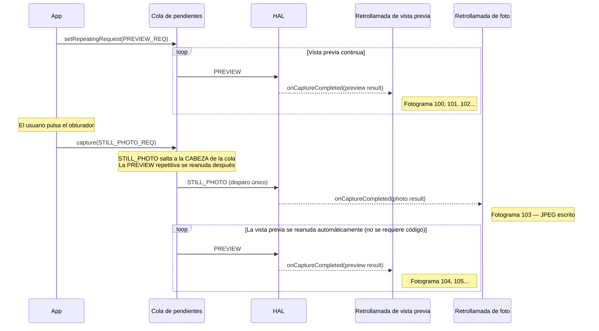
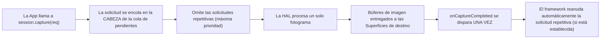
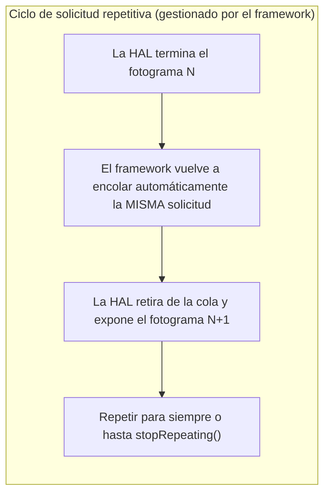
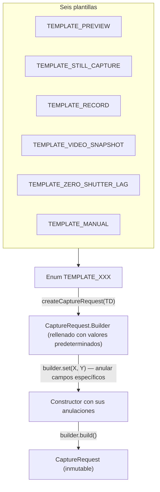

## 11.1 Tres formas de alimentar la tubería

En el [Capítulo 10](the-camera2-pipeline.md) vio cómo viajan las solicitudes a través de la tubería de Camera2: desde la cola de pendientes a la cola en vuelo, a la HAL, y finalmente a sus superficies de retrollamada y salida. Pero *cómo envía* esas solicitudes importa enormemente. Camera2 le ofrece tres mecanismos de envío, cada uno con un comportamiento fundamentalmente diferente:

1. **Disparo único** (`capture()`): ejecuta una sola solicitud una vez.
2. **Ráfaga** (`captureBurst()`): ejecuta una lista de solicitudes de forma contigua, una tras otra.
3. **Repetitiva** (`setRepeatingRequest()`): ejecuta la misma solicitud continuamente para siempre (o hasta que se interrumpa).

Además de esos tres modos de envío, el framework proporciona seis **plantillas de captura** que rellenan previamente un `CaptureRequest.Builder` con valores predeterminados sensatos para casos de uso comunes (vista previa, captura de fotos, grabación de video, retardo de obturación cero, control manual, etc.).

Al final de este capítulo sabrá exactamente cuándo usar cada tipo de captura y plantilla, incluyendo por qué la vista previa siempre usa solicitudes repetitivas, por qué la ráfaga es la única forma de hacer bracketing de exposición y por qué las fotos fijas usan el disparo único incluso cuando se está ejecutando una vista previa.

La aplicación Android Camera Parameters ([GitHub](https://github.com/zoozooll/AndroidCameraParameters), [Play Store](https://play.google.com/store/apps/details?id=com.minininja.cameraparams)) demuestra los tres tipos de captura en su pestaña **Capture Demo**. Cambie entre los modos "Preview (Repeating)", "Single Photo (One-Shot)" y "Burst (3 Frames)" para ver el comportamiento de las retrollamadas y las diferencias de temporización en vivo en su dispositivo.

## 11.2 Disparo único: capture()

El modo de envío más sencillo es la **captura de disparo único** a través de `CameraCaptureSession.capture()`. Hace exactamente lo que dice: envía una única `CaptureRequest` a la tubería, la ejecuta exactamente una vez y termina.

```kotlin
// Disparo único: captura un solo fotograma estático en el ImageReader JPEG
fun captureStillPhoto() {
    val builder = cameraDevice.createCaptureRequest(CameraDevice.TEMPLATE_STILL_CAPTURE)
    builder.addTarget(jpegReader.surface)
    builder.set(CaptureRequest.JPEG_QUALITY, 100)
    builder.set(CaptureRequest.CONTROL_AF_MODE, CaptureRequest.CONTROL_AF_MODE_CONTINUOUS_PICTURE)
    builder.set(CaptureRequest.CONTROL_AE_MODE, CaptureRequest.CONTROL_AE_MODE_ON)

    val request = builder.build()

    captureSession.capture(request, object : CameraCaptureSession.CaptureCallback() {
        override fun onCaptureCompleted(
            session: CameraCaptureSession,
            request: CaptureRequest,
            result: TotalCaptureResult
        ) {
            super.onCaptureCompleted(session, request, result)
            Log.d("Capture", "Foto de disparo único realizada. Fotograma #${result.frameNumber}")
        }
    }, backgroundHandler)
}
```

### Cuándo usar el disparo único

| Caso de uso | ¿Por qué disparo único? |
|----------|--------------|
| Una sola fotografía estática | Se ejecuta exactamente una vez por cada clic del obturador |
| Disparador único de AF/AE | Lanza `CONTROL_AF_TRIGGER_START` para un evento de tocar para enfocar |
| Instantánea durante video | Captura un fotograma de alta resolución mientras una solicitud de video repetitiva está activa |
| Captura de un solo fotograma RAW | Captura dual RAW + JPEG para una foto |

### Cómo interactúa el disparo único con la vista previa repetitiva

Un patrón de diseño crítico en Camera2 es: **la vista previa se ejecuta como una solicitud repetitiva, y las fotos fijas se inyectan como solicitudes de disparo único**. El disparo único salta por delante de la solicitud repetitiva en la cola de pendientes (como discutimos en el modelo de colas del Capítulo 10), por lo que se ejecuta de inmediato. Una vez que se completa el disparo único, el framework reanuda automáticamente la solicitud de vista previa repetitiva; no es necesario volver a enviarla.



:::tip
Este comportamiento de reanudación automática está integrado en el framework de Camera2. Nunca necesita "reiniciar la vista previa" manualmente después de una captura de disparo único; el framework vuelve a encolar la solicitud repetitiva por usted.
:::

### Flujo de ejecución del disparo único



## 11.3 Ráfaga: captureBurst()

Mientras que `capture()` envía una solicitud, `captureBurst()` envía una **`List<CaptureRequest>`** y garantiza que todos los N fotogramas de la lista se ejecuten **de forma contigua y en orden, sin fotogramas intercalados de otras fuentes (incluida la solicitud repetitiva)**.

Esta garantía atómica y sin huecos es lo que hace que la captura en ráfaga sea esencial para:

- **Bracketing de exposición**: captura de 3 a 5 fotogramas a ±1EV, ±2EV, para luego fusionarlos en HDR.
- **Bracketing de enfoque**: barrido de distancias de enfoque para luego apilarlas y obtener efectos de profundidad de campo.
- **Captura de acción / movimiento**: toma de 10 a 30 fotogramas de un sujeto que se mueve rápido para luego elegir el más nítido.
- **Video en cámara lenta (alta velocidad)**: `createHighSpeedRequestList()` + ráfaga de alta velocidad restringida.
- **Muestreo de convergencia 3A**: disparo de AF/AE y luego ráfaga hasta que converjan.

```kotlin
// Ráfaga: bracketing de exposición de 3 fotogramas (-2EV, 0EV, +2EV)
fun captureExposureBracket() {
    val baseIso = 100
    val baseExposure = 10_000_000L  // 10ms = línea base "0EV"

    val burstList: MutableList<CaptureRequest> = mutableListOf()

    // Fotograma 0: -2EV (exposición 4 veces más corta = más oscuro)
    burstList += cameraDevice.createCaptureRequest(CameraDevice.TEMPLATE_STILL_CAPTURE).apply {
        addTarget(jpegReader.surface)
        set(CaptureRequest.SENSOR_SENSITIVITY, baseIso)
        set(CaptureRequest.SENSOR_EXPOSURE_TIME, baseExposure / 4)
        set(CaptureRequest.CONTROL_AE_MODE, CaptureRequest.CONTROL_AE_MODE_OFF)
    }.build()

    // Fotograma 1: 0EV (exposición correcta)
    burstList += cameraDevice.createCaptureRequest(CameraDevice.TEMPLATE_STILL_CAPTURE).apply {
        addTarget(jpegReader.surface)
        set(CaptureRequest.SENSOR_SENSITIVITY, baseIso)
        set(CaptureRequest.SENSOR_EXPOSURE_TIME, baseExposure)
        set(CaptureRequest.CONTROL_AE_MODE, CaptureRequest.CONTROL_AE_MODE_OFF)
    }.build()

    // Fotograma 2: +2EV (exposición 4 veces más larga = más brillante)
    burstList += cameraDevice.createCaptureRequest(CameraDevice.TEMPLATE_STILL_CAPTURE).apply {
        addTarget(jpegReader.surface)
        set(CaptureRequest.SENSOR_SENSITIVITY, baseIso)
        set(CaptureRequest.SENSOR_EXPOSURE_TIME, baseExposure * 4)
        set(CaptureRequest.CONTROL_AE_MODE, CaptureRequest.CONTROL_AE_MODE_OFF)
    }.build()

    captureSession.captureBurst(burstList, object : CameraCaptureSession.CaptureCallback() {
        private var completedCount = 0

        override fun onCaptureCompleted(
            session: CameraCaptureSession,
            request: CaptureRequest,
            result: TotalCaptureResult
        ) {
            super.onCaptureCompleted(session, request, result)
            completedCount++
            Log.d("Burst", "Fotograma de ráfaga $completedCount/${burstList.size} terminado. Fotograma #${result.frameNumber}")

            if (completedCount == burstList.size) {
                Log.d("Burst", "¡Capturados los ${burstList.size} fotogramas de bracketing!")
                // TODO: Fusionar HDR, apilar enfoque o dejar que el usuario elija el mejor fotograma
            }
        }
    }, backgroundHandler)
}
```

### La garantía de contigüidad en acción

La propiedad clave de la ráfaga es que **toda la lista se encola atómicamente**: incluso si hay un `setRepeatingRequest()` activo, los N fotogramas de la ráfaga se ejecutarán consecutivamente antes de que se reanude la solicitud repetitiva. La solicitud repetitiva no se intercala entre los fotogramas de la ráfaga.

```mermaid
flowchart TB
    subgraph QueueBefore ["Antes de enviar la ráfaga"]
        direction LR
        R1["PREVIEW (repetitiva)"] --> R2["PREVIEW (repetitiva)"] --> R3["PREVIEW (repetitiva)"]
    end

    subgraph Arrow ["La app llama a captureBurst([B1,B2,B3])"]
        style Arrow fill:#fff3e0
    end

    subgraph QueueAfter ["Después de enviar la ráfaga (encolado atómico)"]
        direction LR
        B1["FOTOGRAMA RÁFUGA 1"] --> B2["FOTOGRAMA RÁFUGA 2"] --> B3["FOTOGRAMA RÁFUGA 3"] --> R4["Se reanuda PREVIEW (repetitiva)"] --> R5["PREVIEW"]
    end

    QueueBefore --> Arrow --> QueueAfter

    Note over B1,B3: ¡No se cuelan fotogramas de vista previa entre medias!
```

### Límites del tamaño de la ráfaga

El tamaño máximo de ráfaga que puede enviar en una sola llamada a `captureBurst()` viene determinado por:
- `CameraCharacteristics.REQUEST_MAX_NUM_OUTPUT_RAW`: para salidas RAW.
- `CameraCharacteristics.REQUEST_MAX_NUM_OUTPUT_PROC`: para salidas procesadas (YUV/JPEG).
- El ancho de banda real del hardware (las ráfagas 4K serán más cortas que las de 1080p).

Para los dispositivos FULL típicos, las ráfagas de JPEG procesado de 10 a 50 fotogramas funcionan bien. Las ráfagas RAW pueden estar limitadas a 5-10 fotogramas dependiendo del sensor y la memoria.

### Ráfaga de alta velocidad para cámara lenta

Para video en cámara lenta, Camera2 proporciona `CameraDevice.createHighSpeedRequestList()`, que convierte una `CaptureRequest` normal en una lista de solicitudes de ráfaga adecuadas para video de alta velocidad y captura restringida (por ejemplo, 120 fps o 240 fps). Esto se combina con `CameraCaptureSession.captureBurst()` y requiere la capacidad `CONSTRAINED_HIGH_SPEED_VIDEO`:

```kotlin
// Ráfaga: cámara lenta de alta velocidad (120 fps)
fun captureHighSpeedSlowMo() {
    val capabilities = characteristics.get(CameraCharacteristics.REQUEST_AVAILABLE_CAPABILITIES)
    val supportsHighSpeed = capabilities?.contains(
        CameraCharacteristics.REQUEST_AVAILABLE_CAPABILITIES_CONSTRAINED_HIGH_SPEED_VIDEO
    ) ?: false

    if (!supportsHighSpeed) {
        Log.w("HighSpeed", "El dispositivo no admite video de alta velocidad restringido")
        return
    }

    // Construir una única solicitud base (dirigida a la superficie del MediaRecorder)
    val baseBuilder = cameraDevice.createCaptureRequest(CameraDevice.TEMPLATE_RECORD)
    baseBuilder.addTarget(mediaRecorderSurface)
    val baseRequest = baseBuilder.build()

    // Expandir en una lista de ráfaga de alta velocidad: el framework optimiza para 120 fps
    val highSpeedBurst = cameraDevice.createHighSpeedRequestList(listOf(baseRequest))

    // Enviar la lista de ráfaga optimizada a través de captureBurst
    captureSession.captureBurst(highSpeedBurst, highSpeedCallback, backgroundHandler)
}
```

## 11.4 Repetitiva: setRepeatingRequest()

El caballo de batalla de Camera2 es la **solicitud repetitiva**, enviada a través de `CameraCaptureSession.setRepeatingRequest()`. En lugar de ejecutarse una vez, el framework vuelve a encolar *la misma solicitud* después de cada fotograma, para siempre, produciendo un flujo continuo de fotogramas a la velocidad nativa del hardware.

```kotlin
// Repetitiva: Iniciar vista previa de la cámara (flujo continuo de 30 fps)
fun startPreview() {
    val builder = cameraDevice.createCaptureRequest(CameraDevice.TEMPLATE_PREVIEW)
    builder.addTarget(previewSurface)
    builder.set(CaptureRequest.CONTROL_AF_MODE, CaptureRequest.CONTROL_AF_MODE_CONTINUOUS_PICTURE)
    builder.set(CaptureRequest.CONTROL_AE_MODE, CaptureRequest.CONTROL_AE_MODE_ON)
    builder.set(CaptureRequest.CONTROL_AWB_MODE, CaptureRequest.CONTROL_AWB_MODE_AUTO)

    val repeatingRequest = builder.build()

    captureSession.setRepeatingRequest(
        repeatingRequest,
        object : CameraCaptureSession.CaptureCallback() {
            private var frameCount = 0
            private var lastFpsLogMs = 0L

            override fun onCaptureCompleted(
                session: CameraCaptureSession,
                request: CaptureRequest,
                result: TotalCaptureResult
            ) {
                super.onCaptureCompleted(session, request, result)
                frameCount++
                val now = System.currentTimeMillis()
                if (now - lastFpsLogMs > 1000) {
                    Log.d("Preview", "FPS de vista previa: $frameCount")
                    frameCount = 0
                    lastFpsLogMs = now
                }
            }
        },
        backgroundHandler
    )
}
```

### Por qué la vista previa *debe* usar solicitudes repetitivas

Si intentara implementar una vista previa de 30 fps usando `capture()` llamado 30 veces por segundo desde un temporizador:
1. Desperdiciaría CPU volviendo a enviar solicitudes idénticas cada 33 ms.
2. Acumularía desfases si su temporizador se retrasa.
3. Tendría huecos entre fotogramas si las retrollamadas de disparo único se bloquean.
4. Lucharía con la gestión de colas del framework.

La solicitud repetitiva se gestiona íntegramente dentro del framework/HAL. Después de que se completa cada fotograma, la HAL programa automáticamente la siguiente exposición, sin intervención del hilo de la aplicación. Esto produce una vista previa fluida y sin huecos con cero sobrecarga de CPU para la aplicación.



### Detener solicitudes repetitivas

Para detener el flujo repetitivo, llame a `stopRepeating()`. Esto elimina la solicitud repetitiva de la cola pero no vacía los fotogramas que ya están en vuelo. Llame a `abortCaptures()` para vaciarlo todo a la fuerza (y disparar `onCaptureFailed` con `REASON_FLUSHED` para los fotogramas en vuelo).

```kotlin
// Pausar temporalmente la vista previa
fun pausePreview() {
    captureSession.stopRepeating()
    Log.d("Preview", "Repetición detenida. Los fotogramas en vuelo aún se completarán.")
}

// Parada de emergencia: soltar todo ahora mismo
fun emergencyStopAllCaptures() {
    captureSession.stopRepeating()
    captureSession.abortCaptures()
    // Todos los fotogramas en vuelo fallarán con REASON_FLUSHED
}
```

### Las solicitudes repetitivas también son para la grabación de video

Además de la vista previa, las solicitudes repetitivas se usan para la **grabación de video** (dirigidas a una `Surface` de `MediaRecorder` o `MediaCodec`) y para el **análisis continuo de imágenes** (dirigidas a un `ImageReader` YUV de baja resolución para detección de rostros, inferencia de ML, etc.).

El patrón es siempre el mismo: establecerlo una vez, dejar que fluya y actualizar los parámetros de la solicitud cuando desee cambiar los ajustes (por ejemplo, cambiar el zoom digital a mitad del flujo actualizando la región de recorte en una nueva solicitud repetitiva).

```kotlin
// Repetitiva: Actualizar el nivel de zoom en vivo durante la vista previa/video
fun updateDigitalZoom(cropRegion: Rect) {
    val builder = cameraDevice.createCaptureRequest(CameraDevice.TEMPLATE_PREVIEW)
    builder.addTarget(previewSurface)
    builder.addTarget(mediaRecorderSurface)
    builder.set(CaptureRequest.SCALER_CROP_REGION, cropRegion)
    builder.set(CaptureRequest.CONTROL_AF_MODE, CaptureRequest.CONTROL_AF_MODE_CONTINUOUS_PICTURE)

    // Reemplazar la antigua solicitud repetitiva por una nueva (mismos destinos, nuevo recorte)
    captureSession.setRepeatingRequest(builder.build(), currentCallback, backgroundHandler)
    Log.d("Zoom", "Solicitud repetitiva actualizada con recorte ${cropRegion.width()}x${cropRegion.height()}")
}
```

## 11.5 Plantillas de captura

Cada `CaptureRequest.Builder` comienza a partir de una **plantilla**: usted llama a `cameraDevice.createCaptureRequest(TEMPLATE_XXX)` y el framework rellena el constructor con valores predeterminados optimizados por hardware para ese caso de uso. Luego, usted solo anula los ajustes específicos que necesite.

Las plantillas existen porque la tubería de la cámara de un teléfono tiene docenas de controles (fuerza de reducción de ruido, realce de bordes, curva de tonos, modo antibandas, rango de velocidad de fotogramas...). Las plantillas establecen líneas base sensatas para que no tenga que configurar cada una desde cero.



### Las seis plantillas, qué preconfiguran y cuándo usarlas

| Plantilla | Caso de uso | Ajustes clave preconfigurados |
|----------|----------|---------------------------|
| `TEMPLATE_PREVIEW` | Visor en vivo / vista previa | Prioridad de baja latencia, 3A (AF/AE/AWB) en auto continuo, reducción de ruido/enfoque modestos, alta velocidad de fotogramas (30 fps). Sacrifica un poco de calidad por fluidez. |
| `TEMPLATE_STILL_CAPTURE` | Foto de disparo único | Prioridad de máxima calidad, AF en modo foto, reducción de ruido/enfoque completos, codificación JPEG de alta calidad, puede reducir la velocidad de fotogramas para mejorar la calidad de ese fotograma. |
| `TEMPLATE_RECORD` | Grabación de video | Velocidad de fotogramas estable (coincide con la salida del MediaRecorder), AF continuo, marcas de tiempo de sincronización audio-video, antibandas habilitado, reducción de ruido media: ajustado para movimiento + compresión. |
| `TEMPLATE_VIDEO_SNAPSHOT` | Foto de alta resolución *durante* la grabación de video | Como STILL_CAPTURE pero preserva los ajustes de los fotogramas de video: toma una foto de alta resolución sin detener el flujo de grabación de video. |
| `TEMPLATE_ZERO_SHUTTER_LAG` | Captura de fotos ZSL (Capítulo 14) | Construye un búfer circular de fotogramas recientes. Cuando se pulsa el obturador, se devuelve un fotograma *pasado* para que no haya fundido a negro. Requiere capacidad de ráfaga y reprocesamiento privado. |
| `TEMPLATE_MANUAL` | Controles manuales / pro | Todos los modos 3A desactivados (OFF) por defecto para que pueda establecer manualmente la exposición del sensor, el ISO, el enfoque de la lente y las ganancias de corrección de color sin interferencias. Base para una interfaz de cámara profesional. |

```kotlin
// Ejemplos de plantillas: vea qué sucede cuando comienza con cada una

// TEMPLATE_PREVIEW: fluido, baja latencia
val previewBuilder = cameraDevice.createCaptureRequest(CameraDevice.TEMPLATE_PREVIEW)
val previewRequest = previewBuilder.build()
Log.d("Template", "PREVIEW AF_MODE = ${previewRequest.get(CaptureRequest.CONTROL_AF_MODE)}")
// ^ Típicamente CONTROL_AF_MODE_CONTINUOUS_PICTURE (enfocando siempre)

// TEMPLATE_STILL_CAPTURE: máxima calidad por fotograma
val stillBuilder = cameraDevice.createCaptureRequest(CameraDevice.TEMPLATE_STILL_CAPTURE)
val stillRequest = stillBuilder.build()
Log.d("Template", "STILL_CAPTURE JPEG_QUALITY = ${stillRequest.get(CaptureRequest.JPEG_QUALITY)}")
// ^ Típicamente 100 (codificación de máxima calidad)

// TEMPLATE_MANUAL: todos los controles automáticos desactivados
val manualBuilder = cameraDevice.createCaptureRequest(CameraDevice.TEMPLATE_MANUAL)
val manualRequest = manualBuilder.build()
Log.d("Template", "MANUAL AE_MODE = ${manualRequest.get(CaptureRequest.CONTROL_AE_MODE)}")
Log.d("Template", "MANUAL AF_MODE = ${manualRequest.get(CaptureRequest.CONTROL_AF_MODE)}")
Log.d("Template", "MANUAL AWB_MODE = ${manualRequest.get(CaptureRequest.CONTROL_AWB_MODE)}")
// ^ Típicamente AE_MODE_OFF, AF_MODE_OFF, AWB_MODE_OFF: manual desde el principio
```

:::tip
Comience siempre con una plantilla y anule campos específicos. Empezar desde `TEMPLATE_PREVIEW` y luego anular 2 o 3 ajustes (por ejemplo, la región de recorte para el zoom, el sesgo del objetivo de AE para la compensación de exposición) es infinitamente menos propenso a errores que crear una solicitud desde una plantilla vacía (lo cual ni siquiera es posible: cada `createCaptureRequest` requiere una plantilla).
:::

## 11.6 Comparación de los tres tipos de captura

| Dimensión | Disparo único `capture()` | Ráfaga `captureBurst()` | Repetitiva `setRepeatingRequest()` |
|-----------|---------------------|----------------------|---------------------------------|
| **Ejecución** | Una sola solicitud se ejecuta una vez | Una lista de N solicitudes se ejecuta de forma contigua | La misma solicitud se ejecuta en cada fotograma (reencolado automático) |
| **Prioridad** | Máxima: salta a la CABEZA de la cola de pendientes | Alta: los N fotogramas se insertan atómicamente a la CABEZA | Mínima: el disparo único/ráfaga se cuelan delante y la repetición se reanuda después |
| **Interrupción** | Interrumpe la repetición; la repetición se reanuda después | Interrumpe la repetición; la ráfaga completa termina antes de que la repetición se reanude | Interrumpida por cualquier disparo único o ráfaga; se reanuda automáticamente después |
| **Comportamiento de la cola** | Se encola una sola solicitud | Se encolan N solicitudes de forma contigua (sin huecos) | Una solicitud conceptual se vuelve a encolar en cada ciclo |
| **Usos típicos** | Foto única, disparador de AF único, foto con flash | Bracketing de exposición, apilamiento de enfoque, ráfaga de acción, cámara lenta, HDR | Vista previa, grabación de video, análisis de ML continuo, detección de rostros en vivo |
| **Retrollamada de resultado** | `onCaptureCompleted` se dispara exactamente una vez | `onCaptureCompleted` se dispara N veces (una por cada fotograma de la ráfaga) | `onCaptureCompleted` se dispara continuamente para cada fotograma (30-60 veces/seg) |

```mermaid
quadrantChart
    title Patrones de uso de los tipos de captura
    x-axis ["Bajo recuento de fotogramas", "Alto recuento de fotogramas"]
    y-axis ["Configuración única", "Configuración variable por fotograma"]
    quadrant-1 ["Ráfaga: Bracketing de exposición / enfoque"]
    quadrant-2 ["Ráfaga: Cámara lenta de alta velocidad"]
    quadrant-3 ["Disparo único: Foto estática"]
    quadrant-4 ["Repetitiva: Vista previa + Video"]
    "Captura JPEG única": [0.15, 0.2]
    "Disparador de tocar para enfocar": [0.1, 0.15]
    "Bracketing HDR de 3 fotogramas": [0.4, 0.75]
    "Apilamiento de enfoque de 7 fotogramas": [0.45, 0.8]
    "Cámara lenta 120 fps 2 seg": [0.85, 0.25]
    "Vista previa CameraFinder 30 fps": [0.9, 0.1]
    "Grabación de video 4K": [0.88, 0.18]
```

## 11.7 Viendo los tipos de captura en la aplicación Android Camera Parameters

Abra la aplicación Android Camera Parameters ([GitHub](https://github.com/zoozooll/AndroidCameraParameters), [Play Store](https://play.google.com/store/apps/details?id=com.minininja.cameraparams)) y vaya a la pestaña **Capture Demo**. La aplicación expone los tres tipos de captura lado a lado:

- Toque **Start Preview** para llamar a `setRepeatingRequest(TEMPLATE_PREVIEW)` y ver un registro de `CaptureCallback` en vivo (fotogramas 1, 2, 3... desplazándose cada ~33 ms).
- Toque **Take Photo** para inyectar un disparo único `capture(TEMPLATE_STILL_CAPTURE)` mientras se ejecuta la vista previa. Verá que el recuento de retrollamadas se detiene brevemente para el fotograma de alta calidad, y luego se reanuda sin problemas al reanudarse automáticamente la repetición.
- Toque **Burst 5 Frames** para llamar a `captureBurst(List<CaptureRequest(5)>)`. Observe que se completan exactamente 5 fotogramas consecutivamente antes de que continúe el desplazamiento de la vista previa, lo que demuestra la garantía de contigüidad.

También puede inspeccionar `REQUEST_MAX_NUM_OUTPUT_RAW` y `REQUEST_MAX_NUM_OUTPUT_PROC` en la pestaña **Raw JSON** para ver los límites del tamaño de la ráfaga de su dispositivo.

## 11.8 Resumen

| Concepto | Conclusión clave |
|---------|-------------|
| **Disparo único `capture()`** | Una sola solicitud, se ejecuta una vez, máxima prioridad. Para fotos fijas, disparadores de AF. Reanuda automáticamente la repetición después. |
| **Ráfaga `captureBurst()`** | `List<CaptureRequest>` se ejecuta de forma contigua, sin intercalado. Para bracketing, movimiento, cámara lenta. Toda la lista salta la cola atómicamente. |
| **Repetitiva `setRepeatingRequest()`** | Una solicitud fluye continuamente. El framework la vuelve a encolar automáticamente. Para vista previa, video, análisis. Mínima prioridad. |
| **Plantillas** | Seis líneas base rellenan el Builder con valores predeterminados. Comience con TEMPLATE_PREVIEW/STILL_CAPTURE/RECORD/ZSL/MANUAL y anule solo lo que necesite. |
| **Reglas de interrupción** | El disparo único y la ráfaga *siempre* tienen prioridad sobre la repetición. La repetición se reanuda automáticamente después. Los fotogramas de la ráfaga nunca se separan. |

## ¿Qué sigue?

En el [Capítulo 12: Inmersión profunda en CameraCharacteristics](cameracharacteristics-deep-dive.md), profundizaremos en el objeto de metadatos estáticos que describe *qué puede hacer su cámara* incluso antes de abrirla. Desglosaremos los niveles de hardware (LEGACY → LIMITED → FULL → LEVEL_3 → EXTERNAL), el sistema de banderas de capacidad (MANUAL_SENSOR, RAW, DEPTH_OUTPUT, etc.) y cómo consultar todo ello en tiempo de ejecución para escribir aplicaciones que funcionen en más de 10.000 modelos de dispositivos Android.
