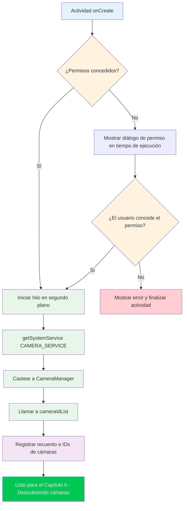

Bienvenido a la parte práctica de la serie de tutoriales de Camera2. En los capítulos anteriores, aprendió sobre el hardware de las cámaras de los smartphones y los fundamentos teóricos de la API Camera2. Ahora es el momento de arremangarse y escribir código real. Al final de este capítulo, tendrá un proyecto de Android en funcionamiento que inicializa con éxito la API Camera2 y accede al servicio CameraManager, el primer paso crítico antes de poder enumerar cámaras, abrir dispositivos o mostrar vistas previas.

Si desea ver un ejemplo de producción de todo lo que construiremos en esta serie, consulte la aplicación **Android Camera Parameters** en [GitHub](https://github.com/zoozooll/AndroidCameraParameters) y [Google Play](https://play.google.com/store/apps/details?id=com.minininja.cameraparams). Demuestra un uso avanzado de Camera2, incluyendo la enumeración completa de CameraCharacteristics, controles de captura manuales y soporte para múltiples cámaras.

## ¿Por qué empezar con la configuración del proyecto?

Antes de poder escribir una sola línea de código de Camera2, su aplicación debe estar correctamente configurada. Camera2 es una API de bajo nivel, sensible al rendimiento, y tomar atajos en la configuración provocará fallos misteriosos, ANR (La aplicación no responde) o fotogramas que nunca llegan. Los tres pilares de una configuración correcta de un proyecto Camera2 son:

1. **Permisos**: El marco de trabajo de Android restringe el acceso a la cámara tanto en el momento de la instalación (manifiesto) como en el tiempo de ejecución (consentimiento del usuario).
2. **Arquitectura de subprocesamiento**: Las retrollamadas de Camera2 nunca deben bloquear el hilo principal; necesitamos un hilo en segundo plano dedicado.
3. **Configuración de la vista**: Si planea usar TextureView para la vista previa (el enfoque recomendado), la aceleración de hardware debe estar habilitada.

Abordemos cada uno sistemáticamente.

## Paso 1: Crear un nuevo proyecto en Android Studio

Inicie Android Studio y cree un nuevo proyecto. Para esta serie de tutoriales, recomendamos:

- **Plantilla**: Empty Activity (el punto de partida más sencillo)
- **Lenguaje**: Kotlin (el estándar moderno para el desarrollo de Android; todos los ejemplos de esta serie están en Kotlin)
- **SDK mínimo**: API 21 (Lollipop): este es el primer nivel de SDK que admite Camera2 de forma nativa. Si necesita admitir cámaras USB externas a través de OTG, apunte a la API 23 o superior. Si necesita soporte de almacenamiento con alcance para guardar fotos (Capítulo 9), la API 29+ es relevante, pero manejaremos la compatibilidad con versiones anteriores allí.
- **Lenguaje de configuración de compilación**: Kotlin DSL o Groovy; cualquiera funciona; nuestros ejemplos serán independientes del sistema de compilación.

Una vez generado el proyecto, abra el archivo `build.gradle` (o `build.gradle.kts`) a nivel de módulo. La plantilla predeterminada de Empty Activity incluye la mayoría de las dependencias que necesita, pero verifique que tenga como mínimo:

```kotlin
dependencies {
    implementation("androidx.core:core-ktx:1.12.0")
    implementation("androidx.appcompat:appcompat:1.6.1")
    implementation("com.google.android.material:material:1.11.0")
    implementation("androidx.constraintlayout:constraintlayout:2.1.4")
    // Camera2 es parte del framework de Android, por lo que NO se necesita
    // ninguna dependencia adicional para la API básica.
    // androidx.camera.camera2 es solo para la interoperabilidad con CameraX.
}
```

:::tip
**No** necesita añadir ninguna dependencia externa de Camera2. Todo el paquete `android.hardware.camera2` forma parte del framework de Android. La biblioteca Jetpack CameraX es una abstracción de nivel superior separada construida sobre Camera2; nosotros estamos usando la **API nativa de Camera2 directamente** en este tutorial.
:::

## Paso 2: Declarar permisos en AndroidManifest.xml

Toda aplicación de cámara debe declarar el permiso `CAMERA` en el `AndroidManifest.xml`. Esto le indica a Google Play Store que su aplicación utiliza el hardware de la cámara, y habilita el diálogo de permiso en tiempo de ejecución en Android 6.0 (API 23) y superiores.

Abra `app/src/main/AndroidManifest.xml` y añada los siguientes elementos **como hijos de la etiqueta raíz `<manifest>`** (no dentro de `<application>`):

```xml
<?xml version="1.0" encoding="utf-8"?>
<manifest xmlns:android="http://schemas.android.com/apk/res/android"
    xmlns:tools="http://schemas.android.com/tools">

    <!-- ✅ Declaración del permiso de cámara -->
    <uses-permission android:name="android.permission.CAMERA" />

    <!-- Declaraciones de funciones opcionales (utilizadas por el filtrado de Google Play) -->
    <uses-feature
        android:name="android.hardware.camera"
        android:required="true" />
    <uses-feature
        android:name="android.hardware.camera.autofocus"
        android:required="false" />

    <application
        android:allowBackup="true"
        ...>
        <activity
            android:name=".MainActivity"
            android:exported="true"
            android:hardwareAccelerated="true">
            ...
        </activity>
    </application>
</manifest>
```

Analicemos las partes importantes:

### `<uses-permission android:name="android.permission.CAMERA" />`

Este es el permiso principal. Sin él, cualquier llamada al servicio de cámara lanzará una `SecurityException`. En la API 22 e inferiores, los usuarios conceden este permiso en el momento de la instalación; en la API 23+, también debe solicitarlo en tiempo de ejecución (se tratará a continuación).

### `<uses-feature android:name="android.hardware.camera" android:required="true" />`

Esta declaración le indica a Google Play que filtre su aplicación para dispositivos que tengan al menos una cámara. Establezca `android:required="false"` si su aplicación puede funcionar sin cámara (por ejemplo, una aplicación de galería con captura opcional). Si no declara esto en absoluto, Google Play asume que la cámara **no** es necesaria, lo que podría instalar su aplicación en dispositivos sin cámara.

### `android:hardwareAccelerated="true"` en la `<activity>`

Esto es **crítico** para el renderizado de la vista previa de TextureView. TextureView utiliza la tubería de composición de la GPU para mostrar los fotogramas de la cámara de forma eficiente. Sin la aceleración de hardware habilitada a nivel de Actividad o Aplicación, TextureView fallará silenciosamente al renderizar o mostrará una pantalla negra. El valor predeterminado en el Android moderno es `true` para toda la aplicación, pero es una buena práctica declararlo explícitamente en cualquier Actividad que aloje un TextureView.

## Paso 3: Solicitud de permiso en tiempo de ejecución

En Android 6.0 (Marshmallow, API 23) y posteriores, declarar el permiso en el manifiesto es solo la mitad de la historia. También debe **solicitar explícitamente el permiso al usuario** en tiempo de ejecución, utilizando la biblioteca Activity Compat. El patrón estándar es:

1. Comprobar si el permiso ya ha sido concedido con `ContextCompat.checkSelfPermission`.
2. Si se ha concedido, proceder a la inicialización de la cámara.
3. Si no se ha concedido, llamar a `ActivityCompat.requestPermissions` para mostrar el diálogo del sistema.
4. Manejar el resultado en `onRequestPermissionsResult`.

Este es el flujo completo del permiso en `MainActivity.kt`:

```kotlin
package com.example.camera2tutorial

import android.Manifest
import android.content.pm.PackageManager
import android.os.Bundle
import android.widget.Toast
import androidx.appcompat.app.AppCompatActivity
import androidx.core.app.ActivityCompat
import androidx.core.content.ContextCompat

class MainActivity : AppCompatActivity() {

    override fun onCreate(savedInstanceState: Bundle?) {
        super.onCreate(savedInstanceState)
        setContentView(R.layout.activity_main)

        if (allPermissionsGranted()) {
            initializeCamera()
        } else {
            ActivityCompat.requestPermissions(
                this,
                REQUIRED_PERMISSIONS,
                REQUEST_CODE_PERMISSIONS
            )
        }
    }

    private fun allPermissionsGranted() = REQUIRED_PERMISSIONS.all {
        ContextCompat.checkSelfPermission(baseContext, it) == PackageManager.PERMISSION_GRANTED
    }

    override fun onRequestPermissionsResult(
        requestCode: Int,
        permissions: Array<out String>,
        grantResults: IntArray
    ) {
        super.onRequestPermissionsResult(requestCode, permissions, grantResults)
        if (requestCode == REQUEST_CODE_PERMISSIONS) {
            if (allPermissionsGranted()) {
                initializeCamera()
            } else {
                Toast.makeText(
                    this,
                    "Se requiere el permiso de cámara para usar esta aplicación.",
                    Toast.LENGTH_LONG
                ).show()
                finish()
            }
        }
    }

    private fun initializeCamera() {
        // TODO: Implementaremos este método en las siguientes secciones.
        // Aquí es donde ocurrirá la configuración de CameraManager.
        // Por ahora, solo registraremos el éxito.
        android.util.Log.d(TAG, "Permisos concedidos. Listo para inicializar la cámara.")
    }

    companion object {
        private const val TAG = "Camera2Tutorial"
        private const val REQUEST_CODE_PERMISSIONS = 10
        private val REQUIRED_PERMISSIONS = arrayOf(Manifest.permission.CAMERA)
    }
}
```

### Por qué `allPermissionsGranted()` utiliza un patrón de array

Aunque solo necesitamos `CAMERA` en este momento, definir un array `REQUIRED_PERMISSIONS` facilita enormemente la adición de permisos adicionales más adelante (como `WRITE_EXTERNAL_STORAGE` para guardar fotos en sistemas heredados, o `RECORD_AUDIO` para video). La función `all { ... }` comprueba que **todos** los permisos del array estén concedidos antes de proceder.

## Paso 4: El hilo en segundo plano (HandlerThread)

Este es el detalle que más suelen pasar por alto los desarrolladores novatos de Camera2, y causa **errores aleatorios y difíciles de reproducir**. Entendamos por qué Camera2 necesita un hilo en segundo plano y luego implementémoslo correctamente.

### Por qué Camera2 NO DEBE ejecutarse en el hilo principal

El hilo principal de Android (UI) es responsable de:
- Dibujar la interfaz de usuario a 60-120 FPS
- Manejar los eventos táctiles del usuario
- Despachar las retrollamadas del ciclo de vida
- Ejecutar todo el código de Actividad/Fragmento de forma predeterminada

La API Camera2 entrega varias retrollamadas críticas de forma síncrona:
- `CameraDevice.StateCallback`: cuando una cámara se abre, se desconecta o da error.
- `CameraCaptureSession.StateCallback`: cuando se configura una sesión de captura.
- `CameraCaptureSession.CaptureCallback`: para cada fotograma individual (¡hasta más de 60 veces por segundo!).

Si estas retrollamadas se ejecutan en el hilo principal, ocurren dos cosas catastróficas:

1. **Tirones y pérdida de fotogramas**: Si el procesamiento de una retrollamada tarda incluso 10 ms, se salta un fotograma de 60 FPS y el usuario ve tirones.
2. **Bloqueos y ANR**: Algunos métodos de Camera2 (como `close()`) son síncronos y esperan a las retrollamadas. Si la retrollamada debe ejecutarse en el mismo hilo que llamó a `close()`, se produce un bloqueo (deadlock).

La solución es un **hilo en segundo plano dedicado** con su propio Looper, implementado a través de `HandlerThread`.

### Implementación correcta de HandlerThread

El ciclo de vida del hilo en segundo plano debe coincidir con el ciclo de vida de las operaciones de la cámara. Iniciamos el hilo cuando la Actividad se inicia/reanuda, y cerramos el hilo cuando la Actividad se detiene/pausa.

```kotlin
package com.example.camera2tutorial

import android.Manifest
import android.content.Context
import android.content.pm.PackageManager
import android.hardware.camera2.CameraManager
import android.os.Bundle
import android.os.Handler
import android.os.HandlerThread
import android.util.Log
import android.widget.Toast
import androidx.appcompat.app.AppCompatActivity
import androidx.core.app.ActivityCompat
import androidx.core.content.ContextCompat

class MainActivity : AppCompatActivity() {

    // --- Componentes de subprocesamiento en segundo plano ---
    private lateinit var backgroundThread: HandlerThread
    private lateinit var backgroundHandler: Handler

    override fun onCreate(savedInstanceState: Bundle?) {
        super.onCreate(savedInstanceState)
        setContentView(R.layout.activity_main)

        if (allPermissionsGranted()) {
            initializeCamera()
        } else {
            ActivityCompat.requestPermissions(
                this,
                REQUIRED_PERMISSIONS,
                REQUEST_CODE_PERMISSIONS
            )
        }
    }

    override fun onResume() {
        super.onResume()
        startBackgroundThread()
        // Re-inicializar si se concedieron permisos mientras la aplicación estaba en segundo plano
        if (allPermissionsGranted() && this::cameraManager.isInitialized) {
            // (cameraManager se declara a continuación)
        }
    }

    override fun onPause() {
        stopBackgroundThread()
        super.onPause()
    }

    private fun startBackgroundThread() {
        backgroundThread = HandlerThread("Camera2Background").apply {
            start()
        }
        backgroundHandler = Handler(backgroundThread.looper)
        Log.d(TAG, "Hilo en segundo plano iniciado: ${backgroundThread.name}")
    }

    private fun stopBackgroundThread() {
        backgroundThread.quitSafely()
        try {
            backgroundThread.join(1000) // Esperar hasta 1 segundo para la limpieza
            Log.d(TAG, "Hilo en segundo plano detenido limpiamente")
        } catch (e: InterruptedException) {
            Log.e(TAG, "Interrumpido mientras se unía al hilo en segundo plano", e)
        }
    }

    // --- Inicialización de CameraManager ---
    private lateinit var cameraManager: CameraManager

    private fun initializeCamera() {
        cameraManager = getSystemService(Context.CAMERA_SERVICE) as CameraManager

        val cameraIdList = cameraManager.cameraIdList
        Log.d(TAG, "Acceso exitoso a CameraManager. Se encontraron ${cameraIdList.size} cámara(s).")
        cameraIdList.forEachIndexed { index, cameraId ->
            Log.d(TAG, "Cámara $index: ID = $cameraId")
        }

        Toast.makeText(
            this,
            "¡CameraManager inicializado! Se encontraron ${cameraIdList.size} cámara(s).",
            Toast.LENGTH_LONG
        ).show()
    }

    // --- Manejo de permisos (igual que antes) ---
    private fun allPermissionsGranted() = REQUIRED_PERMISSIONS.all {
        ContextCompat.checkSelfPermission(baseContext, it) == PackageManager.PERMISSION_GRANTED
    }

    override fun onRequestPermissionsResult(
        requestCode: Int,
        permissions: Array<out String>,
        grantResults: IntArray
    ) {
        super.onRequestPermissionsResult(requestCode, permissions, grantResults)
        if (requestCode == REQUEST_CODE_PERMISSIONS) {
            if (allPermissionsGranted()) {
                initializeCamera()
            } else {
                Toast.makeText(
                    this,
                    "Se requiere el permiso de cámara para usar esta aplicación.",
                    Toast.LENGTH_LONG
                ).show()
                finish()
            }
        }
    }

    companion object {
        private const val TAG = "Camera2Tutorial"
        private const val REQUEST_CODE_PERMISSIONS = 10
        private val REQUIRED_PERMISSIONS = arrayOf(Manifest.permission.CAMERA)
    }
}
```

### Explicación de los patrones clave de subprocesamiento

1. **`startBackgroundThread()` en `onResume()`**: Cada vez que la Actividad pasa al primer plano, creamos un nuevo `HandlerThread`, lo iniciamos y creamos un `Handler` vinculado al `Looper` del hilo. Este Handler se pasará a todos los métodos de Camera2 que aceptan retrollamadas (`openCamera`, `createCaptureSession`, etc.).

2. **`stopBackgroundThread()` en `onPause()`**: Antes de que la Actividad pase al segundo plano, llamamos a `quitSafely()` en el hilo. Esto le indica al Looper que deje de procesar nuevos mensajes después de que termine el actual (a diferencia de `quit()`, que descarta los mensajes pendientes). Luego llamamos a `join(1000)` para bloquear el hilo principal durante un segundo como máximo mientras el hilo en segundo plano finaliza su limpieza. Esto evita fugas de recursos.

3. **¿Por qué `HandlerThread` en lugar de `CoroutineDispatcher`?**: Camera2 es anterior a las Corrutinas de Kotlin por varios años, y su sistema de retrollamadas se basa fundamentalmente en Handler/Looper. Aunque puede usar `Dispatchers.Default.asExecutor()` o envolver las retrollamadas en `suspendCoroutine` para código de nivel superior, la API subyacente de Camera2 todavía necesita un hilo Looper para las retrollamadas. El uso directo de `HandlerThread` es el enfoque canónico y documentado en los ejemplos oficiales de Android.

## Paso 5: El flujo de inicialización completo (combinado)

Veamos ahora la secuencia completa de eventos que deben ocurrir cuando se inicia su aplicación. El orden es crítico: permisos → hilo → CameraManager. Si invierte algún paso, el código fallará o se comportará de forma inconsistente.



El diagrama de flujo anterior ilustra por qué existe cada paso:

- **Puerta de permisos**: Todo el subsistema de la cámara está protegido; no podemos proceder hasta que el usuario otorgue su consentimiento.
- **Hilo antes de CameraManager**: Aunque el propio `getSystemService()` es seguro para hilos, queremos que el hilo en segundo plano ya esté en ejecución antes de realizar cualquier operación de Camera2 impulsada por retrollamadas (que comenzarán en el siguiente capítulo).
- **CameraManager → cameraIdList**: Llamar a `cameraIdList` es la forma más económica de verificar que CameraManager funciona. Si esta llamada tiene éxito sin lanzar excepciones, su declaración en el manifiesto, el permiso en tiempo de ejecución y la vinculación del servicio son correctos.

## Poniéndolo todo junto: Ejecutar y verificar

En este punto, tiene un proyecto de Camera2 completo y ejecutable que:
1. Crea un proyecto de Android con los objetivos de SDK correctos.
2. Declara el permiso CAMERA en el manifiesto.
3. Solicita el permiso en tiempo de ejecución, manejando tanto la aceptación como el rechazo.
4. Inicia un HandlerThread dedicado en `onResume` y lo detiene limpiamente en `onPause`.
5. Recupera el servicio del sistema `CAMERA_SERVICE` y lo castea a `CameraManager`.
6. Llama a `cameraIdList` y registra el número de cámaras y sus IDs.

### Qué debería ver al ejecutarlo

1. En el primer inicio, Android muestra el diálogo de permiso: "¿Permitir que Camera2Tutorial tome fotos y grabe videos?"
2. Toque **Permitir**.
3. Aparece un Toast: "¡CameraManager inicializado! Se encontraron X cámara(s)".
4. En el Logcat (filtre por `Camera2Tutorial`), debería ver entradas como:
   ```
   D/Camera2Tutorial: Hilo en segundo plano iniciado: Camera2Background
   D/Camera2Tutorial: Acceso exitoso a CameraManager. Se encontraron 4 cámara(s).
   D/Camera2Tutorial: Cámara 0: ID = 0
   D/Camera2Tutorial: Cámara 1: ID = 1
   D/Camera2Tutorial: Cámara 2: ID = 2
   D/Camera2Tutorial: Cámara 3: ID = 3
   ```
5. Cuando presiona el botón de Inicio o sale de la aplicación, el Logcat muestra:
   ```
   D/Camera2Tutorial: Hilo en segundo plano detenido limpiamente
   ```

Si ve estos registros, **¡felicidades!** Ha configurado con éxito la base de una aplicación Camera2. Todavía no hay vista previa de la cámara (eso llegará en el Capítulo 8), pero la estructura es correcta. Si obtiene una `SecurityException`, verifique que aceptó el diálogo de permiso. Si `cameraIdList` devuelve un array vacío, es posible que el dispositivo no tenga cámaras (poco probable en un teléfono) o que se haya denegado el permiso.

## Solución de errores comunes de configuración

### `SecurityException: Lacking privileges to access camera service`

Esto significa que no se concedió el permiso en tiempo de ejecución. Compruebe que:
- Añadió `<uses-permission android:name="android.permission.CAMERA" />` al manifiesto.
- Llamó a `ActivityCompat.requestPermissions` con el código de solicitud correcto.
- El usuario tocó **Permitir** en el diálogo.
- Si está probando en un dispositivo físico, vaya a Ajustes → Aplicaciones → Su aplicación → Permisos y asegúrese de que la Cámara esté habilitada.

### `NullPointerException` en `backgroundHandler`

Esto sucede si intenta usar `backgroundHandler` antes de que se ejecute `startBackgroundThread()`. Asegúrese de que todas las operaciones de Camera2 que aceptan un Handler solo se ejecuten **después** de que se haya llamado a `onResume` y el hilo esté funcionando. En nuestro código, se llama a `initializeCamera()` desde `onCreate`, pero solo usa CameraManager de forma síncrona; las retrollamadas que necesiten `backgroundHandler` se añadirán en capítulos posteriores y se restringirán adecuadamente en `onResume`.

### `TextureView` muestra una pantalla negra en capítulos posteriores

Si se adelanta y añade un TextureView ahora, asegúrese de que `android:hardwareAccelerated="true"` esté establecido en su Actividad en el manifiesto. También asegúrese de que el TextureView esté adjunto a la jerarquía de vistas y sea visible en su XML de diseño.

## Resumen

En este capítulo, construyó todo el andamiaje de una aplicación Android Camera2. Aprendió:

1. **Estructura del proyecto**: Cómo crear un nuevo proyecto de Android Studio con la plantilla Empty Activity, apuntando a la API 21+, usando Kotlin y verificando que no se necesitan dependencias externas de Camera2.
2. **Configuración del manifiesto**: La declaración del permiso `CAMERA`, las etiquetas `uses-feature` para el filtrado de Google Play y `hardwareAccelerated="true"` en la Actividad para el renderizado de TextureView.
3. **Permisos en tiempo de ejecución**: El ciclo completo de comprobación → solicitud → resultado usando `ContextCompat.checkSelfPermission` y `ActivityCompat.requestPermissions`, con manejo para las rutas de aceptación y denegación.
4. **Subprocesamiento en segundo plano**: Por qué las retrollamadas de Camera2 no deben ejecutarse en el hilo principal, y cómo implementar un par `HandlerThread` + `Handler` gestionado por el ciclo de vida con `startBackgroundThread()` en `onResume` y `stopBackgroundThread()` con `quitSafely()` + `join()` en `onPause`.
5. **Inicialización de CameraManager**: Recuperación del servicio del sistema `CAMERA_SERVICE`, casteo a `CameraManager`, llamada a `cameraIdList` para verificar que el servicio funciona y registro de los IDs de cámara descubiertos.

El código de este capítulo es la base de todo lo que sigue. La aplicación Android Camera Parameters ([GitHub](https://github.com/zoozooll/AndroidCameraParameters), [Google Play](https://play.google.com/store/apps/details?id=com.minininja.cameraparams)) utiliza exactamente estos patrones: múltiples `HandlerThread` para diferentes cargas de trabajo, comprobación cuidadosa de permisos y una gestión robusta del ciclo de vida.

## ¿Qué sigue?

Ahora que `CameraManager` se ha inicializado correctamente y tenemos una lista de IDs de cámara, el siguiente paso es **consultar las capacidades de cada cámara**. En el **Capítulo 6: Descubriendo cámaras**, usted:

- Aprenderá qué representan las cadenas de ID de cámara (y por qué nunca debe dar por sentado nada sobre ellas).
- Distinguirá las cámaras frontales, traseras y externas (USB OTG) usando `LENS_FACING`.
- Consultará el nivel de hardware de cada cámara (`INFO_SUPPORTED_HARDWARE_LEVEL`) para determinar si es LEGACY, LIMITED, FULL o LEVEL_3.
- Iterará sobre cada cámara del dispositivo y registrará sus propiedades usando `CameraCharacteristics`.

Al final del Capítulo 6, tendrá una utilidad de enumeración de cámaras que extrae metadatos reales de Camera2 del dispositivo, ¡algo que ya puede usar para comparar el hardware de las cámaras entre diferentes teléfonos!
