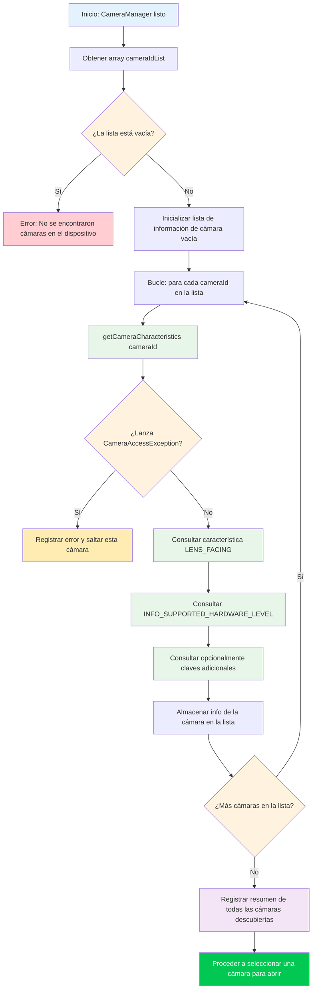

En el Capítulo 5, inicializó con éxito el `CameraManager` y recuperó la lista de IDs de cámara, pero una cadena como `"0"` o `"2"` no le dice nada sobre qué **es** realmente esa cámara. ¿Es la cámara trasera ultra gran angular? ¿La cámara para selfies? ¿Una cámara web USB externa conectada a través de OTG? Este capítulo le enseña cómo responder a esas preguntas utilizando `CameraCharacteristics`, el contenedor de metadatos que describe cada capacidad de un dispositivo de cámara.

Para una implementación de referencia de grado de producción de la enumeración de cámaras y la inspección de características, consulte la aplicación **Android Camera Parameters** ([GitHub](https://github.com/zoozooll/AndroidCameraParameters), [Google Play](https://play.google.com/store/apps/details?id=com.minininja.cameraparams)). Recorre cada clave en `CameraCharacteristics` para cada cámara del dispositivo y presenta los resultados en una interfaz de usuario en la que se puede buscar y filtrar; exactamente la herramienta que deseará cuando depure problemas de Camera2 específicos del hardware.

## Entendiendo los IDs de cámara

Antes de sumergirnos en las características, debemos abordar una fuente fundamental de confusión para los nuevos desarrolladores de Camera2: **¿qué significan realmente las cadenas numéricas de los ID de cámara?**

Cuando llama a `cameraManager.cameraIdList`, recibe un `Array<String>` (por ejemplo: `["0", "1", "2", "3", "4"]`). Es **tentador** dar por sentadas suposiciones como:
- `"0"` = cámara trasera gran angular
- `"1"` = cámara frontal
- `"2"` = teleobjetivo

**Nunca haga esto.** El mapeo de ID → cámara física es:
1. **Específico del dispositivo**: Un Pixel 8 puede usar el ID `"1"` para la cámara frontal, mientras que un Samsung Galaxy S24 usa el ID `"3"`.
2. **Específico de la versión**: Una actualización OTA de un OEM puede cambiar la lista de ID después de que se envíe un dispositivo.
3. **Específico de la reconstrucción**: Algunos dispositivos lógicos de cámara múltiple (tratados en un capítulo posterior de la Parte III) exponen u ocultan dinámicamente las cámaras físicas subyacentes según los modos.

El **único** enfoque correcto es **consultar las características de cada ID** y seleccionar una cámara en función de las propiedades que le interesen (orientación de la lente, nivel de hardware, rango de distancia focal, etc.). Esto es lo que hacen las aplicaciones Camera2 bien escritas, y es el patrón que implementaremos aquí.

## Flujo de enumeración de cámaras

El algoritmo general para descubrir cámaras es sencillo en la superficie, pero tiene casos extremos importantes relacionados con el manejo de errores. Veamos primero el proceso como un diagrama de flujo y luego implementémoslo en código.



Observaciones clave del diagrama de flujo:
1. **Maneje siempre las listas de ID vacías**: Raro en teléfonos, pero común en Android TV, dispositivos sin pantalla o emuladores sin cámara virtual.
2. **Envuelva siempre `getCameraCharacteristics` en un try/catch**: Una cámara podría desconectarse a mitad de la enumeración (especialmente una cámara USB externa), o una política de dispositivo bloqueada podría restringir ciertas cámaras.
3. **Itere completamente y luego elija**: Recopile todos los candidatos primero y luego seleccione el mejor según sus criterios. No abra la primera cámara "buena" que encuentre; podría perderse una mejor.

## Presentando CameraCharacteristics

`CameraCharacteristics` es un mapa de clave-valor inmutable y de solo lectura que describe las capacidades a nivel de hardware de una cámara. Contiene varios cientos de claves que cubren todo, desde la distancia focal de la lente hasta el tamaño de la matriz de píxeles del sensor y los formatos de salida admitidos.

Usted recupera un objeto de características con:
```kotlin
val characteristics: CameraCharacteristics =
    cameraManager.getCameraCharacteristics(cameraId)
```

Y consulta claves individuales con el método genérico `get`:
```kotlin
val lensFacing: Int? = characteristics.get(CameraCharacteristics.LENS_FACING)
```

El tipo de retorno es anulable (`Int?` en este caso) porque algunas claves son opcionales y pueden no estar presentes en todos los dispositivos. En la práctica, las claves que consultamos en este capítulo (`LENS_FACING` e `INFO_SUPPORTED_HARDWARE_LEVEL`) están garantizadas para estar presentes en cada cámara válida, pero sigue siendo una buena práctica manejar los nulos a la defensiva.

:::note
Este capítulo cubre intencionalmente solo `LENS_FACING` e `INFO_SUPPORTED_HARDWARE_LEVEL`. Los aspectos internos más profundos de `CameraCharacteristics` (características del sensor, configuraciones de salida, capacidades disponibles) son el tema de la Parte III, Capítulo 10: La enciclopedia de CameraCharacteristics. Nos mantenemos enfocados en la información mínima que necesita para elegir una cámara para abrir.
:::

## Clave 1: LENS_FACING — Frontal, trasera o externa

Lo primero que casi cualquier aplicación de cámara necesita saber es en qué dirección apunta la lente. Camera2 define tres constantes:

| Constante | Valor | Significado | Caso de uso típico |
|---|---|---|---|
| `LENS_FACING_BACK` | `0` | La cámara está en la parte trasera del dispositivo, apuntando lejos del usuario | Captura de fotos, video de paisajes, AR |
| `LENS_FACING_FRONT` | `1` | La cámara está en la parte frontal del dispositivo, apuntando hacia el usuario | Selfies, videollamadas |
| `LENS_FACING_EXTERNAL` | `2` | La cámara es externa al dispositivo (por ejemplo, una cámara web USB OTG) | Accesorios externos, cámaras especializadas |

Así es como se convierte el entero crudo en una cadena legible por humanos:

```kotlin
fun lensFacingToString(facing: Int?): String = when (facing) {
    CameraCharacteristics.LENS_FACING_BACK -> "Trasera (LENS_FACING_BACK)"
    CameraCharacteristics.LENS_FACING_FRONT -> "Frontal (LENS_FACING_FRONT)"
    CameraCharacteristics.LENS_FACING_EXTERNAL -> "Externa / USB OTG (LENS_FACING_EXTERNAL)"
    null -> "Desconocida (null)"
    else -> "Desconocida (valor=$facing)"
}
```

### Caso especial: Cámaras externas (USB OTG)

`LENS_FACING_EXTERNAL` se añadió en la API 23 (Marshmallow). Antes de abrir una cámara externa, tenga en cuenta:

1. **Declaración de la función USB Host**: Si su aplicación se dirige específicamente a cámaras externas, añada `<uses-feature android:name="android.hardware.usb.host" />` a su manifiesto. Establezca `required="false"` si la aplicación también funciona con cámaras integradas.
2. **Permiso para dispositivos externos**: En muchos dispositivos, el acceso a una cámara USB requiere solo el permiso `CAMERA`. Sin embargo, algunos chipsets de cámaras web USB requieren una confirmación de permiso de host USB adicional a través de `UsbManager.requestPermission()`. Maneje la emisión de `UsbManager.ACTION_USB_DEVICE_ATTACHED` si desea detectar automáticamente cuando se conecta una cámara.
3. **Nivel de hardware**: Las cámaras externas casi siempre informan `INFO_SUPPORTED_HARDWARE_LEVEL_EXTERNAL` (ver más abajo), lo que significa que su conjunto de funciones está limitado por el controlador de Clase de Video USB (UVC). No espere controles manuales ni salida RAW de una cámara web genérica.

En un teléfono con una cámara web USB conectada, `cameraIdList` podría devolver algo como `["0", "1", "100"]`, donde `"100"` es el ID de la cámara externa asignado dinámicamente. Los ID de las cámaras externas suelen ser números más altos y **no** son estables entre reinicios o reconexiones.

## Clave 2: INFO_SUPPORTED_HARDWARE_LEVEL — ¿Qué puede hacer esta cámara?

El nivel de hardware es la clasificación de capacidad más importante en Camera2. Le indica si el hardware de la cámara y la HAL (Capa de Abstracción de Hardware) implementan la tubería completa de Camera2 o si están usando un envoltorio de compatibilidad heredado alrededor de la antigua API de cámara. Hay cinco valores:

| Nivel | Valor | Significado | Dispositivos del mundo real |
|---|---|---|---|
| `LEGACY` | `2` | Modo HAL heredado. La cámara funciona sobre la antigua API de cámara a través de un adaptador. Funcionalidad muy limitada, sin controles manuales, sin RAW. | Teléfonos económicos, dispositivos anteriores a 2015, muchos emuladores |
| `LIMITED` | `0` | Soporte limitado de HAL3. Captura básica, 3A básica (Exposición Automática, Enfoque Automático, Balance de Blancos Automático), pero faltan funciones avanzadas. | Teléfonos de gama media, algunas cámaras frontales en dispositivos insignia |
| `FULL` | `1` | Soporte completo de HAL3. Controles manuales del sensor, configuración por fotograma, salida RAW, reprocesamiento. | Cámaras traseras/principales de teléfonos insignia, cámaras principales de la serie Pixel |
| `LEVEL_3` | `3` | Soporte extendido de HAL3. Añade reprocesamiento YUV, entrada de fotogramas múltiples, configuraciones de resolución de alta velocidad. | Últimos insignias, cámaras principales de Pixel 6+ |
| `EXTERNAL` | `4` | Cámara externa (USB/OTG). Funciones limitadas, dispositivo de clase UVC. | Cámaras web USB, adaptadores de captura HDMI |

Una buena forma de pensar en esta jerarquía es como una escalera de capacidades:

```
LEGACY → LIMITED → FULL → LEVEL_3
          ↑
       EXTERNAL (rama paralela para cámaras USB)
```

Cada paso se basa en el anterior: `FULL` incluye todo lo de `LIMITED`, `LEVEL_3` incluye todo lo de `FULL`. Al escribir código de detección de funciones, compruebe desde el nivel más alto hacia abajo: si una cámara es `LEVEL_3`, sabe automáticamente que también admite funciones `FULL`.

Esta es la función de utilidad para convertir el nivel en una descripción:

```kotlin
fun hardwareLevelToString(level: Int?): String = when (level) {
    CameraMetadata.INFO_SUPPORTED_HARDWARE_LEVEL_LEGACY ->
        "LEGACY (adaptador de la antigua API Camera — controles manuales limitados)"
    CameraMetadata.INFO_SUPPORTED_HARDWARE_LEVEL_LIMITED ->
        "LIMITED (HAL3 básica — foto/video estándar)"
    CameraMetadata.INFO_SUPPORTED_HARDWARE_LEVEL_FULL ->
        "FULL (HAL3 completa — controles manuales + RAW)"
    CameraMetadata.INFO_SUPPORTED_HARDWARE_LEVEL_3 ->
        "LEVEL_3 (HAL3 extendida — reprocesamiento + fotogramas múltiples)"
    CameraMetadata.INFO_SUPPORTED_HARDWARE_LEVEL_EXTERNAL ->
        "EXTERNAL (cámara USB/OTG — clase UVC)"
    null -> "Desconocido (null)"
    else -> "Desconocido (valor=$level)"
}
```

:::tip
Si desea escribir código que solo se ejecute en hardware capaz, use `>= LIMITED` para captura básica, `>= FULL` para controles manuales y `>= LEVEL_3` para tuberías de reprocesamiento. Nunca asuma que una cámara es FULL o superior; compruébelo siempre. La aplicación Android Camera Parameters en [Google Play](https://play.google.com/store/apps/details?id=com.minininja.cameraparams) muestra el nivel de hardware como una insignia prominente para cada cámara, de modo que pueda ver rápidamente qué admite cada dispositivo.
:::

## Código Kotlin completo: Utilidad de descubrimiento de cámaras

Ahora combinemos todo en una implementación funcional. Ampliaremos la `MainActivity.kt` del Capítulo 5 con un método `discoverAndLogCameras()` que itera por todas las cámaras, consulta el `LENS_FACING` e `INFO_SUPPORTED_HARDWARE_LEVEL` de cada una y registra los resultados en Logcat.

```kotlin
package com.example.camera2tutorial

import android.Manifest
import android.content.Context
import android.content.pm.PackageManager
import android.hardware.camera2.CameraAccessException
import android.hardware.camera2.CameraCharacteristics
import android.hardware.camera2.CameraManager
import android.hardware.camera2.CameraMetadata
import android.os.Bundle
import android.os.Handler
import android.os.HandlerThread
import android.util.Log
import android.widget.Toast
import androidx.appcompat.app.AppCompatActivity
import androidx.core.app.ActivityCompat
import androidx.core.content.ContextCompat

class MainActivity : AppCompatActivity() {

    private lateinit var backgroundThread: HandlerThread
    private lateinit var backgroundHandler: Handler
    private lateinit var cameraManager: CameraManager

    override fun onCreate(savedInstanceState: Bundle?) {
        super.onCreate(savedInstanceState)
        setContentView(R.layout.activity_main)

        if (allPermissionsGranted()) {
            initializeCameraManager()
        } else {
            ActivityCompat.requestPermissions(
                this,
                REQUIRED_PERMISSIONS,
                REQUEST_CODE_PERMISSIONS
            )
        }
    }

    override fun onResume() {
        super.onResume()
        startBackgroundThread()
    }

    override fun onPause() {
        stopBackgroundThread()
        super.onPause()
    }

    private fun startBackgroundThread() {
        backgroundThread = HandlerThread("Camera2Background").apply { start() }
        backgroundHandler = Handler(backgroundThread.looper)
    }

    private fun stopBackgroundThread() {
        backgroundThread.quitSafely()
        try {
            backgroundThread.join(1000)
        } catch (e: InterruptedException) {
            Log.e(TAG, "Interrumpido mientras se unía al hilo en segundo plano", e)
        }
    }

    private fun initializeCameraManager() {
        cameraManager = getSystemService(Context.CAMERA_SERVICE) as CameraManager
        discoverAndLogCameras()
    }

    // -------------------------------------------------------------------------
    // 📸 ADICIONES DEL CAPÍTULO 6: Descubrimiento de cámaras y consulta de características
    // -------------------------------------------------------------------------
    data class CameraInfo(
        val id: String,
        val lensFacing: Int?,
        val hardwareLevel: Int?
    ) {
        fun description(): String = buildString {
            append("ID de cámara: $id | ")
            append("Orientación: ${lensFacingToString(lensFacing)} | ")
            append("Nivel de HW: ${hardwareLevelToString(hardwareLevel)}")
        }
    }

    private fun discoverAndLogCameras() {
        val cameraIdList: Array<String> = try {
            cameraManager.cameraIdList
        } catch (e: CameraAccessException) {
            Log.e(TAG, "Error al obtener la lista de ID de cámara", e)
            Toast.makeText(this, "Servicio de cámara no disponible", Toast.LENGTH_LONG).show()
            return
        }

        if (cameraIdList.isEmpty()) {
            Log.w(TAG, "No se encontraron cámaras en este dispositivo")
            Toast.makeText(this, "No hay cámaras disponibles", Toast.LENGTH_LONG).show()
            return
        }

        val discoveredCameras = mutableListOf<CameraInfo>()
        Log.i(TAG, "═══════════════════════════════════════════")
        Log.i(TAG, "Iniciando descubrimiento de cámaras (${cameraIdList.size} cámara(s))")
        Log.i(TAG, "═══════════════════════════════════════════")

        for ((index, cameraId) in cameraIdList.withIndex()) {
            try {
                val characteristics = cameraManager.getCameraCharacteristics(cameraId)

                val lensFacing = characteristics.get(CameraCharacteristics.LENS_FACING)
                val hardwareLevel =
                    characteristics.get(CameraCharacteristics.INFO_SUPPORTED_HARDWARE_LEVEL)

                val info = CameraInfo(cameraId, lensFacing, hardwareLevel)
                discoveredCameras.add(info)

                Log.i(TAG, "── Cámara $index ──")
                Log.i(TAG, info.description())

            } catch (e: CameraAccessException) {
                Log.e(TAG, "Error al acceder a las características de la cámara $cameraId", e)
            } catch (e: IllegalArgumentException) {
                Log.e(TAG, "ID de cámara no válido: $cameraId", e)
            }
        }

        Log.i(TAG, "═══════════════════════════════════════════")
        Log.i(TAG, "Descubrimiento completado. ${discoveredCameras.size} cámara(s) enumeradas con éxito.")

        // Agrupar y resumir por orientación
        val byFacing = discoveredCameras.groupBy { it.lensFacing }
        Log.i(TAG, "  Orientación trasera: ${byFacing[CameraCharacteristics.LENS_FACING_BACK]?.size ?: 0}")
        Log.i(TAG, "  Orientación frontal: ${byFacing[CameraCharacteristics.LENS_FACING_FRONT]?.size ?: 0}")
        Log.i(TAG, "  Externa/OTG:         ${byFacing[CameraCharacteristics.LENS_FACING_EXTERNAL]?.size ?: 0}")

        // Agrupar y resumir por nivel de hardware
        val byLevel = discoveredCameras.groupBy { it.hardwareLevel }
        Log.i(TAG, "  Cámaras LEGACY:  ${byLevel[CameraMetadata.INFO_SUPPORTED_HARDWARE_LEVEL_LEGACY]?.size ?: 0}")
        Log.i(TAG, "  Cámaras LIMITED: ${byLevel[CameraMetadata.INFO_SUPPORTED_HARDWARE_LEVEL_LIMITED]?.size ?: 0}")
        Log.i(TAG, "  Cámaras FULL:    ${byLevel[CameraMetadata.INFO_SUPPORTED_HARDWARE_LEVEL_FULL]?.size ?: 0}")
        Log.i(TAG, "  Cámaras LEVEL_3: ${byLevel[CameraMetadata.INFO_SUPPORTED_HARDWARE_LEVEL_3]?.size ?: 0}")
        Log.i(TAG, "  Cámaras EXTERNAL: ${byLevel[CameraMetadata.INFO_SUPPORTED_HARDWARE_LEVEL_EXTERNAL]?.size ?: 0}")
        Log.i(TAG, "═══════════════════════════════════════════")

        val summary = buildString {
            append("¡Se descubrieron ${discoveredCameras.size} cámara(s)!\n")
            append("Traseras: ${byFacing[CameraCharacteristics.LENS_FACING_BACK]?.size ?: 0} • ")
            append("Frontales: ${byFacing[CameraCharacteristics.LENS_FACING_FRONT]?.size ?: 0} • ")
            append("Externas: ${byFacing[CameraCharacteristics.LENS_FACING_EXTERNAL]?.size ?: 0}")
        }

        Toast.makeText(this, summary, Toast.LENGTH_LONG).show()

        // Almacenar para capítulos posteriores (seleccionar cámara para abrir)
        this.discoveredCameras = discoveredCameras
    }

    private var discoveredCameras: List<CameraInfo> = emptyList()

    // Ayudante: obtener el ID de la cámara trasera "predeterminada" (la primera que encontremos)
    fun getDefaultBackCameraId(): String? =
        discoveredCameras.firstOrNull {
            it.lensFacing == CameraCharacteristics.LENS_FACING_BACK
        }?.id

    // Ayudante: obtener el ID de la cámara frontal "predeterminada"
    fun getDefaultFrontCameraId(): String? =
        discoveredCameras.firstOrNull {
            it.lensFacing == CameraCharacteristics.LENS_FACING_FRONT
        }?.id

    companion object {
        private const val TAG = "Camera2Tutorial"
        private const val REQUEST_CODE_PERMISSIONS = 10
        private val REQUIRED_PERMISSIONS = arrayOf(Manifest.permission.CAMERA)

        fun lensFacingToString(facing: Int?): String = when (facing) {
            CameraCharacteristics.LENS_FACING_BACK -> "Trasera"
            CameraCharacteristics.LENS_FACING_FRONT -> "Frontal"
            CameraCharacteristics.LENS_FACING_EXTERNAL -> "Externa/USB"
            null -> "Desconocida(null)"
            else -> "Desconocida($facing)"
        }

        fun hardwareLevelToString(level: Int?): String = when (level) {
            CameraMetadata.INFO_SUPPORTED_HARDWARE_LEVEL_LEGACY -> "LEGACY"
            CameraMetadata.INFO_SUPPORTED_HARDWARE_LEVEL_LIMITED -> "LIMITED"
            CameraMetadata.INFO_SUPPORTED_HARDWARE_LEVEL_FULL -> "FULL"
            CameraMetadata.INFO_SUPPORTED_HARDWARE_LEVEL_3 -> "LEVEL_3"
            CameraMetadata.INFO_SUPPORTED_HARDWARE_LEVEL_EXTERNAL -> "EXTERNAL"
            null -> "Desconocido(null)"
            else -> "Desconocido($level)"
        }
    }

    private fun allPermissionsGranted() = REQUIRED_PERMISSIONS.all {
        ContextCompat.checkSelfPermission(baseContext, it) == PackageManager.PERMISSION_GRANTED
    }

    override fun onRequestPermissionsResult(
        requestCode: Int,
        permissions: Array<out String>,
        grantResults: IntArray
    ) {
        super.onRequestPermissionsResult(requestCode, permissions, grantResults)
        if (requestCode == REQUEST_CODE_PERMISSIONS) {
            if (allPermissionsGranted()) {
                initializeCameraManager()
            } else {
                Toast.makeText(
                    this,
                    "Se requiere el permiso de cámara para usar esta aplicación.",
                    Toast.LENGTH_LONG
                ).show()
                finish()
            }
        }
    }
}
```

### Patrones clave en el código

1. **`data class CameraInfo`**: En lugar de pasar tuplas crudas, encapsulamos las propiedades que nos interesan en una clase de datos tipada. Esto hace que el código sea legible y fácilmente extensible (simplemente añada un nuevo campo como `focalLengths` más adelante sin cambiar los sitios de llamada).

2. **`CameraAccessException` try/catch dentro del bucle**: Si una cámara falla (por ejemplo, una cámara externa se desconecta a mitad de la enumeración), el bucle continúa y las cámaras restantes se siguen descubriendo. El fallo de una cámara no debe envenenar toda la enumeración.

3. **Resúmenes duales de `groupBy`**: Agrupar las cámaras tanto por orientación como por nivel de hardware, y luego contar cada grupo, le da una imagen inmediata de un vistazo de la topología de la cámara del dispositivo. Este patrón está tomado directamente de la pantalla de resumen de la aplicación Android Camera Parameters ([GitHub](https://github.com/zoozooll/AndroidCameraParameters)).

4. **`getDefaultBackCameraId()` y `getDefaultFrontCameraId()`**: Estas funciones de ayuda demuestran la forma correcta de seleccionar una cámara: consultando las características, no codificando a piñón fijo el ID `"0"` o `"1"`. Usaremos estas ayudas en el Capítulo 7 cuando abramos realmente una cámara.

## Salida esperada de Logcat

Cuando ejecute esto en un dispositivo real (por ejemplo, un insignia moderno con más de 4 cámaras), la salida de Logcat filtrada por `Camera2Tutorial` debería verse algo así:

```
I/Camera2Tutorial: ═══════════════════════════════════════════
I/Camera2Tutorial: Iniciando descubrimiento de cámaras (5 cámara(s))
I/Camera2Tutorial: ═══════════════════════════════════════════
I/Camera2Tutorial: ── Cámara 0 ──
I/Camera2Tutorial: ID de cámara: 0 | Orientación: Trasera | Nivel de HW: LEVEL_3
I/Camera2Tutorial: ── Cámara 1 ──
I/Camera2Tutorial: ID de cámara: 1 | Orientación: Frontal | Nivel de HW: FULL
I/Camera2Tutorial: ── Cámara 2 ──
I/Camera2Tutorial: ID de cámara: 2 | Orientación: Trasera | Nivel de HW: LIMITED
I/Camera2Tutorial: ── Cámara 3 ──
I/Camera2Tutorial: ID de cámara: 3 | Orientación: Trasera | Nivel de HW: LIMITED
I/Camera2Tutorial: ── Cámara 4 ──
I/Camera2Tutorial: ID de cámara: 4 | Orientación: Trasera | Nivel de HW: LIMITED
I/Camera2Tutorial: ═══════════════════════════════════════════
I/Camera2Tutorial: Descubrimiento completado. 5 cámara(s) enumeradas con éxito.
I/Camera2Tutorial:   Orientación trasera: 4
I/Camera2Tutorial:   Orientación frontal: 1
I/Camera2Tutorial:   Externa/OTG:         0
I/Camera2Tutorial:   Cámaras LEGACY:  0
I/Camera2Tutorial:   Cámaras LIMITED: 3
I/Camera2Tutorial:   Cámaras FULL:    1
I/Camera2Tutorial:   Cámaras LEVEL_3: 1
I/Camera2Tutorial:   Cámaras EXTERNAL: 0
I/Camera2Tutorial: ═══════════════════════════════════════════
```

In esta salida de ejemplo, tenemos:
- **Cámara 0** (LEVEL_3, Trasera): La cámara trasera principal gran angular, la de mayor calidad.
- **Cámara 1** (FULL, Frontal): La cámara frontal para selfies, de nivel FULL, por lo que los controles manuales están disponibles.
- **Cámaras 2, 3, 4** (LIMITED, Traseras): Ultra gran angular, teleobjetivo y posiblemente un sensor de profundidad o macro; todas de nivel LIMITED, lo que significa que admiten captura básica pero no control manual total (esto es extremadamente común en las cámaras traseras auxiliares, incluso en los insignias).

## Solución de problemas de descubrimiento de cámaras

### `cameraIdList` devuelve un array vacío en un emulador

La mayoría de los emuladores de Android vienen con una cámara trasera y frontal simuladas, pero deben habilitarse en la configuración del AVD (Android Virtual Device). Abra el Administrador de AVD, edite su dispositivo virtual, vaya a **Advanced Settings** y establezca **Back camera** y **Front camera** en `Emulated` (usa la cámara web del host) o `VirtualScene` (renderiza una escena 3D falsa). Luego, realice un arranque en frío (cold boot) del emulador.

### Todas las cámaras informan LEGACY en un teléfono que debería tener soporte FULL

Esto sucede en dos escenarios:
1. **Está usando una ROM personalizada o un dispositivo rooteado con una HAL de cámara antigua**: El OEM no implementó HAL3, por lo que se utiliza el adaptador de compatibilidad aunque el hardware del sensor sea capaz.
2. **Está usando un perfil de trabajo o un dispositivo gestionado**: Algunas políticas de MDM (Gestión de Dispositivos Móviles) restringen las capacidades de la cámara, y el servicio de cámara puede informar un nivel degradado a las aplicaciones en el perfil de trabajo.

Instale la aplicación Android Camera Parameters desde [Google Play](https://play.google.com/store/apps/details?id=com.minininja.cameraparams) para contrastar. Si la aplicación de la Play Store también muestra LEGACY, es una limitación a nivel de dispositivo, no un error en su código.

### La cámara USB externa no aparece en la lista

Primero, verifique que su adaptador USB OTG funciona: conecte un ratón USB y compruebe si mueve el cursor. Si el hardware funciona, verifique:
- El dispositivo ejecuta la API 23+ (el soporte para cámaras externas se añadió en Marshmallow).
- La cámara web cumple con la Clase de Video USB (UVC). La mayoría de las cámaras web de consumo lo hacen, pero las cámaras industriales especializadas pueden necesitar un controlador personalizado.
- Algunos dispositivos bloquean el modo host USB cuando la batería está por debajo de un cierto nivel. Cargue el dispositivo e inténtelo de nuevo.

## Resumen

En este capítulo, convirtió un array sin sentido de cadenas de ID de cámara en información accionable sobre el hardware de la cámara de un dispositivo. Aprendió:

1. **Semántica de los ID de cámara**: Por qué nunca debe dar por sentadas suposiciones sobre qué ID se mapea a qué cámara, y cómo los ID pueden variar entre dispositivos, OTA y reinicios.
2. **Conceptos básicos de CameraCharacteristics**: Cómo recuperar un objeto de características a través de `cameraManager.getCameraCharacteristics(cameraId)` y consultar claves individuales usando el método genérico `get`.
3. **LENS_FACING**: Las tres posibles orientaciones de la lente (`LENS_FACING_BACK`, `LENS_FACING_FRONT`, `LENS_FACING_EXTERNAL`), con inmersiones profundas en los requisitos de la cámara externa USB OTG (función host USB, ID dinámicos, limitaciones de UVC).
4. **INFO_SUPPORTED_HARDWARE_LEVEL**: La escalera de capacidades de cinco niveles (LEGACY → LIMITED → FULL → LEVEL_3, más EXTERNAL para cámaras USB), qué garantiza cada nivel en términos de soporte de funciones y cómo escribir código de restricción de funciones basado en el nivel mínimo requerido.
5. **Descubrimiento de cámaras robusto**: La implementación completa de `discoverAndLogCameras()` con try/catch por cámara, una clase de datos `CameraInfo`, cadenas de descripción legibles por humanos, resúmenes de agrupar por orientación y nivel de hardware, y funciones de ayuda para seleccionar la cámara trasera/frontal predeterminada.

Ahora tiene metadatos reales de Camera2 fluyendo a través de su aplicación. Este es un hito importante: el código de enumeración que escribió aquí es reutilizable en todos los proyectos de Camera2 que construya en el futuro.

## ¿Qué sigue?

Con una cámara seleccionada (a través de `getDefaultBackCameraId()`), es hora de encenderla realmente y hablar con el hardware. En el **Capítulo 7: Abriendo una cámara**, usted:

- Aprenderá qué representa `CameraDevice` (una conexión activa y abierta a una cámara física).
- Implementará la `CameraDevice.StateCallback` con controladores para `onOpened`, `onDisconnected` y `onError`.
- Entenderá las reglas del ciclo de vida para cuándo abrir, reabrir y cerrar la cámara en sincronía con `onPause` y `onResume`.
- Manejará cada código de error de `CameraAccessException`: `CAMERA_IN_USE`, `MAX_CAMERAS_IN_USE`, `CAMERA_DISABLED` y `CAMERA_ERROR`.
- Usará un `Semaphore` para evitar operaciones de apertura concurrentes, con un tiempo de espera `tryAcquire` para la seguridad contra bloqueos (deadlocks).

Al final del Capítulo 7, su código tendrá un objeto `CameraDevice` activo y abierto; el requisito previo para crear una sesión de captura y, finalmente, mostrar la vista previa de la cámara.
