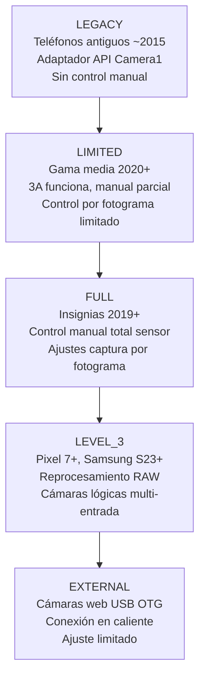
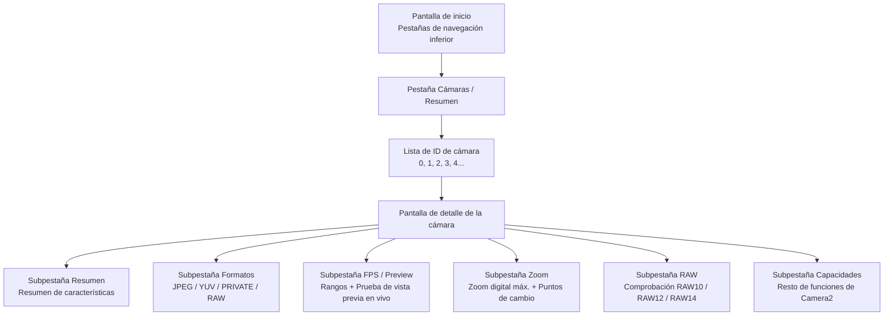

# Capítulo 4: Explore su propio teléfono

Aquí es donde su aplicación se vuelve importante. Los capítulos 2 y 3 le proporcionaron una comprensión teórica del hardware de la cámara y de las funciones de fotografía computacional moderna. Este capítulo es práctico y específico para cada dispositivo. Instalará la aplicación complementaria **Android Camera Parameters** en su propio teléfono, la ejecutará e inspeccionará sistemáticamente qué puede y qué no puede hacer su hardware, anotando las respuestas a medida que avanza.

La información que descubra en este capítulo no es una curiosidad académica. La API Camera2 expone las capacidades de forma individual por dispositivo y por cámara. Una función que funciona perfectamente en su Pixel 10 personal puede fallar silenciosamente (o degradarse a una operación nula, o peor aún, bloquearse) en un Samsung serie A de gama media de 2023 porque la HAL de ese dispositivo simplemente no implementa la capacidad requerida. Antes de escribir una sola línea de código de la API Camera2 en la Parte II de esta serie, debe saber de qué es capaz su propio dispositivo de prueba.

Al final de este capítulo habrá anotado, para su teléfono específico: una lista completa de ID de cámara con sus orientaciones y niveles de hardware; qué formatos de salida admite cada cámara; la resolución JPEG máxima; el rango de FPS más alto en cámara lenta; el zoom digital máximo y los umbrales de cambio de cámara física; y si su cámara principal admite la salida RAW.

## Instalación de la aplicación Android Camera Parameters

Hay dos opciones de instalación disponibles. Elija la que prefiera.

### Opción A: Compilar desde el código fuente

Si es desarrollador de Android y ya tiene instalado Android Studio, esta opción le permite navegar por el código fuente de la aplicación complementaria (consulte la sección final de este capítulo) e incluso modificarla para inspeccionar características adicionales de Camera2 que le interesen.

1. Clone el repositorio de GitHub:
   `https://github.com/zoozooll/AndroidCameraParameters`
2. Abra el proyecto en Android Studio Iguana (2023.2.1) o posterior. La sincronización de Gradle se completará automáticamente; el proyecto apunta al SDK 34 de Android (Android 14) con un `minSdkVersion` de 21 (Android 5.0 Lollipop), por lo que se ejecutará en prácticamente cualquier teléfono que pueda tener.
3. Active la depuración por USB en su teléfono. Vaya a **Ajustes → Acerca del teléfono → Número de compilación** y toque la entrada del Número de compilación 7 veces. Aparecerá un aviso que dice "Ahora es un desarrollador". Vuelva a la pantalla principal de Ajustes, entre en **Opciones para desarrolladores** y active la **Depuración por USB**.
4. Conecte su teléfono al ordenador mediante un cable USB-C. En el teléfono, acepte el aviso "¿Permitir depuración por USB de este ordenador?" y marque "Permitir siempre de este ordenador" para evitar el diálogo en el futuro.
5. Seleccione la configuración de ejecución **app** en el desplegable de la parte superior de Android Studio (la configuración por defecto suele llamarse `app`). Asegúrese de que su teléfono conectado aparece como el dispositivo de destino en el desplegable de dispositivos.
6. Haga clic en el botón verde **Run** (el icono de reproducción triangular) o pulse **Mayús + F10**. Android Studio compilará la aplicación, instalará el APK en su teléfono a través de ADB y la ejecutará automáticamente.

### Opción B: Instalar desde Google Play

Si simplemente desea ejecutar la aplicación sin compilarla, o si desea probar su comportamiento en varios dispositivos de usuario final sin configurar cada uno para ADB, utilice la versión de la Play Store.

Abra Google Play Store en su teléfono Android y navegue hasta:

`https://play.google.com/store/apps/details?id=com.minininja.cameraparams`

Toque **Instalar**. La aplicación es gratuita y no contiene anuncios, compras integradas ni rastreadores. Requiere solo el permiso `CAMERA` (para consultar las características de la cámara y abrir una superficie de vista previa) y el permiso opcional `RECORD_AUDIO` (nunca usado en la versión actual, pero reservado para una futura actividad de prueba de grabación de video). El permiso `ACCESS_FINE_LOCATION` es opcional y solo se solicita si desea etiquetar las capturas de muestra con metadatos GPS en la pestaña de vista previa.

Inicie la aplicación una vez finalizada la instalación. En el primer inicio, conceda el permiso de **Cámara** cuando aparezca el diálogo de permisos del sistema. La aplicación no funcionará sin este permiso, ya que el modelo de seguridad de Android requiere la concesión de un permiso en tiempo de ejecución incluso para *consultar* las características de la cámara: ni siquiera puede enumerar los ID de cámara sin que se haya concedido el permiso `CAMERA`.

## ID de cámara

Mire la pantalla de inicio de la aplicación. La primera pestaña (y la predeterminada) en la parte inferior está etiquetada como **Cameras** (a veces llamada **Overview** según la variante de la versión que esté ejecutando). El encabezado en la parte superior de esta pestaña dice **All Camera IDs**.

Cada cámara individual en un dispositivo Android —cada cámara trasera, la frontal, cualquier dispositivo lógico de fusión multicámara y cualquier cámara web USB OTG externa— tiene asignado un identificador de cadena único llamado **Camera ID**. Los ID de cámara son casi siempre números enteros decimales simples: `"0"`, `"1"`, `"2"`, `"3"` y, a veces, `"4"`, `"5"` en dispositivos con muchas cámaras. En dispositivos raros (algunas cámaras web externas y las cámaras falsas del emulador) puede ver ID de cámara como `"camera@0"` o `"0@external"`, pero los enteros simples son, con mucho, el formato más común.

Cada fila de la lista All Camera IDs muestra tres piezas de información, de izquierda a derecha:

1. El propio número de ID de la cámara, mostrado en una burbuja en negrita.
2. La dirección de orientación de la lente (**LENS_FACING**): una de entre `BACK` (cámara trasera, orientada hacia fuera de la pantalla), `FRONT` (cámara para selfies, orientada hacia el usuario) o `EXTERNAL` (cámara web USB / cámara OTG).
3. El **nivel de hardware** de esa cámara: una burbuja de color que muestra `LEGACY`, `LIMITED`, `FULL`, `LEVEL_3` o `EXTERNAL`. Esto se mapea directamente con la característica `INFO_SUPPORTED_HARDWARE_LEVEL` de la API Camera2 descrita en el Capítulo 1 de esta serie.

Como ejemplo concreto, un Galaxy S26 Ultra suele informar de **5 ID de cámara**:

- **ID 0**: BACK (trasera angular / principal de 24 mm), Nivel de hardware = **FULL**
- **ID 1**: FRONT (cámara para selfies), Nivel de hardware = **LIMITED**
- **ID 2**: BACK (trasera ultra gran angular de 0,5x), Nivel de hardware = **FULL**
- **ID 3**: BACK (trasera teleobjetivo periscópica de 5x), Nivel de hardware = **FULL**
- **ID 4**: BACK (ID lógico multicámara que representa la combinación fusionada de los ID 0 + 2 + 3, gestionado por la HAL para un zoom fluido), Nivel de hardware = **FULL**

Un teléfono de gama media (por ejemplo, un Samsung A54 5G) podría informar solo de 3 ID de cámara: trasera angular, trasera ultra gran angular y frontal. Un teléfono económico de la era de 2016 podría informar solo de 2: trasera y frontal.

**Tarea para su dispositivo:** Anote la lista completa de los ID de cámara de los que informa su teléfono. Para cada ID, anote su LENS_FACING (Trasera / Frontal / Externa) y el color/etiqueta de su burbuja de nivel de hardware. Cuente el número total de cámaras. Si ve un ID de cámara cuyo propósito no es obvio (por ejemplo, un ID adicional orientado hacia atrás que no se corresponde con ningún bulto de lente evidente en la parte trasera del teléfono), téngalo en cuenta: suelen ser sensores de profundidad ToF, cámaras macro o el dispositivo de fusión lógica multicámara.

## Niveles de hardware

El Capítulo 1 de esta serie introdujo los cinco niveles de hardware de Camera2, ordenados de menor a mayor capacidad: **LEGACY → LIMITED → FULL → LEVEL_3 → EXTERNAL**. Esta sección refresca esa jerarquía y luego le pide que inspeccione el nivel de cada cámara usando la aplicación.

Cada nivel añade nuevas capacidades y garantías de rendimiento más estrictas:

- **LEGACY**: La API Camera2 se implementa como un adaptador fino sobre la API `android.hardware.Camera` (Camera1) obsoleta. Casi nada funciona de forma fiable: sin exposición manual, sin control por fotograma, sin soporte RAW. Puede ignorar los dispositivos LEGACY en 2026; esencialmente no quedan teléfonos en uso activo que informen de esto.
- **LIMITED**: El nivel de hardware más común para teléfonos de gama media y para cámaras frontales en todas las gamas de teléfonos. Los algoritmos 3A (Enfoque automático, Exposición automática, Balance de blancos automático) se ejecutan correctamente, la salida básica de YUV y JPEG funciona, pero la mayoría de los controles manuales del sensor no están disponibles (sin velocidad de obturación manual por debajo del suelo de la AE, sin control de ganancia manual, sin actualizaciones de ajustes de captura por fotograma más rápidas que una latencia de 3 a 5 fotogramas).
- **FULL**: El nivel de referencia para los teléfonos insignia. Se garantiza que todas las funciones de la API Camera2 funcionen: control manual total del tiempo de exposición del sensor y de la ganancia analógica por fotograma individual, garantía de que se respete la velocidad de fotogramas, captura en ráfaga a más de 30 fps con diferentes ajustes por fotograma, reprocesamiento YUV, salida básica RAW DNG. Si la cámara trasera principal de su teléfono informa de FULL, puede implementar todas las funciones de esta serie de tutoriales.
- **LEVEL_3**: El nivel más alto, introducido con las familias Pixel 7 y Samsung S23 en 2022/2023. Añade flujos de entrada de reprocesamiento RAW garantizados (puede inyectar un DNG capturado anteriormente de nuevo en el ISP y volver a ejecutar la tubería con diferentes mapas de tonos o matrices de color), flujos de salida YUV multirresolución y soporte de fusión lógica multicámara garantizado.
- **EXTERNAL**: Para cámaras web USB OTG y adaptadores de captura HDMI conectados mediante USB-C. La superficie de la API es idéntica pero no existen datos de calibración de fábrica (sin mapas de sombreado de lente almacenados en OTP, sin matrices de corrección de color por módulo), por lo que la calidad de las cámaras EXTERNAL es variable.

**Cómo inspeccionar en la aplicación:** Toque la burbuja de **nivel de hardware** junto a cualquier ID de cámara de la lista. Aparecerá un diálogo de hoja inferior con la descripción completa de `INFO_SUPPORTED_HARDWARE_LEVEL` para esa cámara, junto con una lista con viñetas de qué funciones clave están garantizadas (o no garantizadas) en ese nivel.

**Tarea para su dispositivo:** Para su cámara trasera principal (normalmente el ID 0), confirme qué nivel de hardware informa. Para su cámara frontal, confirme su nivel. Luego hágase esta pregunta y piense en la respuesta antes de seguir leyendo: **¿Por qué las cámaras frontales informan casi universalmente de LIMITED en lugar de FULL?**

La respuesta es que las cámaras frontales suelen ser sensores más sencillos y de menor coste. El algoritmo 3A se ejecuta de forma fiable en ellas (después de todo, los selfies necesitan exposición y balance de blancos automáticos para producir una salida aceptable), pero el control manual del sensor no es una prioridad de producto para los selfies. Nadie paga más por una velocidad de obturación manual de 1/1000 s en su cámara para selfies de 13 MP. Por tanto, los fabricantes de HAL optimizan su implementación de nivel LIMITED para el caso de uso de los selfies y nunca implementan las pruebas y validaciones adicionales necesarias para superar las pruebas CTS (Compatibility Test Suite) de Camera2 de nivel FULL.

## Cámaras disponibles: Orientación

Android define tres valores posibles para la característica de cámara `LENS_FACING`. La aplicación ofrece una barra de alternancia de filtros en la parte superior de la pestaña Cameras para cambiar entre ellos: **All · Back · Front · External**.

- **BACK**: La cámara situada en la parte trasera del teléfono, apuntando en dirección opuesta a la pantalla. Cualquier sensor trasero ultra gran angular, gran angular, teleobjetivo, periscópico, macro o ToF informa de `LENS_FACING_BACK`. Esta es la cámara que su aplicación utilizará el 90% de las veces.
- **FRONT**: La cámara para selfies, que apunta hacia el usuario cuando la pantalla está frente a él. Tenga en cuenta que la imagen de vista previa de la cámara frontal suele estar reflejada horizontalmente (volteada de izquierda a derecha) por la aplicación de cámara predeterminada para que coincida con lo que el usuario ve en un espejo, pero los datos de píxeles reales escritos en los archivos JPEG no están reflejados a menos que su aplicación lo haga explícitamente.
- **EXTERNAL**: Una cámara web USB OTG, un endoscopio USB, un adaptador de captura HDMI USB u otro dispositivo de entrada de video conectable en caliente conectado mediante USB-C. Una de las funciones más infravaloradas de la API Camera2 es que las cámaras EXTERNAL se exponen a través de *exactamente la misma ruta de código* que las cámaras internas. Una aplicación de Camera2 bien escrita enumerará y utilizará una cámara web USB automáticamente sin ningún código específico para USB, siempre que el puerto USB-C del teléfono admita el modo gadget de Clase de Video USB (UVC) en modo host.

**Tarea para su dispositivo:** Utilice los filtros para cambiar entre Trasera, Frontal y Externa. Cuente cuántas cámaras hay en cada categoría. ¿Enumera su teléfono alguna cámara EXTERNAL ahora mismo? Casi con toda seguridad no, a menos que tenga una cámara web USB conectada. Si posee una cámara web USB o un endoscopio USB, conéctelo ahora al teléfono mediante un adaptador USB-C OTG y toque el botón **Refresh** en el menú superior derecho de la aplicación. Debería ver aparecer un nuevo ID de cámara con LENS_FACING = EXTERNAL. Abra la pestaña de vista previa de esa cámara externa: si todo funciona, verá una vista previa en vivo de la cámara web, utilizando la misma ruta de código de la API Camera2 que abrió la cámara trasera interna hace 30 segundos.

## Formatos de salida compatibles

Cada dispositivo de cámara Camera2 anuncia una lista de **formatos de salida** compatibles y, para cada formato, una lista de pares de resolución/tamaño admitidos. La API Camera2 rechazará cualquier solicitud de captura que intente apuntar a una combinación de formato/tamaño que la cámara no anuncie.

La aplicación muestra esta información en la pantalla de detalles de la cámara. Para llegar a ella, toque cualquier fila de ID de cámara en la pestaña Cameras. Se le llevará a una pantalla de detalles con varias subpestañas deslizables: **Overview · Formats · FPS · Zoom · RAW · Capabilities**. Deslice (o toque la barra de pestañas) hasta la pestaña **Formats**.

Existen docenas de constantes `ImageFormat` posibles en el SDK de Android, pero estos **5 formatos** representan el 99% del uso real de las aplicaciones de Camera2. La aplicación los enumera en la parte superior de la pestaña Formats con descripciones en lenguaje sencillo:

1. **JPEG**: Fotos procesadas normales que envía por correo electrónico, publica en redes sociales o comparte a través de mensajería. Color YCbCr 4:2:0 de 8 bits, procesado por el ISP (se aplican las 8 etapas del Capítulo 2), comprimido con pérdidas DCT. Tamaño de archivo pequeño. Esta es la salida por defecto y más común para la captura de fotos fijas.
2. **YUV_420_888**: El formato universal sin comprimir para el procesamiento en el dispositivo. Un plano Y (luminancia) de 8 bits más planos Cb y Cr (crominancia) de 8 bits, submuestreados 2:1 horizontalmente. Se utiliza para la detección de rostros, el escaneo de códigos QR, el escaneo de códigos de barras, la inferencia de aprendizaje automático (TensorFlow Lite, PyTorch Mobile), el procesamiento de imágenes personalizado antes de volver a codificarlas en JPEG, y como entrada para el codificador de video MediaCodec para la grabación de video.
3. **PRIVATE**: El formato opaco de copia cero que se utiliza exclusivamente para la vista previa de alta velocidad en la pantalla. El diseño real de los píxeles es específico del fabricante y está oculto para la aplicación (de ahí lo de "privado"). Las superficies PRIVATE (normalmente una `SurfaceView`, `TextureView` o `ImageReader` con indicadores de uso `PRIV`) omiten todas las copias accesibles por la CPU y van directamente de la salida del ISP al compositor de pantalla. Este es el único formato que garantiza una vista previa a resolución completa de 60 fps o 120 fps en los insignias modernos.
4. **RAW_SENSOR**: Datos de mosaico Bayer sin procesar directamente del sensor, antes de que se ejecute cualquier etapa del ISP. La profundidad de bits varía según el sensor: RAW10 (10 bits por muestra), RAW12 (12 bits) o RAW14 (14 bits). Se escriben en archivos DNG (Digital Negative) para el postprocesamiento en el ordenador con Adobe Lightroom, Capture One o Darktable. Solo las cámaras con nivel de hardware FULL o superior admiten la salida RAW; las cámaras LIMITED y LEGACY nunca lo hacen.
5. **JPEG_R**: Formato Ultra HDR, introducido en Android 14. Una imagen primaria JPEG estándar de 8 bits (retrocompatible con todos los visores) más un mapa de ganancia de 10 bits incrustado que los visores compatibles con HDR (Galería del sistema de Android 14, Chrome 120+, Adobe Lightroom 7+, Apple iOS 18 Photos) pueden utilizar para reconstruir el rango completo de luminancia HDR de 10 bits en una pantalla HDR10 o Dolby Vision. Solo los teléfonos insignia de 2023+ admiten la salida JPEG_R.

**Tarea para su dispositivo:** Toque su cámara trasera principal (ID 0) en la aplicación, deslice hasta la pestaña **Formats**. La aplicación muestra todos los formatos de salida compatibles con esa cámara y, bajo cada formato, una lista de todas las resoluciones admitidas ordenadas de mayor (arriba) a menor (abajo). Anote:

- ¿Cuáles de los 5 formatos enumerados anteriormente (JPEG, YUV_420_888, PRIVATE, RAW_SENSOR, JPEG_R) están presentes para su cámara principal?
- ¿Cuál es la **resolución JPEG máxima**? Casi siempre estará cerca de las dimensiones en píxeles de la matriz activa del sensor (pero no tiene por qué ser exactamente igual). Un sensor de 48 MP podría enumerar 8000×6000 (48 MP completo), 4000×3000 (12 MP agrupado), 1920×1080 (2 MP) y 1280×720 (1 MP) como tamaños JPEG.
- ¿Está presente RAW_SENSOR? Si es así, anote que su teléfono admite la captura RAW DNG; utilizaremos esta capacidad en el Capítulo 18.
- ¿Está presente JPEG_R (Ultra HDR)? Esto le indica si el ISP de su dispositivo es capaz de emitir fotos fijas HDR con mapa de ganancia.

Repita el ejercicio para su cámara frontal y (si están presentes) para sus cámaras traseras ultra gran angular y teleobjetivo.

## Rangos de FPS (fotogramas por segundo)

Deslice hasta la pestaña **FPS / Preview** en la pantalla de detalles de la cámara. La API Camera2 no informa de "los FPS máximos" de una cámara como un único número. En su lugar, cada cámara informa de una lista de **rangos de FPS**, cada uno escrito como `[fps_mínimo, fps_máximo]`. La HAL de la cámara garantiza que, si su aplicación configura una sesión con ese rango de FPS, el algoritmo de exposición automática del sensor elegirá un tiempo de exposición que mantenga la velocidad de fotogramas real entre esos dos límites.

Entradas típicas que verá en un teléfono moderno:

- `[15, 30]`: Vista previa adaptativa normal. El algoritmo AE es libre de bajar la velocidad de fotogramas a 15 fps en escenas muy oscuras cuando los tiempos de exposición se alargan. Este es el valor por defecto para casi todos los casos de uso de vista previa de fotos fijas.
- `[30, 30]`: 30 fps fijos. El AE nunca excederá un tiempo de exposición superior a 1/30 de segundo; si la escena es demasiado oscura, se aumenta la ganancia analógica en su lugar. Se utiliza para la grabación de video estándar a 30 fps.
- `[60, 60]`: 60 fps fijos. Vista previa fluida para casos de uso de cámara para juegos o grabación de video a 60 fps. Requiere que el sensor tenga una lectura progresiva lo suficientemente rápida como para mantener 60 fotogramas completos por segundo.
- `[120, 120]`: 120 fps fijos para la captura de video a cámara lenta de 4 aumentos. Normalmente solo disponible a resolución reducida (1080p o inferior).
- `[240, 240]`: 240 fps fijos para video a cámara lenta de 8 aumentos. Casi siempre solo disponible a resolución 720p.
- `[960, 960]`: 960 fps fijos para cámara ultra lenta de 32 aumentos. Extremadamente raro; solo un puñado de insignias Sony Xperia y Samsung Galaxy de gama alta lo admiten, y solo para una ráfaga pregrabada muy corta (0,2–0,3 segundos) a 720p.

La aplicación muestra todos los rangos de FPS admitidos en una lista desplazable. Debajo de la lista hay una tarjeta de prueba de vista previa: toque **Start 60fps Preview Test** y la aplicación abrirá un flujo de vista previa fijo a 60 fps y mostrará un contador de FPS en la esquina para que pueda verificar que los 60 fps son realmente alcanzables en su dispositivo.

**Tarea para su dispositivo:** Para su cámara trasera principal, anote la lista completa de rangos de FPS compatibles. Responda a estas preguntas:

- ¿Está presente `[60, 60]`? Su teléfono admite una vista previa fluida a 60 fps.
- ¿Está presente `[120, 120]`? Su teléfono admite cámara lenta de 4 aumentos.
- ¿Está presente `[240, 240]`? Su teléfono admite cámara lenta de 8 aumentos.
- ¿Está presente `[960, 960]`? Si es así, su teléfono es un insignia de primer nivel: ¡disfrute de la ultra cámara lenta!

Ahora compare la lista para su cámara frontal. La lista de FPS de la cámara frontal es casi siempre más corta: rara vez tiene entradas de 240 fps o 960 fps, y a veces también carece de 60 fps.

## Rangos de zoom y puntos de cambio de cámara

Deslice hasta la pestaña **Zoom** en la pantalla de detalles de la cámara. Esta pestaña expone las capacidades de zoom de la cámara.

El primer número que verá está etiquetado como **SCALER_AVAILABLE_MAX_DIGITAL_ZOOM**. Se trata de un valor de punto flotante como `10.0` o `20.0` o `100.0`, que representa la relación de zoom *digital* máxima que admite la HAL para esta cámara. Un valor de 10.0 significa que puede recortar el 1/10 central de los píxeles del sensor (linealmente: 1/10 de la anchura y 1/10 de la altura = 1% del recuento total de píxeles) y seguir obteniendo un flujo de salida válido. Tenga en cuenta que el zoom digital más allá de ~2x produce una salida visiblemente suave y pixelada; el marketing "100x Space Zoom" en los insignias de Samsung es 10x óptico (periscopio) × 10x digital, y a 100x la imagen es esencialmente solo el 1% de los píxeles del sensor ampliados con nitidez por IA.

Para los **dispositivos lógicos multicámara** (por ejemplo, el ID de cámara 4 del Galaxy S26 Ultra que fusiona el angular, el ultra gran angular y el teleobjetivo periscópico), la pestaña Zoom también muestra un diagrama de las **relaciones de zoom óptico** y los puntos de cambio de cámara gestionados por la HAL. He aquí un ejemplo representativo de un Galaxy S26 Ultra:

- **0,5x**: Cámara activa = Ultra gran angular (ID 2). Por debajo de 0,7x, la salida es 100% del sensor ultra gran angular.
- **0,7x → 0,9x**: Zona de fusión. La HAL captura simultáneamente la cámara ultra gran angular y la gran angular, las alinea y realiza un fundido cruzado de la salida. El usuario no percibe ningún salto.
- **1,0x (por defecto)**: Cámara activa = Angular / Principal (ID 0). Esta es la cámara utilizada para el 80% de las fotos cotidianas.
- **1,1x → 2,9x**: Recorte digital del sensor gran angular. La calidad se degrada gradualmente a medida que aumenta el zoom.
- **2,9x → 3,1x**: Zona de fusión. La HAL realiza un fundido cruzado desde el angular recortado digitalmente al sensor teleobjetivo periscópico nativo de 3 aumentos.
- **3,0x**: Cámara activa = Teleobjetivo de 3 aumentos (si está presente), o inicio del recorte del periscopio.
- **5,0x → 9,9x**: Recorte digital del sensor periscópico de 5 aumentos (ID 3).
- **10,0x**: Salida nativa del periscopio de 10 aumentos (si el periscopio lo admite).
- **10,1x → 30,0x**: Recorte digital de la salida del periscopio de 10 aumentos. A 30x está viendo 1/900 de la superficie original del sensor ampliada: un marketing impresionante, pero no útil fotográficamente para la mayoría de los propósitos.

La aplicación tiene una prueba interactiva para esto. Vuelva a la pestaña **Preview** de la pantalla de detalles de la cámara. Verá una vista previa de la cámara en vivo y un control deslizante de relación de zoom en la parte inferior de la pantalla.

**Tarea para su dispositivo:** Realice un gesto de pinza para hacer zoom lento y constante sobre la superficie de vista previa, o arrastre el control deslizante de zoom suavemente desde su posición mínima (izquierda) a la máxima (derecha). Observe la etiqueta del número de relación de zoom. A medida que pase por umbrales específicos (0,5x, 1,0x, 3,0x, 5,0x, 10,0x), notará que la imagen de la vista previa "salta" brevemente en cuanto a campo de visión, nitidez y, a veces, tono de color: esos saltos son la HAL cambiando la cámara física activa detrás del dispositivo lógico multicámara. Anote los puntos de cambio de zoom que observe. Esos umbrales específicos son las relaciones en las que usted, como desarrollador de la API Camera2, querrá cambiar sus solicitudes de captura entre los ID de cámara física individuales si desea la máxima calidad de imagen en lugar del recorte digital gestionado por la HAL.

## Soporte RAW

Vuelva a la pestaña **Formats**. En la esquina superior derecha de la barra de pestañas hay un filtro: **All / Processed / RAW**. Toque **RAW** para filtrar la lista de formatos a solo los formatos RAW.

Si RAW_SENSOR es compatible con esta cámara, la aplicación enumerará todas las variantes de RAW disponibles. Las profundidades de bits RAW más comunes en Android en 2026:

- **RAW10**: 10 bits por muestra. Lo más común en teléfonos de gama media y en las cámaras ultra gran angular / teleobjetivo de los insignias. 1.024 niveles distintos por canal Bayer.
- **RAW12**: 12 bits por muestra. El estándar para las cámaras angulares principales de los insignias. 4.096 niveles por canal. Excelente margen de edición.
- **RAW14**: 14 bits por muestra. Muy raro; solo en teléfonos de gama profesional como el Sony Xperia Pro-I o el sensor de 1 pulgada del Xiaomi 13 Ultra. 16.384 niveles por canal. Igual al margen de edición de muchas DSLR APS-C.
- **RAW_SENSOR**: El token genérico que se asigna a la profundidad de bits RAW por defecto del dispositivo. Siempre puede solicitar el formato `RAW_SENSOR` y la HAL lo sustituirá por la variante de profundidad de bits adecuada.

Los archivos DNG que salen de los flujos `RAW_SENSOR` también incorporan los datos de calibración de fábrica de cada módulo: el patrón de la matriz de filtros de color, la matriz de color que mapea el RGB nativo del sensor al XYZ del iluminante D65, el punto de color neutro, el nivel de negro por canal y el nivel de blanco por canal. Todos estos metadatos son necesarios para que los editores RAW de escritorio interpreten los datos del mosaico Bayer, que de otro modo serían ininterpretables.

**Tarea para su dispositivo:** ¿Está presente RAW_SENSOR para su cámara trasera principal? En caso afirmativo, ¿qué variantes de profundidad de bits aparecen en la lista? Anote la respuesta. En el Capítulo 18 de esta serie aprenderá a abrir un flujo de salida RAW, capturar un archivo DNG y escribirlo con los EXIF y metadatos adecuados en el almacenamiento de su aplicación. Si el RAW no es compatible (común en las cámaras frontales y en los dispositivos LIMITED de gama media), la captura RAW en su propia aplicación Camera2 simplemente no será posible en esa cámara, y deberá diseñar su aplicación para ocultar con elegancia la opción de la interfaz de usuario "Disparar en RAW" cuando falte la capacidad.

## Código fuente

La aplicación complementaria **Android Camera Parameters** es 100% de código abierto. El repositorio de GitHub se encuentra en:

`https://github.com/zoozooll/AndroidCameraParameters`

Si siguió la Opción A y compiló la aplicación desde el código fuente, ya tiene el código en su ordenador. Si la instaló desde Google Play, puede clonar el repositorio en cualquier momento para ver cómo la aplicación consulta cada uno de los valores que acaba de inspeccionar. Navegue por el código fuente y encontrará:

- Cómo la aplicación utiliza `CameraManager.getCameraIdList()` para enumerar todos los ID de cámara.
- Cómo lee `CameraCharacteristics.LENS_FACING` e `INFO_SUPPORTED_HARDWARE_LEVEL` para rellenar las burbujas de la pestaña principal de cámaras.
- Cómo consulta `SCALER_STREAM_CONFIGURATION_MAP` para enumerar todos los formatos y resoluciones compatibles, y cómo filtra la lista resultante para las pestañas Formats y RAW.
- Cómo lee `CONTROL_AE_AVAILABLE_TARGET_FPS_RANGES` para construir la lista de rangos de FPS.
- Cómo consulta `SCALER_AVAILABLE_MAX_DIGITAL_ZOOM` y `SCALER_AVAILABLE_ZOOM_RATIOS` para construir el diagrama de puntos de cambio de zoom y el control deslizante interactivo de zoom de vista previa.

Cada valor que muestra la aplicación se lee del mismo mapa de `CameraCharacteristics` que su propio código de la API Camera2 consultará a partir del Capítulo 5. La aplicación complementaria es, en efecto, una implementación de referencia visual para los primeros capítulos de la Parte II de esta serie de tutoriales.

## Resumen

En este capítulo práctico ha instalado la aplicación complementaria Android Camera Parameters en su propio teléfono Android (bien compitiendo desde el código fuente de GitHub `https://github.com/zoozooll/AndroidCameraParameters` o instalándola desde Google Play en `https://play.google.com/store/apps/details?id=com.minininja.cameraparams`). Ha enumerado cada ID de cámara de su dispositivo y ha registrado la orientación de cada una (Trasera / Frontal / Externa) y su nivel de hardware (LEGACY → LIMITED → FULL → LEVEL_3 → EXTERNAL), y ha aprendido por qué las cámaras frontales informan casi universalmente de LIMITED en lugar de FULL. Ha utilizado el filtro de orientación para ver el desglose de las cámaras traseras, frontales y externas y (si tenía una cámara web USB a mano) ha verificado que la API Camera2 enumera las cámaras USB OTG a través de exactamente la misma ruta de código que las cámaras internas. Ha inspeccionado los formatos de salida admitidos por cada cámara (JPEG, YUV_420_888, PRIVATE, RAW_SENSOR, JPEG_R Ultra HDR) y ha anotado la resolución JPEG máxima y si se admiten el RAW y el Ultra HDR. Ha enumerado los rangos de FPS para cada cámara y ha aprendido qué velocidades de cámara lenta puede capturar su teléfono. Ha explorado el control deslizante de zoom y ha identificado los puntos de cambio gestionados por la HAL donde la cámara física activa cambia durante un zoom de pinza. Por último, ha confirmado si su cámara principal admite la salida RAW_SENSOR y con qué profundidades de bits, y se le ha invitado a navegar por el código fuente de la aplicación complementaria para ver exactamente cómo se lee cada uno de estos valores de la API Camera2.

## ¿Qué sigue?

La Parte I de esta serie ha concluido. Ya tiene los fundamentos del hardware (Capítulo 2), el vocabulario de las funciones de fotografía computacional moderna (Capítulo 3) y un mapa de capacidades específico para su propio teléfono (Capítulo 4). La Parte II comienza en el Capítulo 5 con su primer código de la API Camera2: abrir un `CameraManager`, enumerar programáticamente las `CameraCharacteristics`, abrir un `CameraDevice`, crear una `CaptureSession` y lanzar su primera solicitud de vista previa repetitiva a un `TextureView`: una vista previa de la cámara en vivo en la pantalla, escrita desde cero en 100 líneas de Kotlin.
