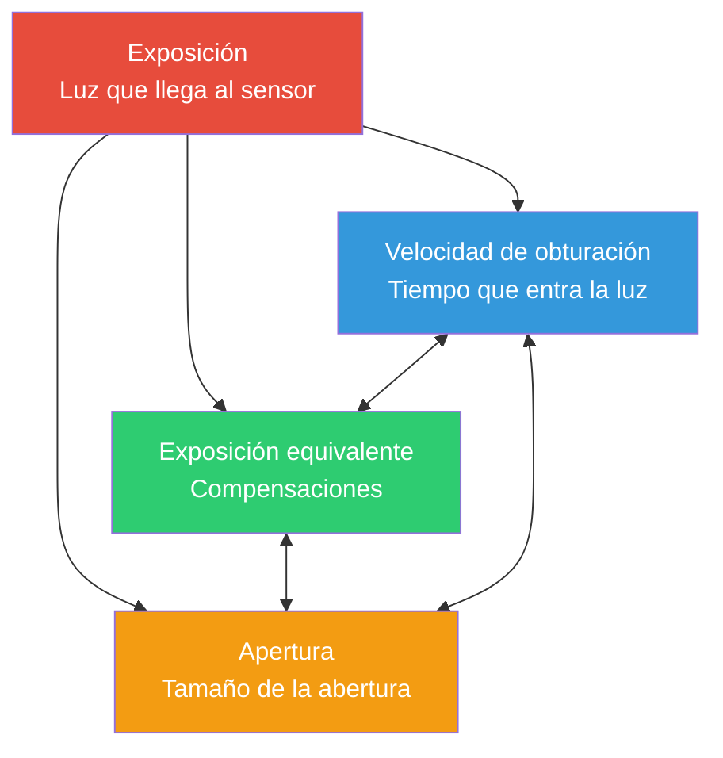

# Capítulo 13: Exposición

## El triángulo de exposición: tres controles, un objetivo

Cuando toma una foto con la cámara de un smartphone, está capturando luz. La *cantidad* de luz que llega al sensor determina si su foto es demasiado oscura (subexpuesta), demasiado brillante (sobreexpuesta) o perfecta (correctamente expuesta). Tres controles fundamentales gobiernan esto; juntos forman el **triángulo de exposición**.



**La idea central:** cada esquina del triángulo controla la luz, pero cada una introduce también una *compensación creativa*. Puede lograr la *misma* exposición total con diferentes combinaciones de los tres ajustes, pero cada combinación produce un *aspecto* diferente en su fotografía.

Antes de sumergirnos en los detalles de la API Camera2 de Android en el próximo capítulo, construyamos una base intuitiva sólida para cada elemento.

---

## ISO: Sensibilidad del sensor (control de ganancia)

En los días de la película, el **ISO** describía la *sensibilidad de la película a la luz*: la película ISO 100 era "lenta" y necesitaba una luz brillante, mientras que la película ISO 800 era "rápida" y podía disparar en interiores.

**En la fotografía digital (incluyendo las cámaras de los smartphones), el ISO es la ganancia del sensor / amplificación electrónica.** Cuando duplica el valor del ISO, está duplicando efectivamente la amplificación aplicada a la señal analógica del sensor antes de que se digitalice.

### Cómo funciona el ISO

Imagine que los pozos de píxeles del sensor recogen fotones (partículas de luz). Una vez finalizado el periodo de exposición:

1. Cada píxel convierte los fotones acumulados en una pequeña carga eléctrica.
2. Un **amplificador de ganancia analógica** multiplica esta señal por un factor correspondiente a su ajuste de ISO.
3. La señal amplificada se convierte de analógica a digital (ADC).
4. El procesamiento digital aplica después más procesos (reducción de ruido, mapeo de tonos).

**ISO 100 = ganancia base / mínima.** La señal es la que menos se amplifica, por lo que:
- Las fotos son *limpias* con un ruido digital (grano) mínimo.
- El rango dinámico (diferencia entre los tonos grabables más brillantes y más oscuros) es máximo.
- Los colores son más precisos.

**ISO 3200 = ganancia alta.** La señal se amplifica 32 veces:
- Puede disparar en escenas más tenues sin aumentar el tiempo de obturación.
- Pero obtiene un *ruido visible* (puntos de color, grano de luminancia).
- El rango dinámico y la precisión del color se degradan significativamente.

### Rango de ISO típico de un smartphone

| Rango de ISO | Característica | Caso de uso |
|-----------|---------------|----------|
| 50–200 | ISO base, imagen más limpia | Luz solar brillante, iluminación de estudio |
| 200–800 | Ganancia moderada, ruido menor | Día nublado, zonas de sombra |
| 800–3200 | Ruido visible, todavía utilizable | Iluminación interior, anochecer |
| 3200–12800+ | Ruido intenso / reducción de ruido fuerte aplicada | Escenas nocturnas, eventos con poca luz |

> **Nota sobre la realidad de los smartphones:** los teléfonos insignia suelen aplicar una fuerte reducción de ruido computacional con valores de ISO altos (procesamiento de "modo nocturno" específico del fabricante). Cuando más adelante desactive la tubería automática en Camera2, *perderá* muchas de estas optimizaciones del OEM; una advertencia crítica a la que volveremos en el Capítulo 14.

---

## Velocidad de obturación (tiempo de exposición)

La **velocidad de obturación** es simplemente *cuánto tiempo se expone el sensor a la luz*. En las cámaras tradicionales, un obturador mecánico se abre y se cierra físicamente. En los smartphones, casi siempre es un **obturador electrónico**: el sensor se resetea, se le permite recoger fotones durante una duración precisa y luego se lee.

La velocidad de obturación se mide en **segundos**, normalmente expresados como fracciones:

| Velocidad de obturación | Qué hace | Uso típico |
|--------------|-------------|-------------|
| 1/2000 s – 1/1000 s | Exposición muy corta, congela todo el movimiento | Deportes, pájaros, vehículos rápidos |
| 1/500 s – 1/250 s | Congela el movimiento humano típico | Gente caminando, niños jugando |
| 1/125 s – 1/60 s | Velocidad "segura" a mano con estabilización | Fotografía general con manos estables |
| 1/30 s – 1/15 s | Ligero desenfoque de movimiento visible, necesita trípode | Movimiento creativo, poca luz |
| 1 s – 30 s | Exposición larga, fuerte desenfoque de movimiento | Cascadas, estelas de estrellas, agua suave |
| 30 s+ | Exposición ultra larga (especializada) | Astrofotografía, pintura con luz |

### El efecto del desenfoque de movimiento

Hay **dos** razones para elegir deliberadamente una velocidad de obturación específica más allá de "suficiente luz":

1. **Congelar la acción**: un pájaro en vuelo a 1/1000 s muestra cada pluma con nitidez porque el pájaro se movió una distancia casi nula durante la exposición.

2. **Crear desenfoque de movimiento**: una cascada a 2 segundos renderiza el agua en movimiento como estelas blancas suaves y sedosas, porque cada gota de agua recorrió muchos píxeles en el sensor mientras estuvo expuesto.

Piense en ello como una pintura de larga exposición: *cualquier cosa que se mueva mientras el obturador está abierto se convierte en una estela.*

**Importante para el video:** al grabar video a 30 fps, cada fotograma se expone durante un *máximo* de ~1/30 s. Los directores de fotografía siguen la **regla del obturador de 180°**: ajustar la velocidad de obturación al doble de la velocidad de fotogramas → 1/60 s para video de 30 fps. Esto proporciona un desenfoque de movimiento natural, "cinematográfico", sin que sea demasiado entrecortado ni demasiado borroso.

---

## Apertura

La **apertura** es el tamaño de la abertura de la lente por la que pasa la luz. Se mide en **pasos f** (f/1.4, f/2.0, f/2.8, f/4.0, f/5.6, f/8.0, etc.), una *escala contraintuitiva donde los números más pequeños = mayor abertura*.

```
  f/1.4     f/2.0     f/2.8     f/4.0     f/5.6     f/8.0
█████████████████████████████████████████████████████████
█████████████████                              █████████
███████████████                                  ███████
█████████████                                    ██████
████████████                                      █████
███████████                                      ██████
```

**Reducir la luz a la mitad en cada paso:** pasar de f/1.4 → f/2.0 → f/2.8 → f/4.0 reduce a la *mitad* el área de la abertura, por lo que pasa la mitad de la luz total. Esto es un "paso" más oscuro en cada etapa.

### Compensaciones de la apertura (creativas y prácticas)

1. **Profundidad de campo (DoF)**: apertura amplia (f/1.8) = DoF *poca*; solo un plano estrecho está enfocado; todo lo que hay delante/detrás se desenfoca (bokeh). Apertura estrecha (f/8) = DoF *mucha*; todo, desde el primer plano hasta el fondo, está nítido.

2. **Recogida de luz**: f/1.4 recoge 4 veces más luz que f/2.8. Por eso las "lentes rápidas" (gran apertura máxima) son tan apreciadas para disparar con poca luz.

3. **Difracción**: con aperturas muy estrechas (f/11+), las ondas de luz se curvan alrededor de las láminas del diafragma, suavizando ligeramente la imagen. Esto suele ser irrelevante en los smartphones.

### Realidad de los smartphones

La mayoría de los smartphones tienen **lentes de apertura fija**: no se puede cambiar el paso f. Los teléfonos económicos pueden tener f/2.4–f/2.8; los insignias suelen alcanzar f/1.4–f/1.8. La [aplicación Android Camera Parameters](https://play.google.com/store/apps/details?id=com.minininja.cameraparams) le permite comprobar la apertura fija de su lente en `CameraCharacteristics`.

Unos pocos teléfonos premium (p. ej., Samsung Galaxy S23 Ultra, serie Xperia) ofrecen un mecanismo de *apertura dual* que conmuta mecánicamente entre dos pasos (p. ej., f/1.5 y f/2.4). En Camera2, consulte `LENS_INFO_AVAILABLE_APERTURES` para ver si su dispositivo admite múltiples aperturas.

**La conclusión práctica:** para la mayor parte del desarrollo con Camera2 de Android, la apertura es *fija*, por lo que se controla la exposición **solo mediante el ISO + la velocidad de obturación**. Dos controles en lugar de tres, ¡lo cual en realidad simplifica las cosas!

---

## EV: Valor de Exposición (la escala logarítmica)

Cuando los fotógrafos dicen "ajustar un paso", quieren decir **duplicar o reducir a la mitad la luz total**. Para que el pensamiento basado en pasos sea preciso, la industria estandarizó el **Valor de Exposición (EV)**.

El **EV 0** se define como la combinación de exposición que produce un brillo de referencia estándar: **1 segundo de exposición, apertura f/1.0, ISO 100**.

Cada **+1 EV duplica la luz** (más brillante). Cada **−1 EV reduce la luz a la mitad** (más oscuro):

| Cambio de EV | Significado |
|-----------|---------|
| +3 EV | 8 veces más luz (2³) |
| +2 EV | 4 veces más luz |
| +1 EV | 2 veces más luz |
| 0 EV | Referencia: 1 s @ f/1.0 ISO 100 |
| −1 EV | ½ de la luz |
| −2 EV | ¼ de la luz |
| −3 EV | ⅛ de la luz |

Lo maravilloso: **cualquier combinación de ISO + obturación + apertura que sume el mismo valor de EV produce la misma exposición total**. Este es el principio de *exposición equivalente* que conecta las tres esquinas del triángulo.

### Combinaciones de EV e ISO/obturación

Con la apertura fija, la ecuación de EV se simplifica drásticamente. Para un smartphone a f/1.8:

| Escena | EV típico | Obturación ISO 100 | Obturación ISO 400 | Obturación ISO 1600 |
|-------|-----------|----------------|-----------------|------------------|
| Playa soleada brillante | 15 | 1/4000 s | 1/1000 s | 1/250 s |
| Día brumoso / nublado | 12 | 1/500 s | 1/125 s | 1/30 s |
| Oficina interior luminosa | 8 | 1/30 s | 1/8 s | 1/2 s |
| Salón de casa de noche | 4 | 2 s | 0,5 s | 1/8 s |
| Escena nocturna estrellada | −2 | 30 s | 8 s | 2 s |

### La famosa regla Sunny 16

Antes de la medición matricial y de los sofisticados algoritmos de autoexposición, los fotógrafos confiaban en una regla empírica para clavar la exposición a la luz del día sin fotómetro:

> **En un día soleado, ajuste la apertura a f/16 y la velocidad de obturación a 1/ISO segundos.**

| Sunny 16 (f/16) | Equivalente a f/1.8 (smartphone) |
|-----------------|----------------------------------|
| ISO 100, 1/100 s, f/16 → EV 15 | ISO 100, 1/4000 s, f/1.8 → EV 15 ✓ |
| ISO 200, 1/200 s, f/16 → EV 15 | ISO 200, 1/8000 s, f/1.8 → EV 15 ✓ |

Las cuentas cuadran: f/1.8 es unos **6⅓ pasos más amplia** que f/16. ¿Cada paso cuadruplica? No, cada paso *duplica* el área de luz. 2^(6,33) ≈ 80 veces más luz. Así que el obturador debe ser 80 veces más rápido para compensar: 1/100 s ÷ 80 ≈ 1/8000 s (con ISO 200). Lo suficientemente cerca para el trabajo de campo.

---

## El aspecto de lo subexpuesto / correcto / sobreexpuesto

Comparemos mentalmente tres tomas de la misma escena (p. ej., una person en el exterior con el cielo detrás):

**Subexpuesto (−2 EV):** el sujeto está demasiado oscuro. Las sombras están *aplastadas* a negro puro sin detalles. En un histograma, todos los datos se amontonan en el lado izquierdo (oscuro). El cielo puede verse bien, pero la persona aparece como una silueta. Puede intentar "forzar" los datos sin procesar subexpuestos en el postprocesamiento, pero las sombras revelarán un ruido intenso porque está amplificando una señal débil.

**Exposición correcta (0 EV):** los tonos medios muestran una textura adecuada. El rostro de la persona tiene detalles visibles de la piel, arrugas en la camisa, reflejos en los ojos. El histograma tiene los datos repartidos por todo el rango sin recortes bruscos en ninguno de los extremos. En los teléfonos con rango dinámico limitado, esto puede significar que *algunas* luces brillantes del cielo se recorten a blanco (sin detalles del azul); es una compensación clásica frente a la subexposición del sujeto.

**Sobreexpuesto (+2 EV):** las luces están *quemadas* a blanco puro sin recuperación. El cielo es un campo plano blanco uniforme; los botones brillantes de la camisa y los reflejos especulares están recortados. El rostro de la persona puede verse favorecido (piel brillante), pero ha perdido permanentemente todo el detalle de las luces. A diferencia de las sombras subexpuestas (que a menudo se pueden recuperar parcialmente con ruido), *las luces quemadas se han ido para siempre*: simplemente no hay datos en esos píxeles.

**El mantra del fotógrafo:** *Expón para las luces, recupera las sombras.* En la captura RAW (que cubriremos más adelante), esto es especialmente potente porque el RAW de 14 bits almacena suficiente detalle en las sombras como para recuperar +2 EV o más sin un ruido catastrófico.

---

## Tabla de referencia de EV del mundo real

Memorizar algunos valores de EV emblemáticos le permite estimar la exposición en cualquier lugar:

| Escena | EV típico (a ISO 100) | Obturación aprox. @ f/1.8, ISO 400 |
|-------|------------------------|--------------------------------|
| Paisaje nevado a pleno sol | 16 | 1/4000 s |
| Playa soleada, día brillante | 15 | 1/2000 s |
| Día soleado típico | 14 | 1/1000 s |
| Día nublado / cubierto | 12 | 1/250 s |
| Muy nublado / lluvia | 11 | 1/125 s |
| Sombra abierta (persona en sombra, fondo soleado) | 9 | 1/30 s |
| Atardecer / hora dorada | 7 | 1/8 s |
| Oficina interior luminosa | 8 | 1/15 s |
| Salón de casa, solo lámparas | 4 | 1/2 s |
| Interior de restaurante oscuro | 2 | 2 s |
| Calle de la ciudad de noche (neones) | 1 | 4 s |
| Paisaje nocturno, luces de ciudad lejanas | −2 | 30 s |
| Paisaje a la luz de la luna (luna llena) | −3 | 1 minuto |
| Cielo estrellado, sin luna | −6 | 8 minutos |

Puede verificar estas aproximaciones con lo que la autoexposición de su teléfono elija realmente. Lance la [aplicación Android Camera Parameters](https://github.com/zoozooll/AndroidCameraParameters), entre en la Vista Previa en Vivo y observe `SENSOR_EXPOSURE_TIME` y `SENSOR_SENSITIVITY` mientras camina de pleno sol a una habitación oscura; verá valores reales que se corresponden aproximadamente con esta tabla.

---

## Poniéndolo todo junto: exposiciones equivalentes

Digamos que quiere la *misma exposición total* (EV 12 = día nublado, smartphone f/1.8). He aquí tres combinaciones válidas que producen el mismo brillo en el sensor:

| Combinación | ISO | Velocidad de obturación | Aspecto y sensación |
|-------------|-----|---------------|-------------|
| Limpia y nítida | 100 | 1/500 s | Ruido más limpio, congelación más nítida del movimiento |
| Término medio | 400 | 1/125 s | Ruido menor, buen equilibrio |
| Movimiento suave | 1600 | 1/30 s | Ruido visible; ligero desenfoque en sujetos en movimiento |

Las tres aterrizan en el mismo EV. Las tres *se ven igual de brillantes*. Pero la *textura* (grano de ruido) y la *representación del movimiento* son completamente diferentes. **Ese es el arte de la exposición.**

### ¿Y si necesita ambas cosas?

Aquí es donde brilla la fotografía computacional. Un teléfono en "modo nocturno" no hace *una* toma de 2 segundos; captura *docenas* de fotogramas de 1/60 s (congelando el movimiento en cada uno) y luego los alinea y promedia computacionalmente. El resultado se aproxima a la recogida de luz de una exposición larga sin la penalización del desenfoque de movimiento.

Una vez que entienda la exposición manual al nivel de Camera2, podrá implementar técnicas como esta usted mismo.

---

## Resumen

En este capítulo, cubrimos los *fundamentos de la fotografía* sin tocar una línea de código de Android:

- **Triángulo de exposición**: la velocidad de obturación (tiempo), el ISO (ganancia del sensor) y la apertura (tamaño de la abertura) se combinan para controlar la luz total. Cada uno tiene una compensación creativa.
- **ISO** en la fotografía digital = ganancia del sensor analógico. ISO bajo = limpio, ISO alto = ruidoso. Los smartphones suelen admitir ISO 100–6400+ con reducción de ruido del fabricante.
- **Velocidad de obturación** es el tiempo de exposición en segundos. Los obturadores rápidos (1/1000 s) congelan la acción; los lentos (1 s+) crean desenfoque de movimiento. La regla del obturador de 180° se aplica al video.
- **Apertura** es la abertura de la lente controlada por el paso f. La mayoría de los smartphones tienen una apertura fija, por lo que confiamos solo en el ISO + el obturador.
- **EV (Valor de Exposición)** es la escala logarítmica de pasos donde cada paso ±1 duplica/reduce a la mitad la luz. EV 0 = 1 s @ f/1.0 ISO 100.
- **Regla Sunny 16** y la tabla de referencia de EV le permiten estimar las exposiciones sin medición.
- **Exposición correcta** equilibra el detalle de los tonos medios, evitando las sombras aplastadas y las luces quemadas. El RAW preserva el margen de recuperación.

## ¿Qué sigue?

En el **Capítulo 14: Exposición manual en Camera2**, traducimos todo este modelo conceptual en llamadas concretas a la API Camera2. Aprenderá:

- Cómo desactivar la tubería de autoexposición (`CONTROL_MODE = OFF`, `CONTROL_AE_MODE = OFF`).
- Cómo traducir los valores de ISO a `SENSOR_SENSITIVITY`.
- Cómo convertir segundos legibles por humanos ↔ nanosegundos para `SENSOR_EXPOSURE_TIME`.
- Código completo de Kotlin para exposición fija de timelapse, exposición nocturna larga y una serie de bracketing de exposición de 3 tomas.
- La advertencia crítica sobre la desactivación de la reducción de ruido del fabricante al apagar el 3A.

Prepare su mente: el código empieza ahora.
