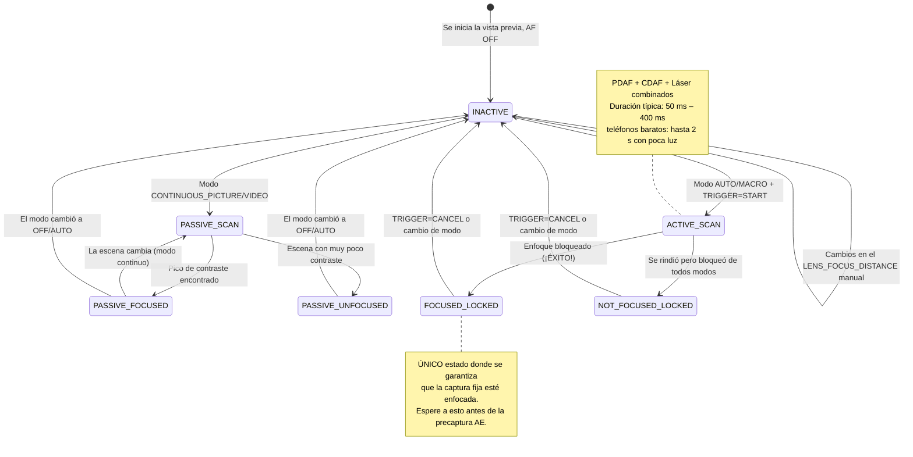

# Capítulo 15: Enfoque

La exposición controla el brillo. **El enfoque controla lo que se ve nítido.** Una foto perfectamente expuesta con un enfoque suave es una foto fallida. En este capítulo, aprenderá cómo funcionan los sistemas de enfoque de los smartphones, cómo manejar el Enfoque Automático (AF) de forma fiable a través de Camera2 y cómo implementar un control deslizante de enfoque manual suave como la seda utilizando `LENS_FOCUS_DISTANCE`.

La [aplicación Android Camera Parameters](https://github.com/zoozooll/AndroidCameraParameters) demuestra todo esto en su panel de Enfoque: puede ver la transición de la máquina de estados de AF en vivo y arrastrar el control deslizante de enfoque manual para ver cómo la lente se desplaza desde el infinito hasta la distancia mínima de enfoque.

---

## Enfoque Automático (AF) en los smartphones modernos

Antes de sumergirnos en los detalles de la API, entendamos los tres mecanismos físicos de enfoque que utilizan los smartphones.

### 1. AF por detección de contraste (CDAF): escaneo pasivo

La técnica por software: analiza el fotograma de la imagen, busca el contraste máximo en los bordes (bordes nítidos = frecuencia espacial más alta) y mueve la lente hasta que encuentra el pico de contraste.

- **Ventaja**: funciona en cualquier hardware de cámara (no se necesitan píxeles especiales).
- **Desventaja**: lento. La lente debe *oscilar* hacia adelante y hacia atrás a través del rango de enfoque. Las etiquetas de texto de la escena como "AF SCANNING" en el mapa de estados de Camera2 corresponden a esto.

### 2. AF por detección de fase (PDAF): escaneo activo

Los fotodiodos especiales del sensor se dividen en dos mitades. La diferencia de fase entre las mitades izquierda/derecha mide directamente *cuánto y en qué dirección* debe moverse la lente; no es necesario oscilar. Los teléfonos insignia de hoy en día utilizan Dual-Pixel PDAF, donde *cada* píxel realiza la detección de fase.

- **Ventaja**: extremadamente rápido (bloqueo en < 100 ms con buena luz); funciona de forma fiable en video.
- **Desventaja**: tiene dificultades con poca luz (no hay suficientes fotones para calcular la fase de forma fiable) y tiene límites de distancia mínima de enfoque.

### 3. AF por láser / AF ToF (activo): telémetro

Un módulo de hardware dedicado dispara un pulso láser infrarrojo, mide el tiempo de reflexión e informa directamente de la distancia del sujeto al ISP. Muy común en teléfonos de gama media a premium.

- **Ventaja**: bloqueo ultrarrápido en cualquier objetivo, incluso en oscuridad pura (si el objetivo refleja el IR).
- **Desventaja**: rango efectivo limitado (~50 cm–5 m máx.), falla en cristales u objetos transparentes al IR.

Los teléfonos reales combinan **los tres**: PDAF para un bloqueo rápido aproximado, CDAF para el ajuste fino y AF por láser para escenas con poca luz o de cerca. Camera2 expone esta tubería unificada como una única máquina de estados abstracta.

---

## Modos de AF: CONTROL_AF_MODE

Camera2 define estos modos de AF en `CameraMetadata`:

| Modo (CONTROL_AF_MODE_*) | Comportamiento | Caso de uso |
|-------------------------|----------|----------|
| `OFF` | Sin AF en absoluto. Usted establece `LENS_FOCUS_DISTANCE` manualmente. | Enfoque manual, apilamiento de enfoque, astrofotografía (bloqueo al infinito) |
| `AUTO` | AF de un solo disparo. No hace nada hasta que envíe `CONTROL_AF_TRIGGER = START`, luego escanea una vez y se bloquea. | Fotografía estática clásica de apuntar y disparar |
| `MACRO` | Igual que AUTO pero sesgado hacia la detección de sujetos cercanos. | Primeros planos, escaneo de documentos, "modo comida" |
| `CONTINUOUS_PICTURE` | Reenfoca constantemente, pero **pausa el reenfoque cuando dispara una captura fija** para evitar cambios de enfoque durante la toma. | Valor predeterminado para fotografía estática |
| `CONTINUOUS_VIDEO` | Reenfoca constantemente, nunca se detiene. Puede oscilar visiblemente pero mantiene el video enfocado. | Grabación de video, videollamadas |
| `EDOF` | Profundidad de campo extendida: enfoque profundo simulado por software/firmware. Sin movimiento físico de la lente. | Dispositivos económicos sin actuadores de lente móviles |

**Dos notas críticas:**

1. Los dispositivos `EDOF` (teléfonos baratos, cámaras para selfies) tienen un plano focal *fijo*. Nunca obtendrá `FOCUSED_LOCKED` de ellos; lo mejor que obtendrá es `PASSIVE_SCAN` → `PASSIVE_FOCUSED` → `INACTIVE`. La [aplicación Android Camera Parameters](https://play.google.com/store/apps/details?id=com.minininja.cameraparams) muestra explícitamente "Enfoque fijo" para estas cámaras.

2. Los modos `CONTINUOUS_*` vuelven a `INACTIVE` tras la inactividad en lugar de permanecer bloqueados. No espere `FOCUSED_LOCKED` en modo continuo; eso es solo para `AUTO`/`MACRO` + disparador explícito.

---

## La máquina de estados de AF

Camera2 informa del estado del AF a través de `CaptureResult.CONTROL_AF_STATE`. Entender estos estados es *fundamental* para secuencias de captura fija fiables.



Tabla de referencia de estados:

| CONTROL_AF_STATE | Significado | Siguiente acción |
|------------------|---------|-------------|
| `INACTIVE` (0) | El AF está desactivado, inactivo o el modo continuo no está escaneando actualmente | Si está en modo AUTO: envíe TRIGGER_START |
| `PASSIVE_SCAN` (1) | El modo continuo está escaneando pasivamente | Espere; no dispare la captura fija todavía |
| `PASSIVE_FOCUSED` (2) | El modo continuo encontró el enfoque, pero NO está bloqueado (puede desviarse) | Es seguro disparar la captura fija en CONTINUOUS_PICTURE (se bloqueará) |
| `ACTIVE_SCAN` (3) | Un disparador explícito inició un escaneo | Simplemente espere... |
| `NOT_FOCUSED_LOCKED` (4) | No se pudo encontrar el enfoque, pero la lente está bloqueada de todos modos | Aviso de advertencia al usuario; opcionalmente reintentar o capturar de todos modos |
| `FOCUSED_LOCKED` (5) | **ÉXITO.** Enfoque encontrado y bloqueado por hardware. | Proceda inmediatamente al disparador de precaptura AE |
| `PASSIVE_UNFOCUSED` (6) | El modo continuo no pudo bloquearse, sigue escaneando | Mejore la iluminación o busque un objetivo diferente |

**Regla innegociable para la fotografía estática:** *Nunca* envíe una captura fija (¡especialmente con flash!) hasta que vea `FOCUSED_LOCKED`. Si se salta este paso, lanzará una aplicación que produce fotos desenfocadas de forma intermitente.

---

## Distancia de enfoque: dioptrías, no metros

Aquí está el segundo "problema" que hace tropezar a los desarrolladores de Camera2 (después de la sorpresa del obturador en nanosegundos):

**`LENS_FOCUS_DISTANCE` utiliza dioptrías (D), no metros.** Las dioptrías son el *recíproco matemático* de la distancia de enfoque:

```
Distancia de enfoque (metros) = 1.0 / Dioptrías
Dioptrías = 1.0 / Distancia de enfoque (metros)
```

| Dioptrías (LENS_FOCUS_DISTANCE) | Distancia de enfoque física |
|--------------------------------|-------------------------|
| **0.0** | **Infinito** (∞): estrellas, montañas lejanas |
| 0.1 | 10 metros |
| 0.25 | 4 metros |
| 0.5 | 2 metros |
| 1.0 | 1 metro |
| 2.0 | 0,5 metros (50 cm) |
| 5.0 | 0,2 metros (20 cm) |
| 10.0 | 0,1 metros (10 cm) |
| 20.0 | 0,05 metros (5 cm) |

¿Por qué dioptrías? Porque el actuador de la lente se mueve linealmente con la *potencia óptica*, no con la distancia física. Un barrido de enfoque de 0.0D → 20.0D corresponde a un movimiento uniforme de la lente, mientras que un barrido de "metros" de 10 m → 5 cm sería altamente no lineal.

### Consultar la distancia mínima de enfoque

Cada lente tiene una distancia de enfoque más cercana (no se puede enfocar físicamente un objeto presionado contra el cristal). Consúltela:

```kotlin
// Valor de dioptría útil máximo para esta lente
val maxDiopters = characteristics.get(
    CameraCharacteristics.LENS_INFO_MINIMUM_FOCUS_DISTANCE
) ?: 0.0f // 0.0f = lente EDOF de enfoque fijo (¡sin control de enfoque en absoluto!)

if (maxDiopters == 0.0f) {
    Log.w("Focus", "Esta es una lente de enfoque fijo. AF manual desactivado.")
} else {
    // El rango de dioptrías válido es [0.0f .. maxDiopters]
    Log.d("Focus", "Rango de enfoque: 0.0D (inf) → $maxDiopters D (${1/maxDiopters}m de cerca)")
}
```

Valores típicos:
- Cámara trasera de teléfono barato: ~10D (enfoque mínimo de 10 cm).
- Cámara gran angular de insignia: ~15–25D (mínimo de 4–7 cm).
- Cámara macro: ~30–50D (mínimo de 2–3 cm).
- Cámara frontal para selfies: a menudo 0.0D (enfoque fijo, EDOF).

### Distancia hiperfocal (concepto)

A los fotógrafos de paisajes les encanta esto: establezca el enfoque a la **distancia hiperfocal**, y todo lo que esté desde la mitad de esa distancia hasta el infinito estará "aceptablemente nítido". En un teléfono con apertura f/1.8 y una lente gran angular estándar, la hiperfocal es aproximadamente de 0,5 a 1,0 metros.

**Regla general para smartphones:** establecer `LENS_FOCUS_DISTANCE = 2.0D` (distancia de enfoque de 50 cm) se aproxima a la hiperfocal en la mayoría de las lentes gran angular de los teléfonos. Es bueno para la fotografía de paisajes y de calle donde no se quiere esperar al AF.

```kotlin
// Ajuste preestablecido de hiperfocal aproximado "todo nítido"
const val HYPERFOCAL_DIOPTERS_APPROX = 2.0f

fun setHyperfocal(builder: CaptureRequest.Builder, characteristics: CameraCharacteristics) {
    val maxD = characteristics.get(
        CameraCharacteristics.LENS_INFO_MINIMUM_FOCUS_DISTANCE
    ) ?: 0.0f
    val diopters = min(HYPERFOCAL_DIOPTERS_APPROX, maxD.takeIf { it > 0 } ?: 0.0f)
    builder.set(CaptureRequest.CONTROL_AF_MODE, CameraMetadata.CONTROL_AF_MODE_OFF)
    builder.set(CaptureRequest.LENS_FOCUS_DISTANCE, diopters)
}
```

¿Desea calcular la hiperfocal precisa para su lente exacta? También necesitará `LENS_INFO_AVAILABLE_FOCAL_LENGTHS` (distancia focal en mm) y el tamaño físico del píxel del sensor. Para el 95% de los casos de uso de smartphones, 2.0D es lo suficientemente cerca.

---

## Ejemplo completo 1: Disparo y captura con AF de un solo toque

Este es el flujo básico de fotografía estática para el modo `AUTO` / `MACRO`. También es la secuencia exacta que la orquestación 3A del Capítulo 17 reutilizará.

**Objetivo**: El usuario toca "Capturar" → llevar el AF al enfoque bloqueado → una vez bloqueado, enviar la captura fija.

```kotlin
class AutoFocusCaptureHelper(
    private val characteristics: CameraCharacteristics,
    private val captureSession: CameraCaptureSession,
    private val previewSurface: Surface,
    private val jpegReaderSurface: Surface
) {
    private var afTriggered = false
    private var capturePlanned = false

    fun triggerAutoFocusAndCapture(onCaptureComplete: () -> Unit) {
        // ---- PASO 1: Construir solicitud repetitiva con disparador de AF explícito ----
        val triggerRequest = captureSession.device.createCaptureRequest(
            CameraDevice.TEMPLATE_PREVIEW
        ).apply {
            addTarget(previewSurface)

            // Usar modo AUTO para garantizar el estado LOCKED al final
            set(CaptureRequest.CONTROL_AF_MODE,
                CameraMetadata.CONTROL_AF_MODE_AUTO)

            // Lanzar el disparador de AF de un solo disparo AHORA
            set(CaptureRequest.CONTROL_AF_TRIGGER,
                CameraMetadata.CONTROL_AF_TRIGGER_START)
        }

        afTriggered = true
        capturePlanned = true

        // ---- PASO 2: Suscribirse a nuestra retrollamada de seguimiento de estado ----
        captureSession.setRepeatingRequest(
            triggerRequest.build(),
            object : CameraCaptureSession.CaptureCallback() {
                override fun onCaptureCompleted(
                    session: CameraCaptureSession,
                    request: CaptureRequest,
                    result: TotalCaptureResult
                ) {
                    val afState = result.get(CaptureResult.CONTROL_AF_STATE)
                        ?: return
                    Log.d("AF", "Estado de AF: $afState")

                    when (afState) {
                        // --- RUTA DE ÉXITO ---
                        CaptureResult.CONTROL_AF_STATE_FOCUSED_LOCKED -> {
                            if (capturePlanned) {
                                capturePlanned = false
                                submitStillCapture()
                                onCaptureComplete()
                            }
                        }
                        // --- RUTA DE FALLO: no se pudo bloquear, pero lo intentaremos de todos modos ---
                        CaptureResult.CONTROL_AF_STATE_NOT_FOCUSED_LOCKED -> {
                            Log.w("AF", "El AF no pudo bloquearse: capturando de todos modos (¿borroso?)")
                            if (capturePlanned) {
                                capturePlanned = false
                                submitStillCapture()
                                onCaptureComplete()
                            }
                        }
                        // --- SIGUE ESCANEANDO: ignorar ---
                        CaptureResult.CONTROL_AF_STATE_ACTIVE_SCAN,
                        CaptureResult.CONTROL_AF_STATE_PASSIVE_SCAN -> {
                            // Sigue trabajando, no hacer nada todavía
                        }
                    }
                }
            },
            null // Handler en el hilo actual
        )
    }

    private fun submitStillCapture() {
        val stillRequest = captureSession.device.createCaptureRequest(
            CameraDevice.TEMPLATE_STILL_CAPTURE
        ).apply {
            addTarget(previewSurface)
            addTarget(jpegReaderSurface)

            // Mantener el AF bloqueado para esta toma: ¡NO libere el disparador todavía!
            set(CaptureRequest.CONTROL_AF_MODE,
                CameraMetadata.CONTROL_AF_MODE_AUTO)
            // Dejar AF_TRIGGER como está (START permanece hasta que lo cancelemos explícitamente)

            set(CaptureRequest.JPEG_QUALITY, 95)
        }

        captureSession.capture(
            stillRequest.build(),
            object : CameraCaptureSession.CaptureCallback() {
                override fun onCaptureCompleted(
                    session: CameraCaptureSession,
                    request: CaptureRequest,
                    result: TotalCaptureResult
                ) {
                    // Foto capturada: ahora liberar el bloqueo de AF, volver al modo continuo
                    resetFocusToContinuous()
                }
            },
            null
        )
    }

    private fun resetFocusToContinuous() {
        val resumePreview = captureSession.device.createCaptureRequest(
            CameraDevice.TEMPLATE_PREVIEW
        ).apply {
            addTarget(previewSurface)
            set(CaptureRequest.CONTROL_AF_MODE,
                CameraMetadata.CONTROL_AF_MODE_CONTINUOUS_PICTURE)
            set(CaptureRequest.CONTROL_AF_TRIGGER,
                CameraMetadata.CONTROL_AF_TRIGGER_CANCEL)
        }
        afTriggered = false
        captureSession.setRepeatingRequest(resumePreview.build(), null, null)
    }
}
```

**Detalle crítico:** cancele el disparador *después* de que se complete la captura fija, no antes. Si lo cancela demasiado pronto, la lente se desbloquea durante la toma, produciendo una foto desenfocada.

**Salvaguarda de tiempo de espera (no mostrada):** las aplicaciones reales añaden un tiempo de espera de 2 a 3 segundos en el escaneo de AF. Si `ACTIVE_SCAN` se ejecuta durante 3 segundos y nunca alcanza `FOCUSED_LOCKED`, cancélelo y muestre al usuario un consejo como "Toque para enfocar en un área de alto contraste".

---

## Ejemplo completo 2: Control deslizante SeekBar de enfoque manual

Esta es la función de Enfoque Manual orientada al usuario que ha visto en las aplicaciones de cámara profesionales. Una SeekBar mapea el rango de enfoque físico 0.0D → maxD de forma suave.

### Diseño (res/layout/fragment_manual_focus.xml)

```xml
<LinearLayout
    xmlns:android="http://schemas.android.com/apk/res/android"
    android:layout_width="match_parent"
    android:layout_height="wrap_content"
    android:orientation="vertical"
    android:padding="16dp">

    <TextView
        android:id="@+id/tvFocusLabel"
        android:layout_width="match_parent"
        android:layout_height="wrap_content"
        android:text="Enfoque: ∞ (infinito)"
        android:textSize="14sp"/>

    <SeekBar
        android:id="@+id/seekFocus"
        android:layout_width="match_parent"
        android:layout_height="wrap_content"
        android:max="1000"/>
</LinearLayout>
```

### Kotlin: Conexión de Fragmento / Actividad

```kotlin
class ManualFocusController(
    private val seekBar: SeekBar,
    private val labelView: TextView,
    private val characteristics: CameraCharacteristics,
    private val captureSessionProvider: () -> CameraCaptureSession?,
    private val previewSurface: Surface
) {
    // El control deslizante usa 1000 pasos enteros para una precisión subdióptrica
    private val sliderSteps = 1000
    private val maxDiopters = characteristics.get(
        CameraCharacteristics.LENS_INFO_MINIMUM_FOCUS_DISTANCE
    ) ?: 0.0f

    private var currentDiopters = 0.0f

    init {
        if (maxDiopters == 0.0f) {
            seekBar.isEnabled = false
            labelView.text = "Enfoque fijo (sin AF manual)"
        } else {
            bindSeekBar()
            applyFocus(0.0f) // Empezar en el infinito
        }
    }

    private fun bindSeekBar() {
        // Convertir entero del control deslizante [0..1000] ↔ dioptrías [0.0 .. maxDiopters]
        seekBar.setOnSeekBarChangeListener(object : SeekBar.OnSeekBarChangeListener {
            private var lastUpdate = 0L

            override fun onProgressChanged(seekBar: SeekBar, progress: Int, fromUser: Boolean) {
                if (!fromUser) return

                // Limitar a ~30 fps (33 ms): evita saturar la HAL con solicitudes
                val now = SystemClock.elapsedRealtime()
                if (now - lastUpdate < 33L) return
                lastUpdate = now

                val diopters = progress.toFloat() / sliderSteps.toFloat() * maxDiopters
                applyFocus(diopters)
            }
            override fun onStartTrackingTouch(seekBar: SeekBar) {
                // Cambiar al modo AF manual completo inmediatamente cuando el usuario empieza a arrastrar
                switchToManualMode()
            }
            override fun onStopTrackingTouch(seekBar: SeekBar) {
                // Aplicar el valor exacto final para eliminar el error del limitador
                val diopters = seekBar.progress.toFloat() / sliderSteps.toFloat() * maxDiopters
                applyFocus(diopters, force = true)
            }
        })
    }

    private fun switchToManualMode() {
        // CONTROL_AF_MODE_OFF desactiva el accionamiento automático del motor de AF
        val session = captureSessionProvider() ?: return
        val request = session.device.createCaptureRequest(
            CameraDevice.TEMPLATE_PREVIEW
        ).apply {
            addTarget(previewSurface)
            set(CaptureRequest.CONTROL_AF_MODE, CameraMetadata.CONTROL_AF_MODE_OFF)
            set(CaptureRequest.CONTROL_MODE, CameraMetadata.CONTROL_MODE_USE_SCENE_MODE)
        }
        session.setRepeatingRequest(request.build(), null, null)
    }

    fun applyFocus(diopters: Float, force: Boolean = false) {
        currentDiopters = diopters.coerceIn(0.0f, maxDiopters)

        // Actualizar etiqueta: mostrar "∞" para < 0.1D, "X.Y m" en caso contrario
        labelView.text = when {
            currentDiopters < 0.1f -> "Enfoque: ∞ (infinito)"
            else -> {
                val meters = 1.0f / currentDiopters
                String.format("Enfoque: %.1f D  (%.2f m)", currentDiopters, meters)
            }
        }

        // Construir y enviar una solicitud repetitiva con la nueva distancia de enfoque
        val session = captureSessionProvider() ?: return
        val request = session.device.createCaptureRequest(
            CameraDevice.TEMPLATE_PREVIEW
        ).apply {
            addTarget(previewSurface)
            set(CaptureRequest.CONTROL_AF_MODE, CameraMetadata.CONTROL_AF_MODE_OFF)
            set(CaptureRequest.LENS_FOCUS_DISTANCE, currentDiopters)
        }

        // Usar setRepeatingRequest para que cada fotograma de la vista previa respete el nuevo enfoque
        session.setRepeatingRequest(request.build(), null, null)
    }

    // --- Ayudantes de preajustes ---
    fun setInfinity() { seekBar.progress = 0; applyFocus(0.0f, true) }
    fun setHyperfocalApprox() {
        val d = min(2.0f, maxDiopters)
        seekBar.progress = (d / maxDiopters * sliderSteps).toInt()
        switchToManualMode()
        applyFocus(d, true)
    }
    fun setNearest() { seekBar.progress = sliderSteps; applyFocus(maxDiopters, true) }
}
```

**Detalles clave de la implementación:**

1. **Limitador (Throttle)**: Las SeekBars disparan `onProgressChanged` hasta 200 Hz. Enviar una `setRepeatingRequest` en cada evento inunda la HAL de trabajo, provocando retraso (lag). Un limitador de 33 ms restringe las actualizaciones a ~30 fps, lo cual es de sobra suave para la velocidad física del motor de la lente.

2. **Cambiar pronto a CONTROL_AF_MODE_OFF**: Si está en `CONTINUOUS_PICTURE` y establece `LENS_FOCUS_DISTANCE` sin desactivar el AF, el algoritmo de AF *luchará contra usted*, devolviendo el enfoque a lo que cree correcto un fotograma después. El cambio debe ocurrir primero, en `onStartTrackingTouch`.

3. **Actualizar a través de `setRepeatingRequest`**, no de una única `capture()`. El enfoque manual debe mantenerse en *cada* fotograma de la vista previa hasta que el usuario mueva el control deslizante de nuevo.

4. **Aplicar a la fuerza al soltar**: El limitador se salta posiciones intermedias; cuando el usuario levante el dedo, aplique el valor exacto final del control deslizante.

---

## Regiones de enfoque (tocar para enfocar)

Las aplicaciones de cámara modernas permiten *tocar el visor* para elegir un objetivo de enfoque. Camera2 implementa esto a través de `CONTROL_AF_REGIONS`: una lista de rectángulos (en el espacio de coordenadas de la matriz activa) con pesos.

```kotlin
// Convertir un toque en el Visor (x,y) en una región de coordenadas del sensor CameraCharacteristics
fun createTapFocusRegion(viewfinderWidth: Int, viewfinderHeight: Int,
                         tapX: Float, tapY: Float,
                         characteristics: CameraCharacteristics): MeteringRectangle {
    val activeArray = characteristics.get(
        CameraCharacteristics.SENSOR_INFO_ACTIVE_ARRAY_SIZE
    )!!
    // Normalizar el toque [0..1] en cada eje
    val nx = tapX / viewfinderWidth.toFloat()
    val ny = tapY / viewfinderHeight.toFloat()
    // Mapear a la matriz activa del sensor, crear una región de 200×200 centrada en el toque
    val cx = (nx * activeArray.width()).toInt()
    val cy = (ny * activeArray.height()).toInt()
    val rSize = 200
    return MeteringRectangle(
        max(0, cx - rSize/2), max(0, cy - rSize/2),
        rSize, rSize,
        MeteringRectangle.METERING_WEIGHT_MAX
    )
}

// Adjuntar la región a un constructor de solicitudes
fun applyTapFocus(builder: CaptureRequest.Builder, region: MeteringRectangle) {
    builder.set(CaptureRequest.CONTROL_AF_REGIONS, arrayOf(region))
    builder.set(CaptureRequest.CONTROL_AE_REGIONS, arrayOf(region)) // ¡Vincular también el punto AE!
    builder.set(CaptureRequest.CONTROL_AF_TRIGGER,
        CameraMetadata.CONTROL_AF_TRIGGER_CANCEL) // Cancelar cualquier bloqueo previo
    builder.set(CaptureRequest.CONTROL_AF_TRIGGER,
        CameraMetadata.CONTROL_AF_TRIGGER_START)  // Iniciar escaneo en la nueva región
}
```

**Consejo profesional**: Vincule siempre `CONTROL_AE_REGIONS` para que coincida con `CONTROL_AF_REGIONS`. El usuario tocó una cara porque quiere que esa cara esté *tanto* enfocada *como* correctamente expuesta, no enfocada en la cara pero medida para el cielo brillante detrás de ella.

---

## Solución de problemas de enfoque

| Síntoma | Causa raíz | Solución |
|---------|-----------|-----|
| El estado de AF nunca pasa de ACTIVE_SCAN | Escena de bajo contraste (pared blanca, cielo azul puro) o fallo de hardware | Tiempo de espera tras ~3 s; avisar al usuario; volver al preajuste de hiperfocal |
| El control deslizante de enfoque manual no hace nada | Se olvidó establecer `CONTROL_AF_MODE = OFF` → el AF está luchando contra usted | Llame a `switchToManualMode()` en onStartTrackingTouch |
| La captura fija sale borrosa a pesar de FOCUSED_LOCKED | Se canceló el disparador de AF *antes* de que se completara la captura fija | Cancele solo en el `onCaptureCompleted` de la solicitud de *foto fija* |
| La cámara frontal ignora los comandos de enfoque | Lente EDOF de enfoque fijo (`MINIMUM_FOCUS_DISTANCE == 0`) | Degradación elegante: desactive la interfaz de enfoque para esa cámara |
| El AF de video "oscila" mucho | Uso de `CONTINUOUS_PICTURE` en lugar de `CONTINUOUS_VIDEO` para la grabación de video | Cambie el modo a CONTINUOUS_VIDEO cuando se inicie el MediaRecorder |

---

## Resumen

El enfoque en Camera2 es una máquina de estados que debe manejar explícitamente, no un ajuste de "establecer y olvidar":

- **Hardware de AF**: Los smartphones combinan AF por detección de contraste, AF por detección de fase (Dual-Pixel) y AF por láser para bloqueos rápidos y fiables.
- **Modos**: `AUTO` (disparo único, se bloquea), `CONTINUOUS_PICTURE` (reenfoca, pausa para fotos), `CONTINUOUS_VIDEO` (siempre reenfocando), `MACRO`, `OFF` (manual). Las lentes EDOF no tienen enfoque móvil.
- **Estados**: Espere a `FOCUSED_LOCKED` (no solo a `PASSIVE_FOCUSED`) antes de capturas fijas de gran valor.
- **Dioptrías**: `LENS_FOCUS_DISTANCE` utiliza la distancia recíproca (0.0D = ∞, 10D = 10 cm). El rango es `[0.0 .. LENS_INFO_MINIMUM_FOCUS_DISTANCE]`.
- **Captura con AF de un solo disparo**: `TRIGGER = START` → esperar `FOCUSED_LOCKED` → enviar foto fija → luego `CANCEL`.
- **Control deslizante de enfoque manual**: SeekBar con 1000 pasos, limitada a 30 fps; cambie primero el modo a `AF_MODE_OFF` para que el algoritmo automático no luche contra su ajuste manual.
- **Tocar para enfocar**: usa `CONTROL_AF_REGIONS` en coordenadas de la matriz activa del sensor. Vincúlelo con `AE_REGIONS` para obtener resultados profesionales.

## ¿Qué sigue?

Brillo ✓ Nitidez ✓. Ahora vamos a arreglar el **color**. En el **Capítulo 16: Balance de blancos y color**, cubriremos:

- El Balance de Blancos Automático (AWB) y los 7 preajustes (Incandescente → Sombra).
- Corrección manual del color con `COLOR_CORRECTION_GAINS` (4 canales R/G/B/G) y `COLOR_CORRECTION_TRANSFORM` (matriz RGB 3×3).
- El concepto de temperatura de color (vela de 2000K → sombra de 10000K) y cómo se mapea al balance de blancos.
- Código funcional para un preajuste de "aspecto de atardecer" de tono cálido y un modo de desactivación completa del AWB manual.

El color es la etapa final de la trilogía de controles manuales.
