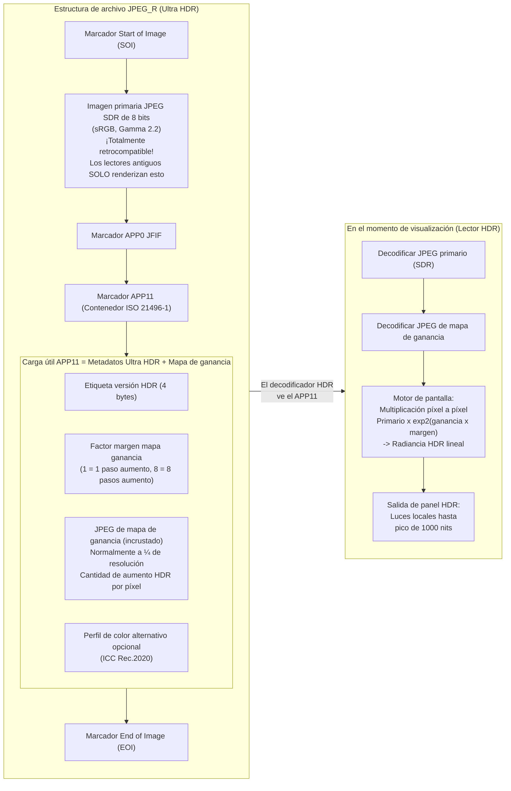

# Capítulo 21: HDR y Ultra HDR

La fotografía de Rango Dinámico Estándar (SDR) —sRGB de 8 bits por canal codificado con una curva gamma 2.2 y masterizado para pantallas de 100 nits— fue diseñada para los CRT de la década de 1990. Los sensores de los smartphones modernos capturan **de 10 a 14 pasos de rango dinámico** (contraste de escena de 1024:1 a 16384:1), pero un JPEG SDR de 8 bits solo puede renderizar unos 6 pasos antes de quemar las luces o aplastar las sombras con ruido. Los formatos de **Alto Rango Dinámico (HDR)** solucionan esto almacenando la radiancia de la escena en más de 10 bits por canal, utilizando funciones de transferencia perceptualmente uniformes o referidas a la escena, y apuntando a luminosidades máximas de pantalla de 1.000 a 10.000 nits en lugar de 100.

Este capítulo cubre tres estándares de HDR que funcionan en Android Camera2:
- **HDR10** (10 bits, ST.2084 PQ, Rec.2020, metadatos estáticos) para video.
- **HLG (Hybrid Log-Gamma)** (10 bits, retrocompatible con SDR, ARIB STD-B67) para emisión y video.
- **JPEG_R / Ultra HDR** (Android 14 API 34+, ISO 21496-1): el revolucionario formato de foto fija que incrusta un "mapa de ganancia" secundario dentro de un JPEG SDR estándar de 8 bits para que los visores antiguos vean una foto normal, mientras que las pantallas HDR aumentan localmente las luces hasta en 8 pasos.

Los tres están documentados en las secciones *Ultra HDR / JPEG_R* y *Dynamic Range* del documento de investigación del proyecto, que también especifica el mandato de la Clase de Rendimiento 15 del CDD (Compatibility Definition Document) de Android de que todos los dispositivos insignia de 2024+ deben exponer JPEG_R como formato de salida al tamaño máximo de foto fija. Puede verificar el soporte de HDR10, HLG y JPEG_R por ID de cámara en la aplicación [Android Camera Parameters](https://github.com/zoozooll/AndroidCameraParameters) en la [Play Store](https://play.google.com/store/apps/details?id=com.zoozooll.cameraparameters), que enumera cada clave de `DynamicRangeProfiles` e informa si `ImageFormat.JPEG_R` aparece en `getOutputSizes()`.

## Fundamentos del rango dinámico: Por qué 8 bits no son suficientes

Antes de sumergirnos en los formatos específicos, definamos qué significa "rango dinámico" para la pantalla frente a la captura:

| Métrica | SDR (sRGB/BT.709) | HDR10 (BT.2100) | Visión humana |
|--------|-------------------|------------------|--------------|
| **Profundidad de bits** | 8 bits / canal (256 niveles) | 10 bits / canal (1024 niveles) | ~4,8 bits perceptuales, pero logarítmicos |
| **Luminancia máxima** | 100 nits (cd/m²) | Más de 1.000 nits pico (según contenido) | ~20.000 nits (sol+cielo) a ~0,001 nits (habitación oscura) |
| **Función de transferencia** | Gamma 2.2 o sRGB a trozos | Cuantificador Perceptual (PQ) ST.2084 | Respuesta logarítmica (ley de Weber-Fechner) |
| **Gama de colores** | sRGB / BT.709 (~35% de lo visible) | Rec.2020 (~75% de lo visible) | Espectro visible completo |
| **Relación contraste (usable)** | ~6 pasos (64:1) | ~10 pasos (1024:1) mínimo | ~14 pasos (16384:1) en una sola escena |

La curva gamma utilizada por el SDR fue diseñada para coincidir con la no linealidad del cañón de electrones de los CRT de los años 90, no con el sistema visual humano. La curva PQ (Perceptual Quantizer) utilizada por el HDR10 fue estandarizada en 2014 por Dolby y la BBC bajo la norma ST.2084, y se ajusta matemáticamente al modelo de Barten de sensibilidad al contraste humano, de modo que cada uno de los 1.024 valores de código en PQ de 10 bits representa una diferencia apenas perceptible (JND) en el brillo a lo largo de todo el rango de 0 a 10.000 nits.

```mermaid
flowchart TD
    subgraph SDRpath["Tubería Captura SDR 8 bits -> Pantalla"]
        S1["Sensor lineal<br/>RAW de 14 bits"] --> S2["Curva Gamma 2.2<br/>(Destruye detalle en sombras)"]
        S2 --> S3["Cuantificación de 8 bits<br/>(Solo 22 códigos para<br/>0–10% luminancia)"]
        S3 --> S4["Recorte gama sRGB<br/>(Se pierde 25% colores)"]
        S4 --> S5["Pico 100 nits<br/>(Cielo/Sol recortan a blanco)"]
    end

    subgraph HDRpath["Tubería Captura HDR10 10 bits -> Pantalla"]
        H1["Sensor lineal<br/>RAW de 14 bits"] --> H2["Curva PQ ST.2084<br/>(Ajustada a modelo JND)"]
        H2 --> H3["Cuantificación de 10 bits<br/>(140 códigos para<br/>0–10% luminancia)"]
        H3 --> H4["Gama Rec.2020<br/>(75% colores visibles)"]
        H4 --> H5["Pico 1000+ nits<br/>(Detalle cielo preservado)"]
    end

    style SDRpath fill:#ffeded,stroke:#b91c1c
    style HDRpath fill:#e8fff0,stroke:#15803d
```



El diagrama de Mermaid anterior cuantifica las dos diferencias más importantes: el SDR utiliza solo unos 22 códigos de 8 bits para el 10% inferior de la luminancia (lo que provoca bandas en las sombras al subirlas), mientras que el PQ asigna 140 códigos de 10 bits al mismo rango. La uniformidad perceptual de la curva PQ es la razón por la que el HDR de 10 bits se ve más suave que el SDR de 8 bits, incluso cuando se reduce el muestreo a 100 nits en una pantalla SDR.

## Video HDR10: PQ de 10 bits + Rec.2020 + Metadatos estáticos

El HDR10 es el formato base de video HDR: todos los smartphones de 2021+ con pantalla OLED admiten la reproducción de HDR10, y todos los SoC Snapdragon 865+ / Exynos 2100+ admiten la grabación de HDR10 a través de Camera2. El formato especifica:

- Codificación **HEVC Main10 Profile** (H.265) con muestras de 10 bits.
- Función de transferencia **ST.2084 PQ** en lugar de gamma.
- Primarios de color **Rec.2020 (BT.2100)** (gama amplia).
- **Metadatos estáticos** (SMPTE ST 2086 / CTA-861.3) en el mensaje SEI de HEVC:
  - `max_content_light_level` (MaxCLL): luminancia máxima de cualquier píxel individual, en nits.
  - `max_frame_average_light_level` (MaxFALL): luminancia media del fotograma más brillante.
  - `display_primaries` y `white_point`: volumen de color de la pantalla de masterización.
  - `max_luminance` / `min_luminance`: pico y nivel de negro de la pantalla de masterización.

Metadatos estáticos significa que un único conjunto de valores se aplica a toda la duración del video. La variante de metadatos dinámicos (HDR10+, la alternativa de Samsung a Dolby Vision) no se expone a través de Camera2 estándar —requiere extensiones del fabricante—, pero el HDR10 con metadatos estáticos se admite universalmente a través de `DynamicRangeProfiles`.

### Consulta del soporte de HDR10 y HLG a través de DynamicRangeProfiles

Android 13 (API 33) introdujo `CameraCharacteristics.REQUEST_AVAILABLE_DYNAMIC_RANGE_PROFILES` como alternativa estructurada a la comprobación manual del soporte del formato de 10 bits en `StreamConfigurationMap`. Cada superficie de salida tiene un perfil elegido en el momento de la creación de la sesión:

```kotlin
import android.hardware.camera2.CameraCharacteristics
import android.hardware.camera2.params.DynamicRangeProfiles
import android.util.Size

data class HdrVideoProfile(
    val profile: Long, // DynamicRangeProfiles.HDR10, HLG10, etc.
    val supportedSizes: List<Size>,
    val standardSizesFallbacks: List<Size>
)

fun enumerateHdrProfiles(
    characteristics: CameraCharacteristics
): List<HdrVideoProfile> {
    val profiles: DynamicRangeProfiles? =
        characteristics.get(
            CameraCharacteristics.REQUEST_AVAILABLE_DYNAMIC_RANGE_PROFILES
        ) ?: return emptyList()

    val configMap = characteristics.get(
        CameraCharacteristics.SCALER_STREAM_CONFIGURATION_MAP
    ) ?: return emptyList()

    return listOf(
        DynamicRangeProfiles.HDR10,
        DynamicRangeProfiles.HLG,
        DynamicRangeProfiles.HDR10_PLUS, // A menudo nulo en dispositivos no Samsung
        DynamicRangeProfiles.DOLBY_VISION_10B_HDR_OEM // Requiere licencia de Dolby
    ).mapNotNull { profile ->
        if (!profiles.isProfileSupported(profile)) return@mapNotNull null

        val hdrSizes = profiles.getProfileSupportedSizes(profile)
            ?.toList() ?: emptyList()
        val sdrFallbackSizes = configMap.getOutputSizes(
            android.graphics.ImageFormat.PRIVATE
        )?.toList() ?: emptyList()

        HdrVideoProfile(profile, hdrSizes, sdrFallbackSizes)
    }
}
```

El método `DynamicRangeProfiles.getProfileSupportedSizes(profile)` devuelve la *intersección* de los tamaños capaces de 10 bits y el soporte de la tubería HDR del ISP. Si `Size(3840, 2160)` (4K UHD) no aparece en `getProfileSupportedSizes(HDR10)`, entonces aunque se admita 4K SDR, la HAL no tiene suficiente rendimiento de ISP para la codificación 4K HDR10 (normalmente un límite de 600 megapíxeles/seg en la serie Snapdragon 8). La aplicación Android Camera Parameters muestra esta tabla de intersección en la pestaña HDR para que pueda verificarlo antes de escribir el código de la sesión.

### Establecer HDR10 en la OutputConfiguration para grabación

El perfil de rango dinámico debe establecerse **antes de que se cree la sesión** a través de `OutputConfiguration.setDynamicRangeProfile()`. Cambiar el perfil a mitad de la sesión requiere desmontar y recrear la sesión.

```kotlin
import android.hardware.camera2.params.DynamicRangeProfiles
import android.hardware.camera2.params.OutputConfiguration
import android.media.MediaCodec
import android.media.MediaCodecInfo
import android.view.Surface

fun createHdr10VideoOutput(
    encoderSurface: Surface,
    previewSurface: Surface
): Pair<OutputConfiguration, OutputConfiguration> {
    val encodeOutConfig = OutputConfiguration(encoderSurface).apply {
        setDynamicRangeProfile(DynamicRangeProfiles.HDR10)
    }
    val previewOutConfig = OutputConfiguration(previewSurface).apply {
        setDynamicRangeProfile(DynamicRangeProfiles.HDR10)
    }
    return Pair(encodeOutConfig, previewOutConfig)
}

fun configureHdr10MediaCodec(width: Int, height: Int): MediaCodec {
    val codec = MediaCodec.createEncoderByType("video/hevc")
    val format = android.media.MediaFormat.createVideoFormat(
        "video/hevc", width, height
    ).apply {
        setInteger(MediaFormat.KEY_COLOR_FORMAT,
            MediaCodecInfo.CodecCapabilities.COLOR_FormatSurface)
        setInteger(MediaFormat.KEY_BIT_RATE, 80_000_000) // 80 Mbps para 4K HDR10
        setInteger(MediaFormat.KEY_FRAME_RATE, 30)
        setInteger(MediaFormat.KEY_I_FRAME_INTERVAL, 1)
        setInteger(MediaFormat.KEY_PROFILE,
            MediaCodecInfo.CodecProfileLevel.HEVCProfileMain10)
        setInteger(MediaFormat.KEY_COLOR_STANDARD,
            MediaFormat.COLOR_STANDARD_BT2020)
        setInteger(MediaFormat.KEY_COLOR_TRANSFER,
            MediaFormat.COLOR_TRANSFER_ST2084) // ST.2084 PQ
        setInteger(MediaFormat.KEY_COLOR_RANGE,
            MediaFormat.COLOR_RANGE_LIMITED)
        setFeatureEnabled(MediaCodecInfo.CodecCapabilities.FEATURE_HdrEditing, true)
    }
    codec.configure(format, null, null, MediaCodec.CONFIGURE_FLAG_ENCODE)
    return codec
}
```

Las tres claves `COLOR_*` (`BT2020`, `ST2084`, `LIMITED`) combinadas con `HEVCProfileMain10` crean un flujo HDR10 exacto bit a bit. Si omite `KEY_COLOR_TRANSFER` o lo establece en un valor incorrecto (p. ej., `COLOR_TRANSFER_GAMMA_2_2`), YouTube y otros reproductores interpretarán el flujo de 10 bits como SDR y lo reproducirán lavado o sobresaturado.

## HLG (Hybrid Log-Gamma): HDR de emisión retrocompatible con SDR

El HLG (estandarizado como ARIB STD-B67 por la BBC y la NHK en 2015) se diseñó para la televisión en directo, donde no se puede saber de antemano si el espectador tiene una pantalla HDR o SDR. La innovación del HLG es una **función de transferencia híbrida por trozos**:
- El 50% inferior del rango de códigos es una curva gamma estándar (coincide exactamente con el SDR).
- El 50% superior es una curva logarítmica (almacena el detalle de las luces HDR).

Esto significa que un video HLG reproducido en una pantalla SDR se ve idéntico a un video SDR gamma 2.2 correctamente ajustado, mientras que una pantalla HDR "desbloquea" la mitad superior logarítmica y renderiza luces de hasta 1.000 nits sin ninguna señalización de metadatos. No se requiere un mapeo de tonos explícito SDR→HDR.

Para el uso en video, el HLG difiere del HDR10 en tres aspectos relevantes para Camera2:
1. **No requiere metadatos estáticos**: el HLG está referido a la escena, por lo que la pantalla deriva el brillo pico de la propia señal. Esto simplifica la configuración del MediaCodec (sin inserción de SEI para MaxCLL/MaxFALL).
2. **Diferente constante de transferencia de color**: use `MediaFormat.COLOR_TRANSFER_HLG` en lugar de `ST2084`.
3. **Comprobación de `DynamicRangeProfiles.HLG`** en lugar de `HDR10`.

Todo el resto del uso de la API (setDynamicRangeProfile de OutputConfiguration, creación de sesión, CaptureRequest) es idéntico a HDR10. El documento de investigación señala que el HLG es el formato preferido para el video generado por el usuario compartido en plataformas sociales, porque se renderiza correctamente tanto en pantallas SDR como HDR sin artefactos de mapeo de tonos.

## JPEG_R (Ultra HDR): SDR ISO 21496-1 + Mapa de ganancia incrustado

El mayor avance en la fotografía HDR móvil desde la captura HDR multifotograma es el **JPEG_R**, introducido en Android 14 (API 34) y codificado como el estándar internacional **ISO 21496-1**. El formato es retrocompatible por construcción:

> Un archivo JPEG_R es un JPEG SDR estándar de 8 bits por canal con un **JPEG secundario más pequeño (el "mapa de ganancia")** incrustado en el segmento del marcador `APP11` utilizando el formato de contenedor ISO 21496-1. Los decodificadores JPEG antiguos ignoran los marcadores APP no reconocidos y renderizan solo el primario de 8 bits. Los decodificadores conscientes de HDR leen tanto el primario como el mapa de ganancia, y reconstruyen la radiancia de la escena HDR lineal original multiplicando los valores de los píxeles primarios por exp2(píxel_del_mapa_de_ganancia × factor_de_margen) píxel a píxel.

Este "aumento por píxel" es lo que hace que el Ultra HDR sea *localmente* HDR (a diferencia de los metadatos estáticos de HDR10, que aplican un valor de pico globalmente). Un mapa de ganancia ISO 21496-1 a ¼ de resolución (típico) puede codificar hasta **8 pasos de margen de luces local**, suficiente para recuperar el detalle de las nubes en un atardecer manteniendo los tonos medios con una luminancia SDR natural.

La Clase de Rendimiento 15 del CDD de Android ordena:
- Todos los dispositivos que anuncien CDD PC-15 (insignias de 2024+ según la tabla de especificaciones del CDD) **DEBEN** admitir la salida `ImageFormat.JPEG_R` al tamaño máximo de captura de foto fija.
- El tamaño máximo de captura de foto fija para JPEG_R debe ser ≥ el tamaño máximo de YUV para ese ID de cámara.

La sección *Ultra HDR / JPEG_R* del documento de investigación contiene un desglose completo a nivel de bytes de la disposición del marcador APP11, pero para la API Camera2 solo necesita tratar a `ImageFormat.JPEG_R` como un único búfer de salida opaco: la HAL ensambla el primario + el mapa de ganancia internamente.



El detalle crítico en el diagrama de Mermaid: el JPEG PRIMARIO es una foto SDR de 8 bits totalmente válida, por lo que incluso una biblioteca JPEG de la década de 2010 puede renderizar una imagen de aspecto correcto. Los datos HDR son *aditivos*, no sustituyen al archivo primario; por eso los archivos JPEG_R funcionan perfectamente con todas las plataformas de intercambio de fotos existentes (Instagram, Google Fotos, Mensajes) que aún no tienen decodificadores Ultra HDR.

### Consulta del soporte de JPEG_R y captura de fotos fijas Ultra HDR

La captura de fotos fijas Ultra HDR es funcionalmente idéntica a la captura de JPEG estándar, con dos diferencias:
1. Consulte `ImageFormat.JPEG_R` en `StreamConfigurationMap.getOutputSizes()` en lugar de `ImageFormat.JPEG`.
2. Si está utilizando `DynamicRangeProfiles` (recomendado), establezca el perfil de la salida JPEG_R en `DynamicRangeProfiles.JPEG_R`.

```kotlin
import android.graphics.ImageFormat
import android.hardware.camera2.CameraCharacteristics
import android.hardware.camera2.CameraDevice
import android.hardware.camera2.CaptureRequest
import android.hardware.camera2.params.DynamicRangeProfiles
import android.hardware.camera2.params.OutputConfiguration
import android.media.ImageReader
import android.util.Size

var jpegRImageReader: ImageReader? = null

fun queryJpegRSupport(
    characteristics: CameraCharacteristics
): Pair<Boolean, Size?> {
    val caps = characteristics.get(
        CameraCharacteristics.REQUEST_AVAILABLE_CAPABILITIES
    ) ?: intArrayOf()
    val supportsDynamicRange = caps.contains(
        CameraCharacteristics.REQUEST_AVAILABLE_CAPABILITIES_DYNAMIC_RANGE_TEN_BIT
    )
    val drProfiles = characteristics.get(
        CameraCharacteristics.REQUEST_AVAILABLE_DYNAMIC_RANGE_PROFILES
    )
    val supportsJpegRProfile =
        drProfiles?.isProfileSupported(DynamicRangeProfiles.JPEG_R) == true

    val configMap = characteristics.get(
        CameraCharacteristics.SCALER_STREAM_CONFIGURATION_MAP
    ) ?: return Pair(false, null)

    val jpegRSizes = configMap.getOutputSizes(ImageFormat.JPEG_R)
        ?: emptyArray()
    val maxJpegR = jpegRSizes.maxByOrNull { it.width * it.height }

    return Pair(
        supportsDynamicRange && supportsJpegRProfile && jpegRSizes.isNotEmpty(),
        maxJpegR
    )
}

fun setupJpegRCapture(
    cameraDevice: CameraDevice,
    maxJpegRSize: Size,
    previewSurface: Surface
) {
    jpegRImageReader = ImageReader.newInstance(
        maxJpegRSize.width, maxJpegRSize.height,
        ImageFormat.JPEG_R, 2
    )

    val jpegROutput = OutputConfiguration(
        jpegRImageReader!!.surface
    ).apply {
        setDynamicRangeProfile(DynamicRangeProfiles.JPEG_R)
    }
    val previewOutput = OutputConfiguration(previewSurface)

    val outputs = listOf(previewOutput, jpegROutput)
    val sessionConfig = android.hardware.camera2.params.SessionConfiguration(
        android.hardware.camera2.params.SessionConfiguration.SESSION_REGULAR,
        outputs,
        { r -> backgroundHandler.post(r) },
        object : android.hardware.camera2.CameraCaptureSession.StateCallback() {
            override fun onConfigured(
                session: android.hardware.camera2.CameraCaptureSession
            ) {
                val stillBuilder = cameraDevice.createCaptureRequest(
                    CameraDevice.TEMPLATE_STILL_CAPTURE
                ).apply {
                    addTarget(previewSurface)
                    addTarget(jpegRImageReader!!.surface)
                    set(CaptureRequest.CONTROL_MODE,
                        CaptureRequest.CONTROL_MODE_USE_SCENE_MODE)
                    set(CaptureRequest.CONTROL_SCENE_MODE,
                        CaptureRequest.CONTROL_SCENE_MODE_HDR)
                    // Disparar la fusión HDR multifotograma de la HAL antes de la codificación JPEG_R
                }

                session.capture(stillBuilder.build(),
                    JpegRCaptureCallback(), backgroundHandler)
            }
            override fun onConfigureFailed(
                s: android.hardware.camera2.CameraCaptureSession
            ) = Log.e(TAG, "Fallo en la sesión JPEG_R")
        }
    )
    cameraDevice.createCaptureSession(sessionConfig)
}
```

Establecer `CONTROL_SCENE_MODE_HDR` junto con `TEMPLATE_STILL_CAPTURE` activa la tubería de bracketing y fusión HDR multifotograma de la HAL (normalmente 3 fotogramas a -2 / 0 / +2 EV, alineados y mezclados antes de dividirse en el primario SDR + mapa de ganancia de 8 pasos para la codificación ISO 21496-1). Omitir el modo de escena sigue produciendo un archivo JPEG_R válido, pero el margen del mapa de ganancia se limitará al rango dinámico nativo del sensor (~10 pasos) en lugar del rango dinámico de la fusión computacional (~14–16 pasos).

### Recibir y guardar la imagen JPEG_R

El `OnImageAvailableListener` para JPEG_R es idéntico a nivel de bytes a un escuchador JPEG: la HAL ya ha concatenado el primario + el mapa de ganancia APP11 en un único búfer:

```kotlin
import java.io.File
import java.io.FileOutputStream

inner class JpegRCaptureCallback : ImageReader.OnImageAvailableListener {
    override fun onImageAvailable(reader: ImageReader) {
        reader.acquireLatestImage()?.use { image ->
            val buffer = image.planes[0].buffer
            val jpegRBytes = ByteArray(buffer.remaining())
            buffer.get(jpegRBytes)

            val outFile = File(getExternalFilesDir(null),
                "ULTRA_HDR_${System.currentTimeMillis()}.jpg")
            FileOutputStream(outFile).use { it.write(jpegRBytes) }
        }
    }
}
```

Guardar como `.jpg` (no con una extensión personalizada) es fundamental para la compatibilidad: los visores de fotos antiguos miran la extensión del archivo antes de inspeccionar su contenido, y una extensión `.jpg` garantiza que intentarán decodificar el primario SDR estándar antes de ver siquiera el marcador APP11.

## Resumen comparativo de formatos HDR

| Criterio | HDR10 (Video) | HLG (Video) | JPEG_R / Ultra HDR (Fija) |
|-----------|---------------|-------------|-----------------------------|
| **Profundidad de bits** | HEVC Main10 de 10 bits | HEVC Main10 de 10 bits | Primario 8 bits + mapa ganancia 8 bits → neto ~12 bits equiv. |
| **Nits pico (contenido)** | 1.000–10.000 (metadatos estáticos) | 1.000 nits típico (ref. a la escena) | ~2.000 nits (8 pasos × margen 8 bits según ISO 21496-1) |
| **Retrocompatible** | No: la reproducción en SDR se ve lavada sin mapeo de tonos | **Sí**: las pantallas SDR renderizan la mitad gamma perfectamente | **Sí**: los lectores antiguos solo renderizan el primario SDR de 8 bits |
| **Tipo rango dinámico** | Global (metadatos estáticos por video) | Global (ref. a escena, sin metadatos) | **Local (mapa ganancia por píxel)**: puede subir las nubes sin lavar la piel |
| **Puntos entrada API** | `DynamicRangeProfiles.HDR10` + `MediaFormat.COLOR_TRANSFER_ST2084` | `DynamicRangeProfiles.HLG` + `MediaFormat.COLOR_TRANSFER_HLG` | `ImageFormat.JPEG_R` + `DynamicRangeProfiles.JPEG_R` |
| **Versión Android** | API 33+ (DynamicRangeProfiles) | API 33+ | API 34+ (Android 14), mandato PC-15 del CDD |
| **Caso de uso** | Video HDR cinematográfico para YouTube/Netflix | Emisión en directo, video social UGC | Fotografía HDR retrocompatible con todas las plataformas de fotos del mundo |

## Resumen

Este capítulo ha cubierto las tres tecnologías HDR que funcionan en Android Camera2:

- **Fundamentos del rango dinámico**: la gamma de 8 bits y el pico de 100 nits del SDR no pueden representar los 14 pasos capturados por los sensores modernos. PQ (HDR10) y HLG utilizan curvas de 10 bits optimizadas perceptualmente para ajustarse a todo el rango dinámico del sensor.
- **Video HDR10**: utiliza `DynamicRangeProfiles.HDR10` en la OutputConfiguration, codificación HEVC Main10 con `COLOR_TRANSFER_ST2084` (PQ), primarios `COLOR_STANDARD_BT2020` y metadatos estáticos SMPTE ST 2086.
- **Video HLG**: utiliza `DynamicRangeProfiles.HLG`, `COLOR_TRANSFER_HLG` y sin metadatos estáticos. Es retrocompatible con SDR por diseño, lo que lo hace ideal para emisiones y video generado por el usuario.
- **JPEG_R / Ultra HDR** (API 34+, ISO 21496-1, mandato PC-15 del CDD): incrusta un mapa de ganancia por píxel en el marcador APP11 de un JPEG SDR estándar de 8 bits. Los decodificadores antiguos renderizan la imagen primaria; los decodificadores HDR aplican el mapa de ganancia para obtener hasta 8 pasos de margen de luces local.
- Los dos diagramas de Mermaid (tuberías SDR frente a HDR, estructura de archivo JPEG_R) visualizan las rutas de codificación y renderizado.

## ¿Qué sigue?

En el **Capítulo 22: Extensiones de cámara**, salimos de la `CameraCaptureSession` estándar para entrar en el mundo de la fotografía computacional acelerada por el fabricante a través de `CameraExtensionSession`. Aprenderá a consultar `CameraExtensionCharacteristics.getSupportedExtensions()` para Noche (mezcla de larga exposición multifotograma), Bokeh (desenfoque de fondo inferido por profundidad / modo retrato), HDR (fusión de múltiples exposiciones), Retoque facial (suavizado de piel por ML) y Automático (extensión elegida por la HAL). El capítulo incluye un ejemplo completo de captura de retrato utilizando EXTENSION_BOKEH, explica `getEstimatedCaptureLatencyRangeMillis()` para los indicadores de progreso de la UI y utiliza un diagrama de Mermaid para contrastar la tubería de sesión estándar con la tubería de sesión de extensión que descarga el trabajo de ML y fusión en el DSP del proveedor.

Verifique qué extensiones de cámara admite su dispositivo por ID de cámara en la aplicación [Android Camera Parameters](https://play.google.com/store/apps/details?id=com.zoozooll.cameraparameters); la pestaña Extensions enumera cada constante de `Extension` y sus tamaños de captura admitidos. Los nuevos informes de dispositivos enviados al [proyecto en GitHub](https://github.com/zoozooll/AndroidCameraParameters) ayudan a construir una base de datos pública del soporte de extensiones de los fabricantes.
