# Capítulo 19: Video de alta velocidad

El video en cámara lenta captura momentos que el ojo humano no puede resolver: gotas de agua desprendiéndose de un grifo a 120 fps (cámara lenta 4x), el aleteo de un colibrí a 240 fps (cámara lenta 8x) o el estallido de un globo a 960 fps (cámara lenta 32x en algunos insignias de Samsung). Implementar la captura a alta velocidad de fotogramas en Android Camera2 no es simplemente cuestión de establecer `SENSOR_FRAME_DURATION` en un número pequeño: debe utilizar un tipo de sesión dedicado llamado **`CameraConstrainedHighSpeedCaptureSession`**, enviar ráfagas de fotogramas previamente validadas a través de **`createHighSpeedRequestList`** y restringir sus tamaños/resoluciones de salida a una lista de configuraciones "aprobadas para alta velocidad" por dispositivo devuelta por **`SCALER_STREAM_CONFIGURATION_MAP.getHighSpeedVideoSizes`**.

Este capítulo se basa directamente en la sección *High-Speed Sessions* del documento de investigación del proyecto, que evalúa el coste de CPU de enviar 240 CaptureRequest individuales por segundo (prohibitivo: hasta un 70% de uso de CPU en un Snapdragon 8 Gen 2, frente a < 5% con la lista de ráfagas restringidas) y enumera las restricciones exactas que la HAL impone en los recuentos de salida, los rangos de FPS y los tipos de plantillas. Puede consultar qué rangos de FPS admite su dispositivo para cada ID de cámara en la aplicación [Android Camera Parameters](https://github.com/zoozooll/AndroidCameraParameters) (también disponible en la [Google Play Store](https://play.google.com/store/apps/details?id=com.zoozooll.cameraparameters)), que expone la salida bruta de `getHighSpeedVideoSizes()` y `getHighSpeedVideoFpsRangesFor()` en su panel de Stream Configurations.

## Por qué las sesiones estándar no funcionarán a 240 FPS

Antes de sumergirse en la API de alta velocidad dedicada, entienda qué hace que la captura a 240 fps sea fundamentalmente diferente de la de 30 fps:

- **Rendimiento (Throughput)**: un fotograma 1080p en YUV_420_888 de 8 bits ocupa ~3,0 MB. A 240 fps esto supone **720 MB/s** de datos de píxeles fluyendo por la memoria: 8 veces la carga de 30 fps, y suficiente para saturar un enlace MIPI D-PHY v1.2 a todo ancho de banda.
- **Presupuesto de latencia**: un único intervalo de fotograma a 240 fps es de **4,167 ms**. Si el servicio de cámara de Android tarda más de 2 ms solo en organizar un paquete CaptureRequest desde el espacio de usuario a la HAL, ya habrá consumido el 50% de su presupuesto antes de que el sensor empiece a exponer.
- **Tolerancia a la fluctuación (Jitter)**: las llamadas individuales a `capture()` / `setRepeatingRequest()` pasan por el puente Framework → CameraService → HAL a través de binder IPC, lo que introduce una fluctuación de ±1 ms bajo carga. A 240 fps, incluso una fluctuación de ±1 ms provoca inconsistencias visibles en la duración de los fotogramas y deriva en la sincronización A/V.
- **Sobrecarga de CPU**: cada `CaptureRequest` requiere la construcción de objetos, la organización de paquetes, la transacción binder y la validación en el lado de la HAL. Hacer esto 240 veces por segundo en el espacio de usuario fue medido por el equipo de investigación en un **68–74% de uso sostenido de CPU en un Snapdragon 8 Gen 2** (Cortex-X3 + A715), lo que acabará con la fluidez de la vista previa, agotará la batería en 20 minutos y hará que la HAL térmica falle mucho antes de que grabe un clip utilizable.

La **Sesión de captura de alta velocidad restringida (Constrained High-Speed Capture Session)** soluciona todos estos problemas al colapsar N CaptureRequest individuales en **una lista de ráfagas previamente validada que el planificador de hardware de la HAL consume directamente**, evitando por completo la sobrecarga de binder por fotograma.

```mermaid
flowchart TD
    subgraph Standard["Sesión de captura estándar (30/60 FPS)"]
        S1["La App construye una CaptureRequest<br/>por fotograma vía Builder"] --> S2["Binder IPC a CameraService<br/>(1 llamada por fotograma)"]
        S2 --> S3["CameraService valida y<br/>despacha a la HAL"]
        S3 --> S4["La HAL planifica el fotograma<br/>en la tubería ISP del sensor"]
        S4 --> S5["Salida del fotograma<br/>→ Surface / MediaCodec"]
    end

    subgraph HighSpeed["CameraConstrainedHighSpeedCaptureSession (120/240 FPS)"]
        H1["La App llama a createHighSpeedRequestList()<br/>UNA VEZ: construye lista de ráfagas"] --> H2["La HAL prevalida TODOS los fotogramas<br/>de la lista (tiempos, tamaños, FPS)"]
        H2 --> H3["Lista de ráfagas cargada en el<br/>planificador hardware de la HAL"]
        H3 --> H4["El planificador maneja el sensor + ISP<br/>directamente: SIN binder por fotograma"]
        H4 --> H5["Salida de 240 fotogramas/seg<br/>-> Codificador de video MediaCodec"]
    end
```



El diagrama hace explícita la diferencia arquitectónica: la ruta estándar tiene una cascada de binder IPC para cada fotograma, mientras que la ruta de alta velocidad construye y valida la planificación una vez, y luego deja que el secuenciador de hardware dedicado de la HAL entregue los fotogramas sin interrupción.

## Rangos de FPS admitidos y factores de cámara lenta

La API Camera2 de Android no expone la "cámara lenta" como una función, sino que expone pares de **`FpsRange`** `[mín, máx]` donde mín == máx para la captura a FPS fijos. El factor de reproducción a cámara lenta se deriva dividiendo los FPS de captura por los FPS de reproducción (que es casi siempre de 30 fps para el video de consumo):

| FPS de captura | `FpsRange` fijo | Reproducción a 30 fps → Factor cámara lenta | Resolución mínima típica | Nivel de dispositivo típico |
|-------------|------------------|----------------------------------------|----------------------------|---------------------|
| 120 | `[120, 120]` | 120 ÷ 30 = **4x más lento** | 1280×720 (720p) | Gama media y superior |
| 240 | `[240, 240]` | 240 ÷ 30 = **8x más lento** | 1280×720 o 1920×1080 | Insignia (serie Snapdragon 8, Exynos 2xxx) |
| 480 | `[480, 480]` | 480 ÷ 30 = **16x más lento** | 720p (normalmente recortado) | Teléfonos gaming (Black Shark, ROG Phone, RedMagic) |
| 960 | `[960, 960]` | 960 ÷ 30 = **32x más lento** | 720p (búfer en DRAM, ráfagas cortas < 0,5 s) | Samsung Galaxy S/Ultra, Sony Xperia serie 1 |

Fundamentalmente, **los modos de 960 fps y 480 fps suelen ser modos de "súper cámara lenta" que requieren almacenamiento en búfer en la DRAM del sensor** y solo capturan unos 0,33–0,5 segundos de metraje antes de llenar el búfer; estos modos NO se exponen a través de `CameraConstrainedHighSpeedCaptureSession` (la sesión estándar no puede seguir el ritmo) y, en su lugar, se gestionan mediante extensiones específicas del fabricante o a través del ExtensionsManager de CameraX en dispositivos incluidos en la lista blanca del OEM. Este capítulo se centra en los 120 fps y 240 fps, que son los dos rangos que la API estándar de alta velocidad restringida de Camera2 admite universalmente.

## Consulta de tamaños y rangos de FPS para alta velocidad

La forma correcta de enumerar las configuraciones de alta velocidad admitidas **NO** es `getOutputSizes()`: los tamaños de salida normales suelen incluir 1080p, pero la HAL puede rechazar 1080p a 240 fps debido a los límites de ancho de banda MIPI. Debe llamar a dos métodos específicos de `StreamConfigurationMap`:

```kotlin
import android.hardware.camera2.CameraCharacteristics
import android.hardware.camera2.params.StreamConfigurationMap
import android.util.Range
import android.util.Size

data class HighSpeedProfile(
    val size: Size,
    val fpsRanges: List<Range<Int>>
)

fun queryHighSpeedProfiles(
    characteristics: CameraCharacteristics
): List<HighSpeedProfile> {
    val configMap: StreamConfigurationMap? =
        characteristics.get(CameraCharacteristics.SCALER_STREAM_CONFIGURATION_MAP)
            ?: return emptyList()

    val highSpeedSizes: Array<Size> =
        configMap.highSpeedVideoSizes ?: return emptyList()

    return highSpeedSizes.map { size ->
        val fpsRangesForSize =
            configMap.getHighSpeedVideoFpsRangesFor(size)?.toList()
                ?: emptyList()
        HighSpeedProfile(size, fpsRangesForSize)
    }
}
```

La propiedad `highSpeedVideoSizes` es la lista autorizada. Si un tamaño 1080p no aparece aquí, intentar crear una sesión de alta velocidad restringida a 1080p lanzará una `IllegalArgumentException` aunque `getOutputSizes(PRAGMA)` lo incluya. El documento de investigación señala que los insignias de 2021–2024 admiten universalmente `Size(1920, 1080)` tanto con `[120,120]` como con `[240,240]`, mientras que los dispositivos de gama media solo admiten `Size(1280, 720)` con `[120,120]`.

La aplicación Android Camera Parameters muestra la salida exacta de `highSpeedVideoSizes` y `getHighSpeedVideoFpsRangesFor()` en la pestaña Stream Config → High-Speed, para que pueda confirmar la salida de su código con un enumerador probado.

## Restricciones impuestas por la HAL

La sección *High-Speed Sessions* del documento de investigación del proyecto enumera las restricciones exactas de entrada/salida que `createCaptureSession` validará antes de que se cree una `CameraConstrainedHighSpeedCaptureSession`. Si viola cualquier restricción, recibirá una retrollamada `onConfigureFailed()` sin ninguna explicación:

| ID de restricción | Requisito |
|---------------|-------------|
| **HS-1** | El recuento de superficies de salida debe ser ≤ 2. Combinación típica: `superficie de entrada MediaCodec` + `vista previa SurfaceView`. NO se permite añadir una 3ª superficie (p. ej. `ImageReader` para fotos fijas). |
| **HS-2** | TODAS las superficies de salida DEBEN tener tamaños incluidos en `highSpeedVideoSizes` (mismo tamaño para ambas superficies, o un tamaño de la lista por superficie). |
| **HS-3** | El rango de FPS en cada CaptureRequest de la ráfaga DEBE proceder de `getHighSpeedVideoFpsRangesFor(size)` para el tamaño elegido. NO se permite el FPS adaptativo `[30,120]`: el mínimo debe ser igual al máximo para FPS fijos. |
| **HS-4** | Solo se permiten las plantillas `TEMPLATE_RECORD` y `TEMPLATE_PREVIEW`. `TEMPLATE_STILL_CAPTURE`, `TEMPLATE_MANUAL` y `TEMPLATE_VIDEO_SNAPSHOT` son rechazadas por `createHighSpeedRequestList`. |
| **HS-5** | La longitud de la ráfaga de `createHighSpeedRequestList()` debe ser ≥ 2 fotogramas. El planificador de la HAL necesita al menos un intervalo de fotograma completo para precargar la temporización. |
| **HS-6** | El formato de salida está restringido a `PRIVATE` (superficie SurfaceView / MediaCodec) o `YUV_420_888` (ImageReader para procesamiento en el dispositivo). Se prohíben `JPEG`, `RAW_SENSOR` y `HEIC`. |
| **HS-7** | `CONTROL_AE_TARGET_FPS_RANGE` se bloquea en el valor de FPS de la ráfaga una vez que la sesión está activa. Intentar cambiarlo en una ráfaga posterior hará que esa ráfaga se ignore silenciosamente. |

La restricción **HS-1** es la que más se viola en la práctica: los desarrolladores intentan conectar un ImageReader para el análisis YUV por fotograma junto con la codificación MediaCodec, y la HAL rechaza silenciosamente la configuración. Si necesita vista previa + codificación + procesamiento por fotograma simultáneos a 240 fps, use la superficie de salida de MediaCodec **y** lea los fotogramas YUV del ByteBuffer de salida del codificador a través de `MediaCodec.dequeueOutputBuffer()` con filtrado de `BUFFER_FLAG_KEY_FRAME`; nunca conecte dos salidas YUV independientes.

## Configuración de la sesión de alta velocidad restringida y grabación

### Paso 1: Construir el MediaRecorder / Codificador MediaCodec

Por simplicidad, el código siguiente utiliza `MediaRecorder` (que gestiona internamente la mezcla de audio). Para la codificación HEVC o el streaming de baja latencia, usaría `MediaCodec.createEncoderByType("video/hevc")` directamente, pero la Surface que alimenta a ambos es idéntica.

```kotlin
import android.hardware.camera2.CameraDevice
import android.hardware.camera2.CameraConstrainedHighSpeedCaptureSession
import android.hardware.camera2.CaptureRequest
import android.media.MediaRecorder
import android.util.Size
import android.view.SurfaceView
import java.io.File

lateinit var cameraDevice: CameraDevice
lateinit var mediaRecorder: MediaRecorder
lateinit var recordingSurface: Surface
lateinit var previewSurface: Surface
var chosenHighSpeedSize: Size = Size(1920, 1080)
var chosenFpsRange: Range<Int> = Range(240, 240)

fun setupMediaRecorder(outputFile: File,
                       size: Size,
                       fps: Int) {
    mediaRecorder = MediaRecorder().apply {
        setAudioSource(MediaRecorder.AudioSource.MIC)
        setVideoSource(MediaRecorder.VideoSource.SURFACE)
        setOutputFormat(MediaRecorder.OutputFormat.MPEG_4)
        setOutputFile(outputFile.absolutePath)

        setVideoEncodingBitRate(40_000_000) // 40 Mbps para 1080p a 240 fps
        setVideoFrameRate(fps)
        setVideoSize(size.width, size.height)
        setVideoEncoder(MediaRecorder.VideoEncoder.HEVC) // H.265 para mejor tamaño

        setAudioEncodingBitRate(192_000)
        setAudioSamplingRate(48_000)
        setAudioChannels(2)
        setAudioEncoder(MediaRecorder.AudioEncoder.AAC)

        setCaptureRate(fps.toDouble()) // ESTO ES LO QUE ACTIVA LA CÁMARA LENTA
        // ^ Captura a fps variables, pero la reproducción en los metadatos MP4 = 30 fps,
        //   lo que resulta en una cámara lenta de (fps / 30)x

        prepare()
    }
    recordingSurface = mediaRecorder.surface
}
```

La línea crítica que realmente crea la cámara lenta (en lugar de solo una reproducción a alta velocidad) es **`setCaptureRate(fps.toDouble())`**. Esto escribe un cuadro `tkhd` de MP4 con una escala de tiempo de reproducción de 30 fps y una duración por fotograma igual a `1/fps` segundos en el momento de la captura. La mayoría de los reproductores de video (YouTube, Instagram, Google Fotos, ExoPlayer) respetan los metadatos de la tasa de captura y reproducen el clip a 30 fps, ofreciendo la ralentización de 4x (120÷30) u 8x (240÷30) que esperan los usuarios.

### Paso 2: Crear la CameraConstrainedHighSpeedCaptureSession

El nombre del constructor de la sesión es una señal clara: en lugar de `createCaptureSession`, llama a **`createConstrainedHighSpeedCaptureSession`** y proporciona una lista de salida limitada a las reglas de restricción (≤ 2 superficies, ambas de highSpeedVideoSizes).

```kotlin
import android.hardware.camera2.CameraCaptureSession
import android.os.Handler
import android.view.Surface

fun createHighSpeedSession(
    previewSurfaceView: SurfaceView,
    backgroundHandler: Handler
) {
    previewSurface = previewSurfaceView.holder.surface

    val outputSurfaces = listOf(previewSurface, recordingSurface)

    cameraDevice.createConstrainedHighSpeedCaptureSession(
        outputSurfaces,
        object : CameraCaptureSession.StateCallback() {
            override fun onConfigured(session: CameraCaptureSession) {
                val highSpeedSession =
                    session as CameraConstrainedHighSpeedCaptureSession

                val recordBuilder = cameraDevice.createCaptureRequest(
                    CameraDevice.TEMPLATE_RECORD
                ).apply {
                    addTarget(previewSurface)
                    addTarget(recordingSurface)
                    set(
                        CaptureRequest.CONTROL_AE_TARGET_FPS_RANGE,
                        chosenFpsRange
                    )
                    set(
                        CaptureRequest.CONTROL_MODE,
                        CaptureRequest.CONTROL_MODE_AUTO
                    )
                }

                val highSpeedRequestList =
                    highSpeedSession.createHighSpeedRequestList(
                        recordBuilder.build()
                    )

                highSpeedSession.setRepeatingBurst(
                    highSpeedRequestList,
                    null, // ¡Saltar retrollamadas por fotograma a 240 fps!
                    backgroundHandler
                )

                // Ahora iniciar el MediaRecorder cuando el usuario toca el botón RECORD
                mediaRecorder.start()
            }

            override fun onConfigureFailed(session: CameraCaptureSession) {
                Log.e(TAG, "FALLO en la configuración de la sesión de alta velocidad. " +
                      "Compruebe que se cumplen las restricciones HS-1..HS-7.")
            }
        },
        backgroundHandler
    )
}
```

Cada línea aquí es deliberada y se mapea directamente a una restricción del documento de investigación:
- **`TEMPLATE_RECORD`** → cumple la restricción HS-4.
- **`CONTROL_AE_TARGET_FPS_RANGE = [240,240]`** → cumple la restricción HS-3.
- **Exactamente 2 superficies de salida** (vista previa + grabación) → cumple la restricción HS-1.
- **`createHighSpeedRequestList(recordBuilder.build())`** → crea la ráfaga de longitud mínima (2 fotogramas) prevalidada que el planificador de la HAL consume directamente.
- **CaptureCallback por fotograma es `null`** → otra optimización de rendimiento. Habilitar las retrollamadas por fotograma a 240 fps provoca inundaciones de binder IPC de ~2 MB/s de paquetes CaptureResult, lo cual es medible en la ralentización de la CPU por la HAL térmica. Habilite las retrollamadas solo para ventanas de depuración cortas, nunca en grabaciones de producción.

## Arquitectura: Tubería normal frente a tubería de alta velocidad (Mermaid detallado)

```mermaid
flowchart LR
    subgraph NormalPipeline["Tubería de grabación normal a 30/60 FPS"]
        NP1[Lectura sensor 30 fps] --> NP2[Tubería ISP completa:<br/>Demosaic + NR + Color + Tono]
        NP2 --> NP3[Cola de Framework:<br/>cada CaptureRequest vía Binder]
        NP3 --> NP4[Bloque codificador hardware<br/>JPEG / HEVC]
        NP4 --> NP5[Escritor archivos /<br/>Transmisor de red]
    end

    subgraph HSPipeline["Tubería de alta velocidad restringida a 240 FPS"]
        HP1[Lectura sensor 240 fps<br/>vía modo MIPI D-PHY High-Speed] --> HP2[ISP mínima / rápida:<br/>Binning + Reducción de ruido ligera<br/>(Sin mapeo de tonos intenso)]
        HP2 --> HP3["Planificador hardware HAL<br/>Lista ráfagas (prevalidada)<br/><- SIN binder por fotograma"]
        HP3 --> HP4["Codificador HEVC / H.264 dedicado<br/>(Modo de alto rendimiento)"]
        HP4 --> HP5[MediaRecorder mezcla<br/>audio + contenedor MP4]
    end

    style HSPipeline fill:#fff4dd,stroke:#c58111
    style NormalPipeline fill:#e5f3ff,stroke:#2563eb
```

El ISP de alta velocidad (bloque HP2) es intencionadamente **ligero**: la mayoría de los insignias reducen la resolución del demosaicing mediante un agrupamiento de 2x, se saltan la reducción de ruido temporal multifotograma (solo espacial de un fotograma) y aplican una curva de tonos lineal en lugar de la gamma estándar no lineal, todo para mantenerse dentro del presupuesto de 4,167 ms/fotograma. Por eso el video a 240 fps se ve más suave y ruidoso que el video a 30 fps a la misma resolución: no es su imaginación, es una compensación deliberada del ISP impuesta por la física.

## Benchmarks de sobrecarga de CPU del documento de investigación

La sección *High-Speed Sessions* del documento de investigación del proyecto contiene las siguientes mediciones empíricas en un Snapdragon 8 Gen 2 (Xiaomi 13) a una resolución de 1920×1080:

| Configuración | Uso de CPU (Núcleos grandes) | Uso de CPU (Núcleos pequeños) | Tiempo de ralentización térmica | Fotogramas perdidos/10 min |
|---------------|----------------------|--------------------------|-----------------------|----------------------|
| **Sesión estándar, 60 fps, repeatingRequest** | 8% | 12% | > 30 min | 0 |
| **Sesión estándar, 120 fps, repeatingRequest** | 34% | 41% | ~11 min | 218 fotogramas |
| **Sesión estándar, 240 fps, repeatingRequest** | **68–74%** | **59–62%** | **~3,5 min** | **4.890 fotogramas** |
| **Sesión HS restringida, 120 fps, repeatingBurst** | **< 3%** | **< 5%** | **> 30 min** | **0** |
| **Sesión HS restringida, 240 fps, repeatingBurst** | **< 5%** | **< 7%** | **> 30 min** | **2 fotogramas** |

Los números hablan por sí solos. La lista de ráfagas restringidas a 240 fps utiliza **~8 veces menos CPU** que el enfoque de sesión estándar, nunca se ralentiza y solo pierde 2 fotogramas en 10 minutos (debido a una única interrupción térmica). Por ello, `CameraConstrainedHighSpeedCaptureSession` es **la única ruta admitida para la grabación a alta velocidad**: cualquier otro enfoque es técnicamente funcional pero prácticamente inutilizable debido a problemas térmicos, de batería y de pérdida de fotogramas.

## Detener la grabación y liberar recursos

La secuencia de apagado para las sesiones de alta velocidad depende del orden: detenga el MediaRecorder **antes** de abortar la ráfaga repetitiva, ya que detener la ráfaga primero vacía la superficie de entrada del codificador y puede perder el último fotograma clave necesario para el átomo `moov` del MP4.

```kotlin
import android.hardware.camera2.CameraConstrainedHighSpeedCaptureSession

fun stopHighSpeedRecording(
    highSpeedSession: CameraConstrainedHighSpeedCaptureSession
) {
    try {
        // 1. DETENER MEDIARECORDER PRIMERO
        mediaRecorder.stop()
        mediaRecorder.reset()
    } catch (e: RuntimeException) {
        // No se grabaron fotogramas válidos: no se escribió el átomo MP4; ignorar
    }

    // 2. Abortar ráfaga repetitiva
    highSpeedSession.stopRepeating()

    // 3. Abortar cualquier captura pendiente
    highSpeedSession.abortCaptures()

    // 4. Cerrar sesión
    highSpeedSession.close()

    // 5. Liberar MediaRecorder AL FINAL
    mediaRecorder.release()
}
```

## Resumen

Este capítulo ha cubierto la implementación completa de la grabación a cámara lenta a 120 fps y 240 fps a través de la ruta de alta velocidad restringida de Android Camera2:

- **CameraConstrainedHighSpeedCaptureSession** es la única API compatible para altas velocidades de fotogramas, porque las CaptureRequest individuales por fotograma a través de binder provocan una sobrecarga de CPU prohibitiva (68%+ a 240 fps, ralentización térmica en 3,5 minutos según los benchmarks de investigación).
- **`getHighSpeedVideoSizes()` + `getHighSpeedVideoFpsRangesFor(size)`** son los enumeradores autorizados; los resultados de `getOutputSizes()` normales pueden ser rechazados por la HAL.
- **Factor de cámara lenta** = fps de captura ÷ 30 fps de reproducción: 120 fps → 4x lento, 240 fps → 8x lento. Use `MediaRecorder.setCaptureRate(fps)` para incrustar los metadatos de reproducción a cámara lenta correctos en el contenedor MP4.
- **`createHighSpeedRequestList(builder.build())`** es obligatorio. Esto prevalida cada fotograma de una lista de ráfagas y lo carga directamente en el planificador de hardware de la HAL, eliminando el binder IPC por fotograma.
- Se imponen estrictamente **7 restricciones de la HAL (HS-1 a HS-7)**. El fallo más común: > 2 superficies de salida.
- El **diagrama Mermaid de arquitectura** muestra el ISP ligero/rápido utilizado a 240 fps (agrupamiento, NR ligero) frente al ISP completo en la tubería de 30 fps.

## ¿Qué sigue?

En el **Capítulo 20: Cámara múltiple**, entramos en el mundo de las cámaras lógicas de Android 9+: dispositivos virtuales que agrupan varias cámaras físicas con la misma orientación (ultra gran angular, gran angular, teleobjetivo) y permiten que la HAL cambie de lente de forma transparente en los umbrales de zoom. Aprenderá a recuperar `getPhysicalCameraIds()`, a diferenciar entre la sincronización de sensores APPROXIMATE y CALIBRATED, y a utilizar **`OutputConfiguration.setPhysicalCameraId()`** para capturar fotogramas de los sensores gran angular y teleobjetivo simultáneamente en una única CaptureRequest para el emparejamiento de disparidad en fotografía computacional.

Consulte la aplicación [Android Camera Parameters](https://play.google.com/store/apps/details?id=com.zoozooll.cameraparameters) para ver si su dispositivo informa de `REQUEST_AVAILABLE_CAPABILITIES_LOGICAL_MULTI_CAMERA` y examine la lista completa de ID de cámaras físicas por dispositivo lógico en el [repositorio de GitHub](https://github.com/zoozooll/AndroidCameraParameters) de código abierto; las contribuciones con informes de nuevos dispositivos son siempre bienvenidas.
