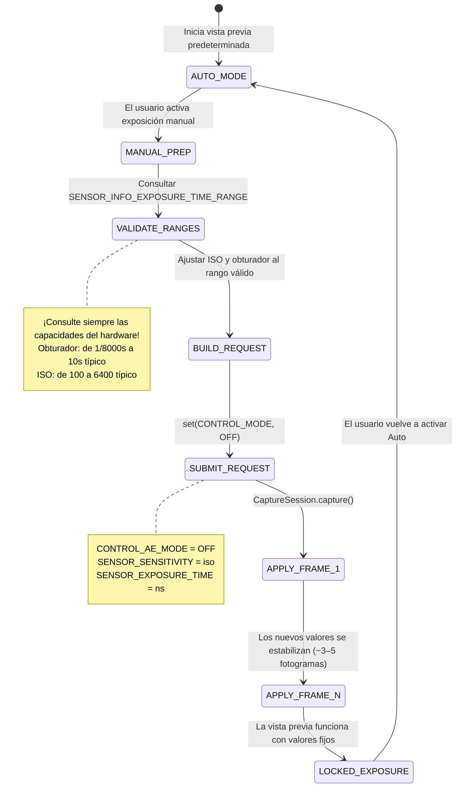

# Capítulo 14: Exposición manual en Camera2

Con la teoría fotográfica del Capítulo 13 en su haber, es hora de traducir los conceptos en código. En este capítulo, aprenderá a **tomar el control total** del sistema de exposición automática (AE) de la cámara y a establecer el ISO y la velocidad de obturación manualmente con la API Camera2.

La [aplicación Android Camera Parameters](https://github.com/zoozooll/AndroidCameraParameters) demuestra cada técnica de este capítulo: puede seguirla en vivo cambiando al modo Manual en la aplicación y ajustando los controles deslizantes de ISO y Obturador para ver los resultados en tiempo real.

---

## El gran cambio: de AUTO → MANUAL

Por defecto, cada `CaptureRequest` que envía se ejecuta bajo la tubería automática 3A integrada de la cámara (Enfoque Automático, Exposición Automática, Balance de Blancos Automático). Para pasar al modo manual, debe **desactivar explícitamente** esa tubería.

Hay dos niveles de anulación:

| Nivel | Ajuste | Qué sucede |
|-------|---------|-------------|
| 1. Desactivar solo AE | `CONTROL_AE_MODE = OFF` | El ISO + el obturador pasan a ser manuales; AF y AWB se siguen ejecutando automáticamente |
| 2. Desactivar 3A completo | `CONTROL_MODE = OFF` | **Todos** los algoritmos 3A se detienen; cada parámetro 3A debe establecerse manualmente |

Para una exposición manual fiable, establezca **ambos**. Desactivar solo `CONTROL_AE_MODE` en algunos dispositivos todavía deja que el postprocesamiento del fabricante "ayude" entre bastidores. Establecer `CONTROL_MODE = OFF` es el camino más limpio y predecible.



**Latencia de transición:** cuando envía una solicitud de captura manual, los nuevos valores de ISO/obturador no aparecen en el *siguiente* fotograma. Los sensores CMOS tienen latencia en la tubería: el fotograma *actual* ya se está exponiendo con los ajustes antiguos. Espere **de 3 a 5 fotogramas de transición** antes de que los valores se estabilicen. La [aplicación Android Camera Parameters](https://play.google.com/store/apps/details?id=com.minininja.cameraparams) espera explícitamente a que el `CaptureResult` confirme que los valores solicitados coinciden con los aplicados antes de informar que están "bloqueados".

---

## Controles manuales en la API Camera2

### SENSOR_SENSITIVITY (ISO)

Camera2 expresa el ISO como `CaptureRequest.SENSOR_SENSITIVITY`: un entero que se mapea directamente a la escala aritmética de ISO. En la mayoría de los dispositivos, este mapeo es 1:1:

| ISO del fotógrafo | Valor de SENSOR_SENSITIVITY |
|-------------------|--------------------------|
| 100 | 100 |
| 400 | 400 |
| 3200 | 3200 |
| 6400 | 6400 |

**Consulte siempre el rango válido.** No codifique los valores a piñón fijo:

```kotlin
val sensorSensitivityRange = characteristics.get(
    CameraCharacteristics.SENSOR_INFO_SENSITIVITY_RANGE
)
val minIso = sensorSensitivityRange?.lower ?: 100
val maxIso = sensorSensitivityRange?.upper ?: 6400
```

Algunos teléfonos de gama ultra-premium informan de un rango como 50–12800, mientras que los dispositivos económicos pueden bloquearle en 100–3200. Los valores fuera del rango son recortados por la HAL, lo cual anula el propósito de su control manual.

### SENSOR_EXPOSURE_TIME (Obturador en nanosegundos)

Aquí está el primer "problema" que hace tropezar a todo nuevo desarrollador de Camera2: **la velocidad de obturación se almacena como nanosegundos (ns), no como segundos.** Los humanos pensamos en 1/60s; la HAL piensa en 16.666.666 ns.

Convertir entre ellos es aritmética sencilla:

```kotlin
// Segundos → Nanosegundos (multiplicar por 1.000.000.000)
fun secondsToNs(seconds: Double): Long = (seconds * 1_000_000_000.0).toLong()

// Nanosegundos → Segundos para visualización al usuario
fun nsToSeconds(ns: Long): Double = ns.toDouble() / 1_000_000_000.0

// Formateador de cadena amigable para humanos (p. ej., "1/60s" o "2.5s")
fun formatShutter(ns: Long): String {
    val seconds = nsToSeconds(ns)
    return when {
        seconds >= 1.0 -> String.format("%.1fs", seconds)
        else -> {
            val fraction = (1.0 / seconds).toInt()
            "1/${fraction}s"
        }
    }
}
```

**Conversiones comunes como referencia:**

| Obturador humano | Nanosegundos (ns) |
|--------------|-------------------|
| 1/8000s | 125.000 |
| 1/1000s | 1.000.000 |
| 1/500s | 2.000.000 |
| 1/120s (regla 180° para 24fps) | 8.333.333 |
| 1/60s | 16.666.666 |
| 1/30s | 33.333.333 |
| 1/15s | 66.666.666 |
| 1s | 1.000.000.000 |
| 2s | 2.000.000.000 |
| 10s | 10.000.000.000 |
| 30s | 30.000.000.000 |

**De nuevo, consulte el rango de hardware:**

```kotlin
val exposureTimeRange = characteristics.get(
    CameraCharacteristics.SENSOR_INFO_EXPOSURE_TIME_RANGE
)
val minShutterNs = exposureTimeRange?.lower ?: 1_000_000L   // Mínimo 1/1000s
val maxShutterNs = exposureTimeRange?.upper ?: 10_000_000_000L  // Máximo 10s
```

En dispositivos que admiten exposiciones ultra largas (p. ej., algunos modelos de Sony Xperia y Google Pixel), `SENSOR_INFO_EXPOSURE_TIME_RANGE.upper` puede superar los 30.000.000.000 ns (30 s). Respete este límite: las solicitudes que superen el máximo son recortadas silenciosamente.

---

## ⚠️ Crítico: Degradación de la calidad del modo manual

**Esta es la advertencia más importante del capítulo.** No se la salte.

Cuando establece `CONTROL_MODE = OFF` (anulación manual completa), no solo está desactivando los *algoritmos* AE/AF/AWB; en casi todos los dispositivos Android, también está **desactivando el postprocesamiento computacional patentado del fabricante** que normalmente se ejecuta dentro de la tubería 3A.

Específicamente, la investigación y el análisis de HAL3 revelan que desactivar 3A suele apagar:

| Paso de procesamiento | Modo AUTO | Modo MANUAL (CONTROL_MODE = OFF) |
|-----------------|-----------|-----------------------------------|
| Reducción de ruido multifotograma | ✓ Activo: salida con ruido reducido | ✗ APAGADO: ruido visible del sensor en crudo |
| Mapeo de tonos adaptativo / Fusión HDR | ✓ Activo: luces + sombras recuperadas | ✗ APAGADO: solo curva de un único fotograma |
| Mejora de contraste local (MiraVision, etc.) | ✓ Varía según la escena | ✗ Curva genérica plana |
| Medición facial / detección de escena | ✓ Prioriza exposición para caras | ✗ Ignorado |
| Corrección de sombreado de lente / viñeteado | ✓ Calibrado por lente | ✗ A menudo reducido o apagado |

**Resultado:** una foto en modo manual a ISO 3200 y 1/15s se verá *visiblemente peor* (más ruidosa, contraste más plano) que la misma escena capturada en modo AUTO con el *mismo* ISO y obturador que eligió la HAL.

**¿Qué puede hacer?** Dos opciones realistas:

1. **Postprocesar usted mismo.** Dado que ha desactivado el procesamiento del fabricante, puede aplicar su propia reducción de ruido (p. ej., filtro bilateral de OpenCV, reductor de ruido de MediaPipe o una CNN entrenada a medida) en su tubería de procesamiento. La captura RAW (véanse capítulos posteriores) + el revelado RAW personalizado ofrecen el máximo control artístico.

2. **Usar anulaciones manuales de AE en lugar de CONTROL_MODE = OFF.** Si solo necesita *bloquear* valores específicos manteniendo activado el procesamiento del fabricante, intente establecer `CONTROL_AE_MODE = ON` pero fije `SENSOR_SENSITIVITY` y `SENSOR_EXPOSURE_TIME` solicitud por solicitud. El soporte para este modo mixto depende del dispositivo; pruébelo a fondo.

La [aplicación Android Camera Parameters](https://github.com/zoozooll/AndroidCameraParameters) tiene un interruptor en el panel Manual que conmuta entre ambos enfoques y le permite comparar visualmente la diferencia de calidad.

---

## Ejemplo completo 1: Exposición bloqueada para timelapse

Un caso de uso clásico para la exposición manual es la **fotografía de timelapse**. En modo AUTO, la cámara ajusta sutilmente la exposición fotograma a fotograma a medida que las nubes se mueven o la luz cambia. El video resultante parpadea horriblemente. Bloquear el ISO + obturador elimina esto.

**Objetivo:** ISO 100, 1/60s (16.666.666 ns), bloqueado para cada fotograma.

```kotlin
class TimelapseManualExposure(
    private val characteristics: CameraCharacteristics,
    private val captureSession: CameraCaptureSession,
    private val imageReaderSurface: Surface,
    private val previewSurface: Surface
) {
    companion object {
        private const val TARGET_ISO = 100
        private const val TARGET_SHUTTER_NS = 16_666_666L // 1/60s
    }

    fun captureTimelapseFrame(frameCallback: ImageReader.OnImageAvailableListener) {
        try {
            // ---- PASO 1: Validar que los valores solicitados están en el rango del hardware ----
            val isoRange = characteristics.get(
                CameraCharacteristics.SENSOR_INFO_SENSITIVITY_RANGE
            )
            val shutterRange = characteristics.get(
                CameraCharacteristics.SENSOR_INFO_EXPOSURE_TIME_RANGE
            )

            val clampedIso = isoRange?.let {
                TARGET_ISO.coerceIn(it.lower, it.upper)
            } ?: TARGET_ISO

            val clampedShutter = shutterRange?.let {
                TARGET_SHUTTER_NS.coerceIn(it.lower, it.upper)
            } ?: TARGET_SHUTTER_NS

            // ---- PASO 2: Construir CaptureRequest con exposición manual ----
            val requestBuilder = captureSession.device.createCaptureRequest(
                CameraDevice.TEMPLATE_STILL_CAPTURE
            ).apply {
                addTarget(previewSurface)
                addTarget(imageReaderSurface)

                // --- LAS LÍNEAS CLAVE: Desactivar 3A y fijar valores ---
                set(CaptureRequest.CONTROL_MODE, CameraMetadata.CONTROL_MODE_OFF)
                set(CaptureRequest.CONTROL_AE_MODE, CameraMetadata.CONTROL_AE_MODE_OFF)
                set(CaptureRequest.SENSOR_SENSITIVITY, clampedIso)
                set(CaptureRequest.SENSOR_EXPOSURE_TIME, clampedShutter)

                // Opcional: Fijar AWB a Daylight para un color consistente también
                set(CaptureRequest.CONTROL_AWB_MODE, CameraMetadata.CONTROL_AWB_MODE_DAYLIGHT)

                // Calidad JPEG de la captura fija
                set(CaptureRequest.JPEG_QUALITY, 95)
            }

            // ---- PASO 3: Enviar la captura fija ----
            captureSession.capture(
                requestBuilder.build(),
                object : CameraCaptureSession.CaptureCallback() {
                    override fun onCaptureCompleted(
                        session: CameraCaptureSession,
                        request: CaptureRequest,
                        result: TotalCaptureResult
                    ) {
                        // Verificar que la HAL realmente aplicó nuestros valores (¡podría recortarlos!)
                        val appliedIso = result.get(CaptureResult.SENSOR_SENSITIVITY)
                        val appliedShutter = result.get(CaptureResult.SENSOR_EXPOSURE_TIME)
                        Log.d("Timelapse", "Aplicado: ISO=$appliedIso, Obturador=${formatShutter(appliedShutter!!)}")
                    }
                },
                null // Ejecutar en el Handler del hilo actual
            )

        } catch (e: CameraAccessException) {
            Log.e("Timelapse", "Fallo en la captura manual", e)
        }
    }
}
```

**Puntos clave:**

- Use siempre `coerceIn()` con los rangos del hardware. Si el ISO mínimo de un teléfono económico es 120, su solicitud de 100 pasará silenciosamente a ser 120. `onCaptureCompleted()` confirma lo que *realmente* se aplicó.
- Para un timelapse, envíe esta solicitud cada N segundos (p. ej., cada 5 s para una aceleración de 300x con salida a 30 fps).
- Fijar `CONTROL_AWB_MODE_DAYLIGHT` es opcional pero recomendado para los timelapses; de lo contrario, el AWB aún podría variar sutilmente el balance de blancos entre fotogramas incluso cuando la exposición está bloqueada.

---

## Ejemplo completo 2: Exposición larga para fotografía nocturna

**Objetivo:** ISO 3200, 2 segundos (2.000.000.000 ns): estelas de agua suaves, cielo nocturno brillante.

**Requisito de hardware crítico:** el dispositivo debe admitir `SENSOR_INFO_EXPOSURE_TIME_RANGE.upper >= 2.000.000.000 ns`. Muchos teléfonos de gama media alcanzan un máximo de ~1/8s a 1s.

```kotlin
class NightLongExposure(
    private val characteristics: CameraCharacteristics,
    private val captureSession: CameraCaptureSession,
    private val previewSurface: Surface,
    private val jpegReaderSurface: Surface,
    private val rawReaderSurface: Surface? // Captura RAW opcional
) {
    fun shootLongExposure(onPhotoSaved: (path: String) -> Unit) {
        val shutterNs = 2_000_000_000L  // 2 segundos
        val targetIso = 3200

        // --- Validar si el hardware puede hacer esto ---
        val shutterRange = characteristics.get(
            CameraCharacteristics.SENSOR_INFO_EXPOSURE_TIME_RANGE
        )
        if (shutterRange == null || shutterRange.upper < shutterNs) {
            throw UnsupportedOperationException(
                "El dispositivo no admite una exposición de 2s. Máximo = " +
                "${shutterRange?.upper?.let { nsToSeconds(it) } ?: "desconocido"}s"
            )
        }

        val requestBuilder = captureSession.device.createCaptureRequest(
            CameraDevice.TEMPLATE_STILL_CAPTURE
        ).apply {
            addTarget(previewSurface)
            addTarget(jpegReaderSurface)
            // Si configuró antes una OutputConfiguration con capacidad RAW:
            rawReaderSurface?.let { addTarget(it) }

            // Anulación manual de la exposición
            set(CaptureRequest.CONTROL_MODE, CameraMetadata.CONTROL_MODE_OFF)
            set(CaptureRequest.CONTROL_AE_MODE, CameraMetadata.CONTROL_AE_MODE_OFF)
            set(CaptureRequest.SENSOR_SENSITIVITY, targetIso)
            set(CaptureRequest.SENSOR_EXPOSURE_TIME, shutterNs)

            // --- Crítico para exposiciones largas ---
            // Desactivar la estabilización de video óptica/digital (entran en conflicto > 1s)
            set(CaptureRequest.LENS_OPTICAL_STABILIZATION_MODE,
                CameraMetadata.LENS_OPTICAL_STABILIZATION_MODE_OFF)
            // Sin flash para tomas de larga exposición
            set(CaptureRequest.CONTROL_AE_MODE, CameraMetadata.CONTROL_AE_MODE_OFF)
        }

        captureSession.capture(
            requestBuilder.build(),
            object : CameraCaptureSession.CaptureCallback() {
                override fun onCaptureStarted(
                    session: CameraCaptureSession,
                    request: CaptureRequest,
                    timestamp: Long
                ) {
                    super.onCaptureStarted(session, request, timestamp)
                    // Notificar a la UI: "Exposición iniciada: permanezca muy quieto durante 2 segundos"
                    Log.d("LongExposure", "Exposición iniciada @ $timestamp")
                }

                override fun onCaptureCompleted(
                    session: CameraCaptureSession,
                    request: CaptureRequest,
                    result: TotalCaptureResult
                ) {
                    // OnImageAvailableListener de ImageReader se dispara por separado para guardar el JPEG
                    Log.d("LongExposure", "Captura de exposición larga completada")
                }
            },
            null
        )
    }
}
```

**Consejos para la exposición larga:**

1. **Desactive la OIS.** La estabilización óptica de la imagen en la mayoría de las lentes intenta compensar el temblor de la cámara *durante* la exposición. Para exposiciones > 0,5 s, los actuadores de la OIS pueden saturarse y provocar un desplazamiento visible. Desactívela y use un trípode.

2. **Espere un congelamiento.** La cámara no emitirá fotogramas de vista previa mientras se esté ejecutando una exposición de 2 segundos. Su interfaz de usuario debe mostrar un indicador explícito de "EXPONIENDO...".

3. **El RAW es mejor.** El ISO alto (3200) + la exposición larga producen ruido térmico (el sensor se calienta). Guarde un fotograma RAW y use un revelador RAW de escritorio con promediado de fotogramas, o implemente su propia exposición larga multifotograma promediando 8 fotogramas de 0,25 s en lugar de un único fotograma de 2 s (esto reduce drásticamente el ruido térmico).

---

## Ejemplo completo 3: Bracketing de exposición de 3 tomas

**Objetivo:** mismo ISO, 3 exposiciones diferentes a −1 EV, 0 EV, +1 EV. El usuario las fusionará más tarde en una foto HDR.

Del Capítulo 13 sabemos que cada paso de EV duplica/reduce a la mitad la luz. Con un ISO fijo, cada paso de EV = multiplicar/dividir la velocidad de obturación por 2.

```kotlin
class ExposureBracketing(
    private val characteristics: CameraCharacteristics,
    private val captureSession: CameraCaptureSession,
    private val previewSurface: Surface,
    private val jpegReaderSurface: Surface
) {
    data class BracketFrame(
        val label: String,
        val evShift: Double,  // -1.0, 0.0, +1.0
        val shutterNs: Long,
        val iso: Int
    )

    fun captureBracketSeries(baseIso: Int, baseShutterNs: Long) {
        val isoRange = characteristics.get(
            CameraCharacteristics.SENSOR_INFO_SENSITIVITY_RANGE
        )
        val shutterRange = characteristics.get(
            CameraCharacteristics.SENSOR_INFO_EXPOSURE_TIME_RANGE
        )

        // Construir plan de bracketing: multiplicar el obturador por 2^(pasoEV)
        val frames = listOf(-1.0, 0.0, +1.0).map { ev ->
            val multiplier = Math.pow(2.0, ev)
            val rawShutter = (baseShutterNs.toDouble() * multiplier).toLong()
            val clampedShutter = shutterRange?.let {
                rawShutter.coerceIn(it.lower, it.upper)
            } ?: rawShutter
            val clampedIso = isoRange?.let {
                baseIso.coerceIn(it.lower, it.upper)
            } ?: baseIso
            BracketFrame("EV${if (ev > 0) "+" else ""}${ev.toInt()}", ev, clampedShutter, clampedIso)
        }

        Log.d("Bracket", "Plan: ${frames.map { "${it.label} ISO${it.iso} ${formatShutter(it.shutterNs)}" }}")

        // Enviar cada fotograma como una ráfaga usando captureBurst() para garantizar atomicidad
        val requestList = frames.map { frame ->
            captureSession.device.createCaptureRequest(
                CameraDevice.TEMPLATE_STILL_CAPTURE
            ).apply {
                addTarget(previewSurface)
                addTarget(jpegReaderSurface)

                set(CaptureRequest.CONTROL_MODE, CameraMetadata.CONTROL_MODE_OFF)
                set(CaptureRequest.CONTROL_AE_MODE, CameraMetadata.CONTROL_AE_MODE_OFF)
                set(CaptureRequest.SENSOR_SENSITIVITY, frame.iso)
                set(CaptureRequest.SENSOR_EXPOSURE_TIME, frame.shutterNs)

                // Etiquetar cada solicitud para poder clasificar los fotogramas en la retrollamada
                setTag(frame.label)
            }.build()
        }

        captureSession.captureBurst(
            requestList,
            object : CameraCaptureSession.CaptureCallback() {
                override fun onCaptureCompleted(
                    session: CameraCaptureSession,
                    request: CaptureRequest,
                    result: TotalCaptureResult
                ) {
                    val tag = request.tag as? String ?: "?"
                    Log.d("Bracket", "$tag completado: listo para fusión HDR")
                }
            },
            null
        )
    }
}
```

**¿Por qué `captureBurst()` en lugar de tres llamadas `capture()` separadas?** `captureBurst()` envía toda la lista atómicamente. La HAL garantiza que no se intercale ningún otro fotograma de vista previa, y el estado de enfoque/balance de blancos no variará entre los fotogramas.

**¿Quiere 5 o 7 brackets?** Solo tiene que cambiar `listOf(-2.0, -1.0, 0.0, +1.0, +2.0)`; la matemática escala. Muchas aplicaciones HDR profesionales toman 9 brackets para escenas con un rango dinámico extremo.

**Paso de fusión:** una vez que tenga los tres fotogramas JPEG (o RAW), puede fusionarlos usando:
- La tubería HDR integrada de Android a través de `CameraExtensionSession` (véase capítulo HDR).
- Una biblioteca de terceros como `createMergeDebevec()` / `createMergeRobertson()` de OpenCV para una verdadera fusión de exposición.
- La biblioteca Photo Sphere HDR de Google.

---

## Solución de errores comunes

| Problema | Causa probable | Solución |
|---------|-------------|-----|
| Los valores manuales parecen ignorarse, sigue pareciendo automático | `CONTROL_MODE` no está establecido en OFF, o los valores están recortados | Establezca tanto CONTROL_MODE como CONTROL_AE_MODE en OFF; verifique los valores aplicados en `onCaptureCompleted()` |
| La solicitud de exposición larga de 2 s da error inmediatamente | El dispositivo no puede hacer exposiciones de 2 s | Compruebe `SENSOR_INFO_EXPOSURE_TIME_RANGE.upper`; reduzca el tiempo de exposición o use un aumento de ISO en su lugar |
| La vista previa da tirones o se retrasa al cambiar a manual | Demasiadas llamadas a `setRepeatingRequest()` | Use un escuchador de control deslizante limitado (cada 30–50 ms); solo actualice la solicitud repetitiva, no las capturas fijas |
| La foto de larga exposición sale toda negra a ISO 100 2 s | La escena necesita realmente más luz a ISO 100 | Aumente el ISO o alargue el obturador; 2 s ISO 100 = línea base EV 0, no "brillo nocturno" |
| Las tomas manuales tienen más ruido que las automáticas con el mismo ISO | La reducción de ruido del fabricante ha sido desactivada por CONTROL_MODE = OFF | ¡Comportamiento esperado! Véase la sección "Degradación de la calidad del modo manual". Postprocese, o use el modo manual parcial vía AE_LOCK |

---

## Resumen

Ahora tiene las herramientas para arrebatarle a la HAL de Camera2 el control total de la exposición:

- **Desactive la tubería 3A** con `CONTROL_MODE = OFF` + `CONTROL_AE_MODE = OFF` para un control totalmente manual.
- **Mapee el ISO → `SENSOR_SENSITIVITY`** (mapeo 1:1 en la mayoría del hardware; consulte siempre el rango).
- **Mapee segundos ↔ nanosegundos** para `SENSOR_EXPOSURE_TIME` con una simple conversión 10⁹.
- **Bloqueo de timelapse:** ISO 100 fijo + 1/60s repetido para cada fotograma = cero parpadeo.
- **Exposición nocturna larga:** ISO 3200 + 2s con OIS desactivada = escena nocturna brillante y suave (en hardware compatible).
- **Bracketing de exposición:** mismo ISO, obturador ×0,5 / ×1 / ×2 vía `captureBurst()` = entrada HDR lista para fusionar.
- **⚠️ Compensación de calidad manual:** al desactivar 3A se desactiva la reducción de ruido y el mapeo de tonos del fabricante; las fotos manuales suelen verse *peor* con el mismo ISO que las automáticas. Planifique el postprocesamiento.

## ¿Qué sigue?

La exposición controla el *brillo*. **El enfoque controla la nitidez.** En el **Capítulo 15: Enfoque**, cubriremos:

- Estados y modos de Enfoque Automático (AF): cómo funciona el escaneo pasivo, la diferencia entre fotografía continua y video.
- Enfoque manual con `LENS_FOCUS_DISTANCE` en dioptrías (0.0 = infinito, 10D = 0,1 m).
- Código Kotlin para una secuencia de disparo y captura con disparador de AF, y un control deslizante SeekBar de enfoque manual.
- La máquina de estados de AF: cuándo se dispara realmente `CONTROL_AF_STATE_FOCUSED_LOCKED` y cómo esperarlo.

El desenfoque se acaba aquí.
