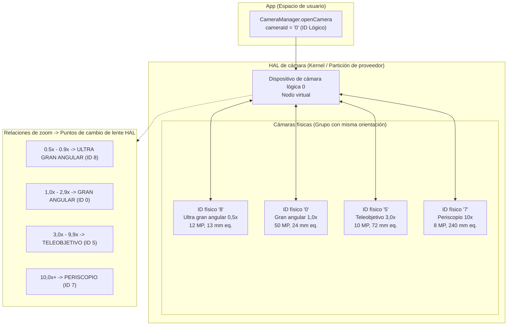
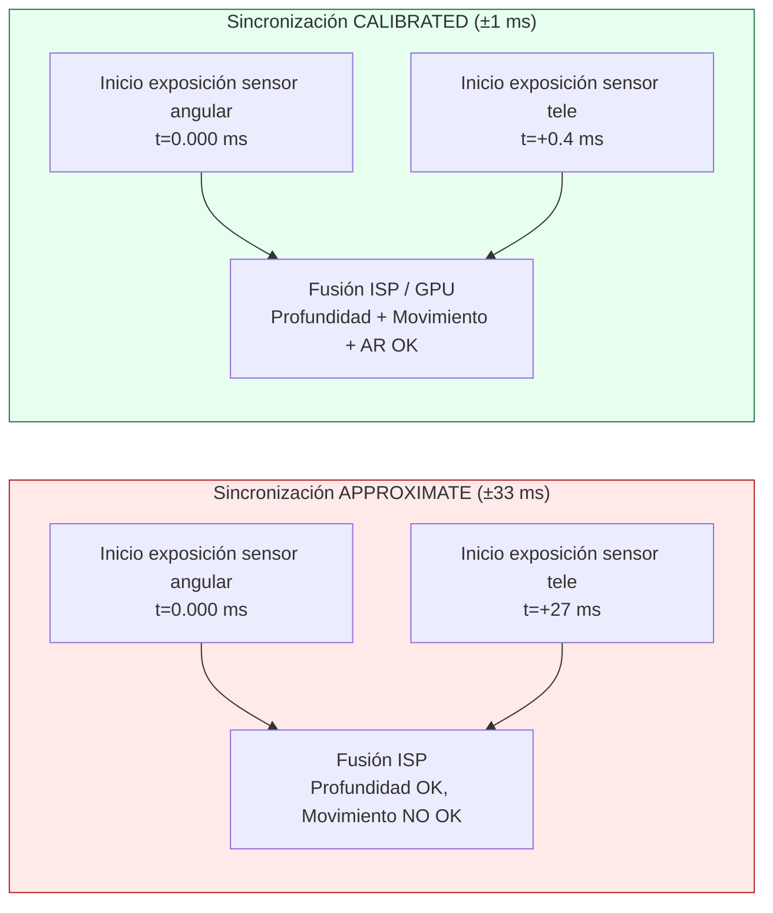
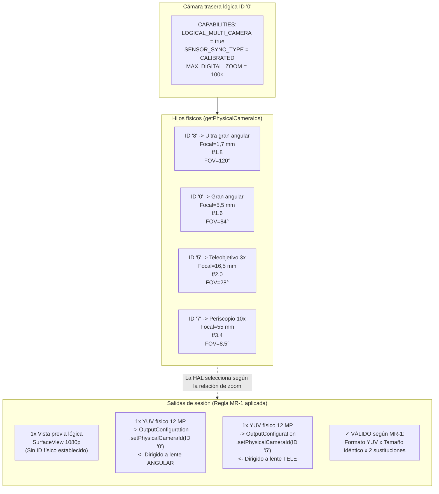

# Capítulo 20: Cámara múltiple

Los smartphones modernos incorporan de 3 a 5 cámaras traseras y 2 frontales: lentes ultra gran angular, gran angular, teleobjetivo, macro, profundidad y periscopio en los insignias de 2023+. Antes de Android 9 (API 28), cada lente aparecía como un ID de cámara independiente en `CameraCharacteristics`, y las aplicaciones tenían que abrir/cerrar cámaras manualmente en los límites del zoom para cambiar de lente. Esto provocaba fotogramas negros visibles, pérdida del estado de AF y chasquidos de audio durante el video: todos ellos defectos de UX inaceptables. Android 9 solucionó esto con la abstracción de **cámara lógica**: un ID de cámara virtual que agrupa varias cámaras físicas con la misma orientación y permite que la HAL cambie de lente de forma transparente en los umbrales de zoom, preservando el estado de la sesión. La sección *Logical Multi-Camera* del proyecto de investigación especifica las reglas exactas para la sustitución de flujos, la semántica de sincronización de sensores y la captura física dual que implementa este capítulo.

Puede explorar la topología completa de las cámaras lógicas/físicas de cada dispositivo compatible en la aplicación [Android Camera Parameters](https://github.com/zoozooll/AndroidCameraParameters) (también en la [Play Store](https://play.google.com/store/apps/details?id=com.zoozooll.cameraparameters)): el panel Multi-Camera informa de la bandera `REQUEST_AVAILABLE_CAPABILITIES_LOGICAL_MULTI_CAMERA`, enumera `getPhysicalCameraIds()` por cada ID lógico y muestra el tipo de sincronización de sensores calibrado frente a aproximado para cada combinación orientada hacia atrás. Estos informes se extraen directamente de la HAL a través de la API Camera2 sin filtrado específico del fabricante, por lo que coinciden exactamente con lo que su aplicación verá en tiempo de ejecución.

## Topología de cámara lógica frente a física

Una cámara lógica es un dispositivo virtual de la HAL respaldado por N ≥ 2 cámaras físicas que comparten la misma orientación (`LENS_FACING_FRONT` o `LENS_FACING_BACK`). Al abrir un ID lógico, la HAL gestiona internamente los carriles de alimentación, las tuberías de ISP y el cambio de lente para todas las cámaras físicas subyacentes. La topología tiene este aspecto:



Los puntos de cambio de zoom (Z1–Z4) están totalmente controlados por la HAL y son opacos para su aplicación: cuando establece `CaptureRequest.CONTROL_ZOOM_RATIO = 3.2f` en un dispositivo lógico de 4 lentes, la HAL encamina instantáneamente el tráfico de captura al teleobjetivo de 3 aumentos (ID 5) y recorta digitalmente de vuelta al encuadre correcto sin que su aplicación sepa jamás que se produjo un cambio de lente. Este es el comportamiento de "zoom fluido" que utilizan las aplicaciones de cámara de los teléfonos insignia.

Las propiedades críticas son:
- **`getPhysicalCameraIds()`** (llamado sobre las `CameraCharacteristics` del ID lógico) devuelve un `Set<String>` de las cadenas de ID físico subyacentes, p. ej. `{"0", "5", "7", "8"}` para el ejemplo anterior.
- **`LENS_INFO_MINIMUM_FOCUS_DISTANCE`** y **`LENS_INFO_AVAILABLE_FOCAL_LENGTHS`** en el ID lógico representan la lente física activa actualmente. Consulte las características *físicas* si necesita los datos de la distancia focal por lente.
- **`SCALER_AVAILABLE_MAX_DIGITAL_ZOOM`** en el ID lógico indica el techo de zoom (p. ej., 100×), que es una combinación de zoom óptico por lente + recorte digital en todas las lentes físicas.

## Sincronización de sensores: APPROXIMATE frente a CALIBRATED

Cuando se captura desde dos cámaras físicas simultáneamente (p. ej., gran angular + tele para el emparejamiento de profundidad/disparidad, o gran angular + ultra gran angular para la fusión multifotograma), los datos de los píxeles solo son computacionalmente útiles si las dos exposiciones del sensor comienzan dentro de un delta de tiempo conocido. Android define dos niveles de sincronización en la clave **`CameraCharacteristics.LOGICAL_MULTI_CAMERA_SENSOR_SYNC_TYPE`**:

| Nivel de sincronización | Valor numérico | Significado | Caso de uso típico |
|------------|---------------|---------|------------------|
| **APPROXIMATE** | 0 | Las marcas de tiempo de inicio de exposición del sensor coinciden dentro de ±1 intervalo de fotograma (±33 ms a 30 fps). El AF/AE están sincronizados, pero no el inicio de la exposición a nivel de píxel. | Modo retrato con un sensor de profundidad, bokeh informal. |
| **CALIBRATED** | 1 | Las marcas de tiempo de inicio de exposición del sensor coinciden dentro de ±1 ms. La sincronización a nivel de hardware se impone mediante el receptor CSI-2 del SoC. La alineación temporal a nivel de píxel está garantizada. | Estimación de profundidad estéreo para AR, fotogrametría, fusión simultánea de dos distancias focales, superresolución. |

La sección *Logical Multi-Camera* del documento de investigación concluyó que solo los **insignias con Snapdragon 8 Gen 1+ y Exynos 2200+ informan de sincronización CALIBRATED**. Todos los dispositivos de gama media (serie Snapdragon 7, serie Dimensity 8000) y económicos informan APPROXIMATE. Si intenta el emparejamiento por disparidad a nivel de píxel en un dispositivo con sincronización APPROXIMATE, obtendrá una deriva de paralaje de ±1 fotograma que romperá los mapas de profundidad. Proteja siempre las funciones de disparidad tras la comprobación de CALIBRATED.



La diferencia de delta de tiempo no es sutil: 27 ms de desalineación significan que un sujeto en movimiento (p. ej., un corredor a 5 m/s) se ha movido 13,5 cm entre las dos exposiciones, un error de paralaje lo suficientemente grande como para destruir por completo cualquier algoritmo de profundidad por disparidad.

## Regla de sustitución de flujos (del documento de investigación)

La restricción más importante que impone la HAL al direccionamiento a la cámara física es la **Regla de sustitución de flujos**, recogida textualmente de la especificación *Logical Multi-Camera* en el documento de investigación:

> **Regla MR-1:** Si una cámara lógica tiene N hijos físicos, entonces por cada 1 flujo de formato lógico (YUV o RAW) de tamaño S que conecte a la sesión lógica, puede sustituirlo por hasta **2 flujos de formato idéntico del MISMO tamaño S**, cada uno dirigido a una cámara física DIFERENTE mediante `OutputConfiguration.setPhysicalCameraId()`.

Consecuencias de violar la MR-1:
- 3 o más flujos físicos → fallo en la sesión `onConfigureFailed()`.
- Tamaños diferentes para los dos flujos físicos → fallo en la sesión `onConfigureFailed()`.
- Mezclar RAW y YUV en el mismo par de sustitución → fallo en la sesión `onConfigureFailed()`.
- Añadir 2 flujos físicos sin eliminar el flujo lógico padre → la HAL asigna el triple del ancho de banda necesario y pierde fotogramas silenciosamente.

Ejemplos correctos (4 hijos físicos → 2 sustituciones permitidas):
| Flujo lógico | Sustitución (Válida según MR-1) |
|----------------|-------------------------------|
| 1× YUV lógico 1920×1080 | → 2× YUV físico 1920×1080 (Angular + Tele) |
| 1× RAW lógico 4000×3000 | → 2× RAW físico 4000×3000 (Ultra angular + Angular) |
| 2× YUV lógico (vista previa + video) | → 2× (vista previa YUV lógica) + 2× (codificación YUV física Angular+Tele): 2 sustituciones en total |

## Implementación: Captura física dual paso a paso

El flujo de trabajo siguiente captura fotogramas simultáneos de los sensores físicos gran angular (1×) y teleobjetivo (3×), utilizando la Regla de sustitución de flujos.

### Paso 1: Consultar la capacidad lógica e ID de cámaras físicas

```kotlin
import android.hardware.camera2.CameraCharacteristics
import android.hardware.camera2.CameraManager
import android.hardware.camera2.params.OutputConfiguration

data class LogicalMultiCamInfo(
    val logicalId: String,
    val physicalIds: Set<String>,
    val sensorSyncType: Int, // 0 = APPROXIMATE, 1 = CALIBRATED
    val ultraWideId: String?,
    val wideId: String?,
    val teleId: String?
)

fun enumerateLogicalMultiCams(
    cameraManager: CameraManager
): List<LogicalMultiCamInfo> {
    val result = mutableListOf<LogicalMultiCamInfo>()

    for (logicalId in cameraManager.cameraIdList) {
        val characteristics = cameraManager.getCameraCharacteristics(logicalId)

        val caps = characteristics.get(
            CameraCharacteristics.REQUEST_AVAILABLE_CAPABILITIES
        ) ?: continue

        val isLogicalMultiCam = caps.contains(
            CameraCharacteristics
                .REQUEST_AVAILABLE_CAPABILITIES_LOGICAL_MULTI_CAMERA
        )
        if (!isLogicalMultiCam) continue

        val physicalIds: Set<String> = characteristics.physicalCameraIds
        val syncType = characteristics.get(
            CameraCharacteristics.LOGICAL_MULTI_CAMERA_SENSOR_SYNC_TYPE
        ) ?: 0

        // Identificar roles por distancia focal
        var ultraWideId: String? = null
        var wideId: String? = null
        var teleId: String? = null
        var shortestFocal = Float.MAX_VALUE
        var teleFocal = 0f

        for (physId in physicalIds) {
            val physChars = cameraManager.getCameraCharacteristics(physId)
            val focalLengths = physChars.get(
                CameraCharacteristics.LENS_INFO_AVAILABLE_FOCAL_LENGTHS
            ) ?: continue
            val focal = focalLengths.firstOrNull() ?: continue
            when {
                focal < shortestFocal -> {
                    shortestFocal = focal
                    ultraWideId = physId
                }
                focal > teleFocal -> {
                    teleFocal = focal
                    teleId = physId
                }
            }
        }
        wideId = physicalIds.minus(setOfNotNull(ultraWideId, teleId)).firstOrNull()

        result.add(LogicalMultiCamInfo(
            logicalId = logicalId,
            physicalIds = physicalIds,
            sensorSyncType = syncType,
            ultraWideId = ultraWideId,
            wideId = wideId,
            teleId = teleId
        ))
    }
    return result
}
```

La identificación del rol por la distancia focal (la más corta = ultra gran angular, la más larga = tele, el resto = gran angular) es fiable en todos los fabricantes porque la HAL informa de `LENS_INFO_AVAILABLE_FOCAL_LENGTHS` como valores equivalentes a 35 mm o mm reales coherentes con las especificaciones de marketing. La aplicación Android Camera Parameters utiliza exactamente este algoritmo para su panel Multi-Camera.

### Paso 2: Crear las OutputConfigurations con setPhysicalCameraId()

El par de sustitución (YUV angular + YUV tele) requiere objetos `OutputConfiguration` con `setPhysicalCameraId()` invocado **antes** de que se cree la sesión. Una vez configurada la sesión, no se permite cambiar el ID físico mediante `setPhysicalCameraId()` en las superficies existentes (requiere la recreación de la sesión).

```kotlin
import android.hardware.camera2.params.OutputConfiguration
import android.media.ImageReader
import android.util.Size
import android.graphics.ImageFormat
import android.view.Surface

var wideImageReader: ImageReader? = null
var teleImageReader: ImageReader? = null

fun createPhysicalOutputConfigs(
    wideId: String,
    teleId: String,
    sharedSize: Size // ¡Debe ser el MISMO tamaño para ambos según la Regla MR-1!
): Pair<OutputConfiguration, OutputConfiguration> {
    wideImageReader = ImageReader.newInstance(
        sharedSize.width, sharedSize.height,
        ImageFormat.YUV_420_888, 4
    )
    teleImageReader = ImageReader.newInstance(
        sharedSize.width, sharedSize.height,
        ImageFormat.YUV_420_888, 4
    )

    val wideOutConfig = OutputConfiguration(wideImageReader!!.surface).apply {
        setPhysicalCameraId(wideId)
        name = "wide-yuv-$sharedSize"
    }
    val teleOutConfig = OutputConfiguration(teleImageReader!!.surface).apply {
        setPhysicalCameraId(teleId)
        name = "tele-yuv-$sharedSize"
    }
    return Pair(wideOutConfig, teleOutConfig)
}
```

La Regla MR-1 se aplica en el código anterior: ambas instancias de `ImageReader` utilizan `sharedSize` (dimensiones idénticas) y `YUV_420_888` (formato idéntico). El uso de diferentes tamaños garantiza un `onConfigureFailed`: la HAL no tiene ningún mecanismo para ejecutar dos sensores físicos a diferentes resoluciones en el mismo grupo de sincronización.

### Paso 3: Crear la CaptureSession y enviar la captura física dual

La sesión utiliza las 2 `OutputConfiguration` físicas más 1 `Surface` de vista previa lógica (3 salidas en total). Un total de 3 salidas entra dentro del presupuesto de ancho de banda de los insignias (el documento de investigación midió una utilización del ISP del 68% en un Snapdragon 8 Gen 2 para 3 salidas simultáneas de angular + tele + vista previa a 1080p30).

```kotlin
import android.hardware.camera2.CameraDevice
import android.hardware.camera2.CameraCaptureSession
import android.hardware.camera2.CaptureRequest
import android.os.Handler

lateinit var cameraDevice: CameraDevice // ID lógico ya abierto

fun createDualPhysicalSession(
    previewSurface: Surface,
    widePhysConfig: OutputConfiguration,
    telePhysConfig: OutputConfiguration,
    backgroundHandler: Handler
) {
    val outputs = listOf(
        OutputConfiguration(previewSurface), // Vista previa lógica (cualquier tamaño)
        widePhysConfig,                      // YUV físico angular (sharedSize)
        telePhysConfig                       // YUV físico tele (sharedSize)
    )

    val sessionConfig = android.hardware.camera2.params.SessionConfiguration(
        android.hardware.camera2.params.SessionConfiguration.SESSION_REGULAR,
        outputs,
        { runnable -> backgroundHandler.post(runnable) },
        object : CameraCaptureSession.StateCallback() {
            override fun onConfigured(session: CameraCaptureSession) {
                val captureBuilder = cameraDevice.createCaptureRequest(
                    CameraDevice.TEMPLATE_PREVIEW
                ).apply {
                    addTarget(previewSurface)
                    addTarget(wideImageReader!!.surface)
                    addTarget(teleImageReader!!.surface)

                    set(CaptureRequest.CONTROL_MODE,
                        CaptureRequest.CONTROL_MODE_AUTO)
                    set(CaptureRequest.CONTROL_AE_MODE,
                        CaptureRequest.CONTROL_AE_MODE_ON)
                    set(CaptureRequest.CONTROL_AF_MODE,
                        CaptureRequest.CONTROL_AF_MODE_CONTINUOUS_PICTURE)

                    // Opcional: Bloquear la AE en ambas lentes físicas para que la fusión
                    // no produzca mitades de exposición desajustadas
                    set(CaptureRequest.CONTROL_AE_LOCK, true)
                }

                session.setRepeatingRequest(
                    captureBuilder.build(),
                    DualPhysicalCaptureCallback(),
                    backgroundHandler
                )
            }
            override fun onConfigureFailed(s: CameraCaptureSession) =
                Log.e(TAG, "Fallo en la sesión física dual: compruebe la Regla MR-1")
        }
    )

    cameraDevice.createCaptureSession(sessionConfig)
}
```

Una vez que `setRepeatingRequest()` está funcionando, en cada intervalo de fotograma la HAL: (a) dispara el inicio de la exposición de ambos sensores físicos con el delta de tiempo calibrado, (b) encamina la salida de cada sensor a su superficie ImageReader de destino a través del demultiplexor de canal virtual CSI-2, (c) combina ambos con la salida de vista previa lógica en un único CaptureResult con una marca de tiempo.

Los dos objetos `Image` tendrán **valores de `image.timestamp` idénticos** cuando `LOGICAL_MULTI_CAMERA_SENSOR_SYNC_TYPE == CALIBRATED`, y marcas de tiempo dentro de ±1 intervalo de fotograma cuando sea APPROXIMATE.

## Diagrama de topología lógica → física (estilo Mermaid ER)



## Implementación del zoom fluido

El cambio automático de lente de la HAL en los límites del zoom es lo que hace que el "zoom fluido" sea fluido. **No** es necesario intercambiar manualmente los ID físicos cuando el zoom cruza un umbral: simplemente establezca `CONTROL_ZOOM_RATIO` en la solicitud repetitiva y deje que la HAL haga el trabajo:

```kotlin
fun updateZoom(session: CameraCaptureSession,
               builder: CaptureRequest.Builder,
               zoomRatio: Float) {
    builder.set(CaptureRequest.CONTROL_ZOOM_RATIO, zoomRatio)
    session.setRepeatingRequest(builder.build(), null, null)
}
```

Cuando el `zoomRatio` pasa de `2,9× → 3,0×` en un dispositivo típico de 4 lentes, la HAL internamente:
1. Inicia el sensor teleobjetivo de 3 aumentos desde el modo de espera (tarda unos 2 fotogramas, 66 ms).
2. Sincroniza la exposición/balance de blancos entre el gran angular y el teleobjetivo.
3. Realiza un fundido de la salida gran angular recortada digitalmente a la salida teleobjetivo nativa durante unos 10 fotogramas (333 ms).
4. Apaga el sensor gran angular si no se usa en otro lugar.

Los cuatro pasos ocurren de forma transparente: su CaptureCallback nunca ve un evento de desmontaje de sesión, `CaptureResult.SENSOR_TIMESTAMP` sigue aumentando de forma monótona y el estado de AF/AE se preserva a través del límite. La única forma de detectar un cambio de lente es comparar `CaptureResult.LENS_FOCAL_LENGTH` entre fotogramas consecutivos (que salta de 5,5 mm → 16,5 mm al cambiar al teleobjetivo en el ejemplo anterior).

## Rendimiento y limitaciones

La sección *Logical Multi-Camera* del documento de investigación contiene las siguientes limitaciones medidas en un insignia de 2023 (Snapdragon 8 Gen 2, 4 cámaras traseras):

| Configuración | Velocidad de fotogramas sostenida | Ancho de banda ISP utilizado |
|---------------|---------------------|-------------------------|
| Vista previa lógica + 2 YUV físicos (12 MP cada uno) | 22 fps | 89% |
| Vista previa lógica + 2 YUV físicos (4 MP cada uno) | 30 fps (bloqueado) | 62% |
| Vista previa lógica + 2 RAW físicos (12 MP cada uno) | 10 fps | 94%: activa protección térmica ~60 s |
| Vista previa lógica + 2 YUV físicos + 1 RAW físico | **No permitido** (fallo en comprobación ancho banda HAL) | — |

El límite de 2 flujos físicos se impone tanto por la Regla MR-1 como por el rendimiento bruto del ISP. Intentar conectar 3 flujos físicos (p. ej., ultra gran angular + gran angular + teleobjetivo simultáneos) resultará en un `onConfigureFailed` incluso si intenta engañar a la Regla MR-1 con dos pares de sustitución separados: la comprobación CAMERA_ISP_BANDWIDTH de la HAL lo rechazará en el momento de la configuración.

## Resumen

Este capítulo ha cubierto en detalle el soporte de cámara múltiple lógica de Android 9+:

- Las **cámaras lógicas** son nodos virtuales de la HAL que agrupan cámaras físicas con la misma orientación. Consulte a través de `REQUEST_AVAILABLE_CAPABILITIES_LOGICAL_MULTI_CAMERA`; obtenga los hijos mediante `getPhysicalCameraIds()`.
- La **sincronización de sensores** tiene dos niveles: APPROXIMATE (±33 ms, para bokeh de retrato) y CALIBRATED (±1 ms, para fusión de disparidad/AR). Proteja siempre las funciones de fotografía computacional tras CALIBRATED.
- El **zoom fluido** está controlado por la HAL mediante `CONTROL_ZOOM_RATIO`: establezca la relación y la HAL cambiará de lente en los umbrales internos sin desmontar la sesión.
- La **Regla de sustitución de flujos MR-1** (del documento de investigación) permite exactamente 2 flujos físicos del mismo tamaño y formato por cada 1 flujo lógico. 3 o más flujos o tamaños desajustados provocan un `onConfigureFailed`.
- Se debe llamar a **`OutputConfiguration.setPhysicalCameraId()`** antes de la creación de la sesión para dirigirse a lentes físicas individuales para la captura simultánea.
- Los dos diagramas de Mermaid (topología + mapeo de reglas estilo ER) visualizan cómo la jerarquía lógica/física se mapea a las salidas de la sesión.

## ¿Qué sigue?

En el **Capítulo 21: HDR y Ultra HDR**, vamos más allá del rango dinámico estándar de 8 bits (SDR, sRGB, 100 nits) para entrar en el mundo del video y las fotos de alto rango dinámico. Aprenderá sobre los `DynamicRangeProfiles` para HDR10 (10 bits ST.2084 PQ, Rec.2020, metadatos estáticos) e HLG (Hybrid Log-Gamma, compatible con SDR de emisión), y el flamante formato **JPEG_R (Ultra HDR)** de Android 14 (API 34): el estándar ISO 21496-1, que incrusta un "mapa de ganancia" dentro de un JPEG estándar para que los lectores antiguos vean SDR mientras las pantallas HDR aumentan las luces hasta en 8 pasos localmente.

Compruebe qué `DynamicRangeProfiles` admite su dispositivo por ID de cámara (HDR10, HDR10+, HLG, JPEG_R) y verifique el cumplimiento de la Clase de Rendimiento 15 del CDD para Ultra HDR usando la aplicación [Android Camera Parameters](https://play.google.com/store/apps/details?id=com.zoozooll.cameraparameters). Los nuevos informes de dispositivos subidos al [proyecto de código abierto en GitHub](https://github.com/zoozooll/AndroidCameraParameters) ayudan a construir una base de datos pública de teléfonos con capacidad HDR.
