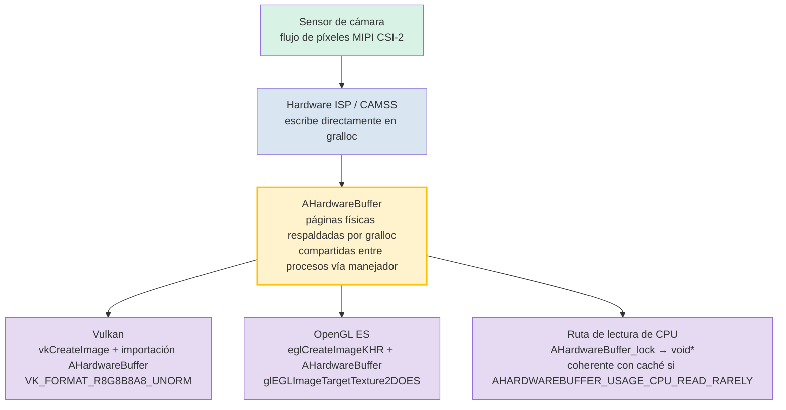

# Capítulo 25: Desarrollo de cámara nativa

## Resumen

Los capítulos 1 a 24 operaban en código gestionado: Kotlin o Java ejecutándose sobre ART, cruzando un límite de Binder IPC para cada `CaptureRequest`, y bien asignando copias `ByteBuffer` de los fotogramas o aceptando la sobrecarga del streaming de texturas mediado por `SurfaceTexture`. Para las aplicaciones de cámara de redes sociales, esto es suficiente. Para los motores de AR, las tuberías de visión artificial en tiempo real, las cámaras de visión trasera de los coches o los motores 3D con un presupuesto de 16 ms por fotograma, no lo es.

El desarrollo de cámara nativa traslada todo el bucle de abrir/configurar/capturar a C/C++ utilizando las cabeceras del NDK `<camera/NdkCameraManager.h>` y `<android/hardware_buffer.h>`. La recompensa inmediata es una sobrecarga de JNI nula en la ruta crítica y, fundamentalmente, la capacidad de envolver objetos `AHardwareBuffer` asignados por gralloc directamente como destinos `VkImage` de Vulkan o `EGLImage` de OpenGL sin una sola copia de memoria en bytes entre la salida del sensor y el muestreo de texturas de la GPU.

**Android Camera Parameters** le ayuda a validar que sus dispositivos de destino exponen las garantías `INFO_SUPPORTED_HARDWARE_LEVEL_FULL` o `LEVEL_3` requeridas para una operación nativa de bajo nivel predecible. Instálelo desde [Google Play](https://play.google.com/store/apps/details?id=com.minininja.cameraparams) o consulte el código fuente en [github.com/zoozooll/AndroidCameraParameters](https://github.com/zoozooll/AndroidCameraParameters).

---

## ¿Por qué elegir el modo nativo?

Antes de sumergirnos en C++, seamos precisos sobre lo que le aporta el modo nativo y cuándo justifica su complejidad.

### Los argumentos a favor del modo nativo

1. **Sobrecarga de JNI nula en la ruta crítica.** Una tubería de 60 fps tiene 16,67 ms por fotograma. Se ha medido que una única llamada a `CallVoidMethod` de JNI que cruza el límite ART/C es de ~0,5–2 µs, pero el coste real es la llamada *por fotograma*, el cambio de hilo, la contabilidad de referencias locales de JNI y la presión del recolector de basura (GC) de los proxies `Image` gestionados. Multiplíquelo por cuatro cámaras alimentando una sesión de AR simultáneamente y estará quemando un milisegundo de presupuesto solo cruzando los límites del lenguaje. El modo nativo elimina esto.

2. **Propiedad directa de la memoria con `AHardwareBuffer`.** En el código gestionado, `Image.getPlanes()[0].getBuffer()` devuelve un `ByteBuffer` que es una *vista* sobre la memoria gralloc; leerlo obliga a una invalidación de la caché de la CPU y, a menudo, a una copia interna para formatos como `PRIVATE`. En el código nativo, `AHardwareBuffer` es el propio manejador gralloc, y la GPU puede vincularlo como memoria de textura en el mismo lugar.

3. **Integración de motores AR/3D.** Unity, Unreal, Ogre y los motores propios están escritos en C++ por una buena razón. Ejecutar la cámara *dentro* del código C++ del bucle de renderizado elimina el enredo de tres procesos "ART + JNI + hilo de renderizado".

4. **Migración del sistema EVS (External View System) para automoción.** Antes de Android 10, las cámaras de visión trasera para automoción utilizaban la pila heredada `EVS` con su propia HAL. Las migraciones de los fabricantes entre 2020 y 2024 hicieron converger el EVS en las API NDK de Camera2 estándar, reservando `AID_AUTOMOTIVE_EVS_UID = 1071` para el acceso temprano al hardware durante el arranque *antes* de que el CameraService del `system_server` esté siquiera en funcionamiento. Si su código se dirige a la automoción, el modo nativo es innegociable.

### Los argumentos en contra del modo nativo

- La depuración es más difícil. Los fallos en las retrollamadas de `ACameraDevice` producen trazas de tumbas (tombstones), no bonitas trazas de pila de Kotlin.
- La gestión del ciclo de vida es totalmente manual. `ACameraManager` *no* tiene en cuenta el ciclo de vida; olvidar `ACameraCaptureSession_stopRepeating()` + `ACameraDevice_close()` al destruir la superficie provoca fugas en los recursos de la cámara y puede bloquear a otras aplicaciones hasta el reinicio.
- Menos soluciones para peculiaridades de dispositivos. La base de datos de peculiaridades de CameraX no existe en el mundo NDK; usted hereda el comportamiento bruto de la HAL exactamente tal cual se distribuye.
- Sin `DngCreator`, sin ayudantes `ExifInterface`, sin accesores de conveniencia para `CameraCharacteristics`: usted analiza las etiquetas de metadatos por sí mismo a través de `ACameraMetadata_getConstEntry`.

La decisión es sencilla: si no puede cumplir su presupuesto de fotogramas en código gestionado, o necesita acceso a la cámara en el arranque de nivel EVS, elija el modo nativo. De lo contrario, quédese en el gestionado.

---

## ACameraManager: El paralelo del NDK al CameraManager de Java

La superficie de la API de la cámara del NDK en `<camera/NdkCameraManager.h>`, `<camera/NdkCameraDevice.h>` y `<camera/NdkCaptureRequest.h>` se mapea casi uno a uno con la API de Java que usted conoce. Cada clase de Java tiene una estructura nativa y un conjunto de funciones libres:

| Java                          | Manejador NDK / Prefijo de función                          |
|-------------------------------|-------------------------------------------------------|
| `CameraManager`               | `ACameraManager` · `ACameraManager_*`                 |
| `CameraCharacteristics`       | `ACameraMetadata` · `ACameraMetadata_*`               |
| `CameraDevice`                | `ACameraDevice` · `ACameraDevice_*`                   |
| `CaptureRequest.Builder`      | `ACaptureRequest` · `ACaptureRequest_setEntry_*`      |
| `CameraCaptureSession`        | `ACameraCaptureSession` · `ACameraCaptureSession_*`   |
| `TotalCaptureResult`          | `ACameraCaptureResult` · `ACaptureResult`             |
| `ImageReader`                 | `AImageReader` (de `<media/NdkImageReader.h>`)      |

El ciclo de vida es idéntico: enumerar cámaras → leer características → abrir → crear superficies de salida → crear sesión → establecer solicitud repetitiva → desmontar en orden inverso.

### Ejemplo 1: Enumerar cámaras, leer características, abrir un dispositivo (C++)

```cpp
#include <camera/NdkCameraManager.h>
#include <camera/NdkCameraDevice.h>
#include <camera/NdkCameraMetadata.h>
#include <android/log.h>

#define LOG_TAG "NativeCam"
#define LOGI(...) __android_log_print(ANDROID_LOG_INFO, LOG_TAG, __VA_ARGS__)
#define LOGE(...) __android_log_print(ANDROID_LOG_ERROR, LOG_TAG, __VA_ARGS__)

static ACameraManager* g_cameraManager = nullptr;
static ACameraDevice* g_cameraDevice = nullptr;

void onDeviceDisconnected(void* ctx, ACameraDevice* dev) {
    LOGI("Dispositivo de cámara desconectado");
}

void onDeviceError(void* ctx, ACameraDevice* dev, int err) {
    LOGE("Error en el dispositivo de cámara: %d", err);
}

static ACameraDevice_stateCallbacks g_deviceCallbacks = {
    .context = nullptr,
    .onDisconnected = onDeviceDisconnected,
    .onError = onDeviceError,
};

bool enumerateAndOpenBackCamera() {
    g_cameraManager = ACameraManager_create();
    if (!g_cameraManager) {
        LOGE("Fallo al crear ACameraManager");
        return false;
    }

    ACameraIdList* cameraIdList = nullptr;
    camera_status_t status = ACameraManager_getCameraIdList(
        g_cameraManager, &cameraIdList);
    if (status != ACAMERA_OK) {
        LOGE("getCameraIdList falló: %d", status);
        return false;
    }

    const char* chosenId = nullptr;

    for (int i = 0; i < cameraIdList->numCameras; ++i) {
        const char* id = cameraIdList->cameraIds[i];
        ACameraMetadata* chars = nullptr;
        status = ACameraManager_getCameraCharacteristics(
            g_cameraManager, id, &chars);
        if (status != ACAMERA_OK) continue;

        ACameraMetadata_const_entry lensFacingEntry{};
        status = ACameraMetadata_getConstEntry(
            chars,
            ACAMERA_LENS_FACING,
            &lensFacingEntry);

        uint8_t facing = 0;
        if (status == ACAMERA_OK && lensFacingEntry.count > 0) {
            facing = lensFacingEntry.data.u8[0];
        }

        if (facing == ACAMERA_LENS_FACING_BACK) {
            chosenId = id;
            // También consultar el nivel de hardware para la comprobación de capacidad:
            ACameraMetadata_const_entry hwEntry{};
            if (ACameraMetadata_getConstEntry(
                    chars, ACAMERA_INFO_SUPPORTED_HARDWARE_LEVEL,
                    &hwEntry) == ACAMERA_OK && hwEntry.count > 0) {
                LOGI("Cámara trasera %s nivel hw = %d (se espera %d=FULL %d=LEVEL3)",
                     id, hwEntry.data.u8[0],
                     (int)ACAMERA_INFO_SUPPORTED_HARDWARE_LEVEL_FULL,
                     (int)ACAMERA_INFO_SUPPORTED_HARDWARE_LEVEL_3);
            }
            ACameraMetadata_free(chars);
            break;
        }
        ACameraMetadata_free(chars);
    }

    ACameraManager_deleteCameraIdList(cameraIdList);

    if (!chosenId) {
        LOGE("No se ha encontrado ninguna cámara trasera");
        return false;
    }

    status = ACameraManager_openCamera(
        g_cameraManager, chosenId,
        &g_deviceCallbacks,
        &g_cameraDevice);

    if (status != ACAMERA_OK) {
        LOGE("openCamera falló: %d", status);
        return false;
    }

    LOGI("Se ha abierto con éxito la cámara %s", chosenId);
    return true;
}
```

Observe la ausencia de excepciones. Cada función devuelve un `camera_status_t`, y usted *debe* comprobar cada retorno. `ACAMERA_OK = 0`; cualquier valor distinto de cero es un código de error específico (`ACAMERA_ERROR_CAMERA_IN_USE`, `ACAMERA_ERROR_CAMERA_DISCONNECTED`, etc.). No hay ninguna `CameraAccessException` que capturar: si ignora el retorno, la función simplemente habrá dejado el puntero de salida como `nullptr` silenciosamente y fallará tres líneas más tarde.

### Creación de una sesión de captura y establecimiento de una solicitud repetitiva

Una vez que el dispositivo está abierto, el patrón refleja la creación de la sesión de Java. Cree un `ACameraOutputTarget` por superficie, empaquételos en un `ACaptureSessionOutputContainer` y luego llame a `ACameraDevice_createCaptureSession()`. Para las solicitudes repetitivas, construya una `ACaptureRequest` a partir de una plantilla, añada su objetivo de salida y llame a `ACameraCaptureSession_setRepeatingRequest()`. Las estructuras de retrollamada (`ACameraCaptureSession_stateCallbacks`, `ACameraCaptureSession_captureCallbacks`) se registran en el momento de la creación de la sesión, coincidiendo exactamente con sus homólogas de Java.

---

## AHardwareBuffer: La ruta crítica de copia cero

Esta es la verdadera razón para elegir el modo nativo. `AHardwareBuffer` (definido en `<android/hardware_buffer.h>`) es el manejador del NDK para la memoria asignada por gralloc, la misma memoria exacta en la que la HAL de la cámara escribe los píxeles del sensor. Cuando suministra una superficie respaldada por `AHardwareBuffer` a `ACameraDevice_createCaptureSession` y luego importa ese mismo `AHardwareBuffer` en Vulkan u OpenGL, obtiene una verdadera copia cero:



El nodo `AHardwareBuffer` es el eje central: es una única asignación compartida por el punto final de escritura de la HAL de la cámara, el muestreador de texturas de la GPU y, opcionalmente, la CPU. Sin memcpy, sin carga de `glTexImage2D`, sin `ByteBuffer.wrap()`: la textura de la GPU apunta literalmente a las mismas páginas de DRAM física que la cámara acaba de escribir.

Para las tuberías de AR de 60 fps en un flujo 4K, esto supone un ahorro de ancho de banda de unos 200 ms por segundo (4K × 60 fps × 4 bytes = ~4,7 GB/seg ahorrados) y marca la diferencia entre una experiencia fluida y un desastre a tirones.

### Ejemplo 2: De AHardwareBuffer a VkImage de Vulkan, paso a paso (C++)

```cpp
#include <android/hardware_buffer.h>
#include <vulkan/vulkan.h>
#include <vulkan/vulkan_android.h>

VkImage createVkImageFromAHardwareBuffer(
    VkDevice device,
    AHardwareBuffer* aBuffer,
    VkFormat format,
    uint32_t width,
    uint32_t height) {

    // Paso 1: Rellenar AndroidHardwareBufferProperties2KHR
    VkAndroidHardwareBufferPropertiesANDROID ahbProps{};
    ahbProps.sType = VK_STRUCTURE_TYPE_ANDROID_HARDWARE_BUFFER_PROPERTIES_ANDROID;
    VkResult res = vkGetAndroidHardwareBufferPropertiesANDROID(
        device, aBuffer, &ahbProps);
    if (res != VK_SUCCESS) {
        LOGE("vkGetAndroidHardwareBufferPropertiesANDROID falló: %d", res);
        return VK_NULL_HANDLE;
    }

    // Paso 2: Describir la *importación* de la imagen (no la asignación)
    VkExternalMemoryImageCreateInfo externalInfo{};
    externalInfo.sType = VK_STRUCTURE_TYPE_EXTERNAL_MEMORY_IMAGE_CREATE_INFO;
    externalInfo.handleTypes =
        VK_EXTERNAL_MEMORY_HANDLE_TYPE_ANDROID_HARDWARE_BUFFER_BIT_ANDROID;

    VkImageCreateInfo imgInfo{};
    imgInfo.sType = VK_STRUCTURE_TYPE_IMAGE_CREATE_INFO;
    imgInfo.pNext = &externalInfo;
    imgInfo.imageType = VK_IMAGE_TYPE_2D;
    imgInfo.format = format;             // p. ej. VK_FORMAT_R8G8B8A8_UNORM
    imgInfo.extent = { width, height, 1 };
    imgInfo.mipLevels = 1;
    imgInfo.arrayLayers = 1;
    imgInfo.samples = VK_SAMPLE_COUNT_1_BIT;
    imgInfo.tiling = VK_IMAGE_TILING_OPTIMAL;
    imgInfo.usage = VK_IMAGE_USAGE_SAMPLED_BIT |
                    VK_IMAGE_USAGE_TRANSFER_DST_BIT;
    imgInfo.sharingMode = VK_SHARING_MODE_EXCLUSIVE;
    imgInfo.initialLayout = VK_IMAGE_LAYOUT_UNDEFINED;

    VkImage image = VK_NULL_HANDLE;
    res = vkCreateImage(device, &imgInfo, nullptr, &image);
    if (res != VK_SUCCESS) {
        LOGE("vkCreateImage falló: %d", res);
        return VK_NULL_HANDLE;
    }

    // Paso 3: Asignar VkDeviceMemory *importando* el AHB, no asignando uno nuevo
    VkMemoryRequirements memReqs{};
    vkGetImageMemoryRequirements(device, image, &memReqs);

    VkImportAndroidHardwareBufferInfoANDROID importInfo{};
    importInfo.sType =
        VK_STRUCTURE_TYPE_IMPORT_ANDROID_HARDWARE_BUFFER_INFO_ANDROID;
    importInfo.buffer = aBuffer;

    VkMemoryDedicatedAllocateInfo dedicatedInfo{};
    dedicatedInfo.sType = VK_STRUCTURE_TYPE_MEMORY_DEDICATED_ALLOCATE_INFO;
    dedicatedInfo.pNext = &importInfo;
    dedicatedInfo.image = image;

    VkMemoryAllocateInfo allocInfo{};
    allocInfo.sType = VK_STRUCTURE_TYPE_MEMORY_ALLOCATE_INFO;
    allocInfo.pNext = &dedicatedInfo;
    allocInfo.allocationSize = memReqs.size;
    allocInfo.memoryTypeIndex = ahbProps.memoryTypeBits
        // memoryTypeIndex debe seleccionarse de la intersección entre
        // memReqs.memoryTypeBits y ahbProps.memoryTypeBits. Omitido por brevedad.
        ;

    VkDeviceMemory mem = VK_NULL_HANDLE;
    res = vkAllocateMemory(device, &allocInfo, nullptr, &mem);
    if (res != VK_SUCCESS) {
        LOGE("Fallo en la importación de vkAllocateMemory: %d", res);
        vkDestroyImage(device, image, nullptr);
        return VK_NULL_HANDLE;
    }

    // Paso 4: Vincular la memoria importada a VkImage
    vkBindImageMemory(device, image, mem, 0);

    // Paso 5: Transición al diseño SHADER_READ_ONLY_OPTIMAL vía búfer de comandos
    // (omitido: barrera de memoria de imagen estándar para VK_IMAGE_LAYOUT_UNDEFINED
    // → VK_IMAGE_LAYOUT_SHADER_READ_ONLY_OPTIMAL)

    LOGI("Importado con éxito AHardwareBuffer como VkImage %p", image);
    return image;
}
```

El salto conceptual en el que tropiezan la mayoría de los recién llegados es el Paso 3: `vkAllocateMemory` con `VK_STRUCTURE_TYPE_IMPORT_ANDROID_HARDWARE_BUFFER_INFO_ANDROID` **no** asigna. Registra un `AHardwareBuffer` existente como un objeto `VkDeviceMemory`. Los bytes ya fueron asignados por gralloc cuando el productor de la cámara creó la superficie; Vulkan simplemente los está adoptando en su modelo de memoria.

La ruta de OpenGL ES es análoga pero más corta: `eglCreateImageKHR(..., EGL_NATIVE_BUFFER_ANDROID, aBuffer, ...)` → `glEGLImageTargetTexture2DOES(GL_TEXTURE_2D, eglImage)`. Una llamada y ya está muestreando.

---

## Resumen de interoperabilidad OpenGL y Vulkan

Ambas rutas funcionan. Cuál elegir:

| Factor                | OpenGL ES 3.x + EGLImage                    | Vulkan 1.1+ + importación AHB                |
|-----------------------|----------------------------------------------|----------------------------------------------|
| Simplicidad           | Configuración más corta, menos ceremonia      | Más código repetitivo, sincronización explícita |
| Sincronización       | Implícita; el controlador inserta barreras    | Explícita; usted escribe barreras de tubería + semáforos |
| Multihilo/cola       | Atado a un único EGLContext por hilo         | Transferencias multicuola de primer nivel    |
| Cert. automoción/AR   | Certificado en la mayoría de objetivos EVS   | Cada vez más requerido para nuevos motores AR |

Si se está integrando con un motor ya existente, el motor elige por usted. Si parte de cero y busca el máximo rendimiento, Vulkan es el futuro. Si quiere el mínimo código, OpenGL ES mediante EGLImage sigue siendo la elección pragmática y se distribuye en cada dispositivo con cámara.

---

## Contexto de automoción EVS: Migración a Camera2 NDK

Para completar, una breve nota sobre la ruta de migración de automoción a la que se hace referencia en las notas de investigación. Hasta Android 9, las cámaras de visión trasera de los coches utilizaban la HAL `EVS` independiente (`android.hardware.automotive.evs@1.0`), con su propia enumeración y tubería de streaming. A partir de Android 10 y de forma obligatoria en Android 12+ para los nuevos sistemas IVI, el gestor EVS se reimplementó *sobre la HAL3 de cámara estándar + la pila de cámara NDK*, con un nuevo UID reservado `AID_AUTOMOTIVE_EVS_UID = 1071` que recibe acceso al grupo de permisos `CAMERA` ya en el `early-boot`, antes de que el `CameraService` del `system_server` se haya siquiera inicializado.

En la práctica, si está escribiendo código de cámara de visión trasera para coches:
1. Su proceso se ejecuta como UID 1071.
2. Usted utiliza *exactamente* las API nativas de este capítulo (`ACameraManager_openCamera`, `AImageReader`, `AHardwareBuffer` → importación Vulkan).
3. Debe ser capaz de abrir, configurar y emitir un fotograma en menos de 2 segundos desde el arranque en frío (requisito de la norma FMVSS 111). Por eso la pila EVS requiere el modo nativo: cada ms de arranque de ART es un ms que no tiene.

La migración de EVS a Camera2 NDK es uno de los mayores refactorizados internos del ecosistema de cámaras de Android en los últimos cinco años, y es la razón por la que las API de cámara del NDK recibieron una inversión tan fuerte desde Android 10 en adelante. Si está leyendo este capítulo para distribuir un producto de cámara para coches, está utilizando exactamente la ruta de código obligada por las pruebas de cumplimiento de automoción de Google.

---

## Ejemplo 3 (Esqueleto de puente JNI en Kotlin)

Para completar, un punto de entrada JNI mínimo en Kotlin que llama al código C++ anterior:

```kotlin
// NativeBridge.kt
class NativeBridge {

    external fun enumerateAndOpenBackCameraNative(): Boolean

    companion object {
        init {
            System.loadLibrary("native_camera")
        }
    }
}
```

```cpp
// exportación JNI de native_camera.cpp
extern "C" JNIEXPORT jboolean JNICALL
Java_com_example_NativeBridge_enumerateAndOpenBackCameraNative(
    JNIEnv* /*env*/, jobject /*thiz*/) {
    return static_cast<jboolean>(enumerateAndOpenBackCamera() ? JNI_TRUE : JNI_FALSE);
}
```

Y en el `build.gradle`:

```kotlin
android {
    defaultConfig {
        ndk { abiFilters += listOf("arm64-v8a", "armeabi-v7a", "x86_64") }
    }
    externalNativeBuild {
        cmake { path = file("src/main/cpp/CMakeLists.txt") }
    }
}
```

Con el correspondiente `CMakeLists.txt` vinculando `-lcamera2ndk`, `-lmediandk`, `-landroid` y `-lvulkan`.

---

## Resumen

El desarrollo de cámara nativa cambia la ergonomía del código gestionado por el máximo rendimiento y la propiedad directa del hardware. `ACameraManager` y sus estructuras complementarias reflejan la API Camera2 de Java uno a uno, solo que con retornos de error al estilo C y ciclo de vida manual. La verdadera recompensa es `AHardwareBuffer`: el manejador gralloc que le permite alimentar la salida de la HAL de la cámara directamente en texturas `VkImage` de Vulkan o `EGLImage` de OpenGL sin ninguna copia de memoria, ahorrando gigabytes por segundo de ancho de banda DRAM en las tuberías de AR de 60 fps. Para la automoción, la migración de EVS a NDK hace que el modo nativo sea innegociable debido al requisito de fotograma de arranque en 2 segundos y al acceso temprano al hardware del `AID_AUTOMOTIVE_EVS_UID`. Use **Android Camera Parameters** para validar que su dispositivo de destino tiene `INFO_SUPPORTED_HARDWARE_LEVEL_FULL` o mejor antes de comprometerse con una implementación nativa.

## ¿Qué sigue?

Ya sea en Kotlin o C++, Camera2 es una API inherentemente asíncrona: `StateCallbacks`, `CaptureCallbacks`, `AvailabilityCallbacks`, todas disparándose en hilos en segundo plano. El Capítulo 26 doma este caos con las corrutinas de Kotlin y Flow, convirtiendo el infierno de las retrollamadas espaguetizadas que escribió en los primeros capítulos en una tubería limpia, lineal y reactiva.
