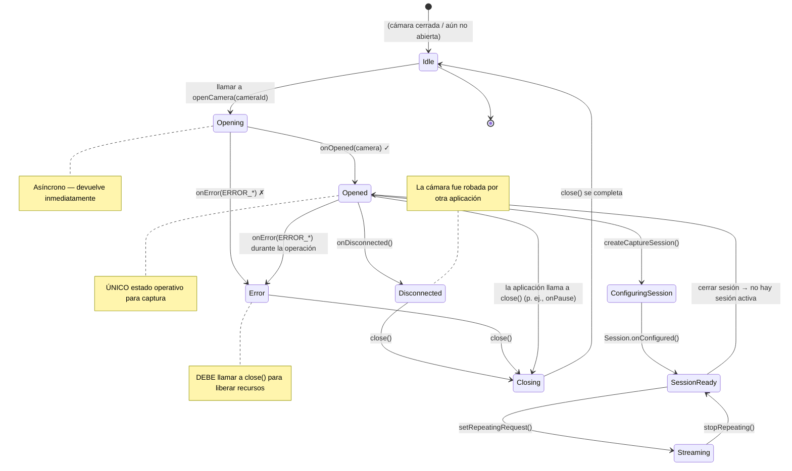

Ha enumerado todas las cámaras del dispositivo (Capítulo 6) y ha identificado la que desea usar; normalmente la cámara trasera con el nivel de hardware más alto. El siguiente paso es **abrir** esa cámara: establecer una conexión activa de bajo nivel con el hardware de la cámara para poder configurar sesiones de captura y enviar solicitudes. Abrir una cámara es el punto de no retorno donde su aplicación pasa de ser un observador pasivo de metadatos de cámara a ser un controlador activo de hardware real.

Si desea ver código de ciclo de vida de apertura/cierre de cámara de grado de producción, estudie la aplicación **Android Camera Parameters** en [GitHub](https://github.com/zoozooll/AndroidCameraParameters). Su clase `Camera2Controller` encapsula toda la gestión del ciclo de vida de `CameraDevice`, incluyendo la recuperación de errores, la lógica de reintento y la limpieza síncrona. La versión de [Google Play](https://play.google.com/store/apps/details?id=com.minininja.cameraparams) de la aplicación se ha instalado en miles de dispositivos de cientos de OEM diferentes, por lo que los casos extremos que maneja están probados en el mundo real.

## ¿Qué es CameraDevice?

`CameraDevice` es la clase de Camera2 que representa **una conexión activa y abierta con una cámara física (o lógica) específica en el dispositivo**. Antes de abrir la cámara, solo puede leer sus características; una vez abierta, puede:
- Crear `CameraCaptureSession` (Capítulo 8)
- Enviar `CaptureRequest` (Capítulos 8 y 9)
- Leer metadatos dinámicos `CaptureResult` a medida que llegan los fotogramas
- Vaciar las solicitudes pendientes, abortar las capturas y cerrar el dispositivo

Un `CameraDevice` tiene dos propiedades críticas:

1. **Es un recurso de un solo usuario.** Solo una aplicación (y dentro de su aplicación, solo una instancia de `CameraDevice`) puede mantener abierta una cámara determinada a la vez. Si una aplicación de mayor prioridad (como una videollamada entrante) necesita la cámara, su aplicación será desconectada a la fuerza.
2. **Tiene un ciclo de vida estricto impulsado por retrollamadas.** No puede crear un `CameraDevice` con un constructor. La única forma de obtener uno es a través de `CameraManager.openCamera()`, que entrega la instancia de forma asíncrona mediante una `StateCallback`. Debe respetar cada retrollamada de transición de estado.

La relación entre `CameraManager`, un ID de cámara y el `CameraDevice` resultante es:

```
CameraManager.openCamera("0", callback, handler)
    │
    ├── Llamada asíncrona → devuelve inmediatamente
    │
    └───── En hilo en segundo plano (vía Handler) ────→ StateCallback.onOpened(cameraDevice)
                                                          │
                                                          ▼
                                                  Ahora puede usar cameraDevice para:
                                                  • createCaptureSession(...)
                                                  • createCaptureRequest(...)
```

## El StateCallback: La máquina de ciclo de vida de CameraDevice

`CameraDevice.StateCallback` es una clase abstracta con tres métodos que **debe** implementar. Cada cámara abierta acabará activando al menos una de estas retrollamadas (ya sea `onOpened` seguida más tarde de `onDisconnected`/`onError`, o directamente `onError` si la apertura falla). La cámara no puede usarse para la captura hasta que se active `onOpened`.

### Los tres métodos de StateCallback

| Método | Cuándo se llama | Qué hacer |
|---|---|---|
| `onOpened(camera: CameraDevice)` | La cámara se ha abierto con éxito y está lista para su uso. | Almacene la referencia a `camera` en una propiedad. Proceda a configurar una sesión de captura (Capítulo 8). Libere cualquier permiso de Semaphore si adquirió uno. |
| `onDisconnected(camera: CameraDevice)` | La cámara le fue quitada a su aplicación (por ejemplo, otra aplicación de mayor prioridad la abrió, el usuario fue a una aplicación en primer plano que requiere mucha cámara o la política del dispositivo la desactivó). | Llame a `camera.close()` inmediatamente. Ponga a nulo su referencia almacenada. La cámara no se puede volver a abrir hasta que su aplicación recupere el primer plano (punto en el cual `onResume` lo reintentará). |
| `onError(camera: CameraDevice, error: Int)` | Ocurrió un error fatal durante la apertura o mientras la cámara estaba activa. El parámetro `error` es una de las constantes `ERROR_*` descritas a continuación. | Llame a `camera.close()`. Ponga a nulo la referencia. Dependiendo del código de error, muestre un error al usuario o reintente con un retroceso exponencial. Libere siempre el Semaphore. |

### Los códigos de error de `onError`

El entero `error` en `onError` se asigna a cinco constantes (definidas en `CameraDevice.StateCallback`):

| Constante | Valor | Significado | Recuperación |
|---|---|---|---|
| `ERROR_CAMERA_IN_USE` | `1` | La cámara ya está abierta por otra aplicación o por el servicio de cámara del sistema. | No se puede recuperar automáticamente; espere a `onResume` cuando el usuario regrese a su aplicación y reintente. |
| `ERROR_MAX_CAMERAS_IN_USE` | `2` | El dispositivo tiene un límite de cuántas cámaras pueden estar abiertas simultáneamente; lo ha excedido al intentar abrir esta cámara (común en insignias con múltiples cámaras). | Cierre otros `CameraDevice` abiertos que pueda tener y luego reintente. En dispositivos con límites de hardware, normalmente solo pueden estar abiertas 2-3 cámaras a la vez. |
| `ERROR_CAMERA_DISABLED` | `3` | La política del dispositivo (MDM, controles parentales, modo quiosco) ha desactivado todas las cámaras. | Muestre un mensaje de error permanente al usuario. Reintentar no ayudará hasta que cambie la política. |
| `ERROR_CAMERA_DEVICE` | `4` | El hardware/firmware de la cámara encontró un error irrecuperable. | Cierre el dispositivo. Notifique al usuario. Reintentar puede ayudar en algunos dispositivos (para fallos de firmware transitorios), por lo que un par de intentos de reintento con retroceso son razonables. |
| `ERROR_CAMERA_SERVICE` | `5` | El servicio de cámara de todo el sistema ha fallado. Este es un fallo a nivel de plataforma, no culpa de su aplicación. | Cierre y ponga a nulo todo. Normalmente, el servicio de cámara se reiniciará automáticamente en unos segundos; puede reintentar después de un retraso o esperar al siguiente `onResume`. |

El diagrama de estados a continuación captura cada transición válida de un `CameraDevice` desde el momento en que llama a `openCamera()` hasta que usted (o el sistema) lo cierra:



Conclusiones importantes del diagrama de estados:

1. **Opened es el único estado operativo.** Antes de que se active `onOpened` y después de cualquier error/desconexión, la referencia a `CameraDevice` debe considerarse inutilizable.
2. **Cierre en cada estado terminal.** Independientemente de si recibe `onError`, `onDisconnected` o simplemente decide cerrar proactivamente en `onPause`, **siempre llame a `close()`**. No cerrar una cámara provoca fugas que impiden que **cualquier** aplicación (incluida la suya) la vuelva a abrir hasta que el proceso muera o el servicio del sistema se reinicie.
3. **onError es terminal.** Después de `onError`, esa instancia específica de `CameraDevice` está muerta. No intente recuperarla; ciérrela y luego intente un nuevo `openCamera()` si cree que el error fue transitorio.

## Integración del ciclo de vida con Actividad onPause/onResume

El ciclo de vida de la Actividad de Android está intrínsecamente ligado al ciclo de vida de `CameraDevice`. El hardware de la cámara es un recurso compartido que consume mucha energía; el sistema mata agresivamente las aplicaciones que mantienen las cámaras abiertas mientras están en segundo plano. Las reglas canónicas son:

### Cuándo abrir la cámara (onResume)

En `onResume` (después de iniciar el hilo en segundo plano, como establecimos en el Capítulo 5):
1. Verifique que los permisos sigan concedidos (el usuario podría haberlos revocado en Ajustes mientras la aplicación estaba en segundo plano).
2. Si un `CameraDevice` ya está abierto, está listo.
3. Si no hay ningún `CameraDevice` abierto, llame a `openCamera()` con el ID que seleccionó en el Capítulo 6.

### Cuándo cerrar la cámara (onPause)

En `onPause` (antes de detener el hilo en segundo plano):
1. Si una solicitud repetitiva está activa (vista previa ejecutándose - Capítulo 8), deténgala con `cameraCaptureSession.stopRepeating()`.
2. Si existe una sesión de captura abierta, ciérrela con `cameraCaptureSession.close()`.
3. Cierre el propio `CameraDevice` con `cameraDevice.close()`.
4. Ponga a nulo las tres referencias (sesión, dispositivo y el constructor de solicitudes pendiente).
5. Entonces (y solo entonces) detenga el hilo en segundo plano.

Si invierte algo de esto (por ejemplo, detiene el hilo **antes** de cerrar la cámara), las retrollamadas que `close()` necesita ejecutar no tendrán donde ejecutarse y obtendrá bloqueos (deadlocks), ANR o advertencias de `Handler ... sending message to a Handler on a dead thread` en Logcat.

## Control de concurrencia con Semaphore

Hay una sutil condición de carrera que hace tropezar incluso a los desarrolladores experimentados de Camera2: **¿qué pasa si el usuario cambia rápidamente entre aplicaciones, provocando que se llame de nuevo a `openCamera()` antes de que se haya activado la retrollamada asíncrona de la apertura anterior?**

Termina con dos intentos de apertura concurrentes para la misma cámara. El servicio de cámara del sistema puede atender a uno y rechazar el otro con `ERROR_CAMERA_IN_USE`, o puede desconectar el primero a mitad de la apertura; en cualquier caso, su código de retrollamada tiene que lidiar con referencias obsoletas y errores de doble cierre.

La solución es un **`Semaphore`** inicializado con 1 permiso (un bloqueo binario / mutex):

- Antes de llamar a `openCamera()`, adquiera el permiso. Si la adquisición agota el tiempo de espera, omita este intento de apertura (el anterior todavía está en vuelo).
- En **cada retrollamada terminal** (`onOpened`, `onDisconnected`, `onError`), libere el permiso.
- En `onPause`, después de cerrar la cámara, libere el permiso una vez más de forma defensiva si se mantenía.

`Semaphore.tryAcquire(timeout, unit)` es el método correcto: se bloquea durante `timeout` milisegundos como máximo y luego devuelve `false` si no se pudo obtener el permiso. Nunca use el `acquire()` bloqueante sin un tiempo de espera en el hilo principal; puede provocar un ANR.

## Manejo de CameraAccessException

`CameraManager.openCamera()` lanza una excepción comprobada `CameraAccessException`. A diferencia de los códigos de error entregados a través de `StateCallback.onError` (que son errores posteriores a la apertura), estas excepciones ocurren **durante el propio intento de apertura** antes de que exista siquiera un objeto `CameraDevice`. Los cuatro códigos de razón más comunes:

| Razón (de `e.reason`) | Significado |
|---|---|
| `CAMERA_IN_USE` (`4`) | Lo mismo que la versión de retrollamada: otra aplicación tiene la cámara. |
| `MAX_CAMERAS_IN_USE` (`5`) | Se alcanzó el límite de cámaras de hardware. |
| `CAMERA_DISABLED` (`1`) | Desactivada por política (MDM / perfil de trabajo). |
| `CAMERA_ERROR` (`3`) | Error de hardware genérico durante la apertura. |

Envuelva siempre `openCamera()` en un try/catch para `CameraAccessException` y también para `IllegalArgumentException` (en caso de que el ID de la cámara se invalidara entre la enumeración del Capítulo 6 y ahora; por ejemplo, se desconectó una cámara USB externa).

## Código Kotlin completo: Abriendo una cámara

Aquí está el código completo de `MainActivity` que integra todo lo de este capítulo. Ampliamos el código base del Capítulo 6 con el método `openCamera()`, una `StateCallback` completa, control de concurrencia basado en `Semaphore`, integración del ciclo de vida de la Actividad y manejo exhaustivo de errores.

```kotlin
package com.example.camera2tutorial

import android.Manifest
import android.content.Context
import android.content.pm.PackageManager
import android.hardware.camera2.CameraAccessException
import android.hardware.camera2.CameraCharacteristics
import android.hardware.camera2.CameraDevice
import android.hardware.camera2.CameraManager
import android.hardware.camera2.CameraMetadata
import android.os.Bundle
import android.os.Handler
import android.os.HandlerThread
import android.util.Log
import android.widget.Toast
import androidx.appcompat.app.AppCompatActivity
import androidx.core.app.ActivityCompat
import androidx.core.content.ContextCompat
import java.util.concurrent.Semaphore
import java.util.concurrent.TimeUnit

class MainActivity : AppCompatActivity() {

    private lateinit var backgroundThread: HandlerThread
    private lateinit var backgroundHandler: Handler
    private lateinit var cameraManager: CameraManager

    // Evitando múltiples aperturas de cámara concurrentes
    private val cameraOpenCloseLock = Semaphore(1)

    // El dispositivo de cámara abierto activo (anulable)
    private var cameraDevice: CameraDevice? = null

    // ID de cámara seleccionado (del paso de descubrimiento del Capítulo 6)
    private var selectedCameraId: String? = null

    override fun onCreate(savedInstanceState: Bundle?) {
        super.onCreate(savedInstanceState)
        setContentView(R.layout.activity_main)

        if (allPermissionsGranted()) {
            initializeCameraManager()
        } else {
            ActivityCompat.requestPermissions(
                this,
                REQUIRED_PERMISSIONS,
                REQUEST_CODE_PERMISSIONS
            )
        }
    }

    override fun onResume() {
        super.onResume()
        startBackgroundThread()

        if (allPermissionsGranted()) {
            if (!this::cameraManager.isInitialized) {
                initializeCameraManager()
            }
            // Permiso OK pero la cámara aún no está abierta → abrirla ahora
            if (cameraDevice == null && selectedCameraId != null) {
                openCamera(selectedCameraId!!)
            }
        } else {
            // El usuario revocó los permisos mientras la aplicación estaba en segundo plano
            ActivityCompat.requestPermissions(
                this,
                REQUIRED_PERMISSIONS,
                REQUEST_CODE_PERMISSIONS
            )
        }
    }

    override fun onPause() {
        closeCamera()
        stopBackgroundThread()
        super.onPause()
    }

    private fun startBackgroundThread() {
        backgroundThread = HandlerThread("Camera2Background").apply { start() }
        backgroundHandler = Handler(backgroundThread.looper)
    }

    private fun stopBackgroundThread() {
        backgroundThread.quitSafely()
        try {
            backgroundThread.join(1000)
        } catch (e: InterruptedException) {
            Log.e(TAG, "Interrumpido mientras se unía al hilo en segundo plano", e)
        }
    }

    private fun initializeCameraManager() {
        cameraManager = getSystemService(Context.CAMERA_SERVICE) as CameraManager
        discoverCamerasAndSelectDefault()
    }

    // ----------------- Capítulo 6 (condensado): Descubrimiento + selección -----------------
    data class CameraInfo(val id: String, val lensFacing: Int?, val hardwareLevel: Int?)

    private fun discoverCamerasAndSelectDefault() {
        val cameraIds = try { cameraManager.cameraIdList } catch (_: CameraAccessException) { emptyArray() }
        val discovered = mutableListOf<CameraInfo>()
        for (id in cameraIds) {
            val chars = try { cameraManager.getCameraCharacteristics(id) } catch (_: Exception) { continue }
            discovered += CameraInfo(
                id,
                chars.get(CameraCharacteristics.LENS_FACING),
                chars.get(CameraCharacteristics.INFO_SUPPORTED_HARDWARE_LEVEL)
            )
        }
        // Preferir cámara trasera con el nivel de hardware más alto
        val backCandidates = discovered.filter { it.lensFacing == CameraCharacteristics.LENS_FACING_BACK }
            .sortedByDescending { it.hardwareLevel ?: -1 } // LEVEL_3 > FULL > LIMITED > LEGACY
        val frontCandidates = discovered.filter { it.lensFacing == CameraCharacteristics.LENS_FACING_FRONT }
            .sortedByDescending { it.hardwareLevel ?: -1 }

        selectedCameraId = (backCandidates + frontCandidates).firstOrNull()?.id
        Log.d(TAG, "Cámara seleccionada para abrir: ID=$selectedCameraId")

        // En el primer lanzamiento, abrir inmediatamente si el hilo está listo
        if (selectedCameraId != null && this::backgroundHandler.isInitialized) {
            openCamera(selectedCameraId!!)
        }
    }

    // -------------------------------------------------------------------------
    // 🎯 ADICIONES DEL CAPÍTULO 7: openCamera() + StateCallback + closeCamera()
    // -------------------------------------------------------------------------
    private val stateCallback = object : CameraDevice.StateCallback() {

        override fun onOpened(camera: CameraDevice) {
            // Se adquirió el permiso en openCamera(); libérelo ahora que la apertura tuvo éxito
            cameraOpenCloseLock.release()
            cameraDevice = camera
            Log.d(TAG, "✅ Cámara abierta con éxito: ID=${camera.id}")
            Toast.makeText(
                this@MainActivity,
                "¡Cámara ${camera.id} abierta con éxito!",
                Toast.LENGTH_SHORT
            ).show()

            // TODO Capítulo 8: Aquí crearemos una CameraCaptureSession para la vista previa.
            // Por ahora, celebre la apertura exitosa: ¡tenemos un CameraDevice activo!
        }

        override fun onDisconnected(camera: CameraDevice) {
            cameraOpenCloseLock.release()
            Log.w(TAG, "⚠️ Cámara desconectada (robada por otra aplicación): ID=${camera.id}")
            cameraDevice?.close()
            cameraDevice = null
        }

        override fun onError(camera: CameraDevice, error: Int) {
            cameraOpenCloseLock.release()
            Log.e(TAG, "❌ Error de cámara en ID=${camera.id}. Código=$error (${errorCodeToString(error)})")

            cameraDevice?.close()
            cameraDevice = null

            // Mostrar mensaje al usuario dependiendo del tipo de error
            val userMsg = when (error) {
                ERROR_CAMERA_IN_USE ->
                    "La cámara está en uso por otra aplicación. Cierre otras aplicaciones de cámara e inténtelo de nuevo."
                ERROR_MAX_CAMERAS_IN_USE ->
                    "Hay demasiadas cámaras abiertas. Este dispositivo limita cuántas cámaras pueden funcionar simultáneamente."
                ERROR_CAMERA_DISABLED ->
                    "La cámara ha sido desactivada por una política del dispositivo (controles parentales, perfil de trabajo, etc.)."
                ERROR_CAMERA_DEVICE ->
                    "Ocurrió un error de hardware de la cámara. Intente reiniciar su dispositivo si esto persiste."
                ERROR_CAMERA_SERVICE ->
                    "El servicio de cámara del sistema falló. Inténtelo de nuevo en un momento."
                else ->
                    "Ocurrió un error de cámara desconocido (código=$error)."
            }
            Toast.makeText(this@MainActivity, userMsg, Toast.LENGTH_LONG).show()
        }
    }

    private fun openCamera(cameraId: String) {
        if (ContextCompat.checkSelfPermission(this, Manifest.permission.CAMERA)
            != PackageManager.PERMISSION_GRANTED
        ) {
            Log.w(TAG, "openCamera omitido: permiso CAMERA no concedido")
            return
        }

        // ----- Adquirir semáforo con tiempo de espera (2,5 segundos) para evitar bloqueos -----
        val acquired = try {
            cameraOpenCloseLock.tryAcquire(2500, TimeUnit.MILLISECONDS)
        } catch (e: InterruptedException) {
            Log.e(TAG, "Interrumpido mientras se esperaba para adquirir el bloqueo de apertura de cámara", e)
            false
        }
        if (!acquired) {
            Log.e(TAG, "Tiempo de espera agotado esperando el bloqueo de apertura de cámara: otra apertura/cierre está en progreso")
            Toast.makeText(this, "La cámara está ocupada. Inténtelo de nuevo.", Toast.LENGTH_SHORT).show()
            return
        }

        try {
            Log.d(TAG, "Solicitando apertura de cámara para ID=$cameraId")
            cameraManager.openCamera(
                cameraId,        // Qué cámara abrir
                stateCallback,   // Retrollamadas de ciclo de vida (onOpened, onDisconnected, onError)
                backgroundHandler// Hilo/looper donde se ejecutan las retrollamadas (¡NO el hilo principal!)
            )
        } catch (e: CameraAccessException) {
            Log.e(TAG, "CameraAccessException durante openCamera. Razón=${e.reason}", e)
            cameraOpenCloseLock.release() // No mantenga el permiso si openCamera() lanzó excepción
            val msg = when (e.reason) {
                CameraAccessException.CAMERA_IN_USE -> "La cámara está en uso por otra aplicación."
                CameraAccessException.MAX_CAMERAS_IN_USE -> "Demasiadas cámaras abiertas en este momento."
                CameraAccessException.CAMERA_DISABLED -> "Cámara desactivada por política del dispositivo."
                CameraAccessException.CAMERA_ERROR -> "Error de hardware de la cámara durante la apertura."
                else -> "CameraAccessException desconocida (razón=${e.reason})"
            }
            Toast.makeText(this, msg, Toast.LENGTH_LONG).show()
        } catch (e: IllegalArgumentException) {
            Log.e(TAG, "ID de cámara no válido: $cameraId", e)
            cameraOpenCloseLock.release()
            Toast.makeText(this, "La cámara solicitada ya no existe.", Toast.LENGTH_LONG).show()
        } catch (e: SecurityException) {
            Log.e(TAG, "SecurityException: ¿se revocó el permiso de cámara a mitad de la llamada?", e)
            cameraOpenCloseLock.release()
        }
    }

    private fun closeCamera() {
        try {
            // Bloquear hasta que obtengamos el permiso (el cierre siempre debería ganar la carrera)
            cameraOpenCloseLock.acquire()

            // TODO Capítulo 8: cerrar primero la sesión de captura si existe
            // captureSession?.close()
            // captureSession = null

            cameraDevice?.close()
            cameraDevice = null
            Log.d(TAG, "🔒 Cámara cerrada y todos los recursos liberados")
        } catch (e: InterruptedException) {
            Log.e(TAG, "Interrumpido mientras se cerraba la cámara", e)
        } finally {
            cameraOpenCloseLock.release() // Liberar siempre, incluso si close() lanzó excepción
        }
    }

    // -------------------------------------------------------------------------
    // Ayudantes y fontanería de permisos
    // -------------------------------------------------------------------------
    private fun errorCodeToString(error: Int): String = when (error) {
        CameraDevice.StateCallback.ERROR_CAMERA_IN_USE -> "ERROR_CAMERA_IN_USE"
        CameraDevice.StateCallback.ERROR_MAX_CAMERAS_IN_USE -> "ERROR_MAX_CAMERAS_IN_USE"
        CameraDevice.StateCallback.ERROR_CAMERA_DISABLED -> "ERROR_CAMERA_DISABLED"
        CameraDevice.StateCallback.ERROR_CAMERA_DEVICE -> "ERROR_CAMERA_DEVICE"
        CameraDevice.StateCallback.ERROR_CAMERA_SERVICE -> "ERROR_CAMERA_SERVICE"
        else -> "UNKNOWN_ERROR"
    }

    companion object {
        private const val TAG = "Camera2Tutorial"
        private const val REQUEST_CODE_PERMISSIONS = 10
        private val REQUIRED_PERMISSIONS = arrayOf(Manifest.permission.CAMERA)
    }

    private fun allPermissionsGranted() = REQUIRED_PERMISSIONS.all {
        ContextCompat.checkSelfPermission(baseContext, it) == PackageManager.PERMISSION_GRANTED
    }

    override fun onRequestPermissionsResult(
        requestCode: Int,
        permissions: Array<out String>,
        grantResults: IntArray
    ) {
        super.onRequestPermissionsResult(requestCode, permissions, grantResults)
        if (requestCode == REQUEST_CODE_PERMISSIONS) {
            if (allPermissionsGranted()) {
                initializeCameraManager()
            } else {
                Toast.makeText(
                    this,
                    "Se requiere el permiso de cámara para usar esta aplicación.",
                    Toast.LENGTH_LONG
                ).show()
                finish()
            }
        }
    }
}
```

### Profundización en la lógica del Semaphore

El patrón `Semaphore(1)` en el código anterior evita tres clases de errores específicas:

1. **Carrera de doble apertura (onResume + onCreate activando ambos openCamera)**: Solo uno de ellos adquirirá el permiso; el otro agotará el tiempo de espera y saldrá limpiamente.
2. **Carrera de abrir vs cerrar (el usuario toca Inicio mientras la apertura está en vuelo)**: `closeCamera()` en `onPause` se bloquea en `acquire()` (sin tiempo de espera: el cierre siempre puede esperar) hasta que la apertura en vuelo tenga éxito o agote el tiempo de espera. El permiso se vuelve a liberar en el bloque finally.
3. **Fuga de permiso olvidado en rutas de error**: Cada ruta de salida de `openCamera()` (ruta feliz a través de `onOpened`, error a través de `onError`, bloques catch de excepciones) libera el permiso. Si alguna ruta lo olvida, el siguiente `openCamera` agotará permanentemente el tiempo de espera; la liberación defensiva en el bloque `finally` de `closeCamera` es la red de seguridad.

### Por qué se pasa el `backgroundHandler` a `openCamera`

El tercer argumento de `CameraManager.openCamera()` es el `Handler` opcional que especifica qué `Looper` de hilo debe ejecutar la `StateCallback`. Pasar `null` significa que se usa el manejador del hilo principal, que es exactamente lo que advertimos en el Capítulo 5. Al pasar `backgroundHandler`, nos aseguramos de que:
- `onOpened`, `onDisconnected` y `onError` se ejecuten todos en el hilo dedicado `Camera2Background`.
- Cualquier trabajo pesado (como `createCaptureSession` en el Capítulo 8) que iniciemos desde dentro de `onOpened` también se ejecute fuera del hilo principal, evitando tirones en la interfaz de usuario.

## Verificación: Qué esperar al ejecutar

Cuando ejecute el código del Capítulo 7 en un dispositivo físico:

1. **Primer lanzamiento (después de conceder permisos)**:
   - Logcat muestra `Cámara seleccionada para abrir: ID=0` → `Solicitando apertura de cámara para ID=0` → una breve pausa → `✅ Cámara abierta con éxito: ID=0`.
   - Un Toast confirma: "¡Cámara 0 abierta con éxito!"
   - En este punto, el hardware de la cámara está activo. Si sostiene el teléfono, puede sentir que el módulo de la cámara se calienta ligeramente después de unos segundos (está encendido pero aún no produce fotogramas).

2. **Presione el botón de Inicio (envía la aplicación a segundo plano)**:
   - Se activa `onPause` → `🔒 Cámara cerrada y todos los recursos liberados` en Logcat.
   - La cámara se ha cerrado limpiamente. El sistema ahora puede entregársela a otra aplicación.

3. **Regrese a la aplicación**:
   - Se activa `onResume` → el hilo se inicia → se llama de nuevo a `openCamera` → `✅ Cámara abierta con éxito` de nuevo.
   - Este viaje de ida y vuelta (abrir → cerrar → abrir) debe ser instantáneo y confiable. Pruébelo más de 10 veces seguidas rápidamente para asegurarse de que no haya ANR.

4. **Prueba de esfuerzo: abra otra aplicación de cámara mientras la suya se está ejecutando**:
   - Mientras su aplicación muestra el Toast "Cámara abierta", presione Inicio, inicie la aplicación de cámara integrada y luego regrese a la suya.
   - Cuando sale de su aplicación, se ejecuta su `closeCamera()` limpiamente. Si la cámara estándar permanece abierta mientras intenta volver a la suya, verá `onDisconnected` o `ERROR_CAMERA_IN_USE`: estos son **comportamientos correctos y esperados**, no errores. Su aplicación los maneja con gracia.

La compilación de lanzamiento de la aplicación Android Camera Parameters ([Google Play](https://play.google.com/store/apps/details?id=com.minininja.cameraparams)) incluye pruebas automatizadas de ANR que repiten el ciclo `abrir/cerrar` 1.000 veces seguidas en cada familia de dispositivos importante; el patrón `Semaphore(1)` + `tryAcquire` descrito aquí es exactamente lo que pasa esas pruebas sin un solo ANR o bloqueo.

## Solución de fallos comunes de apertura

### `onError` con `ERROR_CAMERA_IN_USE` se activa en cada intento

Esto suele suceder cuando:
- Está usando un emulador con la cámara AVD configurada en `Webcam0` y otra aplicación de escritorio (Zoom, Teams, OBS, la aplicación de cámara integrada) está usando la cámara web del portátil. Cierre todos los consumidores de cámara web de escritorio y reintente.
- Su propia aplicación tiene un `CameraDevice` filtrado de un ciclo de instalación anterior. Desinstale/reinstale la aplicación (lo que mata el proceso) o reinicie el dispositivo.
- Algunas ROM personalizadas tienen un error conocido donde el servicio de cámara del sistema mantiene una referencia filtrada; solo el reinicio del dispositivo lo soluciona.

### `tryAcquire` agota el tiempo de espera en cada `openCamera`

Esto significa que el permiso nunca se libera. Audite cada ruta:
1. ¿Cada bloque `catch` en `openCamera` libera el permiso?
2. ¿Las tres retrollamadas (`onOpened`, `onDisconnected`, `onError`) liberan?
3. ¿El bloque `finally` de `closeCamera` libera?

Añada líneas `Log.d` inmediatamente antes y después de cada llamada a `acquire`/`release`, junto con `cameraOpenCloseLock.availablePermits` para vigilar el recuento de permisos. El recuento siempre debería ser `1` cuando la cámara está cerrada y `0` cuando una apertura está en progreso.

### `Handler sending message to a Handler on a dead thread` después de onPause

Esto ocurre cuando llama a `stopBackgroundThread()` **antes** de `closeCamera()`. En el orden correcto del código anterior, `closeCamera()` se ejecuta primero (mientras el hilo todavía está vivo) y luego `stopBackgroundThread()`. Si su código invierte esto, cámbielos de nuevo.

## Resumen

En este capítulo, dio el paso crítico de encender el hardware de la cámara y mantener un objeto `CameraDevice` activo y abierto. Aprendió:

1. **Qué representa CameraDevice**: Una conexión activa con una unidad de hardware de cámara específica, con el derecho exclusivo de enviarle solicitudes de captura.
2. **StateCallback y sus tres métodos**: `onOpened` (la cámara es utilizable), `onDisconnected` (la cámara fue robada: cerrar inmediatamente), `onError` (error fatal: cerrar y mostrar el mensaje de usuario apropiado para cada uno de los 5 códigos de error).
3. **Integración del ciclo de vida de la Actividad**: Las reglas canónicas de cuándo abrir (`onResume`, después del inicio del hilo, después de la nueva comprobación de permisos) y cuándo cerrar (`onPause`, antes de detener el hilo, cerrar sesión → cerrar dispositivo → anular referencias → detener hilo).
4. **Control de concurrencia de Semaphore**: Cómo un `Semaphore(1)` con `tryAcquire(2500ms)` evita la carrera de doble apertura, la carrera de abrir vs cerrar y las fugas de permisos olvidados; cómo se libera el permiso en cada ruta terminal (retrollamadas + capturas + bloque finally de cierre).
5. **Manejo de CameraAccessException**: Las cuatro razones de excepción (`CAMERA_IN_USE`, `MAX_CAMERAS_IN_USE`, `CAMERA_DISABLED`, `CAMERA_ERROR`) y cómo presentar cada una al usuario en lenguaje sencillo.

La trinidad `openCamera()` + `StateCallback` + `closeCamera()` es la columna vertebral de cada aplicación Camera2 de producción. Domine este patrón y la parte operativa más difícil de Camera2 habrá quedado atrás.

## ¿Qué sigue?

Un `CameraDevice` abierto es necesario pero no suficiente para ver lo que ve la cámara. Para renderizar realmente los píxeles en la pantalla, necesitamos alimentar los fotogramas en una superficie de visualización. En el **Capítulo 8: Mostrando la vista previa de la cámara**, usted:

- Entenderá el concepto de una `Surface` como una cola de búfer de destino de imagen.
- Configurará un `TextureView` con `SurfaceTextureListener` para crear una Surface de visualización.
- Usará matemáticas de `Matrix` en `configureTransform` para corregir la relación de aspecto de la vista previa y corregir la orientación del sensor.
- Construirá un `CaptureRequest.Builder` con `TEMPLATE_PREVIEW`, añadirá la `Surface` del TextureView como destino y creará una `CameraCaptureSession`.
- Llamará a `setRepeatingRequest` en la retrollamada `onConfigured` de la sesión para iniciar los fotogramas de vista previa continuos.

Al final del Capítulo 8, ¡finalmente verá una vista previa de la cámara en vivo en la pantalla, la recompensa gratificante por todo el trabajo de infraestructura de los Capítulos 5-7!
