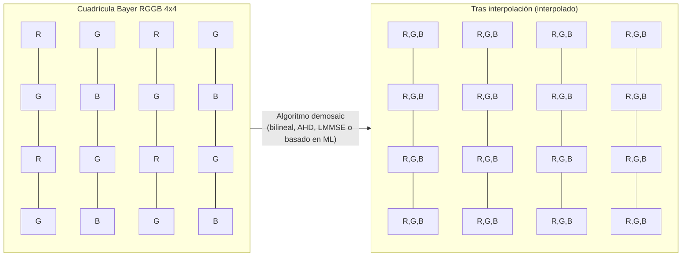
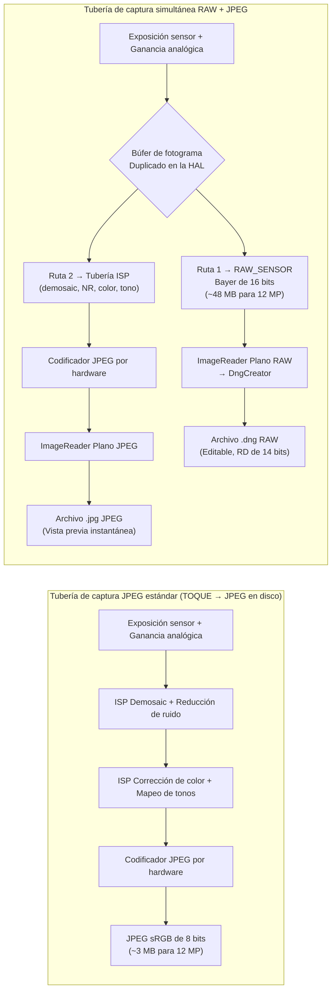

---     
sidebar_position: 18
title: "Capítulo 18: Fotografía RAW"
description: "Domine el formato RAW_SENSOR, la creación de archivos DNG con DngCreator, los patrones Bayer y la captura simultánea de RAW+JPEG en la API Camera2 de Android"
keywords: [Android Camera2, fotografía RAW, RAW_SENSOR, DngCreator, DNG, patrón Bayer, RGGB, JPEG_R, metadatos de cámara]
---

# Capítulo 18: Fotografía RAW

La fotografía móvil profesional exige más que los JPEG procesados que produce por defecto el ISP (Procesador de Señal de Imagen) de Android. Cuando captura un JPEG, los datos brutos del sensor ya han sido filtrados, interpolados, corregidos de color, reducidos de ruido y mapeados de tonos, lo que destruye gran parte del margen de edición en el que confían los fotógrafos. La API Camera2 le ofrece acceso directo al formato **RAW_SENSOR**: datos de patrón Bayer de 16 bits sin procesar directamente del sensor, con cero interferencia del ISP. Combinado con **DngCreator**, el framework de Android proporciona todo lo necesario para producir archivos Adobe DNG (Digital Negative) que cumplen los estándares y se abren directamente en Lightroom, Capture One, Photoshop y cualquier editor RAW profesional.

Este capítulo se basa en la investigación documentada en la sección *RAW / DngCreator* de la referencia interna del proyecto, y la amplía con código práctico que puede integrar en su propia aplicación. Puede ver estas capacidades enumeradas para cada dispositivo compatible en la aplicación [Android Camera Parameters](https://github.com/zoozooll/AndroidCameraParameters) (también disponible en la [Google Play Store](https://play.google.com/store/apps/details?id=com.zoozooll.cameraparameters)), que informa del tamaño máximo de RAW, las variantes de RAW disponibles (RAW10, RAW12, RAW14) y si los metadatos de DngCreator están totalmente rellenados para cada ID de cámara.

## ¿Por qué RAW? El coste del procesamiento del ISP

Antes de sumergirse en los detalles de la API, es fundamental entender exactamente qué hace el ISP cuando produce un JPEG, y por qué saltárselo es importante. Una tubería de ISP de smartphone típica aplica las siguientes etapas en orden:

1. **Fijación del nivel de negro**: resta la línea base de corriente oscura del sensor.
2. **Corrección de sombreado de lente**: elimina el viñeteado mediante mapas de ganancia por píxel.
3. **Interpolación cromática (Demosaicing)**: interpola la cuadrícula Bayer de un color por píxel en una imagen RGB completa.
4. **Reducción de ruido**: aplica un filtrado espacial/temporal que borra el detalle fino junto con el ruido.
5. **Corrección de color**: aplica una matriz de 3×3 para mapear el espacio de color del sensor a sRGB.
6. **Gamma / mapeo de tonos**: comprime los 14 pasos lineales de la escena en una curva no lineal de 8 bits.
7. **Realce de bordes**: enfoca para compensar el filtro óptico de paso bajo.
8. **Compresión JPEG**: aplica submuestreo de croma con pérdidas (normalmente 4:2:0) y cuantificación.

El problema de esta tubería es que cada etapa es **irreversible** y está ajustada para *vistas previas* de consumo, no para el *postprocesamiento* profesional. Un JPEG recorta las luces a relaciones de contraste de 100:1 y envuelve 14 bits de rango dinámico del sensor en 8 bits; así que cuando sube las sombras 2 pasos en postproducción, obtiene bandas de color en lugar de detalle. El RAW preserva toda la salida lineal del sensor, permitiendo de 4 a 6 pasos de recuperación de sombras/luces y cambios de balance de blancos personalizados que no introducen artefactos de color.

```mermaid
flowchart TD
    subgraph ISP["Tubería de procesamiento ISP (ruta JPEG)"]
        S1[Datos RAW del sensor] --> S2[Fijación nivel de negro]
        S2 --> S3[Corrección sombreado lente]
        S3 --> S4[Interpolación cromática]
        S4 --> S5[Reducción de ruido]
        S5 --> S6[Corrección de color]
        S6 --> S7[Gamma / Mapeo de tonos]
        S7 --> S8[Realce de bordes]
        S8 --> S9[Compresión JPEG]
        S9 --> S10["JPEG sRGB de 8 bits<br/>(≈6 pasos de RD utilizable)"]
    end

    subgraph RAW["Ruta RAW (sin procesamiento ISP)"]
        R1[Datos RAW del sensor] --> R2["Patrón Bayer lineal de 16 bits<br/>(10–14 pasos de RD utilizable)"]
        R2 --> R3["DngCreator escribe<br/>metadatos + datos de píxeles"]
        R3 --> R4["Archivo .dng<br/>Editable en Lightroom/PS"]
    end
```



Compare visualmente las dos rutas anteriores: la ruta JPEG elimina datos en cada paso, mientras que la ruta RAW preserva toda la carga útil del sensor. La contrapartida es que los archivos RAW **no se pueden visualizar directamente**: requieren un paso de renderizado independiente (el paso de "revelado" en Lightroom) para interpretar la cuadrícula Bayer y convertirla a un espacio de color como sRGB o Rec.2020.

## La matriz de filtros de color Bayer

Los datos RAW no son RGB. Cada fotodetector del sensor registra solo **un color** (rojo, verde o azul) porque un fotodiodo de silicio en sí mismo es ciego al color y solo puede medir el recuento de fotones (luminancia). Para reconstruir el color, los fabricantes depositan una **Matriz de Filtros de Color (CFA)** sobre el sensor, y la cuadrícula de un solo canal resultante recibe el nombre de su inventor: el patrón Bayer.

En los dispositivos Android existen cuatro disposiciones de CFA comunes, identificadas por el orden de la celda superior izquierda de 2×2:

| Patrón | Disposición de la celda | Caso de uso típico |
|---------|-------------|------------------|
| **RGGB** | `R G / G B` | La mayoría de los smartphones (predeterminado en Samsung, Sony Exmor RS) |
| **BGGR** | `B G / G R` | Sensores Sony IMX en algunos dispositivos Xiaomi/OnePlus |
| **GRBG** | `G R / B G` | Ciertos sensores OmniVision |
| **GBRG** | `G B / R G` | Raro; se encuentra en algunos dispositivos Motorola de gama media |

La característica más llamativa de la cuadrícula Bayer es que el **50% de los píxeles son verdes**, mientras que el rojo y el azul reciben un 25% cada uno. No se trata de una elección arbitraria: la respuesta de luminancia fotópica del ojo humano alcanza su punto máximo en las longitudes de onda verdes (alrededor de 555 nm), por lo que dedicar el doble de muestras al verde maximiza la nitidez percibida y el rendimiento ante el ruido. El canal de luminancia de cualquier JPEG resultante deriva aproximadamente en un 60% de los fotodetectores verdes, por lo que la densidad de muestreo del verde se traduce directamente en el detalle resuelto.



El bloque demosaic de arriba (P11–P44) muestra cómo se reconstruye cada píxel: un fotodetector `R` utiliza sus valores vecinos `G` y `B` mediante interpolación, y viceversa. Esta interpolación es la mayor fuente de suavizado de imagen en la tubería JPEG, y exactamente por lo que quiere hacerlo usted mismo en la postproducción, donde el demosaicing por IA moderno (AI Enhance de Lightroom, Topaz DeNoise AI, etc.) puede ofrecer resultados más nítidos que el ISP por hardware en tiempo real del smartphone.

## Formato RAW_SENSOR y variantes empaquetadas (RAW10 / RAW12 / RAW14)

El identificador del formato RAW canónico de Android es `ImageFormat.RAW_SENSOR`, que se enumera como un búfer de 16 bits por píxel almacenado en el `Plane` devuelto por `Image.getPlanes()`. Sin embargo, la profundidad de bits *efectiva* depende del dispositivo y se informa a través de `CameraCharacteristics.SENSOR_INFO_BIT_DEPTH`; los bits superiores que superan la resolución real del ADC del sensor se rellenan con ceros.

La mayoría de los smartphones actuales utilizan una de las tres variantes de raw empaquetado, que se exponen a través de `StreamConfigurationMap.getOutputSizes()` con constantes de formato dedicadas:

| Constante de formato | Bits/muestra | Disposición de almacenamiento | Generación de sensor típica |
|-----------------|-------------|----------------|---------------------------|
| `RAW10`         | 10          | Empaquetado: 4 muestras por cada 5 bytes (alineado al MSB) | Sensores de gama media 2019–2022 (p. ej. IMX586, IMX682) |
| `RAW12`         | 12          | Empaquetado: 2 muestras por cada 3 bytes | Insignias 2021–2024 (p. ej. IMX800, IMX989 tipo 1 pulgada) |
| `RAW14`         | 14          | Relleno de 16 bits (alineado al MSB) | Nivel profesional / sensores de 1 pulgada+ (IMX989 con DOL-HDR) |

Los formatos empaquetados son la razón por la que **debe usar `Buffer.getByte()` / `Buffer.getShort()` teniendo en cuenta el paso de píxel (pixel stride)**, en lugar de tratar el búfer RAW como un array plano de short[]; las muestras RAW10 y RAW12 cruzan los límites de los bytes y requieren desplazamiento de bits para su extracción. `DngCreator` gestiona todo este empaquetado/desempaquetado de forma transparente si le pasa el objeto `Image` directamente, que es el enfoque recomendado.

## DNG: Estándar Adobe Digital Negative 1.4

¿Por qué escribir archivos `.dng` en lugar de un formato propietario como `.arw` (Sony) o `.cr3` (Canon)? Porque **el DNG es el único formato RAW universal**, publicado como ISO 12234-2 y aceptado por todas las herramientas fotográficas profesionales. El DNG v1.4 (la versión a la que apunta Android) especifica:

- Un contenedor compatible con TIFF/EP (estructura IFD de tipo little-endian).
- Etiquetas TIFF obligatorias para el patrón CFA, los niveles de negro y las matrices de color.
- `ColorMatrix2` / `CalibrationIlluminant2` opcionales para perfiles de doble iluminante.
- Mapa de sombreado de lente opcional (etiqueta 0xC618) para la corrección de campo plano por píxel.
- IFD de "makernotes" opcional para datos de calibración específicos del fabricante.

Sin estos metadatos, un búfer RAW es solo una cuadrícula de números sin etiquetas: ningún editor RAW podría renderizarlo correctamente. La clase `DngCreator` del paquete `android.hardware.camera2` de Android está diseñada específicamente para rellenar **automáticamente todos los metadatos obligatorios de DNG 1.4** a partir de `CameraCharacteristics` y `CaptureResult`, lo que significa que su aplicación no necesita incluir datos de calibración del sensor para cada dispositivo.

Los campos de metadatos específicos que escribe `DngCreator` incluyen:

| Etiqueta DNG | Origen | Propósito |
|---------|--------|---------|
| **BlackLevel** (SENSOR_BLACK_LEVEL_PATTERN) | `CameraCharacteristics` | Línea base de corriente oscura por canal de 4 elementos. |
| **ColorMatrix1 / ColorMatrix2** (SENSOR_COLOR_TRANSFORM1 / 2) | `CameraCharacteristics` | Matrices 3×3 que mapean RGB del sensor → XYZ con Iluminante A (D65). |
| **CalibrationIlluminant1 / 2** | `CameraCharacteristics` | Enumerado de iluminante estándar (17 = Estándar A, 21 = D65). |
| **ForwardMatrix1 / ForwardMatrix2** (SENSOR_FORWARD_MATRIX1 / 2) | `CameraCharacteristics` | Transformación inversa XYZ → RGB del sensor. |
| **NeutralColorPoint** (SENSOR_NEUTRAL_COLOR_POINT) | `CameraCharacteristics` | Balance de blancos nativo (relaciones r/g, b/g). |
| **LensShadingMap** (STATISTICS_LENS_SHADING_MAP) | `CaptureResult` | Cuadrícula de ganancia por canal de 4 canales para eliminar el viñeteado. |
| **Patrón CFA 2** | `CameraCharacteristics.SENSOR_INFO_COLOR_FILTER_ARRANGEMENT` | Codificación de la celda Bayer. |
| **BaselineExposure** | `SENSOR_REFERENCE_ILLUMINANT1` | Desplazamiento de exposición por defecto a aplicar durante el renderizado. |

Esta lista está tomada directamente de la especificación *RAW / DngCreator* del documento de investigación del proyecto. Si alguno de estos campos es informado como `null` por la API Camera2, `DngCreator` seguirá produciendo un DNG válido pero el archivo resultante podría requerir una calibración manual en postproducción. Puede comprobar qué campos están rellenados para cada ID de cámara mediante la aplicación Android Camera Parameters.

## Configuración de la captura simultánea de RAW + JPEG

El flujo de trabajo correcto para la captura RAW utiliza **múltiples destinos de salida en una única `CaptureRequest`**; esto garantiza que el búfer RAW y el JPEG procedan del *exacto mismo fotograma* (marca de tiempo idéntica, exposición del sensor idéntica), lo cual es esencial para los flujos de trabajo de copia de seguridad RAW+JPEG que la mayoría de los fotógrafos esperan. Intentar dos capturas secuenciales introduce variabilidad de fotograma a fotograma en la exposición, el AF y el AWB.

### Paso 1: Consultar las capacidades y el tamaño máximo de RAW

```kotlin
import android.hardware.camera2.CameraCharacteristics
import android.hardware.camera2.params.StreamConfigurationMap
import android.util.Size
import android.graphics.ImageFormat

fun getRawCapabilities(cameraId: String,
                       characteristics: CameraCharacteristics): Pair<Boolean, Size?> {
    val caps = characteristics.get(
        CameraCharacteristics.REQUEST_AVAILABLE_CAPABILITIES
    ) ?: intArrayOf()
    val supportsRaw = caps.contains(
        CameraCharacteristics.REQUEST_AVAILABLE_CAPABILITIES_RAW
    )
    if (!supportsRaw) return Pair(false, null)

    val configMap: StreamConfigurationMap? =
        characteristics.get(CameraCharacteristics.SCALER_STREAM_CONFIGURATION_MAP)

    val rawSizes = configMap?.getOutputSizes(ImageFormat.RAW_SENSOR)
        ?: emptyArray()
    val maxRawSize = rawSizes.maxByOrNull { it.width * it.height }

    return Pair(true, maxRawSize)
}
```

`REQUEST_AVAILABLE_CAPABILITIES_RAW` es el filtro obligatorio: si no está activado, la HAL rechazará cualquier salida RAW_SENSOR, y el intento de crear un `ImageReader` con ese formato lanzará una `IllegalArgumentException`. La aplicación Android Camera Parameters enumera esta capacidad por ID de cámara en su panel principal.

### Paso 2: Crear ImageReaders duales (RAW + JPEG)

```kotlin
import android.media.ImageReader
import android.graphics.ImageFormat

private var rawImageReader: ImageReader? = null
private var jpegImageReader: ImageReader? = null

fun setupDualImageReaders(rawSize: Size, jpegSize: Size) {
    rawImageReader = ImageReader.newInstance(
        rawSize.width,
        rawSize.height,
        ImageFormat.RAW_SENSOR,
        5 // Profundidad del búfer de adquisición: >= 2, 5 permite margen para captura en ráfaga
    ).apply {
        setOnImageAvailableListener(
            OnRawImageAvailableListener(),
            backgroundHandler
        )
    }

    jpegImageReader = ImageReader.newInstance(
        jpegSize.width,
        jpegSize.height,
        ImageFormat.JPEG,
        2
    ).apply {
        setOnImageAvailableListener(
            OnJpegImageAvailableListener(),
            backgroundHandler
        )
    }
}
```

La profundidad del búfer `maxImages` de RAW debe ser mayor (5) porque los búferes RAW tienen de 2 a 4 veces el ancho de banda del JPEG, y la HAL puede entregar de 2 a 3 fotogramas antes de que el grabador de disco se ponga al día. Quedarse sin espacio en el búfer RAW provoca la pérdida silenciosa de fotogramas sin ninguna retrollamada de error.

### Paso 3: Crear una CaptureSession con ambas superficies y lanzar una captura multiobjetivo

```kotlin
import android.hardware.camera2.CameraDevice
import android.hardware.camera2.CaptureRequest
import android.view.Surface

lateinit var cameraDevice: CameraDevice

fun createCaptureSessionAndCapture(
    rawSurface: Surface,
    jpegSurface: Surface,
    previewSurface: Surface
) {
    val outputSurfaces = listOf(previewSurface, rawSurface, jpegSurface)

    cameraDevice.createCaptureSession(
        outputSurfaces,
        object : CameraCaptureSession.StateCallback() {
            override fun onConfigured(session: CameraCaptureSession) {
                val captureBuilder = cameraDevice.createCaptureRequest(
                    CameraDevice.TEMPLATE_STILL_CAPTURE
                ).apply {
                    addTarget(previewSurface)
                    addTarget(rawSurface)
                    addTarget(jpegSurface)

                    set(CaptureRequest.CONTROL_AF_MODE,
                        CaptureRequest.CONTROL_AF_MODE_CONTINUOUS_PICTURE)
                    set(CaptureRequest.CONTROL_AE_MODE,
                        CaptureRequest.CONTROL_AE_MODE_ON)
                    set(CaptureRequest.CONTROL_AWB_MODE,
                        CaptureRequest.CONTROL_AWB_MODE_OFF) // ¡Bloquear WB en RAW!
                }

                session.capture(
                    captureBuilder.build(),
                    RawCaptureCallback(),
                    backgroundHandler
                )
            }
            override fun onConfigureFailed(session: CameraCaptureSession) = Unit
        },
        backgroundHandler
    )
}
```

Tres detalles aquí son innegociables:

1. **El AWB debe estar bloqueado (`CONTROL_AWB_MODE_OFF`) para las capturas RAW.** Si se deja el AWB activado, la HAL aplicará una rampa de ganancia RGB en mitad de la ráfaga, lo que significa que cada fotograma RAW tendrá un balance de blancos nativo diferente, lo que impide que los editores RAW puedan aplicar un perfil uniforme. Use `CaptureResult.SENSOR_NEUTRAL_COLOR_POINT` para derivar el WB correcto en el postprocesamiento.

2. **Use `TEMPLATE_STILL_CAPTURE`** como plantilla base. Configura el sensor para el modo de lectura de mayor calidad y desactiva la reducción de ruido específica de la vista previa que la HAL podría inyectar de otro modo.

3. **Los tres objetivos (vista previa, RAW, JPEG) están en una única `CaptureRequest`.** La HAL garantiza la entrega coincidente en el tiempo.

### Paso 4: Usar DngCreator para escribir el archivo DNG

La retrollamada `OnImageAvailableListener` recibe objetos `Image` desde los que ya se puede acceder a los datos de los píxeles RAW. Pase el objeto `Image` *y* el `CaptureResult` correspondiente a `DngCreator`, junto con las `CameraCharacteristics` originales utilizadas para abrir la cámara; esta combinación es necesaria para rellenar correctamente todos los metadatos de DNG 1.4.

```kotlin
import android.hardware.camera2.CameraCharacteristics
import android.hardware.camera2.CaptureResult
import android.hardware.camera2.DngCreator
import android.media.Image
import java.io.File
import java.io.FileOutputStream
import java.io.IOException

inner class OnRawImageAvailableListener : ImageReader.OnImageAvailableListener {
    private val pendingDngWrites =
        HashMap<Long, CaptureResult>() // marca de tiempo → CaptureResult

    fun registerCaptureResult(timestamp: Long, result: CaptureResult) {
        pendingDngWrites[timestamp] = result
    }

    override fun onImageAvailable(reader: ImageReader) {
        var image: Image? = null
        try {
            image = reader.acquireLatestImage() ?: return
            val timestamp = image.timestamp

            val captureResult = pendingDngWrites.remove(timestamp) ?: return
            val characteristics = latestCameraCharacteristics ?: return

            val dngFile = File(
                getExternalFilesDir(null),
                "RAW_${System.currentTimeMillis()}.dng"
            )

            FileOutputStream(dngFile).use { fos ->
                val dngCreator = DngCreator(characteristics, captureResult)
                dngCreator.writeByteBuffer(
                    fos,
                    image.width,
                    image.height,
                    image.planes[0].buffer,
                    0 // relleno, siempre 0 para RAW_SENSOR
                )
            }

        } catch (e: IOException) {
            Log.e(TAG, "Error al escribir el archivo DNG", e)
        } catch (e: IllegalStateException) {
            Log.e(TAG, "DngCreator rechazó los metadatos (falta campo obligatorio)", e)
        } finally {
            image?.close() // CRÍTICO: NUNCA filtre referencias de Image
        }
    }
}
```

El constructor de `DngCreator` toma exactamente dos argumentos:
- **`CameraCharacteristics`**: campos estáticos por cámara (niveles de negro, matrices de color, patrón CFA, punto de color neutro e iluminantes 1 y 2).
- **`CaptureResult`**: campos dinámicos por fotograma (exposición del sensor, ISO, mapa de sombreado de lente, posición de la lente AF).

Si alguno de los dos es `null` o si falta un campo de metadatos obligatorio (p. ej., algunos dispositivos económicos informan de `null` para `SENSOR_COLOR_TRANSFORM1`), el constructor lanzará una `IllegalArgumentException` en el momento de la construcción (no en `writeByteBuffer`). Por ello, la aplicación Android Camera Parameters informa explícitamente de cada campo relevante para el DNG: los desarrolladores pueden prefiltrar los dispositivos para evitar fallos en dispositivos con implementaciones de HAL incompletas.

El mapa de marcas de tiempo `pendingDngWrites` soluciona un problema real de concurrencia: `CaptureResult.CaptureCallback.onCaptureCompleted()` se dispara **antes o después** de `OnImageAvailableListener.onImageAvailable()` (dependiendo de la HAL). El emparejamiento por `image.timestamp` == `CaptureResult.SENSOR_TIMESTAMP` garantiza que los metadatos correctos se emparejen con el búfer de píxeles correcto.

## Comparación de tuberías de procesamiento (Mermaid detallado)



La idea clave de este diagrama es el **nodo de duplicación de fotogramas G**: la HAL lee un fotograma del sensor y luego encamina una copia sin modificar a la salida RAW mientras alimenta la *misma* copia en el ISP para la codificación JPEG. Esto garantiza la paridad de los fotogramas sin duplicar el ancho de banda de lectura del sensor.

## Consideraciones de rendimiento y límites prácticos

Escribir archivos DNG de 12–48 MB en el almacenamiento flash lleva un tiempo mensurable:
- Almacenamiento UFS 3.1: escritura secuencial de ~250 MB/s → un DNG de 12 MP (~48 MB) tarda unos 190 ms.
- Almacenamiento eMMC 5.1: escritura secuencial de ~120 MB/s → el mismo archivo tarda unos 400 ms.

Esto significa que **no puede bloquear el hilo de la interfaz de usuario con escrituras DNG**: ejecute siempre `writeByteBuffer` en un hilo/Handler en segundo plano, y cierre siempre el objeto `Image` en un bloque `finally` para evitar la falta de búferes de la HAL.

Otra restricción importante: no todos los dispositivos admiten RAW + JPEG en la misma sesión, aunque `CAPABILITIES_RAW` esté activado. La forma correcta de verificarlo es `StreamConfigurationMap.isOutputSupportedFor(surfaceList)` con ambas superficies en la lista. Si devuelve `false`, recurra a sesiones solo de RAW.

## Resumen

Este capítulo ha cubierto todo el flujo de trabajo de fotografía RAW de principio a fin en Android Camera2:

- El **formato RAW_SENSOR** entrega la cuadrícula Bayer de 16 bits sin procesar del sensor, saltándose todas las etapas de procesamiento del ISP.
- Los **patrones Bayer** (RGGB, BGGR, GRBG, GBRG) asignan el 50% de los fotodetectores al verde para un muestreo de luminancia optimizado para la visión humana.
- Las **variantes empaquetadas** (RAW10, RAW12, RAW14) almacenan las muestras con la profundidad de bits nativa del ADC; DngCreator las desempaqueta de forma transparente.
- **DNG v1.4** es el contenedor RAW universal. `DngCreator(characteristics, result).writeByteBuffer(...)` rellena todos los metadatos obligatorios: niveles de negro, matrices de color, mapa de sombreado de lente, punto de color neutro e iluminantes de calibración 1 y 2.
- Las **CaptureRequest multiobjetivo** encaminan el mismo fotograma a los ImageReader RAW y JPEG, garantizando la paridad de fotogramas para los flujos de trabajo RAW+JPEG.
- Es necesario el **emparejamiento por marcas de tiempo** entre el `CaptureResult` y el `Image` porque las retrollamadas se disparan en un orden que depende de la HAL.

## ¿Qué sigue?

En el siguiente capítulo, pasamos de la fotografía estática al video con el **Capítulo 19: Video de alta velocidad**, donde utilizaremos `CameraConstrainedHighSpeedCaptureSession` para lograr capturas de 120 fps (cámara lenta 4x) y 240 fps (cámara lenta 8x). Aprenderá por qué las sesiones de alta velocidad requieren `createHighSpeedRequestList` en lugar de CaptureRequest individuales, y cómo la tubería de alta velocidad dedicada de la HAL omite la ruta de vista previa normal para ofrecer velocidades de fotogramas que de otro modo serían prohibitivas para la CPU.

Puede validar las capacidades RAW de su dispositivo, el tamaño máximo de RAW y la integridad de los metadatos de DngCreator instalando la aplicación [Android Camera Parameters](https://play.google.com/store/apps/details?id=com.zoozooll.cameraparameters), y contribuir con informes de dispositivos al [repositorio de GitHub](https://github.com/zoozooll/AndroidCameraParameters) de código abierto para ayudar a otros desarrolladores a saber qué dispositivos admiten flujos de trabajo RAW profesionales.
