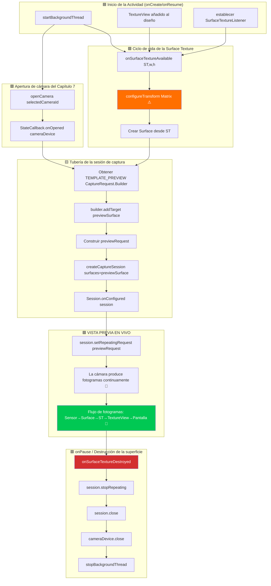

Este es el capítulo que estaba esperando. Después de tres capítulos construyendo el andamiaje (permisos, hilos, CameraManager, enumeración, ciclo de vida de apertura/cierre), por fin **verá la salida de la cámara renderizada en vivo en la pantalla del dispositivo Android**. La vista previa es el alma de una aplicación de cámara: es lo que el usuario mira para encuadrar una toma, comprobar el enfoque y verificar la exposición antes de pulsar el obturador. Hacerlo bien marca la diferencia entre una aplicación tosca e inutilizable y una experiencia de cámara pulida y sensible.

Para una implementación de vista previa de referencia que maneja casos extremos en cientos de dispositivos, consulte la pantalla de vista previa en la aplicación **Android Camera Parameters** ([GitHub](https://github.com/zoozooll/AndroidCameraParameters) / [Google Play](https://play.google.com/store/apps/details?id=com.minininja.cameraparams)). Su tubería de vista previa incluye transformaciones conscientes de la orientación, superficies de salida multirresolución y una limitación fluida de la velocidad de fotogramas, todo ello construido sobre los mismos componentes fundamentales que cubrimos aquí.

## La tubería de vista previa: Resumen de componentes

Antes de sumergirnos en el código, mapeemos el viaje conceptual de un único fotograma de vista previa desde el sensor de la cámara hasta la pantalla del teléfono. Cada fotograma pasa por cinco capas:

```
Sensor de cámara → Tubería del CameraDevice → Surface (BufferQueue) → SurfaceTexture → TextureView → Pantalla
```

Cada capa desempeña un papel específico e insustituible. Saltarse o atajar cualquiera de ellas produce pantallas negras, relaciones de aspecto distorsionadas o desgarros de imagen. Definamos cada componente:

### 1. Surface: El búfer de destino de la imagen

Una `Surface` es el concepto genérico de la API Camera2 para **un destino para los fotogramas de imagen procesados**. Bajo el capó, una Surface envuelve una `BufferQueue` de Android: un búfer circular de búferes gráficos (normalmente de 3 a 5 búferes de profundidad) gestionado por el compositor del sistema (SurfaceFlinger). Cuando Camera2 "renderiza un fotograma" en una Surface, retira un búfer vacío de la cola, lo rellena con datos de píxeles y lo vuelve a encolar para que el consumidor lo utilice.

Cualquier cosa que pueda consumir búferes gráficos puede exponer una `Surface`. Los consumidores más comunes son:
- **SurfaceTexture** → alimenta un `TextureView` (para la vista previa en pantalla - este capítulo).
- **Surface de un MediaRecorder/MediaCodec** → codificación de video (no cubierto en esta serie).
- **Surface de ImageReader** → objetos `Image` accesibles por la CPU para la captura JPEG/RAW (Capítulo 9).

### 2. SurfaceTexture: El puente GPU a GPU

`SurfaceTexture` es la clase mágica que convierte un flujo bruto de fotogramas de cámara en una textura que la GPU puede muestrear y renderizar. Es el extremo consumidor de la BufferQueue de la Surface, pero en lugar de entregar los búferes a la CPU, los convierte en una textura OpenGL ES `GL_TEXTURE_EXTERNAL_OES`. Esto permite a `TextureView` componer el fotograma de la cámara en la jerarquía de vistas utilizando el renderizado estándar de la GPU; no se requiere copia por la CPU, por lo que se puede lograr trivialmente una vista previa de más de 60 FPS.

Se obtiene una `Surface` para una `SurfaceTexture` con:
```kotlin
val surface = Surface(surfaceTexture)
```

### 3. TextureView: La ventana en pantalla

`TextureView` es una subclase de `View` que puede mostrar el contenido de una `SurfaceTexture`. Es el sucesor moderno de la antigua `SurfaceView`, y la opción recomendada para la vista previa de Camera2 por tres razones:
- Se comporta como una vista normal (se puede animar, transformar, mezclar con alfa, colocar en contenedores desplazables).
- No obliga a la Actividad a usar una ventana transparente (a diferencia de SurfaceView, que perfora un "agujero" en la jerarquía de vistas).
- Su `SurfaceTextureListener` nos ofrece retrollamadas precisas del ciclo de vida para cuando la superficie se crea, se destruye o se redimensiona.

Para obtener acceso impulsado por retrollamadas a la SurfaceTexture subyacente, `TextureView` expone `setSurfaceTextureListener()` con cuatro retrollamadas:
- `onSurfaceTextureAvailable(surfaceTexture, width, height)`: la superficie está lista para recibir fotogramas (se dispara una vez cuando se dispone la vista).
- `onSurfaceTextureSizeChanged(surfaceTexture, width, height)`: el tamaño de la superficie ha cambiado (p. ej., el dispositivo ha rotado).
- `onSurfaceTextureDestroyed(surfaceTexture)`: a punto de ser destruida; debemos detener la vista previa antes de que esto retorne.
- `onSurfaceTextureUpdated(surfaceTexture)`: se dispara para **cada nuevo fotograma** (puede usarse para dirigir superposiciones de seguimiento facial, etc.).

### 4. CameraCaptureSession: La tubería configurada

Antes de que un `CameraDevice` pueda producir fotogramas, debe crear una `CameraCaptureSession`. Una sesión es una **configuración de todas las superficies de salida en las que escribirá la tubería de la cámara**. Puede pensar en ello como la "fontanería" del ISP (Procesador de Señal de Imagen) de la cámara para enrutar su salida a uno o más sumideros. Solo para la vista previa, la sesión tiene una Surface (la del TextureView). Cuando añadamos la captura de fotos en el Capítulo 9, la sesión tendrá dos superficies: vista previa + `ImageReader`.

Reglas clave:
- Una sesión se crea con `CameraDevice.createCaptureSession(outputSurfaces, stateCallback, handler)`.
- La sesión solo es utilizable **después** de que se dispare `StateCallback.onConfigured(session)`.
- Un `CameraDevice` solo puede tener **una sesión activa a la vez**. Crear una nueva sesión cierra la anterior.
- La sesión es propietaria de *todas* las salidas durante su vida útil; añadir una nueva superficie (p. ej., decidir de repente grabar video) requiere desmontar la sesión antigua y crear una nueva con todas las superficies (vista previa + grabador).

### 5. Solicitud de captura repetitiva (TEMPLATE_PREVIEW)

Una vez configurada la sesión, ¿cómo ocurre la vista previa continua? Camera2 es una API impulsada por solicitudes: cada fotograma es una `CaptureRequest` enviada a la sesión. Para la vista previa, enviamos **una solicitud y la marcamos como repetitiva**: el hardware de la cámara volverá a ejecutar esa misma solicitud (con los mismos ajustes del sensor, destinos y estado 3A) continuamente, produciendo fotogramas tan rápido como la tubería permita (normalmente 30–120 FPS).

Una solicitud repetitiva se envía con:
```kotlin
session.setRepeatingRequest(previewRequest, captureCallback, backgroundHandler)
```

La plantilla para la vista previa es `CameraDevice.TEMPLATE_PREVIEW`. Camera2 proporciona varias plantillas predefinidas que configuran cientos de parámetros de bajo nivel (exposición, rango de velocidad de fotogramas, modo 3A, reducción de ruido, etc.) de forma adecuada para el caso de uso. Para la vista previa, `TEMPLATE_PREVIEW` optimiza la **baja latencia y la fluidez de la velocidad de fotogramas**, incluso si eso significa un rango dinámico del sensor ligeramente reducido en comparación con `TEMPLATE_STILL_CAPTURE` (usada en el Capítulo 9 para fotos).

## Diagrama de flujo de la vista previa de extremo a extremo

El diagrama de flujo a continuación muestra cómo se conectan todos estos componentes. Sígalo de cerca al leer el código: cada bloque corresponde a una llamada a función real.



El bloque resaltado en naranja (`configureTransform`) y el bloque resaltado en verde (VISTA PREVIA EN VIVO) son los dos pasos más críticos. Sáltese `configureTransform` y su vista previa estará estirada, rotada o aplastada. Conecte todo lo demás correctamente pero olvide llamar a `setRepeatingRequest`, y la pantalla permanecerá negra sin registrarse ningún error.

## Paso 1: Añadir TextureView al XML de diseño

Primero, cree o actualice `app/src/main/res/layout/activity_main.xml` para incluir un `TextureView` a pantalla completa. También añadiremos una superposición de `TextView` como indicador de estado para poder ver el tamaño de la vista previa.

```xml
<?xml version="1.0" encoding="utf-8"?>
<FrameLayout xmlns:android="http://schemas.android.com/apk/res/android"
    android:layout_width="match_parent"
    android:layout_height="match_parent">

    <TextureView
        android:id="@+id/textureView"
        android:layout_width="match_parent"
        android:layout_height="match_parent"
        android:layout_gravity="center" />

    <TextView
        android:id="@+id/statusTextView"
        android:layout_width="wrap_content"
        android:layout_height="wrap_content"
        android:layout_gravity="top|center_horizontal"
        android:layout_marginTop="16dp"
        android:background="#80000000"
        android:padding="8dp"
        android:textColor="#FFFFFFFF"
        android:textSize="12sp"
        tools:text="Inicializando cámara..." />

</FrameLayout>
```

¿Por qué `FrameLayout` como raíz? Porque la vista previa es una capa a pantalla completa, y `FrameLayout` apila a los hijos por orden Z (los hijos posteriores se dibujan encima). Más adelante añadiremos una superposición de botón de obturador. El `TextureView` usa `match_parent` en ambas dimensiones, pero no se preocupe, usaremos `configureTransform` a continuación para encuadrarlo correctamente, de modo que los píxeles en sí nunca se estiren aunque la vista llene la pantalla.

## Paso 2: configureTransform: El ingrediente secreto de la relación de aspecto correcta de la vista previa

Si no hace nada y simplemente dirige los fotogramas a un TextureView a pantalla completa, la vista previa estará **estirada**. ¿Por qué? Porque los sensores de cámara tienen una relación de aspecto fija (casi siempre 4:3 para la captura de fotos fijas, a veces 16:9 para los modos de video), y la pantalla del teléfono tiene una relación de aspecto diferente (a menudo ~20:9 en los insignias modernos). Si la cámara emite un fotograma de vista previa de 4032×3024 (4:3) y el TextureView lo estira a 1080×2400 (20:9), las caras se ven delgadas y altas.

La solución es **`configureTransform(viewWidth: Int, viewHeight: Int)`**: un método que calcula una `Matrix` (rotación + escalado de recorte central) y la aplica al TextureView. La matriz hace tres cosas:
1. **Rotar** la imagen el número de grados que el dispositivo está rotado con respecto a la orientación natural del sensor de la cámara.
2. **Escalar** la imagen para que llene el TextureView por completo manteniendo la relación de aspecto (estilo recorte central, o franjas negras si lo prefiere).
3. **Volver a centrar** la imagen escalada/rotada para que quede en el medio de la vista.

Esta es la función más copiada de los ejemplos oficiales de Android Camera2: todos los desarrolladores la necesitan y es fácil equivocarse. Aquí tiene la versión canónica:

```kotlin
/**
 * Configura la transformación de Matrix necesaria para `textureView`.
 * Este método debe llamarse después de que se determine el tamaño de la vista previa de la cámara
 * y también se fije el tamaño de `textureView`.
 *
 * @param viewWidth  El ancho de `textureView`
 * @param viewHeight La altura de `textureView`
 * @param previewSize El tamaño de vista previa seleccionado por la cámara (ancho, alto)
 * @param sensorOrientationDegrees La característica SENSOR_ORIENTATION de la cámara
 * @param deviceDisplayRotationDegrees La rotación de la pantalla (0/90/180/270) relativa a la natural
 */
private fun configureTransform(
    viewWidth: Int,
    viewHeight: Int,
    previewSize: android.util.Size,
    sensorOrientationDegrees: Int,
    deviceDisplayRotationDegrees: Int
) {
    val rotation = when (deviceDisplayRotationDegrees) {
        android.view.Surface.ROTATION_0 -> 0
        android.view.Surface.ROTATION_90 -> 90
        android.view.Surface.ROTATION_180 -> 180
        android.view.Surface.ROTATION_270 -> 270
        else -> return
    }

    val matrix = android.graphics.Matrix()
    val viewRect = android.graphics.RectF(0f, 0f, viewWidth.toFloat(), viewHeight.toFloat())
    val bufferRect = android.graphics.RectF(
        0f,
        0f,
        previewSize.height.toFloat(),
        previewSize.width.toFloat()
    )
    val centerX = viewRect.centerX()
    val centerY = viewRect.centerY()

    // Paso 1: Tener en cuenta la rotación del dispositivo con respecto a la orientación del sensor
    if (Surface.ROTATION_90 == rotation || Surface.ROTATION_270 == rotation) {
        bufferRect.offset(centerX - bufferRect.centerX(), centerY - bufferRect.centerY())
        matrix.setRectToRect(viewRect, bufferRect, android.graphics.Matrix.ScaleToFit.FILL)
        val scale = maxOf(
            viewHeight.toFloat() / previewSize.height,
            viewWidth.toFloat() / previewSize.width
        )
        matrix.postScale(scale, scale, centerX, centerY)
        matrix.postRotate(
            (90 * (rotation - 2)).toFloat(),
            centerX,
            centerY
        )
    } else if (Surface.ROTATION_180 == rotation) {
        matrix.postRotate(180f, centerX, centerY)
    }

    // Paso 2: Tener en cuenta también cómo está montado el sensor con respecto al dispositivo
    val relativeRotation = (sensorOrientationDegrees - rotation + 360) % 360
    if (relativeRotation != 0) {
        matrix.postRotate(relativeRotation.toFloat(), centerX, centerY)
    }

    textureView.setTransform(matrix)
}
```

Un detalle clave: `previewSize` es el tamaño de salida de la cámara, informado como (ancho, alto) en la **orientación del sensor**. Las dimensiones del TextureView están en la **orientación de la pantalla**. El truco de RectF con el ancho/alto intercambiados (`bufferRect` usa `previewSize.height` para el ancho y viceversa) tiene en cuenta este cambio de coordenadas de sensor frente a pantalla.

Necesitará dos piezas de información de CameraCharacteristics para llamar a esto:
- `SENSOR_ORIENTATION`: cuántos grados está rotado el sensor con respecto a la orientación natural del dispositivo. Para las cámaras traseras, casi siempre es 90°. Para las cámaras frontales, suele ser 270° (para que la imagen se refleje correctamente). Léalo una vez por cámara en la fase de descubrimiento.
- Rotación de la pantalla: desde `(getSystemService(Context.WINDOW_SERVICE) as WindowManager).defaultDisplay.rotation` (en las API más nuevas use `display?.rotation`).

## Paso 3: Elegir un tamaño de vista previa de SCALER_STREAM_CONFIGURATION_MAP

Antes de poder escribir `configureTransform` o crear una sesión, necesitamos saber qué tamaño de vista previa puede emitir la cámara. Para cada cámara, `CameraCharacteristics.SCALER_STREAM_CONFIGURATION_MAP` devuelve un `StreamConfigurationMap` que contiene todos los pares válidos (formato, tamaño) que la cámara puede producir. Para la vista previa en una `SurfaceTexture`, consultamos los tamaños de salida para la clase `SurfaceTexture::class.java`:

```kotlin
private fun chooseOptimalPreviewSize(
    characteristics: CameraCharacteristics,
    maxWidth: Int,
    maxHeight: Int,
    targetAspectRatio: Double
): android.util.Size {
    val map = characteristics.get(CameraCharacteristics.SCALER_STREAM_CONFIGURATION_MAP)
        ?: throw IllegalStateException("No hay mapa de configuración de flujo disponible")

    // Todos los tamaños admitidos para la salida de SurfaceTexture (clase de vista previa)
    val choices = map.getOutputSizes(SurfaceTexture::class.java).toList()

    // Preferir tamaños que coincidan con la relación de aspecto, luego los que quepan en las dimensiones máximas,
    // luego elegir el más grande (mejor calidad) de entre los restantes.
    val acceptable = choices.filter {
        it.width <= maxWidth
            && it.height <= maxHeight
            && Math.abs(it.width.toDouble() / it.height - targetAspectRatio) < 0.02
    }

    val chosen = acceptable.ifEmpty { choices }
        .maxByOrNull { it.width * it.height }!!

    Log.d(TAG, "Tamaño de vista previa seleccionado: ${chosen.width}x${chosen.height} " +
        "(de ${choices.size} opciones, maxAllowed=${maxWidth}x${maxHeight})")
    return chosen
}
```

Parámetros predeterminados de sentido común: `maxWidth = 1920`, `maxHeight = 1080`, `targetAspectRatio = textureView.width.toDouble() / textureView.height`. La superficie de vista previa no necesita ser 4K: 1080p es suficiente para encuadrar en la pantalla de un teléfono, consume menos energía y mantiene baja la latencia de la tubería.

## Paso 4: Código completo del Capítulo 8: Vista previa en vivo

Aquí tiene el `MainActivity.kt` completo que integra cada pieza de este capítulo: el `TextureView` basado en el diseño, el `SurfaceTextureListener`, la selección de tamaño, `configureTransform`, la creación de `CameraCaptureSession` y el importantísimo `setRepeatingRequest(TEMPLATE_PREVIEW)`.

```kotlin
package com.example.camera2tutorial

import android.Manifest
import android.content.Context
import android.content.pm.PackageManager
import android.graphics.Matrix
import android.graphics.RectF
import android.graphics.SurfaceTexture
import android.hardware.camera2.CameraAccessException
import android.hardware.camera2.CameraCharacteristics
import android.hardware.camera2.CameraCaptureSession
import android.hardware.camera2.CameraDevice
import android.hardware.camera2.CameraManager
import android.hardware.camera2.CaptureRequest
import android.hardware.camera2.params.StreamConfigurationMap
import android.os.Bundle
import android.os.Handler
import android.os.HandlerThread
import android.util.Log
import android.util.Size
import android.view.Surface
import android.view.TextureView
import android.view.WindowManager
import android.widget.TextView
import android.widget.Toast
import androidx.appcompat.app.AppCompatActivity
import androidx.core.app.ActivityCompat
import androidx.core.content.ContextCompat
import java.util.Collections
import java.util.concurrent.Semaphore
import java.util.concurrent.TimeUnit
import kotlin.math.max

class MainActivity : AppCompatActivity() {

    // UI
    private lateinit var textureView: TextureView
    private lateinit var statusTextView: TextView

    // Hilos
    private lateinit var backgroundThread: HandlerThread
    private lateinit var backgroundHandler: Handler

    // Cámara
    private lateinit var cameraManager: CameraManager
    private var cameraDevice: CameraDevice? = null
    private var captureSession: CameraCaptureSession? = null
    private var previewRequestBuilder: CaptureRequest.Builder? = null
    private var previewRequest: CaptureRequest? = null
    private var selectedCameraId: String? = null
    private var sensorOrientation = 0
    private lateinit var previewSize: Size

    private val cameraOpenCloseLock = Semaphore(1)

    // ------------------------- Ciclo de vida -------------------------
    override fun onCreate(savedInstanceState: Bundle?) {
        super.onCreate(savedInstanceState)
        setContentView(R.layout.activity_main)

        textureView = findViewById(R.id.textureView)
        statusTextView = findViewById(R.id.statusTextView)
        statusTextView.text = "Esperando al diseño de TextureView..."

        if (allPermissionsGranted()) {
            initializeCameraManager()
        } else {
            ActivityCompat.requestPermissions(
                this, REQUIRED_PERMISSIONS, REQUEST_CODE_PERMISSIONS
            )
        }
    }

    override fun onResume() {
        super.onResume()
        startBackgroundThread()

        if (allPermissionsGranted()) {
            if (!this::cameraManager.isInitialized) initializeCameraManager()
            // Si la vista de textura ya está disponible, abrir la cámara y crear la sesión ahora
            if (textureView.isAvailable) {
                openCameraAndStartPreview(textureView.width, textureView.height)
            }
        } else {
            ActivityCompat.requestPermissions(
                this, REQUIRED_PERMISSIONS, REQUEST_CODE_PERMISSIONS
            )
        }
    }

    override fun onPause() {
        closeCameraAndPreview()
        stopBackgroundThread()
        super.onPause()
    }

    private fun startBackgroundThread() {
        backgroundThread = HandlerThread("Camera2Background").apply { start() }
        backgroundHandler = Handler(backgroundThread.looper)
    }

    private fun stopBackgroundThread() {
        backgroundThread.quitSafely()
        try { backgroundThread.join(1000) } catch (_: InterruptedException) {}
    }

    // ------------------------- Capítulo 6 condensado: Descubrimiento -------------------------
    data class CameraInfo(val id: String, val facing: Int?, val hwLevel: Int?, val chars: CameraCharacteristics)

    private fun initializeCameraManager() {
        cameraManager = getSystemService(Context.CAMERA_SERVICE) as CameraManager
        val discovered = mutableListOf<CameraInfo>()
        for (id in cameraManager.cameraIdList) {
            val chars = try { cameraManager.getCameraCharacteristics(id) } catch (_: Exception) { continue }
            discovered += CameraInfo(
                id,
                chars.get(CameraCharacteristics.LENS_FACING),
                chars.get(CameraCharacteristics.INFO_SUPPORTED_HARDWARE_LEVEL),
                chars
            )
        }
        val chosen = discovered
            .sortedWith(
                compareByDescending<CameraInfo> { it.facing == CameraCharacteristics.LENS_FACING_BACK }
                    .thenByDescending { it.hwLevel ?: -1 }
            )
            .first()
        selectedCameraId = chosen.id
        sensorOrientation = chosen.chars.get(CameraCharacteristics.SENSOR_ORIENTATION) ?: 90

        Log.d(TAG, "Cámara seleccionada id=$selectedCameraId, sensorOrientation=$sensorOrientation°")

        // Conectar el escuchador de SurfaceTexture: activará el inicio real de la vista previa
        textureView.surfaceTextureListener = object : TextureView.SurfaceTextureListener {
            override fun onSurfaceTextureAvailable(st: SurfaceTexture, width: Int, height: Int) {
                Log.d(TAG, "✅ SurfaceTexture disponible: ${width}x$height")
                statusTextView.text = "SurfaceTexture listo: abriendo cámara..."
                openCameraAndStartPreview(width, height)
            }
            override fun onSurfaceTextureSizeChanged(st: SurfaceTexture, w: Int, h: Int) {
                if (this@MainActivity::previewSize.isInitialized) {
                    configureTransform(w, h)
                }
            }
            override fun onSurfaceTextureDestroyed(st: SurfaceTexture): Boolean {
                Log.d(TAG, "⛔ SurfaceTexture destruida")
                return true
            }
            override fun onSurfaceTextureUpdated(st: SurfaceTexture) {
                // Llamado en CADA fotograma. Mantenga el trabajo aquí < 1 ms. Cuente fotogramas para FPS si lo desea.
            }
        }
    }

    // ------------------------- Capítulo 7 condensado: openCamera -------------------------
    private val deviceStateCallback = object : CameraDevice.StateCallback() {
        override fun onOpened(camera: CameraDevice) {
            cameraOpenCloseLock.release()
            cameraDevice = camera
            Log.d(TAG, "✅ Cámara ${camera.id} abierta → creando sesión de captura")
            statusTextView.text = "Cámara abierta: creando sesión de captura..."

            // ⬇️ Capítulo 8: Con la cámara abierta Y SurfaceTexture disponible,
            // ahora creamos la sesión de captura
            createCaptureSession()
        }
        override fun onDisconnected(camera: CameraDevice) {
            cameraOpenCloseLock.release()
            cameraDevice?.close()
            cameraDevice = null
            Log.w(TAG, "Cámara ${camera.id} desconectada")
        }
        override fun onError(camera: CameraDevice, error: Int) {
            cameraOpenCloseLock.release()
            cameraDevice?.close()
            cameraDevice = null
            val msg = when (error) {
                ERROR_CAMERA_IN_USE -> "Cámara en uso por otra aplicación"
                else -> "Error de cámara $error"
            }
            Toast.makeText(this@MainActivity, msg, Toast.LENGTH_LONG).show()
        }
    }

    // ------------------------- 🎯 CAPÍTULO 8: Tubería de vista previa -------------------------
    private fun openCameraAndStartPreview(viewWidth: Int, viewHeight: Int) {
        val camId = selectedCameraId ?: return
        if (ContextCompat.checkSelfPermission(this, Manifest.permission.CAMERA)
            != PackageManager.PERMISSION_GRANTED) return
        if (!cameraOpenCloseLock.tryAcquire(2500, TimeUnit.MILLISECONDS)) {
            Toast.makeText(this, "Tiempo de espera de bloqueo de cámara agotado", Toast.LENGTH_SHORT).show()
            return
        }

        // 1) Decidir el tamaño de la vista previa ANTES de abrir la sesión
        val chars = cameraManager.getCameraCharacteristics(camId)
        previewSize = chooseOptimalPreviewSize(chars, viewWidth, viewHeight)

        // 2) Aplicar la transformación de corrección de aspecto al TextureView
        configureTransform(viewWidth, viewHeight)

        // 3) Configurar el tamaño del búfer de SurfaceTexture para que COINCIDA con el tamaño de vista previa elegido
        textureView.surfaceTexture!!.setDefaultBufferSize(previewSize.width, previewSize.height)

        statusTextView.text = "Tamaño de vista previa: ${previewSize.width}×${previewSize.height}"

        // 4) Abrir la cámara: la creación de la sesión continúa en onOpened → createCaptureSession()
        try {
            cameraManager.openCamera(camId, deviceStateCallback, backgroundHandler)
        } catch (e: CameraAccessException) {
            cameraOpenCloseLock.release()
            Toast.makeText(this, "Fallo al abrir la cámara: ${e.reason}", Toast.LENGTH_LONG).show()
        }
    }

    /**
     * Crea una CameraCaptureSession cuya única superficie de salida es la superficie de vista previa del TextureView.
     * Luego construye una solicitud TEMPLATE_PREVIEW e inicia la repetición.
     */
    private fun createCaptureSession() {
        val camera = cameraDevice ?: return
        val texture = textureView.surfaceTexture ?: return

        val previewSurface = Surface(texture)
        val outputSurfaces = Collections.singletonList(previewSurface)

        try {
            // Construir el CaptureRequest.Builder de TEMPLATE_PREVIEW una vez
            previewRequestBuilder =
                camera.createCaptureRequest(CameraDevice.TEMPLATE_PREVIEW).apply {
                    addTarget(previewSurface)
                }

            // Crear la sesión de captura
            camera.createCaptureSession(
                outputSurfaces,
                object : CameraCaptureSession.StateCallback() {
                    override fun onConfigured(session: CameraCaptureSession) {
                        captureSession = session
                        previewRequest = previewRequestBuilder!!.build()
                        Log.d(TAG, "✅ CaptureSession configurada → iniciando vista previa repetitiva")
                        statusTextView.text = "🎥 VISTA PREVIA EN VIVO: ${previewSize.width}×${previewSize.height}"

                        // ⭐ ESTA ES LA LÍNEA MÁGICA QUE INICIA LA VISTA PREVIA:
                        session.setRepeatingRequest(
                            previewRequest!!,
                            null,  // CaptureCallback es nulo para la vista previa: no necesitamos metadatos por fotograma
                            backgroundHandler
                        )
                    }

                    override fun onConfigureFailed(session: CameraCaptureSession) {
                        Log.e(TAG, "❌ Fallo en la configuración de CaptureSession")
                        Toast.makeText(
                            this@MainActivity,
                            "Fallo en la sesión de captura: vista previa no disponible",
                            Toast.LENGTH_LONG
                        ).show()
                    }

                    override fun onClosed(session: CameraCaptureSession) {
                        // Opcional: gancho de limpieza simétrica
                        if (captureSession === session) captureSession = null
                    }
                },
                backgroundHandler
            )
        } catch (e: CameraAccessException) {
            Log.e(TAG, "createCaptureSession lanzó CameraAccessException", e)
        } catch (e: IllegalStateException) {
            Log.e(TAG, "La cámara se cerró mientras se creaba la sesión", e)
        }
    }

    /**
     * Elige el tamaño de vista previa más grande que coincida con la relación de aspecto de la vista
     * y quepa en las dimensiones máximas dadas.
     */
    private fun chooseOptimalPreviewSize(
        characteristics: CameraCharacteristics,
        viewWidth: Int,
        viewHeight: Int
    ): Size {
        val map: StreamConfigurationMap =
            characteristics.get(CameraCharacteristics.SCALER_STREAM_CONFIGURATION_MAP)
                ?: throw IllegalStateException("StreamConfigurationMap no disponible")

        val viewAspect = max(viewWidth, viewHeight).toDouble() / min(viewWidth, viewHeight)
        val choices = map.getOutputSizes(SurfaceTexture::class.java).toList()

        // Límite superior razonable para la vista previa: no hay necesidad de un flujo de vista previa 4K
        val maxPreviewPixels = 1920 * 1080

        val aspectMatches = choices.filter {
            val szAspect = max(it.width, it.height).toDouble() / min(it.width, it.height)
            kotlin.math.abs(szAspect - viewAspect) < 0.02
                && (it.width * it.height) <= maxPreviewPixels * 2
        }

        val final = aspectMatches.ifEmpty { choices }
            .sortedByDescending { it.width * it.height }
            .first()

        Log.d(TAG, "Elección de tamaño de vista previa: ${final.width}×${final.height} " +
            "(de ${choices.size} opciones, targetAspect=%.2f)".format(viewAspect))
        return final
    }

    /**
     * Aplica una Matrix al TextureView para que los píxeles de la vista previa se rendericen con la relación
     * de aspecto correcta (sin estiramiento) y la orientación correcta (sin rotación).
     */
    private fun configureTransform(viewWidth: Int, viewHeight: Int) {
        if (!this::previewSize.isInitialized) return
        val rotation = (getSystemService(Context.WINDOW_SERVICE) as WindowManager)
            .defaultDisplay.rotation
        val matrix = Matrix()
        val viewRect = RectF(0f, 0f, viewWidth.toFloat(), viewHeight.toFloat())
        val bufferRect = RectF(
            0f, 0f,
            previewSize.height.toFloat(),
            previewSize.width.toFloat()
        )
        val cx = viewRect.centerX()
        val cy = viewRect.centerY()
        bufferRect.offset(cx - bufferRect.centerX(), cy - bufferRect.centerY())
        matrix.setRectToRect(viewRect, bufferRect, Matrix.ScaleToFit.FILL)
        val scale = max(
            viewHeight.toFloat() / previewSize.height,
            viewWidth.toFloat() / previewSize.width
        )
        matrix.postScale(scale, scale, cx, cy)
        val rotationDegrees = when (rotation) {
            Surface.ROTATION_0 -> sensorOrientation
            Surface.ROTATION_90 -> 0
            Surface.ROTATION_180 -> 360 - sensorOrientation
            Surface.ROTATION_270 -> 180
            else -> 0
        }
        matrix.postRotate(rotationDegrees.toFloat(), cx, cy)
        textureView.setTransform(matrix)
        Log.d(TAG, "configureTransform aplicado (rotación=$rotationDegrees°, escala=%.2f)".format(scale))
    }

    // ------------------------- Desmontaje -------------------------
    private fun closeCameraAndPreview() {
        try {
            cameraOpenCloseLock.acquire()

            captureSession?.apply {
                try {
                    stopRepeating()
                    abortCaptures()
                } catch (_: CameraAccessException) {}
                close()
            }
            captureSession = null

            cameraDevice?.close()
            cameraDevice = null

            Log.d(TAG, "🔒 Vista previa y cámara totalmente desmontadas")
        } catch (_: InterruptedException) {
        } finally {
            cameraOpenCloseLock.release()
        }
    }

    // ------------------------- Código repetitivo -------------------------
    companion object {
        private const val TAG = "Camera2Tutorial"
        private const val REQUEST_CODE_PERMISSIONS = 10
        private val REQUIRED_PERMISSIONS = arrayOf(Manifest.permission.CAMERA)
    }

    private fun allPermissionsGranted() = REQUIRED_PERMISSIONS.all {
        ContextCompat.checkSelfPermission(baseContext, it) == PackageManager.PERMISSION_GRANTED
    }

    override fun onRequestPermissionsResult(
        requestCode: Int, permissions: Array<out String>, grantResults: IntArray
    ) {
        super.onRequestPermissionsResult(requestCode, permissions, grantResults)
        if (requestCode == REQUEST_CODE_PERMISSIONS) {
            if (allPermissionsGranted()) {
                initializeCameraManager()
            } else {
                Toast.makeText(this, "Se requiere el permiso de cámara", Toast.LENGTH_LONG).show()
                finish()
            }
        }
    }
}
```

### Las 5 líneas que realmente inician la vista previa

De entre más de 350 líneas de infraestructura, **solo cinco sentencias consecutivas** en el código anterior son responsables de que los fotogramas lleguen realmente a la pantalla:

```kotlin
// Línea A: Construir una solicitud TEMPLATE_PREVIEW dirigida a la Surface de vista previa
previewRequestBuilder = camera.createCaptureRequest(CameraDevice.TEMPLATE_PREVIEW).apply {
    addTarget(previewSurface)
}

// Línea B: Crear la sesión de captura con la superficie de vista previa como su salida
camera.createCaptureSession(outputSurfaces, object : CameraCaptureSession.StateCallback() {
    override fun onConfigured(session: CameraCaptureSession) {
        // Línea C: Construir la CaptureRequest inmutable a partir del constructor
        previewRequest = previewRequestBuilder!!.build()
        // Línea D: ⭐ Iniciar el flujo repetitivo continuo de fotogramas de vista previa
        session.setRepeatingRequest(previewRequest!!, null, backgroundHandler)
    }
}, backgroundHandler)
```

Sáltese `addTarget(previewSurface)` y la sesión no sabrá a dónde enviar los fotogramas, lo que resultará en una pantalla negra. Sáltese `setRepeatingRequest` y la cámara esperará una captura que nunca llega: también negro. Se equivoca de plantilla de constructor (`TEMPLATE_STILL_CAPTURE` en lugar de `TEMPLATE_PREVIEW`) y los fotogramas de vista previa llegarán a 5 FPS. Las cinco líneas (más `configureTransform` para el aspecto) deben ser correctas.

## Verificación: Qué aspecto tiene el éxito

Al ejecutar la aplicación del Capítulo 8 en un dispositivo físico, debería observar el siguiente comportamiento como una serie de puntos de control:

1. **Splash (0 s)**: El estado muestra *"Esperando al diseño de TextureView..."*: la vista se está inflando.
2. **SurfaceTexture lista (~0,1 s)**: El estado se actualiza a *"SurfaceTexture listo: abriendo cámara..."*. La retrollamada `onSurfaceTextureAvailable` se ha disparado.
3. **Cámara abierta (~0,5 s)**: El estado cambia a *"Cámara abierta: creando sesión de captura..."*. El Logcat muestra la línea de selección de `previewSize` y la línea `configureTransform aplicado`.
4. **Sesión configurada (~0,7 s)**: El estado cambia a **🎥 VISTA PREVIA EN VIVO: 1920×1080** y **¡ve la imagen de la cámara en la pantalla!** Es fluida (30–60 FPS), está correctamente orientada y la relación de aspecto parece natural (sin caras estiradas).
5. **Pulse Inicio / ponga la aplicación en segundo plano**: El Logcat muestra `🔒 Vista previa y cámara totalmente desmontadas`. Al volver, la vista previa se reanuda instantáneamente.
6. **Rote el dispositivo a horizontal**: `onSurfaceTextureSizeChanged` se dispara, `configureTransform` se vuelve a ejecutar con las nuevas dimensiones y la vista previa se vuelve a centrar correctamente en horizontal sin ningún fallo.

Si no ve una imagen de vista previa, compruebe sistemáticamente las cinco líneas de inicio anteriores y verifique que se llamó a `setDefaultBufferSize` en la `SurfaceTexture` antes de crear la sesión. Este paso (`textureView.surfaceTexture!!.setDefaultBufferSize(previewSize.width, previewSize.height)`) es un **punto de fallo silencioso**: si se le olvida, algunos dispositivos entregan fotogramas negros con cero mensajes de error registrados.

## Solución de problemas de vista previa

### Pantalla negra, sin errores en el Logcat

Este es el error más común y frustrante del Capítulo 8. Compruebe por orden:

1. **¿Se llama a `setDefaultBufferSize`?** Debe llamarse con el MISMO `previewSize.width/height` que usa la sesión ANTES de que se cree la sesión.
2. **¿Se ejecutó `addTarget(previewSurface)`?** Registre la lista de destinos en el `previewRequestBuilder` justo antes de `.build()`.
3. **¿Se disparó realmente `setRepeatingRequest`?** Añada una `CaptureCallback` (sustituya `null` por una retrollamada que registre `onCaptureStarted`) y vea si se producen fotogramas. Si `onCaptureStarted` nunca se dispara, la sesión nunca se activó: vuelva atrás a `onConfigured` frente a `onConfigureFailed`.
4. **¿Está establecido `hardwareAccelerated="true"` en la Actividad?** (Requisito del Capítulo 2). Si no, TextureView no se renderiza silenciosamente.

### La vista previa está al revés o rotada 90°

Su función `configureTransform` es incorrecta. Añada registros de depuración a `rotationDegrees` dentro de `configureTransform` y compárelo con `sensorOrientation`. Un error común: aplicar la rotación del sensor y la rotación del dispositivo en el orden incorrecto. Para la gama Pixel, los sensores traseros están a 90° de la natural; en algunos dispositivos Samsung están a 270°. Lea siempre `SENSOR_ORIENTATION` en lugar de codificarlo a piñón fijo.

### La vista previa aparece estirada (caras altas y delgadas o caras bajas y anchas)

Esto significa que `configureTransform` se ejecutó pero no escaló correctamente. Registre `viewAspect`, la relación de aspecto final elegida `previewSize` y la variable `scale`. La escala debe ser > 1,0 (recorte central) o < 1,0 (franjas negras). Si la escala es exactamente 1,0 y las relaciones de aspecto no coinciden, está estirando los píxeles para rellenar.

### La vista previa funciona a una velocidad de fotogramas baja (parece de 5–10 FPS)

Compruebe dos cosas:
1. **Plantilla utilizada**: `TEMPLATE_STILL_CAPTURE` funciona a las velocidades de fotogramas de captura fija (bajas). Debe usar `TEMPLATE_PREVIEW`.
2. **Tamaño de vista previa**: ¿Eligió `chooseOptimalPreviewSize` una vista previa 4K (3840×2160)? Eso es ~8 veces los píxeles de 1080p y acabará con la velocidad de fotogramas en dispositivos económicos. Añada el techo de `maxPreviewPixels` que se ve en el código anterior.

## Resumen

Este capítulo ha sido la recompensa por todo el trabajo de infraestructura. Ahora tiene una aplicación de vista previa de cámara que funciona. Ha aprendido:

1. **Los cinco componentes de la tubería de vista previa**: `Surface` (cola de búferes), `SurfaceTexture` (conversión de textura de GPU), `TextureView` (visualización en pantalla), `CameraCaptureSession` (fontanería de todas las salidas juntas) y la `CaptureRequest` repetitiva `TEMPLATE_PREVIEW` (generación continua de fotogramas).
2. **TextureView + SurfaceTextureListener**: Cómo configurar el TextureView a pantalla completa mediante el diseño XML, conectar `onSurfaceTextureAvailable` para saber cuándo la superficie de la GPU está lista y conectar `onSurfaceTextureSizeChanged` para el redimensionamiento/reorientación en tiempo de ejecución.
3. **Selección del tamaño de la vista previa**: Cómo leer `SCALER_STREAM_CONFIGURATION_MAP`, consultar `getOutputSizes(SurfaceTexture::class.java)` y elegir el tamaño más grande que coincida con la relación de aspecto de la vista con un techo de 1080p para mantener bajos la latencia y el consumo.
4. **configureTransform**: La matriz de corrección de aspecto canónica que rota los fotogramas de la vista previa para que coincidan con la orientación del dispositivo y los escala por recorte central para que no se produzca estiramiento. Por qué se intercambian el ancho/alto entre el Rect del búfer y el Rect de la vista.
5. **CameraCaptureSession + setRepeatingRequest**: Construir un constructor de solicitudes `TEMPLATE_PREVIEW`, llamar a `addTarget(previewSurface)`, crear la sesión y en `onConfigured` llamar a `session.setRepeatingRequest()`, la única línea que realmente inicia el flujo de fotogramas.

La aplicación Android Camera Parameters en [Google Play](https://play.google.com/store/apps/details?id=com.minininja.cameraparams) utiliza un descendiente directo de esta misma tubería de vista previa. Su sistema de superposición (que muestra el estado 3A, el ISO, el tiempo de exposición y la posición de la lente por fotograma) se construye sobre el parámetro CaptureCallback que usted pasó como `null`: los fotogramas de la vista previa siguen fluyendo y nosotros espiamos los metadatos sin interrumpir el flujo.

## ¿Qué sigue?

Una vista previa en vivo es una demostración impresionante, pero no es una **aplicación** de cámara hasta que pueda capturar y guardar una foto. En el **Capítulo 9: Tomando fotos**, haremos lo siguiente:

1. Introducir `ImageReader` con formato JPEG, el sumidero accesible por la CPU para fotogramas fijos de alta calidad.
2. Aprender a establecer la calidad de compresión JPEG y a gestionar la profundidad de la cola de búferes `maxImages`.
3. Recorrer el flujo del disparador de precaptura AE (exposición automática): detener la repetición → inicio del disparador de precaptura AE → esperar a que AE converja → capturar foto fija → guardar bytes → desbloquear AE → reanudar la repetición.
4. Implementar el guardado de fotos compatible con el Almacenamiento con Alcance a través de `MediaStore` en Android 10+, y la ruta de `FileOutputStream` directa en versiones anteriores, recordando siempre llamar a `.close()` en el objeto `Image` para evitar la falta de búferes.
5. Añadir una cadena de `CaptureCallback` con seguimiento del estado por captura para que la espera de precaptura sea correcta.

Al final del Capítulo 9, su proyecto de tutorial será una **aplicación de cámara real y utilizable**: toque un botón, escuche el obturador y encuentre su foto JPEG en la carpeta Pictures del dispositivo. ¡Entonces podrá comparar la calidad de salida lado a lado con la aplicación Android Camera Parameters ([GitHub](https://github.com/zoozooll/AndroidCameraParameters)) para ver la diferencia que marcan los controles manuales!
