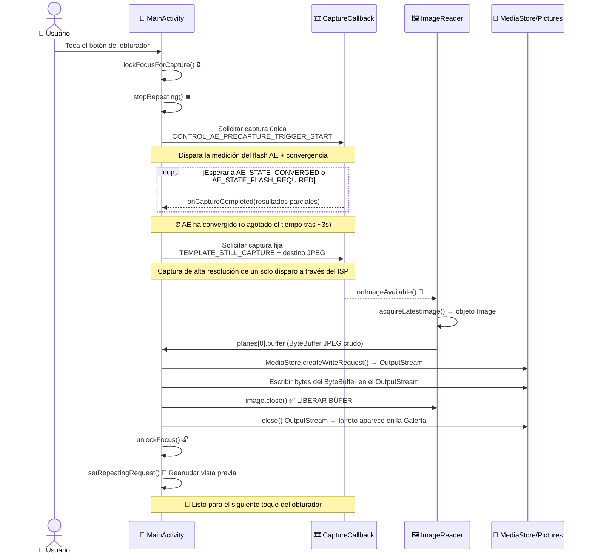

¡Felicidades por llegar al último capítulo de la Parte II! Si nos ha seguido desde el Capítulo 5, su aplicación ahora tiene: manejo de permisos, un hilo en segundo plano dedicado, enumeración de cámaras con `CameraCharacteristics`, gestión robusta del ciclo de vida de apertura/cierre a través de `Semaphore`, y una vista previa en vivo fluida y correctamente orientada renderizada a través de `TextureView`. ¿Qué falta? **La capacidad de tocar un botón y guardar una foto**. Eso es lo que ofrece este capítulo.

Al final de este capítulo, su proyecto de tutorial será una aplicación de cámara genuinamente utilizable: toque el obturador, la aplicación congelará brevemente la vista previa (como debe ser, para vaciar la tubería), se capturará una imagen fija con la convergencia de exposición automática adecuada, se guardará en el directorio compartido Pictures del dispositivo con los metadatos de orientación EXIF correctos, y la vista previa se reanudará automáticamente. Luego podrá abrir la foto en Google Fotos o en la aplicación Android Camera Parameters ([GitHub](https://github.com/zoozooll/AndroidCameraParameters), [Google Play](https://play.google.com/store/apps/details?id=com.minininja.cameraparams)) para inspeccionar los datos EXIF, la resolución y la calidad.

El modo de captura manual de la aplicación Android Camera Parameters utiliza una versión más avanzada de la tubería que construimos en este capítulo: ejecuta capturas en ráfaga de múltiples fotogramas con ISO, tiempo de exposición y posición de la lente personalizados por fotograma, pero todo se basa en los mismos fundamentos de `ImageReader` + `CaptureCallback` que aprenderá aquí.

## Por qué tomar una foto es más complejo que la vista previa

A primera vista, "simplemente capturar un fotograma" parece fácil: ya tenemos 60 fotogramas de vista previa por segundo fluyendo a través de la sesión, ¿por qué no podemos tomar uno? La respuesta es que los fotogramas de vista previa y los fotogramas fijos son salidas fundamentalmente diferentes:

1. **Diferencia de resolución**: La vista previa es de ~1–2 MP (1080p). Una foto fija debe usar la resolución **máxima** del sensor (a menudo más de 50 MP en los insignias modernos). No querrá una foto de 2 MP cuando su teléfono puede ofrecer 50 MP.
2. **Diferencia de exposición**: `TEMPLATE_PREVIEW` optimiza la velocidad de fotogramas para una baja latencia. `TEMPLATE_STILL_CAPTURE` optimiza el rango dinámico, la reducción de ruido y la precisión del color; el fotograma fijo necesita el procesamiento ISP de mayor calidad que la tubería pueda ofrecer.
3. **Convergencia 3A**: Antes de tomar una foto, al algoritmo de Exposición Automática (AE) de la cámara se le debe decir "estamos a punto de tomar una foto fija: bloquéate en la escena actual, haz converger la exposición, el balance de blancos y el enfoque, y dispara el flash si es necesario". Esta es la secuencia de **disparador de precaptura**. Omitirla conduce a fotos sobreexpuestas o subexpuestas en relación con lo que mostraba la vista previa.
4. **Almacenamiento y Almacenamiento con Alcance**: El fotograma de vista previa nunca se persiste. El fotograma de la foto debe escribirse en el disco como un archivo JPEG válido, indexado por el MediaStore para que las aplicaciones de galería puedan verlo, y en Android 10+ esto debe usar las API de Almacenamiento con Alcance (nada de escrituras de `File` arbitrarias en `/sdcard/DCIM/`).

La captura de fotos fijas es una **máquina de estados asíncrona de múltiples etapas**, no una sola llamada. El diagrama de secuencia a continuación muestra el orden y la temporización exactos que debe implementar. No se salte ningún paso.



La temporización del disparador de precaptura es crítica: debe enviarse ANTES de la captura fija, y debe esperar a que AE converja (o agote el tiempo de espera) antes de disparar la foto fija. Si se salta la espera, la foto usará los ajustes de exposición de la vista previa, que pueden estar ajustados para una alta velocidad de fotogramas en lugar de para la calidad de la foto.

## Presentando ImageReader: El sumidero de fotogramas accesible por CPU

En el Capítulo 8 alimentamos los fotogramas de vista previa a una `SurfaceTexture` (sumidero de GPU). Para la captura fija necesitamos un sumidero accesible por la CPU para poder escribir los bytes JPEG en el disco. Ese sumidero es `ImageReader`.

`ImageReader` se construye con:
```kotlin
val imageReader = ImageReader.newInstance(
    width,           // Ancho en píxeles de los fotogramas fijos (tamaño máximo de foto de las características)
    height,          // Altura en píxeles de los fotogramas fijos
    ImageFormat.JPEG,// Formato: JPEG para fotos, RAW_SENSOR para DNG RAW, YUV_420_888 para procesamiento
    maxImages        // Cuántos búferes asignar en la cola (normalmente 2–5)
)
```

Explicación de los cuatro parámetros:

1. **width/height**: Use el tamaño JPEG máximo de la cámara de `SCALER_STREAM_CONFIGURATION_MAP.getOutputSizes(ImageFormat.JPEG)`. Elija siempre el tamaño más grande para obtener la foto de mayor calidad.
2. **ImageFormat.JPEG**: El Procesador de Señal de Imagen (ISP) ejecutará la tubería de codificación JPEG completa (codificación Huffman, cuantificación, incrustación EXIF, cabecera JFIF) antes de entregar el fotograma. El `Image.planes[0].buffer` es un **archivo JPEG completo y válido**; no se necesita recodificación, puede escribir esos bytes directamente en el disco.
3. **maxImages**: La profundidad de la `BufferQueue` interna. Los búferes JPEG son grandes (5–20 MB cada uno). Establezca esto en **2** para una captura de foto típica (uno en vuelo + uno de repuesto). Establecerlo más alto desperdicia RAM; establecerlo en **1** y olvidar llamar a `close()` en el objeto `Image` conduce a un bloqueo permanente de la captura (la cola nunca podrá volver a retirar un búfer vacío).

`ImageReader` expone dos superficies de API cruciales:
- **`imageReader.surface`**: Devuelve una `Surface` que se puede añadir como destino a las `CaptureRequest` e incluir en la lista de superficies de salida de la `CameraCaptureSession`.
- **`imageReader.setOnImageAvailableListener(listener, handler)`**: Registra una retrollamada que se dispara en **cada nuevo fotograma** entregado a este lector. Dentro de esta retrollamada, se llama a `acquireLatestImage()` (o `acquireNextImage()`) para obtener el objeto `Image`.

### ⚠️ REGLA CRÍTICA: Cerrar siempre el objeto Image

Si llama a `acquireLatestImage()` y **no** llama a `image.close()`, ese búfer se **elimina permanentemente del grupo**. Una vez que se filtran los búferes de `maxImages`, el `OnImageAvailableListener` deja de dispararse PARA SIEMPRE (la cola no tiene búferes vacíos en los que depositar, por lo que no pueden llegar nuevos fotogramas). Use siempre un bloque try/finally:

```kotlin
val image = imageReader.acquireLatestImage()
try {
    // Usar los bytes de la imagen aquí
} finally {
    image.close() // SIEMPRE. Sin excepciones.
}
```

Este es el error más común del Capítulo 9: la captura funciona una vez, y luego nunca más hasta que se reinicia la aplicación.

## La máquina de estados de AE de precaptura

El sistema 3A (Exposición Automática / Enfoque Automático / Balance de Blancos Automático) de Camera2 es una máquina de estados por fotograma impulsada por la clave de solicitud `CONTROL_AE_PRECAPTURE_TRIGGER`. El flujo:

1. **Detener la vista previa repetitiva**: `captureSession.stopRepeating()`. No queremos fotogramas de vista previa intercalándose con la tubería de fotos fijas.
2. **Disparar el gatillo de precaptura**: Construir una única `CaptureRequest` que establezca `CONTROL_AE_PRECAPTURE_TRIGGER` en `START`. Enviar con `captureSession.capture()` (NO `setRepeatingRequest`: es un comando de un solo disparo, no continuo).
3. **Esperar la convergencia**: En el `CaptureCallback.onCaptureCompleted()` para el disparador de precaptura (y fotogramas posteriores), inspeccionar `CaptureResult.CONTROL_AE_STATE`. Estamos esperando uno de:
   - `CONTROL_AE_STATE_CONVERGED` ✓ (AE está conforme, la escena está medida correctamente)
   - `CONTROL_AE_STATE_FLASH_REQUIRED` ✓ (AE determinó que se necesita flash, el flash ya está cargado)
   - `CONTROL_AE_STATE_LOCKED` ✓ (si el usuario bloqueó manualmente AE antes)
   - Se dispara un tiempo de espera de 3000 ms ✗ (válvula de seguridad: algunos dispositivos con errores nunca señalan la convergencia).
4. **Disparar la captura fija**: Construir una solicitud `TEMPLATE_STILL_CAPTURE` dirigida a la superficie del `ImageReader`. Enviar con `captureSession.capture()`.
5. **Llega la imagen**: Se dispara `OnImageAvailableListener.onImageAvailable()` → adquirir bytes JPEG → guardar en el disco.
6. **Desbloquear y reanudar**: Construir una solicitud que cancele el disparador de AE (`CONTROL_AE_PRECAPTURE_TRIGGER_CANCEL`), llamar a `unlockFocus()` para AF/AWB, luego `setRepeatingRequest(previewRequest, ...)` para reiniciar la vista previa.

Cada uno de los 6 pasos corresponde a un estado en nuestro enumerado `CaptureStateMachine` que definiremos en el código.

## Almacenamiento con Alcance y MediaStore (Android 10+)

A partir de Android 10 (API 29), las aplicaciones ya no pueden escribir archivos arbitrarios en el directorio compartido `/sdcard/Pictures` utilizando la API `java.io.File`; hacerlo lanza una `FileNotFoundException` con "Permiso denegado" incluso si tiene el permiso `WRITE_EXTERNAL_STORAGE`. El enfoque correcto y preparado para el futuro utiliza el proveedor de contenido `MediaStore`:

1. **Preparar un paquete `ContentValues`**: Tipo MIME (`image/jpeg`), ruta relativa (`Pictures/Camera2Tutorial/`: el sistema crea el directorio si es necesario), nombre mostrado (con marca de tiempo).
2. **Insertar una fila pendiente**: `contentResolver.insert(MediaStore.Images.Media.EXTERNAL_CONTENT_URI, values)` devuelve una `Uri`.
3. **Abrir un OutputStream a la Uri**: `contentResolver.openOutputStream(uri)` le ofrece un flujo respaldado por `ParcelFileDescriptor`.
4. **Escribir bytes y cerrar**: El ByteBuffer JPEG del `ImageReader` se copia directamente en el OutputStream.
5. **Hacer que el archivo sea visible para las aplicaciones de galería**: Opcional: añada `IS_PENDING=0` en los valores si utilizó un patrón de escritura pendiente (usaremos el enfoque más sencillo de `IS_PENDING=1` y luego actualizar para obtener la máxima compatibilidad).

En la API 28 e inferiores, volvemos a la ruta tradicional `File(Environment.getExternalStoragePublicDirectory(Environment.DIRECTORY_PICTURES), ...)` con un `FileOutputStream` directo, que sigue funcionando porque se aplican los modelos de almacenamiento heredados.

## Código completo del Capítulo 9: Captura de fotos

Aquí está el `MainActivity.kt` completo de extremo a extremo que incorpora todo lo anterior: el `ImageReader`, la máquina de estados de AE de precaptura de 6 estados, el botón del obturador, el guardado en `MediaStore`/heredado, y el desmontaje de ambas superficies de la sesión (vista previa + jpeg). También actualizamos el XML de diseño para el botón del obturador.

### Diseño actualizado (activity_main.xml)

```xml
<?xml version="1.0" encoding="utf-8"?>
<FrameLayout xmlns:android="http://schemas.android.com/apk/res/android"
    xmlns:tools="http://schemas.android.com/tools"
    android:layout_width="match_parent"
    android:layout_height="match_parent">

    <TextureView
        android:id="@+id/textureView"
        android:layout_width="match_parent"
        android:layout_height="match_parent"
        android:layout_gravity="center" />

    <TextView
        android:id="@+id/statusTextView"
        android:layout_width="wrap_content"
        android:layout_height="wrap_content"
        android:layout_gravity="top|center_horizontal"
        android:layout_marginTop="16dp"
        android:background="#80000000"
        android:padding="8dp"
        android:textColor="#FFFFFFFF"
        android:textSize="12sp"
        tools:text="Inicializando..." />

    <com.google.android.material.floatingactionbutton.FloatingActionButton
        android:id="@+id/shutterButton"
        android:layout_width="wrap_content"
        android:layout_height="wrap_content"
        android:layout_gravity="bottom|center_horizontal"
        android:layout_marginBottom="48dp"
        android:contentDescription="Tomar foto"
        android:src="@android:drawable/ic_menu_camera"
        app:fabSize="normal" />

</FrameLayout>
```

Si no tiene Componentes Material, reemplace el FAB con un `Button` con `layout_gravity="bottom|center_horizontal"`.

### Actividad completa en Kotlin

```kotlin
package com.example.camera2tutorial

import android.Manifest
import android.content.ContentValues
import android.content.Context
import android.content.pm.PackageManager
import android.graphics.ImageFormat
import android.graphics.Matrix
import android.graphics.RectF
import android.graphics.SurfaceTexture
import android.hardware.camera2.CameraAccessException
import android.hardware.camera2.CameraCharacteristics
import android.hardware.camera2.CameraCaptureSession
import android.hardware.camera2.CameraDevice
import android.hardware.camera2.CameraManager
import android.hardware.camera2.CaptureRequest
import android.hardware.camera2.CaptureResult
import android.hardware.camera2.TotalCaptureResult
import android.hardware.camera2.params.StreamConfigurationMap
import android.media.Image
import android.media.ImageReader
import android.os.Build
import android.os.Bundle
import android.os.Environment
import android.os.Handler
import android.os.HandlerThread
import android.provider.MediaStore
import android.util.Log
import android.util.Size
import android.view.Surface
import android.view.TextureView
import android.view.View
import android.view.WindowManager
import android.widget.TextView
import android.widget.Toast
import androidx.appcompat.app.AppCompatActivity
import androidx.core.app.ActivityCompat
import androidx.core.content.ContextCompat
import com.google.android.material.floatingactionbutton.FloatingActionButton
import java.io.File
import java.io.FileOutputStream
import java.io.OutputStream
import java.text.SimpleDateFormat
import java.util.Collections
import java.util.Date
import java.util.Locale
import java.util.concurrent.Semaphore
import java.util.concurrent.TimeUnit
import kotlin.math.max
import kotlin.math.min

class MainActivity : AppCompatActivity() {

    // UI
    private lateinit var textureView: TextureView
    private lateinit var statusTextView: TextView
    private lateinit var shutterButton: FloatingActionButton

    // Hilos
    private lateinit var backgroundThread: HandlerThread
    private lateinit var backgroundHandler: Handler

    // Estado de la tubería de la cámara
    private lateinit var cameraManager: CameraManager
    private var cameraDevice: CameraDevice? = null
    private var captureSession: CameraCaptureSession? = null
    private var previewRequestBuilder: CaptureRequest.Builder? = null
    private var previewRequest: CaptureRequest? = null
    private var selectedCameraId: String? = null
    private var sensorOrientation = 0
    private var jpegOrientation = 0
    private lateinit var previewSize: Size
    private lateinit var jpegSize: Size

    // 🆕 Sumidero para captura de fotos fijas
    private lateinit var imageReader: ImageReader

    // Concurrencia
    private val cameraOpenCloseLock = Semaphore(1)

    // 🆕 Máquina de estados de captura
    private enum class CaptureState {
        IDLE,                 // Vista previa funcionando normalmente
        WAITING_AE_PRECAPTURE, // Disparador de precaptura AE lanzado, esperando convergencia
        WAITING_AF_LOCK,      // (opcional) usado si también añadimos el disparador AF
        WAITING_STILL_CAPTURE,// Captura fija enviada, esperando al ImageReader
        PICTURE_SAVED         // Foto guardada, a punto de volver a IDLE
    }
    private var captureState: CaptureState = CaptureState.IDLE
    private val precaptureTimeoutHandler: Handler by lazy { Handler(mainLooper) }
    private val precaptureTimeoutRunnable = Runnable {
        if (captureState == CaptureState.WAITING_AE_PRECAPTURE) {
            Log.w(TAG, "⏰ Tiempo agotado para la precaptura AE: procediendo con la foto de todos modos")
            captureStillPicture()
        }
    }

    // -------------------------------------------------------------------------
    // Ciclo de vida + conexión de UI
    // -------------------------------------------------------------------------
    override fun onCreate(savedInstanceState: Bundle?) {
        super.onCreate(savedInstanceState)
        setContentView(R.layout.activity_main)

        textureView = findViewById(R.id.textureView)
        statusTextView = findViewById(R.id.statusTextView)
        shutterButton = findViewById(R.id.shutterButton)
        statusTextView.text = "Inicializando..."

        shutterButton.setOnClickListener { takePicture() }

        if (allPermissionsGranted()) {
            initializeCameraManager()
        } else {
            val allPerms = REQUIRED_PERMISSIONS + WRITE_EXTERNAL_IF_NEEDED
            ActivityCompat.requestPermissions(this, allPerms, REQUEST_CODE_PERMISSIONS)
        }
    }

    override fun onResume() {
        super.onResume()
        startBackgroundThread()
        if (allPermissionsGranted()) {
            if (!this::cameraManager.isInitialized) initializeCameraManager()
            if (textureView.isAvailable) openCameraAndStartSession(textureView.width, textureView.height)
        }
    }

    override fun onPause() {
        closeEverything()
        stopBackgroundThread()
        super.onPause()
    }

    private fun startBackgroundThread() {
        backgroundThread = HandlerThread("Camera2Background").apply { start() }
        backgroundHandler = Handler(backgroundThread.looper)
    }

    private fun stopBackgroundThread() {
        backgroundThread.quitSafely()
        try { backgroundThread.join(1000) } catch (_: InterruptedException) {}
    }

    // -------------------------------------------------------------------------
    // Capítulo 6 condensado: descubrimiento de cámaras
    // -------------------------------------------------------------------------
    data class CamInfo(val id: String, val facing: Int?, val hw: Int?, val chars: CameraCharacteristics)

    private fun initializeCameraManager() {
        cameraManager = getSystemService(Context.CAMERA_SERVICE) as CameraManager
        val cams = mutableListOf<CamInfo>()
        for (id in cameraManager.cameraIdList) {
            val chars = try { cameraManager.getCameraCharacteristics(id) } catch (_: Exception) { continue }
            cams += CamInfo(
                id,
                chars[CameraCharacteristics.LENS_FACING],
                chars[CameraCharacteristics.INFO_SUPPORTED_HARDWARE_LEVEL],
                chars
            )
        }
        val best = cams.sortedWith(
            compareByDescending<CamInfo> { it.facing == CameraCharacteristics.LENS_FACING_BACK }
                .thenByDescending { it.hw ?: -1 }).first()
        selectedCameraId = best.id
        sensorOrientation = best.chars[CameraCharacteristics.SENSOR_ORIENTATION] ?: 90

        textureView.surfaceTextureListener = object : TextureView.SurfaceTextureListener {
            override fun onSurfaceTextureAvailable(s: SurfaceTexture, w: Int, h: Int) {
                openCameraAndStartSession(w, h)
            }
            override fun onSurfaceTextureSizeChanged(s: SurfaceTexture, w: Int, h: Int) {
                if (this@MainActivity::previewSize.isInitialized) configureTransform(w, h)
            }
            override fun onSurfaceTextureDestroyed(s: SurfaceTexture): Boolean = true
            override fun onSurfaceTextureUpdated(s: SurfaceTexture) {}
        }
    }

    // -------------------------------------------------------------------------
    // Capítulo 7 condensado: openCamera
    // -------------------------------------------------------------------------
    private val deviceCallback = object : CameraDevice.StateCallback() {
        override fun onOpened(cam: CameraDevice) {
            cameraOpenCloseLock.release()
            cameraDevice = cam
            createCaptureSession()
        }
        override fun onDisconnected(cam: CameraDevice) {
            cameraOpenCloseLock.release()
            cameraDevice?.close(); cameraDevice = null
        }
        override fun onError(cam: CameraDevice, err: Int) {
            cameraOpenCloseLock.release()
            cameraDevice?.close(); cameraDevice = null
            Toast.makeText(this@MainActivity, "Error de cámara $err", Toast.LENGTH_LONG).show()
        }
    }

    // -------------------------------------------------------------------------
    // Creación de sesión (ahora con 2 superficies: vista previa + jpeg)
    // -------------------------------------------------------------------------
    private fun openCameraAndStartSession(vw: Int, vh: Int) {
        val camId = selectedCameraId ?: return
        if (checkSelfPermission(Manifest.permission.CAMERA) != PackageManager.PERMISSION_GRANTED) return
        if (!cameraOpenCloseLock.tryAcquire(2500, TimeUnit.MILLISECONDS)) {
            Toast.makeText(this, "Tiempo de espera de bloqueo de cámara agotado", Toast.LENGTH_SHORT).show(); return
        }
        val chars = cameraManager.getCameraCharacteristics(camId)

        // Tamaño de vista previa
        previewSize = choosePreviewSize(chars, vw, vh)
        // 🆕 Tamaño de foto fija JPEG (MÁXIMO disponible para la mejor calidad)
        jpegSize = chooseMaxJpegSize(chars)

        // Etiqueta de orientación JPEG = orientación del sensor rotada por la rotación del dispositivo
        jpegOrientation = computeJpegOrientation()

        // 🆕 Crear el ImageReader: ancho=jpegW, alto=jpegH, formato=JPEG, 2 búferes
        imageReader = ImageReader.newInstance(
            jpegSize.width,
            jpegSize.height,
            ImageFormat.JPEG,
            2
        )
        // 🆕 Conectar el escuchador de fotograma JPEG disponible
        imageReader.setOnImageAvailableListener(onJpegAvailableListener, backgroundHandler)

        configureTransform(vw, vh)
        textureView.surfaceTexture!!.setDefaultBufferSize(previewSize.width, previewSize.height)
        statusTextView.text = "Sesión: vista previa ${previewSize} • JPEG ${jpegSize}"

        try { cameraManager.openCamera(camId, deviceCallback, backgroundHandler) }
        catch (e: CameraAccessException) { cameraOpenCloseLock.release() }
    }

    private fun createCaptureSession() {
        val cam = cameraDevice ?: return
        val st = textureView.surfaceTexture ?: return
        val previewSurface = Surface(st)
        val jpegSurface = imageReader.surface
        val outputs = listOf(previewSurface, jpegSurface)

        previewRequestBuilder =
            cam.createCaptureRequest(CameraDevice.TEMPLATE_PREVIEW).apply { addTarget(previewSurface) }

        cam.createCaptureSession(outputs, object : CameraCaptureSession.StateCallback() {
            override fun onConfigured(session: CameraCaptureSession) {
                captureSession = session
                previewRequest = previewRequestBuilder!!.build()
                captureState = CaptureState.IDLE
                shutterButton.isEnabled = true
                statusTextView.text = "🎥 Vista previa: toque el obturador para tomar una foto"
                session.setRepeatingRequest(previewRequest!!, captureCallback, backgroundHandler)
            }
            override fun onConfigureFailed(session: CameraCaptureSession) {
                Toast.makeText(this@MainActivity, "Fallo en la sesión", Toast.LENGTH_LONG).show()
            }
        }, backgroundHandler)
    }

    // -------------------------------------------------------------------------
    // 🆕 CaptureCallback + máquina de estados de takePicture
    // -------------------------------------------------------------------------
    private val captureCallback = object : CameraCaptureSession.CaptureCallback() {
        override fun onCaptureStarted(
            session: CameraCaptureSession,
            request: CaptureRequest,
            timestamp: Long,
            frameNumber: Long
        ) {}

        override fun onCaptureProgressed(
            session: CameraCaptureSession,
            request: CaptureRequest,
            partialResult: CaptureResult
        ) {
            process(partialResult)
        }

        override fun onCaptureCompleted(
            session: CameraCaptureSession,
            request: CaptureRequest,
            result: TotalCaptureResult
        ) {
            process(result)
        }

        /**
         * Llamado para cada fotograma parcial y completado.
         * Cuando estamos esperando a que converja la precaptura AE, comprobamos AE_STATE aquí.
         */
        private fun process(result: CaptureResult) {
            when (captureState) {
                CaptureState.WAITING_AE_PRECAPTURE -> {
                    val aeState = result[CaptureResult.CONTROL_AE_STATE]
                    Log.d(TAG, "AE_STATE = $aeState")
                    if (aeState == null) return
                    when (aeState) {
                        CaptureResult.CONTROL_AE_STATE_CONVERGED,
                        CaptureResult.CONTROL_AE_STATE_FLASH_REQUIRED,
                        CaptureResult.CONTROL_AE_STATE_LOCKED -> {
                            // ✅ AE está listo: cancelar el tiempo de espera y lanzar la captura fija
                            precaptureTimeoutHandler.removeCallbacks(precaptureTimeoutRunnable)
                            captureStillPicture()
                        }
                        // de lo contrario → CONTROL_AE_STATE_PRECAPTURE / SEARCHING / INACTIVE → seguir esperando
                    }
                }
                else -> { /* No se necesita seguimiento de estado en IDLE u otros estados */ }
            }
        }
    }

    /** Punto de entrada público para el clic del obturador. */
    fun takePicture() {
        if (cameraDevice == null || captureSession == null) return
        if (captureState != CaptureState.IDLE) {
            Log.d(TAG, "⚠️ Captura en curso: ignorando el toque duplicado del obturador")
            return
        }
        shutterButton.isEnabled = false
        statusTextView.text = "📸 Bloqueando exposición..."
        lockFocusAndFirePrecaptureTrigger()
    }

    /**
     * Pasos 1–3: Detener la vista previa repetitiva, enviar el disparador de precaptura AE,
     * iniciar el tiempo de espera de 3 s. El método captureCallback.process() vigila
     * AE_STATE y llama a captureStillPicture() cuando converge.
     */
    private fun lockFocusAndFirePrecaptureTrigger() {
        val session = captureSession ?: return
        try {
            captureState = CaptureState.WAITING_AE_PRECAPTURE

            // Construir una solicitud idéntica a la de vista previa pero con el disparador de precaptura AE = START
            previewRequestBuilder?.apply {
                set(
                    CaptureRequest.CONTROL_AE_PRECAPTURE_TRIGGER,
                    CaptureRequest.CONTROL_AE_PRECAPTURE_TRIGGER_START
                )
            }

            // Pausar los fotogramas de vista previa continuos: usar capture() para disparar UN fotograma de activación
            session.stopRepeating()
            session.capture(previewRequestBuilder!!.build(), captureCallback, backgroundHandler)

            // Tiempo de espera de seguridad (3 segundos): algunos dispositivos nunca señalan que AE ha convergido
            precaptureTimeoutHandler.postDelayed(precaptureTimeoutRunnable, 3000)

        } catch (e: CameraAccessException) {
            Log.e(TAG, "Fallo en el disparador de precaptura", e)
            unlockFocusAndResumePreview()
        }
    }

    /**
     * Paso 4: AE ha convergido (o el tiempo ha expirado). Lanzar la solicitud única
     * TEMPLATE_STILL_CAPTURE dirigida a la superficie del ImageReader → los bytes JPEG
     * llegan a través de onJpegAvailableListener.
     */
    private fun captureStillPicture() {
        val cam = cameraDevice ?: return
        val session = captureSession ?: return
        captureState = CaptureState.WAITING_STILL_CAPTURE
        statusTextView.text = "📷 Capturando foto..."

        try {
            // 🆕 Usar TEMPLATE_STILL_CAPTURE: la tubería de ISP de mayor calidad
            val stillBuilder = cam.createCaptureRequest(CameraDevice.TEMPLATE_STILL_CAPTURE)
            stillBuilder.addTarget(imageReader.surface)
            stillBuilder.set(CaptureRequest.JPEG_ORIENTATION, jpegOrientation)
            stillBuilder.set(CaptureRequest.JPEG_QUALITY, 95.toByte()) // calidad 1–100

            val stillCallback = object : CameraCaptureSession.CaptureCallback() {
                override fun onCaptureCompleted(
                    s: CameraCaptureSession,
                    req: CaptureRequest,
                    res: TotalCaptureResult
                ) {
                    Log.d(TAG, "📨 Metadatos de captura fija entregados")
                    // Nota: los bytes JPEG reales llegan a través de onJpegAvailableListener, no aquí.
                }
            }

            session.stopRepeating()
            session.capture(stillBuilder.build(), stillCallback, backgroundHandler)

        } catch (e: CameraAccessException) {
            Log.e(TAG, "Fallo en la captura fija", e)
            unlockFocusAndResumePreview()
        }
    }

    /**
     * Paso 5: Bytes JPEG disponibles en el ImageReader. Adquirir el último Image, escribir sus bytes
     * en el MediaStore (o archivo heredado), CERRAR EL OBJETO IMAGE, y luego reanudar la vista previa.
     */
    private val onJpegAvailableListener = ImageReader.OnImageAvailableListener { reader ->
        var image: Image? = null
        try {
            image = reader.acquireLatestImage()
            if (image == null) {
                Log.w(TAG, "acquireLatestImage devolvió nulo: búfer perdido")
                return@OnImageAvailableListener
            }
            val buffer = image.planes[0].buffer
            val bytes = ByteArray(buffer.remaining())
            buffer.get(bytes)

            val savedUri = savePhotoToStorage(bytes)
            captureState = CaptureState.PICTURE_SAVED

            // Cambiar al hilo principal para las actualizaciones de UI / avisos (toasts)
            runOnUiThread {
                shutterButton.isEnabled = true
                if (savedUri != null) {
                    statusTextView.text = "✅ ¡Guardado! Uri=$savedUri"
                    Toast.makeText(
                        this@MainActivity,
                        "Foto guardada: $savedUri",
                        Toast.LENGTH_LONG
                    ).show()
                } else {
                    statusTextView.text = "❌ Error al guardar"
                    Toast.makeText(
                        this@MainActivity,
                        "Error al guardar la foto: compruebe el Logcat",
                        Toast.LENGTH_LONG
                    ).show()
                }
            }
        } catch (e: Exception) {
            Log.e(TAG, "error en onJpegAvailable", e)
        } finally {
            image?.close() // ✅ CERRAR SIEMPRE LA IMAGEN: ¡sin excepciones!
        }

        // Paso 6: Reanudar la vista previa independientemente del éxito o el fallo al guardar
        runOnUiThread { unlockFocusAndResumePreview() }
    }

    /**
     * Paso 6: Cancelar el disparador de precaptura AE, limpiar los bloqueos de enfoque,
     * reiniciar la vista previa repetitiva.
     */
    private fun unlockFocusAndResumePreview() {
        val session = captureSession ?: return
        try {
            previewRequestBuilder?.apply {
                set(
                    CaptureRequest.CONTROL_AF_TRIGGER,
                    CaptureRequest.CONTROL_AF_TRIGGER_CANCEL
                )
                set(
                    CaptureRequest.CONTROL_AE_PRECAPTURE_TRIGGER,
                    CaptureRequest.CONTROL_AE_PRECAPTURE_TRIGGER_CANCEL
                )
            }
            session.capture(previewRequestBuilder!!.build(), captureCallback, backgroundHandler)

            captureState = CaptureState.IDLE
            precaptureTimeoutHandler.removeCallbacks(precaptureTimeoutRunnable)
            session.setRepeatingRequest(previewRequest!!, captureCallback, backgroundHandler)

            if (statusTextView.text.startsWith("📸") ||
                statusTextView.text.startsWith("📷")) {
                statusTextView.text = "🎥 Vista previa: toque el obturador para tomar una foto"
            }
        } catch (e: CameraAccessException) {
            Log.e(TAG, "Error al reanudar la vista previa tras la captura fija", e)
        }
    }

    // -------------------------------------------------------------------------
    // 🆕 savePhotoToStorage: MediaStore (API 29+) + archivo heredado (API 28+)
    // -------------------------------------------------------------------------
    private fun savePhotoToStorage(jpegBytes: ByteArray): android.net.Uri? {
        val timestamp = SimpleDateFormat("yyyyMMdd_HHmmss", Locale.US).format(Date())
        val displayName = "IMG_Camera2Tutorial_$timestamp"
        val relativeDir = "${Environment.DIRECTORY_PICTURES}/Camera2Tutorial"

        return if (Build.VERSION.SDK_INT >= Build.VERSION_CODES.Q) {
            // ✅ Almacenamiento con Alcance a través de MediaStore (¡no se necesita permiso WRITE_EXTERNAL_STORAGE!)
            val values = ContentValues().apply {
                put(MediaStore.Images.Media.DISPLAY_NAME, "$displayName.jpg")
                put(MediaStore.Images.Media.MIME_TYPE, "image/jpeg")
                put(MediaStore.Images.Media.RELATIVE_PATH, relativeDir)
                put(MediaStore.Images.Media.IS_PENDING, 1) // Marcar como pendiente mientras se escribe
            }
            val resolver = contentResolver
            val uri = resolver.insert(MediaStore.Images.Media.EXTERNAL_CONTENT_URI, values)
                ?: return null
            try {
                resolver.openOutputStream(uri)?.use { os -> os.write(jpegBytes) }
                // Limpiar la bandera PENDING para que las aplicaciones de galería puedan verlo ahora
                values.clear()
                values.put(MediaStore.Images.Media.IS_PENDING, 0)
                resolver.update(uri, values, null, null)
                Log.d(TAG, "✅ Guardado en MediaStore: $uri")
                uri
            } catch (e: Exception) {
                Log.e(TAG, "Fallo al escribir en MediaStore", e)
                resolver.delete(uri, null, null) // Limpiar el archivo pendiente a medio escribir
                null
            }
        } else {
            // 🕰️ Ruta heredada: escritura directa de archivo en el directorio público Pictures
            val dir = File(Environment.getExternalStoragePublicDirectory(Environment.DIRECTORY_PICTURES), "Camera2Tutorial")
            if (!dir.exists()) dir.mkdirs()
            val file = File(dir, "$displayName.jpg")
            try {
                FileOutputStream(file).use { os -> os.write(jpegBytes) }
                // Indexar el archivo para que las aplicaciones de galería lo descubran de inmediato
                val values = ContentValues().apply {
                    put(MediaStore.Images.Media.DATA, file.absolutePath)
                    put(MediaStore.Images.Media.MIME_TYPE, "image/jpeg")
                    put(MediaStore.Images.Media.DISPLAY_NAME, displayName)
                }
                contentResolver.insert(MediaStore.Images.Media.EXTERNAL_CONTENT_URI, values)
                android.net.Uri.fromFile(file)
            } catch (e: Exception) {
                Log.e(TAG, "Fallo al escribir el archivo heredado", e)
                null
            }
        }
    }

    // -------------------------------------------------------------------------
    // Ayudantes de dimensionamiento y orientación
    // -------------------------------------------------------------------------
    private fun choosePreviewSize(chars: CameraCharacteristics, vw: Int, vh: Int): Size {
        val map = chars[CameraCharacteristics.SCALER_STREAM_CONFIGURATION_MAP]!!
        val viewAspect = max(vw, vh).toDouble() / min(vw, vh)
        val choices = map.getOutputSizes(SurfaceTexture::class.java).toList()
        val matches = choices.filter {
            val a = max(it.width, it.height).toDouble() / min(it.width, it.height)
            kotlin.math.abs(a - viewAspect) < 0.02 && (it.width * it.height) <= 1920 * 1080 * 2
        }
        return (matches.ifEmpty { choices }).maxByOrNull { it.width * it.height }!!
    }

    private fun chooseMaxJpegSize(chars: CameraCharacteristics): Size {
        val map = chars[CameraCharacteristics.SCALER_STREAM_CONFIGURATION_MAP]!!
        val choices = map.getOutputSizes(ImageFormat.JPEG).toList()
        val max = choices.maxByOrNull { it.width * it.height }!!
        Log.d(TAG, "Tamaño JPEG máximo seleccionado: ${max.width}×${max.height} " +
            "(de entre ${choices.size} tamaños)")
        return max
    }

    private fun computeJpegOrientation(): Int {
        val deviceRotation = (getSystemService(Context.WINDOW_SERVICE) as WindowManager)
            .defaultDisplay.rotation
        val facing = try {
            selectedCameraId?.let {
                cameraManager.getCameraCharacteristics(it)[CameraCharacteristics.LENS_FACING]
            }
        } catch (_: Exception) { CameraCharacteristics.LENS_FACING_BACK }
        val frontFacing = facing == CameraCharacteristics.LENS_FACING_FRONT

        return when (deviceRotation) {
            Surface.ROTATION_0 -> if (frontFacing) (360 - sensorOrientation) % 360 else sensorOrientation
            Surface.ROTATION_90 -> if (frontFacing) (360 - (sensorOrientation + 270) % 360) % 360 else (sensorOrientation + 270) % 360
            Surface.ROTATION_180 -> if (frontFacing) (360 - (sensorOrientation + 180) % 360) % 360 else (sensorOrientation + 180) % 360
            Surface.ROTATION_270 -> if (frontFacing) (360 - (sensorOrientation + 90) % 360) % 360 else (sensorOrientation + 90) % 360
            else -> 0
        }
    }

    private fun configureTransform(vw: Int, vh: Int) {
        val rotation = (getSystemService(Context.WINDOW_SERVICE) as WindowManager).defaultDisplay.rotation
        val matrix = Matrix()
        val vr = RectF(0f, 0f, vw.toFloat(), vh.toFloat())
        val br = RectF(0f, 0f, previewSize.height.toFloat(), previewSize.width.toFloat())
        val cx = vr.centerX(); val cy = vr.centerY()
        br.offset(cx - br.centerX(), cy - br.centerY())
        matrix.setRectToRect(vr, br, Matrix.ScaleToFit.FILL)
        val scale = max(vh.toFloat() / previewSize.height, vw.toFloat() / previewSize.width)
        matrix.postScale(scale, scale, cx, cy)
        val rot = when (rotation) {
            Surface.ROTATION_0 -> sensorOrientation
            Surface.ROTATION_90 -> 0
            Surface.ROTATION_180 -> 360 - sensorOrientation
            Surface.ROTATION_270 -> 180
            else -> 0
        }
        matrix.postRotate(rot.toFloat(), cx, cy)
        textureView.setTransform(matrix)
    }

    // -------------------------------------------------------------------------
    // Desmontaje
    // -------------------------------------------------------------------------
    private fun closeEverything() {
        try {
            cameraOpenCloseLock.acquire()
            precaptureTimeoutHandler.removeCallbacks(precaptureTimeoutRunnable)
            captureSession?.apply {
                try { stopRepeating(); abortCaptures() } catch (_: CameraAccessException) {}
                close()
            }
            captureSession = null
            cameraDevice?.close(); cameraDevice = null
            if (this::imageReader.isInitialized) {
                imageReader.close() // Importante: libera la memoria de la BufferQueue de JPEG
            }
        } catch (_: InterruptedException) {
        } finally {
            cameraOpenCloseLock.release()
        }
    }

    // -------------------------------------------------------------------------
    // Permisos genéricos
    // -------------------------------------------------------------------------
    companion object {
        private const val TAG = "Camera2Tutorial"
        private const val REQUEST_CODE_PERMISSIONS = 10
        private val REQUIRED_PERMISSIONS = arrayOf(Manifest.permission.CAMERA)
        // WRITE_EXTERNAL_STORAGE solo es necesario antes de Q para la ruta de guardado de archivo heredada
        private val WRITE_EXTERNAL_IF_NEEDED =
            if (Build.VERSION.SDK_INT < Build.VERSION_CODES.Q)
                arrayOf(Manifest.permission.WRITE_EXTERNAL_STORAGE)
            else
                emptyArray()
    }

    private fun allPermissionsGranted(): Boolean {
        val need = REQUIRED_PERMISSIONS + WRITE_EXTERNAL_IF_NEEDED
        return need.all { ContextCompat.checkSelfPermission(baseContext, it) == PackageManager.PERMISSION_GRANTED }
    }

    override fun onRequestPermissionsResult(
        requestCode: Int, permissions: Array<out String>, grantResults: IntArray
    ) {
        super.onRequestPermissionsResult(requestCode, permissions, grantResults)
        if (requestCode == REQUEST_CODE_PERMISSIONS) {
            if (allPermissionsGranted()) {
                initializeCameraManager()
            } else {
                Toast.makeText(this, "Se requieren permisos", Toast.LENGTH_LONG).show()
                finish()
            }
        }
    }
}
```

### Leyendo la máquina de estados de captura

Siga la cadena de llamadas `takePicture()` → `lockFocusAndFirePrecaptureTrigger()` → (AE convergido o tiempo expirado) → `captureStillPicture()` → `onJpegAvailableListener` → `unlockFocusAndResumePreview()`. La transición de cada paso está condicionada por `captureState`. Los toques duplicados se ignoran (la comprobación `if (captureState != IDLE) return` al principio de `takePicture()`).

Detalles específicos clave:
- **`JPEG_ORIENTATION`**: Establecido en la solicitud de captura fija. Las aplicaciones de galería leen la etiqueta de orientación EXIF de la cabecera JPEG para rotar la foto mostrada. Sin esto, las fotos en horizontal aparecen de lado aunque los datos de los píxeles sean correctos.
- **`JPEG_QUALITY = 95`**: Buen equilibrio entre calidad y tamaño de archivo. 100 es sin pérdidas en teoría pero produce archivos 2–3 veces más grandes con una ganancia visual mínima; 80 produce artefactos de compresión visibles en texturas detalladas.
- **Patrón `IS_PENDING=1 → 0` (API 29+)**: Indica al MediaStore "no dejes que los editores de fotos, las aplicaciones de galería o los hosts MTP vean este archivo hasta que haya terminado de escribirlo". Evita que archivos corruptos a medio escribir aparezcan en Google Fotos mientras la escritura del `OutputStream` está en curso. Borre siempre la bandera.

## Verificación: Ejecutando el flujo de captura de fotos

Instale y lance la aplicación del Capítulo 9 en un dispositivo Android físico (las cámaras de los emuladores tienen máquinas de estado AE extrañas y no son representativas). Verifique cada uno de los siguientes comportamientos de punto de control:

1. **La vista previa funciona como antes**. El estado muestra *🎥 Vista previa: toque el obturador para tomar una foto*. El FAB del obturador es visible y se puede pulsar.
2. **Toque el obturador**. El estado cambia a *📸 Bloqueando exposición...* → *📷 Capturando foto...* → *✅ ¡Guardado! Uri=content://media/external/images/media/12345*.
3. **La vista previa se congela brevemente** (~0,3–1,0 segundos) mientras AE converge y se procesa el fotograma fijo. Luego, la vista previa comienza de nuevo. Este breve congelamiento es un comportamiento correcto y esperado.
4. **Abra la aplicación Galería / Fotos del dispositivo**. Navegue hasta el álbum **Pictures → Camera2Tutorial**. Debería ver una miniatura de la foto que tomó. Ábrala: debe tener resolución completa (por ejemplo, 8160×6120 para un sensor de 50 MP), estar correctamente orientada y bien expuesta.
5. **Abra la foto en el visor EXIF de la aplicación Android Camera Parameters** ([Google Play](https://play.google.com/store/apps/details?id=com.minininja.cameraparams)). Compruebe que la etiqueta de orientación EXIF coincida con la rotación del dispositivo en el momento de la captura, que la calidad JPEG = 95 y que la resolución coincida con `jpegSize` registrada al inicio de la sesión.
6. **Toque rápidamente el obturador más de 10 veces**. La guarda `captureState != IDLE` debería ignorar los toques duplicados durante el ciclo de captura; al final debería tener exactamente tantas fotos guardadas como ciclos de captura completados.

### Referencia de salida de Logcat

Una captura exitosa produce entradas de Logcat aproximadamente en este orden:
```
D/Camera2Tutorial: Tamaño JPEG máximo seleccionado: 8160×6120 (de entre 9 tamaños)
D/Camera2Tutorial: 📸 Bloqueando exposición...
D/Camera2Tutorial: AE_STATE = CONTROL_AE_STATE_SEARCHING
D/Camera2Tutorial: AE_STATE = CONTROL_AE_STATE_SEARCHING
D/Camera2Tutorial: AE_STATE = CONTROL_AE_STATE_CONVERGED
D/Camera2Tutorial: 📷 Capturando foto...
D/Camera2Tutorial: 📨 Metadatos de captura fija entregados
D/Camera2Tutorial: ✅ Guardado en MediaStore: content://media/external/images/media/9876
D/Camera2Tutorial: 🎥 Vista previa: toque el obturador para tomar una foto
```

## Solución de errores en la captura

### captureStillPicture() nunca se dispara (atascado en Bloqueando exposición...)

El tiempo de espera de 3 segundos debería acabar disparándose y proceder; si ni siquiera el tiempo de espera se dispara, es que el `precaptureTimeoutRunnable` nunca se envió. Compruebe que `lockFocusAndFirePrecaptureTrigger()` llama a `precaptureTimeoutHandler.postDelayed(precaptureTimeoutRunnable, 3000)`. Si el tiempo de espera se dispara siempre pero el `AE_STATE` nunca parece converger, es posible que esté en una cámara de nivel LEGACY con informes de estado de AE defectuosos. En ese caso, añada una comprobación: si el nivel de hardware es LEGACY, sáltese el disparador de precaptura por completo y pase directamente de `takePicture()` a `captureStillPicture()`.

### La captura funciona una vez, y luego todas las capturas posteriores nunca producen onImageAvailable

Ha filtrado el objeto `Image` al olvidar llamar a `image.close()`. El grupo de `maxImages = 2` se ha agotado, por lo que no se pueden entregar nuevos fotogramas hasta que se mate el proceso de la aplicación. Verifique el bloque `finally { image?.close() }` en `onJpegAvailableListener`. Como ayuda para la depuración, registre si `imageReader.acquireLatestImage()` devuelve nulo: esa es la señal reveladora de una fuga de búfer.

### La foto aparece de lado en la galería

El valor de retorno de su `computeJpegOrientation()` es incorrecto. Pruébelo en las 4 orientaciones del dispositivo (vertical, horizontal izquierda, horizontal invertida, vertical invertida) tanto en la cámara trasera como en la frontal. La cámara frontal necesita que la orientación se invierta (efecto espejo) porque los sensores `LENS_FACING_FRONT` están invertidos por convención.

### MediaStore lanza SecurityException en API 29+

Olvidó eliminar `WRITE_EXTERNAL_STORAGE` de la lista de permisos de la API 29+ Y está en un dispositivo con `requestLegacyExternalStorage=false`. En la API 29+, `WRITE_EXTERNAL_STORAGE` no concede **nada**: solo funcionan las Uris de MediaStore. El ayudante `WRITE_EXTERNAL_IF_NEEDED` omite correctamente el permiso en Q+.

## Resumen

La Parte II termina con una nota alta: su aplicación de tutorial es ahora una **aplicación de cámara totalmente funcional**. Ha implementado:

1. **ImageReader** como el sumidero JPEG accesible por la CPU: ancho/alto correctos (tamaño JPEG máximo), `ImageFormat.JPEG`, recuento de búferes de `maxImages = 2`, registro de `OnImageAvailableListener` y la regla inviolable de **cerrar siempre el Image en un bloque finally** para evitar la falta de búferes permanente.
2. **La máquina de estados de captura de 6 estados**: `IDLE → WAITING_AE_PRECAPTURE → (convergencia/tiempo expirado) → WAITING_STILL_CAPTURE → PICTURE_SAVED → vuelta a IDLE`, protegida por la supresión de toques duplicados y un tiempo de espera de válvula de seguridad de 3 segundos para dispositivos con informes de estado de AE defectuosos.
3. **Flujo del disparador de precaptura AE**: `stopRepeating → session.capture(CONTROL_AE_PRECAPTURE_TRIGGER_START) → procesar AE_STATE en CaptureCallback hasta CONVERGED/FLASH_REQUIRED/LOCKED → lanzar captura fija`.
4. **TEMPLATE_STILL_CAPTURE + ajustes de calidad**: Etiqueta EXIF `JPEG_ORIENTATION` establecida en función de la orientación del sensor + la rotación del dispositivo (cámara frontal reflejada correctamente), `JPEG_QUALITY = 95`.
5. **Almacenamiento de fotos preparado para el futuro**: Patrón `MediaStore.Images.Media.EXTERNAL_CONTENT_URI` + `RELATIVE_PATH` + `IS_PENDING=1→0` para el Almacenamiento con Alcance en Android 10+, con una ruta `FileOutputStream` heredada de reserva a `Environment.DIRECTORY_PICTURES` en Android 9 e inferiores, además de la indexación inmediata en MediaStore para que las aplicaciones de galería vean el nuevo archivo de inmediato.
6. **Desmontaje simétrico**: `closeEverything()` detiene la repetición, aborta las capturas, cierra la sesión, cierra el dispositivo y cierra el `ImageReader` (crítico para liberar 2 búferes JPEG de 20 MB), todo dentro de la sección crítica `Semaphore(1)`.

El código de este capítulo constituye la base de cualquier aplicación de fotografía fija seria con Camera2. La aplicación Android Camera Parameters ([GitHub](https://github.com/zoozooll/AndroidCameraParameters), [Google Play](https://play.google.com/store/apps/details?id=com.minininja.cameraparams)) amplía esta máquina de estados con más de 10 estados adicionales para el disparador AF, el bloqueo AWB, la captura en ráfaga de fotogramas múltiples, la salida RAW (DNG) junto a JPEG y la anulación manual del ISO/tiempo de exposición por fotograma, pero cada una de esas funciones es una adición incremental al mismo patrón de `ImageReader` + `CaptureCallback` + máquina de estados que ahora comprende perfectamente.

## ¿Qué sigue? (Mirando hacia la Parte III)

Aquí concluye la **Parte II: Su primera aplicación Camera2**. En cinco capítulos, ha construido un esqueleto de aplicación de calidad de producción con manejo de permisos, hilos, enumeración de cámaras, ciclo de vida de apertura/cierre, renderizado de vista previa y captura de fotos fijas JPEG. Si se detuviera aquí y lanzara este código, ya tendría una aplicación de cámara mejor que muchas de la Play Store.

Pero el verdadero poder de la API Camera2 reside en lo que viene a continuación. La **Parte III (Capítulos 10–12)** profundiza en los aspectos internos que necesitará para una aplicación de cámara profesional:
- **Capítulo 10: La enciclopedia de CameraCharacteristics**: cada familia de claves (SENSOR, LENS, SCALER, STATISTICS, CONTROL, INFO, REQUEST, SYNC), qué significan y cómo diseñar banderas de funciones en torno a ellas.
- **Capítulo 11: La tubería de Camera2 y la arquitectura HAL3**: nodos P1 frente a P2 frente a P3, reprocesamiento, la dualidad de claves `CaptureRequest`/`CaptureResult`, el framework de sincronización y qué configura realmente `TEMPLATE_*` bajo el capó.
- **Capítulo 12: Tipos de captura, ráfagas y 3A en profundidad**: repetitiva frente a un solo disparo frente a ráfaga, colas de reprocesamiento ZSL, transiciones de la máquina de estados AF/AE/AWB, controles manuales (`LENS_FOCUS_DISTANCE`, `SENSOR_SENSITIVITY`/`SENSOR_EXPOSURE_TIME`) y la taxonomía de `CONTROL_CAPTURE_INTENT`.

Hasta entonces, vaya a tomar algunas fotos con su aplicación del Capítulo 9. Explore una escena con iluminación mixta (ventana brillante + interior oscuro) y vea cómo el disparador de precaptura AE ajusta la exposición en relación con la vista previa. Compare el tamaño del archivo con `JPEG_QUALITY = 50` frente a `95` frente a `100`. Cambie `chooseMaxJpegSize` por un tamaño 4K y note la diferencia de velocidad. La mejor manera de interiorizar este material es ver las consecuencias en el mundo real de cada parámetro. ¡Felicidades por construir su primera cámara Camera2: se lo ha ganado!
