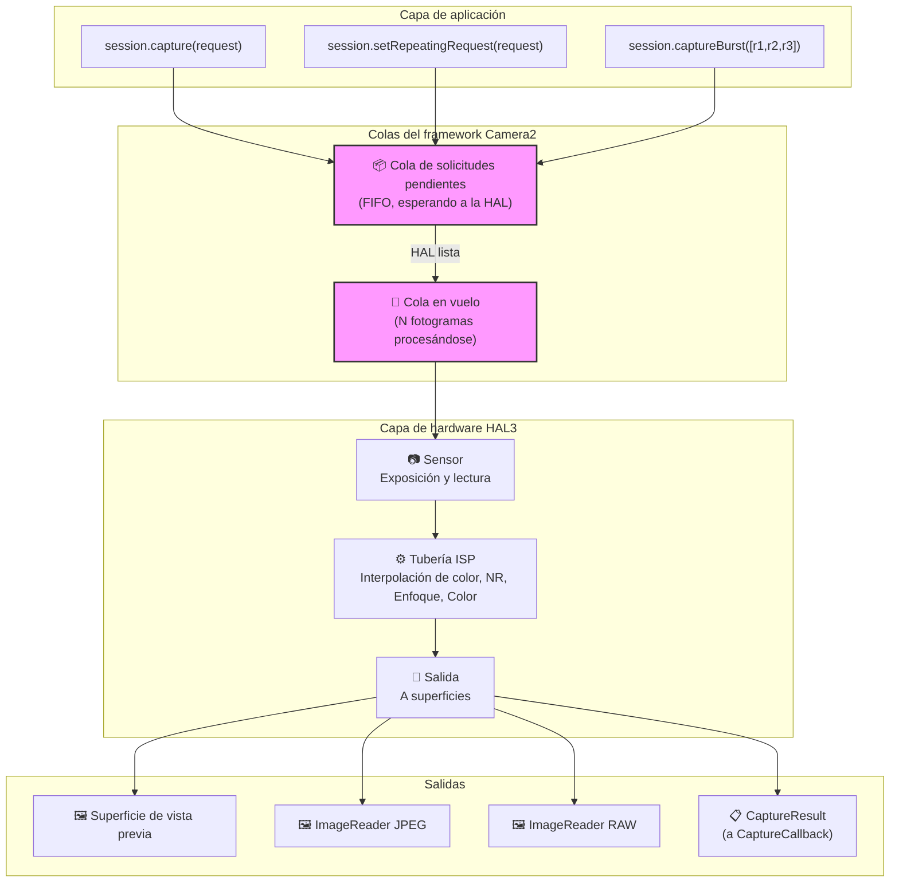
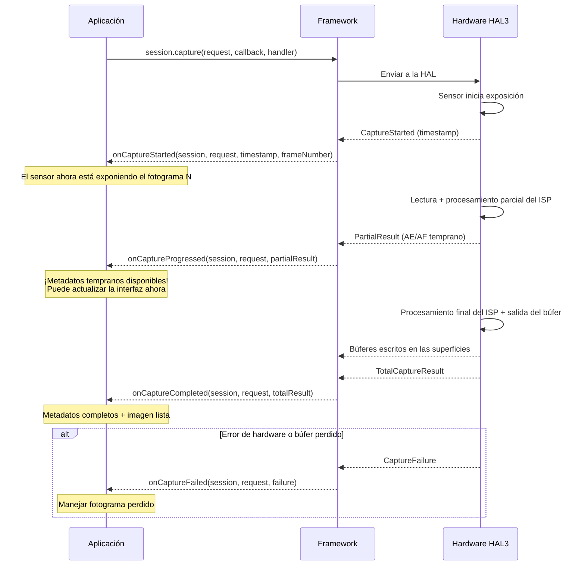
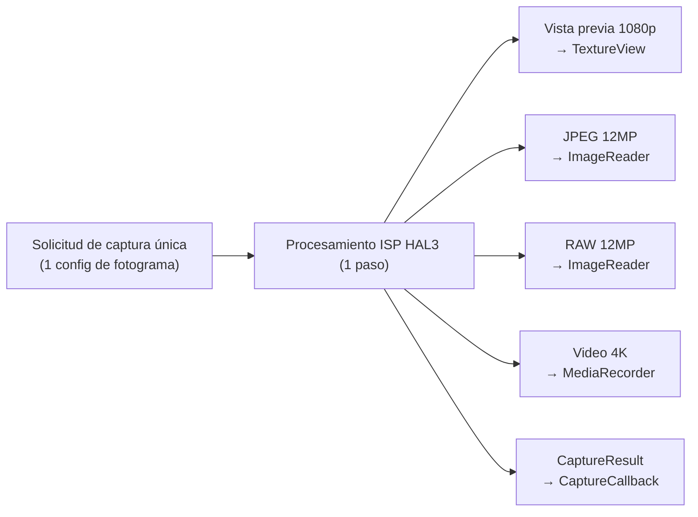

## 10.1 Del uso a la comprensión

En los capítulos anteriores de esta serie, usted *usó* Camera2: mostró vistas previas, capturó fotos y trabajó con archivos RAW. Ahora es el momento de girar la lente y mirar hacia adentro: **¿cómo entrega realmente Camera2 esos fotogramas?**

Entender la tubería no es solo algo académico. Cuando sabe cómo fluyen las solicitudes a través del sistema, puede:
- Diagnosticar la pérdida de fotogramas en la captura de alta velocidad
- Explicar por qué el cambio de ajustes tarda 1 o 2 fotogramas en aparecer
- Optimizar la captura en ráfaga para que no haya fundidos a negro
- Construir modelos mentales correctos para la temporización de las retrollamadas

La aplicación Android Camera Parameters ([GitHub](https://github.com/zoozooll/AndroidCameraParameters), [Play Store](https://play.google.com/store/apps/details?id=com.minininja.cameraparams)) visualiza el comportamiento de la tubería en tiempo real; consulte las pestañas **Frame Timing** y **Raw JSON** para ver los conceptos de este capítulo en vivo en su dispositivo.

## 10.2 Las estructuras de datos principales

Antes de examinar la propia tubería, analicemos en profundidad los dos objetos que viajan a través de ella: `CaptureRequest` (lo que entra) y `CaptureResult` (lo que sale).

### CaptureRequest: El plano inmutable del fotograma

Una `CaptureRequest` es una **configuración completa e inmutable para un solo fotograma**. Describe *todo* lo que el sensor, la lente y el ISP deben hacer para una exposición: tiempo de exposición del sensor, ISO, distancia de enfoque de la lente, modos 3A, destinos de salida, calidad JPEG, región de recorte y más.

Las propiedades clave de `CaptureRequest`:

- **Inmutable después de build()**: Una vez que llama a `.build()`, la solicitud se congela. Para cambiar los ajustes, debe crear un nuevo Builder.
- **Patrón Builder**: Construido a través de `CaptureRequest.Builder`, obtenido de `CameraDevice.createCaptureRequest(template)`.
- **Por fotograma**: Cada fotograma individual tiene su propio objeto de solicitud. Incluso las capturas repetitivas crean (implícitamente) una nueva solicitud por fotograma.
- **Dirigido a superficies**: Cada solicitud enumera explícitamente qué superficies de salida reciben los búferes de imagen procesados.

```kotlin
// Construir una CaptureRequest usando el patrón Builder
val builder = cameraDevice.createCaptureRequest(CameraDevice.TEMPLATE_STILL_CAPTURE)

// Parámetros a nivel de sensor
builder.set(CaptureRequest.SENSOR_EXPOSURE_TIME, 10_000_000L)   // 10ms
builder.set(CaptureRequest.SENSOR_SENSITIVITY, 400)             // ISO 400
builder.set(CaptureRequest.SENSOR_FRAME_DURATION, 33_333_333L)  // ~30fps máx

// Parámetros de la lente
builder.set(CaptureRequest.LENS_FOCUS_DISTANCE, 0.1f)           // 10cm de enfoque
builder.set(CaptureRequest.LENS_APERTURE, 1.8f)                 // f/1.8

// Modos de control 3A
builder.set(CaptureRequest.CONTROL_AF_MODE, CaptureRequest.CONTROL_AF_MODE_OFF)
builder.set(CaptureRequest.CONTROL_AE_MODE, CaptureRequest.CONTROL_AE_MODE_OFF)
builder.set(CaptureRequest.CONTROL_AWB_MODE, CaptureRequest.CONTROL_AWB_MODE_OFF)

// Destinos de salida
builder.addTarget(previewSurface)
builder.addTarget(jpegReader.surface)

// Construir: ¡ahora es inmutable!
val request: CaptureRequest = builder.build()

// request.set(...) fallaría: ¡no hay set() en el objeto construido!
```

:::note
La inmutabilidad es crítica para la corrección de la tubería. Debido a que la HAL lee la solicitud de forma asíncrona, si pudiera modificarla después del envío, crearía condiciones de carrera entre el hilo de la aplicación y el hilo de procesamiento del hardware.
:::

### CaptureResult: El informe de metadatos (¡no la imagen!)

Un `CaptureResult` es la **salida de metadatos** de un fotograma procesado. Crucialmente: **CaptureResult NO contiene datos de píxeles de imagen**. Los píxeles van a los destinos de `Surface` que añadió a la solicitud; el `CaptureResult` va a su `CaptureCallback` llevando la *historia* de lo que ocurrió durante la captura.

Estas son las claves más importantes en un `CaptureResult`:

| Clave de resultado | Tipo | Descripción |
|-----------|------|-------------|
| `SENSOR_EXPOSURE_TIME` | `Long` | Tiempo de exposición real utilizado en nanosegundos (puede diferir de la solicitud) |
| `SENSOR_SENSITIVITY` | `Int` | Ganancia ISO real aplicada |
| `SENSOR_TIMESTAMP` | `Long` | Marca de tiempo en nanosegundos al inicio de la exposición (de `SystemClock.elapsedRealtimeNanos()`) |
| `CONTROL_AE_STATE` | `Int` | Estado de exposición automática: INACTIVE, SEARCHING, CONVERGED, LOCKED, FLASH_REQUIRED |
| `CONTROL_AF_STATE` | `Int` | Estado de enfoque automático: INACTIVE, PASSIVE_SCAN, ACTIVE_SCAN, FOCUSED_LOCKED, NOT_FOCUSED_LOCKED |
| `CONTROL_AWB_STATE` | `Int` | Estado de balance de blancos automático |
| `LENS_FOCUS_DISTANCE` | `Float` | Distancia de enfoque real establecida por la lente |
| `SCALER_CROP_REGION` | `Rect` | Región de recorte real utilizada para el zoom digital |
| `JPEG_GPS_LOCATION` | `Location` | Etiqueta GPS escrita en el JPEG (si se solicitó) |
| `STATISTICS_FACE_DETECT_MODE` | `Int` | Modo de detección de rostros realmente utilizado |

Los campos del resultado son su **fuente de verdad**. La `CaptureRequest` es lo que usted *pidió*; el `CaptureResult` es lo que el hardware *hizo realmente*. En dispositivos LEGACY o LIMITED, la HAL puede recortar, redondear o anular silenciosamente sus valores solicitados; el resultado le permite detectar eso.

```kotlin
val captureCallback = object : CameraCaptureSession.CaptureCallback() {
    override fun onCaptureCompleted(
        session: CameraCaptureSession,
        request: CaptureRequest,
        result: TotalCaptureResult
    ) {
        val timestampNs = result.get(CaptureResult.SENSOR_TIMESTAMP)
        val exposureNs = result.get(CaptureResult.SENSOR_EXPOSURE_TIME)
        val iso = result.get(CaptureResult.SENSOR_SENSITIVITY)
        val aeState = result.get(CaptureResult.CONTROL_AE_STATE)
        val afState = result.get(CaptureResult.CONTROL_AF_STATE)
        val focusDistance = result.get(CaptureResult.LENS_FOCUS_DISTANCE)
        val cropRegion = result.get(CaptureResult.SCALER_CROP_REGION)

        val aeStateStr = when (aeState) {
            CaptureResult.CONTROL_AE_STATE_INACTIVE -> "INACTIVE"
            CaptureResult.CONTROL_AE_STATE_SEARCHING -> "SEARCHING"
            CaptureResult.CONTROL_AE_STATE_CONVERGED -> "CONVERGED"
            CaptureResult.CONTROL_AE_STATE_LOCKED -> "LOCKED"
            CaptureResult.CONTROL_AE_STATE_FLASH_REQUIRED -> "FLASH_REQUIRED"
            else -> "UNKNOWN($aeState)"
        }

        val afStateStr = when (afState) {
            CaptureResult.CONTROL_AF_STATE_INACTIVE -> "INACTIVE"
            CaptureResult.CONTROL_AF_STATE_PASSIVE_SCAN -> "PASSIVE_SCAN"
            CaptureResult.CONTROL_AF_STATE_ACTIVE_SCAN -> "ACTIVE_SCAN"
            CaptureResult.CONTROL_AF_STATE_FOCUSED_LOCKED -> "FOCUSED_LOCKED"
            CaptureResult.CONTROL_AF_STATE_NOT_FOCUSED_LOCKED -> "NOT_FOCUSED_LOCKED"
            else -> "UNKNOWN($afState)"
        }

        Log.d("Pipeline", buildString {
            append("Fotograma @${timestampNs?.let { it / 1_000_000 } ?: "?"}ms | ")
            append("Exposición: ${exposureNs?.let { "%.2fms".format(it / 1_000_000.0) } ?: "?"} | ")
            append("ISO: $iso | ")
            append("Enfoque: ${focusDistance?.let { "%.3f".format(it) } ?: "?"} dioptrías | ")
            append("AE: $aeStateStr | ")
            append("AF: $afStateStr | ")
            append("Recorte: ${cropRegion?.width()}x${cropRegion?.height()}")
        })
    }
}
```

:::tip
En la aplicación Android Camera Parameters, habilite **Live Result Logging** en los ajustes y observe este flujo exacto de metadatos en tiempo real. Verá que AE_SEARCHING pasa a AE_CONVERGED a medida que la exposición se estabiliza, y AF_SCAN pasa a FOCUSED_LOCKED cuando toca para enfocar.
:::

## 10.3 Las colas de solicitudes

Camera2 utiliza un **modelo de tubería de dos colas** a nivel del framework. Entender estas colas explica casi todos los comportamientos de temporización que observa.

### Cola de solicitudes pendientes (FIFO)

Cuando llama a `session.capture()`, `session.captureBurst()` o `session.setRepeatingRequest()`, la solicitud no va a la HAL inmediatamente. En su lugar, aterriza en la **cola de solicitudes pendientes**, una cola FIFO (primero en entrar, primero en salir) gestionada por el framework de Camera2.

Piense en esto como la "sala de espera". Las solicitudes se sientan aquí hasta que la HAL tiene capacidad para aceptar una nueva solicitud para su procesamiento.

Propiedades clave:
- **Orden FIFO**: Las solicitudes se procesan en el orden exacto en que se envían.
- **Atomicidad de ráfaga**: Todos los fotogramas de una `captureBurst()` se ponen en cola de forma contigua y se procesan sin intercalar solicitudes repetitivas.
- **Anulación de prioridad**: Las solicitudes únicas/de ráfaga saltan *delante* de la solicitud repetitiva en la cola (la solicitud repetitiva se vuelve a poner en cola automáticamente después de que se complete la de un solo disparo).
- **Limitada**: La cola tiene una profundidad finita (normalmente 4-8 solicitudes); el desbordamiento provoca errores.

### Cola en vuelo

Cuando la HAL retira una solicitud de la cola de pendientes y comienza la lectura del sensor / procesamiento del ISP, la solicitud pasa a la **cola en vuelo**. Esta cola contiene todas las solicitudes que están siendo procesadas actualmente por el hardware.

La profundidad de la cola en vuelo (`CameraCharacteristics.REQUEST_PIPELINE_MAX_DEPTH`) le indica cuántos fotogramas trabaja el hardware simultáneamente. En los dispositivos FULL típicos, esta profundidad es de 3-4 fotogramas, lo que significa que: mientras se expone el fotograma N, el fotograma N-1 está siendo procesado por el ISP, el fotograma N-2 se está escribiendo en la memoria y el fotograma N-3 se está devolviendo a la aplicación. Así es como Camera2 logra más de 30 fps a pesar de que cada fotograma tarda unos 100 ms de extremo a extremo.



## 10.4 Retrollamadas de resultados: El ciclo de vida de CaptureCallback

Los resultados regresan a través de `CameraCaptureSession.CaptureCallback`. La HAL puede devolver resultados en múltiples etapas, dándole acceso temprano a metadatos parciales antes de que el fotograma completo esté listo.

### Los cuatro métodos de retrollamada

| Método | Cuándo se llama | Contiene | Caso de uso |
|--------|------------|----------|----------|
| `onCaptureStarted` | El sensor *comienza* la exposición de este fotograma | Información mínima: número de fotograma, marca de tiempo | Sincronización exacta de temporización |
| `onCaptureProgressed` | El ISP procesó parcialmente el fotograma | PartialCaptureResult: algunos campos de metadatos listos | Actualizaciones tempranas del estado de AE/AF |
| `onCaptureCompleted` | Fotograma completo finalizado, todos los búferes entregados | TotalCaptureResult: todos los campos | Registro final de metadatos |
| `onCaptureFailed` | El fotograma se perdió / ocurrió un error | CaptureFailure: código de error, razón | Recuperación de errores |

### Resultados parciales vs. totales

Se devuelve un `PartialCaptureResult` cuando el ISP ha calculado *algunos* campos de metadatos pero no ha terminado la tubería completa. Se devuelve un `TotalCaptureResult` cuando todo está hecho.



```kotlin
val fullPipelineCallback = object : CameraCaptureSession.CaptureCallback() {
    override fun onCaptureStarted(
        session: CameraCaptureSession,
        request: CaptureRequest,
        timestamp: Long,
        frameNumber: Long
    ) {
        super.onCaptureStarted(session, request, timestamp, frameNumber)
        Log.d("Pipeline", "Exposición del fotograma #$frameNumber iniciada a ${timestamp / 1_000_000}ms")
    }

    override fun onCaptureProgressed(
        session: CameraCaptureSession,
        request: CaptureRequest,
        partialResult: CaptureResult
    ) {
        super.onCaptureProgressed(session, request, partialResult)
        val aeState = partialResult.get(CaptureResult.CONTROL_AE_STATE)
        val afState = partialResult.get(CaptureResult.CONTROL_AF_STATE)
        Log.v("Pipeline", "Parcial: AE=$aeState AF=$afState")
    }

    override fun onCaptureCompleted(
        session: CameraCaptureSession,
        request: CaptureRequest,
        result: TotalCaptureResult
    ) {
        super.onCaptureCompleted(session, request, result)
        val totalFrames = result.frameNumber
        Log.d("Pipeline", "Fotograma #$totalFrames completado totalmente")
    }

    override fun onCaptureFailed(
        session: CameraCaptureSession,
        request: CaptureRequest,
        failure: CaptureFailure
    ) {
        super.onCaptureFailed(session, request, failure)
        val reason = when (failure.reason) {
            CaptureFailure.REASON_ERROR -> "Error interno"
            CaptureFailure.REASON_FLUSHED -> "Vaciado por abortCaptures()"
            else -> "Desconocido (${failure.reason})"
        }
        Log.e("Pipeline", "Fotograma #${failure.frameNumber} FALLÓ: $reason. Capturado: ${failure.wasImageCaptured()}")
    }
}
```

## 10.5 Aspectos internos de la tubería: Sin estado, secuencial, asíncrona, salida múltiple

El modelo de tubería HAL3 que expone Camera2 tiene cuatro propiedades definitorias. Interiorice estas y la mayoría de los comportamientos "extraños" de Camera2 cobrarán sentido de repente.

### 1. Ausencia de estado

El hardware **no tiene memoria entre solicitudes**. Cada `CaptureRequest` debe ser autónoma: incluye *cada ajuste*, no solo los que cambió respecto al fotograma anterior.

Esto significa:
- Si establece `SENSOR_EXPOSURE_TIME` en el fotograma N pero lo *omite* en el fotograma N+1, este vuelve al valor predeterminado de la plantilla.
- La solicitud repetitiva no es un "conjunto de anulaciones": el framework la regenera y vuelve a enviar en su totalidad en cada fotograma.
- No existe el "establecer y olvidar" a nivel de la HAL.

```kotlin
// 🔴 INCORRECTO: Esperar que los ajustes persistan
session.setRepeatingRequest(requestWithExposure10ms, callback, handler)
// Más tarde: solo cambiar el disparador de AF, olvidar volver a establecer la exposición
val triggerBuilder = cameraDevice.createCaptureRequest(CameraDevice.TEMPLATE_PREVIEW)
triggerBuilder.set(CaptureRequest.CONTROL_AF_TRIGGER, CaptureRequest.CONTROL_AF_TRIGGER_START)
triggerBuilder.addTarget(previewSurface)
session.capture(triggerBuilder.build(), callback, handler)
// 🐛 ¡La exposición vuelve al valor predeterminado de TEMPLATE_PREVIEW para este fotograma único!

// ✅ CORRECTO: Cada solicitud es autónoma
val triggerBuilder = cameraDevice.createCaptureRequest(CameraDevice.TEMPLATE_PREVIEW)
triggerBuilder.set(CaptureRequest.SENSOR_EXPOSURE_TIME, 10_000_000L)
triggerBuilder.set(CaptureRequest.CONTROL_AF_TRIGGER, CaptureRequest.CONTROL_AF_TRIGGER_START)
triggerBuilder.addTarget(previewSurface)
session.capture(triggerBuilder.build(), callback, handler)
```

### 2. Procesamiento secuencial

Dentro de un único flujo de cámara lógica, las solicitudes se procesan **una a una en orden FIFO**. No hay reordenamiento ni evaluación de solicitudes en paralelo. Si el fotograma 50 está detrás del 49 en la cola, el 50 espera a que el 49 termine la exposición, incluso si el 50 fuera más "rápido" de procesar.

Esta es la razón por la que la captura en ráfaga produce fotogramas contiguos y sin huecos: se garantiza que las N solicitudes de la ráfaga se ejecuten consecutivamente.

### 3. Resultados asíncronos

El hilo que envía una solicitud **nunca** es el hilo que recibe el resultado. Los resultados se entregan en el hilo `Handler` que usted proporcionó (o en un hilo de binder si pasó `null`).

Consecuencia práctica: **nunca acceda al estado compartido mutable desde la retrollamada sin sincronización**. Un error común es leer/escribir `latestExposure` tanto desde el clic del botón de captura como desde la retrollamada.

### 4. Múltiples salidas por solicitud

Una solicitud → muchas salidas. Una sola `CaptureRequest` puede dirigirse a 2, 3 o incluso 4+ destinos de `Surface` simultáneamente:

- **SurfaceTexture de vista previa** (para visualización)
- **ImageReader JPEG** (para captura estática)
- **ImageReader RAW** (para DNG)
- **Surface de MediaRecorder** (para codificación de video)
- **Surface de Allocation** (para procesamiento de RenderScript/ML)

La HAL es responsable de enrutar la lectura del sensor único a través de múltiples ramas del ISP para producir cada formato de salida. No se duplica la captura; usted declara los destinos y el hardware los reparte.



## 10.6 De extremo a extremo: Rastreo de un fotograma

Rastreemos una única solicitud de captura JPEG a través de toda la tubería para unir todo:

```mermaid
sequenceDiagram
    participant User as Hilo de usuario
    participant Cam as Framework Camera2
    participant Pend as Cola de pendientes
    participant Inflight as Cola en vuelo
    participant Sensor as HW del sensor
    participant ISP as Tubería ISP
    participant Buffers as Asignador de búferes
    participant CB as Hilo de CaptureCallback

    User->>Cam: captureSession.capture(jpegRequest, callback, bgHandler)
    Cam->>Pend: Encolar jpegRequest (FIFO)
    Note over Pend: Se coloca detrás de cualquier solicitud de ráfaga/repetitiva anterior

    Cam->>Inflight: Pasar a cola en vuelo cuando el slot de la HAL esté libre
    Inflight->>Sensor: Aplicar ajustes de la solicitud (exposición, ISO, enfoque)
    Sensor->>Sensor: Exponer fotograma (10ms)
    Sensor-->>Cam: onCaptureStarted (timestamp N)
    Cam-->>CB: onCaptureStarted(timestamp=N)

    Sensor->>ISP: Leer píxeles crudos (fila por fila)
    ISP->>ISP: Interpolación de color → NR → Enfoque → Corrección de color
    ISP-->>Cam: PartialCaptureResult (estado de AE ahora conocido)
    Cam-->>CB: onCaptureProgressed(partial)
    Note over CB: Puede actualizar la interfaz con AE_CONVERGED ahora

    ISP->>Buffers: Escribir píxeles procesados en el búfer de la superficie JPEG
    Buffers->>Buffers: Comprimir a JPEG
    ISP-->>Cam: TotalCaptureResult + búferes listos
    Cam-->>CB: onCaptureCompleted(totalResult)
    Note over CB: Todos los campos de metadatos disponibles
    Cam-->>User: Se dispara ImageReader.onImageAvailable()
    Note over User: El búfer JPEG ahora se puede consumir mediante acquireLatestImage()
```



## 10.7 Viendo la tubería en acción

La aplicación Android Camera Parameters ([GitHub](https://github.com/zoozooll/AndroidCameraParameters), [Play Store](https://play.google.com/store/apps/details?id=com.minininja.cameraparams)) incluye una vista de depuración **Pipeline Visualizer** que superpone la profundidad actual de la cola de pendientes, la profundidad de la cola en vuelo y las marcas de tiempo por fotograma. Abra la aplicación, habilite el **Modo Desarrollador** en los ajustes, seleccione una cámara y cambie a la pestaña **Pipeline** para ver:

- Cuántas solicitudes están en cola frente a en vuelo
- Latencia por fotograma desde el inicio hasta la finalización
- Recuento de resultados parciales por fotograma (cuántas llamadas a `onCaptureProgressed` se disparan)
- Cualquier fotograma perdido con las razones del fallo

Esta pestaña es la mejor manera de desarrollar la intuición para los conceptos de este capítulo.

## 10.8 Resumen

| Concepto | Conclusión clave |
|---------|-------------|
| **CaptureRequest** | Plano inmutable por fotograma. Construido mediante un Builder. Contiene TODOS los ajustes (no hay persistencia). |
| **CaptureResult** | Solo metadatos (sin píxeles). Fuente de verdad de lo que el hardware *hizo realmente*. Compruebe el estado de AE/AF, exposición, recorte. |
| **Cola de pendientes** | Sala de espera FIFO. Las ráfagas permanecen contiguas. El disparo único salta delante del repetitivo. |
| **Cola en vuelo** | Solicitudes que se procesan actualmente. Profundidad = profundidad máxima de la tubería. 3-4 fotogramas típicos en dispositivos FULL. |
| **CaptureCallback** | Cuatro fases: started → progressed → completed (o failed). Resultados parciales vs totales. |
| **Ausencia de estado** | El hardware no tiene memoria. Cada solicitud debe incluir cada ajuste que le interese. |
| **Secuencial + Asíncrono** | Orden FIFO garantizado. Retrollamada en un hilo diferente al del envío. |
| **Salida múltiple** | Una solicitud → muchas superficies (vista previa + JPEG + RAW + video, todo a la vez). |

## ¿Qué sigue?

En el [Capítulo 11: Tipos de captura](capture-types.md), veremos las tres formas de enviar solicitudes a esta tubería (única, ráfaga y repetitiva) y cuándo usar cada una. También exploraremos las plantillas integradas (`TEMPLATE_PREVIEW`, `TEMPLATE_STILL_CAPTURE`, etc.) que preconfiguran valores predeterminados razonables para casos de uso comunes.
