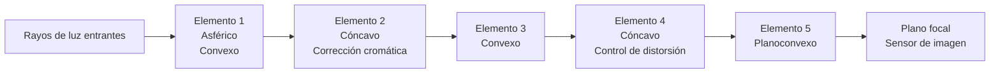
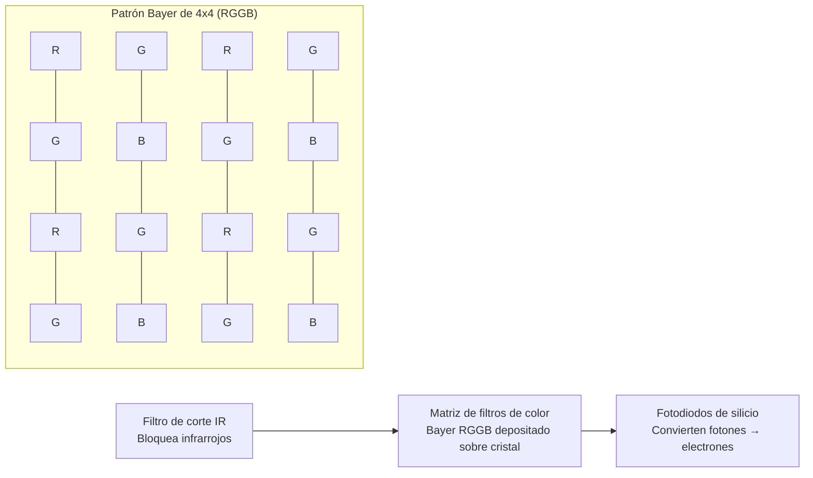
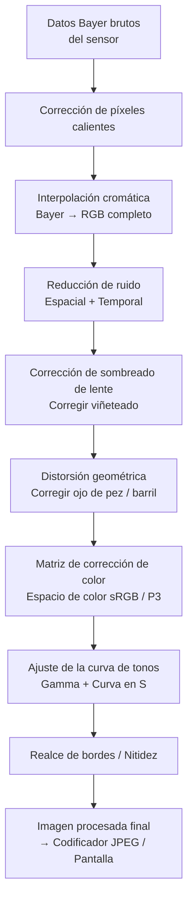
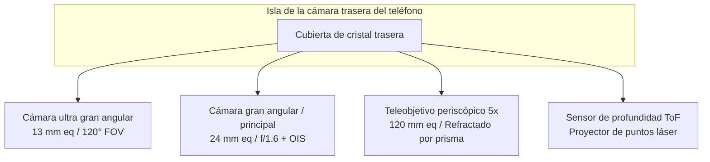
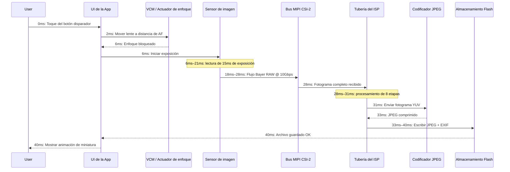

# Capítulo 2: Entendiendo las cámaras de los smartphones

Antes de escribir una sola línea de código de la API Camera2, debe entender el hardware físico que su código comandará. La cámara de un smartphone no es solo "una lente apuntando a un sensor". Es un conjunto sellado, integrado y diseñado con precisión que contiene óptica, actuadores, filtros, semiconductores y buses de datos de alta velocidad. Este capítulo explica cada componente, desde el cristal que atrapa la luz por primera vez hasta el chip de memoria flash donde se almacena la foto final.

El objetivo de este capítulo es construir un modelo mental de la tubería de la cámara como un sistema físico. Cuando en capítulos posteriores se le pida que configure una solicitud de captura con `CONTROL_AE_TARGET_FPS_RANGE` o `SENSOR_SENSITIVITY`, entenderá exactamente a qué pieza de hardware afectan esos parámetros y por qué importan los valores.

## El módulo de la cámara: Un conjunto óptico sellado

Cuando mira la parte trasera de un teléfono insignia moderno —imagine un Pixel 10 o un Galaxy S26 Ultra— ve una isla rectangular elevada que sobresale de 2 a 4 milímetros del cristal trasero. Esa isla no es una única cámara. Una sola isla rectangular alberga tres módulos circulares separados: el más grande en la parte inferior es el gran angular principal, uno más pequeño encima es el teleobjetivo periscópico de 3 aumentos, y el de tamaño mediano a la izquierda es el ultra gran angular de 0,5 aumentos. Cada "bulto" circular dentro de esa isla es un módulo de cámara completo e independiente.

Un módulo de cámara es una unidad sellada herméticamente fabricada en una sala blanca libre de polvo. Contiene, apilados en orden desde el mundo exterior hacia adentro:

1. **Cristal protector de la cubierta**: una ventana de zafiro o Gorilla Glass resistente a los arañazos que sella el módulo y mantiene fuera el polvo.
2. **Barril de la lente**: una pila cilíndrica de 4 a 6 elementos de lente individuales de cristal (o a veces de plástico asférico), mantenidos en alineación precisa por finos espaciadores de plástico.
3. **Motor de bobina de voz (VCM)**: un actuador electromagnético que mueve todo el barril de la lente hacia adelante o hacia atrás a lo largo del eje óptico en fracciones de milímetro para lograr el enfoque automático. Algunos VCM premium también pueden desplazar la lente perpendicularmente al eje para la estabilización óptica de la imagen (OIS).
4. **Filtro de corte de infrarrojos (IR)**: una fina oblea de cristal revestido colocada directamente delante del sensor. Bloquea la luz infrarroja (a la que el sensor de silicio es sensible pero el ojo humano no) para que los colores registrados coincidan con lo que perciben los humanos.
5. **Matriz del sensor**: el propio chip del sensor de imagen CMOS de silicio, unido por hilos a un sustrato. La matriz de píxeles activa mira hacia arriba, hacia la lente.
6. **Circuito impreso flexible (FPC)**: un cable de cinta fino y flexible que transporta la energía, la tierra, las señales de control (I2C) y los datos de imagen de alta velocidad (MIPI CSI-2) desde el módulo hasta la placa base del teléfono.
7. **Conector de placa a placa**: un enchufe diminuto y de alta densidad en el extremo del FPC que encaja en un receptáculo correspondiente en la PCB principal del teléfono.

El conjunto completo —desde el cristal de la cubierta hasta el conector— suele tener entre 5 y 8 milímetros de grosor para una cámara trasera convencional, y entre 10 y 14 milímetros de largo (dentro del teléfono, orientada horizontalmente) para un teleobjetivo periscópico. Los módulos se calibran individualmente en la fábrica: la alineación de la lente, la inclinación del sensor, el sombreado de color y la posición de enfoque al infinito se miden y almacenan en una memoria programable una sola vez (OTP) en el propio módulo. La API Camera2 lee estos datos de calibración al arrancar el dispositivo para que su aplicación no tenga que tener en cuenta la variación de fabricación de una unidad a otra.

## La lente: Distancia focal, apertura y estabilización

La lente es el primer componente con el que se encuentra la luz. Su trabajo consiste en curvar los rayos de luz entrantes para que converjan en una imagen nítida exactamente en el plano del sensor de imagen.

### Distancia focal y equivalencia de fotograma completo

La distancia focal determina el campo de visión (cuánto de la escena cabe en el encuadre) y la magnificación (cuán grandes aparecen los sujetos lejanos). Las especificaciones de las cámaras de los smartphones siempre anuncian **distancias focales equivalentes a fotograma completo (full-frame)**. Se trata de una convención que normaliza entre diferentes tamaños de sensor para que los consumidores puedan comparar peras con peras. Un sensor de fotograma completo es el tamaño de 36 mm × 24 mm utilizado históricamente en las cámaras SLR de película de 35 mm.

Distancias focales equivalentes a fotograma completo comunes en los smartphones:

- **10–18 mm (Ultra gran angular)**: campo de visión diagonal de 100° a 130°. Se utiliza para paisajes, arquitectura, selfies de grupo y tomas macro de cerca.
- **22–28 mm (Gran angular / Principal)**: la cámara "normal" por defecto en todos los teléfonos. Campo de visión de ~75°, similar a la visión periférica humana pero más plano.
- **45–80 mm (Teleobjetivo, de 2 a 3 aumentos)**: campo de visión estrecho de 30° a 50°. Se utiliza para retratos (proporciones faciales de aspecto natural, menos distorsión de perspectiva) y zoom general.
- **100–240 mm (Teleobjetivo periscópico, de 5 a 10 aumentos)**: campo de visión de 10° a 25°. El diseño periscópico curvado por prismas permite distancias focales largas sin que el teléfono tenga 2 centímetros de grosor.

Así es como viaja la luz a través de un conjunto de lente gran angular típico de 5 elementos:

### Apertura

La apertura es el tamaño de la abertura a través de la cual pasa la luz dentro de la lente. Se describe como un **número f** (o paso f): la distancia focal dividida por el diámetro de la apertura. Un **número f más pequeño significa un agujero más ancho, lo que significa que llega más luz** al sensor.

- f/1.4 a f/1.8: apertura muy amplia. Típica de las cámaras principales de los insignias. Excelente con poca luz.
- f/2.0 a f/2.4: apertura moderada. Típica de las cámaras ultra gran angular y teleobjetivo en la mayoría de los teléfonos.
- f/2.8 a f/4.0: apertura estrecha. Se encuentra en las cámaras frontales de menor coste y en algunos módulos periscópicos.

La apertura suele ser fija en las cámaras de los smartphones. Unos pocos insignias de Samsung de la era de 2020 contaban con un **mecanismo de apertura variable** con un doble diafragma que podía conmutar mecánicamente entre f/1.5 y f/2.4. Esto es extremadamente raro hoy en día porque el enfoque basado en VCM y el HDR computacional de múltiples fotogramas han hecho que la apertura variable sea innecesaria para la mayoría de los casos de uso.

### Estabilización óptica de la imagen (OIS)

Cuando sostiene un teléfono, sus manos tiemblan de forma natural en pequeñas cantidades angulares, del orden de 0,1° a 0,5° a 1/30 de segundo. En una exposición lo suficientemente larga, este temblor hace que toda la imagen se desenfoque. La **Estabilización óptica de la imagen (OIS)** soluciona este problema moviendo físicamente el barril de la lente (OIS de desplazamiento de lente) o la propia matriz del sensor (OIS de desplazamiento de sensor) para contrarrestar el movimiento detectado. Un diminuto giroscopio dentro del módulo de la cámara (o compartido desde la IMU principal del teléfono) mide la velocidad angular de 1.000 a 8.000 veces por segundo, y el actuador OIS mueve la óptica en consecuencia. El OIS suele poder compensar entre 3 y 5 pasos de temblor de manos, lo que significa que una exposición que habría requerido 1/60 s para mantenerse nítida ahora puede dispararse a 1/8 s o 1/4 s con la misma nitidez.

## El sensor de imagen: Donde la luz se convierte en electricidad

El sensor de imagen es un chip de silicio que contiene millones de detectores de luz individuales llamados **fotodiodos**, dispuestos en una cuadrícula rectangular precisa. Todos los sensores de los smartphones actuales son de tipo **CMOS (Semiconductor complementario de óxido metálico)**.

### Tamaño de píxel y megapíxeles

Cada fotodiodo individual + circuito de lectura se denomina **píxel**. El tamaño físico de cada píxel (medido en micrómetros, μm) es posiblemente más importante que el recuento total de megapíxeles. Un píxel más grande captura más fotones por unidad de tiempo, lo que significa menos ruido de disparo y mejor rendimiento con poca luz.

Tamaños de píxel comunes en los smartphones de 2026:

- **0,6 μm a 0,8 μm**: píxeles muy pequeños. Se utilizan en sensores de alta resolución de 108 MP a 200 MP. Estos dependen totalmente del agrupamiento de píxeles (pixel binning) para obtener un ruido aceptable.
- **1,0 μm a 1,2 μm**: tamaño medio. Se utiliza en sensores de 48 MP a 64 MP con un agrupamiento predeterminado de 4:1 para una salida de 12 MP–16 MP.
- **2,0 μm a 2,4 μm**: píxeles "insignia" grandes. Se utilizan en sensores dedicados de 12 MP–16 MP (Google Pixel, iPhone Pro) o como la salida agrupada de los sensores de 48 MP en modo de "alta calidad".

El agrupamiento de píxeles (pixel binning) es la técnica de combinar la carga de píxeles adyacentes de 2×2 (o 3×3, o 4×4) en un único "súper píxel" durante la lectura. Un sensor de 48 MP con píxeles individuales de 0,8 μm, cuando se agrupan de 4 en 1, se comporta como un sensor de 12 MP con píxeles efectivos de 1,6 μm, mejorando drásticamente la relación señal-ruido. La API Camera2 expone tanto el modo crudo de resolución completa como el modo agrupado predeterminado como configuraciones de flujo separadas.

El cálculo del recuento de megapíxeles es sencillo: un sensor de 48 MP tiene una matriz activa de aproximadamente 8.000 × 6.000 fotodiodos = 48.000.000 detectores de luz individuales.

### Clasificaciones del tamaño del sensor

El tamaño del sensor sigue una nomenclatura heredada basada en pulgadas que se remonta a los tubos de televisión Vidicon de la década de 1950. El formato es "1/X pulgadas", donde X es el divisor; una X más pequeña significa un sensor más grande:

- 1/3,06" a 1/2,55": sensores pequeños, típicos de las cámaras frontales y de las ultra gran angular económicas (~5 MP a 13 MP).
- 1/1,7" a 1/1,3": sensores móviles grandes, cámaras principales de los insignias (48 MP, 50 MP, 108 MP).
- 1 pulgada (Tipo 1): muy grande para un teléfono. Se encuentra en el Xiaomi 13 Ultra, la serie Sharp Aquos R y el Sony Xperia Pro-I. Aproximadamente 13,2 mm × 8,8 mm de área activa, acercándose al tamaño de algunas cámaras Micro Cuatro Tercios.

Un sensor más grande, a igualdad de recuento de megapíxeles, siempre tiene píxeles individuales más grandes. Por eso los teléfonos con "sensor de una pulgada" producen fotos notablemente mejores con poca luz.

### La matriz de filtros de color Bayer (CFA)

Un fotodiodo de silicio en bruto es ciego al color: solo mide la intensidad total de los fotones, no su longitud de onda. Para registrar el color, los fabricantes depositan un diminuto **filtro de color** encima de cada píxel individual. El patrón casi universal es la **matriz de filtros Bayer RGGB**: 50% de píxeles verdes, 25% rojos y 25% azules, dispuestos en una celda repetitiva de 2×2. El ojo humano es más sensible a la luz verde, por lo que duplicar el muestreo del verde mejora la resolución de luminancia percibida y el rendimiento ante el ruido.

Después de la lectura, los datos del sensor son un mosaico de valores separados de rojo, verde y azul; aún no son una imagen a todo color. El paso que rellena la información de color que falta para cada píxel se denomina **interpolación cromática** (demosaicing o debayering) y es el primer gran paso computacional que se realiza en el ISP.

### Obturador electrónico (Rolling Shutter) frente a obturador global (Global Shutter)

Casi todos los sensores de imagen de los smartphones utilizan un **obturador electrónico (rolling shutter)**. El sensor no expone ni lee todos los píxeles a la vez. En su lugar, expone y lee la matriz de píxeles fila por fila, de arriba abajo, una línea horizontal cada vez. La lectura progresiva de un sensor típico de 48 MP tarda aproximadamente de 15 a 25 milisegundos para una captura de fotograma completo.

El obturador electrónico produce distorsiones características en sujetos que se mueven muy rápido: la hélice de un avión que gira o un ventilador de techo aparecen curvados u ondulados; la parte superior e inferior de un edificio en un barrido vertical se inclinan en direcciones opuestas (el "efecto gelatina" en el video). Los sensores de obturador global (global shutter), por el contrario, exponen cada píxel simultáneamente y los leen todos a la vez una vez terminada la exposición. El obturador global se utiliza en visión artificial, cámaras de acción y algunos sensores de desbloqueo facial por IR frontales especializados, pero el diseño de píxel de obturador global tiene una menor sensibilidad a la luz y un mayor coste, por lo que no se utiliza en las cámaras principales de los smartphones.

## El ISP: Procesador de señal de imagen

El **ISP (Image Signal Processor)** es un bloque de hardware dedicado (bien un chip separado o, más comúnmente hoy en día, una parte integrada del SoC principal junto con la CPU y la GPU) cuyo único trabajo es transformar los datos brutos, en mosaico, ruidosos y distorsionados que emanan del sensor en una imagen en color visualmente agradable.

El ISP ejecuta una tubería fija y cableada de etapas de procesamiento de imagen a un rendimiento extremadamente alto. Un sensor moderno de 48 MP que funciona a 30 fotogramas por segundo envía 1.440 millones de píxeles por segundo al ISP. El ISP debe procesar cada píxel a través de todas las etapas en menos de 33 milisegundos por fotograma para mantener el ritmo.

Las etapas canónicas de la tubería del ISP, en orden, son:

1. **Corrección de píxeles calientes (Hot Pixel Correction)**: los píxeles "atascados" calibrados de fábrica (siempre brillantes o siempre oscuros) se sustituyen por valores interpolados de los vecinos.
2. **Interpolación cromática (Demosaic / Debayer)**: el mosaico Bayer RGGB se convierte en una imagen RGB completa estimando los dos canales de color que faltan en cada ubicación de píxel a partir de los píxeles circundantes mediante algoritmos de interpolación sensibles a los bordes.
3. **Reducción de ruido (Temporal + Espacial)**: se suprime el ruido de disparo aleatorio y el ruido de lectura del sensor. La reducción de ruido (NR) espacial difumina las regiones planas manteniendo los bordes. La NR temporal fusiona información de fotogramas de video anteriores (si están disponibles) para obtener resultados aún más limpios.
4. **Corrección de sombreado de lente (Corrección de viñeteado)**: las esquinas de la imagen son naturalmente más oscuras porque la luz debe pasar por la lente en un ángulo más pronunciado. El ISP aplica una rampa de ganancia digital por píxel, más brillante en las esquinas, para aplanar la iluminación. Los datos de calibración para esta rampa se almacenan en la OTP del módulo.
5. **Corrección de distorsión geométrica**: las lentes ultra gran angular y de ojo de pez producen distorsión de barril (las líneas rectas se curvan hacia afuera). El ISP reasigna las coordenadas de los píxeles utilizando un modelo de lente polinómico almacenado para producir una imagen rectilínea donde las líneas rectas aparecen realmente rectas. Este paso recorta inherentemente entre un 5 y un 10% del anillo exterior de píxeles.
6. **Matriz de corrección de color (CCM)**: la respuesta espectral RGB bruta del sensor no coincide con la respuesta tricromática del ojo humano. Una multiplicación de matriz de 3×3 convierte el RGB nativo del sensor en un espacio de color estándar sRGB o DCI-P3. Los coeficientes de la CCM se ajustan por módulo y por iluminante (luz de día, tungsteno, fluorescente).
7. **Ajuste de la curva de tonos**: se aplica una curva de mapeo de tonos no lineal en forma de S a los datos RGB lineales para comprimir la señal del sensor de alto rango dinámico en la salida de bajo rango dinámico (normalmente sRGB de 8 bits codificada por gamma). Este paso es lo que hace que la imagen "resalte": el contraste aumenta en los medios tonos, las luces se suavizan y las sombras se aclaran.
8. **Realce de bordes / Nitidez**: se aplica una sutil máscara de desenfoque para recuperar el detalle de alta frecuencia suavizado por la reducción de ruido y el filtro óptico de paso bajo. La cantidad de nitidez se controla cuidadosamente para evitar introducir halos.

La calidad del procesamiento del ISP es un factor diferenciador importante entre los fabricantes de teléfonos. Google, Samsung, Apple y Xiaomi ajustan sus tuberías de ISP con diferentes prioridades artísticas: algunos prefieren los colores naturales, otros una salida "impactante" sobresaturada, algunos una reducción de ruido agresiva frente a un detalle retenido. La API Camera2 le ofrece cierto control sobre la fuerza de las etapas individuales del ISP (a través de los controles de mapa de tonos y corrección de color de Android), pero la mayoría de los parámetros detallados de las etapas están bloqueados tras las API propietarias de los fabricantes.

## RAW frente a JPEG: Dos caminos desde el sensor hasta el almacenamiento

La tubería del ISP anterior produce una imagen procesada. Pero la API Camera2 también permite omitir el ISP por completo y leer los datos brutos del sensor directamente. Esta es la distinción crítica entre la salida RAW y la JPEG.

### Formato RAW

Un **archivo RAW** (en Android esto significa un archivo DNG, Negativo Digital) contiene exactamente lo que midió el sensor antes de que se ejecute cualquier procesamiento del ISP. Es un mosaico Bayer de 10, 12 o 14 bits por píxel, todavía en el patrón original RGGB, todavía con viñeteado, todavía con ruido, todavía lineal. El archivo RAW también contiene etiquetas de metadatos que especifican el patrón exacto de la matriz de filtros de color, el perfil de color del sensor, el nivel de negro, el nivel de blanco y el modelo de la lente.

- **Profundidad de bits**: RAW10 = 10 bits por canal = 1.024 niveles. RAW12 = 4.096 niveles. RAW14 = 16.384 niveles. Compare esto con los 8 bits del JPEG = 256 niveles.
- **Tamaño de archivo**: 20–40 MB por foto de 48 MP. Sin comprimir o con compresión casi sin pérdidas.
- **Caso de uso**: edición profesional de postproducción. Los pasos extra de margen permiten a un editor "rescatar" luces sobreexpuestas (de 2 a 3 pasos de EV) o aclarar sombras subexpuestas sin que aparezcan bandas.

### Formato JPEG

Un **archivo JPEG** es la salida totalmente "cocinada" del ISP. Ya se han aplicado a los datos de los píxeles cada una de las 8 etapas del ISP anteriores. A continuación, la imagen se convierte de RGB a un espacio de color YCbCr 4:2:0 con submuestreo de croma y se comprime con un algoritmo de transformada de coseno discreta con pérdidas a una relación de compresión de aproximadamente 10:1 a 20:1.

- **Profundidad de bits**: siempre 8 bits por canal = 256 niveles por color.
- **Tamaño de archivo**: 2–5 MB para una foto de 12 MP–48 MP, dependiendo del nivel de calidad del JPEG.
- **Caso de uso**: compartir al instante, redes sociales, cualquier flujo de trabajo donde la foto esté "terminada" al dispararla. Los ajustes en un editor móvil degradan la imagen rápidamente porque solo quedan 256 niveles.

### Tabla comparativa: RAW frente a JPEG

| Característica | RAW (DNG) | JPEG |
|---------|-----------|------|
| Procesamiento del ISP aplicado | Ninguno: se saltan todas las etapas | Las 8 etapas aplicadas e irreversibles |
| Profundidad de color | 10–14 bits (1.024–16.384 niveles) | 8 bits (256 niveles) |
| Balance de blancos | Etiquetado en los metadatos, totalmente cambiable después | Fijado en los píxeles: solo ediciones menores |
| Latitud de exposición | ±2 a 3 pasos recuperables | ±1/2 paso como máximo antes de que aparezcan bandas |
| Tamaño de archivo (48 MP) | 25–40 MB | 3–6 MB |
| Espacio de color | RGB lineal nativo del sensor | sRGB o Display P3 codificado por gamma |
| Nitidez / Reducción de ruido | Ninguna: a elección del editor | Aplicadas; no se pueden deshacer |
| Flujo de trabajo típico | Adobe Lightroom / Capture One | Compartir directamente en Instagram / Mensajes |

## Teléfonos con múltiples cámaras: ¿Por qué no una lente de zoom gigante?

Una cámara tradicional de apuntar y disparar utiliza una única lente de zoom con grupos internos móviles que cambian continuamente la distancia focal de gran angular a teleobjetivo. ¿Por qué no puede hacer lo mismo un smartphone? Física. Una lente de zoom de 10 aumentos que cubra el equivalente a 24 mm–240 mm en fotograma completo con una apertura constante de f/2.8 requiere una trayectoria óptica de aproximadamente 5 centímetros de longitud. Un smartphone tiene, como mucho, 0,9 centímetros de grosor. Las cuentas simplemente no salen.

La industria de los smartphones solucionó esto no con una lente de zoom, sino con **múltiples cámaras de distancia focal fija**, cada una optimizada para un propósito diferente, y un sistema computacional de "zoom suave" que se desvanece de una cámara a la siguiente en proporciones de zoom específicas.

Una isla de cámara trasera típica de un insignia de 2026 contiene:

1. **Ultra gran angular (zoom 0,5x, ~13 mm eq, ~120° FOV)**: distancia focal corta, gran profundidad de campo. Ideal para paisajes, arquitectura, fotos de grupo y macro de enfoque cercano cuando se reposiciona mediante software.
2. **Gran angular / Principal (zoom 1x, ~24 mm eq, ~75° FOV)**: la predeterminada. El sensor más grande, la apertura más amplia, el mejor OIS. Se usa para el 80% de las fotos cotidianas.
3. **Teleobjetivo / Periscopio (zoom óptico de 3x a 10x, ~72 mm a ~240 mm eq)**: un teleobjetivo convencional (3x) se sitúa directamente sobre su sensor. Un teleobjetivo periscópico (5x, 10x) utiliza un prisma de 45° cerca del borde del teléfono para reflejar la luz 90°, de modo que el barril de la lente se desplaza horizontalmente dentro del cuerpo del teléfono en lugar de verticalmente a través de su grosor.
4. **Sensor ToF / Profundidad**: un proyector de puntos láser de infrarrojo cercano (o, en los iPhones, un escáner LiDAR de luz estructurada) que emite más de 30.000 puntos IR sobre la escena y mide su tiempo de ida y vuelta para producir un mapa de profundidad por píxel. Se utiliza para obtener un bokeh de retrato preciso, oclusión de realidad aumentada y un enfoque automático rápido con poca luz.

Cuando realiza un gesto de pinza para hacer zoom en la aplicación de la cámara, la HAL (Capa de Abstracción de Hardware) cambia suavemente la cámara física activa en umbrales predeterminados. Por ejemplo, el zoom de 0,5x a 1,0x pasa del ultra gran angular al gran angular. En 2,9x la aplicación sigue recortando digitalmente la cámara gran angular. En 3,0x, la HAL cambia la fuente activa a la cámara teleobjetivo periscópica. Entre esas relaciones de zoom, un sofisticado algoritmo de fusión de imágenes utiliza ambas cámaras simultáneamente para mantener una transición perfecta.

## El viaje completo: Del fotón a la foto guardada, milisegundo a milisegundo

Aquí está la cronología numerada completa de lo que sucede físicamente dentro de un smartphone durante la captura de una sola foto fija, empezando desde el momento en que el dedo del usuario se levanta del botón disparador virtual. Los números son representativos de un insignia de 2026 capturando un JPEG en modo predeterminado de 12 MP a la luz del día:

- **0 ms**: el usuario toca el obturador. El framework de la API Camera2 recibe la `CaptureRequest` con `TEMPLATE_STILL_CAPTURE`.
- **0–2 ms**: el algoritmo 3A (Enfoque Automático, Exposición Automática, Balance de Blancos Automático) converge a sus valores finales.
- **2–6 ms**: el motor de bobina de voz (VCM) energiza su bobina, moviendo físicamente el barril de la lente 0,2 mm a la distancia de enfoque exacta que calculó el algoritmo de AF.
- **6–21 ms (exposición de 15 ms)**: el reinicio global libera la carga de los píxeles del sensor. Durante 15 milisegundos, los fotodiodos acumulan electrones generados por los fotones. El obturador electrónico lee fila por fila durante y después de esta ventana.
- **18–28 ms**: el sensor emite los datos Bayer brutos a través del bus serie de alta velocidad MIPI CSI-2. Una configuración típica es de 4 carriles de datos a 2,5 Gbps por carril = 10 Gbps de ancho de banda total, que maneja cómodamente la profundidad de bits bruta de un fotograma de 12 MP más los intervalos de supresión.
- **28–31 ms**: la tubería de 8 etapas del ISP procesa el fotograma mediante la corrección de píxeles calientes, la interpolación cromática, la reducción de ruido, el sombreado de lente, la corrección geométrica, la matriz de color, la curva de tonos y la nitidez. Esto sucede íntegramente en el hardware, sin intervención de la CPU a nivel de píxel.
- **31–33 ms**: la imagen YUV procesada se envía al codificador JPEG por hardware, que aplica la compresión DCT con pérdidas a un nivel de calidad de 90–95 y escribe las cabeceras de archivo JFIF (EXIF, miniatura, coordenadas GPS si están etiquetadas).
- **33–40 ms**: el blob JPEG completado se escribe a través del proveedor de contenido MediaStore en el directorio de archivos de la aplicación, por ejemplo `/data/data/com.su_nombre_de_paquete/files/DCIM/Camera/IMG_20260806_151042.jpg`. Se notifica al MediaScanner y la foto aparece en la galería del sistema.

Todo el proceso tarda aproximadamente 40 milisegundos de principio a fin para una foto fija a plena luz del día. Con poca luz, el tiempo de exposición se alarga (potencialmente hasta varios segundos para la captura multifotograma en modo nocturno) y la cronología escala proporcionalmente.

## Resumen

Ahora tiene una imagen física completa del sistema de cámara de un smartphone. Sabe que cada bulto de la cámara trasera es un módulo sellado que contiene un barril de lente con múltiples elementos, un actuador de enfoque automático VCM, un filtro de corte de IR, un sensor CMOS con una matriz de filtros de color Bayer RGGB y un cable flexible que transporta datos MIPI CSI-2. Entiende la equivalencia de la distancia focal, la apertura y el OIS. Sabe cómo la tubería de 8 etapas del ISP transforma un mosaico Bayer bruto en un JPEG terminado, y puede distinguir el RAW (nativo del sensor, 10–14 bits, margen de postprocesamiento) del JPEG (procesado por el ISP, 8 bits, listo para compartir). Entiende por qué los teléfonos modernos utilizan más de 3 cámaras fijas en lugar de una lente de zoom, y ha recorrido la cronología exacta, milisegundo a milisegundo, de la captura de una sola foto.

## ¿Qué sigue?

En el Capítulo 3, pasamos del hardware físico a lo que ese hardware es capaz de producir. Exploraremos las funciones del mundo real de la fotografía moderna con smartphones: bracketing multifotograma HDR, bokeh de retrato mediante estéreo / ToF / ML, exposiciones largas multifotograma en modo noche, captura de video de alta velocidad en cámara lenta, corrección de distorsión de ultra gran angular y teleobjetivo periscópico. Aprenderá cómo la fotografía computacional —la fusión de óptica, sensores, procesamiento de señales multifotograma y aprendizaje automático en el dispositivo— crea imágenes que ninguna combinación de lente y sensor por sí sola podría producir jamás.
