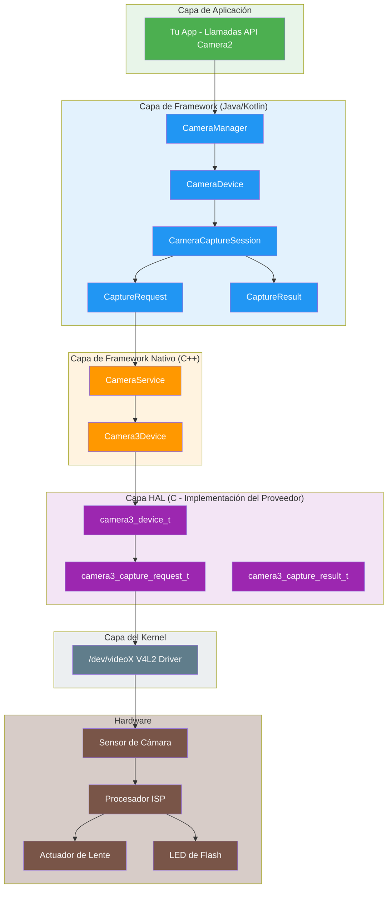
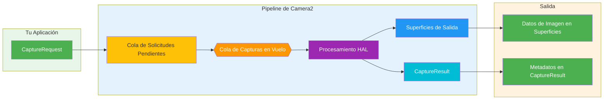
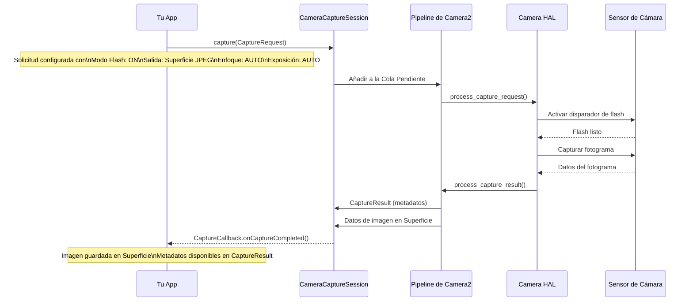
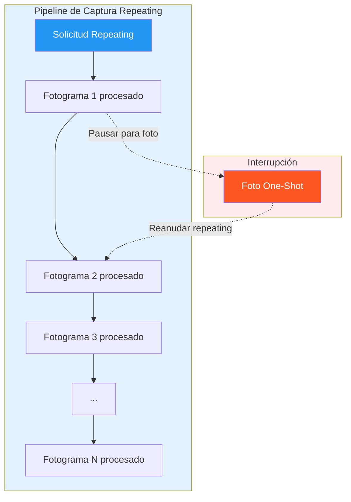
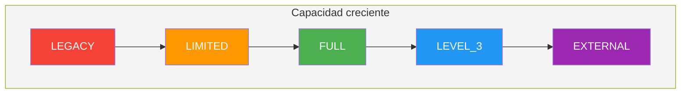
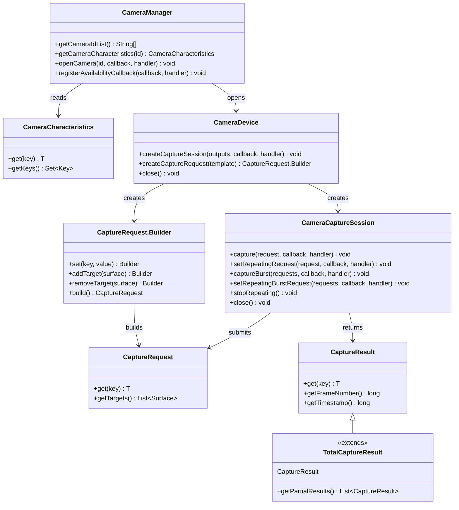
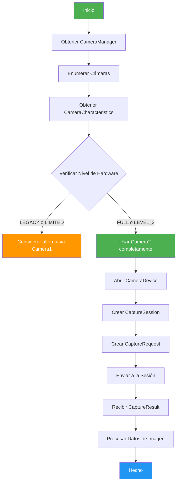
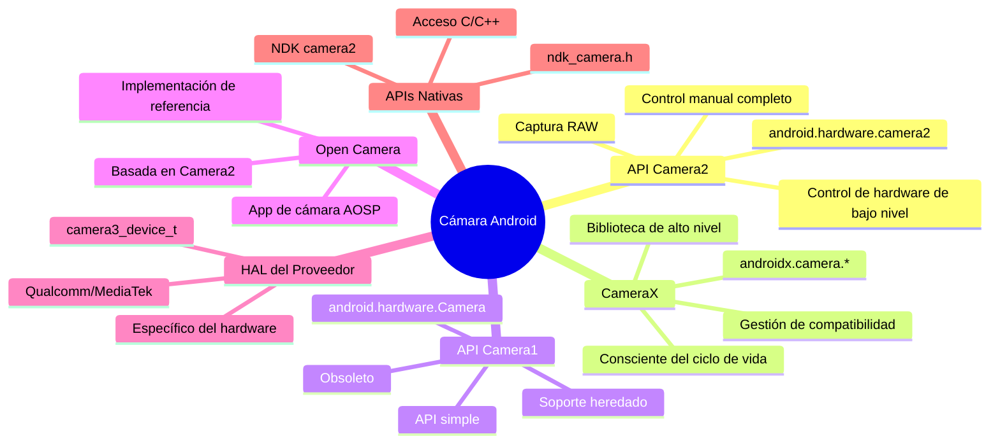

# Capítulo 1: Bienvenido a Android Camera2

> **Descripción del capítulo:** En este capítulo, exploraremos el mundo de Android Camera2 desde cero. Entenderás no solo *qué* es Camera2, sino *por qué* fue creado, *cómo* funciona y *dónde* se ubica en el ecosistema de cámara de Android. Cubriremos el modelo de Pipeline, los tipos de Captura, la clasificación de Niveles de Hardware y la arquitectura completa desde la App hasta el HAL.

---

## 1.1 ¿Por qué aprender Camera2?

Casi todos los teléfonos inteligentes actuales tienen un sistema de cámara potente. Un teléfono moderno puede:

- Capturar fotos de aspecto profesional con fotografía computacional
- Grabar videos 4K y 8K a altas velocidades de fotogramas
- Crear efectos de retrato con detección de profundidad
- Disparar en condiciones de muy poca luz con modo nocturno
- Capturar videos a cámara lenta a 960 fps
- Generar información de profundidad 3D para aplicaciones de AR
- Combinar múltiples cámaras sin problemas

Pero cuando abres la aplicación de cámara predeterminada, solo ves una interfaz simple: un botón de obturador, un control de zoom y algunos modos de disparo.

Detrás de esta interfaz simple hay un sistema sorprendentemente complejo. La aplicación de cámara se comunica con componentes de hardware, procesadores de imagen y frameworks de Android para producir cada fotograma.

### ¿Quién debe aprender Camera2?

Como desarrolladores de Android, es posible que queramos crear aplicaciones que vayan más allá de la aplicación de cámara predeterminada:

- Una **aplicación de fotografía manual** con control total sobre la exposición, ISO y enfoque
- Una **herramienta de prueba de cámara** para que los técnicos verifiquen las capacidades del dispositivo
- Una **aplicación de visión por computadora** que necesite acceso a fotogramas sin procesar
- Una **aplicación de escaneo 3D** que use sensores de profundidad
- Una **grabadora de video profesional** con selección de códec y control de tasa de bits
- Un **analizador de capacidades de cámara** como nuestro propio [Android Camera Parameters](/)

Si alguno de estos escenarios te suena familiar, Camera2 es la API que necesitas dominar.

---

## 1.2 ¿Qué es Android Camera2?

**Android Camera2** es el framework de cámara moderno introducido por Google en **Android 5.0 (nivel de API 21)**. Reemplazó a la API `android.hardware.Camera` original (ahora llamada retroactivamente **Camera1**).

### El problema que resolvió Camera2

La antigua API de Cámara (Camera1) fue diseñada para un mundo más simple: una cámara, captura de fotos básica y grabación de video simple. Pero las cámaras de los teléfonos inteligentes evolucionaron dramáticamente:

| Era | Dispositivo típico | API de cámara |
|-----|-------------------|---------------|
| 2010-2014 | Cámara única, sensor básico | Camera1 |
| 2015-2018 | Cámaras dobles, OIS, HDR | Camera2 (uso limitado) |
| 2019-2022 | Cámaras triples, profundidad, telefoto | Camera2 (estándar) |
| 2023+ | Cámaras cuádruples, periscopio, LiDAR, UWB | Camera2 (esencial) |

Los dispositivos modernos pueden contener múltiples cámaras traseras (gran angular, ultra gran angular, telefoto, periscopio), sensores de profundidad e incluso cámaras USB externas. Admiten funciones avanzadas como:

- Exposición y enfoque manuales
- Captura de imágenes RAW
- Grabación de video de alta velocidad
- Procesamiento HDR
- Estabilización óptica (OIS)
- Fusión de múltiples cámaras

Camera2 fue creado para dar a los desarrolladores un **control profundo, preciso y granular** sobre el hardware de la cámara.

---

## 1.3 Camera2 vs Camera1 vs CameraX

Antes de sumergirnos profundamente en Camera2, aclaremos la relación entre las tres principales APIs de cámara.

### Camera1 (`android.hardware.Camera`)

- **Introducido:** Android 1.0 (obsoleto en Android 5.0)
- **Modelo:** Procedural, con estado, orientado a una sola cámara
- **Fortalezas:** Simple, bien comprendido, ampliamente compatible
- **Debilidades:** Control limitado, sin soporte RAW, sin múltiples cámaras, sin modo ráfaga

### Camera2 (`android.hardware.camera2`)

- **Introducido:** Android 5.0 (API 21)
- **Modelo:** Orientado a objetos, sin estado, pipeline de solicitud/respuesta
- **Fortalezas:** Control profundo del hardware, soporte RAW, múltiples cámaras, video de alta velocidad
- **Debilidades:** Complejo, verboso, requiere comprensión del funcionamiento interno de la cámara

### CameraX (`androidx.camera.*`)

- **Introducido:** Android 10 (preventa), estable en Android 11+
- **Modelo:** Declarativo, consciente del ciclo de vida, orientado a casos de uso
- **Fortalezas:** Fácil de usar, compatibilidad automática, gestión del ciclo de vida
- **Debilidades:** Control avanzado limitado, puede no exponer todas las funciones de hardware

### Tabla de comparación

| Dimensión | Camera1 | Camera2 | CameraX |
|-----------|---------|---------|---------|
| **Nivel** | Bajo nivel (obsoleto) | Bajo nivel (actual) | Alto nivel (Jetpack) |
| **Dificultad** | Fácil | Difícil | Fácil |
| **Control** | Mínimo | Máximo | Moderado |
| **Soporte RAW** | No | Sí | Limitado |
| **Multi-cámara** | No | Sí | Limitado |
| **Modo ráfaga** | No | Sí | No |
| **Controles manuales** | Limitados | Completos | Limitados |
| **Mejor para** | Aplicaciones heredadas | Aplicaciones de cámara avanzadas | La mayoría de aplicaciones de cámara |
| **Estado** | Obsoleto | Activo | Recomendado |

### Por qué esta serie se centra en Camera2

Aunque CameraX se recomienda para la mayoría de las aplicaciones, comprender Camera2 es esencial porque:

1. **CameraX está construido sobre Camera2** — CameraX usa Camera2 por debajo. Comprender Camera2 ayuda a entender qué está haciendo CameraX.
2. **Algunas funciones solo están disponibles en Camera2** — La captura RAW, el control manual del sensor y los escenarios avanzados de múltiples cámaras requieren Camera2.
3. **La depuración requiere conocimiento de Camera2** — Cuando una aplicación CameraX no funciona como se espera, a menudo necesitas comprender el comportamiento subyacente de Camera2 para diagnosticar problemas.
4. **Comprender Camera2 es fundamental** — Incluso si usas CameraX para tu aplicación, comprender Camera2 te convierte en un mejor desarrollador de cámaras Android.

---

## 1.4 Arquitectura de Camera2: La visión general

Camera2 se sitúa en medio de la pila de cámara de Android, conectando el código de la aplicación con los controladores de hardware. Comprender esta arquitectura es crucial para la depuración y la optimización.

### Arquitectura en capas



### Explicación de las capas de arquitectura

| Capa | Ubicación | Lenguaje | Responsabilidad |
|------|-----------|----------|-----------------|
| **Aplicación** | Tu código de app | Kotlin/Java | Crear CaptureRequests, manejar CaptureResults |
| **Framework (Java)** | `android.hardware.camera2.*` | Java | API pública, gestiona sesiones, convierte datos |
| **Framework Nativo** | `frameworks/av/` | C++ | IPC Binder, CameraService, Camera3Device |
| **HAL** | `hardware/libhardware/` + proveedor | C | Abstracción de hardware, implementación específica del proveedor |
| **Kernel** | `/dev/videoX` | C | Controlador V4L2, comunicación con hardware |
| **Hardware** | Módulo de cámara física | — | Sensor, ISP, lente, flash |

### Principio de diseño clave: Camera2 es un Pipeline

El concepto más importante que debes comprender sobre Camera2 es que modela las operaciones de cámara como un **pipeline**. Cada acción —vista previa, captura de fotos, grabación de video— se expresa como una **Solicitud de Captura** que fluye a través del pipeline y produce un **Resultado de Captura**.

---

## 1.5 El modelo de Pipeline de Camera2

El Pipeline es el corazón del diseño de Camera2. Reemplaza el modelo con estado y de una-a-una vez de Camera1 con un modelo sin estado de solicitud/respuesta.

### Cómo funciona el Pipeline



### Componentes del Pipeline explicados

| Componente | Descripción |
|------------|-------------|
| **CaptureRequest** | Un objeto de configuración que describe *un fotograma* de captura. Contiene todos los parámetros: tiempo de exposición, modo de enfoque, flash, superficies de salida, etc. |
| **Cola de Solicitudes Pendientes** | Una cola FIFO donde las nuevas CaptureRequests esperan a ser procesadas |
| **Cola de Capturas en Vuelo** | Solicitudes que están siendo procesadas actualmente por el HAL. Generalmente limitada a 1-4 solicitudes según el dispositivo |
| **Procesamiento HAL** | La capa de abstracción de hardware procesa la solicitud: controla el sensor, ISP, lente, etc. |
| **Superficies de Salida** | Las imágenes se escriben en las Superficies configuradas (Superficie de vista previa, Superficie de ImageReader, etc.) |
| **CaptureResult** | Metadatos sobre la captura: tiempo de exposición real, estado de AF, marca de tiempo, etc. NO contiene datos de imagen |

### Propiedades clave del Pipeline

1. **Las solicitudes son sin estado** — Cada CaptureRequest contiene toda la información necesaria. El pipeline no tiene memoria de solicitudes anteriores.
2. **El procesamiento es secuencial** — Las solicitudes se procesan en orden FIFO por el HAL.
3. **Los resultados son asíncronos** — Los CaptureResults llegan mediante devoluciones de llamada, no se devuelven de forma síncrona.
4. **Múltiples salidas por solicitud** — Una CaptureRequest puede escribir en múltiples Superficies (por ejemplo, vista previa + foto simultáneamente).
5. **El pipeline puede ser configurado** — Puedes elegir plantillas (vista previa, captura fija, grabación) o modo totalmente manual.

### Ejemplo concreto: Tomar una foto con flash

Para comprender el Pipeline, sigamos lo que sucede cuando tomas una foto con flash:



---

## 1.6 Tipos de Captura: One-Shot, Burst y Repeating

Camera2 define tres tipos fundamentales de Captura, cada uno sirviendo a diferentes casos de uso. Comprenderlos es crucial para diseñar aplicaciones de cámara correctamente.

### Tipo 1: Captura One-Shot

Las capturas de **One-Shot** se ejecutan exactamente una vez. Son ideales para acciones únicas como tomar una foto o aplicar un cambio de configuración por una sola vez.


**Casos de uso:**
- Tomar una sola foto
- Aplicar un flash temporal
- Capturar un fotograma para análisis
- Disparar el autoenfoque una vez

**Llamada a API:**
```kotlin
cameraCaptureSession.capture(captureRequest, callback, handler)
```

### Tipo 2: Captura Burst

Las capturas **Burst** se ejecutan múltiples veces consecutivas sin interrupción. Una vez iniciadas, no se pueden insertar otras solicitudes hasta que la ráfaga se complete.


**Características clave:**
- Todos los fotogramas en una ráfaga tienen configuraciones idénticas o ligeramente diferentes
- No se pueden procesar otras solicitudes durante una ráfaga
- La cola de ráfaga está separada de la cola de solicitudes pendientes
- Mayor prioridad que las solicitudes repetidas

**Casos de uso:**
- Captura continua de fotos (modo ráfaga)
- Bracketing (capturar la misma escena con diferentes exposiciones)
- Análisis de movimiento (capturar sujetos de movimiento rápido)
- Captura secuencial de múltiples fotogramas para composición

**Llamada a API:**
```kotlin
cameraCaptureSession.captureBurst(burstRequests, callback, handler)
```

### Tipo 3: Captura Repeating

Las capturas **Repeating** se ejecutan continuamente, formando la base de la vista previa en vivo y la grabación de video. Cuando una solicitud repetida está activa, ocupa el pipeline entre otras capturas.



**Características clave:**
- Solo una solicitud repetida puede estar activa a la vez (reemplaza la anterior)
- Es interrumpida por solicitudes one-shot y burst, y luego se reanuda automáticamente
- Forma la base de la vista previa y la grabación de video
- No produce CaptureResults individuales para cada fotograma (usa resultados parciales para eficiencia)

**Casos de uso:**
- Vista previa de cámara en vivo
- Grabación de video
- Monitoreo continuo del enfoque
- Análisis de fotogramas en tiempo real

**Llamada a API:**
```kotlin
cameraCaptureSession.setRepeatingRequest(captureRequest, callback, handler)
// o para video:
cameraCaptureSession.setRepeatingBurstRequest(burstRequests, callback, handler)
```

### Comparación de tipos de captura

| Función | One-Shot | Burst | Repeating |
|---------|----------|-------|-----------|
| **Ejecución** | Una vez | Múltiple (contiguo) | Continua |
| **Prioridad** | Alta | Más alta | Más baja |
| **Interrupción** | No se puede interrumpir | No se puede interrumpir | Se puede interrumpir |
| **Cola** | Cola pendiente | Cola de ráfaga separada | Ocupación del pipeline |
| **Uso típico** | Foto, fotograma único | Modo ráfaga, bracketing | Vista previa, video |
| **Devolución de llamada de resultado** | Un resultado por llamada | Un resultado por fotograma | Resultados periódicos |

### El sistema de plantillas de captura

Camera2 proporciona plantillas predefinidas para escenarios de captura comunes:

| Plantilla | Descripción | Caso de uso |
|-----------|-------------|-------------|
| `TEMPLATE_PREVIEW` | Optimizada para vista previa en vivo | Vista previa de cámara |
| `TEMPLATE_STILL_CAPTURE` | Optimizada para captura de fotos | Tomar fotos |
| `TEMPLATE_RECORD` | Optimizada para grabación de video | Captura de video |
| `TEMPLATE_VIDEO_SNAPSHOT` | Foto durante la grabación de video | Instantánea mientras se graba |
| `TEMPLATE_ZERO_SHUTTER_LAG` | Alta calidad, retardo mínimo | Fotografía en ráfaga |
| `TEMPLATE_MANUAL` | Todos los controles automáticos deshabilitados | Control manual completo |

Las plantillas son accesos directos que preconfiguran parámetros comunes. Luego puedes modificar configuraciones individuales desde la plantilla.

---

## 1.7 Niveles de Hardware Compatibles

No todos los dispositivos Android admiten el conjunto completo de funciones de Camera2. Para abordar esto, Google definió **Niveles de Hardware Compatibles** — un sistema de clasificación que indica a los desarrolladores qué esperar de la implementación de cámara de un dispositivo.

### Clasificación de Niveles de Hardware



### Descripciones de niveles

| Nivel | Descripción | Soporte de Camera2 |
|-------|-------------|-------------------|
| **LEGACY** | Compatible con versiones anteriores de Camera1. Las llamadas de Camera2 se convierten a Camera1 internamente. | Solo funciones básicas de Camera1 |
| **LIMITED** | Algunas funciones de Camera2 admitidas. No se garantiza el pipeline completo de Camera2. | Funciones parciales de Camera2 |
| **FULL** | Conjunto completo de funciones de Camera2. Pipeline completo, controles manuales, múltiples cámaras. | Todas las funciones de Camera2 |
| **LEVEL_3** | Todo lo de FULL, más reprocesamiento YUV y flujos de salida adicionales. | FULL + funciones avanzadas |
| **EXTERNAL** | Similar a LIMITED pero para cámaras externas (USB, etc.). | Soporte de cámara externa |

### Cómo verificar el nivel de hardware

Puedes consultar el nivel de hardware usando `CameraCharacteristics`:

```kotlin
val cameraManager = getSystemService(Context.CAMERA_SERVICE) as CameraManager
val cameraId = cameraManager.cameraIdList[0]
val characteristics = cameraManager.getCameraCharacteristics(cameraId)

val hardwareLevel = characteristics.get(CameraCharacteristics.INFO_SUPPORTED_HARDWARE_LEVEL)
val levelName = when (hardwareLevel) {
    CameraCharacteristics.INFO_SUPPORTED_HARDWARE_LEVEL_LEGACY -> "LEGACY"
    CameraCharacteristics.INFO_SUPPORTED_HARDWARE_LEVEL_LIMITED -> "LIMITED"
    CameraCharacteristics.INFO_SUPPORTED_HARDWARE_LEVEL_FULL -> "FULL"
    CameraCharacteristics.INFO_SUPPORTED_HARDWARE_LEVEL_3 -> "LEVEL_3"
    CameraCharacteristics.INFO_SUPPORTED_HARDWARE_LEVEL_EXTERNAL -> "EXTERNAL"
    else -> "UNKNOWN"
}
Log.d("Camera", "Hardware Level: $levelName")
```

### Implicaciones prácticas

| Nivel | Lo que significa para tu aplicación |
|-------|-------------------------------------|
| **LEGACY** | Camera2 puede funcionar pero con limitaciones. Considera Camera1 como alternativa. |
| **LIMITED** | Las funciones básicas de Camera2 funcionan. Algunas funciones avanzadas pueden faltar. |
| **FULL** | Soporte completo de Camera2. Seguro usar todas las funciones de Camera2. |
| **LEVEL_3** | Puedes usar reprocesamiento YUV y funciones avanzadas de múltiples flujos. |
| **EXTERNAL** | Puedes admitir cámaras USB y otras entradas externas. |

### Consulta de capacidades en tiempo de ejecución

Más allá del nivel de hardware, siempre verifica capacidades específicas en tiempo de ejecución:

```kotlin
val capabilities = characteristics.get(CameraCharacteristics.REQUEST_AVAILABLE_CAPABILITIES)
capabilities?.forEach { capability ->
    when (capability) {
        CameraMetadata.REQUEST_AVAILABLE_CAPABILITIES_BACKWARD_COMPATIBLE ->
            Log.d("Camera", "Supports backward compatible mode")
        CameraMetadata.REQUEST_AVAILABLE_CAPABILITIES_MANUAL_SENSOR ->
            Log.d("Camera", "Supports manual sensor control")
        CameraMetadata.REQUEST_AVAILABLE_CAPABILITIES_MANUAL_POST_PROCESSING ->
            Log.d("Camera", "Supports manual post-processing")
        CameraMetadata.REQUEST_AVAILABLE_CAPABILITIES_RAW ->
            Log.d("Camera", "Supports RAW capture")
        CameraMetadata.REQUEST_AVAILABLE_CAPABILITIES_PRIVATE_REPROCESSING ->
            Log.d("Camera", "Supports private reprocessing")
        CameraMetadata.REQUEST_AVAILABLE_CAPABILITIES_DEEP_OUTPUT ->
            Log.d("Camera", "Supports deep output")
    }
}
```

---

## 1.8 Visión general de las clases principales de Camera2

La API de Camera2 está construida alrededor de un pequeño conjunto de clases principales. Conozcámoslas antes de profundizar en cada una.

### Diagrama de relaciones de clases principales



### Responsabilidades de las clases

| Clase | Paquete | Responsabilidad |
|-------|---------|-----------------|
| `CameraManager` | `android.hardware.camera2` | Servicio del sistema de nivel superior. Enumera cámaras, proporciona acceso a CameraDevice. |
| `CameraCharacteristics` | `android.hardware.camera2` | Metadatos de capacidades de cámara de solo lectura. |
| `CameraDevice` | `android.hardware.camera2` | Representa una cámara conectada. Crea sesiones y generadores de solicitudes de captura. |
| `CameraCaptureSession` | `android.hardware.camera2` | La instancia del pipeline. Envía CaptureRequests, gestiona capturas repetidas. |
| `CaptureRequest` | `android.hardware.camera2` | Configuración de captura inmutable. Todos los parámetros para un fotograma. |
| `CaptureRequest.Builder` | `android.hardware.camera2` | Generador para crear objetos CaptureRequest. |
| `CaptureResult` | `android.hardware.camera2` | Salida de metadatos de una captura completada. |
| `TotalCaptureResult` | `android.hardware.camera2` | Resultado de captura completo que incluye todos los resultados parciales. |

### El flujo de trabajo de Camera2



---

## 1.9 Camera2 vs Camera1: Comparación detallada

Si has trabajado con Camera1 antes, apreciarás las diferencias. Si no, esta sección te ayudará a comprender por qué Camera2 es un rediseño fundamental.

### Comparación de arquitectura

| Aspecto | Camera1 | Camera2 |
|---------|---------|---------|
| **Modelo de programación** | Procedural (imperativo) | Orientado a objetos (declarativo) |
| **Gestión de estado** | Con estado (la cámara mantiene el estado) | Sin estado (cada solicitud es independiente) |
| **Modelo de captura** | Comandos (takePicture(), startPreview()) | Pipeline (CaptureRequest → CaptureResult) |
| **Subprocesamiento** | Mayormente de un solo subproceso | Diseñado para uso multiproceso |
| **Gestión de errores** | Excepciones, difíciles de recuperar | Códigos de error + excepciones, más granular |
| **Metadatos** | Solo lectura después de la captura | Disponible en tiempo real durante la captura |
| **Salidas múltiples** | No compatible | Una solicitud → múltiples superficies |
| **Zero-Copy** | No compatible | Compatible vía ImageReader |

### Comparación de APIs lado a lado

#### Abrir una cámara

```kotlin
// Camera1 (API antigua)
val camera = Camera.open()
camera.setPreviewDisplay(surfaceHolder)
camera.startPreview()

// Camera2 (API nueva)
val cameraManager = getSystemService(Context.CAMERA_SERVICE) as CameraManager
cameraManager.openCamera(cameraId, object : CameraDevice.StateCallback() {
    override fun onOpened(camera: CameraDevice) {
        mCameraDevice = camera
        // Crear sesión y solicitudes...
    }
    override fun onDisconnected(camera: CameraDevice) { camera.close() }
    override fun onError(camera: CameraDevice, error: Int) { camera.close() }
}, handler)
```

#### Tomar una foto

```kotlin
// Camera1 (API antigua)
camera.takePicture(null, null, object : Camera.PictureCallback() {
    override fun onPictureTaken(data: ByteArray, camera: Camera) {
        // Procesar datos de imagen
    }
})

// Camera2 (API nueva)
val requestBuilder = mCameraDevice.createCaptureRequest(CameraDevice.TEMPLATE_STILL_CAPTURE)
requestBuilder.addTarget(imageReader.surface)
val captureRequest = requestBuilder.build()
mCameraCaptureSession.capture(captureRequest, object : CameraCaptureSession.CaptureCallback() {
    override fun onCaptureCompleted(session: CameraCaptureSession, 
                                    request: CaptureRequest, 
                                    result: TotalCaptureResult) {
        // Metadatos en result
        val exposureTime = result.get(CaptureResult.SENSOR_EXPOSURE_TIME)
    }
}, handler)
// Los datos de imagen llegan vía ImageReader.OnImageAvailableListener
```

#### Diferencias clave en la práctica

| Operación | Camera1 | Camera2 |
|-----------|---------|---------|
| **Vista previa + Foto** | Debes detener la vista previa para tomar la foto, luego reiniciar | Puedes tomar la foto sin detener la vista previa |
| **Múltiples fotos** | Solo una foto a la vez | Modo ráfaga con cantidad arbitraria |
| **Exposición manual** | No disponible | Control total sobre el tiempo de exposición y la ganancia |
| **Enfoque manual** | Solo modos predefinidos | Control total sobre la posición de la lente |
| **Captura RAW** | No disponible | Compatible en dispositivos FULL+ |
| **Metadatos en tiempo real** | No disponible | Disponible vía CaptureResults parciales |

### Consejos de migración desde Camera1

Si estás migrando de Camera1 a Camera2, ten estos consejos en mente:

1. **Piensa en términos de CaptureRequests**, no de comandos. Cada acción —enfoque, flash, foto— es una CaptureRequest.
2. **Separa la vista previa de la captura**. En Camera1, tenías que detener la vista previa para capturar. En Camera2, envías una solicitud separada mientras la solicitud repetida continúa.
3. **Usa handlers para las devoluciones de llamada**. Las devoluciones de llamada de Camera2 se ejecutan en el subproceso de un Handler. Proporciona siempre uno para evitar ANRs.
4. **Verifica primero el nivel de hardware**. Si un dispositivo es LEGACY, considera usar Camera1 en su lugar.
5. **Usa plantillas de CaptureRequest** para operaciones comunes. Modifica desde las plantillas en lugar de construir desde cero.
6. **No bloquees el subproceso principal**. Todas las operaciones de Camera2 deben ejecutarse en un subproceso en segundo plano.

---

## 1.10 Camera2 en el ecosistema de Android

Camera2 no existe en aislamiento. Es parte de un ecosistema más amplio de APIs y bibliotecas relacionadas con la cámara.

### Ecosistema de APIs de cámara



### Cuándo usar qué API

| Requisito | API recomendada | Razón |
|-----------|-----------------|-------|
| App de fotos simple | CameraX | Más fácil, más compatible |
| Grabación de video | CameraX | Soporte de video integrado |
| Fotografía manual | Camera2 | Control total sobre todos los parámetros |
| Visión por computadora | Camera2 | Acceso directo a fotogramas, latencia mínima |
| Fusión de múltiples cámaras | Camera2 | Única API con soporte completo de múltiples cámaras |
| Captura RAW | Camera2 | Única API con soporte RAW |
| Cámara externa | Camera2 | Soporte de cámara externa (nivel EXTERNAL) |
| Soporte de dispositivos heredados | Camera1 | Compatibilidad con dispositivos antiguos |

---

## 1.11 aprender con Android Camera Parameters

Leer documentación es útil, pero las capacidades de la cámara son más fáciles de entender cuando puedes ver datos reales de un teléfono real. A lo largo de esta serie, usaremos [Android Camera Parameters](/) para explorar información real de la cámara de tu propio dispositivo.

Puedes usar la aplicación para descubrir:

- Cámaras disponibles (ID, orientación, nivel de hardware)
- Resoluciones y velocidades de fotogramas admitidas
- Información del sensor (tamaño de matriz activa, distancia focal)
- Soporte de control manual (rango de ISO, rango de tiempo de exposición)
- Capacidad y formatos RAW
- Nivel de hardware y capacidades admitidas
- Volcado completo de CameraCharacteristics

En lugar de aprender con ejemplos abstractos, puedes investigar directamente tu propio dispositivo y ver cómo los conceptos de este capítulo se aplican al hardware real.

---

## 1.12 Conclusiones clave

¡Felicidades por terminar el Capítulo 1! Esto es lo que debes recordar:

### Conceptos principales

1. **Camera2 es un pipeline** — Cada operación de cámara es una CaptureRequest que fluye a través del pipeline y produce un CaptureResult.
2. **Tipos de captura** — One-shot (único), Burst (múltiple contiguo), Repeating (continuo)
3. **Niveles de hardware** — LEGACY → LIMITED → FULL → LEVEL_3 → EXTERNAL
4. **Capas de arquitectura** — App → Framework → Framework Nativo → HAL → Kernel → Hardware

### Principios prácticos

1. **Siempre verifica el nivel de hardware** — No todos los dispositivos admiten funciones completas de Camera2
2. **Verifica capacidades en tiempo de ejecución** — No asumas que las funciones están disponibles
3. **Usa plantillas para operaciones comunes** — `TEMPLATE_PREVIEW`, `TEMPLATE_STILL_CAPTURE`, etc.
4. **Ejecuta en subprocesos en segundo plano** — Las operaciones de Camera2 no deben bloquear el subproceso principal
5. **Separa la vista previa de la captura** — Usa solicitud repetida para vista previa, one-shot para fotos

### Siguiente paso

En el próximo capítulo, **Comprender las cámaras de teléfonos inteligentes**, dejaremos Android por un momento y exploraremos el hardware de la cámara en sí. Aprenderás sobre:

- Tecnología de sensor de cámara (CMOS vs CCD)
- Diseño de lentes y distancia focal
- Pipeline de procesamiento ISP (Image Signal Processor)
- Por qué dos teléfonos con recuentos de megapíxeles similares pueden producir fotos completamente diferentes
- El pipeline de imagen completo desde la luz hasta la foto final

Una vez que comprendas el hardware, los conceptos de Camera2 serán mucho más intuitivos.

---

## 1.13 Resumen

Android Camera2 es un framework de cámara potente y de bajo nivel que brinda a los desarrolladores un control sin precedentes sobre el hardware de la cámara. Su arquitectura basada en Pipeline, tres tipos de Captura y clasificación de Niveles de Hardware proporcionan una base sólida para crear aplicaciones de cámara avanzadas.

En este capítulo, cubrimos:
- ✅ Arquitectura y posición en el ecosistema de Camera2
- ✅ Modelo de Pipeline con flujo de solicitud/resultado
- ✅ Tipos de captura: one-shot, burst, repeating
- ✅ Clasificación de Niveles de Hardware y verificación en tiempo de ejecución
- ✅ Visión general y relaciones de las clases principales
- ✅ Comparación detallada Camera1 vs Camera2

¡Ahora sumergámonos en el hardware de la cámara en el Capítulo 2! 🚀
