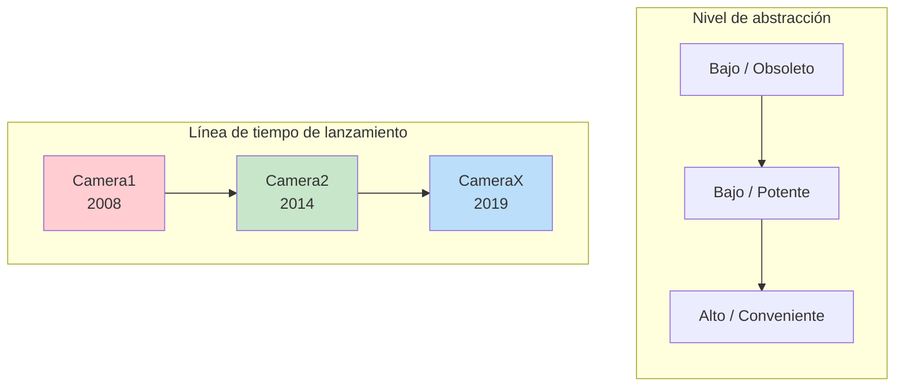
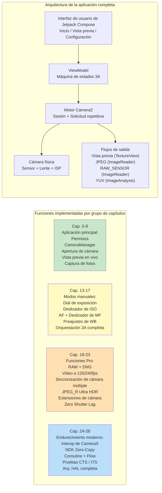

# Capítulo 1: Bienvenido a Android Camera2

> **Resumen del capítulo:** En este capítulo de apertura, damos un paso atrás y miramos el panorama general. ¿Por qué existe Camera2? ¿Qué problemas resuelve en comparación con la antigua API Camera y la biblioteca CameraX más reciente? ¿Quién debería invertir tiempo en aprender Camera2? Y, lo más importante, ¿qué construirá realmente al final de esta serie? Nada de arquitectura profunda, ni capas HAL, ni diagramas de tuberías todavía; solo respuestas claras a las preguntas que todo desarrollador se hace antes de sumergirse.

***

## 1.1 ¿Por qué Camera2?

Saque su smartphone.

Mire la parte trasera. Probablemente vea dos, tres o incluso más lentes de cámara. Esa pequeña protuberancia rectangular alberga más potencia óptica y de silicio que una DSLR profesional de mediados de la década de 2000.

Ahora abra la aplicación de cámara predeterminada.

Toque el obturador. Instantáneamente, una foto de alta resolución se almacena en su galería. La imagen probablemente se vea genial: colores vibrantes, sujetos nítidos, desenfoque de fondo suave y sombras brillantes incluso con luz interior.

Pero la aplicación de cámara que está usando solo araña la superficie de lo que el hardware puede hacer. Oculto bajo ese amigable botón del obturador se encuentra una tubería de imagen increíblemente sofisticada: una que puede tomar fotos RAW, grabar video en cámara lenta a 240 fps, fusionar 10 fotogramas para una sola toma nocturna o controlar de forma independiente cada micra del movimiento de la lente.

La mayoría de las aplicaciones de Android de terceros nunca acceden a este poder. ¿Por qué? Porque **la antigua API de cámara de Android (llamada retroactivamente Camera1) era extremadamente limitada**. Camera1 fue diseñada para un mundo de teléfonos de una sola cámara con captura básica de fotos y video. No podía:

- Controlar el tiempo de exposición o el ISO manualmente
- Capturar datos del sensor RAW
- Grabar cámara lenta a altas velocidades de fotogramas
- Usar múltiples cámaras simultáneamente
- Acceder a los metadatos por fotograma a mitad de la captura
- Tomar ráfagas de fotos de manera confiable

A partir de **Android 5.0 (nivel de API 21)**, Google introdujo **Camera2 (android.hardware.camera2)** para derribar estas paredes. Camera2 no es una actualización incremental; es un **rediseño completo**, construido desde cero para exponer las capacidades brutas del silicio de la cámara moderna a cada desarrollador de Android.

En resumen: **Camera2 existe porque las cámaras de los smartphones se volvieron de nivel profesional y la antigua API no pudo seguir el ritmo.**

***

## 1.2 Camera1 vs Camera2 vs CameraX

Más de una década de desarrollo de cámaras en Android ha producido **tres generaciones** de API de cámara. Antes de escribir una sola línea de código, es esencial entender qué API resuelve qué problema.

### Tres generaciones, tres filosofías

### Camera1 — `android.hardware.Camera`

La API de cámara original, introducida con Android 1.0 y **declarada obsoleta en Android 5.0**.

- **Modelo:** Comandos procedimentales. Usted llama a métodos como `startPreview()`, `takePicture()`, `setFlashMode()`.
- **Filosofía de diseño:** "La cámara es una máquina de estados que usted comanda".
- **Ideal para:** Aplicaciones heredadas orientadas a dispositivos muy antiguos (anteriores a Lollipop). Eso es todo.
- **Por qué evitarla:** Google ya no la actualiza. Las nuevas funciones de hardware (múltiples cámaras, RAW, HDR) nunca se portan de nuevo a Camera1. La superficie de la API es minúscula. En los dispositivos modernos, Camera1 es en realidad **emulada por un envoltorio de Camera2** internamente, por lo que paga la complejidad de Camera2 sin los beneficios de Camera2.

### Camera2 — `android.hardware.camera2.*`

El marco de trabajo moderno de bajo nivel, introducido en Android 5.0 y ampliado continuamente a través de cada versión de Android desde entonces.

- **Modelo:** Una tubería de solicitud/respuesta. Usted construye objetos `CaptureRequest` inmutables, los envía a una `CameraCaptureSession` y recibe metadatos `CaptureResult` + búferes de imagen de forma asíncrona.
- **Filosofía de diseño:** "La cámara es una tubería programable. Usted controla cada parámetro de cada fotograma".
- **Ideal para:** Aplicaciones de cámara avanzadas, herramientas de fotografía manual, tuberías de visión por computadora, captura RAW, investigación de múltiples cámaras, video de alta velocidad y cualquier caso de uso donde necesite un control cercano al hardware.
- **Por qué usarla:** Acceso completo a cada capacidad que expone la HAL del OEM. Control directo de fotogramas. La única ruta de API para funciones profesionales. Camera2 es lo que CameraX llama internamente.

### CameraX — `androidx.camera.*`

Una **biblioteca Jetpack** (no una API de plataforma) introducida en versión beta en 2019 y estabilizada alrededor de Android 11.

- **Modelo:** Casos de uso declarativos. Usted vincula a un ciclo de vida (`bindToLifecycle()`) un conjunto de casos de uso de `Preview`, `ImageCapture`, `ImageAnalysis` o `VideoCapture` y la biblioteca hace el resto.
- **Filosofía de diseño:** "Hemos resuelto los 10.000 casos extremos por usted. Solo díganos qué salida necesita".
- **Ideal para:** La mayoría de las aplicaciones que necesitan una cámara. Escáneres de QR/códigos de barras, subida de fotos, escaneo de documentos, grabación de video simple; cualquier escenario donde la conveniencia y la confiabilidad superen al control bruto.
- **Por qué usarla:** Consciente del ciclo de vida (sin fugas de recursos), la selección de resolución es automática, las peculiaridades de los OEM tienen soluciones integradas, el mismo código exacto se ejecuta en miles de modelos de dispositivos con cero sentencias `if`.

### Comparación lado a lado

| Dimensión | Camera1 | Camera2 | CameraX |
|:---|:---|:---|:---|
| **Introducida** | Android 1.0 (2008) | Android 5.0 (2014) | Android 10 (Jetpack) |
| **Estado** | Obsoleto | Activa, mantenida | Recomendada (Jetpack) |
| **Abstracción** | Baja (heredada) | Baja | Alta |
| **Curva de aprendizaje** | Fácil | Muy pronunciada | Muy suave |
| **Exposición manual / ISO / Enfoque** | Limitada | Control total | Limitada vía Interop |
| **Captura RAW** | No | Sí | Con soluciones de Interop |
| **Múltiples cámaras (flujos físicos)** | No | Sí | No |
| **Video de alta velocidad (120+ fps)** | No | Sí | Limitada |
| **Ráfaga / Bracketing** | No | Control total | No |
| **Metadatos por fotograma** | No | Sí, resultados totales + parciales | Expuestos vía retrollamadas de Interop |
| **Seguridad del ciclo de vida** | Manual, propenso a errores | Manual, propenso a errores | Automática, ligada al ciclo de vida |
| **Manejo de peculiaridades OEM** | Ninguno | Ninguno | Integrado (más de 1000 dispositivos probados) |
| **Volumen de código para una aplicación funcional** | Medio | Muy alto (verboso) | Muy bajo |
| **Rendimiento** | Aceptable (envoltorio indirecto) | Máximo posible | Casi máximo (sobrecarga mínima) |

***

## 1.3 ¿Qué puede hacer Camera2?

Para entender concretamente el poder de Camera2, imagine funciones que ha visto en teléfonos insignia. Camera2 hace que **todas estas sean accesibles programáticamente**:

### Captura de grado profesional

- **Exposición manual completa:** Ajuste la velocidad de obturación desde 1/8000 s hasta 30 s, y el ISO de 50 a 102.400. Construya una interfaz de usuario de modo Pro real.
- **Fotografía RAW:** Extraiga datos **Bayer sin procesar** de 10 bits, 12 bits, 14 bits o 16 bits directamente del sensor (sin interpolación de color, sin reducción de ruido, sin corrección de color). Escriba archivos Adobe DNG utilizando el `DngCreator` incluido para la edición en Lightroom.
- **Bracketing de exposición:** Tome 3, 5, 7 o 9 fotogramas a valores de EV precisamente escalonados. Introdúzcalos en un algoritmo de fusión HDR.
- **Bloqueo de timelapse:** Congele la exposición, el enfoque y el balance de blancos a través de **miles de fotogramas**, sin parpadeos a medida que el sol se mueve o las nubes pasan.

### Acceso al hardware de fotografía computacional

- **Video de alta velocidad:** Configure `CameraConstrainedHighSpeedCaptureSession` para capturas a 120 fps, 240 fps o incluso 960 fps. Construya editores de cámara lenta.
- **Cámara múltiple lógica:** Acceda a **ambas** cámaras físicas bajo un ID de cámara múltiple lógica **simultáneamente**. Obtenga fotogramas YUV sincronizados de una lente gran angular y una teleobjetivo para calcular mapas de profundidad en el dispositivo.
- **Reprocesamiento YUV / PRIVATE (dispositivos LEVEL_3):** Mantenga un **búfer circular en el ISP** a resolución completa, luego, al tocar el obturador, tome un fotograma del pasado y vuelva a ejecutar la reducción de ruido pesada y el enfoque. Así es como los OEM implementan el **Zero Shutter Lag (ZSL)**.
- **Ultra HDR / JPEG_R (Android 14+):** Solicite y escriba archivos `ImageFormat.JPEG_R` que almacenan un JPEG SDR de 8 bits **más** un mapa de ganancia HDR secundario. Los visores heredados ven una foto normal; los paneles HDR renderizan luces de más de 1.000 nits.
- **Extensiones de cámara (Android 12+):** Delegue los modos Nocturno, Bokeh (retrato), HDR y Retoque facial **a la HAL del OEM**, utilizando la misma tubería de IA de múltiples fotogramas que usa la cámara estándar.

### Tuberías avanzadas de video y visión

- **Salida concurrente de flujo múltiple:** Maneje una superficie de **vista previa**, una superficie de **análisis YUV** (para detección de objetos por ML ejecutándose a 30 fps) y una superficie de **JPEG estático** desde una sola solicitud de captura, todo sin copiar memoria.
- **Precisión de sincronización del flash:** Coordine explícitamente la medición previa al flash, el disparo del flash principal y la lectura del obturador electrónico fotograma a fotograma.
- **Resultados de captura parciales:** Reciba metadatos del estado de AE y la distancia de enfoque **milisegundos antes** de que el búfer de imagen final esté listo, lo que permite una capacidad de respuesta de "toque en cualquier lugar y la interfaz de usuario se actualiza instantáneamente".
- **Sesiones sin conexión (API 30+):** Si el usuario pone su aplicación en segundo plano a mitad de un modo nocturno, entregue la fusión de múltiples fotogramas en vuelo a una `CameraOfflineSession` aislada y la HAL termina el procesamiento de forma asíncrona; su aplicación se despierta con la imagen final.

### Y eso es solo el comienzo

Cada nueva versión de Android amplía Camera2. Android 15 (API 35) agregó `CameraDeviceSetup` para que pueda sondear configuraciones de sesión **sin encender el sensor en absoluto**, reduciendo la latencia de verificación de capacidades por 10. La API está viva, evolucionando y siempre un paso por delante del hardware de cámara más reciente.

***

## 1.4 ¿Quién debería aprender Camera2?

Aprender Camera2 correctamente lleva tiempo. La superficie de la API es enorme: más de 300 claves de metadatos, docenas de retrollamadas, múltiples tipos de sesión y cientos de casos extremos de OEM. Debería invertir ese tiempo si algo de esto lo describe a usted o a su proyecto:

### Está construyendo una aplicación de cámara avanzada

Su aplicación ofrece un **modo Pro** con diales manuales de ISO/obturación/enfoque/WB. O captura **fotos RAW** y permite a los usuarios exportarlas para edición en escritorio. O graba **video en cámara lenta**. Nada de esto es posible (o está severamente limitado) con CameraX.

### Está construyendo una aplicación de visión por computadora o investigación

Necesita **fotogramas YUV con latencia mínima y sin copia** para alimentar una tubería de ML en el dispositivo. O requiere **datos del sensor bloqueados por fotograma** (la marca de tiempo del giro en `SENSOR_TIMESTAMP` debe coincidir con la imagen dentro de ±1 ms para un SLAM / odometría visual-inercial precisa). O debe controlar la **duración exacta de la obturación por fotograma** para luz estructurada / detección de profundidad.

### Está construyendo una herramienta de diagnóstico de capacidad de cámara

Como la aplicación complementaria de esta serie — **Android Camera Parameters** ([GitHub](https://github.com/zoozooll/AndroidCameraParameters), [Google Play](https://play.google.com/store/apps/details?id=com.minininja.cameraparams)) — necesita volcar exhaustivamente cada clave de `CameraCharacteristics` para visualizar qué admite cada dispositivo. CameraX oculta intencionalmente la mayor parte de este detalle.

### Está depurando un problema de CameraX o de la cámara del OEM

CameraX a veces falla en dispositivos oscuros. Cuando su vista previa de CameraX está estirada, o un modelo específico de Galaxy devuelve fotogramas verdes en modo nocturno, o el Pixel 9 falla en `VideoCapture`, **debe** bajar a Camera2 para reproducir e aislar el error.

### Trabaja en procesamiento de imágenes móviles, pilas de cámaras OEM o tuberías de cámaras automotrices

Si toca código HAL de proveedores, `frameworks/av/camera`, el NDK de la cámara o la migración de EVS automotriz → Camera2, la fluidez en Camera2 es fundamental.

### ¿Quién **no** necesita aprender Camera2?

Si sus requisitos son: *"Necesito dejar que los usuarios tomen una foto de perfil o escaneen un código QR"* — **use CameraX**. En serio. CameraX es una obra maestra de la ingeniería. Le ahorrará meses de trabajo en compatibilidad de dispositivos. Camera2 es una herramienta potente; recurra a ella cuando necesite específicamente ese poder.

***

## 1.5 Qué construirá a lo largo de este libro

La teoría sin código es abstracta. El código sin progresión es confuso.

A lo largo de este libro **construirá progresivamente una aplicación Camera2 real y totalmente funcional**. Cada capítulo añade una función, y cada función se compila y se ejecuta en un teléfono real. Para el capítulo final, habrá ensamblado esta aplicación completa:

### Los hitos

| Rango de capítulos | Qué podrá hacer después |
|:---|:---|
| **Cap. 1–4** | Entiende el hardware. Sabe cómo interactúan una lente, un sensor y un ISP. Puede leer la hoja de especificaciones de cualquier teléfono y saber qué funciones de Camera2 admite. Ha instalado la aplicación complementaria Android Camera Parameters y ha explorado su propio dispositivo. |
| **Cap. 5–9** | Tiene una **aplicación de cámara funcional**. Abre la cámara trasera, muestra una vista previa en vivo en la pantalla y guarda una foto JPEG cuando toca el botón del obturador. La corrección completa de la relación de aspecto, la rotación de retrato correcta y la limpieza adecuada del ciclo de vida funcionan. |
| **Cap. 10–12** | Entiende **por qué** el código funciona de la manera que lo hace. Puede rastrear una CaptureRequest a través de la cola pendiente, la cola en vuelo, la HAL y de vuelta como un CaptureResult. Sabe cómo restringir las funciones según el nivel de hardware real y las capacidades informadas. |
| **Cap. 13–17** | Su aplicación tiene un **modo Pro completo**. Diales manuales de ISO, obturación, distancia de enfoque y temperatura de color de WB. Histograma en vivo / lectura de EV. Secuencia completa de AF de un solo disparo → AE de precaptura → captura que imita exactamente cómo las cámaras estándar de los OEM obtienen resultados perfectos. |
| **Cap. 18–23** | Su aplicación es ahora de **nivel insignia**: guarda RAW+JPEG simultáneamente, graba video en cámara lenta a 120 fps, puede capturar flujos duales de YUV físico para profundidad de retrato, escribe archivos Ultra HDR JPEG_R, delega los modos Bokeh y Nocturno a las Extensiones de Cámara e implementa el reprocesamiento Zero-Shutter-Lag en dispositivos LEVEL_3. |
| **Cap. 24–28** | Es un **ingeniero sénior de cámaras Android**. Puede integrar CameraX a través de Interop para el 90% de las aplicaciones mientras usa Camera2 para el 10% que lo necesita. Puede crear tuberías de cámara nativas NDK con copia cero. Envuelve todas las retrollamadas en Kotlin Coroutines y Flow para un código limpio y comprobable. Entiende cómo escribir pruebas de cámara que pasen CTS ITS. Y puede explicar toda la pila App → Framework → Binder → Nativo → HAL → Kernel → Hardware en una pizarra. |
| **Cap. 29 (Enciclopedia)** | Tiene una **referencia de escritorio** de 29 de las claves de `CameraCharacteristics` más importantes, cada una explicada con su lógica, una consulta en Kotlin, un puntero a Android Camera Parameters y las trampas de los OEM. Este capítulo permanece abierto mientras lanza código de producción. |

Ese es un conjunto de habilidades genuinamente raro. Comencemos el viaje.

***

## 1.6 Resumen

- **Camera2** es el marco de trabajo moderno de bajo nivel de la cámara de Android, introducido en Android 5.0 para exponer la capacidad completa de los smartphones actuales, ricos en múltiples cámaras e ISP.
- **Camera1** está obsoleta; **CameraX** es conveniente para la mayoría de los casos de uso pero oculta el poder que solo Camera2 expone. Usted elige en función de los requisitos.
- Camera2 desbloquea **controles manuales, fotografía RAW, video de alta velocidad, cámara múltiple lógica, reprocesamiento YUV/ZSL, Ultra HDR, extensiones OEM** y **sesiones sin conexión**.
- Invierta en Camera2 cuando esté construyendo herramientas de fotografía profesional, tuberías de visión/investigación, aplicaciones de diagnóstico o depurando capas más profundas.
- A lo largo de este libro, **construirá de forma incremental una aplicación Camera2 completa**, desde una cámara de un solo botón en el capítulo 9 hasta una herramienta de imagen de nivel insignia para el capítulo 23, endurecida por patrones modernos de Android para el capítulo 28.

## 1.7 ¿Qué sigue?

Antes de escribir una sola línea de código de Camera2, necesitamos entender el hardware que estamos comandando. En el **Capítulo 2: Entendiendo las cámaras de los smartphones**, aprenderá qué hace realmente cada parte de un módulo de cámara de un teléfono: la lente, el sensor de imagen, el ISP y cómo la luz cruda se convierte en un JPEG comprimido. Al final, verá por qué una etiqueta de "48 MP" en la caja no dice casi nada sobre la calidad de imagen real.
