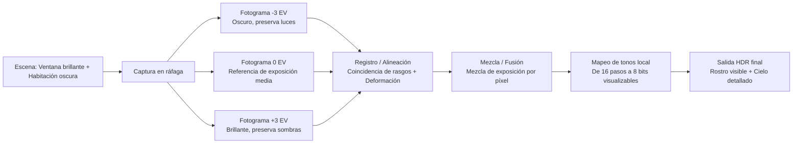
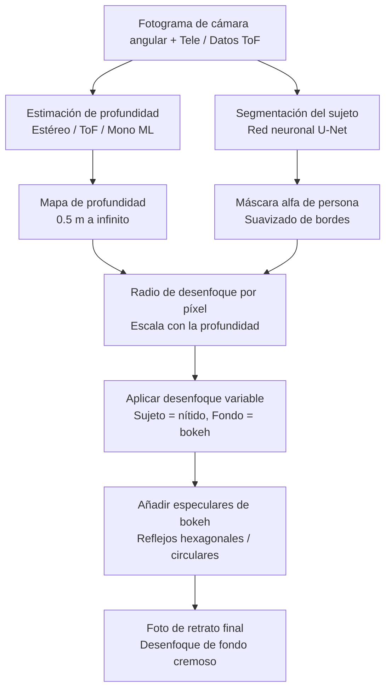
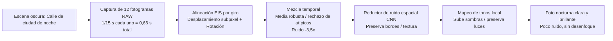
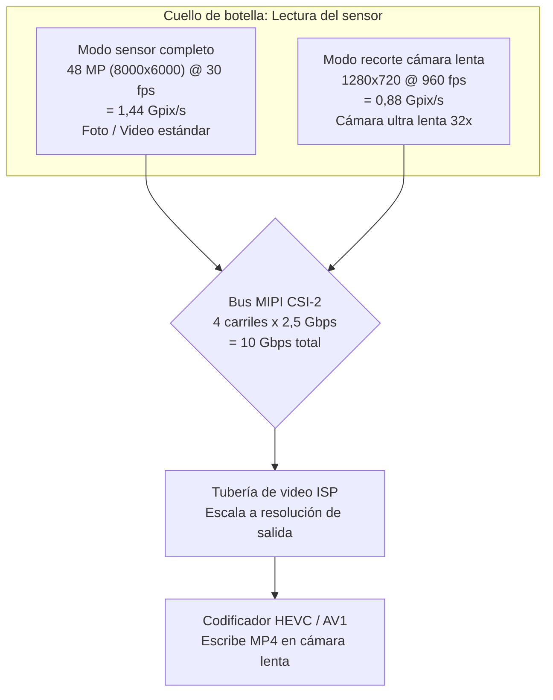
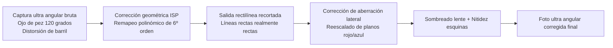
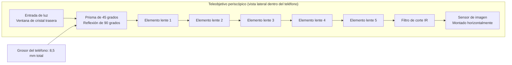
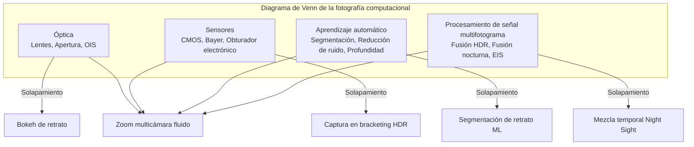

# Capítulo 3: Fotografía moderna con smartphones

El Capítulo 2 le proporcionó los fundamentos del hardware: lentes, sensores, tuberías de ISP y módulos de cámara múltiple. Este capítulo responde a la pregunta lógica que surge a continuación: **¿Cómo usan realmente las aplicaciones de cámara modernas ese hardware para producir las fotos que veo en Instagram?**

Un smartphone de 2010 tomaba una única exposición, la pasaba por un ISP básico y escribía un JPEG. Un smartphone de 2026 captura rutinariamente de 5 a 15 fotogramas por separado para una única foto fija, los alinea con precisión subpíxel usando datos del giroscopio, los fusiona usando el procesamiento de señal multifotograma, pasa el resultado por una red neuronal para la segmentación semántica o la estimación de profundidad y, finalmente, le aplica el mapa de tonos en una única imagen compartible, todo en el lapso de una única pulsación del botón disparador.

Este capítulo es un recorrido función por función de la fotografía moderna con smartphones. Explicaremos cómo funciona cada función a nivel de hardware + software, sin ningún código de la API Camera2. El objetivo es construir un vocabulario de lo que los sistemas de cámara modernos pueden hacer, de modo que cuando más tarde escriba código para controlar estas funciones, sepa qué está sucediendo bajo el capó.

## HDR: Fusión multifotograma de alto rango dinámico

El **rango dinámico** es la relación entre las partes más brillantes y más oscuras de una escena que el sistema de imagen puede registrar simultáneamente sin recortes. El ojo humano puede percibir aproximadamente 20 pasos de rango dinámico (una relación de contraste de 1.000.000:1) en una sola mirada, gracias a la adaptación sacádica. La exposición de un único sensor de smartphone puede capturar aproximadamente de 10 a 12 pasos con el ISO base. La brecha entre esos dos números es la razón por la que existe el HDR.

Imagine que está tomando una foto en el interior con una ventana brillante detrás del sujeto. Si expone para el rostro de la persona (digamos 1/30 s, ISO 400), la ventana se quema hasta el blanco puro: sin cielo, sin nubes, sin detalles. Si expone para la ventana (1/2000 s, ISO 50), el rostro de la persona se convierte en una mancha negra silueteada. Ninguna de las dos exposiciones individuales funciona.

### Cómo funciona el HDR en los smartphones

Todos los sistemas HDR de los teléfonos modernos utilizan el **bracketing multifotograma** seguido de la fusión computacional. El algoritmo funciona así:

1. **Captura en bracketing**: la cámara captura una ráfaga rápida de 3 a 10 fotogramas consecutivos con diferentes valores de exposición (EV). Un conjunto típico podría ser fotogramas a -3 EV (muy corto, preserva las luces), -1 EV, +1 EV y +3 EV (muy largo, captura las sombras). El sensor y el VCM se mantienen perfectamente quietos durante la ráfaga; solo cambia la temporización del obturador electrónico.
2. **Selección del fotograma de referencia**: el algoritmo elige el fotograma de exposición media más nítido como referencia geométrica.
3. **Registro / Alineación de imágenes**: cada fotograma que no es de referencia se alinea computacionalmente con la referencia. El algoritmo busca características de puntos clave distintivos (esquinas, bordes) utilizando algoritmos como FAST o SIFT, calcula una transformación afín o de homografía que mapea las características de cada fotograma sobre el fotograma de referencia y deforma los píxeles en consecuencia. Cualquier fotograma que esté demasiado borroso (debido al microtemblor durante la ráfaga) se descarta por completo.
4. **Fusión**: para cada ubicación de píxel en la imagen final, el algoritmo combina la información de los fotogramas alineados. Los píxeles subexpuestos aportan sus datos de luces limpios y sin recortes. Los píxeles sobreexpuestos aportan sus datos de sombras con poco ruido. Los píxeles de tonos medios se promedian entre todos los fotogramas para reducir el ruido de disparo.
5. **Mapeo de tonos (Tone mapping)**: la imagen lineal fusionada —que ahora puede contener de 14 a 18 pasos de rango dinámico utilizable— se comprime mediante un sofisticado operador de mapeo de tonos local en una imagen de salida de 8 o 10 bits que se ve bien en una pantalla sRGB estándar.

Ejemplo real: un Galaxy S26 Ultra en el modo predeterminado "Optimizador de escenas HDR" dispara internamente 7 fotogramas en bracketing que suman aproximadamente 0,2 segundos de tiempo de captura. La detección de movimiento de la mano integrada descarta 2 fotogramas borrosos. Los 5 fotogramas restantes se alinean, se fusionan y se les aplica el mapeo de tonos. La salida se escribe como un **archivo JPEG_R Ultra HDR** en los dispositivos con Android 14+: una imagen JPEG primaria estándar (SDR de 8 bits) con un mapa de ganancia incrustado que los visores compatibles con HDR (Galería de Android 14, Chrome 120+, Adobe Lightroom) pueden usar para reconstruir el rango de luminancia HDR completo de 10 bits en una pantalla HDR10 o Dolby Vision.

### Cuándo funciona el HDR y cuándo no

El HDR destaca en escenas estáticas con luces brillantes y sombras profundas: paisajes, retratos a contraluz, habitaciones con ventanas, atardeceres sobre el agua. Falla activamente —produciendo artefactos de "fantasmas"— cuando los objetos de la escena se mueven durante la ráfaga de bracketing: un pájaro volando, una bandera ondeando, una persona parpadeando, un niño corriendo. Los modernos algoritmos de HDR basados en IA detectan y segmentan los objetos en movimiento, mezclando solo el fotograma de referencia para esos píxeles para evitar el clásico "fantasma" del HDR.

## Modo Retrato: Bokeh mediante estimación de profundidad

El modo retrato produce la estética en la que el rostro del sujeto está perfectamente nítido y el fondo se disuelve en un desenfoque cremoso llamado **bokeh**. Las cámaras tradicionales logran esto ópticamente con sensores grandes, aperturas amplias y distancias focales largas. Los smartphones lo logran computacionalmente, porque un sensor de 1/1,3 pulgadas a f/1,6 no produce de forma natural suficiente profundidad de campo reducida para el efecto.

### Tres métodos de estimación de profundidad en smartphones

Existen tres técnicas independientes utilizadas por los sistemas de retrato modernos; muchos teléfonos utilizan una combinación de las tres.

**Método 1: Disparidad estéreo de cámaras duales.** Este es el método más antiguo y geométricamente sólido. El teléfono dispara simultáneamente la cámara gran angular y la cámara teleobjetivo al mismo sujeto. Como las dos cámaras están separadas físicamente por 10 a 15 milímetros (la "línea base"), ven al sujeto desde posiciones horizontales ligeramente diferentes. La posición de un objeto en primer plano se desplaza más entre los dos puntos de vista que la posición de un objeto en el fondo distante. Este desplazamiento se denomina **disparidad**. El algoritmo ejecuta un algoritmo de coincidencia de bloques o de coincidencia semiglobal (SGM) sobre las dos imágenes rectificadas para calcular un valor de disparidad para cada píxel. La disparidad es inversamente proporcional a la profundidad, por lo que el mapa de disparidad se convierte directamente en un mapa de profundidad por píxel.

**Método 2: Detección de profundidad activa ToF / LiDAR.** Un sensor de profundidad ToF (Time-of-Flight) o LiDAR proyecta un patrón estructurado de más de 30.000 puntos láser de infrarrojo cercano sobre la escena, y luego mide el tiempo de ida y vuelta (para ToF directo) o el desfase (para ToF indirecto) de la luz reflejada para calcular una profundidad métrica real en metros para cada píxel. El ToF produce mapas de profundidad densos y precisos incluso en completa oscuridad y sobre superficies sin textura (paredes lisas, cielo) donde el emparejamiento estéreo falla. Los sistemas de retrato modernos suelen usar el ToF como señal de profundidad base y la disparidad estéreo como señal de refinamiento.

**Método 3: Estimación de profundidad ML monocular.** Para los teléfonos de una sola cámara (o para la cámara frontal para selfies, que no tiene pareja estéreo), una red neuronal estima la profundidad a partir de una única imagen RGB. El modelo, entrenado en millones de imágenes con etiquetas de profundidad reales, aprende las pistas estadísticas que los humanos usamos para juzgar la profundidad: tamaño relativo, oclusión, perspectiva lineal, gradiente de textura, desenfoque y perspectiva atmosférica. PortraitNet de Google y DeepLabV3+ de Meta son arquitecturas representativas. La profundidad monocular es menos precisa métricamente que la estéreo o la ToF, pero es suficiente para obtener un bokeh de retrato plausible.

### La tubería de renderizado de retratos

Una vez obtenido el mapa de profundidad, los pasos restantes son los mismos independientemente del método de estimación de profundidad utilizado:

1. **Segmentación del sujeto**: una red neuronal de segmentación semántica independiente (normalmente una variante de U-Net) se ejecuta sobre la imagen de la cámara RGB principal y produce una máscara alfa suave que identifica qué píxeles pertenecen a la "persona" frente al "fondo". La máscara se suaviza en los bordes —especialmente alrededor del pelo, las gafas y los detalles finos del primer plano— para evitar el aspecto de "muñeca de papel" recortada del modo retrato de principios de la década de 2010.
2. **Refinamiento de la profundidad**: el mapa de profundidad bruto del Método 1/2/3 se multiplica por la máscara de segmentación. Los píxeles del fondo mantienen su valor de profundidad; los píxeles del sujeto se fijan a la profundidad de un único plano de enfoque.
3. **Desenfoque variable por píxel**: cada píxel del fondo se desenfoca mediante una gaussiana (o, para los modos de "simulación óptica" premium, una convolución de núcleo de lente renderizada físicamente) cuyo radio escala linealmente con la distancia del píxel al plano de enfoque. Un objeto del fondo a 5 metros recibe un desenfoque fuerte; un objeto del fondo a 1,5 metros recibe un desenfoque leve. Los píxeles del sujeto se copian sin tocar.
4. **Resplandor óptico falso**: un toque premium: los reflejos especulares brillantes en el fondo desenfocado (farolas, reflejos, el sol) se renderizan como hexágonos o círculos de bokeh característicos de la lente en lugar de simples manchas gaussianas. Esto vende la ilusión de que el desenfoque procede de un diafragma de lente real.

## Modo Nocturno: Mezcla temporal multifotograma

Antes de 2018, la fotografía con smartphones con poca luz era esencialmente inutilizable sin flash. Un bar tenuemente iluminado o una calle de la ciudad por la noche producían un desastre ruidoso, granulado y borroso. Entonces Google lanzó **Night Sight** en el Pixel 3 y todo cambió. La idea central era contraintuitiva: en lugar de hacer una única exposición larga de 1 segundo (que quedaría irremediablemente borrosa por el temblor de la mano), haz 15 exposiciones muy cortas de 1/15 de segundo (cada una nítida individualmente porque el OIS está activo) y luego alinéalas y promédialas algorítmicamente. El tiempo de exposición total integrado sigue siendo de 1 segundo, pero la exposición por fotograma es lo suficientemente corta como para que el desenfoque por el temblor de la mano nunca se acumule.

### El algoritmo del modo nocturno paso a paso

1. **Captura en ráfaga**: la cámara captura de 8 a 15 fotogramas crudos. Cada fotograma utiliza un tiempo de exposición moderado (lo típico es de 1/15 s a 1/8 s) e ISO moderado (800 a 3200). Los fotogramas individuales son ruidosos pero no borrosos. La ráfaga suma de 0,5 a 2 segundos de tiempo real.
2. **Alineación EIS asistida por giro**: el giroscopio de la IMU principal del teléfono registra la velocidad angular a 8.000 Hz durante toda la ráfaga. Para cada fotograma, se calcula la rotación y traslación acumuladas desde el fotograma de referencia. A continuación, cada fotograma crudo se desplaza, rota y escala ligeramente de forma digital (estabilización electrónica de imagen, EIS) en la NPU con precisión subpíxel, registrándolo perfectamente con el fotograma de referencia incluso si las manos del usuario se movieron varios píxeles de desenfoque durante la ráfaga.
3. **Mezcla temporal de píxeles**: para cada ubicación de píxel en los 12 fotogramas alineados, el algoritmo reúne 12 valores de píxel candidatos. A continuación, realiza una mezcla estadística robusta en lugar de un simple promedio: se identifican y descartan los valores atípicos (causados por píxeles calientes, impactos de rayos cósmicos o los faros de un coche que transita por ese punto). Se promedian los valores consistentes restantes, reduciendo el ruido de disparo gaussiano en un factor igual a la raíz cuadrada del número de fotogramas mantenidos. Una mezcla de 12 fotogramas reduce el ruido en 3,5 veces.
4. **Reducción de ruido espacial**: un reductor de ruido basado en CNN (entrenado específicamente con imágenes nocturnas crudas) elimina cualquier ruido de alta frecuencia restante conservando los bordes y la textura reales.
5. **Mapeo de tonos local**: la imagen cruda mezclada tiene un rango dinámico muy alto. Un operador de mapeo de tonos que varía espacialmente (basado en el filtrado bilateral o en un mapa de tonos de CNN aprendido) levanta las sombras sin quemar las luces de la ciudad, aumenta la saturación del color en las regiones oscuras (que de otro modo se verían desaturadas) y produce una imagen final de 8 bits que se siente brillante y limpia en lugar de tenue y turbia.

"Nightography" de Samsung, "Modo Noche" de Apple, "Night Mode 2.0" de Xiaomi y "Ultra Dark Mode" de OPPO utilizan sustancialmente la misma arquitectura de algoritmo. Existen variaciones en el número exacto de fotogramas, la elección de la estadística de mezcla robusta, la arquitectura del reductor de ruido y el aspecto del mapa de tonos, pero el promediado temporal multifotograma alineado por giroscopio es universal en toda la industria.

## Cámara lenta: Captura recortada a alta velocidad de fotogramas

El video en cámara lenta estira el tiempo capturando los fotogramas de video más rápido que la velocidad de reproducción estándar de 30 fps y reproduciéndolos después a la velocidad normal de 30 fps. Los multiplicadores comunes:

- **Captura a 120 fps → reproducción a 30 fps = cámara lenta de 4 aumentos.** Un evento del mundo real de 1 segundo se convierte en 4 segundos de video.
- **240 fps → 30 fps = cámara lenta de 8 aumentos.**
- **960 fps → 30 fps = cámara ultra lenta de 32 aumentos.** El salpicado de una gota de agua, el estallido de un globo o el aleteo de un colibrí se vuelven visibles.

### Por qué los 960 fps requieren un recorte del sensor

El cuello de botella para la captura a alta velocidad de fotogramas es el **ancho de banda de lectura del sensor**. El sensor de imagen tiene un número finito de carriles MIPI CSI-2 que funcionan a una velocidad de datos máxima fija (normalmente 2,5 Gbps por carril, 4 carriles = 10 Gbps en total). El sensor solo puede emitir un número determinado de píxeles por segundo.

- La lectura de un fotograma completo de 48 MP (8000×6000) a 960 fps requeriría 48.000.000 × 960 = 46.080 millones de píxeles por segundo. Eso es 30 veces el ancho de banda de lectura real de cualquier sensor de smartphone de 2026.
- Por tanto, para alcanzar los 960 fps el sensor debe leer solo un pequeño recorte central de su matriz de píxeles. Un modo de 960 fps suele ser un recorte de 1280×720 (720p HD) o, a veces, de 1920×1080 (1080p FHD). El ancho de banda total de píxeles se vuelve manejable: 1280×720×960 fps = 884 megapíxeles por segundo, lo que cabe cómodamente en 10 Gbps incluso con una codificación de 10 bits por píxel.

Los números en la práctica: captura a 960 fps × 0,3 segundos de tiempo real = 288 fotogramas individuales. Reproducidos a 30 fps = 9,6 segundos de video en cámara lenta fluido. Algunos teléfonos insignia Sony Xperia y Samsung Galaxy admiten una breve ráfaga de 960 fps a una resolución de 1080p leyendo el sensor a través de un banco de convertidores analógico-digitales (ADC) limitado solo en la región del recorte central.

Los modos de cámara lenta también suelen utilizar una técnica de HDR escalonado en la que las filas alternas del sensor se exponen durante diferentes duraciones para mantener un alto rango dinámico incluso a 240 fps o 960 fps.

## Ultra gran angular: Corrección de distorsión y calidad en los bordes

La cámara ultra gran angular de un insignia moderno ofrece una distancia focal equivalente a fotograma completo de 10–18 mm y un campo de visión diagonal de 100° a 130°. Abre posibilidades compositivas que la cámara gran angular estándar no puede: paisajes inmensos, tomas de arquitectura imponentes donde todo el edificio cabe sin tener que meterse en el tráfico, selfies de grupo en los que realmente cabe todo el mundo y un divertido efecto de "distorsión por proximidad en primer plano" donde los objetos situados cerca de la lente aparecen masivamente sobredimensionados con respecto al fondo.

Sin embargo, la distancia focal del ultra gran angular conlleva tres fallos ópticos característicos que el ISP debe corregir antes de que la foto sea utilizable:

1. **Distorsión geométrica (de barril)**: las líneas rectas se curvan hacia fuera como los bordes de una lente de ojo de pez. Una foto de un marco de puerta rectangular se verá abombada o en barril. La etapa de Corrección de Distorsión Geométrica del ISP (véase el Capítulo 2) aplica una reasignación de coordenadas por píxel utilizando un modelo de lente polinómico de 4º o 6º orden calibrado para ese módulo específico. La corrección recorta necesariamente entre el 5 y el 10% del anillo exterior de píxeles porque la reasignación empuja esos píxeles exteriores fuera del lienzo.
2. **Aberración cromática lateral (LCA)**: la lente curva las diferentes longitudes de onda de la luz en cantidades ligeramente distintas, por lo que las imágenes roja, verde y azul del mismo punto fuera del eje aterrizan en coordenadas de píxel ligeramente diferentes. El resultado es un halo de color visible (bordes púrpuras/verdes) en los objetos de alto contraste cerca de las esquinas. El ISP corrige la LCA aplicando un factor de magnificación ligeramente distinto a los planos de color rojo y azul con respecto al verde.
3. **Viñeteado / Suavidad en las esquinas**: los píxeles de las esquinas reciben significativamente menos luz que los del centro (debido a la caída natural cos⁴θ de la lente más el viñeteado mecánico del barril de la lente), y la MTF (función de transferencia de modulación) óptica de la lente es menor en los ángulos extremos, por lo que las esquinas se ven suaves. La etapa de Corrección del Sombreado de la Lente aplica un aumento de ganancia radialmente simétrico para aplanar la iluminación, y se aplica un filtro de nitidez sensible a los bordes de forma más agresiva en las esquinas que en el centro.

## Teleobjetivo: Estándar frente a periscópico

La cámara teleobjetivo captura sujetos lejanos que la cámara gran angular no puede resolver. Los teléfonos modernos incorporan dos diseños de teleobjetivo distintos.

**Teleobjetivo estándar (zoom óptico de 2x a 3x):** se trata de un módulo de cámara convencional: el barril de la lente se sitúa perpendicular a la cubierta trasera del teléfono, directamente sobre el sensor de imagen, exactamente igual que la cámara gran angular pero con una lente de mayor distancia focal. Un teleobjetivo de 3 aumentos tiene una distancia focal equivalente a fotograma completo de ~72 mm. El apilamiento físico está limitado por el grosor del teléfono (7–9 mm), por lo que la lente no puede ser más larga que eso. De ahí el techo práctico de 3 aumentos para los módulos de teleobjetivo convencionales.

**Teleobjetivo periscópico (zoom óptico de 5x a 10x):** para obtener distancias focales más largas sin aumentar el grosor del teléfono, los ingenieros doblaron la trayectoria óptica 90° usando un prisma. La luz entra a través de una ventana en el borde del teléfono o en el cristal trasero, choca con un prisma de ángulo recto de 45°, rebota 90° hacia un lado y luego viaja horizontalmente a través de un barril de lente de varios elementos de 10 a 14 mm de largo que corre paralelo a la placa base del teléfono, aterrizando finalmente en un sensor de imagen montado de lado en la PCB. El propio prisma está montado en un cardán (gimbal) OIS de 2 ejes, y el sensor a veces está montado en un OIS de desplazamiento de sensor independiente, lo que proporciona una estabilización total de 4 o 5 ejes, suficiente para obtener fotos nítidas a mano de 10 aumentos de un texto en el cartel de un edificio lejano.

En los límites del zoom entre cámaras físicas (por ejemplo, 2,9x todavía recortados digitalmente de la cámara gran angular frente a 3,1x usando el teleobjetivo periscópico de 3 aumentos), la HAL realiza un truco de fusión multicámara: durante aproximadamente ±0,2x alrededor del punto de cambio, captura ambas cámaras simultáneamente y realiza un fundido cruzado ponderado por la relación de zoom, de modo que el usuario nunca ve un "salto" visible cuando cambia la cámara física activa.

## Macro: Fotografía de primer plano extremo

La fotografía macro captura primeros planos extremos de sujetos pequeños: la textura de los pétalos de las flores, los ojos compuestos de los insectos, las fibras de un trozo de tela, los cristales de azúcar individuales de una galleta.

En los teléfonos modernos existen dos estrategias macro:

**Cámara macro dedicada:** los teléfonos económicos y de gama media suelen incorporar un pequeño módulo macro dedicado de baja resolución (de 2 MP a 5 MP) con una lente de distancia focal corta y enfoque fijo. El módulo está ajustado para una distancia de enfoque mínima específica (normalmente de 2 a 4 cm) y produce imágenes macro sorprendentemente nítidas a pesar de su baja resolución. El principal inconveniente es que el sensor es diminuto, por lo que la calidad de la imagen se degrada bruscamente en cualquier condición que no sea luz de día brillante.

**Ultra gran angular reutilizado como macro:** los teléfonos insignia (Google Pixel, serie S Ultra de Samsung, iPhone Pro) no incorporan una cámara macro dedicada. En su lugar, reutilizan la cámara ultra gran angular. La corta distancia focal del ultra gran angular (13 mm eq) le proporciona una distancia mínima de enfoque muy reducida, a menudo de 1 a 2 centímetros del sujeto. Cuando el usuario toca el modo "Macro" o la aplicación de la cámara detecta un sujeto cercano a través del sensor ToF o del telémetro AF de detección de fase, la aplicación cambia al ultra gran angular, lleva su VCM a la posición de enfoque mínimo, aplica una corrección de distorsión geométrica adicional (porque el sujeto está ahora en un extremo de la curvatura de campo donde el remapeo polinómico difiere significativamente de la calibración al infinito) y recorta el centro del sensor ultra gran angular para producir el fotograma macro final. El gran sensor ultra gran angular de 12 MP–50 MP ofrece una calidad de imagen macro drásticamente mejor que la de un módulo dedicado de 5 MP.

## Fotografía computacional: La filosofía unificadora

Las funciones anteriores —HDR, Retrato, Modo Nocturno, Cámara Lenta, corrección de Ultra Angular, fusión de zoom Periscópico, Macro— comparten una única idea unificadora. La **fotografía computacional** es la filosofía de que el sensor de la cámara, el ISP, el giroscopio/IMU, la NPU (unidad de procesamiento neuronal) y los algoritmos de procesamiento de señal multifotograma pueden trabajar juntos para producir imágenes que ninguna combinación de lente/sensor, por muy caro que sea el cristal, podría producir jamás por sí sola.

El modelo clásico de las DSLR es: luz → lente → sensor → almacenamiento. El modelo de los smartphones es: luz → múltiples lentes → múltiples sensores → giroscopio/IMU → captura de ráfaga multifotograma → inferencia neuronal en la NPU → fusión de decisiones por píxel → mapeo de tonos sofisticado → almacenamiento. Ambos empiezan y terminan en el mismo lugar, pero el smartphone inserta docenas de pasos computacionales adicionales en medio, cada uno de los cuales mejora el resultado final de formas que la óptica por sí sola no puede.

Hacer zoom de forma fluida desde 0,5x hasta 10x en un Galaxy S26 Ultra es computacional: la HAL mezcla tres cámaras diferentes con tres distancias focales distintas a través de cinco puntos de cambio de zoom. Rescatar un retrato a contraluz donde la ventana detrás del sujeto ya no se quema es computacional: fusión HDR de 7 fotogramas. Una foto nocturna a pulso de la Vía Láctea que requeriría un trípode y una exposición de 30 segundos en una DSLR es computacional: mezcla temporal de 12 fotogramas alineada por giroscopio. Cada función descrita en este capítulo es fotografía computacional.

Esta es la idea más importante que hay que trasladar a los capítulos de la API Camera2 que siguen. La API Camera2 no es solo una herramienta para "tomar una foto". Es una interfaz de control de bajo nivel que permite a su aplicación disparar ráfagas multifotograma precisas, leer metadatos de giro por fotograma, seleccionar qué cámara física se dispara en cada relación de zoom y transmitir fotogramas a través de redes neuronales en el dispositivo: los bloques de construcción para implementar sus propias funciones de fotografía computacional.

## Resumen

En este capítulo ha aprendido los algoritmos del mundo real que sustentan las funciones de fotografía de los smartphones modernos. El HDR utiliza el bracketing de exposición de 3 a 10 fotogramas, la alineación basada en rasgos por fotograma y el mapeo de tonos para capturar un rango dinámico que el sensor no puede ver en una sola exposición. El modo retrato calcula un mapa de profundidad por píxel mediante la disparidad de la cámara estéreo, la telemetría láser ToF o la estimación de profundidad ML monocular, y luego ejecuta una segmentación del sujeto U-Net y aplica un desenfoque gaussiano variable por píxel escalado por la profundidad. El modo noche captura de 8 a 15 exposiciones cortas, las alinea usando EIS asistida por giroscopio, aplica una mezcla de píxeles temporal robusta para reducir el ruido en 3,5 veces y aplica un mapa de tonos local al resultado. El video en cámara lenta a 960 fps debe recortar el sensor porque el ancho de banda de lectura MIPI es el cuello de botella. Las fotos ultra gran angular se someten a una corrección de distorsión geométrica, corrección de aberración cromática y corrección de sombreado de esquinas en el ISP antes de ser visualizables. Las cámaras teleobjetivo periscópicas utilizan un prisma de 45° para doblar la trayectoria de la luz 90° y meter una lente óptica de 10 aumentos dentro de un teléfono de 8,5 mm de grosor. Ha aprendido la definición de fotografía computacional: la fusión de Óptica, Sensores, Aprendizaje Automático y Procesamiento de Señal Multifotograma para crear imágenes más allá del alcance de cualquier sistema de lente/sensor único.

## ¿Qué sigue?

El Capítulo 4 es el capítulo práctico. Instalará la aplicación complementaria **Android Camera Parameters** desde el código fuente o desde Google Play, la lanzará en su propio teléfono e inspeccionará exactamente de qué es capaz su propio hardware. Aprenderá a leer los ID de cámara y las orientaciones, a comprobar el nivel de hardware de cada cámara (LEGACY / LIMITED / FULL / LEVEL_3), a enumerar los formatos de salida admitidos (JPEG, YUV_420_888, PRIVATE, RAW_SENSOR, JPEG_R Ultra HDR), a buscar los rangos máximos de FPS en cámara lenta, a explorar las relaciones de zoom y los puntos de cambio entre las cámaras físicas de su teléfono, y a comprobar si su sensor principal admite la captura RAW, anotando las respuestas para su dispositivo específico, ya que esas respuestas determinan qué es y qué no es posible que su propia aplicación de la API Camera2 haga en ese teléfono.
