# Capítulo 16: Balance de blancos y color

Ya domina el brillo (exposición) y la nitidez (enfoque). Ahora es el momento de controlar el **aspecto**: el *tono de color* de la imagen.

Cuando toma una foto de una hoja de papel blanca bajo una lámpara incandescente cálida, la luz amarilla/naranja de la lámpara incide sobre el papel y el sensor la ve naranja. *Su cerebro* corrige esto instantáneamente y sigue viendo "papel blanco", pero los datos brutos del sensor registran la verdad: es naranja.

El **Balance de Blancos (WB)** es el proceso de la cámara para compensar el color de la fuente de luz de modo que los blancos neutros parezcan neutros. Si se equivoca, toda la foto tendrá un tinte de color no deseado (demasiado naranja, demasiado azul, demasiado verde).

La [aplicación Android Camera Parameters](https://github.com/zoozooll/AndroidCameraParameters) muestra cada preajuste de AWB en una vista de cuadrícula en vivo y expone un control deslizante de ganancias manuales: abra la aplicación, cambie al panel de Balance de Blancos y podrá observar exactamente lo que implementaremos en este capítulo.

---

## Temperatura de color: el espectro de cálido a frío

Las fuentes de luz se describen por su **temperatura de color** en Kelvin (K). La escala describe la temperatura de un "radiador de cuerpo negro" teórico que brilla con el mismo color.

```mermaid
graph LR
    A["1800K<br/>Luz de vela"] --> B["2800K<br/>Lámpara incandescente"]
    B --> C[3500K<br/>Fluorescente cálido]
    C --> D[4500K<br/>Fluorescente frío]
    D --> E[5500K<br/>Luz de día / Flash]
    E --> F[6500K<br/>Día nublado]
    F --> G[8000K<br/>Sombra abierta]
    G --> H[10000K+<br/>Cielo azul / Sombra profunda]
    style A fill:#e67e22,color:#fff
    style B fill:#f39c12,color:#fff
    style C fill:#f1c40f,color:#333
    style D fill:#f9e79f,color:#333
    style E fill:#ffffff,color:#333,stroke:#333
    style F fill:#d4e6f1,color:#333
    style G fill:#85c1e9,color:#333
    style H fill:#3498db,color:#fff
```



**Regla contraintuitiva:** Luz cálida = número Kelvin *bajo* (vela 1800K = muy naranja). Luz fría = número Kelvin *alto* (cielo 10000K = muy azul). Sus ojos aprenden esto en la infancia; su código debe recordarlo explícitamente.

| Escena | Temp. de color típica | Tinte si se usa WB "Luz de día" |
|-------|-------------------|----------------------------|
| Cena a la luz de las velas | 1800–2200K | Muy naranja / ámbar |
| Bombilla de tungsteno doméstica | 2700–3000K | Naranja / amarillo |
| Amanecer / Atardecer | 3000–4000K | Tinte dorado cálido (¡a menudo deseable!) |
| Fluorescente "blanco frío" | 4000–5000K | Tinte verdoso |
| Luz solar al mediodía | 5200–5800K | Neutro correcto |
| Flash electrónico | 5500–6000K | Neutro (coincide con la luz de día) |
| Nublado / nubes densas | 6000–7500K | Ligeramente azul |
| Sombra abierta (sin sol directo) | 7000–9000K | Tinte azul |
| Cielo azul brumoso | 9000–12000K | Muy azul |

El trabajo del Balance de Blancos Automático: detectar el iluminante probable a partir de las estadísticas de la escena y luego *restar* el tinte de color para que los objetos neutros parezcan neutros.

---

## Modos de Balance de Blancos Automático (AWB) en Camera2

Se establecen mediante `CaptureRequest.CONTROL_AWB_MODE`:

| Modo (CONTROL_AWB_MODE_*) | Efecto | Caso de uso |
|---------------------------|--------|----------|
| `OFF` | Solo balance de blancos manual. Use `COLOR_CORRECTION_GAINS` o `_TRANSFORM` explícitamente. | Modo Pro, gradación de color personalizada, RAW + postproducción |
| `AUTO` | Predeterminado. El ISP ejecuta continuamente la detección del iluminante. | Fotografía general |
| `INCANDESCENT` (TUNGSTEN) | ~2800K. Fuerte ganancia de azul para cancelar la cálida luz de tungsteno. | Lámparas domésticas de interior, iluminación de escenarios |
| `FLUORESCENT` | ~4500K. Ganancias para el fluorescente típico de oficina (tiende al tinte verde). | Oficina / aula |
| `WARM_FLUORESCENT` | ~3200K. Compensa los tubos fluorescentes de color blanco cálido. | Lámparas CFL domésticas "blanco cálido" |
| `DAYLIGHT` | ~5500K. Perfil de iluminante estándar de sol al mediodía. | Día soleado en el exterior, coincide con el flash |
| `CLOUDY_DAYLIGHT` | ~6500K. Ligero calentamiento para cancelar el frío día nublado. | Día nublado / brumoso |
| `TWILIGHT` | Perfil de hora dorada cálida del crepúsculo (~4500K). | Atardecer, anochecer, paisajes cálidos |
| `SHADE` | ~7500K. Fuerte ganancia de rojo contra la luz azul profunda de la sombra. | Retrato a la sombra, sombra urbana |

**Consulte primero los modos admitidos:** No todos los dispositivos incluyen los 9 preajustes. Los teléfonos insignia suelen hacerlo; los dispositivos económicos pueden ofrecer solo `AUTO` + `OFF`.

```kotlin
val availableAwbModes = characteristics.get(
    CameraCharacteristics.CONTROL_AWB_AVAILABLE_MODES
) ?: intArrayOf()
Log.d("AWB", "Modos disponibles: ${availableAwbModes.toList()}")
```

### Estados de AWB (como el AF, pero menos parlanchín)

La máquina de estados de AWB es conceptualmente similar a la del AF pero más sencilla: tiene menos estados.

| Estado de AWB | Significado |
|-----------|---------|
| `CONTROL_AWB_STATE_INACTIVE` | AWB desactivado (`AWB_MODE = OFF`) |
| `CONTROL_AWB_STATE_SEARCHING` | Buscando el iluminante correcto (el tinte puede variar) |
| `CONTROL_AWB_STATE_CONVERGED` | Encontrado un iluminante estable: el color es estable |
| `CONTROL_AWB_STATE_LOCKED` | Bloqueado explícitamente mediante `CONTROL_AWB_LOCK = true` |

Utilice el mismo patrón de "esperar a que converja / se bloquee antes de capturar" que aplicó al AF para la fotografía en la que el color sea crítico (tomas de productos, trabajos para catálogos).

---

## Cómo funciona la corrección del balance de blancos: bajo el capó

El AWB aplica dos transformaciones de color para pasar de RGB del sensor → sRGB visualizable. Entenderlas le permite omitir el AWB por completo con valores manuales.

### Paso 1: Ganancias de canal (corrección del punto blanco)

Primero, se multiplica cada canal de color por una ganancia para que una superficie neutra resulte igual en R, G, B:

> Si una escena con una lámpara de tungsteno de 3200K produce `[R=200, G=150, B=100]` del sensor para un objetivo gris, el AWB aplica ganancias de canal de aproximadamente `R: 1.0, G: 1.33, B: 2.0` para normalizar a `[200, 200, 200]`.

En Camera2, esto se expone como **`CaptureRequest.COLOR_CORRECTION_GAINS`**: un array de 4 flotantes en el orden **[R, G-par, B, G-impar]**.

Los dos canales verdes (`G-par`, `G-impar`) existen porque muchos sensores de smartphones utilizan una cuadrícula Bayer 2×2: filas alternas **GR / BG**. Las filas que empiezan por Verde-R frente a Verde-B tienen una sensibilidad espectral ligeramente diferente y necesitan ganancias digitales independientes. Para el trabajo diario, establecer ambos verdes con el mismo valor está bien.

```kotlin
// COLOR_CORRECTION_GAINS = [ ganancia R, ganancia G-par, ganancia B, ganancia G-impar ]
val warmGains = floatArrayOf(1.0f, 1.2f, 0.8f, 1.2f)  // Tinte cálido: sube R, baja B
val coolGains = floatArrayOf(0.85f, 1.0f, 1.25f, 1.0f) // Tinte frío: sube B, baja R
val neutralGains = floatArrayOf(1.0f, 1.0f, 1.0f, 1.0f) // Ganancias unidad (color del sensor en crudo)
```

**Rango válido:** Las ganancias suelen ser recortadas a [0.0, 4.0] por la HAL. Use factores multiplicativos entre 0.5× y 3× para obtener resultados plausibles.

### Paso 2: Matriz de transformación de color 3×3 (Mapeo de gama)

Las ganancias de canal solo corrigen el *punto blanco*. Pero diferentes sensores tienen diferentes respuestas espectrales de filtros de color nativos, y diferentes dispositivos de salida tienen diferentes gamas de pantalla (sRGB/Rec.709 vs DCI-P3 vs Display P3). Una **matriz de corrección de color (CCM) 3×3** mapea el espacio de color RGB nativo del sensor → espacio de salida estándar.

Matemáticamente:

```
[ R' ]   [ m11  m12  m13 ] [ R ]
[ G' ] = [ m21  m22  m23 ] [ G ]
[ B' ]   [ m31  m32  m33 ] [ B ]
```

O en código: `salida = M × entrada` donde M es una matriz 3×3.

Camera2 expone esto a través de **`COLOR_CORRECTION_TRANSFORM`**, que se establece usando un array `Rational[9]` (por filas: `m11, m12, m13, m21, m22, m23, m31, m32, m33`). Matriz identidad = entrada copiada directamente:

```kotlin
// Matriz identidad 3x3 en Rational: 1/1 para la diagonal, 0/1 para fuera de la diagonal
val identityMatrix = arrayOf(
    Rational(1,1), Rational(0,1), Rational(0,1),
    Rational(0,1), Rational(1,1), Rational(0,1),
    Rational(0,1), Rational(0,1), Rational(1,1)
)
```

**Gamas Rec.709 frente a DCI-P3:**

| Espacio de color | Cobertura | Caso de uso |
|-------------|----------|----------|
| **Rec.709 (sRGB)** | ~35% de la luz visible | HDTV, web, predeterminado para JPEG, ~100% de pantallas de móviles hasta ~2020 |
| **DCI-P3** | ~45% de la luz visible | Cine digital, 4K UHD, pantallas de gama amplia de Android/iPhone modernos |

Una pantalla P3 puede mostrar rojos y verdes más intensos que una Rec.709. Su CCM de salida debe elegir una gama de destino que coincida con lo que espera la pantalla del espectador. En Android, compruebe `Display.isWideColorGamut()` y use una matriz adecuada.

**Consejo práctico:** A menos que esté escribiendo un revelador RAW profesional o una aplicación de cine con gestión de color, establezca `COLOR_CORRECTION_MODE = TRANSFORM_MATRIX` y deje que la matriz predeterminada del fabricante maneje el mapeo de gama. La mayoría de las aplicaciones de modo pro solo modifican `COLOR_CORRECTION_GAINS` (las 4 ganancias) y no tocan la matriz.

---

## Ejemplo completo 1: Bloquear AWB al preajuste Daylight (Bloqueo de tinte cálido)

Empecemos por algo sencillo. A veces no quiere un control manual total, solo quiere **evitar que el AWB varíe** entre fotogramas (p. ej., timelapse, video con cambios de escena). Establecer un preajuste fijo como `DAYLIGHT` garantiza un color consistente en todas las tomas.

Este es el control de color manual más sencillo.

```kotlin
class AwbPresetController(
    private val characteristics: CameraCharacteristics,
    private val captureSession: CameraCaptureSession,
    private val previewSurface: Surface
) {
    // Devuelve true si la HAL realmente admite este modo
    fun isModeSupported(mode: Int): Boolean {
        val available = characteristics.get(
            CameraCharacteristics.CONTROL_AWB_AVAILABLE_MODES
        ) ?: intArrayOf()
        return mode in available
    }

    fun setPresetDaylightForWarmTintLock(): Boolean {
        if (!isModeSupported(CameraMetadata.CONTROL_AWB_MODE_DAYLIGHT)) {
            Log.w("AWB", "El preajuste DAYLIGHT no es compatible con este dispositivo")
            return false
        }

        val request = captureSession.device.createCaptureRequest(
            CameraDevice.TEMPLATE_PREVIEW
        ).apply {
            addTarget(previewSurface)

            // Bloquear el balance de blancos al modo DAYLIGHT (~5500K).
            // Esto renderizará las escenas de interior con tungsteno como intencionadamente cálidas/naranjas,
            // que es el aspecto "fílmico" preferido en cinematografía.
            set(CaptureRequest.CONTROL_AWB_MODE,
                CameraMetadata.CONTROL_AWB_MODE_DAYLIGHT)

            // Mantener AE y AF en sus valores predeterminados (automático) para este ejemplo
            set(CaptureRequest.CONTROL_MODE,
                CameraMetadata.CONTROL_MODE_AUTO)
        }

        captureSession.setRepeatingRequest(request.build(),
            object : CameraCaptureSession.CaptureCallback() {
                override fun onCaptureCompleted(
                    session: CameraCaptureSession,
                    request: CaptureRequest,
                    result: TotalCaptureResult
                ) {
                    val awbState = result.get(CaptureResult.CONTROL_AWB_STATE)
                    Log.d("AWB", "Preajuste DAYLIGHT aplicado, estado AWB=$awbState")
                }
            }, null
        )
        return true
    }
}
```

**Aplicación artística:** Si está fotografiando un atardecer con `AWB_MODE = DAYLIGHT`, la luz del atardecer de 3000K se registrará como *cálida* para el balance fijo de 5500K, produciendo tonos naranja-dorados ricos y saturados. Usar `AWB_MODE = AUTO` aquí *neutralizaría el atardecer* (¡lo cual es el objetivo mismo!) al inyectar más azul para cancelar la luz dorada. Los preajustes preservan el ambiente.

---

## Ejemplo completo 2: AWB manual completo: ganancias personalizadas para atardecer cálido

Para obtener el máximo control creativo, desactive el AWB por completo y escriba sus propias ganancias. Vamos a crear un "aspecto de atardecer cálido": subiendo un poco el rojo, suprimiendo el azul y con un sutil aumento del verde para evitar un tinte púrpura.

```kotlin
class ManualColorGradingController(
    private val characteristics: CameraCharacteristics,
    private val captureSession: CameraCaptureSession,
    private val previewSurface: Surface,
    private val jpegReaderSurface: Surface
) {
    // Preajustes canónicos de gradación de color (R, G-par, B, G-impar)
    object Presets {
        val NEUTRAL = floatArrayOf(1.00f, 1.00f, 1.00f, 1.00f)
        val WARM_SUNSET = floatArrayOf(1.00f, 1.20f, 0.80f, 1.20f)  // Ámbar cálido
        val COOL_MORNING = floatArrayOf(0.85f, 1.00f, 1.25f, 1.00f)  // Azul frío
        val VINTAGE_KODAK = floatArrayOf(1.15f, 1.00f, 0.85f, 1.00f) // Estilo película clásica
        val GREEN_SHIFT_FLUO = floatArrayOf(1.00f, 1.25f, 1.00f, 1.25f) // Corrección fluorescente
    }

    fun applyManualGains(gains: FloatArray, includeMatrix: Boolean = true) {
        // Validar: AWB_MODE = OFF debe ser compatible (siempre lo es con la capacidad MANUAL)
        val hwLevel = characteristics.get(CameraCharacteristics.INFO_SUPPORTED_HARDWARE_LEVEL)
        val supportsManualColor = (hwLevel == CameraMetadata.INFO_SUPPORTED_HARDWARE_LEVEL_3 ||
                                   hwLevel == CameraMetadata.INFO_SUPPORTED_HARDWARE_LEVEL_FULL ||
                                   isModeSupported(CameraMetadata.CONTROL_AWB_MODE_OFF))
        if (!supportsManualColor) {
            Log.e("AWB", "Este dispositivo de nivel LEGACY no puede realizar ganancias de AWB manuales")
            return
        }

        val request = captureSession.device.createCaptureRequest(
            CameraDevice.TEMPLATE_PREVIEW
        ).apply {
            addTarget(previewSurface)

            // 1) DESACTIVAR el AWB por completo
            set(CaptureRequest.CONTROL_AWB_MODE, CameraMetadata.CONTROL_AWB_MODE_OFF)

            // 2) Aplicar las ganancias de los 4 canales (R, G-par, B, G-impar)
            set(CaptureRequest.COLOR_CORRECTION_GAINS, gains)

            // 3) Elegir una estrategia de corrección de color
            if (includeMatrix) {
                // FAST: dejar que la HAL calcule una buena matriz para este iluminante
                // (la matriz se deriva automáticamente; solo las ganancias las controla el usuario)
                set(CaptureRequest.COLOR_CORRECTION_MODE,
                    CameraMetadata.COLOR_CORRECTION_MODE_FAST)
            } else {
                // EXPERTO: establecer nuestra propia matriz de transformación 3x3 + ganancias juntas
                set(CaptureRequest.COLOR_CORRECTION_MODE,
                    CameraMetadata.COLOR_CORRECTION_MODE_TRANSFORM_MATRIX)
                set(CaptureRequest.COLOR_CORRECTION_TRANSFORM, identityMatrix())
            }
        }

        captureSession.setRepeatingRequest(request.build(), null, null)
        Log.d("AWB", "Ganancias manuales aplicadas: [${gains.joinToString()}]")
    }

    // ------- Captura fija con color manual bloqueado -------
    fun captureStillWithColorGrading(gains: FloatArray) {
        applyManualGains(gains)

        val stillRequest = captureSession.device.createCaptureRequest(
            CameraDevice.TEMPLATE_STILL_CAPTURE
        ).apply {
            addTarget(previewSurface)
            addTarget(jpegReaderSurface)

            set(CaptureRequest.CONTROL_AWB_MODE, CameraMetadata.CONTROL_AWB_MODE_OFF)
            set(CaptureRequest.COLOR_CORRECTION_GAINS, gains)
            set(CaptureRequest.COLOR_CORRECTION_MODE,
                CameraMetadata.COLOR_CORRECTION_MODE_FAST)

            set(CaptureRequest.JPEG_QUALITY, 95)
        }

        captureSession.capture(stillRequest.build(), null, null)
    }

    // ------- Ayudantes -------
    private fun identityMatrix(): Array<Rational> = arrayOf(
        Rational(1,1), Rational(0,1), Rational(0,1),
        Rational(0,1), Rational(1,1), Rational(0,1),
        Rational(0,1), Rational(0,1), Rational(1,1)
    )

    private fun isModeSupported(mode: Int): Boolean {
        val available = characteristics.get(
            CameraCharacteristics.CONTROL_AWB_AVAILABLE_MODES
        ) ?: intArrayOf()
        return mode in available
    }
}
```

### Uso de los preajustes

```kotlin
// El usuario toca el botón "Atardecer cálido"
controller.applyManualGains(ManualColorGradingController.Presets.WARM_SUNSET)

// El usuario toca "Capturar": las mismas ganancias fluyen al JPEG
controller.captureStillWithColorGrading(ManualColorGradingController.Presets.WARM_SUNSET)
```

### COLOR_CORRECTION_MODE: FAST frente a TRANSFORM_MATRIX

Utilice esta tabla de decisión:

| Escenario | Elija `COLOR_CORRECTION_MODE =` |
|----------|----------------------------------|
| Solo quiero ganancias manuales; dejar que el OEM elija la matriz (la mayoría de las aplicaciones) | `FAST` |
| Estoy aplicando una matriz / LUT de gradación de color completa externamente, necesito el espacio de color crudo sin tocar | `TRANSFORM_MATRIX` + matriz identidad |
| Tengo un perfil de color personalizado (ICC / DCP) derivado para este sensor | `TRANSFORM_MATRIX` + matriz 3x3 personalizada |

**Advertencia:** `TRANSFORM_MATRIX` con la matriz identidad le ofrece el **color del sensor en crudo** sin el mapeo de gama del fabricante. En muchos sensores, esto se ve notablemente desaturado y con un ligero tinte verde sin procesamiento adicional. Este es el comportamiento correcto: es la salida del sensor en crudo lista para su tubería de procesamiento personalizada.

---

## Convertidor Kelvin-a-ganancias manual (Control deslizante de temperatura de color)

Las aplicaciones de cámara profesionales (incluida [Android Camera Parameters](https://play.google.com/store/apps/details?id=com.minininja.cameraparams)) exponen un **control deslizante de temperatura Kelvin**. Dado que Camera2 no acepta Kelvin directamente, aproximamos la curva de ganancias R/B.

Una aproximación sencilla que funciona para la mayoría de los sensores de smartphones (calibre su curva de ganancias empíricamente en su hardware de destino):

```kotlin
class KelvinGainsConverter {
    // Convertir Kelvin [2000..10000] → ganancias aproximadas [R, G-par, B, G-impar]
    // Aproximación simple del lugar geométrico de Planck (suficiente para controles de UI)
    fun kelvinToRgbGains(kelvin: Int): FloatArray {
        val k = kelvin.coerceIn(2000, 10000)
        val temp = k / 100.0

        // Rojo (cálido a bajo K)
        val r = when {
            temp <= 66 -> 255.0
            else -> {
                var x = temp - 60.0
                x = 329.698727446 * Math.pow(x, -0.1332047592)
                x.coerceIn(0.0, 255.0)
            }
        }

        // Verde
        val g = when {
            temp <= 66 -> {
                var x = temp
                x = 99.4708025861 * Math.log(x) - 161.1195681661
                x.coerceIn(0.0, 255.0)
            }
            else -> {
                var x = temp - 60.0
                x = 288.1221695283 * Math.pow(x, -0.0755148492)
                x.coerceIn(0.0, 255.0)
            }
        }

        // Azul (frío a alto K)
        val b = when {
            temp >= 66 -> 255.0
            temp <= 19 -> 0.0
            else -> {
                var x = temp - 10.0
                x = 138.5177312231 * Math.log(x) - 305.0447927307
                x.coerceIn(0.0, 255.0)
            }
        }

        // Normalizar para que VERDE = 1.0, luego invertir: queremos GANANCIAS para compensar la temp.
        // Si el usuario elige 2800K (cálido), necesitamos MÁS ganancia de azul para cancelar el tinte cálido.
        // Esta función devuelve el RGB de *origen*; las ganancias son 1/R : 1/G : 1/B, normalizadas en G=1
        val rGain = (g / r).toFloat().coerceIn(0.3f, 3.0f)
        val bGain = (g / b).toFloat().coerceIn(0.3f, 3.0f)
        return floatArrayOf(rGain, 1.0f, bGain, 1.0f)  // [R, G-par, B, G-impar]
    }
}
```

Úselo con una SeekBar (rango de 2000–10000 K):

```kotlin
val converter = KelvinGainsConverter()
seekKelvin.setOnSeekBarChangeListener(object : SeekBar.OnSeekBarChangeListener {
    override fun onProgressChanged(sb: SeekBar, progress: Int, fromUser: Boolean) {
        val kelvin = 2000 + progress * 8   // 0→2000K, 1000→10000K
        val gains = converter.kelvinToRgbGains(kelvin)
        textKelvinLabel.text = "$kelvin K"
        controller.applyManualGains(gains)
    }
    override fun onStartTrackingTouch(sb: SeekBar) = Unit
    override fun onStopTrackingTouch(sb: SeekBar) = Unit
})
```

**Nota de calibración:** Esta es una aproximación planckiana genérica. Para obtener resultados perfectos, realice una calibración con una tarjeta de color Macbeth o de punto blanco en su dispositivo de destino y, a continuación, ajuste una curva a las relaciones de ganancia R/B medidas frente al Kelvin real. La [aplicación Android Camera Parameters](https://github.com/zoozooll/AndroidCameraParameters) utiliza datos de calibración por dispositivo cargados desde la HAL a través de `SENSOR_CALIBRATION_TRANSFORM1` cuando están disponibles.

---

## Solución de problemas de color

| Síntoma | Causa | Solución |
|---------|-------|-----|
| Ganancias manuales establecidas pero el color no cambia | Se olvidó `CONTROL_AWB_MODE = OFF` → el AWB sigue anulando las ganancias | Establezca AWB_MODE = OFF *antes* de establecer GAINS/TRANSFORM |
| Se ignora `COLOR_CORRECTION_TRANSFORM` | El modo sigue siendo `FAST`; solo se respeta en modo `TRANSFORM_MATRIX` | Establezca primero `COLOR_CORRECTION_MODE = TRANSFORM_MATRIX` |
| El AWB varía entre fotogramas de un timelapse (destellos de tinte verde/púrpura) | El AWB sigue en AUTO y reevalúa cada fotograma | Establezca un preajuste de AWB_MODE fijo o ganancias manuales completas para el timelapse |
| El JPEG tiene un color diferente al de la vista previa | El JPEG aplicó un modo/ganancias diferentes a los de la última solicitud repetitiva | Aplique las MISMAS ganancias a los constructores TEMPLATE_PREVIEW y TEMPLATE_STILL_CAPTURE |
| Dispositivo de nivel LEGACY: las ganancias manuales fallan | INFO_SUPPORTED_HARDWARE_LEVEL = LEGACY (sin color manual) | Reserva elegante; exponga solo la interfaz de AUTO + preajustes |

---

## Resumen

El balance de blancos y la corrección de color en Camera2 le ofrecen la pieza final de la trilogía de controles manuales:

- **Temperatura de color (K):** K bajo (vela de 1800K) = cálido/naranja; K alto (sombra de 10000K) = frío/azul. El AWB compensa para neutralizar el iluminante.
- **Modos de AWB:** 9 preajustes (`INCANDESCENT` → `SHADE`) + `AUTO` + `OFF`. Consulte `CONTROL_AWB_AVAILABLE_MODES` antes de usarlo.
- **Estados de AWB:** `SEARCHING → CONVERGED → LOCKED`. Espere a CONVERGED/LOCKED en secuencias donde el color sea crítico.
- **El control manual tiene dos capas:**
  1. `COLOR_CORRECTION_GAINS`: array de 4 flotantes `[R, G-par, B, G-impar]`: corrección del punto blanco. Use `COLOR_CORRECTION_MODE = FAST` (matriz del OEM, ganancias personalizadas).
  2. `COLOR_CORRECTION_TRANSFORM`: matriz `Rational[9]` de 3×3: mapeo de gama completo. Use el modo `TRANSFORM_MATRIX` para la matriz identidad o una CCM personalizada.
- **Rec.709 frente a DCI-P3:** La matriz 3×3 mapea el espacio de color del sensor → gama de destino de la pantalla.
- **Control deslizante Kelvin:** Aproxime Kelvin → ganancias mediante matemáticas del lugar geométrico de Planck, aplique con AWB OFF.

## ¿Qué sigue?

Ya comprende **la exposición, el enfoque y el balance de blancos de forma individual**. En el **Capítulo 17: La tubería 3A**, finalmente los orquestamos todos juntos como una única secuencia cohesiva de captura de fotos fijas:

- El flujo completo: `disparador de AF → AF bloqueado → precaptura de AE → AE convergida con flash → capturar foto`.
- Modos de flash de AE (`ON_AUTO_FLASH`, `ON_ALWAYS_FLASH`, `ON_AUTO_FLASH_REDEYE`).
- Estados de AE y la secuencia del disparador de precaptura.
- Estados de AWB coordinados con AE+AF.
- Una clase Kotlin de calidad de producción completa que implementa toda la orquestación 3A con un diagrama de secuencia de Mermaid.
- Referencia a la investigación sobre la tubería de control 3A.

Este es el capítulo que lo une todo en una aplicación de cámara profesional que funciona. No se lo pierda.
