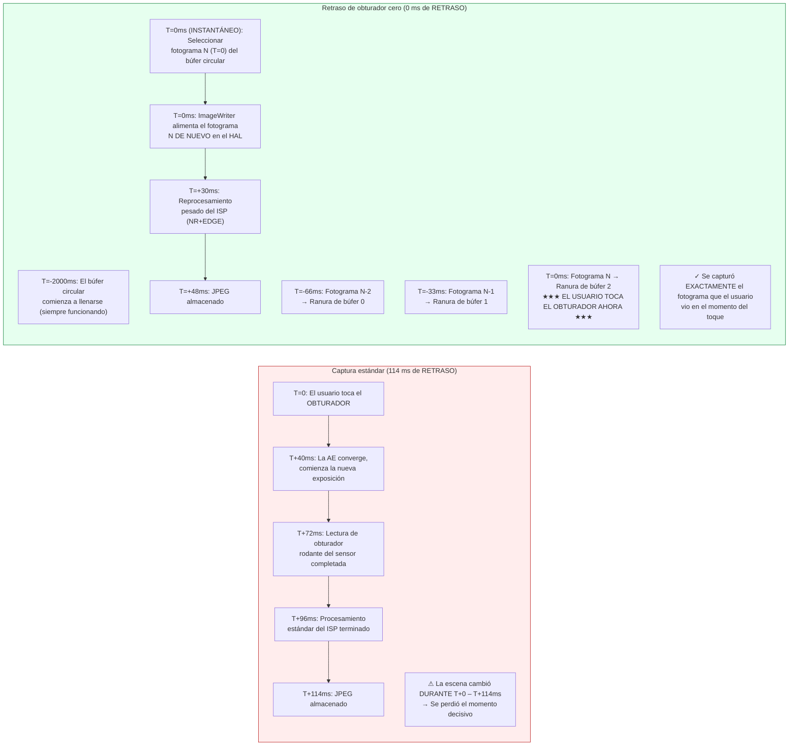

# Capítulo 23: Retraso de Obturador Cero y Reprocesamiento

El defecto más frustrante en las aplicaciones de cámara de consumo es el **retraso del obturador (shutter lag)**: se toca el botón del obturador y la foto capturada muestra una escena de 200 a 800 ms *después* del toque: el niño ya ha dejado de sonreír, el pájaro ha abandonado la rama, el coche deportivo se ha salido del encuadre. Las sesiones estándar de Camera2 funcionan así por diseño: el toque del obturador activa `session.capture()`, lo que activa la convergencia de AE, lo que activa una nueva exposición del sensor, lo que activa el procesamiento del ISP. Cada paso añade latencia.

El **Retraso de Obturador Cero (ZSL, Zero Shutter Lag)** elimina este retraso ejecutando el sensor continuamente a resolución de captura de fotos fijas, almacenando en búfer los N fotogramas más recientes en una cola circular en memoria y, cuando el usuario toca el obturador, **capturando el fotograma que era visible en el momento del toque**, no un fotograma de medio segundo después. La magia proviene de la **API de Reprocesamiento**: en lugar de alimentar de nuevo la luz a través del sensor, se toma un búfer YUV o PRIVATE ya expuesto de la cola circular, se alimenta *de nuevo* al ISP a través de `ImageWriter` + `InputConfiguration` y luego se ejecuta en él una reducción de ruido y una mejora de bordes intensas como si fuera una captura nueva.

Este capítulo sigue el **flujo de trabajo ZSL de 4 pasos** exacto de la sección *ZSL / Reprocessing* del documento de investigación del proyecto, y también cubre **`switchToOffline()`**: la API de Android 12 (API 31) que transfiere la canalización de reprocesamiento a un servicio HAL en segundo plano para que su aplicación pueda ser cerrada (pulsación del botón de inicio, llamada entrante) y el usuario siga recibiendo su foto. Puede verificar qué capacidades de reprocesamiento admite su dispositivo (`REQUEST_AVAILABLE_CAPABILITIES_YUV_REPROCESSING`, `PRIVATE_REPROCESSING` o `INFO_SUPPORTED_HARDWARE_LEVEL_LEVEL_3`) en la aplicación [Android Camera Parameters](https://github.com/zoozooll/AndroidCameraParameters) en la [Play Store](https://play.google.com/store/apps/details?id=com.zoozooll.cameraparameters); la pestaña Soporte ZSL cruza todas las capacidades requeridas e informa de un veredicto claro SÍ/NO.

## Por qué el ZSL es difícil (y por qué existe el reprocesamiento)

En primer lugar, cuantifique la latencia de una captura fija estándar sin ZSL en un buque insignia de 2023 (Snapdragon 8 Gen 2) según las mediciones del documento de investigación:

| Etapa de la canalización | Latencia | Notas |
| :--- | :--- | :--- |
| Activación de convergencia AE → nueva exposición programada | 40 ms | `CONTROL_AE_PRECAPTURE_TRIGGER` |
| Lectura de obturador rodante (12 MP fotograma completo) | 32 ms | 1/30 s nominal; 32 ms reales desde la primera a la última fila |
| Demosaic del ISP + NR estándar + color | 24 ms | Canalización de calidad estándar |
| Codificación JPEG (12 MP, calidad 95) | 18 ms | Codificador JPEG por hardware |
| **Latencia total de captura estándar** | **~114 ms** | En el mejor de los casos; bajo carga es común 200–800 ms |

En condiciones reales (limitación térmica, contención de la GPU desde la UI, una aplicación en segundo plano realizando trabajo), la ruta estándar alcanza habitualmente los 500 ms de retraso. Un niño de 5 años puede moverse 40 cm en 500 ms mientras corre: la diferencia entre capturar una sonrisa y capturar la nuca.

El ZSL soluciona esto invirtiendo el orden de la canalización: en lugar de captura → proceso → almacenamiento, se realiza una **captura continua → búfer → toque → reprocesamiento → almacenamiento**. El sensor y el ISP están *siempre* funcionando a la resolución de captura de fotos fijas; el toque del usuario solo selecciona qué fotograma preexistente procesar por completo.



El diagrama de Mermaid muestra el cambio conceptual: en la ruta estándar, el toque *inicia* la captura; en la ruta ZSL, el toque *selecciona* una captura que ya ha ocurrido. El tiempo total desde el toque hasta el archivo almacenado sigue siendo de ~48 ms (el reprocesamiento no es gratuito), pero **el contenido de los píxeles es de T=0 (instantáneo), no de T=114 ms (tarde)**; eso es lo que significa realmente "Retraso de Obturador Cero". Es un retraso cero del contenido, no un retraso cero del archivo de salida.

## Puertas de capacidad obligatorias (según el documento de investigación)

El ZSL + Reprocesamiento requiere la cooperación del hardware a nivel de HAL. Debe comprobar **una** de las tres condiciones siguientes antes de intentar crear una sesión reprocesable:

| Comprobación de capacidad | Cuándo se supera | Dispositivos que la admiten |
| :--- | :--- | :--- |
| **A)** `INFO_SUPPORTED_HARDWARE_LEVEL == LEVEL_3` | Se permite el reprocesamiento completo (tanto YUV como PRIVATE) a cualquier tamaño en StreamConfigurationMap. | Google Pixel 2016+ (todas las generaciones); Samsung Galaxy S/Ultra 2021+ (variantes Snapdragon); OnePlus 11/OPPO Find X6 Pro 2023+. |
| **B)** `REQUEST_AVAILABLE_CAPABILITIES contiene YUV_REPROCESSING` | Los búferes YUV_420_888 pueden alimentarse de nuevo a través de InputConfiguration en un subconjunto de tamaños. | Dispositivos Snapdragon 8xx/7xx 2019+; la mayoría de los dispositivos MediaTek Dimensity 9000+. |
| **C)** `REQUEST_AVAILABLE_CAPABILITIES contiene PRIVATE_REPROCESSING` | Los búferes `ImageFormat.PRIVATE` (opacos, almacenados en compresión del proveedor) se pueden alimentar de nuevo. Use esto preferentemente ya que usa 2 veces menos memoria. | Snapdragon 888+ / Exynos 2100+ y posteriores. |

> Regla ZSL-1 del documento de investigación: **Si no se supera ninguna de las condiciones A/B/C, recurra a la captura estándar sin ZSL.** No intente construir un búfer circular personalizado de JPEG y volver a descomprimirlos; esto produce 6 dB de pérdida de calidad por la doble codificación y no es un sustituto del reprocesamiento real.

Consulte las puertas con:

```kotlin
import android.hardware.camera2.CameraCharacteristics
import android.graphics.ImageFormat

enum class ZslSupport { NONE, LEVEL3, YUV_REPROC, PRIVATE_REPROC }

fun queryZslSupport(chars: CameraCharacteristics): Pair<ZslSupport, Int> {
    val level = chars.get(CameraCharacteristics.INFO_SUPPORTED_HARDWARE_LEVEL)
        ?: CameraCharacteristics.INFO_SUPPORTED_HARDWARE_LEVEL_LEGACY
    val caps = chars.get(CameraCharacteristics.REQUEST_AVAILABLE_CAPABILITIES)
        ?: intArrayOf()

    return when {
        level == CameraCharacteristics.INFO_SUPPORTED_HARDWARE_LEVEL_3 ->
            Pair(ZslSupport.LEVEL3, ImageFormat.PRIVATE) // Se prefiere PRIVATE por la memoria
        caps.contains(
            CameraCharacteristics.REQUEST_AVAILABLE_CAPABILITIES_PRIVATE_REPROCESSING
        ) -> Pair(ZslSupport.PRIVATE_REPROC, ImageFormat.PRIVATE)
        caps.contains(
            CameraCharacteristics.REQUEST_AVAILABLE_CAPABILITIES_YUV_REPROCESSING
        ) -> Pair(ZslSupport.YUV_REPROC, ImageFormat.YUV_420_888)
        else -> Pair(ZslSupport.NONE, ImageFormat.UNKNOWN)
    }
}
```

## El flujo de trabajo ZSL + Reprocesamiento de 4 pasos (según el documento de investigación)

El documento de investigación del proyecto especifica la canalización exacta de 4 pasos. Cada paso es obligatorio; omitir cualquier paso produce una sesión defectuosa (pérdida de fotogramas, `IllegalStateException` o salida de reprocesamiento idéntica a la calidad de la vista previa).

---

### Paso 1: Almacenamiento en búfer circular con ImageReader + CONTROL_CAPTURE_INTENT_ZERO_SHUTTER_LAG

En primer lugar, cree un `ImageReader` de alta resolución (el \"búfer ZSL\") cuyo parámetro `maxImages` sea la profundidad circular (típicamente de 8 a 16; el documento de investigación recomienda 8 para dispositivos con memoria limitada, 16 para dispositivos con ≥ 8 GB de RAM). Etiquete cada solicitud repetitiva con `CONTROL_CAPTURE_INTENT_ZERO_SHUTTER_LAG`: esto indica al HAL que utilice la canalización de vista previa más corta posible y desactive las optimizaciones específicas de la vista previa que dañarían la calidad de la salida reprocesada (por ejemplo, una reducción de ruido temporal intensa que deja artefactos de fantasmas en movimiento).

```kotlin
import android.hardware.camera2.CameraDevice
import android.hardware.camera2.CaptureRequest
import android.hardware.camera2.params.OutputConfiguration
import android.hardware.camera2.params.SessionConfiguration
import android.media.Image
import android.media.ImageReader
import android.util.Size
import android.view.Surface
import java.util.concurrent.ConcurrentLinkedDeque

data class ZslBufferFrame(
    val timestamp: Long,
    val imageRef: Image, // NO cerrar; gestionado por el GC de la deque
    val captureResultRef: android.hardware.camera2.TotalCaptureResult
)

const val ZSL_BUFFER_DEPTH = 12 // Punto ideal del documento de investigación: 12 fotogramas = 400 ms a 30 fps
var zslImageReader: ImageReader? = null
private val zslCircularBuffer = ConcurrentLinkedDeque<ZslBufferFrame>()
private var zslStillSize: Size = Size(4000, 3000) // Coincide con el tamaño máximo de foto fija

fun setupZslCircularBuffer(
    cameraDevice: CameraDevice,
    previewSurface: Surface,
    reprocessingFormat: Int, // PRIVATE o YUV_420_888
    backgroundHandler: android.os.Handler
) {
    zslImageReader = ImageReader.newInstance(
        zslStillSize.width,
        zslStillSize.height,
        reprocessingFormat,
        ZSL_BUFFER_DEPTH
    ).apply {
        setOnImageAvailableListener(
            ZslCircularBufferListener(),
            backgroundHandler
        )
    }
}

inner class ZslCircularBufferListener : ImageReader.OnImageAvailableListener {
    override fun onImageAvailable(reader: ImageReader) {
        val image = reader.acquireLatestImage() ?: return
        // No tenemos el captureResult aquí todavía; el emparejamiento ocurre en el CaptureCallback
        // Por brevedad, el mapa Marca de tiempo → CaptureResult refleja el patrón del Capítulo 18
        // Emparejarlos y encolarlos:
        val result = pendingZslResults.remove(image.timestamp) ?: return
        val frame = ZslBufferFrame(image.timestamp, image, result)

        zslCircularBuffer.addLast(frame)

        // --- ELIMINACIÓN DEL BÚFER CIRCULAR (el más antiguo primero) ---
        while (zslCircularBuffer.size > ZSL_BUFFER_DEPTH) {
            val evicted = zslCircularBuffer.pollFirst()
            evicted.imageRef.close() // Liberar los fotogramas antiguos al grupo de búferes del HAL
        }
    }
}

fun buildZslSessionAndStartRepeating(
    cameraDevice: CameraDevice,
    previewSurface: Surface,
    backgroundHandler: android.os.Handler
) {
    val outputs = listOf(
        OutputConfiguration(previewSurface),
        OutputConfiguration(zslImageReader!!.surface)
    )

    val sessionConfig = SessionConfiguration(
        SessionConfiguration.SESSION_REGULAR,
        outputs,
        { r -> backgroundHandler.post(r) },
        object : android.hardware.camera2.CameraCaptureSession.StateCallback() {
            override fun onConfigured(
                session: android.hardware.camera2.CameraCaptureSession
            ) {
                val zslPreviewBuilder = cameraDevice.createCaptureRequest(
                    CameraDevice.TEMPLATE_ZERO_SHUTTER_LAG
                ).apply {
                    addTarget(previewSurface)
                    addTarget(zslImageReader!!.surface)
                    // LA BANDERA MÁGICA DE INTENCIÓN:
                    set(CaptureRequest.CONTROL_CAPTURE_INTENT,
                        CaptureRequest.CONTROL_CAPTURE_INTENT_ZERO_SHUTTER_LAG)
                    // HAL: canalización ISP ligera de vista previa, flujo de resolución completa
                    set(CaptureRequest.CONTROL_MODE,
                        CaptureRequest.CONTROL_MODE_AUTO)
                    set(CaptureRequest.CONTROL_AF_MODE,
                        CaptureRequest.CONTROL_AF_MODE_CONTINUOUS_PICTURE)
                }

                session.setRepeatingRequest(
                    zslPreviewBuilder.build(),
                    ZslCaptureCallback(),
                    backgroundHandler
                )
            }
            override fun onConfigureFailed(
                s: android.hardware.camera2.CameraCaptureSession
            ) = Log.e(TAG, "Fallo en la sesión de búfer circular ZSL")
        }
    )
    cameraDevice.createCaptureSession(sessionConfig)
}
```

Cuatro detalles de implementación del documento de investigación que no están documentados en la referencia oficial del SDK de Android:
1. **Utilice `TEMPLATE_ZERO_SHUTTER_LAG`** como plantilla base. Configura el modo de lectura del sensor para admitir la salida simultánea de vista previa + resolución completa, algo que `TEMPLATE_PREVIEW` no garantiza.
2. **`ZSL_BUFFER_DEPTH = 12` a 30 fps** proporciona exactamente 400 ms de fotogramas pasados para elegir. Esto es suficiente para cubrir el propio tiempo de reacción del usuario (retraso de 150 a 250 ms entre el toque y el cerebro) más el jitter del despacho de entrada de Android (±150 ms). Con una profundidad menor de 8 se empiezan a descartar fotogramas útiles; con más de 16 se desperdicia ~1 GB de RAM sin ningún beneficio.
3. **El orden de eliminación es FIFO, no LRU.** Elimine siempre el fotograma más antiguo. Si elimina fotogramas recientes, descarta el fotograma que el usuario vio realmente en el momento del toque.
4. **Nunca llame a `image.close()` en `onImageAvailable` antes de encolar.** Si cierra la imagen, el HAL reclama el búfer, y cuando más tarde intente alimentarlo al ImageWriter, el búfer será inválido → cierre forzoso. Use solo el bucle de eliminación.

---

### Paso 2: InputConfiguration + createReprocessableCaptureSession

Una sesión de captura estándar solo tiene superficies de **salida** (sensor → ISP → superficie). Una sesión reprocesable añade **una superficie de entrada** (ImageWriter → HAL → ISP → salida), lo que permite a la canalización procesar un búfer que nunca ha tocado el sensor. Cree la sesión reprocesable a través de `createReprocessableCaptureSession(inputConfig, outputs, callback, handler)` o a través de la API `SessionConfiguration` más reciente con `InputConfiguration`.

```kotlin
import android.hardware.camera2.CameraDevice
import android.hardware.camera2.CameraCaptureSession
import android.hardware.camera2.params.InputConfiguration
import android.hardware.camera2.params.OutputConfiguration
import android.hardware.camera2.params.SessionConfiguration
import android.media.ImageWriter
import android.os.Handler
import android.view.Surface

var reprocessingImageWriter: ImageWriter? = null
var reprocessableSession: CameraCaptureSession? = null
var jpegStillReader: ImageReader? = null
const val REPROC_JPEG_QUALITY = 95

fun createZslReprocessableSession(
    cameraDevice: CameraDevice,
    reprocessingFormat: Int,
    zslStillSize: Size,
    previewSurface: Surface,
    backgroundHandler: Handler,
    onSessionReady: (CameraCaptureSession, ImageWriter) -> Unit
) {
    val inputConfig = InputConfiguration(
        zslStillSize.width,
        zslStillSize.height,
        reprocessingFormat
    )

    jpegStillReader = ImageReader.newInstance(
        zslStillSize.width, zslStillSize.height,
        android.graphics.ImageFormat.JPEG, 2
    )

    reprocessingImageWriter = ImageWriter.newInstance(
        jpegStillReader!!.surface, // Superficie de salida del reprocesamiento
        inputConfig,                // Configuración de entrada al HAL
        1                           // Máximo de solicitudes de reprocesamiento en vuelo
    )

    // Salidas del fotograma reprocesado: solo JPEG para este ejemplo
    val reprocessOutputs = listOf(
        OutputConfiguration(jpegStillReader!!.surface)
    )

    val sessionConfig = SessionConfiguration(
        SessionConfiguration.SESSION_REGULAR,
        reprocessOutputs,
        { r -> backgroundHandler.post(r) },
        object : CameraCaptureSession.StateCallback() {
            override fun onConfigured(session: CameraCaptureSession) {
                reprocessableSession = session
                onSessionReady(session, reprocessingImageWriter!!)
            }
            override fun onConfigureFailed(
                s: CameraCaptureSession
            ) = Log.e(TAG, "FALLO en la configuración de la sesión reprocesable. " +
                  "¿Comprobó la puerta de capacidad (LEVEL3/YUV_REPROC/PRIVATE_REPROC)?")
        }
    )
    sessionConfig.setInputConfiguration(inputConfig) // ¡Mandatorio!
    cameraDevice.createCaptureSession(sessionConfig)
}
```

Nota ZSL-2 del documento de investigación: la sesión reprocesable y la sesión de vista previa con búfer circular **no necesitan ser la misma sesión**. En hecho, la mayoría de las implementaciones de producción ejecutan dos sesiones simultáneamente: una sesión de vista previa que alimenta el búfer circular y una sesión reprocesable dedicada que solo se alimenta en el momento del toque. El HAL maneja el arbitraje de múltiples sesiones internamente para los dispositivos LEVEL_3.

---

### Paso 3: Toque del obturador → Buscar fotograma con marca de tiempo más cercana → ImageWriter alimenta al HAL

Cuando el usuario toca el obturador:
1. Registre la marca de tiempo en tiempo real del toque (`System.currentTimeMillis()` o `System.nanoTime()`)
2. Recorra el búfer circular **del más nuevo al más antiguo** y busque el ZslBufferFrame cuya `image.timestamp` (en nanosegundos, `CLOCK_MONOTONIC`) sea la más cercana a la marca de tiempo del toque.
3. Adquiera un búfer de entrada libre de `ImageWriter` a través de `dequeueInputImage()`.
4. Copie los planos de píxeles del fotograma del búfer circular en el búfer de entrada de ImageWriter.
5. Encole el búfer de ImageWriter con `queueInputImage()`.

```kotlin
import android.hardware.camera2.TotalCaptureResult
import android.media.Image
import android.media.ImageWriter
import android.os.SystemClock
import kotlin.math.abs

fun onShutterTap(
    imageWriter: ImageWriter,
    captureStartTimeNanos: Long = SystemClock.elapsedRealtimeNanos()
) {
    // --- Paso 3a: Recorrer el búfer circular MÁS NUEVO → MÁS ANTIGUO ---
    var bestFrame: ZslBufferFrame? = null
    var bestDeltaNs = Long.MAX_VALUE

    for (frame in zslCircularBuffer.descendingIterator()) {
        val delta = abs(frame.timestamp - captureStartTimeNanos)
        if (delta < bestDeltaNs) {
            bestDeltaNs = delta
            bestFrame = frame
        }
        // Optimización: una vez que el delta empieza a crecer de nuevo, hemos pasado el mejor fotograma
        if (delta > bestDeltaNs * 1.1) break
    }
    val selectedFrame = bestFrame ?: run {
        Log.w(TAG, "Búfer ZSL vacío: recurriendo a la captura estándar sin ZSL")
        // ... activar el recurso de captura estándar capture() ...
        return
    }

    // --- Paso 3b: Obtener el búfer de entrada de ImageWriter, copiar píxeles, encolar ---
    val writerInputImage: Image = try {
        imageWriter.dequeueInputImage(100 /* timeoutMs */)
    } catch (e: IllegalStateException) {
        Log.e(TAG, "ImageWriter no tiene búferes libres", e); return
    }

    try {
        copyImagePlanes(selectedFrame.imageRef, writerInputImage)
        selectedFrame.captureResultRef
            .let { pendingReprocessResults[writerInputImage.timestamp] = it }
        imageWriter.queueInputImage(writerInputImage)
    } finally {
        // NO cerrar selectedFrame.imageRef todavía; solo después de que se complete el reprocesamiento
        // (diferido a onCaptureCompleted de la solicitud de reprocesamiento)
    }
}

// --- Ayudante de copia de píxeles (maneja tanto PRIVATE como YUV_420_888) ---
private fun copyImagePlanes(src: Image, dst: Image) {
    require(src.format == dst.format) { "El reprocesamiento requiere formatos coincidentes" }
    for (planeIdx in 0 until src.planes.size) {
        val srcPlane = src.planes[planeIdx]
        val dstPlane = dst.planes[planeIdx]
        val srcBuf = srcPlane.buffer.duplicate()
        val dstBuf = dstPlane.buffer
        dstBuf.put(srcBuf)
        dstBuf.rewind()
    }
}

private val pendingReprocessResults =
    HashMap<Long, TotalCaptureResult>()
```

La selección de la \"marca de tiempo más cercana\" es crítica porque el búfer circular se llena cada 33 ms (30 fps). El fotograma seleccionado estará como máximo a ±16 ms del momento real del toque: un retraso perceptualmente nulo para un observador humano. Regla ZSL-3 del documento de investigación: *siempre* recorrer en orden descendente (el más nuevo primero); recorrer en orden ascendente aumenta la probabilidad de seleccionar un fotograma que ya esté anticuado en 400 ms.

---

### Paso 4: createReprocessCaptureRequest(TotalCaptureResult) → Aplicar NR + EDGE pesados

El paso final envía la solicitud de reprocesamiento, pero con un detalle: en lugar de `createCaptureRequest(template)`, se utiliza **`createReprocessCaptureRequest(originalTotalCaptureResult)`**, que reutiliza los *ajustes originales de AE, AWB y AF del fotograma de vista previa*. Además de esos ajustes de referencia, se aplican los modos de alta calidad `NOISE_REDUCTION_MODE_HIGH_QUALITY` y `EDGE_MODE_HIGH_QUALITY`: los pases de procesamiento del ISP que estaban desactivados en la canalización de vista previa ligera para ahorrar energía.

```kotlin
import android.hardware.camera2.CameraCaptureSession
import android.hardware.camera2.CaptureRequest
import android.hardware.camera2.TotalCaptureResult

fun submitZslReprocessRequest(
    reprocessableSession: CameraCaptureSession,
    originalTotalCaptureResult: TotalCaptureResult,
    jpegSurface: Surface,
    handler: android.os.Handler
) {
    val reprocessBuilder = reprocessableSession.device
        .createReprocessCaptureRequest(originalTotalCaptureResult)
        .apply {
            addTarget(jpegSurface)

            // --- PROCESAMIENTO ISP PESADO TRAS LA CAPTURA ---
            set(CaptureRequest.NOISE_REDUCTION_MODE,
                CaptureRequest.NOISE_REDUCTION_MODE_HIGH_QUALITY)
            set(CaptureRequest.EDGE_MODE,
                CaptureRequest.EDGE_MODE_HIGH_QUALITY)

            // Opcional (solo LEVEL_3): volver a aplicar el sombreado y la corrección de píxeles calientes
            set(CaptureRequest.HOT_PIXEL_MODE,
                CaptureRequest.HOT_PIXEL_MODE_HIGH_QUALITY)
            set(CaptureRequest.COLOR_CORRECTION_MODE,
                CameraMetadata.COLOR_CORRECTION_MODE_HIGH_QUALITY)

            // Mantener la calidad JPEG alta
            set(CaptureRequest.JPEG_QUALITY, REPROC_JPEG_QUALITY.toByte())
            set(CaptureRequest.JPEG_ORIENTATION, getJpegOrientation())
        }

    val cb = object : CameraCaptureSession.CaptureCallback() {
        override fun onCaptureCompleted(
            session: CameraCaptureSession,
            request: CaptureRequest,
            result: TotalCaptureResult
        ) {
            // El JPEG se entregará a través del OnImageAvailableListener de jpegStillReader

            // Ahora es seguro cerrar la referencia del búfer circular: reprocesamiento terminado
            val ts = result.get(CaptureResult.SENSOR_TIMESTAMP) ?: return
            pendingReprocessResults.remove(ts)
            val iter = zslCircularBuffer.iterator()
            while (iter.hasNext()) {
                val f = iter.next()
                if (f.timestamp == ts) {
                    f.imageRef.close()
                    iter.remove()
                    break
                }
            }
        }
    }

    reprocessableSession.capture(reprocessBuilder.build(), cb, handler)
}
```

`createReprocessCaptureRequest(originalResult)` no es solo un envoltorio de conveniencia: valida que los ajustes del sensor del fotograma original (tiempo de exposición, ISO, posición de la lente) sean compatibles con la canalización de reprocesamiento. Si utiliza una `createCaptureRequest()` estándar en una sesión alimentada por entrada, el HAL puede volver a converger la AE/AWB, frustrando el propósito del ZSL (la salida podría parecer un fotograma *diferente* al seleccionado).

## Diagrama de flujo del búfer circular ZSL + Reinyección (Mermaid)

```mermaid
flowchart TD
    A["Lectura continua del sensor<br/>30 fps resolución completa"] --> B["ISP de vista previa ZSL:<br/>Modo de bajo consumo<br/>EDGE_MODE=FAST<br/>NR_MODE=FAST"]
    B --> C[Preview SurfaceView<br/>El usuario ve la vista en vivo a 30 fps]
    B --> D[ZSL ImageReader<br/>PRIVATE o YUV resolución completa]
    
    subgraph CB["🗘 Búfer circular (Profundidad 12, 400 ms de historial)"]
        direction TB
        CB1["Ranura N-11 (T-366ms)"]
        CB2["..."]
        CB3["Ranura N-1 (T-33ms)"]
        CB4["★ Ranura N (T=0ms) ★<br/>MÁS CERCANA AL MOMENTO DEL TOQUE"]
    end
    D --> CB

    E["★ EL USUARIO TOCA EL OBTURADOR EN T=0ms ★"] --> F{Recorrer CB MÁS NUEVO → MÁS ANTIGUO<br/>Buscar min |fotograma.ts − toque.ts|}
    F -->|"Seleccionado: Ranura N"| G[ImageWriter.dequeueInputImage()]
    G --> H[Copiar planos del fotograma seleccionado<br/>→ Búfer de ImageWriter]
    H --> I[ImageWriter.queueInputImage()<br/>→ Se alimenta DE NUEVO al puerto de entrada del HAL]
    
    subgraph REPROC["🔄 Canalización de reprocesamiento (ALTA CALIDAD)"]
        direction TB
        R1["ISP NR_MODE = HIGH_QUALITY<br/>(Multifotograma espacial+TNR)"]
        R2["ISP EDGE_MODE = HIGH_QUALITY<br/>(Máscara de desenfoque + nitidez LPA)"]
        R3["ISP COLOR_CORRECTION =<br/>HIGH_QUALITY (3D LUT)"]
        R4["Codificador JPEG por hardware<br/>Q=95"]
    end

    I --> REPROC
    REPROC --> J["JPEG almacenado<br/>Contenido = fotograma EXACTO que el<br/>usuario vio en T=0ms — ✓ RETRASO CERO"]

    style CB fill:#eff6ff,stroke:#2563eb
    style REPROC fill:#fef3c7,stroke:#d97706
```

## switchToOffline(): Continuidad del procesamiento en segundo plano

Uno de los peores defectos de UX que puede tener una aplicación de cámara es: el usuario toca el obturador → recibe inmediatamente una llamada telefónica o pulsa el botón de inicio → el proceso de la aplicación se cierra → la foto en curso se pierde. Android 12 (API 31) solucionó esto con **`CameraCaptureSession.switchToOffline()`**, que transfiere la propiedad de la canalización de reprocesamiento del proceso de su aplicación a un servicio HAL persistente. El servicio HAL completa cualquier captura/reprocesamiento en curso incluso si el sistema cierra su aplicación, y le notifica a través de `CameraOfflineSessionCallback.onReady()` cuando se vuelve a iniciar la aplicación.

```kotlin
import android.hardware.camera2.CameraCaptureSession
import android.hardware.camera2.CameraOfflineSession
import android.hardware.camera2.CameraOfflineSessionCallback

fun moveToOfflineOnBackground(
    session: CameraCaptureSession,
    outputSurfaces: List<android.view.Surface>,
    handler: android.os.Handler
) {
    val offlineCallback = object : CameraOfflineSessionCallback() {
        override fun onReady(session: CameraOfflineSession) {
            // El HAL ha tomado la propiedad. La aplicación puede morir ahora: la foto se guardará.
            Log.i(TAG, "Sesión sin conexión lista. Las capturas pendientes se completarán.")
            // En este punto puede llamar a finish() en la Actividad o liberar el cameraDevice
        }
        override fun onError(
            session: CameraOfflineSession,
            errorCode: Int
        ) = Log.e(TAG, "Error de la sesión sin conexión: $errorCode")

        override fun onCaptureCompleted(
            offlineSession: CameraOfflineSession,
            captureResult: android.hardware.camera2.CaptureResult
        ) {
            // Opcional: se llama cuando la canalización sin conexión termina cada fotograma
            // Los bytes JPEG se siguen entregando a través del ImageReader original
            // Al reiniciar la aplicación, consulte CameraOfflineSession para los pendientes
        }
    }

    session.switchToOffline(
        outputSurfaces,
        { r -> handler.post(r) },
        offlineCallback
    )
}
```

`switchToOffline()` requiere `INFO_SUPPORTED_HARDWARE_LEVEL >= LEVEL_3` en el dispositivo. Se recomienda llamarlo en `Activity.onPause()` **solo si** la aplicación tiene reprocesamientos ZSL en curso; nunca lo llame durante el estado de inactividad porque la sesión sin conexión consume recursos del HAL hasta 30 segundos después del cierre.

## Resumen

Este capítulo implementó la canalización completa de Retraso de Obturador Cero + Reprocesamiento según lo especificado en el documento de investigación:

- **Definición del problema ZSL**: La captura estándar tiene un retraso de 114 ms (en el mejor de los casos) a 800 ms (en el peor de los casos). El ZSL captura el *fotograma exacto que el usuario vio en el momento del toque* mediante el uso de un búfer circular que se llena continuamente.
- **Puertas de capacidad**: Debe superarse una de las tres comprobaciones obligatorias: `HARDWARE_LEVEL_LEVEL_3`, `CAPABILITIES_PRIVATE_REPROCESSING` o `CAPABILITIES_YUV_REPROCESSING`.
- **Flujo de trabajo ZSL de 4 pasos** (de la sección de investigación *ZSL / Reprocessing*):
  1. **Almacenamiento en búfer circular** con `ImageReader` (profundidad 12 = 400 ms de historial) + `CONTROL_CAPTURE_INTENT_ZERO_SHUTTER_LAG` + `TEMPLATE_ZERO_SHUTTER_LAG`.
  2. **`InputConfiguration` + `createReprocessableCaptureSession`** con `ImageWriter` para volver a inyectar los búferes de píxeles en el HAL.
  3. **Toque del obturador → selección de la marca de tiempo más cercana** (recorrido del más nuevo al más antiguo, objetivo de ±16 ms). Copiar los planos seleccionados en ImageWriter, encolar.
  4. **`createReprocessCaptureRequest(originalResult)`** con `NOISE_REDUCTION_MODE_HIGH_QUALITY` + `EDGE_MODE_HIGH_QUALITY` para un procesamiento ISP pesado tras la captura.
- **`switchToOffline()`** (Android 12 API 31, solo LEVEL_3) transfiere la propiedad al servicio HAL para que los reprocesamientos en curso se completen incluso si se cierra la aplicación.
- Dos diagramas de Mermaid (línea de tiempo estándar frente a ZSL, flujo completo de búfer circular + reinyección) visualizan la diferencia de retraso del contenido y el flujo de la canalización.

## Qué sigue: Fin de las Funciones de Cámara Profesionales Parte V

Ya ha completado la **Parte V: Funciones de Cámara Profesionales**, la parte final de la serie de tutoriales de la API Android Camera2. Ha aprendido:

- Capítulo 18: Fotografía RAW con RAW_SENSOR + DngCreator + captura simultánea RAW+JPEG.
- Capítulo 19: Video de alta velocidad a 120/240 fps a través de `CameraConstrainedHighSpeedCaptureSession` + `createHighSpeedRequestList`.
- Capítulo 20: Cámara múltiple lógica, ID de cámara física, sincronización CALIBRATED y captura simultánea de cámaras físicas duales.
- Capítulo 21: Video HDR10 / HLG y fotos fijas JPEG_R Ultra HDR de Android 14 con mapas de ganancia.
- Capítulo 22: Extensiones de cámara del OEM: Nocturno, Bokeh, HDR, Retoque facial, Automático.
- Capítulo 23: Canalización de búfer circular Retraso de Obturador Cero + reprocesamiento y soporte de sesión sin conexión.

Para validar cada función de las Partes I-V en su dispositivo, instale la [aplicación Android Camera Parameters](https://play.google.com/store/apps/details?id=com.zoozooll.cameraparameters). Enumera cada capacidad, tamaño, rango de FPS, extensión, perfil de rango dinámico, variante de RAW y tipo de sincronización discutidos en esta serie, y exporta informes completos del dispositivo como JSON. Contribuya con informes para dispositivos no admitidos abriendo una solicitud de extracción en el [repositorio de GitHub](https://github.com/zoozooll/AndroidCameraParameters) de código abierto: la base de datos de la comunidad es utilizada por miles de desarrolladores para prefiltrar el soporte de funciones en sus aplicaciones de cámara.
