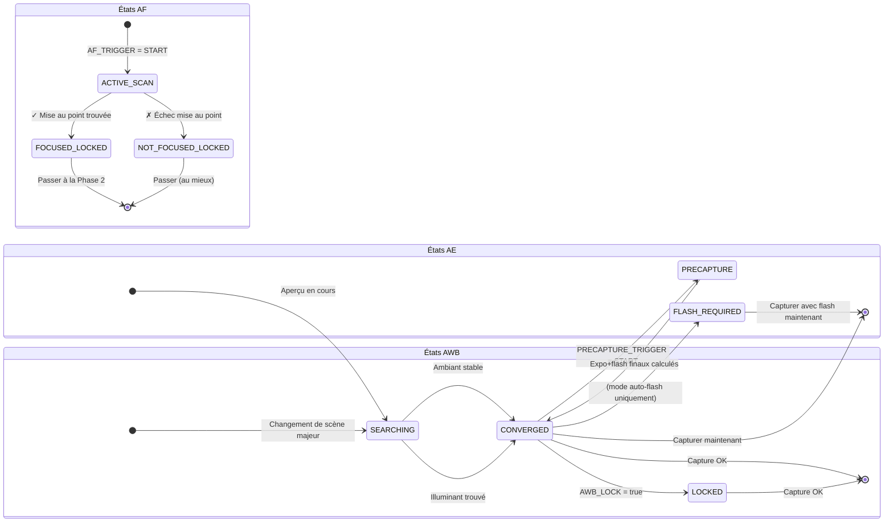

# Chapitre 17 : Le pipeline 3A

Nous avons étudié l'**AE** (Exposition automatique, Chapitres 13–14), l'**AF** (Mise au point automatique, Chapitre 15) et l'**AWB** (Balance des blancs automatique, Chapitre 16) comme des systèmes indépendants. Les applications de photographie réelles doivent coordonner ces trois éléments avant chaque pression sur l'obturateur — et l'*ordre et le minutage* comptent énormément.

Une implémentation naïve qui lance `capture()` immédiatement lorsque l'utilisateur appuie sur le bouton produit des résultats incohérents : parfois la mise au point est faite, parfois non ; parfois le flash se déclenche, parfois non ; parfois une balance des blancs en cours de calcul donne une photo teintée de vert. Un pipeline 3A fiable élimine tout cela.

L'implémentation du pipeline 3A dans ce chapitre est identique au flux utilisé en interne dans l'application [Android Camera Parameters](https://github.com/zoozooll/AndroidCameraParameters) et à la séquence décrite dans les documents de recherche sur l'architecture des caméras Android et les articles CSDN sur le développement Camera2 professionnel.

---

## La séquence complète d'orchestration 3A (Aperçu)

Avant de plonger dans chaque sous-système, visualisons le flux d'états complet. Il s'agit d'une séquence de production réelle — pas d'une simplification.

```mermaid
sequenceDiagram
    actor User
    participant App as CaptureController
    participant HAL as Camera2 HAL
    participant AE as Moteur AE
    participant AF as Moteur AF
    participant AWB as Moteur AWB

    User->>App: Appuie sur le bouton "Capturer"
    App->>HAL: Régler AF_MODE = AUTO (ou MACRO)
    App->>HAL: CONTROL_AF_TRIGGER = START
    Note over HAL,AF: Le balayage de mise au point commence

    loop Chaque image d'aperçu
        HAL-->>App: CaptureResult
        App->>App: Vérifier AF_STATE
    end

    AF-->>HAL: Verrouillage AF atteint
    HAL-->>App: AF_STATE = FOCUSED_LOCKED ✓
    Note over App,AE: Mise au point stable → passage au pré-déclenchement AE

    App->>HAL: CONTROL_AE_PRECAPTURE_TRIGGER = START
    Note over HAL,AE: Balayage de mesure de pré-capture<br/>(si le mode flash le nécessite, déclenche<br/>un pré-flash pour la mesure)

    loop Chaque image d'aperçu
        HAL-->>App: CaptureResult
        App->>App: Vérifier AE_STATE &amp; FLASH_STATE
    end

    AE-->>HAL: AE convergé ; exposition finale décidée
    HAL-->>App: AE_STATE = CONVERGED (+ FLASH_STATE = READY si nécessaire) ✓
    AWB-->>HAL: AWB_STATE = CONVERGED (généralement déjà fait)
    Note over App: Tous les 3A ont convergé ! CAPTURE SÛRE

    App->>HAL: Requête de capture fixe (TEMPLATE_STILL_CAPTURE)
    HAL->>HAL: Déclencher le flash principal si nécessaire
    HAL->>HAL: Exposer le capteur, lire l'image
    HAL-->>App: Image JPEG / RAW livrée via ImageReader

    App->>HAL: CONTROL_AF_TRIGGER = CANCEL
    App->>HAL: CONTROL_AE_PRECAPTURE_TRIGGER = IDLE
    App->>HAL: Restaurer AF_MODE = CONTINUOUS_PICTURE
    Note over App,HAL: Nettoyage : l'aperçu reprend son fonctionnement auto normal
```

**Chaque étape est bloquante.** Vous ne passez pas à l'étape N+1 tant que le HAL ne confirme pas l'état requis à l'étape N. Ne sautez jamais d'étapes — c'est ainsi que vous livrerez une application avec des mises au point aléatoirement molles, de mauvaises expositions au flash ou des photos teintées de bleu.

---

## Plongée au cœur de l'AE (Exposition automatique)

L'AE est le plus complexe des trois A car il englobe non seulement l'obturateur+ISO mais aussi la **mesure au flash** et le **pré-déclenchement (precapture trigger)**.

### Modes AE : CONTROL_AE_MODE

| Mode | Comportement | Support du flash |
|------|--------------|------------------|
| `OFF` | Entièrement manuel (couvert au Ch. 14) | Aucun |
| `ON` | Exposition automatique, **flash désactivé** (arrêt permanent) | Non |
| `ON_AUTO_FLASH` | Exposition auto, **décision auto du flash** — le HAL ne déclenche le flash qu'en basse lumière | Auto (défaut le plus courant) |
| `ON_ALWAYS_FLASH` | Exposition auto, **le flash se déclenche toujours** (flash de remplissage pour les portraits à contre-jour) | Toujours |
| `ON_AUTO_FLASH_REDEYE` | Exposition auto + flash + réduction des yeux rouges (déclenche une séquence de pré-flash pour fermer les pupilles) | Auto + yeux rouges |
| `ON_EXTERNAL_FLASH` | Flash accessoire de caméra externe | Externe uniquement (rare) |

**Le réglage par défaut d'une application caméra normale** est `ON_AUTO_FLASH`. Les utilisateurs s'attendent à ce que le téléphone "sache" quand déclencher le flash.

### États AE et pré-déclenchement

Comme l'AF, l'AE rapporte son état via `CaptureResult.CONTROL_AE_STATE` :

| État | Signification |
|-------|---------------|
| `INACTIVE` (0) | AE désactivé ou n'a pas commencé |
| `SEARCHING` (1) | Recherche active de l'exposition correcte |
| `CONVERGED` (2) | L'exposition est stable. Dans les modes flash, cela signifie que l'exposition *ambiante* a convergé, mais qu'un balayage de pré-flash n'a pas encore eu lieu. |
| `LOCKED` (3) | Exposition explicitement verrouillée via `CONTROL_AE_LOCK = true` |
| `FLASH_REQUIRED` (4) | Convergé sur l'ambiant, et le HAL a décidé que **le flash est nécessaire** pour un cliché correct |
| `PRECAPTURE` (5) | **État clé.** Le balayage de pré-capture est en cours — le HAL mesure (en déclenchant des impulsions de pré-flash, si le flash est nécessaire) pour calculer l'exposition finale et la puissance du flash. |

### Pourquoi le pré-déclenchement (precapture trigger) est primordial

Le moteur AE qui tourne sur les images d'aperçu est *approximatif*. Le pipeline d'aperçu utilise des tampons plus petits, un traitement à plus faible profondeur de bits et ne tient pas compte de l'apport massif de lumière d'un flash principal se déclenchant au moment de la capture.

`CONTROL_AE_PRECAPTURE_TRIGGER = START` dit au HAL :

> "Je m'apprête à prendre une vraie photo fixe. Arrête les approximations. Exécute le pipeline de mesure de haute précision. Si je suis dans un mode flash auto, déclenche un ou plusieurs pré-flashs de faible puissance, mesure la réflexion et calcule l'obturateur/ISO/puissance du flash exacts pour la capture."

**Sauter la pré-capture = les photos au flash sont aléatoirement sur-exposées ou sous-exposées.** Le HAL n'a tout simplement pas eu la chance de mesurer pour le flash en temps réel.

### Régions AE (Mesure spot)

Tout comme `CONTROL_AF_REGIONS` pour la mise au point, `CONTROL_AE_REGIONS` spécifie *où dans la scène* effectuer la mesure. Un appui pour faire la mise au point sur un portrait doit appliquer simultanément la même région à l'AE — le visage reçoit la priorité de mise au point ET la priorité d'exposition, et n'est pas mesuré en fonction du ciel lumineux à l'arrière-plan.

```kotlin
// Utiliser le MÊME tableau MeteringRectangle pour les régions AF et AE
val focusWeightedRegions = arrayOf(userTapRegion)
builder.set(CaptureRequest.CONTROL_AF_REGIONS, focusWeightedRegions)
builder.set(CaptureRequest.CONTROL_AE_REGIONS, focusWeightedRegions)
```

**Pondération :** Chaque `MeteringRectangle` a un `poids` (0–1000). Les régions ayant un poids plus élevé influencent davantage la mesure. Un mode "mesure spot" utilise un rectangle à poids élevé (1000). Une mesure "matricielle / évaluative" utilise de nombreux rectangles à faible poids répartis sur l'image.

---

## L'AWB : Le partenaire silencieux du trio

L'AWB converge généralement tôt et reste convergé dans la plupart des scènes — c'est pourquoi il est souvent traité comme une formalité. Mais sa contribution à la fidélité des couleurs est critique, et il *peut* encore être en train de chercher quand vous êtes prêt à capturer.

### Rappel des états AWB

| État AWB | Décision de capture |
|-----------|---------------------|
| `INACTIVE` (AWB_MODE = OFF) | OK pour continuer (gains manuels) |
| `SEARCHING` | **Attendre.** Les couleurs peuvent encore changer. Généralement < 500ms après un changement de scène majeur. |
| `CONVERGED` | ✅ Parfait — continuer |
| `LOCKED` | ✅ Aussi parfait — explicitement verrouillé via `CONTROL_AWB_LOCK = true` |

### Couplage du verrouillage AWB avec les verrouillages AE/AF

Pour la photographie de studio ou de produit critique, verrouillez les trois *avant* la capture :

```kotlin
// Dans la requête de capture fixe (pas avant — on veut les valeurs finales convergées verrouillées)
builder.set(CaptureRequest.CONTROL_AWB_LOCK, true)
builder.set(CaptureRequest.CONTROL_AE_LOCK, true)
// L'AF reste verrouillé car nous l'avons déclenché plus tôt et ne l'avons pas annulé
```

Ceci garantit que la capture principale réutilise *exactement* le même profil couleur/wb que celui utilisé par l'image finale de mesure de pré-capture.

---

## Contrôleur de capture 3A de production complet (Kotlin)

Assemblons maintenant tout cela dans une classe réutilisable. Cette implémentation correspond au flux d'orchestration décrit dans la section 3A Control Pipeline des documents de recherche sur l'architecture Camera d'Android et aux modèles recommandés par la série CSDN Android Camera.

```kotlin
class ThreeACaptureController(
    private val characteristics: CameraCharacteristics,
    private val captureSession: CameraCaptureSession,
    private val previewSurface: Surface,
    private val jpegReaderSurface: Surface,
    private val mainHandler: Handler
) {
    // ----------- API Publique -----------
    interface CaptureListener {
        fun onCaptureStarted() {}
        fun onCaptureSuccess(jpegBytes: ByteArray)
        fun onCaptureError(reason: String)
    }

    /**
     * Orchestrer la séquence complète de capture 3A :
     *   Déclencheur AF → AF verrouillé → Pré-capture AE → AE convergé → Capture fixe → Nettoyage
     */
    fun captureStillPhoto(
        aeMode: Int = CameraMetadata.CONTROL_AE_MODE_ON_AUTO_FLASH,
        listener: CaptureListener
    ) {
        this.listener = listener
        listener.onCaptureStarted()
        beginPhase1_AfTrigger(aeMode)
    }

    // ----------- État interne -----------
    private var listener: CaptureListener? = null
    private var timeoutRunnable: Runnable? = null
    private var phase: Int = 0
    private lateinit var currentAeMode: Int

    private val SESSION_TIMEOUT_MS = 3500L  // Les téléphones budget ont besoin jusqu'à ~3s

    // ---- PHASE 1 : Déclenchement AF, attente de FOCUSED_LOCKED ----
    private fun beginPhase1_AfTrigger(aeMode: Int) {
        currentAeMode = aeMode
        phase = 1

        val request = captureSession.device.createCaptureRequest(
            CameraDevice.TEMPLATE_PREVIEW
        ).apply {
            addTarget(previewSurface)

            set(CaptureRequest.CONTROL_AF_MODE,
                CameraMetadata.CONTROL_AF_MODE_AUTO)
            set(CaptureRequest.CONTROL_AE_MODE, aeMode)
            set(CaptureRequest.CONTROL_AWB_MODE,
                CameraMetadata.CONTROL_AWB_MODE_AUTO)

            // Lancer le balayage AF ponctuel
            set(CaptureRequest.CONTROL_AF_TRIGGER,
                CameraMetadata.CONTROL_AF_TRIGGER_START)
        }

        startTimeout("AF scan")
        captureSession.setRepeatingRequest(request.build(), captureCallback, mainHandler)
    }

    // ---- PHASE 2 : AF verrouillé. Démarrer le déclencheur de pré-capture AE ----
    private fun beginPhase2_AePrecapture() {
        phase = 2
        val request = captureSession.device.createCaptureRequest(
            CameraDevice.TEMPLATE_PREVIEW
        ).apply {
            addTarget(previewSurface)

            // Garder l'AF verrouillé — ne PAS annuler le déclencheur AF encore !
            set(CaptureRequest.CONTROL_AF_MODE,
                CameraMetadata.CONTROL_AF_MODE_AUTO)
            // AF_TRIGGER reste dans l'état START de la Phase 1

            set(CaptureRequest.CONTROL_AE_MODE, currentAeMode)

            // ---- LA LIGNE CRITIQUE : Lancer la pré-capture ----
            set(CaptureRequest.CONTROL_AE_PRECAPTURE_TRIGGER,
                CameraMetadata.CONTROL_AE_PRECAPTURE_TRIGGER_START)

            set(CaptureRequest.CONTROL_AWB_MODE,
                CameraMetadata.CONTROL_AWB_MODE_AUTO)
        }

        restartTimeout("AE precapture")
        captureSession.setRepeatingRequest(request.build(), captureCallback, mainHandler)
    }

    // ---- PHASE 3 : AE convergé + AWB convergé. Lancer la capture fixe réelle. ----
    private fun beginPhase3_StillCapture() {
        phase = 3
        cancelTimeout()

        val request = captureSession.device.createCaptureRequest(
            CameraDevice.TEMPLATE_STILL_CAPTURE
        ).apply {
            addTarget(previewSurface)
            addTarget(jpegReaderSurface)

            // Garder l'AF verrouillé jusqu'APRÈS la fin de la capture
            set(CaptureRequest.CONTROL_AF_MODE,
                CameraMetadata.CONTROL_AF_MODE_AUTO)

            set(CaptureRequest.CONTROL_AE_MODE, currentAeMode)

            // Verrouiller l'AE et l'AWB pour la capture fixe pour éviter une dérive de dernière image
            set(CaptureRequest.CONTROL_AE_LOCK, true)
            set(CaptureRequest.CONTROL_AWB_LOCK, true)

            set(CaptureRequest.CONTROL_AWB_MODE,
                CameraMetadata.CONTROL_AWB_MODE_AUTO)

            set(CaptureRequest.JPEG_QUALITY, 95)
            // Orientation JPEG : utiliser la rotation Display pour une orientation finale correcte
            val jpegOrient = computeJpegOrientation()
            set(CaptureRequest.JPEG_ORIENTATION, jpegOrient)
        }

        captureSession.capture(request.build(), object : CameraCaptureSession.CaptureCallback() {
            override fun onCaptureCompleted(
                session: CameraCaptureSession,
                request: CaptureRequest,
                result: TotalCaptureResult
            ) {
                super.onCaptureCompleted(session, request, result)
                // L'ImageReader OnImageAvailableListener gérera l'enregistrement des octets vers l'écouteur
                // Maintenant, nettoyer : revenir en mode aperçu normal
                resetToContinuousPreview()
            }
        }, mainHandler)
    }

    // ---- Nettoyage : Reprendre l'aperçu continu normal ----
    private fun resetToContinuousPreview() {
        phase = 0
        val request = captureSession.device.createCaptureRequest(
            CameraDevice.TEMPLATE_PREVIEW
        ).apply {
            addTarget(previewSurface)
            set(CaptureRequest.CONTROL_AF_MODE,
                CameraMetadata.CONTROL_AF_MODE_CONTINUOUS_PICTURE)
            set(CaptureRequest.CONTROL_AE_MODE, currentAeMode)
            set(CaptureRequest.CONTROL_AWB_MODE,
                CameraMetadata.CONTROL_AWB_MODE_AUTO)

            // Relâcher tous les verrous et annuler tous les déclencheurs
            set(CaptureRequest.CONTROL_AF_TRIGGER,
                CameraMetadata.CONTROL_AF_TRIGGER_CANCEL)
            set(CaptureRequest.CONTROL_AE_PRECAPTURE_TRIGGER,
                CameraMetadata.CONTROL_AE_PRECAPTURE_TRIGGER_IDLE)
            set(CaptureRequest.CONTROL_AE_LOCK, false)
            set(CaptureRequest.CONTROL_AWB_LOCK, false)
        }
        captureSession.setRepeatingRequest(request.build(), null, mainHandler)
    }

    // ----------- Rappel maître : Pilote les 3 phases via l'inspection des états -----------
    private val captureCallback = object : CameraCaptureSession.CaptureCallback() {
        override fun onCaptureCompleted(
            session: CameraCaptureSession,
            request: CaptureRequest,
            result: TotalCaptureResult
        ) {
            val afState = result.get(CaptureResult.CONTROL_AF_STATE)
            val aeState = result.get(CaptureResult.CONTROL_AE_STATE)
            val awbState = result.get(CaptureResult.CONTROL_AWB_STATE)

            when (phase) {
                1 -> {
                    // ---- PHASE 1 : Attendre le verrouillage AF ----
                    when (afState) {
                        CaptureResult.CONTROL_AF_STATE_FOCUSED_LOCKED -> {
                            Log.d("3A", "✓ AF FOCUSED_LOCKED — passage à la pré-capture AE")
                            beginPhase2_AePrecapture()
                        }
                        CaptureResult.CONTROL_AF_STATE_NOT_FOCUSED_LOCKED -> {
                            Log.w("3A", "⚠ AF NOT_FOCUSED_LOCKED — on continue quand même (peut être flou)")
                            beginPhase2_AePrecapture()
                        }
                        // ACTIVE_SCAN / PASSIVE_SCAN → continuer à attendre
                    }
                }
                2 -> {
                    // ---- PHASE 2 : Attendre que l'AE converge après la pré-capture ----
                    // Accepter les états qui signifient "l'AE a fini sa pré-capture et est prêt"
                    val aeReady = (aeState == CaptureResult.CONTROL_AE_STATE_CONVERGED
                                || aeState == CaptureResult.CONTROL_AE_STATE_LOCKED
                                || aeState == CaptureResult.CONTROL_AE_STATE_FLASH_REQUIRED)
                    val awbReady = (awbState == CaptureResult.CONTROL_AWB_STATE_CONVERGED
                                 || awbState == CaptureResult.CONTROL_AWB_STATE_LOCKED
                                 || awbState == CaptureResult.CONTROL_AWB_STATE_INACTIVE)

                    if (aeReady && awbReady) {
                        Log.d("3A", "✓ AE=$aeState, AWB=$awbState — lancement de la capture")
                        beginPhase3_StillCapture()
                    }
                }
            }
        }
    }

    // ----------- Protection contre le délai d'attente : Ne jamais bloquer si le HAL ne converge jamais -----------
    private fun startTimeout(phaseName: String) {
        cancelTimeout()
        timeoutRunnable = Runnable {
            Log.w("3A", "⏱ Délai d'attente dépassé pour $phaseName — poursuite au mieux")
            when (phase) {
                1 -> beginPhase2_AePrecapture()  // Continuer avec la meilleure mise au point possible
                2 -> beginPhase3_StillCapture()  // Continuer avec la meilleure exposition possible
            }
        }
        mainHandler.postDelayed(timeoutRunnable!!, SESSION_TIMEOUT_MS)
    }
    private fun restartTimeout(phaseName: String) = startTimeout(phaseName)
    private fun cancelTimeout() {
        timeoutRunnable?.let { mainHandler.removeCallbacks(it) }
        timeoutRunnable = null
    }

    // ----------- Utilitaire : Correction de l'orientation JPEG basée sur la rotation Display -----------
    private fun computeJpegOrientation(): Int {
        val sensorOrient = characteristics.get(
            CameraCharacteristics.SENSOR_ORIENTATION
        ) ?: 0
        // Combiner avec Display.rotation (0, 90, 180, 270) de votre Activity
        // Implémentation typique : return (sensorOrient + displayRotationDegrees) % 360
        return sensorOrient  // Simplifié ; à relier à la rotation de votre affichage
    }
}
```

### Comment utiliser le contrôleur

```kotlin
// Dans le listener de clic du bouton de capture de votre CameraFragment
val controller = ThreeACaptureController(
    characteristics = vosCameraCharacteristics,
    captureSession = votreSessionActive,
    previewSurface = previewView.surface,
    jpegReaderSurface = jpegImageReader.surface,
    mainHandler = votreCameraHandler
)

controller.captureStillPhoto(
    aeMode = CameraMetadata.CONTROL_AE_MODE_ON_AUTO_FLASH
) {
    override fun onCaptureSuccess(jpegBytes: ByteArray) {
        lifecycleScope.launch(Dispatchers.IO) {
            val file = File(requireContext().filesDir, "photo_${System.currentTimeMillis()}.jpg")
            file.writeBytes(jpegBytes)
            withContext(Dispatchers.Main) {
                Toast.makeText(requireContext(), "Enregistré : ${file.name}", Toast.LENGTH_SHORT).show()
            }
        }
    }
    override fun onCaptureError(reason: String) {
        Toast.makeText(requireContext(), "Échec de la capture : $reason", Toast.LENGTH_LONG).show()
    }
}
```

### Association avec ImageReader

N'oubliez pas l'`OnImageAvailableListener` sur votre `ImageReader` JPEG pour livrer réellement `jpegBytes` à l'écouteur. Le contrôleur ci-dessus suppose que vous avez déjà câblé ceci :

```kotlin
// À configurer lors de la création de l'ImageReader (voir Chapitre Capture)
jpegImageReader.setOnImageAvailableListener({ reader ->
    val image = reader.acquireLatestImage() ?: return@setOnImageAvailableListener
    image.use {
        val buffer = it.planes[0].buffer
        val bytes = ByteArray(buffer.remaining())
        buffer.get(bytes)
        // Livrer les octets à votre interface utilisateur / enregistreur de fichier
        lastCaptureListener?.onCaptureSuccess(bytes)
    }
}, mainHandler)
```

---

## Nuances de gestion spécifique au flash

Pour les modes `ON_AUTO_FLASH` / `ON_ALWAYS_FLASH` / `ON_AUTO_FLASH_REDEYE`, le déclencheur de pré-capture lance des impulsions de pré-flash. Deux considérations importantes :

1. **Visibilité de l'impulsion de pré-flash :** Les pré-flashs sont de *vrais flashs* — l'utilisateur les voit comme une impulsion de flash à faible luminosité avant le flash principal. La plupart des interfaces utilisateur de caméras modernes cachent cela avec une "animation de bouton d'obturateur" ou en assombrissant l'aperçu.

2. **`FLASH_STATE` doit être READY :** En plus d'`AE_STATE = CONVERGED`, vérifiez `CaptureResult.FLASH_STATE = FLASH_STATE_READY` (ou `FIRED`) pour les modes flash avant la capture. Il est possible que l'AE converge mais que le condensateur de charge du flash soit encore en train de monter en puissance.

```kotlin
// Vérification aeReady améliorée dans le rappel de la Phase 2 pour les modes flash :
val aeState = result.get(CaptureResult.CONTROL_AE_STATE)
val flashState = result.get(CaptureResult.FLASH_STATE)

val flashModeWantsFlash = (currentAeMode == CameraMetadata.CONTROL_AE_MODE_ON_ALWAYS_FLASH ||
                          (currentAeMode == CameraMetadata.CONTROL_AE_MODE_ON_AUTO_FLASH &&
                           aeState == CaptureResult.CONTROL_AE_STATE_FLASH_REQUIRED))

val aeReady = when {
    flashModeWantsFlash -> {
        // Le HAL doit avoir à la fois l'AE convergé ET le flash prêt à se déclencher
        (aeState == CaptureResult.CONTROL_AE_STATE_CONVERGED
         || aeState == CaptureResult.CONTROL_AE_STATE_FLASH_REQUIRED) &&
        (flashState == CaptureResult.FLASH_STATE_READY
         || flashState == CaptureResult.FLASH_STATE_FIRED)
    }
    else -> {
        // Mode sans flash : une simple convergence AE suffit
        (aeState == CaptureResult.CONTROL_AE_STATE_CONVERGED
         || aeState == CaptureResult.CONTROL_AE_STATE_LOCKED)
    }
}
```

---

## La machine de transition d'états 3A (Diagramme de synthèse)

Pour une référence rapide lors du débogage, voici le diagramme d'états combiné de l'AE, de l'AF et de l'AWB montrant les transitions attendues lors d'une capture réussie.



Le contrôleur global ne passe à la capture fixe que lorsque l'état final "capture OK" est atteint simultanément sur les trois sous-états.

---

## Dépannage du pipeline 3A

| Symptôme | Cause racine | Solution |
|----------|--------------|----------|
| Photos au flash sous/sur-exposées au hasard | Oubli de `AE_PRECAPTURE_TRIGGER = START` | Toujours lancer la pré-capture avant la capture fixe dans n'importe quel mode flash |
| Une photo sur 5 ou 10 est légèrement floue | Capture lancée avant `FOCUSED_LOCKED` | Bloquer sur l'état AF (notre contrôleur fait cela) |
| La caméra se fige puis plante | Pas de timeout ; le HAL reste sur SEARCHING à jamais | Ajouter le délai d'attente de 3500ms + le repli au mieux comme montré |
| Le flash se déclenche mais la photo est sombre | Capture lancée avant `FLASH_STATE = READY` | Condensateur en charge ; ajouter la vérification FLASH_STATE dans la condition AE prêt |
| Le portrait d'une personne à contre-jour est sous-exposé | L'AE a mesuré le ciel, pas le visage | Coupler `CONTROL_AE_REGIONS` au même rectangle d'appui que `CONTROL_AF_REGIONS` |
| Décalage de teinte de 2° entre les images d'une rafale | Oubli de `AWB_LOCK = true` avant la rafale | Verrouiller l'AWB sur la première image convergée ; garder verrouillé pendant la rafale |
| Séquence de capture lente sur téléphone budget | `TEMPLATE_STILL_CAPTURE` démarre un pipeline froid | Préchauffer avec un `TEMPLATE_PREVIEW` factice avec des réglages AE/AF identiques |

---

## Résumé

Ce chapitre a lié l'exposition, la mise au point et la balance des blancs dans un **pipeline de capture 3A** unique et fiable — la séquence exacte qu'une application caméra professionnelle utilise pour chaque pression sur l'obturateur :

1. **Phase 1 (AF) :** Régler `AF_MODE = AUTO` + `AF_TRIGGER = START`. Attendre que `AF_STATE = FOCUSED_LOCKED` (ou `NOT_FOCUSED_LOCKED` par défaut).
2. **Phase 2 (Pré-capture AE) :** Régler `AE_PRECAPTURE_TRIGGER = START`. Attendre que `AE_STATE = CONVERGED` / `FLASH_REQUIRED` ET `FLASH_STATE = READY` (si modes flash). Exiger également `AWB_STATE = CONVERGED`.
3. **Phase 3 (Capture fixe) :** Soumettre `TEMPLATE_STILL_CAPTURE` avec `AE_LOCK = true`, `AWB_LOCK = true`.
4. **Phase 4 (Nettoyage) :** Annuler tous les déclencheurs, relâcher tous les verrous, restaurer `AF_MODE = CONTINUOUS_PICTURE`.

Concepts de support critiques :
- **Modes AE :** `ON_AUTO_FLASH` est le choix par défaut judicieux pour les applications grand public.
- **Régions AE** = mesure spot ; toujours à coupler avec les régions AF lors d'un appui pour faire le point.
- **L'AWB converge vite** mais bloquez toujours sur `CONVERGED` ou `LOCKED` pour les travaux où la couleur est critique.
- **Les délais d'attente (timeouts) sont non négociables.** Les téléphones budget et la basse lumière peuvent faire durer les balayages AF/AE indéfiniment ; passez toujours à la suite au mieux après environ 3,5 s.

## Et ensuite ?

Félicitations pour avoir terminé le module Photographie Manuelle 3A. Vous maîtrisez maintenant — à un niveau professionnel — le contrôle de :

- **L'exposition (Ch. 13–14) :** Le triangle de l'exposition, ISO + obturateur, conversions en nanosecondes, surcharge manuelle, pose longue, verrouillage timelapse, bracketing.
- **La mise au point (Ch. 15) :** Modes AF, machine à états AF, séquence déclenchement-capture, dioptries manuelles, préréglages hyperfocaux, régions d'appui pour la mise au point.
- **La couleur (Ch. 16) :** Température de couleur, préréglages AWB, gains manuels COLOR_CORRECTION_GAINS, transformations CCM 3x3, implémentation d'un curseur Kelvin.
- **L'orchestration (Ch. 17) :** Le pipeline 3A complet avec pré-capture, convergence AE sécurisée pour le flash, délais d'attente par phase, nettoyage verrouillage/relâchement.

Vous pouvez maintenant construire une application caméra en mode pro complète qui rivalise avec les capacités de l'application [Android Camera Parameters](https://github.com/zoozooll/AndroidCameraParameters) elle-même !

Dans les chapitres à venir, nous changeons de vitesse pour passer du **contrôle** de la capture à la **qualité** de la capture — en couvrant la capture RAW, l'enregistrement DNG, le traitement multi-images, le HDR et les techniques de photographie computationnelle qui s'appuient sur le pipeline 3A que vous maîtrisez désormais.
