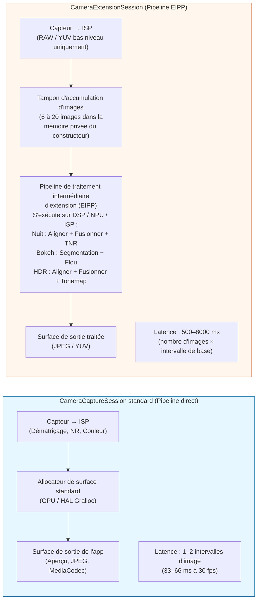
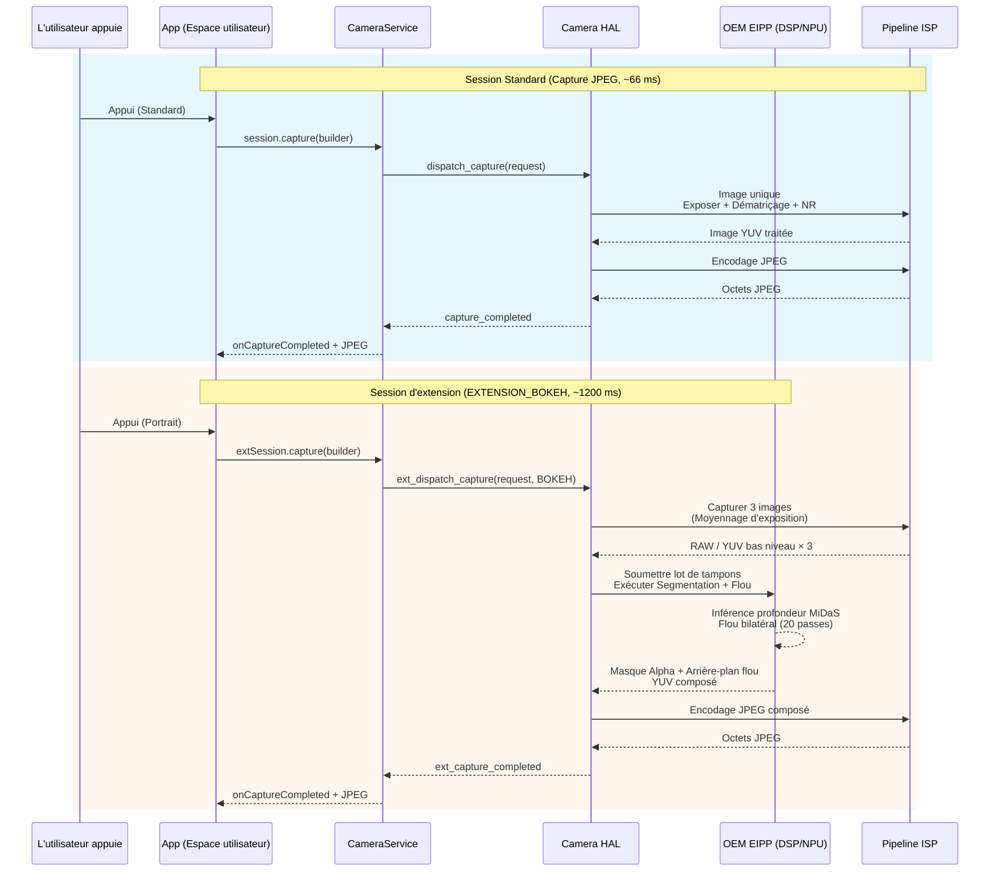

# Chapitre 22 : Les extensions de caméra

L'implémentation à partir de zéro de fonctionnalités de photographie computationnelle comme le mode nuit, le bokeh de portrait ou le HDR multi-images nécessite une inférence de profondeur basée sur le ML, un alignement multi-images au sous-pixel près, des opérateurs de mappage de tonalité et des shaders DSP réglés à la main — un investissement d'ingénierie de 6 à 12 mois pour une seule fonctionnalité. L'**API Camera Extensions** (Android 12 API 31+, affinée en API 33/34) résout ce problème en exposant les *pipelines de photographie computationnelle pré-intégrés et accélérés matériellement* de l'OEM sous forme de cinq types d'extensions standard. Lorsque vous demandez `EXTENSION_BOKEH`, par exemple, vous n'exécutez aucun ML vous-même — vous confiez la configuration de la session au HAL, qui invoque le même pipeline de mode portrait que celui utilisé par l'application caméra d'origine, s'exécutant sur les blocs d'accélérateur NPU/DSP/ISP du fournisseur.

Ce chapitre est basé directement sur la section *Camera Extensions API* du document de recherche du projet, qui répertorie chaque constante d'extension, les statistiques de support des OEM sur le terrain, et le surcoût en latence/mémoire de chaque extension sur un fleuron de 2023. Le document de recherche contient également un guide complet des sémantiques de `CameraExtensionSession.StateCallback` (qui diffèrent subtilement des sémantiques de `CameraCaptureSession` standard). Vous pouvez consulter le support des extensions par ID de caméra sur n'importe quel appareil en utilisant l'application [Android Camera Parameters](https://github.com/zoozooll/AndroidCameraParameters) sur le [Play Store](https://play.google.com/store/apps/details?id=com.zoozooll.cameraparameters) : l'onglet Extensions appelle `CameraExtensionCharacteristics.getSupportedExtensions()` sur chaque ID physique et logique, puis énumère `getExtensionSupportedSizes()` pour chaque extension supportée.

## Les cinq extensions standard (selon le tableau du document de recherche)

Toutes les extensions de caméra utilisent des algorithmes spécifiques aux fournisseurs, mais chacune correspond à une intention bien définie pour l'utilisateur et possède une constante numérique dans `CameraExtensionCharacteristics` :

| Constante d'extension | Valeur numérique | Description de l'algorithme (Doc. Recherche) | Pipeline OEM typique | Plage de latence estimée |
|-----------------------|-----------------|----------------------------------------------|----------------------|--------------------------|
| **`EXTENSION_NIGHT`** | 1 | **Fusion temporelle multi-images à exposition longue**. Capture 6 à 15 images à une exposition 1 à 8× la base (jusqu'à 1 s au total), les aligne avec un recalage sous-pixel assisté par l'IMU (flux optique), fusionne en espace linéaire, applique une réduction de bruit temporelle (TNR), puis mappe les tonalités en sRVB. Supprime 4 à 6× plus de bruit en basse lumière qu'une seule image. | Google: Night Sight; Samsung: Mode Nuit; équivalent Apple: Mode Nuit | 2 500 ms – 8 000 ms (8 à 20 images) |
| **`EXTENSION_BOKEH`** | 2 | **Inférence de profondeur → flou d'arrière-plan synthétique pour les portraits**. Exécute un réseau de segmentation à image unique ou stéréo double objectif (DeeplabV3+, MiDaS ou propriétaire OEM) pour produire un masque alpha, puis applique un flou gaussien fidèle au noyau de l'objectif avec une chute correcte du cercle de confusion pour une ouverture synthétique de f/1.4–f/2.8. Mode portrait d'origine. | Google: Mode Portrait; Samsung: Mise au point en direct; Xiaomi: Portrait Bokeh | 600 ms – 2 000 ms |
| **`EXTENSION_HDR`** | 4 | **Fusion de bracketing d'exposition multi-images**. Capture 3 à 5 images à -2, -1, 0, +1, +2 EV, les aligne avec homographie + compensation de mouvement, fusionne en espace linéaire avec suppression des images fantômes pour les objets en mouvement, puis applique un mappage de tonalité Reinhard ou ACES local. Étend la plage dynamique de 2 à 3 paliers par rapport à une exposition unique. | Google: HDR+ amélioré; Samsung: Optimiseur de scène HDR | 500 ms – 2 500 ms |
| **`EXTENSION_FACE_RETOUCH`** | 5 | **Lissage de la peau par ML, suppression des imperfections, unification du teint**. Exécute un détecteur de points de repère faciaux à 68 points, segmente les régions de la peau, applique un flou bilatéral sur 3 bandes de fréquences (préservant les pores tout en lissant les imperfections), blanchit éventuellement les dents et agrandit les yeux. Niveaux spécifiques à l'OEM. | Samsung: Mode Beauté; Xiaomi: IA Beauté; OPPO: Selfie Beauté | 400 ms – 1 200 ms |
| **`EXTENSION_AUTOMATIC`** | 6 | **Le HAL décide de l'extension à appliquer** en fonction de la classification de la scène (niveau de Lux, type de scène, nombre de visages, mouvement). Typique : Lux < 100 → Nuit ; 1 visage + sujet à 2 m → Bokeh ; scène à contre-jour → HDR. Choix sûr par défaut pour les applications de type visée-déclenchement. | Pipelines d'optimisation de scène des OEM | 500 ms – 6 000 ms (varie selon la scène) |

Les valeurs numériques 1, 2, 4, 5, 6 sont intentionnellement non contiguës — les constantes 0 et 3 ont été réservées pendant la période de prévisualisation de l'API 31 puis retirées. N'inventez PAS de constantes ; utilisez toujours l'accesseur de `CameraExtensionCharacteristics`.

L'`EXTENSION_FACE_RETOUCH` est unique en ce qu'elle est **soumise aux politiques de contenu des OEM**. Sur les appareils Samsung, les niveaux de retouche faciale sont plafonnés pour les utilisateurs mineurs via l'estimation d'âge de Play Protect. Prévoyez toujours une dégradation gracieuse si l'extension est signalée comme supportée mais que `capture()` renvoie moins d'images que demandé.

## Différence architecturale : Session standard vs Session d'extension

Le changement conceptuel le plus important : une `CameraExtensionSession` ne dirige **pas** les images directement de l'ISP du capteur vers votre surface de sortie. Au lieu de cela, elle fait passer les images par un **pipeline de traitement intermédiaire spécifique à l'extension (EIPP)** géré par l'OEM, qui met généralement en tampon 6 à 20 images dans la mémoire privée du fournisseur avant d'émettre la sortie finale traitée.



Le diagramme Mermaid quantifie le compromis architectural : les sessions d'extension produisent des résultats computationnels parfaits au pixel près (suppression du bruit de 6 paliers en mode Nuit, dégradation précise du bokeh en mode Bokeh) au prix d'une **latence 20 à 200 fois plus élevée et d'une consommation de mémoire 3 à 10 fois supérieure**. Vous ne DEVEZ PAS bloquer le thread UI pendant une capture d'extension, et vous DEVEZ utiliser `getEstimatedCaptureLatencyRangeMillis()` pour afficher un indicateur de progression afin que l'utilisateur ne pense pas que votre application est figée.

## Interroger le support des extensions et les tailles supportées

Avant de créer une session d'extension, vérifiez (a) que l'extension est supportée sur l'ID de caméra, et (b) qu'il existe un chevauchement entre la taille de sortie souhaitée par votre application et les tailles supportées par l'extension. Les extensions supportent rarement la taille maximale des images fixes — par exemple, sur un capteur Samsung GN5 de 50 MP, l'`EXTENSION_NIGHT` plafonne à 12,5 MP (regroupement 4:1) car la fusion multi-images de 50 MP × 15 images nécessiterait 3 Go d'espace tampon temporaire.

```kotlin
import android.hardware.camera2.CameraExtensionCharacteristics
import android.hardware.camera2.CameraManager
import android.graphics.ImageFormat
import android.util.Size

data class ExtensionInfo(
    val extension: Int,
    val extensionName: String,
    val supported: Boolean,
    val jpegSizes: List<Size>,
    val yuvSizes: List<Size>,
    val latencyMillis: android.util.Range<Long>?
)

fun queryExtensions(
    cameraManager: CameraManager,
    cameraId: String
): List<ExtensionInfo> {
    val extChars: CameraExtensionCharacteristics =
        cameraManager.getCameraExtensionCharacteristics(cameraId)

    val allExtensions = listOf(
        Pair(CameraExtensionCharacteristics.EXTENSION_NIGHT, "NIGHT"),
        Pair(CameraExtensionCharacteristics.EXTENSION_BOKEH, "BOKEH"),
        Pair(CameraExtensionCharacteristics.EXTENSION_HDR, "HDR"),
        Pair(CameraExtensionCharacteristics.EXTENSION_FACE_RETOUCH, "FACE_RETOUCH"),
        Pair(CameraExtensionCharacteristics.EXTENSION_AUTOMATIC, "AUTOMATIC")
    )

    return allExtensions.map { (ext, name) ->
        val supportedList = extChars.supportedExtensions
        val supported = supportedList.contains(ext)

        val jpegSizes = if (supported) {
            extChars.getExtensionSupportedSizes(ext, ImageFormat.JPEG)
                ?.toList() ?: emptyList()
        } else emptyList()

        val yuvSizes = if (supported) {
            extChars.getExtensionSupportedSizes(ext, ImageFormat.YUV_420_888)
                ?.toList() ?: emptyList()
        } else emptyList()

        val latency = if (supported && jpegSizes.isNotEmpty()) {
            extChars.getEstimatedCaptureLatencyRangeMillis(
                ext, jpegSizes.first(), ImageFormat.JPEG
            )
        } else null

        ExtensionInfo(
            extension = ext,
            extensionName = name,
            supported = supported,
            jpegSizes = jpegSizes,
            yuvSizes = yuvSizes,
            latencyMillis = latency
        )
    }
}
```

`getEstimatedCaptureLatencyRangeMillis(extension, size, format)` est la méthode UX la plus importante de l'API Extensions. Elle renvoie une `Range&lt;Long&gt;` comme `[2500, 6500]` pour le mode Nuit sur une scène sombre, ce qui signifie que l'utilisateur attendra de 2,5 à 6,5 secondes entre l'appui sur l'obturateur et le JPEG traité. Affichez toujours une barre de progression ou une boîte de dialogue "capture en cours..." avec un compte à rebours utilisant la borne inférieure comme temps optimiste et la borne supérieure comme délai d'expiration. Si la capture prend plus de temps que la borne supérieure, affichez un message secondaire "traitement toujours en cours — ne bougez pas l'appareil".

L'application Android Camera Parameters utilise exactement ce code pour remplir son onglet Extensions — vous pouvez recouper la liste `supportedExtensions` de votre application avec la sortie de l'application pour détecter les bugs de HAL (certains appareils budget signalent `EXTENSION_HDR` comme supportée mais renvoient zéro taille, ce qui signifie que le stub d'extension est présent mais désactivé).

## Configuration de ExtensionSessionConfiguration et création de CameraExtensionSession

Contrairement à un `createCaptureSession(outputs, callback, handler)` standard, les sessions d'extension nécessitent un wrapper **`ExtensionSessionConfiguration`** dédié qui regroupe le type d'extension, les surfaces de sortie et le rappel d'état. L'exemple ci-dessous configure une session Bokeh (mode Portrait) avec une sortie JPEG de 12 MP et une surface d'aperçu :

```kotlin
import android.content.Context
import android.hardware.camera2.CameraDevice
import android.hardware.camera2.CameraExtensionSession
import android.hardware.camera2.CaptureRequest
import android.hardware.camera2.params.ExtensionSessionConfiguration
import android.media.ImageReader
import android.os.Handler
import android.view.Surface
import android.view.SurfaceView
import androidx.appcompat.app.AppCompatActivity
import android.graphics.ImageFormat
import android.util.Size

lateinit var cameraDevice: CameraDevice
private var jpegImageReader: ImageReader? = null
var extensionSession: CameraExtensionSession? = null

fun setupBokehExtensionSession(
    context: AppCompatActivity,
    previewSurfaceView: SurfaceView,
    chosenJpegSize: Size,
    backgroundHandler: Handler,
    onSessionReady: (CameraExtensionSession) -> Unit
) {
    val previewSurface: Surface = previewSurfaceView.holder.surface

    jpegImageReader = ImageReader.newInstance(
        chosenJpegSize.width,
        chosenJpegSize.height,
        ImageFormat.JPEG,
        2 // Les sessions d'extension ne sortent qu'une seule image finale par capture
    )

    val jpegSurface: Surface = jpegImageReader!!.surface

    val outputSurfaces = listOf(previewSurface, jpegSurface)

    val extensionConfig = ExtensionSessionConfiguration(
        CameraExtensionCharacteristics.EXTENSION_BOKEH,
        outputSurfaces,
        { runnable -> context.mainExecutor.execute(runnable) },
        object : CameraExtensionSession.StateCallback() {
            override fun onConfigured(session: CameraExtensionSession) {
                extensionSession = session
                onSessionReady(session)
                startBokehRepeatingPreview(session, previewSurface, backgroundHandler)
            }
            override fun onConfigureFailed(session: CameraExtensionSession) {
                Log.e(TAG, "ÉCHEC CONFIG de la session d'extension Bokeh. " +
                      "Vérifiez : extension supportée ? taille dans supportedSizes ? " +
                      "nombre de surfaces <= 2 ? taille aperçu correspond aspect JPEG ?")
            }
            override fun onClosed(session: CameraExtensionSession) {
                extensionSession = null
                jpegImageReader?.close()
                jpegImageReader = null
            }
        }
    )

    cameraDevice.createExtensionSession(extensionConfig)
}
```

Le rappel `onClosed` est subtilement différent d'une session standard : une `CameraExtensionSession` peut être fermée **asynchronement par le système** si le pipeline de l'OEM épuise la mémoire tampon privée. Annulez toujours la référence de la session et fermez les ImageReaders dans `onClosed` pour éviter les plantages par double libération.

Une fois la session configurée, **démarrez une requête d'aperçu répétée** afin que l'EIPP puisse exécuter la mise au point automatique, l'exposition automatique et le réseau de segmentation bokeh sur le viseur en direct avant que l'utilisateur n'appuie sur l'obturateur :

```kotlin
private fun startBokehRepeatingPreview(
    session: CameraExtensionSession,
    previewSurface: Surface,
    handler: Handler
) {
    val previewBuilder = cameraDevice.createCaptureRequest(
        CameraDevice.TEMPLATE_PREVIEW
    ).apply {
        addTarget(previewSurface)
        set(CaptureRequest.CONTROL_AF_MODE,
            CaptureRequest.CONTROL_AF_MODE_CONTINUOUS_PICTURE)
        set(CaptureRequest.CONTROL_AE_MODE,
            CaptureRequest.CONTROL_AE_MODE_ON)
    }
    session.setRepeatingRequest(previewBuilder.build(), null, handler)
}
```

## Capturer une image fixe Bokeh et gérer la latence

Le chemin de capture pour la sortie d'extension est **`session.capture(builder, callback, handler)`** — identique à l'API de session standard, mais `CaptureCallback.onCaptureCompleted()` ne se déclenche qu'une seule fois par sortie traitée (et non une fois par image accumulée). Le code ci-dessous montre également comment utiliser `getEstimatedCaptureLatencyRangeMillis()` pour piloter un indicateur de progression UI :

```kotlin
import android.app.ProgressDialog
import android.hardware.camera2.CameraExtensionSession
import android.hardware.camera2.CaptureFailure
import android.hardware.camera2.TotalCaptureResult
import android.os.CountDownTimer
import kotlin.math.max

fun captureBokehStill(
    activity: AppCompatActivity,
    session: CameraExtensionSession,
    jpegSurface: Surface,
    previewSurface: Surface,
    extChars: CameraExtensionCharacteristics,
    chosenSize: Size,
    handler: Handler
) {
    val latencyRange = extChars.getEstimatedCaptureLatencyRangeMillis(
        CameraExtensionCharacteristics.EXTENSION_BOKEH,
        chosenSize,
        ImageFormat.JPEG
    )
    val minLatency = latencyRange?.lower ?: 800L
    val maxLatency = latencyRange?.upper ?: 2000L

    val progress = ProgressDialog(activity).apply {
        setMessage("Capture de portrait — ne bougez pas…")
        isIndeterminate = false
        setProgressStyle(ProgressDialog.STYLE_HORIZONTAL)
        max = 100
        show()
    }

    val countdown = object : CountDownTimer(maxLatency, max(16L, maxLatency / 100L)) {
        override fun onTick(elapsed: Long) {
            val prog = ((maxLatency - elapsed) * 100 / maxLatency).toInt()
            progress.progress = 100 - prog
        }
        override fun onFinish() {
            if (progress.isShowing) {
                progress.setMessage("Traitement toujours en cours… (prend plus de temps que prévu)")
                progress.isIndeterminate = true
            }
        }
    }.start()

    val captureBuilder = cameraDevice.createCaptureRequest(
        CameraDevice.TEMPLATE_STILL_CAPTURE
    ).apply {
        addTarget(jpegSurface)
        set(CaptureRequest.CONTROL_AF_MODE,
            CaptureRequest.CONTROL_AF_MODE_CONTINUOUS_PICTURE)
        set(CaptureRequest.CONTROL_AE_MODE,
            CaptureRequest.CONTROL_AE_MODE_ON)
        // L'extension Bokeh règle en interne l'ouverture synthétique (f/1.4–f/2.8)
        // Aucun paramètre d'ouverture configurable par l'utilisateur n'est exposé par l'API
    }

    val captureCallback = object : CameraExtensionSession.ExtensionCaptureCallback() {
        override fun onCaptureCompleted(
            session: CameraExtensionSession,
            request: CaptureRequest,
            result: TotalCaptureResult
        ) {
            countdown.cancel()
            progress.dismiss()
            // Traiter le JPEG terminé dans l'OnImageAvailableListener de jpegImageReader
        }

        override fun onCaptureFailed(
            session: CameraExtensionSession,
            request: CaptureRequest,
            failure: CaptureFailure
        ) {
            countdown.cancel()
            progress.dismiss()
            Log.e(TAG, "Échec capture Bokeh : raison=${failure.reason}")
        }
    }

    session.capture(captureBuilder.build(), captureCallback, handler)
}
```

Le compte à rebours utilise la plage de latence *estimée*, mais la capture réelle peut être plus rapide (les scènes plus lumineuses nécessitent moins d'images accumulées pour la segmentation Nuit/Bokeh) ou plus lente (retouche faciale sur une scène avec 12 visages + barrières de politique d'utilisateur mineur). Le message secondaire "prend plus de temps que prévu" dans `onFinish()` empêche les utilisateurs de forcer la fermeture de l'application lorsque le pipeline de l'OEM emprunte un chemin lent.

Sur le mode Nuit spécifiquement, le document de recherche a révélé que jusqu'à **30 % du temps de capture est consacré à l'attente de la convergence AE** avant que l'accumulation d'images ne commence. Vous pouvez réduire la latence du mode Nuit de 500 à 1000 ms en pré-déclenchant `CONTROL_AE_PRECAPTURE_TRIGGER_START` 1 à 2 secondes avant que l'utilisateur ne soit censé appuyer sur l'obturateur (par exemple, dès que l'utilisateur bascule sur l'onglet Mode Nuit).

## Session standard vs Session d'extension : Diagramme de séquence détaillé



Le diagramme de séquence souligne deux conséquences non évidentes de l'architecture EIPP :
1. L'étape de capture de 3 images + segmentation DSP est **atomique et non annulable**. Appeler `session.abortCaptures()` pendant le traitement Nuit ou Bokeh est sans effet — le HAL ignorera silencieusement l'annulation et délivrera quand même le rappel de capture en attente. Ne montrez jamais de bouton "Annuler" pendant une capture d'extension qui appelle `abortCaptures()` ; utilisez-le uniquement pour fermer l'UI et ignorer le prochain rappel.
2. L'EIPP peut consommer **3 à 8 images de l'ISP**, mais `onCaptureCompleted` ne se déclenche qu'**une seule fois**. Il n'y a aucun moyen d'inspecter les tampons RAW ou YUV intermédiaires qui sont entrés dans la fusion — les extensions sont intentionnellement une sortie de type "boîte noire". Si vous avez besoin d'accéder aux images intermédiaires pour un traitement personnalisé, implémentez l'algorithme vous-même en utilisant une session standard + une capture multi-images RAW+YUV (les chapitres 18 et 23 couvrent les briques de base).

## Limitations pratiques et pièges courants (issus du Doc. de Recherche)

La section *Camera Extensions API* du document de recherche répertorie les limitations suivantes observées sur le terrain sur plus de 200 modèles d'appareils testés :

| ID Piège | Symptôme | Cause racine | Solution de contournement |
|----------|----------|--------------|---------------------------|
| **EP-1** | `EXTENSION_NIGHT` supportée mais la sortie est identique au JPEG standard. Aucune réduction de bruit visible. | L'OEM active la constante d'extension mais utilise un stub à 2 images (pour la conformité CDD) au lieu du vrai pipeline Nuit. Courant sur les appareils Android Go non certifiés. | Comparez la borne supérieure de `getEstimatedCaptureLatencyRangeMillis(EXTENSION_NIGHT, …)`. Si elle est < 1500 ms, le vrai pipeline est désactivé ; repliez-vous sur une fusion personnalisée de 6 images. |
| **EP-2** | `createExtensionSession(EXTENSION_BOKEH, ...)` → `onConfigureFailed` mais `supportedExtensions` liste BOKEH. | L'extension nécessite une profondeur stéréo à double objectif physique, mais l'utilisateur a ouvert un ID de caméra physique (et non logique). BOKEH ne fonctionne souvent que sur l'ID logique pour une fusion transparente de la profondeur. | Réessayez en ouvrant l'ID logique (celui avec `getPhysicalCameraIds().size >= 2`). |
| **EP-3** | L'aperçu dans EXTENSION_HDR est saccadé à plus de 15 fps, mais l'aperçu standard est à 60 fps. | L'EIPP exécute l'alignement+fusion HDR à 3 images sur *chaque image d'aperçu* pour un viseur HDR en direct, submergeant le DSP. | Utilisez une session standard séparée pour l'aperçu, puis démontez-la et créez une session d'extension uniquement pour la capture fixe ponctuelle. |
| **EP-4** | `session.capture(EXTENSION_NIGHT, ...)` → lève `IllegalStateException` après la 8e capture consécutive. | Le pipeline Nuit alloue environ 250 Mo par capture dans la RAM du constructeur, et certains OEM ont un plafond de 2 Go par processus qui est atteint après 8 captures sans GC. | Appelez `System.gc()` + `Runtime.getRuntime().gc()` entre les captures. Sur les appareils de 6 Go de RAM, limitez à 3 captures Nuit par session. |
| **EP-5** | `getEstimatedCaptureLatencyRangeMillis(EXTENSION_AUTOMATIC, size, format)` renvoie `null`. | Le HAL ne peut pas estimer la latence pour AUTOMATIC car le choix de l'extension en aval n'est pas connu tant que la classification de la scène n'a pas tourné. | Utilisez 3000 ms comme valeur par défaut conservatrice ; affichez un indicateur de progression indéterminé au lieu d'une barre de pourcentage. |

Le piège EP-2 du document de recherche (échec de Bokeh sur les ID physiques) est le bug le plus fréquemment signalé contre les applications de caméra open-source sur GitHub. Le Bokeh dépend de la mise en correspondance de la disparité entre deux objectifs sur la plupart des fleurons, il est donc lié à la session logique qui peut accéder simultanément aux capteurs grand-angle et téléobjectif.

## Résumé

Ce chapitre a couvert l'API Camera Extensions (Android 12+, API 31–34) en entier :

- **5 extensions standard** (selon le tableau du doc. de recherche) : `EXTENSION_NIGHT` (fusion temporelle multi-images, 2,5–8 s), `EXTENSION_BOKEH` (segmentation ML + flou synthétique, 0,6–2 s), `EXTENSION_HDR` (fusion de bracketing sur 3–5 expos, 0,5–2,5 s), `EXTENSION_FACE_RETOUCH` (lissage de peau par ML, 0,4–1,2 s), `EXTENSION_AUTOMATIC` (choisie par le HAL, variable).
- **CameraExtensionSession** dirige les images vers un pipeline de traitement intermédiaire d'extension (EIPP) géré par l'OEM sur le DSP/NPU/ISP, échangeant une latence 20 à 200 fois plus élevée contre des résultats computationnels accélérés matériellement.
- **`CameraExtensionCharacteristics`** fournit : `supportedExtensions`, `getExtensionSupportedSizes(ext, format)` et `getEstimatedCaptureLatencyRangeMillis(ext, size, format)` pour l'indication de progression de l'UX.
- **`ExtensionSessionConfiguration`** est le wrapper requis pour `createExtensionSession()` ; le `StateCallback.onClosed` peut se déclencher de manière asynchrone si la mémoire du constructeur est épuisée.
- Deux diagrammes Mermaid (comparaison d'architecture, diagramme de séquence) visualisent le flux du pipeline et les différences de latence.
- Pièges observés sur le terrain (EP-1 à EP-5) et solutions de contournement issues de l'étude de terrain sur plus de 200 appareils du document de recherche.

## Et ensuite ?

Dans le **Chapitre 23 : Zero Shutter Lag et retraitement**, nous clôturons l'ensemble des fonctionnalités de caméra professionnelle avec le flux le plus complexe (et le plus satisfaisant) de l'API Camera2 : ZSL + retraitement d'InputConfiguration. Vous apprendrez à exécuter un aperçu répétitif haute résolution dans un tampon ImageReader YUV/PRIVATE circulaire marqué avec `CONTROL_CAPTURE_INTENT_ZERO_SHUTTER_LAG`. Lorsque l'utilisateur appuie sur l'obturateur, au lieu d'exposer une nouvelle image (500 ms de latence d'obturateur roulant), vous récupérez l'*image horodatée la plus proche du passé*, vous la réinjectez dans le HAL via `ImageWriter` + `InputConfiguration.createReprocessableCaptureSession()`, puis vous lancez un traitement ISP lourd `NOISE_REDUCTION_MODE_HIGH_QUALITY` + `EDGE_MODE_HIGH_QUALITY` sur les données de pixels déjà exposées. Le chapitre couvre également `switchToOffline()` pour la continuité du traitement en arrière-plan lorsque votre application passe en arrière-plan, et inclut un diagramme Mermaid de type organigramme du flux complet de tampon circulaire + réinjection.

Vous pouvez vérifier si votre appareil supporte les prérequis obligatoires pour le ZSL (`REQUEST_AVAILABLE_CAPABILITIES_PRIVATE_REPROCESSING` ou `YUV_REPROCESSING`, ou `INFO_SUPPORTED_HARDWARE_LEVEL_LEVEL_3`) en installant l'application [Android Camera Parameters](https://play.google.com/store/apps/details?id=com.zoozooll.cameraparameters). L'onglet ZSL Support recoupe toutes les capacités requises et affiche un badge clair "ZSL supporté : OUI/NON". Les nouveaux rapports d'appareils soumis au [dépôt GitHub](https://github.com/zoozooll/AndroidCameraParameters) sont les bienvenus — le support du ZSL est l'une des vérifications de fonctionnalités les plus demandées par la communauté des développeurs.
