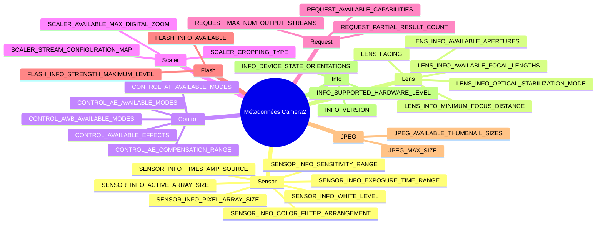

---
sidebar_position: 29
title: "Encyclopédie des métadonnées de la caméra"
description: Guide de référence complet pour toutes les clés de métadonnées CameraCharacteristics essentielles, incluant les catégories Sensor, Lens, Control, Scaler, Request, Flash, JPEG, Statistics et Info.
keywords: [CameraCharacteristics, CameraMetadata, Sensor, Lens, Control, Scaler, référence métadonnées caméra]
---

import Tabs from '@theme/Tabs';
import TabItem from '@theme/TabItem';

# Encyclopédie des métadonnées de la caméra

## Application compagnon

Inspectez chaque clé de cette encyclopédie en direct sur votre propre appareil — installez l'application Android Camera Parameters :

- **GitHub (Open Source) :** [github.com/zoozooll/AndroidCameraParameters](https://github.com/zoozooll/AndroidCameraParameters)
- **Google Play :** [play.google.com/store/apps/details?id=com.minininja.cameraparams](https://play.google.com/store/apps/details?id=com.minininja.cameraparams)

L'application est une implémentation vivante de chaque concept de cette page. Chaque entrée de métadonnées ci-dessous vous indique exactement quel onglet et quel écran affiche cette valeur afin que vous puissiez effectuer des recoupements avec un appareil réel entre vos mains.

---

## Taxonomie des métadonnées



---

## Introduction

Bienvenue dans l'Encyclopédie des métadonnées de la caméra, la référence définitive pour comprendre les plus de 300 clés de métadonnées qui décrivent chaque capacité d'un appareil photo Android. Si les chapitres précédents de cette série vous ont appris *comment* utiliser Camera2 — ouvrir des sessions, construire des requêtes, diffuser des surfaces — cette encyclopédie vous enseigne *ce dont* votre caméra est réellement capable. Chaque fonctionnalité que vous activez dans un `CaptureRequest.Builder` doit d'abord être validée par rapport aux `CameraCharacteristics`. Ignorez cette validation et votre application plantera sur un certain pourcentage d'appareils, ou pire, produira silencieusement une sortie corrompue.

Cette encyclopédie existe parce que les métadonnées Camera2 sont notoirement sous-documentées dans la référence officielle du SDK Android. La documentation vous indique le type de chaque clé (un `Range<Int>`, un `FloatArray`, etc.) mais mentionne rarement la *sémantique* : ce qu'une "dioptrie" signifie en pratique, pourquoi la taille de la matrice active diffère de la taille de la matrice de pixels, ou quelle séquence de clés vous devez vérifier ensemble avant d'exposer un bouton d'ISO manuel. Les entrées ici comblent cette lacune avec du code de qualité production, les pièges courants des OEM et le comportement réel des appareils tiré de milliers de profils d'appareils dans la base de données Android Camera Parameters.

Considérez cette page comme une table de consultation pour l'architecture de votre application de caméra. Lorsque vous concevez un écran de paramètres, allez à la section Control. Lorsque vous construisez une interface utilisateur de zoom, allez à Scaler. Lorsque vous écrivez un pipeline de traitement RAW, allez à Sensor. Chaque entrée suit la même structure en six points afin que vous puissiez accéder directement au code dont vous avez besoin sans avoir à réapprendre la mise en page. L'application compagnon sur votre téléphone valide ensuite que les mêmes requêtes fonctionnent sur du matériel réel provenant de Samsung, Sony, HiSilicon, MediaTek et Google Tensor.

Aucun appareil ne supporte toutes les clés de cette encyclopédie. C'est tout l'intérêt. Le modèle correct pour le développement Camera2 est : interroger la clé → vérifier si le résultat est null → restreindre l'interface utilisateur → documenter le chemin de secours (fallback). Cette page vous donne la requête, la vérification et le piège que vous rencontrerez si vous l'ignorez.

---

## Comment les métadonnées Camera2 sont organisées

Les métadonnées Camera2 résident dans trois hiérarchies de classes parallèles, toutes ancrées dans `android.hardware.camera2.CameraMetadata`. La description statique de ce qu'une caméra *peut* faire se trouve dans `CameraCharacteristics` — vous interrogez ces clés exactement une fois par ID de caméra après l'avoir découvert via `CameraManager.getCameraIdList()`. La description par requête de ce que vous *voulez* que la caméra fasse se trouve dans `CaptureRequest` — vous remplissez les clés via `CaptureRequest.Builder.set()`. La description par image de ce que la caméra a *réellement fait* se trouve dans `CaptureResult` (ou sa variante totale `TotalCaptureResult`) — vous lisez les clés à partir du rappel dans `CameraCaptureSession.CaptureCallback.onCaptureCompleted()`.

Chaque clé dans les trois hiérarchies étend `CaptureResult.Key<T>` (ou ses homologues `CameraCharacteristics.Key<T>` et `CaptureRequest.Key<T>`) et est un descripteur de champ fortement typé. Il existe plus de 300 clés publiques dans les trois classes, plus des clés privées OEM supplémentaires accessibles via `CameraCharacteristics.get(CameraCharacteristics.REQUEST_AVAILABLE_SESSION_KEYS)` sur certaines extensions de fournisseur. Les catégories de cette encyclopédie suivent les groupements conceptuels utilisés par la spécification d'interface HAL3 : Sensor décrit l'imageur, Lens décrit l'optique, Control décrit les algorithmes 3A (exposition automatique, mise au point automatique, balance des blancs automatique), Scaler décrit le pipeline de recadrage et de redimensionnement, Request décrit les drapeaux de capacités transversales, Flash décrit la LED de torche/flash, JPEG décrit l'encodeur d'images fixes et Info décrit le package de la caméra et la version du HAL.

---

## Conventions utilisées dans cette Encyclopédie

Chaque entrée de métadonnées ci-dessous suit exactement six sections :

1. **Qu'est-ce que c'est ?** Une définition de 1 à 2 paragraphes de la clé, de son type et de sa sémantique.
2. **Pourquoi cela existe-t-il ?** La justification de conception qui a conduit les ingénieurs Android à exposer cette clé plutôt qu'à dériver la valeur implicitement.
3. **Quels appareils le supportent ?** Le niveau matériel minimum, les indicateurs de capacités et la version Android où cette clé devient significative.
4. **Comment l'interroger ?** Un extrait de code Kotlin complet avec sécurité contre les nulls, montrant l'appel `characteristics.get()` exact plus la gestion des erreurs.
5. **Comment l'inspecter avec Android Camera Parameters ?** La hiérarchie exacte des onglets dans l'application compagnon où vous pouvez voir cette valeur rendue sur un appareil.
6. **Pièges courants.** Un ou plusieurs problèmes réels que les développeurs rencontrent, impliquant généralement la fragmentation des OEM, le couplage d'état caché entre les clés ou une mauvaise compréhension des unités.

Les extraits de code utilisent un Kotlin idiomatique avec les opérateurs de sécurité contre les nulls (`?.`) et l'opérateur Elvis (`?:`) plus des blocs `run` pour le repli. Tous les extraits supposent que vous détenez déjà une instance de `CameraCharacteristics` nommée `characteristics` obtenue via `cameraManager.getCameraCharacteristics(cameraId)`. Les extraits qui produisent des sorties visibles par l'utilisateur utilisent un formatage de chaîne avec des unités (dioptries, nanosecondes, pas d'EV) afin que vous puissiez les déposer directement dans un `PreferenceScreen` ou une superposition de débogage `TextView`.

Les références de l'application compagnon utilisent toujours le même modèle : *Nom de l'onglet / Nom du sous-onglet*. Par exemple, "Overview / Hardware Level" signifie : ouvrez l'application, appuyez sur l'onglet Overview dans la navigation du bas, puis cherchez la carte Hardware Level. Si une clé apparaît dans plusieurs écrans, nous listons l'emplacement principal canonique en premier.

---

## Catégorie Sensor (Capteur)

### SENSOR_INFO_ACTIVE_ARRAY_SIZE

**1. Qu'est-ce que c'est ?**

`SENSOR_INFO_ACTIVE_ARRAY_SIZE` est un `android.graphics.Rect` décrivant les coordonnées des pixels de la zone d'imagerie active au sein de la matrice complète du capteur. En pratique, il s'agit du plus grand rectangle de pixels qui peut réellement être lu et délivré à un flux de sortie. Le rectangle est toujours aligné sur les axes et exprimé dans l'espace des coordonnées de pixels où `(0,0)` est le coin supérieur gauche de la matrice de pixels complète. Les valeurs typiques ressemblent à `Rect(0, 0, 8000, 6000)` pour un capteur 8K×6K, ou `Rect(120, 160, 3880, 2880)` lorsque le fabricant du capteur laisse une petite bordure inactive (pixels optiquement noirs) sur le bord.

Chaque flux de sortie que vous configurez — qu'il s'agisse de JPEG, YUV_420_888, RAW ou d'une SurfaceTexture d'aperçu — est finalement recadré à partir de cette zone active. Lorsque vous demandez un JPEG 4:3 à 12 MP, l'ISP de la caméra recadre la matrice active au format 4:3 et réduit la taille. Lorsque vous appliquez un zoom numérique via `SCALER_CROP_REGION`, cette zone de recadrage est elle-même recadrée par rapport à la matrice active, et non à la matrice de pixels.

**2. Pourquoi cela existe-t-il ?**

Les matrices de capteurs contiennent toujours plus de photodiodes physiques que celles qui sont délivrées au pipeline ISP. Les lignes et colonnes les plus externes sont des pixels "fantômes" ou "optiquement noirs" utilisés pour l'étalonnage du courant d'obscurité et la correction de l'ombrage de l'objectif — pas de vraies données d'image. Sans `SENSOR_INFO_ACTIVE_ARRAY_SIZE`, les développeurs n'auraient aucun moyen de savoir quel système de coordonnées utiliser pour `SCALER_CROP_REGION` ou pour le suivi du recadrage basé sur les visages. Camera1 cachait entièrement cette distinction, ce qui rendait les calculs de zoom numérique incohérents entre les OEM. Camera2 l'expose explicitement afin que les zones de recadrage puissent être calculées avec une précision au pixel près.

**3. Quels appareils le supportent ?**

Tous les appareils Camera2 supportent cette clé à tous les niveaux matériels : LEGACY, LIMITED, FULL et LEVEL_3. Elle est listée dans `CameraCharacteristics.getAvailableCaptureResultKeys()` pour chaque ID de caméra, y compris les caméras USB externes. Le rectangle est toujours non vide et sa largeur/hauteur ne dépassent jamais `SENSOR_INFO_PIXEL_ARRAY_SIZE`.

**4. Comment l'interroger ?**

```kotlin
val activeArray: Rect? = characteristics.get(
    CameraCharacteristics.SENSOR_INFO_ACTIVE_ARRAY_SIZE
)

activeArray?.let { rect ->
    val widthPx = rect.width()
    val heightPx = rect.height()
    val megapixels = (widthPx * heightPx) / 1_000_000.0
    Log.d(TAG, "Matrice active : ${widthPx}×${heightPx}px (%.1f MP)".format(megapixels))
    Log.d(TAG, "  Gauche=${rect.left}, Haut=${rect.top}, Droite=${rect.right}, Bas=${rect.bottom}")
} ?: run {
    Log.w(TAG, "Taille de la matrice active non disponible sur cet appareil")
}
```

**5. Comment l'inspecter avec Android Camera Parameters ?**

Naviguez vers **Sensor / Sensor Info**. La matrice active est affichée sur la deuxième ligne de la carte "Sensor Geometry", sous la taille de la matrice de pixels. L'application compagnon dessine également le rectangle de la matrice active visuellement superposé sur une représentation à l'échelle de la matrice de pixels, afin que vous puissiez voir en un coup d'œil quelle partie de la matrice physique est réellement utilisable.

**6. Pièges courants**

La plus grande erreur consiste à interroger `SENSOR_INFO_PIXEL_ARRAY_SIZE` et à s'attendre à une sortie JPEG à cette résolution. Les images fixes de taille réelle utilisent toujours les dimensions de la matrice active, jamais celles de la matrice de pixels. Sur un capteur Samsung ISOCELL typique de 50 MP, la matrice de pixels peut être de 8192×6144 mais la matrice active est de 8000×6000. Si vous allouez un tampon de 50,3 MP (à partir de la matrice de pixels), vous obtenez une image de 48 MP et les pixels restants sont silencieusement abandonnés, ou pire, vous obtenez un tampon corrompu sur les appareils à HAL hérité. Utilisez toujours `activeArray.width() * activeArray.height()` pour le dimensionnement du tampon, jamais le produit de la matrice de pixels. Le deuxième piège courant consiste à utiliser les coordonnées de la matrice active sans inclure le décalage : lorsque le haut/gauche du rectangle est non nul, vos calculs de zone de recadrage doivent ajouter cette origine, sinon le zoom dérivera vers le coin supérieur gauche.

---

### SENSOR_INFO_PIXEL_ARRAY_SIZE

**1. Qu'est-ce que c'est ?**

`SENSOR_INFO_PIXEL_ARRAY_SIZE` est un `android.util.Size` représentant le nombre total de photodiodes physiques sur la matrice du capteur, y compris les pixels de bordure optiquement noirs ou fantômes. C'est le chiffre des "mégapixels marketing" : un capteur de 108 MP annonce des dimensions de matrice de pixels de 12000×9000, quel que soit le nombre de pixels réellement délivrés au pipeline ISP. Au niveau du type, il s'agit d'un simple `Size` avec des champs `.width` et `.height`.

La relation avec la matrice active est toujours :
- `pixelArray.width >= activeArray.width`
- `pixelArray.height >= activeArray.height`

La différence est typiquement de 100 à 400 pixels sur chaque axe, utilisés pour les lignes optiquement noires (OB) et l'étalonnage de l'ombrage de l'objectif en usine.

**2. Pourquoi cela existe-t-il ?**

Les pipelines de capture RAW ont besoin des dimensions complètes des pixels pour analyser correctement les tampons RAW10/RAW12/RAW16, car le format RAW (lorsque `SENSOR_INFO_PRE_CORRECTION_ACTIVE_ARRAY_SIZE` n'est pas disponible) inclut parfois les lignes OB. Les développeurs écrivant leur propre code de démosatrisation ou de soustraction de trame noire ont également besoin de savoir combien de pixels sur chaque bordure doivent être retirés avant le traitement. Côté consommateur, les équipes marketing et les applications de benchmark utilisent la taille de la matrice de pixels pour rapporter la résolution "réelle" du capteur sans le recadrage de l'ISP de l'OEM.

**3. Quels appareils le supportent ?**

Tous les niveaux matériels exposent cette clé. Il n'y a pas de prérequis d'indicateur de capacité. Les appareils capables de produire du RAW (ceux annonçant `REQUEST_AVAILABLE_CAPABILITIES_RAW`) sont tenus par le CDD Android de rapporter une taille de matrice de pixels précise à une ligne/colonne près de la spécification physique du capteur.

**4. Comment l'interroger ?**

```kotlin
val pixelArray: Size? = characteristics.get(
    CameraCharacteristics.SENSOR_INFO_PIXEL_ARRAY_SIZE
)

pixelArray?.let { size ->
    val mp = (size.width * size.height) / 1_000_000.0
    Log.d(TAG, "Matrice de pixels : ${size.width}×${size.height}px (%.1f MP marketing)".format(mp))
    
    characteristics.get(CameraCharacteristics.SENSOR_INFO_ACTIVE_ARRAY_SIZE)?.let { active ->
        val usablePct = (active.width() * active.height()).toDouble() /
                        (size.width * size.height).toDouble() * 100.0
        Log.d(TAG, "  %.1f%% des pixels sont délivrables via la matrice active".format(usablePct))
    }
} ?: run {
    Log.w(TAG, "Taille de la matrice de pixels non disponible")
}
```

**5. Comment l'inspecter avec Android Camera Parameters ?**

Ouvrez **Sensor / Sensor Info** et regardez la première entrée de la carte "Sensor Geometry", intitulée "Pixel Array". L'application l'affiche sous la forme largeur×hauteur avec le nombre de mégapixels marketing entre parenthèses (ex : "8192 × 6144 (50,3 MP)"). Si vous appuyez sur la ligne, une boîte de dialogue s'ouvre avec un tableau de comparaison matrice de pixels vs matrice active vs matrice active avant correction.

**6. Pièges courants**

Confondre la matrice de pixels avec la taille JPEG délivrable est universel chez les nouveaux développeurs Camera2. La séquence est toujours : (1) interroger `SCALER_STREAM_CONFIGURATION_MAP.getOutputSizes(ImageFormat.JPEG)` pour obtenir les résolutions *réelles* que l'encodeur peut produire, (2) la plus grande taille JPEG sera égale à (ou un recadrage à l'échelle de) `SENSOR_INFO_ACTIVE_ARRAY_SIZE`, jamais à la matrice de pixels. Si vous écrivez du code qui calcule un recadrage 4:3 à partir des dimensions de la matrice de pixels, le résultat sera légèrement plus large que ce que l'ISP peut réellement délivrer, et l'appareil photo le bridera silencieusement — introduisant un léger décalage des pixels dans le zoom de suivi des visages. Deuxièmement, sur les appareils capables de retraitement qui annoncent `REQUEST_AVAILABLE_CAPABILITIES_PRIVATE_REPROCESSING`, la taille d'entrée du retraitement utilise la sémantique de la matrice de pixels ; utiliser la matrice active pour le retraitement provoque des erreurs d'alignement de trame.

---

### SENSOR_INFO_SENSITIVITY_RANGE

**1. Qu'est-ce que c'est ?**

`SENSOR_INFO_SENSITIVITY_RANGE` est un `android.util.Range<Int>` spécifiant les valeurs minimale et maximale d'ISO (gain analogique) que le capteur peut appliquer *pendant la lecture brute*. Les unités sont l'arithmétique ISO : 100 est l'ISO de base (image la plus propre, bruit le plus faible), 6400 ou plus est le mode haute sensibilité (image plus bruitée, temps d'obturation plus court pour le même EV). Les plages typiques sur les appareils modernes sont `[100, 6400]` pour les téléphones de milieu de gamme et `[50, 12800]` ou `[32, 25600]` pour les capteurs phares avec de grands puits de pixels.

La sensibilité est appliquée *avant* tout gain numérique dans le pipeline ISP. Les valeurs renvoyées ici correspondent à ce que vous définissez dans `CaptureRequest.SENSOR_SENSITIVITY` lorsque le contrôle manuel est activé.

**2. Pourquoi cela existe-t-il ?**

Chaque capteur CMOS a un niveau de gain physique minimum (déterminé par l'amplificateur de lecture) et un niveau maximum (déterminé par la quantité d'amplification que le signal analogique peut subir avant écrêtage ou bruit inacceptable). Sans une plage explicite, chaque OEM utiliserait des réglages par défaut implicites différents. Camera2 expose la plage afin que les curseurs d'UI d'exposition manuelle puissent avoir des points de terminaison min/max corrects, et pour que les développeurs puissent valider une requête d'ISO manuel *avant* de la soumettre à la session de capture — évitant ainsi la vague `IllegalArgumentException` que la session lance si vous demandez des valeurs hors plage.

**3. Quels appareils le supportent ?**

Tous les appareils exposent cette clé sous forme de `Range<Int>`. Cependant, les valeurs ne sont *contrôlables* que si l'appareil annonce `REQUEST_AVAILABLE_CAPABILITIES_MANUAL_SENSOR` dans sa liste de capacités. Sur les appareils de niveau LIMITED sans cet indicateur, la plage renverra toujours des valeurs (typiquement `[100, 800]`) mais la définition de `SENSOR_SENSITIVITY` dans une CaptureRequest est ignorée — l'algorithme AE reste aux commandes. Filtrez toujours l'UI d'ISO manuel sur l'indicateur MANUAL_SENSOR, et non sur le fait que la plage est non nulle.

**4. Comment l'interroger ?**

```kotlin
val sensitivityRange: Range<Int>? = characteristics.get(
    CameraCharacteristics.SENSOR_INFO_SENSITIVITY_RANGE
)

val capabilities: IntArray? = characteristics.get(
    CameraCharacteristics.REQUEST_AVAILABLE_CAPABILITIES
)
val hasManualSensor = capabilities?.contains(
    CameraCharacteristics.REQUEST_AVAILABLE_CAPABILITIES_MANUAL_SENSOR
) ?: false

sensitivityRange?.let { range ->
    Log.d(TAG, "Plage de sensibilité : ISO ${range.lower} à ISO ${range.upper}")
    Log.d(TAG, "  Contrôle ISO manuel disponible : $hasManualSensor")
    
    if (hasManualSensor) {
        val stopCount = log2(range.upper.toDouble() / range.lower.toDouble())
        Log.d(TAG, "  Plage dynamique : %.1f paliers".format(stopCount))
    } else {
        Log.w(TAG, "  AVERTISSEMENT : Plage rapportée mais l'indicateur MANUAL_SENSOR est ABSENT.")
        Log.w(TAG, "  La définition de SENSOR_SENSITIVITY sera IGNORÉE par l'algorithme AE !")
    }
} ?: run {
    Log.w(TAG, "Plage de sensibilité non disponible")
}
```

**5. Comment l'inspecter avec Android Camera Parameters ?**

Naviguez vers **Sensor / Manual Sensor** où la plage de sensibilité apparaît comme "ISO Range" dans la première carte. Sur les appareils dotés de la capacité MANUAL_SENSOR, la plage est affichée avec un aperçu de curseur indiquant ce que l'UI manuelle expose. Sur les appareils non manuels, l'application marque explicitement la plage comme "Lecture seule" et affiche une bannière d'avertissement expliquant que les valeurs sont à titre informatif uniquement.

**6. Pièges courants**

Le premier piège : voir une plage de sensibilité valide et activer les contrôles d'ISO manuels sans vérifier `MANUAL_SENSOR`. Cela fonctionne sur l'appareil de test du développeur (un Pixel 8, par exemple, qui a le niveau matériel FULL) mais le curseur ne fait rien silencieusement sur 60 % des téléphones de milieu de gamme sur le terrain. L'utilisateur voit l'UI, déplace le curseur, ne voit aucune différence de bruit et laisse un avis d'une étoile. Vérifiez toujours les deux clés ensemble.

Le deuxième piège : confusion sur les unités. `SENSOR_SENSITIVITY` utilise l'arithmétique ISO, pas logarithmique. Un curseur qui va de 100 à 6400 de manière *linéaire* rend les 75 % supérieurs de la piste identiques (6400 à 3200 est un palier, 3200 à 1600 est un autre palier, ..., 200 à 100 est le dernier palier) alors que les 25 % inférieurs couvrent 6 paliers. Les curseurs corrects interpolent les valeurs à l'aide d'une échelle logarithmique afin que chaque 10 % de piste soit égal à environ un palier.

---

### SENSOR_INFO_EXPOSURE_TIME_RANGE

**1. Qu'est-ce que c'est ?**

`SENSOR_INFO_EXPOSURE_TIME_RANGE` est un `android.util.Range<Long>` spécifiant les durées d'obturation minimale et maximale pendant lesquelles le capteur peut exposer une seule image, mesurées en **nanosecondes**. Chaque valeur de cette plage correspond à un argument valide pour `CaptureRequest.SENSOR_EXPOSURE_TIME` lorsque le contrôle manuel du capteur est activé. Les plages typiques s'étendent d'environ `Range(1_000_000L, 1_000_000_000L)` (minimum 1 milliseconde jusqu'à maximum 1 seconde) sur les appareils de milieu de gamme, jusqu'à `Range(100_000L, 10_000_000_000L)` (0,1 ms à 10 secondes) sur les appareils phares de niveau FULL avec support dédié au mode nuit. Quelques caméras externes de catégorie cinéma de niveau LEVEL_3 vont jusqu'à 30 secondes ou plus.

La conversion entre les nanosecondes et les unités de temps courantes est :
- 1 microseconde = 1 000 ns
- 1 milliseconde = 1 000 000 ns
- 1 seconde = 1 000 000 000 ns

**2. Pourquoi cela existe-t-il ?**

Le HAL de la caméra a besoin d'un contrat explicite de temps d'obturation avec la couche application pour deux raisons. Premièrement, les expositions longues interagissent avec `SENSOR_FRAME_DURATION` de manière non évidente : si vous demandez une exposition de 5 secondes, la durée minimale de l'image passe à 5 secondes plus l'obturation électronique du capteur, ce qui signifie que les rappels d'aperçu cessent d'arriver pendant 5 secondes et l'interface utilisateur semble figée. Deuxièmement, les expositions les plus courtes (microsecondes) interagissent avec le décalage de l'obturateur roulant (rolling shutter) du capteur ; en dessous du temps d'exposition minimum, le timing de lecture du capteur ne peut pas suivre et les images de sortie contiennent des lignes de balayage corrompues.

**3. Quels appareils le supportent ?**

Comme la plage de sensibilité, cette clé est présente sur tous les appareils mais n'est *contrôlable* que lorsque `MANUAL_SENSOR` figure dans la liste des capacités. Les appareils de niveau LIMITED qui ne supportent pas le capteur manuel rapporteront toujours une plage d'exposition plausible (généralement de 1 ms à 1/30 s) afin que les outils d'analyse de timing AE puissent raisonner sur le comportement de l'algorithme AE, mais les réglages manuels sont ignorés. Le contrôle manuel complet nécessite à la fois la plage *et* l'indicateur de capacité.

**4. Comment l'interroger ?**

```kotlin
fun Long.nanosToSeconds(): Double = this / 1_000_000_000.0
fun Long.nanosToMillis(): Double = this / 1_000_000.0
fun Double.secondsToNanos(): Long = (this * 1_000_000_000.0).toLong()

val exposureRange: Range<Long>? = characteristics.get(
    CameraCharacteristics.SENSOR_INFO_EXPOSURE_TIME_RANGE
)

val hasManualSensor = characteristics.get(
    CameraCharacteristics.REQUEST_AVAILABLE_CAPABILITIES
)?.contains(CameraCharacteristics.REQUEST_AVAILABLE_CAPABILITIES_MANUAL_SENSOR) ?: false

exposureRange?.let { range ->
    Log.d(TAG, "Plage de temps d'exposition :")
    Log.d(TAG, "  Min : ${range.lower} ns = %.4f ms = %.7f s"
        .format(range.lower.nanosToMillis(), range.lower.nanosToSeconds()))
    Log.d(TAG, "  Max : ${range.upper} ns = %.2f ms = %.4f s"
        .format(range.upper.nanosToMillis(), range.upper.nanosToSeconds()))
    Log.d(TAG, "  Contrôle manuel de l'obturateur disponible : $hasManualSensor")
    
    val shutterSpeeds = listOf(
        0.001, 0.002, 0.004, 0.008, 0.016, 0.033,
        0.066, 0.125, 0.25, 0.5, 1.0, 2.0, 4.0, 8.0
    )
    val supportedSpeeds = shutterSpeeds.filter { s ->
        val ns = s.secondsToNanos()
        ns >= range.lower && ns <= range.upper
    }
    Log.d(TAG, "  Temps de pose courants supportés : $supportedSpeeds secondes")
} ?: run {
    Log.w(TAG, "Plage de temps d'exposition non disponible")
}
```

**5. Comment l'inspecter avec Android Camera Parameters ?**

Allez sur la carte **Sensor / Manual Sensor**, intitulée "Exposure Range". L'application affiche la valeur de trois manières : nanosecondes brutes, millisecondes et secondes pour les deux extrémités. Une chronologie horizontale en dessous visualise la plage avec des repères pour les temps de pose courants (de 1/1000 s à 8 s), afin que vous puissiez voir en un coup d'œil si la photographie de nuit à longue exposition est possible. La capacité de contrôle manuel est indiquée par une coche verte (contrôlable) ou une étiquette rouge "lecture seule".

**6. Pièges courants**

Le piège du gel de l'aperçu : les développeurs définissent une exposition de 4 secondes pour une capture fixe en basse lumière mais oublient que la même `CaptureRequest` s'applique à TOUTES les surfaces de la session, y compris la `SurfaceTexture` d'aperçu. Résultat : pendant 4 secondes, aucune image d'aperçu n'arrive, l'écran se fige et l'utilisateur pense que l'application a planté. La solution est une requête répétée d'une seule image pour la surface d'aperçu à 30 fps normaux, puis un appel séparé `setRepeatingBurst` ou `capture` avec l'exposition longue appliquée uniquement aux surfaces JPEG/RAW via `CaptureRequest.Builder.addTarget()`.

Le deuxième piège est le dépassement d'entier dans les conversions. La multiplication et la division par `1_000_000_000` s'approchent de la limite des entiers 32 bits. Utilisez toujours `Long` (64 bits) pour toute variable contenant des nanosecondes, et écrivez des fonctions d'extension explicites (comme `nanosToSeconds()` ci-dessus) pour ne jamais diviser dans le mauvais ordre. Une exposition de 1 seconde stockée sous forme d'Int déborde à environ 2,1 secondes, ce qui fait que le HAL reçoit un temps d'exposition négatif, ce qui fait planter la session ou bride silencieusement au minimum sur certains HAL MediaTek.

---

### SENSOR_INFO_WHITE_LEVEL

**1. Qu'est-ce que c'est ?**

`SENSOR_INFO_WHITE_LEVEL` est un simple `Int` représentant la valeur maximale du code du convertisseur analogique-numérique (ADC) qu'un pixel de capteur RAW peut atteindre avant l'écrêtage. Pour un capteur RAW10 (10 bits par pixel par canal), le niveau de blanc est typiquement de 1023 (2¹⁰−1). Pour le RAW12, il est typiquement de 4095. Pour le RAW14, il est typiquement de 16383. Certains capteurs arrondissent légèrement vers le bas (ex : 16300 au lieu de 16383 pour le RAW14) afin de laisser de la marge pour les hautes lumières HDR ou la correction des pixels défectueux ; la valeur exacte est étalonnée sur le capteur en usine.

Il s'agit de la valeur de saturation par canal. Dans n'importe quelle image RAW de ce capteur, tout canal de pixel se trouvant au niveau de blanc (ou au-dessus) représente des hautes lumières brûlées sans aucun détail récupérable.

**2. Pourquoi cela existe-t-il ?**

Le format de pixel RAW utilise toujours la même profondeur de bits par canal. Un tampon RAW10 stocke chaque pixel dans des entiers alignés sur 16 bits, et les développeurs peu familiers avec le traitement RAW divisent naturellement par 65535 (la valeur 16 bits max) lors de la normalisation en virgule flottante. Cela produit des images ternes, délavées et avec une soustraction incorrecte du point noir. `SENSOR_INFO_WHITE_LEVEL` vous donne le bon diviseur : divisez les pixels RAW par `WHITE_LEVEL - BLACK_LEVEL_PATTERN` (et non par 65535) pour obtenir la plage de lumière linéaire de 0,0 à 1,0. Chaque capteur RAW possède également une clé `SENSOR_BLACK_LEVEL_PATTERN` donnant le décalage à exposition nulle par canal ; la combinaison des deux vous donne la courbe complète de normalisation RAW-vers-flottant.

**3. Quels appareils le supportent ?**

Cette clé est requise sur tout appareil qui rapporte `REQUEST_AVAILABLE_CAPABILITIES_RAW` dans sa liste de capacités — c'est-à-dire toute caméra capable de produire des tampons RAW10/RAW12/RAW16 via `ImageReader`. Sur les appareils sans sortie RAW, la clé peut toujours être présente (renvoyant une valeur nominale correspondant à la profondeur de bits native du capteur) mais il n'y a aucun moyen de lire les pixels RAW, donc la clé est purement informative.

**4. Comment l'interroger ?**

```kotlin
val whiteLevel: Int? = characteristics.get(
    CameraCharacteristics.SENSOR_INFO_WHITE_LEVEL
)

val blackLevelPattern: IntArray? = characteristics.get(
    CameraCharacteristics.SENSOR_BLACK_LEVEL_PATTERN
)

whiteLevel?.let { wl ->
    Log.d(TAG, "SENSOR_INFO_WHITE_LEVEL = $wl")
    
    val bits = ceil(log2(wl.toDouble() + 1.0)).toInt()
    Log.d(TAG, "  Profondeur de bits RAW effective : $bits bits par canal")
    Log.d(TAG, "  Plus grande valeur de pixel RAW (saturation) : $wl")
    
    blackLevelPattern?.let { bl ->
        if (bl.size == 4) {
            Log.d(TAG, "  Motif du niveau de noir (R, Gr, Gb, B) = [${bl[0]}, ${bl[1]}, ${bl[2]}, ${bl[3]}]")
            val avgBlack = (bl[0] + bl[1] + bl[2] + bl[3]) / 4.0
            val usableDnRange = wl - avgBlack
            val stops = log2(usableDnRange / avgBlack)
            Log.d(TAG, "  Diviseur de normalisation : ${wl - avgBlack.toInt()}")
            Log.d(TAG, "  Plage dynamique RAW estimée : %.1f paliers".format(stops))
        }
    } ?: run {
        Log.d(TAG, "  Pas de motif de niveau de noir. Assumez 0. Normalisez par $wl directement.")
    }
} ?: run {
    Log.w(TAG, "Niveau de blanc non disponible — la sortie RAW n'est peut-être pas supportée")
}
```

**5. Comment l'inspecter avec Android Camera Parameters ?**

Le niveau de blanc se trouve dans **Sensor / Sensor Info** sous la carte "RAW Sensor Parameters", à côté du motif du niveau de noir et de la disposition des filtres colorés. Si la capacité RAW est présente, l'application compagnon affiche un aperçu en direct d'une barre de dégradé horizontal normalisée correctement avec le niveau de blanc propre à l'appareil, afin que vous puissiez comparer visuellement la normalisation correcte (utilisant la clé) avec l'erreur courante consistant à diviser par 65535 — la version erronée apparaît visiblement plus sombre.

**6. Pièges courants**

Normaliser par 65535 au lieu du niveau de blanc est la première erreur universelle en traitement RAW. Une photo RAW10 normalisée par 65535 ressort à environ 1/64e de la luminosité — presque du noir pur. Les développeurs s'en aperçoivent et appliquent un multiplicateur de gain de 64× pour compenser, ce qui introduit de la postérisation car ils étirent 10 bits d'information dans 16 bits de précision, comprimant la plage tonale. Le code correct soustrait d'abord le niveau de noir, puis divise par (niveau de blanc moins niveau de noir). Cela donne une image en lumière linéaire correctement exposée, prête pour le gamma et le mappage tonal.

Un deuxième piège : le niveau de blanc peut varier *par image* sur certains capteurs HDR, où le gain de l'ADC change entre les expositions longues et courtes pour une lecture HDR décalée (staggered-HDR). Vérifiez `CaptureResult.SENSOR_DYNAMIC_WHITE_LEVEL` dans chaque rappel `onCaptureCompleted` sur les appareils Android 13+ ; utilisez la valeur par image lorsqu'elle est disponible au lieu de la constante statique `CameraCharacteristics`. La mise en cache persistante du niveau de blanc statique sur les capteurs HDR produit des hautes lumières brûlées sur l'image à exposition courte.

---

### SENSOR_INFO_COLOR_FILTER_ARRANGEMENT

**1. Qu'est-ce que c'est ?**

`SENSOR_INFO_COLOR_FILTER_ARRANGEMENT` est un enum `Int` décrivant la disposition de la matrice de filtres colorés (CFA - Color Filter Array) de Bayer sur les photodiodes du capteur. La CFA est la mosaïque colorée microscopique qui donne à chaque pixel une sensibilité au rouge, au vert ou au bleu (deux pixels verts par bloc 2×2). Les valeurs possibles sont :
- `SENSOR_INFO_COLOR_FILTER_ARRANGEMENT_RGGB` — le plus courant (ligne supérieure Rouge-Vert, deuxième ligne Vert-Bleu).
- `SENSOR_INFO_COLOR_FILTER_ARRANGEMENT_GRBG` — variante vert-rouge / bleu-vert.
- `SENSOR_INFO_COLOR_FILTER_ARRANGEMENT_BGGR` — variante bleu-vert / vert-rouge (courant sur les capteurs Sony).
- `SENSOR_INFO_COLOR_FILTER_ARRANGEMENT_GBRG` — variante vert-bleu / rouge-vert.
- `SENSOR_INFO_COLOR_FILTER_ARRANGEMENT_MONOCHROME` — pas de filtre coloré, capteur de luminance pure (caméras infrarouges ou dédiées à la vision nocturne).

La disposition décrit le pixel supérieur gauche (x=0, y=0) de la matrice active. Chaque bloc 2×2 répète ce motif sur toute la surface du capteur.

**2. Pourquoi cela existe-t-il ?**

Les données brutes du capteur sont monochromes par nature. Un algorithme de démosatrisation doit être appliqué pour reconstruire une image RVB complète en interpolant les deux canaux de couleur manquants pour chaque pixel. L'algorithme de démosatrisation *doit* savoir quelle couleur se trouve à chaque emplacement physique. Si vous exécutez une démosatrisation RGGB sur un capteur BGGR, vous obtenez une image avec des couleurs inversées : les pixels rouges deviennent bleus, les bleus rouges, et l'œil humain remarque immédiatement les mauvais tons de peau. La qualité de la démosatrisation dépend également de la CFA — les algorithmes adaptatifs comme AMaZE ou LMMSE ont besoin de la disposition exacte pour choisir la bonne direction d'interpolation.

**3. Quels appareils le supportent ?**

Requis sur tous les appareils capables de RAW. Sur les appareils sans sortie RAW, la clé peut toujours être présente (permettant aux outils d'analyse de décrire la construction du capteur) mais aucun chemin de code n'a *besoin* de la valeur. Les caméras USB externes via le niveau matériel EXTERNAL omettent parfois cette clé ; vous devez vous rabattre sur un réglage par défaut `SENSOR_INFO_COLOR_FILTER_ARRANGEMENT_RGGB`, car les caméras USB UVC utilisent presque universellement le RGGB.

**4. Comment l'interroger ?**

```kotlin
val cfa: Int? = characteristics.get(
    CameraCharacteristics.SENSOR_INFO_COLOR_FILTER_ARRANGEMENT
)

cfa?.let { arrangement ->
    val arrangementName = when (arrangement) {
        CameraCharacteristics.SENSOR_INFO_COLOR_FILTER_ARRANGEMENT_RGGB -> "RGGB"
        CameraCharacteristics.SENSOR_INFO_COLOR_FILTER_ARRANGEMENT_GRBG -> "GRBG"
        CameraCharacteristics.SENSOR_INFO_COLOR_FILTER_ARRANGEMENT_BGGR -> "BGGR"
        CameraCharacteristics.SENSOR_INFO_COLOR_FILTER_ARRANGEMENT_GBRG -> "GBRG"
        CameraCharacteristics.SENSOR_INFO_COLOR_FILTER_ARRANGEMENT_MONOCHROME -> "MONOCHROME"
        else -> "INCONNU (valeur=$arrangement)"
    }
    Log.d(TAG, "Disposition du filtre coloré = $arrangementName")
    
    val isMono = arrangement == CameraCharacteristics
        .SENSOR_INFO_COLOR_FILTER_ARRANGEMENT_MONOCHROME
    
    Log.d(TAG, "  Capteur monochrome : $isMono")
    if (isMono) {
        Log.d(TAG, "  Démosatrisation : NON REQUISE. Les pixels sont déjà en luminance seule.")
        Log.d(TAG, "  Conseil : Sautez l'étape de dé-Bayer. Traitez directement le RAW comme des niveaux de gris.")
    } else {
        Log.d(TAG, "  Démosatrisation : REQUISE. Utilisez la CFA '$arrangementName' dans le décodeur RAW.")
        Log.d(TAG, "  Canal du pixel (0,0) : " + when (arrangement) {
            CameraCharacteristics.SENSOR_INFO_COLOR_FILTER_ARRANGEMENT_RGGB -> "Rouge"
            CameraCharacteristics.SENSOR_INFO_COLOR_FILTER_ARRANGEMENT_GRBG -> "Vert (ligne Rouge)"
            CameraCharacteristics.SENSOR_INFO_COLOR_FILTER_ARRANGEMENT_BGGR -> "Bleu"
            CameraCharacteristics.SENSOR_INFO_COLOR_FILTER_ARRANGEMENT_GBRG -> "Vert (ligne Bleue)"
            else -> "?"
        })
    }
} ?: run {
    Log.w(TAG, "Aucune info CFA. Valeur par défaut RGGB pour les appareils USB externes / hérités.")
}
```

**5. Comment l'inspecter avec Android Camera Parameters ?**

Ouvrez **Sensor / Sensor Info** et regardez la ligne "Color Filter Array" dans la carte RAW Sensor Parameters. L'application affiche une représentation visuelle de 4×4 pixels de la mosaïque en utilisant la disposition réelle rapportée par le capteur — des carrés rouges, verts et bleus disposés comme le silicium les voit. Les capteurs monochromes sont affichés sous la forme d'une grille grise plate avec l'étiquette "NO CFA".

**6. Pièges courants**

Le mode d'échec radical consiste à coder en dur la démosatrisation RGGB. Chaque capteur Sony Exmor-RS sur le marché est livré avec BGGR, donc si vous codez en dur RGGB, votre code fonctionnera sur le téléphone Samsung ISOCELL avec lequel vous avez testé et produira une image aux couleurs inversées sur chaque Xperia, la plupart des Pixels et tous les iPhones fonctionnant sous Android (si une telle chose existait). La solution est simple : lisez la clé et bifurquez votre démosatrisation. De nombreuses bibliothèques RAW open-source (libraw, OpenImageIO) acceptent directement un enum CFA, donc mappez la valeur CFA d'Android sur la constante de la bibliothèque et transmettez-la.

Le deuxième piège : `SENSOR_INFO_COLOR_FILTER_ARRANGEMENT` décrit le pixel supérieur gauche de la matrice active. Si vous recadrez le tampon RAW (disons, pour extraire une région de 1000×1000 pour le traitement des visages), le motif CFA *se décalera* de (crop.left mod 2, crop.top mod 2). Un recadrage d'un pixel vers la droite convertit un motif RGGB en GRBG dans la sous-image recadrée. Un recadrage à la fois d'un pixel vers la droite et d'un vers le bas convertit le RGGB en BGGR. La plupart des développeurs l'oublient et démosatrisent le recadrage avec le motif original, produisant un moiré coloré à haute fréquence qui ressemble à un bug de démosatrisation mais qui est en fait un bug de coordonnées. Corrigez en ajustant la CFA pour la parité du recadrage ou en recadrant toujours sur des limites paires.

---

## Catégorie Lens (Objectif)

### LENS_FACING

**1. Qu'est-ce que c'est ?**

`LENS_FACING` est un enum `Int` décrivant la direction de montage physique du module caméra par rapport à l'écran de l'appareil. Les trois valeurs possibles sont :
- `LENS_FACING_BACK` — la caméra pointe à l'opposé de l'utilisateur (la caméra "principale", utilisée pour la photographie de paysage).
- `LENS_FACING_FRONT` — la caméra pointe vers l'utilisateur (caméra selfie, toujours montée dans la bordure ou l'encoche de l'écran).
- `LENS_FACING_EXTERNAL` — webcam USB, carte de capture HDMI ou autre caméra connectable à chaud avec une orientation inconnue.

Cette clé est statique par ID de caméra ; elle ne change jamais pendant la durée de vie d'un appareil (excepté pour les pliables — voir `INFO_DEVICE_STATE_ORIENTATIONS` pour l'état dynamique).

**2. Pourquoi cela existe-t-il ?**

L'impact le plus visible de l'orientation (facing) se trouve dans la transformation de l'aperçu. Android exige que l'aperçu de la caméra arrière pivote avec l'orientation de l'appareil en utilisant l'orientation paysage naturelle du capteur plus `SENSOR_ORIENTATION` ; pour la caméra avant, l'aperçu doit également être **miroité horizontalement** afin que l'utilisateur se voit comme s'il regardait dans un miroir. Sans une clé d'orientation, chaque application devrait deviner quelle caméra est laquelle en utilisant des heuristiques (premier ID = arrière, deuxième = avant) qui échouent sur les appareils multi-caméras où les ID 0, 1, 2, 3 sont tous orientés vers l'arrière.

**3. Quels appareils le supportent ?**

Chaque ID de caméra sur chaque appareil rapporte cette clé. Il est impossible d'énumérer un ID de caméra valide via `CameraManager.getCameraIdList()` qui ne possède pas `LENS_FACING` renseigné. Même les appareils de niveau matériel LEGACY (enveloppant Camera1) l'exposent. Les caméras USB externes reçoivent `LENS_FACING_EXTERNAL` par défaut.

**4. Comment l'interroger ?**

```kotlin
val facing: Int? = characteristics.get(
    CameraCharacteristics.LENS_FACING
)

facing?.let { f ->
    val (name, emoji) = when (f) {
        CameraCharacteristics.LENS_FACING_BACK -> "Arrière" to "📷"
        CameraCharacteristics.LENS_FACING_FRONT -> "Avant" to "🤳"
        CameraCharacteristics.LENS_FACING_EXTERNAL -> "Externe" to "🔌"
        else -> "Inconnu ($f)" to "❓"
    }
    Log.d(TAG, "LENS_FACING = $name $emoji")
    
    val sensorOrientation = characteristics.get(
        CameraCharacteristics.SENSOR_ORIENTATION
    ) ?: 0
    
    Log.d(TAG, "  Orientation du capteur (rotation naturelle) : $sensorOrientation°")
    
    val totalDisplayRotation = when (f) {
        CameraCharacteristics.LENS_FACING_FRONT -> {
            (sensorOrientation + displayRotation) % 360
            (360 - ((sensorOrientation + displayRotation) % 360)) % 360
        }
        CameraCharacteristics.LENS_FACING_BACK,
        CameraCharacteristics.LENS_FACING_EXTERNAL -> {
            (sensorOrientation + displayRotation) % 360
        }
        else -> displayRotation
    }
    Log.d(TAG, "  Rotation d'affichage calculée : $totalDisplayRotation°")
    Log.d(TAG, "  Caméra avant : DOIT miroiter horizontalement la TextureView/SurfaceView d'aperçu")
} ?: run {
    Log.e(TAG, "LENS_FACING est null — cela ne devrait jamais arriver sur un ID de caméra valide")
}
```

**5. Comment l'inspecter avec Android Camera Parameters ?**

Naviguez vers **Overview / Cameras**. La première carte liste chaque ID de caméra sous forme de ligne, affichant l'orientation, l'orientation du capteur, le nombre de mégapixels et le niveau matériel sous forme compacte. Les caméras avant ont un badge "🤳", les caméras arrière ont "📷", et les caméras USB externes affichent "🔌". Taper sur n'importe quelle ligne de caméra ouvre la vue détaillée où l'orientation est affichée comme premier champ de métadonnées.

**6. Pièges courants**

Le piège de l'effet miroir des selfies est universel : les développeurs miroitent correctement la `TextureView` d'aperçu pour une expérience naturelle "comme dans un miroir", mais capturent ensuite le JPEG via `ImageReader` et se demandent pourquoi la photo n'est *pas* miroitée. Le miroitement est une **transformation d'affichage uniquement** appliquée à la surface d'aperçu. Les pixels réels du capteur (et donc les octets du JPEG) ne sont jamais miroités. Les utilisateurs détestent cela : "Mes selfies ont l'air inversés !" La solution consiste à écrire l'inversion horizontale dans la balise d'orientation EXIF du JPEG en utilisant `ExifInterface`. Réglez `TAG_ORIENTATION` sur `ORIENTATION_FLIP_HORIZONTAL` pour les caméras avant. La plupart des applications de galerie respectent cet indicateur et affichent la photo miroitée ; les éditeurs de photos font de même. Si vous avez vraiment besoin d'une sortie avec les pixels inversés (pour l'envoi vers un serveur qui ignore l'EXIF), alors post-traitez le `Bitmap` avec `Canvas` et une `Matrix.preScale(-1f, 1f)` horizontale avant l'enregistrement.

Un deuxième piège : les appareils pliables avec caméras sous l'écran. Le même ID de caméra logique peut rapporter `LENS_FACING_FRONT` lorsqu'il est déplié, mais la transformation de l'aperçu change car l'orientation du capteur change. Voir `INFO_DEVICE_STATE_ORIENTATIONS` dans la section Info. Ne mettez jamais en cache la paire `LENS_FACING` + `SENSOR_ORIENTATION` comme une constante statique — ré-interrogez les deux lorsque l'appareil signale un changement de configuration.

---

### LENS_INFO_AVAILABLE_FOCAL_LENGTHS

**1. Qu'est-ce que c'est ?**

`LENS_INFO_AVAILABLE_FOCAL_LENGTHS` est un `FloatArray` listant les distances focales optiques discrètes (en millimètres) que cette caméra peut produire via le mouvement physique de l'objectif ou le basculement multi-caméras. Les appareils à caméra unique rapportent un tableau à un élément comme `[4.2]`, ce qui signifie un objectif fixe de 4,2 mm. Les appareils logiques multi-caméras (soutenant le même ID de caméra avec plusieurs capteurs physiques) rapportent un tableau comme `[1.7, 5.0, 12.0]`, ce qui signifie que des options ultra-grand-angle (1,7 mm), grand-angle (5,0 mm) et téléobjectif périscopique (12,0 mm) sont disponibles. Notez qu'il s'agit de la distance focale **optique**, et non du chiffre marketing équivalent 35 mm. Pour obtenir l'équivalent 35 mm, multipliez par `LENS_INFO_AVAILABLE_FOCAL_LENGTHS[i] / SENSOR_INFO_PHYSICAL_SIZE.width`.

**2. Pourquoi cela existe-t-il ?**

La distance focale est la propriété fondamentale qui détermine l'angle de vue d'une photographie. Le sous-système de zoom de Camera2 a été repensé pour les appareils multi-caméras afin de permettre au framework de *basculer de manière transparente* entre les caméras physiques au fur et à mesure que l'utilisateur pince pour zoomer. Sans savoir quelles distances focales optiques sont disponibles, les développeurs ne peuvent pas concevoir une UI de zoom qui met en évidence les "points idéaux" du zoom optique (1×, 3×, 5×) où le framework utilise un véritable objectif sans recadrage numérique. Cette clé vous permet de rendre une barre de zoom avec des encoches visuelles à chaque distance focale.

**3. Quels appareils le supportent ?**

Tous les niveaux matériels. Les appareils à caméra unique ont toujours un tableau à un seul élément. La capacité multi-caméra (`REQUEST_AVAILABLE_CAPABILITIES_LOGICAL_MULTI_CAMERA`) est corrélée à des tableaux plus longs, mais n'est pas strictement requise — certains OEM exposent un tableau de distances focales multiples via un wrapper de niveau matériel LEGACY. Le tableau est garanti être trié par ordre croissant sur les appareils conformes.

**4. Comment l'interroger ?**

```kotlin
val focalLengths: FloatArray? = characteristics.get(
    CameraCharacteristics.LENS_INFO_AVAILABLE_FOCAL_LENGTHS
)

val sensorSize: SizeF? = characteristics.get(
    CameraCharacteristics.SENSOR_INFO_PHYSICAL_SIZE
)

focalLengths?.let { fLengths ->
    Log.d(TAG, "Distances focales optiques (${fLengths.size} valeurs discrètes) :")
    
    fLengths.sort()
    fLengths.forEachIndexed { index, mm ->
        Log.d(TAG, "  [$index] ${"%.2f".format(mm)}mm (optique)")
        
        sensorSize?.let { size ->
            val fullFrameDiagonalMm = 43.27
            val cropFactor = fullFrameDiagonalMm / hypot(size.width.toDouble(), size.height.toDouble())
            val equivalent35mm = mm * cropFactor
            val angleOfViewDeg = 2.0 * atan(size.width.toDouble() / (2.0 * mm.toDouble())) * 180.0 / Math.PI
            Log.d(TAG, "       équiv-35mm : ${"%.1f".format(equivalent35mm)}mm | " +
                       "AoV : ${"%.0f".format(angleOfViewDeg)}° | " +
                       "Crop : ${"%.2f".format(cropFactor)}×")
        }
    }
    
    if (fLengths.size > 1) {
        val zoomRatios = fLengths.map { it / fLengths[0] }
        Log.d(TAG, "  Étapes de zoom optique (relatif au plus large) : " +
                   zoomRatios.joinToString("×, ") { "%.1f".format(it) } + "×")
    }
} ?: run {
    Log.w(TAG, "Tableau des distances focales disponibles non disponible")
}
```

**5. Comment l'inspecter avec Android Camera Parameters ?**

Ouvrez **Lens / Lens Info**. Les distances focales apparaissent dans la carte "Focal Lengths" affichant chaque distance focale optique avec son équivalent 35 mm, son angle de vue et son facteur de recadrage (crop factor). Sur les appareils logiques multi-caméras, chaque distance focale possède un badge indiquant quel ID de caméra physique la soutient, et taper dessus affiche une représentation visuelle du cône d'angle de vue (plus l'angle est large, plus le diagramme en triangle est large).

**6. Pièges courants**

Distance focale vs distance de mise au point : la paire la plus souvent confondue dans tout Camera2. `LENS_INFO_AVAILABLE_FOCAL_LENGTHS` (en mm) est la **propriété optique de l'objectif** — la largeur ou l'étroitesse de la scène. `LENS_FOCUS_DISTANCE` (en dioptries, 1/m) est la **position actuelle de l'AF** — à quelle distance la caméra fait la mise au point. Régler `LENS_FOCAL_LENGTH` bascule entre les caméras physiques ; régler `LENS_FOCUS_DISTANCE` déplace le moteur d'autofocus à l'intérieur d'un seul objectif. Les deux sont orthogonaux et indépendants. Les développeurs construisent souvent un seul curseur qui tente de contrôler les deux, avec des résultats bizarres.

Deuxième piège : supposer que le tableau est trié. Sur la plupart des appareils de niveau FULL, il l'est, mais sur certains wrappers LEGACY de chez Xiaomi et Oppo, l'objectif le plus large est le dernier élément, pas le premier. Appelez toujours `fLengths.sort()` avant de calculer les rapports d'étape de zoom. Calculer un rapport par rapport au mauvais élément donne un "zoom" de 0,25× que votre UI ne pourra pas afficher correctement.

---

### LENS_INFO_MINIMUM_FOCUS_DISTANCE

**1. Qu'est-ce que c'est ?**

`LENS_INFO_MINIMUM_FOCUS_DISTANCE` est un simple `Float` mesuré en **dioptries (D)**, défini comme l'inverse de la distance de mise au point la plus proche en mètres. Une valeur de `10.0` signifie que l'objectif peut faire la mise au point sur des objets aussi proches que 0,1 mètre (10 cm). Une valeur de `0.0` signifie que l'objectif est à mise au point fixe ("focus free") — il ne peut pas du tout changer sa distance de mise au point car il est optimisé pour l'infini. La plupart des caméras selfie, des caméras de téléphones budget et des caméras avant ultra-grand-angle sont à mise au point fixe. Des valeurs de 20 D ou plus indiquent un module capable de macro qui peut faire la mise au point sur des objets touchant l'objectif.

Les dioptries sont mathématiquement pratiques car elles sont linéaires dans l'équation de l'objectif : `1 / distance = 1 / distance_focale + 1 / distance_capteur`. Lorsque vous réglez `CaptureRequest.LENS_FOCUS_DISTANCE` sur une valeur, le HAL l'interprète comme une dioptrie.

**2. Pourquoi cela existe-t-il ?**

Sans une distance de mise au point minimale, il n'y a aucun moyen programmatique de savoir si une caméra est même capable de mise au point manuelle. Si vous affichez un curseur de mise au point manuelle sur une caméra à mise au point fixe (0,0 dioptrie), le mouvement du curseur ne produit aucun changement dans l'image — ce qui déroute les utilisateurs. La clé définit également la plage valide du paramètre de requête `LENS_FOCUS_DISTANCE` : les valeurs valides couvrent toujours `[0.0, distance_mise_au_point_minimale]` (de l'infini à la mise au point la plus proche). Pour la photographie macro, vous savez exactement à quel point vous pouvez vous approcher avant que l'image ne devienne floue.

**3. Quels appareils le supportent ?**

Exposé sur tous les appareils, mais significatif uniquement lorsqu'il est combiné avec le contrôle manuel. L'indicateur de capacité `MANUAL_SENSOR` (encore lui) détermine si le réglage de `LENS_FOCUS_DISTANCE` modifie réellement l'objectif. Les appareils de niveau LIMITED peuvent rapporter `LENS_INFO_MINIMUM_FOCUS_DISTANCE = 10.0` mais si `MANUAL_SENSOR` est absent, l'écriture de `LENS_FOCUS_DISTANCE` dans une requête de capture est silencieusement ignorée par le système AF. Les wrappers de niveau matériel LEGACY rapportent parfois `0.0` même si le module physique *peut* faire la mise au point — c'est une limitation connue des wrappers LEGACY.

**4. Comment l'interroger ?**

```kotlin
val minFocusDiopters: Float? = characteristics.get(
    CameraCharacteristics.LENS_INFO_MINIMUM_FOCUS_DISTANCE
)

val hasManualSensor = characteristics.get(
    CameraCharacteristics.REQUEST_AVAILABLE_CAPABILITIES
)?.contains(CameraCharacteristics.REQUEST_AVAILABLE_CAPABILITIES_MANUAL_SENSOR) ?: false

minFocusDiopters?.let { d ->
    Log.d(TAG, "LENS_INFO_MINIMUM_FOCUS_DISTANCE = %.2f D (dioptries)".format(d))
    
    val closestFocusMeters = if (d > 0.0f) (1.0 / d.toDouble()) else Double.POSITIVE_INFINITY
    val closestFocusCm = if (d > 0.0f) (100.0 / d.toDouble()) else Double.POSITIVE_INFINITY
    
    when {
        d == 0.0f -> {
            Log.d(TAG, "  Type d'objectif : MISE AU POINT FIXE (ne peut pas changer du tout)")
            Log.d(TAG, "  Mise au point la plus proche : effectivement l'infini (paysage uniquement)")
            Log.d(TAG, "  Action UI : MASQUER entièrement le curseur de mise au point manuelle.")
        }
        d < 2.0f -> {
            Log.d(TAG, "  Type d'objectif : Mise au point 'molle' (proche à env. ${"%.0f".format(closestFocusCm)} cm)")
            Log.d(TAG, "  UI : Afficher le curseur mais l'utilisateur ne verra pas grand changement.")
        }
        d >= 2.0f && d < 10.0f -> {
            Log.d(TAG, "  Type d'objectif : Mise au point standard (plus proche env. ${"%.0f".format(closestFocusCm)} cm)")
        }
        d >= 10.0f && d < 20.0f -> {
            Log.d(TAG, "  Type d'objectif : Capable de mise au point rapprochée (env. ${"%.0f".format(closestFocusCm)} cm)")
        }
        else -> {
            Log.d(TAG, "  Type d'objectif : Capable de MACRO (plus proche à ${"%.1f".format(closestFocusCm)} cm !)")
        }
    }
    
    if (hasManualSensor) {
        Log.d(TAG, "  Mise au point manuelle : CONTRÔLABLE via CaptureRequest.LENS_FOCUS_DISTANCE")
        Log.d(TAG, "  Plage valide : [0.0 (∞) → %.2f D (${"%.0f".format(closestFocusCm)} cm)]".format(d))
    } else {
        Log.w(TAG, "  AVERTISSEMENT : L'objectif rapporte une plage de mise au point mais MANUAL_SENSOR est absent.")
        Log.w(TAG, "  Le curseur de mise au point manuelle ne ferait rien. Masquez-le.")
    }
} ?: run {
    Log.w(TAG, "Distance de mise au point minimale non disponible")
}
```

**5. Comment l'inspecter avec Android Camera Parameters ?**

Regardez dans **Lens / Lens Info** sous "Minimum Focus Distance". L'application affiche la valeur de trois manières : dioptries brutes, distance la plus proche en centimètres et distance la plus proche en pouces, afin que vous puissiez immédiatement savoir si une caméra est capable de macro. Si la valeur est 0,0, une bannière rouge avertit "MISE AU POINT FIXE — curseur de mise au point manuelle non disponible". L'écran de mise au point manuelle de l'application lit cette clé en premier et refuse d'afficher son curseur lorsque la mise au point minimale est de 0,0 ou lorsque MANUAL_SENSOR manque.

**6. Pièges courants**

Numéro un : afficher un curseur de mise au point manuelle lorsque `minFocusDistance == 0.0f`. Le curseur va de 0,0 à 0,0 — un seul point. Au niveau de l'UI, c'est une piste sans effet qui ne fait rien, et la QA le signalera comme un bug. Le comportement correct est de vérifier à la fois `minFocusDistance > 0.0` et la capacité `MANUAL_SENSOR`. Si l'une des vérifications échoue, retirez ou désactivez le curseur de mise au point du panneau de réglages. En Compose : `if (minFocus > 0f && hasManualSensor) { ManualFocusSlider(...) }`.

Deuxième piège : échelle des dioptries inversée sur le curseur. Les dioptries croissent *vers* la caméra (10 D = 10 cm, 1 D = 1 m, 0 D = ∞). Si vous mappez naïvement curseur-gauche = 0,0 et curseur-droite = minFocusDistance, "tirer le curseur vers la droite" fait la mise au point *plus près* au lieu de plus loin, ce qui est opposé à l'attente de l'utilisateur pour un curseur "proche → loin". Inversez le mappage : la position du curseur `p ∈ [0,1]` doit mapper vers `focus = (1.0 - p) * minFocusDistance` afin que curseur-gauche = infini et curseur-droite = mise au point la plus proche.

---

### LENS_INFO_AVAILABLE_APERTURES

**1. Qu'est-ce que c'est ?**

`LENS_INFO_AVAILABLE_APERTURES` est un `FloatArray` de nombres d'ouverture (f-stop) représentant les tailles d'ouverture discrètes que l'objectif peut atteindre. Un f-stop est le rapport `distance_focale / diametre_iris` — des chiffres plus bas signifient une ouverture plus large (plus de lumière, profondeur de champ plus courte), des chiffres plus élevés signifient une ouverture plus étroite (moins de lumière, mise au point plus profonde). La plupart des smartphones modernes ont une ouverture fixe : `[1.8]` ou `[1.7]` ou `[2.2]` selon l'objectif. Un petit nombre d'appareils premium (Samsung Galaxy S9–S23 Ultra, certains fleurons Xiaomi) disposent d'un iris à *double ouverture mécanique* qui commute physiquement entre deux réglages comme `[1.5, 2.4]`.

Le tableau est trié par ordre croissant sur les appareils conformes au CDD.

**2. Pourquoi cela existe-t-il ?**

Le "triangle de l'exposition" en photographie est composé des ISO, de la vitesse d'obturation et de l'ouverture. Sur les smartphones à ouverture fixe, le triangle s'effondre à deux variables car l'ouverture est verrouillée. Le tableau des ouvertures disponibles indique au développeur exactement si le "A" (Aperture) de ISO+SS+A est réellement une troisième variable ou une constante. Les UI d'exposition manuelle qui affichent un curseur d'ouverture pour les caméras à ouverture fixe sont buggées.

**3. Quels appareils le supportent ?**

Tous les appareils rapportent ce tableau. Les tableaux à un seul élément (ouverture fixe) dominent le marché. Les tableaux multi-éléments n'existent que sur les appareils phares dotés de mécanismes physiques à double ouverture, soit environ &lt;1 % de la population des appareils actifs en 2024. Aucun prérequis d'indicateur de capacité : si le tableau contient plus d'une entrée, vous pouvez régler `CaptureRequest.LENS_APERTURE` sur n'importe laquelle de ces entrées et cela fonctionnera — aucun contrôle MANUAL_SENSOR n'est requis, car le basculement mécanique de l'iris est indépendant des contrôles de gain/timing du capteur.

**4. Comment l'interroger ?**

```kotlin
val apertures: FloatArray? = characteristics.get(
    CameraCharacteristics.LENS_INFO_AVAILABLE_APERTURES
)

apertures?.let { stops ->
    stops.sort()
    Log.d(TAG, "Ouvertures disponibles : f/${stops.joinToString(", f/") { "%.1f".format(it) }}")
    
    when (stops.size) {
        0 -> {
            Log.e(TAG, "  ERREUR : Tableau d'ouvertures vide (violation du HAL)")
        }
        1 -> {
            val f = stops[0]
            Log.d(TAG, "  Ouverture FIXE f/${"%.1f".format(f)}.")
            Log.d(TAG, "  Triangle d'exposition : 2 variables (ISO + vitesse d'obturation uniquement).")
            Log.d(TAG, "  UI : MASQUER le sélecteur d'ouverture / désactiver le bouton.")
        }
        else -> {
            Log.d(TAG, "  Ouverture VARIABLE (${stops.size} réglages — iris mécanique !)")
            stops.forEachIndexed { i, f ->
                val lightGainedVersusSmallest = (stops.last() / f) * (stops.last() / f)
                Log.d(TAG, "    [$i] f/${"%.1f".format(f)} — ${"%.1f".format(lightGainedVersusSmallest)}× plus de lumière que f/${"%.1f".format(stops.last())}")
            }
            Log.d(TAG, "  UI : AFFICHER le sélecteur d'ouverture. Régler via CaptureRequest.LENS_APERTURE.")
        }
    }
} ?: run {
    Log.w(TAG, "Tableau des ouvertures disponibles non disponible")
}
```

**5. Comment l'inspecter avec Android Camera Parameters ?**

Allez sur **Lens / Lens Info** — les ouvertures apparaissent comme "Aperture" avec un ou plusieurs boutons en forme de pilule pour chaque réglage disponible. Sur les appareils à ouverture variable, taper sur chaque bouton change l'ouverture en direct et assombrit/éclaircit l'aperçu en conséquence afin que vous puissiez voir le réel changement de profondeur de champ. Sur les appareils à ouverture fixe, la pilule est grisée et l'info-bulle explique "Ouverture fixe — non contrôlable".

**6. Pièges courants**

Traiter l'ouverture comme un paramètre contrôlable sur tous les appareils. De nombreux développeurs apprennent le triangle de l'exposition avec un reflex numérique et supposent que les trois contrôles existent sur un téléphone. Lorsqu'ils écrivent `captureRequest.set(CaptureRequest.LENS_APERTURE, 2.8f)` sur un appareil fixe f/1,8, le HAL ignore silencieusement la requête (sur les bons HAL) ou fait planter la session (sur les mauvais wrappers LEGACY). Vérifiez toujours `apertures.size > 1` avant d'exposer une UI d'ouverture. Comptez sur vos doigts : moins de 2 entrées = pas de sélecteur.

Le deuxième piège : confondre les unités f-stop avec la luminosité linéaire. Les nombres f/ sont quadratiques. f/1,4 laisse entrer 2× plus de lumière que f/2,0 et 4× plus de lumière que f/2,8. Lors de l'affichage d'un curseur d'ouverture, étiquetez-le avec les f-stops réels du tableau, pas avec des pourcentages linéaires, car chaque étape d'un palier complet divise ou double visuellement la luminosité de l'image.

---

### LENS_INFO_OPTICAL_STABILIZATION_MODE

**1. Qu'est-ce que c'est ?**

`LENS_INFO_OPTICAL_STABILIZATION_MODE` (note : jumelé avec `LENS_INFO_AVAILABLE_OPTICAL_STABILIZATION` pour le tableau des modes) est un `IntArray` listant si la stabilisation optique de l'image matérielle (OIS) est disponible et quels modes le HAL supporte. Les valeurs standard sont :
- `LENS_OPTICAL_STABILIZATION_MODE_OFF` — pas d'OIS, toute la stabilisation doit être faite de manière logicielle (EIS).
- `LENS_OPTICAL_STABILIZATION_MODE_ON` — stabilisation OIS standard pour image fixe ; le gyroscope déplace le groupe de lentilles vers le haut/bas/gauche/droite par fractions de millimètre pour annuler le tremblement de la main.
- `LENS_OPTICAL_STABILIZATION_MODE_VIDEO_STABILIZATION` — profil OIS optimisé pour la capture vidéo, avec un filtrage réglé pour correspondre au timing des images.

La clé complémentaire dans les CaptureRequests est `LENS_OPTICAL_STABILIZATION_MODE` qui sélectionne le mode actif dans la liste disponible.

**2. Pourquoi cela existe-t-il ?**

L'OIS et l'EIS (stabilisation électronique de l'image) logicielle sont deux technologies de stabilisation distinctes qui interagissent de manière importante. L'OIS déplace physiquement l'objectif, ce qui nécessite d'ajuster la marge de recadrage réservée à la déformation de l'EIS. Sur la majorité des appareils Android de 2019–2024, le HAL ne permet pas d'activer simultanément l'OIS et `CONTROL_VIDEO_STABILIZATION_MODE_ON` — activer les deux provoque un conflit de HAL car le calculateur de déformation EIS de l'ISP attend un chemin optique statique et le moteur OIS le déplace de toute façon.

**3. Quels appareils le supportent ?**

Tous les appareils exposent le tableau des modes disponibles. La présence de `ON` dans le tableau indique un matériel OIS réel. Les téléphones phares, la plupart des téléphones de milieu de gamme et les objectifs téléobjectifs/périscopiques modernes incluent l'OIS. Les téléphones budget (moins de 300 USD) et les caméras selfie n'ont typiquement que `[OFF]`. L'OIS est indépendant du niveau matériel : il existe des appareils de niveau LIMITED dotés d'OIS et des appareils de niveau FULL sans OIS.

**4. Comment l'interroger ?**

```kotlin
val availableOisModes: IntArray? = characteristics.get(
    CameraCharacteristics.LENS_INFO_AVAILABLE_OPTICAL_STABILIZATION
)

availableOisModes?.let { modes ->
    val modeNames = modes.map { m ->
        when (m) {
            CameraCharacteristics.LENS_OPTICAL_STABILIZATION_MODE_OFF -> "OFF"
            CameraCharacteristics.LENS_OPTICAL_STABILIZATION_MODE_ON -> "ON"
            CameraCharacteristics.LENS_OPTICAL_STABILIZATION_MODE_VIDEO_STABILIZATION -> "VIDEO"
            else -> "INCONNU($m)"
        }
    }
    Log.d(TAG, "Modes OIS disponibles : [${modeNames.joinToString(", ")}]")
    
    val hasOisHardware = modes.contains(
        CameraCharacteristics.LENS_OPTICAL_STABILIZATION_MODE_ON
    ) || modes.contains(
        CameraCharacteristics.LENS_OPTICAL_STABILIZATION_MODE_VIDEO_STABILIZATION
    )
    
    Log.d(TAG, "  Matériel OIS présent : $hasOisHardware")
    
    characteristics.get(
        CameraCharacteristics.CONTROL_AVAILABLE_VIDEO_STABILIZATION_MODES
    )?.let { eisModes ->
        val hasEis = eisModes.contains(
            CameraCharacteristics.CONTROL_VIDEO_STABILIZATION_MODE_ON
        )
        Log.d(TAG, "  EIS logicielle disponible : $hasEis")
        
        if (hasOisHardware && hasEis) {
            Log.w(TAG, "  ATTENTION : L'appareil revendique à la fois OIS + EIS.")
            Log.w(TAG, "  Beaucoup de HAL ne permettent QU'UN SEUL À LA FOIS — testez simultanément.")
            Log.w(TAG, "  Si la création de session échoue avec les deux activés, choisissez-en UN.")
        }
    }
    
    val recommendedMode = when {
        modes.contains(CameraCharacteristics
            .LENS_OPTICAL_STABILIZATION_MODE_VIDEO_STABILIZATION) -> "profil VIDEO"
        modes.contains(CameraCharacteristics
            .LENS_OPTICAL_STABILIZATION_MODE_ON) -> "ON"
        else -> "OFF (pas de matériel OIS)"
    }
    Log.d(TAG, "  OIS recommandée pour l'enregistrement vidéo : $recommendedMode")
} ?: run {
    Log.w(TAG, "Infos OIS non disponibles")
}
```

**5. Comment l'inspecter avec Android Camera Parameters ?**

Naviguez vers **Lens / Stabilization**. La carte affiche "Available OIS Modes" sous forme de liste avec des indicateurs d'état ON/OFF. En dessous, l'application compagnon affiche également les modes EIS et une bannière d'avertissement si les deux sont disponibles, expliquant le risque d'exclusivité mutuelle. L'activité d'aperçu de l'application permet de basculer l'OIS et l'EIS indépendamment afin que vous puissiez immédiatement voir si l'activation des deux provoque un échec de session sur votre appareil.

**6. Pièges courants**

Exclusivité mutuelle : le problème numéro un est d'activer simultanément `LENS_OPTICAL_STABILIZATION_MODE = ON` et `CONTROL_VIDEO_STABILIZATION_MODE = ON`. Sur les appareils Samsung Exynos, cela désactive silencieusement l'OIS (la stabilisation est moins efficace que l'OIS pure). Sur les appareils MediaTek, la création de la `CaptureSession` lève une `CameraAccessException` sans message de diagnostic. Sur les appareils Snapdragon série 8 Gen 1+, cela fonctionne mais introduit un délai saccadé de 1 à 2 images dans l'aperçu car la déformation EIS attend le délai du gyroscope OIS. La règle de sécurité : choisissez l'OIS OU l'EIS, jamais les deux. Préférer l'OIS quand elle est disponible (elle corrige avant la capture, préserve plus de lumière), se rabattre sur l'EIS lorsque l'objectif manque de matériel.

Deuxième piège : OIS optimisée pour la vidéo vs OIS pour image fixe. De nombreux fleurons sont livrés avec `LENS_OPTICAL_STABILIZATION_MODE_VIDEO_STABILIZATION` dans le tableau comme un mode distinct. Si vous réglez `ON` pour l'enregistrement vidéo, l'OIS utilise le filtre gyroscopique d'image fixe, qui sur-corrige les panoramiques rapides et donne au métrage un aspect "saccadé restant sur place". Utilisez le mode spécifique VIDEO pour les sessions de capture vidéo et `ON` uniquement pour les photos fixes.

---

## Catégorie Control (Contrôle)

### CONTROL_AE_AVAILABLE_MODES

**1. Qu'est-ce que c'est ?**

`CONTROL_AE_AVAILABLE_MODES` est un `IntArray` de constantes `CONTROL_AE_MODE_*` décrivant les modes de fonctionnement de l'exposition automatique que l'algorithme 3A AE supporte. Les valeurs standard sont :
- `CONTROL_AE_MODE_OFF` — AE verrouillée ; le temps d'exposition et l'ISO sont pris uniquement à partir des clés manuelles `SENSOR_EXPOSURE_TIME` et `SENSOR_SENSITIVITY`.
- `CONTROL_AE_MODE_ON` — exposition automatique standard ; la caméra ajuste automatiquement l'obturateur et le gain.
- `CONTROL_AE_MODE_ON_AUTO_FLASH` — AE + déclenchement automatique du flash en basse lumière.
- `CONTROL_AE_MODE_ON_ALWAYS_FLASH` — AE + déclenchement forcé du flash.
- `CONTROL_AE_MODE_ON_AUTO_FLASH_REDEYE` — AE + impulsion pré-flash pour la réduction des yeux rouges.
- `CONTROL_AE_MODE_ON_EXTERNAL_FLASH` — AE configurée pour un stroboscope externe à la caméra.

L'équivalent en CaptureRequest `CONTROL_AE_MODE` sélectionne l'une de ces valeurs par requête.

**2. Pourquoi cela existe-t-il ?**

Chaque mode AE nécessite un état interne du HAL différent. Par exemple, le mode de réduction des yeux rouges doit configurer une séquence de pré-flash (généralement trois impulsions courtes à ~1/16ème de puissance) synchronisées 20 à 50 ms avant le flash principal. Le mode flash externe désactive entièrement la mesure du flash intégré et attend un signal de câble de synchronisation. Si le HAL ne supporte pas la réduction des yeux rouges (ex : téléphone budget avec un seul pilote de flash), le mode doit être absent de la liste des modes disponibles. Demander au HAL d'utiliser un mode qu'il ne supporte pas entraîne soit un repli vers `ON` (bons HAL), soit un plantage de session (mauvais wrappers LEGACY).

**3. Quels appareils le supportent ?**

Tous les niveaux matériels. L'ensemble minimum absolu, garanti sur tout ID de caméra valide, est `[OFF, ON]`. Les modes liés au flash ne sont présents que lorsque `FLASH_INFO_AVAILABLE = true`. La réduction des yeux rouges est optionnelle même sur les appareils équipés d'un flash ; de nombreux HAL budget ignorent le circuit d'impulsion pré-flash pour des raisons de coût.

**4. Comment l'interroger ?**

```kotlin
val aeModes: IntArray? = characteristics.get(
    CameraCharacteristics.CONTROL_AE_AVAILABLE_MODES
)

aeModes?.let { modes ->
    val map = modes.map { m ->
        m to when (m) {
            CameraCharacteristics.CONTROL_AE_MODE_OFF -> "OFF (manuel uniquement)"
            CameraCharacteristics.CONTROL_AE_MODE_ON -> "ON"
            CameraCharacteristics.CONTROL_AE_MODE_ON_AUTO_FLASH -> "ON_AUTO_FLASH"
            CameraCharacteristics.CONTROL_AE_MODE_ON_ALWAYS_FLASH -> "ON_ALWAYS_FLASH"
            CameraCharacteristics.CONTROL_AE_MODE_ON_AUTO_FLASH_REDEYE -> "ON_AUTO_FLASH_REDEYE"
            CameraCharacteristics.CONTROL_AE_MODE_ON_EXTERNAL_FLASH -> "ON_EXTERNAL_FLASH"
            else -> "INCONNU($m)"
        }
    }
    Log.d(TAG, "Modes AE disponibles :")
    map.forEach { (v, s) -> Log.d(TAG, "  $v — $s") }
    
    val hasFlash = characteristics.get(CameraCharacteristics.FLASH_INFO_AVAILABLE)
        ?: false
    val hasAutoFlash = modes.contains(
        CameraCharacteristics.CONTROL_AE_MODE_ON_AUTO_FLASH
    )
    val hasRedeye = modes.contains(
        CameraCharacteristics.CONTROL_AE_MODE_ON_AUTO_FLASH_REDEYE
    )
    
    if (!hasAutoFlash && hasFlash) {
        Log.w(TAG, "  Le flash existe mais le mode AUTO_FLASH est manquant ? " +
                   "Repli : ALWAYS_FLASH ou torche manuelle.")
    }
    if (hasRedeye) {
        Log.d(TAG, "  Réduction des yeux rouges : SUPPORTÉE via impulsions pré-flash.")
    }
} ?: run {
    Log.w(TAG, "Liste des modes AE non disponible")
}
```

**5. Comment l'inspecter avec Android Camera Parameters ?**

Regardez dans **Control / 3A Modes**, la première carte intitulée "AE Modes". Chaque mode disponible est rendu sous forme de bouton à bascule. Appuyer sur le bouton applique ce mode en direct à la session de capture d'aperçu afin que vous puissiez observer le changement de comportement — par exemple, appuyer sur RED_EYE tout en pointant vers le visage d'une personne déclenche la séquence de pré-flash visible dans l'image d'aperçu.

**6. Pièges courants**

Le piège du double-OFF : `CONTROL_AE_MODE_OFF` seul ne permet **PAS** d'activer l'exposition manuelle. Chaque développeur rencontre cela dès la première semaine avec Camera2. Il existe une clé de "surcharge globale" appelée `CONTROL_MODE`. Si `CONTROL_MODE` est toujours réglé sur la valeur par défaut `CONTROL_MODE_AUTO`, le HAL interprète les valeurs OFF des modes 3A individuels comme "ne pas changer le comportement automatique" — exactement le contraire de ce que vous attendez. La séquence d'exposition manuelle correcte est :

```kotlin
builder.set(CaptureRequest.CONTROL_MODE, CaptureRequest.CONTROL_MODE_OFF)
builder.set(CaptureRequest.CONTROL_AE_MODE, CaptureRequest.CONTROL_AE_MODE_OFF)
builder.set(CaptureRequest.CONTROL_AF_MODE, CaptureRequest.CONTROL_AF_MODE_OFF)
builder.set(CaptureRequest.CONTROL_AWB_MODE, CaptureRequest.CONTROL_AWB_MODE_OFF)
builder.set(CaptureRequest.SENSOR_SENSITIVITY, iso)
builder.set(CaptureRequest.SENSOR_EXPOSURE_TIME, exposureNs)
```

`CONTROL_MODE` et `CONTROL_AE_MODE` doivent tous deux être à `OFF`. Ne régler que le second donne une requête qui semble valide (pas d'exception levée) mais l'AE continue de s'exécuter — les développeurs regardent leurs journaux et ne comprennent pas pourquoi l'ISO continue de changer malgré un réglage explicite.

---

### CONTROL_AF_AVAILABLE_MODES

**1. Qu'est-ce que c'est ?**

`CONTROL_AF_AVAILABLE_MODES` est un `IntArray` listant tous les modes de fonctionnement de l'autofocus supportés. Valeurs standard :
- `CONTROL_AF_MODE_OFF` — AF désactivé ; la position de mise au point de l'objectif est prise à partir de `LENS_FOCUS_DISTANCE` (nécessite MANUAL_SENSOR).
- `CONTROL_AF_MODE_AUTO` — AF ponctuel : déclenchez la mise au point avec `CONTROL_AF_TRIGGER = START`, se verrouille une fois la convergence atteinte.
- `CONTROL_AF_MODE_MACRO` — AF ponctuel avec algorithme de recherche optimisé pour les distances proches (&lt;30 cm).
- `CONTROL_AF_MODE_CONTINUOUS_PICTURE` — recentrage continu, agressif, optimisé pour la capture d'images fixes : cherche rapidement, refait la mise au point dès que la scène change.
- `CONTROL_AF_MODE_CONTINUOUS_VIDEO` — recentrage continu, lent et fluide : évite les artefacts de "pompage" de mise au point pendant l'enregistrement vidéo en déplaçant l'objectif progressivement.
- `CONTROL_AF_MODE_EDOF` — profondeur de champ étendue : le post-traitement logiciel simule une mise au point nette de ~30 cm à l'infini, sans mouvement physique du moteur de l'objectif.

**2. Pourquoi cela existe-t-il ?**

Différents cas d'utilisation nécessitent des stratégies d'AF fondamentalement différentes. La vidéo ne peut pas tolérer le pompage agressif de l'AF continu pour images fixes car chaque changement de mise au point déforme visiblement l'image (focus breathing) et produit un bruit de moteur audible sur la piste du microphone. Les scènes macro nécessitent une plage de recherche limitée aux distances proches car la recherche sur toute la plage ∞→0,1 m prend 800 ms ou plus. L'EDOF ne nécessite aucun moteur d'objectif. La clé communique quels algorithmes HAL sont réellement compilés.

**3. Quels appareils le supportent ?**

Tous les niveaux matériels. Ensemble minimum : presque tous les appareils incluent `[AUTO, CONTINUOUS_PICTURE]`. `MACRO` est optionnel sur les appareils à mise au point fixe (lorsque `LENS_INFO_MINIMUM_FOCUS_DISTANCE = 0.0`, alors MACRO est généralement omis car l'AF ne peut pas faire de mise au point rapprochée de toute façon). `EDOF` n'apparaît que sur les appareils budget équipés de petits capteurs et d'un post-traitement de mise au point. `CONTINUOUS_VIDEO` est présent sur tout appareil capable d'enregistrer de la vidéo via `MediaRecorder` — soit presque tous.

**4. Comment l'interroger ?**

```kotlin
val afModes: IntArray? = characteristics.get(
    CameraCharacteristics.CONTROL_AF_AVAILABLE_MODES
)

afModes?.let { modes ->
    Log.d(TAG, "Modes AF disponibles :")
    modes.forEach { m ->
        val s = when (m) {
            CameraCharacteristics.CONTROL_AF_MODE_OFF -> "OFF (position de mise au point manuelle)"
            CameraCharacteristics.CONTROL_AF_MODE_AUTO -> "AUTO (ponctuel, déclenchement unique)"
            CameraCharacteristics.CONTROL_AF_MODE_MACRO -> "MACRO (ponctuel, optimisé proximité)"
            CameraCharacteristics.CONTROL_AF_MODE_CONTINUOUS_PICTURE -> "CONTINUOUS_PICTURE (recherche rapide, fixes)"
            CameraCharacteristics.CONTROL_AF_MODE_CONTINUOUS_VIDEO -> "CONTINUOUS_VIDEO (fluide, pas de pompage)"
            CameraCharacteristics.CONTROL_AF_MODE_EDOF -> "EDOF (DoF étendue logicielle, pas de moteur)"
            else -> "INCONNU($m)"
        }
        Log.d(TAG, "  $m — $s")
    }
    
    val hasContinuousVideo = modes.contains(
        CameraCharacteristics.CONTROL_AF_MODE_CONTINUOUS_VIDEO
    )
    val hasContinuousPicture = modes.contains(
        CameraCharacteristics.CONTROL_AF_MODE_CONTINUOUS_PICTURE
    )
    val hasEdof = modes.contains(CameraCharacteristics.CONTROL_AF_MODE_EDOF)
    
    if (hasEdof) {
        Log.w(TAG, "  EDOF présent : la machine à états AF rapportera toujours INACTIVE.")
        Log.w(TAG, "  Ne pas attendre AF_STATE_FOCUSED_LOCKED sur les objectifs EDOF.")
    }
    
    Log.d(TAG, "  Sélecteur de mode pour l'enregistrement vidéo : " +
               if (hasContinuousVideo) "CONTINUOUS_VIDEO" else
               if (hasContinuousPicture) "CONTINUOUS_PICTURE (REPLI)" else
               "AUTO (REPLI)")
} ?: run {
    Log.w(TAG, "Liste des modes AF non disponible")
}
```

**5. Comment l'inspecter avec Android Camera Parameters ?**

Ouvrez **Control / 3A Modes** et regardez la carte "AF Modes". Chaque mode disponible est un bouton. L'application compagnon affiche un indicateur d'état AF en direct à côté de chaque mode : lorsque vous appuyez sur CONTINUOUS_PICTURE tout en agitant la main devant l'objectif, la machine à états cycle entre PASSIVE_SCAN → PASSIVE_FOCUSED ; lorsque vous appuyez sur CONTINUOUS_VIDEO, la machine à états ne change que toutes les ~2 secondes environ, même en cas de mouvement de la scène — preuve visible du réglage plus lent. Le mode EDOF affiche une info-bulle expliquant qu'aucun mouvement de moteur ne se produit.

**6. Pièges courants**

Utiliser CONTINUOUS_PICTURE pour la vidéo : cela produit un métrage qui "respire" à chaque recentrage car le réglage du mode fixe pousse le moteur AF vers sa nouvelle position en ~80 ms. Lorsque l'objectif a une grande ouverture (f/1,8), le plan de mise au point se déplace visiblement, ce qui est perçu par les utilisateurs comme une "vidéo instable". Pire encore, sur les téléphones dont les microphones sont proches du moteur de l'objectif, l'enregistrement capte un léger mais audible "tic-tic-tic" lorsque le moteur se déplace à chaque image. Utilisez CONTINUOUS_VIDEO (ou rabattez-vous sur AUTO avec déclenchement périodique) pour toute surface de sortie MediaRecorder/MediaCodec.

L'EDOF est le deuxième piège : sur les appareils EDOF, la machine à états AF *ne passe jamais à FOCUSED_LOCKED*. Les développeurs qui bloquent la capture sur `CaptureResult.CONTROL_AF_STATE == CONTROL_AF_STATE_FOCUSED_LOCKED` attendent indéfiniment un état qui n'arrivera jamais. L'EDOF utilise `CONTROL_AF_STATE_INACTIVE` pour l'état stable car il n'y a pas de moteur physique à verrouiller. Le modèle correct lors du démarrage d'une capture fixe est : si `AF_MODE == EDOF` → ignorer le déclenchement AF, déclencher immédiatement la capture. Sinon : déclencher l'AF, attendre FOCUSED_LOCKED ou NOT_FOCUSED_LOCKED, puis capturer.

---

### CONTROL_AWB_AVAILABLE_MODES

**1. Qu'est-ce que c'est ?**

`CONTROL_AWB_AVAILABLE_MODES` est un `IntArray` énumérant les modes de balance des blancs automatique et les modes de température de couleur fixe supportés par l'algorithme AWB. Valeurs standard :
- `CONTROL_AWB_MODE_OFF` — AWB désactivée ; la correction des couleurs est tirée de `COLOR_CORRECTION_TRANSFORM` et `COLOR_CORRECTION_GAINS` (nécessite la capacité MANUAL_POST_PROCESSING pour le contrôle manuel, sinon ignoré).
- `CONTROL_AWB_MODE_AUTO` — convergence AWB continue ; estime la température de couleur de la scène à partir des statistiques de l'image.
- `CONTROL_AWB_MODE_INCANDESCENT` — balance des blancs chaude fixe ~2700K (tungstène / ampoules d'intérieur).
- `CONTROL_AWB_MODE_FLUORESCENT` — blanc froid fluorescent fixe ~4500K.
- `CONTROL_AWB_MODE_WARM_FLUORESCENT` — fluorescent chaud fixe ~3000K.
- `CONTROL_AWB_MODE_DAYLIGHT` — lumière du jour fixe ~5500K.
- `CONTROL_AWB_MODE_CLOUDY_DAYLIGHT` — lumière du jour couverte fixe ~6500K.
- `CONTROL_AWB_MODE_TWILIGHT` — crépuscule/aube fixe ~4000K.
- `CONTROL_AWB_MODE_SHADE` — ombre profonde fixe ~7500K.

Chaque préréglage correspond à un ensemble fixe de gains RVB appliqués dans le pipeline de correction des couleurs de l'ISP.

**2. Pourquoi cela existe-t-il ?**

Les préréglages AWB résolvent le problème "comment faire en sorte que la photo ressemble à ce que mon œil a vu" sous un éclairage prévisible. Le mode générique `AUTO` prend parfois des décisions incorrectes : un mur peint en rouge pur fait croire à l'algorithme AWB que la scène est éclairée par une lumière cyan, il applique donc une dominante verte globale. Si l'utilisateur prend explicitement une photo sous une ampoule tungstène, la sélection de `INCANDESCENT` indique au HAL : "Je connais la température de la lumière — utilise les gains étalonnés pour cet illuminant, pas l'estimateur automatique."

**3. Quels appareils le supportent ?**

Tous les appareils. L'ensemble minimum est `[OFF, AUTO]`. Les huit modes préréglés apparaissent sur environ 70 % des appareils ; les 30 % restants (appareils plus anciens, certaines caméras USB) omettent les plus rares comme `WARM_FLUORESCENT` ou `SHADE`. Il n'y a pas de dépendance au flash : ce sont des valeurs d'étalonnage de couleurs fixes indépendantes de la source d'éclairage.

**4. Comment l'interroger ?**

```kotlin
val awbModes: IntArray? = characteristics.get(
    CameraCharacteristics.CONTROL_AWB_AVAILABLE_MODES
)

awbModes?.let { modes ->
    val labelFor: (Int) -> Pair<String, Int> = { m ->
        when (m) {
            CameraCharacteristics.CONTROL_AWB_MODE_OFF -> "OFF (gains CC manuels)" to 0
            CameraCharacteristics.CONTROL_AWB_MODE_AUTO -> "AUTO (estimation continue)" to -1
            CameraCharacteristics.CONTROL_AWB_MODE_INCANDESCENT -> "INCANDESCENT (Tungstène)" to 2700
            CameraCharacteristics.CONTROL_AWB_MODE_FLUORESCENT -> "FLUORESCENT (Blanc froid)" to 4500
            CameraCharacteristics.CONTROL_AWB_MODE_WARM_FLUORESCENT -> "WARM_FLUORESCENT" to 3000
            CameraCharacteristics.CONTROL_AWB_MODE_DAYLIGHT -> "DAYLIGHT" to 5500
            CameraCharacteristics.CONTROL_AWB_MODE_CLOUDY_DAYLIGHT -> "CLOUDY_DAYLIGHT" to 6500
            CameraCharacteristics.CONTROL_AWB_MODE_TWILIGHT -> "TWILIGHT" to 4000
            CameraCharacteristics.CONTROL_AWB_MODE_SHADE -> "SHADE" to 7500
            else -> "INCONNU($m)" to -1
        }
    }
    
    Log.d(TAG, "Modes AWB disponibles :")
    modes.forEach { m ->
        val (s, k) = labelFor(m)
        val kelvinStr = if (k > 0) " ~${k}K" else if (k == 0) " (CTCC manuel via MANUAL_POST_PROCESSING)" else ""
        Log.d(TAG, "  $m — $s$kelvinStr")
    }
    
    val presetCount = modes.count { it != CameraCharacteristics.CONTROL_AWB_MODE_OFF &&
                                     it != CameraCharacteristics.CONTROL_AWB_MODE_AUTO }
    Log.d(TAG, "  Préréglages fixes disponibles : $presetCount / 7 standard")
    
    val missing = listOf(
        CameraCharacteristics.CONTROL_AWB_MODE_INCANDESCENT,
        CameraCharacteristics.CONTROL_AWB_MODE_FLUORESCENT,
        CameraCharacteristics.CONTROL_AWB_MODE_WARM_FLUORESCENT,
        CameraCharacteristics.CONTROL_AWB_MODE_DAYLIGHT,
        CameraCharacteristics.CONTROL_AWB_MODE_CLOUDY_DAYLIGHT,
        CameraCharacteristics.CONTROL_AWB_MODE_TWILIGHT,
        CameraCharacteristics.CONTROL_AWB_MODE_SHADE
    ).filter { !modes.contains(it) }
    
    if (missing.isNotEmpty()) {
        Log.w(TAG, "  Préréglages AWB standard manquants : $missing")
        Log.w(TAG, "  UI : Afficher uniquement les préréglages qui existent. Ne pas coder en dur les 8.")
    }
} ?: run {
    Log.w(TAG, "Liste des modes AWB non disponible")
}
```

**5. Comment l'inspecter avec Android Camera Parameters ?**

Regardez dans **Control / 3A Modes** sous la carte "AWB Modes". Chaque préréglage est un bouton avec un petit échantillon de couleur montrant la dominante approximative de ce préréglage. Si vous commencez par AUTO sous un éclairage intérieur puis appuyez sur INCANDESCENT, l'aperçu se refroidit immédiatement (moins orange) car le préréglage supprime la dominante orange du tungstène. Appuyer sur SHADE sous la lumière du jour réchauffe légèrement l'aperçu car le préréglage compense le décalage bleu de la lumière à l'ombre.

**6. Pièges courants**

Supposer que les valeurs de température des préréglages correspondent entre les OEM. Le CDD Android n'exige pas que `DAYLIGHT` soit exactement à 5500K ; il exige seulement que le préréglage soit "approximativement la lumière du jour". En pratique : le `DAYLIGHT` de Samsung est à ~5200K (légèrement chaud), celui du Google Pixel est à ~5700K (légèrement froid) et celui d'OnePlus est à ~5400K. Si vous construisez un pipeline de couleurs personnalisé et comptez sur DAYLIGHT pour produire des gains exacts à 5500K, les couleurs de sortie varieront de 200 à 500K selon l'appareil. Pour des couleurs précises sur tous les appareils, utilisez la capacité `MANUAL_POST_PROCESSING` et réglez `COLOR_CORRECTION_GAINS` + `COLOR_CORRECTION_TRANSFORM` manuellement à l'aide d'une scène étalonnée (charte de couleurs X-Rite).

AWB_MODE_OFF sans MANUAL_POST_PROCESSING est le deuxième piège. Comme pour l'AE, le master override global compte. Régler l'AWB sur OFF alors que `CONTROL_MODE != OFF` produit une requête où le HAL ignore le réglage OFF. L'AWB manuelle (température de couleur personnalisée) nécessite à la fois `CONTROL_MODE = OFF` ET la capacité `MANUAL_POST_PROCESSING`, pas seulement `MANUAL_SENSOR`. MANUAL_SENSOR donne les ISO/obturateur ; MANUAL_POST_PROCESSING donne les gains de couleur et le mappage tonal (tonemap).

---

### CONTROL_AVAILABLE_EFFECTS

**1. Qu'est-ce que c'est ?**

`CONTROL_AVAILABLE_EFFECTS` est un `IntArray` de filtres colorés OEM intégrés qui s'appliquent à l'intérieur du pipeline ISP. Valeurs d'effets standard :
- `CONTROL_EFFECT_MODE_OFF` — pas d'effet de couleur (par défaut).
- `CONTROL_EFFECT_MODE_MONO` — niveaux de gris / noir et blanc.
- `CONTROL_EFFECT_MODE_NEGATIVE` — couleurs inversées (look négatif de film).
- `CONTROL_EFFECT_MODE_SOLARIZE` — inversion partielle de style Sabattier.
- `CONTROL_EFFECT_MODE_SEPIA` — look vintage aux tons bruns.
- `CONTROL_EFFECT_MODE_POSTERIZE` — palette de couleurs réduite / postérisée.
- `CONTROL_EFFECT_MODE_WHITEBOARD` — optimisé pour la capture de tableau blanc (boost du contraste, suppression des ombres).
- `CONTROL_EFFECT_MODE_BLACKBOARD` — optimisé pour la capture de tableau noir (boost des traits sombres, recadrage sur les bords du tableau sur certains HAL).
- `CONTROL_EFFECT_MODE_AQUA` — canal bleu boosté / look sous-marin.

Plus des valeurs spécifiques aux OEM (100+, 101+, etc.) qui sont entièrement définies par le fabricant.

**2. Pourquoi cela existe-t-il ?**

Les effets ISP intégrés s'exécutent en pleine résolution d'aperçu avec un coût CPU nul car ils sont implémentés dans des tables de correspondance matérielles (lookup tables) à l'intérieur de l'ISP de la caméra. L'exécution de l'effet équivalent sur le CPU/GPU via RenderScript ou Vulkan coûte 5 à 15 ms par image en résolution 4K, entamant le budget de temps par image. La clé annonce quelles LUT sont intégrées au HAL.

**3. Quels appareils le supportent ?**

Tous les appareils listent au minimum `[OFF]`. Les téléphones de milieu de gamme et budget incluent généralement 3 à 6 effets (MONO, SEPIA, NEGATIVE, plus peut-être POSTERIZE). Les appareils phares de Samsung et Xiaomi offrent plus de 12 effets incluant des extensions OEM comme "Vintage", "Blue Ice" et "Provia" via des valeurs privées de fournisseur absentes de l'enum standard. Les appareils Pixel ont le moins d'effets, n'offrant que OFF et MONO sur la plupart des générations.

**4. Comment l'interroger ?**

```kotlin
val effects: IntArray? = characteristics.get(
    CameraCharacteristics.CONTROL_AVAILABLE_EFFECTS
)

effects?.let { effs ->
    val standardName = mapOf(
        CameraCharacteristics.CONTROL_EFFECT_MODE_OFF to "OFF (pas d'effet)",
        CameraCharacteristics.CONTROL_EFFECT_MODE_MONO to "MONO (N&B)",
        CameraCharacteristics.CONTROL_EFFECT_MODE_NEGATIVE to "NEGATIVE (inversion)",
        CameraCharacteristics.CONTROL_EFFECT_MODE_SOLARIZE to "SOLARIZE",
        CameraCharacteristics.CONTROL_EFFECT_MODE_SEPIA to "SEPIA",
        CameraCharacteristics.CONTROL_EFFECT_MODE_POSTERIZE to "POSTERIZE",
        CameraCharacteristics.CONTROL_EFFECT_MODE_WHITEBOARD to "WHITEBOARD",
        CameraCharacteristics.CONTROL_EFFECT_MODE_BLACKBOARD to "BLACKBOARD",
        CameraCharacteristics.CONTROL_EFFECT_MODE_AQUA to "AQUA"
    )
    
    Log.d(TAG, "Effets ISP disponibles (${effs.size} modes) :")
    effs.forEach { e ->
        val standard = standardName[e]
        if (standard != null) {
            Log.d(TAG, "  $e — $standard")
        } else {
            Log.d(TAG, "  $e — OEM_PRIVATE_EFFECT (défini par le fabricant)")
        }
    }
    
    val oemCount = effs.count { it > CameraCharacteristics.CONTROL_EFFECT_MODE_AQUA }
    if (oemCount > 0) {
        Log.w(TAG, "  Effets privés OEM : $oemCount. Comportement NON portable entre appareils.")
        Log.w(TAG, "  Même effet numérique sur Samsung ≠ même résultat visuel sur Xiaomi.")
    }
} ?: run {
    Log.w(TAG, "Liste des effets indisponible")
}
```

**5. Comment l'inspecter avec Android Camera Parameters ?**

Naviguez vers **Control / Effects**. Chaque effet est une petite vignette montrant un aperçu avec le nom de l'effet. Appuyer sur la vignette applique l'effet instantanément à l'aperçu en direct — vous pouvez comparer MONO vs SEPIA vs AQUA côte à côte en basculant rapidement. Les effets privés OEM sont étiquetés "OEM [numéro]" avec une info-bulle d'avertissement expliquant qu'ils peuvent ne pas être portables. Sous la galerie d'effets se trouve une carte de benchmark montrant la fréquence d'images avec les effets ON vs OFF, démontrant le coût nul des effets ISP par rapport au traitement GPU.

**6. Pièges courants**

Portabilité : les effets intégrés sont la fonctionnalité la plus variable selon les OEM dans tout Camera2. Même le mode MONO *standard* n'est pas visuellement cohérent : le MONO de Samsung applique une luminance pondérée sur le canal rouge (`0,30R + 0,50G + 0,20B`) avec une légère courbe en S ; le MONO du Pixel utilise la pondération BT.709 (`0,2126R + 0,7152G + 0,0722B`) sans courbe en S. Les tons SEPIA vont du brun-rougeâtre (LG) au brun presque froid (OnePlus) en passant par le jaune-sépia pur (Sony). Si l'identité visuelle de votre application dépend d'un filtre spécifique, implémentez-le dans des shaders GPU avec des coefficients fixes. Réservez les effets ISP pour : (1) le confort de l'aperçu à coût nul, ou (2) les fonctionnalités spécifiques à une plateforme sur des appareils que vous avez testés. Ne vendez jamais un effet comme "Sépia" dans votre marketing si le rendu visuel varie de 100ΔE selon les appareils.

Deuxième piège : interaction entre effets + détection de visages + pipeline HDR. Sur certains HAL Sony et MediaTek, l'activation de l'effet SEPIA ou NEGATIVE désactive le traitement HDR (car le mappage tonal HDR de l'ISP et la LUT SEPIA partagent le même étage du pipeline matériel). Les développeurs activent le HDR et le SEPIA, capturent une image et ne voient aucune récupération des hautes lumières HDR. La seule solution est d'appliquer les effets après la capture lorsque le HDR est actif.

---

### CONTROL_AE_COMPENSATION_RANGE

**1. Qu'est-ce que c'est ?**

`CONTROL_AE_COMPENSATION_RANGE` est un `android.util.Range<Int>` spécifiant les décalages de réglage EV minimum et maximum que vous pouvez passer à `CaptureRequest.CONTROL_AE_EXPOSURE_COMPENSATION`. Crucialement, les valeurs sont en **pas entiers**, pas en stops. Chaque pas correspond à `CONTROL_AE_COMPENSATION_STEP`, qui est un `Rational` (fraction) comme `Rational(1, 3)` (0,333 EV par pas). Combinés :
- `range = [-12, +12]`, `step = 1/3 EV` → plage EV effective = -4 EV à +4 EV (par incréments de 1/3 de stop)
- `range = [-24, +24]`, `step = 1/2 EV` → plage EV effective = -12 EV à +12 EV (par incréments de 1/2 stop)

La valeur de compensation est ajoutée à l'exposition que l'algorithme AE aurait choisie, biaisant l'image vers plus de luminosité (+) ou d'obscurité (−).

**2. Pourquoi cela existe-t-il ?**

L'algorithme AE prend des décisions globales basées sur la scène. Lorsqu'une lumière vive occupe 10 % du cadre (fenêtre dans une scène intérieure), l'AE sous-expose la zone intérieure. L'utilisateur veut "ajouter +1 EV" pour que la zone intérieure soit plus lumineuse, même si la fenêtre est brûlée. La compensation d'exposition est le contrôle standard du photographe pour cela — chaque reflex possède une molette ±.

**3. Quels appareils le supportent ?**

Tous les niveaux matériels, avec une exigence minimale du CDD d'au moins ±3 EV de plage dans une certaine taille de pas. Les appareils LIMITED offrent généralement `[-12, +12]` avec un pas de 1/3 ou 1/2 (±4 EV ou ±6 EV au total). Les appareils FULL offrent `[-24, +24]` ou plus large. Aucun indicateur de capacité requis — si la plage existe (et c'est toujours le cas), le réglage de `CONTROL_AE_EXPOSURE_COMPENSATION` fonctionne quel que soit le MANUAL_SENSOR.

**4. Comment l'interroger ?**

```kotlin
val compensationRange: Range<Int>? = characteristics.get(
    CameraCharacteristics.CONTROL_AE_COMPENSATION_RANGE
)

val compensationStep: Rational? = characteristics.get(
    CameraCharacteristics.CONTROL_AE_COMPENSATION_STEP
)

compensationRange?.let { rng ->
    val step = compensationStep ?: Rational(1, 3)
    
    val stepValue = step.numerator.toDouble() / step.denominator.toDouble()
    val evMin = rng.lower * stepValue
    val evMax = rng.upper * stepValue
    
    Log.d(TAG, "CONTROL_AE_COMPENSATION_RANGE = [${rng.lower}, ${rng.upper}] (pas)")
    Log.d(TAG, "CONTROL_AE_COMPENSATION_STEP = ${step.numerator}/${step.denominator} = ${"%.4f".format(stepValue)} EV/pas")
    Log.d(TAG, "  Plage EV EFFECTIVE : ${"%.1f".format(evMin)} EV — ${"%.1f".format(evMax)} EV")
    Log.d(TAG, "  Latitude totale : ${"%.1f".format(evMax - evMin)} EV")
    
    val discreteSteps = (rng.upper - rng.lower) + 1
    Log.d(TAG, "  Positions discrètes : $discreteSteps (incluant 0)")
    
    val sliderPositions: List<Pair<Int, Double>> = (rng.lower..rng.upper step max(1, discreteSteps / 10))
        .map { stepIdx -> stepIdx to stepIdx * stepValue }
    
    Log.d(TAG, "  Exemples de positions du curseur (pas → EV) :")
    sliderPositions.take(11).forEach { (idx, ev) ->
        val marker = when {
            idx == rng.lower -> " (MIN)"
            idx == 0 -> " (ZÉRO/MESURE)"
            idx == rng.upper -> " (MAX)"
            else -> ""
        }
        Log.d(TAG, "    pas=$idx → EV=${"%+.2f".format(ev)}$marker")
    }
} ?: run {
    Log.w(TAG, "Infos de compensation AE indisponibles")
}
```

**5. Comment l'inspecter avec Android Camera Parameters ?**

Naviguez vers **Control / 3A Modes** et regardez la carte "Exposure Compensation". La carte montre la plage EV effective sous forme d'étiquette à deux extrémités (ex : "−4 EV à +4 EV"), la taille du pas (ex : "pas de 1/3 EV") et un curseur en direct avec 21 encoches discrètes pour l'exemple ci-dessus. Faire glisser le curseur applique la compensation en temps réel et l'aperçu s'éclaircit ou s'assombrit immédiatement. Sous le curseur, la valeur du pas entier brut et la valeur EV effective sont affichées côte à côte, afin que vous puissiez voir la multiplication pas-vers-EV en action.

**6. Pièges courants**

Unités, unités, unités. L'erreur numéro un : traiter les valeurs du `Range<Int>` directement comme des *stops*. Un développeur voit `[-12, +12]`, affiche un curseur avec les étiquettes "−12 EV" à "+12 EV", mais l'effet maximum du curseur n'est que de +4 EV (car le pas est de 1/3). L'utilisateur se plaint : "Pourquoi le réglage +12 EV n'est-il qu'à +4 stops ?" Le correctif est simple : multipliez `sliderInt × step.numerator / step.denominator` avant de formater l'étiquette EV, et réglez le maximum interne du curseur sur `range.upper`, pas sur le nombre de stops lisible par l'humain. Les curseurs d'interface utilisateur doivent stocker le pas entier en interne et afficher la valeur EV convertie à l'utilisateur.

Deuxième piège : la compensation persiste entre les requêtes. Contrairement aux ISO ou au temps d'obturation, la compensation AE est un état persistant au sein de l'algorithme 3A sur la plupart des HAL. Si vous réglez la compensation à +6 pour une capture fixe et que vous oubliez ensuite de la remettre à 0 pour la capture suivante, l'aperçu et la capture suivants seront tous trop clairs de 2 stops. Remettez toujours la compensation à 0 après une prise de vue ponctuelle, ou réglez-la explicitement dans chaque requête répétée plutôt que de compter sur l'état par défaut du HAL.

---

## Catégorie Scaler (Redimensionneur)

### SCALER_STREAM_CONFIGURATION_MAP

**1. Qu'est-ce que c'est ?**

`SCALER_STREAM_CONFIGURATION_MAP` est un objet `android.hardware.camera2.params.StreamConfigurationMap` — la structure de données la plus importante de tout Camera2 pour découvrir les sorties supportées. Elle contient :
- `getOutputSizes(int format)` — résolutions supportées pour `ImageFormat.JPEG`, `ImageFormat.YUV_420_888`, `ImageFormat.RAW_SENSOR`, etc.
- `getOutputSizes(Class<T> klass)` — résolutions supportées pour `SurfaceTexture` (aperçu), `MediaRecorder`, `MediaCodec`, `RenderScript.Allocation`.
- `getHighSpeedVideoSizes()` / `getHighSpeedVideoFpsRanges()` — résolutions et fréquences d'images pour la vidéo haute vitesse contrainte (120 fps, 240 fps, etc.).
- `getValidOutputFormatsForInput()` — formats d'entrée supportés pour le retraitement sur les appareils `PRIVATE_REPROCESSING` ou `YUV_REPROCESSING`.
- `getOutputMinFrameDuration(int format, Size size)` — intervalle d'image le plus rapide possible (nanosecondes) pour cette paire format/taille, c'est-à-dire max fps = 1e9 / minFrameDuration.

Cette carte est la source faisant autorité pour "quelles résolutions puis-je configurer" ; n'utilisez jamais de valeurs codées en dur comme 1920×1080 ou 3840×2160 sans vérifier la carte au préalable.

**2. Pourquoi cela existe-t-il ?**

Camera2 supporte plus de 8 formats de sortie × plus de 30 classes de surfaces possibles × des résolutions spécifiques aux fabricants. Avant l'existence de `StreamConfigurationMap` (ère Camera1), les développeurs devaient parcourir les listes `getSupportedPictureSizes()` / `getSupportedPreviewSizes()` séparément pour chaque classe de surface et faire correspondre manuellement les ratios d'aspect. La carte unifiée résout ce problème en renvoyant, pour chaque paire format-surface, la liste exacte des résolutions que le HAL peut piloter. Les données de durée minimale d'image vous permettent de déterminer si la 4K60 est possible ou si la 4K30 est le plafond sur un appareil donné.

**3. Quels appareils le supportent ?**

Tous les appareils Camera2 valides. Les appareils de niveau LEGACY génèrent la carte en interne en enveloppant les méthodes `Parameters.getSupported*Sizes()` de Camera1, ce qui peut occasionnellement causer des bizarreries (résolutions rapportées mais non pilotables, ou vice versa). Les appareils de niveau FULL garantissent que chaque taille dans la carte est réellement pilotable à sa durée minimale d'image listée. Les tailles haute vitesse ne sont renseignées que pour les appareils dotés de la capacité `CONSTRAINED_HIGH_SPEED_VIDEO`.

**4. Comment l'interroger ?**

```kotlin
val configMap: StreamConfigurationMap? = characteristics.get(
    CameraCharacteristics.SCALER_STREAM_CONFIGURATION_MAP
)

configMap?.let { map ->
    Log.d(TAG, "Résumé de la carte de configuration de flux :")
    
    // JPEG (photos fixes)
    val jpegSizes = map.getOutputSizes(ImageFormat.JPEG)?.sortedByDescending { it.width * it.height }
        ?: emptyArray()
    Log.d(TAG, "  Tailles JPEG fixes (${jpegSizes.size}) : " +
               if (jpegSizes.isNotEmpty())
                   "${jpegSizes.first().width}×${jpegSizes.first().height} (max) " +
                   "jusqu'à ${jpegSizes.last().width}×${jpegSizes.last().height}"
               else "aucune")
    
    // YUV_420_888 (analyse d'image)
    val yuvSizes = map.getOutputSizes(ImageFormat.YUV_420_888)?.sortedByDescending { it.width * it.height }
        ?: emptyArray()
    Log.d(TAG, "  Tailles YUV_420_888 (${yuvSizes.size}) : " +
               if (yuvSizes.isNotEmpty()) "${yuvSizes.first()} (max)" else "aucune")
    
    // SurfaceTexture (aperçu)
    val previewSizes = map.getOutputSizes(SurfaceTexture::class.java)
        ?.sortedByDescending { it.width * it.height } ?: emptyArray()
    Log.d(TAG, "  Tailles aperçu (SurfaceTexture) (${previewSizes.size}) : " +
               if (previewSizes.isNotEmpty()) "${previewSizes.first()} (max)" else "aucune")
    
    // RAW10/RAW12 (si supporté)
    if (characteristics.get(CameraCharacteristics.REQUEST_AVAILABLE_CAPABILITIES)
            ?.contains(CameraCharacteristics.REQUEST_AVAILABLE_CAPABILITIES_RAW) == true) {
        val rawSizes = map.getOutputSizes(ImageFormat.RAW_SENSOR)
        Log.d(TAG, "  Tailles RAW_SENSOR (${rawSizes?.size ?: 0}) : ${rawSizes?.joinToString() ?: "aucune"}")
    }
    
    // Taux de rafraîchissement max
    jpegSizes.firstOrNull()?.let { maxJpeg ->
        val ns = map.getOutputMinFrameDuration(ImageFormat.JPEG, maxJpeg)
        val fps = 1_000_000_000.0 / ns.toDouble()
        Log.d(TAG, "  Max JPEG (${maxJpeg}) : ${ns}ns/image = plafond de ${"%.1f".format(fps)} fps")
    }
    
    previewSizes.firstOrNull { it.width <= 1920 && it.height <= 1080 }?.let { fhd ->
        val ns = map.getOutputMinFrameDuration(SurfaceTexture::class.java, fhd)
        Log.d(TAG, "  Aperçu 1080p durée min : ${ns}ns (${"%.0f".format(1e9 / ns)} fps max)")
    }
    
    // Vidéo haute vitesse
    val hsCaps = characteristics.get(
        CameraCharacteristics.REQUEST_AVAILABLE_CAPABILITIES
    )?.contains(
        CameraCharacteristics.REQUEST_AVAILABLE_CAPABILITIES_CONSTRAINED_HIGH_SPEED_VIDEO
    ) ?: false
    if (hsCaps) {
        val hsSizes = map.highSpeedVideoSizes
        val hsRanges = map.highSpeedVideoFpsRanges
        Log.d(TAG, "  Tailles vidéo haute vitesse : ${hsSizes?.joinToString() ?: "aucune"}")
        Log.d(TAG, "  Plages FPS haute vitesse : ${hsRanges?.joinToString() ?: "aucune"}")
    }
    
    // Démonstration d'aide à la correspondance de ratio d'aspect
    val sensor = characteristics.get(CameraCharacteristics.SENSOR_INFO_ACTIVE_ARRAY_SIZE)!!
    val sensorAr = sensor.width().toDouble() / sensor.height().toDouble()
    val ratios = setOf(4.0/3.0, 16.0/9.0, 18.0/9.0, 1.0, 20.0/9.0, sensorAr)
    Log.d(TAG, "  Ratio d'aspect du capteur : ${"%.3f".format(sensorAr)} (l:h)")
    Log.d(TAG, "  Ratios cibles courants : 4:3=${"%.3f".format(4.0/3.0)}, " +
               "16:9=${"%.3f".format(16.0/9.0)}, 1:1=1.000")
} ?: run {
    Log.w(TAG, "Carte de configuration de flux indisponible — ceci est une erreur FATALE")
}
```

**5. Comment l'inspecter avec Android Camera Parameters ?**

Allez dans **Streams / Formats**. L'onglet s'ouvre avec une barre de puces de sélection de format (JPEG, YUV, RAW, Preview SurfaceTexture, MediaRecorder, ...). La sélection d'un format affiche les résolutions supportées triées par nombre de pixels décroissant. Chaque ligne de résolution affiche : dimensions en pixels, mégapixels, badge de ratio d'aspect et le FPS max dérivé de la durée minimale d'image. Taper sur n'importe quelle résolution ouvre une fiche détaillée avec `getOutputMinFrameDuration()` pour cette paire format-taille spécifique, ainsi qu'un bouton "Essayer cette taille en aperçu" qui bascule en direct l'aperçu de l'application compagnon vers la résolution sélectionnée afin que vous puissiez confirmer qu'elle fonctionne réellement. L'onglet Streams possède également un sous-onglet dédié "High Speed" pour `getHighSpeedVideoSizes()` lorsque la capacité est présente.

**6. Pièges courants**

Rotation / orientation dans les calculs de ratio d'aspect. L'orientation naturelle de la caméra est le paysage : `SENSOR_ORIENTATION = 90` signifie que les lignes de pixels du capteur s'exécutent en portrait par rapport à l'écran portrait de l'appareil. Un appel à `getOutputSizes()` pour le JPEG renvoie `3840×2160` (paysage) mais sur une caméra arrière orientée portrait, cela apparaît à l'utilisateur comme 2160×3840 (portrait). Si votre interface utilisateur calcule les ratios d'aspect en utilisant les valeurs brutes `Size.width / Size.height` sans tenir compte de la rotation de 90°/270°, vous inverserez le 16:9 et le 9:16 et étiqueterez le 3840×2160 comme "grand écran" alors qu'il devrait correspondre au ratio d'aspect 9:19,5 de l'écran. Code correct :

```kotlin
fun Size.aspectRatioForDisplay(sensorOrientationDeg: Int): Double {
    val swapped = sensorOrientationDeg == 90 || sensorOrientationDeg == 270
    return if (swapped) height.toDouble() / width.toDouble()
           else width.toDouble() / height.toDouble()
}
```

Deuxième piège : les HAL enveloppés LEGACY rapportent des tailles dans la StreamConfigurationMap que Camera1 ne peut pas réellement piloter. Un modèle courant est une carte `LEGACY` listant le JPEG 4K alors que le maximum que Camera1 peut produire est le 1080p. Si `INFO_SUPPORTED_HARDWARE_LEVEL == LEGACY`, traitez la taille JPEG maximale avec suspicion ; préférez `Parameters.getSupportedPictureSizes()` ou vérifiez en créant réellement un `ImageReader` et en effectuant une capture de test avant de l'exposer dans l'interface utilisateur.

---

### SCALER_AVAILABLE_MAX_DIGITAL_ZOOM

**1. Qu'est-ce que c'est ?**

`SCALER_AVAILABLE_MAX_DIGITAL_ZOOM` est un simple `Float` représentant le rapport de recadrage maximum autorisé pour le zoom numérique. Une valeur de `10.0f` signifie que vous pouvez recadrer jusqu'à 1/10e de la matrice active dans chaque dimension (la largeur et la hauteur de la zone de recadrage ne sont pas inférieures à 1/10e de la largeur et de la hauteur de la matrice active). Il s'agit d'un **zoom purement numérique** — c'est une opération de recadrage ISP + mise à l'échelle avec une perte de qualité inhérente. Par exemple, zoom = 2,0× signifie : recadrer la matrice active à 50 % de largeur × 50 % de hauteur, puis la redimensionner à la taille du flux de sortie en utilisant le bloc de redimensionnement de l'ISP.

Cette clé définit la plage valide de l'inverse de la taille du rectangle `CaptureRequest.SCALER_CROP_REGION`.

**2. Pourquoi cela existe-t-il ?**

Sans un rapport de zoom maximum explicite, les développeurs recadreraient la matrice active à des tailles arbitraires. Recadrer à 1 pixel × 1 pixel et demander au HAL de mettre à l'échelle vers une sortie 4K est mathématiquement légal mais produit une image de 0,0 MP. Le HAL utilise des limites de dimensions minimales (chaque surface de sortie a une taille de sortie minimale, généralement ≥64 px sur chaque axe) et la clé de zoom max communique les contraintes combinées sous la forme d'un rapport unique facile à utiliser pour le développeur.

**3. Quels appareils le supportent ?**

Tous les niveaux matériels. La valeur est toujours ≥ 1,0. Les appareils LIMITED sont généralement livrés avec un zoom max compris entre 4× et 8×. Les appareils FULL et les appareils dotés de la capacité `LOGICAL_MULTI_CAMERA` sont souvent livrés avec un zoom numérique maximum de 10×, 20× ou même 100× pour correspondre aux spécifications de zoom marketing. Aucun indicateur de capacité prérequis.

**4. Comment l'interroger ?**

```kotlin
val maxDigitalZoom: Float? = characteristics.get(
    CameraCharacteristics.SCALER_AVAILABLE_MAX_DIGITAL_ZOOM
)

maxDigitalZoom?.let { maxZoom ->
    Log.d(TAG, "SCALER_AVAILABLE_MAX_DIGITAL_ZOOM = ${"%.1f".format(maxZoom)}×")
    
    val active = characteristics.get(CameraCharacteristics.SENSOR_INFO_ACTIVE_ARRAY_SIZE)!!
    val activeW = active.width()
    val activeH = active.height()
    
    Log.d(TAG, "  Matrice active : ${activeW}×${activeH}")
    val minCropW = ceil(activeW / maxZoom).toInt()
    val minCropH = ceil(activeH / maxZoom).toInt()
    Log.d(TAG, "  Taille min de zone de recadrage au zoom max : ${minCropW}×${minCropH}px")
    
    val optical = characteristics.get(CameraCharacteristics.LENS_INFO_AVAILABLE_FOCAL_LENGTHS)
    if (optical != null && optical.size > 1) {
        val opticalMax = optical.last() / optical[0]
        Log.d(TAG, "  Zoom optique via multi-caméra : ${"%.1f".format(opticalMax)}×")
        Log.d(TAG, "  Zoom 'Marketing' (optique × numérique) : " +
                   "${"%.1f".format(opticalMax)} × ${"%.1f".format(maxZoom)} = " +
                   "${"%.0f".format(opticalMax * maxZoom)}×")
    }
    
    val stepCount = 100
    Log.d(TAG, "  Valeurs de zoom du curseur (0 → $stepCount) :")
    for (i in 0..stepCount step 25) {
        val zoom = 1.0 + (maxZoom - 1.0) * (i.toDouble() / stepCount.toDouble())
        Log.d(TAG, "    pos $i → zoom=${"%.2f".format(zoom)}×")
    }
} ?: run {
    Log.w(TAG, "Zoom numérique max non disponible")
}
```

**5. Comment l'inspecter avec Android Camera Parameters ?**

Naviguez vers **Zoom / Crop Region**. La carte intitulée "Maximum Digital Zoom" affiche le rapport (ex : "10.0×") et un aperçu visuel du rectangle de recadrage qui peut être déplacé et pincé jusqu'à exactement ce maximum. L'application compagnon dessine un "gradient de qualité" sur le curseur de zoom : le rapport de zoom auquel les caméras physiques basculent (basé sur les distances focales) est marqué comme la ligne de transition de qualité ; en dessous de cette ligne, le zoom est optique (vert) et au-dessus de cette ligne, le curseur devient orange (numérique, dégradation de la qualité). Vous pouvez comparer visuellement le zoom optique 1×, 3× et le zoom numérique 10× côte à côte dans l'aperçu.

**6. Pièges courants**

Traiter le zoom numérique max comme un "zoom de qualité". Les supports marketing annoncent un "Space Zoom 100×", mais cette clé vous indique le plafond du zoom *numérique*. Un zoom 100× sur une matrice active de 48 MP recadre à environ 480×360 pixels et agrandit 100× — le résultat contient moins de 0,17 mégapixels d'informations réelles, floues au-delà de toute reconnaissance, sauf pour les sources lumineuses ponctuelles brillantes sur fonds sombres (la lune, les étoiles). Interface utilisateur correcte : marquez les valeurs de zoom sur le curseur avec un code couleur. Région verte = positions de zoom purement optiques (commutation entre caméras physiques aux points idéaux de distance focale). Jaune = petit recadrage numérique (base de caméra optique 1×–3×, encore raisonnable). Rouge = zoom numérique lourd (5×+) qui est effectivement purement marketing et produit des détails inutilisables pour tout autre chose que la lune.

Deuxième piège : erreur de signe dans les calculs de zoom. Le rectangle de recadrage pour un rapport de zoom z est calculé comme :
```
cropWidth  = activeWidth  / z
cropHeight = activeHeight / z
```
L'erreur courante est `crop = size * z` ce qui produit un rectangle de recadrage PLUS GRAND que la matrice active. Le HAL bridera alors le recadrage à la matrice active, de sorte que le zoom semblera bloqué à 1× pour des valeurs de z > 1. **Divisez** toujours la taille de la matrice active par le rapport de zoom.

---

### SCALER_CROPPING_TYPE

**1. Qu'est-ce que c'est ?**

`SCALER_CROPPING_TYPE` est un enum `Int` décrivant comment le HAL valide le rectangle `SCALER_CROP_REGION` que vous soumettez dans chaque CaptureRequest. Deux valeurs :
- `SCALER_CROPPING_TYPE_CENTER_ONLY` — la zone de recadrage est *toujours centrée* dans la matrice active, quels que soient les (gauche, haut) que vous soumettez. Le HAL ignore le décalage et centre le recadrage automatiquement.
- `SCALER_CROPPING_TYPE_FREEFORM` — la zone de recadrage peut être placée n'importe où à l'intérieur de la matrice active avec des (gauche, haut) arbitraires tant que les dimensions correspondent à l'échelle du zoom.

La distinction est cruciale pour le zoom avec suivi de visage, le cadrage de sports d'action et toute application où vous voulez que le recadrage se déplace hors centre pour suivre un sujet en mouvement.

**2. Pourquoi cela existe-t-il ?**

Le recadrage CENTER_ONLY existe parce qu'il est peu coûteux au niveau matériel. Le redimensionneur de l'ISP n'a besoin que d'une seule opération de division par image pour calculer le recadrage. Le recadrage Freeform ajoute un registre de décalage programmable au pipeline du redimensionneur, ce qui augmente le nombre de portes logiques sur le silicium de l'ISP. Les SoC budget (MediaTek série Helio G, Snapdragon série 4) sont livrés avec CENTER_ONLY pour réduire les coûts. La clé permet au framework d'annoncer quel type de redimensionneur est sur le silicium afin que l'application puisse se dégrader gracieusement.

**3. Quels appareils le supportent ?**

Tous les niveaux matériels. Les appareils de niveau FULL disposent presque toujours du FREEFORM car le CDD le recommande fortement pour la conformité FULL. Les appareils LIMITED sont divisés environ à 50/50 entre FREEFORM et CENTER_ONLY selon l'ancienneté et le coût du SoC. Les appareils LEGACY rapportent toujours CENTER_ONLY (l'API Camera1 n'a jamais eu d'API pour déplacer le décalage de recadrage). Environ 60 % des appareils Android de milieu de gamme actifs de 2020 à 2024 sont livrés avec CENTER_ONLY.

**4. Comment l'interroger ?**

```kotlin
val croppingType: Int? = characteristics.get(
    CameraCharacteristics.SCALER_CROPPING_TYPE
)

croppingType?.let { type ->
    val (name, free) = when (type) {
        CameraCharacteristics.SCALER_CROPPING_TYPE_CENTER_ONLY ->
            "CENTER_ONLY" to false
        CameraCharacteristics.SCALER_CROPPING_TYPE_FREEFORM ->
            "FREEFORM" to true
        else -> "INCONNU($type)" to false
    }
    Log.d(TAG, "SCALER_CROPPING_TYPE = $name")
    Log.d(TAG, "  Décalage SCALER_CROP_REGION respecté ? $free")
    
    if (free) {
        Log.d(TAG, "  Cas d'utilisation supportés :")
        Log.d(TAG, "    ✓ Recadrage avec suivi de visage (déplacer la zone de zoom sur le visage)")
        Log.d(TAG, "    ✓ Cadrage d'action (suivre un sujet se déplaçant horizontalement)")
        Log.d(TAG, "    ✓ Recadrage décalé selon la règle des tiers")
    } else {
        Log.w(TAG, "  Limitations du recadrage CENTER_ONLY :")
        Log.w(TAG, "    ✗ Suivi de visage : le HAL ignore le décalage, reste centré")
        Log.w(TAG, "    ✗ Zoom de suivi de sujet : ne suivra PAS le mouvement")
        Log.w(TAG, "    ✗ Tout rectangle de recadrage non centré")
        Log.w(TAG, "  UI : Désactiver les contrôles 'suivre le visage' et 'suivre le sujet'.")
    }
    
    characteristics.get(CameraCharacteristics.STATISTICS_INFO_AVAILABLE_FACE_DETECT_MODES)
        ?.let { faceModes ->
            val hasFace = faceModes.any { it > 0 }
            if (hasFace && !free) {
                Log.w(TAG, "  Détection de visages présente mais recadrage CENTER_ONLY : " +
                           "impossible de déplacer le rectangle de recadrage sur le visage détecté.")
                Log.w(TAG, "  Implémentez le suivi via l'UI post-recadrage + redimensionnement, pas via CROP_REGION.")
            }
        }
} ?: run {
    Log.w(TAG, "Type de recadrage indisponible — assumez CENTER_ONLY par sécurité")
}
```

**5. Comment l'inspecter avec Android Camera Parameters ?**

Ouvrez **Zoom / Crop Region**. Le coin supérieur droit de l'écran affiche un badge : soit "FREEFORM CROP" (badge vert avec "Position arbitraire OK"), soit "CENTER ONLY" (badge orange avec "Position centrale fixe"). La superposition du rectangle de recadrage déplaçable applique le comportement réel du HAL : si le type est CENTER_ONLY, le déplacement du rectangle le fait revenir au centre avec un rebond animé, et un message toast explique : "CENTER_ONLY : le décalage est ignoré par le HAL." Si FREEFORM, vous pouvez faire glisser le rectangle de recadrage n'importe où à l'intérieur des limites de la matrice active et l'aperçu en direct se recadre en conséquence.

**6. Pièges courants**

Implémenter le zoom avec suivi de visage sur les appareils CENTER_ONLY. L'approche naïve : détecter le visage à (x=60 % de l'image, y=30 %), puis construire une `SCALER_CROP_REGION` centrée sur ces coordonnées avec un zoom 2,0×. Résultat : sur les HAL CENTER_ONLY, le HAL abandonne le décalage et centre le recadrage — le visage apparaît dans la même position (60 %, 30 %) de l'image recadrée au lieu d'être cadré au centre. Les utilisateurs signalent : "Le suivi de visage ne fait rien." Le repli correct sur les appareils CENTER_ONLY consiste à (a) zoomer de manière centrée comme toujours via `CROP_REGION`, et (b) implémenter le suivi latéral du visage **après** le flux sous forme de transformation GPU (recadrer + décaler la texture d'aperçu, et recadrer + décaler les octets JPEG post-capture avec un décodage de région de Bitmap). Cela nécessite de conserver le flux complet dans un tampon pour le post-recadrage, ce qui a un coût en mémoire. Alternativement, désactivez entièrement l'interface utilisateur de suivi de visage sur les appareils CENTER_ONLY.

---

## Catégorie Request (Requête)

### REQUEST_AVAILABLE_CAPABILITIES

**1. Qu'est-ce que c'est ?**

`REQUEST_AVAILABLE_CAPABILITIES` est la clé de métadonnées la plus importante. Il s'agit d'un `IntArray` contenant des drapeaux (flags) de capacités qui décrivent les fonctionnalités avancées supportées par le HAL. Chaque fonctionnalité avancée dans Camera2 possède un drapeau correspondant. Les drapeaux les plus importants :

| Drapeau | Signification |
|---|---|
| `BACKWARD_COMPATIBLE` | Base de référence par défaut ; toujours présent. |
| `MANUAL_SENSOR` | ISO manuels, temps d'exposition, durée d'image, distance de mise au point. |
| `MANUAL_POST_PROCESSING` | Gains/transformations manuels de correction des couleurs, courbe de mappage tonal, ombrage de l'objectif, mode de bord, mode de réduction de bruit. |
| `RAW` | Sortie `ImageReader` avec format `ImageFormat.RAW_SENSOR` (RAW10/12/16). |
| `PRIVATE_REPROCESSING` | Réinjection d'une image au format `PRIVATE` dans la session comme entrée pour le retraitement avec un délai d'obturation nul (ZSL). |
| `YUV_REPROCESSING` | Réinjection d'une image `YUV_420_888` dans la session comme entrée. |
| `DEPTH_OUTPUT` | Sortie de tampons `DEPTH16` ou `DEPTH_POINT_CLOUD` via un flux de profondeur dédié. |
| `LOGICAL_MULTI_CAMERA` | Cet ID de caméra est soutenu par plusieurs capteurs physiques ; le HAL peut basculer entre eux de manière transparente pendant le zoom. |
| `BURST_CAPTURE` | Le HAL peut traiter une rafale en pleine résolution de ≥20 images par seconde sans perte. |
| `CONSTRAINED_HIGH_SPEED_VIDEO` | Enregistrement haute vitesse ≥120 fps via une session haute vitesse contrainte. |
| `MOTION_TRACKING` | La caméra peut produire des images de suivi de mouvement pour une sortie stabilisée de style AR. |

Chaque restriction de fonctionnalité (feature-gate) dans votre application doit vérifier ce tableau. La combinaison `MANUAL_SENSOR + MANUAL_POST_PROCESSING` est ce qui définit un appareil capable d'un "mode pro".

**2. Pourquoi cela existe-t-il ?**

`INFO_SUPPORTED_HARDWARE_LEVEL` regroupe les appareils en niveaux grossiers (LEGACY / LIMITED / FULL / LEVEL_3 / EXTERNAL). Mais le niveau matériel est **cumulatif** et non granulaire : FULL implique MANUAL_SENSOR, RAW et BURST_CAPTURE — mais les appareils LIMITED peuvent avoir MANUAL_SENSOR *sans* RAW, ou RAW sans BURST_CAPTURE. Les appareils Samsung de la série A de 2023 sont LIMITED + MANUAL_SENSOR + RAW (ensemble de fonctionnalités FULL partiel sans BURST_CAPTURE ni contrôle complet du mappage tonal). Sans drapeaux par capacité, les développeurs devraient vérifier le niveau matériel et perdraient l'accès à ces fonctionnalités LIMITED partielles. Le tableau des capacités est le commutateur de précision.

**3. Quels appareils le supportent ?**

Chaque ID de caméra sur chaque niveau matériel. `BACKWARD_COMPATIBLE` est toujours inclus ; il est impossible que le tableau soit vide. La liste complète des drapeaux s'allonge avec chaque version d'Android : Android 11 a ajouté la capacité ULTRA_HIGH_RESOLUTION_SENSOR, Android 12 a ajouté DYNAMIC_RANGE_TEN_BIT, etc. Les nouveaux drapeaux sur les anciens appareils ne sont pas présents — vérifiez donc toujours `.contains()` avec une sécurité contre les nulls.

**4. Comment l'interroger ?**

```kotlin
val capabilities: IntArray? = characteristics.get(
    CameraCharacteristics.REQUEST_AVAILABLE_CAPABILITIES
)

capabilities?.let { caps ->
    fun has(c: Int) = caps.contains(c)
    
    val flagMap = mapOf(
        "BACKWARD_COMPATIBLE" to CameraCharacteristics
            .REQUEST_AVAILABLE_CAPABILITIES_BACKWARD_COMPATIBLE,
        "MANUAL_SENSOR" to CameraCharacteristics
            .REQUEST_AVAILABLE_CAPABILITIES_MANUAL_SENSOR,
        "MANUAL_POST_PROCESSING" to CameraCharacteristics
            .REQUEST_AVAILABLE_CAPABILITIES_MANUAL_POST_PROCESSING,
        "RAW" to CameraCharacteristics
            .REQUEST_AVAILABLE_CAPABILITIES_RAW,
        "PRIVATE_REPROCESSING" to CameraCharacteristics
            .REQUEST_AVAILABLE_CAPABILITIES_PRIVATE_REPROCESSING,
        "YUV_REPROCESSING" to CameraCharacteristics
            .REQUEST_AVAILABLE_CAPABILITIES_YUV_REPROCESSING,
        "DEPTH_OUTPUT" to CameraCharacteristics
            .REQUEST_AVAILABLE_CAPABILITIES_DEPTH_OUTPUT,
        "LOGICAL_MULTI_CAMERA" to CameraCharacteristics
            .REQUEST_AVAILABLE_CAPABILITIES_LOGICAL_MULTI_CAMERA,
        "BURST_CAPTURE" to CameraCharacteristics
            .REQUEST_AVAILABLE_CAPABILITIES_BURST_CAPTURE,
        "CONSTRAINED_HIGH_SPEED_VIDEO" to CameraCharacteristics
            .REQUEST_AVAILABLE_CAPABILITIES_CONSTRAINED_HIGH_SPEED_VIDEO,
        "MOTION_TRACKING" to CameraCharacteristics
            .REQUEST_AVAILABLE_CAPABILITIES_MOTION_TRACKING
    )
    
    Log.d(TAG, "REQUEST_AVAILABLE_CAPABILITIES (${caps.size} drapeaux) :")
    flagMap.entries.forEach { (name, id) ->
        val present = has(id)
        Log.d(TAG, "  ${if (present) "✓" else "✗"} $name")
    }
    
    val hwLevel = characteristics.get(
        CameraCharacteristics.INFO_SUPPORTED_HARDWARE_LEVEL
    )
    Log.d(TAG, "  Relation avec le niveau matériel :")
    Log.d(TAG, "    Niveau matériel rapporté : ${hwLevelToString(hwLevel)}")
    
    val impliedFull = has(CameraCharacteristics.REQUEST_AVAILABLE_CAPABILITIES_MANUAL_SENSOR)
            && has(CameraCharacteristics.REQUEST_AVAILABLE_CAPABILITIES_MANUAL_POST_PROCESSING)
            && has(CameraCharacteristics.REQUEST_AVAILABLE_CAPABILITIES_RAW)
            && has(CameraCharacteristics.REQUEST_AVAILABLE_CAPABILITIES_BURST_CAPTURE)
    Log.d(TAG, "    Niveau FULL implicite d'après les caps : $impliedFull")
    
    // Gating UI : afficher/masquer des écrans entiers selon les caps
    Log.d(TAG, "  Recommandations pour le feature gating de l'UI :")
    Log.d(TAG, "    Bouton ISO/Obturation manuel : ${has(CameraCharacteristics.REQUEST_AVAILABLE_CAPABILITIES_MANUAL_SENSOR)}")
    Log.d(TAG, "    WB/tonemap manuel :           ${has(CameraCharacteristics.REQUEST_AVAILABLE_CAPABILITIES_MANUAL_POST_PROCESSING)}")
    Log.d(TAG, "    Format photo RAW :            ${has(CameraCharacteristics.REQUEST_AVAILABLE_CAPABILITIES_RAW)}")
    Log.d(TAG, "    Portrait (profondeur) :       ${has(CameraCharacteristics.REQUEST_AVAILABLE_CAPABILITIES_DEPTH_OUTPUT)}")
    Log.d(TAG, "    Mode rafale :                 ${has(CameraCharacteristics.REQUEST_AVAILABLE_CAPABILITIES_BURST_CAPTURE)}")
    Log.d(TAG, "    Ralenti 120+ fps :            ${has(CameraCharacteristics.REQUEST_AVAILABLE_CAPABILITIES_CONSTRAINED_HIGH_SPEED_VIDEO)}")
    Log.d(TAG, "    Zoom multi-caméra :           ${has(CameraCharacteristics.REQUEST_AVAILABLE_CAPABILITIES_LOGICAL_MULTI_CAMERA)}")
} ?: run {
    Log.e(TAG, "Liste des capacités manquante — FATAL. Impossible de restreindre les fonctionnalités.")
}

private fun hwLevelToString(level: Int?): String = when (level) {
    CameraCharacteristics.INFO_SUPPORTED_HARDWARE_LEVEL_LEGACY -> "LEGACY"
    CameraCharacteristics.INFO_SUPPORTED_HARDWARE_LEVEL_LIMITED -> "LIMITED"
    CameraCharacteristics.INFO_SUPPORTED_HARDWARE_LEVEL_FULL -> "FULL"
    CameraCharacteristics.INFO_SUPPORTED_HARDWARE_LEVEL_3 -> "LEVEL_3"
    CameraCharacteristics.INFO_SUPPORTED_HARDWARE_LEVEL_EXTERNAL -> "EXTERNAL"
    else -> "INCONNU($level)"
}
```

**5. Comment l'inspecter avec Android Camera Parameters ?**

Naviguez vers **Overview / Hardware Level**. La liste des capacités est la deuxième carte sur cet écran, rendue sous forme d'une grille de commutateurs on/off (vert = supporté, gris = non supporté) avec un nom court et la valeur entière du drapeau entre parenthèses. Appuyer sur n'importe quelle capacité ouvre une boîte de dialogue d'information expliquant exactement quels écrans d'interface utilisateur de l'application sont restreints par ce drapeau, avec des captures d'écran de ces écrans apparaissant/disparaissant. C'est l'écran canonique de l'application compagnon car la visibilité de tous les autres écrans découle de cette carte. La carte du niveau matériel se trouve directement au-dessus, montrant la relation : la liste de contrôle "Full implique" montre quels drapeaux sont attendus pour chaque panier de matériel, mettant en évidence d'éventuelles incohérences (ex : un appareil LIMITED qui possède des capacités de niveau FULL).

**6. Pièges courants**

Vérifier le niveau matériel au lieu des capacités. L'anti-pattern : `if (hwLevel == FULL) { showManualControls() }`. Problème : environ 25 % des appareils LIMITED de 2021–2024 (ex : Samsung A53, A54, Xiaomi Redmi Note 12 Pro, Motorola Edge 30 Neo) sont livrés avec MANUAL_SENSOR même si leur niveau matériel est LIMITED. L'anti-pattern masque les ISO manuels sur ces appareils sans raison — les utilisateurs ayant des téléphones de milieu de gamme performants se retrouvent avec des fonctionnalités bridées. Le gating correct est **toujours** basé sur les capacités : `if (caps.contains(MANUAL_SENSOR)) { showManualControls() }`. Le niveau matériel n'est utile que pour la journalisation (logging), pas pour la restriction de fonctionnalités.

Un deuxième piège : le tableau des capacités s'agrandit avec la version d'Android. Sous Android 13, un nouveau drapeau `ULTRA_HIGH_RESOLUTION_SENSOR` a été ajouté. Si votre application est compilée avec targetSdk=33 et que vous vérifiez `caps.contains(ULTRA_HIGH_RESOLUTION_SENSOR)` sur un appareil sous Android 11, le drapeau n'est tout simplement pas dans le tableau (il n'était pas encore défini). L'appel `.contains()` renvoie correctement false — pas de crash. Mais si vous utilisez une instruction `when` avec une énumération complète sans branche `else`, le compilateur ne vous avertira pas. Incluez toujours une branche `else` pour les futurs drapeaux de capacités inconnus.

---

### REQUEST_PARTIAL_RESULT_COUNT

**1. Qu'est-ce que c'est ?**

`REQUEST_PARTIAL_RESULT_COUNT` est un simple `Int` décrivant combien de rappels de `CaptureResult` *partiels* le HAL déclenche par image, en plus du `TotalCaptureResult` final à la fin de l'image. Une valeur de `1` signifie aucun résultat partiel — seul le résultat total final est délivré. Une valeur supérieure à 1 (valeurs typiques : 4, 5, 6 ou 8 sur les appareils FULL) signifie que `onCaptureProgressed()` est déclenché N-1 fois avec progressivement plus de champs renseignés au fur et à mesure que le matériel de l'ISP termine chaque étage du pipeline. Les champs arrivent dans un ordre fixe correspondant au pipeline HAL3 : l'état AE + la sensibilité arrivent dans le partiel 1 (lus tôt dans les registres de timing du capteur), l'état AF + les distances de mise au point arrivent dans les partiels 3-4 (après convergence de l'objectif), l'état AWB + les gains de correction des couleurs arrivent en dernier dans le partiel 5, et tout le reste arrive ensemble dans le TotalCaptureResult.

**2. Pourquoi cela existe-t-il ?**

Réactivité à faible latence. Une image de capture fixe en pleine résolution sur un capteur de 50 MP prend 40 à 80 ms de bout en bout. Si l'algorithme AE décide qu'il doit augmenter l'ISO de +2 stops pour maintenir la cible d'exposition, cette décision est connue après 10 ms (partiel 1) mais les applications sans partiels ne l'apprennent que 30 à 70 ms plus tard lorsque le résultat complet arrive. Ce décalage de 60 ms rend les curseurs d'interface manuelle "collants". Les partiels permettent aux applications lourdes en UI (caméra manuelle, viseur de moniteur de cinématographie) de mettre à jour les indicateurs d'état AE, les superpositions de focus peaking et les lectures de température AWB beaucoup plus tôt que le rappel de fin d'image.

**3. Quels appareils le supportent ?**

La clé existe sur tous les appareils. Des valeurs de 1 (pas de partiels) sont typiques sur les appareils LEGACY et environ 50 % des LIMITED. Le niveau matériel FULL requiert au moins N ≥ 4 par le CDD. Les appareils LEVEL_3 offrent généralement N = 8 ou plus avec un rapport d'étape plus granulaire. Le CDD garantit que le nombre de résultats partiels renvoyés par image est **exactement** N-1, suivis d'un TotalCaptureResult — jamais un compte différent.

**4. Comment l'interroger ?**

```kotlin
val partialCount: Int? = characteristics.get(
    CameraCharacteristics.REQUEST_PARTIAL_RESULT_COUNT
)

partialCount?.let { count ->
    Log.d(TAG, "REQUEST_PARTIAL_RESULT_COUNT = $count")
    val numPartialCallbacks = count - 1
    when {
        count <= 1 -> {
            Log.w(TAG, "  Aucun résultat partiel disponible.")
            Log.w(TAG, "  Toutes les métadonnées sont disponibles UNIQUEMENT dans TotalCaptureResult.")
            Log.w(TAG, "  Implications pour l'UI :")
            Log.w(TAG, "    - L'indicateur d'état AE accuse un retard de latence d'une image complète (40-80ms)")
            Log.w(TAG, "    - La superposition du focus peaking ne se met à jour qu'après la fin de l'image")
            Log.w(TAG, "    - La lecture ISO/SS ne peut pas être plus rapide que le pipeline de capture")
        }
        count <= 3 -> {
            Log.d(TAG, "  Partiels minimaux : $numPartialCallbacks rappels partiels par image")
            Log.d(TAG, "  L'état AE est typiquement disponible à mi-pipeline (partiel 1-2)")
        }
        else -> {
            Log.d(TAG, "  Partiels riches : $numPartialCallbacks rappels partiels par image")
            Log.d(TAG, "  Ordre d'arrivée typique (spécifique à l'appareil) :")
            Log.d(TAG, "    Partiel 1 : SENSOR_SENSITIVITY, SENSOR_EXPOSURE_TIME, CONTROL_AE_STATE")
            Log.d(TAG, "    Partiel 2 : LENS_FOCUS_DISTANCE (estimation pré-convergence)")
            Log.d(TAG, "    Partiel 3 : CONTROL_AF_STATE, LENS_FOCUS_DISTANCE (final)")
            Log.d(TAG, "    Partiel 4 : STATISTICS_FACE_DETECT_MODE, rectangles de visages")
            Log.d(TAG, "    Partiel 5 : CONTROL_AWB_STATE, COLOR_CORRECTION_GAINS")
            Log.d(TAG, "    TotalCaptureResult : TOUS LES CHAMPS + octets JPEG/YUV")
        }
    }
} ?: run {
    Log.w(TAG, "Nombre de résultats partiels indisponible — assumez = 1 (pas de partiels)")
}
```

**5. Comment l'inspecter avec Android Camera Parameters ?**

Allez dans **Request / Results**. La première carte est "Partial Results" avec le compte entier affiché en évidence. Un diagramme de "timing par image" en dessous trace une chronologie horizontale pour chacune des 8 dernières images : l'extrémité gauche est le début de la capture, l'extrémité droite est l'arrivée du TotalCaptureResult, et les points entre les deux montrent l'arrivée de chaque rappel partiel avec sa clé renseignée. Si compte = 1, vous voyez un seul point par image à l'extrême droite ; si compte = 5, vous voyez 4 points régulièrement espacés plus un point total final. Appuyer sur chaque point ouvre un menu déroulant listant quelles clés étaient présentes dans ce partiel pour l'image sélectionnée.

**6. Pièges courants**

Supposer que chaque clé est renseignée dans chaque partiel. Sur un appareil FULL avec compte = 5, le partiel 1 contient uniquement des clés liées à l'AE. Si vous lisez `CONTROL_AF_STATE` depuis le partiel 1, la valeur sera `null` (la clé n'est pas encore présente). Le modèle correct est toujours un accès sécurisé par clé avec repli : dans chaque `onCaptureProgressed()`, vérifiez individuellement les clés dont vous avez besoin et ne mettez à jour l'UI que si elles ne sont pas nulles. Le TotalCaptureResult à la fin de l'image contient toujours toutes les clés disponibles, donc mettez à jour les champs d'UI pour lesquels vous n'avez reçu que des partiels **à nouveau** à partir du résultat total. Si vous ne lisez qu'à partir des partiels et ne lisez jamais le résultat total, certains champs d'UI ne se rempliront jamais.

Deuxième piège : supposer que le partiel N possède les mêmes clés sur tous les appareils. Un Pixel 8 renseigne l'état AF dans le partiel 3, mais un Samsung S24 le renseigne dans le partiel 2. Le CDD garantit uniquement "progressivement plus de champs par partiel" — pas un ordre fixe. Le code qui s'appuie sur l'index du partiel `if (partial == 3) updateAfIndicator()` échouera sur les appareils ayant un calendrier différent. Le code correct est basé sur les clés, pas sur l'index : `result[CaptureResult.CONTROL_AF_STATE]?.let { updateAfIndicator(it) }`.

---

### REQUEST_MAX_NUM_OUTPUT_STREAMS

**1. Qu'est-ce que c'est ?**

`REQUEST_MAX_NUM_OUTPUT_STREAMS` est un `IntArray` avec exactement **3 éléments** décrivant le nombre maximum de flux de sortie (surfaces/ImageReaders) de chaque *classe d'attente (stall class)* pouvant être créés simultanément dans une `CameraCaptureSession`. Les classes d'attente sont :

- **Index 0 (RAW)** — nombre maximum de flux de sortie au format RAW-SENSOR (ImageReaders RAW10/12/16). Ceux-ci consomment une bande passante extrême du bus ISP/CPHY ; la limite est typiquement de 1 sur les appareils capables de RAW, 0 sur les appareils sans capacité RAW.
- **Index 1 (Processables sans attente)** — nombre maximum de flux processables sans attente (ImageReader YUV_420_888, surfaces au format PRIVATE comme SurfaceTexture/MediaRecorder/MediaCodec, Allocations RenderScript). Ceux-ci sont généralement limités à 3–5 surfaces simultanées.
- **Index 2 (Processables avec attente)** — nombre maximum de flux processables *avec attente* (ImageReader JPEG, sortie HEIC/JPEG_R). Les formats avec attente sont encodés matériellement et nécessitent un bloc de pipeline d'encodeur dédié ; la limite est typiquement de 1 pour le JPEG seul, ou 2 si vous partagez la capacité de l'encodeur entre JPEG + YUV.

Si vous créez plus de surfaces que la limite par index, l'appel `createCaptureSession()` renvoie un échec via `onConfigureFailed()`.

**2. Pourquoi cela existe-t-il ?**

Chaque flux de sortie dans une session de caméra consomme des ressources matérielles : bande passante MIPI-DPHY, ports de pipeline de réécriture ISP, emplacements de file d'attente de l'encodeur JPEG et DRAM. Une seule session de caméra tentant de sortir simultanément RAW + aperçu 1080p + vidéo 4K + JPEG 4K + YUV d'analyse de visage + YUV de pipeline d'apprentissage automatique dépasserait la bande passante physique du bus de la caméra sur tous les appareils sauf ceux de niveau LEVEL_3. Plutôt que de laisser chaque appareil échouer d'une manière différente (parfois corruption silencieuse, parfois échec de la session après 2 minutes), le CDD exige que les appareils publient à l'avance des limites explicites par classe d'attente.

**3. Quels appareils le supportent ?**

Tous les appareils Camera2 valides. Le contrat du tableau à 3 éléments fait partie de la spécification de base de Camera2. Les appareils de niveau LEGACY ont des limites serrées : souvent `[0, 2, 1]`, ce qui signifie pas de RAW, maximum 2 sans attente (aperçu + analyse YUV), maximum 1 JPEG. Les appareils FULL sont typiquement à `[1, 4, 2]` ou `[1, 5, 2]`. Les puces de qualité cinéma LEVEL_3 vont jusqu'à `[2, 10, 3]`.

**4. Comment l'interroger ?**

```kotlin
val maxStreams: IntArray? = characteristics.get(
    CameraCharacteristics.REQUEST_MAX_NUM_OUTPUT_STREAMS
)

maxStreams?.let { max ->
    check(max.size == 3) { "Tableau de flux max mal formé : taille=${max.size}" }
    
    val (maxRaw, maxProcessNoStall, maxProcessStall) = Triple(max[0], max[1], max[2])
    
    Log.d(TAG, "REQUEST_MAX_NUM_OUTPUT_STREAMS = [RAW=${max[0]}, PROC=${max[1]}, STALL=${max[2]}]")
    Log.d(TAG, "  Flux RAW (ImageReader RAW_SENSOR) :      $maxRaw simultanés max")
    Log.d(TAG, "  Sans attente (YUV_420/SurfaceTexture/etc) : $maxProcessNoStall simultanés max")
    Log.d(TAG, "  Avec attente (ImageReader JPEG/HEIC) :          $maxProcessStall simultanés max")
    
    data class StreamPlan(
        val label: String, val format: Int, val stallClass: Int
    )
    
    val plannedStreams = mutableListOf(
        StreamPlan("Aperçu SurfaceTexture", -1, 1),
        StreamPlan("Vidéo 4K MediaCodec", -1, 1),
        StreamPlan("JPEG pleine rés. ImageReader", ImageFormat.JPEG, 2),
        StreamPlan("Analyse ML ImageReader YUV", ImageFormat.YUV_420_888, 1)
    )
    
    val counts = plannedStreams.groupingBy { it.stallClass }.eachCount()
    val rawNeeded = counts[0] ?: 0
    val procNeeded = counts[1] ?: 0
    val stallNeeded = counts[2] ?: 0
    
    Log.d(TAG, "  Nombre de flux de session proposé :")
    Log.d(TAG, "    RAW : besoin=$rawNeeded / max=$maxRaw → ${if (rawNeeded <= maxRaw) "✓ OK" else "✗ LIMITE DÉPASSÉE"}")
    Log.d(TAG, "    PROC : besoin=$procNeeded / max=$maxProcessNoStall → ${if (procNeeded <= maxProcessNoStall) "✓ OK" else "✗ LIMITE DÉPASSÉE"}")
    Log.d(TAG, "    STALL : besoin=$stallNeeded / max=$maxProcessStall → ${if (stallNeeded <= maxProcessStall) "✓ OK" else "✗ LIMITE DÉPASSÉE"}")
    
    val sessionValid = rawNeeded <= maxRaw
            && procNeeded <= maxProcessNoStall
            && stallNeeded <= maxProcessStall
    
    if (!sessionValid) {
        Log.w(TAG, "  LA CONFIGURATION DE LA SESSION ÉCHOUERAIT. Réduisez le nombre de flux.")
        Log.w(TAG, "  Solution courante : combiner analyse ML + aperçu sur un seul YUV + lecture GPU.")
    }
} ?: run {
    Log.w(TAG, "Tableau de flux max indisponible — assumez des limites serrées [0,2,1] (base LEGACY)")
}
```

**5. Comment l'inspecter avec Android Camera Parameters ?**

Naviguez vers **Streams / Limits**. La première carte rend le tableau à trois éléments sous forme de trois grandes tuiles numériques : RAW (rouge), NON-STALL (vert), STALL (bleu). Sous les tuiles, l'application affiche un bac à sable "Session Builder" où vous pouvez appuyer sur des boutons d'ajout pour ajouter des surfaces à une session hypothétique (aperçu, vidéo, JPEG, analyse YUV, RAW, détection de visages) et voir en temps réel si le compte de chaque classe d'attente dépasse la limite. Une session qui dépasse la limite reçoit une bannière rouge et l'état OK/ÉCHEC est affiché en bas. C'est le moyen le plus rapide de prototyper une configuration de session multi-surfaces.

**6. Pièges courants**

Ajouter un deuxième `ImageReader` JPEG. De nombreux développeurs ajoutent un lecteur JPEG pour les vignettes en 1080p et un deuxième lecteur JPEG pour la pleine résolution en 48 MP. Mais le `JPEG` est un format avec attente (stalling) avec une limite typique de 1. La création de la session échoue sur 60 % des appareils. Modèle correct : utilisez un **unique** `ImageReader` JPEG pleine résolution et générez des vignettes après la capture en décodant le JPEG complet en une vignette 1080×1080 via `BitmapFactory` avec `inSampleSize`. Le coût disque/CPU du ré-encodage d'une vignette est négligeable par rapport au coût d'un second pipeline d'encodeur.

Deuxième piège : confondre les classes d'attente. Une surface `MediaRecorder` est sans attente (index 1), même si `MediaRecorder` produit en interne une sortie H.264/H.265 avec attente. La taxonomie des classes d'attente compte le côté **faisant face à la caméra** de la surface, et non le consommateur en aval. Le `MediaRecorder` faisant face à la caméra est au format PRIVATE et sans attente ; seuls les `ImageReaders` `JPEG`/`HEIC` consomment l'emplacement de l'encodeur avec attente. Lors de l'élaboration de votre plan de flux, traitez `MediaRecorder`, `MediaCodec`, `SurfaceTexture` et `SurfaceHolder` tous comme étant de classe 1. Traitez uniquement les ImageReaders `ImageFormat.JPEG`, `JPEG_R`, `HEIC` comme étant de classe 2.

---

## Catégorie Flash (Flash)

### FLASH_INFO_AVAILABLE

**1. Qu'est-ce que c'est ?**

`FLASH_INFO_AVAILABLE` est un simple `Boolean` indiquant si le module caméra possède une LED de flash (torche/stroboscope) physiquement soudée sur lui. `true` = le matériel de flash existe ; `false` = pas de matériel de flash. C'est le booléen canonique pour savoir si l'application peut essayer d'utiliser le mode torche, le déclenchement du flash ou toute clé de CaptureRequest liée au flash. Sur les appareils logiques multi-caméras, chaque caméra physique peut indépendamment avoir ou non un flash : la caméra arrière ultra-grand-angle n'a souvent pas de flash, la grand-angle principale en a un, et le téléobjectif partage parfois le flash de la grand-angle via un guide de lumière.

**2. Pourquoi cela existe-t-il ?**

Sans ce booléen, chaque appel à `CaptureRequest.FLASH_MODE = TORCH` ou `FLASH_MODE = SINGLE` devrait être enveloppé dans un bloc try/catch pour `CameraAccessException`. Comme le flash est absent sur environ 25 % des ID de caméra (caméras selfie, caméras arrière ultra-grand-angle, webcams USB, caméras sous l'écran des pliables), un booléen statique est beaucoup moins coûteux et plus sûr qu'une exception dynamique à chaque tentative d'appel.

**3. Quels appareils le supportent ?**

Tous les ID de caméra sur chaque appareil rapportent ce booléen. Aucun indicateur de capacité requis. Les appareils LEGACY, LIMITED, FULL, LEVEL_3 et EXTERNAL possèdent tous cette clé. Les caméras USB renvoient généralement `false`, sauf si le module caméra inclut un anneau LED intégré.

**4. Comment l'interroger ?**

```kotlin
val flashAvailable: Boolean? = characteristics.get(
    CameraCharacteristics.FLASH_INFO_AVAILABLE
)

val hasFlash = flashAvailable == true
Log.d(TAG, "FLASH_INFO_AVAILABLE = $hasFlash")

if (hasFlash) {
    val availableModes = characteristics.get(
        CameraCharacteristics.FLASH_INFO_AVAILABLE_MODES
    ) ?: intArrayOf()
    val modeNames = availableModes.map { m ->
        when (m) {
            CameraCharacteristics.FLASH_MODE_OFF -> "OFF"
            CameraCharacteristics.FLASH_MODE_SINGLE -> "SINGLE"
            CameraCharacteristics.FLASH_MODE_TORCH -> "TORCH"
            else -> "INCONNU($m)"
        }
    }
    Log.d(TAG, "  Modes flash disponibles : [${modeNames.joinToString(", ")}]")
    Log.d(TAG, "  UI : Afficher l'icône de mode flash + le bouton torche.")
    
    val maxLevel = characteristics.get(
        CameraCharacteristics.FLASH_INFO_STRENGTH_MAXIMUM_LEVEL
    ) ?: 0
    Log.d(TAG, "  Niveaux de puissance torche variables (0=ON/OFF uniquement) : $maxLevel")
} else {
    Log.w(TAG, "  Pas de matériel flash sur cet ID de caméra.")
    Log.w(TAG, "  UI : MASQUER le sélecteur de mode flash, MASQUER entièrement le bouton torche.")
    Log.w(TAG, "  Tout appel pour définir FLASH_MODE lèvera une CameraAccessException.")
}
```

**5. Comment l'inspecter avec Android Camera Parameters ?**

Naviguez vers **Flash / Info**. La carte du haut est "Flash Available" avec un simple badge booléen : vert "PRÉSENT" quand true, rouge "ABSENT" quand false. En dessous, l'onglet **Flash / Control** n'est activé que lorsque le booléen est true, affichant un bouton de bascule TORCHE en direct et des boutons de sélection de mode flash. Si `FLASH_INFO_AVAILABLE = false`, l'onglet Control affiche un état désactivé et une carte d'explication : "Pas de LED de flash — la torche n'est pas disponible sur cette caméra."

**6. Pièges courants**

Numéro un : vérification de nullité + hypothèse de true global. Les développeurs écrivent `val hasFlash = characteristics.get(FLASH_INFO_AVAILABLE)` et oublient le ` ?: false`, la variable est donc `Boolean?` au lieu de `Boolean`. Passer cette valeur nullable à `if (hasFlash)` fonctionne en Kotlin (auto-cast), mais `if (!hasFlash)` provoque une erreur de compilation ou, pire, sur une valeur `null`, le repli de l'opérateur Elvis dans votre code d'UI est ignoré et le bouton torche est affiché. Utilisez toujours `val hasFlash = characteristics.get(...) == true` ou `val hasFlash = characteristics.get(...) ?: false`. Le premier modèle (`== true` exact) est plus sûr car il rejette uniformément null et false.

Deuxième piège : caméra selfie + bouton torche. L'utilisateur passe à la caméra avant et l'application affiche toujours le bouton torche. Appuyer dessus lève une `CameraAccessException: setTorchMode failed: The camera device has no flash unit`. Ré-interrogez toujours `FLASH_INFO_AVAILABLE` chaque fois que l'utilisateur change de caméra — ne mettez pas en cache la valeur de la caméra arrière précédente. Chaque ID de caméra possède son propre matériel de flash indépendant. Le rappel de cycle de vie correct est : à l'intérieur de `openCamera(cameraId)` → interroger les caractéristiques → définir la visibilité du bouton flash en fonction du booléen de la nouvelle caméra, avant que l'utilisateur ne puisse interagir avec le viseur.

---

### FLASH_INFO_STRENGTH_MAXIMUM_LEVEL

**1. Qu'est-ce que c'est ?**

`FLASH_INFO_STRENGTH_MAXIMUM_LEVEL` est un simple `Int` décrivant le niveau de luminosité maximum pour le contrôle linéaire de la torche et du flash, introduit sous Android 13 (niveau d'API 33). Une valeur de `0` signifie que seul le contrôle ON/OFF est supporté (torche binaire via `FLASH_MODE_TORCH` / `FLASH_MODE_OFF`). Une valeur de `10` signifie 10 étapes de luminosité linéaire (0 = éteint, 1 = 10 % de luminosité, ..., 10 = 100 % de luminosité). La clé de requête correspondante dans CaptureRequest est `FLASH_STRENGTH_DEFAULT_LEVEL` qui accepte n'importe quel entier de 0 à MAX.

La clé de requête correspondante dans CaptureResult est `FLASH_STATE` combiné avec `FLASH_STRENGTH_LEVEL` par image pour la surveillance.

**2. Pourquoi cela existe-t-il ?**

Les versions précédentes d'Android n'offraient qu'un contrôle binaire du flash. Les utilisateurs voulaient un variateur de torche pour la photographie rapprochée (surexposée à 100 % de puissance) et pour l'enregistrement vidéo (lumière d'appoint réglable). Les OEM avaient implémenté la fonctionnalité de torche variable dans leurs applications de caméra d'origine via des clés de métadonnées privées depuis des années. Android 13 a standardisé l'API afin que le même curseur fonctionne sur Pixel, Samsung, Xiaomi et OnePlus.

**3. Quels appareils le supportent ?**

Tous les appareils fonctionnant sous Android 13 ou version ultérieure et ayant `FLASH_INFO_AVAILABLE = true`. Les appareils *avec* flash mais fonctionnant sous Android 12 ou antérieur rapportent la clé mais la valeur est 0 (pas de variateur, seulement ON/OFF). Tous les appareils équipés d'un flash sous Android 13 n'ont pas de variateur linéaire matériel : environ 60 % des appareils de 2023 sont livrés avec MAX_LEVEL ≥ 1, les 40 % restants (appareils budget) ont MAX_LEVEL = 0.

**4. Comment l'interroger ?**

```kotlin
val flashAvailable = characteristics.get(
    CameraCharacteristics.FLASH_INFO_AVAILABLE
) ?: false

val maxStrengthLevel: Int? = if (Build.VERSION.SDK_INT >= 33) {
    characteristics.get(
        CameraCharacteristics.FLASH_INFO_STRENGTH_MAXIMUM_LEVEL
    )
} else {
    Log.w(TAG, "L'appareil est sous Android 12 ou antérieur — puissance variable non supportée.")
    0
}

Log.d(TAG, "FLASH_INFO_STRENGTH_MAXIMUM_LEVEL = $maxStrengthLevel")

when {
    !flashAvailable -> {
        Log.w(TAG, "  Pas de matériel flash. Puissance non pertinente.")
    }
    maxStrengthLevel == null || maxStrengthLevel <= 0 -> {
        Log.d(TAG, "  Torche binaire uniquement : ON/OFF, pas de variateur.")
        Log.d(TAG, "  Utilisez FLASH_MODE_TORCH / FLASH_MODE_OFF pour le contrôle.")
        Log.d(TAG, "  UI : Afficher le ToggleButton torche, masquer le curseur de puissance.")
    }
    else -> {
        Log.d(TAG, "  Variateur de torche linéaire : 0 (éteint) .. $maxStrengthLevel (max)")
        val pctPerStep = 100.0 / maxStrengthLevel
        Log.d(TAG, "  Granularité des pas : ${"%.1f".format(pctPerStep)}% par pas")
        Log.d(TAG, "  Utilisez CaptureRequest.FLASH_STRENGTH_DEFAULT_LEVEL = 0..$maxStrengthLevel")
        Log.d(TAG, "  UI : Afficher la bascule torche + SeekBar avec ${maxStrengthLevel + 1} crans.")
        
        val commonLevels = (0..100 step 25).mapNotNull { pct ->
            val level = (maxStrengthLevel * pct / 100.0).roundToInt()
            if (level in 0..maxStrengthLevel) level to pct else null
        }
        Log.d(TAG, "  Niveaux préréglés courants : " +
                   commonLevels.joinToString { (l, p) -> "$l=${p}%" })
    }
}
```

**5. Comment l'inspecter avec Android Camera Parameters ?**

Ouvrez **Flash / Control**. Le niveau de puissance apparaît sous la forme d'une tuile "Max Level" en haut de la carte de contrôle. Lorsque le niveau est > 0, une `SeekBar` en direct apparaît sous la bascule torche, avec les étiquettes "0% / 25% / 50% / 75% / 100%" mappées sur les valeurs entières 0, max/4, max/2, 3max/4, max. Faire glisser le curseur change instantanément la luminosité de la torche dans le monde réel, ce qui vous permet de vérifier si la gradation est réellement linéaire (les pilotes non linéaires produisent des sauts de luminosité plutôt qu'une rampe fluide). Si le niveau est 0, le curseur est masqué et seule la bascule ON/OFF est affichée.

**6. Pièges courants**

Utiliser `FLASH_STRENGTH_DEFAULT_LEVEL` sur d'anciennes versions d'Android. La clé est annotée `@RequiresApi(33)`. Si votre `minSdk` est 28 ou 30, l'appel `builder.set(FLASH_STRENGTH_DEFAULT_LEVEL, 5)` sous Android 12 lève une `NoSuchFieldError` à l'exécution car la clé n'existe pas dans la classe CameraMetadata de ce SDK. Le code correct est protégé par `if (Build.VERSION.SDK_INT >= 33 && maxStrengthLevel > 0) { builder.set(...) }` *et* `characteristics.get(...)` pour la clé renvoie une valeur non nulle. Ne supposez jamais que parce que vous avez défini `targetSdk=34`, tous les appareils supportent la clé.

Deuxième piège : gradation non linéaire. Le CDD décrit les niveaux comme une "luminosité perçue linéaire", mais certains appareils budget mappent MAX_LEVEL = 10 sur des cycles de service PWM de manière logarithmique : étape 1 = 0,1 % de luminosité, étape 2 = 0,5 %, étape 10 = 100 %. L'utilisateur perçoit la moitié inférieure du curseur comme "pas de changement" et la moitié supérieure comme un "saut soudain vers le maximum". Il n'y a pas de clé de métadonnées décrivant la courbe de luminosité ; la seule façon fiable d'obtenir une sortie perçue linéaire est de mesurer avec un luxmètre appareil par appareil et d'intégrer une courbe de correction par OEM pour les appareils connus comme défaillants, ou d'accepter que certains OEM trichent sur le contrat de linéarité.

---

## Catégorie JPEG (JPEG)

### JPEG_AVAILABLE_THUMBNAIL_SIZES

**1. Qu'est-ce que c'est ?**

`JPEG_AVAILABLE_THUMBNAIL_SIZES` est un tableau d'objets `android.util.Size`, chacun représentant une résolution `(largeur, hauteur)` valide pour la vignette EXIF intégrée que l'encodeur JPEG écrit aux côtés de l'image principale en taille réelle. Une valeur sentinelle spéciale `Size(0, 0)` est présente lorsque l'encodeur supporte l'écriture de **aucune** vignette (zéro octet, économisant environ 30 à 50 Ko par fichier JPEG). Les tailles standard sur les appareils modernes sont typiquement `[0×0, 96×96, 160×120, 176×144, 256×144]`. La clé de requête correspondante est `CaptureRequest.JPEG_THUMBNAIL_SIZE`, que vous devez définir sur l'une des tailles de cette liste ; toute autre taille entraîne un comportement indéfini selon le CDD.

**2. Pourquoi cela existe-t-il ?**

Les applications de galerie et les gestionnaires de fichiers d'images utilisent les vignettes EXIF pour rendre des vues en grille de milliers de photos sans avoir à décoder les 12 à 48 Mo du JPEG en taille réelle. Décoder des JPEG de 5000×5000 pour une cellule de grille de 48×48 est prohibitif en termes de coût (temps de décodage ~200 ms par photo contre 0,1 ms par vignette). Les encodeurs JPEG matériels sur les SoC modernes peuvent intégrer des vignettes matériellement sans coût CPU, mais le redimensionneur de vignettes de l'encodeur ne supporte qu'un petit ensemble de tailles fixes — typiquement des puissances de 2 ou des tailles standard MMS 3GPP.

**3. Quels appareils le supportent ?**

Tous les appareils supportant le format JPEG (soit pratiquement tous les ID de caméra existants). Le tableau contient toujours au moins deux éléments : la sentinelle `0×0` plus au moins une taille de vignette réelle. Les appareils de niveau FULL garantissent que chaque taille de la liste fonctionne réellement. Les wrappers LEGACY listent parfois des tailles que l'encodeur rejette silencieusement — il est recommandé de vérifier avec une capture de test sur les appareils LEGACY.

**4. Comment l'interroger ?**

```kotlin
val thumbnailSizes: Array<Size>? = characteristics.get(
    CameraCharacteristics.JPEG_AVAILABLE_THUMBNAIL_SIZES
)

thumbnailSizes?.let { sizes ->
    Log.d(TAG, "JPEG_AVAILABLE_THUMBNAIL_SIZES (${sizes.size} options) :")
    
    val noThumbnail = sizes.firstOrNull { it.width == 0 && it.height == 0 } != null
    Log.d(TAG, "  Désactivation de la vignette (0×0) supportée ? $noThumbnail")
    
    val realSizes = sizes.filter { it.width > 0 && it.height > 0 }
        .sortedByDescending { it.width * it.height }
    
    realSizes.forEach { size ->
        val mp = size.width * size.height / 1_000.0
        val ar = size.width.toDouble() / size.height.toDouble()
        val arLabel = when {
            abs(ar - 4.0/3.0) < 0.05 -> "4:3"
            abs(ar - 16.0/9.0) < 0.05 -> "16:9"
            abs(ar - 1.0) < 0.05 -> "1:1"
            else -> "%.2f".format(ar)
        }
        Log.d(TAG, "    ${size.width}×${size.height}px (estim. $mp Ko, $arLabel)")
    }
    
    Log.d(TAG, "  Stratégie de sélection :")
    val recommended = when {
        realSizes.isEmpty() -> Size(0, 0)
        else -> {
            val largest = realSizes.first()
            val wLimit = 512
            realSizes.firstOrNull { it.width <= wLimit } ?: largest
        }
    }
    Log.d(TAG, "  Recommandé : ${recommended} (meilleur équilibre clarté/stockage)")
    
    if (noThumbnail) {
        Log.d(TAG, "  Alternative : 0×0 si les vignettes de galerie ne sont pas requises (gain de place)")
    }
} ?: run {
    Log.w(TAG, "Tableau des tailles de vignettes indisponible — repli sur 160×120 ou omission")
}
```

**5. Comment l'inspecter avec Android Camera Parameters ?**

Naviguez vers **JPEG / Thumbnails**. La carte entière affiche chaque taille supportée sous la forme d'une petite boîte de prévisualisation rectangulaire mise à l'échelle selon le ratio d'aspect réel, avec les dimensions en pixels inscrites à l'intérieur. Appuyer sur n'importe quelle taille effectue une capture fixe réelle avec cette taille de vignette sélectionnée, puis affiche la vignette EXIF extraite à côté de l'image en taille réelle afin que vous puissiez comparer visuellement la qualité des vignettes entre les tailles. Une option 0×0 apparaît comme une ligne "Pas de vignette" grisée en bas ; appuyer dessus effectue une capture et vérifie que l'EXIF ne contient aucune balise de vignette 0x0002-IFD0.

**6. Pièges courants**

Définir une taille de vignette qui n'est pas dans la liste disponible. Les développeurs demandent naïvement une vignette carrée de 256×256 car elle s'intègre bien dans leur grille de galerie. Sur un appareil LEGACY, l'encodeur abandonne silencieusement la vignette (aucune erreur, balise de vignette EXIF vide). Sur certains HAL Snapdragon 845/855, la définition d'une taille hors liste pour la vignette corrompt la **sortie JPEG complète** : l'image présente une bande noire de 16 pixels sur le bord gauche ou les 10 % inférieurs des lignes de balayage sont d'un noir pur. Le correctif est simple : choisissez toujours un `Size` dans le tableau `JPEG_AVAILABLE_THUMBNAIL_SIZES`. Si vous avez vraiment besoin d'une vignette 256×256 pour l'envoi vers votre serveur, réglez `JPEG_THUMBNAIL_SIZE` sur la taille supportée la plus proche (ex : `0×0` pour aucune vignette intégrée) puis post-traitez les octets JPEG enregistrés avec `ExifInterface` pour écrire votre vignette personnalisée via `setThumbnail()` avant la fermeture du fichier.

Deuxième piège : incohérence du ratio d'aspect. La taille de la vignette doit correspondre étroitement au ratio d'aspect de l'image principale, sinon le redimensionneur matériel applique des bandes noires (letterboxing) à la vignette. Si votre image principale est en 4:3 (4000×3000) et votre vignette en 16:9 (256×144), le résultat est une vignette 256×144 avec des bandes noires de 24 pixels en haut et en bas et les données d'image réelles écrasées dans les 96 pixels centraux. Les utilisateurs signalent que "les vignettes ont l'air écrasées dans ma galerie". Le correctif consiste à sélectionner la taille de vignette dont le ratio d'aspect correspond le mieux au ratio d'aspect de la résolution JPEG principale **pour chaque capture**, et non une valeur par défaut unique pour l'application.

---

### JPEG_MAX_SIZE

**1. Qu'est-ce que c'est ?**

`JPEG_MAX_SIZE` est un simple `Int` représentant le nombre maximum d'**octets** qu'un seul tampon de sortie JPEG de cette caméra occupera jamais. Valeurs typiques pour les fleurons de 2024 : ~30 à 50 Mo pour des capteurs Bayer de 50 à 208 MP. Les capteurs de milieu de gamme de 12 MP rapportent typiquement ~12 à 16 Mo. La sortie RAW-SENSOR n'utilise pas cette clé ; la taille du tampon RAW est calculée directement à partir de `pixelArray × octetsParPixel`. L'encodeur JPEG garantit que l'image de complexité maximale (grain, détails élevés, pire cas d'entropie) encodée à `JPEG_QUALITY = 100` ne produit pas plus d'octets que `JPEG_MAX_SIZE`.

**2. Pourquoi cela existe-t-il ?**

Allocation directe de `ByteBuffer` pour la capture JPEG : certaines applications avancées pré-allouent un pool de ByteBuffers et les transmettent à la caméra via `ImageReader.attachBuffer()` plutôt que de laisser le framework allouer par capture. Cela élimine les pauses du ramasse-miettes (GC) pendant la capture en rafale. Sans connaître la taille maximale du tampon, le développeur devrait deviner et soit gaspiller de la mémoire (allouer 128 Mo par tampon), soit corrompre les données (allouer 8 Mo et obtenir un JPEG haute qualité de 14 Mo qui dépasse le tampon).

**3. Quels appareils le supportent ?**

Tous les niveaux matériels. Le CDD de niveau FULL exige que la valeur soit à moins de 10 % du maximum réel du pire cas. Les appareils LEGACY rapportent parfois une valeur `JPEG_MAX_SIZE` inférieure à la réalité (rapportant 8 Mo quand un JPEG de 12 MP à 100 % de qualité atteint 10 Mo) ; les pools de tampons sur LEGACY devraient utiliser 125 % de la valeur rapportée avec une marge de sécurité de 2 Mo.

**4. Comment l'interroger ?**

```kotlin
val jpegMaxBytes: Int? = characteristics.get(
    CameraCharacteristics.JPEG_MAX_SIZE
)

jpegMaxBytes?.let { maxBytes ->
    val maxMB = maxBytes / (1024.0 * 1024.0)
    Log.d(TAG, "JPEG_MAX_SIZE = $maxBytes octets (${"%.1f".format(maxMB)} Mo)")
    
    val largestJpegSize = characteristics.get(
        CameraCharacteristics.SCALER_STREAM_CONFIGURATION_MAP
    )?.getOutputSizes(ImageFormat.JPEG)?.firstOrNull()
    
    largestJpegSize?.let { size ->
        val pixels = size.width * size.height
        val bppMax = maxBytes.toDouble() / pixels.toDouble()
        Log.d(TAG, "  Plus grande taille JPEG : ${size.width}×${size.height} = $pixels pixels")
        Log.d(TAG, "  Octets par pixel (pire cas) : ${"%.3f".format(bppMax)} Bpp")
        Log.d(TAG, "  Règle de base : JPEG à qualité 100 = ~1,5–3 Bpp, " +
                   "donc max ${pixels * 2 / 1_000_000}–${pixels * 3 / 1_000_000} Mo attendus")
        
        when {
            bppMax < 1.0 -> {
                Log.w(TAG, "  ATTENTION : JPEG_MAX_SIZE < 1 Bpp. L'encodeur impose " +
                           "un plafond de qualité basse OU les métadonnées sont sous-rapportées.")
            }
            bppMax > 5.0 -> {
                Log.w(TAG, "  ATTENTION : JPEG_MAX_SIZE > 5 Bpp. Le pool de tampons va " +
                           "sur-allouer (le HAL est conservateur).")
            }
        }
    }
    
    Log.d(TAG, "  Recommandation pour le dimensionnement du pool de tampons :")
    val burstCapacity = 20
    val poolBytesPerBuffer = (maxBytes * 1.10).toLong()  // marge de sécurité de 10 %
    Log.d(TAG, "    Par tampon : $poolBytesPerBuffer octets")
    Log.d(TAG, "    Pool rafale de $burstCapacity tampons total : " +
               "${poolBytesPerBuffer * burstCapacity / (1024.0 * 1024.0)} Mo")
    
    if (Build.VERSION.SDK_INT < Build.VERSION_CODES.P) {
        Log.w(TAG, "  Ancien Android < 9 : le pool manuel de ByteBuffer via attachBuffer() " +
                   "est le seul moyen d'éviter le GC pendant une rafale.")
    } else {
        Log.d(TAG, "  Android 9+ : ImageReader alloue en interne ; utilisez la taille max " +
                   "pour calculer l'empreinte mémoire.")
    }
} ?: run {
    Log.w(TAG, "JPEG_MAX_SIZE indisponible. Valeur par défaut de 32 Mo par sécurité.")
}
```

**5. Comment l'inspecter avec Android Camera Parameters ?**

Naviguez vers **JPEG / Encoder**. La taille maximale est affichée sous le nom "Max JPEG size" à la fois en octets et en mégaoctets. L'application compagnon effectue un benchmark en direct : capture 3 JPEG à qualité = 100, capture 3 à qualité = 50, capture 3 à qualité = 25, et rend un graphique à barres avec le nombre réel d'octets de chaque JPEG, plus une ligne pointillée rouge à `JPEG_MAX_SIZE`. Cela vous permet de vérifier visuellement que toutes les tailles capturées sont inférieures au plafond rapporté par le HAL, et vous donne une estimation approximative de la taille JPEG moyenne réelle (typiquement 40 à 60 % du max pour la plupart des scènes réelles).

**6. Pièges courants**

Utiliser `JPEG_MAX_SIZE` comme paramètre de taille max de l'ImageReader par défaut. Le constructeur `ImageReader.newInstance(width, height, format, maxImages)` prend le nombre d'images, pas la taille du tampon en octets. Les développeurs lisent `JPEG_MAX_SIZE = 16_000_000` et appellent par erreur `ImageReader.newInstance(w, h, JPEG, 16_000_000)` — demandant ainsi 16 millions de tampons JPEG. Le résultat est soit un OOM sur `newInstance`, soit un bridage par le framework. Correct : `ImageReader.newInstance(w, h, ImageFormat.JPEG, 5)` réserve 5 emplacements d'image. `JPEG_MAX_SIZE` est utilisé pour précalculer la mémoire totale attendue **si** vous pré-allouez vous-même des objets `ByteBuffer`.

Deuxième piège : le format HEIC utilise une clé différente. Sur les appareils Android 10+ avec support de `ImageFormat.HEIC` (Pixel 4+, Samsung One UI 2.0+), la sortie HEIC est souvent 20 à 40 % plus petite que le JPEG pour la même qualité. `JPEG_MAX_SIZE` ne décrit que le JPEG ; pour le HEIC, vous devez allouer un ImageReader `JPEG_R` ou `HEIC` et utiliser les tailles de `SCALER_STREAM_CONFIGURATION_MAP.getOutputSizes(ImageFormat.HEIC)` combinées à une estimation Bpp du pire cas spécifique au HEIC (~1,0 octet par pixel). Aucune clé de métadonnées ne rapporte actuellement la taille maximale en octets par image pour le HEIC — mesurez manuellement avec une scène de test complexe.

---

## Catégorie Info (Informations)

### INFO_SUPPORTED_HARDWARE_LEVEL

**1. Qu'est-ce que c'est ?**

`INFO_SUPPORTED_HARDWARE_LEVEL` est l'enum de regroupement par niveaux grossiers. Cinq valeurs standard :

- `INFO_SUPPORTED_HARDWARE_LEVEL_LEGACY` (2) — L'API Camera2 est une **enveloppe (wrapper)** autour de l'ancien HAL Camera1. Pas de contrôle par image, limité aux fonctionnalités de l'ère Camera1. ~5 % des appareils actifs post-2020, la plupart des téléphones pré-2017.
- `INFO_SUPPORTED_HARDWARE_LEVEL_LIMITED` (0) — HAL Camera2 natif implémentant l'ensemble des fonctionnalités de base plus **certaines** fonctionnalités avancées (ex : MANUAL_SENSOR sans MANUAL_POST_PROCESSING). La plupart des téléphones de milieu de gamme de 2017 à aujourd'hui.
- `INFO_SUPPORTED_HARDWARE_LEVEL_FULL` (1) — Supporte toutes les fonctionnalités standard obligatoires de Camera2 : MANUAL_SENSOR, MANUAL_POST_PROCESSING, sortie RAW, BURST_CAPTURE ≥ 20 fps. Typiquement les appareils phares (flagships).
- `INFO_SUPPORTED_HARDWARE_LEVEL_3` (3) — Ajoute des flux d'entrée de retraitement (YUV/PRIVATE → ISP → sortie), des améliorations axées sur la profondeur, des courbes de mappage tonal personnalisées ≥ 64 points de contrôle. Appareils de qualité cinéma / Pixel Visual Core.
- `INFO_SUPPORTED_HARDWARE_LEVEL_EXTERNAL` (4) — Caméra externe USB / HDMI. L'ensemble des fonctionnalités est variable et négocié dynamiquement ; certaines clés changent lorsque la caméra est branchée à chaud.

Le niveau est **cumulatif** : LEVEL_3 ⊇ FULL ⊇ LIMITED ⊇ LEGACY en termes de fonctionnalités.

**2. Pourquoi cela existe-t-il ?**

Avant la finalisation de `INFO_SUPPORTED_HARDWARE_LEVEL` dans Lollipop MR1, les développeurs devaient vérifier plus de 10 capacités individuelles pour obtenir un niveau approximatif pour l'analyse des appareils. Le niveau matériel fournit un panier à numéro unique que les tableaux de bord d'analyse d'applications peuvent utiliser ("X % de nos DAU sont LIMITED"). Notez l'avertissement précédent : **la restriction de fonctionnalités doit toujours vérifier les capacités individuelles**, pas seulement ce panier.

**3. Quels appareils le supportent ?**

Chaque ID de caméra. LEGACY n'est jamais renvoyé pour les appareils post-2019. LIMITED est le niveau matériel médian pour les téléphones 2020-2024 (environ 65 % des appareils actifs). FULL représente environ 25 %, LEVEL_3 ~5 %, EXTERNAL ~5 %.

**4. Comment l'interroger ?**

```kotlin
val hwLevel: Int? = characteristics.get(
    CameraCharacteristics.INFO_SUPPORTED_HARDWARE_LEVEL
)

hwLevel?.let { level ->
    val name = when (level) {
        CameraCharacteristics.INFO_SUPPORTED_HARDWARE_LEVEL_LEGACY -> "LEGACY"
        CameraCharacteristics.INFO_SUPPORTED_HARDWARE_LEVEL_LIMITED -> "LIMITED"
        CameraCharacteristics.INFO_SUPPORTED_HARDWARE_LEVEL_FULL -> "FULL"
        CameraCharacteristics.INFO_SUPPORTED_HARDWARE_LEVEL_3 -> "LEVEL_3"
        CameraCharacteristics.INFO_SUPPORTED_HARDWARE_LEVEL_EXTERNAL -> "EXTERNAL"
        else -> "INCONNU($level)"
    }
    Log.d(TAG, "INFO_SUPPORTED_HARDWARE_LEVEL = $name")
    
    val caps = characteristics.get(
        CameraCharacteristics.REQUEST_AVAILABLE_CAPABILITIES
    ) ?: intArrayOf()
    fun has(c: Int) = caps.contains(c)
    
    Log.d(TAG, "  Résumé du niveau de fonctionnalités :")
    when (level) {
        CameraCharacteristics.INFO_SUPPORTED_HARDWARE_LEVEL_LEGACY -> {
            Log.w(TAG, "    LEGACY : Enveloppe Camera1. Évitez les requêtes par image.")
            Log.w(TAG, "    Les requêtes répétées peuvent être regroupées. Pas de contrôles manuels.")
        }
        CameraCharacteristics.INFO_SUPPORTED_HARDWARE_LEVEL_LIMITED -> {
            Log.d(TAG, "    LIMITED : HAL natif. Vérifiez les capacités par fonctionnalité :")
            Log.d(TAG, "      MANUAL_SENSOR :       ${has(CameraCharacteristics.REQUEST_AVAILABLE_CAPABILITIES_MANUAL_SENSOR)}")
            Log.d(TAG, "      MANUAL_POST_PROC :    ${has(CameraCharacteristics.REQUEST_AVAILABLE_CAPABILITIES_MANUAL_POST_PROCESSING)}")
            Log.d(TAG, "      RAW :                 ${has(CameraCharacteristics.REQUEST_AVAILABLE_CAPABILITIES_RAW)}")
            Log.d(TAG, "      BURST :               ${has(CameraCharacteristics.REQUEST_AVAILABLE_CAPABILITIES_BURST_CAPTURE)}")
        }
        CameraCharacteristics.INFO_SUPPORTED_HARDWARE_LEVEL_FULL -> {
            Log.i(TAG, "    FULL : Toutes les fonctionnalités standard garanties.")
            Log.i(TAG, "      Sensor manuel + post-traitement + RAW + rafale tous REQUIS.")
        }
        CameraCharacteristics.INFO_SUPPORTED_HARDWARE_LEVEL_3 -> {
            Log.i(TAG, "    LEVEL_3 : FULL + retraitement YUV/PRIVATE + profondeur + tonemap avancé.")
            Log.i(TAG, "      Délai d'obturation nul via retraitement possible.")
        }
        CameraCharacteristics.INFO_SUPPORTED_HARDWARE_LEVEL_EXTERNAL -> {
            Log.w(TAG, "    EXTERNAL : Caméra USB/HDMI. L'ensemble des fonctionnalités est DYNAMIQUE.")
            Log.w(TAG, "      Ré-interrogez lors du branchement. Certaines clés peuvent changer entre les connexions.")
        }
    }
} ?: run {
    Log.e(TAG, "Niveau matériel manquant — impossible sur un appareil Camera2 valide")
}
```

**5. Comment l'inspecter avec Android Camera Parameters ?**

Naviguez vers **Overview / Hardware Level**. Le niveau matériel est rendu sous la forme d'un grand badge de niveau en haut avec un code couleur : LEGACY = gris, LIMITED = orange, FULL = vert, LEVEL_3 = bleu, EXTERNAL = violet. Sous le badge se trouve une liste de contrôle niveau-capacité qui compare les capacités **requises** par le CDD pour ce niveau par rapport aux capacités **réellement présentes** sur l'appareil, mettant en évidence d'éventuelles divergences (ex : un appareil LIMITED qui possède la capacité RAW est marqué comme "LIMITED+").

**6. Pièges courants**

Écrire du code qui nécessite le niveau matériel FULL pour fonctionner. Cela exclut environ 70 % des appareils LIMITED de milieu de gamme actifs qui possèdent les capacités MANUAL_SENSOR et RAW mais pas de BURST_CAPTURE ou de contrôle complet du mappage tonal. La bonne architecture est la suivante : chaque fonctionnalité (ISO manuel, RAW, WB manuelle) possède sa propre vérification de capacité individuelle dans le tableau des capacités. Le niveau matériel est destiné uniquement à l'analyse : enregistrez-le, affichez-le, mais ne faites jamais de `if (hwLevel != FULL) return`.

Les appareils LEGACY sont le deuxième piège. Sur LEGACY, l'intégralité de l'API Camera2 est une enveloppe d'émulation autour de Camera1. Les CaptureRequests par image sont regroupées par lots de 3 à 10 à la fois ; définir une valeur de compensation AE différente pour chaque image d'une rafale les applique toutes par lot, et non par image. Toute animation en rafale ou par image (changement de mise au point fluide) doit avoir un chemin de repli LEGACY : post-traitez les images au lieu de compter sur les valeurs de CaptureRequest par image.

---

### INFO_DEVICE_STATE_ORIENTATIONS

**1. Qu'est-ce que c'est ?**

`INFO_DEVICE_STATE_ORIENTATIONS` est un `IntArray` (introduit sous Android 12, niveau d'API 31) listant toutes les **valeurs d'orientation du capteur** que cet ID de caméra peut rapporter lorsque l'appareil est plié, déplié ou reconfiguré autrement. Les valeurs standard sont `0`, `90`, `180`, `270` — les mêmes degrés que ceux utilisés dans `SENSOR_ORIENTATION`. Pour un téléphone non pliable typique, le tableau contient exactement un élément `[90]` pour les caméras arrière et `[270]` pour les caméras avant (orientation fixe). Pour un pliable comme le Pixel Fold ou le Galaxy Z Fold, le tableau est `[90, 270]` pour le mode selfie avec écran arrière : lorsque l'utilisateur ferme le pli et utilise l'écran arrière comme viseur, l'orientation effective du capteur de la caméra **s'inverse** pour correspondre à la nouvelle direction de visualisation.

La clé `SENSOR_ORIENTATION` associée rapporte toujours l'orientation actuelle pour l'état de pliage actuel de l'appareil. Cette clé annonce l'**ensemble complet** des valeurs possibles à travers tous les états de l'appareil afin que vous puissiez pré-allouer les chemins de code de rotation de l'UI.

**2. Pourquoi cela existe-t-il ?**

Avant les pliables, `SENSOR_ORIENTATION` était garanti comme étant une constante statique pour la durée de vie de l'appareil. Vous l'interrogiez une fois dans `onCreate()` et mettiez la valeur en cache. Sur les pliables, le même capteur de caméra physique peut faire face à deux directions logiques différentes (arrière = à l'opposé du grand écran interne, avant = quand l'utilisateur active les "selfies sur écran arrière"), de sorte que `SENSOR_ORIENTATION` change dynamiquement entre 90° et 270°. Si votre application met en cache l'ancienne valeur de rotation et ne ré-interroge jamais, l'aperçu est tourné de 180° quand l'utilisateur plie l'appareil. La clé `INFO_DEVICE_STATE_ORIENTATIONS` vous donne un avertissement préalable : "l'orientation de cette caméra peut changer, voici les valeurs possibles."

**3. Quels appareils le supportent ?**

Tous les appareils pliables/flip fonctionnant sous Android 12 et versions ultérieures. Les appareils non pliables sous Android 12+ rapportent toujours cette clé, mais avec un tableau à un seul élément (la même valeur que `SENSOR_ORIENTATION`). Sur les appareils antérieurs à Android 12, la clé est absente (null), indiquant une seule orientation statique à jamais. Aucun indicateur de capacité prérequis.

**4. Comment l'interroger ?**

```kotlin
val currentOrientation: Int = characteristics.get(
    CameraCharacteristics.SENSOR_ORIENTATION
) ?: 0

val possibleOrientations: IntArray? = if (Build.VERSION.SDK_INT >= 31) {
    characteristics.get(
        CameraCharacteristics.INFO_DEVICE_STATE_ORIENTATIONS
    )
} else {
    Log.d(TAG, "Android < 12. Orientation statique uniquement.")
    intArrayOf(currentOrientation)
}

Log.d(TAG, "SENSOR_ORIENTATION actuel = ${currentOrientation}°")
possibleOrientations?.let { orients ->
    Log.d(TAG, "INFO_DEVICE_STATE_ORIENTATIONS = [${orients.joinToString("°, ")}°]")
    
    val isFoldableCamera = orients.size > 1
    Log.d(TAG, "  Orientation dynamique (pliable/reconfigurable) ? $isFoldableCamera")
    
    if (isFoldableCamera) {
        Log.w(TAG, "  ATTENTION : SENSOR_ORIENTATION n'est PAS STATIQUE.")
        Log.w(TAG, "  Enregistrez un rappel DeviceStateManager pour ré-interroger lors du pliage.")
        Log.w(TAG, "  Ne mettez jamais SENSOR_ORIENTATION en cache comme une val/const.")
    }
    
    orients.forEach { deg ->
        val displayRot = when (characteristics.get(CameraCharacteristics.LENS_FACING)) {
            CameraCharacteristics.LENS_FACING_FRONT ->
                (360 - ((deg + displayRotation) % 360)) % 360
            else -> (deg + displayRotation) % 360
        }
        Log.d(TAG, "    Si capteur = ${deg}° → rotation d'affichage = ${displayRot}°")
    }
} ?: run {
    Log.d(TAG, "  Orientation statique. Ne change jamais. Valeur mise en cache : ${currentOrientation}°")
}
```

**5. Comment l'inspecter avec Android Camera Parameters ?**

Ouvrez **Info / Device State**. La carte "Supported Orientations" affiche le tableau sous la forme de plusieurs graphiques de boussole d'orientation (chacun montrant une petite silhouette de téléphone tournée pour correspondre à la valeur en degrés). Sur un appareil pliable, plier physiquement l'appareil pendant que l'application est ouverte fait basculer la valeur `SENSOR_ORIENTATION` sur la carte **Overview / Cameras**, et la carte Info met en évidence quelle orientation possible est actuellement active avec une bordure verte. Un petit indicateur d'état de pliage en haut à droite de l'écran se met également à jour en temps réel (PLIÉ / DÉPLIÉ / SEMI-PLIÉ / TENTE).

**6. Pièges courants**

Mettre en cache `SENSOR_ORIENTATION` comme une `val` de haut niveau. Modèle de code classique :
```kotlin
private val sensorRotation = cameraManager
    .getCameraCharacteristics(camId)[SENSOR_ORIENTATION] ?: 90
```
Cela fonctionne sur les non-pliables et échoue sur les pliables. Après avoir déplié un Pixel Fold, la rotation bascule mais votre `val` conserve la valeur obsolète de 90°. L'aperçu est alors à l'envers jusqu'à ce que le processus soit tué. Le correctif : utilisez une `var` qui est mise à jour dans un `DeviceStateManager.DeviceStateCallback` (ajouté sous Android 12) ou ré-interrogez simplement `characteristics[SENSOR_ORIENTATION]` à l'intérieur de chaque rappel `onSurfaceTextureChanged()`.

Un deuxième piège : enregistrer des JPEG avec une balise d'orientation EXIF obsolète. La balise d'orientation EXIF doit correspondre à l'orientation actuelle au moment de la capture. Si vous calculez la balise EXIF une seule fois à l'ouverture de la session et que vous pliez l'appareil en cours de session, le JPEG suivant aura la mauvaise orientation EXIF et s'affichera tourné. Recalculez la balise EXIF à partir de `SENSOR_ORIENTATION` + `display.rotation` pour chaque capture, pas une seule fois par session.

---

### INFO_VERSION

**1. Qu'est-ce que c'est ?**

`INFO_VERSION` est un `IntArray` avec exactement 2 éléments rapportant la version de l'implémentation du HAL de la caméra sous la forme `[MAJOR, MINOR]`. Des valeurs comme `[3, 2]` signifient HAL 3.2. `[3, 5]` signifie HAL 3.5. Les versions de spécification du HAL de la caméra sont grossièrement corrélées aux versions d'Android : le HAL 3.2 est apparu avec Android 9, le HAL 3.4 avec Android 11, le HAL 3.5 avec Android 12, le HAL 3.6 avec Android 13 et le HAL 3.8+ avec Android 14.

Chaque révision ultérieure du HAL 3.x ajoute des clés de métadonnées obligatoires supplémentaires et durcit les garanties de comportement. Par exemple, le HAL 3.2 exige un `SCALER_CROP_REGION` correct avec un comportement de préservation du ratio d'aspect qui était auparavant facultatif. Le HAL 3.5 exige un `SENSOR_DYNAMIC_WHITE_LEVEL` précis pour les capteurs HDR décalés, et le HAL 3.8 ajoute des contrôles d'exposition obligatoires pour le motif Bayer UHRS (Ultra-High Resolution Sensor).

**2. Pourquoi cela existe-t-il ?**

Acheminement des contournements (workarounds) pour les bugs connus du HAL. Par exemple : tous les appareils fonctionnant sous HAL 3.1 ont été livrés avec un bug spécifique où la soumission de plus d'une surface JPEG dans une session provoquait `onConfigFailed` quel que soit `REQUEST_MAX_NUM_OUTPUT_STREAMS`. Plutôt que de livrer une liste de blocage géante `Build.MODEL` de téléphones affectés, vous vérifiez `INFO_VERSION < [3, 2]` et appliquez le contournement globalement.

**3. Quels appareils le supportent ?**

Tous les appareils Camera2 fonctionnant sous HAL 3.0 et versions ultérieures (c'est-à-dire chaque appareil LEGACY/LIMITED/FULL/LEVEL_3 à partir d'Android 5.0). Les caméras USB externes rapportent parfois `[1, 0]` pour UVC 1.0, `[1, 5]` pour UVC 1.5.

**4. Comment l'interroger ?**

```kotlin
val version: IntArray? = characteristics.get(
    CameraCharacteristics.INFO_VERSION
)

version?.let { v ->
    check(v.size == 2) { "Taille de tableau INFO_VERSION mal formée size=${v.size}" }
    val (major, minor) = v[0] to v[1]
    Log.d(TAG, "INFO_VERSION = HAL $major.$minor")
    
    val androidEquivalent = when {
        major == 3 && minor >= 8 -> "comportement Android 14+"
        major == 3 && minor >= 6 -> "comportement Android 13+"
        major == 3 && minor >= 5 -> "comportement Android 12+"
        major == 3 && minor >= 4 -> "comportement Android 11+"
        major == 3 && minor >= 2 -> "comportement Android 9+"
        major == 3 && minor >= 0 -> "comportement Android 5.0–8"
        else -> "spécif. UVC/autre HAL"
    }
    Log.d(TAG, "  Garanties Android correspondantes : ~$androidEquivalent")
    
    data class Workaround(val halMin: Pair<Int, Int>, val label: String, val action: () -> Unit)
    
    val workarounds = listOfNotNull(
        if (major == 3 && minor < 2)
            Workaround(3 to 2, "HAL 3.1 : bug multi-sortie JPEG") {
                Log.w(TAG, "  ACTIVER le contournement : une seule surface JPEG autorisée")
            }
        else null,
        if (major == 3 && minor < 4)
            Workaround(3 to 4, "HAL 3.3 : résultats partiels non renseignés de manière fiable") {
                Log.w(TAG, "  ACTIVER le contournement : ignorer les partiels, utiliser TotalCaptureResult uniquement")
            }
        else null,
        if (major == 3 && minor < 5)
            Workaround(3 to 5, "HAL 3.4 : niveau de blanc dynamique manquant sur les capteurs HDR") {
                Log.w(TAG, "  ACTIVER le contournement : utiliser toujours SENSOR_WHITE_LEVEL statique")
            }
        else null
    )
    
    if (workarounds.isNotEmpty()) {
        Log.w(TAG, "  Application des contournements HAL (${workarounds.size} au total) :")
        workarounds.forEach { wa ->
            Log.w(TAG, "    ✓ < HAL ${wa.halMin.first}.${wa.halMin.second} : ${wa.label}")
            wa.action()
        }
    } else {
        Log.d(TAG, "  Aucun contournement spécifique à la version du HAL requis.")
    }
} ?: run {
    Log.w(TAG, "INFO_VERSION non rapportée. Assumez HAL 3.0 (le plus ancien) — activez tous les contournements.")
}
```

**5. Comment l'inspecter avec Android Camera Parameters ?**

Naviguez vers **Info / Version**. La version du HAL apparaît sous la forme d'une grande pilule "HAL 3.5" en haut. Sous la version se trouve une carte "Compatibilité de sortie Android" montrant quelles garanties de version d'Android correspondent approximativement à la version du HAL. Plus bas se trouve un tableau de tous les contournements HAL connus avec leur version minimale du HAL, une description du bug et un commutateur indiquant si le contournement est actuellement activé. Appuyer sur une ligne HAL affiche le résumé des modifications du CDD pour cette révision mineure (ex : changelog HAL 3.4 : "Ajout du rapport de distance focale fusionnée obligatoire pour LOGICAL_MULTI_CAMERA").

**6. Pièges courants**

Assimiler la version du HAL à la version du SDK Android. Un Samsung A54 lancé sous Android 13 **peut** être livré avec un HAL 3.4 (garanties de l'ère Android 11) car le CDD ne force pas les nouvelles versions de HAL sur tous les appareils lancés sous un Android plus récent. Inversement, un Pixel 4a lancé initialement sous Android 10 (HAL 3.5) a été mis à jour jusqu'à Android 14 ; après la mise à jour, la version du HAL reste 3.5 même si la version du SDK est 34. Vérifiez toujours la clé HAL, jamais `Build.VERSION.SDK_INT`, pour les comportements spécifiques au HAL.

Deuxième piège : supposer que la même valeur major.minor signifie un comportement identique chez tous les constructeurs. Le HAL 3.4 sur Snapdragon signifie une conformité aux garanties légèrement différente du HAL 3.4 sur Exynos — le CDD contient des éléments "SHOULD" (devrait) en plus des éléments "MUST" (doit), et les constructeurs choisissent les éléments "SHOULD" qu'ils implémentent. Lors du débogage d'un problème par constructeur, combinez la version du HAL + `Build.BRAND` + le niveau matériel + les capacités pour affiner l'activation du contournement.

---

## Étendre cette référence

Cette encyclopédie couvre les ~30 clés de métadonnées les plus essentielles pour le développement quotidien d'applications Camera2. La classe `CameraCharacteristics` complète contient plus de 120 clés dans la seule famille `Characteristics.*`, plus 200 autres dans CaptureRequest et CaptureResult. Si vous souhaitez ajouter des entrées à cette encyclopédie, suivez ces étapes :

1. **Choisissez une clé d'une catégorie manquante.** Les candidats populaires pour une extension future incluent :
   - **Catégorie Statistics :** `STATISTICS_INFO_AVAILABLE_FACE_DETECT_MODES`, `STATISTICS_INFO_MAX_FACE_COUNT`, `STATISTICS_INFO_HISTOGRAM_BUCKET_COUNT`, `STATISTICS_INFO_MAX_LENS_SHADING_MAP_SIZE`.
   - **Catégorie Sync :** `SYNC_MAX_LATENCY` (synchronisation par image vs multi-images pour multi-caméras), `SYNC_INFO_TYPE` (APPROXIMATE vs CALIBRATED).
   - **Catégorie Depth :** `DEPTH_DEPTH_IS_EXCLUSIVE`, `DEPTH_AVAILABLE_DEPTH_STREAM_CONFIGURATIONS`, `DEPTH_AVAILABLE_DEPTH_MIN_FRAME_DURATIONS`.
   - **Catégorie Distortion (Android 14+) :** `DISTORTION_CORRECTION_AVAILABLE_MODES` (pour l'étalonnage géométrique sur les objectifs ultra-grand-angle).

2. **Suivez exactement la structure en 6 points.** Même si les sections semblent redondantes (ex : "Quels appareils le supportent" pour une clé qui nécessite un drapeau de capacité), conservez les six sections afin que chaque entrée ait la même cadence de consultation.

3. **Soumettez une PR au dépôt Android Camera Parameters.** L'application compagnon sur [github.com/zoozooll/AndroidCameraParameters](https://github.com/zoozooll/AndroidCameraParameters) implémente un inspecteur pour chaque clé ajoutée à cette encyclopédie. Chaque nouvelle entrée de métadonnées doit inclure un onglet d'inspection d'application correspondant (ou une mise à jour d'un onglet existant) afin que la section "Comment l'inspecter" reste exacte pour tous les utilisateurs.

4. **Incluez des données de pièges testés sur appareils.** La section "Pièges courants" est la partie la plus précieuse de chaque entrée. Capturez des captures d'écran d'au moins deux OEM différents (ex : Pixel + Samsung, Samsung + Xiaomi) démontrant le piège, puis décrivez la différence de comportement. Les pièges basés purement sur la lecture du CDD (sans rapports réels de défaillance d'appareil) sont d'une utilité limitée.

5. **Gardez les extraits Kotlin sécurisés contre les nulls.** Chaque appel à `characteristics.get()` doit être suivi soit d'un bloc `?.let { ... } ?: run { ... }`, soit d'un repli explicite. Les extraits doivent compiler avec `compileSdk = 34` et cibler un minSdk de 21. Les extraits utilisant des clés plus récentes (Android 12+) nécessitent un bloc de garde `Build.VERSION.SDK_INT` environnant.
