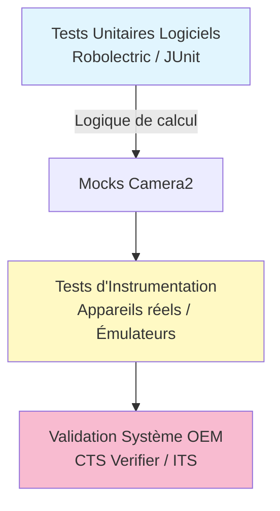

# Chapitre 27 : Tester la caméra

## Résumé

Tester du code de caméra est notoirement difficile. Contrairement à un simple test unitaire de logique métier, le comportement de la caméra dépend d'un matériel physique imprévisible, des conditions d'éclairage ambiantes et, surtout, de la fidélité de l'implémentation du HAL (Hardware Abstraction Layer) de l'OEM. Une application qui fonctionne parfaitement sur un Pixel peut planter sur un appareil d'entrée de gamme en raison d'une condition de concurrence dans le pilote de la caméra.

Ce chapitre aborde le test sous trois angles :
1. **Validation OEM (ITS & CTS)** : Comment Google garantit que le matériel se comporte selon les spécifications.
2. **Tests d'instrumentation d'application** : Utiliser `AndroidJUnit4` et Espresso pour tester votre logique UI de caméra.
3. **Tests sans matériel (Mocks & Simulateurs)** : Comment tester votre flux Camera2 sur des serveurs CI ou des émulateurs.

L'application **Android Camera Parameters** ([Google Play](https://play.google.com/store/apps/details?id=com.minininja.cameraparams), [GitHub](https://github.com/zoozooll/AndroidCameraParameters)) est elle-même un outil de test. Elle valide que les rapports du HAL correspondent à la réalité sur l'appareil. Vous pouvez l'utiliser pour "valider manuellement" qu'un nouvel appareil de test supporte les fonctionnalités dont votre application a besoin avant d'écrire une seule ligne de code de test.

---

## La pyramide des tests de caméra



---

## 1. Validation OEM : ITS et CTS

Si vous travaillez pour un fabricant d'appareils ou si vous développez une application de caméra système, ce sont vos outils quotidiens. Pour les développeurs d'applications tiers, ils fournissent le contexte de *pourquoi* certaines caméras se comportent mal.

### Camera ITS (Image Test Suite)
L'ITS fait partie du CTS (Compatibility Test Suite) d'Android. Il s'agit d'un ensemble de scripts Python qui s'exécutent sur un PC hôte et commandent le téléphone placé dans une "boîte ITS" (un environnement contrôlé avec des mires de test et un éclairage calibré).
- **Ce qu'il teste** : Fidélité des couleurs, précision de l'exposition, temps de mise au point, synchronisation multi-caméras.
- **Pourquoi c'est important** : Si un appareil échoue à l'ITS, il ne peut pas légalement inclure le Google Play Store.

### CTS Verifier
Contrairement aux tests automatisés, le CTS Verifier nécessite qu'un humain manipule l'appareil.
- **Tests Camera2** : L'opérateur doit pointer la caméra vers une mire, déclencher le flash, basculer entre les objectifs et valider que l'image résultante est correcte.
- **Test de latence** : Mesure le délai entre l'appui sur le bouton et la capture réelle.

---

## 2. Tests d'instrumentation d'application

Pour votre application, vous voulez tester : "Si j'appuie sur le bouton de capture, est-ce qu'une image est enregistrée dans le MediaStore ?"

### Utiliser Espresso avec Camera2
Le défi est que la caméra est asynchrone. Vous devez utiliser des **IdlingResources** pour dire à Espresso d'attendre que la capture soit terminée.

```kotlin
@RunWith(AndroidJUnit4::class)
class CameraCaptureTest {

    @get:Rule
    val activityRule = ActivityScenarioRule(CameraActivity::class.java)

    @Test
    fun testCaptureSavesFile() {
        // 1. Ouvrir l'aperçu
        onView(withId(R.id.preview_view)).check(matches(isDisplayed()))

        // 2. Appuyer sur le déclencheur
        onView(withId(R.id.capture_button)).perform(click())

        // 3. Attendre la fin du traitement (via IdlingResource ou attente explicite)
        // Note: En production, utilisez un IdlingResource lié au StateCallback
        Thread.sleep(2000)

        // 4. Vérifier qu'un message de succès apparaît
        onView(withText(containsString("Photo enregistrée")))
            .check(matches(isDisplayed()))
    }
}
```

---

## 3. Tester sans matériel (Mocks et Émulateur)

Exécuter des tests sur des appareils réels dans un pipeline CI (Continuous Integration) est coûteux. Vous pouvez mocker l'API Camera2 pour tester la logique de votre application.

### Camera2 Mocking
Puisque `CameraManager`, `CameraDevice` et `CameraCaptureSession` sont des classes concrètes (et non des interfaces) dans le SDK Android, le mocking direct est difficile.
- **Approche 1 : Wrappers**. Créez vos propres interfaces (ex : `CameraService`) et mockez-les avec Mockito.
- **Approche 2 : Caméra de l'émulateur**. L'émulateur Android supporte une caméra virtuelle qui peut :
    - Afficher un damier en mouvement.
    - Utiliser la webcam de votre PC.
    - Signaler un niveau matériel `LIMITED` ou `FULL`.

### Configurer l'émulateur pour le test Camera2
Dans les réglages de l'AVD (Android Virtual Device) :
1. Allez dans **Advanced Settings**.
2. Réglez **Back Camera** sur "Emulated" ou "Webcam0".
3. Le matériel émulé supporte désormais la plupart des API `CaptureRequest` de base, ce qui permet de tester les curseurs d'exposition et de mise au point.

---

## Stratégie de test recommandée pour les développeurs

1. **Vérification des capacités (Unitaire)** : Testez votre code de logique de filtrage (celui qui lit les `CameraCharacteristics`). Vérifiez qu'il désactive correctement les boutons si une capacité (ex : RAW) est manquante.
2. **Logique de rotation (Unitaire)** : Testez vos calculs de `getJpegOrientation` avec différentes combinaisons de rotation d'appareil et de capteur.
3. **Test de fumée UI (Instrumentation)** : Sur un émulateur, vérifiez que l'activité de la caméra se lance sans crasher.
4. **Validation de qualité (Manuel)** : Utilisez **Android Camera Parameters** sur vos appareils de test réels pour documenter les "quirks" (bizarreries) de chaque modèle avant de livrer une mise à jour.

## Résumé

Tester la caméra Android demande de la rigueur. Le système s'appuie sur le CTS/ITS pour la conformité matérielle. Pour votre application, privilégiez des tests d'instrumentation sur émulateur pour la stabilité de l'UI et des tests unitaires pour votre logique de calcul (rotation, filtrage des capacités). Ne négligez jamais le test sur appareil réel, car c'est là que les bugs de pilotes OEM se manifestent.

## Et ensuite ?

Félicitations, vous avez parcouru l'intégralité du guide Camera2 ! Pour approfondir des points spécifiques, consultez l'**Encyclopédie des métadonnées de la caméra**, une référence complète de chaque clé de caractéristiques et de résultat, de `SENSOR_INFO_ACTIVE_ARRAY_SIZE` à `LENS_DISTORTION`.
