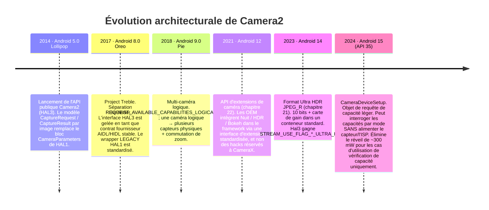

# Chapitre 28 : Architecture de Camera2

## Résumé

C'est le chapitre que vous avez mérité. Dans les chapitres 1 à 27, vous avez utilisé `CameraManager`, `CameraCharacteristics`, `CaptureRequest`, `CaptureResult`, `CameraCaptureSession`, `ImageReader`, CameraX, la pile native NDK, les wrappers de coroutines et les mocks de test. Vous connaissez chaque surface d'API publique. Maintenant, nous retirons chaque abstraction successivement, de la ligne de code Kotlin que vous écrivez jusqu'aux électrons individuels traversant le bus MIPI CSI-2 entre le capteur et le SoC, le moteur à bobine mobile (VCM) déplaçant le groupe de lentilles de 10 micromètres, et le contrôleur de flash LED émettant une impulsion stroboscopique au xénon ou à LED en synchronisation parfaite à la microseconde avec l'obturateur roulant du capteur.

À la fin de ce chapitre, vous serez en mesure de regarder n'importe quelle `CaptureRequest` et de mapper, couche par couche, où va chaque partie, qui la traduit, qui la valide et qui l'exécute finalement sur le silicium. Vous comprendrez également l'abstraction `CameraDeviceSetup` d'Android 15 (API 35) comme exemple d'une tendance architecturale d'une décennie : découpler progressivement les *requêtes de capacités* des *états de puissance matériels* afin que les applications puissent sonder une caméra sans brûler les ~300 mW nécessaires pour alimenter le capteur et l'ISP.

Pour inspecter les capacités exactes de n'importe quel appareil réel et les recouper avec les couches d'architecture décrites ici, installez **Android Camera Parameters** ([Google Play](https://play.google.com/store/apps/details?id=com.minininja.cameraparams), [GitHub](https://github.com/zoozooll/AndroidCameraParameters)). Il lit chaque clé `CameraCharacteristics` que les couches ci-dessous exposent à l'API publique.

---

## Diagramme complet de la pile de couches

C'est le diagramme le plus important de tout le livre. Chaque couche à partir d'ici est du code réel avec un chemin réel dans le projet Android Open Source (AOSP), un propriétaire réel et une limite Binder ou d'appel de fonction réelle. Nous parcourrons chaque couche de haut en bas, puis nous montrerons l'évolution de la pile au cours de la dernière décennie, enfin nous cartographierons votre parcours d'apprentissage à travers les couches.

```mermaid
graph TB
    subgraph APP["Couche App (votre code)"]
        direction TB
        A1["Kotlin / Java / C++ NDK<br/>cameraManager.openCamera(id, cb, handler)<br/>session.capture(request, cb, handler)<br/>captureResult.get(SENSOR_EXPOSURE_TIME)"]
    end
    subgraph FRAME["Couche Framework Java/Kotlin — android.hardware.camera2.*"]
        direction TB
        F1["CameraManager · CameraCharacteristics<br/>CaptureRequest.Builder · CaptureResult<br/>CameraDevice · CameraCaptureSession"]
        F2["CameraBinderWrapper (AOSP frameworks/base)<br/>Traduit les objets Java → colis Binder AIDL"]
    end
    subgraph BIND["Couche IPC — Binder / HwBinder"]
        direction TB
        B1["AIDL ICameraService (AOSP)<br/>Framework ↔ CameraService"]
        B2["HIDL / AIDL HAL Binder (Treble)<br/>CameraService ↔ Vendor HAL"]
    end
    subgraph NS["Couche Native Mediaserver (system/bin/cameraserver)"]
        direction TB
        N1["CameraService (frameworks/av/services/camera/)"]
        N2["Camera3Device<br/>frameworks/av/services/camera/libcameraservice/device3/<br/>— Valide la requête vs les sorties de session<br/>— Construit camera3_capture_request_t<br/>— Analyse camera3_capture_result_t"]
        N3["CameraProviderManager (frameworks/av)<br/>Énumère les implémentations HAL du fournisseur"]
    end
    subgraph HAL["Couche Vendor HAL (code OEM / SoC)"]
        direction TB
        H1["Interface HAL3 : camera3_device_t<br/>— process_capture_request()<br/>— process_capture_result()<br/>— flush()"]
        H2["Wrapper HAL1 (Hérité)<br/>camera2compat::Camera2Compat<br/>Traduit la requête HAL3 → HAL1 CameraParameters<br/>pour < INFO_SUPPORTED_HARDWARE_LEVEL_LIMITED"]
        H3["Implémentation du fournisseur<br/>Qualcomm QCamera2 · MediaTek CamHAL · Samsung Exynos Camera HAL"]
    end
    subgraph K["Couche Noyau (Linux)"]
        direction TB
        K1["/dev/videoX — Pilote de capture vidéo V4L2<br/>VIDIOC_S_FMT · VIDIOC_REQBUFS · VIDIOC_QBUF / DQBUF"]
        K2["Pilote ISP (Qualcomm CAMSS / Pilote ISP MediaTek)<br/>Nœud V4L2 m2m de traitement de mémoire à mémoire"]
        K3["Pilote de sous-périphérique de capteur<br/>Écritures I2C pour mode / exposition / gain / VCM"]
        K4["Pilote récepteur MIPI CSI-2 (SoC)<br/>Configuration des voies, transitions LP/HS, vérification ECC/CRC"]
    end
    subgraph HW["Couche matérielle physique"]
        direction TB
        HW1["Assemblage de l'objectif<br/>Moteur à bobine mobile VCM (I2C)<br/>Déplace le groupe de lentilles pour la mise au point / OIS"]
        HW2["Matrice de pixels du capteur de caméra<br/>Capteur CMOS (Sony IMX / Samsung ISOCELL / OmniVision)<br/>Exposition → Lecture → A/N"]
        HW3["Bus physique MIPI CSI-2<br/>2/4/8 paires différentielles à 1,5 – 2,5 Gbps/voie"]
        HW4["ISP Processeur de signal d'image (sur le SoC)<br/>Dématriçage · Réduction du bruit · Accentuation · Fusion HDR · Détection visage matériel"]
        HW5["Contrôleur de flash LED (I2C)<br/>Stroboscope au xénon ou puits de courant LED<br/>Synchronisé avec la broche EXRST du capteur"]
    end

    APP -->|appel de fonction| FRAME
    FRAME -->|colis AIDL| BIND
    BIND -->|HwBinder| NS
    NS -->|HAL3 AIDL/HIDL| HAL
    HAL -->|appels système ioctl()| K
    K -->|écritures I2C + signaux de voie MIPI + files de commandes ISP| HW

    style APP fill:#e6d9f2
    style FRAME fill:#d9e6f2
    style BIND fill:#fff3cd,stroke:#ffc107,stroke-width:2px
    style NS fill:#d9f2e6
    style HAL fill:#f2d9e6
    style K fill:#e6d9e6
    style HW fill:#f2e6d9,stroke:#d4a373,stroke-width:2px
```

Maintenant, allons de haut en bas.

---

## Couche 1 — Couche App (Votre code)

C'est le code que vous avez écrit. `cameraManager.openCamera(id, stateCallback, cameraHandler)`. Vous connaissez cette couche par cœur. Deux faits que vous n'avez peut-être pas internalisés :
- Chaque appel `CaptureRequest.Builder.set(key, value)` que vous effectuez ajoute une *entrée de métadonnées étiquetée* à une structure parcelable qui reflète exactement la structure C `camera_metadata_t` dans `system/media/camera/include/system/camera_metadata.h`. Il n'y a pas de traduction magique entre votre `CaptureRequest` Kotlin et la requête du HAL — ils ont le même format de métadonnées binaire, juste enveloppés avec des liaisons linguistiques différentes.
- Chaque appel `CaptureResult.get(key)` que vous effectuez lit les octets exacts que le HAL a écrits dans le tampon de réponse. Si un HAL signale incorrectement le temps d'exposition sur une version OTA spécifique, votre application lit exactement cette valeur erronée. Il n'y a pas de couche de validation au niveau du framework au-dessus du HAL corrigeant les erreurs du fournisseur. C'est pourquoi le test de bon fonctionnement sur le matériel réel du chapitre 27 existe.

---

## Couche 2 — Couche Framework Java/Kotlin (`android.hardware.camera2.*`)

La couche Framework (AOSP `frameworks/base/core/java/android/hardware/camera2/`) ne fait que deux choses :
1. Expose la surface de l'API publique (`CameraManager`, `CameraDevice`, etc.) que vous appelez.
2. Traduit entre les objets Java `CaptureRequest` / `CaptureResult` et leurs représentations transportables par Binder sur le réseau.

Elle n'applique aucune politique au-dessus du HAL. Elle n'effectue aucune réécriture de métadonnées. Elle ne "répare" pas les requêtes. C'est une fine couche de traduction plus un cache pour le bloc `CameraCharacteristics` immuable récupéré une fois par ID de caméra au démarrage de l'appareil.

La limite Binder se trouve dans `CameraManager` → `ICameraService` AIDL, qui est la couche suivante.

---

## Couche 3 — Couche IPC : Binder / HwBinder (Treble)

C'est le contrat architectural critique que Project Treble (Android 8.0, 2017) a verrouillé. Deux domaines Binder sont impliqués :

| Domaine Binder    | Connecte                                              | Protocole       | Qui applique la stabilité de l'ABI |
|-------------------|-------------------------------------------------------|-----------------|---------------------------------|
| `/dev/binder`     | Framework ↔ cameraserver (côté system_server)         | AIDL            | Plateforme (même partition build) |
| `/dev/hwbinder`   | cameraserver ↔ vendor camera HAL                      | HIDL / AIDL HAL | Treble (interface fournisseur stable)|

Avant Treble, le HAL était un `.so` chargé via `dlopen()` directement dans le processus de `cameraserver`. Chaque mise à jour OTA de l'OEM devait reconstruire la caméra *et* le framework ensemble. La séparation HwBinder de Treble signifie que le HAL du fournisseur est son propre processus, sa propre partition, son propre calendrier de mise à jour de sécurité de 3 ans, et le contrat entre lui et `cameraserver` est versionné et gelé pour la durée de vie de l'appareil. Pour vous, en tant que développeur d'applications, c'est la raison principale pour laquelle le comportement de l'API Camera2 est prévisible à travers les OTA : l'interface HAL ne peut littéralement pas changer sans briser les tests de conformité Treble.

Le wrapper LEGACY HAL1 vit sous cette limite, à l'intérieur du processus HAL du fournisseur, il est donc invisible pour vous au niveau de la couche application, sauf via `INFO_SUPPORTED_HARDWARE_LEVEL_LEGACY`.

---

## Couche 4 — Couche Native Mediaserver : `CameraService` / `Camera3Device`

`/system/bin/cameraserver` est un démon natif lancé au démarrage par `init.rc`. Il fonctionne en permanence, possède chaque caméra ouverte sur l'appareil et est le seul arbitre de l'application qui accède à la caméra (l'application au premier plan gagne ; tout le reste est déconnecté).

Ses deux classes les plus importantes :

1. **`CameraService`** (`frameworks/av/services/camera/libcameraservice/CameraService.cpp`) :
   - Expose `ICameraService` AIDL au framework.
   - Applique les vérifications d'autorisation `android.permission.CAMERA` pour chaque appel Binder (l'appel d'une application sans autorisation CAMERA est rejeté *dans cameraserver* avant même d'atteindre le HAL).
   - Gère l'arbitrage de l'ouverture concurrente (deux applications demandent la même caméra → l'activité de premier plan l'obtient ; l'application en arrière-plan reçoit `onDisconnected`).
   - Gère `CameraProviderManager` pour énumérer les modules HAL des fournisseurs.

2. **`Camera3Device`** (`frameworks/av/services/camera/libcameraservice/device3/Camera3Device.cpp`) :
   - Le cœur du pipeline.
   - Valide que chaque surface de sortie dans une requête de capture fait réellement partie de l'ensemble des sorties configurées de la session. (C'est ici que le framework lance `IllegalArgumentException: Surface not in configured outputs`.)
   - Emballe votre `CaptureRequest` parcelé dans une structure HAL3 `camera3_capture_request_t`.
   - Diffuse les requêtes une par une dans le HAL via `process_capture_request(request)`.
   - Reçoit en retour `camera3_capture_result_t` du HAL, parcelle les métadonnées + les barrières (fences), et les renvoie vers le haut de la chaîne Binder jusqu'à votre `CaptureCallback.onCaptureCompleted`.
   - Gère `flush()` pour vous, les chemins d'erreur, les rappels `notify()` d'obturateur et d'erreur, et les barrières de libération de tampon de sortie pour l'interopérabilité EGL/Vulkan.

`Camera3Device` fait environ 15 000 lignes de C++ et est la pièce la plus testée de toute la pile (les tests CTS du chapitre 27 ciblent directement le comportement de `Camera3Device` du côté framework). Si vous lisez un jour un rapport de bogue disant "cette clé de requête fonctionne sur Camera2 NDK mais pas sur Java Camera2", l'écart est presque toujours un chemin de validation ou de conversion manquant à l'intérieur de `Camera3Device`.

---

## Couche 5 — Couche Vendor HAL : HAL3 (`camera3_device_t`)

C'est là que réside réellement la différenciation des OEM. Chaque fournisseur de SoC livre sa propre implémentation HAL3 :

| Fournisseur  | Nom de code HAL                           | Interface AOSP                              |
|--------------|-------------------------------------------|----------------------------------------------|
| Qualcomm     | QCamera2 / QCamera3 (code mm-camera)      | `camera3_device_t` + extensions `vendor.qti.hardware.camera*` |
| MediaTek     | CamHAL (mtkcam)                           | Même `camera3_device_t` + extensions MediaTek |
| Samsung      | Exynos Camera HAL                         | Même `camera3_device_t` + extensions Samsung |
| Google Tensor| Google Camera HAL (Pixels)                | Même `camera3_device_t` + logique Google pour Night Sight / RAW computationnel |

Le contrat HAL3 (défini dans `hardware/libhardware/include/hardware/camera3.h`) se résume exactement à quatre opérations principales sur un appareil ouvert :

```cpp
// Contrat HAL3 simplifié — c'est toute l'interface
typedef struct camera3_device {
    hw_device_t common;

    int (*configure_streams)(
        const struct camera3_device *,
        camera3_stream_configuration_t *stream_list
    );

    int (*process_capture_request)(
        const struct camera3_device *,
        camera3_capture_request_t *request
    );

    void (*get_metadata_vendor_tag_ops)(...);

    int (*flush)(const struct camera3_device *);

    void (*dump)(...);
} camera3_device_t;
```

Le HAL reçoit des requêtes, produit des résultats et des tampons de sortie. C'est tout. Le modèle requête/réponse est la signature de HAL3 — HAL1 était un simple bloc de chaînes `CameraParameters` (`"preview-size=1920x1080;picture-size=..."`) que toute l'industrie détestait pour son manque de contrôle par image. Le modèle requête/réponse de HAL3 est ce qui *permet* chaque fonctionnalité avancée que vous avez utilisée dans ce livre : exposition manuelle par image, capture RAW, flux physiques multi-caméras, retraitement, surfaces d'entrée ZSL. Tout cela était impossible sous HAL1.

### Le wrapper LEGACY HAL1

`INFO_SUPPORTED_HARDWARE_LEVEL_LEGACY` signifie que le fournisseur a *encore* livré un HAL1 `.so` et que l'appareil utilise le shim `camera2compat::Camera2Compat` d'AOSP pour traduire les appels de requête/réponse HAL3 en l'ancien bloc `CameraParameters` + les points d'entrée `startPreview()`/`takePicture()` de HAL1. Cette couche de traduction est la raison pour laquelle le chapitre 24 vous a prévenu que `CONTROL_MODE_OFF` ne fait rien silencieusement sur les appareils `LEGACY` — HAL1 n'a pas de concept de `CONTROL_MODE` par image vers lequel traduire. Le shim ignore cette entrée de métadonnées.

---

## Couche 6 — Couche Noyau : V4L2 + MIPI CSI-2 + Pilotes de capteur

Le processus HAL3 appelle le noyau Linux exclusivement via des appels système `ioctl()` sur les nœuds de périphérique. Quatre catégories de pilotes de noyau interagissent pour traiter une seule image :

1. **Pilote récepteur MIPI CSI-2** (`/dev/v4l-subdevX`) : Configure le nombre de voies PHY et le débit de données, gère les transitions de faible puissance à haute vitesse sur les paires différentielles, valide l'ECC/CRC des paquets et transfère via DMA les lignes de pixels reçues dans le tampon circulaire d'entrée de l'ISP. Vous ne touchez jamais à ce pilote depuis l'espace utilisateur. Une mauvaise erreur CRC CSI-2 se manifeste à vous comme un tampon de sortie corrompu avec un statut `camera3_stream_buffer_t.status == BUFFER_ERROR`.

2. **Pilote de sous-périphérique de capteur** (`/dev/v4l-subdevY`, contrôlé par I2C) :
   - Écrit les registres du capteur via I2C (un bus latéral lent, ~100 KHz, c'est pourquoi les changements d'exposition et les commutations de mode ont une latence de ~2-3 images même pour les appareils `HARDWARE_LEVEL_3`).
   - Définit le temps d'exposition (début/fin de l'obturateur roulant par image), le gain analogique, le gain numérique, la résolution, le mode de regroupement (binning).
   - Contrôle la mise au point du VCM via un DAC I2C qui envoie du courant dans la bobine mobile (voir couche matérielle).
   - Contrôle la synchronisation de l'impulsion du flash via une broche de sortie EXRST côté capteur que le contrôleur de flash écoute.

3. **Nœud de capture vidéo V4L2** (`/dev/video0` etc.) : Le HAL appelle `VIDIOC_REQBUFS` pour allouer des tampons basés sur gralloc (les mêmes descripteurs `AHardwareBuffer` que vous avez importés dans Vulkan au chapitre 25), puis `VIDIOC_QBUF` (enfiler un tampon) dans une boucle. À mesure que les images arrivent du récepteur CSI-2 + ISP, le HAL appelle `VIDIOC_DQBUF` (défiler un tampon) et l'envoie à `Camera3Device` sous la forme d'un `camera3_stream_buffer_t`.

4. **Pilote de mémoire à mémoire ISP** (nœud `/dev/videoN m2m`) : Séparément du chemin de capture, le HAL enfile les tampons d'entrée de retraitement (pour le ZSL, chapitre 23) dans la file d'attente m2m de l'ISP pour exécuter le dématriçage, le débruitage, la fusion HDR ou la détection de visage sur les images RAW précédemment capturées. Le résultat émerge sous forme de tampon de sortie traité JPEG/YUV/PRIVATE.

---

## Couche 7 — Couche matérielle physique

Enfin, les électrons. Chaque couche ci-dessus est du code s'exécutant sur le SoC. La couche matérielle est l'endroit où les photons sont convertis en électrons et traités :

```mermaid
graph LR
    LENS["Groupe de lentilles<br/>Éléments en verre<br/>~10–20 mm de distance focale"] --> VCM["Moteur à bobine mobile VCM<br/>DAC I2C → courant bobine →<br/>déplacement lentille ±50 µm<br/>Mise au point + stabilisation OIS"]
    VCM --> SENSOR[Matrice de pixels du capteur CMOS<br/>Sony IMX / Samsung ISOCELL<br/>~12 MP – 200 MP<br/>obturateur roulant : lecture ligne par ligne<br/>Obturateur global (rare) sur capteurs industriels]
    SENSOR -->|Bayer 10/12/14 bits converti A/N| CSI[PHY MIPI CSI-2<br/>2/4/8 paires<br/>jusqu'à 20 Gbps total]
    CSI -->|Interconnexion interne au SoC| ISP[ISP — sur la puce du SoC<br/>Dématriçage · CCM · NR · stats 3A · fusion HDR<br/>souvent 1 TOPS+ de DNN pour visage/segmentation]
    ISP -->|Tampons Gralloc → DRAM| CPU[CPU / GPU<br/>Le processus de votre application les lit]
    FLASH["Flash LED / Xénon<br/>Contrôleur de flash I2C<br/>Impulsion synchronisée avec EXRST du capteur"] --> SENSOR
```

Chaque sous-système physique :
- **Objectif et VCM** : Un mouvement de 10 µm de l'objectif est une étape d'AF. L'OIS (Stabilisation optique de l'image) ajoute un retour gyroscopique en boucle fermée au VCM, poussant l'objectif 500 à 5000 fois par seconde pour annuler le tremblement de la main. Le pilote du noyau écrit les valeurs du DAC I²C ; votre application le contrôle via les clés de métadonnées `LENS_FOCUS_DISTANCE` et `LENS_OPTICAL_STABILIZATION_MODE`.
- **Matrice de pixels du capteur** : Les photodiodes accumulent une charge proportionnelle au nombre de photons incidents. La lecture est à obturateur roulant (ligne par ligne de haut en bas), c'est pourquoi votre curseur AE au chapitre 14 avait une latence de 2 à 3 images — l'exposition pour l'image N est programmée pendant la lecture de l'image N-1.
- **Bus MIPI CSI-2** : Paires différentielles jusqu'à 2,5 Gbps/voie × 8 voies = 20 Gbps bruts. Plus qu'il n'en faut pour du Bayer 12 bits 4K à 60 fps. Les erreurs de paquets déclenchent une retransmission CRC au niveau matériel, mais une image corrompue vous parvient avec `BUFFER_ERROR`.
- **ISP** : Le héros méconnu. Son matériel de dématriçage + réduction de bruit + accentuation fonctionne à plus de 1 Gigapixel/sec et évite à votre CPU de le faire. Sur les SoC Tensor / Snapdragon modernes, il exécute également des accélérateurs DNN pour la segmentation de scène, la détection de visage et la fusion HDR dans le capteur avant même que le CPU ne voie l'image.
- **Contrôleur de flash** : L'impulsion du flash doit se déclencher *exactement pendant* la fenêtre d'exposition de l'obturateur roulant de l'image qu'elle est censée éclairer. Le bit `FLASH_STATE_FIRED` dans `CaptureResult` confirme l'alignement ; un désalignement produit des images partiellement exposées.

---

## Évolution architecturale : Camera2 à travers les versions d'Android

Camera2 ne s'est pas fait en un jour. Chaque 2 ou 3 versions d'Android a ajouté une nouvelle primitive architecturale qui a débloqué des fonctionnalités réelles pour les développeurs :



La tendance dans chaque version est claire : **le découplage**.
- Android 8 a découplé le HAL du framework (Treble).
- Android 9 a découplé l'ID de la caméra logique des capteurs physiques.
- Android 12 a découplé les extensions OEM du code de l'application.
- Android 14 a découplé l'encodage HDR du pipeline RAW.
- **Le `CameraDeviceSetup` d'Android 15 découple les requêtes de capacités de l'état de puissance matériel.**

### Zoom sur : `CameraDeviceSetup` d'Android 15 — Le découplage architectural en action

`CameraDeviceSetup` (Android 15, API 35) est l'exemple le plus pur de cette tendance. Avant l'API 35, si une application voulait savoir "est-ce que ce combo de flux 4K@60 avec analyse YUV_420_888 en même temps est possible ?", la seule façon d'appeler `isSessionConfigurationSupported` était via une instance `CameraCharacteristics` récupérée via `CameraManager.getCameraCharacteristics(id)`. En interne, cela forçait le HAL à alimenter le capteur (≈ 250–350 mW) et l'ISP pendant plusieurs millisecondes juste pour lire une table de capacités qui est effectivement statique pour la durée de vie de l'appareil. Sur une application limitée par la batterie, c'était impossible pour toute UX de "vérification de fonctionnalité avant vol".

`CameraDeviceSetup` corrige cela en fournissant une représentation légère qui ne consomme pas d'énergie :

```kotlin
// Nécessite l'API 35+
val setup: CameraDeviceSetup = cameraManager.getCameraDeviceSetup(cameraId)
val supported: Boolean = setup.isSessionConfigurationSupported(sessionConfig)
// getCameraDeviceSetup() n'alimente PAS le capteur ni l'ISP
// Le résultat peut être mis en cache pour toute la durée de fonctionnement de l'appareil
```

Architecturalement, la table des capacités réside désormais dans un bloc pré-récupéré, signé et indépendant de la partition dans la partition fournisseur, et `getCameraDeviceSetup` le lit via un appel HwBinder séparé qui ignore entièrement la séquence de mise sous tension de `Camera3Device`. C'est la direction de la prochaine décennie : *chaque* API qui peut recevoir une réponse statique finira par avoir un équivalent léger sans consommation d'énergie. Attendez-vous à ce que `CameraDeviceSetup` gagne de plus en plus de requêtes de capacités dans Android 16+.

---

## Le parcours du lecteur cartographié sur les couches d'architecture

Enfin, cartographiez votre propre parcours à travers ce livre sur les couches d'architecture. Chaque chapitre correspond à une couche spécifique ou à une limite d'interface :

```mermaid
flowchart TB
    subgraph Journey["Votre parcours à travers ce livre (Chapitres → Couches)"]
        direction LR
        C1["Ch. 1–4<br/>Fondations<br/>Concepts de la couche matérielle"] ~~~ H_L1["↔ Couche HW"]
        C2["Ch. 5–9<br/>Première application Camera2<br/>CameraManager · Session · ImageReader"] ~~~ H_L2["↔ App + Framework"]
        C3["Ch. 10–12<br/>Pipeline · Types de capture<br/>Plongée dans les caractéristiques"] ~~~ H_L3["↔ Métadonnées colis + contrat HAL3"]
        C4["Ch. 13–17<br/>3A manuel · Exposition · Focus · WB"] ~~~ H_L4["↔ Clés métadonnées → HAL3 → Pilote capteur I²C"]
        C5["Ch. 18–23<br/>RAW · HDR · Multi-Cam · ZSL · Extensions"] ~~~ H_L5["↔ Modèle requête HAL3 · Retraitement ISP m2m"]
        C6["Ch. 24 CameraX<br/>Façade UseCase + Interop"] ~~~ H_L6["↔ Abstraction côté application sur le Framework"]
        C7["Ch. 25 Natif NDK<br/>ACamera + AHB → Vulkan"] ~~~ H_L7["↔ Shim NDK directement au-dessus de Camera3Device"]
        C8["Ch. 26 Coroutines/Flow<br/>Enveloppement asynchrone des rappels"] ~~~ H_L8["↔ Asynchrone couche application autour des limites Binder"]
        C9["Ch. 27 Tests ITS/CTS<br/>Matériel Mock vs Réel"] ~~~ H_L9["↔ Validation de chaque couche via harnais de test"]
        C10["Ch. 28 CE CHAPITRE<br/>Architecture de la pile complète"] ~~~ H_L10["↔ TOUTES les couches, de bout en bout"]
    end
    H_L1 --> HW
    H_L2 --> FRAME
    H_L3 --> HAL
    H_L4 --> K
    H_L5 --> HAL
    H_L6 --> APP
    H_L7 --> NS
    H_L8 --> APP
    H_L9 --> BIND
    H_L10 --> HW
```



En lisant ce chapitre en dernier, vous avez fait correspondre l'architecture à la pratique. Vous n'avez pas appris HAL3 de manière abstraite le premier jour pour ensuite lutter pour le mapper à du code réel. Vous avez appris en *faisant* : ouvrir → configurer → capturer → résultat, pendant 27 chapitres, puis vous avez tiré le rideau pour voir qui répondait réellement à chacun de ces appels.

---

## Résumé

Camera2 est une pile à sept couches : App → Framework (Java/Kotlin `android.hardware.camera2.*`) → Binder/HwBinder IPC → `CameraService` natif + `Camera3Device` → Vendor HAL3 (`camera3_device_t`, avec un wrapper LEGACY HAL1) → Pilotes de noyau V4L2 (MIPI CSI-2, capteur, capture, ISP m2m) → Matériel physique (objectif/VCM, capteur, bus MIPI, ISP, contrôleur de flash). Project Treble a verrouillé le contrat HAL via HwBinder, assurant une stabilité à long terme. La tendance architecturale sur dix ans est le découplage progressif, culminant avec le `CameraDeviceSetup` d'Android 15, qui peut interroger les capacités sans alimenter le capteur. Vous avez maintenant mappé chaque fonctionnalité — de l'ISO manuel au chapitre 14 au ZSL au chapitre 23 jusqu'au zéro-copie Vulkan natif au chapitre 25 — à la couche exacte qui l'exécute.

## Et ensuite : Partie VII — Encyclopédie des métadonnées de la caméra

Ceci clôt la Partie VI : Développement moderne de caméras Android. La dernière frontière est une référence détaillée et encyclopédique pour chaque clé de métadonnées `CameraCharacteristics`, `CaptureRequest` et `CaptureResult` que vous avez utilisées dans les 28 chapitres. La Partie VII est l'Encyclopédie des métadonnées : SENSOR, LENS, CONTROL, SCALER, REQUEST — chaque étiquette définie, expliquée, interrogée, recoupée avec des appareils réels et validée par l'application Android Camera Parameters. Ouvrez-la lorsque vous aurez besoin de savoir exactement ce que signifie `SCALER_CROPPING_TYPE`, quels appareils prennent en charge `REQUEST_AVAILABLE_CAPABILITIES_OFFLINE_PROCESSING`, ou comment une clé spécifique se comporte réellement sur un HAL `LEGACY`.
