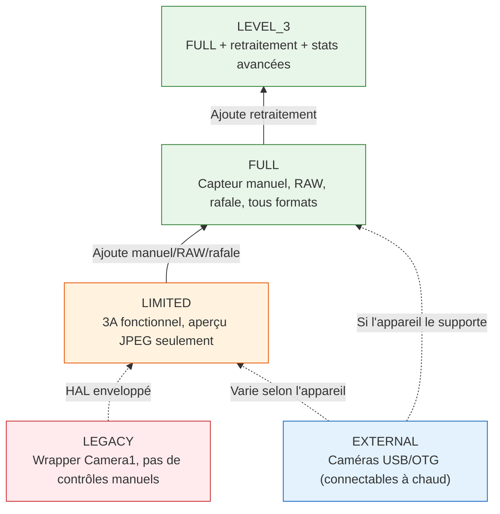
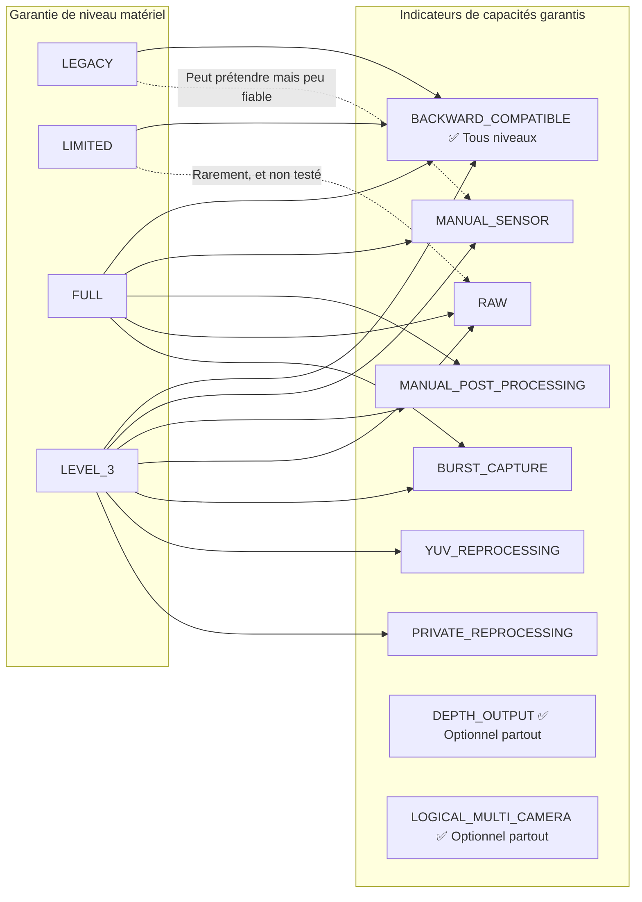
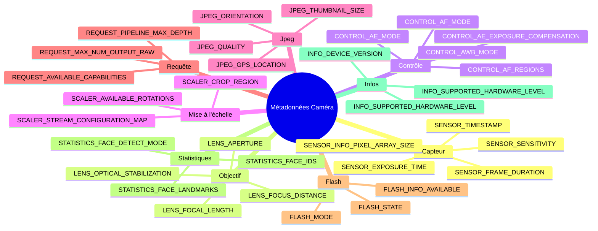

## 12.1 La fiche technique dans votre poche

Avant de pouvoir appeler `openCamera()`, avant de pouvoir construire une `CaptureRequest`, avant de pouvoir configurer une session — il y a `CameraCharacteristics`. C'est la fenêtre immuable, consultable sans mise sous tension, sur *tout* ce qu'une caméra peut faire. Considérez cela comme la fiche technique de la caméra, exposée sous forme d'un objet structuré et interrogeable.

`CameraCharacteristics` est votre outil le plus important pour écrire des applications qui fonctionnent sur les plus de 10 000 modèles d'appareils Android. Vous ne pouvez pas supposer que l'ISO manuel fonctionne. Vous ne pouvez pas supposer que le RAW est disponible. Vous ne pouvez même pas supposer que la caméra supporte l'aperçu en 1080p — à moins de demander aux `CameraCharacteristics`.

Dans le [Chapitre 6](discovering-cameras.md), nous avons abordé les bases : direction de l'objectif, taille du capteur, distance focale. Dans cette plongée profonde, nous allons beaucoup plus loin :
- Les cinq **niveaux matériels** (LEGACY → LIMITED → FULL → LEVEL_3 → EXTERNAL) et ce que chacun garantit.
- La dizaine d'**indicateurs de capacités (flags)** (`MANUAL_SENSOR`, `RAW`, `DEPTH_OUTPUT`, etc.) et quels niveaux matériels les fournissent.
- Comment les clés de métadonnées sont **organisées hiérarchiquement** par sous-système (`android.sensor.*`, `android.lens.*`, `android.control.*`, ...).
- Comment écrire une **requête de capacités complète à l'exécution** avec des solutions de repli gracieuses.

L'application Android Camera Parameters ([GitHub](https://github.com/zoozooll/AndroidCameraParameters), [Play Store](https://play.google.com/store/apps/details?id=com.minininja.cameraparams)) est essentiellement un navigateur de `CameraCharacteristics` sous stéroïdes. Ouvrez-la sur n'importe quelle caméra et vous verrez exactement les clés dont nous discutons dans ce chapitre, organisées par catégorie, avec des étiquettes lisibles par l'homme et le rendu des valeurs en direct.

## 12.2 Ce qu'est réellement CameraCharacteristics

Formellemennt, `CameraCharacteristics` est :

- **Immuable** — Une fois obtenu via `CameraManager.getCameraCharacteristics(id)`, l'objet ne change jamais (avec une exception documentée : `SENSOR_ORIENTATION` sur les pliables à partir de l'API 32).
- **Sans consommation d'énergie** — L'interroger ne met **pas** le capteur ni l'ISP sous tension. Vous pouvez l'appeler dans le `onCreate()` de votre première Activity sans impact sur la batterie.
- **Par caméra** — Chaque ID de caméra logique possède son propre objet `CameraCharacteristics`.
- **Typé et à clés** — Les données sont accessibles via `<Key<T>> get(Key<T> key)` où chaque clé a un type documenté (Int, Long, Float, Rect, Tableau, etc.).

Vous en obtenez un avec un seul appel :

```kotlin
val cameraManager = getSystemService(CAMERA_SERVICE) as CameraManager
val cameraIdList = cameraManager.cameraIdList  // ex : ["0", "1", "2", "3"]

for (id in cameraIdList) {
    val characteristics: CameraCharacteristics = cameraManager.getCameraCharacteristics(id)
    // Interrogez à volonté — aucune énergie de capteur utilisée !
}
```

Sur Android 15 (API 35), vous pouvez utiliser `CameraManager.getCameraDeviceSetup(id)` pour des requêtes légères de configuration de session sans ouvrir la caméra (voir le [Chapitre 28](camera2-architecture.md) pour les détails de `CameraDeviceSetup`).

## 12.3 Niveau matériel : INFO_SUPPORTED_HARDWARE_LEVEL

La clé `CameraCharacteristics` la plus importante est **`INFO_SUPPORTED_HARDWARE_LEVEL`**. Elle définit toute la catégorie du HAL de la caméra et vous indique (globalement) quelles fonctionnalités sont garanties de fonctionner. Il existe cinq niveaux matériels :

### Les cinq niveaux matériels

| Niveau | Constante | Appareils typiques | Ce que cela signifie en pratique |
|--------|-----------|-------------------|----------------------------------|
| **LEGACY** | `INFO_SUPPORTED_HARDWARE_LEVEL_LEGACY` | Appareils budget pré-2015, vieux chipsets | L'API Camera2 est un wrapper autour de l'ancienne API `android.hardware.Camera`. Pas de contrôles par image, pas de réglages manuels, RAW impossible, rafale peu fiable. Traitez ces appareils comme de l'ère Camera1 avec la syntaxe Camera2. |
| **LIMITED** | `INFO_SUPPORTED_HARDWARE_LEVEL_LIMITED` | Téléphones budget (Android Go, SoC d'entrée de gamme comme MediaTek Helio, Snapdragon 4xx) | HAL Camera2 natif mais seulement un sous-ensemble de fonctionnalités. Le 3A (AF/AE/AWB) fonctionne. L'aperçu + JPEG fonctionnent. Mais **pas** de contrôle manuel du capteur, **pas** de RAW, **pas** de rafale garantie, **pas** de retraitement YUV. C'est le niveau "fonctionnel de base" d'Android. |
| **FULL** | `INFO_SUPPORTED_HARDWARE_LEVEL_FULL` | Milieu de gamme et fleurons (Snapdragon 6xx/7xx/8xx, Exynos milieu+, Dimensity 7xxx+) | La catégorie "caméra pro". Garantit MANUAL_SENSOR, MANUAL_POST_PROCESSING, BURST_CAPTURE, réglages par image, 30 fps plein-résol, RAW, tous les formats de sortie, profondeur de pipeline prévisible. Ce que vous voulez pour toute application caméra sérieuse. |
| **LEVEL_3** | `INFO_SUPPORTED_HARDWARE_LEVEL_3` | Fleurons haut de gamme avec ISP avancé (Snapdragon 8 Gen 1+, Pixel 6+, Exynos 2xxx+) | FULL + extras : retraitement YUV (support flux d'entrée, retraitement hors ligne), retraitement privé, statistiques avancées, JPEG matériel + RAW simultanés à la résol max. Requis pour le ZSL avec sortie RAW. |
| **EXTERNAL** | `INFO_SUPPORTED_HARDWARE_LEVEL_EXTERNAL` | Caméras USB, webcams connectées via OTG | HAL de caméra externe. Se comporte comme LIMITED ou FULL selon le périphérique USB. Mise en garde clé : la caméra peut être branchée/débranchée à tout moment, écoutez donc `ACTION_CAMERA_DEVICE_STATE_CHANGED`. |



:::important
Le niveau matériel est une **garantie**, pas un indicateur de type "au mieux". Si un appareil rapporte FULL, le CTS (Compatibility Test Suite) de Google a vérifié que chaque fonctionnalité du niveau FULL fonctionne. Si un appareil rapporte LIMITED, vous ne pouvez compter sur aucune fonctionnalité de niveau FULL — même si elle semble fonctionner sur un appareil LIMITED spécifique, elle cassera sur un autre.
:::

### Vérifier le niveau matériel à l'exécution

```kotlin
val hardwareLevel = characteristics.get(CameraCharacteristics.INFO_SUPPORTED_HARDWARE_LEVEL)

when (hardwareLevel) {
    CameraCharacteristics.INFO_SUPPORTED_HARDWARE_LEVEL_LEGACY -> {
        Log.w("CamCaps", "Matériel LEGACY — manuel/RAW désactivés. Repli sur JPEG basique.")
        disableManualControls()
        disableRawCapture()
    }
    CameraCharacteristics.INFO_SUPPORTED_HARDWARE_LEVEL_LIMITED -> {
        Log.i("CamCaps", "Matériel LIMITED — photo de base + aperçu seulement.")
        disableManualControls()
        disableRawCapture()
        disableBurstCapture()
    }
    CameraCharacteristics.INFO_SUPPORTED_HARDWARE_LEVEL_FULL -> {
        Log.i("CamCaps", "Matériel FULL — activation des contrôles manuels, RAW et rafale.")
        enableManualControls()
        enableRawCapture()
        enableBurstCapture()
    }
    CameraCharacteristics.INFO_SUPPORTED_HARDWARE_LEVEL_3 -> {
        Log.i("CamCaps", "Matériel LEVEL_3 — FULL + retraitement + ZSL + stats avancées.")
        enableManualControls()
        enableRawCapture()
        enableBurstCapture()
        enableReprocessing()
        enableZeroShutterLag()
    }
    CameraCharacteristics.INFO_SUPPORTED_HARDWARE_LEVEL_EXTERNAL -> {
        Log.i("CamCaps", "Caméra EXTERNAL — peut être LIMITED ou FULL ; enregistrement du listener de déconnexion.")
        registerHotplugListener()
        // Sonder dynamiquement les capacités plutôt que de supposer
    }
    else -> {
        Log.w("CamCaps", "Niveau matériel inconnu $hardwareLevel — LIMITED supposé par sécurité.")
        safeDefaultFeatures()
    }
}
```

## 12.4 Capacités : REQUEST_AVAILABLE_CAPABILITIES

Le niveau matériel est une catégorie *grossière*. Pour une détection de fonctionnalités plus fine, Camera2 expose `REQUEST_AVAILABLE_CAPABILITIES` — un `IntArray` d'indicateurs de capacités. Chaque indicateur décrit une chose spécifique que la caméra peut faire.

La relation formelle entre niveau matériel et capacités :



### Les indicateurs de capacités, expliqués

| Constante d'indicateur | Signification | Garantie niveau matériel | Implication pratique |
|-----------------------|---------------|--------------------------|----------------------|
| `BACKWARD_COMPATIBLE` | La caméra implémente l'API Camera2 de base | **Les 5 niveaux** (LEGACY–EXTERNAL) | Si cet indicateur manque, l'appareil caméra est effectivement inutilisable pour votre app. |
| `MANUAL_SENSOR` | L'app peut contrôler manuellement `SENSOR_EXPOSURE_TIME`, `SENSOR_SENSITIVITY`, `SENSOR_FRAME_DURATION`, `LENS_FOCUS_DISTANCE`, `LENS_APERTURE` | Garanti sur **FULL** et **LEVEL_3** | Les UI de mode pro et caméra manuelle nécessitent ceci. Sans cela, tous les curseurs ISO/expo manuels doivent être masqués. |
| `MANUAL_POST_PROCESSING` | L'app peut contrôler manuellement les étapes ISP : réduction de bruit, accentuation des bords, courbe de tonalité, gains et transformée de correction de couleur | Garanti sur **FULL** et **LEVEL_3** | Nécessaire pour les LUTs de style film personnalisées, balance des blancs manuelle via les gains, contrôle du flou/netteté. |
| `RAW` | Le capteur sort des données RAW Bayer via `ImageFormat.RAW_SENSOR`, `RAW10` ou `RAW12` | Garanti sur **FULL** et **LEVEL_3** | La capture DNG, le pipeline d'édition RAW-vers-JPEG, la photographie computationnelle commencent tous ici. |
| `PRIVATE_REPROCESSING` | La caméra supporte une `InputSurface` + retraitement hors ligne d'images au format privé HAL vers JPEG/YUV | Garanti sur **LEVEL_3**. Rare sur FULL. | Active le ZSL (Zero-Shutter-Lag) : tampon circulaire des images passées, retraitement d'une image récente en un cliché haute qualité. |
| `YUV_REPROCESSING` | La caméra supporte une `InputSurface` + retraitement d'images YUV_420_888 fournies par l'app à travers l'ISP | Garanti sur **LEVEL_3** | Permet des pipelines comme "appliquer une LUT cinématique à une vidéo enregistrée" ou "refaire la mise au point du portrait en post-prod". |
| `DEPTH_OUTPUT` | La caméra peut sortir des cartes de profondeur (formats `DEPTH16` / `DEPTH_POINT_CLOUD`) | **Optionnel sur TOUS** les niveaux. Vérifier le tableau explicitement. | Bokeh mode portrait, mesure en RA, scan 3D. Souvent jumelé avec `LOGICAL_MULTI_CAMERA` (doubles caméras physiques pour la profondeur stéréo). |
| `LOGICAL_MULTI_CAMERA` | Cette caméra logique est soutenue par au moins 2 capteurs physiques (ex : ultra-grand-angle + large + téléobjectif) | **Optionnel sur TOUS** les niveaux. Généralement seulement sur les fleurons. | Permet un zoom optique fluide (voir [Chapitre 20](multi-camera.md)). Vous pouvez interroger `LOGICAL_MULTI_CAMERA_PHYSICAL_IDS` pour obtenir les ID des caméras physiques. |
| `BURST_CAPTURE` | `captureBurst()` avec > 1 image fonctionne à pleine résolution sans perte d'images | Garanti sur **FULL** et **LEVEL_3** | Sans cela, la capture en rafale peut saccader, perdre des images ou échouer silencieusement. Le bracketing d'expo/focus nécessite ceci. |
| `CONSTRAINED_HIGH_SPEED_VIDEO` | Supporte `createHighSpeedRequestList()` + vidéo haute vitesse (120 fps, 240 fps) | **Optionnel sur FULL/LEVEL_3**. Rare sur LIMITED. | Enregistrement au ralenti (voir [Chapitre 19](high-speed-video.md)). |
| `MOTION_TRACKING` | La caméra peut suivre des objets / visages à haute fréquence d'images avec une faible latence | Optionnel (rare). Présent sur Pixel et certains fleurons. | Suivi de mouvement RA, autofocus sportif. |
| `LOGICAL_MULTI_CAMERA_SYNC` | Plusieurs caméras physiques dans un appareil logique peuvent capturer des images synchronisées | Optionnel. Requis pour une véritable capture multi-capteurs simultanée. | Photographie computationnelle utilisant plusieurs objectifs à la fois (ex : zoom fusionné). |

### Interroger toutes les capacités à l'exécution

```kotlin
val capabilities = characteristics.get(
    CameraCharacteristics.REQUEST_AVAILABLE_CAPABILITIES
) ?: intArrayOf()

fun hasCapability(cap: Int): Boolean = capabilities.contains(cap)

val supportsManualSensor = hasCapability(
    CameraCharacteristics.REQUEST_AVAILABLE_CAPABILITIES_MANUAL_SENSOR
)
val supportsRaw = hasCapability(
    CameraCharacteristics.REQUEST_AVAILABLE_CAPABILITIES_RAW
)
val supportsBurst = hasCapability(
    CameraCharacteristics.REQUEST_AVAILABLE_CAPABILITIES_BURST_CAPTURE
)
val supportsDepth = hasCapability(
    CameraCharacteristics.REQUEST_AVAILABLE_CAPABILITIES_DEPTH_OUTPUT
)
val supportsLogicalMultiCam = hasCapability(
    CameraCharacteristics.REQUEST_AVAILABLE_CAPABILITIES_LOGICAL_MULTI_CAMERA
)
val supportsHighSpeed = hasCapability(
    CameraCharacteristics.REQUEST_AVAILABLE_CAPABILITIES_CONSTRAINED_HIGH_SPEED_VIDEO
)
val supportsYuvReprocessing = hasCapability(
    CameraCharacteristics.REQUEST_AVAILABLE_CAPABILITIES_YUV_REPROCESSING
)
val supportsPrivateReprocessing = hasCapability(
    CameraCharacteristics.REQUEST_AVAILABLE_CAPABILITIES_PRIVATE_REPROCESSING
)

// Construire un rapport lisible par l'homme
val capabilityReport = buildString {
    appendLine("=== Rapport des capacités de la caméra ===")
    appendLine("BACKWARD_COMPATIBLE:     ${hasCapability(
        CameraCharacteristics.REQUEST_AVAILABLE_CAPABILITIES_BACKWARD_COMPATIBLE
    )}")
    appendLine("MANUAL_SENSOR:           $supportsManualSensor")
    appendLine("MANUAL_POST_PROCESSING:  ${hasCapability(
        CameraCharacteristics.REQUEST_AVAILABLE_CAPABILITIES_MANUAL_POST_PROCESSING
    )}")
    appendLine("RAW:                     $supportsRaw")
    appendLine("BURST_CAPTURE:           $supportsBurst")
    appendLine("YUV_REPROCESSING:        $supportsYuvReprocessing")
    appendLine("PRIVATE_REPROCESSING:    $supportsPrivateReprocessing")
    appendLine("DEPTH_OUTPUT:            $supportsDepth")
    appendLine("LOGICAL_MULTI_CAMERA:    $supportsLogicalMultiCam")
    appendLine("CONSTRAINED_HIGH_SPEED:  $supportsHighSpeed")
}

Log.i("CamCaps", capabilityReport)

// Maintenant, activez/désactivez vos fonctions UI
manualIsoSlider.isEnabled = supportsManualSensor
manualExposureSlider.isEnabled = supportsManualSensor
rawCaptureToggle.isEnabled = supportsRaw
burstCaptureButton.isEnabled = supportsBurst
depthPortraitMode.isEnabled = supportsDepth
zoomSwitcher.isEnabled = supportsLogicalMultiCam
slowMoButton.isEnabled = supportsHighSpeed
zslMode.isEnabled = supportsPrivateReprocessing  // LEVEL_3
```

:::tip
L'application Android Camera Parameters affiche cette requête exacte sous forme de cases à cocher colorées dans la carte **Capabilities** de la vue résumé de la caméra. Vert = supporté, gris = non supporté. Vous pouvez comparer plusieurs caméras côte à côte pour voir comment les capacités de l'ultra-grand-angle diffèrent de celles de la caméra principale.
:::

## 12.5 Organisation des métadonnées : L'espace de noms android.*

Chaque clé dans `CameraCharacteristics`, `CaptureRequest` et `CaptureResult` suit une convention de nommage hiérarchique : `android.<sous-système>.<paramètre>`. Les composants séparés par des points regroupent les réglages liés selon le sous-système matériel ou logiciel qu'ils contrôlent.

### Les classes de sous-systèmes

| Préfixe sous-système | Classe de métadonnées Kotlin | Ce qu'il couvre |
|----------------------|------------------------------|-----------------|
| `android.sensor.*` | `CameraCharacteristics.SensorInfo*`, `CaptureRequest.SENSOR_*`, `CaptureResult.SENSOR_*` | Lecture capteur : temps d'exposition, sensibilité ISO, durée de l'image, horodatage, matrice de pixels, matrice active, direction de l'obturateur roulant, modes de mire de test |
| `android.lens.*` | `LensInfo*`, `Lens.*` | Optique : distance de mise au point, ouverture, distance focale, stabilisation optique (OIS), densité du filtre (ND), plage de mise au point, ouvertures disponibles |
| `android.control.*` | `Control*` | Algorithmes 3A : modes / état / cible / régions de l'AE, modes / état / déclencheur / régions de l'AF, modes / état / régions de l'AWB, anti-bandes, modes scène, modes d'effets, stabilisation vidéo (EIS) |
| `android.scaler.*` | `Scaler.*` | Configuration du pipeline de sortie : zone de recadrage (zoom numérique), rotation, carte de configuration de flux (formats de sortie, tailles, durées), durées minimales d'image disponibles |
| `android.jpeg.*` | `Jpeg*` | Encodage JPEG : qualité, orientation, coordonnées GPS, taille de la vignette, qualité de la vignette |
| `android.request.*` | `Request*` | Capacités à l'échelle du pipeline : tableau des capacités disponibles, profondeur max du pipeline, nombre max sorties raw/proc, clés d'objet de métadonnées, liste de modèles disponibles |
| `android.flash.*` | `FlashInfo*`, `Flash*` | Unité flash : disponibilité, état de charge, température de couleur, luminosité max, mode (arrêt / éclair unique / torche) |
| `android.statistics.*` | `Statistics*` | Sortie des statistiques ISP : détection de visage, ID de visage, points de repère faciaux, scores de visage, histogramme, carte de netteté, carte d'ombrage d'objectif, carte des pixels chauds |
| `android.info.*` | `Info*` | Infos caméra statiques : niveau matériel supporté, version de l'appareil, niveau matériel supporté, modes de détection de visage disponibles, modes de réduction de bruit disponibles |
| `android.black.*` | `BlackLevel*` | Verrouillage du niveau de noir, motif du niveau de noir (correction du bruit à motif fixe) |
| `android.colorCorrection.*` | `ColorCorrection*` | Pipeline couleur : matrice de transformation, gains de correction de couleur (canaux R, V, B), mode de correction d'aberration |
| `android.tonemap.*` | `Tonemap*` | Mappage de tonalité : courbe de tonemap (gamma personnalisé), mode tonemap, contraste, saturation |
| `android.edge.*` | `Edge*` | Amélioration des contours / accentuation de la netteté : mode, intensité |
| `android.noiseReduction.*` | `NoiseReduction*` | Réduction de bruit : mode, intensité, intensité de la NR temporelle |
| `android.shading.*` | `Shading*` | Correction de l'ombrage d'objectif / vignettage : mode, intensité |
| `android.hotPixel.*` | `HotPixel*` | Correction des pixels chauds : mode, carte des pixels chauds |
| `android.distortionCorrection.*` | `DistortionCorrection*` | Correction de la distorsion géométrique de l'objectif : mode |
| `android.depth.*` | `Depth*` | Sortie de profondeur : la profondeur est exclusive, échantillons de profondeur max, format de profondeur |
| `android.logicalMultiCamera.*` | `LogicalMultiCamera*` | Multi-caméra logique : ID caméras physiques, synchronisation des capteurs physiques |



### Note sur la disponibilité des clés

Chaque clé n'existe pas forcément sur chaque appareil. Si vous appelez `get(KEY)` sur une clé que l'appareil ne supporte pas, vous obtenez `null` — d'où les modèles `?: 0` ou `?.let` que vous voyez tout au long de ce livre.

Le modèle sûr est : **vérifiez si la clé existe avant de la lire**, ou utilisez la sécurité contre les nulls de Kotlin pour fournir une valeur par défaut.

```kotlin
// Accès sûr avec valeurs par défaut de repli
val exposureTimeNs: Long = characteristics.get(
    CameraCharacteristics.SENSOR_INFO_EXPOSURE_TIME_RANGE
)?.upper ?: 1_000_000L  // défaut 1ms max si clé manquante

// Traitement conditionnel si la clé existe
characteristics.get(CameraCharacteristics.LENS_INFO_AVAILABLE_APERTURES)?.let { apertures ->
    Log.d("CamCaps", "L'appareil supporte ${apertures.size} ouvertures : ${apertures.contentToString()}")
    buildApertureSelector(apertures)
} ?: run {
    Log.d("CamCaps", "Pas d'ouverture variable sur cet appareil")
    hideApertureControl()
}
```

## 12.6 Requête de capacités complète à l'exécution (Qualité production)

En combinant tout cela, voici une requête de capacités prête pour la production que vous pouvez intégrer dans n'importe quelle application Camera2. Elle combine le niveau matériel, les indicateurs de capacités et les vérifications de clés individuelles :

```kotlin
data class CameraCapabilityProfile(
    val cameraId: String,
    val lensFacing: Int,
    val hardwareLevel: Int,
    val hardwareLevelName: String,
    val supportsManualSensor: Boolean,
    val supportsManualPostProcessing: Boolean,
    val supportsRaw: Boolean,
    val supportsBurst: Boolean,
    val supportsDepth: Boolean,
    val supportsLogicalMultiCam: Boolean,
    val supportsHighSpeedVideo: Boolean,
    val supportsYuvReprocessing: Boolean,
    val supportsPrivateReprocessing: Boolean,
    val maxBurstRaw: Int,
    val maxBurstProcessed: Int,
    val pipelineMaxDepth: Int,
    val availableFocalLengths: FloatArray?,
    val availableApertures: FloatArray?,
    val minFocusDistanceDiopters: Float?,
    val maxDigitalZoom: Float?
)

fun buildCapabilityProfile(
    cameraManager: CameraManager,
    cameraId: String
): CameraCapabilityProfile {
    val c = cameraManager.getCameraCharacteristics(cameraId)

    val hwLevel = c.get(CameraCharacteristics.INFO_SUPPORTED_HARDWARE_LEVEL)
        ?: CameraCharacteristics.INFO_SUPPORTED_HARDWARE_LEVEL_LEGACY

    val hwLevelName = when (hwLevel) {
        CameraCharacteristics.INFO_SUPPORTED_HARDWARE_LEVEL_LEGACY -> "LEGACY"
        CameraCharacteristics.INFO_SUPPORTED_HARDWARE_LEVEL_LIMITED -> "LIMITED"
        CameraCharacteristics.INFO_SUPPORTED_HARDWARE_LEVEL_FULL -> "FULL"
        CameraCharacteristics.INFO_SUPPORTED_HARDWARE_LEVEL_3 -> "LEVEL_3"
        CameraCharacteristics.INFO_SUPPORTED_HARDWARE_LEVEL_EXTERNAL -> "EXTERNAL"
        else -> "INCONNU($hwLevel)"
    }

    val caps = c.get(CameraCharacteristics.REQUEST_AVAILABLE_CAPABILITIES) ?: intArrayOf()
    fun has(cap: Int) = caps.contains(cap)

    // Le niveau matériel fournit des garanties de capacités, mais vérifiez les drapeaux par sécurité
    val atLeastFull = hwLevel == CameraCharacteristics.INFO_SUPPORTED_HARDWARE_LEVEL_FULL ||
                      hwLevel == CameraCharacteristics.INFO_SUPPORTED_HARDWARE_LEVEL_3

    return CameraCapabilityProfile(
        cameraId = cameraId,
        lensFacing = c.get(CameraCharacteristics.LENS_FACING)
            ?: CameraCharacteristics.LENS_FACING_BACK,
        hardwareLevel = hwLevel,
        hardwareLevelName = hwLevelName,

        // Utilisation de la vérification du drapeau + garantie du niveau matériel par sécurité
        supportsManualSensor = has(
            CameraCharacteristics.REQUEST_AVAILABLE_CAPABILITIES_MANUAL_SENSOR
        ) || atLeastFull,
        supportsManualPostProcessing = has(
            CameraCharacteristics.REQUEST_AVAILABLE_CAPABILITIES_MANUAL_POST_PROCESSING
        ) || atLeastFull,
        supportsRaw = has(
            CameraCharacteristics.REQUEST_AVAILABLE_CAPABILITIES_RAW
        ) || atLeastFull,
        supportsBurst = has(
            CameraCharacteristics.REQUEST_AVAILABLE_CAPABILITIES_BURST_CAPTURE
        ) || atLeastFull,
        supportsDepth = has(
            CameraCharacteristics.REQUEST_AVAILABLE_CAPABILITIES_DEPTH_OUTPUT
        ),
        supportsLogicalMultiCam = has(
            CameraCharacteristics.REQUEST_AVAILABLE_CAPABILITIES_LOGICAL_MULTI_CAMERA
        ),
        supportsHighSpeedVideo = has(
            CameraCharacteristics.REQUEST_AVAILABLE_CAPABILITIES_CONSTRAINED_HIGH_SPEED_VIDEO
        ),
        supportsYuvReprocessing = has(
            CameraCharacteristics.REQUEST_AVAILABLE_CAPABILITIES_YUV_REPROCESSING
        ),
        supportsPrivateReprocessing = has(
            CameraCharacteristics.REQUEST_AVAILABLE_CAPABILITIES_PRIVATE_REPROCESSING
        ),

        maxBurstRaw = c.get(CameraCharacteristics.REQUEST_MAX_NUM_OUTPUT_RAW) ?: 1,
        maxBurstProcessed = c.get(CameraCharacteristics.REQUEST_MAX_NUM_OUTPUT_PROC) ?: 1,
        pipelineMaxDepth = c.get(CameraCharacteristics.REQUEST_PIPELINE_MAX_DEPTH) ?: 1,

        availableFocalLengths = c.get(CameraCharacteristics.LENS_INFO_AVAILABLE_FOCAL_LENGTHS),
        availableApertures = c.get(CameraCharacteristics.LENS_INFO_AVAILABLE_APERTURES),
        minFocusDistanceDiopters = c.get(CameraCharacteristics.LENS_INFO_MINIMUM_FOCUS_DISTANCE),
        maxDigitalZoom = c.get(CameraCharacteristics.SCALER_AVAILABLE_MAX_DIGITAL_ZOOM)
    )
}

// Utilisation :
val profile = buildCapabilityProfile(cameraManager, "0")
Log.d("CamCaps", "Profil caméra 0 : ${profile.hardwareLevelName}, " +
    "Manuel=${profile.supportsManualSensor}, RAW=${profile.supportsRaw}, " +
    "Rafale=${profile.supportsBurst}, Profondeur=${profile.supportsDepth}, " +
    "Zoom=${profile.maxDigitalZoom}x")
```

## 12.7 Visualisation dans l'application Android Camera Parameters

L'application Android Camera Parameters ([GitHub](https://github.com/zoozooll/AndroidCameraParameters), [Play Store](https://play.google.com/store/apps/details?id=com.minininja.cameraparams)) est le compagnon idéal de ce chapitre. Elle transforme les paires clé/valeur brutes de `CameraCharacteristics` en une interface utilisateur navigable :

- **Carte résumé** — Niveau matériel (avec badge de couleur : rouge=LEGACY, orange=LIMITED, vert=FULL, bleu canard=LEVEL_3, bleu=EXTERNAL), direction de l'objectif, résolution du capteur, distances focales.
- **Carte capacités** — Liste avec coches de chaque indicateur `REQUEST_AVAILABLE_CAPABILITIES`, vert si présent.
- **Onglets de catégories** — Organisés exactement selon les sous-systèmes `android.*` : Capteur, Objectif, Contrôle, Mise à l'échelle, Jpeg, Flash, Statistiques, Infos, Requête.
- **Onglet Raw JSON** — L'objet `CameraCharacteristics` sérialisé complet pour copier-coller dans des rapports de bugs.
- **Mode comparaison** — Basculez entre les caméras (0, 1, 2, 3) pour voir comment les niveaux matériels et les capacités diffèrent selon les objectifs.

## 12.8 Résumé

| Concept | Point clé |
|---------|-----------|
| **Niveau matériel** | 5 niveaux : LEGACY (wrapper) → LIMITED (base) → FULL (pro + manuel/RAW) → LEVEL_3 (FULL + retraitement) → EXTERNAL (USB). FULL est le minimum pour tout travail photo sérieux. Garanties certifiées par le CTS. |
| **Indicateurs de capacités** | Détection fine des fonctions via `REQUEST_AVAILABLE_CAPABILITIES`. Indicateurs clés : `MANUAL_SENSOR`, `MANUAL_POST_PROCESSING`, `RAW`, `BURST_CAPTURE`, `DEPTH_OUTPUT`, `LOGICAL_MULTI_CAMERA`, `PRIVATE_REPROCESSING`, `YUV_REPROCESSING`, `CONSTRAINED_HIGH_SPEED_VIDEO`. |
| **Liaison Niveau → Capacité** | FULL garantit MANUAL_SENSOR, MANUAL_POST_PROCESSING, RAW, BURST. LEVEL_3 ajoute YUV/PRIVATE_REPROCESSING. DEPTH et LOGICAL_MULTI_CAMERA sont optionnels sur tous les niveaux. |
| **Espace de noms métadonnées** | Clés organisées comme `android.<sous-système>.<param>`. Sous-systèmes principaux : sensor, lens, control, scaler, jpeg, request, flash, statistics, info. Chaque sous-système a des infos statiques (CameraCharacteristics), des entrées de requête (CaptureRequest) et des sorties de résultat (CaptureResult). |
| **Requêtes sûres** | Fournissez toujours des valeurs par défaut pour `get()` — de nombreuses clés sont optionnelles. Utilisez le niveau matériel comme porte d'entrée globale, les drapeaux de capacités pour les fonctions fines, et la présence des clés individuelles pour le réglage par appareil. |

## Et ensuite ?

Maintenant que vous comprenez ce qu'une caméra peut faire (caractéristiques) et comment la contrôler (le pipeline + les types de capture), vous avez les bases complètes pour la Partie IV.

Dans le **Chapitre 13 : ISO et exposition manuels de la caméra**, vous apprendrez à utiliser la capacité `MANUAL_SENSOR` pour contrôler manuellement `SENSOR_EXPOSURE_TIME` et `SENSOR_SENSITIVITY` — en implémentant un curseur d'exposition en mode pro avec aperçu en direct, compensation d'exposition et les compromis du triangle de l'exposition.
