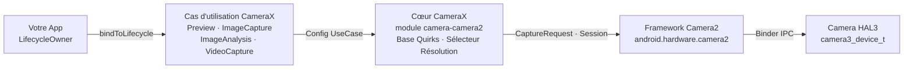

# Chapitre 24 : CameraX

## Résumé

Au moment où vous atteignez ce chapitre, vous maîtrisez l'API Camera2 brute : l'ouverture manuelle des instances de `CameraDevice`, la construction des objets `CaptureRequest.Builder`, la gestion des cycles de vie des `CameraCaptureSession`, la jonglerie entre trois types de rappels différents et la libération minutieuse de chaque ressource dans chaque cas particulier. Vous avez gagné vos galons. Maintenant, nous prenons du recul et nous nous demandons : et si 80 % de ce code répétitif pouvait disparaître ?

CameraX est la bibliothèque Jetpack de Google qui enveloppe Camera2 dans une API déclarative, pilotée par des cas d'utilisation et respectueuse du cycle de vie. Elle ne remplace pas Camera2 — elle est Camera2 sous le capot. Ce qu'elle remplace, ce sont des centaines de lignes de code de configuration de session, la gestion des particularités spécifiques aux appareils (quirks) et la tenue de compte manuelle du cycle de vie. Dans ce chapitre, vous apprendrez l'architecture de CameraX, comprendrez le modèle `UseCase`, verrez comment injecter des paramètres Camera2 bruts *dans* CameraX via `Camera2Interop`, et repartirez avec un tableau de décision pour savoir exactement quand opter pour CameraX et quand vous devez redescendre vers Camera2 brut.

Pour suivre et inspecter chaque capacité de caméra sur votre propre appareil avant de décider quelle couche cibler, installez **Android Camera Parameters** depuis [Google Play](https://play.google.com/store/apps/details?id=com.minininja.cameraparams) ou parcourez le code source sur [github.com/zoozooll/AndroidCameraParameters](https://github.com/zoozooll/AndroidCameraParameters).

---

## Architecture de CameraX

CameraX est livré sous la forme de cinq artefacts Jetpack : `camera-core`, `camera-camera2`, `camera-lifecycle`, `camera-view` et `camera-extensions`. La colonne vertébrale architecturale est le modèle `UseCase` — au lieu de penser en surfaces et en sessions, vous pensez en termes de *ce que vous voulez que la caméra fasse*.

### Le modèle UseCase

Il existe quatre cas d'utilisation canoniques, et vous pouvez lier n'importe quel sous-ensemble d'entre eux simultanément à un cycle de vie :

| UseCase          | But                                                            |
|------------------|----------------------------------------------------------------|
| `Preview`        | Diffuse des images vers une `PreviewView` ou une `Surface`. Analogue à la mise en place d'une requête répétée ciblant une `SurfaceTexture`. |
| `ImageAnalysis`  | Diffuse des images `ImageProxy` vers votre analyseur sur un thread d'arrière-plan. Remplace la création manuelle d'un `ImageReader` avec `YUV_420_888` et le raccordement de son écouteur à une requête répétée. |
| `ImageCapture`   | Capture de photo ponctuelle ou en rafale. Gère la requête de capture, le raccordement de l'`ImageReader`, la rotation et les EXIF pour vous. |
| `VideoCapture`   | Intégré à CameraX depuis la version 1.1 ; enveloppe un pipeline `MediaRecorder` ou `ParcelFileDescriptor` avec les bonnes sémantiques de pause/reprise et le routage audio. |

Lier les quatre simultanément est parfaitement légal — CameraX résout en interne la combinaison de flux par rapport à `SCALER_STREAM_CONFIGURATION_MAP` et appelle `isSessionConfigurationSupported` en votre nom, en se repliant sur des résolutions inférieures si votre combinaison exacte n'est pas prise en charge. C'est l'une des plus grandes victoires : vous ne passerez plus jamais trois heures à découvrir que le Samsung milieu de gamme de 2019 de votre matrice de test ne prend pas en charge `4:3 PRIV + 16:9 JPEG_MAX` simultanément. CameraX fonctionne, tout simplement.

### ProcessCameraProvider et respect du cycle de vie

Le point de liaison est `ProcessCameraProvider`, un singleton possédé par le processus de votre application. La ligne clé est :

```kotlin
val cameraProviderFuture = ProcessCameraProvider.getInstance(context)
cameraProviderFuture.addListener({
    val cameraProvider = cameraProviderFuture.get()
    val camera: Camera = cameraProvider.bindToLifecycle(
        lifecycleOwner,
        cameraSelector,
        preview,
        imageCapture,
        imageAnalysis
    )
}, ContextCompat.getMainExecutor(context))
```

C'est tout. Pas d'enfer de rappels `openCamera`, pas de `StateCallback`, pas de rappel de configuration de session, pas de démontage. Lorsque le `lifecycleOwner` (votre `Fragment` ou `Activity`) atteint `ON_STOP`, CameraX ferme le `CameraDevice`. À `ON_DESTROY`, il démonte la session et libère chaque surface. Les fuites de ressources du genre de celles que vous avez traquées au chapitre 7 ne peuvent tout simplement pas se produire — le contrat de cycle de vie l'impose.

### CameraX enveloppe Camera2 en interne

En interne, CameraX est Camera2. L'artefact `camera-camera2` contient `Camera2Camera`, `Camera2CameraCaptureResult` et `Camera2RequestProcessor`, qui traduisent tous vos déclarations UseCase de haut niveau en appels `CameraManager.openCamera`, `createCaptureSession` et `setRepeatingRequest` exacts que vous avez écrits à la main au cours des 23 chapitres précédents. Les solutions de contournement spécifiques aux fournisseurs sont encodées dans des fichiers XML par appareil à l'intérieur de la bibliothèque — la célèbre "base de données des particularités (quirks) de CameraX".

L'architecture complète ressemble à ceci :



Suivez les flèches de gauche à droite : votre application déclare *ce qu'elle veut* (cas d'utilisation), CameraX résout *comment l'obtenir* (tailles de surface, config de session, particularités) puis émet les appels Camera2 identiques à ceux que vous auriez écrits. La valeur ajoutée réside dans les deux cases du milieu — des centaines de milliers de lignes de code de compatibilité d'appareils écrites par Google que vous n'avez pas à écrire.

---

## Camera2Interop : Injecter des paramètres Camera2 dans CameraX

CameraX est brillant pour le cas des 80 %. Mais vous, cher lecteur, êtes un maître de Camera2. Vous savez ce que signifie `CONTROL_AE_MODE_OFF`. Vous connaissez la différence entre `SENSOR_SENSITIVITY` et `CONTROL_AE_EXPOSURE_COMPENSATION`. Lorsque la spécification du produit dit "permettre à l'utilisateur de bloquer l'ISO à 400 et l'exposition à 1/60s même en utilisant CameraX", vous ne réécrivez pas toute la fonctionnalité en Camera2 brut. Vous utilisez `Camera2Interop`.

### Le modèle Extender

Chaque `UseCase.Builder` possède un `Camera2Interop.Extender` correspondant. Appelez-le *avant* `build()` pour injecter des clés Camera2 brutes soit au niveau de la session, soit au niveau de la requête individuelle :

| Méthode                                        | Équivalent Camera2                           |
|------------------------------------------------|----------------------------------------------|
| `extender.setCaptureRequestOption(key, value)` | `CaptureRequest.Builder.set(key, value)`     |
| `extender.setSessionOption(key, value)`        | Paramètres d'init de session (moins utilisé) |

L'extendeur est additif : CameraX définit toujours ses propres valeurs par défaut pour chaque clé que vous ne surchargez pas. Si vous ne réglez que `SENSOR_SENSITIVITY`, CameraX gère toujours l'AF, l'AWB, la rotation et les métadonnées.

### Exemple concret : ISO et exposition manuels dans CameraX

Voici un constructeur `ImageCapture` complet qui bloque la caméra sur une exposition automatique manuelle avec un ISO fixe de 400 et un temps d'exposition de 1/60 seconde, puis prend une photo :

```kotlin
val iso = 400
val exposureTimeNanos = 1_000_000_000L / 60 // 1/60 s

val imageCapture = ImageCapture.Builder()
    .setTargetResolution(Size(4032, 3024))
    .setCaptureMode(ImageCapture.CAPTURE_MODE_MAXIMIZE_QUALITY)
    .apply {
        val interop = Camera2Interop.Extender(this)
        interop.setCaptureRequestOption(
            CaptureRequest.CONTROL_AE_MODE,
            CaptureRequest.CONTROL_AE_MODE_OFF
        )
        interop.setCaptureRequestOption(
            CaptureRequest.CONTROL_AE_LOCK,
            false
        )
        interop.setCaptureRequestOption(
            CaptureRequest.SENSOR_SENSITIVITY,
            iso
        )
        interop.setCaptureRequestOption(
            CaptureRequest.SENSOR_EXPOSURE_TIME,
            exposureTimeNanos
        )
        interop.setCaptureRequestOption(
            CaptureRequest.CONTROL_MODE,
            CaptureRequest.CONTROL_MODE_OFF
        )
    }
    .build()

cameraProvider.bindToLifecycle(
    viewLifecycleOwner,
    CameraSelector.DEFAULT_BACK_CAMERA,
    preview,
    imageCapture
)

// Plus tard, déclencher la prise de vue :
imageCapture.takePicture(
    ContextCompat.getMainExecutor(context),
    object : ImageCapture.OnImageCapturedCallback() {
        override fun onCaptureSuccess(imageProxy: ImageProxy) {
            // imageProxy contient l'image exposée manuellement
            imageProxy.close()
        }

        override fun onError(exception: ImageCaptureException) {
            Log.e(TAG, "Échec de la capture : ${exception.imageCaptureError}", exception)
        }
    }
)
```

**Mise en garde critique :** le réglage `CONTROL_MODE_OFF` désactive *tout* le 3A. Si vous voulez seulement bloquer l'exposition mais toujours exécuter l'AF et l'AWB, ne réglez que `CONTROL_AE_MODE_OFF` (ou `CONTROL_AE_LOCK = true`) et laissez `CONTROL_MODE` à sa valeur par défaut (`CONTROL_MODE_AUTO`). CameraX met par défaut chaque clé que vous ne touchez pas.

Et oui — vous pouvez faire la même chose avec `Preview.Builder` et `ImageAnalysis.Builder` pour les flux manuels répétés. L'extendeur s'applique à chaque requête répétée ou unique émise pendant la durée de vie de ce cas d'utilisation.

### Lire les résultats Camera2 en retour

Aller dans l'autre sens — extraire un `TotalCaptureResult` d'un rappel CameraX — est tout aussi simple via `Camera2CameraCaptureResult` :

```kotlin
imageCapture.takePicture(
    executor,
    object : ImageCapture.OnImageCapturedCallback() {
        override fun onCaptureSuccess(imageProxy: ImageProxy) {
            val camera2Result = imageProxy.imageInfo
                .cameraCaptureResult as? Camera2CameraCaptureResult
            val totalResult: TotalCaptureResult? = camera2Result?.captureResult
            val actualIso = totalResult?.get(CaptureResult.SENSOR_SENSITIVITY)
            Log.d(TAG, "ISO réel sur le capteur : $actualIso")
            imageProxy.close()
        }
    }
)
```

Cela vous permet de vérifier que vos paramètres injectés sont bien parvenus au capteur. Utilisez **Android Camera Parameters** pour recouper quelle plage `SENSOR_INFO_SENSITIVITY_RANGE` votre appareil revendique — si votre ISO injecté tombe en dehors de cette plage, CameraX le bride silencieusement (ou le HAL le fait), et lire le résultat est le seul moyen de le savoir.

---

## Choisir entre CameraX et Camera2

La question architecturale la plus difficile n'est pas "comment utiliser CameraX ?" mais "dois-je utiliser CameraX tout court ?". Voici le cadre de décision distillé du travail de production réel.

### Diagramme de décision

```mermaid
flowchart TD
    A["Début"] --> B{Besoin de capture RAW,<br/>retraitement ZSL,<br/>flux physiques multi-caméra,<br/>haute vitesse &gt;60fps ?}
    B -->|Oui| D[Utiliser Camera2 brut]
    B -->|Non| C{Besoin de templating CaptureRequest<br/>par image par caméra physique,<br/>config de session personnalisée<br/>(surfaces d'entrée reprocess),<br/>ou sessions hors ligne ?}
    C -->|Oui| D
    C -->|Non| E{Aperçu simple + Photo<br/>+ Vidéo + Analyse,<br/>large compatibilité d'appareils ?}
    E -->|Oui| F[Utiliser CameraX]
    E -->|Non| G{La base Quirks de CameraX couvre<br/>votre parc d'appareils ?<br/>Vérifiez via Android Camera Parameters}
    G -->|Oui| F
    G -->|Non| D
```

### Tableau de décision

| Scénario                                                              | CameraX | Camera2 brut |
|-----------------------------------------------------------------------|:-------:|:-----------:|
| Aperçu style Instagram + photo en un clic + vidéo                     |    ✅    |      ⛔      |
| Code QR / code-barres / détection faciale ML Kit sans personnalisation |    ✅    |      ⛔      |
| Exposition manuelle avec ISO + obturateur fixes (Camera2Interop)      |    ✅    |      ⚠️       |
| Machine à états 3A personnalisée surchargeant les algorithmes OEM      |    ⛔    |      ✅      |
| Photographie professionnelle `RAW_SENSOR` / `RAW_PRIVATE` / DNG       |    ⛔    |      ✅      |
| Zero Shutter Lag (Chapitre 23) avec surfaces d'entrée de retraitement  |    ⛔    |      ✅      |
| Accès au flux physique de multi-caméra logique (Chapitre 20)          |    ⛔    |      ✅      |
| Haute vitesse 120/240fps avec constrained-high-speed-sessions         |    ⛔    |      ✅      |
| Extensions de caméra (Nuit / Bokeh / HDR) via extensions OEM          |    ✅    |      ✅      |
| Caméra de recul automobile avec migration EVS précoce                 |    ⛔    |      ✅ (NDK)  |
| La compatibilité entre appareils est l'exigence #1                    |    ✅    |      ⚠️       |

Le terrain d'entente (⚠️) est là où le jugement compte. Le contrôle manuel de l'exposition via `Camera2Interop` fonctionne de manière fiable sur les appareils `HARDWARE_LEVEL_FULL` mais échoue silencieusement sur les appareils `LEGACY` car les HAL `LEGACY` ignorent totalement `CONTROL_MODE_OFF`. Exécutez **Android Camera Parameters** sur votre flotte de test, vérifiez `INFO_SUPPORTED_HARDWARE_LEVEL` pour chaque appareil, et si 20 % de votre flotte est `LEGACY`, passez soit à Camera2 brut avec un chemin de repli, soit acceptez que les contrôles manuels ne fassent rien sur ces appareils.

### Configuration de base Preview + ImageCapture de CameraX (Complet)

Pour référence, voici la configuration complète et minimale qui remplace environ 300 lignes du code Camera2 brut que vous avez écrit dans les chapitres 6 à 9.

```kotlin
class CameraXFragment : Fragment() {

    private lateinit var viewBinding: FragmentCameraXBinding
    private lateinit var imageCapture: ImageCapture

    override fun onViewCreated(view: View, savedInstanceState: Bundle?) {
        super.onViewCreated(view, savedInstanceState)
        viewBinding = FragmentCameraXBinding.bind(view)

        val cameraProviderFuture = ProcessCameraProvider.getInstance(requireContext())
        cameraProviderFuture.addListener({
            val cameraProvider = cameraProviderFuture.get()
            bindCameraUseCases(cameraProvider)
        }, ContextCompat.getMainExecutor(requireContext()))
    }

    private fun bindCameraUseCases(cameraProvider: ProcessCameraProvider) {
        val preview = Preview.Builder().build().also {
            it.setSurfaceProvider(viewBinding.previewView.surfaceProvider)
        }

        imageCapture = ImageCapture.Builder()
            .setCaptureMode(ImageCapture.CAPTURE_MODE_MINIMIZE_LATENCY)
            .setTargetRotation(viewBinding.previewView.display.rotation)
            .build()

        val cameraSelector = CameraSelector.Builder()
            .requireLensFacing(CameraSelector.LENS_FACING_BACK)
            .build()

        cameraProvider.unbindAll()
        try {
            cameraProvider.bindToLifecycle(
                viewLifecycleOwner,
                cameraSelector,
                preview,
                imageCapture
            )
        } catch (exc: Exception) {
            Log.e(TAG, "Échec de liaison des cas d'utilisation", exc)
        }
    }

    private fun takePhoto() {
        val photoFile = File(
            outputDirectory,
            "PHOTO_${System.currentTimeMillis()}.jpg"
        )
        val outputOptions = ImageCapture.OutputFileOptions
            .Builder(photoFile)
            .build()

        imageCapture.takePicture(
            outputOptions,
            ContextCompat.getMainExecutor(requireContext()),
            object : ImageCapture.OnImageSavedCallback {
                override fun onImageSaved(output: ImageCapture.OutputFileResults) {
                    val savedUri = Uri.fromFile(photoFile)
                    Toast.makeText(requireContext(),
                        "Enregistré : $savedUri", Toast.LENGTH_SHORT).show()
                }
                override fun onError(exc: ImageCaptureException) {
                    Log.e(TAG, "Échec de la capture photo : ${exc.message}", exc)
                }
            }
        )
    }

    companion object {
        private const val TAG = "CameraXFragment"
    }
}
```

C'est l'intégralité du pipeline d'aperçu + photo. Notez l'absence totale de `HandlerThread`, `CameraDevice.StateCallback`, `CameraCaptureSession.StateCallback`, `ImageReader.OnImageAvailableListener` ou d'appels `close()` manuels. CameraX gère tout.

---

## Résumé

CameraX est Camera2 avec une façade respectueuse du cycle de vie et pilotée par les cas d'utilisation, appuyée par la base de données des particularités d'appareils de Google. L'architecture empile votre application → UseCases → Cœur CameraX → Camera2 → HAL, et l'appel `ProcessCameraProvider.bindToLifecycle()` remplace des centaines de lignes de configuration manuelle. Pour les 20 % de paramètres que CameraX n'expose pas au niveau UseCase, `Camera2Interop.Extender` injecte des clés `CaptureRequest` brutes et relit les valeurs `TotalCaptureResult` brutes. La décision de l'utiliser est simple : CameraX est le choix par défaut à moins que votre fonctionnalité ne nécessite explicitement le RAW, le ZSL, les flux multi-caméra physiques, la vidéo haute vitesse ou une topologie de session personnalisée que le résolveur de CameraX ne peut pas exprimer.

## Et ensuite ?

CameraX reste du code Java/Kotlin Dalvik/ART situé au-dessus de la limite Binder. Et si même ce surcoût est trop élevé pour le budget de 16 ms de votre moteur de RA ? Au chapitre 25, nous franchissons entièrement la ligne JNI et ouvrons la caméra directement depuis le C++ en utilisant la pile native de l'NDK, en liant les images comme des textures Vulkan avec zéro copie.
