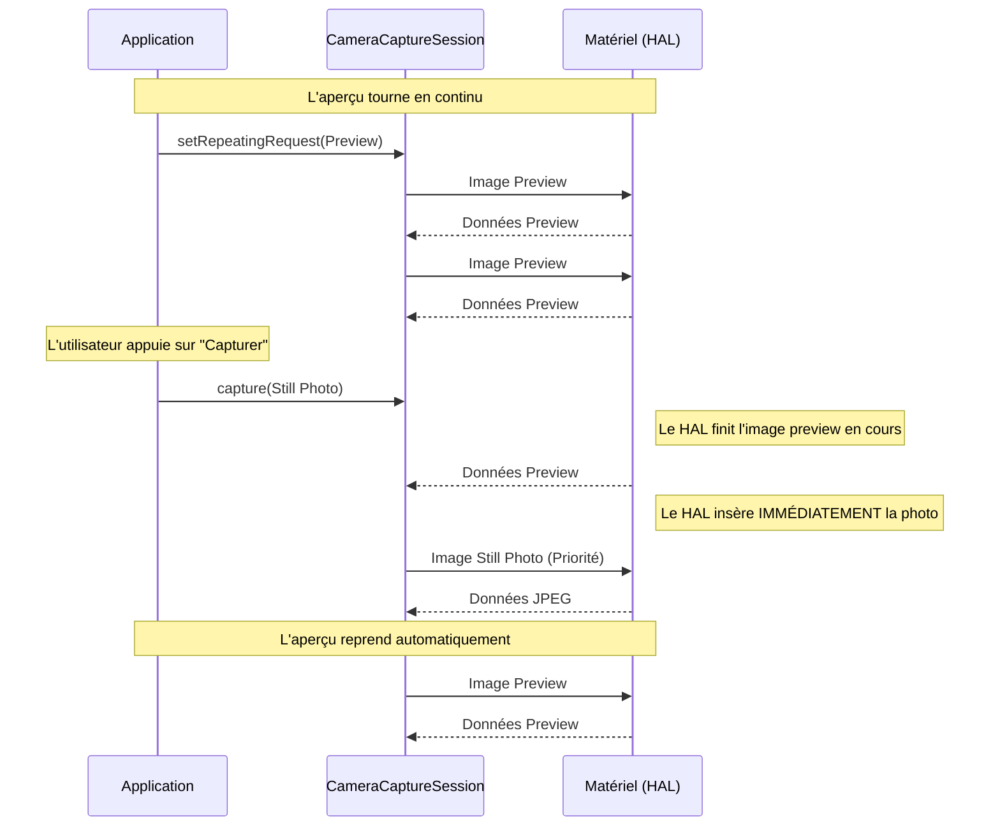

# Chapitre 10 : Les types de capture

Dans les chapitres précédents, nous avons ouvert la caméra et configuré une session. Maintenant, nous devons envoyer des données dans le pipeline.

Dans l'API Camera2, vous n'appelez pas "startPreview()". Au lieu de cela, vous soumettez des **requêtes de capture** à la session. Une requête de capture est un ensemble de paramètres (exposition, mise au point, cibles de sortie) pour une ou plusieurs images.

Il existe quatre méthodes fondamentales pour envoyer ces requêtes. Les comprendre est la clé pour construire des applications caméra complexes et performantes.

---

## 1. capture() : Le cliché unique

La méthode `capture()` soumet une requête unique pour capturer une seule image.

- **Cas d'utilisation :** Prendre une photo JPEG haute résolution, effectuer une mesure de mise au point ponctuelle.
- **Comportement :** La requête va dans la file d'attente, la caméra capture une image dès que possible, et la requête est terminée.
- **Priorité :** Elle "s'intercale" entre les requêtes répétées existantes.

```kotlin
// Exemple de capture d'une seule photo JPEG
val captureBuilder = cameraDevice.createCaptureRequest(CameraDevice.TEMPLATE_STILL_CAPTURE)
captureBuilder.addTarget(jpegSurface)

session.capture(captureBuilder.build(), object : CameraCaptureSession.CaptureCallback() {
    override fun onCaptureCompleted(...) {
        // La photo a été prise !
    }
}, backgroundHandler)
```

---

## 2. setRepeatingRequest() : Le moteur de l'aperçu

C'est ainsi que vous créez un flux vidéo ou un aperçu. Elle demande à la caméra de capturer des images en continu en utilisant les mêmes paramètres jusqu'à ce qu'une nouvelle requête soit définie ou que `stopRepeating()` soit appelé.

- **Cas d'utilisation :** Viseur (aperçu), enregistrement vidéo.
- **Comportement :** Le pipeline maintient cette requête active. Dès qu'une image est terminée, la suivante commence avec les mêmes réglages.
- **Priorité :** C'est le flux d'arrière-plan. Les appels à `capture()` ou `captureBurst()` sont prioritaires et s'insèrent dans ce flux.

```kotlin
// Exemple de démarrage de l'aperçu
val previewBuilder = cameraDevice.createCaptureRequest(CameraDevice.TEMPLATE_PREVIEW)
previewBuilder.addTarget(previewSurface)

session.setRepeatingRequest(previewBuilder.build(), null, backgroundHandler)
```

---

## 3. captureBurst() : La rafale atomique

Soumet une liste de requêtes à capturer à la suite, aussi vite que possible.

- **Cas d'utilisation :** Bracketing d'exposition (HDR), bracketing de mise au point, rafale haute vitesse.
- **Comportement :** La liste entière est traitée comme une unité atomique. Le matériel garantit qu'aucune autre requête (comme l'aperçu répétitif) ne s'insère *entre* les images de la rafale.
- **Important :** C'est bien plus efficace que d'appeler `capture()` plusieurs fois dans une boucle.

```kotlin
// Exemple : Capturer 3 images avec des expositions différentes (Bracketing)
val requests = listOf(reqNormal, reqSombre, reqLumineux)
session.captureBurst(requests, null, backgroundHandler)
```

---

## 4. setRepeatingBurst() : Séquences répétitives complexes

C'est la méthode la plus rare mais la plus puissante. Elle répète une *séquence* d'images.

- **Cas d'utilisation :** Algorithmes de mesure avancés où vous avez besoin d'alterner les réglages à chaque image (ex : Image 1 pour l'AF, Image 2 pour l'AE).
- **Comportement :** Si vous passez une liste de 3 requêtes, la caméra fera : 1, 2, 3, 1, 2, 3, 1, 2, 3... à l'infini.

---

## Comparaison rapide

| Méthode | Durée | Atomicité | Utilisation Type |
| :--- | :--- | :--- | :--- |
| **`capture`** | 1 image | Oui | Prendre une photo |
| **`setRepeatingRequest`** | Infini | N/A | Viseur (Preview) |
| **`captureBurst`** | N images | Oui | HDR, Rafale photo |
| **`setRepeatingBurst`** | Infini | Par cycle | Mesure avancée |

---

## Visualisation du flux (Mermaid)

Voici comment les requêtes prioritaires (`capture`) s'insèrent dans le flux répétitif (`setRepeatingRequest`) :



## Résumé

- Utilisez **`setRepeatingRequest`** pour que l'utilisateur puisse voir ce qu'il filme.
- Utilisez **`capture`** au moment exact où il veut enregistrer l'instant.
- Utilisez **`captureBurst`** si vous avez besoin de plusieurs images liées (comme pour le HDR).
- Ne bloquez jamais le thread principal en attendant ces appels ; utilisez toujours les `CaptureCallback`.

Dans le chapitre suivant, nous verrons comment configurer les **surfaces de sortie** pour recevoir réellement ces pixels.
