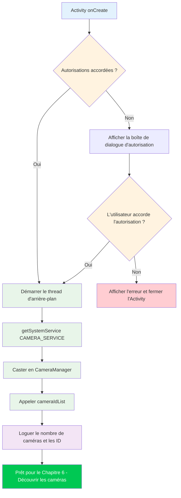

Bienvenue dans la partie pratique de la série de tutoriels Camera2. Dans les chapitres précédents, vous avez découvert le matériel de caméra des smartphones et les fondements théoriques de l'API Camera2. Il est maintenant temps de retrousser vos manches et d'écrire du code réel. À la fin de ce chapitre, vous aurez un projet Android fonctionnel qui initialise avec succès l'API Camera2 et accède au service CameraManager — la première étape critique avant de pouvoir énumérer les caméras, ouvrir des appareils ou afficher des aperçus.

Si vous souhaitez voir un exemple de production de tout ce que nous allons construire dans cette série, consultez l'application **Android Camera Parameters** sur [GitHub](https://github.com/zoozooll/AndroidCameraParameters) et [Google Play](https://play.google.com/store/apps/details?id=com.minininja.cameraparams). Elle illustre une utilisation avancée de Camera2, notamment l'énumération complète de CameraCharacteristics, les commandes de capture manuelle et la prise en charge de plusieurs caméras.

## Pourquoi commencer par la configuration du projet ?

Avant de pouvoir écrire une seule ligne de code Camera2, votre application doit être correctement configurée. Camera2 est une API de bas niveau, sensible aux performances, et prendre des raccourcis lors de la configuration entraînera des plantages mystérieux, des ANR (Application Not Responding) ou des images qui n'arrivent jamais. Les trois piliers d'une configuration correcte d'un projet Camera2 sont :

1. **Autorisations** — Le framework Android restreint l'accès à la caméra tant au moment de l'installation (manifeste) qu'au moment de l'exécution (consentement de l'utilisateur).
2. **Architecture de threading** — Les rappels Camera2 ne doivent jamais bloquer le thread principal ; nous avons besoin d'un thread d'arrière-plan dédié.
3. **Configuration de la vue** — Si vous prévoyez d'utiliser TextureView pour l'aperçu (l'approche recommandée), l'accélération matérielle doit être activée.

Abordons chacun d'eux systématiquement.

## Étape 1 : Création d'un nouveau projet Android Studio

Lancez Android Studio et créez un nouveau projet. Pour cette série de tutoriels, nous recommandons :

- **Modèle** : Empty Activity (le point de départ le plus simple)
- **Langage** : Kotlin (le standard moderne pour le développement Android ; tous les exemples de cette série sont en Kotlin)
- **SDK minimum** : API 21 (Lollipop) — c'est le premier niveau de SDK qui prend en charge nativement Camera2. Si vous devez prendre en charge des caméras USB externes via OTG, ciblez l'API 23 ou supérieure. Si vous avez besoin de la prise en charge du stockage partitionné (Scoped Storage) pour l'enregistrement de photos (Chapitre 9), l'API 29+ est pertinente, mais nous gérerons la rétrocompatibilité à cet endroit.
- **Langage de configuration de la construction** : Kotlin DSL ou Groovy — l'un ou l'autre fonctionne ; nos exemples seront agnostiques vis-à-vis du système de construction.

Une fois le projet généré, ouvrez le fichier `build.gradle` (ou `build.gradle.kts`) au niveau du module. Le modèle Empty Activity par défaut inclut la plupart des dépendances dont vous avez besoin, mais vérifiez que vous avez au minimum :

```kotlin
dependencies {
    implementation("androidx.core:core-ktx:1.12.0")
    implementation("androidx.appcompat:appcompat:1.6.1")
    implementation("com.google.android.material:material:1.11.0")
    implementation("androidx.constraintlayout:constraintlayout:2.1.4")
    // Camera2 fait partie du framework Android, donc AUCUNE dépendance supplémentaire n'est nécessaire
    // pour l'API de base. androidx.camera.camera2 est uniquement pour l'interopérabilité CameraX.
}
```

:::tip
Vous n'avez **pas** besoin d'ajouter de dépendance Camera2 externe. L'ensemble du package `android.hardware.camera2` fait partie du framework Android. La bibliothèque Jetpack CameraX est une abstraction de plus haut niveau séparée construite au-dessus de Camera2 ; nous utilisons directement l'**API native Camera2** dans ce tutoriel.
:::

## Étape 2 : Déclaration des autorisations dans AndroidManifest.xml

Chaque application de caméra doit déclarer l'autorisation `CAMERA` dans `AndroidManifest.xml`. Cela indique au Google Play Store que votre application utilise le matériel de la caméra et cela active la boîte de dialogue d'autorisation au moment de l'exécution sur Android 6.0 (API 23) et versions ultérieures.

Ouvrez `app/src/main/AndroidManifest.xml` et ajoutez les éléments suivants **en tant qu'enfants de la balise racine `<manifest>`** (pas à l'intérieur de `<application>`) :

```xml
<?xml version="1.0" encoding="utf-8"?>
<manifest xmlns:android="http://schemas.android.com/apk/res/android"
    xmlns:tools="http://schemas.android.com/tools">

    <!-- ✅ Déclaration de l'autorisation de la caméra -->
    <uses-permission android:name="android.permission.CAMERA" />

    <!-- Déclarations de fonctionnalités optionnelles (utilisées par le filtrage Google Play) -->
    <uses-feature
        android:name="android.hardware.camera"
        android:required="true" />
    <uses-feature
        android:name="android.hardware.camera.autofocus"
        android:required="false" />

    <application
        android:allowBackup="true"
        ...>
        <activity
            android:name=".MainActivity"
            android:exported="true"
            android:hardwareAccelerated="true">
            ...
        </activity>
    </application>
</manifest>
```

Détaillons les parties importantes :

### `<uses-permission android:name="android.permission.CAMERA" />`

C'est l'autorisation centrale. Sans elle, tout appel au service de caméra lèvera une `SecurityException`. Sur l'API 22 et les versions antérieures, les utilisateurs l'accordent au moment de l'installation ; sur l'API 23+, vous devez également la demander au moment de l'exécution (couvert ensuite).

### `<uses-feature android:name="android.hardware.camera" android:required="true" />`

Cette déclaration indique à Google Play de filtrer votre application pour les appareils dotés d'au moins une caméra. Réglez `android:required="false"` si votre application peut fonctionner sans caméra (par exemple, une application de galerie avec capture optionnelle). Si vous ne déclarez pas cela du tout, Google Play suppose que la caméra n'est **pas** requise, ce qui peut installer votre application sur des appareils sans caméra.

### `android:hardwareAccelerated="true"` sur l' `<activity>`

Ceci est **critique** pour le rendu de l'aperçu TextureView. TextureView utilise le pipeline de composition du GPU pour afficher efficacement les images de la caméra. Sans l'accélération matérielle activée au niveau de l'Activity ou de l'Application, TextureView échouera silencieusement à rendre les images ou affichera un écran noir. La valeur par défaut dans Android moderne est `true` pour l'ensemble de l'application, mais il est de bonne pratique de la déclarer explicitement sur toute Activity qui héberge une TextureView.

## Étape 3 : Demande d'autorisation au moment de l'exécution

Sur Android 6.0 (Marshmallow, API 23) et versions ultérieures, la déclaration de l'autorisation dans le manifeste n'est que la moitié du chemin. Vous devez également **demander explicitement l'autorisation à l'utilisateur** au moment de l'exécution, en utilisant la bibliothèque Activity Compat. Le modèle standard est le suivant :

1. Vérifier si l'autorisation est déjà accordée avec `ContextCompat.checkSelfPermission`.
2. Si elle est accordée, procéder à l'initialisation de la caméra.
3. Si elle n'est pas accordée, appeler `ActivityCompat.requestPermissions` pour afficher la boîte de dialogue système.
4. Gérer le résultat dans `onRequestPermissionsResult`.

Voici le flux complet des autorisations dans `MainActivity.kt` :

```kotlin
package com.example.camera2tutorial

import android.Manifest
import android.content.pm.PackageManager
import android.os.Bundle
import android.widget.Toast
import androidx.appcompat.app.AppCompatActivity
import androidx.core.app.ActivityCompat
import androidx.core.content.ContextCompat

class MainActivity : AppCompatActivity() {

    override fun onCreate(savedInstanceState: Bundle?) {
        super.onCreate(savedInstanceState)
        setContentView(R.layout.activity_main)

        if (allPermissionsGranted()) {
            initializeCamera()
        } else {
            ActivityCompat.requestPermissions(
                this,
                REQUIRED_PERMISSIONS,
                REQUEST_CODE_PERMISSIONS
            )
        }
    }

    private fun allPermissionsGranted() = REQUIRED_PERMISSIONS.all {
        ContextCompat.checkSelfPermission(baseContext, it) == PackageManager.PERMISSION_GRANTED
    }

    override fun onRequestPermissionsResult(
        requestCode: Int,
        permissions: Array<out String>,
        grantResults: IntArray
    ) {
        super.onRequestPermissionsResult(requestCode, permissions, grantResults)
        if (requestCode == REQUEST_CODE_PERMISSIONS) {
            if (allPermissionsGranted()) {
                initializeCamera()
            } else {
                Toast.makeText(
                    this,
                    "L'autorisation de la caméra est requise pour utiliser cette application.",
                    Toast.LENGTH_LONG
                ).show()
                finish()
            }
        }
    }

    private fun initializeCamera() {
        // TODO : Nous implémenterons cette méthode dans les sections ci-dessous.
        // C'est ici que la configuration de CameraManager aura lieu.
        // Pour l'instant, loguons simplement le succès.
        android.util.Log.d(TAG, "Autorisations accordées. Prêt à initialiser la caméra.")
    }

    companion object {
        private const val TAG = "Camera2Tutorial"
        private const val REQUEST_CODE_PERMISSIONS = 10
        private val REQUIRED_PERMISSIONS = arrayOf(Manifest.permission.CAMERA)
    }
}
```

### Pourquoi `allPermissionsGranted()` utilise un modèle de tableau

Même si nous n'avons besoin que de `CAMERA` pour l'instant, définir un tableau `REQUIRED_PERMISSIONS` rend trivial l'ajout d'autorisations supplémentaires plus tard (telles que `WRITE_EXTERNAL_STORAGE` pour l'enregistrement de photos hérité, ou `RECORD_AUDIO` pour la vidéo). La fonction `all { ... }` vérifie que **chaque** autorisation du tableau est accordée avant de continuer.

## Étape 4 : Le thread d'arrière-plan (HandlerThread)

C'est le détail le plus souvent oublié dans le code Camera2 pour débutants, et cela provoque des **bogues aléatoires et difficiles à reproduire**. Comprenons pourquoi Camera2 a besoin d'un thread d'arrière-plan, puis implémentons-le correctement.

### Pourquoi Camera2 NE DOIT PAS s'exécuter sur le thread principal

Le thread principal d'Android (UI thread) est responsable de :
- Dessiner l'interface utilisateur à 60-120 FPS
- Gérer les événements tactiles de l'utilisateur
- Distribuer les rappels de cycle de vie
- Exécuter tout le code Activity/Fragment par défaut

L'API Camera2 délivre plusieurs rappels critiques de manière synchrone :
- `CameraDevice.StateCallback` — lorsqu'une caméra s'ouvre, se déconnecte ou fait l'objet d'une erreur
- `CameraCaptureSession.StateCallback` — lorsqu'une session de capture est configurée
- `CameraCaptureSession.CaptureCallback` — pour chaque image individuelle (jusqu'à plus de 60 fois par seconde !)

Si ces rappels s'exécutent sur le thread principal, deux choses catastrophiques se produisent :

1. **Saccades (Jank) et perte d'images** : Si le traitement d'un rappel prend ne serait-ce que 10 ms, une image à 60 FPS est sautée et l'utilisateur voit une saccade.
2. **Blocages (Deadlocks) et ANR** : Certaines méthodes Camera2 (comme `close()`) sont synchrones et attendent des rappels. Si le rappel doit s'exécuter sur le même thread que celui qui a appelé `close()`, vous obtenez un blocage.

La solution est un **thread d'arrière-plan dédié** avec son propre Looper, implémenté via `HandlerThread`.

### Implémentation correcte de HandlerThread

Le cycle de vie du thread d'arrière-plan doit correspondre au cycle de vie des opérations de la caméra. Nous démarrons le thread lorsque l'Activity démarre/reprend, et nous quittons le thread lorsque l'Activity s'arrête/se met en pause.

```kotlin
package com.example.camera2tutorial

import android.Manifest
import android.content.Context
import android.content.pm.PackageManager
import android.hardware.camera2.CameraManager
import android.os.Bundle
import android.os.Handler
import android.os.HandlerThread
import android.util.Log
import android.widget.Toast
import androidx.appcompat.app.AppCompatActivity
import androidx.core.app.ActivityCompat
import androidx.core.content.ContextCompat

class MainActivity : AppCompatActivity() {

    // --- Composants de threading en arrière-plan ---
    private lateinit var backgroundThread: HandlerThread
    private lateinit var backgroundHandler: Handler

    override fun onCreate(savedInstanceState: Bundle?) {
        super.onCreate(savedInstanceState)
        setContentView(R.layout.activity_main)

        if (allPermissionsGranted()) {
            initializeCamera()
        } else {
            ActivityCompat.requestPermissions(
                this,
                REQUIRED_PERMISSIONS,
                REQUEST_CODE_PERMISSIONS
            )
        }
    }

    override fun onResume() {
        super.onResume()
        startBackgroundThread()
        // Réinitialiser si les autorisations ont été accordées alors que l'application était en arrière-plan
        if (allPermissionsGranted() && this::cameraManager.isInitialized) {
            // (cameraManager est déclaré ci-dessous)
        }
    }

    override fun onPause() {
        stopBackgroundThread()
        super.onPause()
    }

    private fun startBackgroundThread() {
        backgroundThread = HandlerThread("Camera2Background").apply {
            start()
        }
        backgroundHandler = Handler(backgroundThread.looper)
        Log.d(TAG, "Thread d'arrière-plan démarré : ${backgroundThread.name}")
    }

    private fun stopBackgroundThread() {
        backgroundThread.quitSafely()
        try {
            backgroundThread.join(1000) // Attendre jusqu'à 1 seconde pour le nettoyage
            Log.d(TAG, "Thread d'arrière-plan arrêté proprement")
        } catch (e: InterruptedException) {
            Log.e(TAG, "Interrompu lors de la jonction du thread d'arrière-plan", e)
        }
    }

    // --- Initialisation de CameraManager ---
    private lateinit var cameraManager: CameraManager

    private fun initializeCamera() {
        cameraManager = getSystemService(Context.CAMERA_SERVICE) as CameraManager

        val cameraIdList = cameraManager.cameraIdList
        Log.d(TAG, "Accès à CameraManager réussi. Trouvé ${cameraIdList.size} caméra(s).")
        cameraIdList.forEachIndexed { index, cameraId ->
            Log.d(TAG, "Caméra $index : ID = $cameraId")
        }

        Toast.makeText(
            this,
            "CameraManager initialisé ! Trouvé ${cameraIdList.size} caméra(s).",
            Toast.LENGTH_LONG
        ).show()
    }

    // --- Gestion des autorisations (identique à précédemment) ---
    private fun allPermissionsGranted() = REQUIRED_PERMISSIONS.all {
        ContextCompat.checkSelfPermission(baseContext, it) == PackageManager.PERMISSION_GRANTED
    }

    override fun onRequestPermissionsResult(
        requestCode: Int,
        permissions: Array<out String>,
        grantResults: IntArray
    ) {
        super.onRequestPermissionsResult(requestCode, permissions, grantResults)
        if (requestCode == REQUEST_CODE_PERMISSIONS) {
            if (allPermissionsGranted()) {
                initializeCamera()
            } else {
                Toast.makeText(
                    this,
                    "L'autorisation de la caméra est requise pour utiliser cette application.",
                    Toast.LENGTH_LONG
                ).show()
                finish()
            }
        }
    }

    companion object {
        private const val TAG = "Camera2Tutorial"
        private const val REQUEST_CODE_PERMISSIONS = 10
        private val REQUIRED_PERMISSIONS = arrayOf(Manifest.permission.CAMERA)
    }
}
```

### Explication des modèles de threading clés

1. **`startBackgroundThread()` dans `onResume()`** : Chaque fois que l'Activity passe au premier plan, nous créons un nouveau `HandlerThread`, nous le démarrons et nous créons un `Handler` lié au `Looper` du thread. Ce Handler sera passé à toutes les méthodes Camera2 acceptant des rappels (`openCamera`, `createCaptureSession`, etc.).

2. **`stopBackgroundThread()` dans `onPause()`** : Avant que l'Activity ne passe en arrière-plan, nous appelons `quitSafely()` sur le thread. Cela indique au Looper d'arrêter de traiter les nouveaux messages une fois que le message actuel est terminé (contrairement à `quit()`, qui rejette les messages en attente). Nous appelons ensuite `join(1000)` pour bloquer le thread principal pendant au plus une seconde pendant que le thread d'arrière-plan termine son nettoyage. Cela évite les fuites de ressources.

3. **Pourquoi `HandlerThread` au lieu de `CoroutineDispatcher` ?** Camera2 précède les Coroutines Kotlin de plusieurs années, et son système de rappels est fondamentalement basé sur Handler/Looper. Bien que vous puissiez utiliser `Dispatchers.Default.asExecutor()` ou envelopper les rappels dans `suspendCoroutine` pour du code de plus haut niveau, l'API Camera2 sous-jacente a toujours besoin d'un thread Looper pour les rappels. L'utilisation directe de `HandlerThread` est l'approche canonique et documentée dans les exemples Android officiels.

## Étape 5 : Le flux d'initialisation complet (combiné)

Regardons maintenant la séquence complète d'événements qui doivent se produire lorsque votre application démarre. L'ordre est critique : autorisations → thread → CameraManager. Si vous inversez une étape, le code plantera ou se comportera de manière incohérente.



Le diagramme ci-dessus illustre pourquoi chaque étape existe :

- **Porte d'autorisation** : L'ensemble du sous-système de caméra est protégé ; nous ne pouvons pas continuer tant que l'utilisateur n'a pas donné son consentement.
- **Thread avant CameraManager** : Bien que `getSystemService()` lui-même soit thread-safe, nous voulons que le thread d'arrière-plan soit déjà en cours d'exécution avant d'effectuer toute opération Camera2 pilotée par des rappels (qui commencent au chapitre suivant).
- **CameraManager → cameraIdList** : Appeler `cameraIdList` est le moyen le moins coûteux de vérifier que CameraManager fonctionne. Si cet appel réussit sans lever d'exception, votre déclaration dans le manifeste, l'autorisation au moment de l'exécution et la liaison au service sont toutes correctes.

## Mise en pratique : Exécuter et vérifier

À ce stade, vous disposez d'un projet Camera2 complet et exécutable qui :
1. Crée un projet Android avec les bonnes cibles de SDK.
2. Déclare l'autorisation CAMERA dans le manifeste.
3. Demande l'autorisation au moment de l'exécution, en gérant les chemins d'acceptation et de refus.
4. Démarre un HandlerThread dédié dans `onResume` et l'arrête proprement dans `onPause`.
5. Récupère le service système `CAMERA_SERVICE` et le caste en `CameraManager`.
6. Appelle `cameraIdList` et logue le nombre de caméras et leurs ID.

### Ce que vous devriez voir lors de l'exécution

1. Au premier lancement, Android affiche la boîte de dialogue d'autorisation : *"Autoriser Camera2Tutorial à prendre des photos et enregistrer des vidéos ?"*
2. Appuyez sur **Autoriser**.
3. Un Toast apparaît : *"CameraManager initialisé ! Trouvé X caméra(s)."*
4. Dans Logcat (filtrez par `Camera2Tutorial`), vous devriez voir des entrées comme :
   ```
   D/Camera2Tutorial: Thread d'arrière-plan démarré : Camera2Background
   D/Camera2Tutorial: Accès à CameraManager réussi. Trouvé 4 caméra(s).
   D/Camera2Tutorial: Caméra 0 : ID = 0
   D/Camera2Tutorial: Caméra 1 : ID = 1
   D/Camera2Tutorial: Caméra 2 : ID = 2
   D/Camera2Tutorial: Caméra 3 : ID = 3
   ```
5. Lorsque vous appuyez sur le bouton Accueil ou que vous quittez l'application, Logcat affiche :
   ```
   D/Camera2Tutorial: Thread d'arrière-plan arrêté proprement
   ```

Si vous voyez ces logs, **félicitations** ! Vous avez réussi à poser les bases d'une application Camera2. Il n'y a pas encore d'aperçu de la caméra — cela viendra au chapitre 8 — mais la tuyauterie est correcte. Si vous obtenez une `SecurityException`, vérifiez que vous avez bien accepté la boîte de dialogue d'autorisation. Si `cameraIdList` renvoie un tableau vide, l'appareil n'a peut-être pas de caméras (peu probable sur un téléphone) ou l'autorisation a été refusée.

## Dépannage des erreurs de configuration courantes

### `SecurityException: Lacking privileges to access camera service`

Cela signifie que l'autorisation au moment de l'exécution n'a pas été accordée. Vérifiez que :
- Vous avez ajouté `<uses-permission android:name="android.permission.CAMERA" />` au manifeste.
- Vous avez appelé `ActivityCompat.requestPermissions` avec le bon code de requête.
- L'utilisateur a appuyé sur **Autoriser** dans la boîte de dialogue.
- Si vous testez sur un appareil physique, allez dans Paramètres → Applications → Votre application → Autorisations et assurez-vous que l'appareil photo est activé.

### `NullPointerException` sur `backgroundHandler`

Cela se produit si vous essayez d'utiliser `backgroundHandler` avant que `startBackgroundThread()` ne s'exécute. Assurez-vous que toutes les opérations Camera2 qui acceptent un Handler ne s'exécutent qu'**après** l'appel de `onResume` et que le thread est lancé. Dans notre code, `initializeCamera()` est appelé depuis `onCreate`, mais il n'utilise CameraManager que de manière synchrone ; les rappels qui nécessitent `backgroundHandler` seront ajoutés dans les chapitres suivants et correctement sécurisés dans `onResume`.

### `TextureView` affiche un écran noir dans les chapitres suivants

Si vous anticipez et ajoutez une TextureView maintenant, assurez-vous que `android:hardwareAccelerated="true"` est défini sur votre Activity dans le manifeste. Assurez-vous également que la TextureView est attachée à la hiérarchie des vues et visible dans votre XML de mise en page.

## Résumé

Dans ce chapitre, vous avez construit l'échafaudage complet d'une application Android Camera2. Vous avez appris :

1. **Structure du projet** : Comment créer un nouveau projet Android Studio avec le modèle Empty Activity, ciblant l'API 21+, en utilisant Kotlin, et en vérifiant qu'aucune dépendance Camera2 externe n'est nécessaire.
2. **Configuration du manifeste** : La déclaration de l'autorisation `CAMERA`, les balises `uses-feature` pour le filtrage Google Play et `hardwareAccelerated="true"` sur l'Activity pour le rendu TextureView.
3. **Autorisations au moment de l'exécution** : Le cycle complet vérification → demande → résultat en utilisant `ContextCompat.checkSelfPermission` et `ActivityCompat.requestPermissions`, avec la gestion des chemins d'acceptation et de refus.
4. **Threading en arrière-plan** : Pourquoi les rappels Camera2 ne doivent pas s'exécuter sur le thread principal, et comment implémenter une paire `HandlerThread` + `Handler` correctement gérée selon le cycle de vie avec `startBackgroundThread()` dans `onResume` et `stopBackgroundThread()` avec `quitSafely()` + `join()` dans `onPause`.
5. **Initialisation de CameraManager** : Récupérer le service système `CAMERA_SERVICE`, caster en `CameraManager`, appeler `cameraIdList` pour vérifier que le service fonctionne et loguer les ID des caméras découvertes.

Le code de ce chapitre est le socle de tout ce qui suit. L'application Android Camera Parameters ([GitHub](https://github.com/zoozooll/AndroidCameraParameters), [Google Play](https://play.google.com/store/apps/details?id=com.minininja.cameraparams)) utilise exactement ces modèles — plusieurs `HandlerThread` pour différentes charges de travail, une vérification minutieuse des autorisations et une gestion robuste du cycle de vie.

## Et ensuite ?

Maintenant que `CameraManager` est initialisé avec succès et que nous avons une liste d'ID de caméras, l'étape suivante consiste à **interroger les capacités de chaque caméra**. Dans le **Chapitre 6 : Découvrir les caméras**, vous allez :

- Apprendre ce que représentent les chaînes d'ID de caméra (et pourquoi vous ne devriez jamais coder en dur des suppositions à leur sujet).
- Distinguer les caméras orientées vers l'avant, vers l'arrière et les caméras externes (USB OTG) en utilisant `LENS_FACING`.
- Interroger le niveau matériel de chaque caméra (`INFO_SUPPORTED_HARDWARE_LEVEL`) pour déterminer si elle est LEGACY, LIMITED, FULL ou LEVEL_3.
- Itérer sur chaque caméra de l'appareil et loguer ses propriétés à l'aide de `CameraCharacteristics`.

À la fin du chapitre 6, vous aurez un utilitaire fonctionnel d'énumération de caméras qui extrait de réelles métadonnées Camera2 de l'appareil — quelque chose que vous pouvez déjà utiliser pour comparer le matériel de caméra entre différents téléphones !
