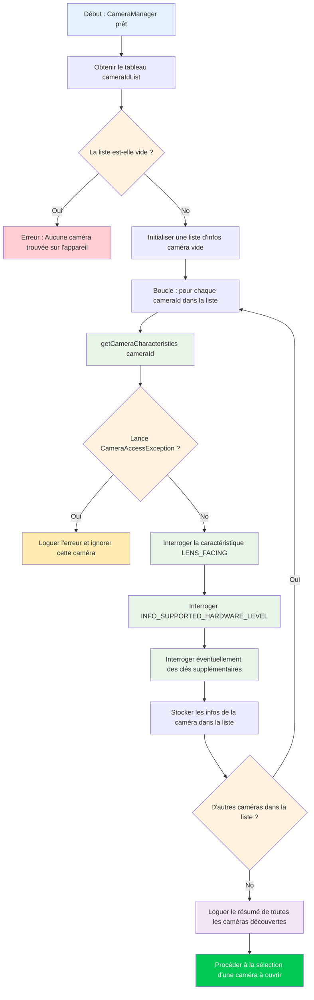

Dans le chapitre 5, vous avez initialisé avec succès `CameraManager` et récupéré la liste des ID de caméra — mais une chaîne comme `"0"` ou `"2"` ne vous dit rien sur ce qu'est réellement cette caméra. S'agit-il de la caméra arrière ultra-grand-angle ? De la caméra selfie ? D'une webcam USB externe attachée via OTG ? Ce chapitre vous apprend comment répondre à ces questions en utilisant `CameraCharacteristics`, le conteneur de métadonnées qui décrit chaque capacité d'un appareil photo.

Pour une implémentation de référence de qualité production de l'énumération des caméras et de l'inspection des caractéristiques, consultez l'application **Android Camera Parameters** ([GitHub](https://github.com/zoozooll/AndroidCameraParameters), [Google Play](https://play.google.com/store/apps/details?id=com.minininja.cameraparams)). Elle parcourt chaque clé de `CameraCharacteristics` pour chaque caméra de l'appareil et présente les résultats dans une interface utilisateur consultable et filtrable — exactement l'outil dont vous aurez besoin lors du débogage de problèmes Camera2 spécifiques au matériel.

## Comprendre les ID de caméra

Avant de plonger dans les caractéristiques, nous devons aborder une source fondamentale de confusion pour les nouveaux développeurs Camera2 : **que signifient réellement les chaînes d'ID de caméra numériques ?**

Lorsque vous appelez `cameraManager.cameraIdList`, vous recevez un `Array&lt;String&gt;` — par exemple : `["0", "1", "2", "3", "4"]`. Il est **tentant** de coder en dur des suppositions telles que :
- `"0"` = caméra large arrière
- `"1"` = caméra frontale
- `"2"` = téléobjectif

**Ne faites jamais cela.** La correspondance ID → caméra physique est :
1. **Spécifique à l'appareil** : Un Pixel 8 peut utiliser l'ID `"1"` pour la caméra frontale, tandis qu'un Samsung Galaxy S24 utilise l'ID `"3"`.
2. **Spécifique à la version** : Une mise à jour OTA d'un OEM peut modifier la liste des ID après l'expédition d'un appareil.
3. **Spécifique à la reconstruction** : Certains appareils logiques multi-caméras (couverts dans un chapitre ultérieur de la partie III) exposent ou masquent dynamiquement les caméras physiques sous-jacentes en fonction des modes.

La **seule** approche correcte est d'**interroger les caractéristiques de chaque ID** et de sélectionner une caméra en fonction des propriétés qui vous importent (direction de l'objectif, niveau matériel, plage de focales, etc.). C'est ce que font les applications Camera2 bien écrites, et c'est le modèle que nous allons implémenter ici.

## Flux d'énumération des caméras

L'algorithme général pour découvrir les caméras est simple en surface, mais présente des cas particuliers importants concernant la gestion des erreurs. Voyons d'abord le processus sous forme de diagramme, puis implémentons-le en code.



Observations clés du diagramme :
1. **Gérez toujours les listes d'ID vides** : Rare sur les téléphones, mais courant sur Android TV, les appareils sans écran ou les émulateurs sans caméra virtuelle.
2. **Enveloppez toujours `getCameraCharacteristics` dans un try/catch** : Une caméra pourrait être déconnectée en cours d'énumération (en particulier une caméra USB externe), ou une politique d'appareil verrouillé pourrait restreindre certaines caméras.
3. **Itérez complètement, puis choisissez** : Collectez d'abord tous les candidats, puis sélectionnez le meilleur selon vos critères. N'ouvrez pas la première "bonne" caméra que vous trouvez — vous pourriez en manquer une meilleure.

## Présentation de CameraCharacteristics

`CameraCharacteristics` est une carte clé-valeur immuable en lecture seule qui décrit les capacités de niveau matériel d'une caméra. Elle contient plusieurs centaines de clés couvrant tout, de la distance focale de l'objectif à la taille de la matrice de pixels du capteur, en passant par les formats de sortie pris en charge.

Vous récupérez un objet de caractéristiques avec :
```kotlin
val characteristics: CameraCharacteristics =
    cameraManager.getCameraCharacteristics(cameraId)
```

Et vous interrogez les clés individuelles avec la méthode générique `get` :
```kotlin
val lensFacing: Int? = characteristics.get(CameraCharacteristics.LENS_FACING)
```

Le type de retour est nullable (`Int?` dans ce cas) car certaines clés sont optionnelles et peuvent ne pas être présentes sur tous les appareils. En pratique, les clés que nous interrogeons dans ce chapitre (`LENS_FACING` et `INFO_SUPPORTED_HARDWARE_LEVEL`) sont garanties d'être présentes pour chaque caméra valide, mais il est toujours de bonne pratique de gérer les nulls de manière défensive.

:::note
Ce chapitre couvre intentionnellement uniquement `LENS_FACING` et `INFO_SUPPORTED_HARDWARE_LEVEL`. Les mécanismes internes plus profonds de `CameraCharacteristics` (caractéristiques du capteur, configurations de sortie, capacités disponibles) font l'objet du chapitre 10 de la partie III : L'encyclopédie des CameraCharacteristics. Nous restons concentrés sur les informations minimales dont vous avez besoin pour choisir une caméra à ouvrir.
:::

## Clé 1 : LENS_FACING — Avant, Arrière ou Externe

La première chose que presque chaque application de caméra doit savoir est la direction dans laquelle l'objectif pointe. Camera2 définit trois constantes :

| Constante | Valeur | Signification | Cas d'utilisation typique |
|---|---|---|---|
| `LENS_FACING_BACK` | `0` | La caméra est à l'arrière de l'appareil, face opposée à l'utilisateur | Capture photo, vidéo de paysage, RA |
| `LENS_FACING_FRONT` | `1` | La caméra est à l'avant de l'appareil, face à l'utilisateur | Selfies, appels vidéo |
| `LENS_FACING_EXTERNAL` | `2` | La caméra est externe à l'appareil (ex: webcam USB OTG) | Accessoires externes, caméras spécialisées |

Voici comment convertir l'entier brut en une chaîne lisible par l'homme :

```kotlin
fun lensFacingToString(facing: Int?): String = when (facing) {
    CameraCharacteristics.LENS_FACING_BACK -> "Arrière (LENS_FACING_BACK)"
    CameraCharacteristics.LENS_FACING_FRONT -> "Avant (LENS_FACING_FRONT)"
    CameraCharacteristics.LENS_FACING_EXTERNAL -> "Externe / USB OTG (LENS_FACING_EXTERNAL)"
    null -> "Inconnu (null)"
    else -> "Inconnu (valeur=$facing)"
}
```

### Cas particulier : Caméras externes (USB OTG)

`LENS_FACING_EXTERNAL` a été ajouté dans l'API 23 (Marshmallow). Avant d'ouvrir une caméra externe, considérez :

1. **Déclaration de la fonction hôte USB** : Si votre application cible spécifiquement les caméras externes, ajoutez `<uses-feature android:name="android.hardware.usb.host" />` à votre manifeste. Réglez `required="false"` si l'application fonctionne également avec les caméras intégrées.
2. **Autorisation pour les périphériques externes** : Sur de nombreux appareils, l'accès à une caméra USB nécessite uniquement l'autorisation `CAMERA`. Cependant, certains chipsets de webcams USB nécessitent une confirmation d'autorisation d'hôte USB supplémentaire via `UsbManager.requestPermission()`. Gérez la diffusion `UsbManager.ACTION_USB_DEVICE_ATTACHED` si vous souhaitez détecter automatiquement le branchement d'une caméra.
3. **Niveau matériel** : Les caméras externes rapportent presque toujours `INFO_SUPPORTED_HARDWARE_LEVEL_EXTERNAL` (voir ci-dessous), ce qui signifie que leur ensemble de fonctionnalités est limité par le pilote USB Video Class (UVC). Ne vous attendez pas à des commandes manuelles ou à une sortie RAW d'une webcam générique.

Sur un téléphone avec une webcam USB attachée, `cameraIdList` pourrait renvoyer quelque chose comme `["0", "1", "100"]` où `"100"` est l'ID de la caméra externe assigné dynamiquement. Les ID des caméras externes sont généralement des nombres plus élevés et ne sont **pas** stables après un redémarrage ou un rebranchement.

## Clé 2 : INFO_SUPPORTED_HARDWARE_LEVEL — Que peut faire cette caméra ?

Le niveau matériel est la classification de capacité la plus importante dans Camera2. Il vous indique si le matériel de la caméra et le HAL (Hardware Abstraction Layer) implémentent le pipeline Camera2 complet ou s'ils utilisent un wrapper de compatibilité hérité autour de l'ancienne API Camera. Il existe cinq valeurs :

| Niveau | Valeur | Signification | Appareils du monde réel |
|---|---|---|---|
| `LEGACY` | `2` | Mode HAL hérité. La caméra fonctionne au-dessus de l'ancienne API Camera via une couche d'adaptation. Fonctionnalités très limitées, pas de commandes manuelles, pas de RAW. | Téléphones budget, appareils pré-2015, nombreux émulateurs |
| `LIMITED` | `0` | Support HAL3 limité. Capture de base, 3A de base (Auto-Exposure, Auto-Focus, Auto-White-Balance), mais manque de fonctionnalités avancées. | Téléphones de milieu de gamme, certaines caméras frontales sur les fleurons |
| `FULL` | `1` | Support HAL3 complet. Commandes manuelles du capteur, paramètres par image, sortie RAW, retraitement. | Caméras principales/arrière des fleurons, caméras principales de la série Pixel |
| `LEVEL_3` | `3` | Support HAL3 étendu. Ajoute le retraitement YUV, l'entrée multi-images, des configurations de résolution haute vitesse. | Derniers fleurons, caméras principales des Pixel 6+ |
| `EXTERNAL` | `4` | Caméra externe (USB/OTG). Fonctionnalités limitées, périphérique de classe UVC. | Webcams USB, clés de capture HDMI |

Une bonne façon de penser à cette hiérarchie est de la voir comme une échelle de capacités :

```
LEGACY → LIMITED → FULL → LEVEL_3
          ↑
       EXTERNAL (branche parallèle pour les caméras USB)
```

Chaque étape s'appuie sur la précédente : `FULL` inclut tout ce qui est dans `LIMITED`, `LEVEL_3` inclut tout ce qui est dans `FULL`. Lors de l'écriture du code de détection de fonctionnalités, vérifiez à partir du niveau le plus élevé vers le bas — si une caméra est `LEVEL_3`, vous savez automatiquement qu'elle prend également en charge les fonctionnalités `FULL`.

Voici la fonction utilitaire pour convertir le niveau en description :

```kotlin
fun hardwareLevelToString(level: Int?): String = when (level) {
    CameraMetadata.INFO_SUPPORTED_HARDWARE_LEVEL_LEGACY ->
        "LEGACY (shim ancienne API Camera — commandes manuelles limitées)"
    CameraMetadata.INFO_SUPPORTED_HARDWARE_LEVEL_LIMITED ->
        "LIMITED (HAL3 de base — photo/vidéo standard)"
    CameraMetadata.INFO_SUPPORTED_HARDWARE_LEVEL_FULL ->
        "FULL (HAL3 complet — commandes manuelles + RAW)"
    CameraMetadata.INFO_SUPPORTED_HARDWARE_LEVEL_3 ->
        "LEVEL_3 (HAL3 étendu — retraitement + multi-images)"
    CameraMetadata.INFO_SUPPORTED_HARDWARE_LEVEL_EXTERNAL ->
        "EXTERNAL (Caméra USB/OTG — classe UVC)"
    null -> "Inconnu (null)"
    else -> "Inconnu (valeur=$level)"
}
```

:::tip
Si vous souhaitez écrire du code qui ne s'exécute que sur du matériel performant, utilisez `>= LIMITED` pour la capture de base, `>= FULL` pour les commandes manuelles et `>= LEVEL_3` pour les pipelines de retraitement. Ne supposez jamais qu'une caméra est FULL ou mieux — vérifiez toujours. L'application Android Camera Parameters sur [Google Play](https://play.google.com/store/apps/details?id=com.minininja.cameraparams) affiche le niveau matériel sous forme d'un badge bien visible pour chaque caméra afin que vous puissiez voir rapidement ce que chaque appareil prend en charge.
:::

## Code Kotlin complet : Utilitaire de découverte de caméras

Combinons maintenant tout cela dans une implémentation fonctionnelle. Nous allons étendre le `MainActivity.kt` du chapitre 5 avec une méthode `discoverAndLogCameras()` qui itère sur toutes les caméras, interroge `LENS_FACING` et `INFO_SUPPORTED_HARDWARE_LEVEL` pour chacune, et logue les résultats dans Logcat.

```kotlin
package com.example.camera2tutorial

import android.Manifest
import android.content.Context
import android.content.pm.PackageManager
import android.hardware.camera2.CameraAccessException
import android.hardware.camera2.CameraCharacteristics
import android.hardware.camera2.CameraManager
import android.hardware.camera2.CameraMetadata
import android.os.Bundle
import android.os.Handler
import android.os.HandlerThread
import android.util.Log
import android.widget.Toast
import androidx.appcompat.app.AppCompatActivity
import androidx.core.app.ActivityCompat
import androidx.core.content.ContextCompat

class MainActivity : AppCompatActivity() {

    private lateinit var backgroundThread: HandlerThread
    private lateinit var backgroundHandler: Handler
    private lateinit var cameraManager: CameraManager

    override fun onCreate(savedInstanceState: Bundle?) {
        super.onCreate(savedInstanceState)
        setContentView(R.layout.activity_main)

        if (allPermissionsGranted()) {
            initializeCameraManager()
        } else {
            ActivityCompat.requestPermissions(
                this,
                REQUIRED_PERMISSIONS,
                REQUEST_CODE_PERMISSIONS
            )
        }
    }

    override fun onResume() {
        super.onResume()
        startBackgroundThread()
    }

    override fun onPause() {
        stopBackgroundThread()
        super.onPause()
    }

    private fun startBackgroundThread() {
        backgroundThread = HandlerThread("Camera2Background").apply { start() }
        backgroundHandler = Handler(backgroundThread.looper)
    }

    private fun stopBackgroundThread() {
        backgroundThread.quitSafely()
        try {
            backgroundThread.join(1000)
        } catch (e: InterruptedException) {
            Log.e(TAG, "Interrompu lors de la jonction du thread d'arrière-plan", e)
        }
    }

    private fun initializeCameraManager() {
        cameraManager = getSystemService(Context.CAMERA_SERVICE) as CameraManager
        discoverAndLogCameras()
    }

    // -------------------------------------------------------------------------
    // 📸 AJOUTS DU CHAPITRE 6 : Découverte des caméras et requête de caractéristiques
    // -------------------------------------------------------------------------
    data class CameraInfo(
        val id: String,
        val lensFacing: Int?,
        val hardwareLevel: Int?
    ) {
        fun description(): String = buildString {
            append("ID Caméra : $id | ")
            append("Direction : ${lensFacingToString(lensFacing)} | ")
            append("Niveau Matériel : ${hardwareLevelToString(hardwareLevel)}")
        }
    }

    private fun discoverAndLogCameras() {
        val cameraIdList: Array<String> = try {
            cameraManager.cameraIdList
        } catch (e: CameraAccessException) {
            Log.e(TAG, "Échec de l'obtention de la liste des ID de caméra", e)
            Toast.makeText(this, "Service caméra indisponible", Toast.LENGTH_LONG).show()
            return
        }

        if (cameraIdList.isEmpty()) {
            Log.w(TAG, "Aucune caméra trouvée sur cet appareil")
            Toast.makeText(this, "Aucune caméra disponible", Toast.LENGTH_LONG).show()
            return
        }

        val discoveredCameras = mutableListOf<CameraInfo>()
        Log.i(TAG, "═══════════════════════════════════════════")
        Log.i(TAG, "Démarrage de la découverte des caméras (${cameraIdList.size} caméra(s))")
        Log.i(TAG, "═══════════════════════════════════════════")

        for ((index, cameraId) in cameraIdList.withIndex()) {
            try {
                val characteristics = cameraManager.getCameraCharacteristics(cameraId)

                val lensFacing = characteristics.get(CameraCharacteristics.LENS_FACING)
                val hardwareLevel =
                    characteristics.get(CameraCharacteristics.INFO_SUPPORTED_HARDWARE_LEVEL)

                val info = CameraInfo(cameraId, lensFacing, hardwareLevel)
                discoveredCameras.add(info)

                Log.i(TAG, "── Caméra $index ──")
                Log.i(TAG, info.description())

            } catch (e: CameraAccessException) {
                Log.e(TAG, "Échec de l'accès aux caractéristiques de la caméra $cameraId", e)
            } catch (e: IllegalArgumentException) {
                Log.e(TAG, "ID de caméra invalide : $cameraId", e)
            }
        }

        Log.i(TAG, "═══════════════════════════════════════════")
        Log.i(TAG, "Découverte terminée. ${discoveredCameras.size} caméra(s) énumérée(s) avec succès.")

        // Grouper et résumer par direction
        val byFacing = discoveredCameras.groupBy { it.lensFacing }
        Log.i(TAG, "  Face arrière :   ${byFacing[CameraCharacteristics.LENS_FACING_BACK]?.size ?: 0}")
        Log.i(TAG, "  Face avant :     ${byFacing[CameraCharacteristics.LENS_FACING_FRONT]?.size ?: 0}")
        Log.i(TAG, "  Externe/OTG :    ${byFacing[CameraCharacteristics.LENS_FACING_EXTERNAL]?.size ?: 0}")

        // Grouper et résumer par niveau matériel
        val byLevel = discoveredCameras.groupBy { it.hardwareLevel }
        Log.i(TAG, "  Caméras LEGACY :  ${byLevel[CameraMetadata.INFO_SUPPORTED_HARDWARE_LEVEL_LEGACY]?.size ?: 0}")
        Log.i(TAG, "  Caméras LIMITED : ${byLevel[CameraMetadata.INFO_SUPPORTED_HARDWARE_LEVEL_LIMITED]?.size ?: 0}")
        Log.i(TAG, "  Caméras FULL :    ${byLevel[CameraMetadata.INFO_SUPPORTED_HARDWARE_LEVEL_FULL]?.size ?: 0}")
        Log.i(TAG, "  Caméras LEVEL_3 : ${byLevel[CameraMetadata.INFO_SUPPORTED_HARDWARE_LEVEL_3]?.size ?: 0}")
        Log.i(TAG, "  Caméras EXTERNAL : ${byLevel[CameraMetadata.INFO_SUPPORTED_HARDWARE_LEVEL_EXTERNAL]?.size ?: 0}")
        Log.i(TAG, "═══════════════════════════════════════════")

        val summary = buildString {
            append("${discoveredCameras.size} caméra(s) découverte(s) !\n")
            append("Arrière : ${byFacing[CameraCharacteristics.LENS_FACING_BACK]?.size ?: 0} • ")
            append("Avant : ${byFacing[CameraCharacteristics.LENS_FACING_FRONT]?.size ?: 0} • ")
            append("Externe : ${byFacing[CameraCharacteristics.LENS_FACING_EXTERNAL]?.size ?: 0}")
        }

        Toast.makeText(this, summary, Toast.LENGTH_LONG).show()

        // Stocker pour les chapitres suivants (sélection de la caméra à ouvrir)
        this.discoveredCameras = discoveredCameras
    }

    private var discoveredCameras: List<CameraInfo> = emptyList()

    // Aide : obtenir l'ID de la caméra arrière "par défaut" (la première face arrière trouvée)
    fun getDefaultBackCameraId(): String? =
        discoveredCameras.firstOrNull {
            it.lensFacing == CameraCharacteristics.LENS_FACING_BACK
        }?.id

    // Aide : obtenir l'ID de la caméra avant "par défaut"
    fun getDefaultFrontCameraId(): String? =
        discoveredCameras.firstOrNull {
            it.lensFacing == CameraCharacteristics.LENS_FACING_FRONT
        }?.id

    companion object {
        private const val TAG = "Camera2Tutorial"
        private const val REQUEST_CODE_PERMISSIONS = 10
        private val REQUIRED_PERMISSIONS = arrayOf(Manifest.permission.CAMERA)

        fun lensFacingToString(facing: Int?): String = when (facing) {
            CameraCharacteristics.LENS_FACING_BACK -> "Arrière"
            CameraCharacteristics.LENS_FACING_FRONT -> "Avant"
            CameraCharacteristics.LENS_FACING_EXTERNAL -> "Externe/USB"
            null -> "Inconnu(null)"
            else -> "Inconnu($facing)"
        }

        fun hardwareLevelToString(level: Int?): String = when (level) {
            CameraMetadata.INFO_SUPPORTED_HARDWARE_LEVEL_LEGACY -> "LEGACY"
            CameraMetadata.INFO_SUPPORTED_HARDWARE_LEVEL_LIMITED -> "LIMITED"
            CameraMetadata.INFO_SUPPORTED_HARDWARE_LEVEL_FULL -> "FULL"
            CameraMetadata.INFO_SUPPORTED_HARDWARE_LEVEL_3 -> "LEVEL_3"
            CameraMetadata.INFO_SUPPORTED_HARDWARE_LEVEL_EXTERNAL -> "EXTERNAL"
            null -> "Inconnu(null)"
            else -> "Inconnu($level)"
        }
    }

    private fun allPermissionsGranted() = REQUIRED_PERMISSIONS.all {
        ContextCompat.checkSelfPermission(baseContext, it) == PackageManager.PERMISSION_GRANTED
    }

    override fun onRequestPermissionsResult(
        requestCode: Int,
        permissions: Array<out String>,
        grantResults: IntArray
    ) {
        super.onRequestPermissionsResult(requestCode, permissions, grantResults)
        if (requestCode == REQUEST_CODE_PERMISSIONS) {
            if (allPermissionsGranted()) {
                initializeCameraManager()
            } else {
                Toast.makeText(
                    this,
                    "L'autorisation de la caméra est requise pour utiliser cette application.",
                    Toast.LENGTH_LONG
                ).show()
                finish()
            }
        }
    }
}
```

### Modèles clés dans le code

1. **`data class CameraInfo`** : Au lieu de faire circuler des tuples bruts, nous encapsulons les propriétés qui nous intéressent dans une classe de données typée. Cela rend le code lisible et trivialement extensible (il suffit d'ajouter un nouveau champ comme `focalLengths` plus tard sans changer les sites d'appel).

2. **Try/catch `CameraAccessException` à l'intérieur de la boucle** : Si une caméra échoue (par exemple, une caméra externe est débranchée en cours d'énumération), la boucle continue et les caméras restantes sont toujours découvertes. L'échec d'une caméra ne doit pas corrompre toute l'énumération.

3. **Double résumé `groupBy`** : Grouper les caméras par direction et par niveau matériel, puis compter chaque groupe, vous donne une image immédiate de la topologie des caméras de l'appareil. Ce modèle est directement tiré de l'écran d'aperçu de l'application Android Camera Parameters ([GitHub](https://github.com/zoozooll/AndroidCameraParameters)).

4. **`getDefaultBackCameraId()` et `getDefaultFrontCameraId()`** : Ces fonctions utilitaires démontrent la manière correcte de sélectionner une caméra — en interrogeant les caractéristiques, pas en codant en dur l'ID `"0"` ou `"1"`. Nous utiliserons ces aides au chapitre 7 lorsque nous ouvrirons réellement une caméra.

## Sortie Logcat attendue

Lorsque vous exécutez ceci sur un appareil réel (ex : un fleuron moderne avec plus de 4 caméras), la sortie Logcat filtrée par `Camera2Tutorial` devrait ressembler à ceci :

```
I/Camera2Tutorial: ═══════════════════════════════════════════
I/Camera2Tutorial: Démarrage de la découverte des caméras (5 caméra(s))
I/Camera2Tutorial: ═══════════════════════════════════════════
I/Camera2Tutorial: ── Caméra 0 ──
I/Camera2Tutorial: ID Caméra : 0 | Direction : Arrière | Niveau Matériel : LEVEL_3
I/Camera2Tutorial: ── Caméra 1 ──
I/Camera2Tutorial: ID Caméra : 1 | Direction : Avant | Niveau Matériel : FULL
I/Camera2Tutorial: ── Caméra 2 ──
I/Camera2Tutorial: ID Caméra : 2 | Direction : Arrière | Niveau Matériel : LIMITED
I/Camera2Tutorial: ── Caméra 3 ──
I/Camera2Tutorial: ID Caméra : 3 | Direction : Arrière | Niveau Matériel : LIMITED
I/Camera2Tutorial: ── Caméra 4 ──
I/Camera2Tutorial: ID Caméra : 4 | Direction : Arrière | Niveau Matériel : LIMITED
I/Camera2Tutorial: ═══════════════════════════════════════════
I/Camera2Tutorial: Découverte terminée. 5 caméra(s) énumérée(s) avec succès.
I/Camera2Tutorial:   Face arrière :   4
I/Camera2Tutorial:   Face avant :     1
I/Camera2Tutorial:   Externe/OTG :    0
I/Camera2Tutorial:   Caméras LEGACY :  0
I/Camera2Tutorial:   Caméras LIMITED : 3
I/Camera2Tutorial:   Caméras FULL :    1
I/Camera2Tutorial:   Caméras LEVEL_3 : 1
I/Camera2Tutorial:   Caméras EXTERNAL : 0
I/Camera2Tutorial: ═══════════════════════════════════════════
```

Dans cet exemple de sortie, nous avons :
- **Caméra 0** (LEVEL_3, Arrière) : La caméra arrière grand-angle principale, le capteur de la plus haute qualité.
- **Caméra 1** (FULL, Avant) : La caméra selfie frontale, de niveau FULL donc des commandes manuelles sont disponibles.
- **Caméras 2, 3, 4** (LIMITED, Arrière) : Ultra-grand-angle, téléobjectif, et éventuellement un capteur de profondeur ou macro — tous de niveau LIMITED, ce qui signifie qu'ils prennent en charge la capture de base mais pas le contrôle manuel total (ceci est extrêmement courant sur les caméras arrière auxiliaires, même sur les fleurons).

## Dépannage des problèmes de découverte de caméras

### `cameraIdList` renvoie un tableau vide sur un émulateur

La plupart des émulateurs Android sont livrés avec une caméra arrière et avant simulée, mais elles doivent être activées dans les paramètres AVD (Android Virtual Device). Ouvrez l'AVD Manager, modifiez votre appareil virtuel, allez dans **Advanced Settings**, et réglez **Back camera** et **Front camera** sur `Emulated` (utilise la webcam de l'hôte) ou `VirtualScene` (rend une scène 3D factice). Puis effectuez un démarrage à froid (cold-boot) de l'émulateur.

### Toutes les caméras rapportent LEGACY sur un téléphone qui devrait avoir un support FULL

Cela se produit dans deux scénarios :
1. **Vous êtes sur une ROM personnalisée ou un appareil rooté avec un vieux HAL de caméra** : L'OEM n'a pas implémenté HAL3, donc la couche de compatibilité est utilisée même si le matériel du capteur est capable.
2. **Vous utilisez un profil professionnel ou un appareil géré** : Certaines politiques MDM (Mobile Device Management) restreignent les capacités de la caméra, et le service de caméra peut signaler un niveau dégradé aux applications dans le profil professionnel.

Installez l'application Android Camera Parameters depuis [Google Play](https://play.google.com/store/apps/details?id=com.minininja.cameraparams) pour recouper les informations. Si l'application du Play Store affiche également LEGACY, c'est une limitation au niveau de l'appareil, pas un bogue dans votre code.

### La caméra USB externe n'apparaît pas dans la liste

Tout d'abord, vérifiez que votre adaptateur USB OTG fonctionne : branchez une souris USB et vérifiez si elle déplace le curseur. Si le matériel fonctionne, vérifiez :
- L'appareil fonctionne sous API 23+ (le support des caméras externes a été ajouté dans Marshmallow).
- La webcam est conforme à la classe USB Video Class (UVC). La plupart des webcams grand public le sont, mais les caméras industrielles spécialisées peuvent nécessiter un pilote personnalisé.
- Certains appareils bloquent le mode hôte USB lorsque la batterie est en dessous d'un certain niveau. Chargez l'appareil et réessayez.

## Résumé

Dans ce chapitre, vous avez transformé un tableau insignifiant de chaînes d'ID de caméra en informations exploitables sur le matériel de la caméra d'un appareil. Vous avez appris :

1. **Sémantique des ID de caméra** : Pourquoi vous ne devriez jamais coder en dur des suppositions sur quel ID correspond à quelle caméra, et comment les ID peuvent varier selon les appareils, les OTA et les redémarrages.
2. **Bases de CameraCharacteristics** : Comment récupérer un objet de caractéristiques via `cameraManager.getCameraCharacteristics(cameraId)` et interroger des clés individuelles en utilisant la méthode générique `get`.
3. **LENS_FACING** : Les trois directions d'objectif possibles (`LENS_FACING_BACK`, `LENS_FACING_FRONT`, `LENS_FACING_EXTERNAL`), avec des plongées profondes dans les exigences des caméras externes USB OTG (fonction hôte USB, ID dynamiques, limitations UVC).
4. **INFO_SUPPORTED_HARDWARE_LEVEL** : L'échelle de capacité à cinq niveaux (LEGACY → LIMITED → FULL → LEVEL_3, plus EXTERNAL pour les caméras USB), ce que chaque niveau garantit en termes de support de fonctionnalités, et comment écrire du code de restriction de fonctionnalités basé sur le niveau minimum requis.
5. **Découverte robuste des caméras** : L'implémentation complète de `discoverAndLogCameras()` avec try/catch par caméra, une classe de données `CameraInfo`, des chaînes de description lisibles par l'homme, des résumés de regroupement par direction et niveau matériel, et des fonctions d'aide pour sélectionner la caméra arrière/avant par défaut.

Vous avez maintenant de réelles métadonnées Camera2 qui circulent dans votre application. C'est une étape majeure — le code d'énumération que vous avez écrit ici est réutilisable dans chaque projet Camera2 que vous construirez.

## Et ensuite ?

Avec une caméra sélectionnée (via `getDefaultBackCameraId()`), il est temps de l'allumer réellement et de parler au matériel. Dans le **Chapitre 7 : Ouvrir une caméra**, vous allez :

- Apprendre ce que représente `CameraDevice` (une connexion active et ouverte à une caméra physique).
- Implémenter le `CameraDevice.StateCallback` avec des gestionnaires pour `onOpened`, `onDisconnected` et `onError`.
- Comprendre les règles du cycle de vie pour savoir quand ouvrir, rouvrir et fermer la caméra en synchronisation avec `onPause` et `onResume`.
- Gérer chaque code d'erreur `CameraAccessException` courant : `CAMERA_IN_USE`, `MAX_CAMERAS_IN_USE`, `CAMERA_DISABLED` et `CAMERA_ERROR`.
- Utiliser un `Semaphore` pour empêcher les opérations d'ouverture concurrentes, avec un délai d'attente `tryAcquire` pour la sécurité contre les blocages (deadlock).

À la fin du chapitre 7, votre code détiendra un objet `CameraDevice` actif et ouvert — la condition préalable à la création d'une session de capture et, enfin, à l'affichage de l'aperçu de la caméra.
