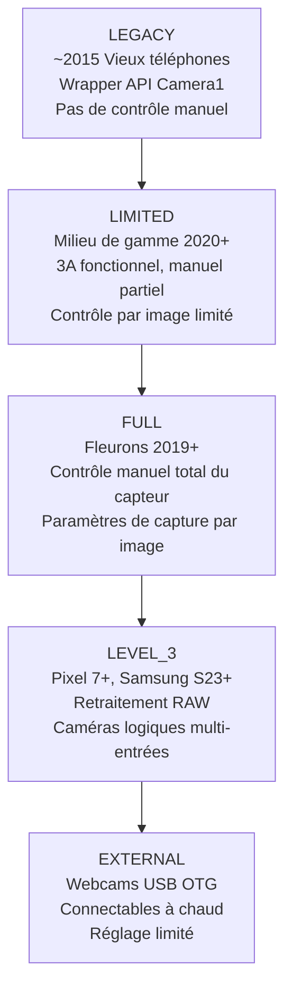
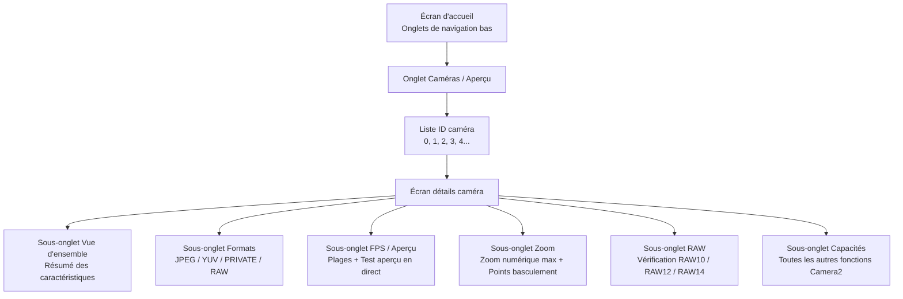

# Chapitre 4 : Explorez votre propre téléphone

C'est ici que votre application devient importante. Les chapitres 2 et 3 vous ont donné une compréhension théorique du matériel de la caméra et des fonctionnalités de la photographie computationnelle moderne. Ce chapitre est pratique et spécifique à votre appareil. Vous allez installer l'application compagnon **Android Camera Parameters** sur votre propre téléphone, la lancer et inspecter systématiquement ce que votre matériel peut et ne peut pas faire — en notant les réponses au fur et à mesure.

Les informations que vous découvrirez dans ce chapitre ne sont pas des anecdotes académiques. L'API Camera2 expose des capacités par appareil et par caméra. Une fonctionnalité qui fonctionne parfaitement sur votre Pixel 10 personnel peut échouer silencieusement (ou se dégrader en une opération nulle, ou pire, planter) sur un Samsung de série A milieu de gamme de 2023 parce que le HAL de cet appareil n'implémente tout simplement pas la capacité requise. Avant d'écrire une seule ligne de code pour l'API Camera2 dans la partie II de cette série, vous devez savoir de quoi votre propre appareil de test est capable.

À la fin de ce chapitre, vous aurez noté, pour votre téléphone spécifique : une liste complète des ID de caméra avec leurs directions de face et leurs niveaux matériels ; les formats de sortie pris en charge par chaque caméra ; la résolution JPEG maximale ; la plage FPS la plus élevée pour le ralenti ; le zoom numérique maximal et les seuils de basculement de caméra physique ; et si votre caméra principale prend en charge la sortie RAW.

## Installation de l'application Android Camera Parameters

Deux options d'installation sont disponibles. Choisissez celle que vous préférez.

### Option A — Construire à partir des sources

Si vous êtes un développeur Android et que vous avez déjà installé Android Studio, cette option vous permet de parcourir le code source de l'application compagnon (voir la dernière section de ce chapitre) et même de le modifier pour inspecter des caractéristiques Camera2 supplémentaires qui vous intéressent.

1. Clonez le dépôt GitHub :
   `https://github.com/zoozooll/AndroidCameraParameters`
2. Ouvrez le projet dans Android Studio Iguana (2023.2.1) ou plus récent. La synchronisation Gradle se terminera automatiquement ; le projet cible le SDK Android 34 (Android 14) avec un `minSdkVersion` de 21 (Android 5.0 Lollipop), il fonctionnera donc sur pratiquement n'importe quel téléphone que vous êtes susceptible de posséder.
3. Activez le débogage USB sur votre téléphone. Allez dans **Paramètres → À propos du téléphone → Numéro de build** et appuyez 7 fois sur l'entrée Numéro de build. Un message "Vous êtes maintenant un développeur" apparaîtra. Revenez à l'écran principal des paramètres, entrez dans les **Options pour les développeurs** et activez le **Débogage USB**.
4. Connectez votre téléphone à votre ordinateur via un câble USB-C. Sur le téléphone, acceptez l'invite "Autoriser le débogage USB depuis cet ordinateur ?" et cochez "Toujours autoriser depuis cet ordinateur" pour éviter la boîte de dialogue à l'avenir.
5. Sélectionnez la configuration d'exécution **app** dans le menu déroulant en haut d'Android Studio (la configuration par défaut est généralement nommée `app`). Assurez-vous que votre téléphone connecté apparaît comme appareil cible dans le menu déroulant des appareils.
6. Cliquez sur le bouton vert **Run** (l'icône de lecture triangulaire) ou appuyez sur **Maj + F10**. Android Studio compilera l'application, installera l'APK sur votre téléphone via ADB et la lancera automatiquement.

### Option B — Installer depuis Google Play

Si vous souhaitez simplement exécuter l'application sans la compiler, ou si vous voulez tester son comportement sur plusieurs appareils d'utilisateurs finaux sans configurer ADB sur chacun, utilisez la version du Play Store.

Ouvrez le Google Play Store sur votre téléphone Android et accédez à :

`https://play.google.com/store/apps/details?id=com.minininja.cameraparams`

Appuyez sur **Installer**. L'application est gratuite et ne contient aucune publicité, aucun achat intégré et aucun traqueur. Elle ne nécessite que l'autorisation `CAMERA` (pour interroger les caractéristiques de la caméra et ouvrir une surface d'aperçu) et l'autorisation optionnelle `RECORD_AUDIO` (jamais utilisée dans la version actuelle, mais réservée à une future activité de test d'enregistrement vidéo). L'autorisation `ACCESS_FINE_LOCATION` est optionnelle et n'est demandée que si vous souhaitez marquer les captures d'exemple avec des métadonnées GPS dans l'onglet d'aperçu.

Lancez l'application une fois l'installation terminée. Au premier lancement, accordez l'autorisation **Caméra** lorsque la boîte de dialogue système apparaît. L'application ne fonctionnera pas sans cette autorisation, car le modèle de sécurité d'Android nécessite l'octroi d'une autorisation d'exécution même pour *interroger* les caractéristiques de la caméra — vous ne pouvez même pas énumérer les ID de caméra sans que l'autorisation `CAMERA` ne soit accordée.

## ID de caméra (Camera IDs)

Regardez l'écran d'accueil de l'application. Le premier onglet (celui par défaut) en bas est intitulé **Caméras** (ou parfois **Aperçu** selon la version utilisée). L'en-tête en haut de cet onglet indique **Tous les ID de caméra**.

Chaque caméra individuelle sur un appareil Android — chaque caméra arrière, la caméra frontale, tout appareil de fusion multi-caméra logique et toute webcam USB OTG externe — se voit attribuer un identifiant textuel unique appelé **Camera ID**. Les ID de caméra sont presque toujours des entiers décimaux simples : `"0"`, `"1"`, `"2"`, `"3"`, et parfois `"4"`, `"5"` sur les appareils dotés de nombreuses caméras. Sur certains appareils rares (certaines webcams externes et les fausses caméras de l'émulateur), vous pouvez voir des ID comme `"camera@0"` ou `"0@external"`, mais les entiers simples sont de loin le format le plus courant.

Chaque ligne de la liste Tous les ID de caméra affiche trois informations, de gauche à droite :

1. Le numéro d'ID de la caméra lui-même, affiché sous forme d'une grande puce en gras.
2. La direction **LENS_FACING** : soit `BACK` (caméra arrière, opposée à l'écran), `FRONT` (caméra selfie, face à l'utilisateur), ou `EXTERNAL` (webcam USB / caméra OTG).
3. Le **niveau matériel** (Hardware Level) de cette caméra : une puce colorée affichant `LEGACY`, `LIMITED`, `FULL`, `LEVEL_3`, ou `EXTERNAL`. Cela correspond directement à la caractéristique `INFO_SUPPORTED_HARDWARE_LEVEL` de l'API Camera2 décrite au chapitre 1 de cette série.

À titre d'exemple concret, un Galaxy S26 Ultra rapporte généralement **5 ID de caméra** :

- **ID 0** : BACK (caméra grand-angle / principale arrière 24 mm), Niveau matériel = **FULL**
- **ID 1** : FRONT (caméra selfie), Niveau matériel = **LIMITED**
- **ID 2** : BACK (caméra ultra-grand-angle arrière 0,5×), Niveau matériel = **FULL**
- **ID 3** : BACK (téléobjectif périscope arrière 5×), Niveau matériel = **FULL**
- **ID 4** : BACK (ID multi-caméra logique représentant la combinaison fusionnée des ID 0 + 2 + 3, gérée par le HAL pour un zoom fluide), Niveau matériel = **FULL**

Un téléphone de milieu de gamme (par exemple, un Samsung A54 5G) pourrait ne rapporter que 3 ID de caméra : grand-angle arrière, ultra-grand-angle arrière et frontal. Un téléphone d'entrée de gamme de 2016 pourrait n'en rapporter que 2 : arrière et frontal.

**Tâche pour votre appareil :** Notez la liste complète des ID de caméra rapportés par votre téléphone. Pour chaque ID, notez sa direction LENS_FACING (Arrière / Avant / Externe) et son étiquette de niveau matériel. Comptez le nombre total de caméras. Si vous voyez un ID de caméra dont l'usage n'est pas évident (par exemple, un ID arrière supplémentaire qui ne correspond à aucun objectif visible à l'arrière du téléphone), gardez-le à l'esprit — il s'agit souvent de capteurs de profondeur ToF, de caméras macro ou de l'appareil de fusion multi-caméra logique.

## Niveaux matériels (Hardware Levels)

Le chapitre 1 de cette série a présenté les cinq niveaux matériels Camera2, classés du moins capable au plus capable : **LEGACY → LIMITED → FULL → LEVEL_3 → EXTERNAL**. Cette section rappelle cette hiérarchie et vous demande ensuite d'inspecter le niveau de chaque caméra à l'aide de l'application.

Chaque niveau ajoute de nouvelles capacités et des garanties de performance plus strictes :

- **LEGACY** : L'API Camera2 est implémentée comme une fine couche au-dessus de l'API obsolète `android.hardware.Camera` (Camera1). Presque rien ne fonctionne de manière fiable — pas d'exposition manuelle, pas de contrôle par image, pas de support RAW. Vous pouvez ignorer les appareils LEGACY en 2026 ; pratiquement aucun téléphone encore utilisé n'affiche ce niveau.
- **LIMITED** : Le niveau matériel le plus courant pour les téléphones de milieu de gamme et pour les caméras frontales sur tous les types de téléphones. Les algorithmes 3A (Auto-Exposure, Auto-Focus, Auto-White-Balance) s'exécutent correctement, les sorties YUV et JPEG de base fonctionnent, mais la plupart des commandes manuelles du capteur ne sont pas disponibles (pas de vitesse d'obturation manuelle sous le plancher AE, pas de contrôle de gain manuel, pas de mises à jour des paramètres de capture par image avec une latence inférieure à 3–5 images).
- **FULL** : Le niveau de référence pour les fleurons. Chaque fonctionnalité de l'API Camera2 est garantie de fonctionner : contrôle manuel total du temps d'exposition du capteur et du gain analogique par image individuelle, fréquence d'images garantie respectée, capture en rafale à plus de 30 fps avec des paramètres différents par image, retraitement YUV, sortie RAW DNG de base. Si la caméra arrière principale de votre téléphone affiche FULL, vous pouvez implémenter toutes les fonctionnalités de cette série de tutoriels.
- **LEVEL_3** : Le niveau le plus élevé, introduit avec les familles Pixel 7 et Samsung S23 en 2022/2023. Ajoute des flux d'entrée de retraitement RAW garantis (vous pouvez renvoyer un DNG précédemment capturé dans l'ISP et relancer le pipeline avec un mappage de tons ou des matrices de couleurs différents), des flux de sortie YUV multi-résolution et un support garanti de fusion multi-caméra logique.
- **EXTERNAL** : Pour les webcams USB OTG et les dongles de capture HDMI branchés via USB-C. La surface de l'API est identique mais aucune donnée de calibration d'usine n'existe (pas de cartes d'ombrage d'objectif stockées en OTP, pas de matrices de correction de couleurs par module), donc la qualité des caméras EXTERNAL est variable.

**Comment inspecter dans l'application :** Appuyez sur la puce **Niveau matériel** à côté de n'importe quel ID de caméra dans la liste. Une boîte de dialogue s'ouvrira en bas de l'écran affichant la description complète de `INFO_SUPPORTED_HARDWARE_LEVEL` pour cette caméra, ainsi qu'une liste à puces des fonctionnalités clés qui sont garanties (ou non) à ce niveau.

**Tâche pour votre appareil :** Pour votre caméra arrière principale (généralement l'ID 0), confirmez le niveau matériel qu'elle rapporte. Pour votre caméra frontale, confirmez son niveau. Ensuite, posez-vous cette question et réfléchissez à la réponse avant de poursuivre : **Pourquoi les caméras frontales rapportent-elles presque universellement LIMITED au lieu de FULL ?**

La réponse est que les caméras frontales sont généralement des capteurs plus simples et moins coûteux. L'algorithme 3A fonctionne de manière fiable sur elles (après tout, les selfies ont besoin de l'exposition automatique et de la balance des blancs automatique pour produire un résultat acceptable), mais le contrôle manuel du capteur est moins prioritaire pour les selfies. Personne ne paie un supplément pour une vitesse d'obturation manuelle de 1/1000s sur sa caméra selfie de 13 MP. Les fournisseurs de HAL optimisent donc leur implémentation de niveau LIMITED pour l'usage selfie et n'implémentent jamais les tests et la validation supplémentaires requis pour passer les tests CTS (Compatibility Test Suite) de niveau FULL.

## Caméras disponibles : Directions de face

Android définit trois valeurs possibles pour la caractéristique de caméra `LENS_FACING`. L'application propose une barre de filtres en haut de l'onglet Caméras pour basculer entre elles : **Tout · Arrière · Avant · Externe**.

- **BACK** : La caméra à l'arrière du téléphone, pointant à l'opposé de l'écran. Tout capteur arrière ultra-grand-angle, grand-angle, téléobjectif, périscope, macro ou ToF rapporte `LENS_FACING_BACK`. C'est la caméra que votre application utilisera 90 % du temps.
- **FRONT** : La caméra selfie, pointant vers l'utilisateur lorsque l'écran lui fait face. Notez que l'image d'aperçu de la caméra frontale est généralement retournée horizontalement (effet miroir) par l'application caméra par défaut pour correspondre à ce que l'utilisateur voit dans un miroir, mais les données de pixels réelles écrites dans les fichiers JPEG ne sont pas retournées, sauf si votre application le fait explicitement.
- **EXTERNAL** : Une webcam USB OTG, un endoscope USB, une carte de capture HDMI USB ou tout autre périphérique d'entrée vidéo connectable à chaud via USB-C. L'une des fonctionnalités les plus sous-estimées de l'API Camera2 est que les caméras EXTERNAL sont exposées via *exactement le même code* que les caméras internes. Une application Camera2 bien écrite énumérera et utilisera une webcam USB automatiquement sans aucun code spécifique à l'USB, tant que le port USB-C du téléphone prend en charge le mode hôte UVC (USB Video Class).

**Tâche pour votre appareil :** Utilisez les filtres pour basculer entre Arrière, Avant et Externe. Comptez combien de caméras tombent dans chaque catégorie. Votre téléphone affiche-t-il des caméras EXTERNAL en ce moment ? Presque certainement pas — sauf si vous avez une webcam USB branchée. Si vous possédez une webcam USB ou un endoscope USB, branchez-le maintenant au téléphone via un adaptateur OTG USB-C et appuyez sur le bouton **Actualiser** dans le menu en haut à droite de l'application. Vous devriez voir un nouvel ID de caméra apparaître avec LENS_FACING = EXTERNAL. Ouvrez l'onglet Aperçu pour cette caméra externe — si tout fonctionne, vous verrez un aperçu en direct de la webcam, en utilisant le même code de l'API Camera2 qui a ouvert la caméra arrière interne 30 secondes plus tôt.

## Formats de sortie pris en charge

Chaque appareil photo Camera2 annonce une liste de **formats de sortie** pris en charge et, pour chaque format, une liste de paires résolution/taille prises en charge. L'API Camera2 rejettera toute requête de capture tentant de cibler une combinaison format/taille que la caméra n'annonce pas.

L'application expose ces informations dans l'écran de détails de la caméra. Pour y accéder, appuyez sur n'importe quelle ligne d'ID de caméra dans l'onglet Caméras. Vous accéderez à un écran de détails avec plusieurs sous-onglets balayables : **Vue d'ensemble · Formats · FPS · Zoom · RAW · Capacités**. Balayez (ou appuyez sur la barre d'onglets) jusqu'à l'onglet **Formats**.

Il existe des dizaines de constantes `ImageFormat` possibles dans le SDK Android, mais ces **5 formats** représentent 99 % de l'utilisation réelle des applications Camera2. L'application les liste en haut de l'onglet Formats avec des descriptions en langage clair :

1. **JPEG** : Photos traitées normales que vous envoyez par e-mail, publiez sur les réseaux sociaux ou partagez par messagerie. Couleur YCbCr 4:2:0 sur 8 bits, traitée par l'ISP (les 8 étapes du chapitre 2 sont appliquées), compressée par DCT avec perte. Petite taille de fichier. C'est la sortie de capture fixe par défaut et la plus courante.
2. **YUV_420_888** : Le format universel non compressé pour le traitement sur l'appareil. Plan Y (luminance) 8 bits plus plans Cb et Cr (chrominance) 8 bits, sous-échantillonnés 2:1 horizontalement. Utilisé pour la détection de visage, la lecture de codes QR et de codes-barres, l'inférence d'apprentissage automatique (TensorFlow Lite, PyTorch Mobile), le traitement d'image personnalisé avant le réencodage en JPEG, et comme entrée pour l'encodeur vidéo MediaCodec pour l'enregistrement vidéo.
3. **PRIVATE** : Le format opaque sans copie utilisé exclusivement pour l'aperçu haute vitesse sur l'écran. La disposition réelle des pixels est spécifique au fournisseur et cachée à l'application (d'où le nom "private"). Les surfaces PRIVATE (généralement une `SurfaceView`, une `TextureView` ou un `ImageReader` avec des drapeaux d'utilisation `PRIV`) ignorent toutes les copies accessibles par le CPU et vont directement de la sortie de l'ISP au compositeur d'affichage. C'est le seul format qui garantit un aperçu à 60 fps ou 120 fps en pleine résolution sur les fleurons modernes.
4. **RAW_SENSOR** : Données de mosaïque Bayer non traitées directement du capteur, avant toute étape ISP. La profondeur de bits varie selon le capteur : RAW10 (10 bits par échantillon), RAW12 (12 bits) ou RAW14 (14 bits). Écrit dans des fichiers DNG (Digital Negative) pour la post-production sur ordinateur dans Adobe Lightroom, Capture One ou Darktable. Seules les caméras de niveau matériel FULL ou supérieur prennent en charge la sortie RAW ; les caméras LIMITED et LEGACY ne le font jamais.
5. **JPEG_R** : Format Ultra HDR, introduit dans Android 14. Une image principale JPEG 8 bits standard (rétrocompatible avec toutes les visionneuses) plus une carte de gain 10 bits intégrée que les visionneuses compatibles HDR (Galerie système Android 14, Chrome 120+, Adobe Lightroom 7+, Apple iOS 18 Photos) peuvent utiliser pour reconstruire toute la gamme de luminance HDR 10 bits sur un écran HDR10 ou Dolby Vision. Seuls les téléphones fleurons de 2023+ prennent en charge la sortie JPEG_R.

**Tâche pour votre appareil :** Appuyez sur votre caméra arrière principale (ID 0) dans l'application, balayez vers l'onglet **Formats**. L'application affiche chaque format de sortie pris en charge par cette caméra et, sous chaque format, une liste de toutes les résolutions prises en charge, triées de la plus grande (en haut) à la plus petite (en bas). Notez :

- Lesquels des 5 formats listés ci-dessus (JPEG, YUV_420_888, PRIVATE, RAW_SENSOR, JPEG_R) sont présents pour votre caméra principale ?
- Quelle est la **résolution JPEG maximale** ? Elle sera presque toujours proche des dimensions en pixels de la matrice active du capteur (sans être nécessairement égale). Un capteur de 48 MP peut lister 8000×6000 (48 MP plein), 4000×3000 (12 MP regroupé), 1920×1080 (2 MP) et 1280×720 (1 MP) comme tailles JPEG.
- RAW_SENSOR est-il présent ? Si oui, notez que votre téléphone prend en charge la capture RAW DNG ; nous utiliserons cette capacité au chapitre 18.
- JPEG_R (Ultra HDR) est-il présent ? Cela vous indique si l'ISP de votre appareil est capable de produire des clichés HDR avec carte de gain.

Répétez l'exercice pour votre caméra frontale et (si présents) vos caméras arrière ultra-grand-angle et téléobjectif.

## Plages FPS (Images par seconde)

Balayez jusqu'à l'onglet **FPS / Aperçu** dans l'écran de détails de la caméra. L'API Camera2 ne rapporte pas "le FPS maximal" d'une caméra sous la forme d'un chiffre unique. Au lieu de cela, chaque caméra rapporte une liste de **plages FPS**, chacune écrite sous la forme `[minimum_fps, maximum_fps]`. Le HAL de la caméra garantit que, si votre application configure une session avec cette plage FPS, l'algorithme d'exposition automatique du capteur choisira un temps d'exposition qui maintient la fréquence d'images réelle entre ces deux limites.

Entrées typiques que vous verrez sur un téléphone moderne :

- `[15, 30]` : Aperçu adaptatif normal. L'algorithme AE est libre de faire descendre la fréquence à 15 fps dans les scènes très sombres lorsque les temps d'exposition s'allongent. C'est le réglage par défaut pour presque tous les cas d'utilisation d'aperçu photo.
- `[30, 30]` : 30 fps fixe. L'AE ne dépassera jamais un temps d'exposition supérieur à 1/30e de seconde ; si la scène est trop sombre, le gain analogique est boosté à la place. Utilisé pour l'enregistrement vidéo standard à 30 fps.
- `[60, 60]` : 60 fps fixe. Aperçu fluide pour les cas d'utilisation de caméra de jeu ou l'enregistrement vidéo à 60 fps. Nécessite que le capteur ait une lecture roulante assez rapide pour maintenir 60 images complètes par seconde.
- `[120, 120]` : 120 fps fixe pour une capture vidéo au ralenti 4×. Généralement disponible uniquement à une résolution réduite (1080p ou moins).
- `[240, 240]` : 240 fps fixe pour une vidéo au ralenti 8×. Presque toujours disponible uniquement à une résolution 720p.
- `[960, 960]` : 960 fps fixe pour un ralenti ultra-fluide 32×. Extrêmement rare ; seuls quelques fleurons Sony Xperia et Samsung Galaxy haut de gamme prennent cela en charge, et seulement pour une rafale pré-enregistrée très courte (0,2–0,3 seconde) en 720p.

L'application affiche chaque plage FPS prise en charge dans une liste déroulante. Sous la liste se trouve une carte de test d'aperçu : appuyez sur **Démarrer le test d'aperçu 60fps** et l'application ouvrira un flux d'aperçu fixe à 60fps et affichera un compteur de FPS en temps réel dans le coin pour vous permettre de vérifier que le 60fps est réellement atteignable sur votre appareil.

**Tâche pour votre appareil :** Pour votre caméra arrière principale, notez la liste complète des plages FPS prises en charge. Répondez à ces questions :

- `[60, 60]` est-il présent ? Votre téléphone prend en charge un aperçu fluide à 60fps.
- `[120, 120]` est-il présent ? Votre téléphone prend en charge le ralenti 4×.
- `[240, 240]` est-il présent ? Votre téléphone prend en charge le ralenti 8×.
- `[960, 960]` est-il présent ? Si oui, votre téléphone est un fleuron de premier plan — profitez de l'ultra-ralenti !

Comparez maintenant la liste pour votre caméra frontale. La liste FPS de la caméra frontale est presque toujours plus courte : elle comporte rarement des entrées 240fps ou 960fps, et manque parfois aussi du 60fps.

## Plages de zoom et points de basculement de caméra

Balayez jusqu'à l'onglet **Zoom** dans l'écran de détails de la caméra. Cet onglet expose les capacités de zoom de la caméra.

Le premier chiffre que vous verrez est étiqueté **SCALER_AVAILABLE_MAX_DIGITAL_ZOOM**. Il s'agit d'une valeur à virgule flottante comme `10.0`, `20.0` ou `100.0`, représentant le rapport de zoom *numérique* maximal pris en charge par le HAL pour cette caméra. Une valeur de 10.0 signifie que vous pouvez recadrer le centre (1/10e des pixels du capteur linéairement — 1/10 de la largeur et 1/10 de la hauteur = 1 % du nombre total de pixels) tout en obtenant un flux de sortie valide. Notez que le zoom numérique au-delà de ~2× produit un résultat visiblement flou et pixélisé ; le marketing "100× Space Zoom" sur les fleurons Samsung est un zoom optique 10× (périscope) × un zoom numérique 10×, et à 100×, l'image n'est essentiellement que 1 % des pixels du capteur mis à l'échelle avec une accentuation par IA.

Pour les **appareils multi-caméras logiques** (par exemple, le Galaxy S26 Ultra ID 4 qui fusionne le grand-angle, l'ultra-grand-angle et le téléobjectif périscope), l'onglet Zoom affiche également un diagramme des **rapports de zoom optique** et des points de basculement de caméra gérés par le HAL. Voici un exemple représentatif d'un Galaxy S26 Ultra :

- **0,5×** : Caméra active = Ultra-grand-angle (ID 2). En dessous de 0,7×, la sortie provient à 100 % du capteur ultra-large.
- **0,7× → 0,9×** : Zone de fusion. Le HAL capture simultanément la caméra ultra-large et la caméra grand-angle, les aligne et effectue un fondu enchaîné de la sortie. L'utilisateur ne voit aucun saut.
- **1,0× (défaut)** : Caméra active = Grand-angle / Principale (ID 0). C'est la caméra utilisée pour 80 % des photos quotidiennes.
- **1,1× → 2,9×** : Recadrage numérique du capteur grand-angle. La qualité se dégrade progressivement à mesure que le zoom augmente.
- **2,9× → 3,1×** : Zone de fusion. Le HAL effectue un fondu enchaîné du grand-angle recadré numériquement vers le capteur téléobjectif périscope 3× natif.
- **3,0×** : Caméra active = Téléobjectif 3× (si présent), ou début du recadrage périscope.
- **5,0× → 9,9×** : Recadrage numérique du capteur périscope 5× (ID 3).
- **10,0×** : Sortie périscope 10× native (si le périscope le prend en charge).
- **10,1× → 30,0×** : Recadrage numérique de la sortie périscope 10×. À 30×, vous regardez 1/900e de la surface d'origine du capteur mise à l'échelle — impressionnant pour le marketing, mais peu utile en photographie pour la plupart des usages.

L'application propose un test interactif pour cela. Revenez à l'onglet **Aperçu** de l'écran de détails de la caméra. Vous verrez un aperçu de la caméra en direct et un curseur de rapport de zoom au bas de l'écran.

**Tâche pour votre appareil :** Effectuez un geste de pincement lent et régulier sur la surface d'aperçu, ou faites glisser le curseur de zoom doucement de sa position minimale (gauche) à sa position maximale (droite). Regardez l'étiquette du chiffre du rapport de zoom. Lorsque vous passez des seuils spécifiques (0,5×, 1,0×, 3,0×, 5,0×, 10,0×), vous remarquerez que l'image d'aperçu "saute" brièvement en champ de vision, en netteté et parfois en ton de couleur — ces sauts sont le HAL qui bascule la caméra physique active derrière l'appareil multi-caméra logique. Notez les points de basculement de zoom que vous observez. Ces seuils spécifiques sont les rapports auxquels vous, en tant que développeur de l'API Camera2, voudrez basculer vos requêtes de capture entre les ID de caméra physiques individuels si vous souhaitez une qualité d'image maximale au lieu d'un recadrage numérique géré par le HAL.

## Support RAW

Revenez à l'onglet **Formats**. Dans le coin supérieur droit de la barre d'onglets se trouve un filtre : **Tout / Traité / RAW**. Appuyez sur **RAW** pour filtrer la liste des formats sur les formats RAW uniquement.

Si RAW_SENSOR est pris en charge pour cette caméra, l'application listera toutes les variantes RAW disponibles. Les profondeurs de bits RAW les plus courantes sur Android en 2026 :

- **RAW10** : 10 bits par échantillon. Le plus courant sur les téléphones de milieu de gamme et sur les caméras ultra-grand-angle / téléobjectif des fleurons. 1 024 niveaux distincts par canal Bayer.
- **RAW12** : 12 bits par échantillon. Le réglage par défaut pour les caméras grand-angle principales sur les fleurons. 4 096 niveaux par canal. Excellente marge d'édition.
- **RAW14** : 14 bits par échantillon. Très rare ; uniquement sur les téléphones de qualité professionnelle comme le Sony Xperia Pro-I ou le capteur 1 pouce du Xiaomi 13 Ultra. 16 384 niveaux par canal. Égale la latitude d'édition de nombreux reflex APS-C.
- **RAW_SENSOR** : Le jeton générique qui correspond à la profondeur de bits RAW par défaut de l'appareil. Vous pouvez toujours demander le format `RAW_SENSOR` et le HAL substituera la variante de profondeur de bits appropriée pour vous.

Les fichiers DNG générés par les flux `RAW_SENSOR` intègrent également les données de calibration d'usine par module : le motif de la matrice de filtres colorés, la matrice de couleurs mappant le RVB natif du capteur à l'illuminant D65 XYZ, le point blanc neutre, le niveau de noir par canal et le niveau de blanc par canal. Toutes ces métadonnées sont requises par les éditeurs RAW sur ordinateur pour interpréter les données de mosaïque Bayer autrement ininterprétables.

**Tâche pour votre appareil :** RAW_SENSOR est-il présent pour votre caméra arrière principale ? Si oui, quelles variantes de profondeur de bits sont listées ? Notez la réponse. Au chapitre 18 de cette série, vous apprendrez comment ouvrir un flux de sortie RAW, capturer un fichier DNG et l'écrire avec les EXIF et les métadonnées appropriés sur le stockage de votre application. Si le RAW n'est pas pris en charge (courant pour les caméras frontales et pour les appareils LIMITED de milieu de gamme), alors la capture RAW dans votre propre application Camera2 ne sera tout simplement pas possible sur cette caméra, et vous devriez concevoir votre application pour masquer gracieusement l'option d'interface "Capturer en RAW" lorsque la capacité est manquante.

## Code source

L'application compagnon **Android Camera Parameters** est 100 % open source. Le dépôt GitHub se trouve à l'adresse suivante :

`https://github.com/zoozooll/AndroidCameraParameters`

Si vous avez suivi l'option A et construit l'application à partir des sources, vous avez déjà le code sur votre machine. Si vous l'avez installée depuis Google Play, vous pouvez cloner le dépôt à tout moment pour voir comment l'application interroge chacune des valeurs que vous venez d'inspecter. Parcourez le code source et vous découvrirez :

- Comment l'application utilise `CameraManager.getCameraIdList()` pour énumérer tous les ID de caméra.
- Comment elle lit `CameraCharacteristics.LENS_FACING` et `INFO_SUPPORTED_HARDWARE_LEVEL` pour alimenter les puces de l'onglet principal Caméras.
- Comment elle interroge `SCALER_STREAM_CONFIGURATION_MAP` pour énumérer chaque format et résolution pris en charge, et comment elle filtre la liste résultante pour les onglets Formats et RAW.
- Comment elle lit `CONTROL_AE_AVAILABLE_TARGET_FPS_RANGES` pour construire la liste des plages FPS.
- Comment elle interroge `SCALER_AVAILABLE_MAX_DIGITAL_ZOOM` et `SCALER_AVAILABLE_ZOOM_RATIOS` pour construire le diagramme des points de basculement de zoom et le curseur interactif de zoom d'aperçu.

Chaque valeur affichée par l'application est lue à partir de la même carte `CameraCharacteristics` que votre propre code d'API Camera2 interrogera à partir du chapitre 5. L'application compagnon est, en fait, une implémentation de référence visuelle pour les premiers chapitres de la partie II de cette série de tutoriels.

## Résumé

Dans ce chapitre pratique, vous avez installé l'application compagnon Android Camera Parameters sur votre propre téléphone Android (soit en la compilant depuis les sources GitHub `https://github.com/zoozooll/AndroidCameraParameters`, soit en l'installant depuis Google Play à l'adresse `https://play.google.com/store/apps/details?id=com.minininja.cameraparams`). Vous avez énuméré chaque ID de caméra sur votre appareil et noté le LENS_FACING (Arrière / Avant / Externe) et le niveau matériel (LEGACY → LIMITED → FULL → LEVEL_3 → EXTERNAL) de chacun, et vous avez appris pourquoi les caméras frontales rapportent presque toujours LIMITED au lieu de FULL. Vous avez utilisé le filtre de face pour voir la répartition des caméras arrière, avant et externes, et (si vous aviez une webcam USB à portée de main), vous avez vérifié que l'API Camera2 énumère les caméras USB OTG par le même chemin de code que les caméras internes. Vous avez inspecté les formats de sortie pris en charge par chaque caméra (JPEG, YUV_420_888, PRIVATE, RAW_SENSOR, JPEG_R Ultra HDR) et noté la résolution JPEG maximale ainsi que le support du RAW et de l'Ultra HDR. Vous avez énuméré les plages FPS pour chaque caméra et appris quelles vitesses de ralenti votre téléphone peut capturer. Vous avez exploré le curseur de zoom et identifié les points de basculement gérés par le HAL où la caméra physique active change lors d'un zoom par pincement. Enfin, vous avez confirmé si votre caméra principale prend en charge la sortie RAW_SENSOR et à quelles profondeurs de bits, et vous avez été invité à parcourir le code source ouvert de l'application compagnon pour voir exactement comment chacune de ces valeurs est lue depuis l'API Camera2.

## Et ensuite ?

La partie I de cette série est maintenant terminée. Vous disposez des bases matérielles (chapitre 2), du vocabulaire des fonctionnalités de la photographie computationnelle (chapitre 3) et d'une carte des capacités spécifiques à votre propre téléphone (chapitre 4). La partie II commence au chapitre 5 avec votre premier code API Camera2 : l'ouverture d'un `CameraManager`, l'énumération programmatique des `CameraCharacteristics`, l'ouverture d'un `CameraDevice`, la création d'une `CaptureSession` et le déclenchement de votre première requête d'aperçu répétée vers une `TextureView` — un aperçu de caméra en direct à l'écran, écrit de zéro en 100 lignes de Kotlin.
