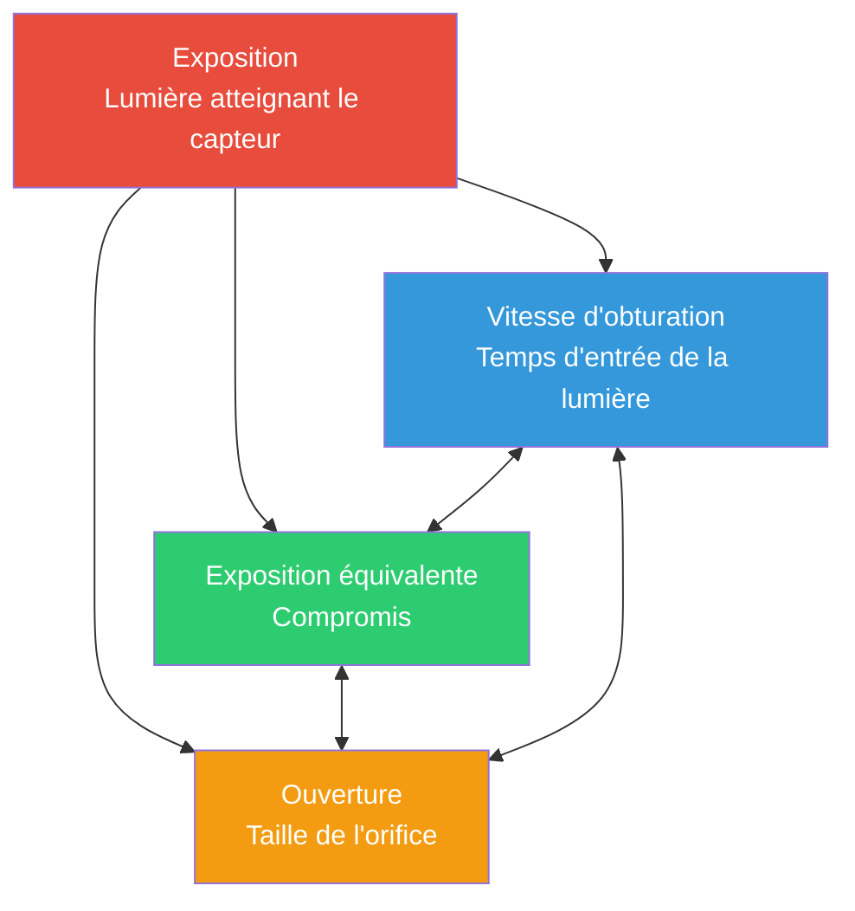

# Chapitre 13 : L'exposition

## Le triangle de l'exposition : Trois boutons, un seul but

Lorsque vous prenez une photo avec l'appareil photo d'un smartphone, vous capturez de la lumière. La *quantité* de lumière qui atteint le capteur détermine si votre photo est trop sombre (sous-exposée), trop lumineuse (surexposée) ou juste comme il faut (correctement exposée). Trois réglages fondamentaux régissent cela — ensemble, ils forment le **triangle de l'exposition**.



**L'idée centrale :** Chaque angle du triangle contrôle la lumière, mais chaque angle introduit également un *compromis créatif*. Vous pouvez obtenir la *même* exposition totale avec différentes combinaisons des trois réglages — mais chaque combinaison donnera un *aspect* différent à votre photographie.

Avant de plonger dans les spécificités de l'API Android Camera2 dans le chapitre suivant, construisons une base intuitive solide pour chaque élément.

---

## ISO : Sensibilité du capteur (Contrôle du gain)

À l'époque de la pellicule, l'**ISO** décrivait la *sensibilité de la pellicule à la lumière* — une pellicule ISO 100 était "lente" et nécessitait une lumière vive, tandis qu'une pellicule ISO 800 était "rapide" et pouvait photographier en intérieur.

**En photographie numérique (y compris les caméras de smartphone), l'ISO est le gain du capteur / l'amplification électronique.** Lorsque vous doublez la valeur ISO, vous doublez effectivement l'amplification appliquée au signal analogique du capteur avant sa numérisation.

### Comment fonctionne l'ISO

Imaginez les puits de pixels du capteur collectant des photons (particules de lumière). Une fois la période d'exposition terminée :

1. Chaque pixel convertit les photons accumulés en une minuscule charge électrique
2. Un **amplificateur de gain analogique** multiplie ce signal par un facteur correspondant à votre réglage ISO
3. Le signal amplifié est converti d'analogique en numérique (CAN)
4. Le traitement numérique applique ensuite d'autres étapes (réduction du bruit, mappage de tonalité)

**ISO 100 = base / gain le plus bas.** Le signal est le moins amplifié, donc :
- Les photos sont *propres* avec un bruit numérique (grain) minimal
- La plage dynamique (différence entre les tons les plus clairs et les plus sombres enregistrables) est maximale
- Les couleurs sont les plus fidèles

**ISO 3200 = gain élevé.** Le signal est amplifié 32× :
- Vous pouvez photographier dans des scènes plus sombres sans augmenter le temps d'obturation
- Mais vous obtenez un *bruit visible* (tavelures de couleur, grain de luminance)
- La plage dynamique et la fidélité des couleurs se dégradent considérablement

### Plage ISO typique d'un smartphone

| Plage ISO | Caractéristique | Cas d'utilisation |
|-----------|-----------------|-------------------|
| 50–200 | ISO de base, image la plus propre | Plein soleil, éclairage de studio |
| 200–800 | Gain modéré, bruit mineur | Temps couvert, zones ombragées |
| 800–3200 | Bruit visible, toujours utilisable | Éclairage intérieur, crépuscule |
| 3200–12800+ | Bruit lourd / NR intensive appliquée | Scènes de nuit, événements sombres |

> **Note sur la réalité des smartphones :** Les téléphones fleurons appliquent souvent une réduction de bruit computationnelle intensive aux valeurs ISO élevées (le "mode nuit" spécifique au fournisseur). Lorsque vous désactivez plus tard le pipeline automatique dans Camera2, vous *perdez* bon nombre de ces optimisations OEM — une mise en garde critique sur laquelle nous reviendrons au chapitre 14.

---

## Vitesse d'obturation (Temps d'exposition)

La **vitesse d'obturation** est simplement *la durée pendant laquelle le capteur est exposé à la lumière*. Dans les appareils photo traditionnels, un obturateur mécanique s'ouvre et se ferme physiquement. Dans les smartphones, il s'agit presque toujours d'un **obturateur électronique** — le capteur est réinitialisé, laissé libre de collecter des photons pendant une durée précise, puis lu.

La vitesse d'obturation est mesurée en **secondes**, généralement exprimée sous forme de fractions :

| Vitesse d'obturation | Effet | Utilisation typique |
|-----------------------|-------|---------------------|
| 1/2000s – 1/1000s | Exposition très courte, fige tout mouvement | Sports, oiseaux, véhicules rapides |
| 1/500s – 1/250s | Fige les mouvements humains typiques | Gens qui marchent, enfants qui jouent |
| 1/125s – 1/60s | Vitesse "sûre" à main levée avec stabilisation | Photographie générale avec mains stables |
| 1/30s – 1/15s | Léger flou de bougé visible, nécessite un trépied | Mouvement créatif, basse lumière |
| 1s – 30s | Longue exposition, flou de mouvement important | Cascades, traînées d'étoiles, eau lisse |
| 30s+ | Exposition ultra-longue (spécialisée) | Astrophotographie, light painting |

### L'effet de flou de mouvement

Il existe **deux** raisons de choisir délibérément une vitesse d'obturation spécifique au-delà du simple "assez de lumière" :

1. **Figer l'action :** Un oiseau en vol à 1/1000s montre chaque plume avec netteté car l'oiseau a parcouru une distance presque nulle pendant l'exposition.

2. **Créer un flou de mouvement :** Une cascade à 2 secondes rend l'eau en mouvement comme des traînées blanches soyeuses — parce que chaque goutte d'eau a traversé de nombreux pixels sur le capteur pendant qu'il était exposé.

Pensez-y comme à une peinture à longue exposition : *tout ce qui bouge pendant que l'obturateur est ouvert devient une traînée.*

**Important pour la vidéo :** Lors d'un tournage vidéo à 30 fps, chaque image est exposée pendant ~1/30s *maximum*. Les directeurs de la photographie suivent la **règle de l'obturateur à 180°** : régler la vitesse d'obturation au double de la fréquence d'images → 1/60s pour une vidéo à 30 fps. Cela donne un flou de mouvement naturel, de type "cinéma", sans être trop saccadé ni trop baveux.

---

## Ouverture

L'**ouverture** est la taille de l'orifice dans l'objectif par lequel passe la lumière. Elle est mesurée en **f-stops** (f/1.4, f/2.0, f/2.8, f/4.0, f/5.6, f/8.0, etc.) — une *échelle contre-intuitive où les petits chiffres = plus grande ouverture*.

```
  f/1.4     f/2.0     f/2.8     f/4.0     f/5.6     f/8.0
█████████████████████████████████████████████████████████
█████████████████                              █████████
███████████████                                  ███████
█████████████                                    ██████
████████████                                      █████
███████████                                      ██████
```

**Diviser la lumière par deux à chaque palier :** Passer de f/1.4 → f/2.0 → f/2.8 → f/4.0 divise à chaque fois par deux la surface de l'orifice, donc la moitié de la lumière totale passe. C'est un "palier" (stop) plus sombre par étape.

### Compromis de l'ouverture (Créatifs et Pratiques)

1. **Profondeur de champ (DoF) :** Grande ouverture (f/1.8) = DoF *faible* — seul un plan étroit est net ; tout ce qui est devant/derrière devient flou (bokeh). Petite ouverture (f/8) = DoF *profonde* — tout est net, du premier plan à l'arrière-plan.

2. **Collecte de lumière :** f/1.4 collecte 4× plus de lumière que f/2.8. C'est pourquoi les "objectifs rapides" (grande ouverture maximale) sont prisés pour les prises de vue en basse lumière.

3. **Diffraction :** Aux ouvertures très petites (f/11+), les ondes lumineuses se courbent autour des lamelles du diaphragme, ce qui ramollit légèrement l'image. C'est généralement sans importance sur les smartphones.

### Réalité des smartphones

La plupart des smartphones ont des **objectifs à ouverture fixe** — vous ne pouvez pas changer le f-stop. Les téléphones d'entrée de gamme peuvent avoir f/2.4–f/2.8 ; les fleurons atteignent souvent f/1.4–f/1.8. L'application [Android Camera Parameters](https://play.google.com/store/apps/details?id=com.minininja.cameraparams) vous permet de vérifier l'ouverture fixe de votre objectif dans `CameraCharacteristics`.

Quelques téléphones haut de gamme (ex: Samsung Galaxy S23 Ultra, série Xperia) proposent un mécanisme de *double ouverture* qui bascule mécaniquement entre deux paliers (ex: f/1.5 et f/2.4). Dans Camera2, interrogez `LENS_INFO_AVAILABLE_APERTURES` pour voir si votre appareil prend en charge plusieurs ouvertures.

**La conclusion pratique :** Pour la plupart des développements Android Camera2, l'ouverture est *fixe*, vous contrôlez donc l'exposition via **l'ISO + la vitesse d'obturation uniquement**. Deux boutons au lieu de trois — ce qui simplifie en fait les choses !

---

## EV : Valeur d'exposition (L'échelle logarithmique)

Quand les photographes disent "ajuster d'un palier", ils veulent dire **doubler ou diviser par deux la lumière totale**. Pour rendre la réflexion basée sur les paliers précise, l'industrie a normalisé la **valeur d'exposition (EV)**.

L'**EV 0** est défini comme la combinaison d'exposition qui produit une luminosité de référence standard : **1 seconde d'exposition, ouverture f/1.0, ISO 100**.

Chaque **+1 EV double la lumière** (plus lumineux). Chaque **−1 EV divise la lumière par deux** (plus sombre) :

| Changement d'EV | Signification |
|-----------------|---------------|
| +3 EV | 8× plus de lumière (2³) |
| +2 EV | 4× plus de lumière |
| +1 EV | 2× plus de lumière |
| 0 EV | Référence : 1s @ f/1.0 ISO 100 |
| −1 EV | ½ de la lumière |
| −2 EV | ¼ de la lumière |
| −3 EV | ⅛ de la lumière |

La chose magnifique : **toute combinaison d'ISO + obturation + ouverture dont la somme donne la même valeur EV produit la même exposition totale**. C'est le principe de l'*exposition équivalente* qui relie les trois sommets du triangle.

### EV et combinaisons ISO/Obturation

Avec une ouverture fixe, l'équation EV se simplifie considérablement. Pour un smartphone à f/1.8 :

| Scène | EV typique | Obturation ISO 100 | Obturation ISO 400 | Obturation ISO 1600 |
|-------|------------|--------------------|--------------------|---------------------|
| Plage ensoleillée | 15 | 1/4000s | 1/1000s | 1/250s |
| Jour voilé / couvert | 12 | 1/500s | 1/125s | 1/30s |
| Bureau intérieur lumineux | 8 | 1/30s | 1/8s | 1/2s |
| Salon la nuit | 4 | 2s | 0,5s | 1/8s |
| Scène de nuit étoilée | −2 | 30s | 8s | 2s |

### La célèbre règle du Sunny 16

Avant les mesures matricielles et les algorithmes sophistiqués d'exposition automatique, les photographes s'appuyaient sur une règle de base pour réussir l'exposition en plein jour sans posemètre :

> **Par une journée ensoleillée, réglez l'ouverture sur f/16 et la vitesse d'obturation sur 1/ISO secondes.**

| Sunny 16 (f/16) | Équivalent à f/1.8 (Smartphone) |
|-----------------|---------------------------------|
| ISO 100, 1/100s, f/16 → EV 15 | ISO 100, 1/4000s, f/1.8 → EV 15 ✓ |
| ISO 200, 1/200s, f/16 → EV 15 | ISO 200, 1/8000s, f/1.8 → EV 15 ✓ |

Le calcul se vérifie : f/1.8 est environ **6⅓ paliers plus large** que f/16. Chaque palier quadruple ? Non — chaque palier *double* la zone de lumière. 2^(6,33) ≈ 80× plus de lumière. L'obturateur doit donc être 80× plus rapide pour compenser : 1/100s ÷ 80 ≈ 1/8000s (à ISO 200). C'est assez précis pour le terrain.

---

## L'aspect des photos sous-exposées / correctes / surexposées

Comparons mentalement trois clichés de la même scène (ex : une personne à l'extérieur avec le ciel derrière elle) :

**Sous-exposée (−2 EV) :** Le sujet est trop sombre. Les ombres sont *écrasées* en noir pur sans détails. Dans un histogramme, toutes les données s'entassent sur le côté gauche (sombre). Le ciel peut paraître correct, mais la personne apparaît comme une silhouette. Vous *pouvez* essayer de "pousser" les données brutes sous-exposées en post-traitement, mais les ombres révéleront un bruit important car vous amplifiez un signal faible.

**Exposition correcte (0 EV) :** Les tons moyens présentent une texture appropriée. Le visage de la personne présente des détails de peau visibles, les plis de la chemise, les reflets dans les yeux. L'histogramme présente des données réparties sur toute la plage sans écrêtage brutal aux deux extrémités. Sur les téléphones à plage dynamique limitée, cela peut signifier que *certaines* zones très lumineuses du ciel sont écrêtées en blanc (pas de détails bleus) — c'est un compromis classique par rapport à la sous-exposition du sujet.

**Surexposée (+2 EV) :** Les zones lumineuses sont *brûlées* en blanc pur sans récupération possible. Le ciel est un champ plat blanc uniforme ; les boutons de chemise brillants et les reflets spéculaires sont écrêtés. Le visage de la personne peut sembler flatteur (peau lumineuse), mais vous avez perdu définitivement tous les détails dans les hautes lumières. Contrairement aux ombres sous-exposées (que vous pouvez souvent récupérer partiellement avec du bruit), *les hautes lumières brûlées ont disparu à jamais* — il n'y a tout simplement aucune donnée dans ces pixels.

**Le mantra du photographe :** *Exposez pour les hautes lumières, récupérez les ombres.* En capture RAW (que nous aborderons plus tard), c'est particulièrement puissant car le RAW 14 bits stocke suffisamment de détails dans les ombres pour remonter de +2 EV ou plus sans bruit catastrophique.

---

## Tableau de référence des EV en conditions réelles

Mémoriser quelques valeurs EV clés vous permet d'estimer l'exposition n'importe où :

| Scène | EV typique (à ISO 100) | Obturation approx. @ f/1.8, ISO 400 |
|-------|------------------------|-------------------------------------|
| Paysage enneigé en plein soleil | 16 | 1/4000s |
| Plage ensoleillée, jour radieux | 15 | 1/2000s |
| Journée ensoleillée typique | 14 | 1/1000s |
| Jour couvert / nuageux | 12 | 1/250s |
| Très nuageux / pluie | 11 | 1/125s |
| Ombre découverte (sujet à l'ombre, fond ensoleillé) | 9 | 1/30s |
| Coucher de soleil / heure dorée | 7 | 1/8s |
| Bureau intérieur lumineux | 8 | 1/15s |
| Salon de maison, lampes seules | 4 | 1/2s |
| Intérieur de restaurant sombre | 2 | 2s |
| Rue de ville la nuit (néons) | 1 | 4s |
| Paysage nocturne, lumières de ville lointaines | −2 | 30s |
| Paysage au clair de lune (pleine lune) | −3 | 1 minute |
| Ciel étoilé, sans lune | −6 | 8 minutes |

Vous pouvez vérifier ces approximations par rapport à ce que l'exposition automatique de votre téléphone choisit réellement. Lancez l'application [Android Camera Parameters](https://github.com/zoozooll/AndroidCameraParameters), allez dans l'aperçu en direct et observez `SENSOR_EXPOSURE_TIME` et `SENSOR_SENSITIVITY` lorsque vous passez d'un soleil éclatant à une pièce sombre — vous verrez des valeurs réelles qui correspondent approximativement à ce tableau.

---

## Synthèse : Les expositions équivalentes

Disons que vous voulez la *même exposition totale* (EV 12 = jour couvert, smartphone f/1.8). Voici trois combinaisons valides produisant une luminosité de capteur identique :

| Combinaison | ISO | Vitesse d'obturation | Aspect et sensation |
|-------------|-----|----------------------|---------------------|
| Propre & net | 100 | 1/500s | Bruit le plus propre, fige au mieux le mouvement |
| Entre-deux | 400 | 1/125s | Bruit mineur, bon équilibre |
| Mouvement fluide | 1600 | 1/30s | Bruit visible ; léger flou sur les sujets mobiles |

Les trois arrivent au même EV. Les trois *semblent aussi lumineuses*. Mais la *texture* (grain du bruit) et la *représentation du mouvement* sont complètement différentes. **C'est là tout l'art de l'exposition.**

### Et si vous avez besoin des deux ?

C'est là que la photographie computationnelle brille. Un téléphone en "mode nuit" ne prend pas *une* photo de 2 secondes — il capture des *douzaines* d'images de 1/60s (figeant le mouvement dans chacune), puis les aligne et en fait la moyenne par calcul. Le résultat approche la collecte de lumière d'une exposition longue sans la pénalité du flou de mouvement.

Une fois que vous aurez compris l'exposition manuelle au niveau de Camera2, vous pourrez implémenter vous-même des techniques de ce genre.

---

## Résumé

Dans ce chapitre, nous avons couvert les *fondamentaux de la photographie* sans toucher à une seule ligne de code Android :

- **Le triangle de l'exposition :** La vitesse d'obturation (temps), l'ISO (gain du capteur) et l'ouverture (taille de l'orifice) se combinent pour contrôler la lumière totale. Chacun a un compromis créatif.
- **L'ISO** en photographie numérique = gain analogique du capteur. ISO bas = propre, ISO élevé = bruité. Les smartphones supportent couramment ISO 100–6400+ avec réduction de bruit OEM.
- **La vitesse d'obturation** est le temps d'exposition en secondes. Les obturateurs rapides (1/1000s) figent l'action ; les obturateurs lents (1s+) créent un flou de mouvement. La règle du 180° s'applique à la vidéo.
- **L'ouverture** est l'orifice de l'objectif contrôlé par le f-stop. La plupart des smartphones ont une ouverture fixe, nous comptons donc uniquement sur l'ISO + l'obturation.
- **L'EV (Valeur d'exposition)** est l'échelle logarithmique de paliers où chaque palier ±1 double/divise par deux la lumière. EV 0 = 1s @ f/1.0 ISO 100.
- **La règle du Sunny 16** et le tableau de référence EV vous permettent d'estimer les expositions sans posemètre.
- **L'exposition correcte** équilibre les détails des tons moyens, en évitant les ombres écrasées et les hautes lumières brûlées. Le RAW préserve une marge de récupération.

## Et ensuite ?

Dans le **Chapitre 14 : L'exposition manuelle dans Camera2**, nous traduisons tout ce modèle conceptuel en appels concrets de l'API Camera2. Vous apprendrez :

- Comment désactiver le pipeline d'exposition automatique (`CONTROL_MODE = OFF`, `CONTROL_AE_MODE = OFF`)
- Comment traduire les valeurs ISO en `SENSOR_SENSITIVITY`
- Comment convertir les secondes lisibles par l'homme ↔ nanosecondes pour `SENSOR_EXPOSURE_TIME`
- Le code Kotlin complet et fonctionnel pour une exposition fixe de timelapse, une exposition nocturne longue et une série de bracketing d'exposition de 3 clichés
- La mise en garde critique concernant la désactivation de la réduction du bruit OEM lorsque vous coupez le 3A

Préparez-vous — le code commence tout de suite.
