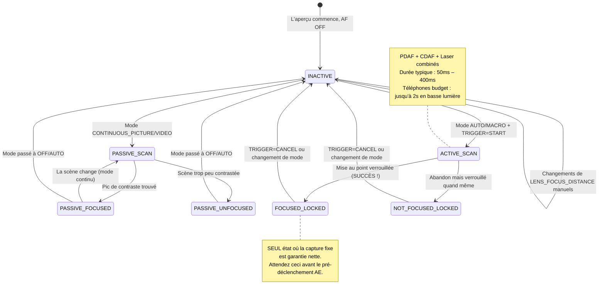

# Chapitre 15 : La mise au point

L'exposition contrôle la luminosité. **La mise au point contrôle ce qui est net.** Une photo parfaitement exposée avec une mise au point floue est une photo ratée. Dans ce chapitre, vous apprendrez comment fonctionnent les systèmes de mise au point des smartphones, comment piloter la mise au point automatique (AF) de manière fiable via Camera2, et comment implémenter un curseur de mise au point manuelle fluide en utilisant `LENS_FOCUS_DISTANCE`.

L'application [Android Camera Parameters](https://github.com/zoozooll/AndroidCameraParameters) illustre tout cela dans son panneau Focus — vous pouvez observer les transitions de la machine à états AF en direct et faire glisser le curseur de mise au point manuelle pour voir l'objectif passer de l'infini à la distance de mise au point minimale.

---

## La mise au point automatique (AF) dans les smartphones modernes

Avant de plonger dans les spécificités de l'API, comprenons les trois mécanismes physiques de mise au point utilisés par les smartphones.

### 1. AF par détection de contraste (CDAF) — Balayage passif

La technique logicielle : analyser l'image, rechercher le contraste maximal des bords (bords nets = fréquence spatiale la plus élevée) et déplacer l'objectif jusqu'à ce que le pic de contraste soit trouvé.

- **Avantage :** Fonctionne sur n'importe quel matériel de caméra (pas de pixels spéciaux nécessaires)
- **Désavantage :** Lent. L'objectif doit effectuer un *pompage* (recherche) d'avant en arrière sur toute la plage de mise au point. Les états comme "AF SCANNING" dans Camera2 correspondent à cela.

### 2. AF par détection de phase (PDAF) — Balayage actif

Des photodiodes spéciales sur le capteur sont divisées en deux moitiés. La différence de phase entre les moitiés gauche et droite mesure directement *à quelle distance et dans quelle direction* l'objectif doit se déplacer — pas de pompage nécessaire. Les téléphones fleurons actuels utilisent le Dual-Pixel PDAF où *chaque* pixel effectue la détection de phase.

- **Avantage :** Extrêmement rapide (verrouillage < 100ms en bonne lumière) ; fonctionne de manière fiable en vidéo
- **Désavantage :** Difficulté en basse lumière (pas assez de photons pour calculer la phase de manière fiable) et limites de distance de mise au point minimale.

### 3. AF Laser / ToF (Actif) — Télémètre

Un module matériel dédié émet une impulsion laser infrarouge, mesure le temps de réflexion et rapporte directement la distance du sujet à l'ISP. Très courant sur les téléphones de milieu à haut de gamme.

- **Avantage :** Verrouillage ultra-rapide sur n'importe quelle cible, même dans l'obscurité totale (si la cible réfléchit les IR)
- **Désavantage :** Portée effective limitée (~50cm–5m max), échoue sur le verre ou les objets transparents aux IR.

Les téléphones réels combinent **les trois** : PDAF pour un verrouillage grossier rapide, CDAF pour l'ajustement fin, et AF Laser pour les scènes en basse lumière ou en gros plan. Camera2 expose ce pipeline unifié comme une machine à états abstraite unique.

---

## Modes AF : CONTROL_AF_MODE

Camera2 définit ces modes AF dans `CameraMetadata` :

| Mode (CONTROL_AF_MODE_*) | Comportement | Cas d'utilisation |
|-------------------------|--------------|-------------------|
| `OFF` | Pas d'AF du tout. Vous réglez `LENS_FOCUS_DISTANCE` manuellement. | Mise au point manuelle, focus stacking, astrophotographie (verrouillage à l'infini) |
| `AUTO` | AF ponctuel. Ne fait rien jusqu'à l'envoi de `CONTROL_AF_TRIGGER = START`, puis effectue un balayage et se verrouille. | Photographie fixe classique de type visée-déclenchement |
| `MACRO` | Identique à AUTO mais optimisé pour la détection de sujets proches. | Gros plans, numérisation de documents, "mode cuisine" |
| `CONTINUOUS_PICTURE` | Recalcule constamment la mise au point, mais **met en pause le recalage lors d'une capture fixe** pour éviter un décalage pendant la prise de vue. | Par défaut pour la photographie fixe |
| `CONTINUOUS_VIDEO` | Recalcule constamment la mise au point — ne s'arrête jamais. Peut pomper de manière visible mais maintient la vidéo nette. | Enregistrement vidéo, appels vidéo |
| `EDOF` | Profondeur de champ étendue : mise au point profonde simulée par logiciel/firmware. Pas de mouvement physique de l'objectif. | Appareils d'entrée de gamme sans actionneurs d'objectif mobiles |

**Deux notes critiques :**

1. Les appareils `EDOF` (téléphones bon marché, caméras selfie) ont un plan focal *fixe*. Vous n'obtiendrez jamais `FOCUSED_LOCKED` de leur part — le mieux que vous aurez est `PASSIVE_SCAN` → `PASSIVE_FOCUSED` → `INACTIVE`. L'application [Android Camera Parameters](https://play.google.com/store/apps/details?id=com.minininja.cameraparams) indique explicitement "Mise au point fixe" pour ces caméras.

2. Les modes `CONTINUOUS_*` reviennent à `INACTIVE` après une période d'inactivité plutôt que de rester verrouillés. Ne vous attendez pas à `FOCUSED_LOCKED` en mode continu — c'est réservé à `AUTO`/`MACRO` + déclencheur explicite.

---

## La machine à états AF

Camera2 rapporte l'état de l'AF via `CaptureResult.CONTROL_AF_STATE`. Comprendre ces états est *primordial* pour des séquences de capture fixes fiables.



Tableau de référence des états :

| CONTROL_AF_STATE | Signification | Action suivante |
|------------------|---------------|-----------------|
| `INACTIVE` (0) | AF éteint, inactif ou mode continu ne balayant pas actuellement | Si en mode AUTO : envoyer TRIGGER_START |
| `PASSIVE_SCAN` (1) | Le mode continu effectue un balayage passif | Attendre ; ne pas déclencher la capture fixe encore |
| `PASSIVE_FOCUSED` (2) | Le mode continu a trouvé la mise au point, mais n'est PAS verrouillé | Sûr de déclencher en CONTINUOUS_PICTURE (il se verrouillera) |
| `ACTIVE_SCAN` (3) | Un déclencheur explicite a lancé un balayage | Attendre... |
| `NOT_FOCUSED_LOCKED` (4) | Échec de la mise au point, mais l'objectif est quand même verrouillé | Avertissement utilisateur ; capture quand même ou nouvel essai optionnel |
| `FOCUSED_LOCKED` (5) | **SUCCÈS.** Mise au point trouvée et verrouillée matériellement. | Passer immédiatement au pré-déclenchement AE |
| `PASSIVE_UNFOCUSED` (6) | Le mode continu n'a pas pu se verrouiller, balayage en cours | Améliorer l'éclairage ou changer de cible |

**Règle non négociable pour la photographie fixe :** Ne soumettez *jamais* une capture fixe (surtout avec flash !) tant que vous n'avez pas `FOCUSED_LOCKED`. Sautez cette étape, et vous livrerez une application qui produit par intermittence des photos floues.

---

## Distance de mise au point : Dioptries, pas mètres

Voici le deuxième piège qui surprend les développeurs Camera2 (après les nanosecondes pour l'obturateur) :

**`LENS_FOCUS_DISTANCE` utilise les dioptries (D), pas les mètres.** Les dioptries sont l'*inverse mathématique* de la distance de mise au point :

```
Distance de mise au point (mètres) = 1.0 / Dioptries
Dioptries = 1.0 / Distance de mise au point (mètres)
```

| Dioptries (LENS_FOCUS_DISTANCE) | Distance de mise au point physique |
|--------------------------------|-----------------------------------|
| **0.0** | **Infini** (∞) — étoiles, montagnes lointaines |
| 0.1 | 10 mètres |
| 0.25 | 4 mètres |
| 0.5 | 2 mètres |
| 1.0 | 1 mètre |
| 2.0 | 0,5 mètre (50 cm) |
| 5.0 | 0,2 mètre (20 cm) |
| 10.0 | 0,1 mètre (10 cm) |
| 20.0 | 0,05 mètre (5 cm) |

Pourquoi les dioptries ? Parce que l'actionneur de l'objectif se déplace linéairement avec la *puissance optique*, pas la distance physique. Un balayage de 0.0D → 20.0D correspond à un mouvement uniforme de l'objectif, alors qu'un balayage en "mètres" de 10m → 5cm serait très non linéaire.

### Interroger la distance de mise au point minimale

Chaque objectif a une distance de mise au point la plus proche (vous ne pouvez pas faire la mise au point sur un objet collé à la vitre). Interrogez-la :

```kotlin
// Valeur de dioptrie utile maximale pour cet objectif
val maxDiopters = characteristics.get(
    CameraCharacteristics.LENS_INFO_MINIMUM_FOCUS_DISTANCE
) ?: 0.0f // 0.0f = objectif EDOF à mise au point fixe (pas de contrôle !)

if (maxDiopters == 0.0f) {
    Log.w("Focus", "Ceci est un objectif à mise au point fixe. AF manuel désactivé.")
} else {
    // La plage de dioptries valide est [0.0f .. maxDiopters]
    Log.d("Focus", "Plage de mise au point : 0.0D (inf) → $maxDiopters D (${1/maxDiopters}m près)")
}
```

Valeurs typiques :
- Caméra arrière téléphone budget : ~10D (10 cm min)
- Caméra large fleuron : ~15–25D (4–7 cm min)
- Caméra macro : ~30–50D (2–3 cm min)
- Caméra selfie frontale : Souvent 0.0D (mise au point fixe, EDOF)

### Distance hyperfocale (Concept)

Les photographes de paysages adorent ceci : réglez la mise au point sur la **distance hyperfocale**, et tout, de la moitié de cette distance à l'infini, est "acceptablement net". Sur un téléphone avec une ouverture f/1.8 et un objectif large standard, l'hyperfocale est d'environ 0,5 à 1,0 mètre.

**Règle de base pour smartphones :** Régler `LENS_FOCUS_DISTANCE = 2.0D` (distance de 50 cm) approxime l'hyperfocale sur la plupart des objectifs larges de téléphone. Utile pour le paysage et la photographie de rue quand on ne veut pas attendre l'AF.

```kotlin
// Préréglage hyperfocal approximatif "tout est net"
const val HYPERFOCAL_DIOPTERS_APPROX = 2.0f

fun setHyperfocal(builder: CaptureRequest.Builder, characteristics: CameraCharacteristics) {
    val maxD = characteristics.get(
        CameraCharacteristics.LENS_INFO_MINIMUM_FOCUS_DISTANCE
    ) ?: 0.0f
    val diopters = min(HYPERFOCAL_DIOPTERS_APPROX, maxD.takeIf { it > 0 } ?: 0.0f)
    builder.set(CaptureRequest.CONTROL_AF_MODE, CameraMetadata.CONTROL_AF_MODE_OFF)
    builder.set(CaptureRequest.LENS_FOCUS_DISTANCE, diopters)
}
```

Vous voulez calculer l'hyperfocale précise pour votre objectif exact ? Vous aurez également besoin de `LENS_INFO_AVAILABLE_FOCAL_LENGTHS` (focale en mm) et de la taille physique des pixels du capteur. Pour 95 % des usages sur smartphone, 2.0D est assez proche.

---

## Exemple complet 1 : Séquence AF ponctuelle déclenchement-capture

C'est le flux standard pour la photographie fixe en mode `AUTO` / `MACRO`. C'est aussi la séquence exacte que l'orchestration 3A du chapitre 17 réutilisera.

**Objectif :** L'utilisateur appuie sur "Capturer" → piloter l'AF jusqu'au verrouillage → une fois verrouillé, soumettre la capture fixe.

```kotlin
class AutoFocusCaptureHelper(
    private val characteristics: CameraCharacteristics,
    private val captureSession: CameraCaptureSession,
    private val previewSurface: Surface,
    private val jpegReaderSurface: Surface
) {
    private var afTriggered = false
    private var capturePlanned = false

    fun triggerAutoFocusAndCapture(onCaptureComplete: () -> Unit) {
        // ---- ÉTAPE 1 : Construire la requête répétée avec déclencheur AF explicite ----
        val triggerRequest = captureSession.device.createCaptureRequest(
            CameraDevice.TEMPLATE_PREVIEW
        ).apply {
            addTarget(previewSurface)

            // Utiliser le mode AUTO pour garantir l'état LOCKED à la fin
            set(CaptureRequest.CONTROL_AF_MODE,
                CameraMetadata.CONTROL_AF_MODE_AUTO)

            // Déclencher le balayage AF ponctuel MAINTENANT
            set(CaptureRequest.CONTROL_AF_TRIGGER,
                CameraMetadata.CONTROL_AF_TRIGGER_START)
        }

        afTriggered = true
        capturePlanned = true

        // ---- ÉTAPE 2 : S'abonner à notre rappel de suivi d'état ----
        captureSession.setRepeatingRequest(
            triggerRequest.build(),
            object : CameraCaptureSession.CaptureCallback() {
                override fun onCaptureCompleted(
                    session: CameraCaptureSession,
                    request: CaptureRequest,
                    result: TotalCaptureResult
                ) {
                    val afState = result.get(CaptureResult.CONTROL_AF_STATE)
                        ?: return
                    Log.d("AF", "État AF : $afState")

                    when (afState) {
                        // --- CHEMIN DU SUCCÈS ---
                        CaptureResult.CONTROL_AF_STATE_FOCUSED_LOCKED -> {
                            if (capturePlanned) {
                                capturePlanned = false
                                submitStillCapture()
                                onCaptureComplete()
                            }
                        }
                        // --- CHEMIN DE L'ÉCHEC : n'a pas pu verrouiller, mais on essaie quand même ---
                        CaptureResult.CONTROL_AF_STATE_NOT_FOCUSED_LOCKED -> {
                            Log.w("AF", "L'AF n'a pas pu se verrouiller — capture quand même (flou ?)")
                            if (capturePlanned) {
                                capturePlanned = false
                                submitStillCapture()
                                onCaptureComplete()
                            }
                        }
                        // --- TOUJOURS EN COURS DE BALAYAGE : ignorer ---
                        CaptureResult.CONTROL_AF_STATE_ACTIVE_SCAN,
                        CaptureResult.CONTROL_AF_STATE_PASSIVE_SCAN -> {
                            // Travail en cours, ne rien faire encore
                        }
                    }
                }
            },
            null // Handler sur le thread actuel
        )
    }

    private fun submitStillCapture() {
        val stillRequest = captureSession.device.createCaptureRequest(
            CameraDevice.TEMPLATE_STILL_CAPTURE
        ).apply {
            addTarget(previewSurface)
            addTarget(jpegReaderSurface)

            // Maintenir l'AF verrouillé pour ce cliché — ne pas encore relâcher le déclencheur
            set(CaptureRequest.CONTROL_AF_MODE,
                CameraMetadata.CONTROL_AF_MODE_AUTO)
            // AF_TRIGGER reste tel quel (START reste jusqu'à un CANCEL explicite)

            set(CaptureRequest.JPEG_QUALITY, 95)
        }

        captureSession.capture(
            stillRequest.build(),
            object : CameraCaptureSession.CaptureCallback() {
                override fun onCaptureCompleted(
                    session: CameraCaptureSession,
                    request: CaptureRequest,
                    result: TotalCaptureResult
                ) {
                    // Photo capturée — maintenant relâcher le verrouillage AF, retour au continu
                    resetFocusToContinuous()
                }
            },
            null
        )
    }

    private fun resetFocusToContinuous() {
        val resumePreview = captureSession.device.createCaptureRequest(
            CameraDevice.TEMPLATE_PREVIEW
        ).apply {
            addTarget(previewSurface)
            set(CaptureRequest.CONTROL_AF_MODE,
                CameraMetadata.CONTROL_AF_MODE_CONTINUOUS_PICTURE)
            set(CaptureRequest.CONTROL_AF_TRIGGER,
                CameraMetadata.CONTROL_AF_TRIGGER_CANCEL)
        }
        afTriggered = false
        captureSession.setRepeatingRequest(resumePreview.build(), null, null)
    }
}
```

**Détail critique :** Vous annulez le déclencheur *après* la fin de la capture fixe — pas avant. Annulez-le trop tôt, et l'objectif se déverrouille pendant la prise de vue, produisant une photo floue.

**Sécurité de temporisation (non montrée) :** Les applications réelles ajoutent une temporisation de 2-3 secondes sur le balayage AF. Si `ACTIVE_SCAN` dure 3 secondes sans jamais atteindre `FOCUSED_LOCKED`, annulez et affichez un conseil à l'utilisateur : "Appuyez pour faire la mise au point sur une zone contrastée".

---

## Exemple complet 2 : Curseur SeekBar de mise au point manuelle

C'est la fonctionnalité de mise au point manuelle que vous avez vue dans les applications caméra pro. Un SeekBar mappe uniformément la plage physique 0.0D → maxD.

### Mise en page (res/layout/fragment_manual_focus.xml)

```xml
<LinearLayout
    xmlns:android="http://schemas.android.com/apk/res/android"
    android:layout_width="match_parent"
    android:layout_height="wrap_content"
    android:orientation="vertical"
    android:padding="16dp">

    <TextView
        android:id="@+id/tvFocusLabel"
        android:layout_width="match_parent"
        android:layout_height="wrap_content"
        android:text="Mise au point : ∞ (infini)"
        android:textSize="14sp"/>

    <SeekBar
        android:id="@+id/seekFocus"
        android:layout_width="match_parent"
        android:layout_height="wrap_content"
        android:max="1000"/>
</LinearLayout>
```

### Kotlin : Câblage Fragment / Activity

```kotlin
class ManualFocusController(
    private val seekBar: SeekBar,
    private val labelView: TextView,
    private val characteristics: CameraCharacteristics,
    private val captureSessionProvider: () -> CameraCaptureSession?,
    private val previewSurface: Surface
) {
    // Le curseur utilise 1000 étapes entières pour une précision sous-dioptrique
    private val sliderSteps = 1000
    private val maxDiopters = characteristics.get(
        CameraCharacteristics.LENS_INFO_MINIMUM_FOCUS_DISTANCE
    ) ?: 0.0f

    private var currentDiopters = 0.0f

    init {
        if (maxDiopters == 0.0f) {
            seekBar.isEnabled = false
            labelView.text = "Mise au point fixe (Pas d'AF manuel)"
        } else {
            bindSeekBar()
            applyFocus(0.0f) // Commencer à l'infini
        }
    }

    private fun bindSeekBar() {
        // Convertir curseur int [0..1000] ↔ dioptries [0.0 .. maxDiopters]
        seekBar.setOnSeekBarChangeListener(object : SeekBar.OnSeekBarChangeListener {
            private var lastUpdate = 0L

            override fun onProgressChanged(seekBar: SeekBar, progress: Int, fromUser: Boolean) {
                if (!fromUser) return

                // Limiter à ~30fps (33ms) — évite de submerger le HAL de requêtes
                val now = SystemClock.elapsedRealtime()
                if (now - lastUpdate < 33L) return
                lastUpdate = now

                val diopters = progress.toFloat() / sliderSteps.toFloat() * maxDiopters
                applyFocus(diopters)
            }
            override fun onStartTrackingTouch(seekBar: SeekBar) {
                // Passer en mode AF manuel complet dès que l'utilisateur commence à faire glisser
                switchToManualMode()
            }
            override fun onStopTrackingTouch(seekBar: SeekBar) {
                // Appliquer la valeur exacte finale pour supprimer l'erreur de limitation
                val diopters = seekBar.progress.toFloat() / sliderSteps.toFloat() * maxDiopters
                applyFocus(diopters, force = true)
            }
        })
    }

    private fun switchToManualMode() {
        // CONTROL_AF_MODE_OFF désactive l'entraînement auto du moteur AF
        val session = captureSessionProvider() ?: return
        val request = session.device.createCaptureRequest(
            CameraDevice.TEMPLATE_PREVIEW
        ).apply {
            addTarget(previewSurface)
            set(CaptureRequest.CONTROL_AF_MODE, CameraMetadata.CONTROL_AF_MODE_OFF)
            set(CaptureRequest.CONTROL_MODE, CameraMetadata.CONTROL_MODE_USE_SCENE_MODE)
        }
        session.setRepeatingRequest(request.build(), null, null)
    }

    fun applyFocus(diopters: Float, force: Boolean = false) {
        currentDiopters = diopters.coerceIn(0.0f, maxDiopters)

        // Mettre à jour l'étiquette : afficher "∞" pour < 0.1D, "X.Y m" sinon
        labelView.text = when {
            currentDiopters < 0.1f -> "Mise au point : ∞ (infini)"
            else -> {
                val meters = 1.0f / currentDiopters
                String.format("Mise au point : %.1f D  (%.2f m)", currentDiopters, meters)
            }
        }

        // Construire et soumettre une requête répétée avec la nouvelle distance
        val session = captureSessionProvider() ?: return
        val request = session.device.createCaptureRequest(
            CameraDevice.TEMPLATE_PREVIEW
        ).apply {
            addTarget(previewSurface)
            set(CaptureRequest.CONTROL_AF_MODE, CameraMetadata.CONTROL_AF_MODE_OFF)
            set(CaptureRequest.LENS_FOCUS_DISTANCE, currentDiopters)
        }

        // Utiliser setRepeatingRequest pour que chaque image d'aperçu respecte la nouvelle mise au point
        session.setRepeatingRequest(request.build(), null, null)
    }

    // --- Aides pour les préréglages ---
    fun setInfinity() { seekBar.progress = 0; applyFocus(0.0f, true) }
    fun setHyperfocalApprox() {
        val d = min(2.0f, maxDiopters)
        seekBar.progress = (d / maxDiopters * sliderSteps).toInt()
        switchToManualMode()
        applyFocus(d, true)
    }
    fun setNearest() { seekBar.progress = sliderSteps; applyFocus(maxDiopters, true) }
}
```

**Détails clés de l'implémentation :**

1. **Limitation (Throttle).** Les SeekBar déclenchent `onProgressChanged` jusqu'à 200Hz. Soumettre un `setRepeatingRequest` à chaque événement inonde le HAL, causant du retard. Une limite de 33ms plafonne les mises à jour à ~30fps — ce qui est largement assez fluide pour la vitesse physique du moteur de l'objectif.

2. **Passer à CONTROL_AF_MODE_OFF tôt.** Si vous êtes en `CONTINUOUS_PICTURE` et réglez `LENS_FOCUS_DISTANCE` sans désactiver l'AF, l'algorithme AF va *lutter contre vous* — ramenant la mise au point sur ce qu'il pense être juste une image plus tard. Le changement doit avoir lieu en premier, dans `onStartTrackingTouch`.

3. **Mise à jour via `setRepeatingRequest`**, pas via `capture()` ponctuel. La mise au point manuelle doit rester sur *chaque* image d'aperçu jusqu'à ce que l'utilisateur déplace à nouveau le curseur.

4. **Application forcée au relâchement.** La limitation saute des positions intermédiaires ; quand l'utilisateur lève le doigt, appliquez la valeur finale exacte du curseur.

---

## Régions de mise au point (Appuyer pour faire le point)

Les applications caméra modernes vous permettent d'*appuyer sur le viseur* pour choisir une cible de mise au point. Camera2 implémente cela via `CONTROL_AF_REGIONS` — une liste de rectangles (dans l'espace de coordonnées de la matrice active) avec des poids.

```kotlin
// Convertir un appui (x,y) sur le viseur en une région de coordonnées du capteur CameraCharacteristics
fun createTapFocusRegion(viewfinderWidth: Int, viewfinderHeight: Int,
                         tapX: Float, tapY: Float,
                         characteristics: CameraCharacteristics): MeteringRectangle {
    val activeArray = characteristics.get(
        CameraCharacteristics.SENSOR_INFO_ACTIVE_ARRAY_SIZE
    )!!
    // Normaliser l'appui [0..1] sur chaque axe
    val nx = tapX / viewfinderWidth.toFloat()
    val ny = tapY / viewfinderHeight.toFloat()
    // Mapper à la matrice active du capteur, créer une région de 200x200 centrée sur l'appui
    val cx = (nx * activeArray.width()).toInt()
    val cy = (ny * activeArray.height()).toInt()
    val rSize = 200
    return MeteringRectangle(
        max(0, cx - rSize/2), max(0, cy - rSize/2),
        rSize, rSize,
        MeteringRectangle.METERING_WEIGHT_MAX
    )
}

// Attacher la région à un constructeur de requête
fun applyTapFocus(builder: CaptureRequest.Builder, region: MeteringRectangle) {
    builder.set(CaptureRequest.CONTROL_AF_REGIONS, arrayOf(region))
    builder.set(CaptureRequest.CONTROL_AE_REGIONS, arrayOf(region)) // Coupler aussi la zone AE !
    builder.set(CaptureRequest.CONTROL_AF_TRIGGER,
        CameraMetadata.CONTROL_AF_TRIGGER_CANCEL) // Annuler tout verrouillage préalable
    builder.set(CaptureRequest.CONTROL_AF_TRIGGER,
        CameraMetadata.CONTROL_AF_TRIGGER_START)  // Déclencher le balayage sur la nouvelle région
}
```

**Conseil de pro :** Couplez toujours `CONTROL_AE_REGIONS` pour correspondre à `CONTROL_AF_REGIONS`. L'utilisateur a appuyé sur un visage parce qu'il veut ce visage *à la fois* net ET correctement exposé — pas net mais mesuré sur le ciel lumineux derrière lui.

---

## Dépannage des problèmes de mise au point

| Symptôme | Cause racine | Solution |
|----------|--------------|----------|
| L'état AF ne dépasse jamais ACTIVE_SCAN | Scène peu contrastée (mur blanc, ciel bleu pur) ou défaillance matérielle | Temporisation après ~3s ; avertir l'utilisateur ; repli sur préréglage hyperfocal |
| Le curseur de mise au point manuelle ne fait rien | Oubli de régler `CONTROL_AF_MODE = OFF` → l'AF lutte contre vous | Appeler `switchToManualMode()` dans onStartTrackingTouch |
| La capture fixe est floue malgré FOCUSED_LOCKED | Déclencheur AF annulé *avant* la fin de la capture fixe | Annuler seulement dans `onCaptureCompleted` de la requête *fixe* |
| La caméra frontale ignore les commandes de mise au point | Objectif EDOF à mise au point fixe (`MINIMUM_FOCUS_DISTANCE == 0`) | Dégradation gracieuse : désactiver l'interface de mise au point pour cette caméra |
| L'AF vidéo "pompe" beaucoup | Utilisation de `CONTINUOUS_PICTURE` au lieu de `CONTINUOUS_VIDEO` | Passer en mode CONTINUOUS_VIDEO au démarrage de MediaRecorder |

---

## Résumé

La mise au point dans Camera2 est une machine à états que vous devez piloter explicitement, pas un simple réglage "définir et oublier" :

- **Matériel AF :** Les smartphones combinent l'AF par détection de contraste, l'AF par détection de phase (Dual-Pixel) et l'AF Laser pour des verrouillages rapides et fiables.
- **Modes :** `AUTO` (ponctuel, se verrouille), `CONTINUOUS_PICTURE` (recalage, pause pour les clichés), `CONTINUOUS_VIDEO` (recalage permanent), `MACRO`, `OFF` (manuel). Les objectifs EDOF n'ont pas de mise au point mobile.
- **États :** Attendez `FOCUSED_LOCKED` (pas seulement `PASSIVE_FOCUSED`) avant les captures fixes importantes.
- **Dioptries :** `LENS_FOCUS_DISTANCE` utilise l'inverse de la distance (0.0D = ∞, 10D = 10 cm). La plage est `[0.0 .. LENS_INFO_MINIMUM_FOCUS_DISTANCE]`.
- **Capture AF ponctuelle :** `TRIGGER = START` → attendre `FOCUSED_LOCKED` → soumettre cliché → puis `CANCEL`.
- **Curseur manuel :** SeekBar avec 1000 étapes, limitée à 30fps ; passez d'abord en mode `AF_MODE_OFF` pour que l'algorithme auto ne lutte pas contre votre réglage manuel.
- **L'appui pour la mise au point utilise `CONTROL_AF_REGIONS`** dans les coordonnées de la matrice active du capteur. Couplez avec `AE_REGIONS` pour des résultats pro.

## Et ensuite ?

Luminosité ✓ Netteté ✓. Maintenant, occupons-nous de la **couleur**. Dans le **Chapitre 16 : Balance des blancs et couleur**, nous aborderons :

- La balance des blancs automatique (AWB) et les 7 préréglages (Incandescent → Ombre)
- La correction manuelle des couleurs avec `COLOR_CORRECTION_GAINS` (4 canaux R/G/B/G) et `COLOR_CORRECTION_TRANSFORM` (matrice RVB 3x3)
- Le concept de température de couleur (bougie 2000K → ombre 10000K) et comment il se mappe à la balance des blancs
- Code fonctionnel pour un préréglage de "ton chaud coucher de soleil" et un mode AWB off manuel complet

La couleur est le dernier volet de la trilogie des contrôles manuels.
